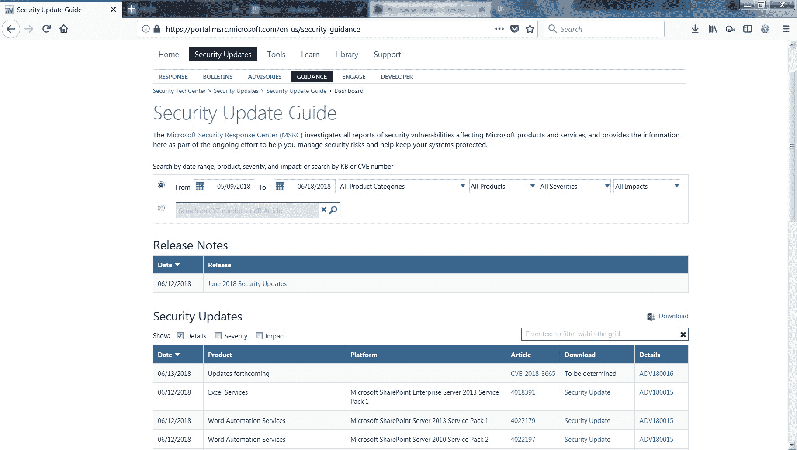
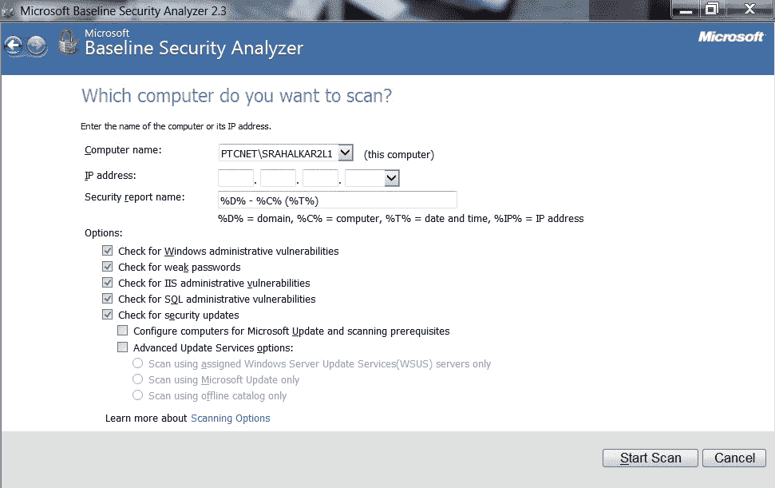
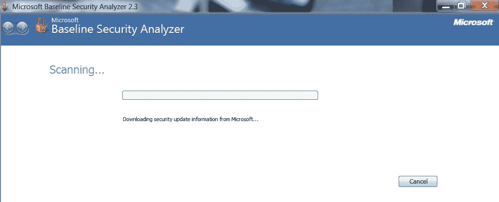
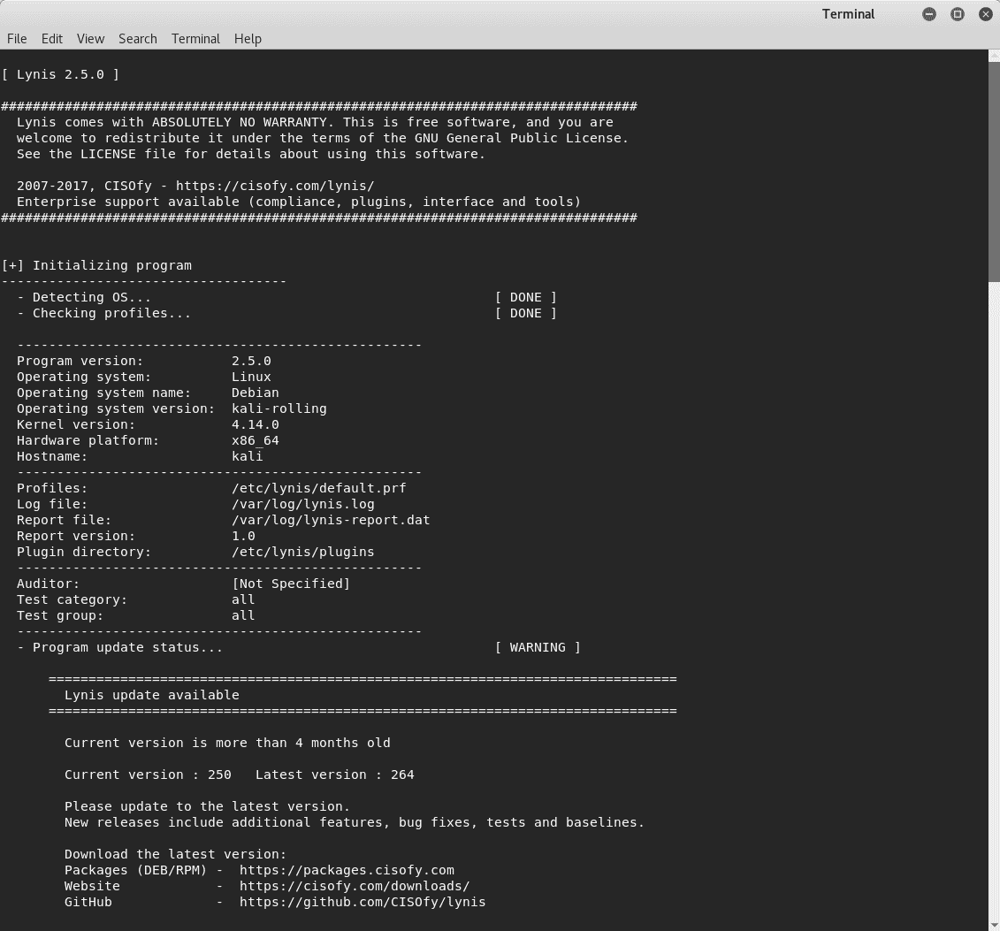
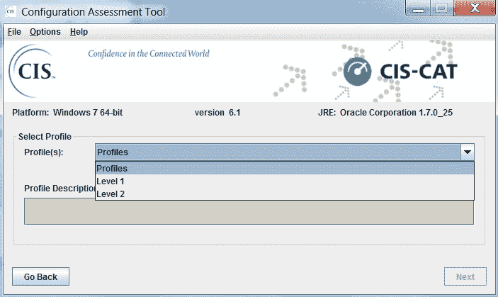
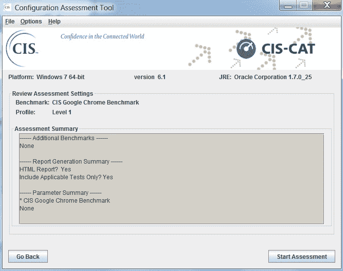
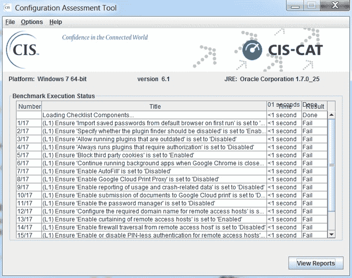

# 第二十章：补丁和安全加固

本章是关于理解补丁和安全加固的各个方面。您将了解补丁的重要性，以及在目标系统上枚举补丁级别的实际技术，并制定加固基础设施安全的安全配置指南。

在本章中，我们将学习以下主题：

+   定义补丁

+   Windows 和 Linux 上的补丁枚举

+   安全加固和安全配置审查简介

+   利用**互联网安全中心**（**CIS**）的加固基准

# 定义补丁？

通常，一款软件经过整个 SDLC 的开发后，然后公开发布。我们通常假设它将满足所有功能要求，并且能够抵御潜在的威胁。然而，可能是软件中的某些功能被错误地破坏，从而允许攻击者利用潜在的漏洞。现在，一旦确切的问题被发现，供应商会尽快修补受影响的软件组件。

一旦补丁准备就绪，它将通过官方渠道分发给所有客户。但是，客户需要确保他们的系统上应用了正确和最新的补丁。如果未能这样做，系统将容易受到严重威胁。这就需要一种系统化的方法来管理补丁。

最常见的漏洞是由各种软件组件中缺少的补丁导致的。因此，如果我们主动管理系统上的补丁，那么最常见的漏洞将得到解决。

补丁管理是一个明确定义和组织良好的过程，有助于在现有系统上识别、测试和应用各种补丁。

# 补丁枚举

为了知道任何给定系统需要应用哪些补丁，首先重要的是要知道该系统当前运行的软件版本以及其当前的补丁级别。补丁枚举是评估任何给定系统当前补丁级别的过程。一旦知道了当前的补丁级别，就可以计划和应用进一步的补丁更新。

# Windows 补丁枚举

随着大量受欢迎和广泛使用的产品，微软经常向其客户发布补丁更新。微软通常在每个月的第二个星期二发布补丁。以下截图显示了微软补丁更新站点上有关最新补丁发布的信息：

在没有集中的补丁管理系统的情况下，可以从前面截图中显示的门户网站上单独下载并应用微软补丁。

在计划更新之前，了解系统上补丁的当前状态是至关重要的。为了使这项任务更容易，微软提供了一个名为**Microsoft Baseline Security Analyzer**（**MBSA**）的实用程序。可以从[`www.microsoft.com/en-in/download/details.aspx?id=7558`](https://www.microsoft.com/en-in/download/details.aspx?id=7558)下载该实用程序。

以下截图显示了 MBSA 的启动屏幕：

我们可以选择“扫描计算机”选项并继续到下一个屏幕，如下截图所示。然后我们可以通过指定远程 IP 地址来扫描本地系统或远程系统。我们还可以选择将什么作为我们评估的一部分：

单击“开始扫描”后，MBSA 开始在预定义的目标上运行评估，如下截图所示：

扫描完成后，MBSA 会向我们呈现详细的发现报告，如下截图所示：

根据报告中的发现，我们可以决定通过应用缺失的补丁和设置来进行缓解。

# Linux 补丁枚举

在前面的部分中，我们看到了 MBSA 如何用于评估任何 Microsoft 系统的安全性和补丁级别。我们也可以对 Linux 系统进行类似的评估。为了在 Linux 系统上执行安全性和补丁枚举，我们可以使用一个名为**Lynis**的工具，可以在[`cisofy.com/lynis/`](https://cisofy.com/lynis/)找到。

Lynis 是一个全面的工具，可以有效用于安全审计、合规性测试、漏洞检测和系统加固。它可以在几乎所有基于 UNIX 的系统上运行。虽然它在某些 Linux 发行版中预装，比如 Kali Linux，但你可能需要在其他 Linux 版本上单独安装它；请注意以下截图：

一旦 Lynis 完成所有测试，将在位置`/var/log/lynis.log`生成详细报告。报告包含对所评估系统的安全健康检查的所有信息。

# 安全加固和安全配置审查

当我们在网络浏览器中看到一个应用程序运行时，那只是冰山一角。支持应用程序的是大量的基础架构，通常包括 Web 服务器、数据库服务器、操作系统等。因此，即使最终应用程序非常安全，基础架构组件可能存在漏洞，允许攻击者 compromise 系统。这就是安全加固的作用所在。

为了保护完整的应用程序生态系统，包括基础架构，必须对所有参与的组件进行安全配置审查，并相应地加固安全。实现这一点的简单方法可能是查看每个组件的配置文件，然后配置与安全相关的项目。另一种更好的方法可能是使用行业标准基准进行安全配置。**互联网安全中心**（CIS）为各种平台提供安全基准。这些基准经过充分研究和测试。

# 使用 CIS 基准

CIS 为各种平台提供安全基准，如服务器、操作系统、移动设备、浏览器等。有两种方法可以使用 CIS 基准：

+   从[`www.cisecurity.org/cis-benchmarks/`](https://www.cisecurity.org/cis-benchmarks/)单独下载所需平台的基准，然后根据基准手动验证配置。

+   使用自动化工具对目标平台进行 CIS 基准评估，比如 CIS CAT 工具。CIS CAT 工具可以从[`learn.cisecurity.org/cis-cat-landing-page`](https://learn.cisecurity.org/cis-cat-landing-page)获取。

CIS CAT 工具的免费版本仅支持有限数量的基准评估，而专业版本允许评估所有可用的 CIS 基准。

以下截图显示了 CIS CAT 工具的启动屏幕：

我们选择 CIS Google Chrome 基准进行评估。然后我们需要选择我们需要包括在评估中的配置文件，如下图所示。Level 1 配置文件通常包含最重要和最基本的需要评估的检查，而 Level 2 配置文件包含根据上下文可以选择的检查： 

现在我们选择输出格式和我们想要生成报告的位置，如下图所示：

现在我们可以查看我们的评估摘要，然后按照下图所示启动扫描。

一旦我们开始评估，CIS CAT 工具将运行所有预定义的与 Chrome 相关的检查，如下截图所示：

评估完成后，CIS CAT 工具会显示哪些检查通过了，哪些失败了，如下截图所示。此外，还会在预先配置的目录中生成 HTML 格式的详细报告：

# 摘要

在本章中，我们了解了修补的相关性以及安全配置如何有助于保护应用程序生态系统。在下一章中，我们将学习报告的各个方面，以及安全指标的重要性。
