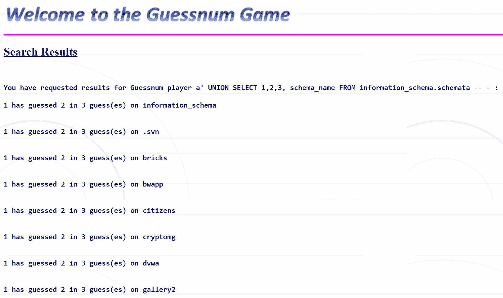

# 第二章：操作 SQL – 利用 SQL 注入

在更一般地讨论**结构化查询语言**（**SQL**）及其特点和特性之后，我们现在将更多地聚焦于本书的核心内容：注入漏洞。我们已经在更广泛的意义上了解了 SQL 注入是什么，并且简要介绍了它可能带来的影响，以及为什么它是一个严重的安全问题。

在本章中，作为上一章的延续，我们继续采用理论方法，进一步接触 SQL 注入攻击的实际应用方面。本章实际上包括了触发 SQL 注入的输入字符串示例，这些示例可以用于多种不同的目的。

本章将为实践部分奠定基础，实践部分将专注于在受控环境中执行 SQL 注入攻击，将我们在本部分所学应用到实际操作中。

在讨论了 SQL 语法的 SQL 注入后，本章还将描述非关系型数据库中的注入漏洞。

本章将涵盖以下主题：

+   **可利用的 SQL 命令与语法**：我们将重点介绍最容易被滥用的 SQL 命令和语法结构，这些可能被用来实施 SQL 注入攻击。

+   **常见的 SQL 注入命令与操作**：概述主要的 SQL 攻击技术，展示攻击者使用的实际命令及其对应用程序或系统可能产生的影响。

+   **不仅仅是 SQL 注入：非关系型数据库**：简要介绍非关系型数据库的背景。

+   **非关系型数据库中的注入漏洞**：解释 SQL 注入在非关系型环境中的影响，展示一些可能的攻击技术。

+   **总结：（非）SQL 注入理论**：对本书理论部分的最终回顾，以巩固主要主题，并以更大的信心进入实践部分。

# 技术要求

对于本章，我们建议你熟悉 SQL 及其主要命令。如果你还没有这样做，建议先阅读上一章的 SQL 技术文档，文档可以通过以下链接获取：

+   [`dev.mysql.com/doc/refman/8.0/en/`](https://dev.mysql.com/doc/refman/8.0/en/)

+   [`docs.oracle.com/en/database/oracle/oracle-database/index.html`](https://docs.oracle.com/en/database/oracle/oracle-database/index.html)

+   [`docs.microsoft.com/en-us/sql/sql-server/?view=sql-server-ver15`](https://docs.microsoft.com/en-us/sql/sql-server/?view=sql-server-ver15)

# 可利用的 SQL 命令和语法

我们已经看到，使应用程序和系统容易受到 SQL 注入攻击的主要问题是缺乏对用户输入的控制。默认情况下，输入源需要被视为不可信，因此必须在处理之前验证所有发送到应用程序或系统的内容。你现在可能会问：*恶意用户到底是如何在我们的代码中插入指令的？* SQL 是一种非常强大的语言，允许对数据库执行多种操作；如果应用程序被欺骗执行任意命令，可能会使想要破坏或访问系统的人获得严重的优势。在本节中，我们将看到 SQL 注入的主要促成因素，并强调正确预处理输入的重要性，从而避免通过一个简单的输入字符串让我们的系统和应用程序遭受攻击。

## 启用 SQL 注入的字符

在处理 SQL 语句和构造之前，我们应首先检查在缺乏输入控制的情况下，为什么能够插入任意指令。

与大多数机器解释语言中的情况类似，SQL 将一些特定字符映射到代码文本中的相应用途。一个人最容易尝试利用的字符是单引号（**'**）或双引号（**"**），因为它们在查询中作为文本值的定界符。

一个例子是分号字符（**;**），它用于分隔不同的命令（与大多数编程语言相同）。

另一个在 SQL 注入中被广泛滥用的字符是注释分隔符，在大多数语法中，它对应于**–**序列，因为它可以使 SQL 查询的下一部分变得无效，系统会将其视为注释。

作为一个普遍的例子，考虑一个用于查询物体颜色的简单`SELECT`语句，普通用户会输入`red`，如以下所示：

SELECT color, shape FROM objects WHERE color='red'

如果插入的文本输入不是`red`，而是以下内容，情况可能会大不相同：

red'; DROP TABLE objects --

这将导致查询看起来像这样：

SELECT color, shape FROM objects WHERE color='red'; DROP TABLE objects –-'

用户提供的输入未经过清理，可能会导致系统在处理使用预期语法的命令时，错误地执行另一个 SQL 命令，完全删除数据库中的`objects`表。添加注释分隔符会自动移除应用程序插入的第二个单引号字符，从而使恶意用户能够在保持语法正确的情况下插入他们想要的任何 SQL 命令。

为了更好地理解在输入未被检查的情况下可能发生的操控程度，我们将看到 SQL 语句通常是如何在应用程序中构造的。

## SQL 语句构造

如前所述，应用程序中最常用的 SQL 语句是 `SELECT` 语句。很多时候，当你遇到一个用于搜索项的 Web 表单时，它会与应用程序中的数据库连接，从而以结构化和可靠的方式访问数据。

想象一个常规的登录表单，由给定的用户名和密码文本输入框组成。应用程序的作用是匹配插入的信息，查看提供的用户名和密码对是否存在于数据库中的同一条记录中（与单个用户关联）。因此，如果结果存在，应用程序就知道该用户有权限访问，并授予必要的权限。

如果我们将 `Overlord` 作为用户名，`pass` 作为密码，那么生成的 `SELECT` 语句将如下所示：

SELECT * FROM users WHERE username='Overlord' AND password='pass'

应用程序将收集到的字符串，存储为变量，作为文本插入到构成查询主体的另一个文本字符串中。当然，这些变量可以通过各种方式在 Web 环境中获取（作为 **超文本传输协议**（**HTTP**）`GET` 请求的参数——我们不推荐这样做：现在已经不是 90 年代了——或作为 `POST` 请求）。为了简便起见，在本例中，我们将考虑通过 `GET` 请求从（虚构的）地址 [sqlexample.com/login.php?username=Overlord&password=pass](http://sqlexample.com/login.php?username=Overlord&password=pass) 获取变量。

因此，应用程序的代码可能如下所示 **PHP: 超文本预处理器**（**PHP**）示例：

$user=$_GET[username]; //$_GET 从参数中提取数据 $pass=$_GET[password]; //从地址中提取数据（在“？”之后） $query="SELECT * FROM users WHERE username='" + $user +"' AND password='" + $pass + "'";

通过这种方式构造查询，可以清楚地看到如何利用用户提供的输入来修改语句，如前所述。这也是为什么在处理用户提供的输入时要小心的重要原因，不仅是在使用 SQL 时，而是一般来说，因为我们不能假设任何人都有良好的意图。

我们现在将分析一些 SQL 注入命令的示例及其攻击者的目的。

# 常见的 SQL 注入命令和操作

SQL 注入可以以多种不同的方式用于许多不同的目的，因为 SQL 可以执行许多不同的操作。最简单的使用方法是试图获取通常无法访问的信息，通过数据库查询以应用程序逻辑中通常未考虑到的方式。其他用途包括绕过应用程序中的*身份验证门*，从而有效地提升权限，或者在存储凭证的情况下，获得更多对受影响系统的控制。其他常见的攻击包括盲注 SQL 注入：在大多数情况下，数据库控制台或输出不会显示给攻击者，因为操作发生在所谓的*前端*背后；然而，攻击者可以通过观察应用程序的行为来识别并利用 SQL 注入。我们将看到一些著名的攻击技术示例。

## 信息收集与模式提取 – UNION 查询

任何攻击的第 0 步都是收集有用的信息，以便收集足够的数据来识别目标，例如系统配置、可能的内在漏洞和攻击点。虽然严格来说这不是 SQL 注入，但使用 SQL 收集信息本身就是一种攻击形式，这对于需要在系统上利用 SQL 注入的攻击者来说，尤其是考虑到主要 SQL **数据库管理系统**（**DBMSs**）之间的细微差异，显然是非常有用的。

了解目标系统的最简单方法是通过触发错误信息，如下所示：

图 2.1 – 测试应用程序因 SQL 语法错误而产生的错误信息

在这种情况下，通过输入故意错误的语法（即，我们在表单的用户名字段中插入了一个**错误的**字符串），我们得到了一个有用的错误信息，指出我们正在处理的是一个 MySQL 数据库。如今，只有编码不良的应用程序才会在语法错误时显示错误信息，但尝试一下绝对是值得的。

继续我们对可用工具的探索，我们现在将重点讨论 SQL 注入中经常使用的一个高级 SQL 命令：`UNION`。

`UNION`命令是通过 SQL 注入进行数据库发现和转储的最强大工具之一。从逻辑上讲，它用于将两个或更多查询的结果合并到同一个结果表中。我们可以参考以下来自*第一章**的示例，《SQL 注入的结构化查询语言》：

SELECT color, shape FROM objects WHERE color='blue' UNION SELECT color, shape FROM objects WHERE color='red'

上一个查询显示了`color`和`shape`属性的记录，这些记录来自`objects`表，并且它们在 color 属性上有`blue`的值，同时也把颜色为`red`的记录放入了相同的结果表中。请记住，`UNION`仅在两个查询的属性维度相同时才有效。还可以在`UNION`部分插入任意值，像这样：

SELECT color, shape FROM objects WHERE color='blue' UNION SELECT 1,2

在这个例子中，我们在与第一个查询相同的输出表中显示了任意值`1`和`2`。此外，这个技巧还可以用来显示任意值作为输出，并且使`UNION`部分与前一个查询的格式一致，可能会显示隐藏的信息。

你还记得上一章的`@@VERSION`命令吗？这个有用的命令可以被攻击者用来查看正在运行的数据库版本。`SELECT @@VERSION`查询实际上显示的是目标系统的版本。让我们通过一个例子来看一下，内容如下：

图 2.2 – 一个 UNION 查询的结果，显示了查询之后要插入的数据库系统版本

尽管这个命令在 MS SQL 的情况下最为有用，因为它还可能显示有关 Windows 操作系统的重要漏洞的相关信息，但它也能报告关于其他系统的一些信息（注意：`@@VERSION`在 Oracle 数据库中不受支持）。这个例子来自**开放 Web 应用程序安全项目**（**OWASP**）的另一个故意易受攻击的 Web 应用程序（Vicnum）。报告的版本是`5.1.41-3ubuntu12.6-log`，表明这是一个安装在 Ubuntu 12 上的 MySQL。

通过 SQL 注入进行信息收集的另一个重要组成部分是枚举模式中包含的表和数据库。再次强调，`UNION`命令将非常有用，因为它提供了足够的灵活性。

我们利用上一章中显示的默认表来进行实验。让我们尝试显示数据库中所有可用的模式。为了示范，我们再次以`OWASP Vicnum`为例。请看以下截图：

图 2.3 – 一个 UNION 查询的结果，显示了数据库中的模式名称

注意我们可以看到同一系统中的多个模式吗？这是因为我们的目标位于一个模拟系统上，该系统上有多个应用程序。你可以想象，针对一个共享数据库中的应用程序进行攻击，可能会揭示大量信息，不仅是目标应用的，还包括整个系统的。为了让你更有兴趣：这个模拟环境将是你在*第三章*中能够设置的环境，*设置环境*，它将成为我们实际操作部分的主要目标之一。

我们坚持使用`information_schema`默认表，因为它包含关于 MySQL 系统中模式组织的所有信息。前面的一个结果是与 WordPress 应用相关的模式，因此我们将尝试通过另一个`UNION`关键字注入此查询，以显示目标模式中的所有表，如下所示：

SELECT table_schema, table_name FROM information_schema.tables WHERE table_schema = 'wordpress'

这样查询的结果，如果插入到`UNION`关键字之后，将在一个脆弱的应用程序中显示以下结果，该应用程序公开显示查询结果：

](image/B15632_02_004.jpg)

图 2.4 – 显示目标模式中的模式和表名的 UNION 查询结果

这可以对数据库中找到的所有模式进行处理。我们已经看到过使用 MySQL 默认表的这些信息收集技术，但现在让我们也考虑一下另外两个具有客户端-服务器架构的主要数据库管理系统。它们各自有一些独特之处，相对于 MySQL 引入了一些不同。

### Microsoft SQL Server

正如我们在*第一章**，SQL 注入的结构化查询语言*中所提到的，Microsoft SQL Server 也有一些默认的表和数据库。其中一个对攻击者非常有帮助的数据库是名为`master`的数据库，它包含有关整个数据库系统的信息。与我们对 MySQL 所做的类似，通过查询`sysdatabases`表，可以获取所有数据库的列表，具体如下：

SELECT name FROM master..sysdatabases

这个查询与我们最初在 MySQL 中执行的`SELECT schema_name FROM information_schema.schemata`语句完全相同。通过`UNION`查询，可以扩展信息收集，查询数据库中的表，借助`sysobjects`表显示其中的元素，具体如下：

SELECT name FROM databasename..sysobjects

这个查询会显示很多信息，包括噪声。幸运的是，可以通过关注特定类型的数据来精炼搜索。例如，选择`xtype`字段并设为`U`值，将只过滤出用户定义的表。以下是`sysobjects`中`xtype`字段可能的值列表：

+   `C`：CHECK 约束

+   `D`：默认或 DEFAULT 约束

+   `F`：外键约束

+   `L`：日志

+   `P`：存储过程

+   `PK`：主键约束（类型是 K）

+   `RF`：复制过滤存储过程

+   `S`：系统表

+   `TR`：触发器

+   `U`：用户表

+   `UQ`：唯一约束（类型是 K）

+   `V`：视图

+   `X`：扩展存储过程

### Oracle 数据库

至于 Oracle 数据库，尽管它也有默认的表和数据库，但与 MySQL 和 Microsoft SQL Server 相比，结果可能会有所限制，因为枚举（如我们之前所见）由于其结构不完全可能。然而，不必担心：即使有访问权限，Oracle 数据库仍能提取许多信息。

由于 Oracle 数据库的分区特性，数据库名称只能在特定上下文中获取。为了返回当前数据库，攻击者可以尝试以下几种查询：

SELECT name FROM v$database;

该查询将返回存储在`v$database`中的名称，`v$database`存储关于——你猜对了——数据库的信息，如下所示：

SELECT global_name FROM global_name

`global_name`是一个单行表，存储当前数据库的名称，类似于：

SELECT SYS.DATABASE_NAME FROM DUAL

`DUAL`表是一个默认表，用作虚拟表：它只包含一个值，设置为`x`。由于它对任何用户都可见，因此通常在计算常量表达式时使用。在这种情况下，`SYS.DATABASE_NAME`并未与`DUAL`表连接，但它是一个常量。

在 Oracle 中，用户访问信息的权限取决于权限设置。以下查询返回当前用户可访问的所有表：

SELECT table_name,owner FROM all_tables;

要检索所有可用列，可以使用以下查询：

SELECT column_name FROM all_tab_columns

当然，由于它返回的结果数量可能非常庞大，最好精细化查询（例如，使用`WHERE`或`LIKE`，后者是`WHERE`的一种宽松方式）。

攻击者可以识别出包含私密信息的有趣表格。说到这个…让我们进入下一小节！这一小节将更多地关注 MySQL，因其有一些有趣的示例，但这种推理也适用于其他数据库管理系统，除了我们之前提到的注意事项。

## 导出数据库

使用我们从数据库架构中提取的信息，我们可以查看从可注入数据库中提取的所有信息。再一次，`UNION`帮助了我们，这次使我们能够深入提取我们需要的任何表的完整内容。

这个思路是对表中的字段进行枚举，然后采用相同的方法，在发现数据库完整架构后提取我们所需的所有内容。如果数据库存在 SQL 注入漏洞，攻击者可以完全访问整个数据库，并提取其中包含的敏感信息。

为了解释的目的，我们现在针对前一个例子中的`wp_users`表。我们现在感兴趣的是获取该表的完整结构，列出其字段。攻击者可以利用这个方法探索数据库并检测潜在有用的信息。我们现在需要在`UNION`后插入的查询语句类似于以下内容：

SELECT table_schema,table_name,column_name FROM information_schema.columns WHERE  table_name = 'wp_users'

通过执行如前一个例子中的`UNION`查询，插入缺失的值，使得我们的列与原始查询相同，我们现在可以访问所选表的字段名，如下图所示：

图 2.5 – 显示目标字段名称的 UNION 查询结果

噢，这有点尴尬：我们找到了`user_login`和`user_pass`字段，显然这些字段包含了登录信息。让我们尝试使用之前收集到的信息，进行一个简单的查询，如下所示：

SELECT ID,display_name,user_login,user_pass FROM wordpress.wp_users

这将产生以下响应，向我们提供关于依赖于数据库的 WordPress 实例中用户配置文件的信息：

图 2.6 – 显示 wp_users 表的 UNION 查询结果

作为一种常见做法，密码会进行哈希处理。这意味着这些密码无法使用，除非被破解。在这种情况下，我们有 MD5 哈希值，这些哈希值可以被专门的软件轻松破解。这意味着攻击者可以轻松地获取这些账户的登录信息。

这种深入查询的方法原则上可以用来获取攻击者希望从数据库中获得的所有信息。默认数据库，如 MySQL 的`information_schema`数据库，可能导致获取数据库系统中所有信息的完整映射。

## 提升权限并获得访问权限

现在让我们继续探讨 SQL 注入攻击的另一个目的。我们已经在*第一章*中提到过，*SQL 注入的结构化查询语言*，SQL 如何用于提升权限或访问应用程序和/或系统。接下来我们将深入讨论这一方面。

数据库通常用于身份验证目的：每当你将登录信息输入到网页表单时，在大多数情况下，这些数据会与存储在特定数据库中的信息进行比较。通过这种方式，系统可以知道你是否有权限通过应用程序的身份验证门禁。我知道你在想什么：既然我们正在与数据库交互，那么有人肯定会尝试进行注入攻击，对吧？完全正确。一个容易受到 SQL 注入攻击的应用程序，实际上可能允许攻击者获得比预期更多的权限。

记得前一小节中的示例吗？我们在数据库架构中获得了存储在 WordPress 实例的`wp_login`表中的信息？这里再次为您参考：

图 2.7 – 来自 WordPress wp_login 表的记录，对应于管理员用户

出于安全目的，为了防止通过数据库转储进行密码攻击，密码不会以明文形式存储在数据库中。数据库中存储的是密码的 MD5 哈希值，仍然可以用于与应用程序进行比对。MD5 是一种哈希函数，它会生成一个特定的*消息摘要*，由 128 位表示，并以 32 个十六进制数字（0-9，a-f）表示给定输入。由于 MD5 现在被认为过于脆弱，这种哈希函数已经被更复杂且安全的哈希函数（如 SHA-256）所取代。在这种情况下，密码本身非常容易预测，而且可以在相对较短的时间内获取。该哈希值对应于**管理员**密码。让我们在本地模拟环境中的 WordPress 应用程序中尝试一下。如下图所示：

图 2.8 – 成功尝试验证 WordPress 管理员账户

另一种通过 SQL 注入获得访问权限的方式是完全绕过易受 SQL 注入攻击的身份验证表单。最臭名昭著的 SQL 注入身份验证绕过示例利用了这样一个事实：通常，用于身份验证的 SQL 查询仅仅依赖于满足条件的记录是否存在于数据库中。因此，我们的最终结果需要为“真”。因此，我们谈论的是**重言式**。

在布尔逻辑中，重言式是一个总为真的逻辑表达式，无论条件如何。在二进制`OR`运算中，若两个操作数中的任意一个为真，结果将为真，这意味着结果始终为`TRUE`。

这同样适用于 SQL 注入：SQL 也支持用于条件的布尔运算符，我们总是在`WHERE`部分的`SELECT`语句中看到它们。例如，如果我们编写这个 SQL 查询，我们将总是满足`WHERE`条件：

SELECT * FROM table1 WHERE field='x' OR '1=1'

这是攻击者原则上可以用来绕过身份验证的最基本查询之一。因此，攻击者可以在易受 SQL 注入攻击的登录表单中插入以下字符串——例如，在**用户**文本输入框中：

x' OR '1=1'--

通过使语句始终为真，攻击者可以绕过易受 SQL 注入攻击的应用程序的身份验证。如我们在之前的示例中看到的，注释掉查询中的以下部分有助于让系统仅评估我们想要的内容。

根据底层查询的不同，应该考虑一些额外的因素。例如，攻击者应当知道数据库运行的是哪种数据库管理系统（DBMS），以便选择正确的字符作为注入启用符号。其他登录表单可能会检查用户名和密码两个文本输入框是否为空，因此攻击者应在两个输入框中插入信息。

最终，排除试错过程，SQL 注入原则上可以允许攻击者绕过认证屏幕，并获得比预期更高的权限。

我们现在将分析其他常见的攻击技术——这次，可能是最广泛使用的一种。

## 盲 SQL 注入

大多数时候，与数据库的交互不会提供记录输出——与我们在 Vicnum 示例中看到的不同。因此，攻击者无法直接通过记录或表格反馈他们在数据库上执行的操作。

在这种情况下，我们谈论的是**盲 SQL 注入**，因为攻击者与数据库交互时，至少从直接上来说，看不到他们的操作结果。当然，认证绕过就是盲 SQL 注入的一个例子，但这并不是唯一的。

**盲注 SQL 注入**是通过所谓的**推断**攻击来揭示信息。基本上，它通过各种尝试，基于网站响应的逻辑假设，揭示关于数据库的信息。在重言式和矛盾中，我们选择使我们的语句有可预测的结果——始终为真或始终为假——而这次，我们将使用*可能*为真的条件，如果它们为真，它们可以揭示一些信息。

即使看不到数据库的输出，攻击者仍然有一些方法来判断应用程序是否易受 SQL 注入攻击。在盲注场景中，最常见的测试 SQL 注入的方法之一是通过在查询提交中引入一个任意的时间延迟。

查看与数据库交互的应用程序是否具备*可注入性*的一种常见方式是使用逻辑表达式，类似于我们在重言式中看到的方式。在某些情况下，根据应用程序可能返回的响应，可以通过对其如何处理逻辑表达式的假设来判断它是否可注入，甚至泄漏一些信息。在这里，我们处理的是**基于布尔值的盲注**。

如果我们尝试一个恒真式（例如，**' OR '1=1'--**），然后再尝试一个恒假表达式——即矛盾——通过使用`AND`操作符（**' AND '1=2'--**），我们可能会看到响应外观上的不同结果。在这种情况下，我们可能就会得到发现 SQL 注入的线索：我们注入的 SQL 片段成功执行，改变了查询结果。在数据库结果方面，第一个尝试确保如果成功评估，所有结果都会返回，因为条件始终满足；反之，第二个则会返回空结果。

这个技巧是，通过了解真和假结果之间的输出差异，我们可以通过将逻辑语句放入`AND`操作中来判断其真假。这样，我们就可以通过这种比较来调查数据库信息，因为我们不能像非盲 SQL 注入那样直接查询数据库。一个有用的技巧，除了将整个字符串与字段值进行比较外，就是使用`SUBSTRING()`函数检查特定位置的特定字符，从而重构我们需要的信息。如果我们要提取字符串字段值的第一个字母，我们可以插入如下条件：

SUBSTRING(fieldname,1,1)= 'x'

当然，这个过程可以反复进行，以获得我们所需的所有信息，但手动执行时肯定会很麻烦。攻击者可能会使用一些脚本来自动化这个过程。

执行盲 SQL 注入的另一种方式是通过使用**基于时间的 SQL 注入**。有时，真或假的结果输出差异不大，因此攻击者需要引入一些人为的差异。这是通过一些主流 SQL 数据库系统支持的巧妙函数实现的。

MySQL 支持`SLEEP()`和`BENCHMARK(count, expression)`函数，它们可以集成到任何语句中。例如，以下代码片段在查询中插入了`15`秒的时间延迟：

SLEEP(15)

这个方法则是执行`SELECT @@VERSION`查询`10000`次，根据执行时间引入间接的时间延迟，代码如下：

BENCHMARK(10000, SELECT @@VERSION)

Microsoft SQL Server 则支持`WAITFOR DELAY()`和`WAITFOR TIME()`函数。与之前的`SLEEP()`函数相同的结果可以通过以下代码片段获得。`DELAY`引入时间延迟（相对的），而`TIME`指定等待结束的实际时间。以下例子中，我们假设当前时间是 9:00：

WAITFOR DELAY(0:0:15)

WAITFOR TIME(9:0:15)

Oracle SQL 执行基于时间的查询的方式稍微复杂一些。实际上是有`SLEEP()`函数的，但它只能在 Oracle SQL 编程代码中插入，因为常规动态查询不支持。代码片段应如下所示：

BEGIN DBMS_LOCK.SLEEP(15); END;

然而，确实有一些技巧可以引入时间延迟。这是通过消耗时间的查询实现的，包括依赖网络的任务（例如反向**域名系统**（**DNS**）查询）或使用多个（或复制的）表进行数据查询。以下代码片段是这类查询的两个示例，可以被注入。然而，它们的有效性可能会根据目标的不同而变化：

SELECT UTL_INADDR.get_host_name('10.10.10.10') FROM dual

SELECT count(*) FROM all_users A, all_users B, all_users C, all_users D # 依此类推…

通过在发出请求后验证时间延迟，攻击者可以看到后台系统是否在评估函数，从而确认 SQL 指令可以成功注入。

时间延迟和布尔查询也可以结合使用：没有人说我们不能利用时间延迟来判断条件是否为真。事实上，以下查询也是合法的：

SELECT IF SUBSTRING(fieldname,1,1)='x' SLEEP(15)

这样，我们的信号就是通过响应前的时间延迟来传递，而不是通过使用逻辑条件。

在盲注 SQL 注入的范畴内，另一个重要的技巧叫做 **拆分和平衡**。其主要思路是尝试那些根据 SQL 功能上相同的查询，并确保查询中括号和引号的开闭是完全平衡的，从而生成合法的 SQL。我们可以考虑以下两个非常基本的 `SELECT` 查询：

SELECT name FROM customers WHERE id=3

SELECT name FROM customers WHERE id=2+1

这两个查询在功能上是完全相同的，因为涉及到的算术是显而易见的。这个方法也可以用在字符串数据上，执行可能的字符串操作，如连接（**||**），如果数据库管理系统允许的话，如下代码片段所示：

SELECT name FROM customers WHERE name='Jonathan'

SELECT name FROM customers WHERE name='Jo'||'nathan'

这里的关键是：通过使用等效查询，其他查询也可能被注入，如下所示：

SELECT name FROM customers WHERE id=3

SELECT name FROM customers WHERE id=3+(SELECT 2-2)

通过利用 SQL 提供的这一可能性，更多复杂的子查询也可以插入括号之间，可能插入有害的攻击负载。

我们现在已经看到了 SQL 注入攻击针对 SQL 系统的主要示例概述——没有示例。接下来让我们讨论一个通常未被考虑的方面：SQL 注入是否也适用于 NoSQL？从名字上看，你可能会认为它不适用，但现实比这个误导性的名字要复杂得多。

# 不仅仅是 SQL 注入——非关系型数据存储

*NoSQL*这个术语多年来一直备受争议。有些人，可能是没有足够注意的人，会告诉你它意味着*没有 SQL*，也就是这件事*完全与 SQL 无关*。虽然确实这些数据库使用的方式不同于关系模型（正如我们在*第一章*中所见，*SQL 注入的结构化查询语言*），但是一些底层逻辑是共享的。NoSQL 这个术语的产生是为了强调它与主流数据库模型的差异。进一步说，由于 NoSQL 这个术语会引发一些误解，它已经不那么受欢迎，取而代之的是更通用的术语**非关系型**，简称`no-rel`。

正如我们在*第一章*中提到的，*SQL 注入的结构化查询语言*，SQL 注入的原理在某种形式上也会影响那些不包含 SQL 或关系模型的数据库。一个简单的解释是，注入的原理，正如代码注入一样，适用于任何负责解释某段代码的软件。

非关系型数据库开发者的一项主张是，通过不使用标准字符串来构建实际的查询，非 SQL 数据库不容易受到注入攻击。可惜，实际上也有出现这种漏洞的例子，主要是在 MongoDB 等基于文档的数据库中。

简而言之：仅仅因为你的数据库不是基于 SQL 的，并不意味着它免疫于注入攻击。虽然这被称为**SQL 注入**，但这只是因为它是在 SQL 环境中发现的。更重要的是，这一点也并不意味着只有 SQL 数据库系统容易受到注入攻击。

# 非关系型存储库中的注入漏洞

注入性问题严格依赖于对输入的信任，这些输入可能包含可解释的代码。对于某些 NoSQL 数据库系统，这一点也同样适用。

基于文档的数据库仍然使用格式化文本以结构化的方式插入数据。大多数使用这种数据库的应用程序主要依赖文本，无论是**JavaScript 对象表示法**（**JSON**）格式，还是来自用户提供的输入。因此，如果没有适当的清理，特定的输入可能会触发一些问题，类似于 SQL 中的情况。

假设我们现在考虑一个虚构的网站，该网站依赖基于文档的数据库 MongoDB 进行身份验证。攻击者可能会发送一个 HTTP `GET`请求，`https://targetsite.org/login?user=admin&password[%24ne]=`。该目标网站使用`Node.js`框架编写，遗憾的是，它检查凭证的方法非常简单。请看以下代码片段：

db.collection('users').find({

"user": req.query.user,

"password": req.query.password

});

在这种格式下，网站仍然接受恶意内容，因此会授予恶意用户访问权限。为什么？因为无论采用什么技术，未经清理的输入仍然可能被插入。请求将会按如下方式被解释：

db.collection('users').find({

"user": "admin",

"password": {"$ne": ""}

});

`$ne` 在 MongoDB 中是一个特定的操作符，用于定义 *不等于* 关系。在实践中，它在 MongoDB 中是这样读取的，并使得 `find()` 函数成功执行，从而以类似于 SQL 注入的方式授予访问权限。这是因为 MongoDB 期望输入采用特定的字符串格式——即 JSON。

`GET` 示例仅用于说明目的，但此攻击也可以在 `POST` 请求中工作，如下方代码片段所示：

POST /login HTTP/1.1

Host: [targetsite.org](http://targetsite.org)

Content-Type: application/x-www-form-urlencoded

Content-Length: 27

user=admin&password[%24ne]=

作为纯文本，内容也可以按如下 JSON 格式请求编写：

POST /login HTTP/1.1

Host: [targetsite.org](http://targetsite.org)

Content-Type: application/json

Content-Length: 36

{'user': 'admin', 'password': {'$ne': ''}}

通过这个示例，明显可以看到 SQL 注入的原理如何应用于非关系型数据库模型。当然，由于没有使用强大的查询语言编写查询，攻击的范围受到限制，信息收集和数据库导出变得不可能。然而，通过了解服务器端代码的语义，攻击者仍然可以利用这一点来获得自己的利益。

通常，攻击者可以在输入中插入改变查询语义的对象，从而导致意外的行为。解决方案始终是相同的：正确清理输入，并预期用户可能的攻击尝试。

在这个简短的示例之后，我们希望至少在理论上，SQL 注入及其在 SQL 范畴之外的应用已经清晰，并且你已经掌握了将知识付诸实践所需的工具。

# 总结——（非）SQL 注入的理论

好的，这信息量蛮大的。让我们回顾一下到目前为止在这个理论部分讨论的内容。

攻击者可以在各种场景下使用 SQL 注入。在本章中，我们已看到关于两种常见用途的示例，具体如下：

+   通过数据库探索或推理技术获取关于数据库或其内容的未公开信息

+   获取使用共享数据库系统的应用的特权访问权限

限制应用功能也可能通过 SQL 语句，如 `DROP`，或通过修改数据库中的重要信息，如登录信息来实现。

在本章中，我们加入了另一个非常重要的工具，可以在 SQL 语句中使用，具体如下：

+   `UNION` 可以添加到现有语句中，以返回与同一结果表中另一个查询相关的结果。为了正常工作，第二个查询必须与第一个查询具有相同数量的字段，但这可以通过添加任意静态值（如固定数字）来轻松获得。

SQL 注入，特别是使用`UNION`，可以用于信息收集。可以从一个脆弱的数据库中提取大量信息：

+   可以查询数据库架构以获取有关系统内的数据库、表和表字段的信息。

+   得到的信息可以直接用于查询数据库，精确知道需要提取哪些表和字段。

+   `UNION` 查询可以检索大量信息，特别是在 MySQL 和 MSSQL 中，许多数据库可以被查询，尤其是当系统运行着依赖于多个数据库的应用时。

基于 SQL 的系统由于实现的差异，可能会有一些细微的差别，如在*第一章*中所见，*SQL 注入的结构化查询语言*。以下是其中一些：

+   在默认数据库中，一些数据库在所包含的信息方面比其他的更有趣。

+   表可以通过不同方式访问——例如，MSSQL 使用`..`来访问我们默认数据库中的表。

+   Oracle 数据库在单个连接中访问单个数据库，因此攻击者每次只能检索一个数据库的信息。

我们准备了以下快速参考表，突出显示了主要数据库系统之间的一些基本差异，这在信息收集过程中，查询数据库和表以获取信息时，可能会非常有用：

SQL 注入还可以帮助攻击者获取权限并访问通常无法访问的应用功能，具体如下：

+   从数据库中提取信息有时可能导致密码泄露，因为密码哈希值存储在数据库中，如果使用了弱哈希算法，可能会通过离线密码攻击进行解密。

+   使用恒等式，也称为总为真的表达式（如**1=1**），可以使登录查询始终为真，从而在应用程序中的脆弱认证表单内获得访问权限。

一种最常见的 SQL 攻击技术叫做盲目 SQL 注入，因为大多数时候，攻击者无法直接访问数据库输出：

+   所有不涉及查看数据库输出的先前示例，包括认证绕过，实际上都是盲目 SQL 注入。

+   基于时间的 SQL 注入可以用来判断数据库是否可能受到 SQL 注入的攻击：攻击者在查询中插入时间延迟，并检查数据库系统是否正确解释了这一点。

+   基于布尔值的 SQL 注入利用逻辑语句重建隐藏的数据库信息，因为攻击者无法通过查询看到实际的数据库内容。攻击者通过观察应用程序在真假语句上下文中的行为来实现这一点。如果行为不同，攻击者可能会尝试注入条件并根据响应判断它们是否为真。

+   基于时间的查询和基于布尔值的查询可以结合使用：攻击者可能会通过`UNION`语句插入`IF`条件，根据结果，可能会引起一定的时间延迟。这样，攻击者可以通过研究应用程序在响应时间方面的行为进行推理，而不是内容。

+   拆分和平衡是另一种盲目 SQL 注入技术，它滥用了某些查询的等价性，如果应用程序存在漏洞，甚至可能在某些情况下通过使用括号插入任意子查询并确保语法正确。

尽管被称为 SQL 注入，但这种漏洞对非关系型数据库也有影响：

+   虽然数据库并不总是依赖像 SQL 这样的强大查询语言，但这并不意味着不能注入任何命令或修改。

+   在 NoSQL 数据库的情况下，我们可以讨论 NoSQL 注入。虽然到目前为止我们见过的大量攻击通常无法执行，比如数据库倾倒和任意查询，但攻击者只要能访问一种在应用程序中插入输入的方式，就可以随意改变某些语义。

+   正如我们在登录绕过示例中看到的那样，NoSQL 数据库可以通过插入元素的简单方式进行修改，这些元素可以改变语法并欺骗底层数据库评估特定条件，从而可能导致有害行为。

+   虽然 SQL 注入可能更具危害性，但最好不要低估其他数据库环境中的注入漏洞：如果依赖数据库的应用程序没有对用户输入进行清理，它仍然可能受到注入攻击。

# 总结

总结一下，在本章中，我们看到 SQL 可以通过特定的构造和符号被利用来插入恶意代码。某些构造特别有助于收集信息，但也有助于获取应用程序和数据库本身的特权访问权限。

我们还看到，数据库系统中的注入概念不仅涉及 SQL 数据库，还包括一些非关系型数据库，我们也看到了一些例子。

下一章将是实践部分的第一章，重点介绍我们在涉及 Mutillidae II 和 Vicnum 的示例中所见的相同虚拟环境的设置（通过查询`information_schema`数据库，你可能注意到了包括我们之前看到的易受攻击的 WordPress 版本在内的多个应用程序）。虽然本章中的实践示例仅起到说明作用，但本书的第二部分则旨在采用更为实际的方法，并以逐步指导的方式呈现。

本部分旨在为 SQL 注入主题提供全面的介绍。然而，理论知识并不足够：掌握一个主题需要实践，这也是本书后续实际部分的核心所在。

我们希望你喜欢我们为你准备的内容！

# 问题

1.  通常如何触发 SQL 注入？

1.  简要描述如何在一个易受 SQL 注入攻击的应用程序中提取数据库信息。

1.  描述一个恶意用户如何利用 SQL 注入绕过用户认证并访问应用程序。

1.  什么是盲 SQL 注入？描述执行盲 SQL 注入的两种方式。

1.  你正在处理一个依赖数据库的应用程序。你怀疑一个网页表单依赖 SQL 数据库，但该应用程序在查询后未返回有意义的输出。你会使用哪种 SQL 注入技术来判断该应用程序表单是否易受 SQL 注入攻击？

1.  是否只有 SQL 数据库容易受到注入攻击？
