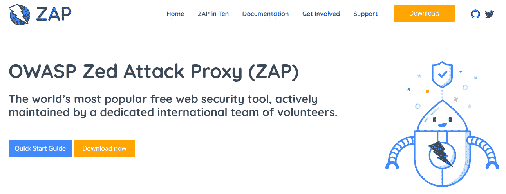
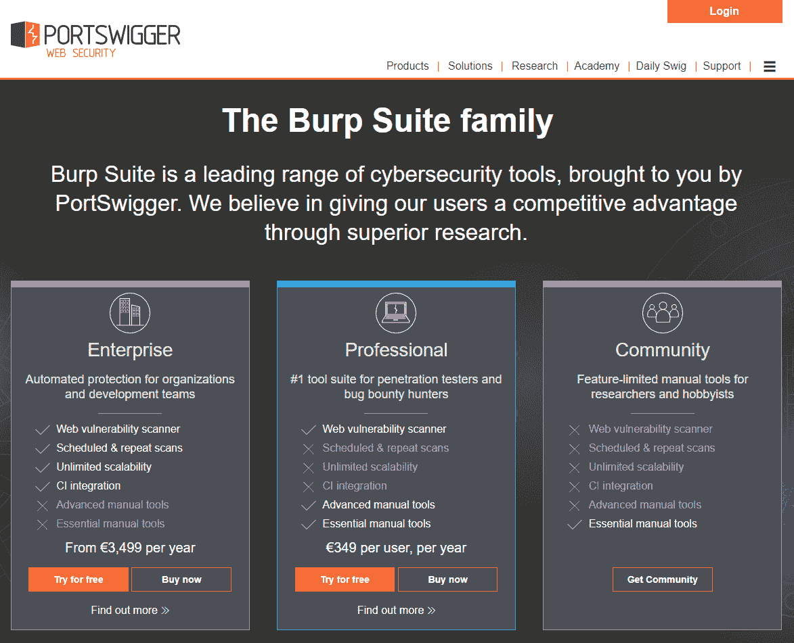
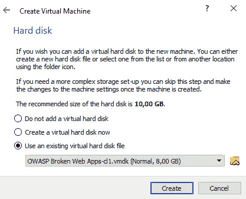
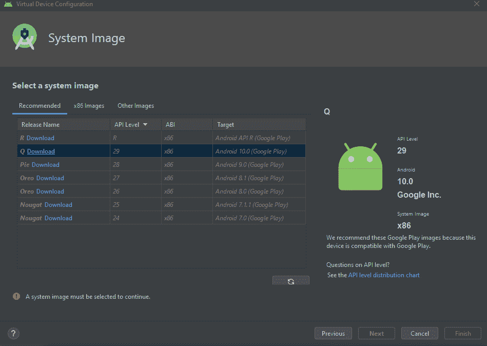

# 第三章：环境设置

在本章中，我们将介绍用于核心实践部分的测试环境的设置，同时定义本书实践部分背后的主要方法。将介绍的主要工具将帮助我们执行 SQL 注入测试，进一步帮助我们理解相关内容。

在介绍了主要方法论和工具之后，我们还将展示如何配置将要使用的实验室设置。本章将作为一步步的配置指南，帮助我们最佳配置客户端（我们将用来进行测试攻击的机器）和服务器端（由虚拟目标组成，我们将对其进行测试）。幸运的是，我们选择的工具大多数已经可以直接使用，设置也相对简单。

由于客户端部分在 Web 应用攻击和模拟设备攻击中大致相同，第一步将是配置这台机器。

本章将涵盖以下主题：

+   **理解实用方法并介绍主要工具**：本节将介绍我们的方法，并指导我们整个实践部分的内容。可以将其看作是实践部分的引言，描述我们将使用的实验室以及整体设置。

+   **开放式 Web 应用安全项目（OWASP）破损 Web 应用（BWA）项目概览**：对于我们的实验室设置，我们将使用由 OWASP 提供的免费**虚拟机**（**VM**），其中包含许多易受攻击的 Web 应用。这使我们能够在不攻击实际网站或第三方实体的情况下，测试漏洞。

+   **攻击者 – 配置你的客户端机器**：在为实验室设置目标之前，本节将提供我们对用于专门攻击的主要客户端机器的建议。

+   **目标 – 配置你的目标网络应用**：我们为设置目标网络服务器提供的指导。

+   **目标 – 配置你的目标模拟设备**：我们为**物联网**（**IoT**）测试配置目标设备提供的指导。

+   **操作实验室**：在本章的最后一节，我们将描述如何操作实验室，汇总我们已经看到的所有元素。

# 技术要求

尽管本章涉及的是严格的实践内容，但没有特别的前提要求。然而，我们建议熟悉我们将使用的主要工具。所有这些工具都是免费的，因此无需担心费用问题。以下是工具的链接：

+   [`www.virtualbox.org/`](https://www.virtualbox.org/)

+   [`www.kali.org/docs/`](https://www.kali.org/docs/)

+   [`owasp.org/www-project-broken-web-applications/`](https://owasp.org/www-project-broken-web-applications/)

+   [`developer.android.com/studio`](https://developer.android.com/studio)

+   [`www.eclipse.org/`](https://www.eclipse.org/)

# 理解实践方法并介绍主要工具

在理解攻击技术，尤其是漏洞和网络攻击时，最重要的方面之一是亲自探索进行攻击意味着什么，同时评估被攻击目标的行为，以找出可能的最佳防御解决方案。这是道德黑客的核心原则之一：从潜在攻击者的角度理解问题，意味着能更全面地了解发生了什么，这完全符合“了解你的敌人”的战略概念，从而最终获得战略优势。本节内容正是围绕这一点展开：在受控且安全的环境中进行攻击测试，亲身研究和体验 SQL 注入的本质。

为了达到这种专业水平，将使用一系列工具。SQL 注入大多是基于 Web 的漏洞，这意味着可以通过简单的 Web 浏览器进行利用，发送特定输入与应用程序进行交互，正如本书中的实践部分所示。当然，针对真实目标进行这些测试可能会非常棘手，因为这需要特定的协议和参与规则，以确保我们不会对公司或个人的系统造成伤害。在没有事先签署协议的情况下进行攻击是违法的，我们不希望也不鼓励任何人犯罪。因此，我们将介绍我们的第一款软件，它允许我们在自己的计算机上设置一个受控环境，而不攻击他人：虚拟化软件。

## 虚拟化软件

我们工具集中的第一项是虚拟化软件。虚拟化是通过软件完全仿真硬件资源（即计算机系统）的过程。仿真出来的机器称为虚拟机（VM），它通过仿真软件使用主机系统的硬件资源，虚拟化后具有与计算机相同的组件。

有许多可能的解决方案可供选择，但我们推荐以下两种主要解决方案：

+   `VMware Workstation`——由 VMware 提供的虚拟机仿真行业标准软件。免费版在功能上有部分限制，并且每次只能运行一个虚拟机。如下图所示：

图 3.1 – VMWare Workstation 主网页

+   `Oracle VirtualBox`——由 Oracle 提供的虚拟机仿真软件，免费且易于用于一般用途（可通过[www.virtualbox.org](http://www.virtualbox.org)获取）。如下图所示：

图 3.2 – Oracle VirtualBox 主网页

VMware 的完整版，当然是最完整的解决方案，但 Oracle VirtualBox 在全球用户中也很有名。无论如何，我们的实验室设置需要虚拟化软件，因此这两者中的任何一个都可以。请务必检查配置部分并按照建议的步骤进行操作。

至于模拟移动设备和物联网设备，Android 操作系统可以很容易地进行仿真。稍后我们将看到如何正确设置仿真。

在概述了用于启用我们实验室设置的基础工具之后，我们现在介绍 Kali Linux，这是道德黑客最重要的工具之一。Kali Linux 是一个 Linux 发行版，我们将在我们的仿真环境中用于客户端部分。

## Kali Linux

Kali Linux 是一个专门用于道德黑客、渗透测试和信息安全的 Debian Linux 发行版。Kali Linux 在信息安全专家中非常有名，因为它提供了大量的安全工具，这些工具可以用来执行安全测试和模拟网络攻击。这些工具的阵列非常受欢迎且完整，甚至被恶意攻击者使用。我们必须强调一点：作为道德黑客，测试只能在得到明确同意的目标上进行。这当然包括攻击者自己拥有并打算用于执行测试的可能目标。因此，最简单的配置是基于使用运行该特定版本 Linux 操作系统的虚拟机，这样它可以在与仿真目标相同的虚拟化环境中使用，无论这些目标是网页应用还是其他类型的目标。

Kali Linux 提供了超过 600 种计算机安全工具，从黑客攻击到网络监控工具，涵盖了安全专业人士的广泛使用场景。套件中还包括一些针对网页应用安全的重要工具，其中一些工具专门用于发现和利用 SQL 注入漏洞。接下来我们将介绍其中的一些工具，具体如下：

+   `OWASP ZAP`：`ZAP` 代表 `Zed Attack Proxy`，该名称已解释了它的功能：这款软件用作代理，通过 Web 浏览器使用，从而可以研究 Web 应用程序的行为，进行 **动态应用程序安全测试**（**DAST**）。通过 Web 浏览器发送的流量可以通过 ZAP 发送，允许它分析请求和响应的通信，从而根据互动情况发现可能的漏洞，包括 SQL 注入。ZAP 还内置了一个扫描器，向目标网站发送预格式化的请求，并根据相应的响应，可以识别 Web 应用程序中的漏洞。OWASP ZAP 由 OWASP 提供，OWASP 支持全球的安全专家，推动安全社区的发展和全球合作，同时也提供一个共享且有效的 Web 应用程序安全测试方法论。OWASP ZAP 如下图所示：

图 3.3 – OWASP ZAP – Zed Attack Proxy – 网页

+   `Burp Suite`：由 PortSwigger 开发的 Burp Suite 是一套 Web 应用程序安全工具，类似于 ZAP，但可能功能更为丰富。然而，一些最有用的模块仅通过其 Pro 版本提供。Burp Suite 的使用方式与 ZAP 相同，作为 Web 应用程序攻击的代理，服务于相同的目的。如果您尚未拥有 Burp Suite Pro，我们建议使用 OWASP ZAP 来进行本书中包含的测试。Burp Suite 如下图所示：

图 3.4 – Burp Suite 的主网页

+   `sqlmap`：sqlmap 是最著名的自动化 SQL 注入软件。它是一个命令行工具，可以用来识别和利用 Web 应用程序中的可能 SQL 注入漏洞。其检测引擎非常强大，经过多年优化，已成为 Web 应用程序安全测试中最相关的工具之一。sqlmap 如下图所示：

图 3.5 – sqlmap 的网页

+   `SQLninja`：SQLninja 是另一个有用且强大的工具，旨在利用针对运行 Microsoft SQL Server 数据库的 SQL 注入漏洞，最终可能通过更具体的选项完全接管后台，从而实现远程访问数据库服务器。SQLninja 如下图所示：

图 3.6 – SQLninja 的网页

我们工具集的最后一部分，将在下一节中描述，是我们测试的主要推动力，因为它充当我们模拟环境的服务器端。

# OWASP BWA 项目概览

OWASP 维持着大量子项目，得到了世界各地许多人的共同努力，旨在提升全球安全专业人士的体验，并提高 Web 应用程序安全问题的意识。道德黑客遇到的一个问题是，如何找到无需承担后果即可进行攻击的目标，来测试他们的知识。过去，一些组织，如 Web 应用程序安全软件供应商，会将特定的 Web 应用程序放到网上，允许测试软件的能力，或者只是为了普及 Web 应用程序安全知识。部分应用程序已经被移除，或者逐渐变得越来越难以找到，可能是因为它们已被停止使用，或者是为了测试旧版本的应用程序安全软件而设计的。`OWASP BWA` 项目旨在为人们提供一些这些 Web 应用程序的集合，以便在 Web 应用程序安全测试期间作为测试目标使用。这些 Web 应用程序通过 Ubuntu Server 虚拟机进行分发，该虚拟机作为 Web 服务器托管其中包含的应用程序。

该项目于 2015 年停止更新，但仍可下载虚拟机镜像。提供的虚拟环境将作为我们目标 Web 应用程序的基础。在 *目标–配置你的目标 Web 应用程序* 章节中，我们将看到如何设置机器。

由于可用的应用程序数量相当庞大（准确来说有 37 个），我们将重点介绍那些我们认为最适合练习 SQL 注入的应用程序，包括手动和自动化的练习。

为了让大家了解受漏洞影响的 Web 应用程序选择中心是什么样的，我们添加了一个截图，展示访问活动虚拟机时会看到的选择菜单。完成目标机器配置后，你将能够看到它，所以请确保不要错过相应的章节（*目标–配置你的目标 Web 应用程序*）。请查看以下截图：

图 3.7 – OWASP BWA 应用程序选择中心

这里是我们在实践部分将要涵盖的主要 Web 应用程序列表：

+   `Mutillidae II`：由 OWASP 提供的引导式训练测试 Web 应用程序。我们已经在*第二章*，*操作 SQL – 利用 SQL 注入*中看到过这个应用程序触发错误的示例。Mutillidae II 在以下截图中展示：

图 3.8 – Mutillidae II 首页

+   **代码注入彩虹**：另一个测试 Web 应用程序，提供引导式挑战以练习注入漏洞（包括 SQL 注入）。可以在下面的截图中看到：

图 3.9 – 代码注入彩虹 SQL 注入页面

+   `Peruggia`：一个故意设计为有漏洞的应用，提供了用于 Web 应用安全测试的现实用例场景。如下图所示：

图 3.10 – Peruggia 首页

+   **破损的 WordPress**：一个使用 WordPress 2.0.0 创建的示例博客，以存在许多漏洞而著称。这是我们在*第二章*中看到的同一个 WordPress 博客，*SQL 注入攻击的利用——窃取凭证*，用来展示凭证盗取。破损的 WordPress 如下图所示：

图 3.11 – 破损的 WordPress 首页

+   `OWASP Vicnum`：一个非常简单、基础的 Web 应用，展示了不应用安全措施可能带来的严重后果。我们在*第二章*中也看到了这一点，*SQL 注入攻击的利用*，但是我们会在实践部分再次回顾它。OWASP Vicnum 如下图所示：

图 3.12 – Vicnum 项目的主页

随时可以使用提供的应用进行测试，独立于本书提供的指南。实践成就完美，在受控环境中练习可以让你按照自己的节奏提高技能。

提供的方法和工具代表了我们手中的武器库。现在，是时候开始设置我们的测试环境，以便我们可以最终开始实践部分。

# 攻击者 – 配置你的客户端机器

在本节中，我们将展示我们对用于执行攻击性测试的机器配置的建议。请记住，其他选项也是可能的（稍后将描述），但我们的建议优先考虑可用性，并涵盖广泛的使用场景。

在本书中，我们将使用运行 `Kali Linux` 的客户端机器。Kali Linux 是免费的，可以在官方 Kali Linux 网站 ([www.kali.org](http://www.kali.org)) 下载作为启动镜像使用。每个镜像还包括在 *Live* 环境中运行系统的选项，因此不需要安装。由于我们使用虚拟机实验室来管理客户端和服务器端，我们将在本指南中使用常规安装。

在可用的下载选项中，我们推荐 *Kali Linux 64 位*，以获得与更新软件的最佳兼容性；如果主机无法正确处理 64 位虚拟化系统，也可以使用 *Kali Linux 32 位*。*Kali Linux Light* 也可以使用，但大部分软件工具需要逐个安装。出于安全考虑，确保你从网站下载的文件的 SHA-256 哈希值与以下截图中显示的相同：

图 3.13 – Kali Linux 下载页面

一旦你获得了操作系统镜像，就可以开始设置虚拟化系统了。

即使 VMware 被广泛认为是 IT 专业人员的行业标准，Oracle VirtualBox 也可以用于设置测试实验室，且没有使用限制。这两款软件都是有效的，可以在没有明显差异的情况下使用。出于可用性考虑，我们将使用免费提供的 Oracle VirtualBox 进行测试，以下截图展示了该软件：

图 3.14 – Oracle VirtualBox 下载页面

一旦你获取了所选择的磁盘镜像和虚拟化软件，接下来可以创建一个运行 Kali Linux 的新虚拟机。

## 创建一个新的客户端虚拟机

在这里，我们提供了一个使用 VirtualBox 创建新虚拟机的分步指南。客户端和目标虚拟机的配置中会有许多共同的步骤，因此请确保按照我们的分步指南进行操作。按以下步骤进行：

1.  点击适当的**创建新虚拟机**按钮，并根据你之前下载的 Kali Linux 版本（64 位或 32 位），在向导中完成设置，选择`Linux`作为操作系统，选择`Other Linux (64-bit)`作为发行版（我们在此附上了创建向导的截图）。该过程在以下截图中展示：

    图 3.15 – 我们的 Kali 测试机器设置 – 文件路径和系统选择

1.  在选择版本后，你将被提示配置机器的技术设置。根据你的主机计算机的性能，选择为虚拟机分配适当的**随机存取内存**（**RAM**）。我们推荐的最低要求是 1,024 兆字节（操作系统本身需要大约 512 兆字节才能正常运行）。该过程在以下截图中展示：

    图 3.16 – 我们的 Kali 测试机器设置 – 内存设置

1.  对于次级存储，你将被提示选择一个虚拟硬盘。我们推荐至少 8 GB 的磁盘大小，但由于这只是一个测试虚拟机，因此 8 GB 应该足够了（Kali Linux 安装操作系统本身就需要约 3 GB 的磁盘空间）。该过程在以下截图中展示：

    图 3.17 – 我们的 Kali 测试机器设置 – 硬盘设置

1.  在首次启动时，选择之前下载的 Kali Linux 镜像作为启动介质，开始在虚拟机上安装操作系统。根据语言、访问凭据和所选桌面环境选择适当的选项。操作系统安装完成后，你将可以自由使用虚拟的 Kali Linux 机器进行测试。

最后，我们建议安装我们之前提到的附加软件，位于*Kali Linux*子章节的*理解实用方法并介绍主要工具*部分。

首先，确保通过运行以下命令更新所有 Kali 应用程序包，并确保它们是最新版本（首先确保 Kali 机器已连接到互联网）：

sudo apt-get update

sudo apt-get upgrade

要安装 OWASP-ZAP，请在终端中运行以下命令：

sudo apt-get install zaproxy

要安装 SQLninja，请在终端中运行以下命令：

sudo apt-get install sqlninja

sqlmap 应该已经包含在默认的 Kali 发行版中。然而，为了以防万一，请也运行以下命令：

sudo apt-get install sqlmap

Kali Linux 还提供许多其他安全工具，除了我们在本书实践部分中使用的那些工具。可以在受控和安全的环境中自由探索这些工具，而不会对任何第三方造成损害。

一旦客户端虚拟机设置完成，我们可以继续设置将在测试中使用的目标虚拟机。

# 目标 – 配置你的目标 Web 应用程序

在我们所有的测试中，我们将使用之前设置的 Kali Linux 安装作为客户端。为了覆盖本书中之前描述的情况（Web 应用程序和 IoT 设备），我们需要多种目标配置。

首先，我们将展示如何设置作为 Web 应用程序 SQL 注入攻击测试目标的虚拟机，使用 OWASP BWA 虚拟机中包含的 Web 应用程序。在这种情况下，设置非常简单直观。

通过点击 OWASP BWA 主页面中报告的 Sourceforge 链接，下载 OWASP BWA 虚拟机的最新版本：

[`sourceforge.net/projects/owaspbwa/files/`](https://sourceforge.net/projects/owaspbwa/files/)

不幸的是，最近几个月，OWASP BWA 的主页已经迁移到另一个平台，因此它只能作为一个格式不规范的页面访问，等待迁移到新平台。你可以通过以下网址找到它：

[`owasp.org/www-project-broken-web-applications/migrated_content`](https://owasp.org/www-project-broken-web-applications/migrated_content)

以下截图展示了 OWASP BWA 的主页：

图 3.18 – Sourceforge.net 上的 OWASP BWA 下载页面

从 Sourceforge 页面选择**下载最新版本**以开始下载。由于文件大小（1.8 GB），这个下载可能需要一些时间，具体取决于你的互联网连接带宽。

下载的文件是一个压缩文件夹，包含虚拟机文件和硬盘镜像。现在，我们将看到配置服务器虚拟机是多么简单，因为它比客户端虚拟机要容易得多。

## 创建 OWASP BWA 虚拟机

按照我们在*创建新客户端虚拟机*部分中看到的相似方式进行操作，以下是步骤：

1.  使用你的仿真软件创建一个新的虚拟机（Linux，64 位），并设置 1,024 MB 的内存。你可以参考*图 3.15*和*图 3.16*，因为选项将是相同的。

1.  一旦系统提示你选择虚拟硬盘，选择一个现有的硬盘（在本例中，选择`OWASP BWA`文件夹中的**OWASP Broken Web Apps-cl1.vmdk**）。以下截图展示了该过程：

    图 3.19 – 选择现有磁盘以用于 OWASP BWA 虚拟机

1.  由于虚拟机存在大量安全漏洞，因此将其设置为**仅主机**连接，使其仅在你的主机机器的本地 IP 地址上可见。进入 VirtualBox 菜单中的**设置**面板，并从**网络**选项卡配置虚拟机网络适配器。以下截图展示了该过程：

    图 3.20 – a—VirtualBox 主屏幕中的“设置”选项

    **网络**面板在**设置**菜单中的显示如下：

    

    图 3.21 – b—设置菜单中的网络面板

1.  一旦虚拟机准备好，你可以通过屏幕上显示的 IP 地址进行访问。通过浏览器访问该 IP 地址，你可以看到可用的应用程序正在运行，正如*图 3.7*所示的选择中心。在下图中，你可以看到服务器虚拟机启动后的屏幕，显示了用于通过 HTTP 连接 Web 应用程序的 IP 地址：

图 3.22 – OWASP BWA 的主屏幕，包含访问易受攻击的 Web 应用程序的说明

这就完成了 Web 应用程序环境的设置。在接下来的部分，我们将处理其他仿真设备。

# 目标 – 配置你的目标仿真设备

接下来我们将演示如何设置移动设备和物联网仿真设备。

在功能上，这些设备的操作范围更加有限：通常，物联网设备具有非常有限的计算能力，通常依赖于简单的 Web 服务，且没有任何丰富的图形设置。

来自 OWASP BWA 虚拟 Web 服务器的某些应用程序实际上可以模拟这种行为，通过提供 Web 服务器的**应用程序编程接口**（**APIs**）。我们可以说，我们已经为 Web 服务交互设置了一些环境。

附注：OWASP IoT 安全测试框架和 IoTGoat 项目

一个有趣的 IoT 安全测试方法再次来自 OWASP：IoT 安全测试框架今年发布，提供了一种彻底的方法论，用于评估和测试 IoT 环境中的漏洞，类似于 OWASP 提供的 Web 应用程序和移动应用程序测试框架。

与这个新框架相结合，OWASP 发布了另一个用于测试的实用工具，同时保持一切合法并在可控的环境中进行：OWASP IoTGoat 虚拟机。这个项目在某些方面呈现了 IoT 对应于 OWASP BWA 项目的角色，通过提供一个故意存在漏洞的设备模拟，包含许多 OWASP IoT 漏洞前十中的漏洞。我们认为无论如何都值得查看它，访问官方 GitHub 页面：[`github.com/OWASP/IoTGoat`](https://github.com/OWASP/IoTGoat)。

在处理 Web 服务和 Web 应用程序后，这些也构成了与 IoT 世界交互的主要方式，我们将设置模拟移动设备的方式。为此，我们需要一种方式来模拟移动应用程序环境，包括客户端。

首先，我们推荐最著名的 Android 移动应用程序编辑器，它也是免费的：Android Studio。

`Android Studio` 是一个完整的 Android 移动应用程序开发环境。它还提供了一个方便的 Android 模拟器，可以在同一台用于编程的计算机上，从客户端的角度测试开发的应用程序。这是我们用于 SQL 注入测试的主要功能。

从官方网站下载 Android Studio（[`developer.android.com/studio`](https://developer.android.com/studio)），并继续安装。以下截图展示了 Android Studio：

图 3.23 – Android Studio 官方下载页面

从这里开始，您将有很多选项可以选择。大多数选项都可以选择，根据个人喜好即可，但我们需要的最重要功能是 Android 模拟器。安装时确保选择了此选项。以下截图展示了该过程：

图 3.24 – 在安装 Android Studio 时选择 Android 虚拟设备作为选项

启动 Android Studio，完成首次启动时的安装。可以自由设置偏好设置，但标准安装应该足够。一切设置完成后，你就拥有了模拟移动应用客户端所需的工具。正如你可能知道的那样，移动应用通常由客户端应用程序与 Web 服务组成。因此，我们需要一种部署并模拟 Web 服务的方法。虽然有很多选择，但我们推荐使用 Eclipse，它是最受开发者欢迎的 Java 环境之一。我们将使用 Eclipse 来运行简单的 Java 代码，这些代码将用于模拟我们移动应用所需的 Web 服务。

在安装 Java 环境之前，为了使 Web 服务能够正常工作，我们还需要安装另外两项软件，具体如下：

+   `Apache Tomcat`（可在 [`tomcat.apache.org/download-90.cgi`](https://tomcat.apache.org/download-90.cgi) 下载）

+   `MySQL Community`（可在 [`dev.mysql.com/downloads/installer/`](https://dev.mysql.com/downloads/installer/) 下载）。在这种情况下，选择自定义安装，只安装 `MySQL Server` 和 `MySQL Workbench`，如下图所示：

图 3.25 – MySQL 自定义安装

在安装完 Tomcat 和 MySQL 后，访问 MySQL 网站，然后进入 **下载** 部分，下载用于与 Tomcat 配合使用的 Java 连接器 ([`dev.mysql.com/downloads/connector/j/`](https://dev.mysql.com/downloads/connector/j/))。确保选择 **平台无关** 作为操作系统。该过程如下面的截图所示：

图 3.26 – 下载 Java 连接器

下载后，将文件移动到 Apache Tomcat 安装文件夹中的 lib 文件夹（通常是 **C:\Program Files\Apache Software Foundation\Tomcat 9.0\lib**）。

最后，前往官方 Eclipse 下载页面 ([`www.eclipse.org/downloads/`](https://www.eclipse.org/downloads/)) 并按照说明进行操作。以下截图展示了该过程：

图 3.27 – 官方 Eclipse 下载页面

在某些情况下，安装程序可能找不到你计算机上安装的 **Java 虚拟机**(**JVM**) 。如果是这种情况，它会弹出一个窗口，要求你浏览丢失的文件。选择从弹出窗口中浏览该文件的选项，并在计算机上浏览，指向有效的 `javaw.exe` 文件。你应该能够在 Android Studio 安装文件夹中的 `jre\bin` 文件夹中找到该文件。

在安装过程中，选择 `Eclipse IDE for Enterprise Java Developer` 选项，这对我们来说非常有用，因为它包含了部署 Web 服务所需的所有工具。如下图所示：

图 3.28 – Eclipse 安装期间选择突出显示的选项

此时，安装应该开始了。请继续根据路径和可访问性设置您的偏好。

# 操作实验室

现在实验室的组件已经完全设置好，我们准备开始让它工作。

## 设置 OWASP BWA 实验室

以下是我们建议的设置 OWASP BWA 实验室部分的步骤：

1.  首先，从 VirtualBox 运行 OWASP BWA 虚拟机。启动后，它应该显示出*图 3.21*中所示的屏幕。现在，计算机上可以通过屏幕上显示的地址访问完整的 Web 应用程序列表。

1.  要使用 Kali Linux，请从 VirtualBox 运行您的 Kali 虚拟机。请记住，只要 OWASP BWA 在当前设置下运行，它也可以访问 BWA 中可用的 Web 应用程序。以下截图展示了这一点：

图 3.29 – 从 Kali 虚拟机看到的 OWASP BWA 选择中心

这样，您计算机上的任何模拟设备都可以连接到 OWASP BWA 服务器，从而使得可以测试各种攻击范围。显然，也可以在不使用任何虚拟机的情况下，从您自己的计算机舒适地执行手动攻击。我们将主要使用 Kali Linux 进行高级或自动化攻击。

至于 Android Studio 和 Eclipse，我们将在下一章中更详细地处理这些工具，因为我们将在某些特定用例中使用它们。无论如何，为了使 Android 模拟器正常工作，我们需要首先设置一个虚拟设备。

## 设置 Android 虚拟设备

在这里，我们正在使用 Android Studio 设置一个**Android 虚拟设备**（**AVD**）。请按照我们提供的简单逐步指南操作：

1.  从 Android Studio 的主屏幕选择**AVD 管理器**选项。它应该位于屏幕的右上方，如下图所示：

    图 3.30 – Android Studio 中的 AVD 管理器

1.  进入**AVD 管理器**后，选择**创建虚拟设备…**。然后选择模拟模型（通常默认选择的是 Google Pixel 2：您可以选择它）。该过程在以下截图中展示：

    图 3.31 – AVD 管理器的主屏幕

1.  一旦选择好，您需要选择一个系统映像。从推荐的系统映像中选择`Android 10`。然后，所选映像将被下载。根据您的互联网连接速度，这可能需要相当长的时间。该过程在以下截图中有所展示：

    图 3.32 - 新设备的系统映像选择

1.  下载完成后，**AVD 管理器**的主屏幕将列出你新配置的模拟设备。

模拟设备的工作方式与虚拟机完全相同。它将复制 Android 移动设备的功能。此功能专门用于测试开发的 Android 应用程序的运行时。我们将在本书的下一章看到一些示例。

总结一下：你可以在计算机上运行所有目标并进行所有测试，而无需物理机器或额外的设备。然而，如果你的机器受到主内存等限制，我们建议分别尝试每个场景，以免一次性使计算机的虚拟化过多而过载。然而，你可以根据需求调整虚拟机的系统设置。

# 总结

在这一章中，我们设置了执行测试所需的实验室环境。以下是我们到目前为止设置的简要清单，并回顾了我们将使用的工具。

我们在道德设置中执行测试的主要工具是使用虚拟化软件，借此在不损害任何第三方的情况下测试我们的攻击技术，同时使用免费工具和软件。

除了可能是我们自己的计算机外，我们执行基于 Web 的攻击的主要客户端将是 Kali Linux 虚拟机，用于高级和自动化攻击技术。为了模拟一个易受攻击的目标 Web 服务器，我们将使用 OWASP BWA 虚拟机，其中包含易受 SQL 注入攻击的传统 Web 应用程序，以及 Web 服务攻击（**表征状态转移**（**REST**））场景，其他应用程序模型，如物联网架构，通常依赖于这些场景。我们的移动应用程序场景将通过 Android Studio 运行，使用其内置的设备模拟器作为客户端，以及运行在我们计算机上的 Web 服务。

所有这些不同的场景可以单独在我们的计算机上运行，而不会过度占用我们的资源。无论如何，设置可以根据你的限制和需求进行自定义。

下一章将是实际部分的核心，重点是按照逐步方法运行我们在*第二章*中看到的攻击技术，*操纵 SQL – 利用 SQL 注入*（以及更多）。这些操作将在我们本章所看到的相同虚拟环境中执行。

我们希望你在下一章中能玩得开心，因为你将亲自体验到我们迄今为止所看到的内容。

# 问题

1.  什么是虚拟化软件？为什么我们在实际部分中需要它？

1.  什么是 Kali Linux？我们为什么在实验室环境中使用它？

1.  什么是 OWASP BWA 项目？为什么我们在测试中需要它？

1.  我们正在处理什么样的模拟设备？

1.  在未经第三方同意的情况下对 SQL 注入进行测试是否合法？
