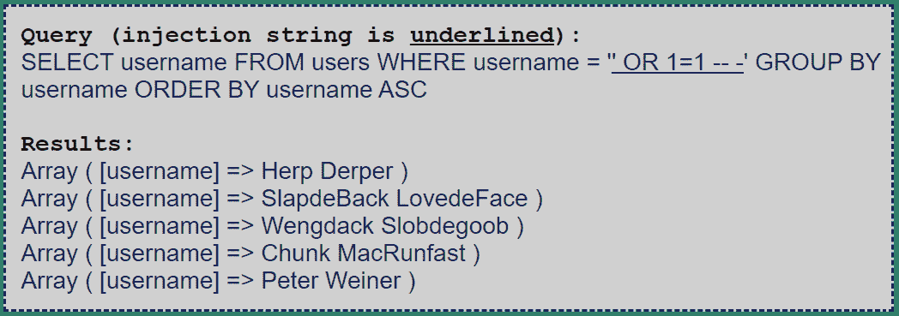
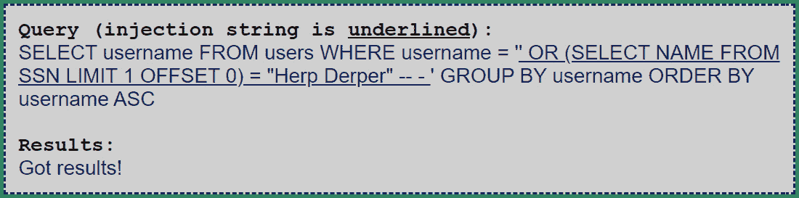
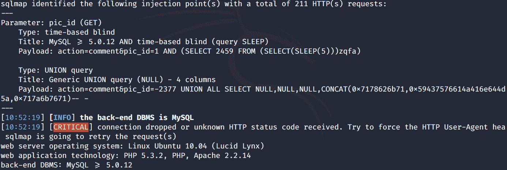

# 第四章：攻击 Web、移动和物联网应用程序

现在我们进入了旅程的有趣部分——本书实践部分的核心。到目前为止，我们已经了解了 SQL 注入的基础和原理，包括成功的 SQL 注入攻击可能带来的效果。我们还提供了一个安全受控的环境，任何人都可以按自己的节奏体验 SQL 注入攻击的组成部分。

本章将讨论针对传统 Web 应用程序的 SQL 注入攻击，这是最常见的攻击场景，使用手动和自动化技术，依赖我们在上一章中讨论的工具集。

本章分为以下几个部分：

+   **攻击传统 Web 应用程序 - 手动技术**：本节展示了针对 OWASP `Broken Web Applications** (`BWA**) 虚拟 Web 服务器中的易受攻击 Web 应用程序手动执行的 SQL 注入攻击。你已经在*第二章*中遇到过类似的内容，*SQL 注入操作 - 利用 SQL 注入*。不过，在这里，我们将通过引导你逐步了解攻击者会如何进行，来尝试一种更现实的方法。

+   **攻击传统 Web 应用程序 - 自动化技术**：我们的目标将依然是包含在 OWASP BWA 项目中的 Web 应用程序。不过这一次，我们将展示自动化 SQL 注入工具的能力，这些工具被攻击者（以及安全专业人员）用于提高效率。

+   **攻击移动目标**：本节将探讨移动应用程序如何也可能容易受到 SQL 注入攻击，并展示实际的示例。

+   **攻击物联网目标**：无论在何种上下文中，SQL 数据库都可能遭受 SQL 注入攻击。物联网世界也不例外。我们在这里展示一个可能对物联网系统感兴趣的攻击场景。

# 技术要求

对于这一非常实用的章节，我们强烈建议你熟悉主要的相关工具。我们推荐以下资源，包括上一章的参考资料：

+   https://[www](https://www.virtualbox.org/).virtualbox.org/

+   [`www.kali.org/docs/`](https://www.kali.org/docs/)

+   [`owasp.org/www-project-broken-web-applications/`](https://owasp.org/www-project-broken-web-applications/)

+   [`developer.android.com/studio`](https://developer.android.com/studio)

+   [`www.eclipse.org/`](https://www.eclipse.org/downloads/)

+   [`www.kali.org/docs/`](https://www.kali.org/docs/)

+   [`github.com/sqlmapproject/sqlmap`](https://github.com/sqlmapproject/sqlmap)

+   [`www.zaproxy.org/`](https://www.zaproxy.org/)

+   [`owasp.org/www-project-broken-web-applications/`](https://owasp.org/www-project-broken-web-applications/)

请查看以下视频，观看代码实践：[`bit.ly/32d3s2b`](https://bit.ly/32d3s2b)

# 攻击传统的 Web 应用程序–手动技术

让我们从对 OWASP BWA Web 应用程序的手动攻击开始。在*第二章*中，我们已经发现了一个通过 SQL 注入提取信息的简单攻击点——*操纵 SQL – 利用 SQL 注入*，但我们将假设每个应用程序都是独立的，并且没有共享 MySQL 实例。因此，我们不会考虑 OWASP Vicnum 应用程序，因为这会让我们太轻松。每个应用程序都将被视为独立的目标，这样我们就可以探索其中的内在漏洞。在本节中，我们将对 OWASP BWA 的三个应用程序进行 SQL 攻击：`Mutillidae II`、`Magical Code Injection Rainbow` 和 `Peruggia`，并在引导环境中实践到目前为止所学的内容。

## 攻击 Mutillidae II

我们的第一个目标有点像热身——`Mutillidae II` 是一个设计用于提供 SQL 注入测试环境的应用程序，采用教育性方法，同时提供一些有关可能执行的攻击的提示。您可以通过左侧的下拉菜单进入 SQL 注入部分 (`OWASP 2013** | `A1 - 注入（SQL）**)：

图 4.1 – Mutillidae II 中的 SQL 数据提取页面

现在让我们展示如何攻击这个 Web 应用程序中的 SQL 注入漏洞表单。

### 通过 SQL 注入提取数据

让我们通过下拉菜单进入 Mutillidae II 提供的 SQL 注入测试数据提取页面。首先，我们将执行 SQL 注入攻击的第一步：通过在 `Name` 字段插入最基本的注入字符——单引号，检查是否存在输入验证：

图 4.2 – Mutillidae II 中的 SQL 数据提取页面：Web 表单

仅插入 SQL 注入启用字符就足以证明 SQL 注入漏洞的存在。如果出现 SQL 错误，意味着输入被解释，导致查询语法错误。插入单引号后，我们确实得到了 SQL 语法错误：

图 4.3 – Mutillidae II 提供的错误信息可视化（0 安全性）

在 Mutillidae II 设置为最低安全级别的情况下，错误信息是完整的，还帮助我们可视化完整的错误信息。让我们通过点击 `Toggle Security` 选项一次并应用客户端安全性来提高安全级别：

图 4.4 – Mutillidae II 中的客户端控制示例

在这种情况下，应用了客户端控制，防止了空输入字段并阻止了可疑字符，前提是两个字段都已填写，例如将`' -- -`作为用户名，并将任何字符作为密码（如果没有应用安全控制，则该输入应完全忽略单引号字符后的内容）。

然而，客户端控制不足以防止 SQL 注入。假设我们通过使用 URL 地址中的参数来绕过它们怎么办？（是的，登录是通过`GET`请求进行的，通过将数据作为输入参数发送到 URL 中。）

让我们以以下方式修改页面 URL。在这里，我们有一个正常的页面 URL，用户名为`a`，密码为`b`：[密码：](http://192.168.56.101/mutillidae/index.php?page=user-info.php&username=a&password=b&user-info-php-submit-button=View+Account+Details)

[`192.168.56.101/mutillidae/index.php?page=user-info.php&username=a&password=b&user-info-php-submit-button=View+Accoun`](http://192.168.56.101/mutillidae/index.php?page=user-info.php&username=a&password=b&user-info-php-submit-button=View+Account+Details)t+Details

我们只是在 [用户名：](http://192.168.56.101/mutillidae/index.php?page=user-info.php&username='&password=b&user-info-php-submit-button=View+Account+Details)处添加了一个单引号

[`192.168.56.101/mutillidae/index.php?page=user-info.php&username='&password=b&user-info-php-submit-button=View+Accou`](http://192.168.56.101/mutillidae/index.php?page=user-info.php&username='&password=b&user-info-php-submit-button=View+Account+Details)nt+Details

这会触发另一个错误信息，如下所示：

图 4.5 – Mutillidae II 提供的错误信息可视化（客户端安全性）

请记住，如果这是`POST`请求而不是`GET`，仅修改请求字段就足以引发 SQL 注入。这突显了服务器端安全控制的重要性。这是确保输入被正确处理的唯一方法，无论注入方式如何。

因此，我们证明了该页面易受 SQL 注入攻击。输入被解释为 SQL 语法，由于语句不正确导致语法错误。错误信息还泄露了一些关于查询结构的重要信息，这些信息可以被用来对我们有利，且揭示了一个名为`accounts`的表，其中有`username`和`password`字段。

让我们进一步进行数据提取，好吗？既然我们已经看到 SQL 注入是可能的，我们可以尝试看看其他技术是否有效，从而提取数据。在一种贪婪的方式下，我们现在尝试查看同义反复（tautologies）是否有效。

让我们尝试在用户名字段中输入臭名昭著的 `' or 1=1 -- -` 字符串（如果是客户端安全问题，我们需要像之前的例子那样编辑参数，而不是实际使用表单）。这个尝试会导致以下截图中的结果：

图 4.6 – 所有账户信息记录的结果页面

使用这个同义命题，我们已经找到了所有应用程序用户的完整登录信息。此时，攻击者可以获得管理员（**admin**）权限，可能会导致严重后果。

所以，应用程序很可能对提取信息的 SQL 注入攻击存在漏洞。我们假设这个攻击已被 Web 应用程序阻止，并尝试一种更微妙的方法。

我们现在将尝试使用 `UNION` 查询提取数据库版本信息。我们需要通过反复试验的方法来查看应用程序显示了多少列，以及哪些列被显示。我们为您节省了这个过程：插入 `' UNION SELECT 1,@@VERSION,3,4,5,6,7 -- -` 将会有效，因为显然，`accounts` 表（我们通过错误信息知道了它的名称）有 7 列，而应用程序只显示了列 2、3 和 4：

图 4.7 – 使用 UNION 查询显示系统版本的结果页面

此时，我们不仅发现了系统的版本信息，还发现了 `accounts` 表中列的总数，因为原始查询为该表选择了所有字段（`SELECT `*）。

我们现在应该能够提取数据库架构的信息。我们已经通过错误信息和版本信息知道数据库是 MySQL。所以，让我们按照 *第二章*中讨论的内容，要求获取数据库架构中的架构名称，*SQL 注入攻击 – 利用 SQL 注入*。使用和之前相同的技巧，通过在第二个字段中显示我们需要的信息，我们可以提取数据库中包含的架构名称：

图 4.8 – 架构名称提取

我们现在可以继续进行 Mutillidae II SQL 注入的下一部分。

### 绕过身份验证的 SQL 注入

本部分内容关于绕过 Mutillidae II Web 应用程序的登录屏幕。您可以通过与上一部分相同的下拉菜单访问此部分：

图 4.9 – Mutillidae II 中的 SQL 数据提取页面

我们现在将面对一个典型的登录网页表单，需要用**用户名**和**密码**进行身份验证。首先，让我们通过触发一些错误来检查这个表单是否容易受到 SQL 注入攻击，方法是使用 SQL 字符，如单引号：

图 4.10 – Mutillidae II 登录页面显示未公开的错误

这一次，我们可以判断发生了错误。然而，应用程序没有显示（根据已知的最佳实践）完整的错误信息。尽管如此，我们知道表单存在漏洞，因为如果使用错误的账户信息，响应会有所不同。

我们已经从上一节提取了登录信息，因此我们将尝试使用已知的凭据进行`admin`访问：

图 4.11 – 管理员访问成功

我们还可以检查该表单是否容易受到伪命题攻击，从而让我们获得访问权限。让我们尝试在**用户名**字段中插入`' OR 1=1 -- -` 字符串：

图 4.12 – 伪命题登录尝试

这个身份验证绕过攻击也会成功，重新授予我们管理员`admin`账户的访问权限。请记住，即使我们能作为系统中的任何账户进行身份验证，攻击者也会尽力获取尽可能高的权限（毕竟，大多数应用程序允许创建用户级账户）。

现在让我们继续探讨这个应用程序的最后一种 SQL 注入形式。

### INSERT 语句中的 SQL 注入

到目前为止，我们仅在`SELECT`语句中研究了 SQL 注入。Mutillidae II 提供了一个账户创建页面，该页面与一个`INSERT`语句相关联，用于将新记录添加到数据库的账户表中。它还提供了另外两个可以向数据库添加数据的页面。然而，我们在本节中仅讨论这个页面，以免占用其他话题的篇幅。欢迎你自己探索其他两个页面：

图 4.13 – 访问账户创建页面

账户创建页面不应该返回任何记录，因为其主要目的是（没错，你猜对了）将用户添加到数据库的账户表中。因此，在这个上下文中，它看起来是一个尝试盲注 SQL 注入的好地方：

图 4.14 – 账户创建表单

首先，我们可以触发错误信息，检查查询语法，并检查我们可以在哪里注入命令：

图 4.15 – 插入单引号作为用户名的错误信息

现在我们已经有了查询结构，这样我们就可以通过 SQL 语法来修改命令。一个例子可能是通过使用 `SELECT` 语句的子查询来检索敏感信息。让我们尝试使用 MySQL 根账户密码作为签名创建一个用户。我们将首先尝试在用户名字段中使用 `test','test',(SELECT password FROM mysql.user WHERE user='root'))-- -` 载荷，以获得以下结果：

图 4.16 – MySQL 错误；子查询返回多个结果

在这里，`SELECT` 查询显然返回的行数比我们预期的更多。为了解决这个问题，我们需要一种方法来查看单个结果。一种简单的解决方案是在 `SELECT` 查询的末尾使用 `LIMIT 1` 子句，它用于将结果限制为仅一个，从而实现成功。让我们使用登录面板，最终通过我们新创建的凭据来检查我们的值：

图 4.17 – 通过成功身份验证后的 Mutillidae II 上方面板

在这里，攻击者可以使用注册表单来检索敏感信息（在这种情况下，是 MySQL 根账户的密码哈希）。即使它不是一个设计用来返回数据的查询，这也能实现。这个例子是为了展示 SQL 注入如何为攻击者提供多种工具，只要攻击者知道合适的 SQL 语法。

现在我们可以进入我们的速成课程的下一个 Web 应用程序：Magical Code Injection Rainbow。

## Magical Code Injection Rainbow

在 `Magical Code Injection Rainbow` 中，我们有一个用于代码注入训练的应用程序。我们关注的是 SQL 部分，恰当地命名为 `SQLol`，它还提供了一些包括服务器端防御的示例。这一次，我们将通过这个应用程序提供的前六个挑战，并为每个挑战提供解决方案。随时可以自己尝试这些（或接下来的挑战）。此时，在 MySQL 文档的帮助下，您应该能够利用在 *第一章* 中学到的知识，完成它们，*SQL 注入的结构化查询语言*，以及 *第二章*，*操控 SQL – 利用 SQL 注入*：

图 4.18 – Magical Code Injection Rainbow SQLol - 挑战界面

通过从主屏幕选择 `SQLol`，然后选择 `Challenges` 来访问这些挑战。你将始终有一个文本字段用于插入载荷，因此你知道那是插入 SQL 载荷的唯一方式。

### 挑战 0 – 你好，世界！

这是列表中最基本的挑战。在这里，您需要使用 `SELECT` 查询从数据库的用户表返回所有用户名，并在 `WHERE` 子句中执行注入。这是我们迄今为止看到的 `SELECT` 查询的典型设置。

这很容易做到。只需提供一个总是为真的条件，并且我们知道如何进行类推。

我们的有效负载将是 `' OR 1=1 -- -`，导致我们期望的输出：

Figure 4.19 – SQLol 挑战 0 结果

这很简单，对吧？我们只是以可能的最简单的 SQL 注入方式返回了所有用户名。现在让我们继续进行第二个挑战。

### 挑战 1 – SQL 注入 101

这也是一个相当简单的挑战；话虽如此，它需要一些侦察，以便发现查询结构。这一次，我们需要找到包含数据库中存在的社会安全号码的表，并在查询输出中返回完整内容。再次，我们使用 `SELECT` 查询，并在 `WHERE` 子句中进行注入：

1.  首先，我们需要找出社会安全号码表的名称。为此，我们需要使用 `UNION` 查询检查 MySQL 的 `information_schema` 表。我们首先需要使用 `' UNION SELECT table_name FROM information_schema.tables -- -` 有效负载找到表名。或者，我们还可以通过添加诸如 `LIKE` 等带有特定期望特征的子句（例如，对于包含 `ssn` 的表名，使用 **WHERE table_name LIKE '%ssn%'**）来细化搜索：

    Figure 4.20 – SQLol 挑战 1 结果

1.  此时，我们需要使用 `' UNION SELECT column_name FROM information_schema.columns WHERE table_name='ssn' -- -` 有效负载从表中提取列名：

    Figure 4.21 – SQLol 挑战 1 结果

1.  现在我们只需逐个字段查询 `ssn` 表。或者，我们可以使用更加优雅的解决方案，即 `CONCAT()` 运算符：

Figure 4.22 – SQLol 挑战 1 最终结果

在这里，我们有所有用户的社会安全号码集中在一个地方。让我们继续进行第三个挑战。

### 挑战 2 – 单引号过滤的失败

这个挑战与前一个挑战几乎一模一样，但有一个小变化：单引号字符，这是 SQL 中最常见的激活器，完全从查询字符串中忽略，使我们刚刚执行的攻击失效。然而，净化措施只是在输入级别忽略了字符。但是，如果它在运行时被数据库评估怎么办？考虑以下步骤：

1.  我们使用`CHAR(27) UNION SELECT 1 -- -` 负载将`1`的值添加到查询末尾。`CHAR()`是 MySQL 中支持的一个函数，用于将数字转换为其 ASCII 字符等效值。在这种情况下，它是单引号：

    图 4.23 – SQLol 挑战 2：击败单引号转义

1.  在这一点上，我们可以通过用`CHAR(27)`替代单引号来执行挑战 1 攻击：

图 4.24 – SQLol 挑战 2 最终结果

现在让我们继续下一个挑战。

### 挑战 3 – 死囚

这个挑战是第一个挑战的另一个克隆版本。不同之处在于，这次它每次只会显示一个结果。

幸运的是，我们已经知道表的内容，因此可以跳到攻击的最后一步，直接进入此特定挑战所需的方法。

我们可以尝试相同的负载。然而，这次，在末尾添加`LIMIT 1`，确保我们的 SQL 查询仅返回一个结果，无论应用服务器为此挑战所采取的措施如何，然后使用`OFFSET`逐个查看每个结果。因此，返回第二个结果的负载将是`' UNION SELECT CONCAT(name, " ", ssn) FROM ssn LIMIT 1 OFFSET 1-- -`，因为`OFFSET`从`0`开始表示第一个结果，并且对于每一行后续结果递增：

图 4.25 – SQLol 挑战 3 的第二个结果

现在我们可以继续下一个挑战。

### 挑战 4 – 错误战争

这个挑战是社会保障号挑战的另一个克隆版本。不过，这次输出不会以可视化方式呈现。这个挑战的目的是仅通过提供的详细错误信息提取信息，而不使用盲目 SQL 注入技术。

我们最好的方法是将查询结果显示在错误消息中。实现这一目标的一种可能方式是使用某种非严格 SQL 语法的表达式。

其中一个例子是`ExtractValue()`函数，它从`XML`（第一个参数）中提取值，使用`XPATH`语法（第二个参数）。我们需要确保其中没有空格，以免产生 SQL 语法错误。相反，我们需要通过错误构造的`XPATH`语法引发 XML 评估错误，并将我们的 SQL 查询插入其中。这样可以确保 SQL 语法正确评估，查询结果会在错误消息中泄露。

我们将尝试以下负载。请注意，由于每次只能查看一个结果，我们需要在每次更改偏移量时使用`LIMIT 1`子句：

'AND ExtractValue('randomxml',CONCAT('=',(SELECT CONCAT(name,'-',ssn) FROM ssn LIMIT 1 OFFSET 0)))='x

有效载荷按预期工作，查询结果显示为 `XPATH` 语法错误。我们只需迭代查询与所有剩余的偏移量，并且可以通过错误消息提取整个表的内容：

图 4.26 – SQLol 挑战 4 结果

现在我们已经展示了这种有趣的攻击方法，最后让我们进入这个应用程序中的最后一个挑战。

### 挑战 5 – 盲目运气

这个最终挑战是另一个社会保障号码挑战。然而，这次输出和错误信息没有可视化。挑战的内容是使用盲目 SQL 注入技术提取信息。为了帮助我们，我们有布尔结果来告诉我们查询是否成功（即，是否返回至少一条记录）。

如果我们要从 SSN 表中提取信息，那么这次我们需要使用推理技术。幸运的是，我们不需要检查响应中的特别难解的线索，因为我们可以依赖布尔结果。首先，为了显示布尔结果，我们将通过查询 `information_schema.tables` 表来查找 `ssn` 表。我们将注入 `' UNION SELECT table_name FROM information_schema.tables WHERE table_name='ssn'-- -` 有效载荷来检查它：

图 4.27 – SQLol 挑战 5 布尔结果

现在我们知道了什么是真正的结果，我们可以通过检查来猜测输出。由于我们需要重建数据，我们需要一种仅通过布尔答案来识别表内容的方法。我们可以使用的最常见技术是通过 `SUBSTRING(s, d, n)` 函数检查单个字符。该函数接受字符串 `s`，该字符串的 `n` 个字符，位置 `p`。`SUBSTRING('hello', 1, 1)` 将返回 `h`，它位于第一个位置（**1**）后面 `1` 个字符的位置。

对于每条记录，我们将逐个检查字段的字符，使用 `SUBSTRING()` 函数和 `LIMIT 1 OFFSET` 子句，因为我们需要单独检查每条记录，以便确定它们。这个过程确实很长，但我们还有一个加速整个过程的小技巧：**二分查找**。我们将使用 `ASCII()` 函数，该函数返回单个字符的 ASCII 编码，并且每次与一个数字进行比较，这个数字将作为二分查找的枢轴。在 ASCII 编码中，我们有 255 个可能的值，所以我们的最佳枢轴值将是中间值（128）。通过与 128 进行比较，我们可以知道该字符属于范围的下半部分还是上半部分，并且每次将可能的范围分为两部分。

例如，如果我们的检查结果显示字符的 ASCII 值大于或等于 128，那么下次我们将尝试以 192 作为支点。如果不是，我们将降低到 64。每次，我们都会将范围分成两部分，从而大大减少猜测的步数。

在本次演练中，我们将直接跳到 `ssn` 表。然而，对于完整的攻击，你应该将这种方法应用于所有先前的发现步骤和表字段。我们更倾向于让读者自己决定这一点。

让我们尝试使用 `' OR ASCII(SUBSTRING((SELECT NAME FROM SSN LIMIT 1 OFFSET 0),1,1)) >= 128 -- -` 载荷，将这一原则应用到我们特定的案例中，使用 128 作为我们搜索的支点：

图 4.28 – SQLol 挑战 5 推断尝试；无结果

以下是二分查找的逐步迭代过程：

1.  通过错误结果，我们可以推断出我们的字符属于前 128 个（0 到 127）ASCII 字符。

1.  使用 64（128/2）作为二分查找的支点返回了正确的结果。这意味着我们的字符在 64 和 127 之间。

1.  以 96（64 + 32）为支点没有返回任何结果，所以我们将尝试 80（96-16）。仍然没有结果。

1.  我们的下一个尝试是 72（80 - 8），成功了。这意味着接下来我们将尝试 76（72 + 4）。

1.  76 失败，这意味着我们的数字在 72 和 75 之间。此时，我们将尝试 72：

图 4.29 – 推断的最后一步；直接比较（成功）

根据这些步骤，我们知道第一条记录的第一个字符对应的 ASCII 字符是 72，即大写 `H`（`Herp Derper` 表中的名字首字母）。

最后，通过对所有条目和字段的所有字符应用相同的原则，我们可以从表中获取所有值，并进行双重检查：

图 4.30 – SQLol 挑战 5；推断复核

这就结束了我们通过《魔法代码注入彩虹》中的 SQL 挑战的指导性介绍。我们很愿意继续这个有趣的演练，但不想给这个应用程序占用太多篇幅，因此接下来我们将聚焦于更广泛的目标。现在，我们将继续本节的最后一个 OWASP BWA 目标：Peruggia 网络应用。

## 攻击 Peruggia

如 *第三章* 《设置环境》中所述，*Peruggia 是一个故意设置为易受攻击的 Web 应用程序，它模拟了一个常规的（尽管可能过时的）Web 应用程序的行为。* 在这种情况下，我们不会有教程或挑战，只有我们和应用程序，完全没有提示或帮助：

图 4.31 – Peruggia 主界面

现在我们来看一下如何利用 SQL 注入攻击这个应用程序。

### SQL 注入在登录面板中的应用

我们的第一站是应用程序的登录面板。我们可以通过点击页面顶部的**登录**来访问它。在这里，我们遇到了一个情况，即我们的 SQL 注入尝试没有任何输出。事实上，甚至没有显示 SQL 错误（毕竟，这应该是在安全应用程序中的表现）。

此外，通过检查页面及其响应和交互，我们无法从成功的 SQL 注入尝试与失败的 SQL 注入尝试中区分出任何有意义的差异。这意味着我们无法从登录表单中提取信息。该应用程序通过不允许数据库服务器与用户直接通信，在这种情况下执行了一个好的设计原则。然而，这还不够。即使应用程序不让数据库服务器暴露查询结果、错误或任何其他有意义的信息，这并不意味着它不容易受到 SQL 注入攻击。

让我们尝试最简单的 SQL 注入攻击：同义命题攻击。在大多数情况下，像这样的攻击会导致完全绕过登录，从而使我们能够访问该应用程序。在以下截图中，我们正在尝试如前所示的同义命题攻击：

图 4.32 – Peruggia 登录绕过尝试

同义命题攻击已成功。这不仅意味着该 Web 应用程序容易受到 SQL 注入攻击，而且我们还可以利用登录界面进行推理攻击。每当成功登录时，这意味着我们执行的布尔检查为真，如下图所示：

图 4.33 – 成功管理员登录后的 Peruggia 上层界面

这意味着，类似于《神奇代码注入彩虹 SQLol》挑战 5，我们可以从数据库中提取我们想要的任何信息。让我们尝试在挑战 5 结束时做的双重检查查询。这次，我们将从不同的模式中提取数据，因此我们需要指定我们要提取数据的表的模式：

' OR (SELECT NAME FROM SQLOL.SSN LIMIT 1 OFFSET 0) = "Herp Derper" -- -

这将允许我们访问，这意味着我们检查的信息（再次）为真。通过这种方式，我们可以对数据库的内容应用推理技术。

这个例子确认了 SQL 注入作为一种灵活手段，从数据库中获取各种信息的强大威力。即使我们合法创建了一个新账户，这次尝试也可能成功。在 Peruggia 中，我们也有**用户**账户，登录绕过功能允许我们为每个用户登录，只要我们指定它：

图 4.34 – Peruggia 登录绕过示例

结果查询仅检查 `WHERE` 条件。在这种情况下，它只是检查是否存在一个用户名为 `User` 的记录，因为我们将查询的其余部分作为注释处理。如果出现此 SQL 注入示例，即使结果没有直接显示，盲注和推断的 SQL 注入原理仍然适用。

### 添加评论页面中的 SQL 注入

除了登录页面，我们还可以尝试在应用程序中测试其他参数。在 Peruggia 的主页上，我们可以通过标有 `Comment on this picture` 的链接，尝试访问（未认证）评论区：

图 4.35 – Peruggia 的添加评论页面（带 URL）

我们在页面 URL 中有一个 `pic_id` 参数，我们可以尝试对其进行操作。如果我们将其更改为一个不存在的 ID，例如 `123456789`，我们将看到一个空图片：

图 4.36 – Peruggia 的不存在图片的添加评论页面

现在，我们将尝试插入正确的 SQL 语法，看看它是否会被应用程序评估。让我们尝试将 `123456789 OR 1=1` 插入地址栏作为 `pic_id` 参数。我们可以看到，即使我们插入了错误的 ID，我们依然能够看到 ID 为 `1` 的图片。这证明该参数会评估 SQL 输入，因此容易受到 SQL 注入攻击：

图 4.37 – pic_id 参数易受 SQL 注入攻击

此时，使用试错法，我们可以查看是否能够从数据库中可视化信息。我们可以尝试 `UNION` 查询技术，并猜测底层 SQL 查询中的参数个数。我们可以假设图片 ID 是这些参数之一，并且可能还有图片 URL（如果是不存在的 ID，我们会看到一个损坏的图片图标）以及页面上显示的 `Uploaded By`。然而，使用 `123456789 UNION SELECT 1,2,3` 载荷仍然返回空图片，可能是由于 MySQL 错误。让我们尝试再使用一个参数，使用 `123456789 UNION SELECT 1,2,3,4` 载荷：

图 4.38 – 成功的 UNION SQL 注入

此时，我们知道底层查询有四个参数，第四个参数对应页面上的**上传者（Uploaded By）**值。我们可以使用此查询提取所有我们想要的信息。举个例子，我们将尝试提取应用程序的管理员账户密码。我们可以查询`information_schema`表，提取应用程序（Peruggia）的架构及其表格，以找到与用户信息（users）对应的表格。然后，我们将使用`123456789 UNION SELECT 1,2,username,password FROM users WHERE username='admin'` 负载来返回与页面上**上传者（Uploaded By）**旁边的管理员账户密码：

图 4.39 – 在添加评论页面返回的管理员密码哈希

当然，我们可以使用相同的字段返回到目前为止看到的任何信息，例如`root` MySQL 账户的密码、数据库系统版本，或属于其他表格的任何数据。本教程主要是为了展示手动 SQL 注入攻击的后果和影响（同时当然也能在安全和可控的环境中尝试这些攻击，获得一些乐趣）。

我们现在将进入实践部分的第二部分，展示使用 Kali Linux 中的高级和自动化工具能做些什么。

# 攻击传统 Web 应用程序 – 自动化技术

正如我们之前提到的，除了执行手动攻击技巧来利用 SQL 注入外，还可以使用一些特定的软件来处理 SQL 注入攻击中的部分任务，及时产生有用的结果。这些工具被攻击者和安全专业人员同时使用，因为它们优化了操作，并通过简化我们需要执行的任务帮助节省大量时间。

首先，我们将介绍使用**Zed 攻击代理（ZAP）**可以做什么，ZAP 是 OWASP 的攻击代理。

## OWASP ZAP 用于 SQL 注入

OWASP ZAP 是一款多功能工具，包括一个攻击代理—一种用于拦截流量的软件下载工具，可以监控或修改流量后再发送到应用程序—并具有其他帮助自动化过程的功能。从这个角度来说，通过自动化，这个工具可以用于扫描 Web 应用程序的漏洞，测试收到的响应与特定输入的匹配情况。这个扫描功能可以用来识别多种漏洞类型，包括 SQL 注入。接下来让我们看看它的实际操作，具体如下：

1.  首先，我们通过在 Kali Linux 机器的命令行输入`zaproxy`来启动软件。这应该会加载我们的图形界面，允许我们在右侧的面板（**快速启动**）中输入目标网站。我们将选择**自动扫描**模式，以便测试此工具的自动化功能：

    图 4.40 – OWASP ZAP 主界面

1.  在选择 **自动扫描** 选项后，系统提示我们插入目标 URL 以开始测试。我们将插入 Peruggia Web 应用程序的 URL，这是一个足够简单的实例，能够展示 ZAP 的功能：

    图 4.41 – OWASP ZAP 自动扫描面板

1.  点击 **攻击** 后，我们的自动扫描将开始。首先，OWASP ZAP 会对应用程序进行蜘蛛扫描，探索应用程序的链接并检查可以探索的页面，所需时间非常短。自动分析的第二步是激活扫描器模块，它通过向应用程序发送特定的数据来检查漏洞，这些数据对应输入。几秒钟后，我们将在 **警报** 标签上看到我们的结果，如下所示：

图 4.42 – OWASP ZAP 警报标签显示找到的问题

OWASP ZAP 在几秒钟内就识别出了 **用户名** 参数和 `pic_id` 参数中的 SQL 注入漏洞（就像我们之前手动操作一样）。当然，大多数时候，这些自动化扫描器的结果需要手动验证，因为扫描器是根据接收到的响应来指示可能存在 SQL 注入漏洞的。尽管存在一定的不确定性，这个功能仍能在几秒钟内返回类似的漏洞提示，以及其他漏洞（如 **跨站脚本** 和 **路径遍历**）。

OWASP ZAP 的自动化功能也可以在你自己的浏览器中使用。为此，你需要将浏览器的代理设置为 ZAP 的代理（默认是 `localhost`，端口是 **8080**）。或者，你可以直接从 ZAP 的界面启动一个浏览器实例，使用主界面上的 **手动探索** 选项。通过这种方式，OWASP ZAP 会在指定的 URL 上打开一个浏览器窗口：

图 4.43 – OWASP ZAP 手动探索面板

通过这种方式，一旦发现新页面，你可以独立地对每个通过手动探索识别的请求运行 ZAP 的 **蜘蛛** 和 **扫描器** 模块。在你浏览网站时，**站点** 标签会随着你访问的页面而更新，显示发送的不同请求：

图 4.44 – ZAP 提供的请求分析选项（攻击）

除了我们刚才描述的两个模块外，另一个非常相关的模块是 Fuzzer 模块，你可以通过选择**Fuzz…**选项来选择它。通过在请求中选择插入点，Fuzzer 模块可以尝试一组输入范围，检查是否有异常响应。要使用 Fuzzer 模块，你只需要选择输入中进行模糊测试的部分，然后选择格式和实际的输入列表。我们将使用包含常见 SQL 注入输入的字符串文本列表。你可以在网上找到许多这样的单词列表，复制粘贴作为你的有效载荷。一旦完成，你就可以准备好发起攻击了：

](image/B15632_04_045.jpg)

图 4.45 – Fuzzer 窗口准备启动

你可以插入任何输入列表，并且可以应用特殊编码。这用于演示，如果你想尝试更自定义的攻击。不过，记住**扫描器**模块已经使用常见输入进行了模糊测试攻击，用于识别常见漏洞。

在处理过 OWASP ZAP 之后，这个工具可以帮助你节省时间，快速检查 Web 应用程序并发现漏洞，相比于手动分析，节省了大量时间，现在我们将进入自动化 SQL 注入领域，使用最著名的工具之一 —— sqlmap 命令行界面。

## 使用 sqlmap 进行自动化 SQL 注入攻击

如前所述，sqlmap 是 Kali Linux 中包含的软件工具之一，是一款非常著名的工具。虽然 OWASP ZAP 是用于发现和分析 Web 应用程序中各种漏洞的工具，但 sqlmap 是专门为 SQL 注入设计的，并提供了许多用于此类攻击的选项。不过，它的用户界面并不友好（这也是大多数命令行工具的共同特点），因此最好使用完整的帮助（**-hh**）选项查看所有可用的选项。你可以在 Kali Linux 终端中输入`sqlmap -hh`来查看：

](image/B15632_04_046.jpg)

图 4.46 – sqlmap 帮助输出

让我们再次针对 Peruggia 进行测试。首先，我们扫描**添加评论**页面，看看 sqlmap 是否发现该页面存在漏洞。我们将在终端中输入`sqlmap -u "192.168.56.101/peruggia/index.php?action=comment&pic_id=1"`。sqlmap 会询问我们是否要在执行过程中尝试不同的攻击技术。由于我们正在扫描网页，重点是检查是否有攻击有效，因此我们将根据请求选择是否执行所有可能的攻击，回答`Y`或`N`。几秒钟后，我们将得到最终结果：

](image/B15632_04_047.jpg)

图 4.47 – sqlmap 基本扫描结果

在这里，sqlmap 已确认 Peruggia 的 **添加评论** 页面存在 SQL 注入漏洞，既通过基于时间的盲注，也通过 `UNION` 查询。此时，我们知道该参数存在漏洞，可以进一步挖掘。

现在，我们将使用 sqlmap 进行数据库枚举。首先，我们将尝试从服务器获取所有数据库。为此，我们需要在终端输入以下内容：

sqlmap -u "192.168.56.101/peruggia/index.php?action=comment&pic_id=1" –-dbs

运行命令后，我们将得到结果。这确认了我们手动枚举的尝试，通过列出服务器上所有的数据库：

](image/B15632_04_048.jpg)

图 4.48 – sqlmap 成功的数据库枚举尝试

现在，我们可以选择一个数据库进行进一步的探索。我们可以通过运行 sqlmap 并使用 **sqlmap -u "192.168.56.101/peruggia/index.php?action=comment&pic_id=1" –-tables -D peruggia** 来提取其中一个数据库（Peruggia）中的表：

](image/B15632_04_049.jpg)

图 4.49 – sqlmap 提取属于 Peruggia 数据库的表

此时，由于我们已经得到了表，我们可以继续提取表中的所有信息。我们将使用 sqlmap 的转储功能，该功能将提取表的完整内容。为此，我们需要在终端中使用 **sqlmap -u "192.168.56.101/peruggia/index.php?action=comment&pic_id=1" –dump -D peruggia -T users** 来完整提取 `users` 表。sqlmap 还内置了一个密码破解模块，用于检查密码哈希值，我们将在这里使用它。

最终结果，包括从存储的哈希值中获取的密码，将以类似表格的格式显示在输出的末尾：

](image/B15632_04_050.jpg)

图 4.50 – 从 Peruggia 数据库转储用户表，包含密码

当然，除了支持 HTTP `GET` 请求（如本例所示），sqlmap 还支持带有 `--data` 选项的 `POST` 请求。通过这种方式，我们还可以攻击包含表单的网页。我们将尝试一个由 `Mutillidae II` 应用程序提示部分建议的攻击负载，以便以简单且可复制的方式展示其功能：

sqlmap -u "http://192.168.56.101/mutillidae/index.php?page=view-someones-blog.php" --data="author=6C57C4B5-B341-4539-977B-7ACB9D42985A&view-someones-blog-php-submit-button=View+Blog+Entries" --level=1 --dump

`--data` 选项后跟数据，数据会传递到表单中作为请求的一部分。这将导致与之前针对 `GET` 请求进行的攻击相似的结果。可以通过检查有效请求来提取 `POST` 参数，并将其插入为数据。然而，需要警告的是：由于参数众多，这种攻击可能比之前的攻击花费更多时间。

sqlmap 结果，包括日志和转储文件，始终保存在文件系统中的一个文件夹中，该文件夹位置在 sqlmap 输出的末尾指定（通常是 **/home/<linux user>/.sqlmap/output**）。这非常有用，特别是在输出丰富的情况下（比如这个例子）：

图 4.51 – 在 CLI 文本编辑器中显示的基于 POST 的攻击的 sqlmap 结果

数据库转储文件也以 CSV 格式保存，保持 SQL 特有的表格结构：

图 4.52 – 上次提取结果生成的转储文件

最终，sqlmap 是一个非常有用的 SQL 注入测试工具，提供了扫描可能的 SQL 注入漏洞、自动化数据提取的能力，甚至在某些情况下可以完全避免手动干预。数据也会方便地保存在文件系统中以供将来参考，同时内置的密码破解模块可以通过暴力破解方式，在运行时从存储的哈希值中破解密码。

这标志着我们对 SQL 注入 Web 应用程序测试之旅的结束。我们深入探讨了手动技术，同时也考察了自动化测试的可能性，展示了它如何通过节省宝贵的测试时间而显得如此便捷。

接下来，我们将改变话题，讨论如何将 SQL 注入扩展到其他不同于传统 Web 应用程序的环境中，并通过 Web 浏览器进行访问和探索。

# 攻击移动目标

移动应用程序顾名思义，是部分或全部驻留在移动设备上的应用程序。这意味着它们在方法和执行上与传统的 Web 应用程序有所不同。

在传统的 Web 应用程序中，我们的主要访问方式通常是通过 Web 浏览器。这样，整个界面会在浏览器中渲染，并通过服务器以 HTTP 响应的形式发送，响应中包含所有必要的内容，以按预期方式进行可视化，其中包括客户端代码（如 JavaScript）。

移动应用程序与可以解释任何 HTTP 响应的浏览器不同，它们有一个特定的客户端驻留在移动设备上。这个客户端已经包含了所有的图形和客户端代码。这意味着，在移动环境中，客户端和服务器之间的通信通常更轻量化，即只包含进行通信所需的最基本信息。这就是 Web 服务发挥作用的地方：它们代表了一种只交换应用程序运行所需信息的方式。

让我们看看 Web 服务是如何运作的。Mutillidae II 让我们可以在 Web 服务（`SOAP` 或 **简单对象访问协议**）环境中进行测试。只要我们以 Web 服务接受的格式发送数据，就可以执行应用程序的基本功能。让我们进入 Mutillidae II 中看到的**用户查找（SQL）**页面，并点击**切换到 SOAP Web 服务版本**按钮：

图 4.53 – Mutillidae II 用户查找页面；注意 Web 服务版本按钮

通过点击高亮的链接，我们将访问一个非常简洁的网页，网页上仅包含指向**Web 服务声明语言**（**WSDL**）的链接——这是我们 SOAP Web 服务的语言定义，以及它支持的功能：

图 4.54 – Mutillidae II 用户查找 Web 服务页面

通过点击每个功能，我们可以看到每个操作的输入和输出信息。我们可以使用根据`WSDL`中指定的语言精心编写的请求与这些 Web 服务进行交互。例如，如果我们想使用`getUser`功能进行交互，我们需要发送一个包含以下内容的请求体：

<soapenv:Envelope xmlns:xsi="http://www.w3.org/2001/XMLSchema-instance" xmlns:xsd="http://www.w3.org/2001/XMLSchema" xmlns:soapenv="http://schemas.xmlsoap.org/soap/envelope/" xmlns:urn="urn:ws-user-account">

<soapenv:Header/>

<soapenv:Body>

<urn:getUser soapenv:encodingStyle="http://schemas.xmlsoap.org/soap/encoding/">

<username xsi:type="xsd:string">username_here</username>

</urn:getUser>

</soapenv:Body>

</soapenv:Envelope>

我们将尝试使用`getUser`功能，通过插入一个自我证明的`' OR 1=1 -- -`有效载荷作为用户名（在前面的请求中替换**username_here**），返回所有用户。我们应该得到与 Web 应用场景中相似的响应：

<accounts message="Results for ' OR 1=1 -- -">

<account>

<username>admin</username>

<signature>g0t r00t?</signature>

</account>

<account>

<username>adrian</username>

<signature>Zombie Films Rock!</signature>

</account>

…

在这个示例中，我们看到 Web 服务，尽管使用不同的通信方式与传统的 Web 应用程序交互，但仍然可能容易受到 SQL 注入攻击。接下来，我们将探索这对移动应用程序意味着什么。

许多移动应用程序，像 Web 应用程序一样，依赖数据库来永久存储数据。其中一些应用程序在客户端本身内嵌有 SQLite 数据库。根据最佳实践，该数据库不应包含敏感信息，因为这些信息可以从设备中提取出来。我们更关注的是服务器存储的数据库。在这种情况下，它们的功能与 Web 应用程序完全相同，唯一的区别是发送和接收信息的方式。你猜对了：移动应用程序也可能容易受到 SQL 注入攻击。

我们已经准备了一个 Android 移动应用程序和一个简单的 Web 服务。我们将指导你完成导入和部署过程，以便你也可以用于测试。

首先，我们需要配置并运行 Web 服务：[点击这里查看 Web 服务](https://github.com/PacktPublishing/SQL-Injection-Attack-and-Defense-Strategies)

1.  [从 GitHub 下载 Web 服务应用程序，使用这个仓库](https://github.com/PacktPublishing/SQL-Injection-Attack-and-Defense-Strategies)：https://github.com/PacktPublishing/SQL-Injection-Attack-and-Defense-Strategies。你可以在`C4`子目录中找到 Web 服务，位于`MasteringSQLInjection-WebServices`目录内：

    图 4.55 – GitHub 仓库

1.  打开 Eclipse，创建一个新的 **动态 Web 项目**（**文件** | **新建** | **动态 Web 项目**），然后选择 **新建运行时** 选项。通过选择 **目标运行时** 为 `Apache Tomcat v9` 来设置运行时环境。然后，点击 **完成**：

    图 4.56 – 在新的动态 Web 项目中创建服务器运行时

1.  打开你下载到电脑的目录，进入 `src` 文件夹，将文件拖放到 Eclipse 的 **项目资源管理器** 标签页中的 `Java Resources` 文件夹下的 `src` 文件夹中。点击弹出窗口中的 **确定**：

    图 4.57 – Eclipse 中 Java 资源的 src 文件夹

1.  双击 **服务器** 标签页中的服务器。然后，在弹出的配置中设置端口号为 `8081`。按 *Ctrl* + *S* 保存设置：

    图 4.58 – 设置服务器

1.  现在你已经有了代码和运行时环境，导航到 **文件** | **新建** | **Web 服务**选项。确保在界面中将两个滑块分别调至 **测试客户端** 和 **测试服务**。其他所有设置保持默认：

    图 4.59 – 设置 Web 服务 (1)

1.  使用 `Browse` 按钮指向 `Service implementation` 字段中的包以及实现类（**com.packt.masteringsqlj.service.IOTMgmtServiceImplementation**），然后点击 `Next`。再点击一次 `Next`：

    图 4.60 – 设置 web 服务（2）

1.  稍等片刻，你将看到一个 `Server startup` 窗口。点击 `Start server` 来启动服务器，然后点击 `Next`，在下一个窗口中选择 `Launch`。你的 web 服务现在应该启动：

图 4.61 – 服务器启动

加载并设置好 web 服务后，让我们通过 Android Studio 将应用加载到 Android 模拟器中：

1.  你应该已经有了之前下载的代码。这一次，你可以在 `C4` 中的 `MasteringSQLInjection-AndroidApp` 子目录下找到它。

1.  打开 Android Studio。选择 `Open an existing Android Studio project`。在提示时选择下载的文件夹：

    图 4.62 – Android Studio 启动说明

1.  在新启动的 web 服务屏幕中，从 `Actions` 标签页中获取 `Endpoints` 信息：

    图 4.63 – Web 服务的端点信息

1.  将 `Utils` 类中的 `ENDPOINT` 变量的端点信息复制过来。记得将 `localhost` 改成你电脑的 IP 地址：

    图 4.64 – 编辑 Utils 类

1.  通过点击运行/播放图标来启动应用，如下截图所示：

图 4.65 – Android Studio 中的运行图标

现在我们已经搭建好了环境，可以使用我们简单的应用并展示 SQL 注入在移动环境中的应用：

图 4.66 – 移动应用登录界面

该应用展示了一个相当简单的登录界面。我们可以用常见的有效载荷（**' OR 1=1 -- -**）尝试进行自反攻击。这将让我们获得访问权限。原因和我们之前看到的 web 服务示例相同；即，底层数据库（MySQL）没有应用任何安全措施，也没有对输入进行过滤。

现在我们已经演示了 SQL 注入如何影响移动应用，接下来我们将转向物联网环境。保持移动应用的运行，它将在我们下一个攻击场景中派上用场。

# 攻击物联网目标

在处理物联网设备时，我们通常考虑一个复杂的环境，这些设备通常位于互联网络的最外端。我们通常指的是低计算能力的小型设备——如传感器、小型家电等——这些设备通常运行嵌入式系统，功能极其简单。这是因为这些设备旨在执行非常专门的任务，这些任务不需要复杂的操作系统。结果是，形成了一些小巧、便捷的设备，这些设备始终在线，并且与其他设备进行通信，其他设备可以是小型物联网设备，也可以是服务器，这些设备可能会收集某种数据，无论是通过测量还是来自设备本身的输入。

物联网最近成为了一个热门话题，许多人正在投资这些实用的技术，这些技术帮助将科技融入日常生活中。然而，与此同时，这些系统中的安全性有时被忽视。这可能是由于这些设备的资源有限。这包括一些使用数据库信息的设备，可能会受到 SQL 注入攻击的影响。

在这个场景中，我们将使用我们的移动应用程序——与前一部分中使用的相同——通过运行在 Web 服务器上的数据库与（假设的）物联网设备进行交互。在物联网环境中，网络是分布式的，指令可能来自网络的不同部分，甚至是移动设备。事实上，应用程序在成功的管理员级别登录后，将允许经过身份验证的用户修改与该应用程序连接的物联网设备的状态：

图 4.67 – 我们应用程序的状态面板

在这个面板背后，当然有一个 SQL 查询。一旦查询被发送，我们可以像之前在 Web 服务场景中那样修改它。这次，我们将插入 `', status =(SELECT password FROM iot_mgmt_system.user WHERE username='admin' LIMIT 1) --`（别忘了末尾的空格）来编辑设备的状态，包含相关信息（在本例中，是移动应用程序的 `admin` 账户的密码）：

图 4.68 – 通过我们的有效载荷更改的状态

物联网设备也可能以其他方式受到攻击。然而，大多数时候，这些攻击属于 Web 应用攻击的范畴——因为设备可能有 Web 接口用于与设置或配置交互——或者是其他传统手段，例如攻击开放端口和服务等计算机系统。

虽然我们的例子当然是一个简化的模拟场景，但信息始终是相同的：如果任何应用程序，无论是基于 Web 的、移动的，还是 Web 服务，在输入检查上没有做好充分的安全措施，那么底层的数据库就可能会不可挽回地被破坏。

想象一个场景，其中一个控制器向一个控制关键设备的服务器发送未经过滤的 SQL 输入，在更现实的场景中。如果恶意用户能够完全修改数据库，完全破坏其控制功能怎么办？以这种方式，损害可能扩展到现实世界，因为物联网（IoT）可以负责执行关键环境中的任务，比如智能城市、监控（例如，摄像头）、关键基础设施的智能计量（例如，水分配）或医疗设施。

重要提示

仅在受控环境中练习这些技能，不涉及第三方。未经目标所有者同意，使用安全工具和攻击技术是非法的，因此，如果你在自己不拥有的网站或系统上尝试这些技术，可能会让自己陷入麻烦。

# 总结

所以，我们现在来到了这个漫长而实用章节的结束。我们探索了通过利用与 SQL 数据库交互的易受攻击应用程序组件，可能发生的许多不同场景、应用和攻击。

Mutillidae II 给我们展示了通过 SQL 注入可能发生的基本攻击。此外，Magical Code Injection Rainbow 给我们带来了一些挑战，激发我们思考（你可以通过应用迄今为止学到的知识来解决这些问题），有时还会有一些变化。最后，Peruggia 帮助我们将知识应用到一个伪现实的环境中。

在处理手动 SQL 注入攻击后，我们了解了使用常见软件工具自动化 SQL 注入的可能性，包括扫描和攻击。我们通过 OWASP ZAP 的 Spider、Scan 和 Fuzz 模块以及 sqlmap 看到这一点。我们展示了如何大幅减少手动干预，提高攻击者和安全测试人员的效率（再次证明了确保 Web 应用程序安全的重要性，这些应用程序在几秒钟内可能会被攻破）。

最后，我们看了简单的 Web 服务和移动应用程序，在这些应用程序中，SQL 注入漏洞的影响远远超出了传统 Web 应用程序的范围，涵盖了从移动应用程序到甚至 IoT 设备，只要它们涉及 SQL。

在下一章中，我们将更具体地了解如何保护 Web 应用程序，如何通过各种措施来阻止 SQL 注入攻击。我们已经通过 Magical Code Injection Rainbow 看过一些示例，因为一些早期的挑战应用了一些（不完全的）措施。我们将学习如何通过正确的安全措施来防止此类攻击，如果做得正确，安全措施可以有效地防止这类攻击。

# 问题

1.  在进行盲注 SQL 注入时，为什么二分查找会有用？

1.  你知道通过 SQL 错误进行数据提取的方法吗？

1.  哪些 OWASP ZAP 工具可以用于自动化 SQL 注入？

1.  sqlmap 能否用来从哈希中提取密码？

1.  SQL 注入仅限于 web 应用程序吗？列出本章中提到的所有目标类型。

# 进一步阅读

为了探讨攻击向量并进一步研究`INSERT`、`UPDATE`和`DELETE`语句，我们建议参考以下资源：[mysql 注入：更新、插入和删除语句的进一步研究](https://osandamalith.com/2017/02/08/mysql-injection-in-update-insert-and-delete/)。

+   [`osandamalith.com/2017/02/08/mysql-injection-in-update-insert-a`](https://osandamalith.com/2014/04/26/injection-in-insert-update-and-delete-statements/)n[d-delete/](https://osandamalith.com/2017/03/13/mysql-blind-injection-in-insert-and-update-statements/)

+   [`osandamalith.com/2014/04/26/injection-in-insert-update-and-delete-state`](https://osandamalith.com/2017/03/13/mysql-blind-injection-in-insert-and-update-statements/)ments/

+   https://osandamalith.com/2017/03/13/mysql-blind-injection-in-insert-and-update-statements/
