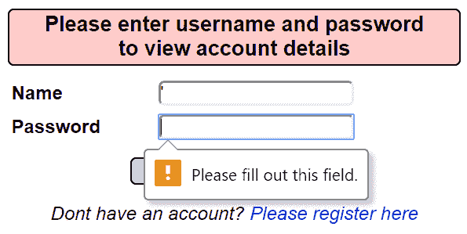
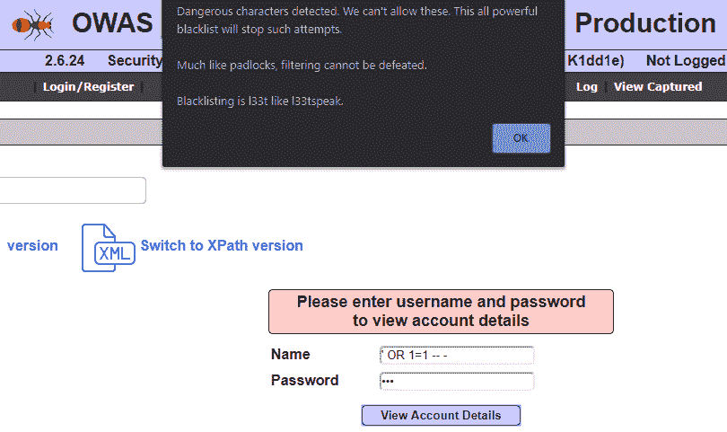

# 第五章：通过防御性解决方案防止 SQL 注入

到目前为止，我们一直关注 SQL 注入的进攻性方面。在前几章中，我们看到恶意用户如何执行主要的攻击技术，以及成功的 SQL 注入攻击可能带来的后果。从一般意义上讲，我们看到 SQL 注入原理上是如何轻松地导致数据库完全被攻破的，这可能泄露敏感信息，赋予攻击者对连接应用程序的完全访问权限，或者完全破坏数据库、应用程序、网络服务，甚至连接设备的功能，无论使用何种技术。

在本章中，我们将更多关注防御方面的内容；既然我们已经知道存在如此强大且具有破坏性的漏洞——而且原理上它是如此容易被利用——我们该如何阻止它呢？这是我们在这里尝试回答的问题。显然，解决这个问题并不简单，通常需要同时采取多种防御措施。我们将逐一介绍最重要的防御措施，探讨在保护与数据库交互的应用程序时，通常需要注意的差异。

本章分为以下子章节：

+   **理解一般性弱点和 SQL 注入的促成因素**：在简要回顾使 SQL 注入成为可能的一般性弱点之后，我们将分析问题的本质，以便深入探讨其根本原因。

+   **处理用户输入**：每次 SQL 注入背后，都会有一些来自恶意代理的输入，试图篡改数据库查询，以执行通常在正常应用程序中无法进行的操作。因此，我们需要一种方法来处理用户如何与发送查询到数据库的应用程序进行交互。

+   **输入清理与控制**：当我们开始将用户输入视为不可信时，我们需要以安全的方式处理它。这是通过应用一些控制技术来实现的，这些技术可以从一开始就阻止 SQL 注入尝试，防止攻击者访问潜在的危险命令或指令。

+   **防御 SQL 注入——代码层级防御**：其中一些技术可以直接在开发应用程序代码时应用。我们将看到一些如何通过安全编码在设计阶段高效地追求安全的例子。

+   **防御 SQL 注入——平台层级防御**：除了在代码层面，其他控制措施还可以应用到应用程序流程的其他层面，利用“深度防御”概念，在多个交互阶段进行防护。

# 技术要求

对于本章内容，我们强烈建议先熟悉一下 SQL 注入场景中涉及的主要技术。除了阅读前几章中的*技术要求*部分，我们建议查看一些常见的与 SQL 结合使用的编程语言的文档，这样在讨论可以应用于应用开发的解决方案时，我们可以达成一致：

+   [`docs.oracle.com/en/java/`](https://docs.oracle.com/en/java/)

+   [`www.php.net/manual/en/`](https://www.php.net/manual/en/)

+   [`docs.microsoft.com/en-us/dotnet/`](https://docs.microsoft.com/en-us/dotnet/)

# 理解常见的弱点和 SQL 注入的启用因素

SQL 是与关系数据库交互的一个强大且有效的工具，因为它提供了通过各种功能和命令执行各种任务的机会。不幸的是，从安全角度来看，这种优势也可能成为负担；允许进行许多不同类型的操作意味着，如果没有适当的控制措施，任何人都可能将利用数据库的应用程序颠倒过来，使得攻击者能够根据恶意想象力做到任何事情，只有其他漏洞的存在才是攻击者能否成功的限制。

在上一章中，你亲眼看到了一个脆弱应用程序可能导致的后果（我们也希望你在过程中玩得开心），如果你已经读到本书的这一部分，你可能也会在想是否有方法能够提高安全性，防止这一切的发生。SQL 数据库今天仍然被广泛使用，所以你可以猜到，简短的答案肯定是有的。详细的答案是，这些防御措施需要一次性应用。

在探索**魔法代码注入彩虹**或甚至`Mutillidae II` Web 应用程序的挑战时，我们看到了单纯的解决方案往往不足以应对，因为通常总有绕过它们的方法。然而，如果防御措施在应用程序的多个点同时实施，那么这些应急方法将不再有效，因为其他同时存在的防御措施将使 SQL 注入攻击几乎不可能发生，除非存在其他漏洞。

SQL 注入的主要问题在于用户输入如何与 SQL 的实际语法进行交互，主要是因为在代码层面上，SQL 语句通常是由文本字符串构建的。各种编程语言使用特定的函数，这些函数接受文本字符串作为参数。显然，这个文本字符串是用 SQL 语法编写的，以便作为 SQL 输入进行解释。以下是我们在*第四章*中使用的脆弱 Java Web 服务中的 SQL **字符串**声明，*攻击 Web、移动和物联网应用*：

String query = "SELECT * FROM " + USER_TABLE + " WHERE username='" + user_id + "' AND password='" + password + "'";

`query` 字符串将作为命令通过 `executeQuery(query)` 发送给数据库，这是一个 Java 函数，在数据库连接内将输入字符串发送到数据库，以便进行处理。

你可以看到，虽然查询中的某些部分有固定的内容，像是由双引号界定的，但其他部分则由先前声明的变量组成。你现在应该已经能够察觉出我们要表达的方向，因为你已经看到了 SQL 注入的实际操作。通过将恶意负载插入查询结构中，攻击者实际上可以让查询执行任意命令，就好像他们自己在编写查询的一部分一样。在我们之前提到的攻击中，攻击者只需将恶意负载插入到`user_id`参数的位置，改变查询结构即可。对于绕过身份验证的同值攻击，生成的查询将如下所示：

SELECT * FROM USER WHERE username=`'' OR 1=1 -- -'` AND password='password'

插入合法的 SQL 表达式可能会改变原本设计的查询功能，就像本例中通过使用字符串定界符和注释所做的那样。这就是为什么在安全方面，必须考虑用户输入。

以一种天真的方式处理这个问题可能会导致大量的攻击场景，这些攻击通过 SQL 注入实现，可能会对应用程序的完整性和安全性造成广泛的损害。因此，在处理来自应用程序外部的输入时，必须确保这些数据的安全性，并且始终要考虑最坏的情况——即这些输入可能来自恶意用户，或者已被故意篡改，目的是破坏应用程序的上下文。这就是为什么我们需要在讨论用户输入时，提到“信任”。

# 处理用户输入

在谈论安全时，什么是“信任”？实际上，这个概念在处理安全问题时非常重要，不仅仅是应用安全。

假设你正在街上走，突然有一个陌生人走过来问你路怎么走。你需要决定是否给这个人指路——当然，他可能是一个心怀不轨的人，想要攻击你偷走你的钱，但你可能会判断这个风险很低；毕竟，周围有很多人，你相信即使情况有些不对劲，你也能应付得了。于是，你决定在这个特定的情况下相信这个人。

当然，这个选择的明智与否取决于具体情况。假设你现在正在保护一个重要的能源厂区，突然一个人走过来，说他们忘记带一些重要文件想要进入厂区。由于你的职责是确保没有人未经授权进入厂区，你有义务核实这个人的身份，默认情况下，你应该不让任何人通过，除非你确认此人拥有根据权限允许进入的资格。

在处理安全问题时，第二种方法当然是我们应该复制的方式。零信任是这个游戏的核心。考虑到恶意用户也可以伪造身份，默认情况下，你不应该信任任何人。基本的假设是，每次都考虑最坏的情况；每个用户可能是恶意用户，因为你无法判断他们的意图，也不能排除这种可能。如果你采取相反的做法，信任每个人，那么一个恶意代理就足以让你的应用程序——甚至可能是你的整个 IT 基础设施——付之一炬。

在我们的例子中，这意味着需要对我们的应用程序和数据库进行防御，因为据我们所知，任何人都可能对我们发起 SQL 注入攻击——尤其是考虑到这种攻击的简单性。这些防御通常可以通过简单的清理和输入控制概念来总结。避免恶意输入的普遍解决方案实际上可以改变我们的应用程序行为，使得这些输入不会被应用程序解读为可能未曾设想的指令。

我们现在将探讨什么是清理输入并应用防御控制的含义，同时考虑在各个阶段可以采取的措施，来挫败攻击者可能进行的任何 SQL 注入计划。

# 清理和输入控制

我们看到所有 SQL（以及其他）数据库本身天生就容易受到 SQL 注入攻击，因为数据库唯一的作用就是接收指令。因此，我们需要在数据流的早期阶段采取措施，在查询实际到达数据库之前，防止注入攻击的发生。

这时，清理就发挥作用了。外部传入的输入会被清理掉任何可能导致危险指令的恶意元素。你可以将这个过程想象成强制要求每个人在进入公共泳池之前先洗个澡——你可以假设人们的个人卫生状况良好，但由于无法保证这一点，最好让每个人都洗个澡，这样可以弥补那些不洗澡的人。在大多数情况下，这可能不是必需的，但它确保了那些确实需要洗澡的情况被覆盖。

显然，清理并没有单一的方式，因为这些控制可以在应用程序流的不同阶段进行。然而，在大多数情况下，有两个主要领域可以应用这些防御：

+   **应用程序编码**：这就是应用程序功能实现的关键所在。大多数防御机制都属于这个领域，我们可以称之为**代码级防御**。通过对代码和信息处理的干预，大多数应用攻击都可以在这里被挫败，严格确保输入和命令按照我们希望的方式结构化和格式化。这可以通过转换输入、仅接受某些字符或输入长度，或动态生成查询来实现。如果做得正确，这通常可以挫败 SQL 注入尝试。

+   **平台和基础设施配置**：除了作用于应用程序代码外，安全控制还可以应用于应用程序所处的环境（从服务器和基础设施的角度来看）。这包括使用外部模块、设备和网络流量控制。虽然这对于安全应用程序代码而言可能显得过于复杂，但它通过阻止任何恶意输入到达应用程序，从而可以大幅减少成功攻击的机会，同时避免对你的应用程序或系统造成附带损害或其他类型的攻击。我们将这些机制称为**平台级防御**。

所有这些措施都是一种**输入控制**，因为它们代表了一种检查、分析和修改应用输入的方式，以使其在到达我们正在运行的软件之前变得无害或完全被阻止。

当然，仅仅应用一个控制机制并不能保证我们的应用程序能够抵御潜在的攻击，保持安全无虞。我们在*第四章*中已经看到，*Web、移动和物联网应用攻击*，仅应用一个控制手段可能不够。当我们查看 Mutillidae II 时，看到了一些简单的客户端控制措施。以下截图将提醒你，我们在尝试使用客户端控制的网页表单执行常规 SQL 注入时的情况：

图 5.1 – Mutillidae II 中的客户端控制

这种客户端控制仅仅防止了信息在字段为空时被提交。Mutillidae II 还采取了另一项客户端控制措施，即检查是否存在禁止字符——在此情况下是 SQL 注入启用字符（例如单引号和连字符——这叫做**黑名单**，我们很快会看到它的实际应用）。使用输入网页表单进行 SQL 注入尝试会失败，应用程序会返回一条带有 JavaScript 警报的信息：

图 5.2 – Mutillidae II 中的客户端控制信息

虽然这确实是代码级防御，但我们已经看到，仅靠客户端控制是没有用的，只要服务器端存在漏洞。我们在 HTTP 请求级别插入了恶意载荷，完全绕过了 Web 表单输入，忽视了这一防御。

这意味着什么呢？最终，最好的做法是应用多层防御，大幅度降低成功攻击的可能性。

在接下来的章节中，我们将看到这些防御机制如何在代码级别和平台/基础设施级别进行应用，了解可以用来保护应用程序免受 SQL 注入攻击的工具。

# 防御 SQL 注入——代码级防御

正如我们之前所说，正确实施代码级防御应该能够挫败所有恶意攻击者攻击你应用程序的计划。当然，错误总是可能发生，这就是为什么最明智的做法是同时应用多种防御机制。在本节中，我们将探索可以用来防止 SQL 注入攻击的主要工具。我们还将看到如何将这些控制措施在三种常见的 Web 应用程序开发编程语言中实现：Java、PHP 和.NET。

## 输入验证

输入验证是根据输入的内容来接受或拒绝输入的过程。我们只希望安全的输入被我们的应用程序处理，从而防止大多数攻击。因此，只有符合我们规则的有效输入才会被我们的应用程序接受和处理。

验证遵循两种主要方法，这两种方法在信息安全的其他领域也很常见：

+   **黑名单**：黑名单方法的核心是确定哪些输入是不允许的，并拒绝所有符合特定黑名单规则的输入。这种方法实施起来确实简单，但可能会在未考虑到的特定编码或发现新攻击方式时被击败。

+   **白名单**：白名单方法是黑名单的逻辑对立面；这些规则定义了什么是允许的，所有不符合该模型的输入都会被拒绝，只接受符合正确性规则的输入。它的实现可能更困难，但绝对值得，因为它能够抵御新发现的攻击，完全忽略应用程序本身未预见到的内容。毕竟，如果没有进行某种攻击尝试，用户为什么要输入一些不寻常的内容呢？

输入验证可能是防止恶意输入到达应用程序的最基本、最简单的方法，而且它是迄今为止最常见的防范手段。

### Java 中的输入验证

Java 是一种非常灵活的语言，拥有悠久的框架开发历史，其中许多框架特别适合用于开发 Web 应用程序。由于可用框架种类繁多，我们将重点介绍最基础的部分。

正如我们之前所说，实现黑名单验证非常简单，你可以通过检查字符串是否包含敏感字符来完成。在以下示例中，我们为了简化，仅黑名单限制单引号和连字符字符。

以下代码检查输入字符串，该字符串作为名为 `input` 的变量传入，并通过调用名为 `constructQuery()` 的函数继续构建 SQL 语句，但只有当字符串不包含任何黑名单字符时：

String s = input;

if(s.contains("\'") OR s.contains("-")){

throw new IllegalArgumentException("非法输入");

} else {

constructQuery(s);

}

白名单在编码上可能会稍微复杂一些，因为我们需要确切知道什么是合法的输入。如果我们期望输入的是名字，可以使用基于字母表的表达式：

String s = input;

if(s.matches("[[A-Z][a-zA-Z]*]"){

constructQuery(s);

} else {

throw new IllegalArgumentException("非法输入");

}

你会注意到，内部逻辑是黑名单的反向版本；只有当我们可以确定输入是合法时，才接受它。

当然，针对 Java 代码应用输入验证的方式还有更多精细的方法，它们通常依赖于特定框架的使用。你可以查阅框架的文档，但原理总是相同的，你会发现自己很容易理解其工作原理。

### PHP 中的输入验证

至于 PHP，与 Java 类似，具体实现取决于使用的框架。与 Java 相似，它提供了一些有用的函数，可以帮助以简单的方式实现输入验证。其函数之一是 `preg_match(regex, string)`，它与 `String.matches()` 函数类似，用于检查 `string` 字符串是否符合正则表达式 `regex` 模式。当然，这可以用于黑名单和白名单的实现：

$s = $_POST['input'];

if(preg_match("/\'/", $s) OR preg_match("\-", $s)){

// 验证失败处理

}

现在，对于白名单的情况，我们保持相同的结构，但以逻辑上反向的方式进行，因为 `if` 现在检查是否与正则表达式不匹配：

$s = $_POST['input'];

if(!preg_match("/[[A-Z][a-zA-Z]*]/", $s){

// 验证失败处理

}

最终，除了不同的语言外，Java 和 PHP 的机制基本相同。

### .NET 中的输入验证

与 Java 和 PHP 不同，ASP.NET 有多种内置控件，用于开发应用程序。一个简单的控件是 `RegularExpressionValidator`，它与我们在 Java 和 PHP 中看到的模式匹配函数采用相同的方法。该控件强制执行服务器端和客户端的验证。

在下面的示例中，我们应用了与前两个代码示例中相同的白名单方法，通过正则表达式进行匹配，只允许一个字母字符串，第一个字母为大写：

<asp:textbox id="input" runat="server"/>

<asp:RegularExpressionValidator id="inputRegEx" runat="server"

ControlToValidate="input"

ErrorMessage="参数必须只包含字母，第一个字母必须是大写字母。"

ValidationExpression="[A-Z][a-zA-Z]*" />

ASP.NET 也有其他内置控件，但这个通常是最有用的，因为它可以原生地根据正则表达式验证输入。

## 参数化查询

另一种防止 SQL 注入的方法是使用所谓的参数化查询。其主要原因是输入永远不会以原始形式（即字符串形式）直接发送到数据库，就像动态字符串构建中那样；而是被序列化并存储在独立的参数中（因此得名）。

这是通过在构建 SQL 语句时使用变量，使用标识符作为占位符，使得实际字符串能够安全地构建。通过使用现代编程语言中大多数数据库系统交互的 API，这一过程变得更加简便。

然而，值得注意的是，单独使用参数化查询并不意味着应用程序就不会受到 SQL 注入的攻击；有时，参数也可以包含存储过程，而存储过程如果存在漏洞，仍然可能导致 SQL 注入。这只是将防御机制结合使用的又一个原因。

参数化查询的另一个好处是，能够轻松地将已经存在的动态字符串 SQL 查询转换为参数化查询。我们将在 Java、PHP 和 .NET 中看到如何实现这一点，首先从一个常规（易受攻击的）SQL 查询构建开始：

User = request("username")

Pass = request("password")

Query = "SELECT * FROM users WHERE username='" + User + "' AND password='" + Pass + "'"

Check = Db.Execute(Query)

If (Check) {

Login()

}

现在让我们来看一下如何将前面片段中的查询进行参数化。

### Java 中的参数化查询

在 Java 中处理任何数据库时，最常用的框架之一是 **Java 数据库连接**(**JDBC**) 框架。它是原生提供的，支持独立于所使用数据库技术的数据库连接，提供连接数据库的有用功能。其中之一就是 `PreparedStatement` 类，它允许使用以下代码：

Connection con = DriverManager.getConnection(connectionString);

String query = "SELECT * FROM users WHERE username=? AND password=?";

PreparedStatement ps = con.prepareStatement(query);

ps.setString(1, user);

ps.setString(2, pass);

rs = ps.executeQuery();

基本的 SQL 语句通过将值替换为问号来修改，然后通过 `PreparedStatement` 实例 `ps` 引用这些问号。然后，`setString()` 方法将按原始查询 `query` 中出现的顺序（`1` 对应 `user` 和 `2` 对应 **pass**）将这些值插入到问号的占位符中。最后，基于准备好的语句调用 `executeQuery()` 方法。

### PHP 中的参数化查询

PHP 也有几个框架可以实现参数化查询。其中一些框架在 PHP 中可用。

我们将使用 **PHP 数据对象**（**PDO**）框架修改原始代码，因为它与 Java 中的 JDBC 框架在兼容性和功能上是直接对应的。它从 PHP 5.1 版本开始被包含在内：

$query = "SELECT * FROM users WHERE user=? AND pass=?";

$stmt = $dbh->prepare($query);

$stmt->bindParam(1, $user, PDO::PARAM_STR);

$stmt->bindParam(2, $pass, PDO::PARAM_STR);

$stmt->execute();

这段代码几乎与 JDBC 示例完全相同；语句是从包含问号形式占位符的 SQL 查询 `query` 中准备的。然后，`bindParam()` 函数将输入参数绑定到问号实例，按数字顺序（`1` 对应 `user` 和 `2` 对应 **pass**），并指定参数的数据类型（`PDO::PARAM_STR` 定义了一个字符串参数）。最后，使用 `execute()` 执行准备好的语句。

### .NET 中的参数化查询

至于 .NET，ADO.NET 框架提供了一种实现参数化查询的方法。这个名字来源于其基础的前身技术——**ActiveX 数据对象**（**ADO**）。

ADO.NET 通过使用**数据提供程序**与数据库进行交互，每个支持的数据库系统都有一个相应的提供程序。由于每个提供程序的代码语法不同，因此我们将展示使用 `System.Data.SqlClient` 提供程序的示例，它适用于 Microsoft SQL Server，以及适用于 Oracle 数据库的 `System.Data.OracleClient`。首先我们来看一下使用 `SqlClient` 时的代码：

SqlConnection con = new SqlConnection(ConnectionString);

string Query = "SELECT * FROM users WHERE username=@user" AND password=@pass";

cmd = new SqlCommand(Query, con);

cmd.Parameters.Add("@user", SqlDbType.NVarChar);

cmd.Parameters.Add("@pass", SqlDbType.NVarChar);

cmd.Parameters.Value[„@user"] = user;

cmd.Parameters.Value["@pass"] = pass;

reader = cmd.ExecuteReader();

这里的参数是通过 `@` 字符引用的，它们通过 `Parameters.Add()` 被添加到 `cmd` 准备好的语句中，这会传入参数名称和类型（在这种情况下，是由 `SqlDbType.NVarChar` 表示的字符字符串）。`OracleClient` 的工作方式类似：

OracleConnection con = new OracleConnection(ConnectionString);

string Query = "SELECT * FROM users WHERE username=:user AND password=:pass";

cmd = new OracleCommand(Query, con);

cmd.Parameters.Add("user", OracleType.VarChar);

cmd.Parameters.Add("pass", OracleType.VarChar);

cmd.Parameters.Value["user"] = user;

cmd.Parameters.Value["pass"] = pass;

reader = cmd.ExecuteReader();

这个结构几乎与 `SqlClient` 示例相同。唯一的区别在于参数的引用方式（在查询语句中使用分号，而在其他地方不使用特殊字符）和对象名称。

## 字符编码与转义

应对恶意输入导致 SQL 注入的另一种流行方法是使用特定的字符编码和转义技术，这样使能字符就不会发送到数据库，从而防止了最常见的 SQL 注入攻击。有时，其他防御措施无法应用——例如，在一些预期姓氏的数据库中，因为某些姓氏可能包含撇号，比如 O'Malley 或 O'Brian，尽管它们仍然会被编码为单引号。在这种情况下，没有其他方法可以允许这些姓氏出现在你的数据库中。

然而，这次我们并没有在输入层面进行相同级别的清理，而是更关注清理输出，以便 SQL 语句中不包含危险字符。我们的目标是避免未清理的语句在应用程序流程中传输并最终到达数据库系统。

当然，这些技术因数据库系统的不同而有所差异，因为它们之间的语法存在差异。我们将看到这些技术在 MySQL、Microsoft SQL Server 和 Oracle 数据库中的应用。

### MySQL 中的字符编码与转义

由于 MySQL 使用单引号作为字符串终止符，因此在构造 SQL 语句时，包含在字符串中的单引号需要进行编码。这可以通过将单引号替换为两个单引号，或者通过使用反斜杠字符（**\**）来转义单引号来实现。

在 Java 中，可以使用一个简单的`replace()`函数来将一个字符的所有出现替换为其他字符：

query1 = query1.replace("'", "\'");

query2 = query2.replace("'", "''");

从 PHP 方面来看，`mysqli` 框架是一个专门用于与 MySQL 交互的 PHP 框架，它适用于 PHP 5.x 及以后的版本。有一个非常方便的函数叫做 `mysql_real_escape_string( )`，它会自动在文本字符串中的单引号前加上反斜杠。这种转义方法同样适用于其他危险字符：

mysql_real_escape_string($parameter);

当然，PHP 中依然可以使用 `REPLACE` 函数：

SET @query1 = REPLACE(@query1, '\'', '\\\'');

SET @query2 = REPLACE(@query2 '\'', '"');

另一个需要注意的清理问题是，其他有害字符包括`LIKE`子句中的通配符，这些通配符可以定义任意字符，可能会在恶意地添加到查询时导致自我证伪。最相关的通配符是`%`字符，它对应于零个或多个任意字符的通配符。可以通过在其前面添加反斜杠来通过`replace()`函数转义：

query3 = query3.replace("%", "\%"); // Java

SET @query3 = REPLACE(@query3, '%', '\\%'); // PHP

在将查询语句发送到数据库或应用程序的其他部分之前，您可以将此机制应用于任何可能危险的字符。

### SQL Server 中的字符编码和转义

对于 MySQL 的假设和机制，同样可以应用于 SQL Server。因此，我们之前提到的 Java 和 PHP 函数都适用于抑制单引号字符。这一次，当我们讨论 SQL Server 时，我们还将考虑相应的 C# 代码，用于将单引号替换为双引号：

query3 = query3.replace("'", "''");

除了我们之前考虑过的 MySQL，SQL Server 也有一个`ESCAPE`子句，可以在`LIKE`子句中用于转义 SQL 查询中的任何字符：

SELECT * from users WHERE name LIKE 'a\%' ESCAPE '\'

上面的查询在`LIKE`子句中转义了反斜杠字符，仅返回用户名为`a%`的记录（前提是该用户名存在）。

### Oracle 数据库中的字符编码和转义

在考虑与 MySQL 相同的假设时，Oracle 数据库通常也依赖于 PL/SQL 语言。它也有一个`replace()`函数，可以如下使用：

query = replace(query, '''', '''''');

Oracle 数据库也支持`ESCAPE`子句，用于`LIKE`子句，就像 SQL Server 一样。

在处理了这些特定技术后，现在我们可以转向更高层次的代码级对策了。

## 安全编码实践

在大多数情况下，所有应用程序安全问题的根源都存在于设计和开发阶段。事实上，设计师和开发人员往往不会在他们所工作的应用程序中考虑安全方面的内容，通常更关注功能方面。这不仅导致了像 SQL 注入这样的漏洞，也导致了这些漏洞的修复变得越来越困难。在设计和开发阶段解决安全问题所需的努力要少得多，因为所要做的只是应用我们之前描述的工具和一些安全设计原则。

OWASP SAMM 框架

OWASP 及其他相关项目已经制定了一个重要框架，为组织提供工具，以确保应用一个促进安全软件开发的模型，涵盖软件设计和开发过程中所有阶段和利益相关者——**软件保障成熟度模型**（**SAMM**）。该框架为企业提供了一种自我评估其软件开发生命周期中安全性的方式，无论所使用的技术如何。欲了解更多信息，您可以访问该项目的网页：[`owasp.org/www-project-samm/`](https://owasp.org/www-project-samm/)。

现在我们将考虑一些有助于防范 SQL 注入的良好实践。这为从编码角度处理 SQL 注入提供了一种以安全为重点的方法，介绍了一些可以证明特别有效的安全编码方面，从而节省在应用程序生命周期后续阶段中的时间和精力。

### 引入额外的抽象层

当我们谈论抽象层时，我们指的是不同的逻辑组件，每个组件都旨在与您的应用程序逻辑进行交互。应用程序层的常见例子包括表示层，它包括应用程序中更具图形性和交互性的方面，以及数据访问层，它旨在与数据进行交互，独立于核心应用程序逻辑。应用程序中分离不同层通常会提高安全性，因为从一层到另一层的迁移通常会受到更多的控制，并使得应用安全措施的实施更加线性和实际。

一个为安全原因引入的特殊附加层的例子是我们之前看到的 ADO.NET 框架，它通过引入一个附加层来与数据库进行交互，专门用于向数据库发送安全命令，类似于一个专用的数据访问层。

### 安全地管理敏感数据

设计安全应用程序时的另一个重要安全原则是决定如何管理和处理潜在的敏感数据。应用程序使用和存储的一些信息对于潜在的恶意攻击者可能具有极高价值，包括身份验证信息，如密码或信用卡号码，甚至其他敏感或个人身份信息，如姓名、姓氏、住址和社会保障号码。

在处理密码时，通常我们谈论的是特别重要的信息，这些信息通常是攻击者特别关注的目标。采取的最有用的措施之一是使用特别的**安全哈希算法**（**SHA**），例如 SHA-2，它提供了加密哈希中最高的标准之一，生成 256 位或 512 位长度的单向摘要。我们在上一章中看到，像**消息摘要算法 5**（**MD5**）等已被超越的标准不再安全，容易被攻破，攻击者可以在成功的 SQL 注入攻击中提取原始密码值。

保护敏感信息的另一种方式是通过屏蔽数据，只向应用程序显示部分数据，同时保持原始数据不变。这可以通过在应用程序中适当处理这些数据来实现，采用伪匿名化技术，例如，用特殊字符（如*****）替代数据的大部分，使其对信息拥有者可识别，同时又不会泄露超过必要的信息给外部人员。

当然，我们希望我们的应用程序尽可能对 SQL 注入免疫，但考虑到这个风险永远不可能为零，这种类型的保护无疑能在确保应用程序及其数据的安全性方面起到决定性作用，最大程度地减少成功攻击的影响。

### 存储过程

这个措施可能是迄今为止最具体的，因为它直接与 SQL 数据库相关。存储过程是存储在数据库本身中的特定指令，可以对其实施更严格的访问控制。

我们看到一个应用程序可能会访问整个数据库，所以当它遭遇 SQL 注入攻击时，攻击者可能会获得访问权限，甚至访问数据库中其他应用程序所在的同一数据库中的信息，就像我们在上一章中看到的，OWASP 损坏 Web 应用程序虚拟机的共享 MySQL 数据库，它允许访问属于其他应用程序的信息。

当使用存储过程时，你可以更改存储过程中的指令的访问权限，赋予执行的命令比应用程序更低的权限。这意味着要执行**最小权限原则**，即如果某种原因攻击者能够入侵包含 SQL 命令的存储过程，损害将会被限制，因为已经实施了更严格的访问控制。

以上内容总结了在应用开发和编码方面可以采取的措施。尽可能多地应用这些措施，肯定有助于保护你的应用免受 SQL 注入攻击。然而，这并不是你可以对应用程序采取的唯一额外安全措施，因为你还可以在应用程序运行的环境上下手。让我们看看这意味着什么。

# 防御 SQL 注入 – 平台级防护

如前所述，平台级防护指的是我们可以在平台和基础设施层面采取的所有安全措施，可能防止恶意命令进入或离开应用程序，并识别和阻止有害流量。这还包括对数据库系统本身应用安全措施。

在这里，我们展示了通过在应用程序外部应用安全控制和措施来保护应用程序免受 SQL 注入攻击的方法，从而提供额外的保护层。这个概念被称为**深度防御**，它是信息安全中最相关的方面之一，帮助最小化系统和应用程序可能面临的威胁。

## 应用级防火墙逻辑

第一个，也是最著名的保护概念是防火墙。一般来说，防火墙是一种根据某些特定规则决定是否允许数据流（通常是网络流量）通过的设备。在企业安全中，防火墙通常是位于网络和子网络边界的物理设备，充当网关。这些设备通常是专门用于过滤进入或离开网络的流量的加固计算机。

虽然传统的防火墙当然能帮助抵御任何类型的攻击，但我们更关注应用级的防护。通常，防火墙独立于网络中的应用程序存在，因此我们将它们视为相对于我们的范围的外部实体。然而，防火墙的相同逻辑也已应用于应用级概念，通过过滤指向应用组件的请求，方式与传统防火墙类似，丢弃任何根据一套规则被认为对指定应用组件有害的内容。让我们看一些这个概念的例子。

### Web 应用防火墙

说到 Web 应用安全，几乎不提**Web 应用防火墙**（**WAFs**）几乎是不可能的。WAF 通常以软件解决方案或内嵌于特定网络设备中的形式存在，旨在保护 Web 应用免受各种可能的攻击，包括 SQL 注入攻击。最实际的解决方案是使用基于软件的 WAF。这些 WAF 通常内建于 Web 应用或 Web 服务器中，并且由于不会改变应用周围的 Web 基础设施，因此几乎不需要配置工作。另一方面，基于设备的 WAF 在某些情况下也能发挥作用，因为它们的活动不会占用 Web 服务器的资源，从而不会影响功能和性能。然而，由于应用开发者通常不愿意干预周围的基础设施，因此我们通常会讨论基于软件的 WAF，部分原因也是因为它们可以简单地实施。

WAF 通常通过使用定义允许和拒绝内容的过滤器来工作。这些过滤器作为 WAF 的规则，负责接受或拒绝请求。过滤器需要正确配置，以防止大多数针对应用的攻击。过滤器的实现方式有很多种：

+   **Web 服务器过滤器**：这些过滤器作为额外模块安装在 Web 服务器上，通常作为额外组件工作，评估进入 Web 服务器的请求。根据 Web 服务器技术的不同，实施方式可能有所不同。一些例子包括`ModSecurity`（可在[`modsecurity.org/`](https://modsecurity.org/)找到），它适用于 Apache，还有微软的`UrlScan`，它专为 IIS Web 服务器设计（[`docs.microsoft.com/en-us/iis/extensions/working-with-urlscan/urlscan-3-reference`](https://docs.microsoft.com/en-us/iis/extensions/working-with-urlscan/urlscan-3-reference)）。

+   **应用过滤器**：这些过滤器可以作为你应用的额外模块实现，通常使用相同的编程语言。对于应用开发者来说，这个选项通常被认为是可行的，因为这些过滤器通常与 Web 服务器技术无关，并且可以作为额外的应用插件加入。OWASP 的一个显著例子是 OWASP Stinger，但 OWASP 已经不再支持它。

+   **Web 服务过滤器**：另一个有用的选项是过滤 Web 服务消息。这可以通过定制方式进行，比如过滤包含 SQL 注入尝试的输入消息，或者过滤包含信息泄露的输出消息。

WAF 是一种非常多功能的工具，可以用在不同的模式下进一步提高安全性。

### 应用入侵检测系统

除了常规的基于网络的**入侵检测系统**（**IDSes**），这些系统可以用来识别网络攻击并提供警报功能，Web 应用防火墙（WAF）可以作为应用层 IDS，直接将这一概念应用于它所保护的特定应用程序。

其工作原理是将 WAF 置于被动模式，这样它可以检查应用程序请求，并在发现可疑请求时发送警报。通过这种方式，网络管理员可以在安全事件发生时及时收到警告，从而根据警报触发采取行动。

### 数据库防火墙

我们要考虑的最后一个防火墙是数据库防火墙。数据库防火墙基本上是一个代理服务器，位于应用程序和数据库之间，负责检查发送到数据库的查询。

应用程序以与直接发送到数据库相同的方式发送查询，但查询会被发送到数据库防火墙。在这一点上，数据库防火墙可以检查查询，查看是否存在任何异常（例如，是否包含偏离正常应用行为的语句、同义反复或任何指定的非法字符）。代理随后可以根据其评估规则决定查询是否可以到达数据库，从而避免数据库接收到有害的查询。

由于数据库通常由应用程序调用以执行由应用程序需求定义的一组特定功能，因此建模白名单规则是最好的方法，只允许被接受的查询通过代理。

## 数据库服务器安全机制

现在我们已经看到通过阻止恶意输入和输出数据来保护应用程序边界的方法，唯一需要保护的元素就是数据库服务器本身。我们可以将迄今为止所学到的一些概念应用于数据库的安全保护。

### 保护数据库数据

除了应用我们已经看到的措施——比如哈希密码和屏蔽敏感数据——确保数据库本身安全的最显而易见的步骤就是对存储的数据应用加密。加密确保了如果直接读取数据库（例如，如果数据库中的数据以某种方式被复制或转储），其内容仍然受到保护，无法被恶意攻击者读取。

加密本身无法提供 100%确定性，确保数据永远不会被未授权的个人或组织读取，但它保证了要破解这种保护需要足够长的时间和大量的计算能力，从而使得这些攻击变得不切实际或几乎不可能。

加密算法随着时间的推移不断发展，并且每当发生重大技术突破并且个人和组织拥有更多计算能力时，它们可能会变得过时。这种情况在较旧的加密标准中已经出现过，比如**数据加密标准**（**DES**），这种标准已使用多年。然而，随着普通计算机性能的不断提升，其加密方式被认为不再安全。其他更可靠的标准，如 3DES（DES 算法的三重迭代），现在也由于相同的原因被认为不安全。虽然几年前它们提供了足够的安全性，但一些攻击者可能拥有足够的计算能力来破解它们，从而能够访问受保护的信息。

现代加密学的事实标准如今是**高级加密标准**（**AES**）——特别是使用 256 位密钥的 AES-256，它提供了很高的安全保证。它作为对称加密算法工作，因为加密和解密数据都使用相同的密钥。只要密钥保持秘密，所加密的信息将继续受到保护。为了让这个安全特性更有感知，破解 256 位密钥的暴力破解方法，需要尝试所有可能的组合，可能需要高达 2 的 256 次方次的尝试（结果是一个 78 位数字）。即使每次尝试只需要一纳秒（十亿分之一秒），破解所有可能的组合所需的时间也超过任何 68 位数的秒数。如果使用程序来破解加密，它运行的时间将远远超过太阳的预期寿命，而太阳的预期寿命大约是 50 亿年。

通过加密技术保护数据的唯一挑战在于保持加密密钥的秘密性。这远非易事；如果密钥直接存储在数据库服务器上，它可能会被攻击者读取。一个可行的解决方案是将密钥安全地存储在不同的位置——例如，存储在应用服务器的安全位置。为了使用密钥，攻击者需要同时攻破应用服务器和数据库服务器。

使用适当的机制对数据库中的数据进行加密，应当能够在原始数据被外泄或存储数据的实际设备被盗时，提供足够的安全性，从而保护信息的机密性。

### 保护数据库服务器

在对存储的数据进行操作之后，接下来我们来看看如何保护数据库服务器。数据库服务器首先是网络中的一个系统，因此它可能天生就容易受到网络攻击。有许多方法可以防止或最小化恶意行为的影响，以下是一些示例：

+   **修补**：数据库服务器是你基础设施中的一部分。因此，你需要确保它的漏洞最少，以便攻击者能够通过最少的方式对其进行破坏。一个基本的安全原则是确保运行在数据库服务器上的软件始终保持最新，并安装了最新的安全更新。

    大多数更新的发布是为了修复漏洞，其中一些漏洞对服务器及其周围基础设施构成严重风险。因此，安装安全更新至关重要，不仅要安装在数据库系统上，还要安装在操作系统和所有已安装的软件上。

    漏洞实际上可能会被一个接一个地利用，更多的漏洞意味着系统被攻破的风险增加。修补不仅可以手动执行，还可以通过自动修补代理来强制执行，这些代理在各种企业网络中被广泛使用。

+   **执行最小权限原则**：我们在处理存储过程时已经讨论过最小权限原则。这一次，我们需要更广泛地讨论它。在操作系统上，程序可以在不同级别运行，从低权限到管理员级别不等。

    提高安全性的一种方法是确保数据库程序在低权限级别下运行，包括读取、写入和执行权限。应用最小权限原则可以确保，即使数据库被攻破，由此导致的行动其影响也会被减轻——攻击者对系统本身造成损害的机会较小，并且可能仅能进行有限的横向移动（即攻击网络中的其他系统）。

+   **执行身份验证和监控控制**：最后，防止攻击者造成损害的另一种方法是通过改善与身份验证和监控相关的安全控制。这包括确保密码不弱，通过实施强密码策略、禁用默认帐户（默认帐户通常是攻击者的目标，因为他们已经知道用户名，只需要猜测密码）以及启用日志记录，以便跟踪可能的身份验证尝试和服务器本身的操作。

这部分总结了在平台级防御中可以采取的更实际的措施来防范 SQL 注入。除了这些，值得注意的是在保护应用程序时需要考虑的一些更一般的原则。

## 其他安全措施

除了我们到目前为止所看到的，基础设施和平台级的防御还可以包括一些其他通用原则，如果遵循这些原则，可以进一步提高你的环境的整体安全性。一般来说，应用我们到目前为止所看到的所有措施肯定能使你的应用程序和系统达到一个相当令人满意的安全水平，但为了完整性，我们现在将列出一些可能的调整措施，提供额外的 SQL 注入防护。

### 降低信息泄露

在对应用程序或系统进行攻击时，恶意代理总是会尽其所能尽可能多地获取关于你环境的信息，以便根据获得的信息尝试各种攻击。限制他们可以访问的信息可以有效减少他们的攻击潜力，从而最大限度地降低你的应用程序被入侵的风险。在这里，我们将介绍一些减少泄露信息可能有用的领域，并有效限制攻击者潜力的方式：

+   **不显示错误信息**：当我们处理攻击性 SQL 注入技术时，我们尽可能依赖错误信息。默认的 SQL 错误信息可能泄露关于版本和查询语法的信息，还可能为攻击者提供其他线索，尝试其他攻击。显示错误信息可能会给攻击者更多线索，比你可能希望的要多，因此避免显示错误信息是一个好主意。

    有时，完全不显示错误发生的情况是一个明智的选择，可以避免可能的盲目 SQL 注入攻击。你可以选择在应用程序中根本不显示任何错误，或者提供一个通用的自定义 HTTP 错误页面（例如，HTTP 500 错误页面）。当然，这会使调试变得更加困难，但如果应用程序处于生产环境中，这应该不是问题。

+   **防止 Google（以及其他搜索引擎）黑客攻击**：Google 黑客技术是一种通过在 Google 搜索字符串中插入特定操作符来返回网站特定信息的方法。插入某些关键词可能使攻击者通过访问包含特定关键词的网页，获取与你的应用程序相关的信息。可以通过编辑你网站根目录中的一个文件来防止这种情况，指示搜索引擎不要抓取你的网站，从而避免内页被它们访问。这个文件叫做 `robots.txt`，其内容如下所示，以防止这种行为：

    用户代理: *

    禁止: /

    这意味着不允许网络爬虫索引你的网站，从而防止通过特定的网页搜索显示可能被攻击者利用的内容，这些内容可能为攻击者提供有用的信息。

限制应用程序展示的信息量，仅限于严格必要的内容，能极大提升安全性，因为它能有效打击潜在攻击者尝试破坏应用程序的行为。

### 安全的服务器部署

另一个关键的安全步骤是服务器部署，部署时需要采取尽可能低风险的方法。

通常，最好将应用程序基础设施元素分开。这包括应用程序/ Web 服务器和数据库服务器。如果它们部署在同一台机器上，攻击者通过攻破其中一方，可能轻易地获得对另一方的访问权限。此外，这可能会削弱诸如加密等措施的作用，因为攻击者将同时访问数据库和存储的加密密钥。一般来说，将架构拆分成更多组件有助于通过减少可能恶意行为造成的影响来保持安全性。

部署时还应确保机器配置已被安全设置，移除开发阶段调试和测试时的典型配置。例如，一些用于调试和远程访问的开放服务可能为攻击者提供攻击点，攻击者可以利用这些点破坏您的系统和应用程序。

### 网络访问控制

最后，与为每个服务器使用单独机器配合的另一项安全措施是应用**网络访问控制**（**NAC**）。NAC 包括仅允许特定主机连接到特定服务器和服务。例如，在我们将 Web 服务器和数据库服务器分开部署的环境中，我们希望数据库服务器只接受来自 Web 服务器的连接。否则，攻击者如果成功入侵网络，可能直接与数据库服务器进行交互，从而绕过我们在应用程序层面所设置的大部分安全措施。

这可以通过例如仅允许具有特定证书的主机连接，或者通过使用防火墙，仅允许来自特定主机的连接来实现。路由器也可以通过实施访问控制列表来强制执行这一原则，提供一组允许接受连接的主机。

# 总结

这些信息确实不少。应对防御机制时，需要考虑许多因素，且应用于环境中的防御机制越多，攻击者造成损害的机会就越小。因此，使用本章中描述的所有安全措施——或者根据具体情况和这些控制的适用性，几乎所有的安全措施——对安全至关重要。

本章首先介绍了防止 SQL 注入的对策的基本方面——特别是如何处理用户输入和控制数据流。然后，我们分析了处理应用程序编码的具体防御措施，应用开发中的一般模式，以及保护应用程序周围基础设施的方式。

至于代码级防御，我们看到如何验证输入，使用黑名单和白名单方法，只接受安全输入。接着，我们应用了清理措施，不仅在构建查询语句时使用参数化查询，还利用字符编码和转义来避免可能导致 SQL 注入的有害字符。同时，我们也审视了安全编码实践，展示了构建防止 SQL 注入攻击的安全代码的理由，并且间接提高了应对其他攻击的能力。

平台级防御可能超出了应用安全的严格范围，涉及更多的安全原则。我们看到如何通过 WAF 和数据库防火墙将防火墙逻辑应用于应用组件。然后，我们分析了如何保护数据库本身，这是依赖数据库的应用架构中最重要的部分之一，既要考虑数据，也要考虑数据库服务器。最后，我们讨论了其他一般的安全措施，以提高应用程序的整体安全性。

虽然所有这些措施都有助于防止 SQL 注入，但你会意识到，重点通常更多地集中在一般安全性上。下一章将帮助你从更全面的视角审视你所学的内容，让你能够批判性地回顾所学的知识。可以把它当作一段长时间旅程后的回顾，让你有机会思考你所见所闻的所有内容。希望你不仅对 SQL 注入有更深的了解，也对一般安全性有了更广泛的认识。也许（仅仅也许）这还会激发你对更广泛的网络安全的兴趣！

# 问题

1.  设计应用程序时，应该如何处理用户输入？

1.  输入验证是什么意思？请描述两种验证方法。

1.  什么是参数化查询？

1.  为什么字符编码和转义对防止 SQL 注入有用？

1.  WAF 的作用是什么？

1.  将加密密钥存储在与加密数据相同的位置安全吗？
