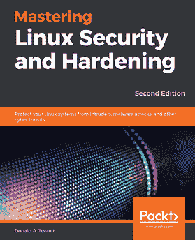
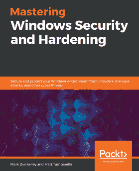

# 第六章：其他您可能感兴趣的书籍

如果您喜欢这本书，您可能还会对 Packt 出版的以下其他书籍感兴趣：

**Linux 安全与强化实战 - 第二版**

Donald A. Tevault

ISBN: 978-1-83898-177-8

+   创建锁定的用户账户，并设置强密码

+   配置防火墙，包括 iptables、UFW、nftables 和 firewalld

+   使用不同的加密技术保护您的数据

+   强化安全外壳服务，防止安全漏洞

+   使用强制访问控制保护系统免受漏洞攻击

+   强化内核参数并设置内核级审计系统

`Mastering Windows Security and Hardening`

Mark Dunkerley, Matt Tumbarello

ISBN: 978-1-83921-641-1

+   理解基准化并学习构建基准的最佳实践

+   掌握基于 Windows 系统的身份管理和访问管理

+   深入了解基于 Windows 系统的设备管理和远程管理

+   探索硬化 Windows 服务器并保护客户端的安全性

+   审计、评估和测试，确保控制措施成功应用并执行

+   监控并报告活动，以掌握漏洞情况

# 留下评论 - 告诉其他读者您的想法

请通过在购买该书的网站上留下评论，与他人分享您对本书的想法。如果您是从亚马逊购买的书籍，请在本书的亚马逊页面上留下真实的评价。这对其他潜在读者非常重要，他们可以通过您的公正意见做出购买决定；我们也能了解客户对我们产品的看法；作者们也能看到您对他们与 Packt 合作创作的书籍的反馈。这仅需您几分钟时间，但对其他潜在客户、我们的作者以及 Packt 来说都非常宝贵。谢谢！
