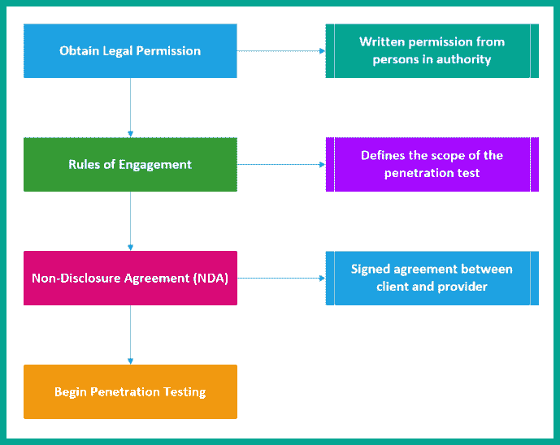
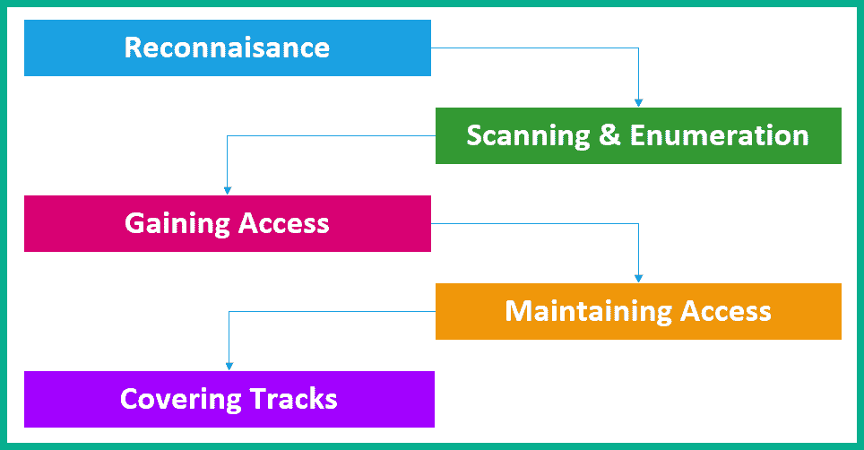
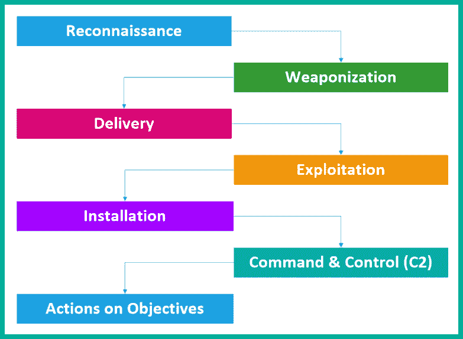
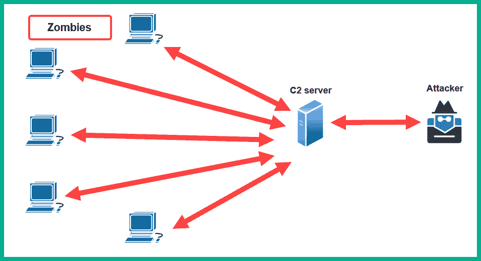

# 第一章：1 道德黑客入门

## 加入我们在 Discord 上的书籍社区

[`packt.link/SecNet`](https://packt.link/SecNet)网络安全是世界上最令人兴奋且发展迅速的领域之一。每天，安全专业人员和研究人员都在以越来越快的速度发现新的、出现的威胁，许多组织也发现他们的系统和网络被恶意行为者侵入，而许多公司却没有适当的网络防御来检测威胁并判断其资产是否受到侵害。由于全球范围内网络攻击和威胁的增加，许多组织正在创造更多与网络安全相关的职位，寻求获得行业专家和技术人员，以帮助提升其网络防御并保护资产免受网络犯罪分子的攻击。本书旨在为有志成为道德黑客和渗透测试人员的网络安全行业从业者提供必要的技能、知识和智慧。在本书的过程中，您将掌握新技能并学习技术，模拟现实世界中的网络攻击，作为一名网络安全专业人员，旨在发现组织中潜在的安全漏洞，同时了解真实攻击者用来妥协目标的**战术、技术和程序**（**TTPs**）。此外，您还将学习如何利用网络安全行业中最流行的 Linux 发行版之一——*Kali Linux*，对目标系统和网络基础设施进行道德黑客和渗透测试评估。Kali Linux 操作系统预装了大量 Linux 软件包（应用程序）和安全工具，这些工具通常被行业专家使用，因此它是一个集成了您作为道德黑客和渗透测试人员所需的一切的武器库。在本书中，我们将采用以学生为中心、对学习者友好的方法，结合大量的实用和动手练习，帮助您从初学者逐渐过渡到中级，再到高级主题。在本章中，您将学习到各种类型的威胁行为者，以及他们攻击目标背后的动机和意图。此外，您还将了解在攻击者策划网络攻击时，如何通过各种关键因素来决定攻击的复杂性，并与雇佣的网络安全专业人员（如道德黑客和渗透测试人员）对比，他们的任务是发现公司中潜在的安全漏洞。接下来，您将了解道德黑客和渗透测试的各个阶段，以及行业专家常用的渗透测试方法。最后，您将深入理解**网络杀伤链**框架如何帮助网络安全专业人员更好地理解网络攻击，以及如何将每个阶段与渗透测试技术对接。在本章中，我们将覆盖以下主题：

+   理解网络安全的必要性

+   理解威胁行为者关心的事项

+   探索渗透测试的重要性

+   发现渗透测试的方法

+   探索渗透测试的方法论

+   理解网络攻击链

我希望你和我一样，激动不已地开始这段精彩的旅程。让我们深入了解吧！

## 理解网络安全的必要性

网络安全专注于保护系统、网络和组织免受旨在造成损害或伤害的专门攻击和威胁，这些网络犯罪分子通常被称为**威胁行为者**。随着时间的推移，越来越多的用户和组织将他们的系统和网络连接到全球最大的网络——互联网，而网络犯罪分子也在不断发展新的策略，从潜在受害者那里窃取资金。例如，许多网络犯罪分子正在开发更为复杂的威胁，例如勒索软件，这是一种加密恶意软件，旨在加密受害者系统中的所有数据，除了主操作系统。其目的是加密受害者在受感染系统中的最有价值资产——存储在本地存储介质上的数据，并要求支付以加密货币形式的赎金，以获取解密密钥恢复数据。勒索软件在受感染系统上停留的时间越长，勒索软件代理就越有可能建立与一个或多个由网络犯罪分子拥有和管理的**指挥与控制**（**C2**）服务器的通信通道，以接收更新和额外指令。威胁行为者可以向勒索软件代理推送更新，频繁更新用于加密受害者数据的加密密钥，从而降低受害者安全恢复数据的可能性。在此期间，威胁行为者还在将受害者系统上的数据窃取并出售到*暗网*的各种市场，卖给出价最高的买家。网络犯罪分子很聪明，他们非常清楚组织知道存储在其计算机和服务器上的数据的价值，并会不惜一切代价尽快恢复这些数据。

> 重要提示
> 
> > 勒索软件有能力危及与感染系统连接的各种云存储中的数据。例如，假设某用户的系统运行着一个云存储代理程序，以确保用户的数据始终同步。如果系统感染了勒索软件，感染将加密本地存储驱动器上的所有数据，包括那些已同步到云服务提供商平台的数据。然而，许多云存储提供商已内置防护措施，以应对此类威胁。

从网络安全的角度来看，不建议支付赎金，因为无法保证威胁行为者会释放加密数据，甚至提供正确的解密密钥来恢复数据。例如，世界上许多组织采取的是反应式的网络安全策略，即只有在其系统和网络受到网络攻击后才会做出反应，而不是实施缓解和对策来预防未来的威胁。然而，如果一个组织没有实施有效的网络防御措施和应急响应计划，当勒索病毒侵入网络中的一个脆弱系统时，可能会自动传播到组织内其他脆弱的系统，扩大其立足点。因此，网络威胁在网络中被遏制/隔离所花费的时间越长，造成的损害就越大。

> 重要说明
> 
> > 在本书的上一版中，Rishalin Pillay 先生提到，在他任职于微软时，他曾见识到攻击者“可能”会将解密密钥提供给受害者，但威胁行为者会 100%植入额外的恶意软件，为了更多的现金收益而回访。实际上，受攻击的组织成为了威胁行为者（攻击团体）的“摇钱树”。

因此，没有网络安全专业人员、研究人员和安全解决方案，许多组织和用户将无法避免各种类型的威胁。例如，许多银行提供在线银行系统，使客户能够执行各种类型的交易，如支付、转账等。试想一下，如果网络犯罪分子发现某银行客户登录门户存在安全漏洞，并找到了利用这一漏洞未授权访问多个客户账户的方法，窃取他们的**个人身份信息**（**PII**）并从他们的账户中转账。甚至可能利用客户数据作为未来网络攻击的新目标，故此，组织还需要保护客户数据。

### 识别威胁行为者及其意图

作为一名有抱负的网络安全专业人员，培养良好的道德观并理解不同类型的威胁行为者及其背后动机是非常重要的。让我们仔细看看网络安全行业中常见的几种威胁行为者类型：

+   **脚本小子** – 脚本小子是一种常见的威胁行为者类型，他们不一定是年轻人或孩子。实际上，他们通常是那些没有完全理解网络安全技术细节，无法独立进行网络攻击或开发威胁的人。然而，脚本小子通常会按照真实黑客的指导或教程，执行自己的攻击，针对特定系统或网络进行攻击。

虽然你可能认为脚本小子（script kiddie）是无害的，因为他们没有必要的知识和技能，但他们通过遵循网络上恶意行为者的说明和教程，能够造成与真正黑客一样多，甚至更多的破坏。这种类型的黑客利用他们对工具的不了解来操作，从而造成更多的伤害和损害。

+   **黑客激进分子**（Hacktivist）– 世界各地的许多国家都有许多社会和政治议题，也有许多人和团体在这些议题上持支持或反对立场。你经常会看到抗议者组织集会、游行，甚至进行非法活动，比如破坏公共财产。有一种类型的威胁行为者，利用他们的黑客技能，执行恶意活动，以支持某种政治或社会议程。这类人通常被称为*黑客激进分子*。虽然有些黑客激进分子出于善意使用他们的黑客技能，但请记住，黑客行为仍然是非法的，威胁行为者可能会面临执法机构的法律追诉。

+   **内部威胁**（Insider）– 许多威胁行为者知道，通过互联网突破一个组织的防线是更具挑战性的，而从目标组织内部网络入手则容易得多。一些威胁行为者会伪造身份和简历，意图申请进入目标组织工作，成为员工。一旦这种类型的威胁行为者成为员工，他们将能访问内部网络，并更好地了解公司的网络架构和安全漏洞。因此，这类威胁行为者可能会在网络中植入后门，创建远程访问关键系统的途径。这类威胁行为者通常被称为内部威胁者。

+   **国家支持的黑客**（State-sponsored）– 这种类型的威胁行为者通常被称为**国家级黑客**。虽然许多国家会派遣军队去打仗，但许多战斗现在是在网络空间中进行的，这被称为**网络战争**。许多国家已经认识到，发展和增强网络防御是保护公民、国家资产和关键基础设施免受网络犯罪分子和其他恶意国家攻击的必要措施。因此，政府会雇佣*国家支持的黑客*，负责对其他国家进行侦察（情报收集），并保护自己国家免受网络攻击和威胁。有些国家会利用这种类型的威胁行为者收集其他国家的情报，甚至破坏控制公共事业或其他关键资源基础设施的系统。

+   **有组织犯罪** – 在全球范围内，我们经常读到并听到许多犯罪集团和有组织犯罪团伙的新闻。在网络安全行业中，也有由一群具有相同目标的人组成的犯罪组织。该组织中的每个人通常都是专家或拥有某种专业技能，例如其中一人可能负责对目标进行广泛的侦察，另一个则负责开发**高级持续性威胁**（**APT**）。在这个有组织的犯罪团体中，通常会有一个人负责为该团体提供资金，以便购买最好的资源，确保攻击成功。这种类型的威胁行为者的意图通常很大，例如窃取目标的数据并出售以获取经济利益。

+   **黑帽** – 黑帽黑客是指那些出于恶意目的使用黑客技能的威胁行为者。这些黑客可以是任何人，他们对目标系统或网络发动攻击的原因可能是随机的。有时他们可能会为了破坏目标的声誉、窃取数据，甚至只是为了个人挑战和娱乐，进行黑客攻击。

+   **白帽** – 白帽黑客是行业中的“好人”。这种类型的黑客利用他们的技能帮助组织和个人保护他们的网络安全，防止恶意黑客的侵害。伦理黑客和渗透测试员就是白帽黑客的典型例子，他们以正面和道德的方式利用自己的技能帮助他人。

+   **灰帽** – 这是指在白帽黑客和黑帽黑客之间游走的人。这意味着灰帽黑客拥有黑客技能，并且在白天作为网络安全专业人士帮助个人和组织，而在夜间则出于恶意目的利用这些技能。

随着新技术的不断发展，许多人总会以好奇的心态，寻找方法深入理解系统的底层技术。这常常导致他们发现设计中的安全漏洞，并最终能够利用这些漏洞进行攻击。完成本节后，你已经了解了各种威胁行为者的特点及其发动网络攻击的意图。在接下来的章节中，我们将深入了解威胁行为者关心的事项。

### 探索网络安全术语

在你进入网络安全领域的旅程中，你将会接触到许多常见的术语和行话，这些术语在各种研究论文、文章、文献、讨论和学习资源中经常出现。作为一名有志于从事网络安全的专业人士，了解并深入理解常见术语，以及它们与伦理黑客和渗透测试的关系是非常重要的。以下是网络安全行业中最常见的术语：

+   **资产**：在网络安全领域，我们通常将资产定义为对组织或个人有价值的任何事物。例如，资产是网络中的系统，可以与之互动，并可能暴露组织的网络基础设施于安全漏洞，从而可能被入侵并使网络犯罪分子获得未经授权的访问权限，同时提供一种方式将他们在受损系统中的权限从普通用户提升为管理员或 root 级权限。然而，值得提及的是，资产不仅限于技术系统，其他形式的资产还包括人员（人类）、物理安全控制，甚至是我们试图保护的网络和系统中的数据。

资产通常被分为以下几类：

1.  **有形资产**：有形资产简单来说是指任何具有价值的实物物品，例如计算机、服务器、网络设备（路由器、交换机等）和安全设备（防火墙）。计算机和其他终端设备帮助普通用户和员工访问网络上的资源，并在组织内执行日常任务。服务器通常用于存储和托管应用程序，并提供在典型网络基础设施中所需的服务。

网络设备包含用于在系统之间转发网络流量的配置，而安全设备则用于过滤不必要的流量，防止网络和系统之间的威胁。如果这些系统和设备受到攻击，网络犯罪分子将能够将网络流量重定向到由恶意行为者控制的恶意网站，并扩展他们的操作。

1.  **无形资产**：无形资产是没有实体形态但具有价值的事物，例如应用程序、软件许可密钥、知识产权、商业计划和模型，以及数据。

1.  **人员**：这一类资产指的是组织的客户和员工。保护客户的数据不被盗窃并泄露到*暗网*，同时保障员工免受各种威胁。

识别组织的所有资产以及可能对其造成损害和破坏的潜在威胁是非常重要的。

+   **威胁**：在网络安全的背景下，威胁是指任何可能对系统、网络或个人造成损害的事物。无论你是在网络安全领域专注于进攻还是防御，识别各种类型的威胁都是至关重要的。全球许多组织每天都会面临不同类型的威胁，而他们的网络安全团队则日夜工作，确保公司的资产免受网络犯罪分子的侵害。

网络安全领域最激动人心、但也最令人不知所措的一方面就是行业专业人员总是需要保持比威胁行为者更领先一步，迅速发现系统、网络和应用中的安全弱点，并采取对策以减轻任何潜在威胁。

+   **漏洞** – 漏洞是指在技术、物理或人类系统中存在的安全弱点或缺陷，黑客可以利用它们来未经授权地访问或控制网络中的系统。组织中常见的漏洞包括人为错误（全球范围内最大的漏洞）、设备配置错误、使用弱用户凭证、糟糕的编程实践、操作系统未打补丁、主机系统上的应用程序过时、使用默认配置等。

威胁行为者会寻找*最容易利用的漏洞*，例如在目标系统中最容易被攻击的漏洞。渗透测试也是如此。在安全评估过程中，渗透测试人员会使用各种技术和工具来发现漏洞，并在处理更复杂的安全缺陷之前，首先尝试利用那些简单的漏洞。

+   **漏洞利用** – 漏洞利用是指用于利用系统中的安全漏洞的任何工具或代码。例如，拿起一把锤子、一块木板和一根钉子。漏洞是木板的柔软、易渗透的特性，而漏洞利用就是将钉子钉入木板的行为。一旦在目标系统上发现安全漏洞，威胁行为者或渗透测试人员将从各种在线资源中获取漏洞利用工具，或者自己开发一个可以利用安全弱点的工具。

如果你已经获取或开发了一个漏洞利用工具，那么你需要在一个系统上进行测试，确保该漏洞利用工具具有破坏目标系统的能力，并且能够按预期工作。有时候，一个漏洞利用工具可能在一个系统上有效，而在另一个系统上无效。因此，经验丰富的渗透测试人员通常会测试并确保他们的漏洞利用工具能够按预期工作，并根据其成功率对漏洞进行评分。

+   **攻击** – 攻击是威胁行为者用来利用系统中的安全漏洞的方式或技术。有多种类型的攻击被网络犯罪分子广泛使用，以破坏目标系统的机密性、完整性和/或可用性。例如，LockBit 3.0 勒索软件专注于利用存在于面向互联网的系统中的安全漏洞，这些系统没有将语言设置配置为匹配特定的排除列表。该攻击通过在互联网上启动勒索软件，自动寻找并破坏易受攻击的系统。

    > 重要说明
    > 
    > > 要了解更多关于 LockBit 3.0 勒索病毒的信息，请参见美国网络安全和基础设施安全局（CISA）发布的官方通告：[`www.cisa.gov/news-events/cybersecurity-advisories/aa23-075a`](https://www.cisa.gov/news-events/cybersecurity-advisories/aa23-075a)。

+   **攻击向量** – 攻击向量是指攻击者可以在特定的系统、网络或组织中利用的入口路径或区域。常见的攻击向量包括：直接访问、无线网络、电子邮件、供应链、社交媒体、可移动存储设备和云服务；这些是攻击者能够向目标传递恶意负载的基础设施。

+   **风险** – 风险是指漏洞、威胁或攻击对组织资产可能造成的影响，以及攻击或威胁对系统造成危害的可能性。评估风险有助于确定特定问题导致数据泄露的可能性，从而损害组织的财务、声誉或合规性。减少风险对许多组织至关重要。许多认证、监管标准和框架旨在帮助公司理解、识别和减少风险。

虽然看起来道德黑客和渗透测试人员是受雇于模拟针对目标组织的真实网络攻击，但这种参与的目标远比看起来更深远。在渗透测试结束时，网络安全专业人员会呈现所有的漏洞和可能的解决方案，以帮助组织减轻并降低潜在网络攻击的风险，同时减少公司的攻击面。

+   **攻击面** – 这是指系统、网络或组织中所有可以被攻击者利用的易受攻击的入口点，攻击者通过这些入口获得未经授权的访问权限，并扩大其在网络上的控制范围。道德黑客和渗透测试人员专注于识别这些易受攻击的入口点，以确定组织的攻击面，以及网络犯罪分子如何利用这些漏洞来攻击目标。

+   **零日漏洞** – 零日漏洞指的是攻击者在产品或应用程序中发现安全漏洞，并在厂商尚未意识到该漏洞并有时间开发安全补丁修复问题之前，便能够利用这一漏洞进行攻击。这类攻击通常出现在国家级攻击、APT（高级持续性威胁）组织以及大型犯罪团伙中。零日漏洞的发现对道德黑客和渗透测试人员来说非常有价值，能够为他们带来漏洞奖励。这些奖励是厂商支付给安全研究人员的费用，用于奖励他们发现其应用程序中未知的漏洞。

许多漏洞悬赏计划允许安全研究人员、专业人士和任何具备合适技能的人发现供应商拥有的应用程序或系统中的安全漏洞，并报告以获得奖励。报告安全漏洞的人，通常是零日漏洞，通常会获得财务奖励。然而，也有一些威胁行为者故意试图为个人利益而利用目标系统，这通常被称为目标的*黑客价值*。在本节中，你已经了解了网络安全在全球各行业中的重要性和必要性。此外，你还学习了各种类型的威胁行为者及其背后动机，以及获得了行业中常见的安全相关术语知识。接下来，你将深入了解威胁行为者在规划网络攻击时对目标关注的要点。

## 了解对威胁行为者重要的因素

从网络安全的角度来看，入侵系统或设备一直是全球许多人感兴趣且着迷的事情。逆向工程一个系统以更好地了解其工作原理，一直吸引着好奇的头脑。类似地，黑客攻击的重点是更好地理解系统是如何运作和运行的，是否存在编程或设计上的缺陷，以及这些安全漏洞是否可以被利用来改变系统的功能，使得好奇者能够从中获利。然而，在网络犯罪分子对目标组织发起任何攻击之前，规划攻击、评估执行网络攻击所需的时间和资源非常重要。此外，攻击的复杂性和目标的黑客价值帮助威胁行为者决定是否值得继续实施攻击计划。

### 时间

确定从收集目标信息到实现攻击目标所需的时间非常重要。有时，网络攻击可能需要威胁行为者数天到几个月的精心策划，以确保每个阶段在按正确顺序执行时都能成功。威胁行为者还需要考虑到攻击或利用可能在目标系统上无法成功，从而在过程中产生意外的延迟，这会增加完成黑客目标所需的时间。同样，这个概念也适用于道德黑客和渗透测试员，因为他们需要确定完成渗透测试并向客户提交报告、提供发现和安全建议需要多长时间。

### 资源

如果没有正确的资源，完成任务将变得非常具有挑战性。威胁行为者需要拥有正确的资源，这些资源通常是软件和硬件工具。虽然技术高超且经验丰富的黑客可以手动发现并利用目标系统中的安全漏洞，但这可能是一个耗时的过程。然而，使用正确的工具集可以帮助自动化这些任务，并提高发现并利用安全漏洞的效率。此外，如果没有合适的技能集，威胁行为者在执行网络攻击时可能会遇到一些挑战，这可能导致他们寻求其他具有相关技能的人提供支持，协助实现网络攻击的目标。同样的，这个概念也适用于行业中的安全专家，如渗透测试员。并不是每个人都有相同的技能，渗透测试可能需要一个团队来为客户进行安全评估。

### 财务因素

另一个重要的资源是财务因素。有时候，威胁行为者无需任何额外资源，就能够成功实施网络攻击并危害其目标。然而，也有可能需要额外的软件或硬件工具来提高攻击目标的成功率。拥有预算可以让威胁行为者购买所需的额外资源。同样，渗透测试员也由雇主提供充足的资金，确保他们能够使用行业内最好的工具，从而在工作中表现出色。

### 黑客价值

最后，黑客价值简单来说就是执行针对目标系统、网络和组织的网络攻击的动机或原因。对于威胁行为者来说，这是达成入侵系统目标和任务的价值。如果威胁行为者认为入侵某个组织的系统不值得花费时间、精力或资源，他们可能不会选择该组织作为攻击目标。而其他威胁行为者则可能基于不同的动机针对同一组织进行攻击。通过本节内容，你已经了解了在对组织进行网络攻击之前，威胁行为者需要考虑的一些重要因素。在接下来的部分，你将会了解到更多内容。

## 探索渗透测试的重要性

每天，网络安全专家都在与威胁行为者赛跑，试图发现系统和网络中的漏洞。想象一下，如果威胁行为者能够在网络安全专家发现漏洞并实施安全控制和对策之前，利用一个目标系统的安全漏洞，情况会怎样。网络安全专家花费更多时间识别系统中隐藏的安全缺陷，威胁行为者就能获得更多时间来提升其网络攻击能力、利用目标并扩大在受损网络中的立足点。这将迫使网络安全专家进行事件处理和响应，以遏制并消除威胁，并将任何受损的系统恢复到可接受的工作状态。组织逐渐意识到，雇佣白帽黑客（如道德黑客和渗透测试员）是必要的，这些人具备模拟真实网络攻击的技能，目的是发现和利用隐藏的漏洞，更好地了解网络犯罪分子的战术、技术和程序（TTPs）。这些技术使得道德黑客和渗透测试员能够执行与真实黑客相同类型的攻击；不同之处在于，渗透测试员是由组织雇佣并获得合法授权进行这种入侵性安全测试。

> 重要提示
> 
> > 渗透测试员通常对计算机、操作系统、网络和编程有深刻的理解，并且了解这些技术如何协同工作。最重要的是，你需要具备创造力。创造性思维使人能够*跳出框架*，超越技术的预期用途，找到新的和令人兴奋的方式来实现它们。

在渗透测试结束时，会向组织的相关方提供一份执行报告和一份技术报告，详细说明所有发现的内容，如漏洞及每个弱点如何被利用。报告还包含了针对每个发现的漏洞，如何缓解和预防可能的网络攻击的建议。这使得组织能够更好地理解，如果他们成为攻击目标，黑客会发现哪些类型的信息和系统，以及为减少未来网络攻击风险所需的对策。一些组织甚至会在实施渗透测试报告中概述的建议后，进行第二次渗透测试，以确定所有漏洞是否已经修复，安全控制是否按预期工作以缓解威胁，以及攻击面是否已被缩小。

### 渗透测试方法论

许多学习者总是急于开始学习道德黑客和渗透测试，并且迫不及待地去攻击他们的第一个目标系统。一些人可能过于急切，可能会忽略基础知识或在过程中忘记执行重要步骤以达到他们的目标。因此，由于这个原因可能无法实现期望的结果。因此，有各种渗透测试方法可以帮助道德黑客和渗透测试人员在安全评估期间采取特定的行动，以确保所有涵盖范围内的系统、网络和应用程序都得到彻底测试以发现安全漏洞。以下是常见的渗透测试方法论：

+   **渗透测试执行标准** (**PTES**)

+   **支付卡行业数据安全标准** (**PCI DSS**)

+   **渗透测试框架** (**PTF**)

+   **信息安全测试与评估技术指南**

+   **开放源代码安全测试方法手册**

+   **OWASP Web 安全测试指南**

+   **OWASP 移动安全测试指南**

+   **OWASP 固件安全测试方法论**

如前述列表所示，根据其所处的行业、业务类别、进行道德黑客和渗透测试的目标以及安全评估的范围，可以应用各种渗透测试方法论于组织中。

> 提示
> 
> > 要了解更多有关每种渗透测试方法论的信息，请参阅：[`owasp.org/www-project-web-security-testing-guide/latest/3-The_OWASP_Testing_Framework/1-Penetration_Testing_Methodologies`](https://owasp.org/www-project-web-security-testing-guide/latest/3-The_OWASP_Testing_Framework/1-Penetration_Testing_Methodologies)。

为了更好地理解渗透测试各阶段的重要性，让我们详细看一下适用于多种场景的 PTES 方法论。

#### 预参与阶段

在预参与阶段，选择关键人员。这些人员对提供信息、协调资源以及帮助渗透测试人员理解评估的范围、广度和约定规则至关重要。该阶段还涵盖法律要求，通常包括**保密协议** (**NDA**) 和**咨询服务协议** (**CSA**)。以下是在实际渗透测试之前所需的典型流程概述：

NDA（保密协议）是一种法律协议，规定渗透测试员及其雇主不会分享或保留在评估过程中遇到的任何敏感或专有信息。这对于客户非常重要，因为渗透测试员将访问他们的系统，并可能发现机密信息。公司通常会与网络安全公司签署这些协议，后者再与参与项目的员工签署协议。在某些情况下，公司会直接与执行项目的渗透测试员签署协议。渗透测试的范围，也称为*参与规则*，定义了渗透测试员被授权进行安全评估的系统和网络。换句话说，它定义了渗透测试员被允许和不被允许攻击的内容，以及是否有任何限制的工具和攻击方式。这确保渗透测试员始终保持在合法范围内。这是客户（用户）与服务提供商（渗透测试员）之间的相互协议。它还定义了敏感系统及其 IP 地址、测试时间以及哪些系统需要特殊的测试时间窗口。渗透测试员必须非常注意渗透测试的范围和测试位置，以确保始终遵守测试约束。以下是一些常见的预先接触问题，帮助您定义渗透测试的范围：

+   外部网络的大小/类别（IP 地址和/或网络块）是什么？（网络渗透测试）

+   内部网络的大小/类别（IP 地址和/或网络块）是什么？（网络渗透测试）

+   渗透测试的目的和目标是什么？（适用于任何形式的渗透测试）

+   Web 应用程序有多少个页面？（Web 应用渗透测试）

+   Web 应用程序有多少个用户输入或表单？

这不是一份详尽的预接触问题清单，所有接触都应经过充分思考，确保提出所有重要问题，以免*低估范围*或低估安全评估的价格。现在您已经理解了渗透测试的法律限制阶段，让我们继续了解信息收集阶段及其重要性。

#### 信息收集阶段

渗透测试非常类似于现实世界中的黑客攻击，唯一的区别是渗透测试员的范围和完成安全评估的时间是有限制的。因此，就像真实的网络攻击一样，渗透测试员需要进行充分的侦察，从各种数据源收集信息，创建关于目标组织的资料，并识别安全漏洞。信息收集对于确保渗透测试员能够获得关键数据，以便顺利进行安全评估至关重要。有时，一位经验丰富的专业人员通常会花一到两天时间对目标进行广泛的侦察。了解目标越多，有助于渗透测试员更好地识别攻击面，例如在目标系统和网络中的入口点。此外，这一阶段还帮助渗透测试员识别员工、基础设施和地理位置，以便进行物理访问、获取网络详情、服务器以及目标组织的其他重要信息。在进行任何类型的攻击之前，了解目标非常重要，因为它有助于创建潜在目标的资料，并根据攻击面确定最有效的攻击类型。此外，在此阶段恢复用户凭证/登录账户，将对渗透测试的后续阶段非常有价值，因为它将帮助道德黑客和渗透测试员访问易受攻击的系统和网络。接下来，我们将讨论威胁建模的基本要素。

#### 威胁建模

威胁建模是一个过程，旨在帮助渗透测试员和网络安全防御人员更好地理解启发安全评估的威胁，或是应用程序或网络最容易遭受的威胁。这些数据帮助渗透测试员模拟、评估并应对一个组织、网络或应用程序面临的最常见威胁。总体而言，威胁建模帮助组织和网络安全专业人员更好地理解和评估可能对公司资产产生负面影响的网络风险和威胁。此外，威胁建模帮助网络安全专业人员确定每个威胁成功危害资产的潜力，以及组织响应安全事件的可能性和能力。以下是常见的威胁模型：

+   STRIDE：身份欺骗、数据篡改、信息泄露、服务拒绝和特权提升。

+   PASTA：攻击模拟与威胁分析过程。

> 提示
> 
> > 要了解更多关于威胁建模及其各种框架的信息，请访问：[`www.crowdstrike.com/cybersecurity-101/threat-modeling/`](https://www.crowdstrike.com/cybersecurity-101/threat-modeling/)。

了解了威胁建模的重要性和必要性后，下一步是对资产进行漏洞评估，以进一步确定风险评级和严重性。

#### 漏洞分析

在漏洞分析阶段，伦理黑客或渗透测试人员对目标系统进行手动和自动化测试，以识别隐藏的和未知的安全漏洞。识别系统中的安全漏洞有助于组织更好地理解攻击面，即其系统和网络基础设施中的脆弱入口点。虽然许多组织实施并使用自动化漏洞扫描工具，但也建议进行手动测试，以确定系统是否存在安全漏洞，以及这些漏洞如何可能被真实对手利用，因此渗透测试的需求也就产生了。此外，漏洞分析有助于组织中的利益相关者和决策者更好地确定如何将资源分配到更高优先级的系统。例如，许多自动化漏洞扫描器为每个在系统上发现的安全漏洞提供一个漏洞评分，从 0（最低）到 10（最严重）。漏洞评分可以帮助组织确定系统上哪些安全漏洞需要更多关注，并根据漏洞被对手利用后可能产生的影响来确定优先级。在本书的后续章节中，您将学习如何使用各种工具和技术对目标系统进行漏洞评估。在识别出目标系统或网络中的安全弱点后，接下来的阶段是利用。

#### 利用

作为一名伦理黑客和渗透测试员，接下来的步骤是发现目标系统中的漏洞，执行手动测试来验证这些安全漏洞是否存在，并确定一个真实的威胁行为者如何攻陷系统。利用漏洞有时是渗透测试过程中最具挑战性的阶段，因为你需要开发或获取一个利用程序，修改并彻底测试它，确保它能够利用目标系统中的漏洞。对于许多网络安全专业人员来说，利用漏洞是最令人兴奋的阶段，突破系统的感觉非常激动人心。利用漏洞是帮助阐明为什么漏洞重要，并展示漏洞可能对组织产生影响的弹药或证据。此外，若没有漏洞利用，评估就不算是真正的渗透测试，而只是一次漏洞评估，大多数公司能比第三方顾问更好地在内部完成此工作。简单来说，在信息收集阶段，渗透测试员会描绘目标并识别任何漏洞。接下来，利用有关漏洞的信息，渗透测试员将进行研究并创建特定的利用程序，利用目标的漏洞——这就是漏洞利用。我们使用利用程序（恶意代码）来利用系统中的漏洞（弱点），从而允许我们在目标系统上执行任意代码和命令。通常，在成功攻陷目标系统或网络后，我们可能会认为任务已经完成——但其实还没有。系统突破后仍有任务和目标需要完成。接下来，我们将讨论渗透测试中的后渗透阶段。

#### 后渗透

在威胁行为者攻陷目标系统后，攻击者通常会尝试通过攻陷更多系统并设置后门访问来扩大在网络中的立足点。这为攻击者提供了额外的进入目标组织网络基础设施的途径。同样，伦理黑客和渗透测试员也会应用常见的后渗透技术，如*横向移动*，来攻陷网络中的其他系统，并设置**命令与控制**（**C2**）操作，以便同时控制多个系统。在后渗透阶段，主要目标通常是展示漏洞和获得的访问权限对目标组织可能造成的影响。这种影响有助于帮助高层管理人员和决策者更好地理解风险、漏洞，以及如果威胁攻击者瞄准他们的公司和资产时可能造成的损害。

#### 报告撰写

报告写作如其名，是渗透测试中最重要的环节之一。渗透测试可能是提供的服务，但报告写作是客户/顾客看到的交付物，是在安全评估结束时交给客户的唯一有形成果。报告应与测试本身一样，给予足够的关注和重视。报告写作不仅仅是列出发现的安全漏洞、它们的影响及建议。它是传达风险和业务影响、总结发现以及包括修复步骤的媒介。一个好的渗透测试人员也需要是一个好的报告写作者，否则他们发现的问题可能会被忽视，甚至可能永远无法被雇佣他们进行评估的客户理解。完成这一部分后，您现在能够描述渗透测试的每个阶段，并对行业中渗透测试人员的期望有了更清晰的认识。接下来，我们将深入了解不同的渗透测试方法。

## 探索渗透测试方法

**白盒**评估是 web 应用程序测试的典型方式，但也可以扩展到任何形式的渗透测试。白盒、黑盒和灰盒测试之间的关键区别在于在参与测试之前提供给渗透测试人员的信息量。在白盒评估中，渗透测试人员会获得关于目标应用程序、系统和网络的完整信息，并通常会被提供具有不同访问权限的用户凭证，以便迅速而全面地识别目标系统和网络中的漏洞。这种方法减少了道德黑客和渗透测试人员进行侦察以识别目标攻击面所需的时间。并非所有的安全测试都采用白盒方法；有时，渗透测试人员仅会获得目标组织的名称。**黑盒**评估是最常见的网络渗透测试形式之一，通常出现在外部网络渗透测试和社会工程渗透测试中。在黑盒评估中，渗透测试人员几乎或完全不会获得目标组织、其网络或系统的任何信息，除了组织的名称。这种特定形式的测试在试图确定真正的对手会发现什么，以及他们的入侵策略和技术时，效率较高。**灰盒**评估是白盒和黑盒测试的结合，通常用于提供现实的测试场景，同时为渗透测试人员提供足够的信息，以减少进行侦察和其他黑盒测试活动所需的时间。此外，在任何评估中，确保测试所有范围内的系统非常重要。在真正的黑盒测试中，有可能遗漏某些系统，导致它们没有被纳入评估中。每种渗透测试方法都与其他方法有所不同，了解这些方法非常重要。想象一下，潜在客户打电话请求对其外部网络基础设施进行黑盒测试；作为渗透测试人员，我们必须熟悉这些术语，并了解客户的期望。

### 渗透测试类型

作为一个有志的道德黑客和渗透测试员，理解漏洞评估和渗透测试之间的区别是非常重要的。在漏洞评估中，网络安全专业人员使用漏洞扫描器来帮助识别目标系统的安全状况。这些漏洞扫描器使用多种技术来自动化发现系统中广泛的安全漏洞。使用自动化漏洞扫描工具的缺点是，它无法识别手动测试能够发现的问题，这也是为什么许多组织聘请渗透测试人员来对其系统进行这些评估的原因之一。然而，如果渗透测试员仅仅交付漏洞扫描工具的报告，而没有在基于网络的渗透测试过程中进行手动测试，我认为这是非常不道德的。在本书的过程中，您将学习如何使用行业实践、工具和技术执行成功的渗透测试。

#### Web 应用程序渗透测试  

Web 应用程序渗透测试，以下简称为 WAPT，是最常见的渗透测试形式，可能是本书大多数读者第一次接触的渗透测试工作。WAPT 是针对 Web 应用程序进行手动黑客攻击或渗透测试，以测试常规漏洞扫描器无法发现的安全漏洞。很多时候，渗透测试人员提交的是 Web 应用程序漏洞扫描报告，而不是手动发现和验证 Web 应用程序中的问题。在本书的后续部分，您将获得关于 Web 应用程序安全测试的技能和实践经验。  

#### 移动应用程序渗透测试  

移动应用程序渗透测试类似于 WAPT，但它专门针对包含自身攻击向量和威胁的移动应用程序。这是一个新兴的渗透测试形式，对于那些希望进入渗透测试领域并且了解移动应用程序开发的人来说，机会非常大。正如您可能已经注意到的那样，不同类型的渗透测试各自有特定的目标。  

#### 社会工程渗透测试  

在我看来，社会工程学渗透测试是最充满肾上腺素的安全评估类型。社会工程学是一种通过操控基本人类心理（思维）来寻找人类脆弱点，并诱使潜在受害者做出他们通常不会做的事情的艺术。例如，对手可能会尝试欺骗目标组织的员工，将受恶意软件感染的 USB 驱动器连接到他们的计算机，或者打开电子邮件中的恶意软件附件。在这种形式的渗透测试中，你可能会被要求进行诸如发送钓鱼邮件、进行语音钓鱼电话或通过说服进入安全设施并将 USB 驱动器连接到系统上，以确定真实的对手可能会取得什么成就。这种攻击有许多类型，将在本书后续章节中详细介绍。

#### 网络渗透测试（外部和内部）

网络渗透测试侧重于识别目标环境中的安全弱点。渗透测试的目标是识别目标组织系统、网络（有线和无线）及其网络设备（如交换机和路由器）中的缺陷。以下是通过网络渗透测试执行的一些任务：

+   绕过**入侵检测系统**（**IDS**）/**入侵防御系统**（**IPS**）

+   绕过防火墙设备

+   密码破解

+   获得对终端设备和服务器的访问权限

+   利用交换机和路由器上的配置错误

现在你对网络渗透测试的目标有了更清晰的了解，让我们看看云渗透测试的目的。

#### 云渗透测试

云渗透测试涉及进行安全评估，以识别云平台上的风险，发现任何可能暴露机密信息给恶意行为者的安全漏洞。在尝试直接接触云平台之前，请确保获得云提供商的法律许可。例如，如果你打算在 Microsoft Azure 平台上进行渗透测试，你需要从云提供商 Microsoft 获得法律许可，因为你的行为可能会影响其他共享数据中心的用户和服务，以及雇佣你进行服务的客户。

#### 物理渗透测试

物理渗透测试侧重于测试用于保护组织数据的物理安全访问控制系统。办公室和数据中心内存在安全控制措施，以防止未经授权的人员进入公司的安全区域。物理安全控制包括以下内容：

+   安全摄像头和传感器：安全摄像头用于监控区域内的物理活动。

+   生物识别认证系统：生物识别技术用于确保只有授权人员才能进入某个区域。

+   门和锁：锁定系统用于防止未经授权的人进入安全房间或区域。

+   保安：保安是被指派保护某物、某人或某个区域的人。

完成本节后，你现在可以描述各种类型的渗透测试。接下来的旅程如果没有了解黑客攻击的各个阶段将无法完整。黑客攻击的不同阶段将在下一节中讲解。

## 探索渗透测试方法

道德黑客和渗透测试员是白帽黑客，即在网络安全行业中具有良好道德指南针的人，了解黑客的常见阶段以及每个阶段如何与渗透测试员对接非常重要。在任何渗透测试培训中，你将遇到黑客的五个阶段。以下是黑客的五个常见阶段：

如上图所示，威胁行为者对目标系统、网络或组织进行侦察，收集尽可能多的信息，以便更好地理解目标的攻击面，然后再继续进行攻击以破坏目标。在接下来的子章节中，你将了解每个阶段的目的，以及它如何与道德黑客和渗透测试相契合。

### 侦察

侦察，通常被称为*信息收集*阶段，是威胁行为者专注于获取有关其目标的有意义信息的过程。收集到的信息被分析以创建上下文，并开发出关于目标系统、网络或组织的资料。收集的信息有助于威胁行为者更好地理解目标的攻击面，并开发或获得适用于破坏目标系统的特定漏洞。以下是侦察阶段中使用的技术：

+   使用互联网搜索引擎收集信息

+   使用社交网络平台

+   执行谷歌黑客技术

+   执行**域名系统**（**DNS**）查询

+   使用社会工程技术

在这个阶段，目标是收集尽可能多的目标信息。接下来，我们将讨论如何使用更直接的方法，并与目标接触以获取具体和详细的信息。

### 扫描与枚举

黑客的第二阶段是扫描。扫描涉及使用直接的方法接触目标，以获取通过被动信息收集技术无法访问的信息。此阶段还涉及通过向目标发送特别设计的探针来对目标组织、其系统和网络基础设施进行剖析。以下是扫描阶段中使用的技术：

+   执行主机发现

+   检查防火墙并测试其规则

+   检查开放的网络端口和正在运行的服务

+   检查安全漏洞

+   创建目标网络的网络拓扑

这一阶段非常重要，因为它有助于我们完善目标的资料。在这一阶段找到的信息将帮助我们继续在目标系统或网络上执行利用攻击。

### 获取访问权限

这一阶段有时可能是所有阶段中最具挑战性的。在这一阶段，威胁行为者使用从前几阶段获得的信息，来构造一个漏洞利用工具，或者从在线来源获取一个设计用于攻击目标安全漏洞的漏洞利用工具。此外，威胁行为者还需要测试漏洞利用工具，确保它按预期工作，然后再将其交付并在目标系统上执行。一旦获得对目标系统或网络的访问权限，可能发生以下情况：

+   检索并破解系统中存储的密码

+   提升权限

+   转移额外的负载和恶意软件

获取访问权限（利用）阶段有时可能很困难，因为某些漏洞利用可能在一个目标系统上有效，而在另一个系统上无效。一旦漏洞利用成功并获得系统访问权限，下一步就是确保威胁行为者扩大其在被攻陷系统和网络中的立足点。

### 维持访问权限

在获得系统访问权限后，威胁行为者通常会尝试在被攻陷的系统上实施额外的后门，以扩大其立足点。此外，威胁行为者通常会在网络上进行横向移动，攻陷其他系统并设置后门，以便在受害者网络上实现持久访问。因此，如果被攻陷的系统离线，攻击者可以尝试远程连接到另一个系统，重新获得对目标网络的访问权限。维持访问权限的目标如下：

+   横向移动

+   数据泄露

+   创建后门和持久连接

维持访问权限对于确保你，渗透测试员，始终能够访问目标系统或网络非常重要。一旦渗透测试的技术环节完成，接下来就是清理网络。

### 掩盖痕迹

最后阶段是掩盖你的痕迹。这确保你在受损的系统或网络上不会留下任何痕迹。作为渗透测试人员，我们希望在目标网络上尽可能不被察觉，不触发任何安全传感器和设备的警报，同时清除渗透测试过程中留下的任何残余痕迹。掩盖痕迹确保你不会在网络上留下任何痕迹，因为渗透测试的目的是隐秘地模拟现实世界中的攻击，既要识别潜在的安全漏洞，又要测试组织网络防御的有效性。完成这一部分后，你已经掌握了描述常见的黑客攻击阶段的知识。在下一部分，你将了解**网络杀伤链**框架，并将在本书中的培训和练习中利用它。

## 理解网络杀伤链

作为一名有志成为道德黑客和渗透测试员、正在进入网络安全行业的专业人士，理解威胁行为者、对手和恶意行为者的思维方式至关重要。为了更好地进行渗透测试，你需要培养非常有创意和战略性的思维方式。简而言之，作为一名网络安全专业人员，你需要像真正的黑客一样思考，才能有效地攻破系统和网络。**网络杀伤链**是由美国航空航天公司洛克希德·马丁公司开发的一个七阶段框架。这个框架概述了威胁行为者在实现其对目标的网络攻击目标之前需要执行的每一个关键步骤。如果网络安全专业人员能够在网络杀伤链的早期阶段阻止攻击者，他们就能够减少威胁行为者成功实现目标的可能性，并减少造成的损害。下图展示了威胁行为者使用的**网络杀伤链**的七个阶段：

如前图所示，网络杀伤链的每个阶段都相互衔接，直到对手到达最后阶段——*目标行动*，在这一阶段，威胁行为者已成功达成他们的网络攻击目标，而受害组织的网络防御和网络安全团队未能阻止攻击或黑客的行动。在网络安全操作的蓝队方面，安全工程师需要确保系统和网络得到很好的保护，并且监控任何潜在威胁。如果检测到威胁，蓝队需要尽快分析并隔离（隔离）威胁，防止其扩散到网络上的其他设备。然而，作为一名有志的道德黑客和渗透测试员，我们可以应用威胁行为者在网络杀伤链每个阶段使用的技术和策略，在实际的组织渗透测试中实现我们的目标。在接下来的几个部分中，你将学习网络杀伤链每个阶段的基本概念，威胁行为者如何使用每个阶段，以及渗透测试员如何在安全评估中应用这些策略。

### 侦察

就像每个战斗计划一样，了解对手的情况在开战前至关重要。侦察阶段专注于收集关于目标的大量信息和情报，无论目标是个人还是组织。威胁行为者和渗透测试员使用这一阶段来创建目标的档案，档案中包含 IP 地址、系统的操作系统、开放服务端口、运行的应用程序、安全漏洞以及任何可能无意中暴露的敏感资源，这些资源可能增加攻击面。

> 重要提示
> 
> > 侦察阶段涉及被动和主动信息收集技术，这些将在本书的后续章节中介绍。你还将发现一些工具和技术，以提高在渗透测试过程中收集和分析信息的技能。

威胁行为者会花费大量时间研究其目标，以确定任何实体办公室、在线服务、域名、网络基础设施、在线服务器和 web 应用程序、员工联系方式、电话号码和电子邮件地址等的地理位置。主要目标是尽可能多地了解目标的信息。有时候，这一阶段可能需要较长时间。与渗透测试员在规定时间内执行整个渗透测试不同，威胁行为者可能需要 1 到 2 天的密集研究时间，才能进入下一阶段。然而，由于对手不像道德黑客和渗透测试员那样有时间限制，他们可以花费更多的时间收集信息，寻找安全漏洞，并更好地规划他们的网络攻击。

### 武器化

利用侦查阶段收集到的信息，威胁行为者和渗透测试人员可以利用这些信息更好地制作武器，通常称为漏洞利用，它可以利用目标系统中的安全漏洞。这个武器（漏洞利用）必须经过特别设计和测试，以确保在威胁行为者或渗透测试人员发起攻击时能够成功。漏洞利用的目标是破坏目标组织拥有的系统或网络的机密性、完整性和/或可用性。威胁行为者和渗透测试人员都需要考虑到其漏洞利用是否可能被任何反恶意软件、**端点检测与响应**（**EDR**）以及任何监控目标系统和网络的威胁检测解决方案所发现。因此，重要的是对漏洞利用进行编码或伪装，以减少触发任何安全传感器并提醒安全团队。漏洞利用利用了一个漏洞。发生这一过程后，接下来是什么？为了更具战略性，威胁行为者和渗透测试人员会将其漏洞利用与附加有效载荷结合使用。有效载荷会在漏洞利用成功攻击系统后被释放。举个简单的例子，有效载荷可以用来在目标系统上创建一个持久的后门，以便威胁行为者或渗透测试人员在被攻陷的系统在线时随时远程访问该系统。

### 交付

在创建漏洞利用（武器）后，威胁行为者或渗透测试人员需要使用攻击向量作为一种方法，将漏洞利用传递到目标系统上。交付可以通过攻击者的创造性思维完成，无论是使用电子邮件消息、即时消息服务，甚至通过在被攻陷的网页服务上创建驱动下载。另一种方法是将漏洞利用复制到多个 USB 驱动器上，并将其投放到目标组织的区域内，期望某个员工因为好奇心而发现它，并将其连接到内部系统。以下是一个常用于道德黑客和渗透测试的 USB Rubber Ducky 图片：

如前图所示，USB Rubber Ducky 使渗透测试人员能够将恶意脚本加载到存储卡中。一旦这个设备连接到计算机，它会被识别为**人机接口设备**（**HID**），如键盘，然后在目标系统上执行该脚本。这只是将有效载荷交付给目标的许多创造性方法之一。作为一名有抱负的道德黑客和渗透测试人员，确保你有多种方法将武器交付给目标，这样，当某种方法不起作用时，你还有其他备用解决方案。

### 漏洞利用

在武器（漏洞利用）被交付到目标后，攻击者需要确保在漏洞利用执行时，能够成功地利用目标系统中的安全漏洞。如果漏洞利用不起作用，威胁行为者或渗透测试者可能会被组织的网络防御系统检测到，这可能会在网络杀链中造成中断。攻击者需要确保在对目标系统执行漏洞利用之前，进行适当的测试。

### 安装

在威胁行为者成功利用目标系统后，攻击者将尝试创建多个持久的后门访问点，以便访问被攻陷的系统。这使得威胁行为者或渗透测试者能够通过多个通道重新进入系统和网络。在这一阶段，通常会安装额外的应用程序，同时威胁行为者会采取许多预防措施，以避免被任何威胁检测系统发现。

### 命令与控制（C2）

网络攻击中的一个重要阶段是建立**命令与控制**（**C2**）通信通道，连接被攻陷的系统与互联网上的 C2 服务器。这使得威胁行为者能够通过一个由对方控制的 C2 服务器集中控制一组被感染的系统（僵尸），从而创建一个由单一威胁行为者控制和管理的僵尸网络。下图展示了 C2 的示例：

威胁行为者使用数据加密、封装和各种隧道技术来躲避目标组织内的威胁检测系统。类似地，有一个称为红队测试的高级渗透测试阶段，在这一阶段，使用的手段和技术没有限制（规则的参与），目标是模拟最接近真实的恶意网络军队的高级网络攻击。然而，仍需记住，任何类型的红队活动都需要合法授权。

### 目标上的行动

如果威胁行为者或渗透测试员能够到达网络杀链的这一阶段，组织的蓝队就未能阻止攻击者并防止网络攻击。在这一阶段，威胁行为者已经完成了他们的目标并达成了攻击的目的。在这一阶段，攻击者可以完成攻击的主要目标，无论是从组织中窃取数据并将其出售到暗网，还是将他们的僵尸网络扩展到对另一个目标组织进行大规模的网络攻击。阻止威胁行为者或渗透测试员在这一阶段通常被认为是非常困难的，因为攻击者已经在目标组织的多个被攻陷系统上建立了多个持久的后门访问，并加密了 C2 通信通道。此外，威胁行为者还会清除任何可能帮助网络安全专家追溯攻击源的证据或痕迹。完成这一部分后，您已经学习了网络杀链的各个阶段，以及它如何帮助网络安全专家理解威胁行为者的意图。此外，您还学到了渗透测试员如何在渗透测试过程中实施这些策略。

## 总结

在本章中，您已经学习了全球网络安全专业人员和解决方案的重要性及其需求，旨在保护资产免受网络犯罪分子的侵害。此外，您现在对不同类型的威胁行为者及其进行网络攻击的原因有了更深入的了解。此外，您还探讨了威胁行为者关注的事项，以及各种因素如何影响其动机并决定是否值得攻击某个系统或组织。此外，您还学习了渗透测试的各个阶段，以及它与威胁行为者常用的网络杀链框架的对比。渗透测试的每个阶段都非常重要，以确保道德黑客和渗透测试员能够高效地测试目标组织的网络防御，并发现隐藏的安全漏洞。我相信本章中提供的知识为您提供了宝贵的见解，支持您在网络安全这个充满活力的领域中成为一名道德黑客和渗透测试员的道路。愿这段新获得的理解在您的旅程中赋予您力量，让您充满信心地在行业中前行并做出重要贡献。在下一章中，*第二章：建立渗透测试实验室*，您将学习如何在个人设备上设计和搭建一个虚拟化的渗透测试实验室，以便在一个安全的环境中锻炼您的新技能。

## 进一步阅读

+   网络杀伤链 - [`www.lockheedmartin.com/en-us/capabilities/cyber/cyber-kill-chain.html`](https://www.lockheedmartin.com/en-us/capabilities/cyber/cyber-kill-chain.html)

+   MITRE ATT&CK 战术 - [`attack.mitre.org/tactics/enterprise/`](https://attack.mitre.org/tactics/enterprise/)

+   渗透测试执行标准（PTES） - [`www.pentest-standard.org/index.php/PTES_Technical_Guidelines`](http://www.pentest-standard.org/index.php/PTES_Technical_Guidelines)

+   支付卡行业数据安全标准（PCI DSS） - [`www.pcisecuritystandards.org/documents/Penetration-Testing-Guidance-v1_1.pdf`](https://www.pcisecuritystandards.org/documents/Penetration-Testing-Guidance-v1_1.pdf)

+   渗透测试框架（PTF） - [`www.vulnerabilityassessment.co.uk/Penetration%20Test.html`](http://www.vulnerabilityassessment.co.uk/Penetration%20Test.html)

+   信息安全测试与评估技术指南 - [`csrc.nist.gov/publications/detail/sp/800-115/final`](https://csrc.nist.gov/publications/detail/sp/800-115/final)

+   开源安全测试方法学手册 - [`www.isecom.org/OSSTMM.3.pdf`](https://www.isecom.org/OSSTMM.3.pdf)

+   OWASP Web 安全测试指南 - [`owasp.org/www-project-web-security-testing-guide/`](https://owasp.org/www-project-web-security-testing-guide/)

+   OWASP 移动安全测试指南 - [`owasp.org/www-project-mobile-app-security/`](https://owasp.org/www-project-mobile-app-security/)

+   OWASP 固件安全测试方法论 - [`github.com/scriptingxss/owasp-fstm`](https://github.com/scriptingxss/owasp-fstm)
