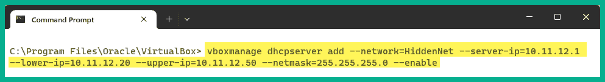
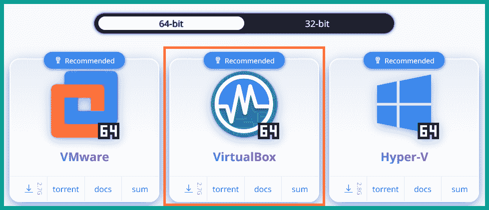
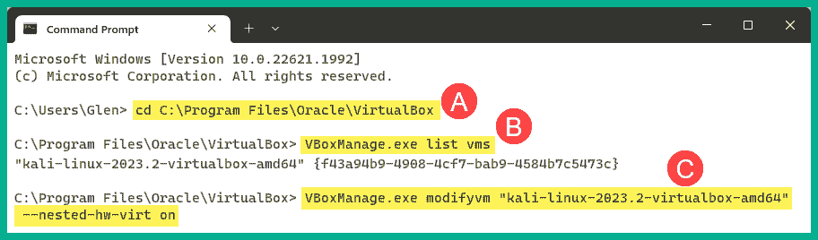
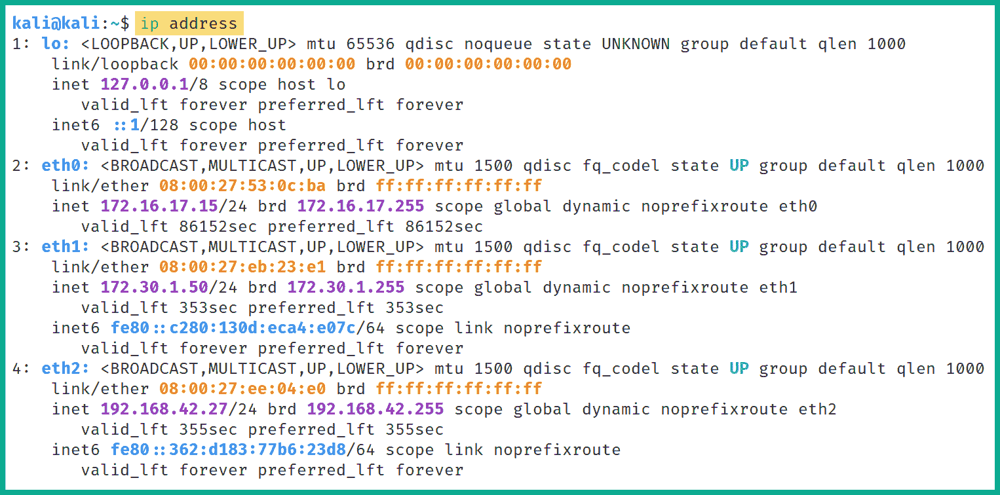
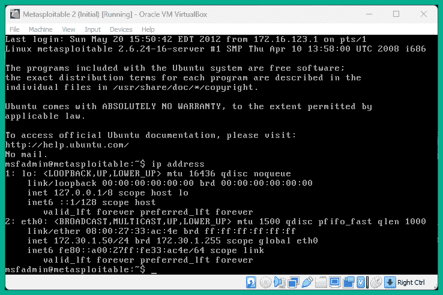
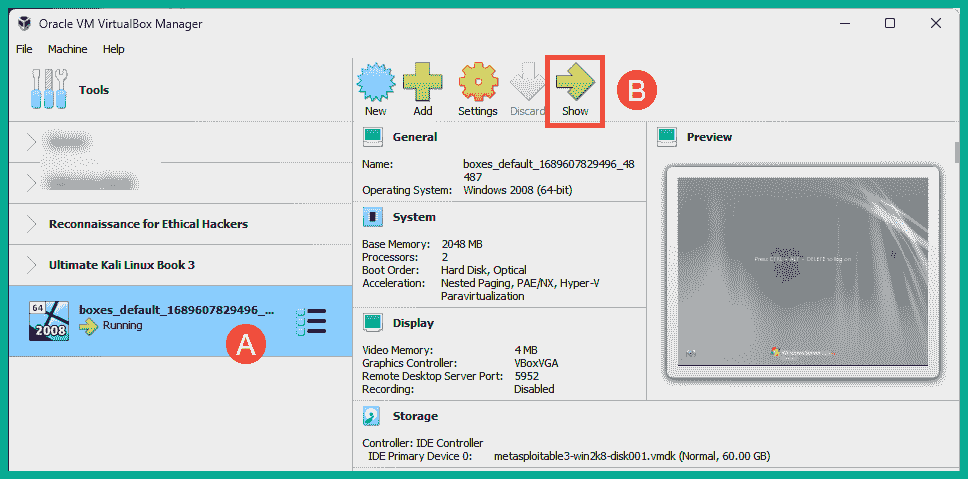
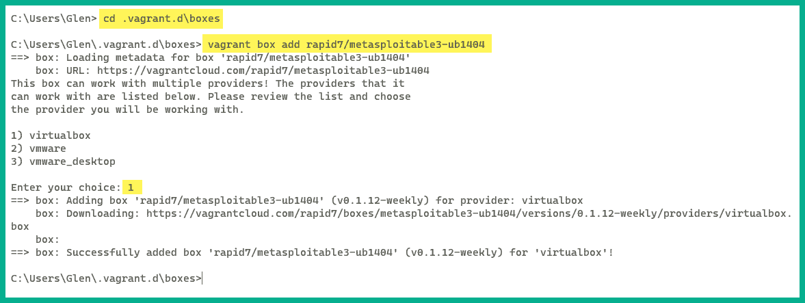

# 第二章：2 构建渗透测试实验室

## 加入我们在 Discord 上的书籍社区

[`packt.link/SecNet`](https://packt.link/SecNet)作为一个有抱负的道德黑客和渗透测试员，进行漏洞利用、有效载荷测试或练习黑客技能时，确保不破坏或对他人系统或网络基础设施（如您的组织的系统）造成任何损害非常重要。虽然有许多在线教程、视频和培训资料可以供您阅读和观看以获取知识，但从事渗透测试领域意味着需要不断增强您的攻防安全技能。很多人能谈论黑客攻击并清晰地解释方法论，但却不知道如何实施攻击。在学习渗透测试时，理解理论并学会如何将您的技能应用于模拟真实网络攻击非常重要。在本章中，您将学习如何在个人计算机上设计和构建虚拟化渗透测试实验室环境，并利用虚拟化技术减少获取多个物理系统和设备的成本和需求。此外，您还将学习如何设置虚拟隔离的网络，以确保您不会无意中攻击您不拥有的系统。更进一步，您将把 Kali Linux 设置为攻击机，把易受攻击的系统作为目标。重要的是要始终记住，练习攻防安全技能，如道德黑客和渗透测试时，必须始终在您拥有的系统和网络上进行，因为这些安全测试通常是侵入性的，可能会对系统造成损害。简单来说，攻击您不拥有的系统是非法的。在本章中，我们将涵盖以下主题：

+   理解实验室概览和技术

+   设置虚拟化管理程序和虚拟网络

+   设置并使用 Kali Linux

+   设置易受攻击的 web 应用程序

+   部署 Metasploitable 2 作为易受攻击的机器

+   构建并部署 Metasploitable 3

让我们深入了解！

## 技术要求

要跟随本章中的练习，请确保您满足以下硬件和软件要求：

+   Oracle VM VirtualBox - [`www.virtualbox.org/wiki/Downloads`](https://www.virtualbox.org/wiki/Downloads)

+   Oracle VM VirtualBox 扩展包 - [`www.virtualbox.org/wiki/Downloads`](https://www.virtualbox.org/wiki/Downloads)

+   Kali Linux - [`www.kali.org/get-kali/`](https://www.kali.org/get-kali/)

+   Vagrant - [`www.vagrantup.com/`](https://www.vagrantup.com/)

+   OWASP Juice Shop - [`owasp.org/www-project-juice-shop/`](https://owasp.org/www-project-juice-shop/)

+   Metasploitable 2 - [`sourceforge.net/projects/metasploitable/files/Metasploitable2/`](https://sourceforge.net/projects/metasploitable/files/Metasploitable2/)

+   Metasploitable 3 - [`app.vagrantup.com/rapid7`](https://app.vagrantup.com/rapid7)

## 理解实验室概述和技术

构建渗透测试实验室能够为你创造一个安全的环境，在这个环境中，你可以练习并提升你的进攻性安全技能，扩展环境以添加新的易受攻击系统，并移除不再需要的旧有遗留系统，甚至可以创建额外的虚拟网络，以便将攻击从一个网络转移到另一个网络。创建你自己虚拟化的渗透测试实验室的概念，允许你最大化现有计算机的计算资源，而无需购买在线实验室时间或购买额外的计算机和设备。总体来说，这将节省大量的钱，相较于购买物理计算机和网络设备（如路由器和交换机）。作为一名网络安全讲师和专业人士，我注意到，许多刚开始从事信息技术（IT）领域的人通常认为，根据他们的学习领域，需要物理实验室基础设施。从某种程度上讲，这是正确的，但随着技术的进步，构建物理实验室来练习技能也伴随着许多缺点。以下是物理实验室的一些缺点：

+   需要物理空间来存放所需的服务器和网络设备。

+   每个设备的电力消耗将导致整体财务支出的高额。

+   构建/购买每个物理设备的成本都很高，无论是网络设备还是服务器。

这些只是许多学生和有志于成为 IT 专业人士的人的一些顾虑。在许多情况下，初学者通常只有一台单独的计算机，比如桌面电脑或笔记本电脑。能够利用虚拟化技术，这些技术应对了上述缺点，开启了 IT 领域的大门。它使得许多人和组织能够更高效地优化和管理他们的硬件资源。在虚拟化的世界中，虚拟机管理程序（Hypervisor）是一种特殊的应用程序，允许用户虚拟化操作系统，利用其系统上的硬件资源，使这些硬件资源可以与另一个虚拟化的操作系统或应用程序共享。这使得你可以在现有计算机的操作系统之上安装多个操作系统。假设你正在运行 Microsoft Windows 11 作为你的主操作系统，这通常被称为*宿主操作系统*，但你希望在同一台计算机上同时运行一个基于 Linux 的操作系统。你可以通过使用虚拟机管理程序来实现这一点。因此，我们将使用虚拟化来确保我们能够建立一个具有成本效益的渗透测试实验室环境。当设计渗透测试实验室环境时，我们需要以下组件：

+   **虚拟化管理程序** – 虚拟化管理程序是一种应用程序，使我们能够虚拟化操作系统，并允许它们在任何硬件上运行。我们可以使用虚拟化管理程序创建多个虚拟机，这些虚拟机可以在我们的计算机上同时运行。虚拟化管理程序有很多种应用程序，我们将使用 **Oracle VM VirtualBox** 作为首选应用程序，因为它是免费的且易于使用。

+   **攻击者机器** – 攻击者机器将用于创建并发起各种类型的网络攻击和威胁，以识别并利用目标系统中的安全漏洞。对于攻击者机器，我们将使用 Kali Linux。

+   **易受攻击的机器** – 没有易受攻击的系统，我们的实验环境将不完整。我们将设置像 Metasploitable 2 这样的易受攻击系统，它是一个基于 Linux 的操作系统，托管 Web 应用程序，另外还会设置 Metasploitable 3，它有 Windows 和 Linux 版本的服务器。

+   **易受攻击的 Web 应用** – 这将帮助你更好地理解威胁行为者是如何发现并利用 Web 应用中的安全漏洞的。我们将在 Kali Linux 上设置 **开放 Web 应用安全项目**（**OWASP**）的 **Juice Shop** Web 应用。

+   **互联网访问** – 互联网连接将在 Kali Linux 虚拟机上设置。这将便于我们轻松下载其他应用程序、工具和软件包。

下图展示了我们虚拟化渗透测试实验环境的网络拓扑：


如上图所示，存在 4 个网络区域，分别是：

+   互联网用于访问在线资源，并且直接连接到 Kali Linux 虚拟机。

+   **PentestNet** 环境包含两台易受攻击的机器，位于 `172.30.1.0/24` 网络，并且也直接与 Kali Linux 连接。

+   **RedTeamLab** 环境包含一个 **活动目录**（**AD**）基础设施，包含一台 Windows 服务器和两台位于 `192.168.42.0/24` 网络上的客户端，并且与 Kali Linux 直接连接。

+   **HiddenNet** 环境包含一个位于 `10.11.12.0/24` 网络上的单一易受攻击主机，并且只能通过 *PentestNet* 网络访问。因此，我们需要攻破 *PentestNet* 环境中的一台主机，看看是否有办法进行攻击的横向移动。

下图提供了更多的技术细节，以便更好地理解在我们的实验环境中，特定的 IP 网络是如何分配的：


如前图所示，Kali Linux 虚拟机将分配 3 个网络适配器，这些通常被称为虚拟网络接口卡（**vNICs**）。这些 vNICs 使我们能够通过桥接连接访问互联网，使用 `172.30.1.0/24` 网络访问 *PentestNet* 环境，使用 `192.168.42.0/24` 网络访问 *RedTeamLab* 环境。这个实验设计非常适合学习如何在系统之间进行*横向移动*，从一个网络切换到另一个网络，并入侵 AD 环境。现在，您已经了解了虚拟实验室环境，以及我们将在本书中使用的系统和技术，接下来让我们开始设置虚拟化管理程序和虚拟网络吧。

## 设置虚拟化管理程序和虚拟网络

信息技术行业有许多来自不同厂商的虚拟化管理程序，然而，Oracle VM VirtualBox 是一款免费且易于使用的虚拟化管理程序，具备与商业（付费）产品相同的所有基本功能。在本节中，您将学习如何设置 Oracle VM VirtualBox 并在计算机上创建虚拟网络。在开始之前，以下是一些重要因素和要求：

+   确保计算机的处理器支持虚拟化功能，例如**VT-x**/**AMD-V**。

+   确保通过 BIOS/UEFI 在您的处理器上启用了虚拟化功能。

> 如果您不确定如何访问计算机上的 BIOS/UEFI，请查阅设备手册或访问供应商网站以获取具体说明。

让我们开始吧！

### 第一部分 - 设置虚拟化管理程序

如前所述，业界有许多虚拟化管理程序，本书将全程使用 Oracle VM VirtualBox。然而，如果您希望使用其他虚拟化管理程序，请确保根据系统和网络设计进行配置。要开始此练习，请使用以下说明：

1.  首先，在您的主机计算机上，访问[`www.virtualbox.org/wiki/Downloads`](https://www.virtualbox.org/wiki/Downloads)，并选择适合您的主机操作系统的**Oracle VirtualBox 平台包**，如下所示：


1.  接下来，您需要下载**Oracle VM VirtualBox 扩展包**应用程序。这将为**VirtualBox 管理器**应用程序启用额外的功能，例如在主机计算机上创建虚拟隔离的网络。在同一下载页面上，稍微向下滚动即可找到下载链接，如下所示：


1.  接下来，安装在第 1 步中下载的**Oracle VirtualBox 平台包**。在安装过程中，使用默认配置。一旦应用程序安装到您的主机计算机上，**VirtualBox 管理器**界面将如下所示：


1.  接下来，关闭**Oracle VM VirtualBox 管理器**应用程序，因为此时不需要它。

1.  接下来，要安装**Oracle VM VirtualBox 扩展包**，只需右键单击软件包并选择**打开方式** > **VirtualBox Manager**，如下所示：


1.  **VirtualBox 许可证**窗口将出现，请确保阅读并点击**同意**以接受协议，继续安装，如下所示：


安装完成后，您可以关闭**VirtualBox Manager**应用程序，直到以后需要时再打开。

### 第二部分 - 创建虚拟隔离网络

在创建渗透测试实验环境时，切勿意外地扫描或释放恶意载荷到您拥有的系统和网络上，如互联网上的系统。要开始设置虚拟隔离网络，请使用以下说明：

1.  首先，在您的 Windows 主机上打开**命令提示符**。

1.  接下来，使用以下命令将当前工作目录更改为`C:\Program Files\Oracle\VirtualBox`：

```
C:\Users\Glen> cd C:\Program Files\Oracle\VirtualBox
```

1.  接下来，使用**vboxmanage**应用程序，使用以下命令为虚拟*PentestNet*网络创建一个虚拟**动态主机配置协议**（**DHCP**）服务器：

```
C:\Program Files\Oracle\VirtualBox> vboxmanage dhcpserver add --network=PentestNet --server-ip=172.30.1.1 --lower-ip=172.30.1.20 --upper-ip=172.30.1.50 --netmask=255.255.255.0 --enable
```

以下代码片段展示了在**命令提示符**上执行的前述命令：


执行前述命令后，**vboxmanage**应用程序会创建一个 DHCP 服务器，该服务器会自动将 IP 地址从`172.30.1.1`到`172.30.1.254`范围内分配给任何连接到*PentestNet*网络的系统。

> 您可以使用`vboxmanage list dhcpservers`命令查看在您的主机计算机上通过 VirtualBox 启用的所有 DHCP 服务器及其配置。

1.  接下来，使用以下命令为*HiddenNet*网络创建一个新的 DHCP 服务器：

```
C:\Program Files\Oracle\VirtualBox> vboxmanage dhcpserver add --network=HiddenNet --server-ip=10.11.12.1 --lower-ip=10.11.12.20 --upper-ip=10.11.12.50 --netmask=255.255.255.0 --enable
```

以下代码片段展示了执行前述命令的过程：



执行前述命令后，它将创建另一个虚拟 DHCP 服务器，该服务器将自动将 IP 地址从`10.11.12.1`到`10.11.12.20`范围内分配给任何连接到*HiddenNet*网络的虚拟机。

1.  接下来，使用以下命令创建另一个 DHCP 服务器和虚拟网络，将分配给*RedTeamLab*网络：

```
C:\Program Files\Oracle\VirtualBox> vboxmanage dhcpserver add --network=RedTeamLab --server-ip=192.168.42.1 --lower-ip=192.168.42.20 --upper-ip=192.168.42.50 --netmask=255.255.255.0 --set-opt 6 192.168.42.40 --enable
```

以下代码片段展示了执行前述命令以创建另一个虚拟 DHCP 服务器：


与前面的步骤不同，创建*RedTeamLab*网络的命令已被修改，指定了虚拟机连接到该虚拟网络时所使用的**域名系统**（**DNS**）服务器地址。在设置 AD 实验环境时，DNS 服务器地址将非常有用。此时，超管虚拟机和虚拟网络已经配置完毕。接下来，您将学习如何将 Kali Linux 作为虚拟机部署并设置在我们的实验环境中。

## 设置和使用 Kali Linux

Kali Linux 是网络安全行业中最受欢迎的 Linux 发行版之一，因为它包含了超过 300 个预安装的软件包，这些软件包主要用于进攻性安全评估。道德黑客和渗透测试人员通常使用 Kali Linux 对目标系统和网络进行侦察、扫描、枚举、利用甚至后期利用技巧。虽然很多人通常认为 Kali Linux 仅为进攻性安全专业人士（如渗透测试人员）设计，但它在技术行业中也被系统管理员甚至网络安全专业人员广泛使用，用于测试其安全控制和系统的安全漏洞。然而，Kali Linux 基于 Debian 版本的 Linux，并且作为一个免费的操作系统，它多年来已吸引了网络安全行业专业人员的广泛关注。Kali Linux 拥有许多功能和工具，使得渗透测试人员或安全工程师在工作时更加轻松。它包含了许多工具、脚本和框架，用于执行各种任务，如收集目标信息、进行网络扫描、漏洞发现，甚至是利用攻击，仅举几例。在本节中，您将学习如何将 Kali Linux 设置为虚拟机，建立与互联网和我们虚拟隔离网络的连接，并了解 Kali Linux 的基础知识。让我们开始吧！

### 第一部分 – 将 Kali Linux 部署为虚拟机

Kali Linux 有多种部署模型，从直接在硬件上进行裸机安装，到在 Android 设备上安装。为了简化我们的实验室设置过程，并让操作更容易跟随，您将学习如何在 Oracle VM VirtualBox 应用程序中将 Kali Linux 设置为虚拟机。这种方法确保您可以快速开始。请按照以下说明开始这项练习：

1.  首先，访问官方 Kali Linux 网站 [`www.kali.org/get-kali/`](https://www.kali.org/get-kali/)，然后点击 **虚拟机**，如下面所示：


1.  接下来，点击 **VirtualBox 64** 下载 Kali Linux 2023.2 的 VirtualBox 镜像，如下所示：



下载的文件是一个压缩文件夹，扩展名为 .7z。

1.  接下来，为了解压缩文件夹中的内容，您需要从 [`www.7-zip.org/download.html`](https://www.7-zip.org/download.html) 下载并安装 **7-Zip** 应用程序。

1.  接下来，打开 **7-Zip 文件管理器** 应用，导航到包含 Kali Linux 压缩文件夹的目录，选择文件并点击 **提取**，如下面所示：


1.  接下来，文件解压窗口将会出现，点击 **确定** 继续，如下面所示：


解压过程将开始，通常需要几秒钟或几分钟才能完成。解压完成后，你会在 **7-Zip 文件管理器** 中看到一个新文件夹。这意味着文件内容已成功解压，现在可以关闭该应用程序。

1.  接下来，打开 **Windows 资源管理器**，并进入包含已解压内容的目录。在该目录下，你将看到两个文件，右键点击 **VirtualBox 虚拟机定义** 文件，选择 **打开方式** > **VirtualBox 管理器**，如下所示：


**Oracle VM VirtualBox Manager** 应用程序将自动打开，并导入 Kali Linux 虚拟机，如下所示：


在启动 Kali Linux 虚拟机之前，需要对虚拟机设置进行一些定制调整。

### 第二部分 – 定制 Kali Linux 及其网络适配器

以下说明将引导你定制 Kali Linux 虚拟机环境，并确保它与我们的虚拟化渗透测试实验室拓扑对齐。此外，你将学习如何将每个 vNIC（网络适配器）连接到互联网、*PentestNet* 和 *RedTeamLab* 虚拟网络。开始定制 Kali Linux 虚拟环境，请按以下说明操作：

1.  首先，确保 **Nested VT-x/AMD-V** 虚拟化功能在虚拟机和计算机处理器之间是可用的，我们需要在 Windows **命令提示符**中执行以下命令：

```
C:\Users\Glen> cd C:\Program Files\Oracle\VirtualBox
C:\Program Files\Oracle\VirtualBox> VBoxManage.exe list vms
```

> 重要提示
> 
> > `VBoxManage.exe list vms` 命令使我们能够查看所有虚拟机的列表，包括它们的名称和在 Oracle VM VirtualBox 管理器中的 ID。

1.  接下来，使用新导入的 Kali Linux 虚拟机的名称，使用以下命令启用虚拟机上的 **Nested VT-x/AMD-V** 功能：

```
C:\Program Files\Oracle\VirtualBox> VBoxManage.exe modifyvm "kali-linux-2023.2-virtualbox-amd64" --nested-hw-virt on
```

确保将你在 *第 1 步* 中看到的 Kali Linux 虚拟机的名称替换为引号内显示的名称，如下所示：



1.  接下来，在 Oracle **VM VirtualBox Manager** 中，选择 **Kali Linux 虚拟机** 并点击 **设置**，如下所示：


1.  若要调整分配给虚拟机的内存（RAM）数量，请进入 **系统** > **主板** > **基础内存**，如下所示：


> 建议不要在基础内存刻度的黄色和红色区域分配内存。Kali Linux 可以在 2 GB 内存下高效运行；然而，如果你的系统有超过 8GB 的可用内存，那么可以考虑为 Kali Linux 虚拟机分配 4 GB 内存。

此外，在 **系统** > **处理器** 标签页中，你可以修改分配给该虚拟机的虚拟 CPU 核心数量。使用 1 到 2 个核心即可满足需求；但根据计算机可用硬件资源的不同，你也可以分配更多的核心。

1.  接下来，让我们将**Kali Linux 虚拟机**连接到您的物理网络，以访问互联网。在 Kali Linux 的**设置**菜单中，选择**网络**类别 > **适配器 1**，并使用以下配置：

    +   启用网络适配器

    +   附加到：**桥接适配器**

    +   名称：使用下拉菜单选择与您的物理网络连接并能访问互联网的物理网络适配器。

以下截图展示了应用于适配器 1（vNIC 1）的前述配置：


1.  接下来，让我们将**适配器 2**（vNIC 2）分配给*PentestNet*网络。选择**适配器 2**标签，并使用以下配置：

    +   启用网络适配器

    +   附加到：**内部网络**

    +   名称：在字段中手动输入`PentesNet`

    +   混杂模式：**允许所有**

以下截图展示了应用于适配器 2（vNIC 2）的前述配置：


1.  最后，让我们将**适配器 3**（vNIC 3）分配给*RedTeamLab*网络。选择**适配器 3**标签，并使用以下配置：

    +   启用网络适配器

    +   附加到：**内部网络**

    +   名称：在字段中手动输入`RedTeamLab`

    +   混杂模式：**允许所有**

以下截图展示了应用于适配器 3（vNIC 3）的前述配置：


在**适配器 3**上配置网络设置后，点击**确定**以保存 Kali Linux 虚拟机的设置。至此，我们已配置 Kali Linux 虚拟机上的所有 3 个虚拟网络适配器。一个适配器通过主机计算机上的物理适配器提供互联网连接，另外 2 个虚拟适配器连接到虚拟网络（*PentestNet* 和 *RedTeamLab*）。

### 第三部分 - 开始使用 Kali Linux

许多初次使用者总是对登录到他们的第一个攻击者机器感到兴奋，特别是这样一台旨在帮助道德黑客和渗透测试人员发现并利用目标系统和网络中的安全漏洞的机器。以下说明将帮助您开始使用 Kali Linux：

1.  首先，打开**Oracle VM VirtualBox 管理器**，选择**Kali Linux 虚拟机**并点击**启动**以开机。

1.  接下来，将出现登录提示，使用详细的用户凭据，用户名：`kali`，密码：`kali`登录到桌面：


> 如果您的 Kali Linux 桌面视图没有根据显示器的分辨率进行缩放，只需在**VirtualBox 菜单栏**的顶部切换视图选项 > **视图** > **自动调整客户机显示**。

1.  一旦登录到 Kali Linux 操作系统，为了查看可用工具的列表，请点击桌面左上角的 Kali Linux 图标，如下所示：


如上图所示，预安装的工具都是按照执行伦理黑客和渗透测试练习的顺序进行分类的。例如，所有常用于侦察的工具可以轻松找到在**01 – 信息收集**类别中，而无线渗透测试工具则可以在**06 – 无线攻击**类别中找到。在本书中，你将主要使用 Linux 终端并学习许多命令。如果这是你第一次使用 Linux 和命令，不用担心，这将是一次全新的学习体验，并且在学习新技术、发展你的攻防安全技能、模拟真实的网络攻击的过程中，你将会玩得很开心。

1.  接下来，为了在 Kali Linux 上禁用 IPv6，点击左上角的 Kali Linux 图标，选择**设置管理器**图标，如下所示：


1.  **设置**窗口将出现，点击**高级网络配置**，如下所示：


1.  接下来，**网络连接**窗口将出现，选择**有线连接 1**（vNIC 1），然后点击**齿轮**图标，如下图所示：


1.  接下来，**编辑有线连接 1**窗口将出现，选择**IPv6 设置**标签，将**方法**更改为**禁用**，然后点击**保存**，如下所示：


你可以关闭**网络连接**窗口和**设置**菜单。

1.  接下来，让我们确定 Kali Linux 虚拟机是否在每个连接到互联网的网络适配器上获取了 IP 地址，分别是 *PentestNet* 和 *RedTeamLab* 网络。

要打开**Linux 终端**，点击左上角的 Kali Linux 图标，选择**终端模拟器**，然后执行 `ip address` 命令，如下所示：



如上图所示，Kali Linux 虚拟机上有 4 个网络适配器：

+   **lo** – 这是回环网络适配器，允许操作系统与自托管的应用程序进行通信，反之亦然。

+   **eth0** – 根据我们的实验室拓扑图，这是 vNIC 1，并且在虚拟机设置中它的网络适配器 1 连接到互联网，通过物理网络实现连接。**inet** 地址是分配给该接口的 IP 地址。

+   **eth1** – 根据实验室拓扑图，这是 vNIC 2，它是虚拟机设置中的网络适配器 2，连接到 *PentestNet* 网络（`172.30.1.0/24`）环境。

+   **eth3** – 根据实验室拓扑图，这是 vNIC 3，它是虚拟机设置中的网络适配器 3，连接到 *RedTeamLab* 网络（`192.168.42.0/24`）环境。

1.  接下来，让我们检查网络连接，并确认 DNS 解析是否在我们的 Kali Linux 虚拟机上正常工作。在 **终端** 中，使用以下命令向 `www.google.com` 发送 4 个 **Internet Control Message Protocol**（**ICMP**）消息：

```
kali@kali:~$ ping www.google.com -c 4
```

以下截图显示 Kali Linux 操作系统成功地将主机名解析为 IP 地址，并成功连接到互联网上的 Google Web 服务器：


1.  最后，要更改用户名为 `kali` 的默认密码，请使用 `passwd` 命令，如下图所示：


> 在 Linux 终端输入密码时，由于安全原因，密码是不可见的。

### 第四部分 - 更新仓库源和软件包

有时，某些工具可能无法按预期工作，甚至在渗透测试或安全审计过程中意外崩溃。开发人员经常发布更新以修复应用程序和软件包中的错误，并向用户体验中添加新功能。让我们通过以下步骤学习如何更新源和软件包：

1.  要更新 Kali Linux 上的本地软件包仓库列表，请使用 `sudo apt update` 命令，如下所示：


通过更新 Kali Linux 机器上的软件包仓库列表，当您使用 `sudo apt install <package-name>` 命令安装新的软件包时，Kali Linux 将从官方源获取该应用程序的最新版本并进行更新。

> `source.list` 文件并不总是能够正确更新。为了确保您的 Kali Linux 机器设置正确，请查看关于 Kali Linux 仓库的官方文档，网址为：[`www.kali.org/docs/general-use/kali-linux-sources-list-repositories/`](https://www.kali.org/docs/general-use/kali-linux-sources-list-repositories/)。

1.  （可选）要将您的 Kali Linux 机器上的所有现有软件包升级到最新版本，请使用 `sudo apt upgrade` 命令，如下所示：


如果在升级过程中收到 Kali Linux 无法执行升级的错误信息，请使用 `sudo apt update --fix-missing` 命令，然后再次使用 `sudo apt upgrade`。

1.  接下来，Dewalt 提供的 PimpMyKali 脚本可以帮助我们修复和安装一些非常有用的实用工具和工具集到我们的 Kali Linux 虚拟机中。请使用 Dewalt 提供的以下命令：

```
kali@kali:~$ git clone https://github.com/Dewalt-arch/pimpmykali
kali@kali:~$ cd pimpmykali
kali@kali:~/pimpmykali$ sudo ./pimpmykali.sh
```

接下来，PimpMyKali 命令行菜单会显示多个选项，输入 `N`，因为我们在新的虚拟机上运行此脚本，如下所示：


在设置过程中，脚本会询问是否重新启用以 `*root*` 账户登录 Kali Linux 的功能，这完全取决于个人偏好。我输入了 `N`（否）并按下回车键继续该过程。请记住，这个设置过程需要几分钟才能完成。

1.  最后，在设置过程完成后，你需要重新启动 Kali Linux 虚拟机以确保所有配置生效。你可以在 Kali Linux 桌面界面的右上角找到电源选项。

> 若要了解更多关于 Dewalt 的 PimpMyKali 脚本的信息，请查看官方 GitHub 仓库：[`github.com/Dewalt-arch/pimpmykali`](https://github.com/Dewalt-arch/pimpmykali)。

完成本部分后，你已经学会了如何将 Kali Linux 设置为虚拟机，启用虚拟机的互联网和其他网络连接，并更新软件包仓库源列表。接下来，你将学习如何设置一个易受攻击的 Web 应用程序，并在本书的后续章节中探索 Web 应用程序渗透测试。

## 设置易受攻击的 Web 应用程序

学习如何使用 Kali Linux 模拟现实世界的网络攻击，如果没有了解如何发现和利用 Web 应用程序中的漏洞，学习过程是不完整的。**开放 Web 应用程序安全项目**（**OWASP**）是一个致力于通过软件（包括 Web 应用程序）提升安全性的组织。OWASP 以其 Web 应用程序中最关键的安全风险榜单——OWASP Top 10 而闻名。

> 本书编写时，OWASP Top 10 的最新版本是 2021 年。更多信息请见：[`owasp.org/www-project-top-ten/`](https://owasp.org/www-project-top-ten/)。

作为一个有抱负的道德黑客和渗透测试员，了解如何识别并对 OWASP Top 10 列表中的每个类别进行安全测试非常重要。OWASP 创建了一些项目，使学习者能够在安全环境中安全地使用他们的进攻性安全技能和技术，发现 Web 应用程序的漏洞并加以利用。在本部分中，我们将在 Kali Linux 上部署 OWASP Juice Shop 易受攻击的 Web 应用程序。要开始设置 OWASP Juice Shop Web 应用程序，请使用以下指令：

1.  首先，启动你的 **Kali Linux 虚拟机** 并登录。

1.  接下来，打开 **终端** 并使用以下命令更新软件包仓库列表：

```
kali@kali:~$ sudo apt update 
```

1.  接下来，使用以下命令在 Kali Linux 上安装 Docker 仓库源：

```
kali@kali:~$ printf '%s\n' "deb https://download.docker.com/ linux/debian bullseye stable" | sudo tee /etc/apt/sources.list.d/docker-ce.list
```

以下截图显示了前述命令成功执行的情况：


1.  接下来，使用以下命令下载并设置 **GNU 隐私保护**（**GPG**）密钥以供 Docker 使用：

```
kali@kali:~$ curl -fsSL https://download.docker.com/linux/debian/gpg | sudo gpg --dearmor -o /etc/apt/trusted.gpg.d/docker-cearchive-keyring.gpg
```

以下截图显示了前述命令成功执行的情况：


> 若要了解更多有关在 Kali Linux 上设置 Docker 的信息，请查看官方文档：[`www.kali.org/docs/containers/installing-docker-on-kali/`](https://www.kali.org/docs/containers/installing-docker-on-kali/)。

1.  接下来，再次更新软件包仓库列表并使用以下命令安装 Docker：

```
kali@kali:~$ sudo apt update 
kali@kali:~$ sudo apt install -y docker.io
kali@kali:~$ sudo systemctl enable docker –now
kali@kali:~$ sudo usermod -aG docker $USER
```

> 使用`docker version`命令测试 Docker 是否在 Kali Linux 上正确安装。

1.  接下来，使用已安装的 Docker 应用程序从在线 Docker Hub 仓库拉取**OWASP Juice Shop**容器：

```
kali@kali:~$ sudo docker pull bkimminich/juice-shop 
```

以下截图展示了 OWASP Juice Shop Docker 容器的下载和设置过程：


1.  接下来，使用以下命令在 3000 端口运行 OWASP Juice Shop Docker 容器：

```
kali@kali:~$ sudo docker run --rm -p 3000:3000 bkimminich/juice-shop
```

以下代码片段展示了前面命令的执行：


> 要停止运行的 Docker 容器，请使用`CTRL + C`快捷键组合。

1.  最后，在 Kali Linux 上打开 Firefox 浏览器并访问`http://127.0.0.1:3000`，以访问并与 OWASP Juice Shop 网络应用程序交互，如下图所示：


> 要了解更多有关 OWASP Juice Shop 脆弱网络应用程序的信息，请参见官方文档：[`owasp.org/www-project-juice-shop/`](https://owasp.org/www-project-juice-shop/)。

完成此练习后，您已学会如何在 Kali Linux 上设置 Docker 和 OWASP Juice Shop。接下来，您将学习如何在我们的实验室环境中设置 Metasploitable 2，这是一种脆弱的基于 Linux 的系统。

## 将 Metasploitable 2 部署为脆弱机器

在构建渗透测试实验室时，重要的是包括一些脆弱的系统，它们将作为我们的攻击目标。这些系统包含故意设置的脆弱服务和应用程序，能够帮助我们练习并提高技能，更好地理解如何发现和利用漏洞。一台非常流行的脆弱机器被称为 Metasploitable 2。这个脆弱机器包含许多可以被利用的安全漏洞，非常适合学习道德黑客和渗透测试。为了开始在我们的实验室环境中设置 Metasploitable 2，请按照以下说明操作：

### 第一部分 – 部署 Metasploitable 2

以下步骤将指导您获取 Metasploitable 2 虚拟机并在 Oracle VM VirtualBox 管理器中进行部署：

1.  首先，在主机计算机上，访问[`sourceforge.net/projects/metasploitable/files/Metasploitable2/`](https://sourceforge.net/projects/metasploitable/files/Metasploitable2/)下载**metasploitable-linux-2.0.0.zip**文件到您的设备。

1.  下载 ZIP 文件后，解压（解压缩）其内容。解压后的文件是 Metasploitable 2 虚拟机的虚拟硬盘和设置配置文件。

1.  接下来，我们创建一个用于 Metasploitable 2 的虚拟机，打开**Oracle VM VirtualBox 管理器**并点击**新建**。

1.  当**创建虚拟机**窗口出现时，点击**专家模式**以更改配置视图。

1.  接下来，使用以下配置来设置虚拟机：

    +   名称：Metasploitable 2

    +   类型：Linux

    +   版本：其他 Linux（64 位）

以下截图展示了**创建虚拟机**窗口中的前面设置：


1.  接下来，在**创建虚拟机**窗口中展开**硬盘**类别，选择**使用现有虚拟硬盘文件**选项，然后点击右侧的文件夹图标，如下所示：


1.  接下来，点击**硬盘选择器**并点击**添加**，如下所示：


1.  接下来，将弹出一个窗口，使用它导航到**Metasploitable 2**提取文件夹及其内容，选择**Metasploitable** VMDK 文件并点击**打开**，如下所示：


1.  接下来，您将自动返回到**硬盘选择器**窗口，您将在其中看到**Metasploitable**磁盘文件，选择它并点击**选择**，如下所示：


1.  接下来，您将自动返回到**创建虚拟机**窗口，在那里您将看到**Metasploitable.vmdk**文件被加载为现有的虚拟磁盘文件，点击**完成**，如下所示：


此时，Metasploitable 2 虚拟机已经在 Oracle VM VirtualBox 管理器中创建并加载。接下来，我们将把 Metasploitable 2 虚拟机连接到*PentestNet*虚拟网络。

### 第二部分 – 配置网络设置

由于我们的渗透测试实验室拓扑包含多个虚拟网络，以下步骤将帮助确保 Kali Linux 与 Metasploitable 2 虚拟机之间具有端到端的网络连接。

1.  要配置网络设置，请在**Oracle VM VirtualBox 管理器**中选择新创建的**Metasploitable 2**虚拟机并点击**设置**。

1.  接下来，进入**网络**部分 > 选择**适配器 1**并使用以下配置：

    +   启用网络适配器

    +   附加到：内部网络

    +   名称：PentestNet（请手动在字段中输入）

    +   混杂模式：允许所有

以下截图显示了**适配器 1**的前述配置，点击**确定**保存：


1.  接下来，启动**Metasploitable 2**虚拟机，并使用用户名：`msfadmin`和密码：`msfadmin`登录。然后使用`ip address`命令验证虚拟机是否在`172.30.1.0/24`网络上获取了 IP 地址，如下所示：



> 如果您的鼠标光标卡在虚拟机内，请按右 Ctrl 键释放光标。

1.  最后，使用`sudo halt`命令关闭 Metasploitable 2 虚拟机。

完成本节后，您已经学会了如何将 Metasploitable 2 设置为我们渗透测试实验室中的易受攻击的机器。接下来，您将学习如何使用 Vagrant 构建和部署 Metasploitable 3。

## 构建和部署 Metasploitable 3

在本节中，您将学习如何构建和部署 Metasploitable 3，包括 Windows 服务器版和 Linux 服务器版。Windows 服务器版将使用双网卡网络连接，分别连接到 *PentestNet* 网络（`172.30.1.0/24`）和 *HiddenNet* 网络（`10.11.12.0/24`）。这种设置将使我们能够在不同网络之间进行跳板和横向渗透。最后，Linux 服务器版将仅连接到 *HiddenNet* 网络（`10.11.12.0/24`）。下图显示了系统和网络之间的逻辑连接：


如前所示，为了访问 Metasploitable 3 – Linux 服务器，我们首先需要通过 *PentestNet* 网络攻破 Metasploitable 3 – Windows 服务器，然后将攻击转向 *HiddenNet* 网络。

### 第一部分 - 构建 Windows 服务器版

要开始构建和部署 Metasploitable 3 – Windows 版本，请使用以下说明：

1.  首先，您需要在主机计算机上下载并安装 **Vagrant**。Vagrant 使用户能够构建和维护虚拟机和应用程序。在您的主机计算机上，访问 [`www.vagrantup.com/`](https://www.vagrantup.com/)，并点击网页上的 **Download** 按钮。

1.  接下来，选择并下载 **Vagrant AMD64 版本 2.3.7**，如下所示：


1.  下载 Vagrant 软件包后，双击安装包以启动安装过程。安装完成后，系统会提示您重启主机计算机，以确保更改生效。

1.  主机计算机重启后，打开 Windows **命令提示符**，并使用以下命令重新加载并安装 Vagrant 的其他插件：

```
C:\Users\Glen> vagrant plugin install vagrant-reload
C:\Users\Glen> vagrant plugin install vagrant-vbguest
```

以下截图显示了前述命令的执行：


1.  接下来，使用以下命令将 Metasploitable 3 – Windows 服务器版本加载到您的系统中，使用 Vagrant：

```
C:\Users\Glen> vagrant box add rapid7/metasploitable3-win2k8
```

1.  接下来，选择选项 `1`，如图所示，使用 **VirtualBox** 作为首选虚拟化程序：


Vagrant 将开始下载 Metasploitable – Windows 版本的虚拟机文件，如下所示：


1.  接下来，将当前工作目录更改为 `.vagrant.d\boxes`，重命名 `rapid7-VAGRANTSLASH-metasploitable3-win2k8` 文件夹，并使用以下命令初始化 Metasploitable 3 – Windows 虚拟机的构建配置：

```
C:\Users\Glen> cd .vagrant.d\boxes
C:\Users\Glen\.vagrant.d\boxes> REN "rapid7-VAGRANTSLASH-metasploitable3-win2k8" "metasploitable3-win2k8"
C:\Users\Glen\.vagrant.d\boxes> vagrant init metasploitable3-win2k8
```

以下截图显示了前述命令成功执行的情况：


1.  接下来，使用以下命令启动该虚拟机的构建过程：

```
C:\Users\Glen\.vagrant.d\boxes> vagrant up
```

下图显示了前面命令的执行情况：


这个过程通常需要几分钟才能完成。

> 如果 `vagrant up` 命令出现错误，请重新执行该命令。

1.  过程完成后，打开**Oracle VM VirtualBox Manager**，您会发现一个新创建的虚拟机**boxes_default_***正在运行。这是 Metasploitable 3 – Windows 虚拟机，选择它并点击**显示**：



1.  一旦虚拟机被分离，在虚拟机菜单栏中，点击**输入** > **键盘** > **插入** **Ctrl-Alt-Del**，如下图所示：


1.  选择**Administrator**账户并使用默认密码：`vagrant`登录，如下所示：


登录后，简单地关闭所有出现的窗口，并不要激活操作系统。

1.  点击左下角的**开始**图标并选择**关闭**按钮以关闭/关闭操作系统。

1.  接下来，在**Oracle VM VirtualBox Manager**中，选择**Metasploitable 3 – Windows**虚拟机并点击**设置**。然后，选择**网络**类别并使用以下配置为**适配器 1**：

    +   启用网络适配器

    +   附加到：内部网络

    +   名称：PentestNet（手动输入字段中）

    +   混杂模式：允许所有

下图显示了**适配器 1**的前述配置：


1.  接下来，选择**适配器 2**并使用以下配置：

    +   启用网络适配器

    +   附加到：内部网络

    +   名称：HiddenNet（手动输入字段中）

    +   混杂模式：允许所有

下图显示了**适配器 2**的前述配置：


> 若要重命名虚拟机，选择**设置** > **常规** > **基本** > **名称**选项。

1.  最后，确保 Kali Linux 与 Metasploitable 3 – Windows 虚拟机在网络中具有端到端连接。

接下来，您将在 HiddenNet 网络中部署 Metasploitable 3 – Linux 虚拟机。

### 第二部分 - 构建 Linux 服务器版本

要在我们的实验室环境中开始设置 Metasploitable 3 的 Linux 版本，请使用以下说明：

1.  在 Windows **命令提示符**中，使用以下命令通过 Vagrant 加载 Linux 版本的 Metasploitable 3 到您的主机设备：

```
C:\Users\Glen\.vagrant.d\boxes> vagrant box add rapid7/metasploitable3-ub1404
```

1.  接下来，选择选项**1**并按回车键以下载 Metasploitable 3 – Linux 版本的虚拟机文件，如下所示：



1.  接下来，删除**Vagrantfile**文件，重命名**rapid7-VAGRANTSLASH-metasploitable3-ub1404**文件夹，并使用以下命令初始化 Metasploitable 3 – Linux 虚拟机的构建配置：

```
C:\Users\Glen\.vagrant.d\boxes> del Vagrantfile
C:\Users\Glen\.vagrant.d\boxes> REN "rapid7-VAGRANTSLASH-metasploitable3-ub1404" "metasploitable3-ub1404"
C:\Users\Glen\.vagrant.d\boxes> vagrant init metasploitable3-ub1404
```

下图显示了执行前述命令的过程：


> 您可能需要在继续下一步之前打开**Oracle VM Virtual Manager**。

1.  接下来，打开**Windows 资源管理器**，然后前往`C:\Users\<userrname>\.vagrant.d\boxes\metasploitable3-ub1404\0.1.12-weekly\virtualbox`，在此文件夹下你会找到已编译的虚拟机文件。右键点击**box**文件 > **用…打开** > **VirtualBox 管理器**，如下所示：


1.  接下来，**导入虚拟设备**窗口将出现，点击**完成**，如下所示：


1.  接下来，**metasploitable3-ub1404**虚拟机将被导入到**Oracle VM VirtualBox 管理器**中。选择该虚拟机并点击**设置**，如下所示：


1.  接下来，选择**适配器 1**并使用以下配置：

    +   启用网络适配器

    +   附加至：内部网络

    +   名称：HiddenNet（手动输入该名称）

    +   混杂模式：允许所有

以下截图显示了**适配器 1**上的前述配置：


1.  最后，启动**metasploitable3-ub1404**虚拟机，使用用户名：vagrant，密码：vagrant 登录。登录后，使用 `ip address` 命令验证虚拟机是否在`10.11.12.0/24`网络上获取到 IP 地址，如下所示：


> 使用`sudo halt`命令关闭该虚拟机。

完成本节后，你已经学会了如何在实验环境中设置 Metasploitable 3 的两个版本。Metasploitable 3 包含比其前身更多的新漏洞，后续章节将带你一起体验如何利用这些漏洞。

## 概要

完成本章后，你已经了解了在你的电脑上搭建渗透测试实验室的重要性。你学习了如何使用虚拟机管理程序来虚拟化系统的硬件资源，这些资源可以同时被多个操作系统共享并运行在同一台系统上。此外，你还掌握了在虚拟化环境中部署和设置 Kali Linux、多个易受攻击的系统和 Web 应用程序的技能。我相信，本章所提供的知识将为你提供宝贵的洞察力，支持你成为一名伦理黑客和渗透测试员的职业道路。在下一章*设置高级黑客技术*中，你将为后续章节中的红队技术设置一个 Active Directory 实验环境。

## 进一步阅读

+   OWASP Top 10 - [`owasp.org/www-project-top-ten/`](https://owasp.org/www-project-top-ten/)

+   Kali Linux 博客 - [`www.kali.org/blog/`](https://www.kali.org/blog/)
