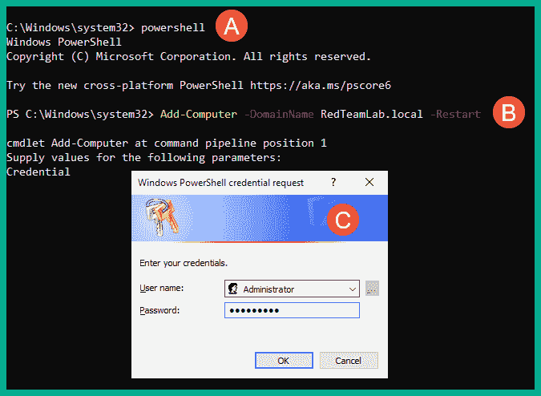
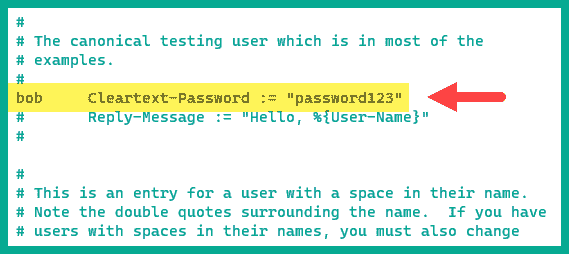

# 第三章：3 为高级渗透测试技术做准备

## 加入我们的 Discord 书籍社区

[`packt.link/SecNet`](https://packt.link/SecNet)学习渗透测试的方法和技巧总是令人兴奋的。尽管许多专业人员可能专注于特定类型的渗透测试，例如内部或外部网络渗透测试、社交工程渗透测试，甚至是 Web 应用程序安全测试，但了解如何执行无线渗透测试以及如何在企业环境中攻破 Microsoft Windows 域始终是有益的。在本章中，您将学习如何设置一个活动目录域环境，使您能够执行高级渗透测试练习，例如红队技术，发现安全漏洞并攻破域控制器，接管组织的域。此外，您还将设置一个 RADIUS 访问服务器，为我们的企业无线网络提供**认证、授权和计费**（**AAA**）服务。在本章中，我们将涵盖以下主题：

+   构建一个活动目录红队实验室

+   设置无线渗透测试实验室

让我们开始吧！

## 技术要求

为了跟随本章中的练习，请确保您已经满足以下硬件和软件要求：

+   Oracle VM VirtualBox - [`www.virtualbox.org/`](https://www.virtualbox.org/)

+   Windows 10 Enterprise - [`www.microsoft.com/en-us/evalcenter/evaluate-windows-10-enterprise`](https://www.microsoft.com/en-us/evalcenter/evaluate-windows-10-enterprise)

+   Windows Server 2019 - [`www.microsoft.com/en-us/evalcenter/evaluate-windows-server-2019`](https://www.microsoft.com/en-us/evalcenter/evaluate-windows-server-2019)

+   Ubuntu Server 22.04 LTS - [`releases.ubuntu.com/jammy/`](https://releases.ubuntu.com/jammy/)

## 构建一个活动目录红队实验室

**活动目录**是 Microsoft Windows Server 操作系统中的一个角色，使 IT 管理员能够集中管理 Windows 环境中的所有用户、设备和策略。活动目录确保整个 Windows 域内的用户帐户可以进行集中管理，并且可以创建并分配策略给不同的用户组，以确保人员拥有执行与其工作职责相关的操作所需的访问权限。活动目录在全球许多组织中广泛存在。作为一个有抱负的道德黑客和渗透测试员，了解如何发现 Microsoft Windows 域中的各种安全漏洞，并利用这些安全缺陷攻破组织的**域控制器**及其系统、服务和共享资源是非常重要的。

> 要了解更多关于域控制器的作用和重要性，请参阅：[`www.techtarget.com/searchwindowsserver/definition/domain-controller`](https://www.techtarget.com/searchwindowsserver/definition/domain-controller)。

本节将教你如何创建一个 Microsoft Windows 实验环境，其中包括一个 Microsoft Windows Server 2019 和 2 台 Windows 10 企业版客户端作为虚拟机。这个实验环境将允许你练习高级渗透测试技术，如针对 Windows 域的红队演练以及在 Active Directory 环境中利用安全漏洞。下图展示了 RedTeamLab 环境：


如我们所见，我们的 Kali Linux 虚拟机直接连接到*RedTeamLab*环境中的系统。在本书的后续章节中，你将学习如何对目标进行漏洞利用和后期利用技术，因此当你在 Windows 域内进行攻击时，我们假设你已经成功入侵网络，并至少攻破了一个连接到 Active Directory 的系统。现在，我们将专注于为后续的安全测试设置环境。下表显示了我们将在*RedTeamLab*环境中设置的用户账户：


如上表所示，我们将创建 2 个域用户（*gambit* 和 *rogue*），一个额外的域管理员（*wolverine*）以及一个具有域管理员权限的服务账户（*sqladmin*）。为了开始设置我们的红队实验室部分，请使用以下指示：

### 第一部分 – 设置 Windows Server

在本节中，你将学习如何将 Microsoft Windows Server 2019 设置为虚拟机。请按照以下步骤开始本练习：

1.  在你的主机电脑上，访问[`www.microsoft.com/en-us/evalcenter/evaluate-windows-server-2019`](https://www.microsoft.com/en-us/evalcenter/evaluate-windows-server-2019)，点击**下载 VHD**，确保你完成注册表单，以便访问**虚拟硬盘**（**VHD**）**64 位版本**的下载链接，如下所示：


> 与下载 ISO 镜像相比，使用预构建的 Windows Server 2019 VHD 文件将减少将 Windows Server 2019 操作系统安装为虚拟机所需的时间。

1.  一旦 Windows Server 2019 VHD 文件下载到你的主机计算机上，打开**Oracle VM VirtualBox 管理器**，点击**新建**来创建一个新的虚拟机环境。

1.  当**创建虚拟机**窗口出现时，点击**专家模式**并使用以下配置：

    +   名称：Windows Server 2019

    +   类型：Microsoft Windows

    +   版本：Windows 2019（64 位）

    +   硬盘：使用现有的虚拟硬盘文件（点击文件夹图标 > 添加 > 选择 Windows Server 2019 VHD 文件）。

    +   点击**完成**以保存虚拟机

1.  一旦 **Windows Server 2019 虚拟机** 在 **Oracle VM VirtualBox 管理器** 中创建并保存，选择它并点击 **设置**。

1.  在 **设置** 窗口中，选择 **网络** 类别，并使用以下设置配置 **适配器 1**：

    +   适配器 1：启用网络适配器

    +   附加到：内部网络

    +   名称：*RedTeamLab*（手动输入该字段）

    +   混杂模式：允许所有

以下截图展示了适配器 1 的前述配置：


1.  接下来，选择 **Windows Server 2019 虚拟机** 并点击 **启动** 以开机。

1.  一旦虚拟机运行，您将被提示选择您的国家/地区、首选应用语言和键盘布局，点击 **下一步**。

1.  接下来，您需要阅读 **许可条款** 并点击 **接受**。

1.  接下来，为内建的 `Administrator` 帐户创建密码，使用 `P@ssword1` 作为密码，并点击 **完成**。

1.  接下来，登录到 Windows Server 2019 虚拟机。在虚拟机菜单栏中，选择 **输入** > **键盘** > **插入 Ctrl-Alt-Del** 以查看登录窗口：


1.  使用用户名：`Administrator` 和密码：`P@ssword1` 登录。

### 第二部分 – 配置虚拟机附加功能

1.  确保 Windows Server 2019 虚拟机正在运行并且已登录。

1.  要将虚拟机的桌面分辨率调整为适合主机计算机的显示器，在虚拟机菜单栏中，选择 **设备** > **插入来宾附加 CD 镜像**，如下所示：


1.  接下来，在 Windows Server 2019 中打开 **Windows 资源管理器**，导航到 **此电脑**，双击 **VirtualBox Guest Additions** 虚拟磁盘，如下所示：


1.  当安装窗口出现时，点击 **下一步** 并确保在安装过程中使用默认设置。安装完成后，请不要重启。

1.  接下来，在 Windows Server 2019 中，点击 **开始** 按钮（左下角）并打开 **Windows PowerShell**。使用以下命令为以太网网络适配器静态分配 IP 地址和子网掩码：

```
PS C:\Users\Administrator> netsh interface ipv4 set address name="Ethernet" static 192.168.42.40 255.255.255.0
```

1.  接下来，将默认主机名更改为 `DC1`，并使用以下命令重启服务器：

```
PS C:\Users\Administrator> Rename-Computer -NewName "DC1" -Restart
```

以下截图展示了前述命令的执行结果：


1.  接下来，服务器重启后，使用管理员凭据登录。Windows Server 桌面界面会自动调整为适应显示器的分辨率。如果没有，您可以通过 **VirtualBox 菜单栏** > **查看** > **自动调整来宾显示** 选项来切换，如下所示：


### 第三部分 – 设置活动目录域服务

活动目录是 Microsoft Windows Server 中非常重要且流行的角色，它允许 IT 专业人员集中管理 Windows 环境中的所有用户、设备和策略。要在我们的实验室中设置活动目录，请按照以下说明操作：

1.  打开**Windows PowerShell**应用程序，在 Windows Server 2019 虚拟机中进行操作。

1.  使用以下命令安装**Active Directory 域服务**及其管理工具：

```
PS C:\Users\Administrator> Install-WindowsFeature -name AD-Domain-Services -IncludeManagementTools
```

1.  接下来，使用以下命令配置名为`redteamlab.local`的新的 Active Directory 林和域：

```
PS C:\Users\Administrator> Install-ADDSForest -DomainName redteamlab.local -skipprechecks
```

系统会提示您输入**安全模式管理员密码**，请输入`P@ssword1`。当系统提示继续操作时，输入`Y`并按**Enter**继续，具体操作请参考以下截图：


安装过程需要几分钟完成，然后 Windows Server 将自动重启。

1.  服务器重启后，使用管理员凭据登录。这时，您将作为域管理员登录服务器。

### 第四部分 – 创建域用户和管理员账户

以下步骤将详细指导您如何创建域用户和域管理员，并将用户分配到各种安全组。为了确保这些步骤简洁明了，我们将使用 Windows Server 上的 Windows PowerShell：

1.  在 Windows Server 2019 虚拟机中，打开**Windows PowerShell**应用程序，使用以下命令创建 4 个域用户账户：

```
PS C:\Users\Administrator> net user gambit Password1 /add /domain
PS C:\Users\Administrator> net user rogue Password1 /add /domain
PS C:\Users\Administrator> net user wolverine Password123 /add /domain
PS C:\Users\Administrator> net user sqladmin Password45 /add /domain
```

以下截图展示了前述命令的执行结果：


1.  接下来，使用以下命令将`wolverine`账户设置为具有与管理员相同权限的高权限用户账户：

```
PS C:\Users\Administrator> net localgroup "Administrators" wolverine /add
PS C:\Users\Administrator> net group "Domain Admins" wolverine /add /domain
PS C:\Users\Administrator> net group "Enterprise Admins" wolverine /add /domain
PS C:\Users\Administrator> net group "Group Policy Creator Owners" wolverine /add /domain
PS C:\Users\Administrator> net group "Schema Admins" wolverine /add /domain
```

以下截图展示了前述命令的执行结果：


1.  接下来，我们将对`sqladmin`账户执行相同操作：

```
PS C:\Users\Administrator> net localgroup "Administrators" sqladmin /add
PS C:\Users\Administrator> net group "Domain Admins" sqladmin /add /domain
PS C:\Users\Administrator> net group "Enterprise Admins" sqladmin /add /domain
PS C:\Users\Administrator> net group "Group Policy Creator Owners" sqladmin /add /domain
PS C:\Users\Administrator> net group "Schema Admins" sqladmin /add /domain
```

以下截图展示了前述命令的执行结果：


### 第五部分 - 禁用反恶意软件保护和域防火墙

在我们的实验室中，我们需要确保连接到 Windows 域的客户端禁用了 Windows Defender 反恶意软件保护。某些技术可以绕过当前和未来的防病毒软件，但随着恶意软件保护技术和解决方案的持续进步，未来将无法继续使用这些方法。以下步骤将引导您通过**组策略对象**（**GPO**）确保所有系统上禁用 Windows Defender 和主机防火墙：

1.  在 Windows Server 2019 虚拟机中，打开**Windows PowerShell**应用程序，使用以下命令创建一个名为`DisableAVGPO`的新 GPO：

```
PS C:\Users\Administrator> New-GPO -Name DisableAVGPO -Comment "This GPO disables AV on the entire domain"
```

以下截图展示了执行前述命令时预期的结果：


1.  接下来，使用以下命令禁用反恶意软件服务的常驻运行：

```
PS C:\Users\Administrator> Set-GPRegistryValue -Name 'DisableAVGPO' -Key "HKLM\Software\Policies\Microsoft\Windows Defender" -ValueName "ServiceKeepAlive" -Type DWORD -Value 0
```

如下所示，前述命令成功更新了`DisableAVGPO`策略：


1.  接下来，使用以下命令关闭反恶意软件的实时保护：

```
PS C:\Users\Administrator> Set-GPRegistryValue -Name 'DisableAVGPO' -Key "HKLM\Software\Policies\Microsoft\Windows Defender\Real-Time Protection" -ValueName "DisableRealtimeMonitoring" -Type DWORD -Value 1
```

以下截图展示了前述命令更新了策略：


1.  接下来，使用以下命令关闭 Windows Defender Antivirus：

```
PS C:\Users\Administrator> Set-GPRegistryValue -Name DisableAVGPO -Key "HKLM\Software\Policies\Microsoft\Windows Defender" -ValueName "DisableAntiSpyware" -Type DWORD -Value 1
```

以下截图展示了前述命令的执行情况：


1.  接下来，使用以下命令关闭 Windows Defender 防火墙：

```
PS C:\Users\Administrator> Set-GPRegistryValue -Name DisableAVGPO -Key "HKLM\Software\Policies\Microsoft\WindowsFirewall\StandardProfile" -ValueName "EnableFirewall" -Type DWORD -Value 0
PS C:\Users\Administrator> Set-GPRegistryValue -Name DisableAVGPO -Key "HKLM\Software\Policies\Microsoft\WindowsFirewall\DomainProfile" -ValueName "EnableFirewall" -Type DWORD -Value 0
PS C:\Users\Administrator> Set-GPRegistryValue -Name DisableAVGPO -Key "HKLM\Software\Policies\Microsoft\WindowsFirewall\PublicProfile" -ValueName "EnableFirewall" -Type DWORD -Value 0
```

如下截图所示，前述命令执行成功：


### 第六部分 – 为服务身份验证攻击做好设置

在我们的红队部分，你将学习如何在 Windows 环境中发现文件和网络共享资源。本节演示了如何在 Windows Server 2019 上创建网络文件共享，以模拟一个可以被威胁行为者利用的易受攻击的服务。开始本练习时，请按照以下指示操作：

1.  在 Windows Server 2019 上，以管理员权限打开 **Windows PowerShell** 应用程序并执行以下命令，以在 `C:` 驱动器上创建共享文件夹：

```
PS C:\Users\Administrator> cd\
PS C:\> mkdir CorporateFileShare
PS C:\> net share DataShare=c:\CorporateFileShare
```

以下截图展示了前述命令的执行情况：


1.  接下来，我们可以通过打开 **Server Manager** 应用程序并选择 **File and Storage Services** > **Shares** 来验证共享文件夹，如下所示：


1.  接下来，为确保我们能够模拟网络攻击来破坏 Windows Server 环境中的 Kerberos 功能，我们需要在我们的域控制器（即 Windows Server）上创建 **Service Principal Name**（**SPN**）。以管理员权限打开 **Windows PowerShell** 应用程序并执行以下命令：

```
PS C:\> setspn -a DC1/sqladmin.REDTEAMLAB.local:64123 REDTEAMLAB\sqladmin
```

以下截图展示了执行前述命令以将 `sqladmin` 账户分配为 SPN：


> 若要了解更多有关 Windows Server 上服务主体名称的信息，请访问： [`learn.microsoft.com/en-us/windows/win32/ad/service-principal-names`](https://learn.microsoft.com/en-us/windows/win32/ad/service-principal-names)。

1.  最后，在 Windows Server 2019 虚拟机上使用 `slmgr /rearm` 命令，防止其作为试用版自动关机。重启系统以确保更改生效，然后将虚拟机关机，直到稍后需要使用时。

### 第七部分 – 安装 Windows 10 企业版

在本节中，你将学习如何在红队实验室拓扑中设置两台 Microsoft Windows 10 客户端系统。一台虚拟机将以 Bob 用户登录，另一台则以 Alice 用户登录。开始本练习时，请按照以下指示操作：

1.  在你的主机计算机上，若要下载 Microsoft Windows 10 企业版 ISO 文件，请访问 [`www.microsoft.com/en-us/evalcenter/evaluate-windows-10-enterprise`](https://www.microsoft.com/en-us/evalcenter/evaluate-windows-10-enterprise) 并点击 **Download the ISO – Enterprise**。

1.  接下来，填写注册表单并点击 **Download** 按钮，然后选择 **ISO - Enterprise 64-bit edition**，如下所示：


1.  一旦 Windows 10 企业版 ISO 文件下载到您的主机计算机上，打开**Oracle VM VirtualBox 管理器**，点击**新建**以创建一个新的虚拟机。

1.  **创建虚拟机**窗口将出现，使用以下配置：

    +   名称：Bob-PC

    +   ISO 镜像：使用下拉菜单，选择**其他** > 然后选择 Windows 10 企业版 ISO 文件并点击打开以附加该文件。

    +   类型：Microsoft Windows

    +   版本：Windows 10（64 位）

    +   跳过无人值守安装：是（勾选此框）

以下截图显示了前面的配置：


一切设置完成后，点击**完成**以保存虚拟环境。

1.  接下来，选择 Bob-PC 虚拟机并点击**设置**，如下所示：


1.  点击**网络**类别，并对适配器 1 应用以下设置：

    +   适配器 1：启用网络适配器

    +   附加到：内部网络

    +   名称：*RedTeamLab*（手动输入此字段）

    +   混杂模式：允许所有

以下截图显示了适配器 1 的前面配置：


1.  接下来，选择新创建的虚拟机，点击**启动**以开启系统。

1.  在**Windows 设置**窗口中，点击**下一步**，然后点击**立即安装**。

1.  接受**适用的通知和许可条款**，然后点击**下一步**。

1.  对于安装类型，点击**自定义：仅安装 Windows（高级）**选项。

1.  然后，选择**Dive 0：未分配空间**并点击**下一步**开始安装。安装完成后，虚拟机将自动重启两次。

1.  第二次重启后，系统将提示您选择区域，点击**是**。

1.  接下来，选择您的键盘布局，点击**是**。您可以跳过添加第二个键盘布局的选项。

1.  在 Windows 10 设置过程中，系统会要求您连接到网络。选择**我没有互联网**选项继续，如下所示：


1.  接下来，点击**继续进行有限的设置**。

1.  接下来，创建用户名：`bob`，密码为：`P@ssword2`。

1.  在隐私窗口中禁用所有不必要的服务，并禁用 Cortana。之后，设置过程将继续，并自动登录到 Windows 10 桌面。

1.  在 Windows 10 虚拟机上安装**VirtualBox 客户端增强功能**。请参阅*第二部分，第 2 步至第 4 步*。

1.  在 Bob-PC 上，打开具有管理员权限的**命令提示符**，并使用以下命令启用网络发现和文件共享：

```
C:\Windows\system32> netsh advfirewall firewall set rule group="Network Discovery" new enable=Yes
C:\Windows\system32> netsh advfirewall firewall set rule group="File and Printer Sharing" new enable=Yes
```

以下截图显示了前面命令的执行结果：


1.  接下来，使用以下命令将默认主机名更改为 Bob-PC：

```
C:\Windows\system32> powershell
PS C:\Windows\system32> Rename-Computer -NewName Bob-PC
PS C:\Windows\system32> Restart-Computer
```

一旦此虚拟机重新启动，主机名将变为 Bob-PC，并启用 Windows 网络和文件共享。现在关闭 Bob-PC。

1.  接下来，让我们创建另一个 Windows 10 虚拟机，并将其命名为 **Alice-PC**。重复 *步骤 3 – 20*，并确保您将 **Alice-PC** 作为新虚拟机的名称（*步骤 4*）和主机名（*步骤 20*）。在安装过程中创建用户名：`alice`，密码：`P@ssword2` 作为本地用户。

### 第八部分 – 将客户端添加到域

使用以下指示将每台 Windows 10 虚拟机 **Bob-PC** 和 **Alice-PC** 加入到域控制器：

1.  启动 **Windows Server 2019** 虚拟机，**Bob-PC** 和 **Alice-PC**。

1.  在 **Bob-PC** 和 **Alice-PC** 上，以管理员权限（**以管理员身份运行**）打开 **命令提示符**，使用 `ping 192.168.42.40` 命令测试每台 Windows 10 系统与 Windows Server 2019 机器之间的网络连接，如下所示：


如前述截图所示，**Bob-PC** 能够成功与 **Windows Server 2019** 虚拟机通信。

1.  接下来，在 **Bob-PC** 和 **Alice-PC** 上使用以下命令加入 `redteamlab.local` 域：

```
C:\Windows\system32> powershell
PS C:\Windows\system32> Add-Computer -DomainName RedTeamLab.local -Restart
```

1.  接下来，将会出现 **Windows PowerShell 凭据请求** 窗口，请输入域管理员账户 (`Administrator`/`P@ssword1`) 来验证请求并点击如下所示：



1.  系统重新启动后，在登录窗口的左下角单击 **其他用户**。然后，使用域用户账户登录，例如用户名：`gambit` 或 `rogue`，密码：`Password1`，如下所示：


### 第九部分 – 设置账户接管和文件共享攻击

为了确保我们可以利用文件共享服务并对连接到域的 Windows 客户端执行账户接管攻击，请使用以下指示：

1.  使用域管理员账户登录 **Bob-PC** 和 **Alice-PC**，例如用户名：`redteamlab\Administrator`，密码：`P@ssword1`，如下所示：


1.  以管理员权限打开 **命令提示符**，并使用以下命令将域用户账户 `gambit` 和 `rogue` 设为 **Bob-PC** 和 **Alice-PC** 的本地管理员：

```
C:\Users\Administrator> net localgroup "Administrators" redteamlab\gambit /ADD
```

```
C:\Users\Administrator> net localgroup "Administrators" redteamlab\rogue /ADD
```

下图显示了上述命令的执行：


1.  接下来，在同一 **命令提示符** 窗口中，使用以下命令在每台 Windows 10 机器 **Bob-PC** 和 **Alice-PC** 上创建一个本地共享文件夹：

```
C:\Users\Administrator> cd\
C:\> mkdir SharedData
C:\> net share DataShare=c:\SharedData
```

下图显示了上述命令的执行：


1.  最后，关闭您的 Windows 10 和 Windows Server 2019 虚拟机，直到稍后需要它们。

完成本节后，你已经建立了一个包含许多组织中最常见服务和配置的 Microsoft Windows 实验环境。这个环境将帮助你在本书后续章节中进行高级渗透技术的演练，专注于红队演习。在下一节中，你将学习如何设置一个无线渗透测试实验室，以练习无线漏洞利用。

## 设置无线渗透测试实验室

了解如何进行无线渗透测试有助于组织确定真实威胁行为者如何发现并利用公司无线网络基础设施上的安全漏洞。在许多组织中，你通常会发现无线网络被部署来支持员工的无线移动性。员工可以将智能手机、物联网 (IoT) 设备、平板电脑和笔记本电脑连接到公司 Wi-Fi 网络，并访问有线网络上的资源，如打印机和服务器。在小型和大型组织中，无线路由器或接入点通常会使用以下无线安全标准之一进行配置：

+   **有线等效隐私** (**WEP**)

+   **Wi-Fi 受保护访问** (**WPA**)

+   **Wi-Fi 受保护访问 2** (**WPA2**)

+   **Wi-Fi 受保护访问 3** (**WPA3**)

现代大多数无线网络通常配置了 WPA2 和 WPA3 标准。前述的安全标准也为小型网络和普通消费者设计，因为它们通过使用一个共享密码（称为 **预共享密钥** (**PSK**)）来简化配置。因此，任何想要访问无线网络的人都需要相同的 PSK。在大型环境中，需要提高无线网络用户的安全性和集中管理。安全专家通常会在网络上实现一个 **认证、授权与计费** (**AAA**) 服务器，如 **远程认证拨号用户服务** (**RADIUS**)，以处理网络用户、帐户和策略的集中管理。以下是无线网络的访问方法：

+   **预共享密钥** (**PSK**) – 这种方法允许你在无线路由器或接入点上配置密码或密码短语。任何拥有 PSK 的人都可以访问网络。

+   企业版 – 这种方法利用运行 RADIUS 的集中访问服务器来处理 AAA。无线网络上的每个用户都需要在访问服务器上创建一个独特的用户帐户，并为该帐户分配策略，同时生成日志以确保问责制。

+   **Wi-Fi 受保护设置** (**WPS**) – 这种访问方法取消了在无线网络上使用密码和密码短语的需求。它提供了一种通过 8 位数字 PIN 来轻松认证无线网络的方法。然而，已知存在安全漏洞和攻击方式来获取 WPS PIN。

因此，在这一部分，你将学习如何设置支持个人和企业无线网络安全测试的无线渗透测试实验环境。你将需要一个支持 WEP 的无线路由器或接入点，来学习如何对旧的安全标准进行安全测试，WPA2-Personal 用于新安全标准的安全测试，WPA2-Enterprise 用于企业无线网络的安全测试。此外，拥有支持 WPA3 的无线路由器将有助于学习如何攻破 WPA3 目标网络。以下图示展示了无线渗透测试实验环境：


如前图所示，RADIUS 服务器（接入服务器）和无线路由器/接入点连接到组织的内部网络。因此，如果攻击者能够攻破无线网络，敌方将获得未授权的访问权限，进而执行横向移动。下一部分将演示如何在你的计算机上设置 RADIUS，并将其与无线路由器或接入点关联。

### 设置 RADIUS 服务器

在本节中，我们将利用虚拟化的力量，在我们的网络上设置一个 RADIUS 服务器，如 FreeRadius，来处理无线路由器的 AAA 流程，用于测试 WPA2-Enterprise。要开始这项练习，请按照以下说明操作：

#### 第一部分 – 安装 Ubuntu 服务器

1.  首先，你需要下载并设置 Ubuntu Server 作为虚拟机。在你的主机上，访问[`ubuntu.com/download/server`](https://ubuntu.com/download/server)下载**Ubuntu Server 22.04 LTS** ISO 镜像。

1.  接下来，打开**Oracle VM VirtualBox Manager**并点击**新建**来创建一个新的虚拟机。

1.  在创建虚拟机窗口，确保使用以下配置：

    +   名称：Radius Server

    +   ISO 镜像：使用下拉菜单，选择“其他”，然后选择 Ubuntu Server ISO 文件。

    +   类型：Linux

    +   版本：Ubuntu（64 位）

    +   跳过无人值守安装：勾选该框

以下截图显示了前述配置：


1.  点击**完成**保存新虚拟机后，选择**Radius Server**虚拟机并点击**设置**。

1.  在**设置**窗口中，选择网络类别，并为适配器 1 使用以下配置：

    +   启用网络适配器

    +   附加到：桥接适配器

    +   名称：使用下拉菜单选择与物理网络连接的主机上的物理网络适配器。

1.  接下来，启动**Radius Server**虚拟机以开始 Ubuntu Server 的安装过程。

1.  在安装窗口中，选择**试用或安装 Ubuntu Server**选项以开始安装过程。

1.  接下来，选择你偏好的语言并按**回车**。

1.  接下来，选择你偏好的键盘配置并选择**完成**。

1.  在**选择安装类型**菜单中，选择 Ubuntu Server 并选择**完成**。

1.  接下来，在**网络连接**菜单中，将自动为此 Ubuntu Server 从您的网络分配一个 IP 地址，请确保记下该地址并选择**完成**。

1.  在**配置代理**菜单中，保持默认设置并选择**完成**。

1.  在**配置 Ubuntu 归档镜像**菜单中，保持默认设置并选择**完成**。

1.  在**引导存储配置**菜单中，保持默认设置并选择**完成**。

1.  在**存储配置**菜单中，保持默认设置并选择**完成**。

1.  当**确认破坏性操作**窗口出现时，选择**继续**。

1.  在**配置文件设置**菜单中，为自己创建一个用户账户并选择**完成**。

1.  在**升级到 Ubuntu Pro**菜单中，保持默认设置并选择**继续**。

1.  在**SSH 设置**菜单中，使用键盘上的空格键选择**安装 OpenSSH 服务器**选项，然后选择**完成**。

1.  接下来，**特色服务器快照**菜单将出现，保持默认设置并选择**完成**。

1.  安装过程需要一些时间完成，因为它会尝试自动下载并安装更新。完成此过程后，选择**立即重启**。

> 重启后，如果 ISO 文件未能从光驱中自动弹出，只需在控制台屏幕上按 Enter 键继续。

#### 第二部分 – 设置 FreeRadius

本节中，您将学习如何在 Ubuntu 服务器上设置 FreeRadius，创建无线网络用户的用户账户。请使用以下说明开始此练习：

1.  确保**Radius 服务器**虚拟机在**Oracle VM VirtualBox 管理器**中运行。

1.  接下来，在 Windows 主机上，打开 Windows 的**命令提示符**应用程序，并使用以下命令远程连接到虚拟机：

```
C:\Users\Glen> ssh <yourname>@<server-ip-address>
```

以下截图显示了执行前述命令时的预期输出：


> 请记住，在终端界面输入密码时，为了安全原因，密码是不可见的。

1.  接下来，使用以下命令更新本地软件包仓库列表并安装 FreeRadius：

```
glen@radius:~$ sudo apt update
glen@radius:~$ sudo apt install freeradius
```

以下截图显示了执行前述命令的结果：


1.  接下来，使用以下命令验证 FreeRadius 的子目录：

```
glen@radius:~$ sudo ls -l /etc/freeradius/3.0/
```

以下截图显示了 3.0 文件夹内的文件和目录列表：


> `users`文件包含用户凭据，而`clients.conf`文件包含 AAA 客户端账户，例如我们实验室拓扑中的无线路由器。

1.  接下来，使用 Nano 命令行文本编辑器修改`users`文件并创建一个用户账户：

```
glen@radius:~$ sudo nano /etc/freeradius/3.0/users
```

1.  使用键盘上的方向键，选择以下行：

```
#bob    Cleartext-Password := "hello"
```

然后通过删除`#`符号取消注释该行，并将密码从`hello`更改为`password123`，如下面所示：



1.  接下来，按 `CTRL + X`，然后按 `Y` 和 Enter 键保存文件。

1.  接下来，我们创建一个无线路由器的客户端账户，使用以下命令编辑 `clients.conf` 文件：

```
glen@radius:~$ sudo nano /etc/freeradius/3.0/clients.conf
```

1.  使用方向键，进入 **定义 RADIUS 客户端** 部分，并插入以下代码：

```
client 172.16.17.123 {
        secret = radiusclientpassword1
        shortname = corporate-ap
}
```

以下截图显示了 `clients.conf` 文件中的前述代码：


客户端 IP 地址（`172.16.17.123`）是无线路由器的 IP 地址，请确保检查无线路由器的 IP 地址，并用前述代码中的 IP 地址替换。如果客户端 IP 地址与无线路由器的 IP 地址不同，用户（bob）将无法通过 RADIUS 服务器进行身份验证。

1.  按 `CTRL + X`，然后按 `Y` 和 Enter 键保存文件。

1.  接下来，使用以下命令重新启动 FreeRadius 服务并验证其状态：

```
glen@radius:~$ sudo systemctl restart freeradius
glen@radius:~$ sudo systemtctl status freeradius
```

以下截图显示了 `freeradius` 服务已启动并正在运行：


1.  此外，使用 `sudo lsof -i -P -n | grep freerad` 命令验证端口 `1812` 和 `1813` 是否为 FreeRadius 服务打开，如下所示：


#### 第三部分 – 配置带有 RADIUS 的无线路由器

本部分将展示如何配置无线路由器以查询网络上的 RADIUS 服务器。在本部分中，您需要一台支持 WPA2-Personal 和 WPA-Enterprise 安全模式的物理无线路由器。下图展示了 RADIUS 服务器和无线路由器的 IP 地址，注意您的个人网络中 IP 地址可能会有所不同：


要开始配置带有 RADIUS 的无线路由器，请使用以下指南：

1.  打开无线路由器并登录管理仪表盘。

1.  接下来，进入 **无线** 选项卡，将 **网络名称**（**SSID**）更改为 `Target_Net`，如下所示：


1.  接下来，在无线安全菜单中，使用以下配置使无线路由器能够查询网络中的 RADIUS 服务器：

    +   安全模式：WPA2-Enterprise

    +   加密：AES

    +   RADIUS 服务器：输入 RADIUS 服务器虚拟机的 IP 地址

    +   RADIUS 端口：1812

    +   共享密钥：radiusclientpassword1

以下截图显示了将前述配置应用于无线路由器时的情况：


请记住，您需要确保无线路由器上的 IP 地址与 RADIUS 服务器上的 `clients.conf` 文件中的 IP 地址匹配，同时 RADIUS 服务器的 IP 地址与无线路由器上的无线安全配置中的 IP 地址匹配。完成本部分后，您已学习如何设置一个无线渗透测试实验室环境，以执行高级渗透测试技术。

## 总结

在本章中，你已经掌握了构建一个 Windows 环境的实践技能，这个环境模拟了一个典型的企业组织，包含域用户、各种服务账户、管理员和共享网络资源。此外，你还学习了如何创建一个包含 RADIUS 服务器的无线网络实验室，用于提供 AAA 服务，帮助你在大型组织中复制企业无线网络。这些实验室环境将在本书后续章节中被用到，尤其是在你学习高级渗透测试技术（如红队演习）时。我相信本章所呈现的知识为你提供了宝贵的洞察，支持你在网络安全这个动态领域中成为一名道德黑客和渗透测试员的道路。愿这份新获得的理解赋能你的旅程，让你以自信的姿态在行业中前行，并产生深远的影响。在下一章，*侦察与网络渗透测试*，你将学习如何执行**开源情报**（**OSINT**），以被动方式收集目标的敏感信息。

## 进一步阅读

+   活动目录域服务 - [`learn.microsoft.com/en-us/windows-server/identity/ad-ds/deploy/install-active-directory-domain-services--level-100-`](https://learn.microsoft.com/en-us/windows-server/identity/ad-ds/deploy/install-active-directory-domain-services--level-100-)

+   无线安全标准 - [`www.techtarget.com/searchnetworking/feature/Wireless-encryption-basics-Understanding-WEP-WPA-and-WPA2`](https://www.techtarget.com/searchnetworking/feature/Wireless-encryption-basics-Understanding-WEP-WPA-and-WPA2)

+   了解 FreeRadius - [`www.techtarget.com/searchsecurity/definition/RADIUS`](https://www.techtarget.com/searchsecurity/definition/RADIUS)
