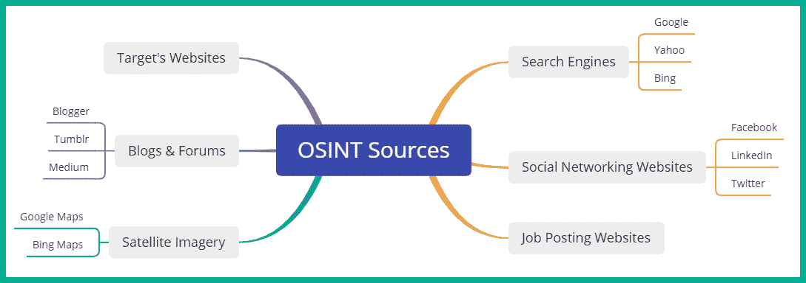

# 第四章：4 被动侦察

## 加入我们的 Discord 书籍社区

[`packt.link/SecNet`](https://packt.link/SecNet)作为一名有抱负的道德黑客和渗透测试员，培养你的技能并深入了解对手如何有效地发现并收集目标组织的敏感信息，分析收集的数据以生成有意义的信息，进而为计划未来对目标的网络攻击提供支持是至关重要的。像许多有抱负的道德黑客一样，我们总是对入侵系统和网络感到兴奋，因为这是学习进攻性安全战术和技术的有趣部分。然而，培养对手的思维方式同样重要，这有助于更好地理解真实的威胁行为者如何规划对目标系统、网络或组织的攻击。对手使用各种侦察技术和程序来寻找和收集关于目标的数据，以便更好地理解目标系统是否在线、是否存在安全漏洞，以及哪些攻击途径和基础设施可用于向目标传递恶意负载。了解关于目标的更多信息可以改善对手的攻击计划。本章中，你将学习威胁行为者和道德黑客如何使用侦察技术来发现、收集和分析被目标组织泄露的敏感数据，以及这些数据如何导致未来的网络攻击。此外，你还将学习如何隐匿作为道德黑客和渗透测试员的身份，并匿名化你的互联网流量，从而提高隐蔽性并减少威胁级别。本章将涵盖以下内容：

+   侦察的重要性

+   探索被动侦察

+   创建一个假身份

+   匿名化互联网流量

让我们开始吧！

## 技术要求

为了跟随本章的练习，请确保你已经满足以下硬件和软件要求：

+   Kali Linux - [`www.kali.org/get-kali/`](https://www.kali.org/get-kali/)

## 侦察的重要性

侦察工作专注于收集尽可能多的目标数据，然后分析收集到的数据，生成有意义的信息，供对手或威胁行为者利用，以识别目标系统、网络或组织的攻击面和安全漏洞。对手使用各种侦察技术和工具收集关于目标的系统信息、网络信息和组织信息。在不了解目标及其弱点的情况下，创建如*漏洞利用*等武器将会非常困难，而这些武器可能会影响目标系统、网络或组织的机密性、完整性和/或可用性。系统信息为道德黑客提供了宝贵的洞察力，因为它让我们知道目标系统上运行的内容，例如主机操作系统及其版本。操作系统和版本信息帮助道德黑客研究已知的安全漏洞，并开发或获取具有潜在能力的漏洞利用工具，用于危及目标。例如，全球许多组织并不总是在其网络基础设施中运行最新版本的操作系统。尽管操作系统供应商不断推出新版本并向客户发布安全更新，但由于多种原因，并非每个人都安装最新的安全补丁或更新，甚至有些人不会升级到最新版本。这种情况为对手、道德黑客和渗透测试人员创造了许多可能性。假设你正在为一个目标组织进行内部网络渗透测试，并发现他们的服务器运行的是较旧版本的 Microsoft Windows Server，经过一些研究，你发现所有的服务器都存在*EternalBlue*和*PrintNightmare*这些严重的安全漏洞。如果一个真正的对手发现了这些漏洞，你可以想象可能带来的影响和损害。系统信息包括以下内容：

+   确定网络中的存活主机

+   设备主机名

+   操作系统类型和版本

+   运行中的服务及版本

+   开放的服务端口

+   未认证的网络共享

+   用户名和密码

网络信息帮助道德黑客和渗透测试人员识别目标组织是否使用了任何不安全的协议、是否运行了易受攻击的服务，或是否有任何无意暴露的关键系统服务端口。例如，不安全的网络协议在传输前后不加密任何数据，因此，道德黑客可以拦截网络流量，意图捕获任何敏感数据，如用户凭据和密码哈希，这些信息可以被用于未授权访问网络中的关键系统。网络信息包括以下内容：

+   **域名系统** (**DNS**) 记录

+   域名

+   子域名

+   防火墙规则和策略

+   IP 地址和网络块

+   网络协议和服务

组织信息帮助道德黑客识别目标组织的员工及其联系信息，例如电话号码和电子邮件地址，这些信息可以用于各种社会工程攻击，如网络钓鱼。此外，识别高层次员工帮助道德黑客将网络钓鱼邮件集中在具有高权限用户账户的目标人物上。组织信息包括以下细节：

+   员工的详细信息和联系信息

+   组织及其远程办公室的地理位置

+   员工的角色和资料

洛克希德·马丁公司**网络杀伤链**的第一阶段是侦察，描述了威胁行为者如何利用此阶段进行攻击计划，如对目标进行广泛的研究，以更好地了解其安全漏洞，并确定威胁行为者如何实现其网络攻击的目标。此外，**MITRE ATT&CK**框架将侦察列为其企业矩阵的第一阶段，并将其描述为攻击者用来以被动或主动方式收集有关目标的信息的技术，包括收集组织、网络、系统信息以及员工数据，这些数据可以在未来的网络攻击中利用。因此，像道德黑客和渗透测试人员这样的网络安全专业人士也使用相同的侦察技术来高效地收集和分析数据，模拟真实攻击者的行为，进而攻击目标。因此，这为道德黑客和渗透测试人员提供了**网络威胁情报**（**CTI**），帮助他们了解目标组织如何泄露敏感数据，以及这些数据如何被真正的攻击者利用，在未来的攻击中加以利用。侦察通常分为以下几个类别：

+   被动侦察 – 被动侦察技术的目的是确保道德黑客不会与目标建立直接互动。此技术涉及从互联网的多个数据源收集和分析公开可用的信息，关于目标的详细资料。被动信息收集帮助道德黑客提高隐蔽性，减少触发安全传感器或警报的可能性，避免引起目标注意。

+   主动侦察 – 主动侦察技术通过与目标建立直接连接或互动，收集那些无法通过被动侦察技术获得的敏感信息。此技术涉及通过网络向目标发送特制探针，以收集操作系统、运行中的服务等技术细节。

根据 MITRE ATT&CK 框架，以下是对手常用的侦察技术：

+   主动侦察 – 该技术专注于向目标系统和网络发送探测信号，收集敏感信息，例如识别目标的网络块信息，发现应用程序和操作系统中的安全漏洞。

+   收集受害者主机信息 – 该技术帮助威胁行为者收集关于目标硬件、设备上运行的软件、设备固件及系统配置的信息。

+   收集受害者身份信息 – 恶意行为者使用此技术收集用户凭证、电子邮件地址、员工姓名和联系信息，这些信息来自公开数据源和泄露数据。

+   收集受害者网络信息 – 威胁行为者利用该技术收集目标网络基础设施的网络相关信息，如域名注册商信息、公共 DNS 记录、网络拓扑信息、IP 地址和网络块信息。

+   收集受害者组织信息 – 恶意行为者使用此技术收集关于目标的地理位置、服务提供商、商业运营的日期和时间，以及识别组织的关键人员。

+   信息钓鱼 – 恶意行为者常通过向目标组织发送钓鱼电子邮件，试图欺骗受害者执行某些操作或透露敏感信息，这些信息可进一步在网络攻击中被利用。

+   搜索封闭的源数据 – 搜索封闭的数据源包括查阅基于订阅的服务，这些服务提供有关威胁情报和数据泄漏的信息，包含有关组织泄露数据的敏感信息。

+   搜索开放的技术数据库 – 这些开放的技术数据库包含有关人员、组织和域名的公开信息。这些信息可被威胁行为者在规划网络攻击时利用。

+   搜索开放网站/域名 – 该技术涉及通过社交媒体平台、互联网搜索引擎和代码仓库网站搜索任何公开可用的信息，这些信息可用于识别安全漏洞并计划针对目标的网络攻击。

+   搜索受害者拥有的网站 – 访问目标拥有的网站可能包含有用的信息，如员工联系方式、电话号码、电子邮件地址，以及识别高层员工及其角色。这些信息可被用来开展鱼叉式钓鱼攻击。

> 在侦察阶段收集的信息帮助威胁行为者、道德黑客和渗透测试人员进入利用阶段，从而获得对目标系统或网络的访问权限。

侦察通常被称为*足迹收集*，即从攻击者的角度获取目标组织的特定信息。收集到的信息可以通过多种方式用于获取目标系统、网络或组织的访问权限。足迹收集让道德黑客和渗透测试员能够更好地了解目标基础设施的安全态势，快速识别目标系统和网络中的安全漏洞，创建组织的网络图，并将关注点缩小到具体的 IP 地址、域名以及需要信息的设备类型。足迹收集是侦察阶段的一部分；然而，由于足迹收集可以提供更具体的目标信息，我们可以将其视为侦察阶段的一个子集。下图展示了信息收集、侦察与足迹收集之间的联系：


作为一个有抱负的道德黑客和渗透测试员，使用相同的**战术、技术和程序**（**TTPs**）进行侦察有助于你更好地理解真实攻击者是如何识别目标组织的攻击面，收集并分析公开可用的数据以识别安全漏洞，并利用收集的数据来改善他们的攻击计划。通过使用与真实对手相同的侦察 TTPs，你将能够更好地模拟针对目标的真实网络攻击，并获得所需的见解，为改进网络防御、减少攻击面以及提高组织安全态势提供建议。

## 探索被动侦察

被动侦察侧重于收集信息，而不直接与目标进行连接或互动。这种方法降低了道德黑客和渗透测试者的威胁级别，从而减少了触发任何警报的可能性，警报会通知目标有人正在收集有关他们、他们的系统和网络基础设施的信息。随着时间的推移，全球各地的人们每天都会上传和创建更多的数据。无论是有人上传自己的照片、制作有趣的营销视频，还是发布有关新产品和服务的信息，互联网都在存储大量的数据，网络犯罪分子可以收集并仔细分析这些数据，以更好地了解他们的目标并改进其网络操作。如前所述，道德黑客和渗透测试者使用与真正威胁行为者相同的战术、技术和程序（TTPs），以高效地发现组织如何泄露关于自身的数据，以及恶意行为者如何利用收集到的数据来识别和危及其目标的安全漏洞。例如，互联网搜索引擎的设计目的是对互联网上的每个网页进行索引（爬取）并分析，以改善搜索结果，并为用户提供更准确的信息，帮助用户轻松找到网站服务器的主机名或互联网上某个资源的**统一资源定位符**（**URL**）。对手和道德黑客也使用各种互联网搜索引擎来发现无意中暴露的系统、不安全的网页门户和资源，这些资源属于目标组织。以下是道德黑客常用的互联网搜索引擎：

+   Google - [`www.google.com/`](https://www.google.com/)

+   Yahoo! - [`www.yahoo.com/`](https://www.yahoo.com/)

+   Bing - [`www.bing.com/`](https://www.bing.com/)

+   DuckDuckGo - [`duckduckgo.com/`](https://duckduckgo.com/)

+   Yandex - [`yandex.com/`](https://yandex.com/)

> Yandex 互联网搜索引擎是俄罗斯基于的，提供亚洲和欧洲地区更好的资源搜索结果。DuckDuckGo 是一个注重隐私的互联网搜索引擎，不会存储用户的搜索或跟踪详情。

作为一名有志的伦理黑客，建议在进行目标研究时使用至少两种不同的互联网搜索引擎。例如，一种搜索引擎可能提供更符合目标的结果，而另一种搜索引擎可能提供较少敏感的结果。然而，在侦察阶段，收集所有信息是至关重要的，然后分析收集到的数据，以确定哪些信息是有用的，并帮助你建立目标的资料。为了更好地理解对手、伦理黑客和渗透测试人员如何使用被动侦察来识别目标上的敏感信息和安全漏洞，让我们深入探索开放源代码情报。

### 开放源代码情报

**开源情报**（**OSINT**）通常指从多个数据源收集和分析公开可得的信息，以更好地了解攻击面，例如目标组织的安全漏洞。此外，OSINT 还帮助道德黑客和渗透测试人员识别目标如何泄露敏感数据，这些数据可以被威胁行为者利用来提升其网络攻击和威胁。随着越来越多的组织在互联网上创建在线存在，从启动虚拟服务器到在云计算服务提供商的基础设施上托管其 Web 应用程序，许多公司正在利用社交媒体平台提高意识并与新客户和现有客户分享信息。社交媒体平台使得世界各地的人们可以通过数字媒介分享更新、图片和视频，然而，有时人们会在不意识到潜在风险的情况下泄露关于自己或其组织的敏感信息，如果这些信息被网络犯罪分子利用，可能会带来严重后果。例如，一名员工分享了一张自己在工作站上的数字照片，然而图片的背景显示了桌面上的一些机密文件、员工的 ID 徽章以及计算机显示器上的一些应用程序。如果威胁行为者针对该公司，攻击者将通过被动侦察来识别目标组织的社交媒体存在，如其 LinkedIn、Facebook、Instagram 和 Twitter 页面。有时，组织会在社交媒体上发布新职位空缺的招聘信息，并列出潜在候选人的技术要求。威胁行为者可以利用职位发布中找到的技术细节来确定组织网络中运行的技术和应用程序。此外，威胁行为者还可以识别过去和现在员工的社交媒体账户，以确定是否有人上传了包含敏感细节的图片。社交媒体平台为用户提供了许多隐私功能，然而，并非每个人都会花额外的时间确保其在线资料是私密的，并且仅对受信任的联系人可见。如果威胁行为者能够找到隐私设置不安全的员工社交媒体账户，并且这些员工的图片完全公开，攻击者可以简单地查找包含员工 ID 徽章的图片，这些图片可以用来制作假徽章，从而非法进入公司的设施，甚至确定员工计算机上运行的应用程序。识别目标系统上的应用程序有助于威胁行为者研究操作系统和计算机应用程序的安全漏洞。虽然在社交媒体平台上可以找到大量敏感信息，但也有其他的 OSINT 数据源，如以下内容：

+   在线论坛 – 有许多在线论坛和讨论板，例如**Stack Overflow**（[`stackoverflow.com/`](https://stackoverflow.com/)），通常由技术社区成员用来互相帮助和分享想法。然而，技术人员可能会在讨论论坛上创建个人资料，并包含他们的职位和公司名称。威胁行为者可以搜索与目标组织相关的用户资料，然后查看员工发布的所有帖子和讨论，以识别可能泄露的敏感信息。例如，员工可能会在论坛上发布求助帖子，寻求帮助解决其网络中特定应用程序的问题，并透露应用程序版本、错误日志以及服务器的主机操作系统。威胁行为者可以利用这些信息研究该应用程序和操作系统的已知安全漏洞。

+   搜索引擎 – 网络搜索引擎会爬取每个网页并识别互联网上的网页服务器。威胁行为者可以利用搜索算法，并使用定制的搜索参数在各种互联网搜索引擎上查找特定的资源和目标组织的敏感网址。例如，威胁行为者和网络安全专业人士都可以使用*Google Dorking*技术进行高级的 Google 搜索。

+   公共数据库 – 互联网上有许多公共数据库，其中包含有关公司及其位置的信息，以及个人及其联系方式。威胁行为者可以收集并分析公共数据库中找到的信息，计划针对目标组织员工的社交工程攻击，以便进入其网络基础设施。

+   网络档案 – **互联网档案馆**（[`archive.org/`](https://archive.org/)）是一个在线数字图书馆，保存互联网的每一份快照，并将其归档保存 20 年。因此，互联网上发布的任何内容都会被归档，并且任何人都可以检索，包括威胁行为者和道德黑客。互联网档案馆帮助威胁行为者识别目标网站服务器上的遗留网页应用程序和插件，以查找潜在的安全漏洞。

+   WHOIS 数据库 – 互联网上有许多 WHOIS 数据库，存储公共域名的注册详情。这类数据库包含域名的注册和到期日期、注册人的联系方式和地址，以及公共 DNS 记录。如果域名所有者没有支付额外费用来保护他们的**个人身份信息**（**PII**），威胁行为者可以利用所有者的个人信息策划未来的网络攻击，如社交工程攻击。

+   公共记录 – 在世界各地，许多国有和政府机构通常会存储关于国家财产、公民、商业注册等的公共记录。例如，这些机构中的许多正在通过互联网建立在线平台，威胁行为者可以轻松访问公共记录，以识别目标公司的地理位置。

+   代码仓库 – 许多开发者正在使用 GitHub 和其他在线代码仓库，来同时处理他们组织的新应用和现有应用。然而，如果用户没有在其账户上应用适当的隐私控制，威胁行为者可以轻松查看他们的在线代码项目，以确定目标组织中正在运行的应用程序，以及代码中是否存在可以被利用的安全漏洞，从而在网络中建立立足点。

+   地理空间数据 – 该数据来源包括公开可用的地图和影像系统，使得互联网上的任何人都能找到物理位置并识别某个区域的周边环境。例如，威胁行为者可以使用**谷歌地图**来确定目标组织的地理位置，并通过其**街景**功能查看是否有附近的停车场以及物理通道进入该区域。

此外，组织通常会在各种互联网平台上发布自己的信息，如博客、社交媒体平台和招聘网站。由于互联网随时可用且容易访问，威胁行为者或渗透测试人员仅通过使用搜索引擎就能轻松收集目标组织的信息，进而识别其基础设施。由于对手利用开放源信息（OSINT）来提升其网络攻击和未来操作的效果，道德黑客和渗透测试人员也使用相同的战术、技术和程序（TTPs），确保他们能够高效发现目标如何泄露敏感数据，以及威胁行为者如何利用这些信息破坏目标的系统和网络。此外，道德黑客将获得**网络威胁情报**（**CTI**），从而提供有关如何帮助组织减少数据泄露、预防未来网络攻击和威胁的建议。以下图示展示了从各种在线数据源收集 OSINT 的思维导图：



如前图所示，存在许多数据来源，通常被对手和道德黑客用来达到不同的目标。威胁行为者的目标通常集中在以恶意目的破坏目标系统的机密性、完整性和/或可用性。而道德黑客和渗透测试人员则运用相同的技术和技能，凭借良好的道德指引，帮助组织识别潜在的安全漏洞，并采取对策来防止真实的网络攻击。

> 请记住，验证从 OSINT 收集的信息的准确性非常重要。有时，在线数据源可能不会提供关于目标的最新信息，这可能导致基于过时的信息规划网络攻击或开发漏洞利用。

### 应该收集多少数据

收集的越多数据，应该能帮助你更好地理解目标，但多少数据才算足够呢？在开始进行 OSINT 之前，道德黑客和渗透测试人员需要理解渗透测试的交付物，了解组织是否有兴趣确定其公司数据是否被故意或无意地泄露到网上，攻击者如何识别并利用其系统中的安全漏洞，以及如果对手利用 OSINT 来规划网络攻击，将会带来什么影响。一旦道德黑客确定了安全评估的范围，他们将开始进行*数据收集与获取*，收集目标组织的 OSINT 数据。这意味着，道德黑客将使用侦察 TTP（战术、技术和程序）来收集多种数据类型，如文本、媒体和地理空间数据，从互联网上多个数据源收集，以创建目标的档案。在这个阶段，对于道德黑客和渗透测试人员来说，识别与目标相关的信息并为其添加上下文是非常重要的，同时还要判断收集到的数据是否足够。如果收集到的数据不足，道德黑客将无法获取足够的细节来确定目标系统中的安全漏洞类型、攻击向量（用于传送恶意负载）、目标的地理位置、系统上运行的服务和应用程序等等。数据收集阶段结束后，道德黑客需要仔细分析收集到的数据，以更好地理解它如何应用于目标组织。在这个阶段，道德黑客可能会发现一些有趣的东西，并决定通过收集更多的数据进行深入分析。然而，重要的是要监控在渗透测试每个阶段所花费的时间，因为你希望将大部分时间花在侦察阶段，而不是忽视利用和后期利用阶段。因此，在研究目标时，深入研究的过程中需要保持警觉，避免掉进“兔子洞”。**您的 OSINT 图形分析器**（**YOGA**）思维导图帮助道德黑客和渗透测试人员更好地可视化如何从一个数据点轻松推导出另一个数据点，并展示可以从每个数据点收集的信息类型，如下所示：


如前所示的截图所示，如果一个道德黑客以目标域名作为起点，YOGA 提供了一张地图，展示了下一个数据点和信息收集来源。

> 要了解更多关于 YOGA 的信息，请参见：[`yoga.myosint.training/`](https://yoga.myosint.training/)。

分析过的数据已被转化为有意义的信息，以确定以下内容：

+   收集的数据的准确性如何？

+   数据是否来自可靠的来源？

+   收集的数据是事实还是主观的？

+   是否收集了足够的数据来理解目标，还是需要更多数据？

接下来，道德黑客或渗透测试员可能会尝试收集更多的数据，但会选择不同的领域，以更好地理解和完善目标的资料。例如，道德黑客可能会尝试确定员工的组织层级，并执行社交媒体 OSINT，识别所有拥有社交媒体档案的员工，以调查每个人泄露了关于公司的哪些信息。发现员工的社交媒体账户可能会导致发现受攻击组织中的 IT 专业人员，并确定他们是否最近在社交媒体上发布了关于公司技术工作的内容。一旦足够的数据被分析出来，道德黑客和渗透测试员就可以创建情报，帮助规划*武器化*、*交付*和*利用*阶段，以攻破目标。然而，收集敏感信息的主动侦察技术和程序是必要的，因为这些信息在 OSINT 中无法获得。完成这一部分后，你已经了解了被动信息收集的重要性，以及道德黑客和渗透测试员如何利用 OSINT 识别目标系统、网络和组织中的安全漏洞。在下一部分，你将学习如何隐藏作为一个有抱负的道德黑客的在线身份。

## 创建袜子木偶

有许多技术和工具是道德黑客和渗透测试员常用的，用来收集关于其目标的各种互联网信息。在使用 OSINT 策略和技术时，你需要确保在整个过程中不直接与目标组织接触，且不暴露自己的真实身份。**袜子木偶**是网络安全行业中使用的术语，尤其是在渗透测试员中。袜子木偶是对个体的虚假表现，例如创建一个完整的假身份或人格，目的是渗透在线社区以收集信息。虽然冒充他人是违法的，但黑客在收集关于目标的信息时，往往会在互联网上创建一个假身份。通过在社交媒体网站等在线平台上创建一个虚假的人格，没有人知道账户所有者的真实身份。因此，黑客可以假装是目标的员工或共同朋友，以收集有关该组织的数据。

> 永远不要使用个人账户进行与工作相关的活动，如 OSINT 操作、调查、道德黑客或渗透测试。

渗透测试人员通常会创建一个“虚拟身份”来掩盖其真实身份，以便在对目标进行情报收集时使用。这种技术用于防止目标（如组织或个人）识别出正在收集他们数据的渗透测试人员的真实身份。如果组织雇佣渗透测试人员模拟现实中的网络攻击，而渗透测试人员又使用他们真实的在线账户来收集情报，那么他们的真实身份可能会被揭露。一些社交媒体平台，如 LinkedIn，允许用户查看最近访问他们个人资料的人。如果渗透测试人员使用真实账户调查某员工的个人资料，可能会触发组织的警觉。另外，使用“虚拟身份”的一个关键方面是确保目标不知道是谁在进行开源情报（OSINT）调查。这也是渗透测试人员在进行安全评估时保持隐蔽性的良好实践。在创建虚拟身份时，确保个人资料看起来非常真实可信，以便任何查看的人都不会怀疑。以下是一些创建虚拟身份的资源：

+   假名生成器 - [`www.fakenamegenerator.com/`](https://www.fakenamegenerator.com/)

+   这个人不存在 - [`www.thispersondoesnotexist.com/`](https://www.thispersondoesnotexist.com/)

+   代理信用卡 - [`privacy.com/`](https://privacy.com/)

与其考虑创建虚假身份或虚假人格所需的所有组件，不如使用像**假名生成器**这样的网站，它允许你选择各种特征和参数，网站会在几秒钟内生成一个完整的虚假身份。没有图片的个人资料通常是一个红旗，而使用别人照片可能在一段时间内有效，直到有人发现他们朋友或亲人的个人资料照片被用在另一个账户上。使用像**这个人不存在**这样的网站是有利的，因为它使用算法生成不存在于现实中的人像。但是请记住，有各种在线工具可以用来识别 AI 生成的图像。有时，作为渗透测试人员，你可能需要一个*一次性电话号码*或某种支付服务来帮助完成渗透测试工作。使用你自己的信用卡在各种网站上进行交易可能会暴露你的真实身份，例如购买一个一次性电话号码来进行电话社会工程攻击。使用像**Privacy**这样的网站可以作为你信用卡的代理。该网站通过存储你的真实信用卡号，使你能够为每个独特的服务或网站生成一个独特的代理卡号，从而防止你通过电子商务网站的信用卡号暴露真实身份。以下是在创建虚拟身份时的一些指南：

+   每当你创建社交媒体账户时，确保不要使用你的真实 IP 地址。可以考虑在当地的咖啡店使用免费的互联网服务。

+   在创建社交媒体账户时，请不要使用**虚拟私人网络**（**VPN**）或**洋葱路由器**（**TOR**）服务，因为许多社交媒体平台能够检测到你的原始流量通过 VPN 或 TOR 进行代理，并且在账户创建过程中将要求额外的身份验证。

+   你的假身份账户应该看起来像一个普通人，以避免被识别为虚假账户。

+   在注册在线账户时，考虑使用临时邮箱地址。有许多免费的邮箱服务，比如**Proton Mail**（[`proton.me/`](https://proton.me/)），它们提供额外的隐私保护。然而，你也可以在 Gmail、Outlook，甚至是 Yahoo Mail 上创建一个简单的（基础的）邮箱地址。

+   在创建假身份账户后，确保经常分享更新、状态、图片，并与平台上的其他人互动和连接。

+   不要使用他人的照片作为你的假身份账户头像。反向图像搜索可以用来识别图片是否是假的或被滥用。

完成本节后，你已经理解了在对目标进行侦察时使用假身份账户的基本原理和重要性。在下一节中，你将学习如何匿名化你的互联网流量。

## 匿名化基于互联网的流量

在渗透测试过程中保持身份隐蔽非常重要，以防目标知道是谁在收集关于他们的信息。然而，在网络攻击链的侦察阶段，你可能会使用各种工具来帮助自动化信息收集过程。这些工具将会生成流量，并在每个离开你设备的数据包中包含你的源 IP 地址。例如，你正在对目标网站服务器进行端口扫描，以识别开放端口和运行的服务。当你设备上的端口扫描工具向目标网站服务器发送特制的数据包（探测）时，每个探测包都会包含你的源 IP 地址，攻击者可以利用这个 IP 地址来识别你的地理位置。目标网站服务器将生成每次交易的日志，并记录所有源 IP 地址，包括你的。以下是渗透测试员常用的匿名化流量的技术：

+   **虚拟私人网络**（**VPN**）

+   **Proxychains**

+   **洋葱路由器**（**TOR**）

在以下子章节中，你将了解作为渗透测试员使用这些技术的好处。

### 虚拟私人网络（VPN）

VPN 允许用户在不安全的网络（如互联网）上安全地发送数据。在信息技术（IT）领域，安全和网络专业人员通常使用 VPN 来确保他们的远程工作人员和办公室能够通过互联网安全访问公司总部的资源。这种类型的 VPN 被称为远程访问 VPN。此外，站点对站点 VPN 可用于在互联网跨越分支办公室之间建立一个安全的通信通道，而无需使用电信提供商提供的专用**广域网**（**WAN**）服务。渗透测试人员可以使用 VPN 服务确保他们的攻击系统产生的网络流量来自不同的地理位置。假设您需要使用工具对互联网上的目标服务器进行扫描，但不希望目标知道流量的实际来源。使用 VPN，其中 VPN 服务器位于另一个国家，可以对您有利。这意味着您的网络流量将通过 VPN 服务提供商的网络安全地路由，并且只会在目标 VPN 服务器所在的国家/地区退出。因此，您可以让所有网络流量在美国、俄罗斯和巴西等地退出，从而掩盖和匿名化您的身份和来源。以下图示展示了使用在线 VPN 服务器的简单示意图：


以下是使用 VPN 匿名化您的网络流量时需要考虑的一些重要事项：

+   使用商业 VPN 服务提供商需要付费订阅。

+   确保您的 VPN 服务提供商不保留日志或将用户数据出售给互联网第三方数据经纪商。

+   确保 VPN 服务提供商允许用户无限制或不计量的带宽。

+   确保 VPN 服务提供商支持您的操作系统并提供相应的 VPN 客户端。

+   您可以在云服务提供商的服务器上托管自己的 VPN 服务器。

+   使用 VPN 时，请确保您的 DNS 流量不会泄漏，因为它会暴露您的地理位置。考虑使用**DNS 漏洞测试**（[`www.dnsleaktest.com/`](https://www.dnsleaktest.com/)）来验证您的 DNS 消息是否泄漏到 VPN 隧道外。

+   使用 VPN 时，请考虑禁用操作系统上的 IPv6 通信。

> OpenVPN 允许任何人托管自己的 VPN 访问服务器作为自托管解决方案或在云端使用。OpenVPN 访问服务器允许最多 2 个设备免费使用。欲了解更多关于 OpenVPN 访问服务器的信息，请参阅：[`openvpn.net/access-server/`](https://openvpn.net/access-server/)。

在选择 VPN 服务、云服务提供商或设置解决方案之前，请确保进行大量的研究和测试，以确定哪种解决方案最适合你。接下来，你将学习如何使用 Proxychains 匿名化你的互联网流量。

### Proxychains

代理是一个系统，通常是服务器，位于网络中源主机和目标主机之间。如果发送者想与目标服务器通信，发送者会将消息转发给代理系统，然后由代理系统转发给目标服务器。目标服务器会认为消息来自代理系统，而不是实际的源。 在信息技术领域，使用代理服务器有许多好处。在网络安全行业中，它通常用于匿名化网络流量的来源，并掩盖道德黑客和渗透测试者的真实源 IP 地址。渗透测试者使用**proxychains**，它使他们能够在向目标系统、网络或互联网发送流量时，创建多个代理服务器之间的逻辑连接链。Proxychains 允许渗透测试者配置各种类型的代理，如下所示：

+   HTTP

+   HTTPS

+   SOCKS4

+   SOCKS5

简单来说，道德黑客系统的流量会首先发送到链中的第一个代理服务器，然后传送到下一个代理，依此类推，直到链中的最后一个代理服务器将流量转发到互联网的目标。与 VPN 相比，使用 Proxychains 并不会加密你的流量，但它确实为你的网络流量提供了匿名性，并防止你的真实 IP 地址暴露给目标。下图显示了代理链效应中的流量流动过程：


渗透测试者如何获得代理服务器列表？这是许多人常问的问题。简单来说，你可以通过各种云服务提供商（如 Microsoft Azure 和**Amazon Web Services**（**AWS**））在互联网上设置你自己的代理服务器。此外，你还可以从付费服务（如 VPN 服务提供商）获得代理服务器，或者执行 Google 搜索，如 *free proxy server list*，来查找免费可用的代理服务器。

> 你可以使用像 [`spys.one/en/`](https://spys.one/en/) 这样的网站，获取免费代理服务器列表。然而，请记住，这些服务器可能并非总是在线或可用。因此，建议使用多个代理服务器。

要开始设置 proxychains，请按照以下说明操作：

1.  打开**Oracle VM VirtualBox 管理器**并启动**Kali Linux**虚拟机。

1.  登录到**Kali Linux**虚拟机，打开**终端**，然后使用以下命令更新本地文件名数据库并搜索`proxychains4`配置文件：

```
kali@kali:~$ sudo updatedb
kali@kali:~$ locate proxychain
```

以下截图显示了`proxychains4.conf`文件的位置：


1.  接下来，无论是在主机操作系统还是 Kali Linux 上，打开网页浏览器，访问[`spys.one/en/`](https://spys.one/en/)，查看代理服务器列表。确保从网站上选择一些代理服务器。

1.  选择了前一步中的一些代理服务器后，您需要修改`proxychains4.conf`文件以使用这些代理服务器。使用以下命令通过 Nano 命令行文本编辑器打开`proxychains4.conf`文件：

```
kali@kali:~$ sudo nano /etc/proxychains4.conf
```

1.  接下来，`proxychains4.conf`文件的内容将在终端中显示，使用键盘上的方向键向下滚动到包含`#dynamic_chain`的行，并删除该行开头的`#`字符。然后，在`strict_chain`行的开头插入一个`#`字符，如下图所示：


如前所示，删除 Linux 配置文件中行首的`#`字符将取消该行的注释，操作系统将执行该行命令。因此，取消注释`dynamic_chain`，代理链程序将链式连接所有预定义列表中的代理服务器。通过注释`strict_chain`，代理链程序将不会使用这种代理方法。

1.  接下来，滚动到`proxychains4.conf`文件的末尾，在`socks4 127.0.0.1 9050`行的开头插入一个注释符号（`#`），以禁用 TOR 代理选项。然后，在**ProxyList**的末尾插入每个额外的代理服务器，如下所示：


1.  接下来，要保存配置文件，按`CTRL + X`，然后按`Y`确认文件名，最后按`Enter`保存并退出到终端。

1.  在使用 Proxychains 之前，请使用以下命令获取您的真实公共 IPv4 地址：

```
kali@kali:~$ curl ifconfig.co
```

1.  要使用 Proxychains，请使用以下命令启动一个 Firefox 网页浏览会话，将所有基于互联网的流量通过代理服务器列表进行路由：

```
kali@kali:~$ proxychains4 -f /etc/proxychains4.conf firefox
```

> `proxychains4 -f <配置文件>`命令允许我们选择特定的配置文件进行使用。

1.  接下来，一旦在 Kali Linux 上打开 Firefox 应用程序，访问[`ifconfig.co/`](https://ifconfig.co/)以验证互联网设备所看到的公共 IP 地址和地理位置，如下所示：


如上图所示，公共 IP 地址是`proxychains4.conf`文件中的最后一个代理服务器。此外，这里显示的公共 IP 地址与第 8 步中的真实公共 IP 地址不同。另外，您可以使用以下命令下载并查看具有新公共地址的`ifconfig.co`网页：

```
kali@kali:~$ proxychains4 -f /etc/proxychains4.conf curl ifconfig.co
```

以下截图显示了使用与不使用 Proxychains 时的公共 IP 地址：


1.  最后，每当您想使用 Proxychains 时，确保检查代理服务器是否在线，并使用第 9 步中显示的命令。

接下来，您将学习如何使用 TOR 将您的互联网流量通过暗网进行路由。

### 洋葱路由器（TOR）

TOR 项目及其服务通常被网络安全专家、研究人员和网络犯罪分子用来匿名化他们的互联网流量并访问暗网。TOR 允许用户通过 TOR 网络的多个节点来路由其互联网流量，从而隐藏发送者的身份和地理位置信息。此类服务和技术对道德黑客和渗透测试人员非常有用，因为 TOR 提供多层数据加密，以提高安全性和匿名性。每当用户向 TOR 网络发送数据包时，计算机上的 TOR 应用程序会通过多层数据加密将数据包进行加密。当加密的数据包到达 TOR 网络的第一个节点时，第一节点会解密第一层加密，以决定如何将数据包转发到下一个节点。当数据包到达第二节点时，它会解密另一层加密，整个过程会重复，直到数据包到达 TOR 网络中的出口节点或最后一个节点。出口节点将进行最后一次解密，以确定数据包的真实目的地 IP 地址，并将其转发到互联网上/暗网上的目标主机。因此，互联网或暗网中的目标主机无法追踪到数据包的真实来源，因为每个 TOR 节点只知道转发数据包时前一个和下一个节点的信息。下图显示了 TOR 网络中的链式效果：


要开始在 Kali Linux 上设置 TOR 服务和 TOR 浏览器，请使用以下说明：

1.  打开**Oracle VM VirtualBox 管理器**并启动**Kali Linux**虚拟机。

1.  接下来，在登录 Kali Linux 后，打开**终端**并使用以下命令更新软件包仓库列表：

```
kali@kali:~$ sudo apt update
```

1.  接下来，使用以下命令在 Kali Linux 上安装**TOR**和**TOR 浏览器**：

```
kali@kali:~$ sudo apt install -y tor torbrowser-launcher
```

1.  接下来，使用以下命令启动**TOR 浏览器**应用程序：

```
kali@kali:~$ torbrowser-launcher
```

1.  一旦**TOR 浏览器**出现，点击**连接**，以建立 TOR 浏览器与 TOR 网络之间的连接，如下图所示：


1.  一旦连接到 TOR 网络，访问 [`ifconfig.co/`](https://ifconfig.co/) 来确认 TOR 浏览器的流量是否通过 TOR 网络路由，如下所示：


> 如果您选择访问 `.onion` 后缀的网址，请自担风险。请确保不要下载任何内容、信任任何人或任何黑暗网络上的信息。

1.  接下来，关闭 **TOR 浏览器** 以终止连接和应用程序。

TOR 浏览器仅会将来自自身的流量通过 TOR 网络路由，而不会将 Kali Linux 上其他应用程序的流量通过 TOR 网络路由。要将 Kali Linux 上任何应用程序的流量通过 TOR 网络路由，请使用以下配置：

1.  在 **Kali Linux** 上，打开 **终端** 并使用以下命令打开 `proxychains4.conf` 文件：

```
kali@kali:~$ sudo nano /etc/proxychains4.conf
```

1.  打开 `proxychains4.conf` 文件后，取消注释 `socks4 127.0.0.1 9050` 行，并注释掉 **ProxyList** 中的所有其他代理服务器，如下所示：


1.  接下来，按 `CTRL + X` 键保存配置文件，然后按 `Y` 确认文件名并按 `Enter` 保存并退出终端。

1.  接下来，使用以下命令在 Kali Linux 上启动 TOR 服务：

```
kali@kali:~$ sudo systemctl start tor
kali@kali:~$ sudo systemctl status tor
```

以下截图显示 TOR 服务正在运行（活跃状态）：


1.  接下来，使用以下命令启动应用程序，同时将其所有基于互联网的流量通过 TOR 网络路由：

```
kali@kali:~$ proxychains4 firefox
```

以下截图显示了来自 Firefox 应用程序的基于互联网的流量正在通过 TOR 网络进行路由：


1.  最后，使用以下命令在 Kali Linux 上停止 TOR 服务：

```
kali@kali:~$ sudo systemctl stop tor
kali@kali:~$ sudo systemctl status tor
```

完成本节后，您已经了解了多种匿名化互联网流量的方法，并学会了如何在 Kali Linux 上使用 proxychains 和 TOR 服务。

## 总结

在本章中，你学习了侦察在渗透测试中的重要作用，以及它如何帮助道德黑客构建目标的资料，以更好地理解目标上存在的安全漏洞。此外，你还探索了侦察的各种 TTP（战术、技术和程序），以及渗透测试者如何利用 OSINT 来识别目标组织如何泄露关于它们自身的敏感数据，以及这些数据如何被真实的对手利用。最后，你获得了作为道德黑客和渗透测试者，隐蔽在线身份和匿名化互联网流量的技能和实践经验。我相信，本章所提供的知识将为你提供有价值的见解，支持你成为网络安全领域中的道德黑客和渗透测试者的道路。愿这种新获得的理解能够在你的旅程中赋予你力量，让你能够自信地在行业中航行，并产生重大影响。在下一章中，*探索开源情报*，你将获得有效收集和分析公开信息的实际技能，以便为目标创建情报。

## 进一步阅读

+   MITRE ATT&CK 侦察 - [`attack.mitre.org/tactics/TA0043/`](https://attack.mitre.org/tactics/TA0043/)

+   OSINT 生命周期 - [`www.sans.org/blog/what-is-open-source-intelligence/`](https://www.sans.org/blog/what-is-open-source-intelligence/)

+   OSINT 框架 - [`osintframework.com/`](https://osintframework.com/)
