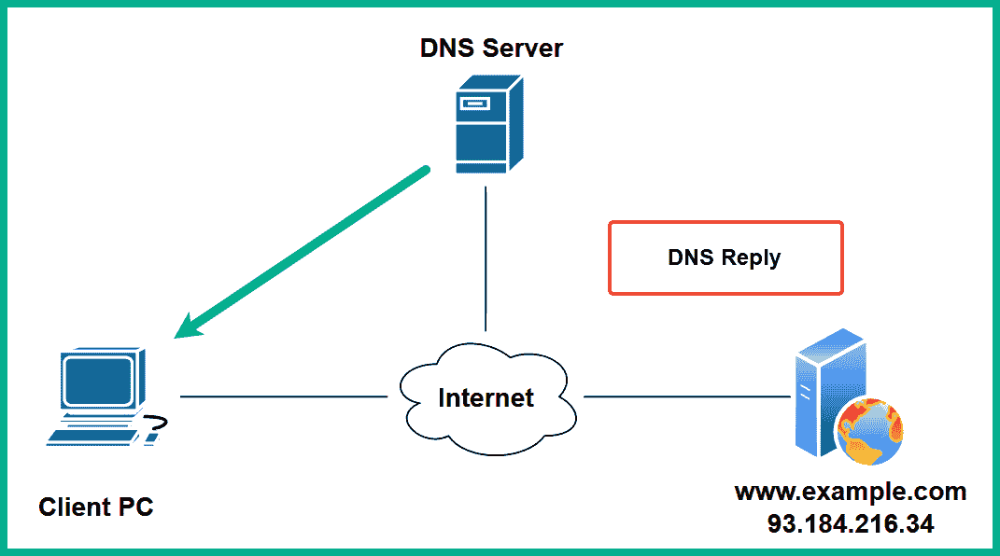
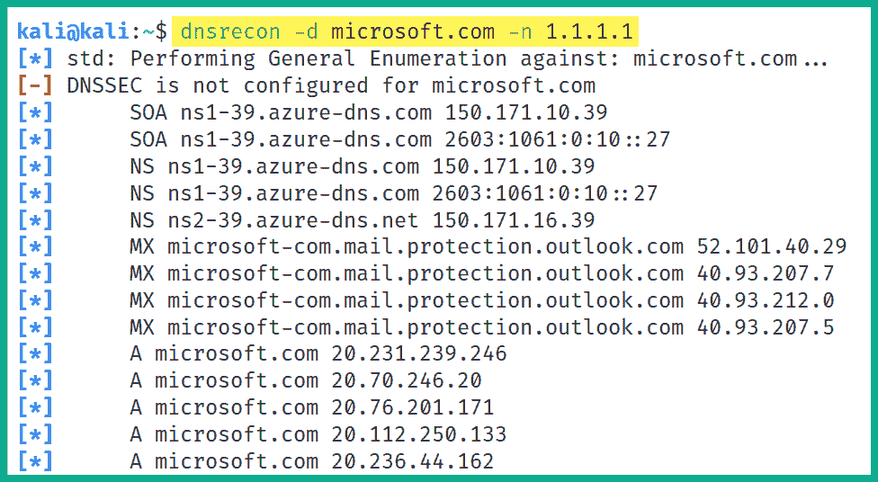
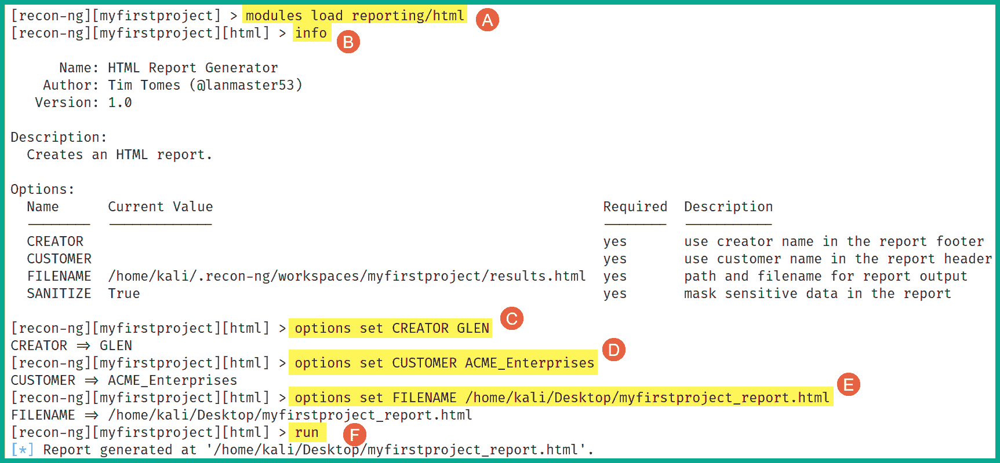

# 第五章：5 探索开放源代码情报

## 加入我们的 Discord 书籍社区

[`packt.link/SecNet`](https://packt.link/SecNet)仅仅几十年前，由于各种限制，互联网并没有那么容易为世界各地的许多人和组织所接入。然而，随着技术的不断发展，互联网服务提供商（ISP）不断扩展网络基础设施，确保每个人都能连接和访问互联网，今天的互联网用户数量比以往任何时候都要多，而且这个数字还在持续增长，许多人和组织利用互联网获取个人利益和商业利益，如教育、营销、与他人进行数字连接、电子商务等等。这意味着，人们不断在互联网上创建和上传数据，因此信息可以轻松地被互联网上的任何人访问。有时，人们甚至是组织的员工，会在互联网上分享过多的敏感信息，而没有意识到对手如何收集和分析这些数据，进而创建情报，计划对组织发起网络攻击。在本章中，你将探索道德黑客和渗透测试人员如何收集和分析**开放源代码情报**（**OSINT**），这些情报来源于在线数据源，用于创建目标资料并更好地理解目标，在进一步开发或获取利用工具以入侵目标系统和网络之前。你将学习如何利用谷歌黑客技术筛选搜索结果，识别任何意外暴露的资产、系统和资源。此外，你将掌握威胁行为者如何在目标域进行被动侦察并识别组织的子域的实战技能。进一步，你将探索渗透测试人员常用的各种互联网搜索引擎，用于识别公司技术基础设施，以及黑客如何收集员工数据来规划和改进他们的操作。在本章中，我们将涵盖以下内容：

+   谷歌黑客技术

+   域名侦察

+   子域收集

+   识别组织基础设施

+   收集员工数据

+   社交媒体侦察

让我们开始吧！

## 技术要求

为了跟上本章的练习，请确保你已经满足以下硬件和软件要求：

+   Kali Linux - [`www.kali.org/get-kali/`](https://www.kali.org/get-kali/)

+   DNSmap - [`github.com/resurrecting-open-source-projects/dnsmap`](https://github.com/resurrecting-open-source-projects/dnsmap)

+   Sublist3r - [`github.com/aboul3la/Sublist3r`](https://github.com/aboul3la/Sublist3r)

+   Sherlock - [`github.com/sherlock-project/Sherlock`](https://github.com/sherlock-project/Sherlock)

## Google 黑客技术

Google 黑客技术的概念，有时被称为 *Google dorking*，并不是指入侵 Google 的网络基础设施或系统，而是利用 Google 搜索引擎中的高级搜索参数来过滤特定结果。许多组织并不总是密切关注他们在互联网上暴露的系统和资源。Google 搜索是一个非常强大的搜索平台，能够爬取/索引互联网上的所有内容，并过滤大多数恶意网站。由于 Google 索引了一切，搜索引擎可以自动发现许多组织的隐藏在线目录、资源和登录门户。

> 使用 Google 黑客技术本身并不违法，但有一条非常细微的界限，你不应该越过，否则你将面临法律问题。我们可以使用 Google 黑客技术来发现互联网上隐藏的敏感目录和网页门户，但如果你怀着恶意意图利用这些信息进行网络攻击，那么你可能会面临法律行动。

要开始学习 Google 黑客技术，我们来看看以下场景：

+   假设你需要使用被动侦察技术来识别目标组织的域名和子域名。一种常见的技术是使用 Google 搜索来发现目标的公共资产。

为此，请使用 `site:domain-name` 语法，过滤指定域的所有结果，如此处所示：


如上图所示，Google 搜索仅返回包含目标域名的结果。

+   如果你想根据特定关键词过滤目标域名的搜索结果，可以使用 `keyword site:domain-name` 语法，如下所示：


如上图所示，`eternalblue site:microsoft.com` 语法使我们能够过滤搜索结果，只显示包含 ‘`eternalblue`’ 关键词的所有微软域名和 URL。在进行基于设备的应用程序、操作系统和供应商的安全漏洞与利用研究时，这非常有用。

+   如果你想找到目标组织的所有域名，并基于两个关键词过滤结果，可以使用 `keyword1 AND keyword2 site: domain-name` 语法，如下所示：


如上图所示，使用 `AND` 运算符与精心挑选的关键词有助于我们找到目标域的登录门户。

> 你可以使用 `OR` 语法来指定关键词，而不是使用 `AND` 来包含两个关键词。

+   如果你有兴趣在特定域名上搜索特定文件类型，请使用 `site:domain-name filetype:file type` 语法，如下所示：


如前面的截图所示，包含`filetype:`语法有助于我们筛选搜索结果，显示任何被目标组织故意或无意泄露的文件。

+   要发现包含敏感关键词的特定目录，可以使用`site:domain-name intitle:keyword`语法，如下所示：


如前面的截图所示，将`login`关键词作为`intitle:`参数是展示目标域的登录门户的有用方法。

+   要查找目标组织的子域，使用`site:domain-name -www`语法以排除`www`参数，如下所示：


使用这一技巧是从搜索结果中排除特定子域和 URL 的好方法。

> 此外，你可以使用`site:*.domain.com -site:www.domain.com`语法来查找目标组织的子域。

此外，如果你不太确定如何在谷歌搜索引擎中使用高级搜索操作符，你可以直接访问谷歌主页，然后点击**设置** > **高级搜索**，以打开**高级搜索菜单**，如下所示：


谷歌提供了一种非常简单易用的方法，允许用户进行高级搜索和过滤，而不需要了解高级搜索操作符，如下所示：


一旦你填写了必要的详细信息并点击**高级搜索**按钮，谷歌会自动插入执行高级搜索所需的相应搜索操作符。虽然使用高级谷歌搜索操作符有很多可能性，但有时会有些令人不知所措。**Google Hacking Database**（**GHDB**）由 Kali Linux 的创建者**Offensive Security**（[`www.offsec.com/`](https://www.offsec.com/)）维护，可以在[`www.exploit-db.com/google-hacking-database`](https://www.exploit-db.com/google-hacking-database)找到。GHDB 是一个包含各种谷歌 dork（高级搜索操作符）列表的网站，这些操作符用于通过谷歌搜索查找互联网中非常敏感的信息和资源：


如前面的截图所示，GHDB 会定期更新新的搜索语法，帮助用户发现易受攻击的服务和敏感目录。不过需要提醒的是，使用谷歌黑客技术时一定要小心谨慎。请不要将找到的信息用于恶意目的或对系统或网络造成伤害。完成这一部分后，你已经学习了道德黑客和渗透测试人员如何利用谷歌搜索的强大功能来发现隐藏的目录和资源。在接下来的部分，你将学习如何发现组织拥有的暴露资产。

## 域名侦察

收集关于目标域名的信息有助于网络犯罪分子、道德黑客和渗透测试人员识别目标组织是否有任何暴露的系统和网络基础设施，这些都可能在规划未来的攻击时被利用。此外，域名侦察有助于道德黑客和渗透测试人员确定组织的外部攻击面，即识别所有面向互联网的系统、它们的操作系统、开放端口和运行的服务，目的是发现可以被真实攻击者利用的安全漏洞。这有助于道德黑客确定目标是否无意中暴露了脆弱的系统、服务和应用程序，并了解威胁行为者如何利用这些信息进行网络攻击。

### 收集 WHOIS 数据

如果你能访问一个包含互联网上注册域名记录的数据库呢？许多域名注册商允许公众查看有关已注册域名的公开信息。这些信息可以在互联网上的各种 WHOIS 数据库中找到。以下是可以从 WHOIS 数据库收集的各种信息类型的列表：

+   注册人联系信息

+   管理联系信息

+   技术联系信息

+   域名服务器

+   重要日期，例如注册、更新和过期日期

+   注册域名 ID

+   注册商信息

访问 WHOIS 数据库非常简单：你可以使用你喜欢的互联网搜索引擎来查找各种 WHOIS 数据库，如下所示：

+   [`who.is/`](https://who.is/)

+   [`www.whois.com/`](https://www.whois.com/)

+   [`lookup.icann.org/`](https://lookup.icann.org/)

+   [`whois.domaintools.com/`](https://whois.domaintools.com/)

在 Kali Linux 中，你将拥有一个预安装的 WHOIS 工具，允许渗透测试人员直接在终端上执行 WHOIS 查询。要在目标域名上执行 WHOIS 查询，打开 Kali Linux 的终端并执行 `whois <domain-name>` 命令开始搜索，如下所示：


如前面的截图所示，WHOIS 工具能够通过简单地询问一个可信的在线源来检索目标域名的公开信息。请记住，随着全球对在线隐私需求的增加，域名所有者支付额外费用来确保他们的联系方式和个人信息不会被 WHOIS 数据库公开。这意味着，如果域名所有者为额外的隐私保护功能支付了费用，你通常不会在 WHOIS 数据库中找到不再公开的个人联系信息。然而，不要忽视这个工具，因为全球仍有许多组织并不总是重视在线隐私。由于许多人和组织缺乏安全意识和疏忽，威胁行为者和渗透测试人员可以利用这一漏洞收集目标的 OSINT 信息。

### 执行 DNS 枚举

**域名系统**（**DNS**）是一个应用层协议，使得像计算机这样的系统能够将主机名解析为 IP 地址。在网络上有如此多的设备，尤其是在互联网上，记住 Web 服务器的 IP 地址可能是相当具有挑战性的。通过 DNS，系统管理员可以为每个设备配置 IP 地址和主机名。使用主机名要记住起来容易得多，比如 `www.packtpub.com` 或 `www.google.com`。但是，你知道为 Packt 和 Google 托管这些网站的服务器的 IP 地址吗？你可能不知道，这没关系，因为在互联网上，有一个层级结构的 DNS 服务器，保存着公共主机名及其 IP 地址的记录。这些被称为根 DNS 服务器。DNS 服务器就像传统的电话簿，列出了人们及其电话号码。在 DNS 服务器上，你可以找到服务器和设备的主机名记录，以及它们相关的 IP 地址。许多知名的互联网公司，如思科、谷歌、Cloudflare 等，已经在互联网上设置了许多公共 DNS 服务器，这些服务器包含几乎所有公共域名的记录。为了更好地理解客户端设备（如计算机）如何使用 DNS 解析域名，让我们来看一下以下场景：

1.  假设你想在计算机上查看 `www.example.com` 的网页，于是你决定打开 Web 浏览器，在地址栏中输入 `www.example.com` 并按回车键连接到 Web 服务器。

1.  你的计算机将检查本地 DNS 缓存，以确定 `www.example.com` 的 IP 地址是否已因先前的连接而已知。如果在本地缓存中找到 `www.example.com` 的 IP 地址，计算机会建立与目标服务器的连接。

1.  如果客户端的本地 DNS 缓存中没有找到 IP 地址，客户端会向 DNS 服务器发送**DNS 查询**消息，请求该主机名（`www.example.com`）的 IP 地址，如下所示：


1.  DNS 服务器将检查其记录并以非权威的**DNS 回复**消息响应客户端，提供主机名的 IP 地址，如下所示：



> 如果 DNS 服务器没有该主机名的请求记录，它将执行递归 DNS 查询，从互联网上的其他 DNS 服务器或根 DNS 服务器中获取 DNS 记录。当客户端从 DNS 服务器的 DNS 回复中收到 IP 地址时，客户端会将该主机名的 IP 地址映射保存在本地 DNS 缓存中，以备将来使用。

1.  客户端使用来自**DNS 回复**的 IP 地址连接到互联网上的`www.example.com`，如下所示：


互联网上有许多公共 DNS 服务器，其中一些是恶意行为者创建的，目的是将不知情的用户重定向到恶意网站进行社交工程攻击。因此，我建议在所有网络设备、安全设备、服务器和计算机上使用可信的 DNS 提供商，以提高您组织的网络安全。以下是一些互联网上流行的 DNS 服务器：

+   Cloudflare: [`1.1.1.1/`](https://1.1.1.1/)

+   Quad 9: [`www.quad9.net/`](https://www.quad9.net/)

+   Cisco OpenDNS: [`www.opendns.com/`](https://www.opendns.com/)

+   Google Public DNS: [`developers.google.com/speed/public-dns`](https://developers.google.com/speed/public-dns)

此外，DNS 服务器不仅将主机名解析为 IP 地址，还包含关于域名的各种记录信息，如下所示：

+   `A`：该记录将主机名映射到 IPv4 地址。

+   `AAAA` – 用于将主机名映射到 IPv6 地址。

+   `NS` – 用于指定域名的名称服务器。

+   `MX` – 指定该域名的邮件交换服务器或电子邮件服务器。

+   `PTR` – 该记录将主机名映射到 IPv4 或 IPv6 地址。

+   `CNAME` – 用于指定另一个记录的别名。

+   `RP` – 该记录包含域名的责任人信息。

+   `SOA` – 该记录指定域名的授权信息。

+   `SRV` – 该记录包含服务记录，例如该域上特定服务的端口号。

+   `TXT` – 该记录允许域名所有者指定文本记录。常用于域名所有权验证。

你可能会想，学习 DNS 与作为渗透测试人员的被动侦察和 OSINT 有什么关系呢？作为一名渴望成为渗透测试人员的人，DNS 枚举是探测目标域特定 DNS 记录的一种技术，可以获取有关组织面向互联网资产的信息，并识别任何可能有助于策划网络攻击的安全漏洞。执行 DNS 枚举实际上是在互联网上从公共 DNS 服务器请求目标域的 DNS 记录。然后，分析收集到的信息，以创建情报并更好地理解对手如何利用这些情报来攻破目标组织。在 Kali Linux 中，你会发现许多 DNS 分析工具，可以帮助道德黑客和渗透测试人员高效地收集和分析目标域的 DNS 记录。虽然使用这些工具的偏好通常取决于渗透测试人员的个人选择，但我强烈建议你尝试所有可用的工具，以更好地理解哪些工具最适合你。要开始使用**DNSrecon**进行 DNS 枚举，请按照以下说明操作：

1.  开启**Kali Linux**虚拟机并登录。

1.  接下来，打开**终端**并使用以下命令检索目标域的 DNS 记录：

```
kali@kali:~$ dnsrecon -d microsoft.com -n 1.1.1.1
```

以下截图显示了 DNSrecon 能够从 Cloudflare 的公共 DNS 服务器检索到 Microsoft.com 域的公共 DNS 记录：



> 使用`-d`语法可以指定目标域，使用`-n`语法可以指定要查询的名称服务器，

如前面的截图所示，DNSrecon 能够检索到目标域的各种 DNS 记录，如 A 记录、NS 记录、MX 记录和 SOA 记录。道德黑客和渗透测试人员可以利用收集到的信息识别目标所拥有的其他资产的公共 IP 地址。

1.  此外，DNSrecon 还能够枚举目标域的 SRV 记录，如下所示：


如前面的截图所示，每一行的末尾表示每个服务的开放端口号。识别开放端口有助于渗透测试人员确定运行中的服务和目标系统的入口点。

> 要了解更多关于 DNSrecon 及其附加功能，请在 Kali Linux 中使用`dnsrecon -h`和`man dnsrecon`命令。

完成此练习后，你已经学会了如何从公共 DNS 服务器枚举目标域的 DNS 记录。接下来，你将学习如何利用易受攻击的 DNS 服务器提取敏感的 DNS 记录。

### 利用 DNS 区域传输

DNS 区域传输允许将一个 DNS 服务器上的区域记录从主 DNS 服务器复制到另一个 DNS 服务器上，例如从主 DNS 服务器复制到次级 DNS 服务器以实现冗余。有时，IT 专业人员可能会忘记保护他们的 DNS 服务器，并实施安全控制以防止区域记录被复制到未经授权的 DNS 服务器。如果威胁行为者成功地在目标组织上执行 DNS 区域传输，攻击者将能够获取公共和私有的 DNS 记录，这有助于攻击者识别目标内部网络上的关键系统。在另一种场景下，目标组织可能没有在其 DNS 服务器上将内部和外部命名空间分开。这种 DNS 服务器配置错误可能导致未来的 DNS 区域传输攻击。虽然如今发现具有这种安全漏洞的目标 DNS 服务器的可能性较小，但对于道德黑客和渗透测试员来说，了解攻击者如何发现并利用这种安全漏洞仍然非常重要。然而，随着安全培训被应用到几乎所有 IT 课程和认证领域，未来一代的 IT 专业人员通常会意识到这种安全漏洞，以确保他们的系统和网络始终安全。因此，配置不当的 DNS 服务器的可能性几乎可以忽略不计，因为作为一个有抱负的渗透测试员，你应该不留死角，始终在渗透测试的范围内对目标进行全面测试。

> **Digi Ninja**的优秀团队（[`digi.ninja/`](https://digi.ninja/)）搭建了一个很棒的环境，帮助更好地理解如何测试 DNS 区域传输漏洞。此外，他们将他们的在线平台免费向公众开放，任何人都可以了解有关 DNS 服务器配置错误的安全漏洞。

要开始此练习，请按照以下说明操作：

1.  启动你的**Kali Linux**虚拟机并登录。

1.  打开**终端**并使用`host`命令来获取`zonetransfer.me`的 DNS 记录，如下所示：


如上图所示，成功检索到多个 DNS 记录，如 `A` 和 `MX` 记录。

1.  接下来，我们尝试获取目标域名的 `NS` 记录，使用`host -t ns zonetransfer.me`命令，如下所示：


如上图所示，目标域名有 2 个名称服务器，分别是：`nsztm1.digi.ninja` 和 `nsztm2.digi.ninja`。我们可以继续检查每个名称服务器，确定它们是否配置错误，允许未经授权的区域传输。

1.  接下来，我们查询`nsztm1.digi.ninja`名称服务器，看看它是否存在 DNS 区域传输漏洞并获取区域记录，使用以下命令：

```
kali@kali:~$ host -l zonetransfer.me nsztm1.digi.ninja
```

以下截图显示了从`nsztm1.digi.ninja`名称服务器获取的所有 DNS 记录，针对目标域：


如上述截图所示，有许多有趣的主机名及其对应的 IP 地址已被检索到。这些主机名可能不是被目标组织有意地暴露在互联网上的，而是由于 DNS 服务器设置不当而被发现。

> 确保查询给定域名的所有名称服务器 - 有时，一个服务器可能配置错误，即使其他服务器都已经保护。

1.  接下来，为了自动化对目标域名进行 DNS 分析和执行 DNS 区域传输，请使用**DNSenum**工具和以下命令：

```
kali@kali:~$ dnsenum zonetransfer.me
```

DNSenum 工具将尝试检索目标域名的所有 DNS 记录，并尝试使用找到的所有名称服务器执行 DNS 区域传输。以下截图显示 DNSenum 成功检索到了目标域名的区域记录：


DNSEnum 成功检索到了其他区域记录，如下所示：


正如你所能想象的，收集到的信息可以被对手和道德黑客利用，以发现目标组织拥有的其他资产，识别它们的主机名和 IP 地址。完成了这项练习，你将学会如何作为道德黑客和渗透测试员执行 DNS 枚举和区域传输。接下来，你将学习如何使用 Spiderfoot 自动收集 OSINT。

### 使用 Spiderfoot 进行自动化

**Spiderfoot** 是一个非常流行的 OSINT 工具，帮助道德黑客、渗透测试员和网络安全研究人员在收集关于目标的情报时自动化他们的流程和工作负载。该工具以图形和表格的形式提供了所有收集到的数据的优秀可视化，帮助你轻松阅读和解释收集到的数据。要开始使用 Spiderfoot，请按照以下说明操作：

1.  启动**Kali Linux**虚拟机并确保其拥有活动的互联网连接。

1.  接下来，打开**终端**并使用以下命令启动 Spiderfoot Web 界面：

```
kali@kali:~$ spiderfoot -l 0.0.0.0:1234
```

以下截图显示了上述命令的执行：


如上述截图所示，`-l`语法指定了 Spiderfoot Web 界面的 IP 地址和端口号。其中，`0.0.0.0`指定所有接口，`1234`是 Spiderfoot Web 界面的开放端口，用于接收入站连接。

1.  接下来，在 Kali Linux 内的 Web 浏览器中打开并转到`http://127.0.0.1:1234/`以访问 Spiderfoot Web 界面，如下所示：


1.  接下来，为了自动化 OSINT 数据收集和分析，点击**新扫描** > 设置一个**扫描名称**和**扫描目标**并选择**被动**选项，然后点击**立即运行扫描**如下所示：


1.  Spiderfoot 开始从互联网上的多个数据源收集并分析有关目标组织或域名的数据，如下所示：


1.  选择**Graph**标签，查看每个数据点如何与目标域名相互连接，如下所示：


点击前面截图中显示的数据点，可以揭示与目标相关联的域名、子域名、主机名、电子邮件地址或网址。

1.  接下来，为了查看根据类别收集的数据，点击**Browse**，如下截图所示：


1.  接下来，点击**Internet Name**类别查看收集的数据，如下所示：


正如你所想象的那样，Spiderfoot 可以深入挖掘，直到收集到目标域名的所有数据，包括 DNS 信息，并将数据格式化为信息，并转换成可以被道德黑客和渗透测试员利用的情报。完成这一部分后，你已经掌握了执行域名和 DNS 侦察的实战经验和技能。在下一部分，你将学习如何使用 OSINT 技术发现子域名。

## 子域名收集

每天，像 Bing、Google 和 Yahoo 这样的搜索引擎都会频繁地学习并索引新的和现有的网站，以提高它们的搜索结果。如果一个人搜索某个公司的官网，你很可能会发现主要域名，如`example.com`。许多组织出于各种原因创建子域名，但作为一个有抱负的道德黑客和渗透测试员，发现目标组织的所有子域名可能会导致找到敏感的地点和资源，比如登录门户和无意暴露的企业目录，这些目录可能包含机密文件和资源。

### 使用 DNSmap 进行枚举

**DNSmap**的工作方式与我们在前面章节中介绍的工具略有不同。DNSmap 通过查询 Kali Linux 中内置的字典列表，尝试枚举目标父域名的子域名。一旦找到子域名，DNSmap 还会尝试自动解析 IP 地址。要开始使用 DNSmap，请按照以下说明操作：

1.  开启**Kali Linux**虚拟机并确保其有互联网连接。

1.  接下来，打开**终端**，使用以下命令在 Kali Linux 上安装 DNSmap 的最新版本：

```
kali@kali:~$ sudo apt update
kali@kali:~$ sudo apt install dnsmap
```

1.  接下来，使用以下命令通过 DNSmap 自动发现目标的子域名：

```
kali@kali:~$ dnsmap microsoft.com
```

以下截图显示 DNSmap 正在识别目标组织的子域名，并解析每个主机名/子域名到 IP 地址：


作为渗透测试员，发现目标的子域名可以帮助你找到易受攻击的 web 应用程序甚至系统。此外，这些信息可以用来建立对目标的更好分析。接下来，你将学习如何使用另一种流行的工具，它利用 OSINT 技术收集目标组织的子域名。

### 使用 Sublist3r 进行子域名发现

你可以利用搜索引擎的强大功能，通过 **Sublist3r** 工具发现子域名。Sublist3r 是一个基于 Python 的工具，利用 OSINT 技术和数据源（如搜索引擎和其他互联网索引平台）来枚举（提取/获取）目标公共域名的子域名。要开始使用 Sublist3r，请按照以下步骤操作：

1.  首先，启动 **Kali Linux** 虚拟机，并确保它连接到互联网。

1.  接下来，打开 **终端**，使用以下命令从该应用程序的有效分支下载 **Sublist3r** 安装文件：

```
kali@kali:~$ sudo apt update
kali@kali:~$ git clone https://github.com/huntergregal/Sublist3r.git
```

> 由于在撰写本文时，官方 GitHub 仓库中的 Sublist3r 包已不再工作，因此我们将使用来自 [`github.com/aboul3la/Sublist3r`](https://github.com/aboul3la/Sublist3r) 的已知可用分支。

1.  接下来，使用以下命令将当前工作目录更改为 Sublist3r 文件夹，并安装该工具的必要依赖项：

```
kali@kali:~$ cd Sublist3r
kali@kali:~/Sublist3r$ sudo pip install -r requirements.txt
```

1.  接下来，使用以下命令对目标域名执行子域名发现：

```
kali@kali:~/Sublist3r$ python ./sublist3r.py –d microsoft.com
```

以下截图展示了使用 Sublist3r 进行子域名发现的过程：


> `-o` 语法允许 Sublist3r 创建一个输出文件并将结果存储在自定义位置。例如，添加 `-o /home/kali/Desktop/subdomains.txt` 命令会将输出文件保存在 Kali Linux 的桌面上。

利用发现的子域名信息，渗透测试员需要检查这些子域名，以确定它们指向的位置，例如一个易受攻击的 web 应用程序，甚至是员工或客户的登录门户。在完成本部分内容后，你已经学会了如何高效地发现目标组织的子域名。接下来，你将学习如何使用 OSINT 技术识别组织的技术基础设施。

## 识别组织基础设施

虽然许多组织认为他们的网络基础设施隐藏在公共 IP 地址后面，威胁行为者无法确定其内部基础设施，但威胁行为者使用各种 OSINT 技术和工具来识别目标组织内部运行的系统和应用程序。在接下来的子章节中，你将学习到组织如何泄露其内部网络的技术细节，以及这些信息如何被威胁行为者利用来提高他们的网络攻击能力。

### 招聘网站的数据泄露

多年来，我注意到许多组织泄露了大量关于其内部基础设施和系统的数据，这些数据可以帮助对手通过简单分析公开信息，改进攻击计划并识别组织中的安全漏洞。例如，招聘人员通常会在招聘网站或公司网站的招聘栏目上发布职位空缺，供求职者查看。招聘人员或职位发布者常常会提供关于组织内部系统的具体技术细节，以帮助求职者判断该职位是否适合他们的职业发展。以下是公司在招聘网站上发布技术信息的优势：

+   潜在候选人如果在面试过程中成功，将会对自己将要使用的环境和技术有所了解。

+   潜在候选人可以事先确定自己是否具备该职位所需的技能。

然而，威胁行为者可以利用职位发布中找到的技术细节，确定公司内部运行的操作系统、应用程序及其版本、网络和安全解决方案。此外，这类信息通常是公开信息和开源情报（OSINT），可以被对手用来确定攻击面和公司安全漏洞。以下是公司在招聘网站上发布技术信息的缺点：

+   公司正在向公众泄露关于其技术的细节，这些信息可能被威胁行为者利用。

+   黑客可以确定基础设施，并选择漏洞和工具，对目标组织进行网络攻击。

作为渗透测试员，当招聘人员披露此类信息时，我们可以通过识别客户和服务器的操作系统、网络设备供应商以及公司网络中安全设备和技术的供应商，轻松创建目标组织的内部基础设施档案。为了更好地理解如何作为渗透测试员培养黑客思维，我们来看看以下截图：


如上图所示，招聘人员列出了理想候选人的主要资格要求。我们通过仔细分析所提供的信息，来更好地了解所需的经验。职位发布者正在寻找一位拥有 Microsoft Windows Server 2012、2016 和 2019 经验的人。可以从这些信息中得出以下结论：

+   招聘组织拥有一个 Microsoft Windows 环境，并且使用一些较旧版本的 Windows Server，特别是 2012 和 2016。

+   组织内的旧系统或所有 Windows 服务器可能未完全打补丁，存在安全漏洞的可能性。

+   该组织可能还没有在其网络中部署 Windows Server 2019，或者计划很快推出更新版本的 Windows Server。

+   招聘公司指定了他们现有的网络设备和安全解决方案的供应商，包括思科路由器和交换机以及 Fortinet 防火墙。这为攻击者提供了明确的威胁防范系统信息。

+   该组织还在使用微软的云计算服务，如 Azure。他们的基于云的服务器和应用程序可能存在安全漏洞。

作为一名有抱负的渗透测试员，使用你最喜欢的搜索引擎，你可以搜索已知的安全漏洞，并学习如何利用这些技术。正如你所看到的，招聘人员泄露了过多的关于组织的数据，这些数据也可以被威胁行为者用于对该组织的恶意目的，同时也可以被雇佣的道德黑客和渗透测试员利用，模拟现实世界的网络攻击，帮助组织识别其数据泄露的方式以及如果这些信息被真正的攻击者利用可能带来的影响。接下来，你将学习如何使用一个特殊的互联网搜索引擎，找到世界各地许多组织暴露的系统。

### 使用 Shodan 寻找易受攻击的系统

**Shodan**是一个用于搜索**物联网**（**IoT**）、系统和直接连接到互联网的网络的搜索引擎。道德黑客、渗透测试员，甚至威胁行为者都会使用 Shodan 来识别他们组织或目标的资产，并检查这些资产是否已在互联网上公开暴露。这个在线工具帮助网络安全专业人员快速确定他们组织的资产是否已暴露在互联网上。为了提供一些额外的见解，假设你想确定你的组织是否有任何系统，如服务器，能够通过互联网访问。这些服务器可能包含开放的服务端口、易受攻击的运行应用程序和服务。假设你的组织有一个运行旧版操作系统的遗留系统，该操作系统没有及时安装厂商发布的最新安全更新，而且直接连接到互联网。渗透测试员或威胁行为者可以使用在线工具，如 Shodan，发现这样的系统，而无需直接从渗透测试员的系统向目标服务器发送任何探测请求，仅仅因为 Shodan 会自动检测到它。要开始使用 Shodan，请按照以下说明操作：

1.  使用你的网页浏览器，访问[`www.shodan.io/`](https://www.shodan.io/)并注册一个账户。没有账户也可以在 Shodan 上进行搜索，但结果会非常有限。

1.  创建账户后，登录并使用 Shodan 的搜索框输入一些关键词，如`windows server 2008`，如下图所示：


如前所示的截图显示，全球范围内仍有超过 200,000 台设备正在运行 Microsoft Windows Server 2008 操作系统，并使用 Shodan 识别出这些直接连接到互联网的系统。作为道德黑客和渗透测试人员，您可以使用 Shodan 查找目标组织拥有的公开资产，以确定公司的攻击面。此外，一旦能够识别出目标的操作系统，您可以研究这些系统已知的安全漏洞。

1.  点击任何一个系统都会提供有关系统的额外信息，如开放端口、运行服务、横幅和区域设置详细信息。以下截图显示了系统的本地信息：


如前所示的截图，Shodan 能够检索主机名、域名、**互联网服务提供商**（**ISP**）详细信息及其**自治系统号**（**ASN**），以及区域设置信息。这些信息帮助黑客和道德黑客在其侦察阶段确定目标组织的地理位置。

1.  此外，Shodan 提供了有关开放端口及其关联服务的详细信息，如下所示：


如前所示的截图，Shodan 能够识别出此系统上暴露的服务和端口。无论这些端口是否被组织有意暴露，黑客和道德黑客都可以使用这些信息来确定目标系统上运行的服务，并确定是否存在任何安全漏洞。

> 要了解更多有关服务名称和端口号的信息，请参阅：[`www.iana.org/assignments/service-names-port-numbers/service-names-port-numbers.xhtml`](https://www.iana.org/assignments/service-names-port-numbers/service-names-port-numbers.xhtml)。

例如，系统正在运行已知存在安全漏洞的**Server Message Block**（**SMB**）版本 1，使攻击者能够在目标系统上执行**远程代码执行**（**RCE**）。此外，Shodan 能够枚举出设备上运行的**远程桌面协议**（**RDP**）服务的有效用户名。这些详细信息有助于道德黑客和渗透测试人员改进其攻击和未来操作，以获取目标的访问权限。

> 作为一名有抱负的道德黑客和渗透测试人员，端口开放是为了允许系统进出流量。识别开放端口有助于确定目标系统上的入口点。

1.  此外，如果 Shodan 检测到系统上的任何已知安全漏洞，它将提供以下详细信息：


如前所示，Shodan 提供了已知安全漏洞的列表，简要描述了这些漏洞及其相关的**常见漏洞与暴露**（**CVE**）编号。

> CVE 数据库允许网络安全专业人员和研究人员报告和跟踪安全漏洞，网址为[`cve.mitre.org/`](https://cve.mitre.org/)。此外，网络安全专业人员使用 CVE 详细信息来创建**网络威胁情报**（**CTI**），以增强他们的网络防御并缓解新兴的威胁。

如前所述，伦理黑客和渗透测试人员可以利用 Shodan 的搜索算法，主动收集信息，以识别其目标的攻击面。Shodan 可以帮助你收集 OSINT 数据，而无需直接与目标接触。在接下来的部分，你将了解到如何使用行业内另一个知名工具，深入收集互联网系统的情报。

### 使用 Censys 发现暴露的系统

**Censys**是另一个互联网搜索引擎，帮助网络安全专业人员和研究人员收集和分析关于面向互联网的系统的信息，并识别它们的攻击面，以更好地理解网络犯罪分子如何利用公开信息（如域名、IP 地址和数字证书等）来攻击目标组织。要开始使用 Censys，请遵循以下步骤：

1.  首先，访问[`search.censys.io/`](https://search.censys.io/)并在平台上注册一个免费用户账户：


1.  注册账户后，登录并使用**搜索**字段输入目标组织的名称、IP 地址或域名，然后点击**搜索**进行查找，如下所示：


如前所示，已对 Cloudflare 的**域名服务器**（**DNS**）地址进行了查找。结果显示了有关网络和 IP 地址、运行的服务、开放端口以及服务器的地理位置的信息。这些信息在尝试查找目标组织的地理位置或地区数据时非常有用。

1.  接下来，**探索**标签页提供了更多信息，例如与域名、IPv4 和 IPv6 地址以及组织拥有的其他资产的关联，如下所示：


1.  **历史**标签页让你查看目标系统发生的变化。了解变化的内容帮助伦理黑客和渗透测试人员判断应用程序或配置中是否存在漏洞。例如，在 Web 应用程序上安装新插件可能会引入新的安全漏洞，攻击者可以利用这些漏洞进行攻击。

1.  **WHOIS**表格提供了域名注册的详细信息和域名所有者的联系信息。有时，域名所有者在注册过程中未支付额外费用来隐藏其个人信息。对于威胁行为者和道德黑客来说，识别域名注册详细信息是常见的做法，以确定所有者的联系方式和组织的地理位置。

使用从 Censys 收集的信息，道德黑客和渗透测试人员可以创建公开可通过互联网访问的系统及其开放端口的档案。这些信息可以用来研究安全漏洞和利用技术来攻破这些系统。在接下来的部分中，你将学习如何自动化被动侦察技术和获取 OSINT 数据。

### 使用 Maltego 映射外部系统

**Maltego** 是一款由 Maltego Technologies 创建并维护的图形化开源情报工具。该工具帮助道德黑客和渗透测试人员通过使用图形交互式数据挖掘应用程序收集目标组织的基础设施情报。该应用程序提供从互联网上多个数据源查询和收集信息的能力，并以易于理解的图形展示数据。这些图形展示了每个实体与目标之间的关系，从而帮助渗透测试人员识别外部攻击面或目标系统、网络和组织。要开始使用 Maltego 进行数据收集，请按照以下说明进行操作：

1.  前往 [`www.maltego.com/ce-registration/`](https://www.maltego.com/ce-registration/) 注册 Maltego 应用程序的免费社区版（CE）用户账户。

1.  接下来，启动**Kali Linux**虚拟机并登录。

1.  在**Kali Linux**桌面，打开**终端**并使用以下命令更新本地软件包库列表并安装 Maltego：

```
kali@kali:~$ sudo apt update
kali@kali:~$ sudo apt install maltego
```

1.  接下来，点击 Kali Linux 图标（左上角）以展开应用程序菜单，选择**01 – 信息收集** > **OSINT 分析** > **maltego**，如下所示：


1.  接下来，Maltego **产品选择**窗口将出现，选择**Maltego CE**（**免费**） > **运行**，以启动社区版，如下所示：


1.  接下来，**配置 Maltego – 许可**协议窗口将出现，接受许可协议并点击**下一步**。

1.  接下来，**配置 Maltego – 登录**窗口将出现，确保使用第一步中创建的用户凭据，然后点击**下一步**继续。

1.  在**登录结果**、**安装转换**、**帮助改进 Maltego**、**Web 浏览器选项**、**隐私模式选项**和**准备好**窗口中点击**下一步**。

1.  要开始收集目标组织的信息，打开一个新图表。操作方法是点击**Maltego 图标**（左上角），然后点击**新建**：


如前面截图所示，创建新图表后，你会在左侧面板看到各种类型的实体，而右侧则显示**概览**、**详细视图**和**属性视图**面板。

1.  接下来，要开始收集目标组织的基础设施信息，在**实体调色板**区域，将**域**实体拖动到图表面板的中间，如下所示：


1.  接下来，在图表面板中双击**域**实体，打开**详情**窗口，在**域名**字段中输入组织的域名，并点击**确定**，如下所示：


1.  要检索目标的公共 DNS 记录，右键点击图表面板中的**域**实体，选择**全部转换** > **转为 DNS 名称 – NS**（**名称服务器**），如下所示：


一旦转换执行并检索到数据，Maltego 会在图表面板中填充，显示目标的名称服务器，如下所示：


1.  要检索**邮件交换**（**MX**）记录，以识别目标的邮件服务器，右键点击**域**实体 | 选择**全部转换** | **转为 DNS 名称 – MX**（**邮件服务器**），如下所示：


一旦 Maltego 从公共 DNS 服务器检索到 MX 记录，图表面板会更新，显示目标组织的邮件服务器：


1.  要检索名称服务器或邮件服务器的公共 IP 地址，右键点击图表面板中的其中一个实体 | 选择**全部转换** | **转为 IP 地址** [**DNS**]，如下所示：


1.  接下来，为了发现是否有与目标域名相关的网页，右键点击**域**实体 | 选择**全部转换** | **转为网站** [**快速查找**]。

1.  要检索与网站地址相关联的公共 IP 地址，右键点击**网站**实体 | 选择**全部转换** | **转为 IP 地址** [**DNS**]，如下所示：


1.  要检索与目标域名关联的已知公开电子邮件地址列表，右键点击**域**实体 | 选择**全部转换** | **转为电子邮件地址** [**PGP**]，如下所示：


最后，您可以通过点击左上角的 Maltego 图标并选择**保存**选项，保存 Maltego 收集的信息。Maltego 的关系映射功能可以帮助您分析信息，并了解一个组件是如何与另一个组件连接的。通过 Maltego 收集的信息，您可以确定公开可用的服务器、IP 地址、员工的电子邮件地址、网页上的关联 URL 等。如您所见，使用像 Maltego 这样的工具可以帮助自动化从互联网上多个数据源收集各种类型的 OSINT 数据，这有助于道德黑客和渗透测试人员在侦察阶段减少投入的时间。接下来，您将学习如何使用 Netcraft 识别目标组织的外部攻击面、资产和技术。

### 使用 Netcraft 识别基础设施

Netcraft 使道德黑客和渗透测试人员能够收集关于目标组织的 OSINT，更好地了解其互联网-facing 设备的技术、操作系统、应用程序和位置。Netcraft 提供以下数据类型：

+   网络和 IP 信息

+   IP 地理位置数据

+   网站技术和应用程序

要开始使用 Netcraft 来分析目标组织/域名，请使用以下说明：

1.  使用标准的网页浏览器，访问[`sitereport.netcraft.com/`](https://sitereport.netcraft.com/)，然后在域名字段中输入目标域名并点击**Look UP**，如下所示：


1.  几秒钟后，Netcraft 将自动显示它所知道的有关目标域名及其技术的所有信息，如下所示：


如前所示的截图所示，道德黑客和渗透测试人员可以使用这些信息来确定域名的所有者、名称服务器、托管公司和目标的公共地址。

1.  接下来，为了确定目标组织的地理位置，向下滚动到**SSL**/**TLS**部分，如下所示：


如前所示的截图所示，Netcraft 能够收集并分析目标域名数字证书中的信息，并提供组织、州和国家的信息。这些信息对于道德黑客在规划物理渗透测试时非常有用。此外，**Subject Alternative Name**字段提供了允许使用该数字证书的附加子域名，这些数据帮助渗透测试人员识别目标所拥有的其他资产。

1.  接下来，**站点技术**部分提供了有价值的信息，如识别服务器端和客户端技术，当计划进行 Web 应用程序渗透测试时，这些信息非常有用，如下所示：


完成此练习后，你将掌握如何利用 Netcraft 辨识目标组织的公共基础设施，成为一名道德黑客。接下来，你将学习如何使用 Recon-ng 自动化数据收集和分析。

### 使用 Recon-ng 进行数据采集

**Recon-ng** 是一个用 Python 编写的 OSINT 侦察框架。该工具本身包含许多模块以增强功能、存储 OSINT 的数据库、交互式帮助和菜单系统，类似于 Metasploit。Recon-ng 可以执行基于 Web 的信息收集技术，从多个在线数据源收集 OSINT，是任何有志成为道德黑客或渗透测试员的必备工具。要开始使用 Recon-ng 进行数据收集，请按照以下说明操作：

1.  启动 **Kali Linux** 虚拟机，并在 **Terminal** 中执行以下命令以启动 Recon-ng：

```
kali@kali:~$ recon-ng
```

1.  Recon-ng 使用各种模块，这些模块旨在从多个数据源收集和分析数据。默认情况下，Recon-ng 没有预安装任何模块，因此请使用以下命令从 Recon-ng 市场安装所有模块：

```
[recon-ng][default] > marketplace install all
```

以下截图显示了 Recon-ng 正在下载并设置模块：


安装模块后，Recon-ng 会自动重新加载新安装的模块，并且会显示大量以红色书写的警告信息，如下所示：


上面的截图显示了多个 Recon-ng 模块，这些模块需要 **应用程序接口**（**API**）密钥，以允许 Recon-ng 从数据源获取 OSINT。

> `modules search` 命令用于显示所有当前的 Recon-ng 模块及其分类，如发现、利用、导入、侦察和报告。

1.  接下来，要查看 Recon-ng 支持的 API 密钥列表，请使用以下命令：

```
[recon-ng][default] > keys list
```

如下截图所示，密钥列表命令可以帮助我们查看支持的 API 密钥，并判断是否已在使用某个 API。


1.  接下来，要获取支持的 API 密钥，只需访问数据源，例如 **BuiltWith** [`builtwith.com/`](https://builtwith.com/) 并创建一个免费的用户帐户。账户创建后，登录并转到 **Tools** > **API Access**，即可找到 API 密钥。你可以根据需要为每个支持的模块获取多个 API 密钥。

考虑从以下数据源获取 API 密钥：

+   Hunter - [`hunter.io`](https://hunter.io)

+   Censys - [`search.censys.io`](https://search.censys.io)

+   VirusTotal - [`www.virustotal.com`](https://www.virustotal.com)

+   Shodan - [`www.shodan.io/`](https://www.shodan.io/)

1.  一旦获得 API 密钥，下一步是将每个 API 添加到其支持的 API 模块中。使用`keys add <API-module-name> <API key value>`命令。例如，使用以下命令为`builtwith_api`添加 API 密钥，如下所示：

```
[recon-ng][default] > keys add builtwith_api 12345
```

1.  添加 API 密钥后，使用`keys list`命令验证密钥是否已成功添加，如下所示：


1.  作为一名道德黑客和渗透测试员，您可能同时处理多个项目，Recon-ng 允许您创建多个虚拟工作空间，以帮助您更好地管理数据的收集和分析。要创建一个新的工作空间，请使用以下命令：

```
[recon-ng][default] > workspaces create myfirstproject
```

> 一旦创建了新的工作空间，Recon-ng 将自动将您的工作环境从`default`切换到新工作空间。要查看 Recon-ng 中可用工作空间的列表，请使用`workspaces list`命令。此外，`workspaces load <workspace-name>`命令允许您选择并在特定工作空间内工作，而`workspaces remove <workspace-name>`命令则从 Recon-ng 中删除一个工作空间。

1.  接下来，`modules search <keyword>`命令允许您根据关键词搜索特定的模块。例如，使用`modules search whois`命令查看所有包含`whois`关键词的 Recon-ng 模块，如下所示：


1.  接下来，要在 Recon-ng 中使用特定模块，使用`modules load <module-name>`命令。例如，要收集目标域名的**point-of-contacts**（**POCS**）列表，可以使用以下命令：

```
[recon-ng][myfirstproject] > modules load recon/domains-contacts/whois_pocs
[recon-ng][myfirstproject][whois_pocs] > info
```

如下图所示，`info`命令打印了所选模块的描述和所需的选项：


1.  要为模块设置所需的选项，使用以下命令将`microsoft.com`设置为我们的目标域名的**SOURCE**：

```
[recon-ng][myfirstproject][whois_pocs] > options set SOURCE microsoft.com
```

> 要在模块中取消设置某个值，请使用`options unset <parameter/value>`命令。确保执行`info`命令来验证该值是否已取消设置/删除。

1.  接下来，使用`run`命令执行该模块，如下所示：


1.  接下来，使用`back`命令退出模块，并使用`modules search bing`命令搜索可以利用 Bing 搜索引擎的模块，如下所示：


1.  接下来，使用以下命令加载`bing_domain_web`模块，显示其信息，设置目标域名并执行该模块：

```
[recon-ng][myfirstproject] > modules load recon/domains-hosts/google_site_web
[recon-ng][myfirstproject][google_site_web] > info
[recon-ng][myfirstproject][google_site_web] > options set SOURCE microsoft.com
[recon-ng][myfirstproject][google_site_web] > run
```

1.  使用`show hosts`命令查看有关目标收集的子域名和主机名列表，如下所示：


1.  接下来，使用`show contacts`命令查看已收集的联系信息列表，如下所示：


> 可以使用 show 命令查看特定的信息，这些信息通过 Recon-ng 获得，命令格式如下：show [`companies`] [`credentials`] [`hosts`] [`locations`] [`ports`] [`pushpins`] [`vulnerabilities`] [`contacts`] [`domains`] [`leaks`] [`netblocks`] [`profiles`] [`repositories`]。此外，`dashboard`命令提供了 Recon-ng 所有活动的汇总，例如显示某个模块被执行的次数以及收集的数据量。

1.  要查看`myfirstproject`工作区内活动的总结，请使用`dashboard`命令，如下所示：


1.  接下来，收集所有数据可能会让人感到不知所措，然而 Recon-ng 有多种报告模块可以帮助我们。使用`modules search report`命令查看所有报告模块的列表，如下所示：


1.  要生成 HTML 格式的报告，请使用以下命令设置所需的参数，并指定最终报告的输出位置：

```
[recon-ng][myfirstproject] > modules load reporting/html
[recon-ng][myfirstproject][html] > info
[recon-ng][myfirstproject][html] > options set CREATOR GLEN
[recon-ng][myfirstproject][html] > options set CUSTOMER ACME_Enterprises
[recon-ng][myfirstproject][html] > options set FILENAME /home/kali/Desktop/myfirstproject_report.html
[recon-ng][myfirstproject][html] > run
```

以下截图展示了如何在该模块上应用前述命令：



1.  要查看报告，只需进入输出目录（如`/home/kali/Desktop`），然后使用网页浏览器打开报告 HTML 文件，如下所示：


该报告提供了一个非常易于理解的总结，展示了使用 Recon-ng 收集的所有数据。报告模块在帮助伦理黑客在侦察阶段关联目标数据方面发挥了极好的作用。

1.  接下来，要访问 Recon-ng 的网页界面，请在新的终端中使用以下命令：

```
kali@kali:~$ recon-web
```

1.  一旦工作区初始化完成，请在 Kali Linux 内打开网页浏览器并访问`http://127.0.0.1:5000/`，如下面所示：


1.  如上图所示，伦理黑客和渗透测试人员可以利用 Recon-ng 的网页界面来改进他们的数据收集和分析工作。

> 要了解更多关于 Recon-ng 及其功能的信息，请访问官方 GitHub 仓库：[`github.com/lanmaster53/recon-ng`](https://github.com/lanmaster53/recon-ng)。

完成此练习后，您已经学会了如何利用 Recon-ng 高效地从多个数据源收集和分析 OSINT。接下来，您将学习如何使用 theHarvester 进行数据收集。

### 使用 theHarvester 进行数据收集

使用像**theHarvester**这样的工具可以高效地收集 OSINT，以识别目标组织的子域名和其他暴露的资产。要开始使用 theHarvester 进行数据收集，请使用以下说明：

1.  首先，启动**Kali Linux**虚拟机，并确保它具有互联网连接。

1.  接下来，打开**终端**，并使用以下命令显示 theHarvester 的菜单：

```
kali@kali:~$ theHarvester -h
```

上述命令显示了帮助菜单，并提供了各种语法的列表，以及如何使用它们从在线资源中获取 OSINT。此外，帮助菜单还提供了使用 `-b` 命令的各种数据源列表。

1.  接下来，要检索目标域的子域列表，请使用以下命令：

```
kali@kali:~$ theHarvester -d microsoft.com -b duckduckgo
kali@kali:~$ theHarvester -d microsoft.com -b dnsdumpster
kali@kali:~$ theHarvester -d microsoft.com -b bing
kali@kali:~$ theHarvester -d microsoft.com -b yahoo
kali@kali:~$ theHarvester -d microsoft.com -b crtsh
```

以下截图显示了 theHarvester 成功收集到了目标域的多个子域：


> 要了解 theHarvester 的更多功能，请访问官方 GitHub 仓库：[`github.com/laramies/theHarvester`](https://github.com/laramies/theHarvester)。某些数据源需要 API 密钥才能从在线数据库中检索数据，要了解如何将 API 密钥添加到 theHarvester，请参阅：[`github.com/laramies/theHarvester/wiki/Installation#api-keys`](https://github.com/laramies/theHarvester/wiki/Installation#api-keys)。

完成这一部分后，你将掌握收集目标组织的开放源信息（OSINT）的技能，从而识别它们如何泄露数据，如它们的内部基础设施，向互联网上的任何人公开。在下一部分，你将学习如何收集员工的开放源信息。

## 收集员工数据

全球范围内，许多组织的员工通常会泄露并分享过多的个人和组织信息，而没有意识到威胁行为者或对手如何收集并分析这些信息，从而计划网络攻击或增强对组织和自身的威胁。你会发现，许多组织的领导层员工通常会在专业的社交网络平台上分享他们的联系信息，以下是一些常见的信息类型：

+   全名和职位

+   公司的电子邮件地址

+   电话号码

+   角色与职责

+   最近的项目及其技术细节

+   员工徽章的照片

作为一名渗透测试员，在像 LinkedIn 这样的网站上创建一个账户，作为一个“傀儡”账户，实际上非常简单。你只需要在账户上填充一些虚假的信息，例如声明自己是另一分公司工作的员工，然后将目标组织的一些低级员工添加为联系人。这样，目标组织的其他员工就会注意到你的“傀儡”账户和他们有共同的联系人，这样可能会减少他们的怀疑。员工们有可能会自动接受你的连接/好友请求，因为他们会看到你是他们公司的一名员工。这为你与目标组织中的高层员工建立联系提供了一些杠杆作用，从而使你能够收集联系方式，计划各种社会工程学攻击，并确定你的攻击目标。

### 使用 Hunter

Hunter 是一个在线数据源，从互联网上的公共来源收集员工和组织数据。作为道德黑客和渗透测试员，这是收集员工姓名、电话号码、电子邮件地址甚至职位名称的必备资源，尤其是在规划社交工程攻击时。要开始使用这个工具，请按照以下说明操作：

1.  首先，您需要在 [`hunter.io/`](https://hunter.io/) 注册一个免费账户并完成注册流程。

1.  注册过程完成后，使用您的用户凭证登录在线平台。

1.  接下来，您将看到 **域名搜索** 字段，只需输入一个目标域名，如下所示：


1.  当在 **域名搜索** 字段中输入一个域名时，Hunter 将提供搜索建议，我以 `microsoft.com` 为例，如下所示：


如前面截图所示，Hunter 可以提供员工信息的列表，如员工的姓名、电子邮件地址、电话号码以及其他信息来源。此外，收集目标组织的电子邮件地址有助于确定员工电子邮件地址的格式。因此，如果攻击者或道德黑客知道员工的姓名，那么猜测员工的电子邮件地址会变得更容易，这些信息在规划社交工程、密码喷射和凭证填充攻击时非常有用。

> 若要了解更多关于密码喷射和凭证填充攻击的信息，请参阅 [`attack.mitre.org/techniques/T1110/003/`](https://attack.mitre.org/techniques/T1110/003/) 和 [`attack.mitre.org/techniques/T1110/004/`](https://attack.mitre.org/techniques/T1110/004/)。

以下截图显示了 Hunter 用于收集特定人物数据的所有来源：


虽然员工会在各种在线平台上提供他们的联系信息，包括公司的网站，但这些信息可以被威胁行为者和渗透测试员用于对组织进行社交工程攻击。

## 社交媒体侦察

组织的员工常常泄露过多关于自己和公司的信息。虽然许多员工很高兴在他们的组织中工作，但有时他们会分享可以被威胁行为者利用的信息，从而增强他们对目标的攻击。作为一名有抱负的道德黑客和渗透测试员，从社交媒体平台收集和分析信息可以帮助发现那些隐私设置较弱、信息安全性较差的员工个人资料，并收集其个人资料中的敏感数据。以下是一些常见的泄露信息：

+   员工的联系信息，如电话号码和电子邮件地址，这些信息可用于社交工程和账户接管攻击。

+   分享带有员工徽章的照片，这些照片可以被攻击者用来创建假身份进行物理渗透测试中的冒充。

+   员工计算机系统和桌面的图片，这些可以向攻击者透露可用的设备供应商和操作系统。

+   员工已完成的项目可能包含特定的技术细节，这些细节可以让攻击者对内部网络基础设施进行分析。

这些只是一些常见的社交媒体平台（如 LinkedIn）上发布的信息类型。作为渗透测试员，你可以创建一个虚拟身份，在社交媒体上冒充他人，并欺骗目标组织的员工执行某个动作或泄露敏感信息（社会工程学）。此外，想象一下执行物理渗透测试时，你可以打印一个假员工 ID 卡，并通过使用目标组织社交媒体页面上的信息，穿着像典型员工一样的服装。接下来的几个小节中，你将学习如何进行社交媒体侦察。

### 使用 Sherlock 进行自动化

**Sherlock** 是一款 OSINT 工具，帮助渗透测试员快速确定目标是否有社交媒体账户，以及这些账户可能存在于哪些平台上。该工具支持 200 多个社交媒体网站，自动化检查每个站点的过程，并生成结果报告。要开始使用 Sherlock 进行社交媒体侦察，请按照以下说明操作：

1.  启动**Kali Linux**虚拟机，打开**Terminal**并使用以下命令从其官方 GitHub 仓库下载**Sherlock**：

```
kali@kali:~$ sudo apt update
kali@kali:~$ git clone https://github.com/sherlock-project/Sherlock
```

1.  接下来，使用以下命令安装 Sherlock 所需的依赖项：

```
kali@kali:~$ cd sherlock
kali@kali:~/sherlock$ python3 -m pip install -r requirements.txt
```

1.  然后，使用以下命令在互联网上搜索目标组织的社交媒体存在，命令如下：

```
kali@kali:~/sherlock$ python3 sherlock microsoft --timeout 5
```

请注意，使用了`--timeout`命令来指示 Sherlock 在任何社交媒体网站上停留的时间不超过 5 秒，如下所示：


当 Sherlock 完成任务后，结果将存储在当前工作目录中的一个文本文件中，如下所示：


请务必检查输出文件中的每个网站，以确保其有效并提供有关目标的有意义信息。渗透测试员可以利用收集到的信息轻松识别目标组织或用户拥有的社交媒体账户。这些信息还可以用于收集目标的进一步情报。完成这一部分后，你已经学会了如何通过 Sherlock 自动化收集数据的过程，寻找目标组织或个人的用户账户。

## 总结

在本章中，您已经学习了如何应用各种 Google 黑客技术，执行高级搜索和过滤，以识别互联网中的敏感目录和暴露资源。此外，您还掌握了进行域名侦察的实践技能，收集和分析 DNS 记录，执行区域传输，并识别目标的子域名。更进一步，您学会了如何利用专业的互联网搜索引擎识别全球公司暴露的资产，并对 OSINT 如何帮助道德黑客和渗透测试员开发目标档案有了更深的理解。我相信，本章所提供的知识将为您提供宝贵的洞察力，支持您在动态的网络安全领域中成为一名道德黑客和渗透测试员的道路。愿这段新获得的理解为您的旅程赋能，让您能够自信地在行业中导航并产生重要影响。在下一章，*探索主动侦察*中，您将学习如何执行主动侦察技术，以识别活跃系统、开放端口和运行中的服务。

## 深入阅读

+   开源情报 - [`www.imperva.com/learn/application-security/open-source-intelligence-osint/`](https://www.imperva.com/learn/application-security/open-source-intelligence-osint/)

+   顶级 OSINT 工具 - [`www.csoonline.com/article/567859/what-is-osint-top-open-source-intelligence-tools.html`](https://www.csoonline.com/article/567859/what-is-osint-top-open-source-intelligence-tools.html)

+   什么是 Whois - [`www.domaintools.com/support/what-is-whois-information-and-why-is-it-valuable/`](https://www.domaintools.com/support/what-is-whois-information-and-why-is-it-valuable/)
