# 第六章：6 主动侦察

## 加入我们的 Discord 书籍社区

[`packt.link/SecNet`](https://packt.link/SecNet) 收集更多关于目标的信息可以帮助道德黑客和渗透测试人员在网络攻击链的武器化阶段改进漏洞利用的开发，并确定将恶意载荷传递给目标的最佳方法。主动侦察帮助你收集那些非公开的信息，比如哪些服务正在运行、目标系统上有多少端口。例如，如果你正在针对一个 web 服务器，识别该 web 应用程序及其版本是非常重要的。此外，识别托管该 web 应用程序的操作系统也会非常有用。在本章中，您将了解在道德黑客和渗透测试评估中，针对目标系统、网络和组织时，主动侦察技术的必要性。您将探索常用的主动扫描技术，这些技术通常用于识别活动系统、开放端口和正在运行的服务。此外，您还将探索经验丰富的渗透测试人员用来对系统进行分析并识别其攻击面的方法，这些方法有助于改善他们的攻击计划。最后，您将学习如何对常见的网络服务进行枚举，并识别一个组织是否在其云平台上泄露数据。在本章中，我们将涵盖以下内容：

+   理解主动信息收集

+   使用 EyeWitness 对网站进行分析

+   探索主动扫描技术

+   枚举常见的网络服务

+   发现云中的数据泄露

让我们深入了解！

## 技术要求

为了跟随本章的练习，请确保您已满足以下硬件和软件要求：

+   Kali Linux - [`www.kali.org/get-kali/`](https://www.kali.org/get-kali/)

+   EyeWitness - [`github.com/RedSiege/EyeWitness`](https://github.com/RedSiege/EyeWitness)

+   S3Scanner - [`github.com/sa7mon/S3Scanner`](https://github.com/sa7mon/S3Scanner)

## 理解主动信息收集

使用主动侦察技术使道德黑客和渗透测试人员能够采取更直接的方式与目标进行接触。例如，许多主动侦察技术涉及在攻击者机器（如 Kali Linux）和目标系统之间建立一个逻辑网络连接。通过主动侦察，您可以发送特制的探测包，收集如下一些特定细节：

+   确定网络中有多少活动主机。

+   确定目标系统是否在线。

+   识别开放的端口号和正在运行的服务。

+   对目标机器上的操作系统进行分析。

+   确定目标系统是否有任何网络共享。

因此，在发起任何类型的基于网络的攻击之前，确定网络上是否有在线的系统和目标是否在线非常重要。试想，如果你对一个特定系统发起攻击，却发现目标离线，攻击就会失败。因此，针对离线设备发起攻击是没有意义的，因为它将无法响应，且可能增加被组织安全团队检测到的风险。

> 与利用来自公共数据源的**开源情报**（**OSINT**）进行被动侦察不同，使用主动侦察技术确实增加了被目标安全系统检测到并触发警报的风险。因此，在规划阶段，考虑每种攻击类型的威胁等级非常重要。

与对抗者相比，伦理黑客和渗透测试人员使用类似的技术来模拟真实的网络攻击，识别真实攻击者如何收集和利用信息来发现安全漏洞并破坏其目标。在下一部分，你将学习如何自动化截取目标域和网络系统截图的过程。

## 使用 EyeWitness 对网站进行分析

在互联网上发现目标组织的附加子域后，你应该怎么做？一种常见且显而易见的做法是访问每个子域，查看它是否指向一个容易被利用的脆弱网络应用或系统，从而获得进入目标组织网络的机会。然而，如果你需要访问一个目标组织的 100 个以上子域，手动访问每个子域可能会非常耗时。作为一名有志的伦理黑客和渗透测试人员，使用像**EyeWitness**这样的工具可以帮助你自动化检查和截取每个子域的截图。开始使用 EyeWitness，请按照以下说明操作：

1.  启动 **Kali Linux** 虚拟机，打开 **Terminal**，然后使用以下命令克隆 EyeWitness 仓库：

```
kali@kali:~$ git clone https://github.com/RedSiege/EyeWitness
```

1.  接下来，执行 `setup.py` 脚本来安装 EyeWitness，使用以下命令：

```
kali@kali:~$ cd EyeWitness/Python/setup 
kali@kali:~/EyeWitness/Python/setup$ sudo ./setup.sh
```

1.  接下来，使用 `cd ..` 命令向上移动一个目录，如下所示：

```
kali@kali:~/EyeWitness/Python/setup$ cd ..
```

1.  接下来，使用以下命令在 `/home/kali/` 目录中创建一个新文本文件，并在其中写入目标子域：

```
kali@kali:~/EyeWitness/Python$ touch /home/kali/eyewitness_targets.txt
kali@kali:~/EyeWitness/Python$ echo https://example.com/ > /home/kali/eyewitness_targets.txt
```

> `touch <filename>` 命令允许你在 Linux 中创建一个新文件。`echo` 命令允许你在文件中写入内容。

1.  接下来，使用以下命令让 EyeWitness 捕捉 `eyewitness_targets.txt` 文件中找到的每个子域的截图：

```
kali@kali:~/EyeWitness/Python$ ./EyeWitness.py --web -f /home/kali/eyewitness_targets.txt -d /home/kali/EyeWitness_Screenshots --prepend-https
```

以下是前述命令中使用的每种语法的详细说明：

+   `--web`：指定截取 HTTP 截图。

+   `-f`：指定包含目标域和子域列表的源文件。

+   `-d`：指定输出目录以保存结果和报告。

+   `--prepend-https`：指定在域名和子域名前添加`http://`和`https://`。

下图展示了捕获截图的过程：

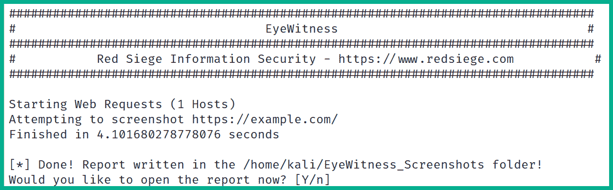

如果你输入`Y`并按回车，EyeWitness 报告将自动加载并在网页浏览器中打开，如下所示：

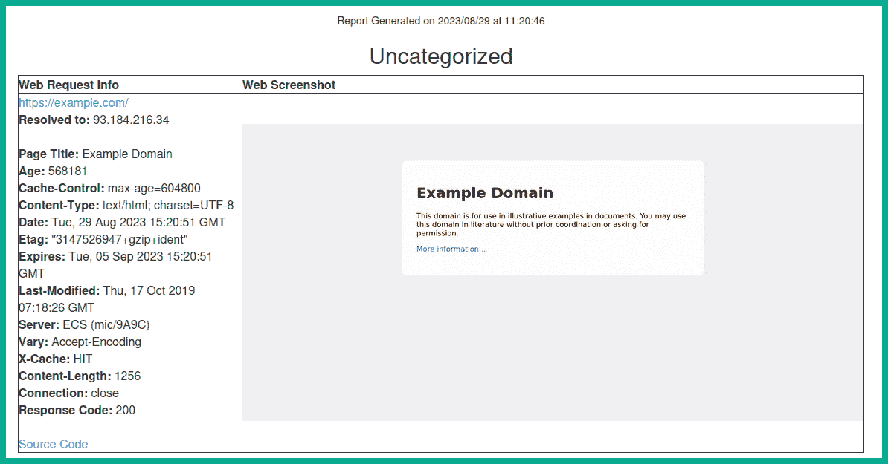

如你所见，使用像 EyeWitness 这样的工具，相比手动检查每个子域，可以节省大量时间。你可以快速浏览生成报告中的每张图片，以识别目标域名上的登录门户和敏感目录。

> 要了解更多关于 EyeWitness 的信息，请访问：[`github.com/RedSiege/EyeWitness`](https://github.com/RedSiege/EyeWitness)，并使用`./EyeWitness.py –h`命令查看帮助菜单。

完成本节后，你已经学会了如何使用 EyeWitness 自动化捕获多个网站的截图。在下一节中，你将探索各种扫描和指纹识别技术。

## 探索主动扫描技术

作为一名有志的伦理黑客和渗透测试员，建立扎实的基础，理解如何利用扫描技术高效发现并概述目标系统在组织网络中的情况至关重要。许多组织专注于保护其外围网络，但有时没有给予内部网络足够的安全关注。你会发现，超过 90%的网络攻击或威胁通常源自内部网络。因此，许多组织认为攻击者会从互联网发起攻击，然后被他们的基于网络的防火墙拦截。下图展示了防火墙典型部署的简化概览：

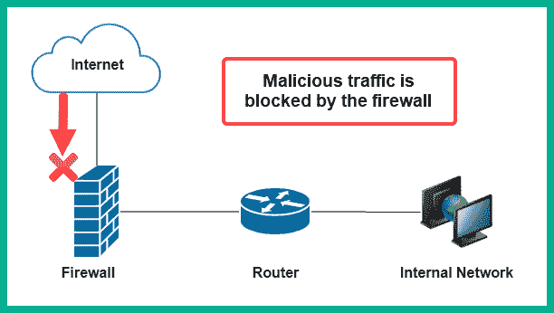

如前面的图示所示，基于网络的防火墙作为组织内部网络和互联网之间的边缘设备实现。它的角色之一是过滤网络之间的流量，防止恶意流量通过防火墙进入另一侧，无论是来自互联网并指向组织内部系统的恶意流量，还是反向流量。然而，威胁行为者一直在不断学习组织如何实现其基础设施和安全解决方案，以及领导团队和 IT 专业人员在保护资产时所做的决策。尽管许多组织在投资网络防御以确保其资产和人员免受敌对行为者和网络攻击的侵害，但世界上仍有很多组织没有防火墙，网络设备和安全设备配置错误，操作系统没有打补丁。比喻来说，敌人发现这个“金矿”并开始*以地取利*只是时间问题。在网络杀伤链和常见渗透测试方法的侦察阶段，伦理黑客和渗透测试人员最终需要直接与目标接触，收集那些无法通过**开放源信息**（**OSINT**）获得的信息，并使用主动侦察技术，如扫描和枚举。扫描是一种威胁行为者用来发现网络中活跃系统、识别系统上的开放服务端口，并发现主机机器上的漏洞，甚至是它们的操作系统架构的技术。通过扫描收集到的信息帮助渗透测试人员比被动信息收集更清晰地了解他们的目标。

> 不要对你没有所有权或没有合法许可的系统和网络进行任何形式的扫描。扫描在许多国家被视为非法行为。

渗透测试人员需要不断提升他们的批判性思维，以像真正的威胁行为者一样思考，特别是当他们想对一个目标组织进行成功的渗透测试时。在本节中，你将学习如何对目标网络执行扫描的各种技术和方法，以及如何对系统进行建模。

### 更改你的 MAC 地址

**网络接口卡**（**NIC**）是一个网络适配器，使得系统能够通过有线或无线网络进行通信。例如，在设备通过网络发送数据之前，NIC 将消息转换成可以通过介质传输的信号，比如铜缆的电信号、光纤的光信号和无线通信的射频信号。此外，设备上的每个 NIC 都包含一个全球唯一的**媒体访问控制**（**MAC**）地址，有时被称为*固化地址*，理论上是不可更改的。在设备通过网络传输数据之前，发送方设备会自动将源和目的 MAC 地址插入到消息的帧头中。源 MAC 地址帮助接收方识别消息的发送者，目的 MAC 地址帮助网络交换机将消息转发到目标地址。MAC 地址是一个 48 位地址，采用十六进制表示。地址的前 24 位被称为**组织唯一标识符**（**OUI**），它帮助 IT 专业人员确定设备的供应商。而地址的后 24 位则由供应商唯一分配。因此，当你的 NIC 在网络上发送流量时，你的真实 MAC 地址也会被插入到帧头中，这些信息可以用来识别你在网络上的机器。作为一名有志的渗透测试者，你可以通过使用一个预装工具**MAC Changer**来改变你以太网和无线网络适配器的 MAC 地址。改变你的 MAC 地址可以让你欺骗网络中的其他设备，让它们认为你的系统是一个属于组织网络基础设施的常见设备，比如网络设备、打印机或供应商特定设备。这种技术通常用于保护攻击者机器的身份，绕过网络设备的 MAC 过滤规则，并在目标网络上避开网络限制。要学习如何使用**MAC Changer**更改你的 MAC 地址，请按照以下说明操作：

1.  启动**Kali Linux**虚拟机，并使用`ifconfig`命令确定网络适配器的原始 MAC 地址，如下所示：

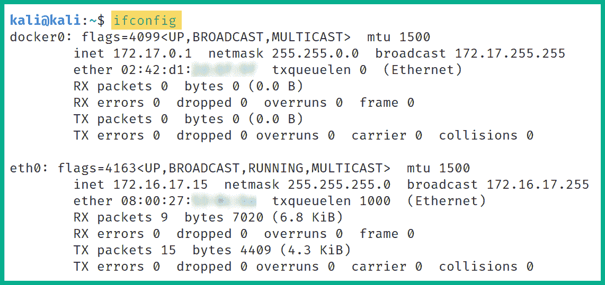

如上图所示，`ifconfig`命令被用来显示 Kali Linux 虚拟机上所有连接的网络适配器。此外，这个命令还使我们能够查看每个网络适配器上的原始 MAC 地址，在**ether**字段中显示。

1.  接下来，使用以下命令逻辑性地关闭**eth0**接口：

```
kali@kali:~$ sudo ifconfig eth0 down
```

1.  接下来，使用`macchanger --help`命令查看可用选项列表，如下所示：

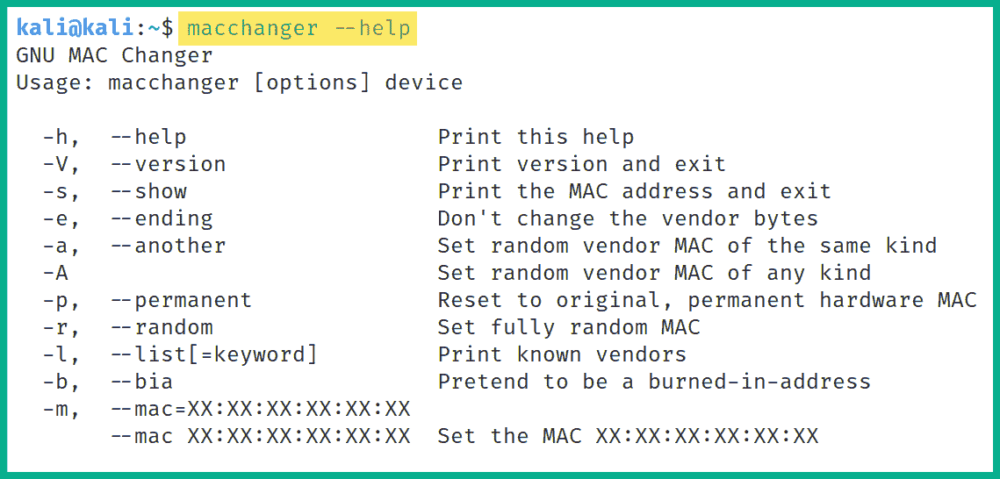

1.  接下来，使用以下命令在**eth0**网络适配器上设置一个随机的 MAC 地址：

```
kali@kali:~$ sudo macchanger -A eth0
```

下图显示了 **eth0** 网络适配器的当前、永久和新生成的 MAC 地址：

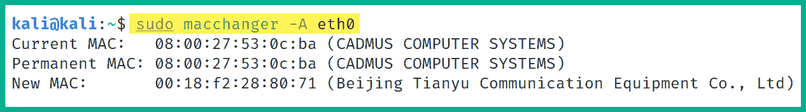

1.  接下来，通过使用以下命令重新启用 **eth0** 接口：

```
kali@kali:~$ sudo ifconfig eth0 up
```

1.  接下来，再次使用 `ifconfig` 命令来验证 **eth0** 是否具有伪造的 MAC 地址，如下所示：

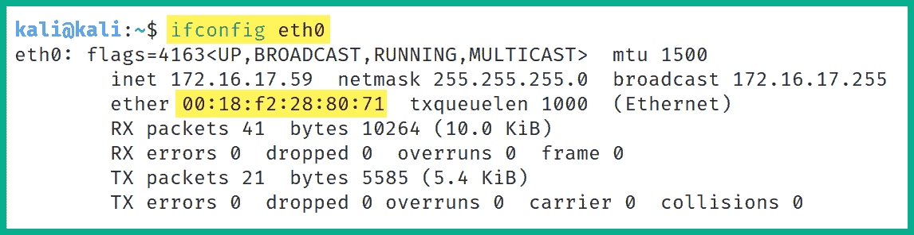

1.  最后，为了进一步验证伪造的 MAC 地址的供应商，请访问[`macvendors.com/`](https://macvendors.com/)，并输入 MAC 地址，如下所示：


完成此练习后，你已经学会了如何在 Kali Linux 上伪造 MAC 地址。然而，重要的是要考虑使用与常见网络设备或系统供应商相关的 MAC 地址，以减少被组织安全团队检测到的风险。接下来，你将学习如何执行主机发现，以识别内部网络上的活动系统。

### 执行主机发现

在目标网络上发现活动主机是进行渗透测试时的一个重要阶段。假设你是一名道德黑客或渗透测试员，你的目标组织允许你将攻击者机器直接连接到他们的网络，并对其内部网络进行安全测试。你迫不及待地想开始发现安全漏洞并入侵系统，但你不确定目标主机是否在线。在本节中，你将学习使用各种工具和技术进行对组织网络的多种主动侦察所需的技能。为了确保你能在安全的空间中执行这些练习，请遵循以下指南：

+   确保你不会扫描你不拥有或没有获得合法许可的系统。

+   确保 Kali Linux 的网络适配器已在 Oracle VM VirtualBox Manager 中分配给 **PentestNet** 网络。

+   PentestNet 网络将作为我们模拟的组织网络。

要开始此练习，请使用以下说明：

1.  打开 **Kali Linux**、**Metasploitable 2** 和 **Metasploitable 3**（**Windows 版本**）虚拟机。

1.  在 **Kali Linux** 上，打开 **Terminal**，然后使用 `ifconfig` 或 `ip address` 命令来确定你的攻击者机器（Kali Linux）是否连接到目标网络（`172.30.1.0/24`），如下所示：

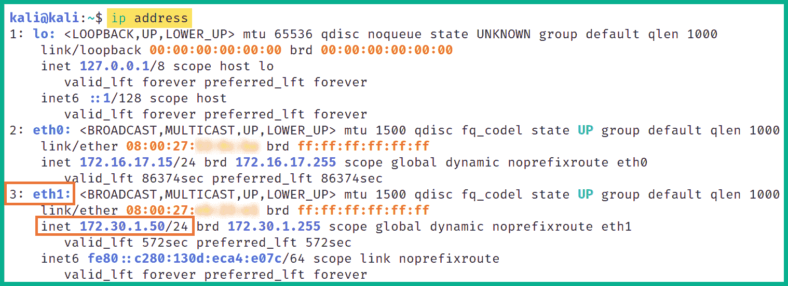

作为一名有志的道德黑客和渗透测试员，在进行内部网络渗透测试时，验证你的攻击者机器是否在目标网络上拥有有效的 IP 地址和子网掩码是非常重要的。正如前面的截图所示，`eth1` 已连接到 *PentestNet* 环境，这是我们目标网络。

> 请记住，有线网络适配器标识为 **eth**，无线适配器标识为 **wlan**。

此外，**inet**字段包含了分配给 Kali Linux 虚拟机接口的 IP 地址。然而，前面截图中显示的 IP 地址可能与你机器上的地址不同，只要它在`172.30.1.0/24`网络上即可。进一步说，识别网络适配器上的 IP 地址将帮助我们在接下来的步骤中排除对自己机器的扫描。

> 道德黑客和渗透测试人员通常需要在对内部网络进行主机发现之前，确定网络的网络 ID 和 IP 地址范围。虽然建议在学习网络安全和渗透测试之前先打好网络基础，但以下网站是一个在线子网计算器，可以帮助你确定 IP 范围等更多内容：[`www.calculator.net/ip-subnet-calculator.html`](https://www.calculator.net/ip-subnet-calculator.html)。

1.  接下来，我们使用**Netdiscover**在*PentestNet*环境（`172.30.1.0/24`）中进行被动扫描，使用以下命令：

```
kali@kali:~$ sudo netdiscover -p -i eth1
```

`-i`语法通常用于指定监听接口，使用`-p`语法进行被动扫描，使 Netdiscover 能够捕获并分析网络上的**地址解析协议**（**ARP**）消息，通过分析源和目标的 IP 和 MAC 地址帮助我们识别网络上的在线主机，如下所示：

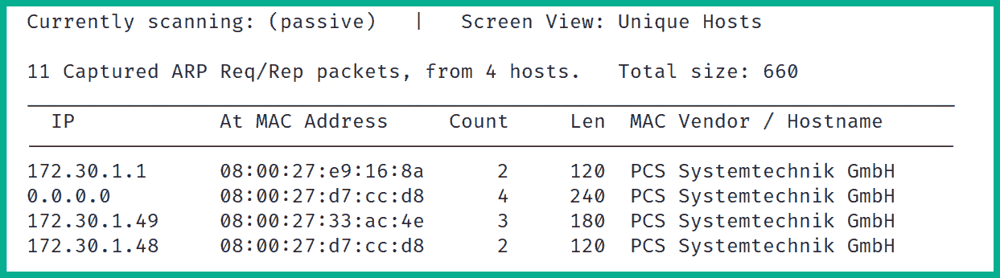

如前面的截图所示，Netdiscover 提供了目标网络中在线系统的 IP 地址、MAC 地址、厂商和主机名。其中，`172.30.1.48`分配给了 Metasploitable 3 – Windows，而`172.30.1.49`则分配给了 Metasploitable 2 虚拟机。此外，利用 MAC 厂商信息有助于我们确定网络上设备的类型，并且在研究特定系统的安全漏洞时非常有用。

1.  接下来，要使用 Netdiscover 进行主动主机发现扫描，请使用以下命令：

```
kali@kali:~$ sudo netdiscover -r 172.30.1.0/24 -i eth1
```

由于主动扫描不等待 ARP 消息，Netdiscover 会向`172.30.1.0/24`网络内所有可用的 IP 地址发送自己的探测请求。只有在线的系统才会响应，这使得 Netdiscover 能够分析每个响应消息，识别网络中在线主机的 IP 和 MAC 地址，如下所示：

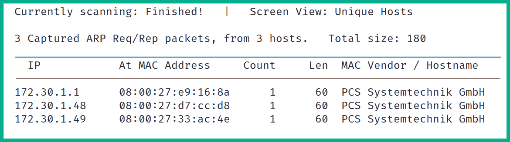

1.  接下来，我们使用**Network Mapper**（**Nmap**）对整个目标网络进行*ping 扫描*，并在扫描过程中排除我们的攻击者机器，使用以下命令：

```
kali@kali:~$ nmap -sn 172.30.1.0/24 --exclude 172.30.1.50
```

**Ping 扫描**是一种基本的扫描技术，IT 专业人员用它来确定网络中哪些系统在线。它是通过自动化的过程对网络中的每个可用 IP 地址进行 ping 操作，并观察哪些设备做出响应。然而，操作系统中的`ping`工具会发送**互联网控制消息协议**（**ICMP**）**回显请求**消息到目标，存活的系统会以**ICMP 回显应答**消息进行响应。网络安全专业人士通常会在关键系统上禁用 ICMP 响应，这是一个常见的安全做法，这样可以降低新手黑客发现在线主机的可能性。因此，如果攻击者发送**ICMP 回显请求**消息到配置为不响应的系统，初学者攻击者可能会认为目标系统离线。另一方面，熟练的威胁行为者和渗透测试人员了解**传输控制协议/互联网协议**（**TCP/IP**）网络模型中的安全漏洞，可以绕过这一小型安全机制，转而向目标系统的特定端口发送**传输控制协议**（**TCP**）消息。这种技术利用了 TCP 的设计，欺骗目标系统做出响应，表明它在网络上是存活的。以下截图显示了网络中有两个存活的主机，`172.30.1.48`和`172.30.1.49`：

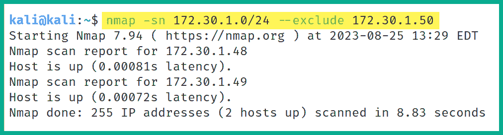

Nmap 中的`-sn`语法用于指定 ping 扫描，但 Nmap 不会向目标发送 ICMP 消息。相反，Nmap 会向目标系统的特定端口发送 TCP 消息，如下面 Wireshark 数据包捕获所示：

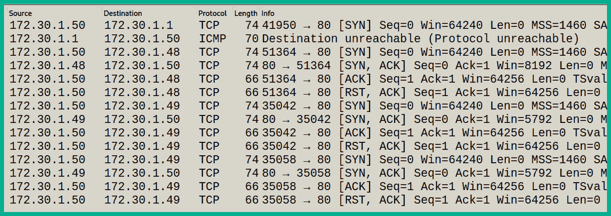

Nmap 发送特别构造的 TCP **同步**（**SYN**）数据包到目标主机，目的是触发来自存活/在线主机的 TCP **重置**（**RST**）或 TCP **确认**（**ACK**）响应。

> 要了解更多关于 TCP 如何通过 TCP 三次握手与目标主机建立连接的信息，请参见：[`hub.packtpub.com/understanding-network-port-numbers-tcp-udp-and-icmp-on-an-operating-system/`](https://hub.packtpub.com/understanding-network-port-numbers-tcp-udp-and-icmp-on-an-operating-system/)。

在网络中识别存活主机有助于道德黑客和渗透测试人员创建网络拓扑，并在进一步分析目标之前，确认目标是否在线。接下来，您将学习如何识别开放端口、正在运行的服务并确定目标的操作系统。

### 识别开放端口、服务和操作系统

在执行主机发现后，下一步是识别目标系统上的任何开放端口，并确定这些开放端口映射到哪些服务。渗透测试者可以使用各种技术来识别目标系统上的开放端口。有些技术是手动的，而其他技术可以简单地使用 Nmap 工具自动化。要开始使用 Nmap 进行指纹识别，请使用以下说明：

1.  首先确保**Kali Linux**、**Metasploitable 2**和**Metasploitable 3**（**Windows 版本**）虚拟机已启动。

1.  在**Kali Linux**上打开**终端**，并使用以下命令执行基本的 Nmap 扫描，以确定 Metasploitable 3（Windows 版本）虚拟机上是否有任何前 1000 个端口是打开的：

```
kali@kali:~$ nmap 172.30.1.48
```

如下截图所示，Nmap 指示有 20 个 TCP 开放端口，并提供其关联服务的名称：

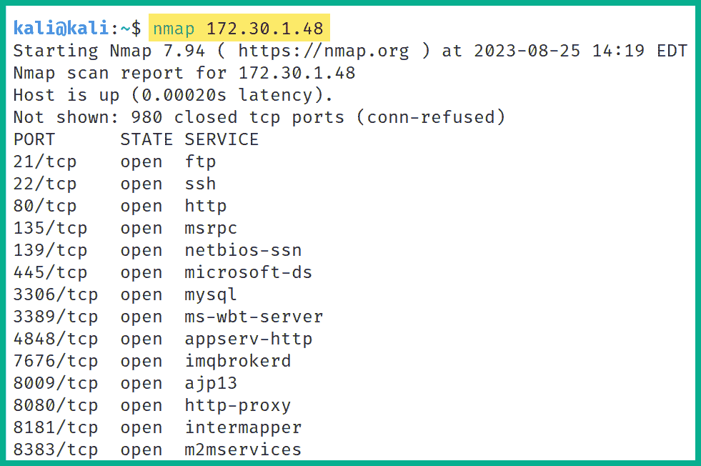

使用此扫描的信息使您能够开始指纹识别您的目标系统。作为渗透测试者，您可以确定哪些端口是打开的，并了解它们如何作为进入目标的入口点，并寻找运行服务的安全漏洞。

> 作为一名有抱负的道德黑客和渗透测试者，如果你一开始不理解系统上服务端口的角色和功能，那没关系。然而，建议对你不熟悉的内容进行研究，以更好地理解技术或主题。例如，有许多服务端口，每个端口都与特定的应用层服务相关联，如 TCP 端口 443 与**超文本传输安全协议**（**HTTPS**）协议相关联，用于安全的网络通信。

1.  接下来，让我们执行高级扫描，以识别目标系统的操作系统、服务版本，并检索**服务器消息块**（**SMB**）的详细信息，使用以下命令：

```
kali@kali:~$ nmap -A -T4 -p- 172.30.1.48
```

让我们看看在前述命令中使用的每个语法：

+   `-A`：这使 Nmap 能够对目标进行分析，以识别其操作系统、服务版本和脚本扫描，同时执行跟踪路由。

+   `-T`：此语法指定了扫描的时间选项，范围从 0 到 5，其中 0 非常缓慢，5 最快。此命令有助于防止向目标系统发送太多探测，从而可能触发警报。

+   `-p`：使用`-p`语法允许您指定要在系统上标识为打开或关闭的目标端口。您可以指定`-p80`仅在目标上扫描端口 80，并使用`-p-`扫描所有 65,535 个开放端口。

> 默认情况下，Nmap 仅扫描 TCP 端口。因此，如果目标在**用户数据报协议**（**UDP**）服务器端口上运行服务，您可能会错过它。要在端口或端口范围上执行 UDP 扫描，请使用`-p U:53`命令，其中 53 是目标端口号。

以下截图显示了扫描结果的上半部分：

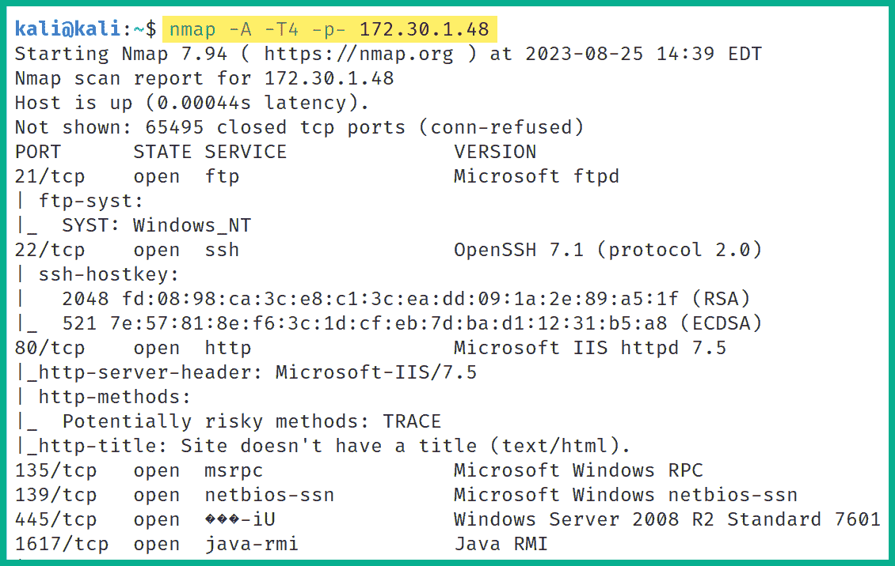

如上图所示，Nmap 能够提取更多关于目标的详细信息，如与开放端口相关联的每个服务的版本号。它还能够执行 banner grabbing，并确定每个服务是否有认证系统/登录机制。以下截图显示了相同扫描结果的下半部分：

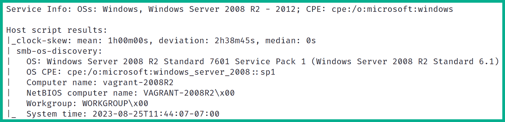

如上图所示，Nmap 能够识别目标主机的操作系统为 Windows Server 2008 R2，且安装了 Service Pack 1。此外，Nmap 还能够确定系统的主机名，并根据工作组名称判断该系统是否连接到域。如果一个基于 Windows 的系统没有连接到**域控制器**（**DC**），则默认的工作组名称为 `Workgroup`。此外，Nmap 扫描还能够进行基础的 SMB 扫描来识别操作系统，这也表明目标系统可能存在文件和打印共享服务。以下是 Nmap 扫描过程中可以使用的其他语法：

+   `-Pn` – 此语法使 Nmap 在扫描目标系统时跳过主机发现阶段，直接认为目标系统是在线的。

+   `-sU` – 此语法允许 Nmap 对目标系统执行 UDP 端口扫描。此命令对于识别是否有服务在 UDP 端口上运行非常有用，相对于 TCP 端口号，它帮助识别 UDP 服务。

+   `-p` – 此命令允许你指定扫描的端口范围或某些特定端口是否在系统上开放。使用 `nmap -p 50-60`、`nmap -p 80,443` 或 `nmap -p 22` 可以扫描端口范围、端口组或特定端口号。然而，使用 `nmap -p-` 表示扫描所有 65,535 个端口号，请注意，默认情况下 Nmap 扫描的是 TCP 端口。

+   `-sV` – 此语法使你能够执行服务版本识别，了解目标系统上运行的服务版本。例如，Nmap 的基本扫描可能显示端口 23 是开放的，并与**Telnet** 服务相关联。作为一名道德黑客，了解该服务的版本非常重要。因此，使用 `nmap -sV <targeted system>` 命令可以识别该服务的版本，这在研究目标的安全漏洞时非常有用。

+   `-6` – 使用此语法可以让 Nmap 执行针对目标 IPv6 网络或拥有 IPv6 地址的主机的扫描。

此外，伦理黑客和渗透测试人员可以利用**Ping**工具，通过分析目标 ICMP 响应消息中的**生存时间**（**TTL**）值来识别目标的操作系统。例如，基于 Windows 的操作系统回复的默认 TTL 值为`128`，而基于 Linux 的系统则回复的默认 TTL 值为`64`。为了更好地理解 ICMP 如何帮助我们识别目标机器的操作系统，请参考以下说明：

1.  在**Kali Linux**上，使用以下命令向 Metasploitable 3（Windows 版本）虚拟机发送 4 个 ICMP ECHO 请求消息：

```
kali@kali:~$ ping 172.30.1.48 -c 4
```

如下图所示，所有 ICMP 响应的 TTL 值为`128`，这表明目标系统正在运行某个版本的 Windows 操作系统：

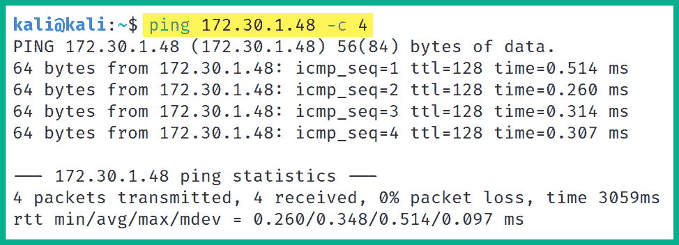

1.  接下来，使用以下命令向 Metasploitable 2 虚拟机发送 4 个 ICMP ECHO 请求消息：

```
kali@kali:~$ ping 172.30.1.49 -c 4
```

如下图所示，ICMP 响应的 TTL 值为`64`，这表明目标系统正在运行某个版本的 Linux：

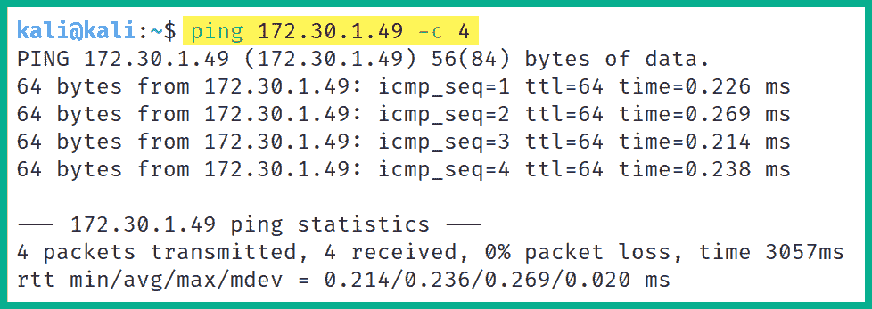

作为一名有抱负的伦理黑客和渗透测试人员，识别操作系统、开放端口和运行的服务有助于你更好地分析目标，并识别其安全漏洞。通过识别安全漏洞，你可以在开发利用工具阶段和攻击计划阶段做出改进。简单来说，针对 Windows 操作系统的漏洞利用或有效载荷很可能在 Linux 系统上无法运行，反之亦然。到目前为止，你已经学会了如何发现开放端口、服务版本、操作系统和 SMB 版本。接下来，你将学习如何在使用 Nmap 进行主动扫描时，避免被检测。

### 使用扫描规避技术

每当数据包从一个设备发送到另一个设备时，源 IP 地址都会包含在数据包的头部。这是 TCP/IP 网络模型的默认行为；所有地址信息必须包含在所有数据包中，然后才能被放置到网络上。在作为伦理黑客和渗透测试人员进行扫描时，我们尽量避免被检测，以确定目标组织的安全团队是否具备检测模拟网络攻击的能力。在实际的网络攻击中，如果一个组织无法检测到其网络和系统上的可疑活动和安全事件，攻击者可以轻松达成其目标而不受阻碍。然而，如果一个组织能够在活动一发生时就检测到可疑行为，安全团队可以迅速采取行动，遏制并阻止威胁，同时保护组织的资产。在渗透测试中，模拟真实的网络攻击至关重要，以测试目标组织的威胁检测和缓解系统。

#### 通过诱饵避免被检测

由于其先进的扫描能力，Nmap 通常被认为是网络扫描器领域的“王者”。Nmap 使渗透测试人员在扫描目标系统时能够使用诱饵地址。这种扫描技术让目标系统误以为扫描源来自多个来源，而不是攻击者机器的单一 IP 地址。要开始此练习，请按照以下说明操作：

1.  启动**Kali Linux**、**Metasploitable 2**和**Metasploitable 3**（Windows 版本）虚拟机。Kali Linux 将作为攻击者机器，Metasploitable 2 将作为目标系统，而 Metasploitable 3 – Windows 虚拟机将作为诱饵，如下图所示：

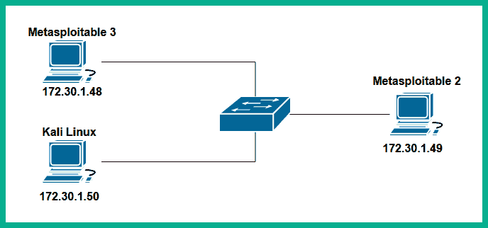

请确保识别这些系统的 IP 地址，因为它们可能与之前的图示不同。使用前一部分的扫描技术将帮助您轻松识别 IP 地址。

1.  接下来，要使用诱饵执行 Nmap 扫描，请使用以下命令：

```
kali@kali:~$ sudo nmap 172.30.1.49 -D 172.30.1.48
```

使用`-D`语法可以让你指定一个或多个诱饵地址。在 Nmap 使用诱饵地址之前，它会首先检查每个诱饵系统是否为网络上的活动主机，如果某个地址不可达，它将在扫描中排除该离线地址。以下截图展示了扫描的预期结果：

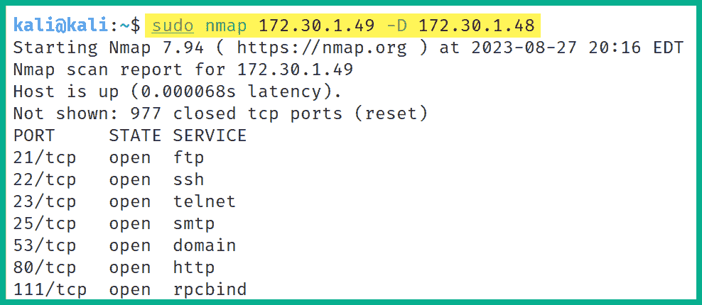

如果目标组织的安全团队正在密切监控其内部网络中的数据包，并且识别到端口扫描正在进行，他们有可能判断扫描源来自您的 IP 地址。然而，诱饵功能将会在来自攻击者机器的各个数据包中包含诱饵地址，如下所示：

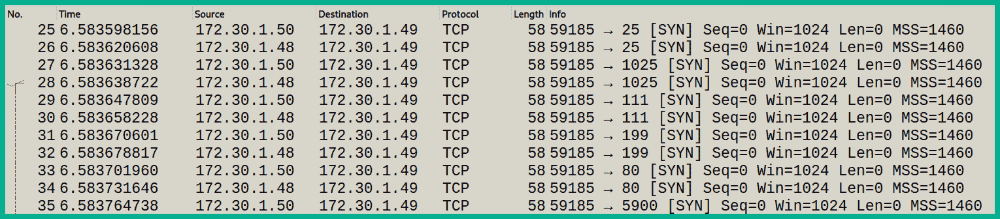

因此，在 Nmap 扫描期间使用更多的诱饵地址将降低安全分析员追溯扫描来源到您的 IP 地址的风险。然而，安全分析员是经过良好训练的专业人士，通常具备快速识别其网络基础设施中威胁所需的工具和技能。

#### 使用 MAC 和 IP 伪装技术

Nmap 就像是扫描工具的瑞士军刀，拥有许多扫描功能，可以帮助规避检测。Nmap 允许渗透测试人员伪装其 Kali Linux 机器的 MAC 和 IP 地址。以下是使用 Nmap 的常见 MAC 和 IP 伪装技术：

1.  要使用随机化的 MAC 地址执行 Nmap 扫描，请使用以下`--spoof-mac 0`命令：

```
kali@kali:~$ sudo nmap --spoof-mac 0 172.30.1.49
```

以下截图展示了 Nmap 在执行目标系统扫描之前生成了一个随机的 MAC 地址：

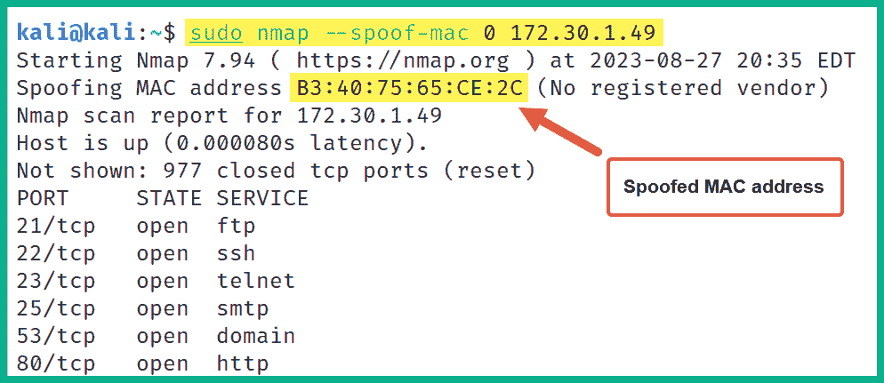

此外，以下截图展示了使用 Wireshark 捕获的数据包，以进一步验证 Nmap 使用了随机化的地址作为源 MAC 地址：

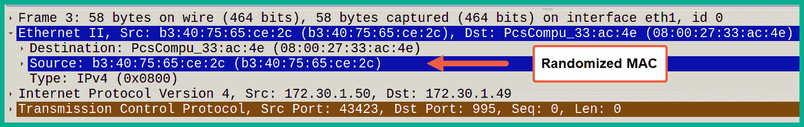

1.  要使用特定厂商的伪造 MAC 地址在目标系统上执行 Nmap 扫描，只需包含厂商名称，并使用以下命令：

```
kali@kali:~$ sudo nmap -sT -Pn --spoof-mac hp 172.30.1.49
```

下图展示了 Nmap 使用 HP MAC 地址作为源地址的情况：

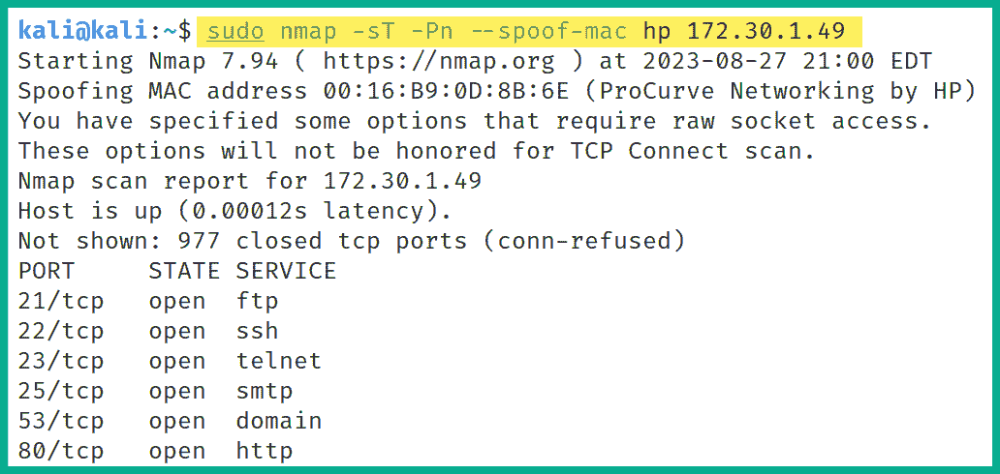

> 要了解 Nmap 的各种功能，请使用`nmap -h`和`man nmap`命令查看帮助菜单和手册页。

完成本部分后，你已经学习了如何在网络上执行扫描并避开检测。接下来，你将学习如何使用 Nmap 执行隐蔽扫描。

#### 隐蔽扫描技术

默认情况下，Nmap 在目标系统的任何开放 TCP 端口上建立 TCP 三次握手。一旦攻击者机器与目标系统之间建立了握手，数据包将在每台主机之间交换。下图展示了 TCP 三次握手过程，其中主机 A 正在初始化与主机 B 的通信：

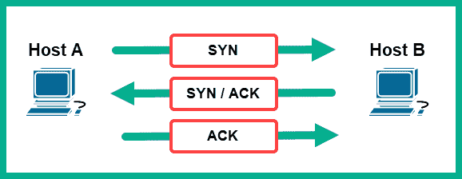

在渗透测试过程中，尽可能保持隐蔽非常重要。这会产生一种真实对手尝试入侵网络中目标系统的效果，而不被组织的安全解决方案捕捉到。然而，通过与目标设备建立 TCP 三次握手，我们实际上是在暴露自己给目标。通过使用 Nmap，我们可以在目标和我们的攻击者系统之间执行隐蔽扫描（半开放）。隐蔽扫描不会完成整个 TCP 三次握手，而是在连接完全建立之前重置连接。下图展示了 Nmap 隐蔽扫描过程中 TCP 数据包的交换：

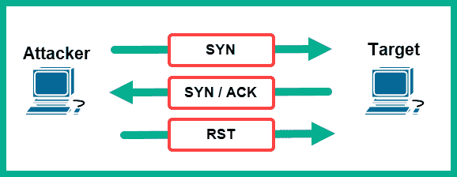

如上图所示：

1.  攻击者通过向目标系统的特定端口发送**TCP SYN**数据包来欺骗目标，判断该端口是否开放。

1.  然后，如果端口开放，目标系统将以**TCP SYN/ACK**数据包进行响应。

1.  最后，攻击者将向目标发送**TCP RST**数据包，以重置并终止连接。

要开始学习隐蔽扫描技术，请使用以下指令：

1.  打开**Kali Linux**和**Metasploitable 2**虚拟机。

1.  在**Kali Linux**上，打开**终端**并使用以下命令对 Metasploitable 2 进行隐蔽扫描，以确定端口 80 是否开放：

```
kali@kali:~$ sudo nmap -sS -p 80 172.30.1.48
```

使用`-sS`语法表示隐蔽扫描，`-p`操作符允许我们指定目标端口。下图展示了 Nmap 识别到目标系统的端口 80 已开放：

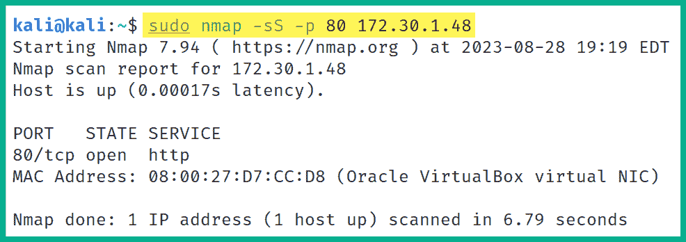

下图展示了 Kali Linux（`172.30.1.50`）与目标系统（`172.30.1.48`）在隐蔽扫描过程中的数据包交换：

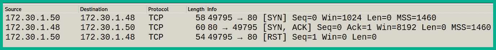

如前所示，Nmap 发送了一个带目标端口 80 的**TCP SYN**数据包，以识别目标系统的端口 80 上是否有运行的服务。目标系统按预期响应了一个**TCP SYN/ACK**数据包，但攻击者机器发送了一个**TCP RST**数据包，以重置并终止连接。因此，在隐身扫描期间，攻击者机器（Kali Linux）与目标系统之间没有建立网络连接。然而，值得注意的是，那些积极监控网络流量以防范安全事件的资深网络安全专业人员，可以轻易识别出是否有攻击者正在对其网络进行隐身扫描。完成本节后，你已经学会了如何执行各种类型的扫描技术，以识别网络上的存活主机、分析其运行的服务和操作系统。在下一节中，你将学习如何从易受攻击的系统中枚举常见服务和网络共享。

## 枚举网络服务

在扫描过程中，你会注意到目标系统上运行着一些常见的网络服务。收集这些网络服务的更多信息可以帮助你进一步识别共享网络资源，如共享目录、打印机和文件共享。有时，这些网络服务配置不当，可能导致攻击者获得对存储在服务器和其他系统中的敏感数据的未授权访问。接下来的几个子章节中，你将学习如何枚举常见的网络服务，如**服务器消息块**（**SMB**）、**简单邮件传输协议**（**SMTP**）和**简单网络管理协议**（**SNMP**）。

### 枚举 SMB 服务

**服务器消息块**（**SMB**）是一种常见的网络服务，允许主机将资源（如文件）共享给网络中的其他设备。作为一名有抱负的道德黑客和渗透测试员，建议在渗透测试的范围内一旦可行，就开始枚举文件共享服务。要开始枚举目标系统上的 SMB 服务，请按照以下说明操作：

1.  启动**Kali Linux**和**Metasploitable 2**虚拟机。

1.  在**Kali Linux**上，打开**终端**并使用以下命令启动 Metasploit 框架：

```
kali@kali:~$ msfconsole
```

1.  在 Metasploit 框架加载后，使用`search`命令结合`smb_version`搜索词快速定位模块：

```
msf6 > search smb_version
```

如下截图所示，搜索结果仅显示一个可用模块，可以用来识别目标系统是否正在运行 SMB 以及其版本：

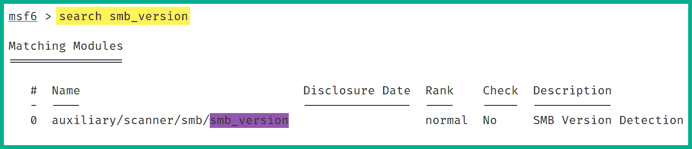

1.  接下来，使用以下命令加载模块并显示其选项：

```
msf6 > use auxiliary/scanner/smb/smb_version
msf6 auxiliary(scanner/smb/smb_version) > options
```

使用`options`或`show options`命令可以显示加载模块中的当前设置，并帮助你确定是否需要在执行模块之前进行额外配置，如下所示：

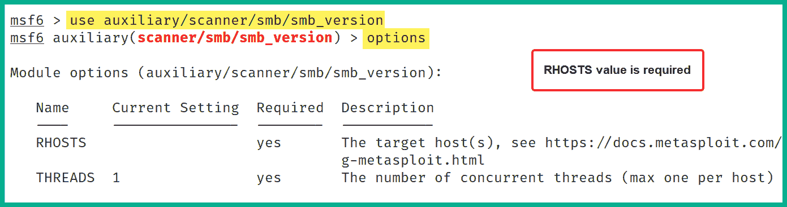

如前面截图所示，有两个必需的设置。一是`RHOSTS`或目标设置，另一个是应用于进程的线程数。请注意，`RHOSTS`设置为空。

1.  接下来，使用以下命令将目标系统（Metasploitable 2）设置为`RHOSTS`并执行模块：

```
msf6 auxiliary(scanner/smb/smb_version) > set RHOSTS 172.30.1.49
msf6 auxiliary(scanner/smb/smb_version) > run
```

> `run`命令通常用于执行 Metasploit 框架中的辅助模块，而`exploit`命令用于执行漏洞利用模块。

以下截图显示 Metasploit 能够检测到目标系统正在运行 SMB 及其版本：

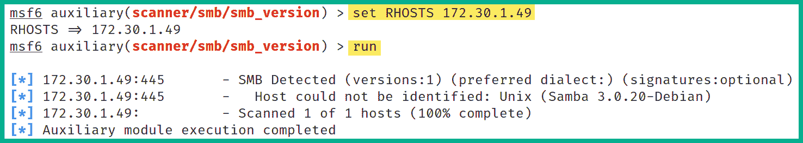

> 使用`exit`命令退出 Metasploit 框架并返回到终端中的 BASH shell。

始终建议使用多个工具来枚举目标系统上正在运行的服务，因为可能有一个工具无法识别某些重要内容。有时候，渗透测试人员可能偏向使用 Metasploit，因为它包含许多*辅助*模块来扫描和枚举服务，而其他人则偏好 Nmap。然而，我建议你熟悉这两款工具，它们都非常优秀，并且在各种情况下都很有用。既然目标系统上已经发现了 SMB，我们可以使用**SMBmap**来枚举目标中的文件和共享驱动器。要开始使用 SMBMap，请按照以下说明操作：

1.  确保**Kali Linux**和**Metasploitable 2**虚拟机已开启。

1.  在**Kali Linux**中，使用以下命令在**终端**中识别目标系统（Metasploitable 2）是否正在运行 SMB 服务：

```
kali@kali:~$ nmap -p 139,445 172.30.1.49
```

1.  以下截图显示 Nmap 能够识别目标系统的端口 139 和 445 是开放的：

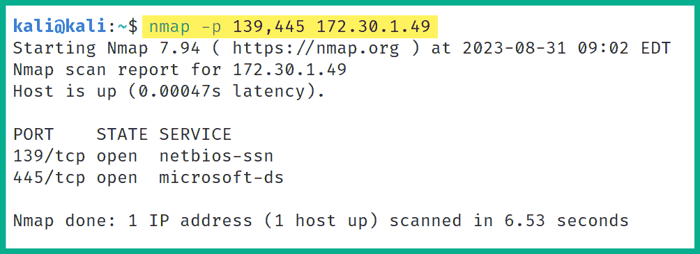

1.  接下来，使用 SMBmap 来识别目标系统是否有任何网络共享：

```
kali@kali:~$ smbmap -H 172.30.1.49
```

如下图所示，目标系统（Metasploitable 2）有一些共享驱动器，其中大多数无法通过网络访问，只有**tmp**资源可用：

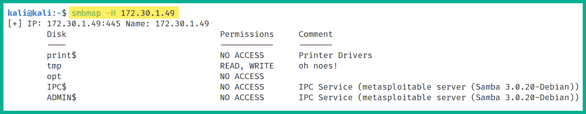

如前面截图所示，SMBmap 工具能够提供每个网络共享的权限和评论。这些信息对于帮助道德黑客和渗透测试人员识别敏感目录并收集不安全网络共享中的数据非常有用。

1.  接下来，使用以下命令显示目标系统中**tmp**目录的内容：

```
kali@kali:~$ smbmap -H 172.30.1.49 -r tmp
```

如下图所示，SMBmap 能够访问**tmp**目录，因为没有配置身份验证机制来限制未认证的访问：

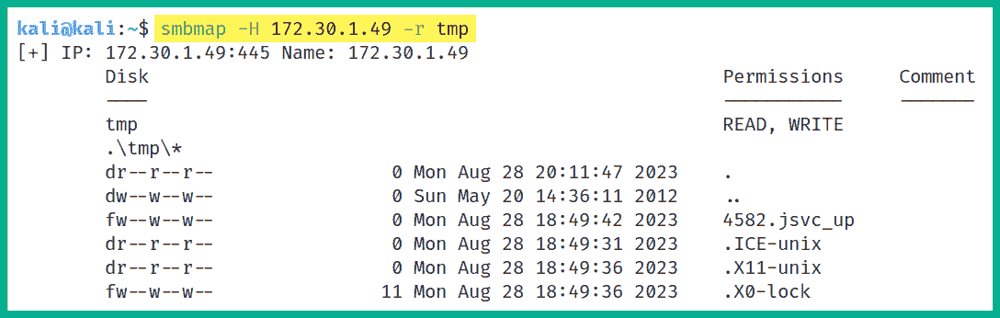

1.  接下来，使用以下命令将**tmp**目录的所有内容下载到 Kali Linux 机器中，首先在 Kali Linux 中创建一个新目录（文件夹）并下载文件：

```
kali@kali:~$ mkdir smb_files 
kali@kali:~$ cd smb_files 
kali@kali:~/smb_files$ smbmap -H 172.30.1.49 --download .\tmp\*
```

以下截图展示了前述命令的执行：

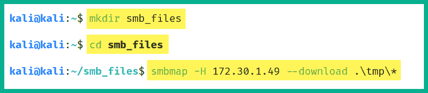

完成这一部分后，你已经学会了如何使用 Metasploit 和 SMBMap 进行 SMB 枚举。在下一部分中，你将学习如何进行 SMTP 枚举。

### 枚举 SMTP 服务

枚举 SMTP 服务可以帮助道德黑客和渗透测试人员收集关于电子邮件服务的信息，并识别目标系统中的有效用户账户。要开始这个练习，请按照以下指示操作：

1.  启动**Kali Linux**和**Metasploitable 2**虚拟机。

1.  在**Kali Linux**中，打开**终端**并使用**Netcat**检查目标系统（Metasploitable 2）上的端口 25 是否开放，并识别正在运行的服务：

```
kali@kali:~$ nc -nv 172.30.1.49 25
```

1.  接下来，使用`VRFY root`命令检查`root`是否为有效用户。

1.  接下来，使用`VRFY toor`命令检查`toor`是否为有效用户，如下所示：

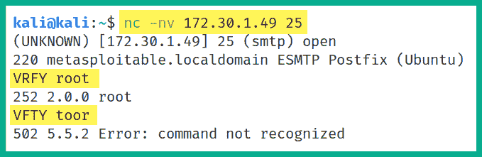

如上图所示，Netcat 成功地在端口 25 与目标系统建立了连接，进一步确认了 SMTP 正在运行。当执行`VRFY root`命令时，电子邮件服务的响应表明该用户存在。然而，当检查无效用户时，电子邮件服务返回了错误信息。

1.  手动检查目标系统中的每个可能用户名可能会非常耗时。为了帮助自动化 SMTP 枚举过程，我们可以创建一个简单的 BASH 脚本，输入预定义的用户名列表并在目标系统上进行查询。使用以下命令创建一个新的脚本：

```
kali@kali:~$ nano smtp_user_enum.sh
```

一旦 Nano 命令行文本编辑器打开，输入以下代码，确保完全一致：

```
#!/bin/bash
if [ $# -ne 2 ]; then
    echo "Usage: $0 <target_ip> <email_list>"
    exit 1
fi
target_ip="$1"
email_list="$2"
echo "Starting SMTP user enumeration..."
while IFS= read -r email; do
    # Construct the SMTP communication
    ( sleep 1; echo "HELO example.com"; sleep 1; echo "VRFY $email"; sleep 1; echo "QUIT" ) | nc -nv $target_ip 25 | grep -q "252 2.0.0"
    if [ $? -eq 0 ]; then
        echo "User found: $email"
    fi
done < "$email_list"
echo "SMTP user enumeration finished."
```

完成前面的代码输入后，通过按下`CTRL + X`，然后按`Y`和`Enter`键保存脚本。

1.  接下来，使用以下命令在 Kali Linux 上使新保存的脚本可执行：

```
kali@kali:~$ chmod +x smtp_user_enum.sh
```

1.  使用脚本时，`./smtp_user_enum.sh <target> <wordlist>`语法可以让你在目标系统上启动 SMTP 枚举，命令示例如下：

```
kali@kali:~$ ./smtp_user_enum.sh 172.30.1.49 /usr/share/wordlists/seclists/SecLists-master/Usernames/top-usernames-shortlist.txt
```

以下截图显示了在脚本运行过程中识别到的有效用户名：

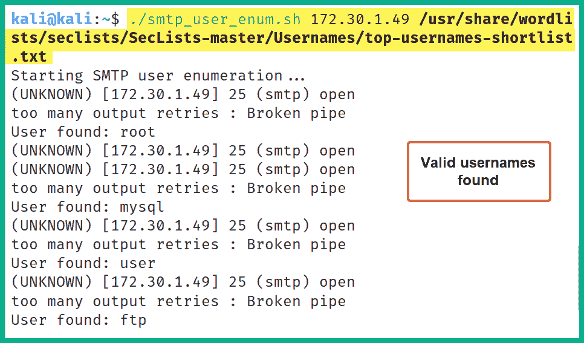

识别并利用有效的用户名和账户可以帮助渗透测试人员在目标系统上获得未授权的访问权限。完成本练习后，你已经掌握了 SMTP 枚举的实际操作技能。接下来，你将学习如何在目标主机上枚举 SNMP 服务。

### 枚举 SNMP 服务

SNMP 是一种常见的网络协议，使网络专业人员能够监控、管理和故障排除常见的网络设备。此外，IT 专业人员还使用 SNMP 从其设备中获取敏感信息，如下所示：

+   系统运行时间

+   设备主机名

+   CPU 和内存利用率

+   接口状态和统计信息

+   操作系统

+   打开的端口和正在运行的服务

SNMP 利用管理信息库（MIB），这是一个包含关于 SNMP 管理设备的特定信息的公共数据库。MIB 就像一棵树状结构，分为多个分支，每个分支用于管理设备的特定领域。在 MIB 树的每个分支上，都有代表特定值的叶子，这些叶子使网络专业人员能够访问这些叶子并检索有关网络中设备的特定信息。

> 要了解更多关于 SNMP 的信息，请查看：[`www.techtarget.com/searchnetworking/definition/SNMP`](https://www.techtarget.com/searchnetworking/definition/SNMP)。

要开始进行 SNMP 枚举，请按照以下说明操作：

1.  启动**Kali Linux**和**Metasploitable 3**（Windows 版本）虚拟机。

1.  在**Kali Linux**上，打开**终端**并使用以下命令来确定目标系统（Metasploitable 2）是否正在运行 SNMP：

```
kali@kali:~$ sudo nmap -sU -p 161 172.30.1.48
```

以下截图显示了 SNMP 正在目标系统的 UDP 端口 161 上运行：

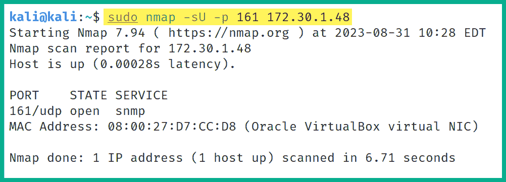

1.  接下来，使用**SNMP-Check**工具执行 SNMP 枚举，使用以下命令：

```
kali@kali:~$ snmp-check -p 161 -c public -v 1 172.30.1.48
```

以下是前述命令中使用的每个语法的描述：

+   `-p`：允许您指定目标端口，默认设置为端口 161。

+   `-c`：允许您指定用于登录目标系统的社区字符串，默认社区字符串为`public`。

+   `-v`：允许您指定要使用的 SNMP 版本，默认设置为版本 1。

如下图所示，我们能够识别出大量敏感信息，这些信息可以用于提升未来对目标的网络攻击：

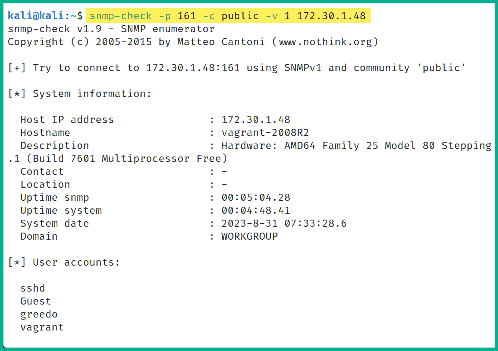

SNMP-Check 工具能够从目标中枚举出以下信息：

+   系统信息

+   用户账户

+   网络信息

+   路由信息

+   网络服务

+   运行中的进程

+   软件组件

> 要了解更多关于 SNMP-Check 的信息，请使用`snmp-check -h`命令查看其菜单和其他选项。

正如您所学到的，枚举系统帮助道德黑客和渗透测试人员提高他们在目标系统上的资料，并确定其上运行的内容。这些信息有助于渗透测试人员识别漏洞，进而利用这些漏洞来危及目标系统。在下一部分，您将学习如何在云存储中发现数据泄露。

## 发现云中的数据泄露

在过去十年里，云计算已经成为 IT 行业增长最快的趋势之一。云计算允许公司在云服务提供商的数据中心内迁移并利用计算资源。云计算提供商采用按需付费模式，这意味着您只需为使用的资源付费。一些云服务提供商允许按分钟计费，而其他服务则按小时计费。以下是一些流行的云计算服务提供商：

+   亚马逊网络服务（AWS）

+   微软 Azure

+   Google Cloud Platform

许多云服务提供商为他们的客户提供存储服务。AWS 的存储设施被称为 **简单存储服务** (**S3**) 。每当客户启用 S3 服务时，都会创建一个桶。桶是 AWS 平台中的存储单元，客户可以在其中添加或删除文件。在 Microsoft Azure 中，文件存储设施被称为 Azure Files。此外，在 Google Cloud 中，存储设施被称为 Google Cloud Storage。在网络安全领域，我们需要记住，当公司使用云平台时，云平台上的数据必须得到保护，就像它应该在本地存储时一样（也就是存储在本地）。有时，管理员忘记启用安全配置或缺乏对云解决方案安全性的了解。这可能导致攻击者发现目标组织的 AWS S3 桶并下载其内容。为了进行此练习，我们将使用来自 http://flaws.cloud 的一些免费的在线学习资源。这是一个由一位 AWS 安全专家创建的学习环境，旨在帮助社区了解 AWS S3 配置错误中可能存在的安全漏洞。要开始识别 AWS S3 桶的数据泄漏，请使用以下说明：

1.  开启 **Kali Linux** 虚拟机，打开 **Terminal**，并使用以下命令安装 **S3Scanner** 工具：

```
kali@kali:~$ sudo apt update
kali@kali:~$ sudo pip3 install s3scanner
```

1.  接下来，使用以下命令安装 AWS 命令行工具包：

```
kali@kali:~$ sudo apt install awscli
```

1.  接下来，使用以下命令在 Kali Linux 上配置 AWS 命令行功能：

```
kali@kali:~$ aws configure
```

只需按 Enter 使用默认选项，如下截图所示：

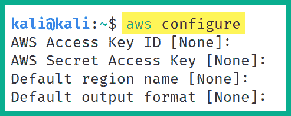

1.  接下来，为了查看 S3Scanner 工具的所有支持功能和选项，请使用 `s3scanner –h` 命令，如下截图所示：

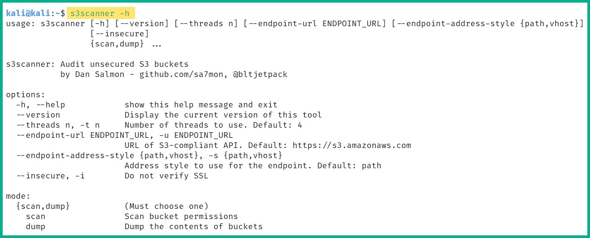

1.  接下来，让我们在 **Kali Linux** 中使用 **NSlookup** 来检索目标服务器的 IP 地址：

```
kali@kali:~$ nslookup flaws.cloud
```

1.  以下截图显示 NSlookup 能够检索到托管服务器的多个公共 IP 地址：

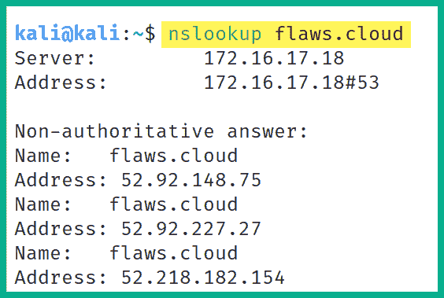

1.  接下来，让我们再次使用 NSlookup 来检索 AWS S3 桶服务器的主机名：

```
kali@kali:~$ nslookup 52.92.148.75
```

以下截图显示了服务器的主机名，包括 AWS S3 桶的名称：

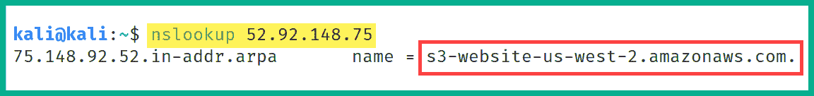

一个 AWS S3 桶的 URL 格式通常为 `https://<bucketname> <region>.amazonaws.com`。因此，通过使用 URL 中的信息，可以确定以下内容：

+   S3 桶名称：s3-website

+   托管区域：us-west-2

AWS S3 桶不仅用于存储数据文件，还用于托管网站。因此，我们可以使用 `flaws.cloud` 作为 AWS S3 桶 URL 的前缀，得到以下 URL：[`flaws.cloud.s3-website-us-west-2.amazonaws.com`](http://flaws.cloud.s3-website-us-west-2.amazonaws.com) 以下截图展示了前述 URL 的内容：

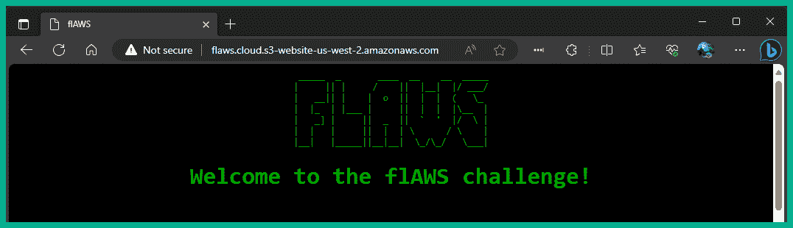

1.  接下来，让我们使用 S3Scanner 来验证一个存储桶是否存在以及可用的权限：

```
kali@kali:~$ s3scanner scan --bucket http://flaws.cloud
```

如下截图所示，存在一个 AWS S3 存储桶：

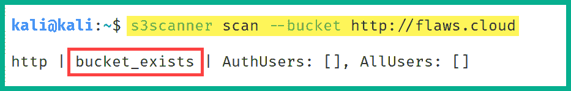

1.  接下来，让我们尝试查看 AWS S3 存储桶的内容，使用以下命令：

```
kali@kali:~$ aws s3 ls s3://flaws.cloud --region us-west-2 --no-sign-request
```

如下截图所示，S3 存储桶中有一些文件；

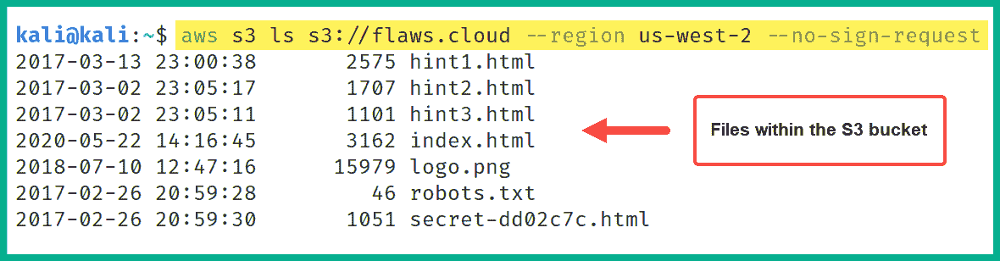

1.  接下来，让我们尝试将文件下载到我们的 Kali Linux 机器上。使用以下命令创建一个文件夹，并将文件下载到新创建的文件夹中：

```
kali@kali:~$ mkdir s3_bucket_files
kali@kali:~$ cd s3_bucket_files 
kali@kali:~/s3_bucket_files$ aws s3 cp s3://flaws.cloud/secret-dd02c7c.html --region us-west-2 --no-sign-request secret-dd02c7c.html
```

`cp` 语法指定了要下载的文件，`--region` 允许我们指定 AWS S3 Bucket 的位置，`--no-sign-request` 指定不使用任何用户凭证。

1.  最后，您可以使用 `cat` 或 `open` 命令查看下载文件的内容，如下所示：

```
kali@kali:~/s3_bucket_files$ cat secret-dd02c7c.html
kali@kali:~/s3_bucket_files$ open secret-dd02c7c.html
```

您可以继续在 [`flaws.cloud/`](http://flaws.cloud/) 上进行此练习，进一步了解各种安全漏洞，并发现错误配置对云服务（如 AWS S3 存储桶）的影响。但是，请勿在没有合法授权的系统、网络和组织上执行此类操作。如您所见，数据泄露可以发生在任何平台和任何组织上。作为一名有抱负的伦理黑客和渗透测试员，您必须学会如何在真正的对手发现并利用它们之前先找到这些漏洞。公司可能会将敏感数据存储在云平台上，甚至完全不加保护地将数据存放在云服务提供商的网络中。这可能会导致数据和账户被盗取。在本节中，您学习了如何使用各种工具和技术枚举 AWS S3 存储桶。

## 总结

在本章中，作为一名有抱负的伦理黑客和渗透测试员，您已经获得了实践技能，能够执行主动扫描技术来识别目标系统上的开放端口、运行的服务和操作系统。此外，您还学会了在扫描过程中使用常见的规避技术，以降低您的威胁级别。更进一步，您已经学会了如何枚举常见的网络服务，并利用这些信息改进网络攻击。我相信，本章所呈现的知识为您提供了宝贵的见解，支持您成为伦理黑客和渗透测试员的道路，帮助您在充满活力的网络安全领域迈出坚实的一步。愿这一新获得的理解赋予您前行的力量，让您在行业中自信地航行，产生显著影响。在下一章《执行漏洞评估》中，您将学习如何设置并使用流行的漏洞管理工具。

## 进一步阅读

+   Nmap 参考指南 - [`nmap.org/book/man.html`](https://nmap.org/book/man.html)

+   使用 Metasploit 进行信息收集 - [`www.offensive-security.com/metasploit-unleashed/information-gathering/`](https://www.offensive-security.com/metasploit-unleashed/information-gathering/)
