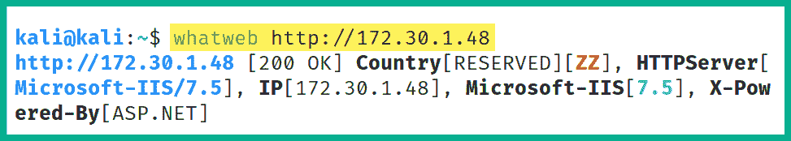
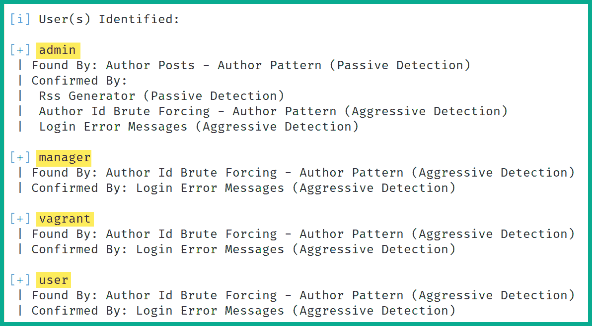

# 第七章：7 执行漏洞评估

## 加入我们的 Discord 书籍社区

[`packt.link/SecNet`](https://packt.link/SecNet)正如你到目前为止所学，侦察阶段对于成功进入渗透测试和网络杀伤链的利用阶段至关重要。在目标系统上发现安全漏洞有助于攻击者识别攻击面，即系统上可以被利用来获得未经授权访问的入口点。作为一个有志的道德黑客和渗透测试员，了解如何高效地识别攻击面并分析目标系统，将帮助你更好地规划攻击方法，并确定哪些漏洞能够帮助你在目标上获得立足点。在本章中，你将学习如何使用 Kali Linux 及其多种流行工具对网络进行漏洞评估。你将从学习如何安装、执行并分析扫描结果开始，使用 Nessus，这是网络安全行业中最受欢迎且被广泛认可的漏洞扫描器之一。接着，你将学习如何利用 Nmap 的隐藏秘密和强大功能，轻松发现系统上的安全漏洞。最后，你将学习如何进行 Web 漏洞评估。在本章中，我们将覆盖以下内容：

+   使用 Nessus 入门

+   使用 Nmap 进行漏洞识别

+   使用 Greenbone 漏洞管理器

+   使用网络应用扫描器

让我们开始吧！

## 技术要求

为了跟上本章的练习，请确保你已经满足以下硬件和软件要求：

+   Kali Linux - [`www.kali.org/get-kali/`](https://www.kali.org/get-kali/)

+   Nessus Essentials - [`www.tenable.com/products/nessus/nessus-essentials`](https://www.tenable.com/products/nessus/nessus-essentials)

+   Greenbone 漏洞管理器 - [`github.com/greenbone/gvmd`](https://github.com/greenbone/gvmd)

## 使用 Nessus 入门

在深入研究网络安全领域时，有一个非常著名的工具，每个人都需要了解，那就是 Nessus。Nessus 是一个漏洞扫描器，可以检测系统上超过 47,000 个 **常见漏洞和暴露**（**CVE**）安全缺陷。此外，Nessus 允许安全专业人员在集中位置部署 Nessus，并自动定期扫描目标系统，从而实现组织内的持续和自动化漏洞评估。作为一名有志的渗透测试员，你可能需要使用 Nessus 在组织内进行漏洞评估，确定每个安全缺陷的风险和严重性，并根据发现的安全漏洞提供降低可能的网络攻击风险的建议。在本节中，你将学习如何在 Kali Linux 机器上使用 Nessus 设置并执行漏洞评估。要开始使用 Nessus Essentials，请按照以下说明操作：

> 如果你是一个在 M1 Mac（ARM64）芯片上运行 Kali Linux 的 Mac 用户，可能会在 Kali Linux 中设置 Nessus 时遇到一些问题。然而，这个过程在基于 Windows 的系统上运行良好。

### 第一部分 - 安装 Nessus

在本部分中，你将学习如何在 Kali Linux 虚拟机上安装和设置 Nessus Essentials，以识别目标系统上的安全漏洞：

1.  首先，启动 **Kali Linux** 虚拟机并确保其具有互联网连接。

1.  接下来，无论是在 Kali Linux 还是主机上，打开网页浏览器并访问 [`www.tenable.com/products/nessus/nessus-essentials`](https://www.tenable.com/products/nessus/nessus-essentials)，注册免费许可证以便在设置过程中激活 Nessus Essentials：


如截图所示，完成注册需要一个商业电子邮件地址，但我使用了个人的免费电子邮件地址，成功注册并获得了 Nessus Essentials 激活码。

1.  在 **Kali Linux** 上，打开 **终端** 并使用以下命令更新本地软件包仓库列表：

```
kali@kali:~$ sudo apt update
```

1.  接下来，使用以下命令将 Nessus Essentials 包下载到 Kali Linux 虚拟机上：

```
kali@kali:~$ curl --request GET \
  --url 'https://www.tenable.com/downloads/api/v2/pages/nessus/files/Nessus-10.6.0-debian10_amd64.deb' \
  --output 'Nessus-10.6.0-debian10_amd64.deb' 
```

以下截图显示了前述命令的执行：


> 如果你在运行前述命令时遇到困难，请访问 [`www.tenable.com/downloads/nessus`](https://www.tenable.com/downloads/nessus)，选择最新版本的 Nessus 并选择 **Linux – Debian – amd64** 下载软件包到 Kali Linux 上。

1.  接下来，将 Nessus 软件包安装到 Kali Linux 上：

```
kali@kali:~$ sudo dpkg -i Nessus-10.6.0-debian10_amd64.deb
```

以下截图显示了 Nessus 的安装过程：


1.  接下来，使用以下命令启动和重启 Nessus 服务：

```
kali@kali:~$ sudo /bin/systemctl start nessusd.service
kali@kali:~$ sudo /bin/systemctl restart nessusd.service
```

> `systemctl status nessusd.service`命令可以用来验证 Nessus 服务是否在 Kali Linux 上处于活动状态并正常运行。

1.  要继续 Nessus 的设置过程，在 Kali Linux 中打开网页浏览器并访问[`kali:8834/`](https://kali:8834/)，如下所示：


当你首次访问[`kali:8834/`](https://kali:8834/)时，网页浏览器会提供安全警告，因为 Nessus 使用的是自签名数字证书。点击**高级**，然后点击**接受风险并继续**。

1.  接下来，Nessus 初始化页面将出现，点击**继续**，如下所示：


1.  接下来，选择**注册 Nessus Essentials**选项并点击**继续**，如下所示：


1.  由于你在*步骤 2*中已注册并收到 Nessus Essentials 许可证密钥，请在注册页面点击**跳过**，如下所示：


1.  接下来，从你的邮件消息中获取许可证密钥并输入到**激活码**字段中，然后点击**继续**，如下所示：


1.  接下来，Nessus 将显示许可证密钥/激活码，点击**继续**，如下所示：


1.  接下来，创建一个用户帐户并点击**提交**，如下所示：


> 如果你收到错误：`invalid code field bad format`，尝试手动输入许可证密钥/激活码来激活 Nessus Essentials。

1.  Nessus 将自动登录到仪表盘，然后开始初始化过程，并开始下载应用程序的附加更新和插件。此过程通常需要几分钟才能完成。要查看事件日志，请点击**设置** | **关于** | **事件**，如下图所示：


1.  下载过程完成后，Nessus 将编译所有插件。确保完成此过程后再继续扫描目标系统。

### 第二部分 – 识别漏洞

Nessus 能够检测到目标系统上的超过 78,000 个 CVE，帮助网络安全专业人员（如道德黑客和渗透测试员）识别组织资产的攻击面，并利用收集的信息提供预防和缓解网络攻击与威胁的建议。请按照以下指令开始使用 Nessus 扫描安全漏洞：

1.  启动**Metasploitable 3**（**Windows 版本**）虚拟机，作为我们网络上的目标系统。

1.  在**Kali Linux**中，登录到 Nessus Essentials 仪表盘，访问[`kali:8834/`](https://kali:8834/)，并点击**新扫描**，如下所示：


1.  接下来，将展示各种漏洞和合规扫描模板，方便你根据扫描目标轻松选择最合适的模板。例如，你可以使用预定义模板检测目标系统是否容易受到 WannaCry、ZeroLogon、PrintNightmare 甚至 Log4Shell 的攻击。对于我们的练习，请点击**基本网络扫描**，如下所示：


1.  接下来，将出现**设置**页面，提供设置名称、描述、文件夹以便轻松组织扫描、目标的选项。设置名称、描述，并将 Metasploitable 3（Windows 版本）虚拟机的 IP 地址作为目标，然后点击**启动**，如下所示：


如前面的截图所示，有各种选项和子菜单，例如以下内容：

+   **凭据**标签允许你指定登录凭证，允许 Nessus 登录到目标系统以获取在非凭据扫描时难以获取的特定信息。

+   **调度**允许渗透测试人员在一段时间内自动化他们的扫描。

+   **通知**允许 Nessus 在扫描开始和完成时发送电子邮件通知。

+   **发现**指定了端口扫描选项。

+   **评估**允许你选择 Nessus 是否扫描 web 漏洞。

+   报告允许你指定 Nessus 如何处理将在报告中显示的信息**that**。

+   **高级**使你能够指定 Nessus 在网络上发送的流量量，这对于低带宽网络非常有用。

1.  接下来，Nessus 将开始扫描目标，并在**我的扫描**摘要窗口中显示进度，如下所示：


扫描完成后，Nessus 会自动更新扫描状态，如下所示：


扫描完成后，它会自动保存在**我的扫描**部分。

### 第三部分 – 漏洞分析

使用像 Nessus 这样的漏洞扫描器可以帮助我们自动化漏洞发现和分类的过程。作为一名有抱负的道德黑客和渗透测试员，了解如何对报告数据进行漏洞分析是至关重要的。要开始使用 Nessus 进行漏洞分析，请按照以下说明操作：

1.  要查看扫描结果，请点击**我的扫描** | **识别目标 1 的漏洞**，如下所示：


下图展示了目标系统上所有发现的安全漏洞的总结：


如前面的截图所示，Nessus 提供了一个非常清晰、易于理解的视图，显示了所有发现的安全漏洞。柱状图和圆环图提供了基于漏洞的严重性评级和评分，展示了发现了多少安全漏洞的概览。

1.  要查看所有发现的安全漏洞列表，请点击 **Vulnerabilities** 标签，如下所示：


如前面的截图所示，Nessus 将多个安全漏洞进行了分组。

1.  接下来，点击 **CRITICAL** 严重性组，以显示所有属于该组的安全漏洞，如下所示：


如前面的截图所示，Nessus 按照从最严重到最轻微的顺序列出了安全漏洞。作为渗透测试人员，这表明这些漏洞最有可能对目标系统造成重大影响。

1.  接下来，点击任意一个关键漏洞查看更多详细信息，如下所示：


如前面的截图所示，Nessus 提供了一个描述，帮助网络安全专业人员更好地理解系统中存在此安全漏洞的风险及其影响。此外，Nessus 还提供了解决此安全漏洞的方案，并展示了目标系统或组织所拥有资产的安全态势。

1.  此外，Nessus 提供了其 **漏洞优先级评分**（**VPR**）评分系统，帮助网络安全专业人员优先分配资源解决该安全风险，如下所示：


1.  此外，Nessus 提供了用于计算漏洞严重性的 **通用漏洞评分系统**（**CVSS**）的度量标准，如下所示：


> 网络安全专业人员和研究人员使用 CVSS 计算器在 [`www.first.org/cvss/calculator/3.1`](https://www.first.org/cvss/calculator/3.1) 上确定系统中安全漏洞的严重性评分和得分。这一计算帮助行业专家在根据漏洞严重性评分、风险级别和影响来分类安全漏洞时确定风险因素。

1.  接下来，我们将使用 CVSS 3.0 向量并将其插入到计算器中，以确定威胁行为者如何利用此漏洞破坏系统：

```
CVSS:3.0/AV:N/AC:L/PR:N/UI:N/S:U/C:H/I:H/A:H
```

1.  接下来，将 CVSS 3.0 向量附加到以下 URL 的末尾：

[`www.first.org/cvss/calculator/3.0#`](https://www.first.org/cvss/calculator/3.0#)以下是最终版 URL，CVSS 3.0 向量作为后缀：[`www.first.org/cvss/calculator/3.0#CVSS:3.0/AV:N/AC:L/PR:N/UI:N/S:U/C:H/I:H/A:H`](https://www.first.org/cvss/calculator/3.0#CVSS:3.0/AV:N/AC:L/PR:N/UI:N/S:U/C:H/I:H/A:H)

1.  访问上述 URL 后，你将看到如何分配这些向量来确定漏洞得分为 9.8，如下所示：


如前面的截屏所示，威胁行为者需要创建一个利用，在**网络**（**N**）路径上传递，攻击复杂度为**低**（**L**），需要**无**（**N**）特权才能成功。此外，由于攻击范围将保持**不变**（**U**），因此不需要**任何**（**N**）人工用户交互。一旦利用了目标系统上的安全漏洞，对系统的机密性、完整性和可用性的影响将是**高**（**H**）。

### 第四部分 - 导出漏洞报告

从 Nessus 生成报告可帮助您在渗透测试后快速查阅漏洞及其描述。在本节中，您将学习如何使用 Nessus 生成各种类型的报告。要开始此练习，请按以下说明操作：

1.  在 Nessus 仪表板上，如下所示，单击**报告**：


1.  接下来，将弹出一个窗口，提供各种报告生成选项。选择**报告格式**、**报告模板**并单击**生成报告**，如下所示：


1.  生成报告后，请确保将其保存在桌面上，并使用 PDF 阅读器打开，如下所示：


完成了本节，您已经学会如何使用 Nessus 在渗透测试期间对目标进行漏洞评估。在下一节中，您将学习如何使用 Nmap 识别安全漏洞。

## 使用 Nmap 进行漏洞识别

**Nmap 脚本引擎**（**NSE**）是 Nmap 的最强大功能之一。它使渗透测试人员和安全研究人员能够创建、自动化和执行定制的扫描。使用 NSE 时，扫描技术通常是激进的，并具有导致意外数据丢失甚至崩溃目标系统的潜力。然而，NSE 允许渗透测试人员轻松识别安全漏洞，并确定目标是否可利用。它包含 600 多个预构建的脚本，属于以下 NSE 类别：

+   **Auth**: 此类别包含扫描目标系统的脚本，以确定是否可能绕过身份验证。

+   **Broadcast**: 此类别包含用于在网络上发现主机系统的脚本。

+   **Brute**: 此类别包含用于在远程服务器上执行某些类型的暴力攻击的脚本，旨在获取未经授权的访问权限。

+   **Default**: 此类别包含 NSE 中的一组默认脚本，用于扫描。

+   **Discovery**: 此类别包含用于在目标系统上进行主动侦察以识别网络服务的脚本。

+   **DoS**: 此类别包含模拟对目标系统进行**拒绝服务**（**DoS**）攻击的脚本，以检查系统是否容易受到此类攻击。

+   **利用**：此类别包含用于积极利用目标系统安全漏洞的脚本。

+   **外部**：此类别包含通常将从目标系统收集到的数据发送到外部资源以进行进一步处理的脚本。

+   **模糊测试**：此类别包含用于向应用程序发送随机数据，以发现应用程序中的软件漏洞和缺陷的脚本。

+   **侵入性**：此类别包含高风险脚本，这些脚本可能会导致系统崩溃并造成数据丢失。

+   **恶意软件**：此类别包含能够检测目标是否感染恶意软件的脚本。

+   **安全**：此类别包含不具侵入性且在目标系统上安全使用的脚本。

+   **版本**：此类别包含用于收集目标系统上服务版本信息的脚本。

+   **漏洞**：此类别包含用于检查目标系统上特定漏洞的脚本。

> 要了解更多关于 NSE 的信息，请参见：[`nmap.org/book/nse.html`](https://nmap.org/book/nse.html)。完整的 NSE 脚本列表请参见：[`nmap.org/nsedoc/scripts/`](https://nmap.org/nsedoc/scripts/)。

要开始使用 NSE 识别安全漏洞，请按照以下说明操作：

1.  启动**Kali Linux**和**Metasploitable 2**虚拟机。

1.  在**Kali Linux**中，打开**终端**并使用以下命令查看本地可用的 NSE 脚本列表：

```
kali@kali:~$ ls -l /usr/share/nmap/scripts
```

下图显示了 Kali Linux 中`/usr/share/nmap/scripts`目录下有 4000 多个 NSE 脚本：


1.  要过滤所有**文件传输协议**（**FTP**）NSE 脚本，请使用以下命令：

```
kali@kali:~$ ls -l /usr/share/nmap/scripts/ftp*
```

如下图所示，`*`用作通配符来显示所有以`ftp`开头的脚本：


1.  接下来，让我们使用 Nmap 来确定目标系统（Metasploitable 2）是否正在运行 FTP 服务，并确定该服务的版本：

```
kali@kali:~$ sudo nmap -sV -p 20,21 172.30.1.49
```


如前所示，端口 21 开放，目标系统的服务被识别为*vsftpd 2.3.4*。

1.  接下来，让我们使用其中一个 NSE 脚本来确定目标系统上的 vsftpd 是否存在漏洞：

```
kali@kali:~$ sudo nmap --script ftp-vsftpd-backdoor 172.30.1.49
```

`--script`命令允许你指定单个脚本、多个脚本或脚本类别。下图显示了在我们的受害机器上执行扫描的结果：


如前所示，使用了 ftp-vsftpd-backdoor 脚本来检查目标系统是否存在 vsFTPd 2.3.4 应用程序中的后门漏洞。结果，NSE 表明目标系统正在运行一个存在漏洞的服务。

1.  现在已经发现了一个漏洞，下一步是确定是否存在可以利用此安全弱点的利用工具。以下截图显示了针对 vsFTPd 2.3.4 服务执行 Google 搜索已知漏洞的结果：


如前图所示，来自 Metasploit 的创始人 Rapid7 有一个漏洞利用链接。通过这个 Rapid7 的网址，你可以获取更多有关如何在 Kali Linux 上使用 Metasploit 利用这个漏洞的详细信息。此外，注意到 Google 搜索结果中的第二个 URL，它来自 Exploit-DB。这是由 Kali Linux 的创建者维护的一个可信的漏洞数据库。它们是渗透测试中获取漏洞的两个可信在线资源。

1.  此外，在 Kali Linux 中，有一个名为**searchsploit**的工具，它允许你在 Kali Linux 的离线版本的 Exploit-DB 中执行查询/搜索漏洞。

以下截图显示了使用`searchsploit`命令时的搜索结果：


如前图所示，`searchsploit`能够从 Exploit-DB 数据库的本地离线版本中识别多个漏洞。注意，有一个特定条目表明 Metasploit 中已有一个漏洞利用模块。以下截图显示了 Metasploit 中的`vsFTPd 漏洞利用`模块：


如前图所示，这个漏洞利用模块可以利用任何运行 vsFTPd 2.3.4 版本的 Linux 系统中的安全漏洞。如果漏洞利用成功，渗透测试员将能够在目标系统上创建一个具有**远程代码执行**（**RCE**）的后门。

> 许多漏洞脚本可以作为 Nmap 的一部分在 NSE 中使用。请确保查看[`nmap.org/nsedoc/categories/vuln.html`](https://nmap.org/nsedoc/categories/vuln.html)上的完整列表，在那里你可以找到每个可以在漏洞类别中找到的脚本的名称和详细信息。

1.  如果你想执行一类脚本，可以使用`nmap --script <category-name>`命令，如下所示：

```
kali@kali:~$ sudo nmap --script vuln 172.30.1.49
```

使用`vuln`类别时，NSE 将使用所有漏洞检测脚本来检查目标的安全弱点。如下图所示，Metasploitable 2 受害机上发现了额外的安全漏洞：


作为一名有志成为道德黑客和渗透测试人员的人，您已经学会了如何使用 Nmap 执行各种扫描技术，以识别和发现网络中主机系统的安全漏洞。使用本部分中的信息，您可以帮助自己研究漏洞利用和有效载荷，这些利用和载荷能够利用这些安全漏洞。在接下来的部分中，您将学习如何在 Kali Linux 上安装和使用开源漏洞管理工具。

## 使用 Greenbone 漏洞管理器

**开放漏洞评估扫描器**（**OpenVAS**）是一个免费的漏洞扫描工具，允许道德黑客和渗透测试人员对网络进行漏洞评估。OpenVAS 可以扫描组织内经过认证和未认证的漏洞资产。在使用认证扫描时，渗透测试人员提供有效的登录凭据给漏洞扫描器，允许其认证到系统中，从而对目标系统的设置进行彻底扫描，查找任何配置错误。然而，未认证扫描通常不如认证扫描彻底，因为它只在目标的表面查找安全漏洞并提供报告。**Greenbone 漏洞管理器**（**GVM**）是一个集中管理工具，管理 OpenVAS 的功能和漏洞。在本练习中，您将学习如何在 Kali Linux 上设置 GVM 并使用 OpenVAS 对目标进行漏洞评估。开始本练习时，请按照以下说明操作：

### 第一部分 – 安装 GVM

1.  启动**Kali Linux**虚拟机，并确保其具有互联网连接。

1.  在**Kali Linux**中，打开**终端**并使用以下命令更新本地软件包仓库列表文件并安装 GVM 包：

```
kali@kali:~$ sudo apt update
kali@kali:~$ sudo apt install gvm
```

1.  在安装过程中，可能会提示您重启各个服务，请确保使用键盘上的`空格键`选择要重启的服务，然后使用`Tab`键在选项之间切换，最后按`Enter`键确认，如下所示：


1.  安装完成后，重启 Kali Linux 虚拟机并登录以继续。

1.  接下来，使用以下命令初始化设置过程并生成默认的用户凭据：

```
kali@kali:~$ sudo gvm-setup
```

设置过程通常需要一些时间来完成，因为它会下载额外的更新和插件。一旦设置过程完成，默认的管理员账户将被创建并生成一个随机密码，如下所示：


1.  接下来，使用`sudo gvm-check-setup`命令验证 GVM 是否正确设置。

1.  接下来，在 Kali Linux 中打开网页浏览器，访问 `https://127.0.0.1:9392` 以访问 GVM 的网页界面。

1.  使用在设置过程结束时创建的默认 `admin` 用户账户并登录，如下所示：


1.  登录后，点击**管理** | **Feed 状态**，如下所示：


GVM 将继续从多个可信的在线来源下载额外的 **网络威胁情报** (**CTI**)，以确保 GVM 内的漏洞扫描引擎拥有最新的更新和签名，从而识别系统上的最新安全漏洞，如下所示：


下载过程通常需要一段时间才能完成。一旦所有内容更新完成，信息源状态将自动更改，如下所示：


在对目标系统执行漏洞扫描之前，请确保所有威胁信息源已更新。

### 第二部分 - 漏洞识别

要使用 GVM 识别目标系统上的安全漏洞，请按照以下指示操作：

1.  在 GVM 仪表板上，点击 **配置** | **目标** 来设置我们的目标主机，如下所示：


1.  接下来，点击位于左上角的 **新目标** 图标。

1.  在 **新目标** 窗口中，确保设置名称、主机（Metasploitable 3 的 IP 地址）并点击 **保存**，如下所示：


1.  如前截图所示，**新目标** 窗口提供了额外的选项，例如输入用户凭证以执行凭证扫描，从而获取更多信息。此外，你还可以从列表中选择多个目标系统，并在扫描地址范围时排除特定目标。

1.  接下来，点击 **扫描** | **任务** 来创建新的扫描任务，如下所示：


1.  接下来，点击 **魔法纸** 图标（左上角），然后选择 **新任务**，如下所示：


1.  在 **新任务** 窗口中，输入任务名称并从下拉菜单中选择 **扫描目标**，然后点击 **保存**，如下所示：


1.  接下来，新的扫描任务将在页面的下部显示，点击 **播放** 图标以开始扫描目标系统，如下所示：


1.  在此过程中，任务状态会自动变化。一旦任务完成，状态将显示为 **完成**，并展示其结果，如下所示：


### 第三部分 - 漏洞分析与报告

要使用 GVM 执行漏洞分析，请按照以下指示操作：

1.  要查看报告结果，请点击 **扫描** | **报告**，如下所示：


如前所示，GVM 已分析并将发现的安全漏洞分类为 **高**、**中**、**低**、**日志** 和 **误报**，以帮助网络安全专业人员进行决策并优先分配资源给更关键的漏洞。

1.  要查看已识别的安全漏洞的详细列表，请点击报告日期，如下所示：


然后，点击**结果**选项卡查看目标系统上发现的所有安全漏洞及其严重级别，如下所示：


1.  要查看漏洞的详细描述，请点击结果列表中的任意一个，如下所示：


使用前面截图中显示的信息，伦理黑客和渗透测试人员可以更好地了解如果漏洞被对手利用，漏洞对系统的影响。此外，伦理黑客可以利用这些信息开发或获取利用代码，攻破目标网络中具有相同安全缺陷的多个系统。在本节中，你已经学会了如何设置和使用 GVM 来识别目标系统上的安全漏洞。在下一节中，你将学习如何使用常见工具来识别 web 应用程序中的安全漏洞。

## 使用 web 应用程序扫描器

作为一名有抱负的渗透测试员，你还需要根据渗透测试的范围执行 web 应用程序安全测试。在本节中，你将学习如何使用各种类型的 web 应用程序扫描器来识别并指纹识别目标服务器上的 web 应用程序。让我们开始吧！

### WhatWeb

WhatWeb 使伦理黑客和渗透测试人员能够识别和指纹识别 web 应用程序服务器上运行的技术类型。WhatWeb 已预装在 Kali Linux 中，并应成为你在侦察和漏洞评估阶段的工具之一。要使用 WhatWeb 对目标 web 服务器进行分析，请按照以下指示操作：

1.  首先，启动**Kali Linux**和**Metasploitable 3**（Windows 版本）虚拟机。

1.  在**Kali Linux**中，打开**终端**并使用以下命令来识别目标上是否有 web 应用程序运行：

```
kali@kali:~$ nmap -p 80,443,8080 172.30.1.48
```

如下截图所示，发现了在端口 80 和 8080 上的网络服务：


> Web 应用程序协议如 HTTP 和 HTTPS 分别在端口 80、443 和 8080 上运行。

1.  接下来，使用以下命令来分析 web 服务器：

```
kali@kali:~$ whatweb http://172.30.1.48
```

如下截图所示，WhatWeb 能够识别目标系统上的 web 应用程序和额外的 web 技术：



作为一名有抱负的伦理黑客和渗透测试员，一些工具将帮助你收集有关 web 服务器的信息，而另一些则能发现安全漏洞。然而，使用 WhatWeb 时，研究目标 web 服务器上发现的所有技术是非常重要的；许多安全研究人员分享他们的发现和漏洞披露，帮助他人共同应对网络犯罪分子的挑战。简而言之，WhatWeb 提供了以下信息：

+   Web 应用程序及其版本

+   Web 技术及其版本

+   主机操作系统及其版本

通过研究每个技术的版本号，你将能够找到可以利用目标系统漏洞的漏洞利用代码。在下一部分中，你将学习如何使用 Nmap 发现 Web 应用漏洞。

### Nmap

如你所学，Nmap 具有许多非常酷的功能，并使渗透测试人员能够对目标系统执行各种类型的扫描，发现其具体细节。在 NSE 中，许多脚本已预加载到 Kali Linux 中。使用以下命令，你可以看到所有以 http 开头的 Nmap 脚本的完整列表：

```
kali@kali:~$ ls /usr/share/nmap/scripts/http*
```

在列表中，你可以选择使用特定脚本来检查目标系统的 HTTP 漏洞。假设你想要识别一个 Web 应用是否容易受到**结构化查询语言**（**SQL**）**注入**攻击。`http-sql-injection` NSE 脚本可以识别此类安全缺陷。以下 Nmap 命令展示了如何调用 SQL 注入脚本并对开放 80 端口用于 Web 服务的目标进行扫描：

```
kali@kali:~$ nmap --script http-sql-injection -p 80 172.30.1.49
```

以下截图显示，Nmap 能够在目标的多个点上识别可能的 SQL 注入攻击：如上图所示，Nmap 脚本能够自动化检查各种 URL 和路径是否容易受到可能的 SQL 注入攻击。

> 尽管许多 NSE 脚本可以用于识别 Web 应用中的安全漏洞，但在执行初始扫描以识别目标时，始终使用`-A`或`-sV`语法来识别 Web 应用的服务版本是非常重要的。一旦识别出 Web 应用的服务版本，利用互联网查找已知的漏洞。作为渗透测试人员，执行更多的漏洞研究总是有益的，因为你可能会发现更多有关如何攻破目标的信息。

一定要对目标执行额外扫描，以发现任何隐藏的安全漏洞，并使用[`nmap.org/nsedoc/`](https://nmap.org/nsedoc/)上找到的信息，深入了解各种 NSE 脚本的用途。在下一部分中，你将学习如何使用 Nikto 检查目标上的 Web 应用漏洞。

### Nikto

Nikto 是一个开源 Web 应用扫描器，预装在 Kali Linux 中。这个工具允许渗透测试人员轻松地自动化识别 Web 服务器中 Web 应用可能存在的安全漏洞。要开始使用 Nikto，请按照以下说明操作：

1.  启动**Kali Linux**和**Metasploitable 2**虚拟机。

1.  在**Kali Linux**上，打开**终端**并使用以下命令扫描**Metasploitable 2**上的 Web 应用：

```
kali@kali:~$ nikto -h 172.30.1.49
```

> 使用`-h`语法可以指定目标的主机名或 IP 地址。要了解更多扫描选项，请使用`nikto --help`命令。

以下截图展示了我们目标系统的一些扫描结果：


如前面的截图所示，Nikto 可以识别目标 web 应用程序中的各种安全漏洞。它们以项目符号格式列出，`+` 图标用来表示新结果。花点时间仔细阅读每一行，因为 Nikto 帮助安全专家了解安全漏洞的细节。它还提供了漏洞发现的参考以及如何解决这些问题。接下来，您将学习如何使用 Metasploit 识别 web 应用漏洞。

### Metasploit

本节中，您将学习如何利用 Metasploit 的强大功能发现 web 应用服务器的安全漏洞。我们的目标是使用 Metasploitable 2 虚拟机。开始本练习时，请按照以下说明操作：

1.  首先，启动**Kali Linux**和**Metasploitable 2**虚拟机。

1.  在**Kali Linux**中，打开**终端**并使用以下命令启动 PostgreSQL 数据库并初始化 Metasploit：

```
kali@kali:~$ sudo service postgresql start
kali@kali:~$ sudo msfdb init
```

1.  接下来，使用以下命令访问 Metasploit 框架：

```
kali@kali:~$ msfconsole
```

1.  然后，使用以下命令在 Metasploit 中加载 WMAP 网络漏洞扫描模块：

```
msf6 > load wmap
```

以下截图展示了前述命令的执行及 WMAP 插件已成功加载：


1.  接下来，使用以下命令将目标系统设置为 Metasploitable 2：

```
msf6 > wmap_sites -a http://172.30.1.49
```

以下截图展示了如何在 WMAP 网络漏洞扫描器中设置目标主机：


1.  跳过下一步，使用以下命令指定目标 web 应用程序的 URL。我们将针对 Metasploitable 2 虚拟机中的 Mutillidae web 应用程序进行扫描：

```
msf6 > wmap_targets -t http://172.30.1.49/mutillidae/index.php
```

以下截图展示了设置目标后预期的结果：


如前面的截图所示，目标 web 应用程序已在主机系统中设置为 Mutillidae。

1.  接下来，使用以下命令自动加载 Metasploit 中的各种 web 扫描模块进行安全测试：

```
msf6 > wmap_run -t
```

以下截图展示了许多 Metasploit web 扫描模块正在加载到 WMAP 网络漏洞扫描器中：


1.  加载完 web 扫描模块后，使用以下命令对目标 web 应用程序进行安全测试：

```
msf6 > wmap_run -e
```

1.  当 WMAP 扫描完成后，使用以下命令查看 WMAP 网络扫描器在 Metasploit 中发现的 web 安全漏洞列表：

```
msf6 > wmap_vulns -l
```

1.  最后，使用`vulns`命令查看 WMAP 安全评估的整体结果：

```
msf6 > vulns
```

> 如果 Metasploit 能够根据其 CVE ID 识别漏洞，它将在 `vulns` 命令中显示。

完成本次练习后，你已经学会了如何使用 Metasploit 识别网页应用程序漏洞。接下来，你将学习如何使用 WPScan 对目标 WordPress 网页应用程序进行漏洞扫描。

### WPScan

虽然电子商务行业中有许多网页应用程序，但许多组织将 WordPress 网页应用程序作为首选的**内容管理系统**（**CMS**）。虽然 WordPress 提供了非常时尚和清晰的网站展示，但许多组织并未及时更新其 WordPress 平台和插件，从而使得它们的网页服务器和网页应用程序容易受到互联网威胁者的潜在网络攻击。在 Kali Linux 中，你将了解 WPScan 工具，该工具允许渗透测试人员对目标服务器上的 WordPress 网页应用程序进行漏洞扫描和枚举。要开始本次练习，请按以下说明操作：

1.  首先，启动**Kali Linux**和**Metasploitable 3**（Windows 版本）虚拟机。

1.  在**Kali Linux**中，打开**终端**并使用以下命令更新 WPScan 数据库：

```
kali@kali:~$ wpscan --update
```

1.  接下来，使用以下命令在 Metasploitable 3（Windows 版本）虚拟机上识别 WordPress 网页应用程序的安全漏洞：

```
kali@kali:~$ wpscan --url http://172.30.1.48:8585/wordpress --no-update
```

以下截图显示了漏洞扫描的结果：


如前面的截图所示，WPScan 将检查远程目标上 WordPress 安装和配置的每个组件，并提供其发现的详细信息。

1.  接下来，使用 `-e u` 命令枚举目标 WordPress 网页应用程序上任何登录账户的用户名，如下所示：

```
kali@kali:~$ wpscan --url http://172.30.1.48:8585/wordpress --no-update -e u
```

如下截图所示，WPScan 能够识别目标网页服务器的登录用户名：



正如你所见，在 WordPress 服务器上执行漏洞扫描并收集目标服务器上潜在的授权用户名非常简单。

> 若想了解更多关于 WPScan 的信息，请参见：[`www.kali.org/tools/wpscan/`](https://www.kali.org/tools/wpscan/)。

完成本节后，你已经学会如何使用 Kali Linux 中的各种工具和技术进行网页扫描。通过收集一份网页应用程序安全漏洞清单，经过一些额外的研究，你将能够找到有效的漏洞利用工具，测试这些漏洞是否真的可以被利用。

## 总结

在本章中，您了解了发现组织及其资产中的安全漏洞的重要性。您还通过使用各种工具，如 Nessus、Nmap 和 GVM，亲手进行安全评估，获得了实际经验和技能。您还发现了如何使用各种工具和技术轻松识别 Web 应用程序中的安全缺陷。我相信本章提供的知识为您提供了宝贵的见解，支持您成为道德黑客和渗透测试员的道路，在动态的网络安全领域中取得成功。愿这种新获得的理解在您的旅程中赋予您力量，使您能够自信地驾驭这个行业并产生重大影响。在下一章，*了解网络渗透测试*中，您将专注于如何在执行网络渗透测试时使用各种技术和策略。

## 进一步阅读

+   了解 Nessus - [`www.techtarget.com/searchnetworking/definition/Nessus`](https://www.techtarget.com/searchnetworking/definition/Nessus)

+   Nmap 脚本引擎 (NSE) - [`nmap.org/book/man-nse.html`](https://nmap.org/book/man-nse.html)

+   Nmap NSE 脚本 - [`nmap.org/nsedoc/scripts/`](https://nmap.org/nsedoc/scripts/)

+   CVSS 评分系统 - [`www.first.org/cvss/`](https://www.first.org/cvss/)
