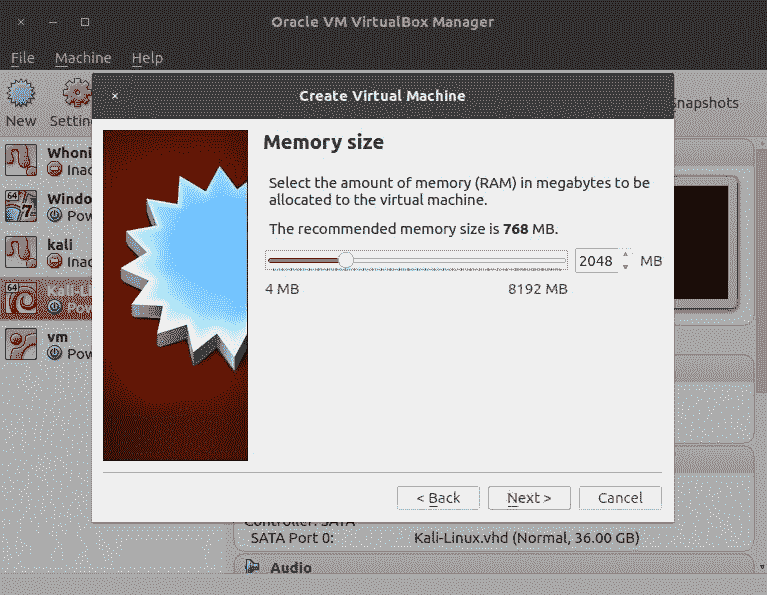
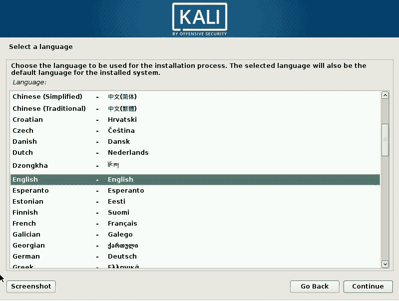
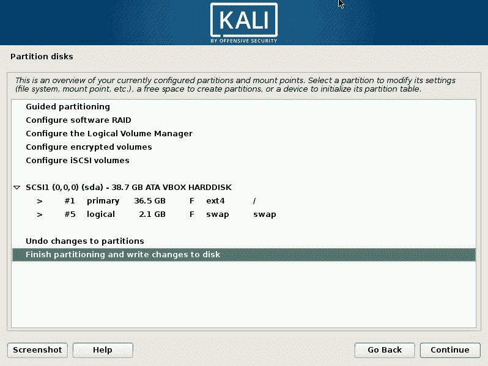
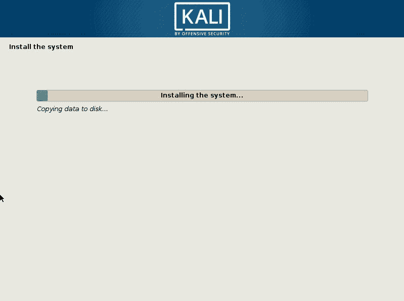
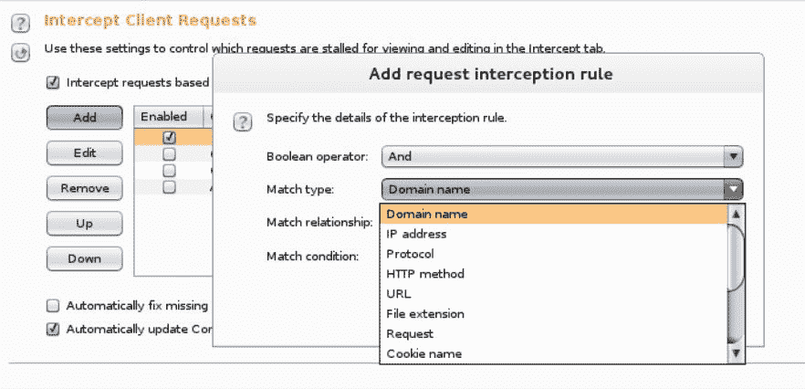
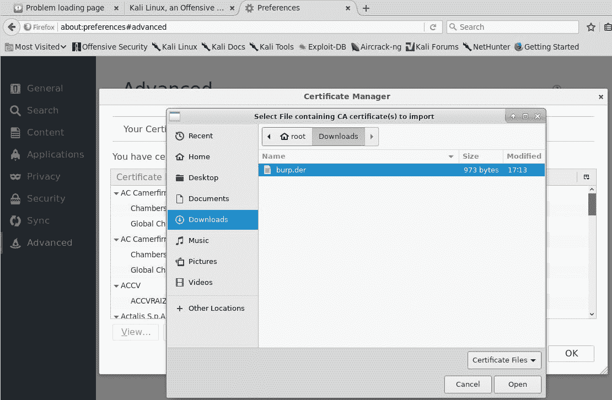
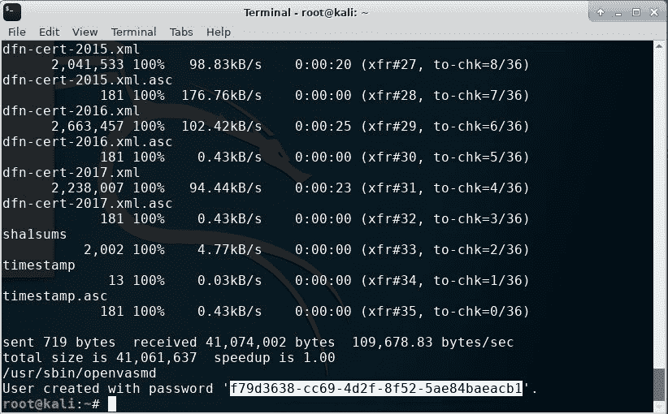

# 第二章：使用 Kali Linux 设置您的实验室

准备是一切的关键；当您在渗透测试项目上工作时，它变得更加重要，因为您只有有限的时间进行侦察、扫描和利用。最终，您可以获得访问权限并向客户提交详细报告。您进行的每次渗透测试的性质都会不同，并且可能需要与之前进行的测试不同的方法。工具在渗透测试中起着重要的作用。因此，您需要事先准备好您的工具包，并对您将需要执行测试的所有工具进行实践操作。

在本章中，我们将涵盖以下主题：

+   Kali Linux 的概述和与之前版本的变化

+   安装 Kali Linux 的不同方法

+   虚拟化与在物理硬件上安装

+   在 Kali Linux 中重要工具的演示和配置

+   易受攻击的 Web 应用程序和虚拟机以建立测试实验室

# Kali Linux

Kali Linux 是一个基于 Debian 的以安全为重点的 Linux 发行版。它是著名的 Linux 发行版 BackTrack 的重新品牌版本，BackTrack 带有一个巨大的开源黑客工具库，用于网络、无线和 Web 应用程序渗透测试。尽管 Kali Linux 包含了 BackTrack 的大部分工具，但 Kali Linux 的主要目标是使其可移植，可以安装在基于 ARM 架构的设备上，如平板电脑和 Chromebook，这使得工具很容易地随时可用。

使用开源黑客工具有一个主要的缺点-当它们在 Linux 上安装时，它们包含了大量的依赖项，并且需要按照预定的顺序安装。此外，一些工具的作者没有发布准确的文档，这使得我们的生活变得困难。

Kali Linux 简化了这个过程；它预装了许多工具及其所有依赖项，并且处于可立即使用的状态，这样您就可以更多地关注实际攻击，而不仅仅是安装工具。Kali Linux 中安装的工具经常发布更新，这有助于保持工具的最新状态。一个非商业工具包，预装了所有主要的黑客工具，用于测试真实世界的网络和应用程序，这是每个道德黑客的梦想，Kali Linux 的作者们为了让我们的生活更轻松而做出了一切努力，这让我们可以花更多时间发现实际的漏洞，而不是构建工具包。

# Kali Linux 的最新改进

在 2015 年的 Black Hat USA 上，Kali 2.0 发布了一个新的 4.0 内核。它基于 Debian Jessie，代号为 Kali Sana。之前的主要版本是 Kali 1.0，随后发布了版本 1.1 的定期更新。Kali 2.0 中的一些变化包括为了更好的可访问性而进行的界面改变以及添加了更新和更稳定的工具。

以下是 Kali 2.0 的一些主要改进：

+   **持续滚动更新**：在 2016 年 1 月，Kali Linux 的更新周期得到了改进，转向了滚动发布，并在 2017 年 4 月进行了重大升级。滚动发布发行版是一种不断更新的发行版，以便在可用时向用户提供最新的更新和软件包。现在用户不必等待主要版本发布来获取错误修复。在 Kali 2.0 中，软件包会定期从 Debian 测试发行版中提取。这有助于保持 Kali 的核心操作系统更新。

+   **频繁的工具更新**：维护 Kali Linux 发行版的组织 Offensive Security 已经设计了一种不同的方法来检查更新的工具。他们现在使用一个新的上游版本检查系统，当工具的新版本发布时，它会定期发送更新。通过这种方法，Kali Linux 中的工具会在开发人员发布它们时立即更新。

+   **重新设计的桌面环境**: Kali Linux 现在支持完整的 GNOME 3 会话。GNOME 3 是最广泛使用的桌面环境之一，也是开发人员的最爱。运行完整 GNOME 3 会话所需的最低 RAM 为 768 MB。虽然考虑到今天计算机的硬件标准，这不是一个问题；如果您有一台旧机器，您可以下载使用 Xfce 桌面环境和较小一组有用工具的轻量级 Kali Linux 版本。Kali Linux 还原生支持其他桌面环境，如 KDE、MATE、E17、i3wm 和 LXDE。Kali 2.0 带有新的壁纸、可自定义的侧边栏、改进的菜单布局和许多其他视觉调整。

+   **支持各种硬件平台**: Kali Linux 现在适用于所有主要版本的 Google Chromebook 和 Raspberry Pi。构建在 Kali Linux 之上的面向移动设备的黑客发行版 NetHunter 已更新至 Kali 2.0。官方的 VMware 和 VirtualBox 镜像也已更新。

+   **主要工具更改**: Metasploit Community 和 Pro 版本已从 Kali 2.0 中删除。如果您需要这些版本，您需要直接从 Rapid7 的网站（[`www.rapid7.com/`](https://www.rapid7.com/)）下载。现在，只有 Metasploit Framework - 开源版本 - 随 Kali Linux 一起提供。

# 安装 Kali Linux

Kali Linux 的成功也归功于其安装的灵活性。如果您想快速测试一个系统，您可以在几分钟内在 Amazon 云平台上运行 Kali Linux，或者如果您想使用彩虹表破解密码，您可以将其安装在具有快速处理器的高速 SSD 驱动器上。作为其基础的 Linux，操作系统的每个部分都可以定制，这使得 Kali Linux 成为任何测试环境中的有用工具包。您可以从其官方下载页面获取 Kali Linux：[`www.kali.org/downloads/`](https://www.kali.org/downloads/)。

Kali Linux 可以在多种平台上以多种方式安装：

+   **USB 模式**: 使用诸如 Rufus、Windows 中的 Universal USB Installer 或 Linux 中的`dd`等工具，您可以从 ISO 映像创建可引导的 USB 驱动器。

+   **预装的虚拟机**: 可以从官方 Kali Linux 网站下载 VirtualBox、VMware 和 Hyper-V 镜像。只需下载并导入其中之一到您的虚拟化软件中即可。

+   **Docker 容器**: 近年来，Docker 容器在许多场景中证明了其有用和方便，并在某些领域中受到了青睐，超过了虚拟化。Docker 的官方 Kali Linux 镜像可在以下位置找到：[`hub.docker.com/r/kalilinux/kali-linux-docker/`](https://hub.docker.com/r/kalilinux/kali-linux-docker/)。

+   **Amazon EC2 上的 Kali Linux 最小镜像**: Kali Linux 在 AWS 市场上有一个可用于使用的**Amazon Machine Image**（AMI）：[`aws.amazon.com/marketplace/pp/B01M26MMTT`](https://aws.amazon.com/marketplace/pp/B01M26MMTT)。

+   **Kali NetHunter**: 这是一个 Android ROM 叠加层。这意味着 Kali NetHunter 在 Android ROM（无论是原始还是自定义）之上运行。它目前仅适用于有限数量的设备，并且其安装可能不像其他 Kali 版本那样直接。有关 Kali NetHunter 的更多信息，请参阅：[`github.com/offensive-security/kali-nethunter/wiki`](https://github.com/offensive-security/kali-nethunter/wiki)。

+   **在物理计算机上安装**: 这可能是专业渗透测试人员的最佳选择，他们有一台专用于测试的笔记本电脑，并且需要充分利用 GPU、处理器和内存等硬件。这可以通过下载 ISO 映像并将其记录到 CD、DVD 或 USB 驱动器上，然后使用它来引导计算机并启动安装程序来完成。

根据个人偏好，并且为了节省内存和处理能力，同时拥有完全功能和轻量级桌面环境，本书将使用一个由 VirtualBox 虚拟机和安装了 Xfce4 Kali Linux ISO 的设置。

# 虚拟化 Kali Linux 与在物理硬件上安装它

虚拟化软件的流行使其成为在虚拟化平台上安装测试机的一个有吸引力的选择。虚拟化软件以低成本提供了丰富的功能，并消除了双启动机器的麻烦。大多数虚拟化软件包提供的另一个有用的功能是克隆虚拟机，您可以使用它来创建多个相同机器的副本。在真实的渗透测试中，您可能需要克隆和复制您的测试机器，以安装额外的黑客工具并在 Kali Linux 中进行配置更改，保留早期镜像的副本以用作虚拟化环境中的基础镜像。这可以非常容易地实现。

一些虚拟化软件具有*还原到快照*功能，如果您搞砸了测试机器，您可以回到过去并恢复一个干净的状态，在上面可以进行工作。

修改虚拟机的 RAM 数量、虚拟磁盘大小和虚拟处理器数量是虚拟化软件的另一个众所周知的特性。

虚拟化平台具有吸引人的功能，但也有一个主要缺点。如果渗透测试涉及测试网络上使用的密码的强度或其他处理器密集型任务，您将需要一台性能出色的处理器和专用于该任务的 GPU。在虚拟平台上破解密码是不明智的，因为它会减慢进程，并且由于虚拟化开销，您将无法充分利用处理器的容量。

虚拟化平台的另一个让很多人困惑的特性是网络选项。桥接、主机模式和 NAT 是虚拟化软件提供的三种主要网络选项。桥接网络是进行渗透测试的推荐选项，因为虚拟机会表现得好像连接到物理交换机上一样，数据包会不经修改地从主机机器传出。

# 在 VirtualBox 上安装

可以从[`www.virtualbox.org/wiki/Downloads`](https://www.virtualbox.org/wiki/Downloads)获取适用于多个平台的 Oracle VirtualBox。建议您还下载并安装相应的扩展包，因为它提供 USB 2.0 和 3.0 支持、RDP、磁盘加密和其他一些有趣的功能。

从 Kali 下载页面选择您喜欢的版本。如前所述，我们将使用 Xfce4 64 位 ISO（[`www.kali.org/downloads/`](https://www.kali.org/downloads/)）。根据您的硬件或偏好，您可以选择任何其他版本，因为安装的工具或对它们的访问在不同版本中不会有所不同，除非您选择了仅包含操作系统和一小组工具的*Light*版本。

# 创建虚拟机

首先打开 VirtualBox 并创建一个新的虚拟机。为其选择一个名称（我们将使用`Kali-Linux`），并将类型设置为 Linux，版本设置为 Debian（64 位）。如果您选择了 32 位 ISO，请将版本更改为 Debian（32 位）。然后，点击下一步：


在接下来出现的屏幕上，选择为虚拟机保留的内存量。Kali Linux 可以运行在至少 1GB 的 RAM 上，但是虚拟机的推荐设置是 2-4GB。我们将为我们的机器设置 2GB。请记住，您的主机计算机需要内存来运行其他程序，可能还需要运行其他虚拟机：



接下来，我们将为虚拟机创建一个硬盘。选择“立即创建虚拟硬盘”，然后点击“创建”。在下一个屏幕上，让类型保持为 VDI（VirtualBox 磁盘映像）和动态分配。然后，选择文件名和路径；您可以将其保持不变。最后，选择磁盘大小。我们将使用 40GB。新安装的 Kali Linux 使用 25GB。选择磁盘大小，然后点击“创建”：


# 安装系统

现在虚拟机已创建，请在 VirtualBox 列表中选择它，然后点击顶部栏中的“设置”。然后，转到“存储”并选择具有 CD 图标的空驱动器。接下来，我们将配置虚拟机使用刚刚下载的 Kali Linux ISO 作为可引导驱动器（或者是光盘）。点击右侧的 CD 图标，然后点击“选择虚拟光盘文件...”，并导航到下载 Kali ISO 的文件夹：


接受设置更改。现在，所有设置都已完成，启动虚拟机，您将能够看到 Kali 的 GRUB 加载程序。选择“图形化安装”并按*Enter*：


在接下来的几个屏幕中，您需要选择语言、位置和键盘布局：



接下来，安装程序将尝试进行网络配置。由于 VirtualBox 默认为所有新虚拟机设置了 NAT 网络适配器，所以这里不应该有任何问题。然后，您将被要求输入主机名和域名。如果您的网络不需要特定的值，请保持这些值不变，然后点击“继续”。

接下来，您将被要求为 root 用户设置密码。这是您系统中权限最高的用户，所以即使虚拟机只用于练习和测试目的，也要选择一个强密码。选择您的时区并点击“继续”。

现在，您需要选择安装系统和硬盘分区的位置。如果您没有特定的偏好，选择第一个选项“引导分区”。选择使用整个磁盘的选项，然后点击“继续”。在下一个屏幕上，或者在完成磁盘分区配置后，选择“完成分区并将更改写入磁盘”，然后点击“继续”：



在下一个屏幕中点击“继续”以将更改写入磁盘，安装将开始。



安装完成后，安装程序将尝试配置更新机制。确保您的主机计算机已连接到互联网，保持代理配置不变，并在询问是否要使用网络镜像时选择“是”：


安装程序将生成 APT（Debian 软件包管理器）的配置文件。下一步是配置 GRUB 引导加载程序。当被询问时选择“是”，并将其安装在`/dev/sda`上：


接下来，您应该会看到“安装完成”消息。点击“继续”以重新启动虚拟机。此时，您可以从存储配置中删除 ISO 文件，因为您将不再需要它。

虚拟机重新启动后，您将被要求输入用户名和密码。使用`root`用户和安装过程中设置的密码：


# Kali Linux 中的重要工具

一旦你成功安装并运行了 Kali Linux，你就可以开始使用工具了。由于本书是关于网络应用程序的黑客攻击，我们将花费大部分时间使用的主要工具都可以从“应用程序 | 网络应用程序分析”中访问。下面的截图显示了“网络应用程序分析”中的工具：


在 Kali Linux 中，Web 应用程序分析工具进一步分为四个类别，如下所示：

+   CMS 和框架识别

+   网络应用程序代理

+   网络爬虫和目录暴力破解

+   Web 漏洞扫描器

# CMS 和框架识别

内容管理系统（CMS）在互联网上非常流行，数百个网站已经使用其中之一——WordPress 进行部署。插件和主题是 WordPress 网站的重要组成部分。然而，这些附加组件存在大量的安全问题。WordPress 网站通常由普通用户管理，他们对安全问题不太关注，并且很少更新他们的 WordPress 软件、插件和主题，使得这些网站成为一个有吸引力的目标。

# WPScan

WPScan 是一个用 Ruby 编程语言编写的非常快速的 WordPress 漏洞扫描器，预装在 Kali Linux 中。

可以使用 WPScan 提取以下信息：

+   插件列表

+   主题的名称

+   使用暴力破解技术的弱密码和用户名

+   版本的详细信息

+   可能的漏洞

Kali Linux 中还提供了一些其他 CMS 工具，详见以下小节。

# JoomScan

JoomScan 可以检测 Joomla CMS 中已知的漏洞，如文件包含、命令执行和注入漏洞。它会探测应用程序并提取目标正在运行的确切版本。

# CMSmap

CMSmap 没有包含在 Kali Linux 中，但可以从 GitHub 上轻松安装。这是一个针对最常用的 CMS（WordPress、Joomla 和 Drupal）的漏洞扫描器。它使用 Exploit Database 来查找 CMS 的启用插件中的漏洞。要下载它，请在 Kali Linux 终端中输入以下命令：

```
git clone https://github.com/Dionach/CMSmap.git  
```

# Web 应用程序代理

HTTP 代理是 Web 应用程序黑客工具包中最重要的工具之一，Kali Linux 包含了几个这样的工具。你可能会在一个代理中错过的功能肯定会在另一个代理中找到。这凸显了 Kali Linux 及其庞大的工具库的真正优势。

HTTP 代理是一种位于浏览器和网站之间的软件，拦截它们之间流动的所有流量。Web 应用程序黑客的主要目标是深入了解应用程序的内部工作原理，而通过充当中间人并拦截每个请求和响应来实现这一目标是最好的。

# Burp Proxy

Burp Suite 已成为 Web 应用程序测试的事实标准。它的许多功能几乎提供了 Web 渗透测试人员所需的所有工具。专业版包括一个可以进行主动和被动扫描的自动化扫描器，并在 Intruder（Burp 的模糊测试工具）中增加了配置选项。Kali Linux 包含免费版本，该版本没有扫描功能，也没有保存项目的可能性；此外，它在模糊测试工具 Intruder 上有一些限制。可以从应用程序 | Web 应用程序分析 | Web 应用程序代理访问它。Burp Suite 是一个功能丰富的工具，包括 Web 爬虫、Intruder 和重复器，用于自动化对 Web 应用程序的定制攻击。我将在后面的章节中更深入地介绍几个 Burp Suite 的功能。

Burp Proxy 是一个非透明代理，你需要采取的第一步是将代理绑定到特定的端口和 IP 地址，并配置 Web 浏览器使用该代理。默认情况下，Burp 监听`127.0.0.1`回环地址和`8080`端口号：


确保选择一个没有被其他应用程序使用的端口，以避免任何冲突。注意端口和绑定地址，并将其添加到浏览器的代理设置中。

默认情况下，Burp Proxy 只拦截来自客户端的请求，不拦截服务器的响应。如果需要，可以在 Proxy 的 Options 选项卡中手动打开它，进一步在 Intercept Server Responses 部分。

# 自定义客户端拦截

如果您想缩小拦截的 Web 流量量，还可以设置特定规则。如下图所示，您可以匹配特定域、HTTP 方法、cookie 名称等的请求。一旦拦截到流量，您可以编辑值，将其转发到 Web 服务器并分析响应：



# 即时修改请求

在匹配和替换部分，您可以配置规则，以在请求中查找特定值并即时编辑它，而无需任何手动干预。Burp Proxy 包含了几个这样的规则。其中最值得注意的是用 Internet Explorer、iOS 或 Android 设备的用户代理值替换的规则：


# 使用 Burp Proxy 与 HTTPS 网站

Burp Proxy 也可以与 HTTPS 网站一起使用。为了解密通信并能够分析它，Burp Proxy 拦截连接，将自己呈现为 Web 服务器，并发出由其自己的 SSL/TLS **证书颁发机构**（**CA**）签名的证书。然后，代理将自己呈现给实际的 HTTPS 网站作为用户，并使用 Web 服务器提供的证书对请求进行加密。来自 Web 服务器的连接然后在代理处终止，代理解密数据并使用自签名的 CA 证书重新加密，该证书将显示在用户的 Web 浏览器上。以下图表解释了这个过程：


由于证书是自签名的，不被浏览器信任，因此浏览器会显示警告。您可以安全地向浏览器添加一个例外，因为您知道 Burp Proxy 正在拦截请求，而不是恶意用户。或者，您可以通过在代理监听器中单击相应按钮，将 Burp 的证书导出到文件中，然后将证书导入浏览器并将其设置为受信任的证书：



# Zed Attack Proxy

**Zed Attack Proxy**（**ZAP**）是一个功能齐全的开源 Web 应用程序测试套件，由**Open Web Application Security Project**（**OWASP**）维护，这是一个致力于 Web 应用程序安全的非营利社区。与 Burp Suite 一样，它也有一个代理，可以拦截和修改 HTTP/HTTPS 请求和响应，尽管使用起来可能没有 Burp 那么容易。您偶尔会发现一个代理中缺少的小功能在另一个代理中可用。例如，ZAP 包括一个强制浏览工具，可用于识别服务器中的目录和文件。

# ProxyStrike

Kali Linux 中还包含一个名为**ProxyStrike**的主动代理。该代理不仅拦截请求和响应，还主动查找漏洞。它具有用于查找 SQL 注入和 XSS 漏洞的模块。与之前讨论过的其他代理类似，您需要配置浏览器以使用 ProxyStrike 作为代理。它在后台执行应用程序的自动爬行，并且结果可以导出为 HTML 和 XML 格式。

# 网络爬虫和目录暴力破解

一些应用程序具有普通用户与 Web 应用程序交互时看不到的隐藏 Web 目录。Web 爬虫尝试探索 Web 页面中的所有链接和引用，并查找隐藏目录。除了一些代理的蜘蛛和爬行功能外，Kali Linux 还包含一些非常有用的工具。

# DIRB

DIRB 是一个命令行工具，可以帮助您使用字典文件（例如可能的文件名列表）发现 Web 服务器中的隐藏文件和目录。它可以执行基本身份验证，并使用会话 cookie 和自定义用户代理名称来模拟 Web 浏览器。我们将在后面的章节中使用 DIRB。

# DirBuster

**DirBuster**是一个 Java 应用程序，用于对 Web 应用程序的目录和文件名进行暴力攻击。它可以使用包含可能的文件和目录名称的文件，或生成所有可能的组合。DirBuster 使用通过浏览互联网并收集开发人员在实际 Web 应用程序中使用的目录和文件生成的列表。DirBuster 是由 OWASP 开发的，目前是一个不活跃的项目，现在作为 ZAP 攻击工具而不是独立工具提供。

# Uniscan

**Uniscan-gui**是一个综合性工具，可以检查现有目录和文件，执行基本端口扫描、路由跟踪、服务器指纹识别、静态测试、动态测试和对目标进行压力测试。

# Web 漏洞扫描器

**漏洞扫描器**是一种工具，当针对目标运行时，能够向目标发送请求或数据包，并解释响应以识别可能的安全漏洞，如配置错误、过时版本、缺乏安全补丁和其他常见问题。Kali Linux 还包括几个漏洞扫描器，其中一些专门用于 Web 应用程序。

# Nikto

**Nikto**是网络渗透测试人员长期以来的最爱。最近它增加了一些功能，但其开发仍在继续。它是一个功能丰富的漏洞扫描器，您可以用它来测试不同的 Web 服务器上的漏洞。它声称可以检查流行的 Web 服务器上过时的软件版本和配置问题。

Nikto 的一些著名功能如下：

+   它生成多种形式的输出报告，如 HTML、CSV、XML 和文本

+   它使用多种技术进行误报降低，以测试漏洞

+   它可以直接登录到 Metasploit

+   它可以进行 Apache 用户名枚举

+   它通过暴力攻击找到子域名

+   它可以自定义每个目标的最大执行时间，然后再转到下一个目标

# w3af

**Web 应用攻击和审计框架**（**w3af**）是一个 Web 应用漏洞扫描器。它可能是 Kali Linux 中包含的最完整的漏洞扫描器。

# Skipfish

**Skipfish**是一个漏洞扫描器，它通过创建目标网站的交互式站点地图开始，使用递归爬行和预先构建的字典。然后对结果地图中的每个节点进行漏洞测试。扫描速度是它与其他 Web 漏洞扫描器的主要区别之一。它以其自适应扫描功能而闻名，可以根据前一步骤中收到的响应进行更智能的决策。它在相对较短的时间内提供了对 Web 应用程序的全面覆盖。Skipfish 的输出格式为 HTML。

# 其他工具

以下工具虽然不完全专注于 Web 的漏洞扫描器，但它们是包含在 Kali Linux 中的有用工具，可以帮助您识别目标应用程序中的弱点。

# OpenVAS

**开放漏洞评估扫描器**（**OpenVAS**）是 Kali Linux 中的网络漏洞扫描器。渗透测试应始终包括对目标系统的漏洞评估，而 OpenVAS 在识别网络方面的漏洞方面做得很好。OpenVAS 是 Nessus 的一个分支，Nessus 是市场上领先的漏洞扫描器之一，但其订阅完全免费，并在 GPL 下获得许可。最新版本的 Kali Linux 不包括 OpenVAS，但可以通过 APT 轻松下载和安装，如下所示：

```
$ apt-get install openvas  
```

在 Kali Linux 中安装 OpenVAS 后，需要进行初始配置才能开始使用。转到应用程序|漏洞分析，选择 OpenVAS 初始设置。Kali Linux 需要连接到互联网才能完成此步骤，因为该工具会下载所有最新的订阅和其他文件。设置结束时，会生成一个密码，在 GUI 界面登录时使用：



您现在可以通过将浏览器指向`https://127.0.0.1:9392`来打开图形界面。接受自签名证书错误，然后使用在初始配置期间生成的`admin`用户名和密码登录。

OpenVAS 现在已准备好对任何目标运行漏洞扫描。您可以在登录后通过导航到“管理|用户”并选择用户名旁边的编辑用户选项（标有扳手）来更改密码。

GUI 界面分为多个菜单，如下所述：

+   仪表板：一个可定制的仪表板，显示与漏洞管理、扫描主机、最近发布的漏洞披露和其他有用信息相关的信息。

+   扫描：您可以从这里开始新的网络 VA 扫描。您还可以在此菜单下找到所有报告和发现。

+   资产：在这里，您将找到来自扫描的所有累积主机。

+   SecInfo：存储所有漏洞及其 CVE ID 的详细信息。

+   配置：在这里，您可以配置各种选项，如警报、调度和报告格式。使用此菜单还可以自定义主机和开放端口发现的扫描选项。

+   附加功能：与 OpenVAS GUI 相关的设置，如时间和语言，可以从此菜单中完成。

+   管理：通过管理菜单可以添加和删除用户以及进行订阅同步。

现在让我们来看一下 OpenVAS 的扫描结果。我扫描了三个主机，并在其中两个主机中发现了一些高风险漏洞。您可以进一步点击单个扫描并查看有关已识别漏洞的详细信息：


# 数据库利用

没有网络渗透测试是完整的，而没有测试后端数据库的安全性。SQL 服务器始终是攻击者的目标列表，它们在渗透测试中需要特别关注以关闭可能从数据库泄露信息的漏洞。**SQLNinja**是一个用 Perl 编写的工具，它可以用来攻击 Microsoft SQL 服务器的漏洞并获得 shell 访问权限。类似地，**sqlmap**工具用于利用易受 SQL 注入攻击的 SQL 服务器，并获取用户和数据库信息、枚举用户等等。SQL 注入攻击将在第五章中进一步讨论，即“检测和利用基于注入的漏洞”。

# Web 应用程序模糊测试器

**模糊测试器**是一种旨在向 Web 应用程序注入随机数据的工具。Web 应用程序模糊测试器可用于测试缓冲区溢出条件、错误处理问题、边界检查和参数格式检查。模糊测试的结果是揭示无法通过 Web 应用程序漏洞扫描器识别的漏洞。模糊测试器采用试错方法，在识别缺陷时需要耐心。

Burp Suite 和 WebScarab 都有内置的模糊测试器。Wfuzz 是 Kali Linux 中的一个一键模糊测试器。我们将使用所有这些工具来测试第十章中的 Web 应用程序，即“Web 应用程序中的其他常见安全漏洞”。

# 使用 Tor 进行渗透测试

有时，Web 渗透测试可能包括绕过某些保护措施，从服务器端进行过滤或阻止，或者避免被检测或识别，以便以类似于真实恶意黑客的方式进行测试。**洋葱路由器**（**Tor**）提供了一个有趣的选项，可以模拟黑帽黑客用于保护其身份和位置的步骤。尽管试图改善 Web 应用程序安全的道德黑客不应该担心隐藏自己的位置，但使用 Tor 可以为您提供额外的选项，以测试边缘安全系统，如网络防火墙、Web 应用程序防火墙和 IPS 设备。

黑帽黑客采用各种方法来保护他们的位置和真实身份；他们不使用固定的 IP 地址，并不断更改 IP 地址以欺骗网络犯罪调查人员。如果受到黑帽黑客的攻击，您将发现来自不同范围 IP 地址的端口扫描请求，并且实际的攻击将具有您的边缘安全系统首次登录的源 IP 地址。在获得客户的必要书面批准后，您可以使用 Tor 通过从系统通常不会看到连接的未知 IP 地址连接到 Web 应用程序来模拟攻击者。使用 Tor 使得追踪入侵尝试到实际攻击者变得更加困难。

Tor 使用一组相互连接的网络中继来反弹加密数据包。加密是多层的，将数据释放到公共互联网的最终网络中继无法识别通信的源头，因为整个数据包都被加密，每个节点只解密其中的一部分。目标计算机将数据包的最终退出点视为通信的源头，从而保护用户的真实身份和位置。来自 Electronic Frontier Foundation ([`www.eff.org`](https://www.eff.org))的以下图表解释了这个过程：


Kali Linux 预装了 Tor。有关如何使用 Tor 和安全注意事项的更多信息，请参考 Tor 项目的网站：[`www.torproject.org/`](https://www.torproject.org/)。

可能有一些工具和应用程序不支持 socks 代理，但可以配置为使用 HTTP 代理。Privoxy 是一个充当 HTTP 代理的工具，可以与 Tor 链接。它也包含在 Kali Linux 中。

# 可供练习的易受攻击的应用程序和服务器

如果您没有这些资产的所有者明确书面授权，那么在大多数国家，扫描、测试或利用互联网上的服务器和应用程序的漏洞是非法的。因此，您需要拥有和控制自己的实验室，在那里您可以练习和发展您的测试技能。

在本节中，我们将回顾一些在学习 Web 应用程序渗透测试时的选项。

# OWASP Broken Web Applications

OWASP 的**Broken Web Applications**（BWA）项目是一组易受攻击的 Web 应用程序，它们以虚拟机的形式分发，旨在为学生、安全爱好者和渗透测试专业人员提供一个学习和开发 Web 应用程序测试技能、测试自动化工具以及测试**Web 应用程序防火墙**（WAF）和其他防御措施的平台：


在撰写本文时，BWA 的最新版本是 1.2，于 2015 年 8 月发布。尽管它已经有几年的历史了，但对于有意成为渗透测试人员的人来说，它是一个很好的资源。它包含了一些最完整的有意易受攻击的 Web 应用程序，用于测试目的，并涵盖了许多不同的平台；请考虑以下示例：

+   **WebGoat**：这是一个以教育为重点的基于 Java 的 Web 应用程序。它包含了最常见的 Web 漏洞的示例和挑战。

+   **WebGoat.NET 和 RailsGoat**：分别是 WebGoat 的.NET 和 Ruby on Rails 版本。

+   **Damn Vulnerable Web Application (DVWA)**：这可能是最受欢迎的有意漏洞的 Web 应用程序。它基于 PHP，并包含了常见漏洞的培训部分。

OWASP BWA 还包括*真实的*易受攻击的 Web 应用程序，即模拟真实世界应用程序的有意易受攻击的 Web 应用程序，在这些应用程序中，您可以寻找比之前列出的应用程序中更不明显的漏洞。以下是一些示例：

+   **WackoPicko**: 这是一个应用程序，你可以在其中发布图片并购买其他用户的照片。

+   **The BodgeIt Store**：这是一个模拟的在线商店，需要找到漏洞并完成一系列挑战。

+   **Peruggia**: 这是一个模拟社交网络的应用，你可以上传图片，接收评论，并评论其他用户的图片。

此外，还有一些已知漏洞的真实网络应用程序，可以补充这个集合，你可以测试和利用它们；请考虑以下示例：

+   WordPress

+   Joomla

+   WebCalendar

+   AWStats

关于 Broken Web Applications Project 的更多信息和下载链接可以在其网站上找到：[`www.owasp.org/index.php/OWASP_Broken_Web_Applications_Project`](https://www.owasp.org/index.php/OWASP_Broken_Web_Applications_Project)。

警告

在安装 OWASP BWA 时，请记住它包含严重的安全问题的应用程序。*不要*在具有互联网访问权限的物理服务器上安装易受攻击的应用程序。使用虚拟机，并将其网络适配器设置为 NAT、NAT 网络或仅主机。

# Hackazon

**Hackazon**是 Rapid7 的一个项目，Rapid7 是 Metasploit 的制造商。它最初旨在展示他们的 Web 漏洞扫描器的有效性，然后作为开源软件发布。这是一个现代的 Web 应用程序（即，它使用 AJAX、Web 服务和其他你在今天的网站和应用程序中找到的功能）。Hackazon 模拟了一个在线商店，但内置了几个安全问题。你可以在以下网址上进行在线练习：[`hackazon.webscantest.com/`](http://hackazon.webscantest.com/)。或者，如果你想要设置一个虚拟服务器并在那里安装和配置它，可以访问：[`github.com/rapid7/hackazon`](https://github.com/rapid7/hackazon)。

# Web Security Dojo

Maven Security 的**Web Security Dojo**项目是一个自包含的虚拟机，其中包含易受攻击的应用程序、培训材料和测试工具。该项目正在积极开发和更新。本文撰写时的最新版本是 3.0，于 2017 年 5 月发布。可以从以下网址获取：[`www.mavensecurity.com/resources/web-security-dojo`](https://www.mavensecurity.com/resources/web-security-dojo)。

# 其他资源

有很多用于学习和实践渗透测试的优秀应用程序和虚拟机，这个列表可以延续很多页。在这里，我将列出一些额外的工具，除了已经提到的工具：

+   **ZeroBank**: 这是一个存在漏洞的银行应用程序：[`zero.webappsecurity.com/login.html`](http://zero.webappsecurity.com/login.html)。

+   **Acunetix's SecurityTweets**: 这是一个类似 Twitter 的应用程序，专注于 HTML5 安全：[`testhtml5.vulnweb.com/#/popular`](http://testhtml5.vulnweb.com/#/popular)。

+   **OWASP 的易受攻击的 Web 应用程序目录**：这是一个经过策划的公开可用的易受攻击的 Web 应用程序列表，用于安全测试：[`github.com/OWASP/OWASP-VWAD`](https://github.com/OWASP/OWASP-VWAD)。

+   **VulnHub**: 一个包含易受攻击的虚拟机和**Capture The Flag**（**CTF**）挑战的存储库。它包含一些带有 Web 应用程序的虚拟机：[`www.vulnhub.com`](https://www.vulnhub.com)。

# 总结

本章主要介绍了 Kali Linux 的安装、配置和使用。我们首先解释了 Kali Linux 的不同安装方式以及可以使用它的场景。虚拟化 Kali Linux 是一个有吸引力的选择，我们讨论了这样做的优缺点。一旦 Kali Linux 安装并运行起来，我们介绍了一些主要的黑客工具，这些工具将用于测试 Web 应用程序。Burp Suite 是一个非常有趣且功能丰富的工具，我们将在整本书中使用它。然后，我们讨论了 Web 漏洞扫描器，这些扫描器在识别知名 Web 服务器中的缺陷和配置问题方面非常有用。我们还谈到了使用 Tor 和 Privoxy 来模拟一个隐藏真实身份和位置的现实世界攻击者。最后，我们回顾了一些构建测试实验室和易受攻击的 Web 应用程序的替代方案，以测试和发展您的技能。

在下一章中，我们将进行侦察，扫描 Web 应用程序，并识别所使用的基础技术，这将作为进一步利用的基础。
