# 第三章：侦察和分析 Web 服务器

多年来，恶意攻击者找到了各种渗透系统的方法。他们收集有关目标的信息，识别漏洞，然后发动攻击。一旦进入目标，他们试图隐藏自己的踪迹并保持隐藏。攻击者可能不一定按照我们的顺序进行，但作为渗透测试人员，遵循这里建议的方法将帮助您以结构化的方式进行评估；此外，每个阶段收集的数据将有助于准备一份对客户有价值的报告。攻击者的目标最终是拥有您的系统；因此，他们可能不遵循任何顺序的方法来实现这一目标。作为渗透测试人员，您的目标是尽可能多地识别漏洞；因此，遵循一个逻辑的方法非常有用。此外，您需要有创造力并且要有开阔的思维。

以下是渗透测试的不同阶段：

+   **侦察**：这涉及调查公开可用的信息，了解目标的基础技术和组件之间的关系

+   **扫描**：这涉及通过手动测试或自动扫描找到目标中可能的漏洞或弱点

+   **利用**：这涉及利用漏洞，入侵目标并获取访问权限

+   **维持访问（后期利用）**：建立升级特权的手段或以其他方式访问被利用的资产；安装后门、利用本地漏洞、创建用户和其他方法

+   **销毁痕迹**：这涉及删除攻击的证据；通常，专业的渗透测试不涉及这个最后阶段，因为能够重建测试人员所遵循的路径为防御团队提供了有价值的信息，并有助于提高目标的安全水平

侦察和扫描是渗透测试的初始阶段。渗透测试的成功在很大程度上取决于在这些阶段收集到的信息的质量。在本章中，您将作为渗透测试人员，并使用被动和主动侦察技术提取信息。然后，您将使用 Kali Linux 提供的不同工具对目标进行探测，以进一步提取信息并使用自动化工具找到一些漏洞。

# 侦察

**侦察**是国防部队使用的一个术语，它意味着以不引起敌人警觉的方式获取有关敌人的信息。攻击者和渗透测试人员也采用相同的概念来获取与目标相关的信息。信息收集是侦察的主要目标。在这个初始阶段收集到的任何信息都被认为是重要的。攻击者在恶意内容的基础上构建侦察阶段中学到的信息，并逐渐进行利用。一个看似无害的小信息可能会帮助你在测试的后期阶段突出显示一个严重的缺陷。渗透测试人员的一个有价值的技能是能够将可能是低风险的漏洞链接在一起，但如果组合起来则具有高影响力。

侦察测试的目标包括以下任务：

+   使用 Whois 记录、搜索引擎和 DNS 服务器识别 IP 地址、域名、子域名和相关信息。

+   从 Google、Bing、Yahoo!和 Shodan 等公开可用资源中积累有关目标网站的信息。互联网档案馆（[`archive.org/`](https://archive.org/)）是一个作为互联网上所有网页的数字档案的网站，在侦察阶段可以揭示一些非常有用的信息。该网站自 1996 年以来一直在存档缓存页面。然而，如果目标网站是最近创建的，互联网档案馆将需要一些时间来缓存它。

+   通过社交网络网站（如 LinkedIn、Facebook、Flick、Instagram 或 Twitter）以及 Maltego 等工具来确定与目标相关的人员。

+   使用 Geo IP 数据库、Google Maps 和 Bing Maps 的卫星图像来确定目标的物理位置。

+   通过手动浏览 Web 应用程序并创建站点地图来了解应用程序的流程，并使用 Burp Suite、HTTP Track 和 ZAP Proxy 等工具进行爬虫。

在 Web 应用程序渗透测试中，侦察可能不会那么广泛。例如，在灰盒方法中，大部分在此阶段可以收集到的信息由客户提供；此外，范围可能严格限制在测试环境中运行的目标应用程序上。为了完整起见，在本书中，我们将采取一种通用的方法。

# 被动侦察与主动侦察

真正意义上的侦察应始终是被动的。这意味着侦察不应直接与目标交互，并且应从第三方来源收集所有信息。然而，在实际实施中，在对 Web 应用程序进行侦察时，您通常会与目标交互以获取最新的更改。被动侦察依赖于缓存的信息，可能不包括目标上进行的最新更改。尽管您可以使用与目标相关的公开可用信息学到很多东西，但在此阶段的范围内应始终包括以不警报防火墙和入侵防御设备的方式与网站进行交互。

一些渗透测试人员认为被动侦察应包括浏览目标 URL 并浏览公开可用内容；然而，其他人可能会认为它不应涉及任何针对实际网站的网络数据包。

# 信息收集

如前所述，侦察的主要目标是收集信息，同时避免被入侵检测机制检测和警报。被动侦察用于从公开可用资源中提取与目标相关的信息。在 Web 应用程序渗透测试中，您将首先获得一个 URL。然后，您将确定整个网站的范围并尝试连接不同的部分。被动侦察也被称为开源情报（OSINT）收集。

在黑盒渗透测试中，您对目标没有任何先前的信息，并且必须像一个不知情的攻击者一样接近它，侦察起着重要的作用。网站的 URL 是您唯一拥有的东西，用于扩展您对目标的了解。

# 域名注册详细信息

每次注册域名时，您都必须提供有关您的公司或业务的详细信息，例如名称、电话号码、邮寄地址以及用于技术和计费目的的特定电子邮件地址。域名注册商还将存储您的权威 DNS 服务器的 IP 地址。

检索这些信息的攻击者可以将其用于恶意目的。在注册过程中提供的联系人姓名和电话号码可以用于社会工程攻击，例如通过电话欺骗用户。邮寄地址可以帮助攻击者进行 wardriving 并找到未加密的无线接入点。纽约时报在 2013 年遭到攻击，当时其 DNS 记录被恶意攻击者更改，该攻击者对管理该域名的注册商的域名转售商进行了网络钓鱼攻击。更改 DNS 记录对网站的功能有严重影响，因为攻击者可以使用它将 Web 流量重定向到不同的服务器，而修复的更改可能需要长达 72 小时才能到达全球范围内的所有公共 DNS 服务器。

# Whois - 提取域名信息

**Whois 记录**用于检索域所有者向域名注册商提供的注册详细信息。它是一种用于提取有关域和相关联系信息的协议。您可以查看注册域名的人/实体的姓名、地址、电话号码和电子邮件地址。Whois 服务器由**区域互联网注册机构**（**RIR**）运营，并且可以直接通过端口`43`进行查询。在互联网的早期，只有一个 Whois 服务器，但随着互联网的扩展，现有的 Whois 服务器数量也增加了。如果查询的服务器上没有请求域的信息，则将请求转发到域名注册商的 Whois 服务器，并将结果返回给最终客户端。Kali Linux 内置了一个 Whois 工具，可以从终端运行。工具检索到的信息只有域所有者更新的信息准确，如果注册商网站上的更新详细信息不正确，有时可能会误导。此外，域所有者可以通过订阅域名注册商提供的附加服务来阻止与您的域名相关的敏感信息，此后注册商将显示他们的详细信息而不是您的域名的联系方式。

使用`whois`命令后跟目标域名应该显示一些有价值的信息。输出将包含注册商名称和返回信息的 Whois 服务器。它还将显示域名注册日期和到期日期，如下图所示：


如果域名管理员在到期日期之前未续订域名，域名注册商将释放该域名，然后任何人都可以购买。输出还指出了域名的 DNS 服务器，可以进一步查询以找到域中的其他主机：


# 使用 DNS 识别相关主机

一旦您获得了权威 DNS 服务器的名称，您可以使用它来识别域中的其他主机。DNS 区域可能不仅包含用于 Web 服务器的条目。在互联网上，每个需要主机名来标识服务的技术都使用 DNS。邮件服务器和 FTP 服务器使用 DNS 来将主机解析为 IP 地址。通过查询 DNS 服务器，您可以识别目标组织中的其他主机；它还将帮助您识别从互联网访问的其他应用程序。`citrix.target-domain.com`或`webmail.target-domain.com`的记录可以引导您访问从互联网访问的其他应用程序。

# 使用 dig 进行区域传输

DNS 服务器通常实现复制（即主服务器和辅助服务器）以提高可用性。为了将主机解析数据库从主服务器同步到辅助服务器，会进行一种称为**区域传输**的操作。辅助服务器从主服务器请求区域（该服务器负责的域的部分）数据，主服务器会响应并返回一个包含其可以解析的 IP 地址-主机名对的数据库副本。

DNS 服务器的配置错误允许任何人请求区域传输并获取这些服务器的已解析主机的完整列表。在 Linux 中使用**域名互联网探测器**（**dig**）命令行工具，您可以尝试执行区域传输以识别域中的其他主机。区域传输是通过 TCP 端口`53`而不是标准的 DNS 端口 UDP 端口`53`进行的。

`dig`命令行工具主要用于查询 DNS 服务器的主机名。一个简单的命令，如`dig google.com`，会显示该域的 IP 地址和托管 DNS 区域的 DNS 服务器的名称（也称为名称服务器）。有许多类型的 DNS 记录，如**邮件交换器**（**MX**）、SRV 记录和 PTR 记录。`dig google.com mx`命令显示 MX 记录的信息。

除了常规的 DNS 任务外，`dig`命令还可以用于执行 DNS 区域传输。

让我们向`zonetransfer.me`发出一个区域传输请求，这是由 Robin Wood（DigiNinja）为教育目的而创建的一个易受攻击的域。请求使用`dig`命令，将`zonetransfer.me`域的 AXFR（区域传输）记录发送到`nsztm1.digi.ninja`服务器：

```
$ dig axfr zonetransfer.me @nsztm1.digi.ninja
```

如下屏幕截图所示，如果启用了区域传输，`dig`工具会在终端中转储区域中的所有条目：


Shell 命令，如`grep`或`cut`，非常适用于处理命令行工具的输出。在上面的示例中，`cut`与`|`（管道）字符一起使用，只显示`dig`命令结果中每行的由`-d " "`（空格）字符分隔的前三个元素。在此屏幕截图中，列由制表符分隔，最后一列中的信息由空格分隔。

通常情况下，即使主 DNS 服务器阻止区域传输，该域的辅助服务器可能允许它。`dig google.com NS +noall +answer`命令将显示该域的所有名称服务器。

尝试从`facebook.com`的 DNS 服务器执行区域传输失败，因为该公司正确地锁定了他们的 DNS 服务器：


进行 DNS 查找以搜索 IP 地址是被动侦察。然而，一旦使用`dig`或`nslookup`等工具进行区域传输，它就变成了主动侦察。

# DNS 枚举

在真实的渗透测试项目中，很少会发现允许匿名区域传输的配置错误的服务器。还有其他技术可以用来发现与域名相关的主机名或子域名，Kali Linux 包含了一些有用的工具来完成这个任务。

# DNSEnum

**DNSEnum**是一个命令行工具，可以自动识别基本的 DNS 记录，如 MX 记录、邮件交换服务器、NS 记录、域名服务器或 A 记录（域的地址记录）。它还尝试在所有识别的服务器上进行区域传输，并具有尝试反向解析（即根据 IP 地址获取主机名）和暴力破解（查询子域和主机名的存在以获取其 IP 地址）的能力。以下是对`zonetransfer.me`的查询示例：

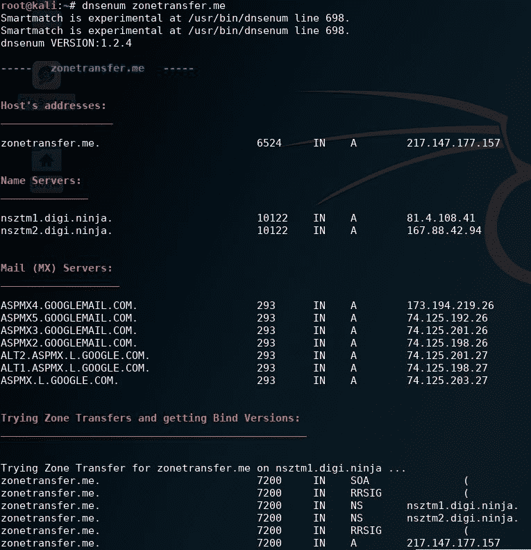

区域传输的结果如下：


# Fierce

Fierce 由`mschwager`提供，详见*Fierce: A DNS reconnaissance tool for locating non-contiguous IP space* ([`github.com/mschwager/fierce`](https://github.com/mschwager/fierce)), GitHub © 2018，如下所示：

Fierce 是一个半轻量级的扫描器，用于定位非连续的 IP 空间和指定域的主机名。

Fierce 使用区域传输、字典攻击和反向解析来收集主机名和子域名以及域的 IP 地址，并且它可以搜索相关名称（例如`domain company.com`、`corpcompany.com`或`webcompany.com`）。在下面的示例中，我们将使用搜索来识别`google.com`的主机名：

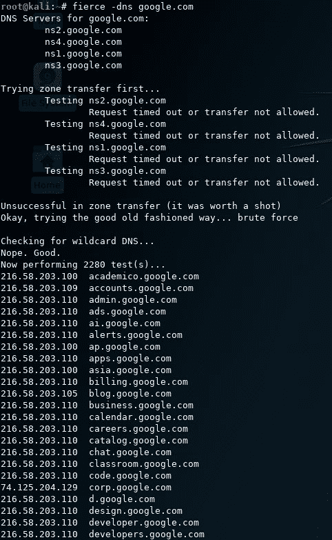

# DNSRecon

**DNSRecon**是 Kali Linux 中的另一个有用工具。它可以通过区域传输、字典请求和 Google 搜索等多种技术来收集 DNS 信息。在下面的屏幕截图中，我们将通过区域传输（`-a`）、通过 Whois 获取的 IP 地址空间的反向分析（`-w`）和 Google 搜索（`-g`）对`zonetransfer.me`进行枚举：

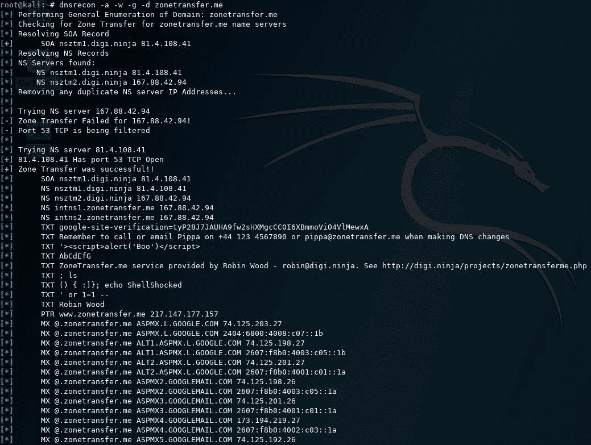

# 使用 Nmap 对 DNS 记录进行暴力破解

**Nmap**附带了一个脚本，使用暴力破解技术查询 DNS 服务器以获取其他主机。它使用了`vhosts-defaults.lst`和`vhosts-full.lst`字典文件，这些文件包含了多年来由 Nmap 开发团队收集的常见主机名的大量列表。这些文件可以在`/usr/share/nmap/nselib/data/`目录下找到。Nmap 向 DNS 服务器发送查询，检查该文件中的每个条目是否有可用于该主机名的 A 记录。

如下所示的屏幕截图显示，暴力破解脚本返回了一个积极的结果。它通过查询 A 记录来识别 DNS 区域中的一些主机：


# 使用搜索引擎和公共网站收集信息

现代搜索引擎是公共信息收集和被动侦察的宝贵资源。像 Google、Bing 和 DuckDuckGo 这样的综合搜索引擎允许我们使用高级搜索过滤器来查找特定域中的信息、特定文件类型、URL 中的内容和特定文本模式。还有一些专门的搜索引擎，比如 Shodan，可以让您在多种服务中搜索主机名、开放端口、服务器位置和特定的响应头。

# Google dorks

**Google dorks**技术，也称为*Google hacking*，起初是滥用 Google 的高级搜索选项，后来扩展到其他也包含类似选项的搜索引擎。它搜索特定的字符串和参数，以从组织或目标中获取有价值的信息。以下是一些对渗透测试人员有用的示例：

+   可以搜索特定站点或域中的 PDF 文档，如下所示：

```
      site:example.com filetype:pdf 
```

+   可以搜索特定域的电子邮件地址引用，但排除该域的网站：

```
      "@example.com" -site:example.com 
```

+   可以搜索标题或 URL 中包含`example.com`的管理站点：

```
      intitle:admin OR inurl:admin  site:example.com 
```

+   您还可以搜索特定的错误消息，指示可能存在 SQL 注入漏洞：

```
      "SQL Server Driver][SQL Server]Line 1: Incorrect syntax near"  
      site:example.com 
```

Google 和其他搜索引擎中有成千上万种可能的有用搜索组合。Kali Linux 的创建者 Offensive Security 还维护了一个公共数据库，其中包含可能为渗透测试人员提供有用结果的搜索字符串，该数据库位于：[`www.exploit-db.com/google-hacking-database/`](https://www.exploit-db.com/google-hacking-database/)。

# Shodan

**Shodan**（[`shodan.io`](https://shodan.io)）是一种不同类型的搜索引擎；它帮助您查找连接到互联网的设备，而不是网页中的内容。与 Google 一样，它具有运算符和特定的语法来执行高级和特定的搜索。这个屏幕截图显示了搜索与`google.com`相关的所有主机名：


使用 Shodan 进行主机名搜索的示例

要利用 Shodan 的高级搜索功能，首先需要创建一个帐户。免费帐户只能获得有限数量的结果，而且某些选项受限，但仍然非常有用。Shodan 可以用来查找以下内容：

+   可以通过以下方式找到属于某个域的互联网上公开的服务器：

```
      hostname:example.com 
```

+   可以通过指定`Server`参数来找到特定类型的设备，例如 CCTV 摄像头或工业控制系统（ICS）：

```
      Server: SQ-WEBCAM 
```

+   可以找到特定开放端口或服务，例如使用常见端口的 Web 服务器：

```
      port:80,443,8080 
```

+   可以通过以下方式找到特定网络范围内的主机：

```
      net:192.168.1.1/24 
```

有关 Shodan 搜索选项和运算符的有用参考资料可以在以下网址找到：[`pen-testing.sans.org/blog/2015/12/08/effective-shodan-searches`](https://pen-testing.sans.org/blog/2015/12/08/effective-shodan-searches)。

# theHarvester

**theHarvester**是 Kali Linux 中包含的命令行工具，它作为各种搜索引擎的包装器，用于从不同的公共来源（如搜索引擎和 PGP 密钥服务器）查找与域名相关的电子邮件账户、子域名、虚拟主机、开放端口/横幅和员工姓名。在最近的版本中，作者添加了进行 DNS 暴力破解、反向 IP 解析和**顶级域**（**TLD**）扩展的功能。

在以下示例中，使用`theharvester`收集有关`zonetransfer.me`的信息：


# Maltego

**Maltego**是广泛用于 OSINT 的专有软件。Kali Linux 包含了 Maltego 的社区版，完成在线注册后可以免费使用，但有一些限制。Maltego 对数据的各个部分（例如电子邮件地址和域名）执行*转换*以获取更多信息，并将所有结果显示为显示不同对象之间关系的图形。**转换**是对特定对象的公共信息搜索，例如搜索与域名相关的 IP 地址或与电子邮件地址或人名相关的社交媒体账户。以下截图显示了 Maltego 的主界面：

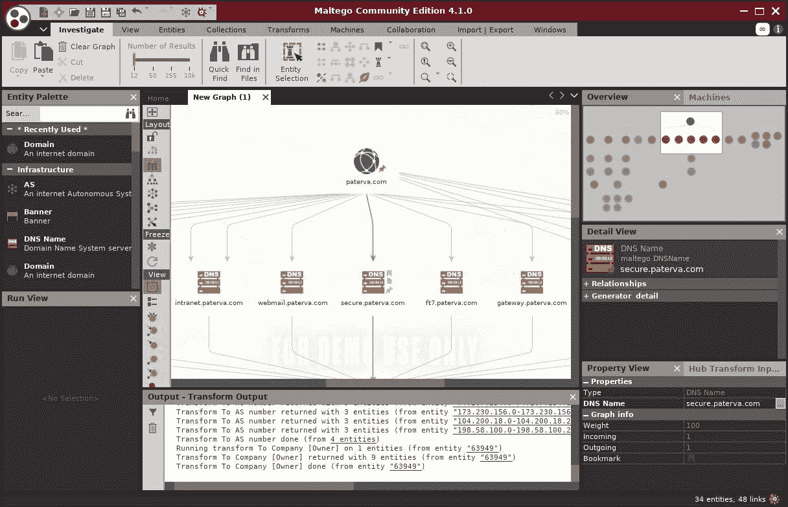

Maltego 界面

# Recon-ng - 信息收集的框架

OSINT 收集是一个耗时且需要手动操作的过程。与目标组织相关的信息可能分散在多个公共资源中，积累和提取与目标相关的信息是一项困难且耗时的任务。大多数组织的 IT 预算不允许在此类活动上花费太多时间。

**Recon-ng**是渗透测试人员一直需要的工具。它是一个功能强大的信息收集工具。Recon-ng 是一个非常交互式的工具，类似于 Metasploit 框架。该框架使用许多不同的来源来收集数据，例如 Google、Twitter 和 Shodan。一些模块在查询网站之前需要 API 密钥。可以通过完成搜索引擎网站上的注册来生成密钥。其中一些模块使用付费 API 密钥。

要在 Kali Linux 中启动 Recon-ng，请导航到应用程序菜单，点击信息收集子菜单，或在终端中运行`recon-ng`命令。您将在右侧窗格中看到 Recon-ng 的列表。与 Metasploit 类似，当框架启动并运行时，您可以输入`show modules`来查看随附的不同模块。一些模块是被动的，而其他模块则主动探测目标以提取所需的信息。

尽管 Recon-ng 有一些利用模块，但该工具的主要任务是协助侦察活动，并且其中有大量的模块可用于此目的：


Recon-ng 可以查询多个搜索引擎，其中一些通过 Web 请求查询；也就是说，该工具复制了普通用户在搜索框中输入文本并点击搜索按钮时所做的请求。另一个选项是使用引擎的 API。使用 API 时，搜索引擎可能需要 API 密钥来识别发送这些请求的人并应用配额。该工具比人类工作更快，并且通过分配 API 可以跟踪使用情况并防止滥用服务。因此，请确保不要过度使用搜索引擎，否则可能会拒绝您的查询。

所有主要搜索引擎都有一个注册用户持有 API 密钥的选项。例如，您可以在[`azure.microsoft.com/en-us/try/cognitive-services/?api=bing-web-search-api.`](https://datamarket.azure.com/dataset/bing/search)上为 Bing 生成 API 密钥。

此免费订阅每月提供 5000 个查询。生成密钥后，需要使用以下命令将其添加到 Recon-ng 工具的密钥表中：

```
keys add bing_api <api key generated>  
```

要显示在 Recon-ng 中存储的所有 API 密钥，请输入以下命令：

```
keys list  
```

# 使用 Recon-ng 进行域枚举

收集有关目标网站的子域的信息将帮助您识别网站的不同内容和功能。目标组织提供的每个产品或服务可能都有一个专用的子域。这有助于以一致的方式组织各种内容。通过识别不同的子域，您可以创建一个站点地图和流程图，将各个部分相互连接起来，更好地了解网站的流程。

# 子级和顶级域名枚举

使用 Bing Web 主机名枚举模块，我们将尝试在[`www.facebook.com/`](https://www.facebook.com/)网站上找到其他子域：

1.  首先需要使用`load recon/domains-hosts/bing_domain_web`命令加载模块。接下来，输入`show info`命令，显示描述该模块的信息。

1.  下一步是在`SOURCE`选项中设置目标域。我们将其设置为`facebook.com`，如截图所示：

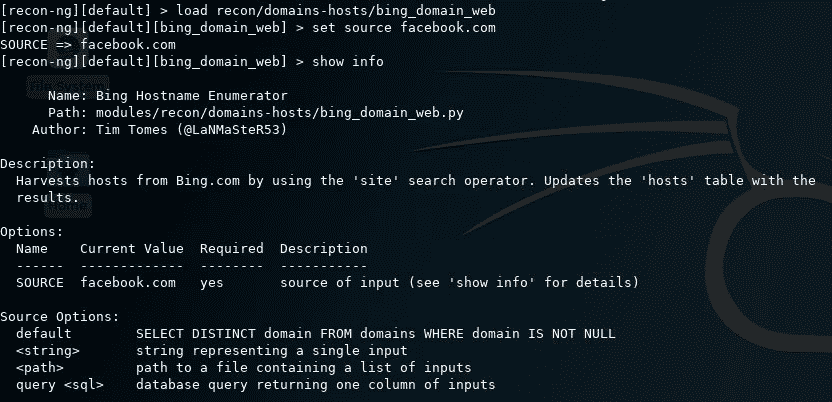

1.  准备好后，使用`run`命令启动模块。该工具首先查询几个域，然后使用（-）指令删除已查询的域。然后再次搜索其他域。这里的最大优势是速度。除了速度外，输出还以明文形式存储在数据库中。这可以用作其他工具（如 Nmap、Metasploit 和 Nessus）的输入。输出如下截图所示：


DNS 公共后缀暴力破解模块可用于识别顶级域名（TLD）和二级域名（SLD）。许多基于产品和服务的企业为每个地理区域都有单独的网站；您可以使用此暴力破解模块来识别它们。它使用来自`/usr/share/recon-ng/data/suffixes.txt`的字典文件来枚举附加域名。

# 报告模块

您运行的每个侦察模块都会将输出存储在单独的表中。您可以将这些表导出为多种格式，例如 CSV、HTML 和 XML 文件。要查看 Recon-ng 工具使用的不同表格，需要输入`show`并按两次*Tab*键列出自动完成功能的可用选项。

要将表导出为 CSV 文件，请通过输入`use reporting/csv`命令加载 CSV 报告模块。（`load`命令可以替代`use`命令，效果相同。）加载模块后，设置要导出的文件名和表，并输入`run`：


以下是 Recon-ng 中的一些其他侦察模块，对渗透测试人员非常有帮助：

+   Netcraft 主机名枚举器：Recon-ng 将收集 Netcraft 网站并累积与目标相关的所有主机，并将它们存储在主机表中。

+   SSL SAN 查找：许多启用 SSL 的网站使用**Subject Alternative Names**（SAN）功能在多个域上使用单个证书。该模块使用[`ssltools.com/`](http://ssltools.com/)网站来检索证书的 SAN 属性中列出的域。

+   LinkedIn 身份验证联系人枚举器：将从 LinkedIn 个人资料中检索联系人并将其存储在联系人表中。

+   IPInfoDB GeoIP：使用 IPInfoDB 数据库显示主机的地理位置（需要 API）。

+   **Yahoo!主机名枚举器**：这使用 Yahoo!搜索引擎来定位域中的主机。拥有多个搜索引擎的模块可以帮助您定位其他搜索引擎未索引的主机和子域。

+   **地理编码器和反向地理编码器**：这些模块使用提供的坐标使用 Google Map API 获取地址，并且如果提供了地址，则还会检索坐标。然后将信息存储在位置表中。

+   **推销模块**：使用 Recon-ng 推销模块，您可以从流行的社交网络网站中提取数据，将其与地理位置坐标相关联，并创建地图。两个广泛使用的模块如下：

+   **Twitter 地理位置搜索**：这在 Twitter 上搜索从给定坐标的特定半径内上传的媒体（图片和推文）

+   **Flickr 地理位置搜索**：这试图找到从给定坐标附近上传的照片

这些推销模块可用于将人员映射到物理位置，并确定在特定时间给定坐标处的人员。通过 Recon-ng，您可以仅使用公开可用的资源创建一个庞大的主机、IP 地址、物理位置和人员数据库。

侦察应始终以从各种公共资源中提取信息并识别攻击者可以直接或间接利用的敏感数据为目标进行。 

# 扫描-探测目标

渗透测试需要在有限的时间内进行，侦察阶段是最少时间的阶段。在真实的渗透测试中，您将在侦察阶段收集的信息与客户共享，并尝试就应包含在扫描阶段中的目标达成共识。

在这个阶段，客户还可以向您提供在侦察阶段未识别的其他目标和域，但它们将包含在实际的测试和利用阶段中。这样做是为了通过包括黑帽和白帽黑客的方法来获得测试的最大效益，您将测试开始时像恶意攻击者一样进行测试，并随着测试的进行，提供额外的信息，从而得到目标的准确视图。

确定托管网站的目标服务器后，下一步是收集其他信息，如操作系统和该特定服务器上可用的服务。除了托管网站外，一些组织还启用 FTP 服务，并根据需要打开其他端口。作为第一步，您需要确定除端口`80`和端口`443`之外的 Web 服务器上打开的其他端口。

扫描阶段包括以下几个阶段：

+   端口扫描

+   操作系统指纹识别

+   Web 服务器版本识别

+   基础设施分析

+   应用程序识别

# 使用 Nmap 进行端口扫描

**网络映射器**，通常称为 Nmap，是最广为人知的端口扫描器。它以极高的成功率找到 TCP 和 UDP 开放端口，并且是渗透测试人员工具包中的重要组成部分。Kali Linux 预装了 Nmap。Nmap 定期更新，并由一群积极贡献于这个开源工具的开发人员维护。

默认情况下，Nmap 不会向所有端口发送探测。 Nmap 仅检查在`nmap-services`文件中指定的前 1000 个常用端口。每个端口条目都有一个相应的数字，表示该端口开放的可能性。这大大提高了扫描的速度，因为扫描中省略了不太重要的端口。根据目标的响应，Nmap 确定端口是开放的、关闭的还是被过滤的。

# 端口扫描的不同选项

运行 Nmap 端口扫描的直接方法称为**TCP 连接扫描**。此选项用于扫描打开的 TCP 端口，并使用`-sT`选项调用。连接扫描执行完整的三次 TCP 握手（SYN-SYN / ACK-ACK）。它提供了更准确的端口状态，但更有可能在目标机器上被记录，并且比替代的 SYN 扫描更慢。使用`-sS`选项的 SYN 扫描不会与目标完成握手，因此不会在目标机器上记录。但是，SYN 扫描生成的数据包可能会引起防火墙和 IPS 设备的警报，并且有时会被这些设备默认阻止。

当使用`-F`标志调用 Nmap 时，将扫描前 100 个端口而不是前 1000 个端口。此外，它还提供了使用`--top-ports [N]`标志自定义扫描的选项，以从`nmap-services`文件中扫描`N`个最流行的端口。许多组织可能有应用程序将侦听不在`nmap-services`文件中的端口。对于这种情况，可以使用`-p`标志为 Nmap 定义要扫描的端口、端口列表或端口范围。

有 65535 个 TCP 和 UDP 端口，以及可以使用任何端口的应用程序。如果您愿意，可以使用`-p 1-65535`或`-p-`选项测试所有端口。

以下屏幕截图显示了前面命令的输出：


在渗透测试中，非常重要的是保存结果并保留运行的所有工具的日志。您应该保存笔记和记录以更好地组织项目，并将日志保存为预防措施，以防目标出现问题。然后，您可以返回到日志中检索可能对重新建立服务或识别故障源至关重要的信息。 Nmap 具有各种`-o`选项，可将其结果保存为不同的文件格式：`-oX`用于 XML 格式，`-oN`用于 Nmap 输出格式，`-oG`用于可搜索的文本，`-oA`用于全部。

# 使用 Nmap 绕过防火墙和 IPS

除了用于 TCP 的不同扫描之外，Nmap 还提供了各种选项，可在从组织网络外部扫描目标时帮助规避防火墙。以下是这些选项的描述：

+   **ACK 扫描**：此选项用于规避某些路由器上的规则，这些规则仅允许来自内部网络的 SYN 数据包，从而阻止默认的连接扫描。这些路由器只允许内部客户端通过路由器建立连接，并阻止所有源自外部网络且带有 SYN 位设置的数据包。当使用`-sA`标志调用 ACK 扫描选项时，Nmap 生成仅带有 ACK 位设置的数据包，欺骗路由器认为该数据包是对内部客户端建立的连接的响应，并允许数据包通过。 ACK 扫描选项无法可靠地确定目标系统的端口是打开还是关闭，因为不同的系统以不同的方式响应未经请求的 ACK。但是，它可以用于识别路由器后面的在线系统。

+   **防火墙规则中的硬编码源端口**：许多防火墙管理员使用规则配置防火墙，允许来自外部网络的入站流量，源自特定源端口（如`53`，`25`和`80`）。默认情况下，Nmap 会随机选择源端口，但可以配置为使用特定源端口以规避此规则，使用`--source-port`选项。

+   **自定义数据包大小**：Nmap 和其他端口扫描器以特定大小发送数据包，而防火墙现在已经定义了规则以丢弃此类数据包。为了规避此检测，可以使用`--data-length`选项配置 Nmap 以使用不同大小的数据包发送。

+   **自定义 MTU**：Nmap 还可以配置为发送较小 MTU 的数据包。扫描将使用`--mtu`选项和 MTU 的值进行。这可以用于规避一些较旧的防火墙和入侵检测设备。新的防火墙在将流量发送到目标机器之前重新组装流量，因此很难规避它们。MTU 需要是 8 的倍数。以太网局域网的默认 MTU 为 1,500 字节。

+   **分段数据包**：绕过 IDS 和 IPS 系统的常见而有效的方法是分段数据包，以便在被这些防御机制分析时，它们不匹配恶意模式。Nmap 可以使用`-f`选项来执行此操作，当执行完整的 TCP 扫描（`-sT`）时。

+   **MAC 地址欺骗**：如果目标环境中配置了仅允许来自特定 MAC 地址的网络数据包的规则，您可以配置 Nmap 设置特定的 MAC 地址来进行端口扫描。端口扫描数据包也可以使用`--spoof-mac`选项配置特定的 MAC 地址。

# 识别操作系统

在识别 Web 服务器上的开放端口后，您需要确定底层操作系统。Nmap 提供了几个选项来实现这一点。使用`-O`选项执行操作系统扫描；您可以添加`-v`以获取详细输出，以了解确定操作系统所进行的底层测试：


一位熟练的黑客不依赖于单一工具的结果。因此，Kali Linux 配备了多个指纹识别工具；除了使用 Nmap 运行版本扫描外，您还可以使用 Amap 等工具来获取第二个意见。

# 对服务器进行分析

确定了底层操作系统和开放端口后，您需要识别在开放端口上运行的确切应用程序。在扫描 Web 服务器时，您需要分析在操作系统之上运行的 Web 服务的类型和版本。Web 服务器基本上处理应用程序的 HTTP 请求并将其分发到 Web；Apache、IIS 和 nginx 是最常用的 Web 服务器。除了版本之外，您还需要在进行利用阶段之前识别 Web 服务器上启用的任何其他软件、功能和配置。

Web 应用程序开发严重依赖于诸如 PHP 和.NET 之类的框架，每个 Web 应用程序将根据用于设计它的框架而需要不同的技术。

除了对 Web 服务器进行版本扫描外，您还需要识别支持 Web 应用程序的其他组件，例如数据库应用程序、加密算法和负载均衡器。

同一台物理服务器上通常部署有多个网站。您只需要攻击渗透测试项目范围内的网站，并且需要对虚拟主机有适当的理解才能做到这一点。

# 识别虚拟主机

许多组织的网站是由使用共享资源的服务提供商托管的。共享 IP 地址是他们使用的最有用和经济有效的技术之一。当您对特定 IP 地址进行反向 DNS 查询时，通常会返回多个域名。这些网站使用基于名称的虚拟主机，它们通过主机头值与在同一 IP 地址上托管的其他网站进行唯一标识和区分。

这类似于多路复用系统。当服务器接收到请求时，通过查阅请求头中的`Host`字段来识别和路由请求到特定的主机。这在第一章中讨论过，即*渗透测试和 Web 应用程序简介*。

在与网站交互和构建攻击时，识别托管类型非常重要。如果 IP 地址托管多个网站，则必须在攻击中包含正确的主机头值，否则将无法获得所需的结果。这也可能影响托管在该 IP 地址上的其他网站。直接使用 IP 地址进行攻击可能会产生不良结果，并且可能会击中超出范围的元素。如果这些元素不属于客户组织，则可能会产生法律影响。

# 使用搜索引擎查找虚拟主机

您可以通过分析 DNS 记录来确定一个 IP 地址上是否托管了多个网站。如果多个名称指向同一个 IP 地址，则主机头值用于唯一标识网站。可以使用`dig`和`nslookup`等 DNS 工具来识别返回相似 IP 地址的域名。

您可以使用[`ipneighbour.com/`](http://ipneighbour.com/)网站来确定其他网站是否托管在给定的 Web 服务器上。以下示例显示了几个与维基百科相关的网站托管在同一个 IP 地址上：


# 识别负载均衡器

高需求的网站和应用程序使用某种形式的负载平衡来分发服务器负载并保持高可用性。网站的互动性使得用户在整个会话期间访问同一台服务器对于最佳用户体验至关重要。例如，在电子商务网站上，一旦用户将商品添加到购物车中，预期用户将在结账页面再次连接到同一台服务器以完成交易。引入中间件，如负载均衡器，使得负载均衡器将用户的后续请求发送到同一台服务器变得非常重要。

有几种技术可以用来在服务器之间平衡用户连接。DNS 是最容易配置的，但它不可靠，并且不能提供真正的负载平衡体验。硬件负载均衡器是今天用来将流量路由到维护多个 Web 服务器的网站的工具。

在渗透测试中，有必要识别使用的负载均衡技术，以便全面了解网络基础设施。一旦识别出来，现在必须测试负载均衡器后面的每个服务器的漏洞。还需要与客户团队合作，因为不同的硬件负载均衡器供应商使用不同的技术来维护会话亲和性。

# 基于 cookie 的负载均衡器

硬件负载均衡器常用的一种方法是在终端客户端的浏览器中插入一个 cookie，将用户与特定服务器绑定。这个 cookie 是在 IP 地址之外设置的，因为许多用户将位于代理或 NAT 配置后面，并且其中大多数将使用相同的源 IP 地址。

每个负载均衡器都有自己的 cookie 格式和名称。这些信息可以用来确定是否正在使用负载均衡器以及其提供者是谁。负载均衡器设置的 cookie 还可以揭示与目标相关的敏感信息，这对渗透测试人员可能有用。

可以配置 Burp Proxy 来拦截连接，并通过分析头部查找 cookie。如下图所示，目标正在使用 F5 负载均衡器。长数字值实际上是包含池名称、Web 服务器 IP 地址和端口的编码值。因此，在这里，负载均衡器 cookie 揭示了不应该揭示的关键服务器详细信息。可以配置负载均衡器以设置不揭示此类详细信息的自定义 cookie：


F5 负载均衡器的默认 cookie 格式如下：

```
BIGipServer<pool name> =<coded server IP>.<coded server port>.0000 
```

# 其他识别负载均衡器的方法

识别负载均衡器的其他方法如下：

+   **分析服务器之间的 SSL 差异**：不同的 Web 服务器之间的 SSL 配置可能会有细微的变化。发给池中 Web 服务器的证书的时间戳可能会有所不同。可以利用 SSL 配置的差异来确定负载均衡器后面是否配置了多个服务器。

+   **重定向到不同的 URL**：另一种将请求在服务器之间进行负载均衡的方法是通过将客户端重定向到不同的 URL 来分发负载。用户可能浏览到一个网站`www.example.com`，但被重定向到`www2.example.com`。另一个用户的请求被重定向到`www1.example.com`，然后传递一个来自不同服务器的网页。这是识别负载均衡器最简单的方法之一，但由于管理开销和安全问题，它并不经常被实现。

+   **负载均衡器的 DNS 记录**：DNS 区域中的主机记录可用于判断设备是否为负载均衡器。

+   **负载均衡器检测器**：这是 Kali Linux 中包含的一个工具。它用于确定网站是否使用负载均衡器。从 shell 执行该工具的命令是`lbd <网站名称>`。该工具附带了一个免责声明，说明它是一个概念验证工具，可能会产生误报。

+   **Web 应用程序防火墙（WAF）**：除了负载均衡器外，应用程序还可能使用 WAF 来防御攻击。Kali Linux 中的 WAFW00F Web 应用程序防火墙检测工具能够检测路径中是否存在任何 WAF 设备。可以通过导航到信息收集| IDS / IPS 识别来访问该工具。

# 应用程序版本指纹识别

在端口`25`和端口`80`等众所周知的端口上运行的服务可以很容易地识别，因为它们被广泛知名的应用程序（如邮件服务器和 Web 服务器）使用。**互联网分配号码管理局**（**IANA**）负责维护端口号的官方分配，并且可以从每个操作系统中的端口映射文件中识别映射。然而，许多组织在更适合其基础设施的端口上运行应用程序。您经常会看到一个内部网站在端口`8080`上运行，而不是端口`80`，或者在端口`8443`上运行，而不是端口`443`。

端口映射文件只是一个占位符，应用程序可以在任何开放的端口上运行，由开发人员设计，违背了 IANA 设定的映射。这正是为什么您需要进行版本扫描，以确定 Web 服务器是否确实在端口`80`上运行，并进一步分析该服务的版本。

# Nmap 版本扫描

Nmap 有几个选项可用于执行版本扫描；版本扫描可以与操作系统扫描结合使用，也可以单独运行。Nmap 通过发送各种数据包来探测目标，然后分析响应以确定确切的服务及其版本。

要仅进行版本扫描，请使用`-sV`选项。操作系统扫描和版本扫描可以使用`-A`（侵略性）选项结合在一起，该选项还包括路由跟踪和执行一些脚本。如果没有定义端口以及扫描选项，Nmap 将首先使用默认的前 1000 个端口列表对目标进行端口扫描，并从中识别开放的端口。

接下来，它将向开放的端口发送探测，并分析响应以确定在该特定端口上运行的应用程序。接收到的响应与`nmap-service-probes`文件中的大型签名数据库进行匹配。它类似于 IPS 签名的工作原理，其中网络数据包与包含恶意数据包签名的数据库进行匹配。版本扫描选项的好坏取决于该文件中签名的质量。

以下截图显示了前面命令的输出：

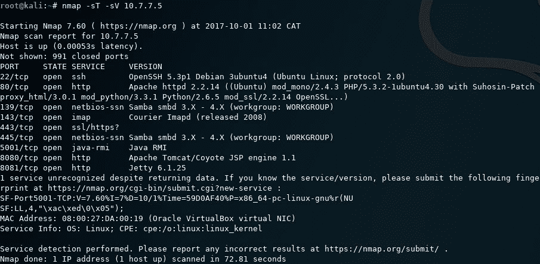

您可以向 Nmap 项目报告不正确的结果和未知端口的新签名。这有助于提高未来版本中签名的质量。

# Amap 版本扫描

Kali Linux 还附带了一个名为 Amap 的工具，它由**The Hacker's Choice**（THC）组创建，类似于 Nmap。它通过发送一些数据包来探测开放的端口，然后分析响应以确定在该端口上监听的服务。

将要发送到目标端口的探针定义在名为`appdefs.trig`的文件中，并且接收到的响应会与`appdefs.resp`文件中的签名进行分析。

在渗透测试期间，使用多个工具探测端口是很重要的，以排除任何错误的阳性或阴性。仅依赖一个工具的签名可能在测试期间证明是致命的，因为您未来的攻击将取决于在此阶段识别的服务及其版本。

您可以使用`-bqv`选项调用 Amap，它只会报告打开的端口并打印收到的 ASCII 响应以及与之相关的一些详细信息：


# 指纹识别 Web 应用程序框架

了解用于开发网站的框架可以帮助您识别未修补版本中可能存在的漏洞。

例如，如果网站是在 WordPress 平台上开发的，可以在该网站的网页中找到其痕迹。大多数 Web 应用程序框架都有可以被攻击者用来确定所使用框架的标记。

有几个地方可以揭示有关框架的详细信息。

# HTTP 标头

除了定义 HTTP 事务的操作参数之外，标头还可以包含对攻击者有用的其他信息。

在下面的示例中，使用 Firefox 的开发工具（*F12*键），您可以从`Server`字段中确定正在使用 Apache Web 服务器。此外，使用`X-AspNet-Version`，您可以确定 ASP.NET 版本 2 是开发框架。这种方法并不总是有效，因为标头字段可以通过服务器端的适当配置禁用：


应用程序框架还会创建新的 Cookie 值，这些值可以帮助您了解所使用的底层框架，因此也要注意 Cookie。

HTML 页面源代码中的注释也可以指示用于开发 Web 应用程序的框架。页面源中的信息还可以帮助您识别使用的其他 Web 技术。

# WhatWeb 扫描器

WhatWeb 工具用于识别网站使用的不同 Web 技术。它包含在 Kali Linux 中，并且可以通过转到应用程序 | 03 - Web 应用程序分析 | Web 漏洞扫描器来访问。它可以识别不同的内容管理系统、统计/分析包和用于设计 Web 应用程序的 JavaScript 库。该工具声称拥有超过 900 个插件。它可以以不同的侵略性级别运行，以平衡速度和可靠性。该工具可以在单个网页上获取足够的信息来识别网站，也可以递归查询网站以识别使用的技术。

在下一个示例中，我们将使用该工具针对 OWASP BWA 虚拟机，并启用`-v`详细选项。这将打印出与识别的技术相关的一些有用信息：

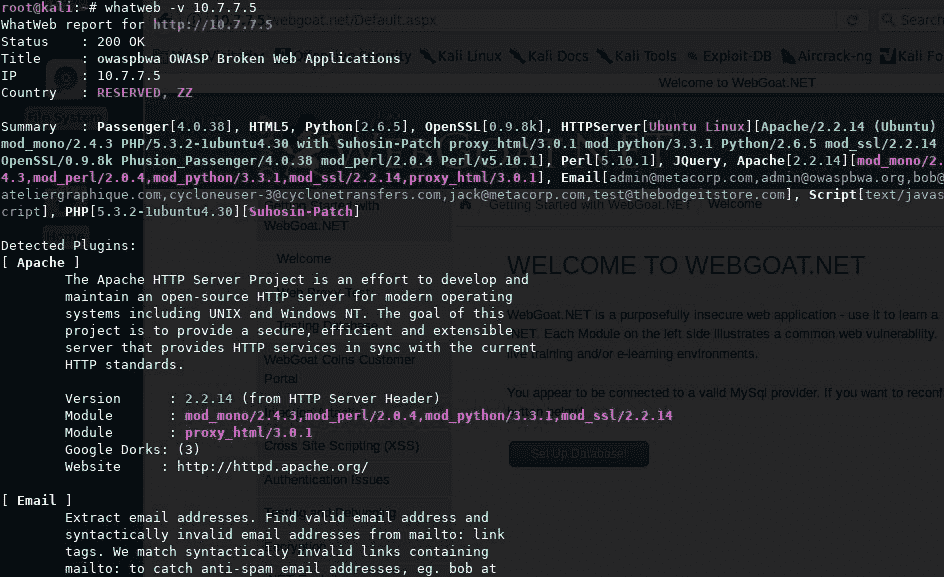

# 扫描 Web 服务器以查找漏洞和配置错误

到目前为止，我们已经处理了目标的基础设施部分。现在我们需要分析底层软件并尝试了解隐藏在背后的不同技术。使用默认配置设计的 Web 应用程序容易受到攻击，因为它们为恶意攻击者提供了多个入口来利用应用程序。

Kali Linux 提供了几个工具来分析 Web 应用程序的配置问题。扫描工具通过浏览整个网站并寻找有趣的文件、文件夹和配置设置来识别漏洞。未正确实施和发现运行在旧版本上的服务器端脚本语言，如 PHP 和 CGI，可以使用自动化工具进行利用。

# 使用 Nmap 识别 HTTP 方法

在 Web 渗透测试期间，对 Web 服务器的第一个直接请求应该是识别 Web 服务器支持的方法。您可以使用 Netcat 打开到 Web 服务器的连接，并使用`OPTIONS`方法查询 Web 服务器。您还可以使用 Nmap 确定支持的方法。

在不断增长的 Nmap 脚本库中，您可以找到一个名为`http-methods.nse`的脚本。当您使用`--script`选项和目标运行该脚本时，它将列出目标上允许的 HTTP 方法，并指出危险的方法。在下面的截图中，您可以看到它检测到了几种启用的方法，并指出`TRACE`作为一种风险方法：


# 使用 Metasploit 中的辅助模块测试 Web 服务器

以下模块对于渗透测试人员测试 Web 服务器的漏洞非常有用：

+   `dir_listing`: 这个模块将连接到目标 Web 服务器，并确定是否在其上启用了目录浏览。

+   `dir_scanner`: 使用这个模块，你可以扫描目标网站以查找任何有趣的网页目录。你可以提供一个自定义创建的字典给模块，或者使用默认的字典。

+   `enum_wayback`: 这是一个有趣的模块，它查询 Internet Archive 网站，并查找目标域中的网页。可能已经取消链接的旧网页仍然可以访问，并且可以使用 Internet Archive 网站找到它们。您还可以识别网站在多年间经历的变化。

+   `files_dir`: 这个模块可以用来扫描服务器以查找数据泄漏漏洞，通过定位配置文件和源代码文件的备份。

+   `http_login`: 如果网页有一个在 HTTP 上工作的登录页面，您可以尝试使用 Metasploit 字典对其进行暴力破解。

+   `robots_txt`: 机器人文件可能包含一些未被探索的 URL，您可以使用这个模块查询它们，以找到未被搜索引擎索引的 URL。

+   `webdav_scanner`: 这个模块可以用来查找服务器上是否启用了 WebDAV，这基本上将 Web 服务器变成了文件服务器。

# 识别 HTTPS 配置和问题

任何管理任何敏感或个人可识别信息（姓名、电话号码、地址、健康、信用或税务记录、信用卡和银行账户信息等）的网站或 Web 应用程序都需要实施一种机制来保护信息在客户端和服务器之间的传输过程中的安全。

HTTP 最初是作为明文协议诞生的。因此，它不包含保护客户端和服务器之间交换的信息免受第三方查看和/或修改的机制。为了解决这个问题，客户端和服务器之间创建了一个加密通信通道，并通过该通道发送 HTTP 数据包。HTTPS 是在安全通信通道上实现的 HTTP 协议。它最初是在**安全套接字层**（**SSL**）上实现的。SSL 在 2014 年被弃用，并被**传输层安全性**（**TLS**）取代，尽管仍有许多网站支持 SSLv3，无论是由于配置错误还是为了向后兼容。

支持旧的加密算法有一个主要的缺点。大多数旧的密码套件被密码分析师发现在合理的时间内使用当今可用的计算能力很容易被破解。

一个专门的攻击者可以从云服务提供商那里租用廉价的计算能力，并使用它来破解旧的密码套件并获取明文信息的访问权限。因此，使用旧的密码套件会提供一种虚假的安全感，应该禁用。客户端和服务器只应允许协商一种被认为是安全的、在实践中非常难以破解的密码套件。

Kali Linux 包含一些工具，允许渗透测试人员识别 SSL/TLS 实现中的配置错误。在本节中，我们将回顾最受欢迎的工具。

# OpenSSL 客户端

**OpenSSL**包含在几乎所有 GNU/Linux 发行版中，它是基本的 SSL/TLS 客户端，并包含了一些功能，可以帮助您对 HTTPS 服务器进行一些基本测试。

一个基本的测试是与服务器建立连接。在这个例子中，我们将连接到一个在端口`443`上的测试服务器（默认的 HTTPS 端口）：

```
openssl s_client -connect 10.7.7.5:443
```

您可以在以下截图中看到有关连接参数和证书交换的详细信息。值得注意的是，连接使用了 SSLv3，这本身就是一个安全问题，因为 SSL 已被弃用，并且已知存在漏洞，可能导致信息的完全解密，例如**Padding Oracle On Downgraded Legacy Encryption**（**POODLE**），我们将在后面的章节中讨论：

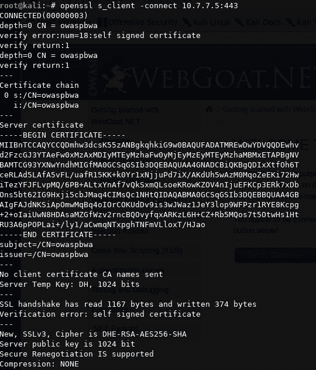

您经常会看到密码套件被写成 ECDHE-RSA-RC4-MD5 的格式。该格式分解为以下几个部分：

+   **ECDHE**：这是一种密钥交换算法

+   **RSA**：这是一种身份验证算法

+   **RC4**：这是一种加密算法

+   **MD5**：这是一种哈希算法

可以在以下网址找到 SSL 和 TLS 密码套件的综合列表：[`www.openssl.org/docs/apps/ciphers.html`](https://www.openssl.org/docs/apps/ciphers.html)。

您可以使用 OpenSSL 的一些其他选项来更好地测试您的目标，如下所示：

+   **禁用或使用特定协议**：使用`-no_ssl3`、`-no_tls1`、`-no_tls1_1`和`-no_tls1_2`选项，您可以禁用对应协议的使用，并测试您的目标接受哪些协议

+   **测试一个特定的协议**：`-tls1`、`-tls1_1`和`-tls1_2`选项仅测试指定的协议

现在，接受 SSL 和 TLS 1.0 被认为是不安全的。在某些应用中，TLS 1.1 可能是可以接受的，但 TLS 1.2 是推荐的选项。

# 使用 SSLScan 扫描 TLS/SSL 配置

**SSLScan**是一个命令行工具，可以对指定目标执行各种测试，并返回 SSL/TLS 服务器接受的协议和密码套件的综合列表，以及一些在安全测试中有用的其他信息：

```
sslscan 10.7.7.5  
```

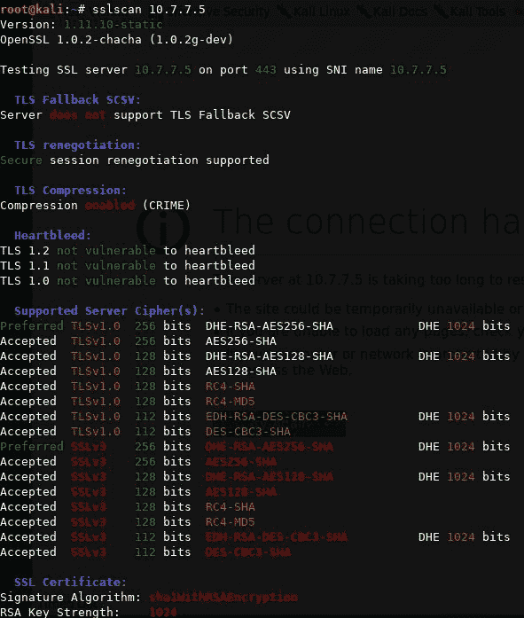

您可以使用 SSLScan 的颜色代码来快速了解显示结果的安全严重性。红色（允许 SSLv3 并使用 DES 和 RC4 密码套件）表示不安全的配置，而绿色或白色表示推荐的配置。

命令的输出可以使用`--xml=<filename>`选项导出为 XML 文档。

# 使用 SSLyze 扫描 TLS/SSL 配置

**SSLyze**是一个 Python 工具，可以通过与之类似的方式连接到服务器来分析服务器的 SSL/TLS 配置。它可以同时扫描多个主机，并且还可以测试性能并使用客户端证书进行双向认证。以下命令在您的测试机上运行常规的 HTTPS 扫描（包括 SSL 版本 2、SSL 版本 3 和 TLS 1.0、TLS 1.1 和 TLS 1.2 检查、有关证书的基本信息以及对压缩、重新协商和 Heartbleed 的测试）：

```
sslyze --regular 10.7.7.5  
```

您可以在以下截图中看到结果：

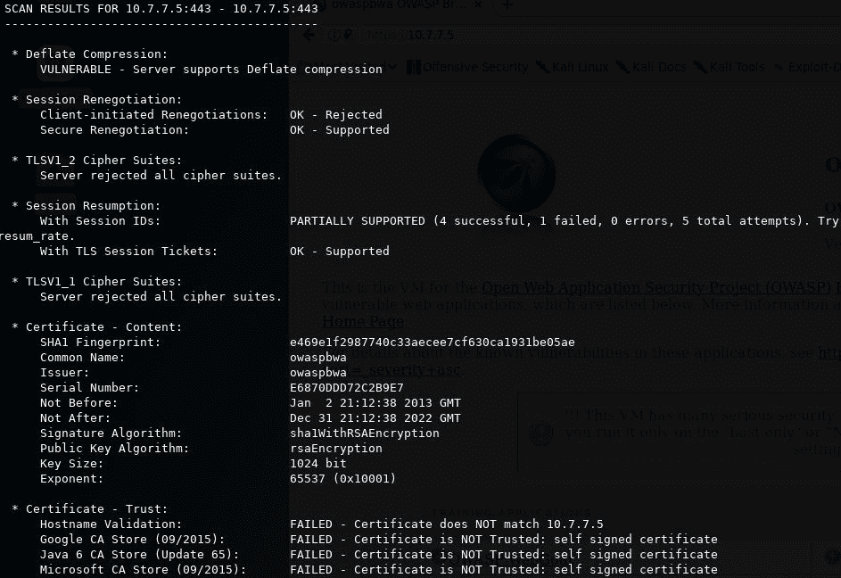

# 使用 Nmap 测试 TLS/SSL 配置

Nmap 包含一个名为`ssl-enum-ciphers`的脚本，可以识别服务器支持的密码套件，并根据加密强度对其进行评级。它使用 SSLv3、TLS 1.1 和 TLS 1.2 进行多次连接。该脚本还会突出显示 SSL 实现是否容易受到之前发布的漏洞的影响，例如 CRIME 和 POODLE：

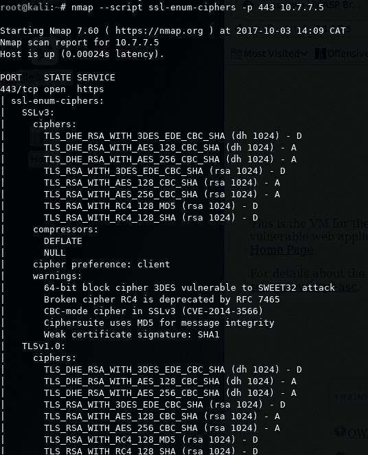

# 爬取 Web 应用程序

在测试大型真实应用程序时，您需要采用更详尽的方法。作为第一步，您需要确定应用程序的大小，因为有几个决策取决于它。您所需的资源数量、工作量估计和评估成本取决于应用程序的大小。

Web 应用程序由多个相互链接的网页组成。在开始评估应用程序之前，您需要对其进行映射以确定其大小。您可以手动浏览应用程序，点击每个链接并查看内容，就像普通用户一样。在手动爬取应用程序时，您的目标应该是尽可能多地识别 Web 页面-从认证和非认证用户的角度来看。

手动爬取应用程序既耗时又容易遗漏。Kali Linux 有许多工具可用于自动化此任务。Burp Suite 中的 Burp Spider 工具以爬取 Web 应用程序而闻名。它自动化了目录中各个 Web 页面的繁琐任务。它通过请求一个 Web 页面，解析其中的链接，然后向这些新链接发送请求，直到映射所有的 Web 页面。通过这种方式，可以映射整个应用程序，而不会忽略任何 Web 页面。

注意：

由于爬虫是一个自动化的过程，因此需要了解应用程序的过程和工作方式，以避免爬虫执行敏感请求，例如密码重置、表单提交和信息删除。

# Burp Spider

Burp Spider 使用被动和主动方法来映射应用程序。

当您启动 Burp Proxy 时，默认情况下它以被动爬虫模式运行。在此模式下，当浏览器配置为使用 Burp Proxy 时，它会通过代理更新站点地图，而无需发送任何进一步的请求。被动爬虫被认为是安全的，因为您可以直接控制爬取的内容。这在包含管理功能的关键应用程序中非常重要，您不希望触发这些功能。

为了有效地进行映射，应该将被动爬虫模式与主动模式一起使用。最初，允许 Burp Spider 在您浏览应用程序时被动地进行映射，当您找到需要进一步映射的感兴趣的网页时，可以触发主动爬虫模式。在主动模式下，Burp Spider 将递归请求网页，直到映射所有 URL。

以下截图显示了被动爬虫的输出，当单击应用程序中的各个链接时。在被动映射应用程序之前，请确保将 Burp 设置为 Web 浏览器中的代理，并关闭拦截：

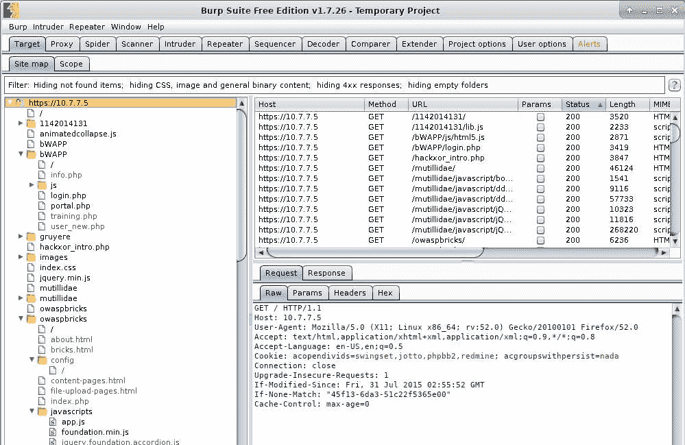

当您想要主动爬取一个网页时，在站点地图部分右键单击链接，然后单击 Spider this branch。一旦这样做，主动爬虫模式就会启动。在 Spider 部分，您将看到已经发出的请求，并且站点地图部分将填充新项目，如下图所示：


当活动爬虫正在运行时，它将显示所发出的请求数量和其他一些细节。在 Spider Scope 部分，您可以使用正则表达式字符串创建规则来定义目标：


# 应用程序登录

一个应用程序在允许您查看内容之前可能需要进行身份验证。Burp Spider 可以配置为在爬行应用程序时使用重新配置的凭据进行身份验证。在 Spider 部分的 Options 选项卡中，您可以定义凭据或选择 Prompt for guidance 选项。当您选择 Prompt for guidance 选项时，它将显示一个提示，您可以在其中输入用户名和密码，如果爬虫遇到登录页面，如下所示：

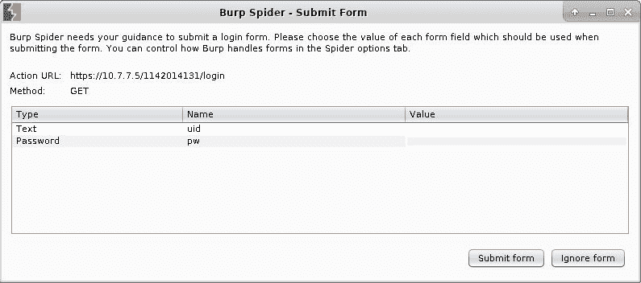

# 目录暴力破解

也被称为*强制浏览*，**目录暴力破解**是请求应用程序或服务器页面中没有直接链接的文件和服务器目录的过程。通常通过从常见名称列表中获取目录和文件名来完成。Kali Linux 包含一些工具来完成这个任务。我们在这里将探讨其中的两个。

# DIRB

**DIRB**可以递归扫描目录，并在 Web 服务器中查找具有不同扩展名的文件。当不是标准的 404 错误时，它可以自动检测到*Not Found*代码。然后，它可以将结果导出到文本文件中，在服务器需要有效会话时使用会话 cookie，并进行基本的 HTTP 身份验证和上游代理等其他功能。下图显示了基本的 DIRB 用法，使用默认字典并将输出保存到文本文件中：


# ZAP 的强制浏览

DirBuster 是由 OWASP 维护的目录暴力破解工具，现已集成到 OWASP ZAP 中作为强制浏览功能。要使用它，您启动 OWASP-ZAP（在 Kali 的菜单中，转到 03 - Web Application Analysis | owasp-zap）并配置浏览器使用它作为代理；与 Burp 一样进行被动爬虫，ZAP 会注册您浏览的所有 URL 和它们从服务器请求的资源。因此，您浏览到目标并且检测到的文件和目录会记录在 ZAP 中。接下来，右键单击要进行强制浏览的目录，然后转到 Attack | Forced Browse site / Forced Browse directory / Forced Browse directory (and children)。站点、目录或目录和子目录之间的选择取决于您要扫描的内容-站点表示从服务器的根目录开始扫描，目录表示仅选择的目录，目录和子目录表示递归选择的目录：


之后，选择名称列表文件（字典）并点击开始按钮。现有的目录和文件可能会显示在同一个选项卡中：


# 总结

通过这个，我们来到了本章的结束。我们通过侦察阶段并通过扫描 Web 服务器完成了工作。在下图中，您可以查看渗透测试的侦察阶段涉及的任务以及 Kali Linux 中可用于每个任务的一些有用工具：


侦察是渗透测试的第一阶段。当测试一个可以从互联网访问的目标时，搜索引擎和社交网络网站可以揭示有用的信息。搜索引擎存储了大量的信息，在执行黑盒渗透测试时非常有帮助。我们使用这些免费资源来识别恶意用户可能用来攻击目标的信息。Kali Linux 有几个工具可以帮助您实现目标，在本章中我们使用了其中的一些工具。

最后，我们进入了扫描阶段，这要求黑客积极与 Web 应用程序进行交互，以识别漏洞和配置错误。

在下一章中，我们将研究影响 Web 应用程序的服务器端和客户端漏洞。
