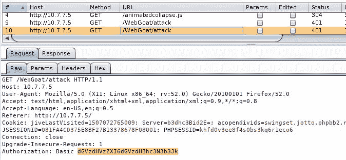
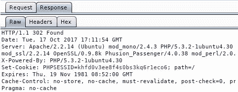
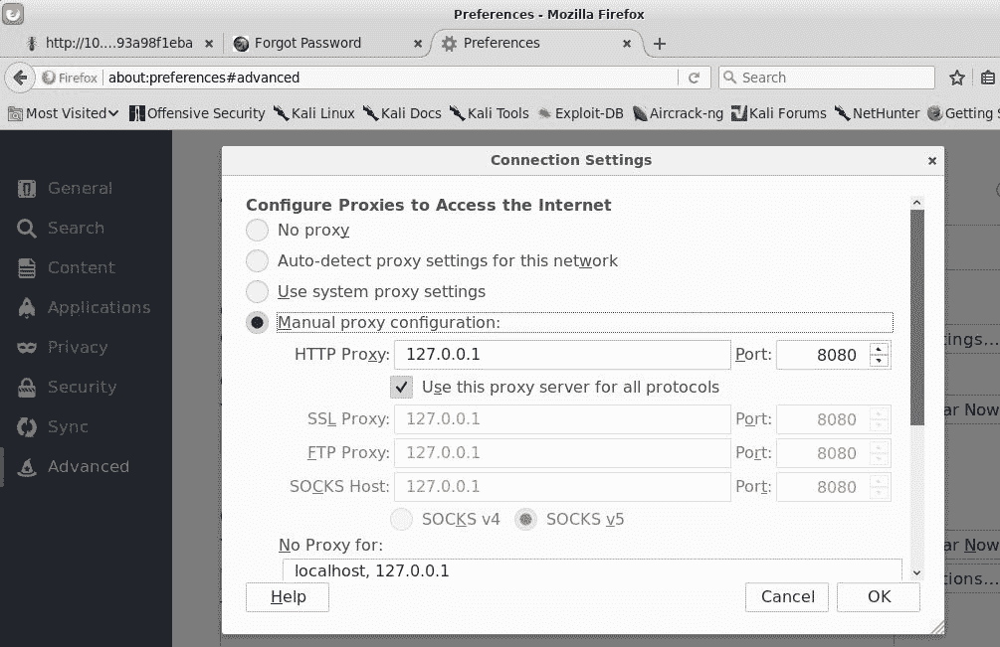
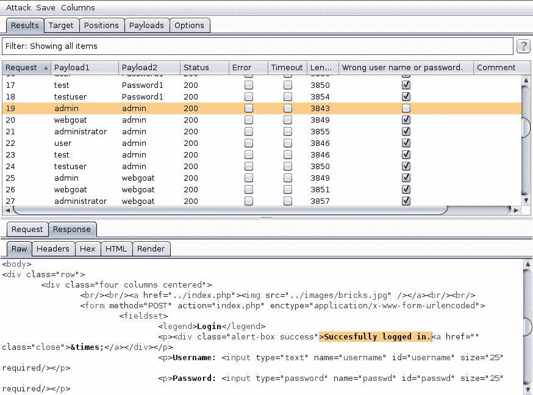
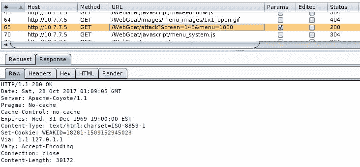
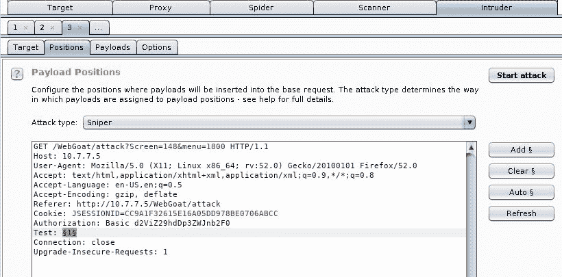
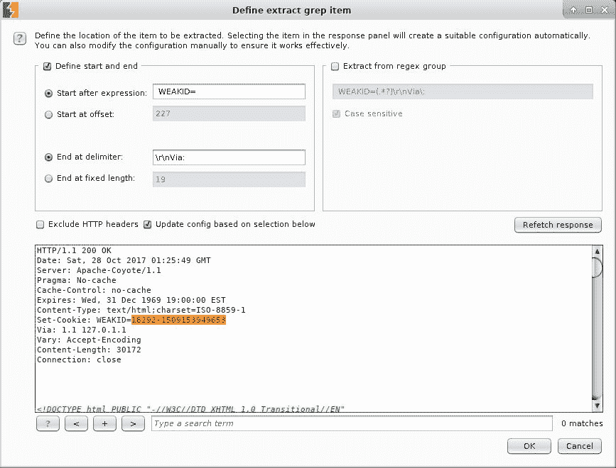
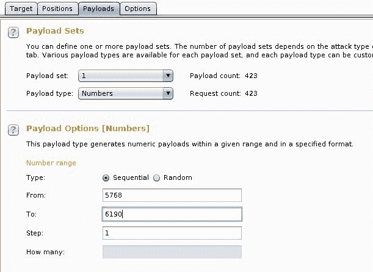
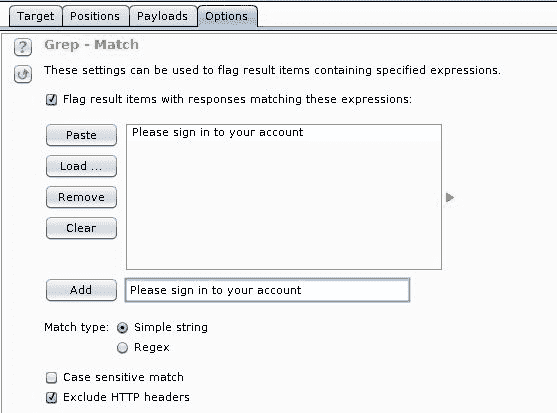
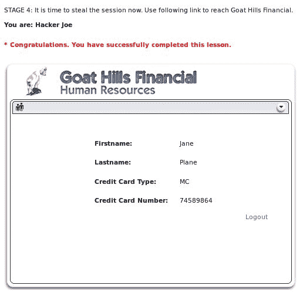

# 第四章：身份验证和会话管理漏洞

Web 应用程序的主要目的是允许用户访问和处理存储在远程位置的信息。有时，这些信息是公开的，而其他时候可能是特定于用户甚至是机密的。这些应用程序要求用户在被允许访问此类信息之前证明其身份。这个身份验证过程称为**身份验证**，它要求用户提供一个身份证明，可以是以下一个或多个：

+   用户所知道的东西：例如用户名和秘密密码

+   用户拥有的东西：如智能卡或发送到用户手机的特殊代码

+   用户的特征：声音、面部、指纹或任何其他生物识别机制

第一种选择是 Web 应用程序中最常见的。还有一些情况，例如银行或内部企业应用程序，可能使用剩余方法中的一个或多个。

HTTP 是一种无状态和无连接的协议。这意味着服务器将客户端发送的每个请求视为与该客户端或任何其他客户端发送的先前或将来的请求无关。因此，用户登录到 Web 应用程序后，下一个请求将被服务器视为第一个请求。因此，客户端需要在每个请求中发送他们的凭据。这为敏感信息增加了不必要的暴露和通信的不必要努力。

已经开发了许多技术，允许 Web 应用程序跟踪用户的活动并根据他们对自己环境的更改来维护应用程序的状态，并将其与其他用户的活动分开，而无需要求他们在每个操作中都登录。这被称为**会话管理**。

在本章中，我们将回顾现代 Web 应用程序通常如何执行身份验证和会话管理，并学习如何识别和利用这些机制中最常见的一些安全漏洞。

# Web 应用程序中的身份验证方案

在进入具体的渗透测试概念之前，让我们回顾一下现代 Web 应用程序中的身份验证是如何进行的。

# 平台认证

在使用**平台认证**时，用户在每个请求的头部中发送他们的凭据，使用`Authorization`变量。即使他们只需要提交一次凭据，浏览器或系统也会存储它们并在需要时使用。

有几种不同类型的平台认证。最常见的几种将在以下小节中讨论。

# 基本认证

使用这种类型的平台认证，用户名和密码会附加在`Authorization`头部中，并使用 base64 进行编码。这意味着任何看到请求头的人都能够将凭据解码为明文，因为 base64 编码不是一种加密格式。

以下截图显示了如何以 base64 形式发送登录信息以及如何解码它：



您可以使用 Burp Suite 的解码器将 base64 转换为 ASCII 文本：


# 摘要

**摘要认证**比基本认证安全得多。当客户端想要访问受保护的资源时，服务器会发送一个随机字符串，称为**nonce**，作为挑战。然后，客户端使用此 nonce 与用户名和密码一起计算 MD5 哈希并将其发送回服务器进行验证。

# NTLM

**NTLM**是摘要认证的一种变体，其中使用 Windows 凭据和 NTLM 哈希算法来转换应用程序的用户名和密码的挑战。此方案需要多个请求-响应交换，并且服务器和任何中间代理必须支持持久连接。

# Kerberos

此认证方案使用**Kerberos**协议对服务器进行身份验证。与 NTLM 一样，它不要求用户名和密码，而是使用 Windows 凭据登录。该协议使用与 Web 服务器分开的**认证服务器**（**AS**），并涉及一系列的协商步骤以进行身份验证。这些步骤如下：

1.  客户端将用户名（ID）发送给 AS。

1.  AS 在数据库中查找 ID，并使用哈希密码加密会话密钥。

1.  AS 将加密的会话密钥和包含用户 ID、会话密钥、会话过期和其他数据的票证（TGT），使用服务器的秘密密钥加密后发送给客户端。如果密码不正确，客户端将无法解密其会话密钥。

1.  客户端解密会话密钥。

1.  当客户端想要访问 Web 服务器上的受保护资源时，它需要在一条消息中发送 TGT 和资源 ID，并在另一条消息中使用会话密钥加密客户端 ID 和时间戳。

1.  如果服务器能够解密接收到的信息，它将使用 AS 的秘密密钥和客户端/服务器会话密钥进行加密，进一步使用客户端的会话密钥进行加密，并以客户端到服务器的票证形式进行响应。

1.  有了 AS 提供的这些信息，客户端现在可以向 Web 服务器请求资源。

在下图中，您可以以图形方式看到该过程：


# HTTP Negotiate

也称为*Windows 身份验证*，**HTTP Negotiate**方案使用 Windows 凭据，并根据 Kerberos 是否可用来选择 Kerberos 或 NTLM 身份验证。

# 平台认证的缺点

尽管 Kerberos 和 NTLM 方案被认为是安全的，即使在 TLS 上使用摘要或基本认证也可以降低恶意参与者拦截通信并窃取凭据的风险，但是在安全方面，平台认证仍然具有一些固有的缺点。它们如下：

+   凭据更频繁地发送，因此它们的暴露和在**中间人攻击**（**MITM**）中被捕获的风险更高，特别是对于基本、摘要和 NTLM 方案。

+   平台认证没有注销或会话过期选项。当使用 Windows 身份验证时，由于**单点登录**（**SSO**）已经启用，用户打开应用程序的主页面时会立即开始会话，而不需要用户名和密码，并且如果会话过期，它会自动续订。如果攻击者能够访问用户的计算机或 Windows 帐户，他们将立即获得对应用程序的访问权限。

+   平台认证不适用于公共应用程序，因为与最流行的基于表单的认证相比，它们需要更高的技术和管理工作量来设置和管理。

# 基于表单的认证

这是我们更熟悉的一种认证方式：一个包含用户名和密码字段以及提交按钮的 HTML 表单：


此认证可能因情况而异，因为其实现完全依赖于应用程序。尽管如此，最常见的方法遵循以下步骤：

1.  用户填写认证表单并点击提交按钮。然后，客户端（Web 浏览器）将包含用户名和密码的请求以明文形式发送到服务器，除非应用程序进行了客户端加密。

1.  服务器接收信息并检查用户在其数据库中的存在，并比较存储的密码（或密码哈希）与提交的密码。

1.  如果用户存在且密码正确，服务器将以肯定的消息作出回应，该消息可能包括重定向到用户的主页和会话标识符（通常作为 cookie），以便用户无需再次发送凭据。

1.  客户端接收响应，存储会话标识符，并重定向到主页。

从渗透测试的角度来看，这无疑是最有趣的身份验证方法，因为没有标准的方法来执行它（即使有最佳实践），通常会导致许多漏洞和安全风险，因为实现不当。

# 双因素身份验证

如前所述，为了向应用程序证明您的身份，您必须提供您所知道的东西、您所拥有的东西或您所是的东西。这些标识符中的每一个都被称为**因素**。**多因素身份验证**（**MFA**）源于为某些应用程序提供额外的安全层，以防止未经授权的访问，例如密码被攻击者猜测或窃取的情况。

在大多数 Web 应用程序中，**双因素身份验证**（**2FA**）意味着用户必须提供用户名和密码（第一个因素）以及一个特殊的代码或**一次性密码**（**OTP**），该代码是由用户拥有的设备临时随机生成的，或者通过服务器通过短信或电子邮件发送给他们。然后用户将 OTP 提交给应用程序。更复杂的应用程序可能会在密码之外实现使用智能卡或某种生物识别技术，例如指纹。由于这需要用户拥有额外的硬件或专用设备，这些类型的应用程序要少得多。

大多数银行应用程序实施了一种 MFA 形式，最近，公共电子邮件服务和社交媒体开始推广并强制用户使用 2FA。

# OAuth

**OAuth**是一种用于访问委派的开放标准。当 Facebook 或 Google 用户允许第三方应用程序访问他们的帐户时，他们不会与这些应用程序共享他们的凭据。相反，服务提供商（Google、Twitter 或 Facebook）共享一个特殊的访问令牌，允许这些应用程序检索有关用户帐户的特定信息或根据用户授权的权限访问某些功能。

# 会话管理机制

**会话管理**涉及在登录时创建或定义会话标识符，设置不活动超时时间，会话过期以及在注销时使会话无效；此外，根据用户的权限，它可能扩展到授权检查，因为会话 ID 必须与用户关联起来。

# 基于平台身份验证的会话

当使用平台身份验证时，最常用的方法是使用已经包含的标头来处理凭据，或者将响应作为用户会话的标识符，并通过应用程序的逻辑来管理会话过期和注销；尽管如前所述，当使用平台身份验证时，通常会发现没有会话超时、过期或注销。

如果使用 Kerberos，AS 发出的令牌已经包含会话信息，并用于管理此类会话。

# 会话标识符

会话标识符在表单身份验证中更常见，但在使用平台身份验证时也可能存在。**会话标识符**或**会话 ID**是在每次用户在应用程序中启动会话时分配给每个用户的唯一数字或值。该值必须与用户的 ID 和密码不同。每次用户登录时，它必须是不同的，并且必须随每个请求一起发送到服务器，以便它可以区分来自不同会话/用户的请求。

在客户端和服务器之间发送会话 ID 的最常见方法是通过 cookie。一旦服务器接收到一组有效的用户名和密码，它将该登录信息与会话 ID 关联起来，并向客户端响应，将这些 ID 作为 cookie 的值发送。

在下面的屏幕截图中，您将看到一些包含会话 cookie 的服务器响应的示例：



在前面的示例中，一个 PHP 应用程序设置了一个名为`PHPSESSID`的会话 cookie。


在上面的示例中，一个 Java 应用程序设置了一个名为`JSESSIONID`的会话 cookie。


在上面的示例中，一个 ASP.NET 应用程序设置了一个名为`ASP.NET_SessionId`的会话 cookie。

# Web 应用程序中的常见身份验证缺陷

我们花了一些时间讨论了 Web 应用程序中不同身份验证机制的工作原理。在本节中，您将学习如何识别和利用其中一些最常见的安全故障。

# 缺乏身份验证或错误的授权验证

在前一章中，您了解到如何使用 DIRB 和其他工具来查找可能没有在 Web 服务器上的任何页面中引用的目录和文件，或者可能包含特权功能，例如`/admin`和`/user/profile`。如果您能够直接浏览到这些目录并在其中使用功能，而无需进行身份验证，或者作为标准用户进行身份验证后，您可以通过浏览到这些目录来浏览到应用程序的管理区域或修改其他用户的配置文件，那么该应用程序在身份验证和/或授权机制方面存在重大安全问题。

# 用户名枚举

在黑盒和灰盒渗透测试场景中，发现应用程序的有效用户列表可能是第一步之一，特别是如果这样的应用程序不是商业应用，以便您可以在线查找默认用户。

通过分析在登录、注册和密码恢复页面等地方提交用户名时的响应，可以对 Web 应用程序中的用户进行枚举。以下是一些常见的错误消息，当提交表单到这些页面时，您可以找到告诉您可以枚举用户的消息：

+   “用户 foo：无效密码”

+   “无效用户 ID”

+   “帐户已禁用”

+   “此用户未激活”

+   “无效用户”

让我们来看一个非常简单的例子，如何从一个 Web 应用程序中发现有效的用户名，当提供错误的用户名时，该应用程序会提供过多的信息。使用 IP 地址为`10.7.7.5`的**Broken Web Applications**（**BWA**）虚拟机中的 OWASP WebGoat。

首先运行 Burp Suite 并配置您的浏览器以使用它作为代理（在 Firefox 中，导航到首选项 | 高级 | 网络 | 连接 | 设置）：



接下来，使用`webgoat`默认用户和`webgoat`密码登录 WebGoat，并转到 Authentication Flaws | Forgot Password：


这是一个需要用户名才能继续恢复过程的密码恢复表单。您可以输入一个不存在的用户名，例如`nonexistentuser`，并提交以查看结果：


用户名无效，您将无法继续进行密码恢复。您可以假设当用户有效时，您将获得不同的响应。

现在让我们使用 Burp Suite 的 Intruder 来尝试找到一个有效的用户名。首先，在 Burp Proxy 的历史记录中查找请求，并将其发送到 Intruder（按下*Ctrl* + *I*或右键单击并选择发送到 Intruder）：


接下来，切换到入侵者标签，然后切换到您的请求编号，最后切换到位置。您可以看到所有可由客户端修改的参数默认都被选中。点击清除以取消选择它们，然后只选择用户名值并点击添加：


入侵者自动发送多个请求到服务器，用用户提供的输入替换选定的值，并记录所有响应以供分析。现在添加一个要尝试的用户名列表，而不是已提交的用户名。

Burp Intruder 有四种不同的攻击类型，描述了如何使用有效负载填充输入：

+   **Sniper**：这使用单个有效负载集，并逐个选择每个输入位置的值。请求的数量将是有效负载集的长度乘以输入位置的数量。

+   **撞击锤**：这个方法使用一个单一的有效负载集，并同时选择所有输入位置上的每个值。请求数量将等于有效负载集的长度。

+   **草叉**：这个方法使用多个输入位置，并且每个位置都需要一个有效负载集。它一次在对应的输入中提交一个有效负载集的值。请求数量将等于最短有效负载集的长度。

+   **集束炸弹**：当使用多个输入时，有效负载集 1 中的所有元素将与有效负载集 2 中的所有元素配对，依此类推，直到有效负载集*n*。攻击中的请求数量由所有有效负载集的大小相乘确定。

接下来，在 Intruder 中切换到 Payloads 选项卡。保持有效负载集不变，点击有效负载选项[简单列表]部分的“加载...”按钮；这是为了加载包含你想尝试的名称的文件。幸运的是，Kali Linux 在`/usr/share/wordlists`目录中包含了大量的字典和单词列表。

在这个例子中，你将使用`/usr/share/wordlists/metasploit/http_default_users.txt`：


现在，你已经定义了带有输入位置的请求，并准备好了有效负载列表，请点击“开始攻击”：


从结果中可以看出，所有尝试的名称都有相同的响应，除了一个。你会注意到`admin`有一个不同长度的响应，如果你查看响应的正文，你会看到它在询问密码恢复问题。所以，`admin`是一个有效的用户名。

用户名枚举可以在应用程序对有效和无效用户名显示不同响应时进行。此外，一些应用程序在注册新用户时会进行验证，以确保名称不重复。如果此验证在提交表单之前完成，那么有一个执行此类验证的网络服务，你可以用它进行枚举。

# 通过暴力破解和字典攻击来发现密码

一旦你在应用程序中确定了有效的用户，下一个自然步骤就是尝试找到这些用户的密码。有很多方法可以从用户那里获取有效密码，从模仿原始网站在不同服务器上并使用社交工程来欺骗用户提交他们的信息，到利用不安全的密码恢复机制，再到猜测密码（如果是常见密码）。

**暴力破解**是一种尝试所有可能的字符组合来发现有效密码的方法。当应用程序允许使用一到三个甚至四个字符的密码时，这种方法可能很有效。如果允许使用这样的密码，很有可能至少有一个用户在使用它们。

对于较长的密码，暴力破解攻击是完全不切实际的，因为在发现一个有效密码之前，你需要向应用程序发送数百万（甚至数十亿）个请求。此外，执行这种攻击所需的时间比标准的一两周的渗透测试计划要长得多（非常长）。在这种情况下，我们依靠人为因素的可预测性——即使对于实际目的来说，八个或更多字符密码的可能组合几乎是无限的，但我们人类倾向于只使用其中一小部分组合作为密码，而且最常见的密码非常常见。

为了利用这个事实，有一些包含常见或默认密码的字典，或者是已知在以前对流行网站的攻击中泄露的密码。使用这些字典，你可以减少需要尝试的次数，增加在字典中找到有效密码的机会，因为已经有很多人将其作为密码使用过。

自 2012 年以来，SplashData 每年发布一份根据被黑客和泄露密码集合进行分析得出的最常用密码列表。可以在以下链接查看 2017 年和 2016 年的结果：[`www.teamsid.com/worst-passwords-2017-full-list/`](https://www.teamsid.com/worst-passwords-2017-full-list/)和[`www.teamsid.com/worst-passwords-2016/`](https://www.teamsid.com/worst-passwords-2016/)。另一个每年发布的列表是来自 Keeper 密码管理器的列表：[`blog.keepersecurity.com/2017/01/13/most-common-passwords-of-2016-research-study/`](https://blog.keepersecurity.com/2017/01/13/most-common-passwords-of-2016-research-study/)。

# 使用 THC Hydra 攻击基本身份验证

**THC Hydra**是黑客和渗透测试人员中长期以来最受欢迎的在线密码破解工具。

在线破解意味着实际进行了对服务的登录尝试。当存在安全和监控工具时，这可能会产生大量流量并在服务器上引发警报。因此，在尝试在线暴力破解或字典攻击应用程序或服务器时，你应该特别小心，并调整参数以获得最佳速度，而不会使服务器过载、引发警报或锁定用户账户。

当存在监控或在一定次数的失败尝试后账户被锁定时，进行在线攻击的一个好方法是为每个用户使用三到四个密码，或者少于锁定阈值的数量。选择最明显或最常见的密码（例如`password`、`admin`或`12345678`），如果没有结果，返回侦察阶段获取更好的密码集，并在几分钟或几个小时后再次尝试。

THC Hydra 具有连接到各种服务的能力，如 FTP、SSH、Telnet 和 RDP。我们将使用它对使用基本身份验证的 HTTP 服务器进行字典攻击。

首先，你需要知道实际处理登录凭据的 URL。打开你的*Kali 机器*，打开 Burp Suite，并配置浏览器使用它作为代理。你将使用易受攻击的虚拟机和 WebGoat 应用程序。当你尝试访问 WebGoat 时，会弹出一个对话框要求输入登录信息。如果你提交任意随机的用户名和密码，会再次出现相同的对话框：


即使尝试不成功，请求已经在 Burp 中注册。接下来，寻找其中一个具有`Authorization: Basic`头的请求：


现在你知道处理登录的 URL 是`http://10.7.7.5/WebGoat/attack`。这已经足够运行 Hydra 了，但首先你需要有一个可能的用户名列表和一个密码列表。在实际情况下，可能的用户名和密码将取决于组织、应用程序以及你对其用户的了解。对于这个测试，你可以使用以下可能的用户列表，用于名为 WebGoat 的应用程序，并将其指定为安全测试的目标：

```
admin 
webgoat 
administrator 
user 
test 
testuser 
```

至于密码，你可以尝试一些最常见的密码，并添加应用程序名称的变体：

```
123456 
password 
Password1 
admin 
webgoat 
WebGoat 
qwerty 
123123 
12345678 
owasp 
```

将用户名列表保存为`users.txt`，将密码列表保存为`passwords.txt`。首先，运行`hydra`命令，不带任何参数查看帮助和执行信息：


你可以看到它需要使用`-L`选项添加一个用户列表文件，`-P`选项添加一个密码列表文件，以及协议、服务器、端口和可选信息，形式如：`protocol://server:port/optional`。运行以下命令：

```
hydra -L users.txt -P passwords.txt http-get://10.7.7.5:8080/WebGoat/attack  
```


你会发现`webgoat`用户和`webgoat`密码的组合被服务器接受。

在使用 Hydra 时，一个有用的选项是使用`-e`和`n`、`s`或`r`修饰符，可以处理登录输入，发送空密码（`n`），将用户名作为密码（`s`），反转用户名并将其用作密码（`r`），以及`-u`，它首先循环用户。这意味着它尝试所有用户与单个密码，然后继续下一个密码。这可以防止您被某些防御机制锁定。

# 攻击基于表单的身份验证

由于没有标准的实现，并且 Web 应用程序在验证和攻击预防方面更加灵活，因此登录表单在暴力破解时面临一些特殊的挑战：

+   用户名和密码参数中没有标准的名称、位置或格式

+   登录尝试没有标准的负面或正面响应

+   客户端和服务器端的验证可能会阻止某些类型的攻击或重复提交请求

+   身份验证可能分为多个步骤，即在一个页面中询问用户名，在下一个页面中询问密码

对于渗透测试人员来说，幸运的是，大多数应用程序使用 HTML 表单的基本模式，通过 POST 请求发送用户名和密码作为参数，并在成功登录时重定向到用户的主页，如果失败，则重定向到登录页面或显示错误。现在，您将研究两种用于对此类表单执行字典攻击的方法。几乎所有基于表单的身份验证都适用相同的原则，只是在如何解释响应和所需的提交参数方面有一些修改。

# 使用 Burp Suite Intruder

与基本身份验证攻击一样，您首先需要识别执行实际身份验证的请求及其参数，以便攻击正确的请求。

在下面的屏幕截图中，您将在左侧看到 OWASP Bricks 中的身份验证表单（在易受攻击的虚拟系统主菜单中，转到 Bricks | 登录页面 | 登录#3），在右侧，您可以看到通过 POST 方法发送的请求。您会观察到用户名和密码参数发送到正文中，而没有授权头：


要对此登录页面进行字典攻击，您首先需要分析响应，以确定失败的登录与成功的登录有何区别：


在屏幕截图中，您可以观察到失败的响应包含“用户名或密码错误”的文本。当然，这不会出现在成功登录中。

接下来，将请求发送到 Intruder，并选择用户名和密码参数作为输入。然后，选择 Cluster bomb 作为攻击类型：


接下来，转到有效负载选项卡，选择有效负载集`1`，并加载包含之前使用的用户名的文件：


对于有效负载集`2`，我们还将使用之前练习中使用的密码文件：


如您在此屏幕截图中所见，服务器发送了 60 个请求，因为您有 6 个用户名和 10 个可能的密码：


您可以在此时发起攻击，然后分析响应，并了解是否有某个登录组合成功。然而，Burp Intruder 具有一些功能，可以使您的生活更轻松，不仅适用于像这样的简单示例，还适用于攻击复杂的真实应用程序。转到选项选项卡，然后转到 Grep - Match，使 Intruder 在响应中查找某些特定的文本，以便您可以轻松识别成功的文本。点击“标记与这些表达式匹配的结果项”框，清除当前列表，并在“输入新项目”框中输入以下内容：

```
Wrong user name or password. 
```

按下*Enter*或点击“添加”。Intruder 将标记所有包含此消息的响应；因此，未标记的响应可能表示成功登录。如果您知道正确的登录消息，您可以寻找该消息并直接识别出一组正确的凭据：


开始攻击，并等待结果：



看起来您已经找到了至少一个有效的用户名及其密码。

# 使用 THC Hydra

在 Hydra 支持的众多协议中，有`http-get-form`、`http-post-form`、`https-get-form`和`https-post-form`，它们分别是通过`GET`和`POST`方法发送的 HTTP 和 HTTPS 登录表单。使用前面练习中的相同信息，您可以使用以下命令在 Hydra 中运行字典攻击：

```
hydra 10.7.7.5 http-form-post "/owaspbricks/login-3/index.php:username=^USER^&passwd=^PASS^&submit=Submit:Wrong user name or password." -L users.txt -P passwords.txt  
```


您可能会注意到，这种情况下的语法与您之前使用 Hydra 的语法略有不同。让我们一起来看看：

1.  首先，您需要`hydra`命令和目标主机（`hydra 10.7.7.5`）。

1.  然后是您要测试的协议或服务（`http-form-post`）。

1.  接下来是用引号（`""`）括起来的协议特定参数，用冒号分隔：

1.  URL（`/owaspbricks/login-3/index.php`）

1.  请求的主体由`^USER^`指示，Hydra 应该将用户名放在这里，`^PASS^`指示密码应该放在哪里

1.  登录失败的消息（“用户名或密码错误。”）

1.  最后是由`-L`和`-P`指示的用户名和密码列表

# 密码重置功能

Web 应用程序中的另一个常见弱点是密码恢复和重置功能的实现。

由于应用程序需要用户友好，并且一些用户会忘记密码，因此应用程序需要提供一种允许这些用户重置或恢复密码的方式。为此问题提供一个安全的解决方案并不是一件容易的事情，许多开发人员可能会留下一些弱点，供渗透测试人员或攻击者利用。

# 恢复而不是重置

当面临用户忘记密码时该怎么办的问题时，您可以在两个主要选项之间选择：

+   允许他们恢复旧密码

+   允许他们重置密码

应用程序允许用户恢复旧密码，这意味着应用程序设计中存在一些安全漏洞：

+   密码以可恢复的方式存储在数据库中，而不是使用单向哈希算法，这是存储密码的最佳实践。

+   在服务器端代码中，客户服务代理或系统管理员可以恢复密码。攻击者也可以通过社会工程或技术利用来做到这一点。

+   当密码通过电子邮件、电话或在网页上显示时，密码就会面临风险。中间人或旁观者可以以许多方式捕获这些信息。

# 常见的密码重置缺陷

应用程序常用的一种允许用户恢复或重置密码的方法是询问一个或多个问题，只有合法用户才应该知道答案。这些问题包括出生地、第一所学校、第一只宠物的名字和母亲的娘家姓。问题在于，如果应用程序提出的问题对于潜在攻击者来说并不那么机密，那么这个问题会增加，如果用户是高知名度的人物，比如名人或政治家，那么他们生活的许多细节都是公开的，这个问题就会增加。

第二层保护是不直接提供密码重置功能的访问权限，而是通过电子邮件或短信发送密码重置链接。如果在尝试重置密码时请求了此电子邮件或电话号码，那么您可以伪造此信息，将用户的号码替换为您的号码，并获取任何用户的密码重置。

如果电子邮件或电话号码经过正确验证，并且无法伪造它们，仍然存在重置链接没有正确实现的可能性。有时这些链接包含一个参数，指示 ID，比如要重置密码的用户的号码或姓名。在这种情况下，你只需要使用一个你控制的用户生成一个链接，并将该参数更改为你想要重置密码的用户之一。

另一个可能的失败是，这样的重置链接在第一次合法使用后没有失效。在这种情况下，如果攻击者以任何方式获得了这样的链接，他们可以再次访问它并重置用户的密码。

# 2FA 实施中的漏洞

Web 应用程序中最常见的 MFA 形式是使用随机生成的数字（四到八位数）作为 OTP，用户可以从特殊设备、移动应用程序（如 Google Authenticator、Authy、1Password 或 LastPass Authenticator）或通过服务器根据请求发送的短信或电子邮件中获取。

在渗透测试中，当存在以下条件时，你可以检测和利用这个过程中的一些实施缺陷：

+   OTP 号码不是完全随机的，可以被预测。

+   OTP 与其分配的用户没有关联。这意味着你可以为一个用户生成一个 OTP，并将其用于另一个用户。

+   同一个密码或令牌可以多次使用。

+   OTP 提交尝试没有限制。这打开了暴力破解攻击的可能性，因为 OTP 通常是短数字字符串，更容易成功。

+   发送 OTP（一次性密码）的时候，用户信息没有经过验证，这使得攻击者可以伪造电子邮件地址或电话号码。

+   OTP 的过期时间对于应用程序的目的来说太长了。这扩大了攻击者获取有效未使用令牌的时间窗口。

+   新生成的 OTP 不会使之前的 OTP 失效，所以例如，如果一个用户因为网络故障而多次请求同一操作的令牌或密码（第一次尝试失败），攻击者可以使用之前的尝试来复制该操作或执行另一个接受相同令牌的操作，即使合法操作已经执行过了。

+   依赖访问应用程序的设备。现在，人们在手机上有银行应用程序、个人电子邮件、社交网络、工作电子邮件和许多其他应用程序。因此，你应该三思而后行，是否将电子邮件、短信或移动应用作为第二因素认证。

# 检测和利用不正确的会话管理

如前所述，会话管理允许应用程序跟踪用户活动并验证授权条件，而无需用户每次请求时都提交凭据。这意味着如果会话管理没有正确执行，用户可能能够访问其他用户的信息或执行超出其权限级别的操作，或者外部攻击者可能会获取用户的信息和功能。

# 使用 Burp Sequencer 评估会话 ID 的质量

**Burp Sequencer**是一种统计分析工具，可以让你收集大量的值，如会话 ID，并对它们进行计算，以评估它们是否是随机生成的，或者只是混淆或编码。这在处理复杂的会话 cookie 时非常有用，因为它可以让你了解 cookie 是如何生成的，以及是否有攻击或预测的方法。

要使用 Burp Sequencer，首先需要找到设置会话 cookie 的响应。通常是成功登录的响应，带有`Set-Cookie`头。在下面的截图中，你可以看到设置 WebGoat 会话劫持练习的会话 cookie（`WEAKID`）的响应（转到 WebGoat | 会话管理缺陷 | 劫持会话）：



乍一看，响应的值可能看起来是独特且足够难以猜测的。第一部分看起来像是一个 ID，第二部分似乎是一个时间戳，可能是以纳秒为单位的过期时间。很难猜测会话何时精确地结束在哪个纳秒，对吧？嗯，正如您将看到的，这不是最好的方法。

在 Burp Proxy 的历史记录中找到该响应，右键单击它。然后，您将看到“发送到 Sequencer”选项。进入 Sequencer 后，您需要选择它所关注的响应部分：


您可以选择分析 cookie、表单字段或响应的自定义部分。在这种情况下，选择`WEAKID` cookie 并点击“开始实时捕获”。它将开始向服务器发送请求，以捕获尽可能多的不同 cookie 值。完成后，点击“立即分析”执行分析。在结果中，Sequencer 将指示分析的值是否足够随机，并且作为会话 ID 的良好选择。正如您所看到的，`WEAKID`是弱的并且容易预测：


**熵**是信息中随机性水平的度量。结果显示`WEAKID`的随机性为零，这意味着它是完全可预测的，不适合作为会话 ID 的好选择。Sequencer 还提供有关字符串中每个字节和位的分布和重要性的更详细信息。

在下面的屏幕截图中，您将看到字符分析图表。您可以看到在位置 3、4、15、16 和 18 的字符变化要比位置 0 或 5 到 13 的字符更多，后者似乎根本不变。此外，字符 0 到 4 表明是一个计数器或递增的数字，因为最后一个字符的变化比前一个字符更多，而该字符比前一个字符更多，依此类推。我们将在下一节中验证这一点：


# 预测会话 ID

我们已经确定了一个似乎是可预测的会话 ID。现在让我们试着找到一个有效的会话。为此，您将使用接收到 cookie 的相同请求并将其发送到 Intruder。在这种情况下，您只需要重复相同的请求几次。但是，Intruder 需要有插入点才能运行，因此在请求中添加一个头部（`Test: 1`），并在其值中设置插入位置：



在此测试中，您将发送 101 个请求，因此将有效负载设置为“数字”类型，从 0 递增到 100：


现在转到“选项”选项卡，在“Grep-Extract”部分添加一个项目。确保选中“根据下面的选择更新配置”复选框，并仅选择 cookie 的值：



点击“确定”，然后点击“开始攻击”。

现在您可以在 Intruder 的结果表中看到`WEAKID`值，并且可以验证 cookie 值的第一部分是一个递增的顺序号，第二部分也总是递增的。这取决于请求被服务器接收的时间。如果您查看以下屏幕截图，您会发现序列中存在一些间隙：


当前活动会话的前半部分是`18299`。我们之所以知道这一点，是因为服务器没有给我们该值，并且我们知道它随着每个请求而增加。我们还知道第二部分是一个时间戳，并且它还取决于会话 cookie 分配的时间。因此，我们要寻找的值的第二部分必须在我们已知的两个值之间：`1509154565768`和`1509154566190`。由于这两个数字之间的差异很小（422），我们可以很容易地使用 Intruder 来暴力破解该值。

现在再次将相同的原始请求发送到 Intruder。这次，在其后添加一个 cookie。在`JSESSIONID`的值之后，添加以下内容（记得根据您的结果调整值）：

```
; WEAKID=18299-1509154565768
```

选择最后四个字符，并在那里添加一个位置标记：


现在，在有效负载选项卡中，攻击将尝试从 5768 到 6190 的数字：



最后，添加一个匹配表达式，以便您清楚地知道何时获得了成功的结果。此时，您只知道未经身份验证的用户应该有的消息。您会假设经过身份验证的用户（具有有效的会话 cookie）不会被要求登录：



开始攻击，并等待 Intruder 找到一些东西。


现在您有一个有效的会话 ID。要使用它，您只需要将会话 cookie 的值替换为您刚刚找到的值，并访问页面以劫持其他人的会话。我会留给您来测试。

# 会话固定

有时，用户提供的信息用于生成会话 ID，或者更糟糕的是，用户提供的信息成为会话 ID。当发生这种情况时，攻击者可以强制用户使用预定义的标识符，然后监视应用程序，以便在用户启动会话时进行操作。这被称为**会话固定**。

WebGoat 有一个相对简单但非常具有说明性的演示，展示了这种漏洞（转到 WebGoat | 会话管理缺陷 | 会话固定）。我们将使用它来说明如何执行这种攻击。

1.  第一步是将您设置为攻击者。您需要编写一封电子邮件，其中包含一个会话 ID（`SID`）值，该值将包含在您发送给受害者的链接中，因此请将该参数添加到链接中，例如`&SID=123`，以链接到 Goat Hills Financial：


攻击者发现 Goat Hills Financial 网站使用 GET 参数来定义会话标识符，并向该机构的客户发送钓鱼邮件。

1.  在这个练习的这一步中，您扮演受害者的角色，接收来自攻击者的电子邮件：


由于电子邮件看起来合法，因为它来自`admin@webgoatfinancial.com`，所以您点击链接，它会将您发送到登录页面，然后您相应地登录。现在有一个使用攻击者发送的参数的有效会话。

1.  下一阶段需要攻击者登录与受害者相同的网站：


您使用 Burp Proxy 拦截请求并编辑它以包含受害者用于登录的`SID`参数：


1.  现在，您已经获得了对受害者个人资料的访问权限：



在此示例中，会话 ID 的管理存在两个主要缺陷：

+   首先，会话 ID 是通过用户提供的信息生成的，这使得攻击者更容易识别有效值并将其与现有用户关联起来。

+   其次，一旦启动了经过身份验证的会话（例如，受害者登录后），标识符就不会更改，这就是术语“会话固定”的起源，因为攻击者能够预设会话 ID 对于受害者将具有的值，从而使其能够使用相同的值劫持受害者的经过身份验证的会话。

# 预防身份验证和会话攻击

Web 应用程序中的身份验证是一个难以解决的问题，迄今为止还没有找到普遍适用的解决方案。因此，在应用程序的这个领域预防漏洞在很大程度上是具体情况特定的，开发人员需要根据特定的用例和用户配置文件找到可用性和安全性之间的平衡。

我们可以说，即使是会话管理，当前的方法仍然是 HTTP 协议缺陷的变通方法。也许随着 HTML5 和 WebSockets 或类似技术的出现，您将来会有一些更好的替代方案可供使用。

尽管如此，仍然可以为身份验证和会话管理定义一些通用准则，这将帮助开发人员提高对抗攻击者的安全性，并且我们可以在寻找缺陷并向客户提出建议时将其用作参考。

# 身份验证准则

以下是身份验证指南的列表：

+   用户名或用户标识符必须对每个用户是唯一的，并且不区分大小写（`user`与`User`相同）。

+   强制执行强密码策略，禁止使用以下密码：

+   用户名作为密码

+   短密码（即少于八个字符）

+   单个大小写密码，即全部小写或全部大写

+   单个字符集，例如所有数字、所有字母，不使用特殊字符

+   数字序列（123456，9876543210）

+   名人、电视节目、电影或虚构人物（超人、蝙蝠侠、星球大战）

+   公共字典中的密码，例如前 25 个最常见的密码

+   始终使用安全协议（如 TLS）提交登录信息。

+   不要在错误消息或响应代码中透露有关用户名的存在或有效性的信息（例如，当找不到用户时不要响应 404 代码）。

+   为了防止暴力破解攻击，在一定数量的失败尝试后实施临时锁定：五次是一个平衡的数字，这样一个连续五次登录失败的用户将被锁定一段时间，比如二十或三十分钟。

+   如果实现了密码重置功能，请要求提供用户名或电子邮件以及安全问题（如果有）。然后，通过注册的电子邮件或通过短信将一次性重置链接发送给用户的注册电子邮件或他们的手机。如果用户没有重置密码或在一定时间内没有重置密码，此链接必须被禁用，可能是几个小时。

+   在实施多因素身份验证时，如果使用移动应用程序，则优先使用第三方和经过广泛测试的框架，例如 Google Authenticator 或 Authy；如果需要物理令牌或智能卡，则使用 RSA 或 Gemalto 设备。

+   避免实施自定义或自制的加密和随机生成模块，优先选择来自知名库和框架的标准算法。

+   在敏感任务上要求重新验证身份，例如对用户的特权更改、敏感数据删除或全局配置更改的修改。

OWASP 在其网站上有一个关于在 Web 应用程序上实施身份验证的最佳实践快速指南：[`www.owasp.org/index.php/Authentication_Cheat_Sheet`](https://www.owasp.org/index.php/Authentication_Cheat_Sheet)。

# 会话管理指南

以下是会话管理指南的列表：

+   无论使用何种身份验证机制，始终实施会话管理并在每个页面和/或请求上验证会话。

+   使用长、随机和唯一的会话标识符。优先使用已在主要 Web 开发语言（如 ASP.NET、PHP 和 J2EE）中实现的机制。

+   在登录和注销时为用户生成新的会话 ID。永久使已使用的会话 ID 失效。

+   在一段合理的不活动时间（15 到 20 分钟）后，使会话失效并注销用户。在安全性和可用性之间提供良好的平衡。

+   始终给用户明确的注销选项，即具有注销按钮/选项。

+   使用会话 cookie 时，请确保设置了所有安全标志：

+   使用`Secure`属性来防止在非加密通信中使用会话 cookie。

+   `HttpOnly`属性用于防止通过脚本语言访问 cookie 值。这减少了**跨站脚本**（**XSS**）攻击的影响。

+   使用非持久性会话 cookie，不使用`Expires`或`Max-Age`属性。

+   将`Path`属性限制为服务器的根目录（`/`）或托管应用程序的特定目录。

+   `SameSite`属性目前仅受 Chrome 和 Opera Web 浏览器支持。这提供了额外的保护，防止外部站点将 cookie 发送到服务器，以防止信息泄露和**跨站请求伪造**（**CSRF**）。

+   将会话 ID 与用户的角色和权限关联，并在每个请求上使用它来验证授权。

关于这个主题的更深入的建议可以在 OWASP 的“会话管理备忘单”中找到，网址为[`www.owasp.org/index.php/Session_Management_Cheat_Sheet`](https://www.owasp.org/index.php/Session_Management_Cheat_Sheet)。

# 总结

在本章中，我们回顾了 Web 应用程序执行用户身份验证以限制对特权资源或敏感信息的访问的不同方式，并研究了会话的维护方式，考虑到 HTTP 没有内置的会话管理功能。在当今的 Web 应用程序中，最常用的方法是基于表单的身份验证和通过 cookie 发送会话 ID。

我们还研究了身份验证和会话管理中最常见的安全故障点，攻击者如何利用内置的浏览器工具或 Kali Linux 中包含的其他工具（如 Burp Suite、OWASP ZAP 和 THC Hydra）来利用它们。

在最后一节中，我们讨论了一些最佳实践，通过要求对应用程序的所有特权组件进行身份验证，使用复杂的随机会话 ID，并强制执行强密码策略，可以预防或减轻身份验证和会话管理缺陷。这些是防止此类缺陷的一些最重要的预防和减轻技术。

在下一章中，我们将介绍最常见的注入漏洞类型，如何在渗透测试中检测和利用它们，以及修复应用程序和防止通过这些技术进行的攻击所需的措施。
