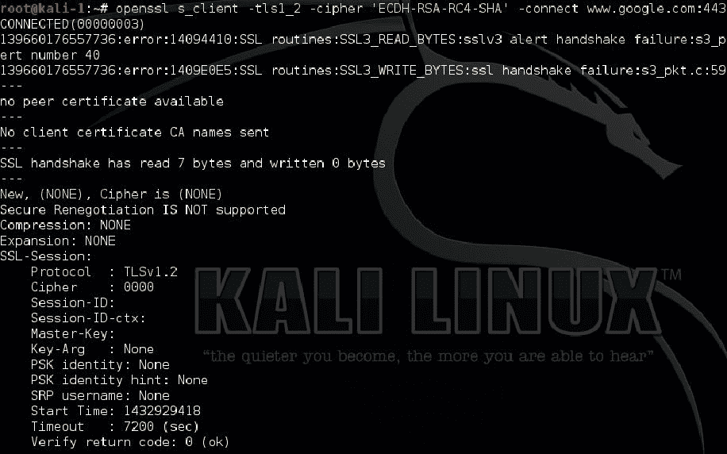
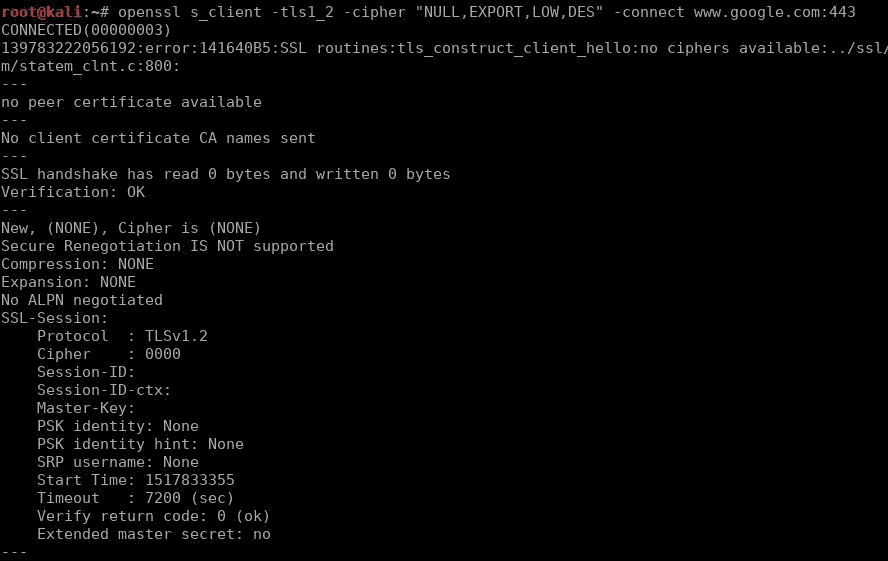
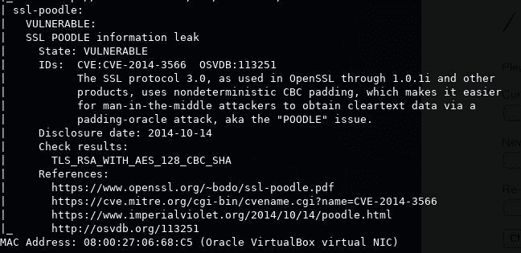
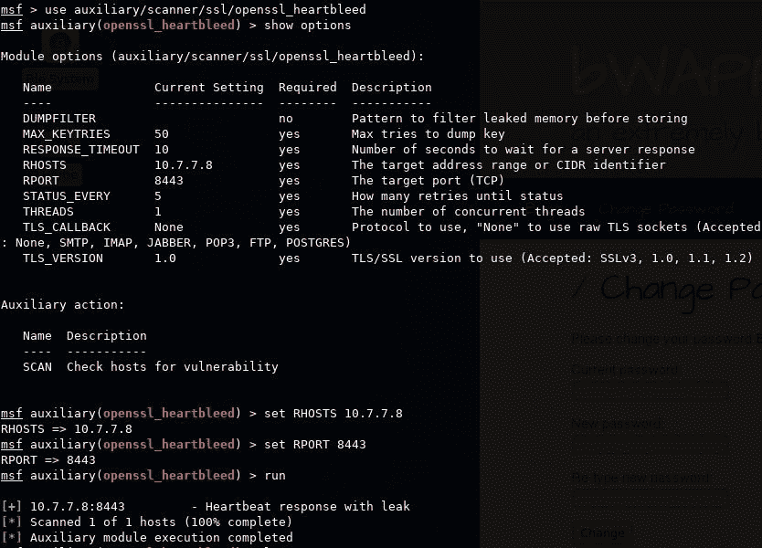
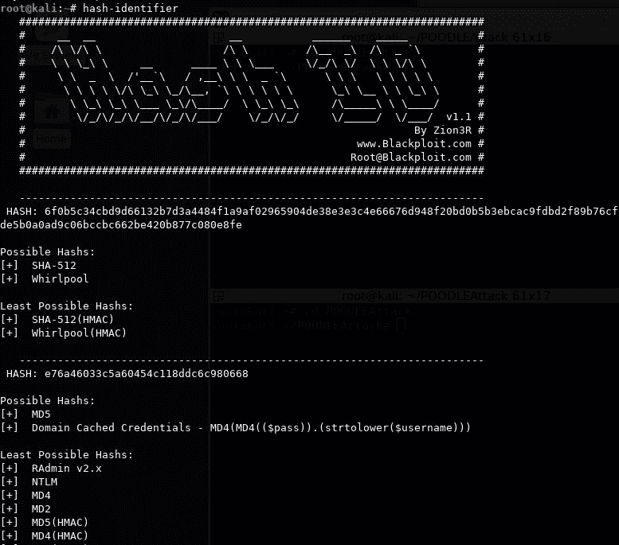
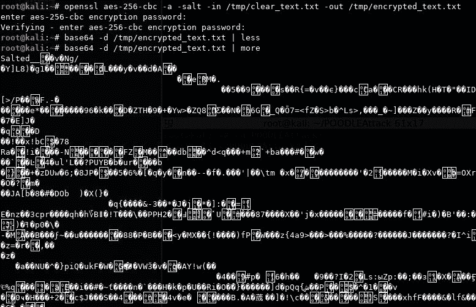
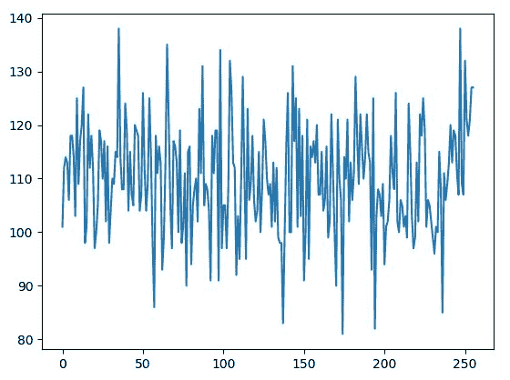
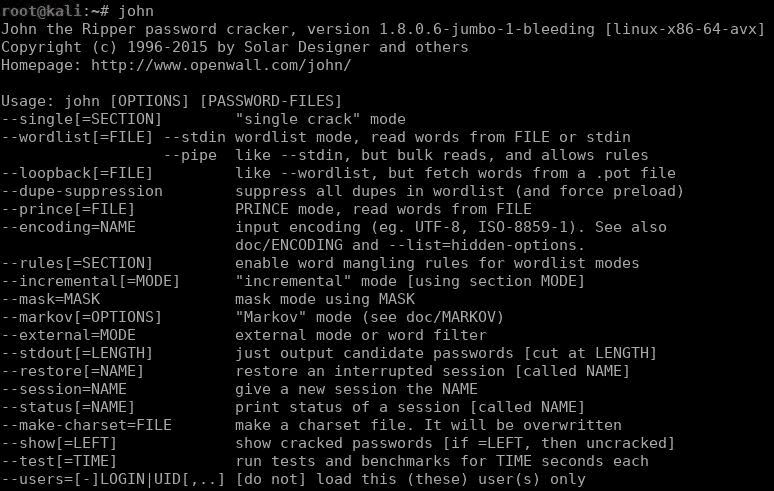

# 第八章：攻击密码实现中的缺陷

信息安全的主要目标之一是保护数据的机密性。在 Web 应用程序中，目标是确保用户和应用程序之间交换的数据是安全的，并且对任何第三方隐藏。当存储在服务器上时，数据还需要免受黑客的攻击。**密码学**是通过和解密秘密书写或消息来保护数据的机密性和完整性的实践。

当前标准的密码算法由高度专业的数学家和计算机科学家组成的团队进行了设计、测试和修正。深入研究他们的工作超出了本书的范围；寻找这些算法固有的漏洞也不是本书的目标。相反，我们将重点关注这些算法的某些实现以及如何检测和利用实现失败，包括那些没有经过相同设计和测试水平的自定义实现。

攻击者将尝试找到不同的方法来破解加密层并暴露明文数据。他们使用不同的技术，例如利用加密协议中的设计缺陷或诱使用户通过非加密通道发送数据，绕过加密本身。作为渗透测试人员，您需要了解这些技术，并能够识别缺乏加密或有缺陷的实现，利用这些缺陷，并提出修复问题的建议。

在本章中，我们将分析密码学在 Web 应用程序中的工作原理，并探讨其实现中常见的一些问题。

# 密码学入门

首先，我们需要在谈论密码学时明确区分常常混淆的概念：加密、编码、混淆和哈希：

+   **加密**：这是通过数学算法来改变数据以使其对未经授权的方​​式不可理解的过程。授权方可以使用密钥将消息解密回明文。AES、DES、Blowfish 和 RSA 是众所周知的加密算法。

+   **编码**：这也改变了消息，但其主要目标是允许该消息被不同的系统处理。它不需要密钥，并且不被视为保护信息的正确方式。Base64 编码通常用于现代 Web 应用程序，以通过 HTTP 传输二进制数据。

+   **混淆**：这使原始消息更难阅读，通过转换消息来实现。JavaScript 代码混淆用于防止调试和/或保护知识产权，其最常见的用途是在 Web 应用程序中。它不被视为保护信息免受第三方侵害的方式。

+   **哈希**：哈希函数是计算消息内容的固定长度唯一数字。相同的消息必须始终产生相同的哈希值，而且没有两个消息可以共享哈希值。哈希函数在理论上是不可逆的，这意味着您无法从其哈希中恢复消息。由于这个限制，它们用作签名和完整性检查非常有用，但不能用于存储需要在某个时候恢复的信息。哈希函数也广泛用于存储密码。常见的哈希函数有 MD5、SHA1、SHA-512 和 bcrypt。

# 算法和模式

密码算法或密码是通过一些计算将明文转换为密文的算法。这些算法可以广泛分为以下两种方式：

+   根据它们使用的公钥和私钥或共享密钥，它们可以是**非对称**或**对称**的。

+   根据它们处理原始消息的方式，它们可以是**流密码**或**块密码**

# 非对称加密与对称加密

**非对称加密**使用公私钥的组合，比对称加密更安全。公钥与所有人共享，私钥单独存储。使用一个密钥加密的加密数据只能使用另一个密钥解密，这使得它在更大范围内实施非常安全和高效。

另一方面，**对称加密**使用相同的密钥对数据进行加密和解密，您需要找到一种安全的方法与其他方共享对称密钥。

经常被问到的一个问题是为什么不使用公私钥对来加密数据流，而是生成一个使用对称加密的会话密钥。公私钥的组合是通过复杂的数学过程生成的，这是一个处理器密集型和耗时的任务。因此，它仅用于验证端点并生成和保护会话密钥，然后在对称加密中使用该会话密钥对大量数据进行加密。这两种加密技术的组合结果是更快速和更高效的数据加密。

以下是非对称加密算法的例子：

+   **Diffie-Hellman 密钥交换**：这是 1976 年开发的第一个非对称加密算法，它在有限域中使用离散对数。它允许两个端点在不了解对方的情况下，在不安全的介质上交换秘密密钥。

+   **Rivest Shamir Adleman（RSA）**：这是最广泛使用的非对称算法。RSA 算法用于加密数据和签名，提供机密性和不可否认性。该算法使用一系列模乘法来加密数据。

+   **椭圆曲线密码学（ECC）**：这主要用于手持设备，如智能手机，因为它在加密和解密过程中需要较少的计算能力。ECC 功能类似于 RSA 功能。

# 对称加密算法

在**对称加密**中，使用共享密钥生成加密密钥。然后使用相同的密钥对数据进行加密和解密。这种加密数据的方式在各种形式中已经被使用了很长时间。它提供了一种简单的加密和解密数据的方法，因为密钥是相同的。对称加密简单且易于实现，但是它需要以安全的方式与用户共享密钥。

一些对称算法的例子如下：

+   **数据加密标准（DES）**：该算法使用 DEA 密码。DEA 是一种分组密码，使用 64 位密钥大小；其中 8 位用于错误检测，56 位用于实际密钥。考虑到今天计算机的计算能力，这种加密算法很容易被破解。

+   **三重 DES（3DES）**：该算法将 DES 算法应用于每个分组三次。它使用三个 56 位密钥。

+   **高级加密标准（AES）**：该标准首次发布于 1998 年，被认为比其他对称加密算法更安全。AES 使用了由两位比利时密码学家 Joan Daemen 和 Vincent Rijmen 开发的 Rijndael 密码。它取代了 DES 算法。它可以配置为使用可变的密钥大小，最小为 128 位，最大为 256 位。

+   **Rivest Cipher 4 (RC4)**: RC4 是一种广泛使用的流密码，其密钥大小可变，范围从 40 到 2048 位。RC4 存在一些设计缺陷，使其容易受到攻击，尽管这些攻击可能不实际且需要大量的计算能力。RC4 在 SSL/TLS 协议中被广泛使用。然而，许多组织已经开始使用 AES 代替 RC4。

# 流密码和分组密码

对称算法分为两个主要类别：

+   **流密码：**该算法一次加密一个比特，因此需要更多的处理能力。它还需要大量的随机性，因为每个比特都要用唯一的密钥流进行加密。流密码更适合在硬件层实现，并用于加密流式通信，如音频和视频，因为它可以快速加密和解密每个比特。使用这种算法产生的密文与原始明文的大小相同。

+   **块密码：**使用这种算法，原始消息被分成固定长度的块，并在最后一个块中填充（扩展到满足所需的长度）。然后，根据所使用的模式，独立处理每个块。我们将在后续章节中进一步讨论密码模式。块密码产生的密文大小始终是块大小的倍数。

# 初始化向量

加密算法是*确定性的*。这意味着相同的输入将始终产生相同的输出。这是一件好事，因为在解密时，您希望能够恢复与加密的完全相同的消息。不幸的是，这使得加密变得更弱，因为它容易受到密码分析和已知明文攻击的攻击。

为了解决这个问题，实现了**初始化向量**（**IVs**）。IV 是每次执行算法时都不同的额外信息。它用于生成加密密钥或预处理明文，通常通过异或操作进行。这样，如果两条消息使用相同的算法和相同的密钥加密，但使用不同的 IV，得到的密文将不同。IV 附加在密文上，因为接收者事先无法知道它们。

黄金法则，特别是对于流密码，永远不要重复使用 IV。无线网络中的**Wired Equivalent Privacy**（**WEP**）身份验证的 RC4 实现使用一个 24 位（3 字节）的 IV，允许在短时间内重复使用密钥流。通过多次使用相同 IV 发送已知文本（例如 DHCP 请求）通过网络，攻击者可以恢复密钥流，并且可以使用多个密钥流/IV 对来恢复共享密钥。

# 块密码模式

**操作模式**是加密算法如何使用 IV 以及如何实现对每个明文块的加密。接下来，我们将讨论最常见的操作模式：

+   **电子密码本（ECB）：**在这种操作模式下，没有使用 IV，每个块都是独立加密的。因此，包含相同信息的块导致相同的密文，这使得分析和攻击更容易。

+   **密码块链接（CBC）：**使用 CBC 模式，块按顺序加密；一个 IV 应用于第一个块，每个块的结果密文用作下一个块的 IV。CBC 模式密码可能容易受到填充预言攻击的影响，其中对最后一个块的填充可能被用来恢复密钥流，前提是攻击者能够恢复大量加密包并且有一种方法可以知道一个包是否具有正确的填充（预言）。

+   **计数器（CTR）：**如果正确实现，这可能是最方便和安全的方法。使用相同的 IV 加上每个块不同的计数器，独立加密块。这使得该模式能够并行处理消息的所有块，并且每个块都有不同的密文，即使明文相同。

# 哈希函数

**哈希函数**通常用于确保传输的消息的完整性，并作为确定两个信息是否相同的标识符。哈希函数生成一个表示实际数据的固定长度值（哈希）。

哈希函数适用于这些任务，因为根据定义，没有两个不同的信息片段应该具有相同的哈希结果（碰撞），并且原始信息不应该仅通过哈希来恢复（即，哈希函数不可逆）。

以下是一些最常见的哈希函数：

+   MD5（消息摘要 5）

+   SHA（安全散列算法）版本 1 和 2

+   NT 和 NTLM 是 Microsoft Windows 用于存储密码的基于 MD4 的方法

# 盐值

当用于存储密码等秘密信息时，哈希容易受到字典和暴力攻击的攻击。攻击者捕获一组密码哈希值后，可以尝试使用已知常见密码的字典对其进行哈希，并将结果与捕获的哈希进行比较，以寻找匹配并发现明文密码。一旦找到哈希-密码对，所有使用相同密码的其他用户或账户也会被发现，因为所有哈希值都是相同的。

通过附加一个随机值到要进行哈希的信息上，并导致使用不同的盐对相同数据进行哈希得到不同的哈希值，**盐值**用于使这个任务更加困难。在我们之前的假设情况中，恢复一个哈希的明文的攻击者不会自动恢复所有其他相同密码的实例。

与初始化向量（IV）一样，盐值也会与哈希一起存储和发送。

# 通过 SSL/TLS 进行安全通信

**安全套接字层**（**SSL**）是一种设计用于保护网络通信的加密协议。Netscape 于 1994 年开发了 SSL 协议。1999 年，**互联网工程任务组**（**IETF**）发布了**传输层安全**（**TLS**）协议，取代了 SSL 协议的第 3 版。由于多年来发现了多个漏洞，SSL 现在被认为是不安全的。POODLE 和 BEAST 漏洞在 SSL 协议本身中暴露了缺陷，因此无法通过软件补丁修复。IETF 宣布 SSL 已被弃用，并建议升级到 TLS 作为安全通信的协议。TLS 的最新版本是 1.2。我们始终建议您使用最新版本的 TLS，并避免允许使用旧版本或 SSL 协议的客户端连接。

大多数网站已经迁移到并开始使用 TLS 协议，但加密通信仍然通常被称为 SSL 连接。SSL/TLS 不仅提供机密性，还有助于维护数据的完整性和实现不可否认性。

保护客户端和 Web 应用程序之间的通信是 TLS/SSL 的最常见用途，也被称为**HTTPS**。TLS 还用于以下方式中其他协议使用的通信通道的安全保护：

+   它被邮件服务器用于加密两个邮件服务器之间以及客户端和邮件服务器之间的电子邮件

+   TLS 用于保护数据库服务器和 LDAP 认证服务器之间的通信

+   它被用于加密称为**SSL VPN**的**虚拟专用网络**（**VPN**）连接

+   Windows 操作系统中的远程桌面服务使用 TLS 对连接到服务器的客户端进行加密和认证

TLS 被用于保护两方之间的通信的几个其他应用和实现。在接下来的章节中，我们将把 HTTPS 使用的协议称为 TLS，并在只适用于 SSL 或 TLS 的情况下进行说明。

# Web 应用程序中的安全通信

TLS 使用公钥-私钥加密机制来加密数据，从而保护其免受第三方监听通信的影响。在网络上嗅探数据只会显示加密的信息，没有对应密钥的访问是无用的。

TLS 协议旨在保护 CIA 三要素（机密性、完整性和可用性）：

+   **机密性**：保持数据的隐私和保密性

+   **完整性**：保持数据的准确性和一致性，并确保在传输过程中未被更改

+   **可用性**：防止数据丢失并保持对数据的访问

Web 服务器管理员实施 TLS 以确保在 Web 服务器和客户端之间共享的敏感用户信息是安全的。除了保护数据的机密性外，TLS 还使用 TLS 证书和数字签名提供不可否认性。这提供了确保消息确实由声称发送它的一方发送的保证。这类似于我们日常生活中签名的工作方式。这些证书由独立的第三方机构，即**证书颁发机构**（**CA**）签署、验证和颁发。以下是一些知名的证书颁发机构：

+   VeriSign

+   Thawte

+   Comodo

+   DigiCert

+   Entrust

+   GlobalSign

如果攻击者试图伪造证书，浏览器将显示警告消息，通知用户正在使用无效证书加密数据。

通过使用哈希算法计算消息摘要来实现数据完整性，该摘要附加到消息上并在另一端进行验证。

# TLS 加密过程

加密是一个多步骤的过程，但对于最终用户来说是一个无缝的体验。整个过程可以分为两个部分：第一部分使用非对称加密技术进行加密，第二部分使用对称加密过程进行加密。以下是使用 SSL 加密和传输数据的主要步骤的描述：

1.  客户端和服务器之间的握手是初始步骤，客户端在其中呈现 SSL/TLS 版本号和支持的加密算法。

1.  服务器通过识别其支持的 SSL 版本和加密算法来响应，并且双方就最高的共同值达成一致。服务器还会响应 SSL 证书。该证书包含服务器的公钥和有关服务器的一般信息。

1.  然后，客户端通过将证书与存储在本地计算机上的根证书列表进行验证来对服务器进行身份验证。客户端与证书颁发机构（CA）检查，以确保颁发给网站的签名证书存储在受信任的 CA 列表中。在 Internet Explorer 中，可以通过导航到“工具”|“Internet 选项”|“内容”|“证书”|“受信任的根证书颁发机构”来查看受信任的 CA 列表，如下图所示：


1.  使用握手期间共享的信息，客户端可以为会话生成一个预主密钥。然后，它使用服务器的公钥加密该密钥，并将加密的预主密钥发送回服务器。

1.  服务器使用私钥解密预主密钥（因为它是使用公钥加密的）。然后，服务器和客户端使用一系列步骤从预主密钥生成会话密钥。该会话密钥在整个会话期间加密数据，这称为对称加密。还计算并附加到消息的哈希有助于测试消息的完整性。

# 识别 SSL/TLS 的弱实现

正如您在前一节中学到的，TLS 是将各种加密算法打包成一个以提供机密性、完整性和身份验证的组合。在第一步中，当两个端点协商 SSL 连接时，它们识别出它们支持的公共密码套件。这使得 SSL 能够支持各种各样的设备，这些设备可能没有硬件和软件来支持较新的密码。支持旧的加密算法有一个主要缺点。大多数旧的密码套件在今天可用的计算能力下，很容易在合理的时间内被密码分析师破解。

# OpenSSL 命令行工具

为了识别远程 Web 服务器协商的密码套件，您可以使用预安装在所有主要 Linux 发行版上的 OpenSSL 命令行工具，它也包含在 Kali Linux 中。该工具可以在 bash shell 中直接测试 OpenSSL 库的各种功能，而无需编写任何代码。它也被用作故障排除工具。

OpenSSL 是一个在 Linux 中使用的著名库，用于实现 SSL 协议，而**Secure channel**（**Schannel**）是 Windows 中提供 SSL 功能的提供程序。

以下示例使用`s_client`命令行选项，使用 SSL/TLS 与远程服务器建立连接。该命令的输出对于新手来说很难解释，但对于识别服务器和客户端之间达成的 TLS/SSL 版本和密码套件是有用的：


OpenSSL 工具包含各种命令行选项，可用于使用特定的 SSL 版本和密码套件测试服务器。在以下示例中，我们尝试使用 TLS 版本 1.2 和弱算法 RC4 进行连接：

```
openssl s_client -tls1_2 -cipher 'ECDHE-RSA-AES256-SHA' -connect <target>:<port>  
```

以下屏幕截图显示了命令的输出。由于客户端无法与`ECDHE-RSA-AES256-SHA`密码套件协商，握手失败，没有选择密码套件：



在以下屏幕截图中，我们尝试与服务器协商使用弱加密算法。由于谷歌正确地在服务器上禁用了弱密码套件，因此失败了：



要找出使用今天可用的计算能力很容易破解的密码套件，请输入以下屏幕截图中显示的命令：


您经常会看到密码套件写成**ECDHE-RSA-RC4-MD5**。格式分解为以下部分：

+   **ECDHE**：这是一种密钥交换算法

+   **RSA**：这是一种身份验证算法

+   **RC4**：这是一种加密算法

+   **MD5**：这是一种哈希算法

可以在[`www.openssl.org/docs/apps/ciphers.html`](https://www.openssl.org/docs/apps/ciphers.html)找到 SSL 和 TLS 密码套件的全面列表。

# SSLScan

尽管 OpenSSL 命令行工具提供了许多选项来测试 SSL 配置，但该工具的输出对用户来说并不友好。该工具还需要对您要测试的密码套件有相当多的了解。

Kali Linux 带有许多工具，可以自动化识别 SSL 配置错误、过时的协议版本以及弱密码套件和哈希算法。其中一个工具是**SSLScan**，可以通过转到应用程序 | 信息收集 | SSL 分析来访问。

默认情况下，SSLScan 会检查服务器是否容易受到 CRIME 和 Heartbleed 漏洞的攻击。`-tls`选项将强制 SSLScan 仅使用 TLS 协议测试密码套件。输出以各种颜色分布，绿色表示密码套件是安全的，红色和黄色的部分试图吸引您的注意：


通过运行以下命令可以识别客户端支持的密码套件。它将显示客户端支持的一长串密码套件：

```
sslscan -show-ciphers www.example.com:443  
```

如果要分析与证书相关的数据，请使用以下命令显示证书的详细信息：

```
sslscan --show-certificate --no-ciphersuites www.amazon.com:443  
```

可以使用`-xml=<filename>`选项将命令的输出导出为 XML 文档。

当在支持的密码名称中指出`NULL`时要小心。如果选择了`NULL`密码，SSL/TLS 握手将完成，浏览器将显示安全的挂锁，但 HTTP 数据将以明文形式传输。

# SSLyze

Kali Linux 还提供了另一个有用的工具，即 iSEC Partners 发布的 SSL 配置分析工具 SSLyze。该工具托管在 GitHub 上，网址为[`github.com/iSECPartners/sslyze`](https://github.com/iSECPartners/sslyze)，在 Kali Linux 中可以在 Applications | Information Gathering | SSL Analysis 中找到。SSLyze 是用 Python 编写的。

该工具配备了各种插件，可用于测试以下内容：

+   检查旧版本的 SSL

+   分析密码套件并识别弱密码

+   使用输入文件扫描多个服务器

+   检查会话恢复支持

使用`-regular`选项可以包括您可能感兴趣的所有常见选项，例如测试所有可用的协议（SSL 版本 2 和 3 以及 TLS 1.0、1.1 和 1.2）、测试不安全的密码套件以及识别是否启用了压缩。

在以下示例中，服务器不支持压缩，并且易受 Heartbleed 漏洞攻击。输出还列出了接受的密码套件。


# 使用 Nmap 测试 SSL 配置

Nmap 包含一个名为`ssl-enum-ciphers`的脚本，可以识别服务器支持的密码套件，并根据其加密强度对其进行评级。它使用 SSLv3、TLS 1.1 和 TLS 1.2 进行多次连接。还有一些脚本可以识别已知的漏洞，如 Heartbleed 或 POODLE。

我们将使用三个脚本（`ssl-enum-ciphers`、`ssl-heartbleed`和`ssl-poodle`）对目标（bee-box v1.6，[`sourceforge.net/projects/bwapp/files/bee-box/`](https://sourceforge.net/projects/bwapp/files/bee-box/)）进行 Nmap 扫描，以列出服务器允许的所有密码并测试这些特定的漏洞：


第一张截图显示了`ssl-enum-ciphers`的结果，显示了 SSLv3 允许的密码。下一张截图中，`ssl-heartbleed`脚本显示服务器存在漏洞：


此外，`ssl-poodle`脚本将服务器标识为易受 POODLE 攻击的脆弱目标：



# 利用 Heartbleed 漏洞

Heartbleed 漏洞于 2014 年 4 月被发现。它是 OpenSSL TLS 实现中的缓冲区超读情况，即可以从内存中读取比允许的更多的数据。这种情况允许攻击者以明文形式从 OpenSSL 服务器的内存中读取信息。这意味着无需解密或拦截客户端和服务器之间的任何通信，您只需向服务器询问其内存中的内容，它将以未加密的信息回答。

实际上，Heartbleed 漏洞可以在任何未修补的支持 TLS 的 OpenSSL 服务器上利用（版本 1.0.1 至 1.0.1f 和 1.0.2-beta 至 1.0.2-beta1），通过利用可以以明文形式从服务器的内存中读取最多 64 KB 的数据。这可以重复进行，而且在服务器中不会留下任何痕迹或日志。这意味着攻击者可能能够从服务器中读取明文信息，例如服务器的私钥或加密证书、会话 cookie 或可能包含用户密码和其他敏感信息的 HTTPS 请求。有关 Heartbleed 的更多信息，请参阅其维基百科页面[`en.wikipedia.org/wiki/Heartbleed`](https://en.wikipedia.org/wiki/Heartbleed)。

我们将使用 Metasploit 模块来利用 bee-box 中的 Heartbleed 漏洞。首先，您需要打开 Metasploit 控制台并加载该模块：

```
msfconsole
use auxiliary/scanner/ssl/openssl_heartbleed
```

使用`show options`命令，您可以查看模块运行所需的参数。

让我们设置要攻击的主机和端口，并运行该模块。请注意，该模块可以通过在`RHOSTS`选项中输入一个以空格分隔的 IP 地址和主机名列表来同时运行多个主机：

```
show options 
set RHOSTS 10.7.7.8 
set RPORT 8443 
run
```

下面执行的脚本显示服务器存在漏洞：



然而，在这里没有提取到相关信息。出了什么问题？

实际上，该模块从服务器的内存中提取了信息，但还有更多的选项可以设置。您可以使用`show advanced`命令来显示 Metasploit 模块的高级选项。要查看获取的信息，请将`VERBOSE`选项设置为`true`并再次运行它：

```
set VERBOSE true
run
```

现在我们已经获取了一些信息：


如果您分析结果，您会发现在这种情况下，服务器在内存中有一个密码更改请求，并且您可以看到先前和当前的密码以及用户的会话 cookie。

# POODLE

**Padding Oracle On Downgraded Legacy Encryption**（**POODLE**），顾名思义，是一种利用从 TLS 到 SSLv3 的降级过程的填充预言攻击。

填充预言攻击需要存在一个预言，也就是一种识别数据包填充是否正确的方法。这可能只是服务器返回的一个*填充错误*响应。当攻击者改变有效消息的最后一个字节时，服务器会返回一个错误。当消息被改变且没有导致错误时，填充被接受为该字节的值。通过 IV，这可以揭示一个字节的密钥流，并且通过这个密钥流可以解密加密文本。需要记住的是，IV 需要与数据包一起发送，以便接收者知道如何解密信息。这与盲注攻击非常相似。

为了实现这一点，攻击者需要在客户端和服务器之间实现中间人位置，并且需要一种机制来使客户端发送恶意探测。可以通过让客户端打开包含执行此工作的 JavaScript 代码的页面来实现这个最后的要求。

Kali Linux 没有包含一个开箱即用的工具来利用 POODLE，但是 GitHub 上有一个名为 Thomas Patzke 的**概念验证**（**PoC**）可以实现这一点：[`github.com/thomaspatzke/POODLEAttack`](https://github.com/thomaspatzke/POODLEAttack)。读者可以自行测试这个 PoC 作为练习。

在 Web 应用程序渗透测试期间，通常只需要查看 SSLScan、SSLyze 或 Nmap 的输出，就可以知道是否允许使用 SSLv3，从而确定服务器是否容易受到 POODLE 攻击；此外，不需要进行更多的测试来证明这一事实或者说服客户禁用一个已经过时近 20 年并且最近被宣布为废弃的协议。

尽管 POODLE 对于像 TLS 这样的加密协议来说是一个严重的漏洞，但在实际场景中执行它的复杂性使得攻击者更有可能使用诸如 SSL Stripping（[`www.blackhat.com/presentations/bh-dc-09/Marlinspike/BlackHat-DC-09-Marlinspike-Defeating-SSL.pdf`](https://www.blackhat.com/presentations/bh-dc-09/Marlinspike/BlackHat-DC-09-Marlinspike-Defeating-SSL.pdf)）之类的技术来迫使受害者浏览未加密的协议。

# 自定义加密协议

作为渗透测试人员，发现开发人员对标准加密协议进行自定义实现或尝试创建自己的自定义算法并不罕见。在这种情况下，您需要特别注意这些模块，因为它们可能包含多个缺陷，如果在生产环境中发布可能会造成灾难性后果。

正如先前所述，加密算法是由信息安全专家和专门从事密码学的数学家通过多年的实验和测试创建的。对于单个开发人员或小团队来说，设计一个具有密码学强度的算法或改进像 OpenSSL 这样经过深入测试的实现，是非常不可能的。

# 识别加密和哈希信息

当遇到自定义的加密实现或无法识别为明文的数据时，首先要做的是定义提交此类数据的过程。如果源代码容易获得，这个任务相当简单。更有可能的情况是源代码不可用，需要通过多种方式分析数据。

# 哈希算法

如果一个过程的结果始终是相同的长度，无论提供的数据量如何，那么您可能面临的是一个哈希函数。要确定是哪个函数，可以使用结果值的长度：

| **函数** | **长度** | **示例，hash ("Web Penetration Testing with Kali Linux")** |
| --- | --- | --- |
| MD5 | 16 字节 | `fbdcd5041c96ddbd82224270b57f11fc` |
| SHA-1 | 20 字节 | `e8dd62289bcff206905cf269c06692ef7c6938a0` |
| SHA-2（256） | 32 字节 | `dbb5195ef411019954650b6805bf66efc5fa5fef4f80a5f4afda702154ee07d3` |
| SHA-2（512） | 64 字节 | `6f0b5c34cbd9d66132b7d3a4484f1a9af02965904de38e3e3c4e66676d9``48f20bd0b5b3ebcac9fdbd2f89b76cfde5b0a0ad9c06bccbc662be420b877c080e8fe` |

请注意，前面的示例使用两个十六进制数字来表示每个字节的十六进制编码，以表示每个字节的值（0-255）。为了澄清，MD5 哈希中的 16 个字节是 fb-dc-d5-04-1c-96-dd-bd-82-22-42-70-b5-7f-11-fc。例如，第 11 个字节（`42`）是十进制值 66，它是 ASCII 字母`B`。

此外，以 base64 编码形式表示哈希值也是常见的。例如，前面表格中的 SHA-512 哈希也可以表示为：

```
bwtcNMvZ1mEyt9OkSE8amvApZZBN444+PE5mZ22UjyC9C1s+vKyf29L4m3bP3lsKCtnAa8y8ZivkILh3wIDo/g== 
```

Base64 是一种编码技术，它使用可打印的 ASCII 字符集来表示二进制数据，其中一个 base64 编码的字节表示原始字节的 6 位，以便用 4 个 ASCII 可打印字节表示 3 个字节（24 位）。

# hash-identifier

Kali Linux 包含一个名为`hash-identifier`的工具，它有一个长列表的哈希模式，非常有用来确定所涉及的哈希类型：



# 频率分析

判断一组数据是否加密、编码或混淆的一个非常有用的方法是分析数据中每个字符重复出现的频率。在明文消息中，比如一个字母，ASCII 字符在字母数字范围内（32 到 126）的频率要比斜杠或不可打印字符（如*Escape*（27）或*Delete*（127）键）高得多。

另一方面，人们预期加密文件的每个字符从 0 到 255 都具有非常相似的频率。

可以通过准备一组简单的文件进行比较来测试这一点。让我们将一个明文文件作为基准文件与该文件的两个其他版本进行比较：一个是混淆的，另一个是加密的。首先创建一个明文文件。使用`dmesg`将内核消息发送到文件中：

```
dmesg > /tmp/clear_text.txt  
```


您还可以应用一种名为**旋转**的混淆技术，它以字母表中的循环方式将一个字母替换为另一个字母。我们将使用*ROT13*，在字母表中旋转 13 个位置（即，`a`将变为`n`，`b`将变为`o`，依此类推）。这可以通过编程或使用网站如[`www.rot13.com/`](http://www.rot13.com/)来完成：


接下来，使用 OpenSSL 命令行工具和 AES-256 算法和 CBC 模式对明文文件进行加密：

```
openssl aes-256-cbc -a -salt -in /tmp/clear_text.txt -out /tmp/encrypted_text.txt  
```



正如您所看到的，OpenSSL 的输出是 base64 编码的。在分析结果时，您需要考虑到这一点。

那么，如何对这些文件进行频率分析？我们将使用 Python 和 Matplotlib（[`matplotlib.org/`](https://matplotlib.org/)）库，在 Kali Linux 中预安装，以图形方式表示每个文件的字符频率。以下脚本接受两个命令行参数，一个文件名和一个指示器，如果文件是 base64 编码（`1`或`0`），则读取该文件，并在必要时解码。然后，它计算 ASCII 空间（0-255）中每个字符的重复次数，并绘制字符计数：

```
import matplotlib.pyplot as plt 
import sys 
import base64 

if (len(sys.argv))<2: 
    print "Usage file_histogram.py <source_file> [1|0]" 

print "Reading " + sys.argv[1] + "... " 
s_file=open(sys.argv[1]) 

if sys.argv[2] == "1": 
    text=base64.b64decode(s_file.read()) 
else: 
    text=s_file.read() 

chars=[0]*256 
for line in text: 
    for c in line: 
        chars[ord(c)] = chars[ord(c)]+1 

s_file.close() 
p=plt.plot(chars) 
plt.show() 
```

当比较明文（左）和 ROT13（右）文件的频率时，您会发现没有太大的区别-所有字符都集中在可打印范围内：


另一方面，查看加密文件的图表时，分布更加混乱：



# 熵分析

加密信息的一个明确特征是数据在字符级别上的随机性，这有助于将其与明文或编码区分开来。**熵**是数据集随机性的统计度量。

在基于字节的文件存储的网络通信中，每个字符的最大熵级别为八。这意味着这些字节中的所有八位在样本中被使用的次数相同。熵低于六可能表明样本未加密，而是混淆或编码，或者所使用的加密算法可能容易受到密码分析的攻击。

在 Kali Linux 中，您可以使用`ent`计算文件的熵。它没有预装，但可以在`apt`存储库中找到：

```
apt-get update
apt-get install ent  
```

作为 PoC，让我们对一个明文样本执行`ent`，例如`dmesg`的输出（内核消息缓冲区），其中包含大量的文本，包括数字和符号：

```
dmesg > /tmp/in
ent /tmp/in
```


接下来，让我们加密相同的信息并计算熵。在这个例子中，我们将使用 CBC 模式的 Blowfish：

```
openssl bf-cbc -a -salt -in /tmp/in -out /tmp/test2.enc
ent /tmp/test
2.enc
```


熵增加了，但不像加密样本那样高。这可能是因为样本有限（即只有可打印的 ASCII 字符）。让我们使用 Linux 内置的随机数生成器进行最后的测试：

```
head -c 1M /dev/urandom > /tmp/out
ent /tmp/out
```


理想情况下，强加密算法的熵值应该非常接近八，这将与随机数据无法区分。

# 识别加密算法

一旦我们进行了频率和熵分析，并且可以确定数据已加密，我们需要确定使用了哪种算法。一种简单的方法是比较多个加密消息的长度；考虑以下示例：

+   如果长度不能始终被八整除，您可能面临的是流密码，其中 RC4 是最流行的密码之一

+   AES 是一种分组密码，其输出的长度始终可以被 16 整除（128、192、256 等）

+   DES 也是一种分组密码；其输出的长度始终可以被 8 整除，但不一定可以被 16 整除（因为其密钥流为 56 位）

# 敏感数据存储和传输中的常见缺陷

作为渗透测试人员，在 Web 应用程序中寻找的重要事项之一是它们如何存储和传输敏感信息。如果数据以明文形式传输或存储，应用程序的所有者可能面临重大的安全问题。

如果敏感信息（如密码或信用卡数据）以明文形式存储在数据库中，那么利用 SQL 注入漏洞或以其他方式访问服务器的攻击者将能够读取此类信息并直接从中获利。

有时，开发人员会实现自己的混淆或加密机制，认为只有他们知道算法，没有其他人能够在没有有效密钥的情况下获取原始信息。尽管这可能阻止偶然的随机攻击者将该应用程序作为目标，但更专注的攻击者或者能够从信息中获得足够利益的攻击者将花时间理解算法并破解它。

这些自定义加密算法通常涉及以下变体：

+   **异或**：在原始文本和其他文本之间执行按位异或操作，该文本充当密钥，并重复足够次数以填充要加密的文本的长度。这很容易被破解，如下所示：

```
      if text XOR key = ciphertext, then text XOR ciphertext = key 
```

+   **替换**：该算法涉及将一个字符一致地替换为另一个字符，应用于所有文本。在这里，使用频率分析来解密文本（例如，*e*是英语中最常见的字母，[`en.wikipedia.org/wiki/Letter_frequency`](https://en.wikipedia.org/wiki/Letter_frequency)）或者比较已知文本和其加密版本的频率以推断密钥。

+   **混淆**：这涉及改变字符的位置。为了使混淆成为一种可恢复信息的方式，需要以一种一致的方式进行。这意味着它可以通过分析被发现和逆转。

在应用程序中实现加密时，另一个常见错误是将加密密钥存储在不安全的位置，例如可以从 Web 服务器的根目录或其他易于访问的位置下载的配置文件中。往往加密密钥和密码都是硬编码在源文件中，甚至在客户端代码中也是如此。

如今的计算机比 10-20 年前的计算机更强大。因此，一些在过去被认为是密码学强大的算法可能在几个小时或几天内被破解，考虑到现代 CPU 和 GPU 的性能。即使这些算法可以在几分钟内被破解，使用 DES 加密的信息或使用 MD5 散列的密码仍然很常见，这在当前技术下可以被破解。

最后，尽管在加密存储中尤其如此，但最常见的缺陷是使用弱密码和密钥来保护信息。对最近泄露的密码进行的分析告诉我们，最常用的密码如下（参考[`13639-presscdn-0-80-pagely.netdna-ssl.com/wp-content/uploads/2017/12/Top-100-Worst-Passwords-of-2017a.pdf`](https://13639-presscdn-0-80-pagely.netdna-ssl.com/wp-content/uploads/2017/12/Top-100-Worst-Passwords-of-2017a.pdf)）：

1.  `123456`

1.  `password`

1.  `12345678`

1.  `qwerty`

1.  `12345`

1.  `123456789`

1.  `letmein`

1.  `1234567`

1.  `football`

1.  `iloveyou`

1.  `admin`

1.  `welcome`

# 使用离线破解工具

如果您能够从应用程序中检索加密信息，您可能希望测试加密的强度以及密钥的有效性，即保护信息的能力。为此，Kali Linux 包含了两个最受欢迎和有效的离线破解工具：John the Ripper 和 Hashcat。

在第五章中的*检测和利用基于注入的漏洞*一节中，我们提取了一组用户名和哈希值。在这里，我们将使用 John the Ripper（或简称为 John）和 Hashcat 尝试检索与这些哈希值对应的密码。

首先，以`username:hash`格式将哈希值和用户名检索到一个文件中，例如以下内容：

```
admin:5f4dcc3b5aa765d61d8327deb882cf99 
gordonb:e99a18c428cb38d5f260853678922e03 
1337:8d3533d75ae2c3966d7e0d4fcc69216b 
pablo:0d107d09f5bbe40cade3de5c71e9e9b7 
smithy:5f4dcc3b5aa765d61d8327deb882cf99 
user:ee11cbb19052e40b07aac0ca060c23ee 
```

# 使用 John the Ripper

John the Ripper 已经预装在 Kali Linux 中，使用非常简单。您只需键入`john`即可查看其基本用法：

```
john 
```



如果只使用命令和文件名作为参数，John 将尝试识别文件中使用的加密或哈希类型，尝试使用其默认字典进行字典攻击，然后进入暴力破解模式并尝试所有可能的字符组合。

让我们使用 Kali Linux 中包含的 RockYou 字典进行字典攻击。在 Kali Linux 的最新版本中，该列表使用 GZIP 进行压缩；因此您需要对其进行解压缩：

```
cd /usr/share/wordlists/
gunzip rockyou.txt.gz
```


现在，您可以运行 John 来破解收集到的哈希值：

```
cd ~
john hashes.txt --format=Raw-MD5 --wordlist=/usr/share/wordlists/rockyou.txt  
```


注意使用格式参数。如前所述，John 可以尝试猜测哈希的格式。我们已经知道 DVWA 中使用的哈希算法，并可以利用这些知识使攻击更加精确。

# 使用 Hashcat

在最新版本中，Hashcat 已将其两个变体（基于 CPU 和 GPU 的）合并为一个，并且在 Kali Linux 中可以找到。如果您在虚拟机中使用 Kali Linux，就像我们在本书中使用的版本一样，您可能无法使用 GPU 破解的全部功能，该功能利用了图形卡的并行处理。但是，Hashcat 仍然可以在 CPU 模式下工作。

要使用 RockYou 字典在 Hashcat 中破解文件，使用以下命令：

```
hashcat -m 0 --force --username hashes.txt /usr/share/wordlists/rockyou.txt  
```

****

这里使用的参数如下：

+   `-m 0`：`0`（零）是 MD5 哈希算法的标识符

+   `--force`：此选项强制 Hashcat 在找不到 GPU 设备时运行，这对于在虚拟机中运行 Hashcat 很有用

+   `--username`: 这告诉 Hashcat 输入文件不仅包含哈希值，还包含用户名；它期望的格式是`username:hash`

+   第一个文件名始终是要破解的文件，下一个文件名是要使用的字典

几秒钟后，您将看到结果：


要查看所有支持的选项和算法，请使用以下命令：

```
hashcat --help    
```

# 预防加密实现中的缺陷

对于 HTTPS 通信，请禁用所有已弃用的协议，例如任何版本的 SSL，甚至是 TLS 1.0 和 1.1。最后两个需要考虑到应用程序的目标用户，因为 TLS 1.2 可能不被旧浏览器或系统完全支持。此外，禁用弱加密算法（如 DES 和 MD5 哈希）和模式（如 ECB）也必须考虑。

此外，应用程序的响应必须在 cookie 中包含安全标志和**HTTP Strict-Transport-Security**（**HSTS**）头，以防止 SSL 剥离攻击。

有关 TLS 配置的更多信息，请访问[`www.owasp.org/index.php/Transport_Layer_Protection_Cheat_Sheet`](https://www.owasp.org/index.php/Transport_Layer_Protection_Cheat_Sheet)。

密码绝不能以明文形式存储，并且不建议使用加密算法来保护它们。相反，应使用单向的、加盐的哈希函数。PBKDF2、bcrypt 和 SHA-512 是推荐的替代方案。不建议使用 MD5，因为现代 GPU 可以每秒计算数百万个 MD5 哈希，这使得在几个小时或几天内使用高端计算机破解少于十个字符的任何密码成为可能。OWASP 还在这个主题上提供了一个有用的备忘单，网址为[`www.owasp.org/index.php/Password_Storage_Cheat_Sheet`](https://www.owasp.org/index.php/Password_Storage_Cheat_Sheet)。

对于需要可恢复的敏感信息（如付款信息）的存储，使用强加密算法。AES-256、Blowfish 和 Twofish 是不错的选择。如果对称加密（如 RSA）是一个选项，应优先考虑它（[`www.owasp.org/index.php/Cryptographic_Storage_Cheat_Sheet`](https://www.owasp.org/index.php/Cryptographic_Storage_Cheat_Sheet)）。

避免使用自定义实现或创建自定义算法。更好的做法是依赖已经被使用、测试和多次攻击的内容。

# 总结

在本章中，我们回顾了密码学的基本概念，如对称和非对称加密、流密码和块密码、哈希、编码和混淆。您了解了 HTTPS 协议中安全通信的工作原理以及如何识别其实施和配置中的漏洞。然后，我们研究了在敏感信息存储和自定义加密算法创建中常见的缺陷。

我们在本章中总结了如何防止此类缺陷以及如何在传输和存储敏感信息时使 Web 应用程序更安全的方法。

在下一章中，我们将学习有关 AJAX 和 HTML5 的知识，以及它们从安全和渗透测试的角度带来的挑战和机遇，特别是涉及客户端代码时。
