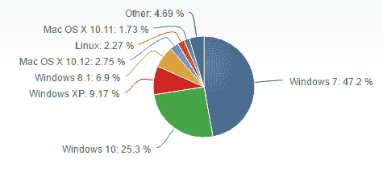

# 第一章：数字取证与证据获取

本章将涵盖以下内容：

+   识别证据来源

+   获取数字证据

+   确保证据在法医上是可靠的

+   编写报告

+   数字取证调查：一个国际化的领域

+   从 Windows 系统获取数字证据的挑战

# 介绍

数字取证是一个广泛的术语，可以涵盖多个学科领域。广义来说，它指的是对在计算设备上或借助计算设备实施的犯罪进行调查。几年前，这种方法可能只适用于调查财务欺诈、知识产权盗窃或类似的案件，这些案件中计算机在犯罪的实施过程中是必不可少的。

然而，在当今世界，数字设备的普及程度已经到了这样一个地步，即使是看似与计算机无关的犯罪——例如家中的盗窃，珠宝被偷，或者一个从学校回家的孩子被绑架——也可能涉及大量的数字证据。

*数字证据*是指任何与调查相关且可以在数字设备上找到的内容。随着数字设备种类的增加，数字设备的范围几乎涵盖了我们周围的一切——不仅是计算机和手机，还有汽车、电视、冰箱和暖气系统等。

数字取证作为一个学科，不仅仅是解决犯罪问题。公司中的人力资源问题、私人或民事案件，以及日常的数据恢复工作，都可以归入数字取证的范畴。因此，可以合理地说，数字取证不仅是一个庞大的领域，而且还在不断扩展。基于这一点，在本书中，我们决定专注于数字取证的一个特定方面：Windows 操作系统的法医分析。

# 为什么选择 Windows？

我们本可以选择任何操作系统作为本书的主题，更不用说在数字取证调查中出现的无数智能手机和其他连接设备。然而，Windows 对于普通计算机用户和企业来说是一个受欢迎的操作系统——**NetMarketShare** 的最新数据显示，Windows 的市场份额超过了 88%。以下图表展示了 Windows 与 Mac、Linux 以及其他操作系统的市场份额对比。

无论你是在执法机关工作、在数字取证公司工作、作为该领域的学术研究员，还是作为自由职业者从事调查工作，你都会在某些时刻遇到 Windows 系统。

我们编写本书的目标是创建一种*食谱式*的指南，允许你随时翻阅，使用这些食谱帮助你的调查。

在 Windows 机器上经常运行的操作系统和程序种类繁多，使得提供一份完整的指南变得困难。尤其是考虑到最近的改版，导致了 Windows 8、Windows 8.1 和 Windows 10 的推出，它们将程序称为应用程序，并且在法医分析和用户体验方面与早期版本略有不同。我们尽力在本书中突出调查中的最重要点，并讨论最新版本变化的广泛影响。

# Windows 文件系统

Windows 机器使用 NTFS，曾经代表新技术文件系统（New Technology File System），虽然这个缩写现在已经过时。所有版本的 Windows 默认都运行在 NTFS 上。

关于 NTFS，最需要记住的事情是所有东西都是文件。文件系统创建的初衷是它可以轻松扩展，并且在各个层次上都具有安全性和可靠性。然而，这也为取证调查和管理使用带来了一些独特的挑战，了解任何文件都可以位于系统的任何地方，使得在分析机器时，理解自己看到的内容变得更加具有挑战性。

**主文件表**（**MFT**）是文件系统的基础。在这里，我们可以找到有关文件的所有相关信息。值得注意的是，MFT 中的第一个条目是一个指向 MFT 本身的条目，这可能会让初学者在 Windows 文件系统分析时感到困惑。

在 Windows 调查中，最重要的元素之一是注册表，其中存储着关于系统配置的信息以及其他取证宝贵资料。像 RegEdit 和 RegRipper 这样的工具在注册表分析中非常有用，许多广泛使用的通用取证程序，如**EnCase**和**BlackLight**，也能派上用场。

本书将讨论 Windows NT 文件系统中各种调查元素的具体内容。目前需要记住的最关键点是：NTFS 中的所有内容都是文件；主文件表是文件系统的基础；注册表包含有用的系统配置信息。

# 识别证据来源

正如任何数字取证调查员所知道的，几乎所有案件所面临的主要挑战之一就是需要处理的数据量和可供分析的来源。一个有用的技能是能够查看与案件相关的证据来源，并作出价值判断，判断哪些证据可能最有用。

从案件开始时，这可能表现为确定需要从犯罪现场移除哪些物理物品——计算机和手机几乎总是被扣押，但像 USB 闪存、智能电视和卫星导航系统怎么办？你又如何把一台连接 WiFi 的冰箱放进法拉第袋里呢？

开个玩笑，一旦调查员确定了他们将尝试提取证据的项目，接下来的难题是弄清楚哪些证据最为相关，以及它们可以从哪里找到。

在 Windows 系统中，有多个元素在不同类型的调查中都会证明非常有用。虽然一些元素会因案件不同而有所变化——例如，寻找知识产权盗窃或金融欺诈的证据，与在儿童保护调查中寻找的来源大相径庭——但总体而言，以下的证据来源通常能提供有用的信息，从中可以进一步推断。

在较早的 Windows 版本中（大约在 XP 和 2000 时期），处理的程序较少，因此潜在的证据来源也较少，但也因此造成的混淆较少。XP 是 Windows 开始支持 NT 文件系统的时期，它提升了之前的 FAT 文件系统，并允许对系统进行更深入的分析。

Prefetch 文件是在 XP 中引入的，并迅速成为最相关的证据来源之一，至今依然如此。从用户体验的角度来看，主要目的是加速操作。Prefetch 文件记录了哪些程序被最频繁使用，并确保这些程序预先加载到内存中，这样当用户启动计算机并尝试访问某个程序时，它会更快地加载。从法医的角度来看，这意味着 Prefetch 文件提供了大量关于用户一般计算机习惯的信息——他们最常使用哪些程序，以及在某种程度上，它们是如何被使用的。Prefetch 文件存储在 `%SystemRoot%Prefetch` 目录中，并将在 第七章 中详细讨论，*主要 Windows 系统文物*。

随后的 Windows 更新引入了越来越复杂的元素，其中最相关的之一就是 **BitLocker**。

BitLocker 提供了完整的卷加密，并且还包括一个针对便携设备的版本，称为 **BitLocker To Go**。只要知道密码，解密 BitLocker 信息相对简单，并且可以使用一系列法医软件进行解密，书中稍后会详细介绍其中的一些。判断一个卷是否使用 BitLocker 加密的最简单方法是查看卷头中是否存在 `-FVE-FS-`。一旦确定了这一点，并找到了或恢复了密码，就可以使用 FTK 或 EnCase 等工具来解密信息。

与 BitLocker 推出时相似，随着 Windows Vista 的发布，Windows 系统中用户帐户的结构也发生了变化。这一点主要从用户本身的角度来看，主要的变化是，许多以前任何用户都可以进行的系统级别的修改，现在只能由管理员进行。这在取证过程中也是一个重要点，特别是在计算机有多个用户，其中只有一个用户有管理员密码的情况下。

Internet Explorer 及其继任者 Microsoft Edge，多年来经过了多次彻底的更新。稍后我们将更详细地分析 Edge，但目前可以说，浏览器中包含大量有价值的信息。可以说，Internet Explorer 中最重要的元素之一就是缓存，它包含了有关用户访问过的页面以及任何已下载内容的信息。

私密浏览是 Windows 系统中最终用户最常误解的选项之一：虽然这可能防止家中其他人发现用户的隐秘上网习惯，但它当然仍然可以进行取证调查。

越来越多的用户意识到，数字取证方法可以提取的信息量，而近年来，操作系统、应用程序和软件中的隐私选项已成为许多计算机用户日益关注的问题。这导致了替代软件的安装和使用逐渐增加，例如 Tor 浏览器，它声称可以防止他人揭示终端用户的真实位置。然而，即便是这些方法也并非无法被取证调查发现，正如**Epifani 等人于 2015 年数字取证研究研讨会**上所展示的那样。

任何试图模糊或大规模删除数据的行为都应引起调查员的高度怀疑；反取证方法越来越普遍，但与此相对应的，取证分析师也有越来越多的方法来揭示用户试图隐藏的元素。

# 确保证据的取证有效性

数字调查中的证据链至关重要。它不仅展示了在任何特定时刻谁访问了证据，还 - 至少在理论上 - 显示了证据被扣押后所做的处理，以及为确保证据的保存和完整性所采取的措施。

对于在团队中工作的调查员，比如执法机构或公司内部的工作人员，通常会有一个已经建立的流程可供遵循，按照机构或公司提供的指导方针进行操作。对于自由职业者和个人调查员（或者认为自己公司收集程序需要一些改进的调查员），重要的是要牢记一些基本原则。

你作为调查员所需展示的法医完整性水平，可能至少部分取决于你所处理案件的性质。例如，民事案件通常不需要像刑事调查那样高的证据完整性，因为民事案件较少会进入法庭。然而，良好的做法是养成保持尽可能高的法医完整性的习惯；这样做意味着，如果将来你专注于更深入的调查，你将已经习惯为你的法医检查设定正确的基础工作。

通常，在收集证据时，只需对设备进行成像——也就是创建其中数据的精确副本——然后将此法医图像作为分析的基础，而不是对从现场查获的物理设备进行分析。有时，你还可能需要验证副本的真实性，并确保你用于复制数据的过程没有以任何方式改变数据。审计记录是这一过程的重要组成部分——如果你能展示数据源存储的位置、存储在哪些设备中、存储多长时间以及谁曾访问过这些数据，这应该就足够了。

从调查现场移除数字证据源是此过程中的第一步，必须小心谨慎地进行。关闭或拔掉机器电源、输入密码、移动鼠标或与犯罪现场调查中遇到的任何物品进行其他类型的交互，可能会对调查结果产生不可预测的影响。有时，设备被设置为关闭时自动清除数据；有些设备在密码输入错误时会加密所有数据。

在大多数情况下，调查员会被鼓励将证据源保留在其发现时的状态。例如，如果从现场回收了一部手机，它可能会被放入法拉第袋中，这将屏蔽电场，因此在手机运输过程中阻止信号通过。

如果没有办法在不以某种方式篡改物品的情况下将其移出现场——例如，如果一台台式电脑已经插上电源并开机，但需要被带走进行分析——负责移除该物品的人应该具备专业资格，确保除绝对必要的更改外，其他任何变化都不会发生，并且所有操作都应在审计记录中详细记录。

这听起来可能像是一个相对直接的过程——除非绝对必要，否则不要改变任何东西；如果确实需要更改，确保执行更改的人有资格进行操作；并且要记录所有发生的事情。然而，这是关于证据保存基本要求的广泛概述，这些要求会根据当地或国家的立法有所不同——有时甚至差异很大。成为计算机取证专家最具挑战性的一点是，计算机犯罪往往具有国际性质，调查跨越几个大洲甚至一个国家内的多个州也是常见的。

因此，在涉及数字取证证据的识别、收集、保存和分析时，验证当地的立法要求至关重要，特别是如果你所处理的案件可能最终进入法庭。

# 编写报告

如前述部分提到的链条保管/审计记录，报告写作的风格无疑会根据立法要求、公司或机构的指南以及个别调查员的风格有所不同。再一次，掌握数字取证报告写作的基础知识是非常有意义的，这样你就能在灵活的技能范围内开展工作。

报告的内容可能根据最终阅读者的不同而大不相同。如果你正在调查一起民事纠纷，那么你的最终报告可能不会使用高度技术化的语言，可能只会用普通人能够理解的术语概述所使用的方法以及所发现的内容。然而，如果你需要作为专家证人在法庭上作证，那么无疑需要更高水平的技术细节和更深入的调查过程展示。

广义来说，大多数数字证据报告应该包括以下内容：

+   主要调查员的姓名、职务和公司。

+   数字取证检验员的姓名、职务和公司（如果与前述人员不同）。

+   案件的简要描述，包括正在调查的活动性质。

+   被调查的个人或设备、数据的所有者姓名。

+   调查的开始和结束日期。

+   在整个调查过程中使用的方法，包括但不限于证据的识别、收集、保存和分析。这还可能包括使用的工具和过程的详细信息，以及链条保管的副本。

+   调查结果的概述，依据报告开始时指定的原始活动，以及在调查过程中发现的任何其他相关信息。

+   截图、打印件或其他证据项目，展示案件结果。

+   结果分析，包括关于被告是否有罪或无罪的任何结论。

+   任何附录、词汇表或其他可能对报告读者有用的信息。

许多取证工具会生成自己的报告，格式可以是数字版或可打印版，样式多种多样，例如 PDF、Excel 文档或 Word 文件。一些软件包，如 Nuix 的 Investigators Suite，包含像 Web Review 和 Analytics 这样的附加功能，允许多个用户查看或在同一案件上协作。这在调查过程中非常有用，因为它可以让管理员或高级调查员分配案件中的特定角色，也能在编写报告时派上用场。某些用户只能访问最终报告，他们可以查看已找到的结果并以用户友好的图表形式展示；如果他们具有正确的权限，还可以进一步查看证据。以下图表展示了 Nuix Web Review 和 Analytics 界面的仪表板，允许用户在数字取证调查中查看和管理证据。

# 数字取证调查 - 一个国际化领域

正如我们简要讨论的那样，数字取证调查员所遇到的最大挑战之一，无论是刑事案件还是民事案件，都是他们调查范围的国际性。

在调查像**DDoS**攻击（即一个人或一群人通过请求淹没网站或计算机，导致其无法正常工作）、在线信用卡信息盗窃或银行欺诈等案件时，调查员可能会发现嫌疑人分布在全球各地。例如，在菲律宾涉及儿童虐待直播的案件中，调查员遇到的一个主要问题是，观看直播内容的人也是调查对象，但他们分布在世界各地，由于许多人使用各种隐匿手段，追踪起来非常困难。世界各国的法律也各不相同：一个国家的立法可能会造成法律漏洞，给案件带来麻烦，并影响案件是否能够最终得出结论或被搁置。

犯罪日益全球化意味着这是一个我们无法忽视的问题——它不会消失。相反，这个问题看起来只会随着每年的推移而进一步加剧。如今，我们的数据存储在云端——如今，我们的数据存储在云端；我们互动的对象不仅仅是我们在现实生活中遇到的人，而是那些我们曾经称为陌生人的人，现在越来越多地成为我们社交互动的基础；我们的银行账户几乎可以在全球任何地方访问，且常常支持多种货币。仅仅追踪一个单纯生活在 21 世纪的个人的行为和数据痕迹就已经足够困难，更不用说试图调查一个分布在不同地理位置、并且有意持续伪装数据、隐藏自己的人群了。

然而，进展已经取得。近年来，许多项目纷纷出现，旨在解决国际调查所带来的具体挑战。一个例子是 EVIDENCE 项目，由意大利律师 Maria Angela Biasotti 协调，她与欧洲各地的同事合作，致力于开发一个关于电子证据的共同理解，以及一个更具全球可行性的跨国合作方式，同时推动全球范围内更标准化的刑事调查程序。

这是一个值得称赞的目标，至少 EVIDENCE 项目正在朝着这个方向快速推进；在撰写本文时，几个成员国之间的测试实施正在进行中。然而，目前，调查人员仍然面临着需要处理涉及国际数据来源和影响的案件的挑战。

# 那么，在此期间，我们可以做些什么来简化这一过程呢？

在接手案件之前进行范围评估是一个良好的做法，无论案件的大小或相对重要性如何，但当涉及国际因素时，这一点尤为重要。这些因素可能会影响获取证据所需的时间：例如，如果你需要从另一个国家，甚至是另一个州的服务器中提取数据，你至少需要对获取访问权限的要求有基本的了解，甚至了解是否可能做到这一点。

当然，完全了解全球各地与数字取证调查相关的各种法律是不可能的。实际上，调查人员能做的最好的事情，就是尽可能全面地了解本地区的法律，然后在需要跨境工作时寻求建议。

然而，除了立法元素外，国际调查中还有一些更为平凡的方面，例如语言分析。关键字搜索通常是调查的起点，或者至少是在开始阶段的某个环节——但如果你的案件涉及多个国家，你可能会对关键词感到迷茫。

大多数大型数字取证解决方案，如 EnCase 和 **Nuix Investigator**，都内置了多语言关键词能力，这非常有帮助。有些甚至可以扫描你输入的证据，然后返回关于案件中使用的语言的分析结果。你可以利用这些分析结果为你的调查奠定基础，并指导未来的搜索。然而，俚语仍然是许多人的难题，犯罪分子也越来越聪明。尽管词典可以提供与毒品滥用、儿童剥削或金融诈骗相关的给定术语的多个同义词，但它可能无法涵盖人们在讨论中使用的所有不太正式的词汇。

然而，进展正在取得，许多数字取证会议和研究小组的讨论时间都致力于探讨作为调查员的我们如何增加合作，并使调查全球案件变得更容易。

# 从 Windows 系统获取数字证据的挑战

调查 Windows 机器的挑战之一是 NTFS 的设置方式。这意味着，判断你所看到的内容是文件系统的一般属性，还是某个特定应用程序的属性可能会变得困难。你在调查职业中的经验越多，当然会越擅长区分这些情况，但对于初入职场的调查员而言，这一点尤其值得注意。

除了基本的文件系统挑战，Windows 系统不断更新的方式也可能带来进一步的数字取证调查障碍。曾在运行 Windows 7 的机器上有效的方法，可能在运行 Windows 8.1 的机器上不起作用；Windows 10 则是一个充满新兴且有趣的取证元素的雷区（更不用说它带来的隐私问题，这些问题促使越来越多的用户实施自己的数据模糊化和个人隐私保护措施）。更糟糕的是，如果你碰到一台太旧的机器，现代的取证软件可能都忘记如何分析它了！

Windows 10 的运行方式对取证检查员尤为重要，不仅因为它被强制推广到全球用户，而且因为组织结构发生了显著变化。我们将在本书末尾更详细地讨论这一点，在那里将有一个完整的章节专门讨论运行 Windows 10 的机器的取证分析，但总体来说，从取证的角度来看，不同之处在于应用程序和程序不仅仅有不同的名称；它们的工作方式也略有不同。最终用户越来越希望拥有更轻便、快速运行的设备，使他们的工作和个人生活更加便利，这意味着，反过来，微软等技术公司正在与其他实体合作，使个人电脑不再是一个独立的设备，而更像是一个访问存储在其他地方的数据的门户。完全有可能扣押一个设备，其中文档存储在 Google Drive 上；Skype 上的语音和视频通话通信；Instagram 是在 PC 上访问的应用程序，而不仅仅是在智能手机上；Facebook 不是通过互联网浏览器访问的网站，而是一个独立的应用程序。

尽管我们已经讨论过有关国际云数据存储的法律挑战，但拥有如此丰富的独立应用程序来分析案件使得情况变得更加复杂。用户还可以添加或创建自己的程序，这使得调查方法变得越来越复杂，通常是一个迷宫般的调查方法。

因此，尽快缩小调查范围变得越来越必要，找出用户可能需要执行正在调查的活动的应用程序和服务的种类。再次强调，这并不总是容易的；我们只能尽力而为！

对于数字取证调查，现在比以往任何时候都更加重要的是分类、国际合作以及调查人员对技术的理解。在*Windows 取证手册*中，我们希望为您提供一个基础，让您可以构建自己的调查技术。

1.  [`www.netmarketshare.com/operating-system-market-share.aspx?qprid=10&qpcustomd=0`](https://www.netmarketshare.com/operating-system-market-share.aspx?qprid=10&qpcustomd=0)，访问日期为 07/02/2017

1.  [`dfrws.org/sites/default/files/session-files/pres-tor_forensics_on_windows_os.pdf`](https://dfrws.org/sites/default/files/session-files/pres-tor_forensics_on_windows_os.pdf)，访问日期为 09/02/2017

1.  [`articles.forensicfocus.com/2016/05/02/the-investigative-challenges-of-live-streamed-child-abuse/`](https://articles.forensicfocus.com/2016/05/02/the-investigative-challenges-of-live-streamed-child-abuse/)，访问日期为 09/02/2017
