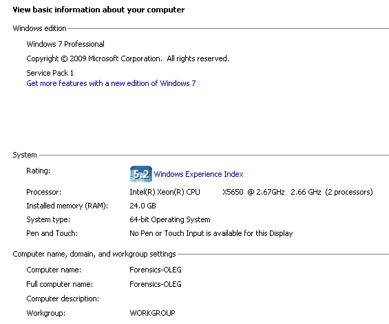

# 第二章：Windows 内存获取与分析

本章将涵盖以下内容：

+   使用 Belkasoft RAM Capturer 进行 Windows 内存获取

+   使用 DumpIt 进行 Windows 内存获取

+   使用 Belkasoft Evidence Center 进行 Windows 内存镜像分析

+   使用 Volatility 进行 Windows 内存镜像分析

+   Windows 版本的差异

# 介绍

内存分析是一个相对较新的领域，但它越来越相关。内存镜像可以像物理图像一样获取，但使用不同的工具来实现，其中一些将在本节中讨论。

图像可以以多种格式存储，具体取决于用于获取图像的工具。一旦调查员获取了图像，他们就可以分析其中的数据。

与内存取证相关的主要挑战之一是数据保存。尽管在某些调查中，您唯一的选择可能是关闭系统然后获取其中的数据，但实际上这会影响到可能稍后对案件有重要意义的其他潜在数据源。因此，在决定选择哪种方法之前，必须充分了解您所调查的现场情况以及案件的具体需求。每次与系统互动时，您都会因在场而改变某些东西。然而，内存获取可以帮助减少调查员对收集的数据的影响，因为内存镜像会在特定时刻对易失性内存进行采样，从而创建一种可以稍后分析的快照。

在调查员到达现场时，如果机器仍然开机，系统中的内存此时是易失的。这意味着，如果您能够在当时获取内存镜像，您将能够看到在获取镜像时计算机内存的快照。这非常有用，特别是如果嫌疑人刚刚逃离现场或在现场被捕。

如果您想要获取易失性内存，通常需要在计算机上拥有管理员权限，除非您使用硬件解决方案。一个这样的解决方案是**CaptureGUARD 物理内存获取硬件**。它需要在系统上安装一个小的 CaptureGUARD 驱动程序，并创建一个标准的 WinDD 格式内存转储。您可以在图 2.1 中看到其中一种设备。


图 2.1\. ExpressCard

换句话说，内存取证是一个复杂且容易变化的领域。在选择在现场使用哪些工具之前，您需要对所使用的工具集有透彻的了解，并了解它们可能对易失性内存产生的影响。然而，如果您确实成功获取了内存镜像，它可以为您的案件提供大量有用的信息。

# 使用 Belkasoft RAM Capturer 进行 Windows 内存获取

Belkasoft RAM Capturer 是任何数字取证检查员必备的免费工具。它体积小、易于使用，能够从 Windows 系统中获取内存，包括 Windows 10，即使它们被活跃的反调试或反转储保护系统保护。

# 准备就绪

你有两个下载工具的选项。如果你是 Belkasoft 的客户并且拥有 Belkasoft Evidence Center 许可证，去你的客户门户，你可以在“免费产品”部分找到 Belkasoft RAM Capturer 的下载链接。如果你不是客户，只需访问 Belkasoft 网站上的“下载”部分，选择你想下载的产品——在我们的案例中是 Belkasoft Live RAM Capturer——并填写一个简短的联系信息表格。下载后，一个链接将会发送到你提供的电子邮件。

准备闪存驱动器以进行获取的步骤如下：

1.  必须有足够的空间来存储内存镜像。

1.  必须通过擦除来消毒。

1.  将你从下载的压缩包中提取的两个文件夹放入闪存驱动器。

别忘了为获取准备闪存驱动器。首先，它必须有足够的空间来存储内存镜像。其次，它必须通过擦除进行消毒。最后，将从下载的压缩包中提取的两个文件夹放入闪存驱动器。

# 如何操作…

使用 Belkasoft Ram Capturer 进行 Windows 内存获取的步骤如下：

1.  你必须做的第一件事是了解你正在处理的是哪种系统，x32 还是 x64。你可以很容易地通过右键点击计算机并选择“属性”来查看。在我们的案例中，它是 x64。因此，我们选择`RamCapture64.exe`。

1.  启动后，我们将获得有关物理内存页面大小及其总大小的信息。

1.  现在选择输出文件夹路径，确保它是你的闪存驱动器，而不是本地系统驱动器。

1.  然后只需点击“Capture”！


图 2.2。使用 Belkasoft RAM Capturer 进行内存获取

结果是我们得到一个`.mem`扩展名的文件，大小与物理内存的总大小相同。默认情况下，文件名是获取日期，但我们强烈建议你重新命名它，并添加更多的信息以便识别：操作系统版本、版本、计算机名称和其他信息。

就这样！该镜像已准备好，可以使用内存取证工具进一步分析。

# 它是如何工作的…

Belkasoft RAM Capturer 在内核模式下运行（不像其他一些获取工具那样在用户模式下运行），借助 32 位和 64 位内核驱动程序。它以取证上可靠的方式提取整个物理内存，即使内存被保护，也会保存为一个`.mem`扩展名的文件。

# 另见

Belkasoft RAM Capturer 页面在 Belkasoft 网站上的链接：[`belkasoft.com/ram-capturer`](http://belkasoft.com/ram-capturer)

# 使用 DumpIt 进行 Windows 内存获取

DumpIt 是来自 Comae Memory Toolkit 的免费内存成像工具。它是 Win32dd 和 Win64dd 的融合体，合并在一个可执行文件中。它非常易于使用：即便是非技术人员在紧急情况下也能使用它。DumpIt 支持所有现代 Windows 版本，从 XP 到 10，既支持 32 位也支持 64 位。而且，这个工具有一个非常重要的功能：它在获取过程中显示目录表基址和调试数据结构的地址。

# 准备工作

要获取免费的 DumpIt 副本，访问 Comae Technologies 的网站并点击 GET TOOLS。填写一些信息，包括你的名字、姓氏、公司名称、电子邮件地址、电话号码和网站，你将通过电子邮件收到下载链接。别忘了稍后将该工具放入已擦除的外部硬盘中。

# 如何操作……

这次，我们无需知道我们处理的是哪种操作系统——是 32 位还是 64 位。正如之前所说，DumpIt 是 Win32dd 和 Win64dd 的融合体，合并在一个可执行文件中。所以，只有两个步骤：

1.  将外部硬盘插入目标系统

1.  启动`DumpIt.exe`并输入`y`以开始获取过程


图 2.3\. 使用 DumpIt 进行内存获取

获取结果后，你将得到两个文件：一个 DMP 扩展名的文件和一个 JSON 扩展名的文件。第一个文件是目标系统的内存转储，文件名中包含计算机名称、日期和时间（UTC），第二个文件是转储信息，包含从取证角度来看非常重要的信息。它包括文件大小、系统架构类型（32/64）、KdCopyDataBlock、KdDebuggerData、kdpDataBlockEncoded、sha256 哈希值等等。所以，DMP 文件已经准备好，可以使用你选择的内存取证软件进行分析了。

# 它是如何工作的……

由于 DumpIt 是 Win32dd 和 Win64dd 的融合，它能够自动检测系统架构类型，并创建一个内存快照和一个 JSON 格式的文件，包含所有你需要的分析信息，可用于进一步通过内存取证工具进行分析，如 Volatility、Rekall、Belkasoft Evidence Center 等。

# 另见

Comae Memory Toolkit（DumpIt 和 Hibr2Bin 属于其中一部分）的网页：

[`comae.typeform.com/to/XIvMa7`](https://comae.typeform.com/to/XIvMa7)

# 使用 Belkasoft Evidence Center 分析 Windows 内存镜像

在前面的教程中，我们成功创建了两个内存取证镜像，一个使用 Belkasoft Live RAM Capturer，另一个使用 DumpIt。现在是时候进行分析了。让我们从第一个镜像开始，使用 Belkasoft Evidence Center 进行分析。

Belkasoft Evidence Center 是一款强大的数字取证工具，能够解析不仅来自内存镜像的数据，还能解析来自计算机硬盘和移动设备的镜像数据。从内存转储中，它可以提取出有价值的证据，如社交网络、即时通讯、聊天室、网页邮件系统的通信残留数据、云服务数据、网页浏览痕迹等。

# 准备工作

如果您没有有效的 Belkasoft Evidence Center 许可证，您可以从官方网站下载一个功能齐全的试用版。为此，请访问 Belkasoft 网站的下载部分，选择您想下载的产品，在我们的例子中是 Belkasoft Evidence Center（试用版） - 并提供您的联系信息，包括您的名字、姓氏、电子邮件、公司和国家。在下载后，下载链接将发送到您的电子邮件。如果您是持证用户，只需进入客户门户并下载最新版本的产品。

# 如何操作...

使用 Belkasoft Evidence Center 分析 Windows 内存映像的步骤：

1.  为此，请在“打开案件”窗口中点击“新建”。现在，您需要填写几个字段：

    +   案件名称 - 通常我们使用案件编号和年份作为案件名称，但这次由于是为测试目的创建，我们将其命名为 `Belkasoft Memory Forensics Test`。

    +   **根文件夹** - 在此，您应选择案件数据存放的文件夹。就我们而言，是 D: 驱动器。

    +   **案件文件夹** - 此字段会根据前两个字段自动填写，因此在我们的例子中，它是 `D:\Belkasoft Memory Forensics Test`。

    +   **调查员** - 在此字段中输入您的姓名。

    +   **时区** - 选择正确的时区非常重要。如果您已经知道正确的时区，请选择它。如果不确定，我们建议选择 UTC +00:00。就我们而言，我们知道时区，所以可以选择正确的时区（UTC +03:00）。

    +   **描述** - 如果您想为您的数字证据项添加描述，请在此字段中填写。我们使用的描述是：`解析使用 Belkasoft Live RAM Capturer 创建的内存映像用于测试目的`。


图 2.4\. 在 Belkasoft Evidence Center 中创建新案件

1.  点击“确定”，您将看到下一个窗口 - 添加数据源。

Belkasoft Evidence Center 支持不同种类的证据来源，从物理驱动器和驱动器映像，到移动备份，当然还有内存映像，包括 `pagefile.sys` 和 `hiberfil.sys`。

因为我们现在讨论的是内存取证，让我们选择之前使用 Belkasoft RAM Capturer 获取的映像作为数据源。


图 2.5\. 在 Belkasoft Evidence Center 中将之前获取的内存映像作为数据源添加

1.  点击“下一步”选择您要搜索的数据类型。为了测试，我们选择了所有可用的数据类型，但您可以选择您真正需要的，以减少处理时间。

别忘了进入高级选项并启用 BelkaCarving - 它将帮助您恢复碎片化的数据，例如图片。


图 2.6\. 在 Belkasoft Evidence Center 中选择数据类型

1.  好的，我们准备好开始解析内存映像了 - 只需点击“完成”。

BEC 花了大约一个小时来解析和雕刻该镜像，最终我们得到了令人印象深刻的结果：9728 个网页浏览器证据，2848 张图片，74 个聊天证据，等等。


图 2.7\. 使用 Belkasoft Evidence Center 处理内存镜像的结果

如您所见，您只需点击几下，就可以从内存镜像中提取出大量有价值的数字证据。因此，如果您能够访问正在运行的系统，请养成捕获内存镜像的习惯。例如，这可能帮助您恢复通过匿名工具（如 Tor 浏览器）浏览的历史记录，而这些工具在犯罪分子中广泛使用，也能找出其他可能只存在于易失性内存中的重要数字证据。

# 它是如何工作的...

Belkasoft Evidence Center 解析内存镜像结构并提取可用数据，将其放入相应类别。BelkaCarving 选项允许该工具重建碎片化的数据，例如图像。

# 另请参见

Belkasoft 官网上的 Belkasoft Evidence Center 页面: [`belkasoft.com/ec`](http://belkasoft.com/ec)

BelkaCarving: [`ru.belkasoft.com/en/bec/en/BelkaCarving.asp`](http://ru.belkasoft.com/en/bec/en/BelkaCarving.asp)

# 使用 Volatility 对 Windows 内存镜像进行分析

Volatility 框架是一个开源工具集，使用 Python 编写，用于从内存镜像中提取数字证据。这次，我们将使用之前通过 DumpIt 获取的第二个内存镜像作为数据源，向您展示如何使用该工具集进行内存取证。

# 准备工作

Volatility 框架是一个开源工具包，因此它是跨平台的，这意味着您可以使用任何操作系统 - Windows、Linux 或 macOS。当然，您可以从源代码构建这些工具，但也有所谓的独立可执行文件，适用于所有上述操作系统。由于本手册是关于 Windows 操作系统和内存转储的取证检查，我们将分析从 Windows 10 收集的数据，并且我们将使用 Windows 独立可执行文件。

在编写本文时，Volatility 的最新版本是 2.6\. 在该版本中，改进了对 Windows 10（包括 14393.447）的支持，同时增加了对 Windows Server 2016、macOS Sierra 10.12 和带有 KASLR 内核的 Linux 的支持。

要下载工具集，请访问 Volatility 框架官网，使用 Releases 标签选择最新版本，在我们的案例中是 2.6\. 现在，您只需解压刚刚下载的 volatility_2.6_win64_standalone.zip，您就可以开始使用了。

# 如何操作...

为了展示 Volatility 的强大功能，我们决定使用一份已知恶意软件感染系统的内存镜像——**Stuxnet**。为什么这么做？因为这份内存镜像是公开可用的，您可以下载它并用来进行培训。

首先，让我们收集一下关于我们镜像的信息。

1.  为此，请启动 `cmd.exe`。

1.  切换到包含 Volatility 独立可执行文件的目录，并使用 `imageinfo` 插件：

```
volatility_2.6_win64_standalone.exe -f 
X:stuxnet.vmem imageinfo
Volatility Foundation Volatility Framework 2.6
INFO : volatility.debug : Determining profile based 
on KDBG 
search...
Suggested Profile(s) : WinXPSP2x86, 
WinXPSP3x86 (Instantiated    with WinXPSP2x86)
AS Layer1 : IA32PagedMemoryPae (Kernel AS)
AS Layer2 : FileAddressSpace (X:stuxnet.vmem)
PAE type : PAE
DTB : 0x319000L
KDBG : 0x80545ae0L
Number of Processors : 1
Image Type (Service Pack) : 3
KPCR for CPU 0 : 0xffdff000L
KUSER_SHARED_DATA : 0xffdf0000L
Image date and time : 2011-06-03 04:31:36 UTC+0000
Image local date and time : 2011-06-03 00:31:36 
-0400

```

`imageinfo` 插件返回了两个建议的配置文件。我们知道此镜像来自运行 Windows XP Service Pack 3 的系统，因此正确的配置文件是 WinXPSP3x86。

现在我们知道了正确的配置文件，可以将其作为选项来收集有关感染机器上运行的进程的信息。

1.  为此，我们可以使用 `pslist` 插件：

```
volatility_2.6_win64_standalone.exe -f X:stuxnet.vmem 
-- 
profile=WinXPSP3x86 pslist

```


图 2.8\. Volatility pslist 插件输出

你看到什么可疑的地方吗？是的，有三个 `lsass.exe` 进程，这也是 Stuxnet 感染的迹象之一。

通常情况下，应该只有一个 `lsass.exe` 进程在运行，因此我们需要确定哪两个是恶意的。

1.  看看图 2.8 中的时间戳。三者中有两个进程是在 2011 年启动的。很奇怪，不是吗？现在让我们使用 `pstree` 插件：

```
volatility_2.6_win64_standalone.exe -f X:stuxnet.vmem -- profile=WinXPSP3x86 pstree

```


图 2.9\. Volatility pstree 插件输出

我们的可疑进程 `lsass.exe` 通常是由 `winlogon.exe` 启动的。

1.  让我们看看图示：只有一个 `lsass.exe` 是由 `winlogon.exe` 启动的——PID 为 680；另外两个是由 `services.exe` 启动的！因此，PID 为 `868` 和 `1928` 的 `lsass.exe` 进程可能是恶意的。

1.  我们有两个潜在的恶意进程。让我们使用 `dlllist` 插件检查这些进程加载的 DLL：

```
volatility_2.6_win64_standalone.exe -f X:stuxnet.vmem 
-- 
profile=WinXPSP3x86 -p 868

```


图 2.10\. Volatility dlllist 插件输出，显示 PID 为 868 的可疑进程

```
volatility_2.6_win64_standalone.exe -f X:stuxnet.vmem 
profile=WinXPSP3x86 -p 1928

```


图 2.11\. Volatility dlllist 插件输出，显示 PID 为 1928 的可疑进程

1.  看看图 2.11。有什么可疑的地方吗？是的！根据 F-Secure 网站上的 Stuxnet 威胁描述，一个加密的 DLL 文件应该被注入到一个进程中，并且它的名称结构是：[normaldll].ASLR.[random]。

1.  看起来熟悉吗？我们发现了另一个 Stuxnet 的痕迹——`KERNEL32.DLL.ASLR.0360b7ab`。

还有一个非常有用的 Volatility 插件——`malfind`。这个插件帮助数字取证检查员在用户模式内存中发现隐藏或注入的代码/DLL。让我们用它来检查我们可疑的 `lsass.exe` 进程：

```
volatility_2.6_win64_standalone.exe -f X:stuxnet.vmem 
-- 
profile=WinXPSP3x86 malfind -p 868 --dump-dir 
X:Stuxnet

```


图 2.12\. Volatility malfind 插件输出，显示 PID 为 868 的可疑进程的一部分

如您所见，我们还使用了 `--dump-dir` 选项将 DLL 导出到一个文件夹。之后，我们可以将它们上传到 VirusTotal 等地方检查。当然，绝大多数 DLL 都被检测为恶意。例如，`process.0x81c47c00.0x80000.dmp`，它是从 PID 为 `1928` 的 `lsass.exe` 中提取的，被 Dr.Web Antivirus 检测为 **Trojan.Stuxnet.1**。

有许多其他 Volatility 插件可供使用。您可以在 Volatility 基金会网站上的文档中了解更多有关它们的信息。

# 它是如何工作的...

以下列表解释了配方中使用的插件。

1.  `Imageinfo`：这个插件收集关于你正在分析的内存映像的一些基本信息：操作系统、服务包、硬件架构；还包括有用的信息，如 DTB 地址、KDBG 地址和映像创建的时间戳。

1.  `Pslist`：这个插件显示系统中的进程，包括偏移量、进程名称、进程 ID、父进程 ID、线程数、句柄数、进程启动和退出的日期/时间、会话 ID 以及进程是否为 WoW64 进程。

1.  `Pstree`：这个插件的功能与 `pslist` 相同，但以树形结构显示进程列表。它使用缩进和句点来表示子进程。

1.  `Dlllist`：这个插件会显示进程加载的 DLL，或者如果没有使用 `-p` 或 `--pid` 开关，则显示所有进程的 DLL。

1.  `Malfind`：这个插件允许检查员检测并提取用户模式内存中隐藏或注入的代码/DLL，以便进一步进行杀毒扫描和分析。

# 另见

Volatility 文档：[`github.com/volatilityfoundation/volatility/wiki`](https://github.com/volatilityfoundation/volatility/wiki)

一个被 Stuxnet 感染的系统的内存映像：[`github.com/ganboing/malwarecookbook`](https://github.com/ganboing/malwarecookbook)

Stuxnet 威胁描述：[`www.f-secure.com/v-descs/trojan-dropper_w32_stuxnet.shtml`](https://www.f-secure.com/v-descs/trojan-dropper_w32_stuxnet.shtml)

# Windows 版本的变种

如你在第一章所知，现如今我们有多种不同版本的 Windows 操作系统，它们被个人和企业广泛使用。当然，这对 Windows 操作系统的取证检查，包括 Windows 内存取证，产生了影响。

# 准备就绪

了解 Windows 版本及其类型非常重要，无论是在获取还是分析阶段。收集此信息有几种方法，我们将在本章中介绍一些。

# 如何操作...

发现计算机运行的是哪个版本的 Windows，最简单的方法是按照以下步骤进行：

1.  点击开始菜单。

1.  进入运行。

1.  在搜索框中输入 `winver` 并按 *Enter*。

这将在安装了 Windows 7 或更早版本的机器上工作。对于 Windows 8 及之后的版本：

1.  你需要按住*Windows*键并同时按下*R*

1.  在弹出的框中输入 `winver` 并按 *Enter*

这将打开一个小的 Windows 关于框，提供有关版本的信息以及构建号：


图 2.13\. 关于 Windows 框

为了收集更多信息，请执行以下步骤：

1.  进入开始菜单

1.  右键点击计算机并从上下文菜单中选择属性

此外，你还可以在桌面上找到我的电脑、计算机或此 PC 的快捷方式，右键点击其中任何一个并从上下文菜单中选择属性：



图 2.14\. 计算机属性

正如图 2.14 所示，使用这项技术，你可以收集更多关于你所处理的机器的信息，包括服务包、系统类型、计算机名称等。

# 还有更多...

如果你计划使用 Volatility 进行内存取证分析（我们强烈推荐使用它，因为它是功能最强大的工具，拥有大量插件，而且它是免费且开源的），选择正确的配置文件非常重要。为此，你需要知道系统类型、操作系统版本和构建号。正如你在之前的示例中学到的，如果在采集阶段没有正确记录这些信息，`imageinfo` 插件可以帮助你完成这项任务。

表 2.1 包含了在撰写本文时，最新版本的 Volatility 框架中添加的配置文件信息。

| **操作系统** | **版本** | **配置文件** |
| --- | --- | --- |
| Windows 10 x64 | 10.0.10586.306 | Win10x64_10586 |
| Windows 10 x64 | 10.0.14393.0 | Win10x64_14393 |
| Windows 10 x86 | 10.0.10586.420 | Win10x86_10586 |
| Windows 10 x86 | 10.0.14393.0 | Win10x86_14393 |
| Windows Server 2008 R2 SP1 x64 | 6.1.7601.23418 | Win2008R2SP1x64_23418 |
| Windows Server 2008 R2 x64 | 6.3.9600.18340 | Win2012R2x64_18340 |
| Windows 7 SP1 x64 | 6.1.7601.23418 | Win7SP1x64_23418 |
| Windows 7 SP1 x86 | 6.1.7601.23418 | Win7SP1x86_23418 |
| Windows 8 x64 | 6.3.9600.18340 | Win8SP1x64_18340 |

表 2.1. Volatility 2.6 配置文件列表

此外，需要注意的是，在所有 x64 的 Windows 8/2012（及更高版本）上，KDBG（它包含了正在运行的进程和加载的内核模块列表）默认是加密的，因此你应该使用 KdCopyDataBlock 的虚拟地址。两者的地址都可以通过 **kdbgscan** Volatility 插件收集。
