# 第四章：Windows 文件系统分析

在本章中，我们将讨论以下步骤：

+   使用 The Sleuth Kit 进行 NTFS 分析

+   使用 Autopsy 从 NTFS 恢复文件

+   使用 ReclaiMe 文件恢复从 ReFS 恢复文件

+   使用 PhotoRec 进行文件切割

# 引言

如前言部分所述，Windows 机器使用 NTFS（**新技术文件系统**）。

使用我们将在本章讨论的工具，你不仅能揭示文件信息，还能了解磁盘布局，包括已删除的文件和未分配的空间。在法医调查中，这可能至关重要，尤其是在用户可能尝试使用反取证方法掩盖其行为的情况下。

一些工具还允许你恢复已删除的文件，恢复它们的完整或部分内容，就像它们被删除前的样子。这当然取决于文件被覆盖的程度，但它仍然是发现嫌疑人不希望你看到的内容的一个有用方法。

在文件的元数据被删除的情况下，文件切割被用作尝试恢复文件内数据的一种方法。这需要多个步骤，大部分步骤将由你选择的调查工具集来执行。通常，首先会通过查看文件头来确定文件类型，然后通过拼接文件碎片来构建出一个更准确的文件内容，重现原本存储在机器上的信息。

有几种解决方案可以处理文件系统分析、文件切割以及文件恢复。在本章中，我们将重点讨论 Autopsy、The Sleuth Kit、ReclaiMe 和 PhotoRec。

# 使用 The Sleuth Kit 进行 NTFS 分析

The Sleuth Kit 是一组命令行工具（同时也包含一个库），用于磁盘映像的法医分析。这些工具可以帮助你分析卷和文件系统数据（当然是以非侵入性方式）。它是跨平台的，因此你可以使用任何操作系统来使用这个工具集。它支持 RAW 和 E01 格式的磁盘映像，因此你可以使用你在之前步骤中获取的任何映像。这些工具将在你未来的数字取证工作中非常有用：它支持多种文件系统，包括 NTFS、FAT、ExFAT、EXT2、EXT3、EXT4、HFS 等。

# 准备工作

你可以从 The Sleuth Kit 的官方网站下载 Windows 二进制文件。进入 The Sleuth Kit 部分，点击下载超链接。然后点击 Windows Binaries，下载将开始。目前为止，The Sleuth Kit 的最新版本是 4.4.0，因此我们下载的归档文件名为：sleuthkit-4.4.0.tar.gz。现在，你只需要解压它，就可以开始使用了。

# 如何操作…

打开 Windows 命令提示符并切换到**bin**目录（你可以在你解压下载的文件夹中找到它）。让我们从媒体管理层工具开始：

1.  你应该做的第一件事是弄清楚你的系统卷类型。当然，Sleuth Kit 中有一个工具可以做到这一点，叫做`mmstat`。我们来在之前获取的一个镜像上使用它：

```
mmstat X:146-2017.E01

```

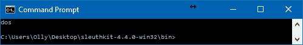*图 4.1\. mmstat 输出*

1.  我们现在已经知道系统卷类型，准备使用下一个工具`mmls`。这个工具可以帮助检查员确定磁盘的布局，包括未分配的空间。我们来使用一下它：

```
mmls -t dos X:146-2017.E01

```

上述命令的输出如下：

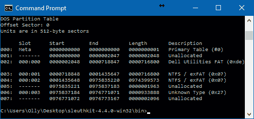

图 4.2\. mmls 输出

如你所见，我们收集了大量关于磁盘的有价值信息（如你记得，我们在之前的教程中对硬盘进行了镜像）。现在你已经知道了所有分区和未分配空间的起始扇区、结束扇区和长度。

1.  让我们切换到文件系统层工具。为了更好地了解每个分区，我们有`fsstat`工具。要使用它，我们需要分区偏移量。你可以从`mmls`的输出中获取它。让我们更深入了解我们拥有的最大分区，它从第 1435658 个扇区开始：

```
fsstat -o 1435648 X:146-2017.E01

```

上述命令的输出如下：

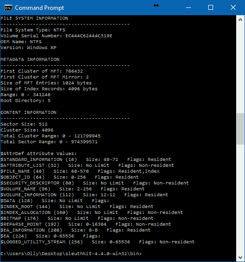**图 4.3\. fsstat 输出**

如你在前面的图中所见，`fsstat`收集了有关分区的大量有用信息：卷序列号、簇大小、MFT 的第一个簇、MFT 镜像的第一个簇等等。

MFT（主文件表）包含有关 NTFS 中所有文件、目录和元文件的信息，包括它们的名称、创建时间戳、大小和访问权限。

1.  现在让我们来看一下文件名层工具。例如，`fls`工具允许检查员列出目录中已分配和已删除的文件名。同样，我们需要分区偏移量来使用此工具：

```
fls -o 1435648 X:146-2017.E01

```

上述命令的输出如下：

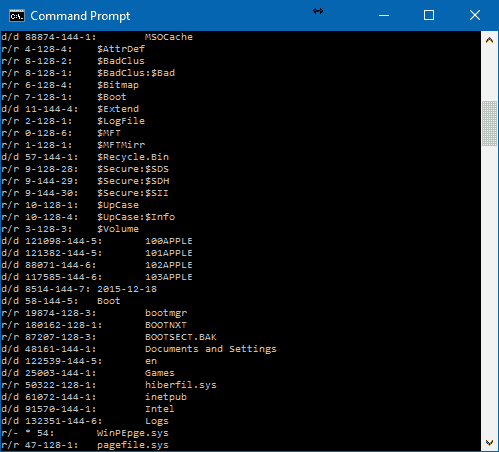**图 4.4\. fls 输出的一部分**

1.  让我们更进一步，使用`fls`创建一个`bodyfile`。这是一个非常棒的功能，帮助 Windows 取证检查员创建文件活动的时间线。我们来看看怎么创建它：

```
fls -r -m "/" -o 1435648 X:146-2017.E01 > bodyfile.txt

```

上述命令的输出如下：

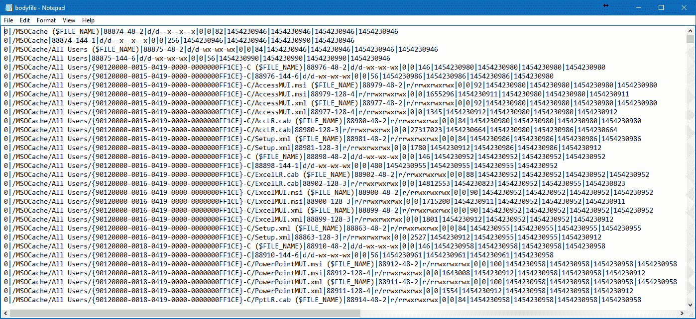*图 4.5\. 使用 fls 创建的 bodyfile 部分内容*

如你所见，我们在命令中添加了两个开关：`-r`和`-m`。第一个告诉`fls`递归目录条目。第二个告诉它使用`mactime`输入格式，挂载点为*/*。

1.  我们现在已经有了 bodyfile，可以运行`mactime`并创建文件活动的时间线。这样的时间线在 Windows 取证检查中非常有用，尤其是在涉及恶意软件事件的案件中。这里是如何创建它的：

```
mactime.pl -b bodyfile.txt -d > timeline.csv

```

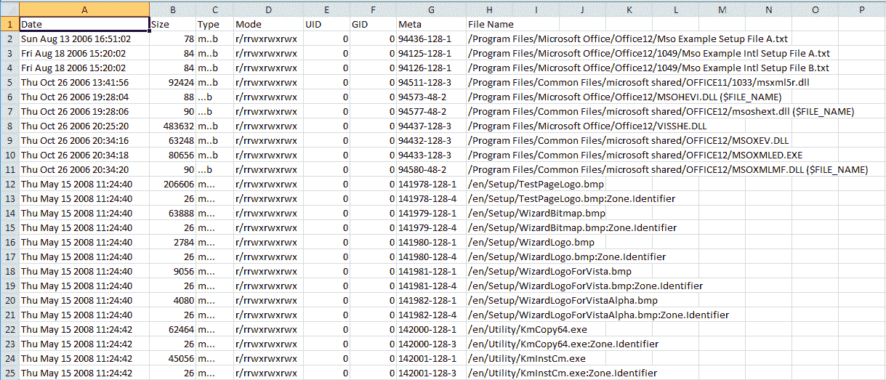*图 4.6\. 在 Microsoft Excel 中打开的时间线文件*

再次，在最后一个命令中，我们有两个需要解释的开关。第一个 `-b` 指向 `mactime` 要使用的主体文件。第二个 `-d` 表示分隔输出，意味着我们可以将其保存为 CSV 文件，并使用 Microsoft Excel 或 OpenOffice Spreadsheets 后续处理（见上图）。此外，如果您想指定时区，可以使用 `-z` 开关。

# 工作原理...

以下是主要命令及其功能的列表：

+   `mmstat`: 提取系统卷类型的信息

+   `mmls`: 提取磁盘布局信息，包括未分配的空间

+   `fsstat`: 提取文件系统的信息，包括卷序列号、簇大小等

+   `fls`: 提取目录中已分配和已删除文件名的信息

+   `mactime`: 基于由 `fls` 创建的主体文件创建文件活动时间线

# 另请参阅

Sleuth Kit 下载页面：[`www.sleuthkit.org/sleuthkit/download.php`](https://www.sleuthkit.org/sleuthkit/download.php)

Sleuth Kit wiki：[`wiki.sleuthkit.org/index.php?title=Main_Page`](http://wiki.sleuthkit.org/index.php?title=Main_Page)

# 使用 Autopsy 从 NTFS 恢复删除的文件

最初，**Autopsy** 只是 The Sleuth Kit 的图形界面。在之前的教程中，您已经了解了用于文件系统取证分析的命令行工具的收集。然而，自第三个版本以来，它已完全重写，并作为一个独立的数字取证平台提供。它被广泛应用，并成为执法和企业检查员的数字取证工具包的一部分。为什么呢？它易于使用、快速且免费。此外，如果您喜欢编程，可以为 Autopsy 编写自己的模块 - 所需的所有文档都可以在 Sleuth Kit 的网站上免费获得。Basis Technology 还举办了 Autopsy 模块编写比赛，欢迎参与。

# 准备工作...

再次访问 Sleuth Kit 网站，选择 Autopsy，然后选择下载。目前写作时的最新版本是 4.3.0。提供了 32 位和 64 位版本，您应根据您的系统选择正确的版本（我们已经在之前的一篇教程中向您展示了如何收集此信息）。您将被重定向到 SourceForge，并且下载过程将自动开始。在我们的情况下，我们下载的文件名为 **autopsy-4.3.0-64bit.msi**。现在您只需双击它并按照相当简单的安装说明进行操作。一旦安装过程完成，您就可以开始使用了。

# 如何做...

在启动您新安装的数字取证工具后，您会看到的第一个窗口是欢迎界面。这里有三个主要选项：

+   创建新案例 - 此选项将为您创建一个新案例

+   打开最近的案件 - 此选项将打开您上次处理的案件

+   打开现有案件 - 此选项允许您选择工作站上已有的案件之一

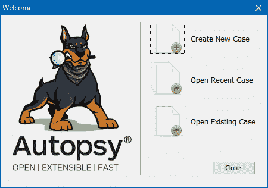

图 4.7\. Autopsy 欢迎窗口

由于我们刚刚安装了 Autopsy，因此没有任何案件，所以我们的选择是创建新案件选项。现在您将看到一个新建案件信息窗口。

1.  在第一步案件信息中，我们有两个字段需要填写；第三个字段会自动完成。您应在第一个字段“案件名称”中输入案件编号或名称，在第二个字段“基础目录”中选择案件文件的目录（使用浏览按钮）。第三个字段会显示案件文件的路径（基础目录+案件名称）。

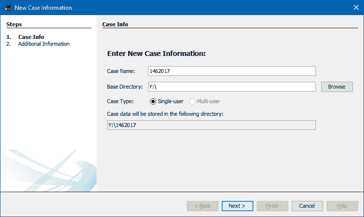

图 4.8\. Autopsy 新建案件信息（案件信息）窗口

1.  第二步，附加信息，是可选的：您可以将两个字段留空。但是，通常最好填写它们。第一个字段应包含您的案件编号，第二个字段填写您的姓名。

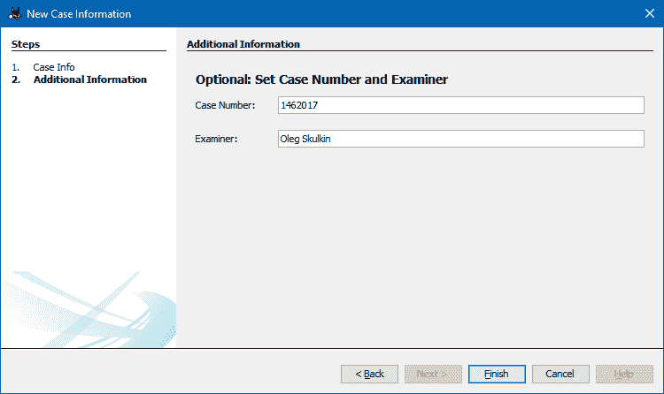

图 4.9\. Autopsy 新建案件信息（附加信息）窗口

1.  单击完成，案件将被创建。

1.  现在是选择数据源的时机，这里是**添加数据源**窗口。您首先应该做的是选择数据源类型。有三种可选项：

+   +   镜像或虚拟机文件 - 此选项允许您选择支持格式的取证镜像，或在镜像检查过程中发现的虚拟机磁盘

    +   本地磁盘 - 此选项允许您选择连接到工作站的物理驱动器或已挂载的逻辑驱动器（例如，D:）

+   +   逻辑文件 - 此选项允许您选择用于分析的文件和文件夹，例如，从挂载的取证镜像中选择

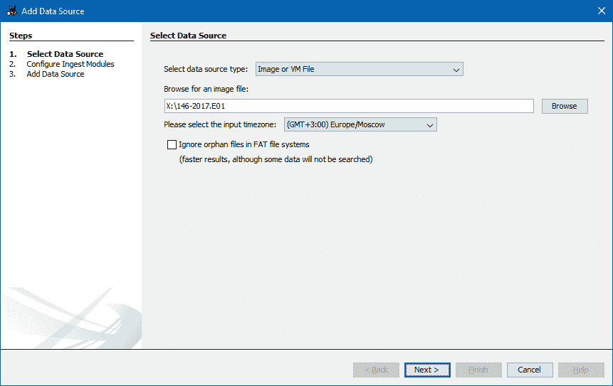

图 4.10\. Autopsy 选择数据源窗口

1.  别忘了选择正确的时区。

1.  在接下来的步骤中，您应选择要运行的导入模块。Autopsy 导入模块分析数据源中的文件并解析其内容。由于本教程的主要目的是展示如何从 NTFS 恢复已删除文件，因此我们只选择了一些模块，包括：

+   +   文件类型识别 - 基于文件的内部签名而非扩展名来识别文件

    +   扩展名不匹配检测器 - 利用文件类型识别模块的结果标记那些扩展名与检测到的文件类型不符的文件

    +   嵌入式文件提取器 - 提取不同归档格式的数据，包括 DOCX、XLSX、PPTX 等

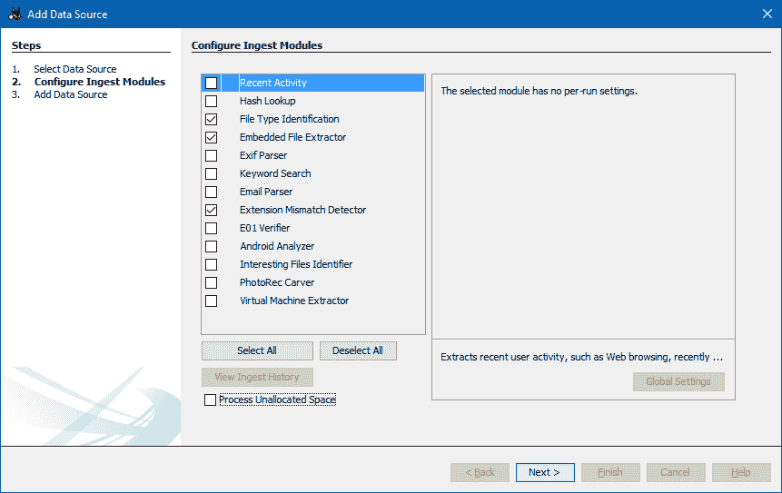

图 4.11\. Autopsy 选择数据源（配置导入模块）窗口

1.  单击“下一步”，数据源处理将开始。

1.  一段时间后，根据数据源的大小，“完成”按钮将变为可用：点击它，您就可以开始分析文件系统。

本教程的重点是教您如何从 NTFS 中恢复已删除的文件。关键是，当文件被删除时，它并没有被擦除，而只是被标记为在文件的 MFT 条目中已删除。因此，直到文件被覆盖之前，它是可以恢复的，而 Autopsy 可以帮助数字取证专家完成这项工作。它甚至会帮您整理出所有已删除的文件：只需进入视图 - 左侧窗格中的已删除文件（树视图）。

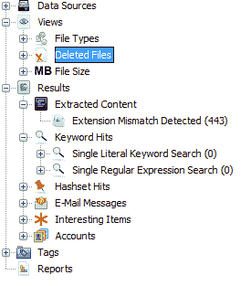

图 4.12\. 树视图中的已删除文件选项

您可以使用此选项来恢复文件，或通过数据源选项浏览文件系统。已删除的文件在左侧有红色叉号图标。要恢复文件：

1.  右键点击文件或文件（预先标记所有您想要恢复的文件）

1.  选择**提取文件**

1.  选择目标文件夹

1.  点击保存

是的，就是这么简单！

# 它是如何工作的...

Autopsy 会检测到 MFT 中标记为已删除的文件，并将它们分类出来，这样数字取证检查员可以找到这些文件并恢复它们。

# 另见

Autopsy 下载页面：[`sleuthkit.org/autopsy/download.php`](http://sleuthkit.org/autopsy/download.php)

Autopsy 用户指南：[`sleuthkit.org/autopsy/docs/user-docs/3.1/index.html`](http://sleuthkit.org/autopsy/docs/user-docs/3.1/index.html)

# 使用 ReclaiMe 文件恢复从 ReFS 恢复已删除的文件

ReclaiMe 文件恢复是一款数据恢复软件，能够从多种设备（包括硬盘、内存卡、RAID 阵列和多磁盘 NAS 设备）中恢复已删除的文件。此外，它还支持从大多数文件系统中恢复数据，包括最新的 Windows 文件系统——**ReFS** 或 **弹性文件系统**。

# 准备工作

进入 ReClaiMe 的网站，点击左侧的绿色下载按钮。它将引导您到 ReclaiMe 文件恢复的下载页面，并自动开始下载过程。之后，只需运行安装文件并按照安装说明进行操作。准备好就可以开始了！

# 如何操作...

在开始之前，最好找到正确的数据源。ReFS 仍在积极开发中，通常仅用于 Windows 服务器。幸运的是，Willi Ballenthin 创建了一些用于测试的 ReFS 镜像，现在已经公开提供。我们可以使用其中之一。

1.  启动 ReclaiMe 文件恢复。工具需要一些时间来扫描所有可用的驱动器。完成后，您将进入主窗口，如下图所示：

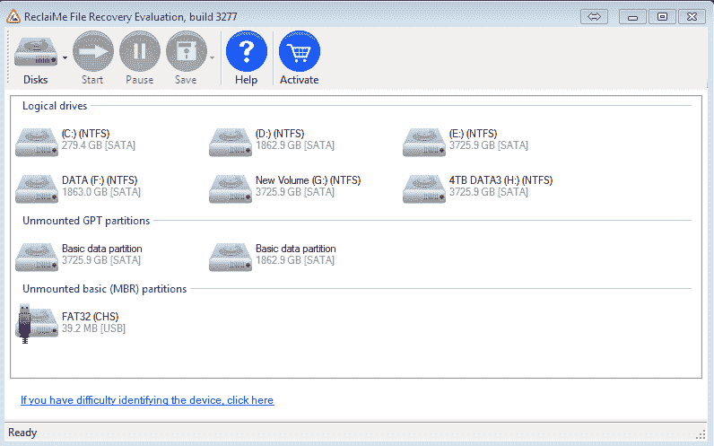

图 4.13\. ReclaiMe 文件恢复主窗口

ReclaiMe 文件恢复不支持 E01 镜像，但这不是问题，因为我们有一个 RAW 格式的镜像。

1.  让我们进入磁盘 - 打开磁盘镜像... 选择磁盘镜像并点击打开。现在主窗口中应该也会显示出一个镜像，如下图所示：

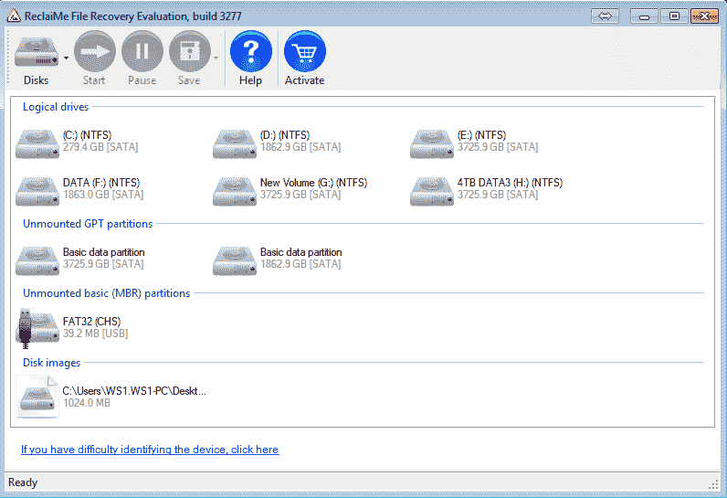

图 4.14\. ReclaiMe 文件恢复主窗口（磁盘镜像已添加）

1.  双击镜像以启动恢复过程。当然，根据镜像的大小，这将需要一些时间。在我们的案例中，镜像足够小，所以不会花太多时间。恢复过程如下图所示：

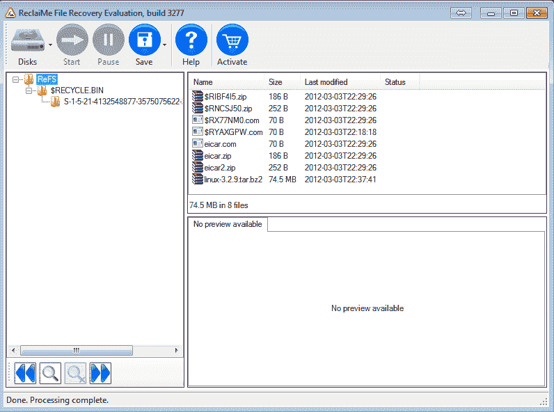

图 4.15. ReclaiMe 文件恢复图像处理结果

1.  现在你可以使用蓝色的保存按钮来保存恢复的文件甚至文件夹。

# 它是如何工作的...

ReclaiMe 文件恢复处理镜像并列出可用的文件和文件夹，提供计算机取证检查员提取已删除文件的能力。

# 另见

ReclaiMe 文件恢复网站：[`www.reclaime.com/`](http://www.reclaime.com/)

ReFS 示例镜像：[`www.williballenthin.com/forensics/refs/test_images/`](http://www.williballenthin.com/forensics/refs/test_images/)

# 使用 PhotoRec 进行文件雕刻

PhotoRec 是一个广泛用于数字取证检查员的文件雕刻工具。这个工具甚至作为一个模块内置在前面提到的数字取证平台 Autopsy 中。PhotoRec 可以恢复多种类型的文件（超过 480 种文件格式），但是如果你认为这还不够，你可以添加自己的自定义签名，这将帮助该工具恢复更多的数据。

# 准备就绪

访问 CGSecurity 的网站并点击左侧的下载超链接。你将被重定向到下载页面。现在点击右侧的大绿按钮，下载过程将开始。在撰写本文时，PhotoRec 的最新版本是 7.0，因此我们下载的压缩包名为 **testdisk-7.0.win.zip**。解压后，你就可以开始使用了。

# 如何操作...

在开始之前，重要的是要注意 PhotoRec 支持磁盘镜像：不仅支持 RAW 格式，还支持 E01 格式。由于我们是为了取证目的进行数据雕刻，让我们使用在之前某个步骤中获取的 E01 镜像。

1.  从管理员组中的帐户启动 Windows 命令提示符，并将目录更改为 **testdisk-7.0**。使用以下命令：

```
         photorec_win.exe X:52.E01

```

1.  确保你输入了你获取的镜像的路径，因为它可能有不同的名称和位置。

1.  你看到的第一个对话框是“选择媒体”。在我们的案例中，我们正在处理一个 E01 镜像，所以我们只有一个选项，所有需要做的就是按 *Enter* 继续。

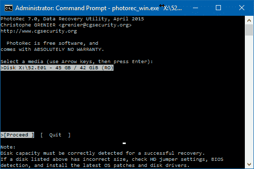

图 4.16. PhotoRec 选择媒体对话框

1.  现在我们有了分区选择对话框。在我们的案例中，我们只有一个未知类型的分区——这是文件雕刻的完美示例。

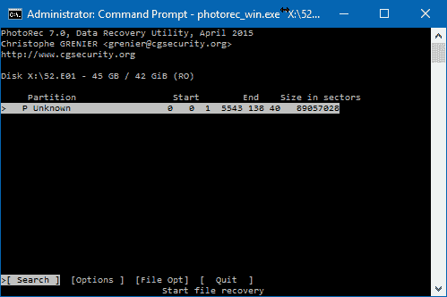

图 4.17. PhotoRec 分区选择对话框

1.  同时，底部有四个选项：

+   +   搜索 - 开始恢复

    +   选项 - 修改恢复选项

    +   文件选项 - 修改要恢复的文件类型

    +   退出 - 取消恢复

1.  让我们进入选项。这里有以下内容：

+   +   偏执模式 - 如果启用，会验证恢复的文件，并且无效文件将被拒绝。另一个选项是 **bruteforce**，如果启用，会尝试恢复碎片化的 JPG 文件。

    +   保留损坏文件 - 如果启用，会保留无效文件。如果希望尝试用其他工具修复它们，请使用此选项。

    +   专家模式 - 如果启用，允许检验员强制设置块大小和偏移量。

    +   低内存 - 如果您的工作站内存不足以避免恢复崩溃，请使用此选项。

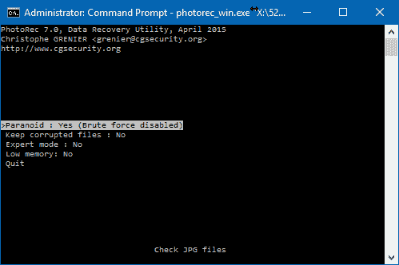

图 4.18\. PhotoRec 选项

1.  现在让我们检查文件选项。这里有工具支持的文件类型的长列表。使用 *s* 按钮来检查所有文件类型或禁用所有文件类型。如果您想启用或禁用一些类型，请使用空格键。保存更改使用 b。

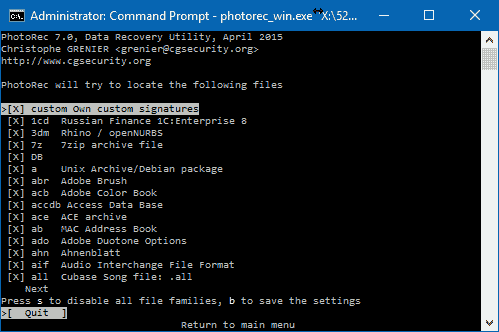

图 4.19\. PhotoRec 文件选项

现在我们已经查看了可用的选项，并且准备开始恢复。

1.  选择搜索并按 *Enter*。现在是选择文件系统类型的时候了。我们知道只有两个选项，并且我们的镜像上没有 EXT 分区，因此我们选择 **Other**.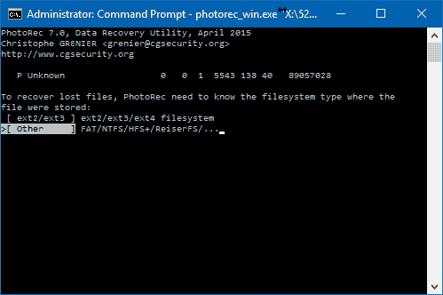

图 4.20\. PhotoRec 文件系统类型对话框

1.  现在我们需要选择恢复文件的目标路径。我们建议在开始文件雕刻过程之前创建一个目录。在我们的情况下，目标文件夹是 `X:52-Carved`，如下图所示：

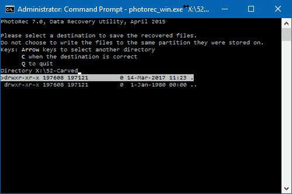*图 4.21\. PhotoRec 选择目标对话框*

1.  使用 *C* 按钮启动文件雕刻过程。

1.  一旦进程完成，您将拥有一个或多个文件夹（`recup_dir.1`，`recup_dir.2`...），其中包含恢复的文件。重要的是注意，在恢复完成之前可以访问这些文件夹。

# 工作原理...

PhotoRec 逐扇区读取数据源，并找到前十个文件。它使用这些文件来计算每个块经工具对比签名数据库检查后的块/簇大小。

如果文件系统没有损坏，PhotoRec 可以从卷引导记录或超级块获取块/簇大小。

# 查看更多

PhotoRec 下载页面：[`www.cgsecurity.org/wiki/TestDisk_Download`](http://www.cgsecurity.org/wiki/TestDisk_Download)

PhotoRec 维基页面：[`www.cgsecurity.org/wiki/PhotoRec`](http://www.cgsecurity.org/wiki/PhotoRec)
