# 第五章：Windows 阴影副本分析

在本章中，我们将介绍以下内容：

+   使用 ShadowCopyView 浏览和复制实时系统中的 VSC 文件

+   使用 VSSADMIN 和 MKLINK 从磁盘镜像挂载 VSCs

+   使用 Magnet AXIOM 处理和分析 VSC 数据

# 介绍

阴影副本，也称为卷阴影副本，是在使用运行 NTFS 的机器时，系统在正常操作过程中自动创建的 Windows 文件的备份副本。对于普通计算机用户来说，阴影副本可能比较熟悉，因为它们使得创建 Windows 备份或在出现问题时执行系统恢复成为可能。

这些在数字法医实践中有显而易见的应用，特别是在嫌疑人可能尝试从计算机上删除证据的案件中。通过将系统恢复到之前的状态，或使用法医工具揭示保存在阴影副本位置的文件，法医从业人员可能能够推断出个体试图隐藏的信息。

然而，阴影副本的存在以及法医调查员能够揭示其中包含的信息，并不意味着一定能获得有用的信息。许多文件可能只是包含与案件无关的信息。即使恢复了有用文件的阴影副本，调查员所看到的版本也只是该文件的快照。换句话说，法医分析员只能看到文件的单一版本，而无法看到可能已做过的任何更改。阴影副本常常会被系统覆盖，而且在大多数版本的 Windows 中，可以关闭创建阴影副本的功能，这意味着它们并不是一个万无一失的备用选项。尽管如此，定位、恢复和理解卷阴影副本中包含的数据的能力，仍然是数字法医调查员工具包中的重要部分。本章将演示几种帮助你掌握阴影副本分析的方法。

# 使用 ShadowCopyView 浏览和复制实时系统中的 VSC 文件

ShadowCopyView 是一个由 **NirSoft** 开发的简单工具（记住这个名字！他们开发了许多非常有用的小型免费工具，尤其适用于计算机法医），它使数字法医检查员能够浏览 Windows 卷阴影复制服务创建的快照。它甚至支持最新版本的 Windows（例如 Windows 10），并且可以保存在你最喜欢的 USB 驱动器上，这对于实时法医和事件响应非常重要。

# 准备工作

访问 NirSoft 网站，并点击左侧的“所有实用工具”链接。向下滚动页面，找到 **ShadowCopyView** 链接并点击它。撰写本文时，工具的最新版本是 1.05\. 向下滚动，您将找到两个下载链接：32 位和 64 位版本。我们建议您下载两个版本，根据目标系统使用它们。将下载的压缩包解压到您的闪存驱动器中，准备就绪。

# 如何操作...

将闪存驱动器连接到目标系统。在我们的案例中，是 Windows 7 x64，因此我们将使用 64 位版本的 ShadowCopyView。该工具会自动检测可用的 VSC（卷影副本）。在我们的案例中，有三个 VSC 可用，如下图所示：

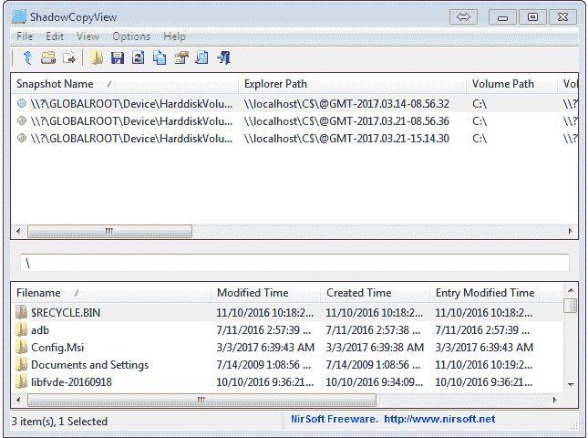

图 5.1\. ShadowCopyView 检测到的卷影副本

工具的主窗口由两个窗格组成。第一个窗格显示有关检测到的影子副本的信息，包括名称、资源管理器路径、卷路径、创建时间等。资源管理器路径意味着您可以在 Windows 资源管理器中浏览影子副本。

1.  右键单击要在资源管理器中浏览的 VSC，并选择“在 Windows 资源管理器中打开”，或者直接按 F2\. 现在它已经在 Windows 资源管理器中打开，如下图所示：

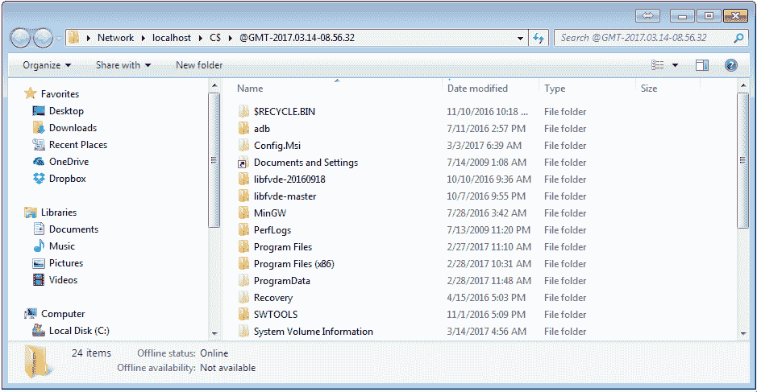

图 5.2\. 在 Windows 资源管理器中打开的卷影副本

现在，让我们回到 ShadowCopyView。第二个窗格使您能够浏览可用的影子副本。使用此窗格，您可以导出文件和文件夹。

1.  您只需右键单击文件或文件夹，选择“将选定文件复制到...”选项，或者直接按 F8。

1.  还有一些其他有用的选项可以使用。例如，如果您更喜欢使用 UTC（协调世界时）时间标准的时间戳，可以使用 **GMT**（**格林威治标准时间**）时区。为此，进入“选项”菜单并选择“以 GMT 显示时间”。

协调世界时（UTC）是世界调节时钟和时间的主要标准。例如，俄罗斯欧洲大部分地区使用 UTC +3 小时。

1.  此外，如果您想查看影子副本的完整属性列表，可以右键单击它并选择“属性”选项，或者直接按 *Alt* + *Enter*。现在您可以在一个窗口中查看所有属性，如下图所示：

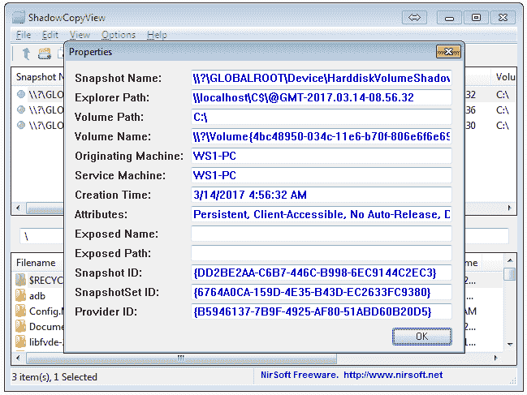

图 5.3\. 卷影副本的属性

我们要告诉您最后一个非常有用的功能是关键字搜索。

1.  进入 **编辑 - 查找**，或者直接按 *Ctrl* + *F*，您将看到查找窗口，如下图所示：

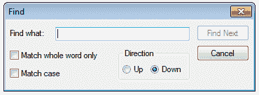

图 5.4\. ShadowCopyView 查找窗口

1.  如您所见，您还可以选择两个选项。如果必须包含整个单词，请勾选第一个选项；如果需要结果以大写或小写字母返回，请勾选第二个选项。

# 如何运作...

ShadowCopyView 检测可用的卷影像副本，使得计算机取证检查员能够通过该工具和 Windows 资源管理器浏览它们，并且还允许他们搜索和导出文件和文件夹。

# 另见

NirSoft 网站：[`www.nirsoft.net/`](http://www.nirsoft.net/)

ShadowCopyView 下载页面：[`www.nirsoft.net/utils/shadow_copy_view.html`](http://www.nirsoft.net/utils/shadow_copy_view.html)

# 使用 VSSADMIN 和 MKLINK 从磁盘镜像挂载 VSC

VSSADMIN 是一个内置的 Windows 命令行工具，能够显示卷影像副本。你不仅可以在运行中的 Windows 系统上使用它，还可以在磁盘镜像上使用它。在本教程中，我们将展示如何做到这一点。

# 准备工作

由于我们要使用的工具是内置的，因此无需安装：如果你使用的是 Windows，你已经拥有它。因此，你只需要挂载一个取证镜像，你已经知道如何做到这一点，见 第三章，*Windows 驱动器获取*。一旦镜像挂载完成，你就可以开始了。

# 如何操作...

使用 VSSADMIN 和 MKLINK 从磁盘镜像挂载 VSC 的步骤如下：

1.  启动 Windows 命令提示符（别忘了以管理员身份运行）。在我们的例子中，启动分区挂载为 `G:\` 驱动器，因此我们使用以下命令：

```
vssadmin list shadows /for=G:\

```

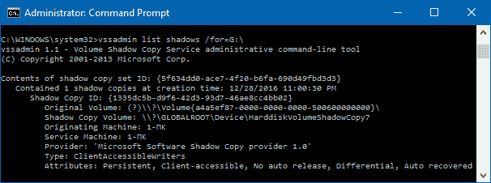

图 5.5\. vssadmin list shadows /for=G:\ 命令输出

正如你在前面的图中所看到的，我们的取证镜像包含一个影像副本。

1.  对我们来说，它的最重要属性是 **影像副本卷**，在我们的例子中它是 `\\?\GLOBALROOT\Device\HarddiskVolumeShadowCopy7`。现在我们准备好使用 MKLINK 挂载我们找到的影像副本。使用以下命令：

```
mklink /D C:\VSC \\?\GLOBALROOT\Device\HarddiskVolumeShadowCopy7

```

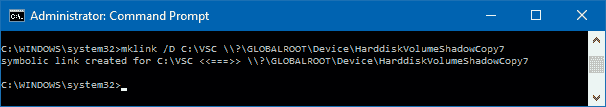

图 5.6\. mklink /D C:\VSC \\?\GLOBALROOT\Device\HarddiskVolumeShadowCopy7 命令输出

MKLINK 创建一个文件夹（你需要选择它的名称和位置，并将其作为命令的一部分输入），并将影像副本挂载到该文件夹上，这样你就可以像浏览普通文件夹一样浏览它。不要忘记 **/D** 开关 —— 我们需要它来创建一个目录符号链接，而不是文件。

1.  还有另一种方法可以使用 Windows 资源管理器浏览 VSC。我们需要获取 VSC 路径，格式如下：`\\localhost\G$\@GMT-2016.12.28-20.00.30`

路径的第一部分 `\\localhost\` 将始终相同。接下来的部分取决于启动分区的驱动器字母。正如你所记得的，在我们的例子中是 `G:\`，所以路径中是 `G$`。例如，如果你的驱动器字母是 `H:\`，那就是 `H$`，依此类推。最后一部分是基于 VSC 的创建时间。你可以从 VSSADMIN 输出中获取它，但必须将其转换为 GMT 时间。现在，只需将其作为路径输入 Windows 资源管理器，影像副本就可以进行检查了，如下图所示：

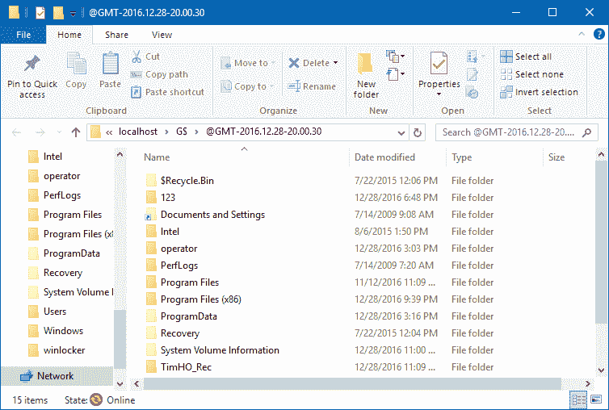

图 5.7\. 在 Windows 资源管理器中打开的卷影像副本

# 它是如何工作的...

VSSADMIN 显示已挂载取证镜像中的可用卷影副本。MKLINK 创建一个符号链接指向影像副本，以便数字取证检查员可以在 Windows 资源管理器中浏览它。

# 另见

Misrosoft TechNet 上的 VSSADMIN 页面：[`technet.microsoft.com/en-us/library/cc754968(v=ws.11).aspx`](https://technet.microsoft.com/en-us/library/cc754968(v=ws.11).aspx)

Microsoft TechNet 上的 MKLINK 页面：[`technet.microsoft.com/en-us/library/cc753194(v=ws.11).aspx`](https://technet.microsoft.com/en-us/library/cc753194(v=ws.11).aspx)

# 使用 Magnet AXIOM 处理和分析 VSC 数据

Magnet AXIOM 是 Magnet Forensics 提供的一个集成数字取证工具，能够从计算机和移动设备中提取（获取）和处理数据。它支持大量 Windows 取证工件，包括从 Windows 卷影副本中提取数据。

# 准备开始

在撰写本文时，Magnet Forensics 提供了功能完整的 Magnet AXIOM 30 天免费试用版。您只需访问 Magnet Forensics 网站并点击“立即试用”按钮。填写表格，包括您的名字、姓氏、电子邮件地址、电话号码、州或省、国家等，然后点击“申请免费试用”。确保输入您的真实电子邮件地址：试用密钥和下载链接将发送到该地址。收到后，下载安装程序并按照提示操作，您就可以开始了！

# 如何操作...

使用 Magnet AXIOM 处理和分析数据的步骤如下：

1.  启动 Magnet AXIOM 处理。

1.  您将看到的第一个窗口是案件详情，如下图所示：

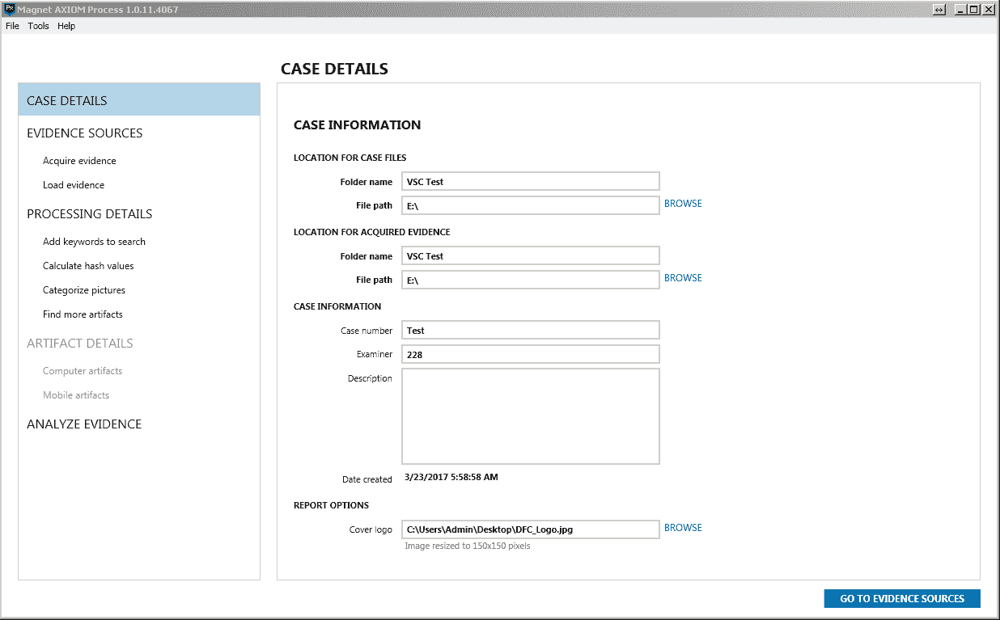

图 5.8。Magnet AXIOM 案件详情窗口

这里我们有四个主要部分：

+   案件文件位置 - 在这里，您应该选择处理过程中创建的文件夹名称和文件路径。

+   获取证据的位置 - 如果您计划通过 AXIOM 获取硬盘或移动设备，请选择文件夹名称和文件路径，或者直接选择与案件文件相同的路径。

+   案件信息 - 输入您的案件编号、姓名和案件描述。

+   报告选项 - 如果您有自己的标志或公司标志，可以通过点击浏览来选择它。确保图像是正方形的，因为它将被调整为 150x150 像素。

1.  填写完所有字段后，您可以点击“转到证据来源”。您可以看到如下图所示的证据来源窗口：

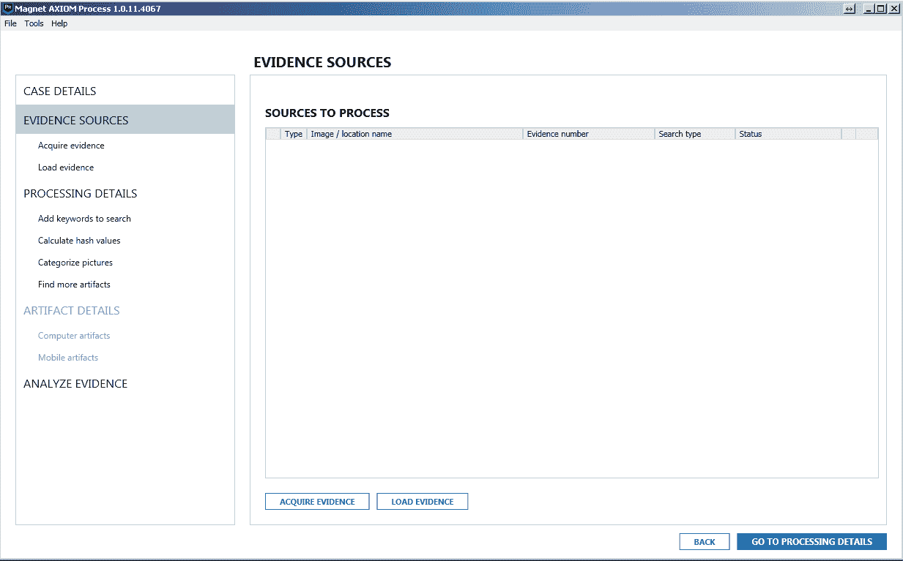

图 5.9。Magnet AXIOM 证据来源窗口

这里我们有两个选项：获取证据和加载证据。

1.  我们将使用之前获取的镜像，因此选择的是加载证据按钮。您也可以使用之前教程中获取的任意镜像。

1.  下一个窗口是加载证据，如下图所示：

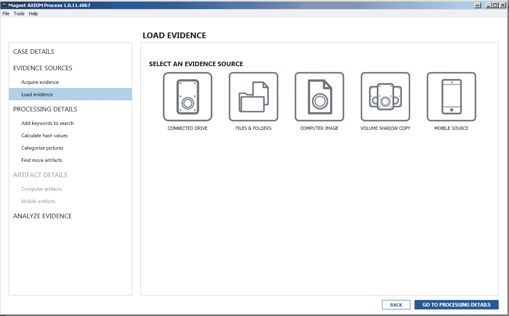

图 5.10。Magnet AXIOM 加载证据窗口

1.  在这里，我们有一个“卷影像副本”选项——点击它。现在，我们有两个选项：驱动器和镜像。

1.  如我们之前所述，我们将使用一个镜像。选择后，您可以看到镜像上可用的影像副本列表，如下图所示：

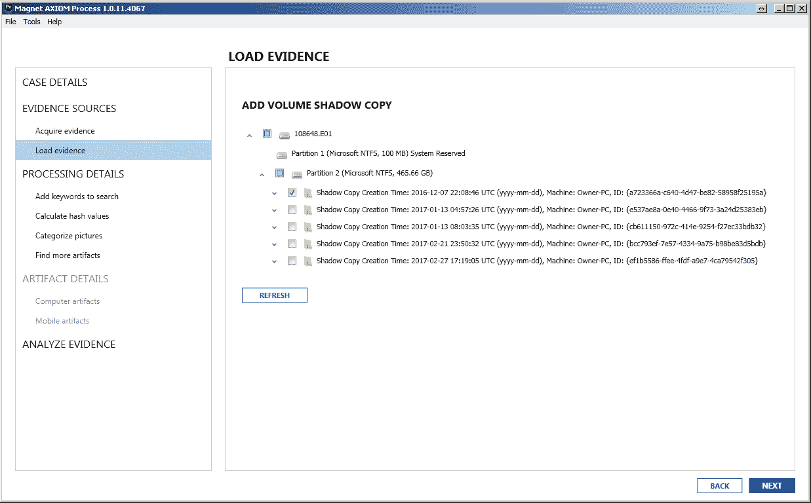

图 5.11\. 卷影像副本列表

1.  您可以选择一个或多个影像副本，并通过点击“下一步”进入处理详情。这次，我们将跳过这一步，直接进入伪造物详情（点击“转到伪造物详情”按钮）。

由于我们正在处理一个影像副本，MOBILE ARTIFACTS 选项不可用，但我们可以使用 COMPUTER ARTIFACTS 选项。与 Belkasoft Evidence Center 一样，在这里我们有广泛的伪造物，您可以在下图中看到：

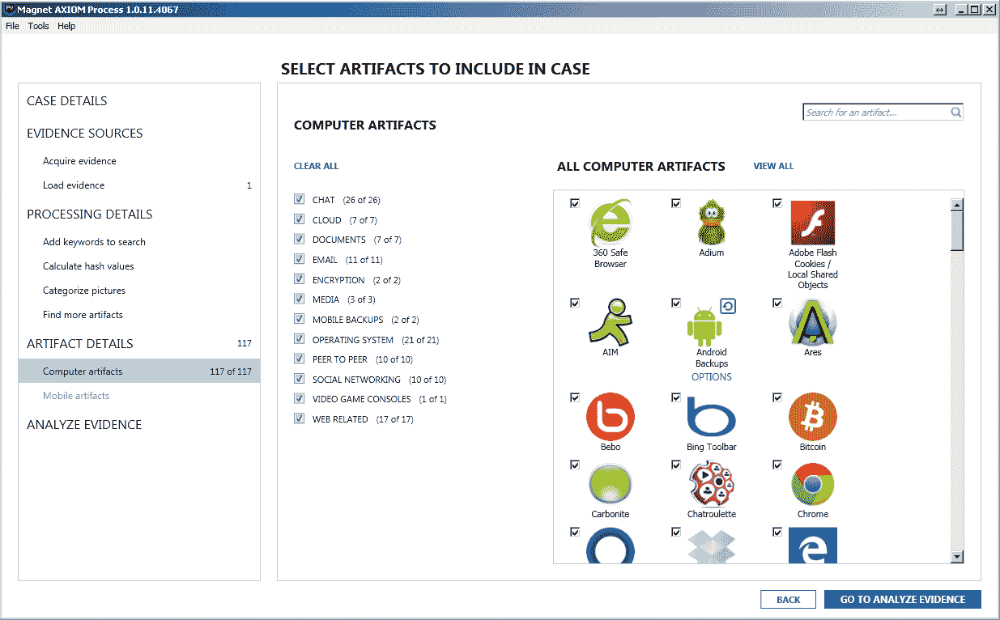

图 5.12\. Magnet AXIOM 选择要包含在案件中的伪造物窗口

1.  为了测试，我们已将所有可用伪造物包含在案件中。点击“转到分析证据”按钮，接着点击“分析证据”按钮。这将启动 Magnet AXIOM Examine。

1.  一旦处理完成，您将看到 Magnet AXIOM Examine 中的结果。

# 它是如何工作的…

Magnet AXIOM 会扫描驱动器或镜像中的可用卷影像副本，并将它们作为证据来源。处理完所选影像副本中的所有可用数据后，它会根据审查员做出的选择提取法医伪造物。

# 另见

Magnet Forensics 网站：[`www.magnetforensics.com/`](https://www.magnetforensics.com/)

Magnet AXIOM 免费 30 天试用请求页面：[`www.magnetforensics.com/try-magnet-axiom-free-30-days/`](https://www.magnetforensics.com/try-magnet-axiom-free-30-days/)

Belkasoft Evidence Center：[`belkasoft.com/ec`](https://belkasoft.com/ec)
