# 第六章：Windows 注册表分析

本章将覆盖以下内容：

+   使用 Magnet AXIOM 提取和查看 Windows 注册表文件

+   使用 RegRipper 解析注册表文件

+   使用 Registry Explorer 恢复已删除的注册表数据

+   使用 FTK 注册表查看器进行注册表分析

# 介绍

Windows 注册表是最丰富的数字证据来源之一。在对注册表的分析中，你可以找到大量极其有用的信息。计算机配置、最近访问的网页和打开的文档、连接的 USB 设备，以及许多其他数据，都可以通过 Windows 注册表取证分析获得。

注册表采用树状结构。每棵树包含多个键，每个键可能包含一个或多个子键和值。

由于取证人员通常处理驱动器映像，因此知道这些注册表文件存储的位置非常重要。前六个文件位于 `C:\Windows\System32\config`。这些文件包括：

+   组件

+   默认

+   SAM

+   安全

+   软件

+   系统

每个用户账户也有两个文件：

+   `NTUSER.DAT`，位于 `C:\Users\%Username%\`

+   `UsrClass.dat`，位于 `C:\Users\%Username%\AppData\Local\Microsoft\Windows`

本章将向你展示如何使用商业和开源取证工具检查这些文件，并如何恢复已删除的键、子键和值。

# 使用 Magnet AXIOM 提取和查看 Windows 注册表文件

如果你已经了解了如何在取证工作中使用 Magnet AXIOM，特别是当你需要从快照中提取和分析数据时，你会发现这个工具有很多非常实用的功能。因此，在接下来的步骤中，我们将继续使用它。这次，你将学习如何使用 Magnet AXIOM，特别是其 Registry Explorer 组件，进行 Windows 注册表取证分析。

# 准备工作

如果你正在一本一本地跟随本书中的步骤，那么你已经安装了 Magnet AXIOM——至少是试用版。如果没有，请参考 *第五章*，*Windows 快照分析*，查看安装说明。安装完成后，你就可以开始使用了。

# 如何操作...

使用 Magnet AXIOM 进行 Windows 注册表分析的步骤如下：

1.  让我们创建一个新案件。创建后，填写所有字段，进入证据源部分。点击加载证据按钮，你会看到一个类似以下图示的证据源选择窗口：

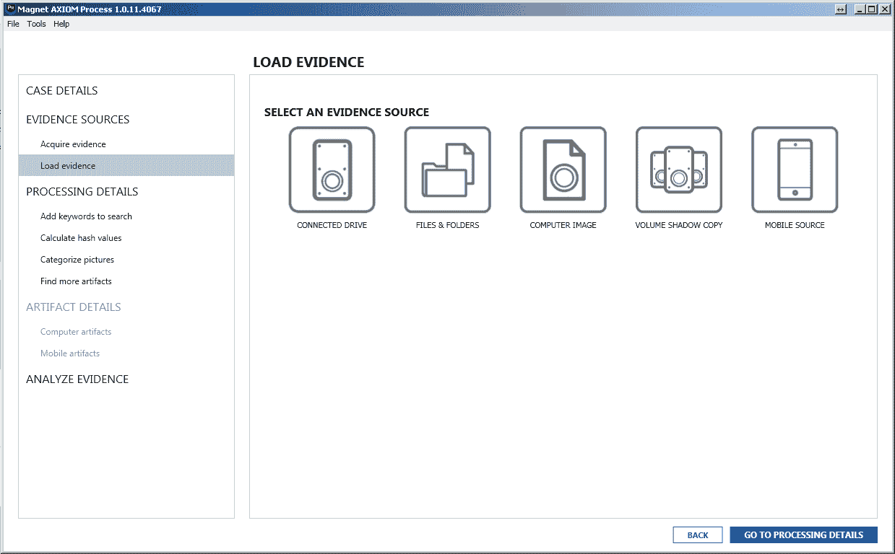

图 6.1\. Magnet AXIOM 选择证据源窗口

1.  这次，我们选择 COMPUTER IMAGE 选项。同样，你可以使用之前获取的其中一个映像；RAW 和 E01 格式均支持。从下图可以看出，我们的映像包含两个分区和一个未分区空间。

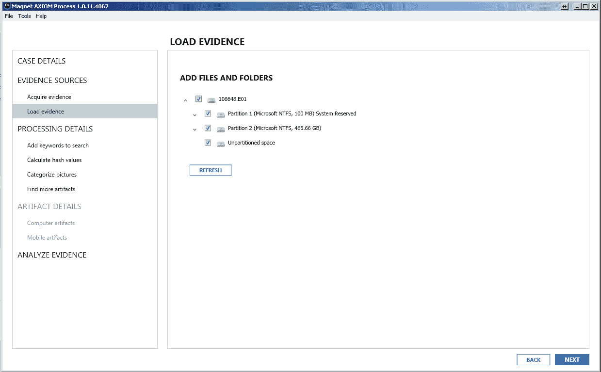

图 6.2\. Magnet AXIOM 添加文件和文件夹窗口

1.  你可以只勾选主分区（分区 2），或选择所有可用分区，如我们所做的。点击下一步，你将进入选择搜索类型屏幕，如下图所示：

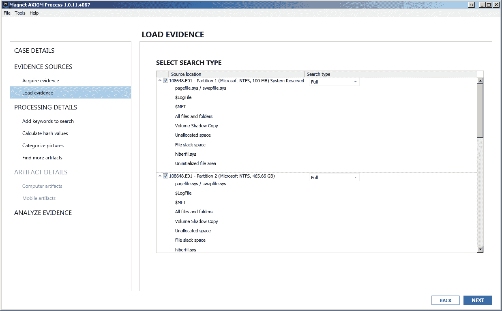

图 6.3. Magnet AXIOM SELECT SEARCH TYPE 窗口

1.  在 Magnet AXIOM 过程中有四种搜索类型：

    +   完整 - 用于从所有位置提取数据，包括未分配空间、影像副本等。

    +   **快速** - 用于从常见区域提取数据。

    +   **扇区级别** - 这个选项对于未知或损坏的文件系统，或格式化的驱动器非常有用。

    +   **自定义** - 此选项允许检查员选择位置。例如，如果你只希望 AXIOM 提取未分配空间，你可以仅选择该位置。

为了测试，你可以选择所有位置，但这会花费很多时间进行处理。同时，你也可以从“快速”类型开始，获取一些简单的证据。如果你不想更改证据类型，可以直接进入分析证据部分。点击分析证据按钮，Magnet AXIOM Examine 会出现。

1.  一旦数据源处理完成，前往左侧的下拉菜单，如下图所示，选择注册表选项：

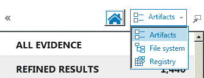

图 6.4. Magnet AXIOM Examine 导航窗格

1.  一旦选择此选项，你可以在导航窗格中看到所有包含注册表集的可用文件，如下图所示：

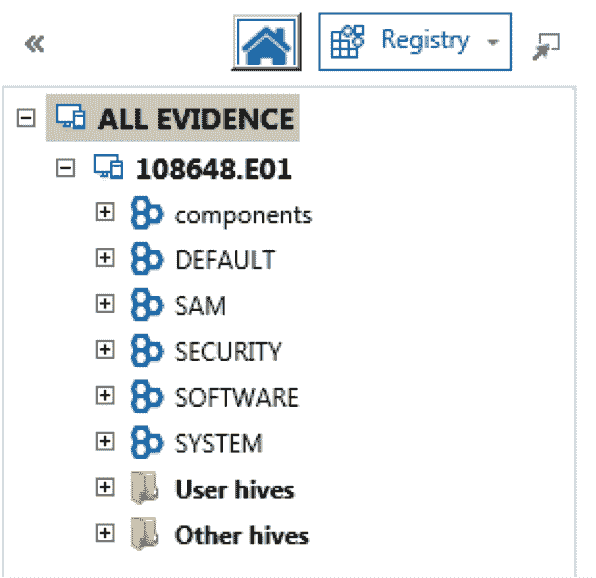

图 6.5. AXIOM 注册表查看器的导航窗格

1.  如果你点击注册表文件的加号，你可以浏览其内容，并且还可以在 AXIOM 注册表查看器的证据窗格中查看其值。

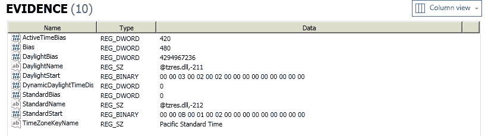

图 6.6. AXIOM 注册表查看器的证据窗格

1.  在上图中，你可以看到 TimeZoneInformation 键的内容。这个键非常重要，因为它帮助检查人员检测正确的时区。你查看的键和其来源的更多信息可以在“详细信息”窗格中找到，如下图所示：

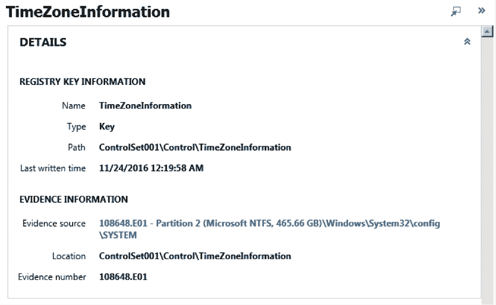

图 6.7. AXIOM 注册表查看器的详细信息窗格

1.  查看证据来源。如果你点击蓝色链接，它会带你到注册表文件的所在位置，并在文件系统查看器中打开该文件。现在，你可以导出注册表文件。为此，右键点击该文件并选择 **保存文件 / 文件夹到...**，如下图所示：

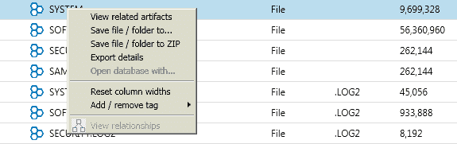

图 6.8. 导出注册表文件

1.  你还可以查看 AXIOM 在处理阶段自动提取的证据。在此过程中，右键点击注册表文件，并从上下文菜单中选择“查看相关证据”。

一旦你导出了文件，你就可以用其他工具进行解析。当然，Magnet AXIOM 是一个非常强大的取证工具，它能从注册表文件中提取大量数据，但有时使用其他工具进行解析也很有用，比如 **RegRipper**。我们将在下一个教程中展示如何操作。

# 它是如何工作的...

Magnet AXIOM 收集所有可用的注册表文件，以便数字取证检查员可以手动分析它们，或者将它们导出以便用其他工具进行解析。此外，AXIOM 会自动从这些文件中提取大量取证证据，检查员可以在 Magnet AXIOM Examine 的证据面板中分析这些结果。

# 另见

Magnet AXIOM 概述：

[`www.magnetforensics.com/magnet-axiom/`](https://www.magnetforensics.com/magnet-axiom/)

# 使用 RegRipper 解析注册表文件

RegRipper 是一个开源的 Windows 取证工具，由著名的取证专家 Harlan Carvey 开发，他是《*Windows Forensic Analysis*》系列的作者。它是用 Perl 编写的，并且有很多有用的插件可供使用。此外，能够使用 Perl 编写的数字取证检查员也可以为自己的特定需求创建插件。

# 准备就绪

访问 RegRipper 在 Harlan 的 GitHub 页面，点击绿色按钮（Clone 或 Download），选择 Download ZIP 选项。下载完成后（在我们的案例中，文件名是 **RegRipper2.8-master.zip**），解压缩文件，你就可以开始使用了。

# 如何操作...

解析注册表文件的步骤使用 RegRipper：

1.  你已经知道如何从磁盘映像导出注册表文件，至少是使用 Magnet AXIOM。所以，我们确定你已经有了一个文件可以用 RegRipper 进行解析。启动 `rr.exe`，你会看到一个像下面这样的窗口：

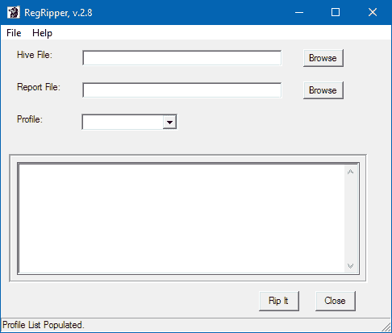

图 6.9\. RegRipper 主窗口

这里，你有三个字段需要填写：

+   +   Hive 文件 - 使用浏览按钮选择你之前导出的 Hive（注册表）文件。在我们的案例中，它是 SYSTEM。

    +   报告文件 - 使用浏览按钮选择一个文件来保存输出结果（它是纯文本格式，所以 TXT 文件就可以了）。在我们的案例中，文件名是 SYSTEM_output。

    +   配置文件 - 从下拉菜单中选择正确的解析配置文件。我们使用 SYSTEM 文件作为源文件，因此我们选择的配置文件是 'system'。

1.  一旦选择了文件和正确的配置文件，你可以按下 Rip It 按钮。处理完成后，你就可以分析输出结果了：

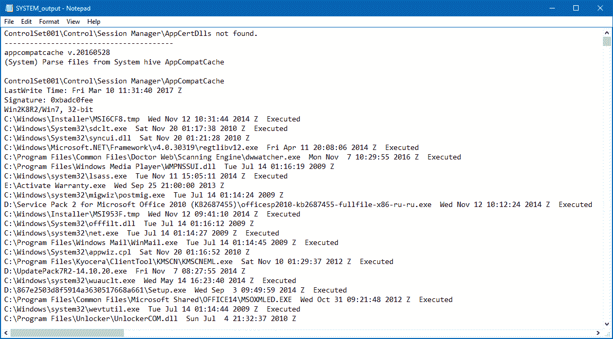

图 6.10\. RegRipper 输出结果

如果你向下滚动输出文件，你会发现其中包含了很多从取证角度看非常重要的信息，比如连接的 USB 设备、事件日志配置、挂载的设备、网络连接等等。工具运行非常快，因此这是一个非常好的起点工具集。

# 它是如何工作的...

RegRipper 使用 Perl 模块，根据取证检查员选择的配置文件，从 hive（注册表）文件中提取数据，并将输出保存为 `TXT` 文件。

# 另见

RegRipper 下载页面：

[`github.com/keydet89/RegRipper2.8`](https://github.com/keydet89/RegRipper2.8)

# 使用注册表资源管理器恢复已删除注册表项目

注册表资源管理器是另一款由著名数字取证专家 Eric Zimmerman 提供的免费的 Windows 注册表取证工具。此工具的一个非常有用的功能是其恢复已删除记录的能力。而且它比你想象的要简单。

# 准备工作

访问 Eric 的 GitHub，并点击“注册表资源管理器”下载链接。在我们的案例中，它叫做**Registry Explorer/RECmd Version 0.8.1.0**。截至目前，工具的最新版本是 0.8.1.0。下载完成后，解压**RegistryExplorer_RECmd.zip**，就可以开始使用了。

# 如何操作...

使用注册表资源管理器恢复已删除注册表项目的步骤如下：

1.  启动 RegistryExplorer.exe，进入“选项”，确保启用了“恢复已删除的键/值”选项，如下图所示：

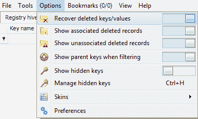

图 6.11\. 注册表资源管理器“恢复已删除的键/值”选项

现在你可以选择一个 hive 文件进行处理。为此，点击**文件 - 加载离线 hive**，或直接按**Alt + 1**。就这么简单。

1.  现在，你可以浏览你的 hive 文件内容，在我们的案例中是 SYSTEM，包括相关和不相关的已删除记录，如下图所示：

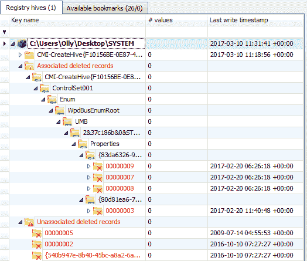

图 6.12\. 相关和不相关的已删除记录

相关记录和不相关记录的区别在于，前者仍与活动注册表中的键关联，而后者则没有。

# 工作原理...

注册表资源管理器处理所选的 hive 文件，并自动恢复已删除的记录，包括相关和不相关的记录。处理完成后，检查员可以浏览可用数据。

# 另见

Eric Zimmerman's GitHub：

[`ericzimmerman.github.io/`](https://ericzimmerman.github.io/)

介绍注册表资源管理器：

[`binaryforay.blogspot.ru/2015/02/introducing-registry-explorer.html`](https://binaryforay.blogspot.ru/2015/02/introducing-registry-explorer.html)

# 使用 FTK 注册表查看器进行注册表分析

FTK 注册表查看器是作为 AccessData 产品的一部分提供的，也可以单独下载。它允许用户查看 Windows 机器上注册表的内容。

# 准备工作

如果你已经安装了 FTK，注册表查看器应该已经在你的系统上。如果没有，你可以在 AccessData 的官网上下载 FTK Imager——它是免费的。你需要填写一些个人信息，包括姓名、公司名称、职位和电子邮件地址，才能获取免费的下载链接。下图展示了 FTK Imager 的下载页面：

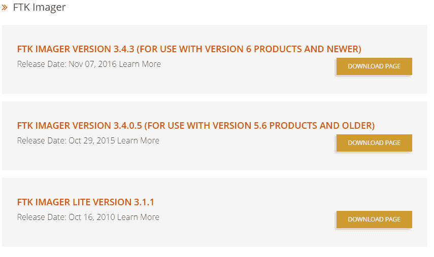

图 6.13\. 下载 FTK Imager

如果你只需要下载 Registry Viewer，你也可以在产品下载页面进行下载。

# 如何操作...

安装完成 Registry Viewer 后，导航到你计算机上的程序图标，双击打开程序。同时打开 FTK Imager。

1.  在 Imager 中，转到 文件 > 获取受保护的文件。

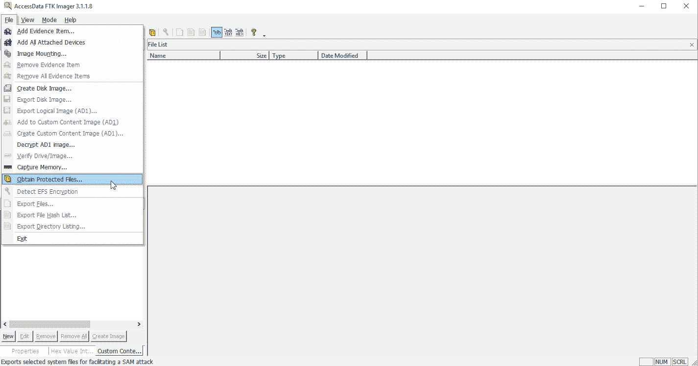

图 6.14\. 获取受保护的文件

1.  在弹出的小框中，选择一个目标文件夹来存放你的文件。

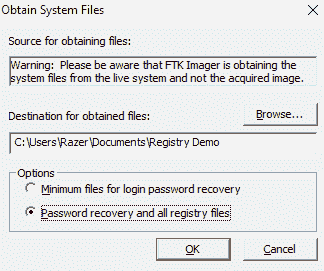

图 6.15\. 选择目标文件夹

注意 Imager 从你自己的系统获取文件的警告。像这样在示例或练习案例中没问题，但如果你在尝试查找法医图像中的证据时看到这个警告，那就说明你选择了错误的来源！

1.  确保你选择了密码恢复和目标文件夹栏下方的所有注册表文件，否则你只能获得简化版的结果。点击确定。

生成可能需要一点时间，前几秒可能看起来没有反应。记住，处理技术问题时，耐心是美德！你可以通过打开之前指定的文件路径中的文件夹来检查过程是否完成，文件夹现在应该已经被填充，如下图所示：

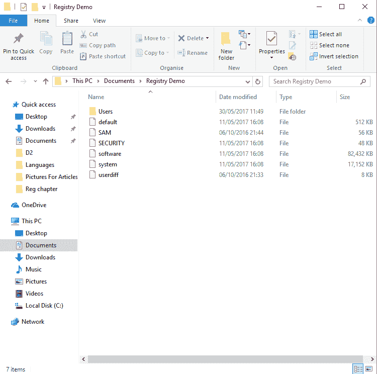

图 6.16\. 已填充的文件夹

1.  点击文件，然后选择更改文件夹和搜索选项。这将打开一个对话框。点击查看选项卡，并在“隐藏的文件和文件夹”下启用“显示隐藏的文件、文件夹和驱动器”选项。

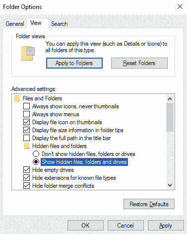

图 6.17\. 显示隐藏文件

点击应用，然后点击确定。

现在我们可以查看通过 Registry Viewer 收集的注册表数据。

1.  为了做到这一点，打开 Registry Viewer，点击文件 > 打开，然后进入你保存注册表文件的文件夹，找到标记为 `NTUSER.DAT` 的文件并打开它。

1.  SOFTWARE 菜单会列出所有在该计算机上安装的软件：

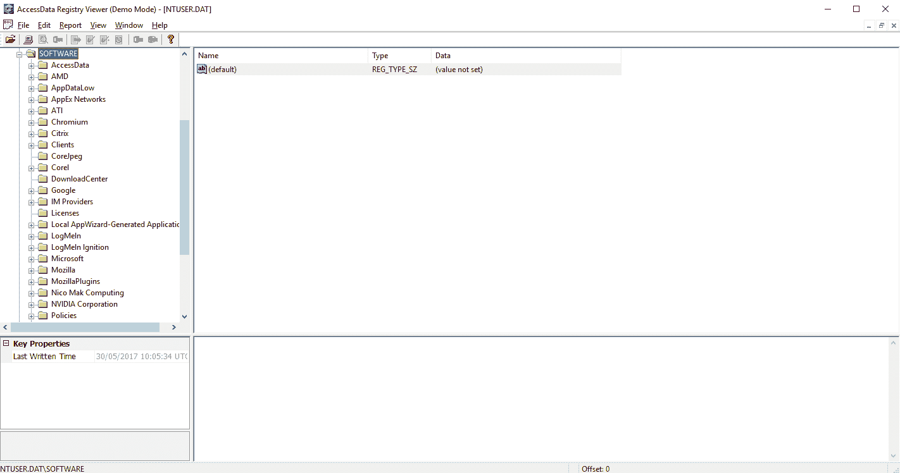

图 6.18\. 已安装的软件

1.  你可以在 `NTUSER.DAT\SOFTWARE\Microsoft\UserData\UninstallTimes` 中查看已卸载的软件及其卸载时间。

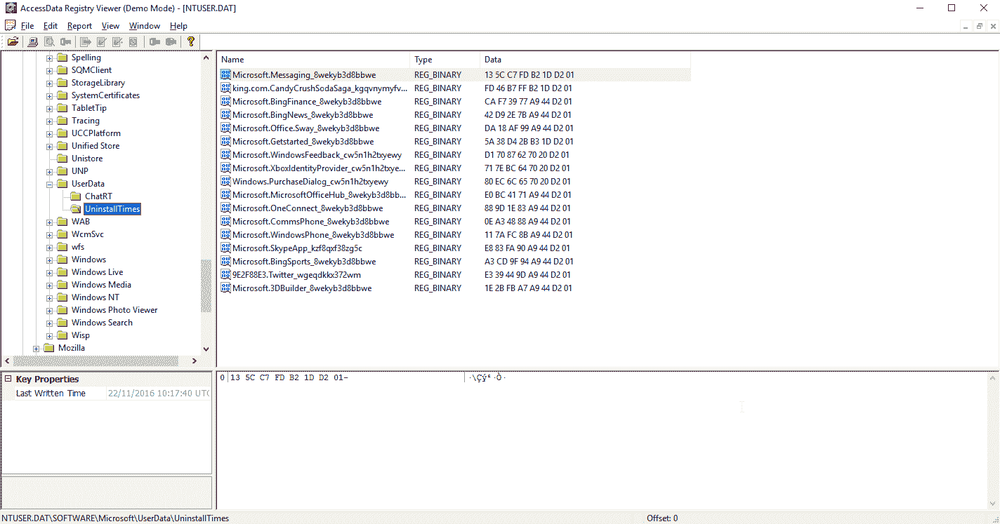

图 6.19\. 卸载时间

如果你怀疑用户采取了反取证措施以破坏调查，这一点特别有用。

1.  在 `NTUSER.DAT\SOFTWARE\Microsoft\InternetExplorer\TypedURLs` 中，你可以查看用户在 Internet Explorer 中访问的任何网站地址：

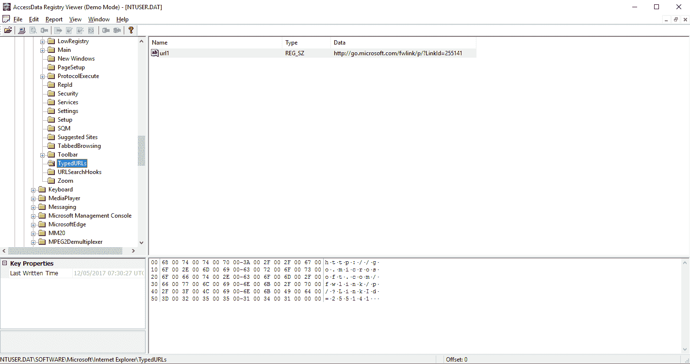

图 6.20\. 在 Internet Explorer 中访问的网站

在`NTUSER.DAT\Software\Microsoft\Internet Explorer\IntelliForms`下，你可以看到自动填充表单的数据，例如用户名和密码。

# 它是如何工作的...

注册表查看器从计算机或取证镜像中收集注册表文件，允许使用 FTK 或 Imager 进行手动检查。

# 另请参见

AccessData 的产品页面：

[`accessdata.com/product-download`](http://accessdata.com/product-download)

AccessData 注册表查看器用户指南：

[`ad-pdf.s3.amazonaws.com/RegistryViewer_UG.pdf`](https://ad-pdf.s3.amazonaws.com/RegistryViewer_UG.pdf)
