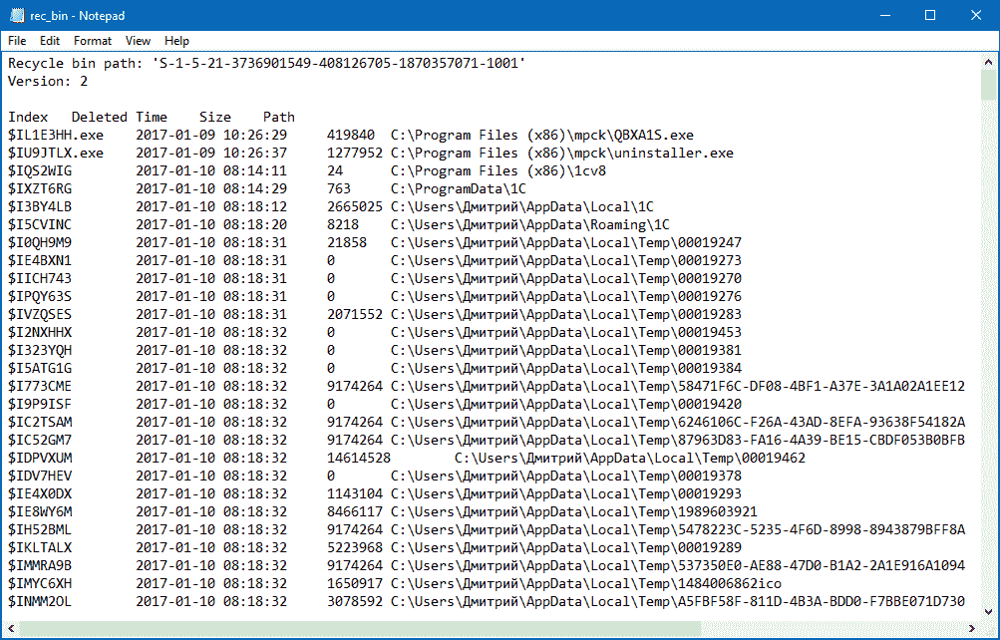
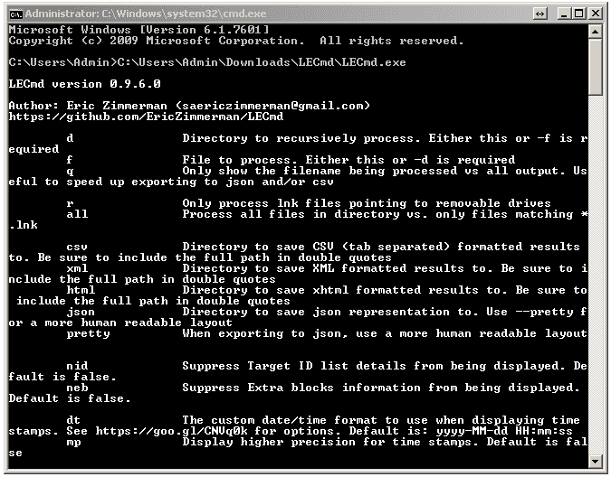
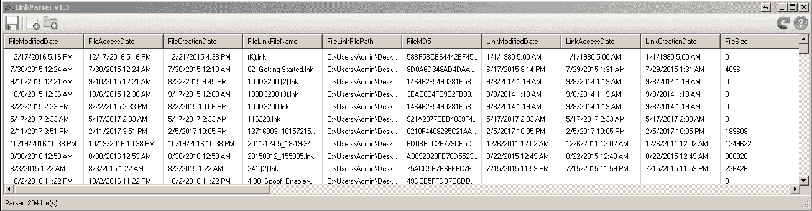

# 第七章：主要的 Windows 操作系统工件

本章将涵盖以下内容：

+   使用 EnCase Forensic 进行回收站内容分析

+   使用 Rifiuti2 进行回收站内容分析

+   使用 Magnet AXIOM 进行回收站内容分析

+   使用 FullEventLogView 进行事件日志分析

+   使用 Magnet AXIOM 进行事件日志分析

+   使用 EVTXtract 进行事件日志恢复

+   使用 EnCase Forensic 进行 LNK 文件分析

+   使用 LECmd 进行 LNK 文件分析

+   使用 Link Parser 进行 LNK 文件分析

+   使用 Magnet AXIOM 进行预取文件分析

+   使用 PECmd 解析预取文件

+   使用 Windows Prefetch Carver 恢复预取文件

# 引言

Windows 操作系统的一些功能会生成大量有价值的工件，这些工件可以作为数字证据的线索。最常见的这些工件来源包括回收站、Windows 事件日志、LNK 文件和预取文件。

回收站包含用户通过右键菜单删除的文件和文件夹。实际上，这些文件并没有从文件系统中删除，而只是从原位置移动到了回收站。有两种回收站格式：Recycler 格式（Windows 2000，XP）- 文件存储在 `C:\Recycler\%SID%\` 下，元数据存储在 `INFO2` 文件中；和 `$Recycle.Bin` 格式 - 文件存储在 `C:\$Recycle.Bin\%SID%\` 下的 `$R` 文件中，元数据存储在 $I 文件中。

如你所料，Windows 事件日志收集有关不同系统事件的信息。Windows 2000、XP 和 2003（除服务器版本外）将这些日志存储在三个文件中：应用程序、系统和安全。这些文件可以在 `C:\Windows\system32\config` 下找到。自 Windows Vista 起，事件日志格式已更改为 XML。这些 EVTX 文件可以在 `C:\Windows\System32\Winevt\Logs` 下找到。

LNK 文件或 Windows 快捷方式文件指向其他文件：应用程序、文档等。这些文件可以在整个系统中找到，帮助数字取证人员揭示一些嫌疑人的活动，包括最近使用的文件、应用程序等。

最后是预取文件。您可以在 `C:\Windows\Prefetch` 中找到这些文件，它们包含关于已使用应用程序的大量有价值的信息，包括运行次数、最后运行日期和时间等。

在本章中，您将学习如何使用商业和免费的数字取证工具分析这些数字证据来源。

# 使用 EnCase Forensic 进行回收站内容分析

EnCase 是 Guidance Software 开发的著名且被法院接受的商业数字取证工具。它被全球各地的审查员使用，包括执法机构和私营部门。它支持整个调查生命周期，从数据收集到报告生成。而且，它内置了脚本语言——EnScript，用户可以编写自己的脚本来解决数字取证问题。许多有用的 EnScript 脚本可以在 EnCase App Central 免费获取。在本指南中，我们将向你展示如何使用这一强大的工具检查 Windows 回收站的内容。

# 准备工作

不幸的是，Guidance Software 并未提供 EnCase Forensic 的试用版本，因此要遵循本指南，你必须拥有有效的许可证。如果你有许可证，请确保使用的是最新版本的工具：EnCase Forensic 8。

# 如何操作……

在 Encase Forensic 中进行回收站内容分析的步骤如下：

1.  我们从创建一个新案件开始。为此，请点击左侧的“新案件”链接。案件选项窗口将会弹出，如下图所示：


图 7.1\. 案件选项

1.  我们选择了#2 法医模板，并且有很多信息需要填写。我们从案件信息开始。在这里，我们需要填写 6 个字段：案件编号、案件日期、审查员姓名、审查员 ID、机构和描述。所有字段都是自解释的，所以只需填写即可。

1.  让我们进入名称和位置。首先在第一个字段中输入案件的名称或编号，然后选择基础案件文件夹（案件文件将存储在这里）。完整案件路径字段将自动填充。

1.  转到证据缓存位置。你可以使用相同的文件夹来存储缓存（为此，勾选“使用基础案件文件夹作为主要证据缓存”），或选择一个或两个文件夹来存储它。

1.  最后，如果你希望你的案件得到备份，请勾选“每次备份”选项，并选择其值。别忘了选择备份文件夹和备份的最大大小。一旦所有内容填写完毕，点击确定即可。

1.  现在你可以看到一个包含案件信息的窗口，并且可以添加法医图像。为此，点击左侧的“添加证据文件”链接。


图 7.2\. 添加证据

如上图所示，有 6 个证据来源选项：你可以添加本地设备（别忘了使用写入阻断器）、远程证据源、E01 或 RAW 图像等。你已经有了 E01 和 RAW 图像，因此可以选择其中一个。我们将使用 E01 图像。如果你也打算使用 E01 图像，请点击“添加证据文件”链接；如果你使用的是 RAW 图像，请点击“添加 RAW 图像”。

1.  现在你可以看到你的证据文件。点击文件名以查看其内容。EnCase 解析数据可能需要一些时间。数据解析完成后，转到$Recycle bin 文件夹：


图 7.3\. $Recycle.Bin 文件夹内容

如前图所示，显示了用户的安全标识符（SID）列表。这可以帮助检查人员确定是哪个用户将文件放入回收站。也有文件夹；我们打开其中一个。在我们的例子中，我们打开文件夹 `S-1-5-21-811620217-3902942730-3453695107-1000`。请看下一个图：


图 7.4\. S-1-5-21-811620217-3902942730-3453695107-1000 文件夹内容

EnCase 已经自动为你解析了回收站内容。它还收集了许多有价值的信息：原始文件名、原始路径、删除日期和时间等等。

# 工作原理...

根据 Windows 版本，EnCase 从 `INFO2` 文件（Windows XP）或 `$I` 和 `$R` 文件（Windows Vista 及以上）中提取回收站内容的信息，因此法医检查人员可以预览它们，查看原始文件名、路径、删除日期等。

# 另见

EnCase Forensic 8 新功能：

[`www.guidancesoftware.com/document/product-brief/what's-new-in-encase-forensic-8`](https://www.guidancesoftware.com/document/product-brief/what's-new-in-encase-forensic-8)

# 使用 Rifiuti2 分析回收站内容

Rifiuti2 是一个开源工具，使计算机取证检查员能够分析 Windows 回收站的内容。该工具将显示重要信息，如回收文件的删除日期和时间、原始路径等。Rifiuti2 支持旧版（从 Windows 95 开始）和现代（直到 Windows 10）回收站格式。更重要的是，语言不是问题：该工具支持所有本地化版本的 Windows。

# 准备工作

前往 Rifiuti2 的下载页面，下载最新 Windows 版本的 ZIP 压缩包。在我们的例子中，最新版本是 0.6.1，因此我们下载的压缩包名为 Rifiuti2-0.6.1-win.zip。解压后即可使用。

# 操作步骤...

你已经知道，每个用户在回收站中都有自己的文件夹。记得上一节关于 EnCase 的截图吗——那里有多个文件夹。要使用 Rifiuti2，首先需要导出其中一个文件夹。许多工具都能做到这一点，你已经知道其中的一些，例如 Autopsy、FTK Imager 和 Magnet AXIOM。

一旦你导出了文件夹，就可以启动 Windows 命令提示符并使用该工具。如果你使用的是 32 位系统，请进入 x32 文件夹；如果你使用的是 64 位系统，请进入 x64 文件夹。在这两个文件夹中，你将找到两个 Windows 可执行文件：`rifiuti.exe` 和 `rifiuti-vista.exe`。如果你从 Windows 系统（包括 XP）导出了文件夹，请使用 `rifiuti.exe`，否则（从 Vista 开始）使用 `rifiuti-vista.exe`。在我们的例子中，文件夹是从 Windows 10 镜像中导出的，因此我们使用了 `rifiuti-vista.exe`。

```
    rifiuti-vista.exe S-1-5-21-3736901549-408126705-1870357071-1001 >                      
    rec_bin.txt

```

如你所见，我们将输出重定向到了一个 `TXT` 文件。请查看其内容，如下图所示：



图 7.5\. Rifiuti2 输出

一切都被正确解析。我们获得了原始路径、名称、大小和删除时间戳。你注意到那些西里尔字母符号了吗？正如我们之前提到的，所有本地化版本的 Windows 都是支持的！

# 它是如何工作的...

如果你有来自 Vista 之前 Windows 系统的文件夹，可以使用 `rifiuti.exe`，它解析 `INFO2` 文件内容，提取有关特定用户回收站内容的信息。

如果你有来自 Windows Vista 或更高版本的文件夹，使用 `rifiuti-vista.exe`，它会解析所谓的索引文件（$I），提取有关回收站中文件的信息，包括它们的原始路径、名称、大小、删除日期和时间。

# 另见

Rifiuti2 GitHub 页面：

[`github.com/abelcheung/rifiuti2`](https://github.com/abelcheung/rifiuti2)

Rifiuti2，版本 0.6.1，下载页面：

[`github.com/abelcheung/rifiuti2/releases/tag/0.6.1`](https://github.com/abelcheung/rifiuti2/releases/tag/0.6.1)

# 使用 Magnet AXIOM 分析回收站内容

Magnet AXIOM 支持所有常见的 Windows 操作系统伪造物，包括当然也有回收站。在本教程中，我们将向你展示如何使用它来分析我们怀疑的对象试图删除的文件，这些文件被放入了回收站。

# 准备工作

如果你还没有下载并安装 Magnet AXIOM 的试用版，可以通过 *查看更多* 部分中的链接进行下载。一旦工具安装在你的工作站上，打开它，创建一个新案件，添加一张取证镜像，并使用默认选项处理它。如果你不知道如何操作，可以参考前面章节中的相关教程。

# 如何操作...

使用 Magnet AXIOM 分析回收站内容的步骤如下：

1.  一旦你的取证镜像被处理，转到 AXIOM Examine 的伪造物类型面板，向下滚动至操作系统部分，如下图所示：


图 7.6\. 操作系统伪造物列表

1.  如你所见，列出了很多不同的操作系统伪造物，包括回收站。在我们的例子中，回收站里只有一个文件。你可以在下图中看到它：


图 7.7\. 回收站内容

1.  所以，我们的嫌疑人在回收站中有一个 TeamViewer 应用的快捷方式。这个应用用于远程访问。是不是很可疑？你还可以找到文件被删除的日期和时间、删除它的用户的安全标识符，以及原始文件路径—所有你可能需要的信息。

# 它是如何工作的...

如果你直接使用默认选项处理证据源，或者在自定义伪造物列表中选择回收站，Magnet AXIOM 会解析 `INFO2` 文件（适用于 Windows XP 及更早版本）或 $I 和 $R 文件（适用于 Windows Vista 及更高版本）中的所有可用信息。

# 另见

Magnet AXIOM 试用请求页面：

[`www.magnetforensics.com/try-magnet-axiom-free-30-days/`](https://www.magnetforensics.com/try-magnet-axiom-free-30-days/)

# 使用 FullEventLogView 进行事件日志分析

FullEventLogView 是 NirSoft 提供的另一个有用的免费工具，能够解析 Windows 10、8、7 和 Vista 的事件日志。计算机取证审查员可以使用该工具查看来自本地计算机的事件日志以及位于 `%SystemRoot%\Windows\System32\winevt\Logs` 路径下的 EVTX 文件。

# 准备工作

访问 NirSoft 网站上的 FullEventLogView 下载页面（该链接在“另见”部分中），并根据你的系统下载 32 位或 64 位版本的工具。解压下载的归档文件后，你就可以开始使用了。

# 如何操作...

使用 FullEventLogView 进行事件日志分析的步骤如下：

1.  启动工具后，你应该做的第一件事是选择数据源。为此，请前往“文件 - 选择数据源”，或者直接按 *F7*。如以下图所示，有三种可用的选项：

+   +   从运行工具的计算机加载日志

    +   从远程计算机加载日志

    +   从你之前导出的文件夹加载日志（例如从取证镜像中）


图 7.8\. 在 FullEventLogView 中选择数据源

1.  默认情况下，FullEventLogView 仅显示过去 7 天的事件。如果你需要更长时间段的事件，可以前往“选项 - 高级选项”（或者按 *F9*），并选择“显示所有时间的事件”。你还可以选择一个时间段来显示，包括本地时间和 GMT，并按级别、事件 ID、提供程序和频道筛选事件日志。


图 7.9\. FullEventLogView 高级选项

1.  一旦你应用了所需的所有筛选器并选择了数据源，你将在 FullEventLogView 的主窗口中看到所有可用的事件日志。如下图所示：


图 7.10\. 查看从镜像导出的文件夹中的事件日志

审查员可以按任何可用的列对日志进行排序。此外，你还可以在日志中进行搜索：前往“编辑 - 查找”，或者直接按 *Ctrl*+*F*。

# 它是如何工作的...

根据数据源，FullEventLogView 会显示来自本地计算机、远程计算机或文件夹的事件日志，并允许数字取证审查员对其进行排序和使用关键词搜索。

# 另见

事件日志：

[`technet.microsoft.com/en-us/library/cc722404(v=ws.11).aspx`](https://technet.microsoft.com/en-us/library/cc722404(v=ws.11).aspx)

FullEventLogView 下载页面：

[`www.nirsoft.net/utils/full_event_log_view.html`](http://www.nirsoft.net/utils/full_event_log_view.html)

# 使用 Magnet AXIOM 进行事件日志分析

让我们继续使用 Magnet AXIOM 来探索一些常见的 Windows 操作系统取证遗留物。在本章中，我们将向你展示如何使用此工具检查 Windows 事件日志。

# 准备工作

你已经使用过这个工具来收集法医镜像中的回收站数据。这一次，我们关注的是事件日志分析，但如果你在使用默认选项处理整个镜像时，仍然可以使用相同的案例来处理回收站数据。

# 如何操作...

使用 Magnet AXIOM 进行事件日志分析的步骤如下：

1.  打开你用于回收站法医分析的案例，重新进入操作系统工件列表，但现在选择 Windows 事件日志，如下图所示：


图 7.11\. 操作系统工件列表

1.  如前图所示，我们有大量的事件日志。为了简化分析，你可以对它们进行排序。例如，我们使用了“创建日期/时间”列来排序事件日志。你可以在下图中看到部分结果：


图 7.12\. 已排序的事件日志记录

当然，你可以使用其他列来排序日志，例如事件 ID 或事件描述摘要——这取决于你的具体案件需求。

# 它是如何工作的...

在处理阶段，Magnet AXIOM 会自动查找法医镜像中的可用 Windows 事件日志。结果，检查员可以得到所有日志的列表，并能够根据不同的标准对其进行排序。

# 另请参见

Magnet AXIOM for computers: [`www.magnetforensics.com/magnet-axiom/computers/`](https://www.magnetforensics.com/magnet-axiom/computers/)

# 使用 EVTXtract 恢复事件日志

你已经知道如何导出、排序和搜索 Windows 事件日志。现在是学习如何恢复已删除或损坏的事件日志工件的时候了。幸运的是，有一个由 Willi Ballenthin 开发的开源工具能够解决这个问题：EVTXtract。该工具不仅能从 RAW 镜像中恢复 EVTX 文件片段，还能从未分配空间和内存转储中恢复。

# 准备工作

首先，由于 EVTXtract 是用 Python 编写的，请确保你的工作站已安装该软件。如果没有，访问官方 Python 网站，下载并安装它。此外，你还需要 **python-evtx**，你可以在 Willi 的 GitHub 上找到它。Python-evtx 是一个 EVTX 解析器，是 EVTXtract 的依赖项。要安装它，从 GitHub 下载并解压归档文件，打开 Windows 命令提示符，选择你解压文件的目录，然后运行以下命令：

```
setup.py install

```

就这样；现在你已经安装了 python-evtx，并准备好安装 EVTXtract。这个过程几乎相同：从 GitHub 下载并解压归档文件（但现在使用 EVTXtract 下载页面），打开 Windows 命令提示符，选择你解压文件的目录，然后运行以下命令：

```
setup.py install

```

我们完成了。现在，你的 Python 2 脚本文件夹中有了 `evtxtract.exe` —— 在我们的例子中是 `*C:\Python27\Scripts*` —— 并且你已经准备好使用它了。

# 如何操作...

首先，你必须决定使用什么作为数据源。你有三个选项：RAW 格式的磁盘镜像、内存转储或未分配空间。你已经在之前的教程中创建了 RAW 磁盘镜像和内存镜像（转储），那么未分配空间呢？你已经使用过 **Autopsy**，甚至从 NTFS 分区恢复了一些数据。但你也可以使用这个工具将未分配空间提取到单独的文件中。为此，进入数据源，右键点击你想从中提取未分配空间的分区，选择 **提取未分配空间到单个文件**。


图 7.13. 使用 Autopsy 提取未分配空间到单个文件

一旦提取了未分配空间，你可以使用这个文件作为 EVTXtract 的源文件。要开始恢复过程，请使用以下命令：

```
evtxtract.exe image.raw > output.xml

```

别忘了将 `image.raw` 更改为你选择的文件。过程完成后，你可以分析并搜索输出文件。

# 工作原理...

EVTXtract 遍历磁盘镜像（仅支持 RAW 格式）、内存转储或提取的未分配空间文件（取决于检查者的选择），并恢复 EVTX 数据片段，保存到 XML 文件中。

# 另请参见

Python 下载页面：

[`www.python.org/downloads/`](https://www.python.org/downloads/)

Python-evtx 下载页面：

[`github.com/williballenthin/python-evtx`](https://github.com/williballenthin/python-evtx) EVTXtract 下载页面：

[`github.com/williballenthin/EVTXtract`](https://github.com/williballenthin/EVTXtract)

# 使用 EnCase 法医分析 LNK 文件

在之前的教程中，你已经学会了如何创建新案件、添加证据文件，并使用 EnCase Forensic 检查 Windows 回收站的内容。现在，是时候深入了解 EnCase 证据处理器，特别是 Windows Artifact Parser 了。这个模块可以帮助数字取证检查员自动解析不同的 Windows 法医遗留物，包括 LNK 文件。

# 准备工作

要使用 EnCase 证据处理器，你需要创建一个案件并添加证据项。你已经创建了一个用于检查回收站的案件，因此可以在此处使用该案件。如果没有可用案件，请创建一个新案件并添加镜像。完成后，你就可以开始使用 EnCase 证据处理器和 Windows Artifact Parser。

# 操作步骤...

LNK 文件分析步骤如下：

1.  一旦你创建了新案件并添加了证据项，转到 **处理证据 - 处理...** 你将看到 EnCase 处理器选项窗口，如下图所示：


图 7.14. EnCase 处理器选项

1.  如你所见，这里有很多选项：你可以恢复文件夹、查找电子邮件、查找互联网遗留物等。但现在，让我们进入模块文件夹。你可以在下图中看到它的内容：


图 7.15\. 模块文件夹内容

1.  如前所述，这次我们关注的是 Windows Artifact Parser。如果你点击它的名称，会看到以下选项：


图 7.16\. Windows Artifact Parser 选项

1.  该模块能够提供有关快捷方式文件、回收站文件（如果你希望它们出现在报告中，请确保使用此选项）、MFT 事务和 ShellBags 的信息，包括从图像的未分配空间中提取的那些信息（如果你勾选了“搜索未分配空间”选项）。

1.  这次我们要解析 LNK 文件，因此选择 **Link Files** 选项（别忘了勾选“搜索未分配空间”，我们可不想错过任何东西！）。

1.  一旦处理完成，进入 **EnScript - Case Analyzer**。在这里，你可以找到所有可用的 LNK 文件，以及由 Windows Artifact Parser 提取的大量元数据。查看下图了解更多详情：


图 7.17\. 解析后的 LNK 文件

# 它是如何工作的...

Windows Artifact Parser 会遍历添加到案件中的镜像，并从其中找到的 LNK 文件中提取信息，包括如果考官选择了该选项的话，从未分配空间中提取的文件。一旦处理完成，考官就可以分析、书签并将这些信息添加到报告中。

# 另见

Windows 快捷方式文件格式规范：

[`github.com/libyal/liblnk/blob/master/documentation/Windows%20Shortcut%20File%20(LNK)%20format.asciidoc`](https://github.com/libyal/liblnk/blob/master/documentation/Windows%20Shortcut%20File%20(LNK)%20format.asciidoc)

# 使用 LECmd 分析 LNK 文件

LECmd 是 Eric Zimmerman 开发的另一款优秀的免费开源 Windows 取证工具。它处理文件非常快速，既可以用于解析单个 LNK 文件，也可以解析包含它们的文件夹。同时，它提供了多种导出选项，包括 CSV 和 XML。

# 准备工作

进入 LECmd 下载页面，下载包含该工具的压缩包。解压下载的文件，打开 Windows 命令提示符，切换到刚解压的目录，然后你就可以开始了。

# 如何操作...

使用 LECmd 分析 LNK 文件的步骤：

1.  如前所述，LECmd 可以处理单个文件和文件夹。如果你想从单个文件中提取信息，使用 **-f** 参数；如果目标是目录，则使用 -d 参数。如果你只对指向可移动驱动器的 LNK 文件感兴趣，可以使用 **-r** 参数。其他可用选项请参见下图：



图 7.18\. LECmd 选项

1.  如果你想在取证镜像上的文件或文件夹上运行 LECmd，首先需要挂载它。幸运的是，你已经知道如何操作了。在我们的案例中，主分区挂载在 `N:\`。我们将对 `Roaming` 文件夹运行 LECmd，并将输出保存为 xhtml 格式。操作命令如下：

```
LECmd.exe -d "N:\Users\NP\AppData\Roaming" -xhtml
"C:\Users\Admin\Desktop\test.html

```

1.  你可以在下图中看到部分 xhtml 格式的输出：


图 7.19\. LECmd 部分 xhtml 格式的输出

1.  如前图所示，LECmd 从 LNK 文件中提取了大量信息。例如，我们可以看到 LNK 文件和目标文件（在我们的例子中是 LacyMilletCL.doc）的 MAC（修改、访问、创建）时间，还能看到目标文件的大小、绝对路径，甚至计算机 ID 和 MAC 地址。

# 它是如何工作的...

LECmd 遍历文件夹或单个文件，从可用的 LNK 文件中提取信息，并将输出保存为检查员选择的格式。

# 另见

LECmd 下载页面：

[`ericzimmerman.github.io/`](https://ericzimmerman.github.io/)

介绍 LECmd：

[`binaryforay.blogspot.ru/2016/02/introducing-lecmd.html`](https://binaryforay.blogspot.ru/2016/02/introducing-lecmd.html)

Shell Link (.LNK) 二进制文件格式：

[`msdn.microsoft.com/en-us/library/dd871305.aspx`](https://msdn.microsoft.com/en-us/library/dd871305.aspx)

# 使用 Link Parser 进行 LNK 文件分析

Link Parser 是另一款免费工具，可以供数字取证检查员分析微软 Shell Link 文件。它由 4Discovery 开发，能够解析单个 LNK 文件、多个选定文件，或递归地遍历文件夹或挂载的取证镜像。

# 准备工作

访问 4Discovery 网站上的 Link Parser 页面（你可以在“另见”部分找到该链接），并下载包含工具的压缩包——在撰写时，最新版本是 1.3。解压缩压缩包后，你就可以开始使用了。

# 如何操作...

启动 `LinkParser.exe`，点击文件夹图标，选择包含你希望工具解析的 LNK 文件的文件夹。在我们的案例中，它是 `C:\Users\{username}\AppData\Roaming\Microsoft\Windows\Recent`——这个文件夹包含最近使用的项目；我们通过 FTK Imager 从取证镜像中导出了该文件夹。Link Parser 已经从 204 个 LNK 文件中提取了数据，见下图：



图 7.20\. Link Parser 输出

Link Parser 从 LNK 文件中提取了大量数据——超过 30 个属性，包括卷序列号、卷标签、卷 ID 等。

所有解析的属性都可以轻松导出为 `CSV` 文件。操作步骤是，点击软盘图标，选择导出文件名并选择位置。之后，你可以轻松地将导出的数据导入到你最喜欢的电子表格应用中。

# 它是如何工作的...

Link Parser 会遍历由检查员选择的文件夹或单个 LNK 文件，并从可用的 LNK 文件中提取超过 30 个属性。解析后的数据可以导出为 CSV 文件。

# 另请参见

Link Parser 下载页面：

[`www.4discovery.com/our-tools/`](http://www.4discovery.com/our-tools/)

# 使用 Magnet AXIOM 进行预取文件分析

如果您一直在跟随本书中的教程，您应该已经知道 Magnet AXIOM 是什么，并且甚至已经使用它进行过一些 Windows 工件的取证分析。AXIOM 是一个非常好的工具，因此我们将继续展示如何使用它来解析和分析不同的有用操作系统工件：这次是预取文件。

# 准备工作

既然您已经使用过 AXIOM，就无需重新安装——它已经安装在您的工作站上。如果由于某些原因没有安装，请参阅“另请参见”部分，了解如何获得该工具的试用版。同时，您需要一个证据来源：法证镜像或包含预取文件的文件夹（位于 `C:\Windows\Prefetch`）。一旦您找到其中之一，就可以开始了。

# 如何操作...

使用 Magnet AXIOM 进行预取文件分析的步骤：

1.  创建一个新案件并进入加载证据。这里有五个选项：CONNECTED DRIVE、FILES & FOLDERS、COMPUTER IMAGE、VOLUME SHADOW COPY 和 MOBILE DEVICES，如下图所示：


图 7.21：加载证据选项

1.  如前所述，您可以使用法证镜像或以前导出的包含预取文件的文件夹。如果您更喜欢第一种选项，选择 COMPUTER IMAGE；如果是第二种，选择 FILES & FOLDERS。在我们的例子中，它是一个文件夹，通过 AXIOM 文件夹浏览器帮助选择。

1.  现在，让我们查看工件的详细信息。由于我们对预取文件感兴趣，因此从列表中只选择这些工件。点击 CUSTOMIZE COMPUTER ARTIFACTS 按钮，然后选择 CLEAR ALL，进入 OPERATING SYSTEM，勾选 Windows Prefetch Files 选项。您可以在下图中看到如何操作：


图 7.22：选择要包含在案件中的工件

1.  所以，现在我们准备开始分析证据。我们仅选择了一个包含预取文件的文件夹，因此我们很快就能在 AXIOM Examine 中查看解析结果。一旦处理阶段完成，您就可以查看和分析结果，如下图所示：


图 7.23：预取文件解析结果

如您所见，我们可以获取每个程序的运行次数，并且还能获得最多八次最近运行的时间戳。这是非常有价值的信息，特别是在恶意软件取证中！

# 工作原理...

Magnet AXIOM 会搜索预取文件，并提取有关运行次数以及最多八次最近运行的时间戳的信息。

# 另请参见

尝试 Magnet AXIOM 免费版，30 天体验：

[`www.magnetforensics.com/try-magnet-axiom-free-30-days/`](https://www.magnetforensics.com/try-magnet-axiom-free-30-days/)

Windows 预取文件 (PF) 格式：

[`github.com/libyal/libscca/blob/master/documentation/Windows%20Prefetch%20File%20(PF)%20format.asciidoc`](https://github.com/libyal/libscca/blob/master/documentation/Windows%20Prefetch%20File%20(PF)%20format.asciidoc)

Windows 中的预取文件取证分析：

[`www.magnetforensics.com/computer-forensics/forensic-analysis-of-prefetch-files-in-windows/`](https://www.magnetforensics.com/computer-forensics/forensic-analysis-of-prefetch-files-in-windows/)

# 使用 PECmd 解析预取文件

如果您发现了一些可疑的预取文件并希望进行深入分析，还有一个由 Eric Zimmerman 提供的工具可以帮助您——PECmd。这是一个免费的、快速的命令行工具，能够解析旧版和新版格式的 Windows 预取文件。在本指南中，我们将展示如何借助这个工具从预取文件中提取有价值的数据。

# 准备就绪

访问 PECmd 下载页面，获取包含该工具的归档文件——在写作时，最新版本为 0.9.0.0——并解压它。您还需要一个预取文件，或者一个包含此文件的文件夹。如您所知，可以使用您选择的工具从取证映像中导出它。一旦获得该文件，打开 Windows 命令提示符，您就可以开始了！

# 如何操作...

使用 PECmd 解析预取文件的步骤如下：

1.  使用 Windows 命令提示符，将目录更改为您解压归档文件的所在位置，并运行以下命令：

```
PECmd.exe -f C:\Users\Admin\Desktop\Prefetch\ACRORD32.EXE-41B0A0C7.pf

```

您将很快看到输出，如下图所示：


图 7.24. PECmd 输出

1.  如前图所示，我们可以获得可执行文件的名称、运行次数、最近八次运行的时间戳，甚至是目录和文件引用的列表。不错吧？

您还可以递归解析目录中的所有文件。为此，请使用以下命令：

```
PECmd.exe -d C:\Users\Admin\Desktop\Prefetch\

```

该工具体积小巧，但功能强大，非常推荐在您的取证检查中使用 Windows 预取分析。

# 它是如何工作的...

PECmd 从预取文件，或用户指定文件夹中的多个预取文件中提取可用信息。信息包括总的运行次数、最近运行的时间戳、目录和文件引用等。

# 另请参见

PECmd 下载页面：

[`ericzimmerman.github.io/`](https://ericzimmerman.github.io/)

介绍 PECmd：

[`binaryforay.blogspot.ru/2016/01/introducing-pecmd.html`](https://binaryforay.blogspot.ru/2016/01/introducing-pecmd.html)

# 使用 Windows 预取恢复器进行预取文件恢复

如果你想从任意二进制数据中尝试提取 Windows Prefetch 文件，有一个工具可以帮助你——Adam Witt 的 Windows Prefetch Carver。它可以用于从驱动器的未分配空间或内存镜像中提取 Prefetch 文件。在本教程中，我们将展示如何使用它。

# 准备工作

访问 Windows Prefetch Carver 的 GitHub 页面（见*另见*部分），使用绿色的“Clone or Download”按钮下载压缩包。解压该压缩包，启动 Windows 命令提示符，并切换到解压后的目录。你准备好了！

# 如何操作...

使用 Windows Prefetch Carver 恢复 Prefetch 文件的步骤如下：

1.  对于本教程，我们使用的是 Windows 7 系统的内存镜像。该镜像名为`joshua1.vmem` - 你可以在*另见*部分找到该内存镜像的下载链接。现在，让我们使用这个工具。输入以下命令：

```
prefetch-carve.py -f joshua1.vmem -o output.txt

```

最终，你将得到一个包含提取数据的输出文件，如下图所示：


图 7.25\. Windows Prefetch Carver 输出

1.  如你所见，该工具提取了 13 条记录：时间戳、文件名和运行次数被显示出来。支持几种输出格式，包括 CSV 和 mactime。运行脚本时不带参数以了解如何以不同格式保存提取的数据。

# 它是如何工作的...

Windows Prefetch Carver 扫描审查员选择的任意二进制数据，并提取 Windows Prefetch 文件痕迹，包括时间戳、文件名和运行次数。

# 另见

Windows Prefetch Carver GitHub 页面：[`github.com/PoorBillionaire/Windows-Prefetch-Carver`](https://github.com/PoorBillionaire/Windows-Prefetch-Carver)

Windows 7 内存镜像下载页面：[`jessekornblum.livejournal.com/293291.html`](http://jessekornblum.livejournal.com/293291.html)
