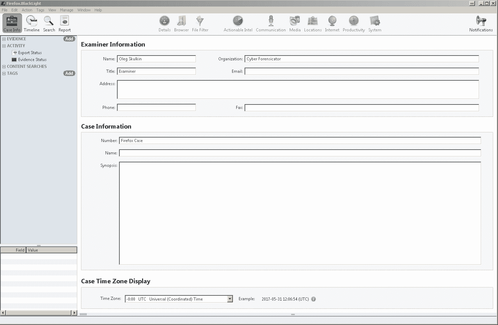
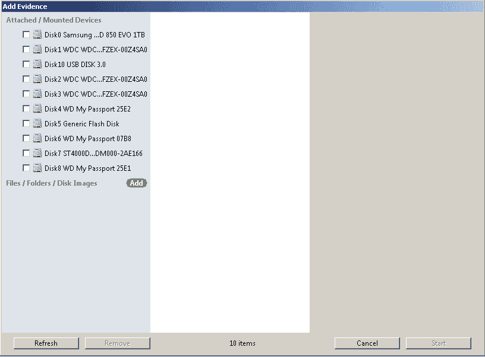
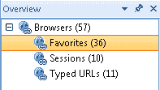

# 第八章：网页浏览器取证

在本章中，我们将覆盖以下示例：

+   使用 BlackBag BlackLight 进行 Mozilla Firefox 分析

+   使用 Magnet AXIOM 进行 Google Chrome 分析

+   使用 Belkasoft Evidence Center 进行 Microsoft Internet Explorer 和 Microsoft Edge 分析

+   从 Pagefile.sys 中提取网页浏览器数据

# 介绍

很难想象一个网页浏览器痕迹无用的案件。儿童虐待材料、知识产权盗窃、网络骚扰、恶意软件——浏览器痕迹可以帮助解决各种案件。如今，市场上有大量的网页浏览器。一些提供更强的隐私选项，另一些则没有。但即使嫌疑人使用了如臭名昭著的 Tor 这样的私人浏览器，计算机取证专家仍然能够提取一些数据，例如来自交换文件和休眠文件的数据（请查看本章的最后一个示例）或内存转储。

在本章中，我们将展示如何使用一些你已经接触过的取证工具，如 Magnet AXIOM 和 Belkasoft Evidence Center，以及一些新的工具，如 BlackBag 的 BlackLight，来进行网页浏览器取证。

最后，你将学会如何使用交换文件（`pagefile.sys` 和 `swapfile.sys`）以及休眠文件来击败一些反取证技术。准备好了吗？

# 使用 BlackBag 的 BlackLight 进行 Mozilla Firefox 分析

BlackBag 的 BlackLight 是一个非常强大的数字取证工具，通常用于 macOS 系统的取证。但当然，Mac 并不是它支持的唯一平台。你还可以在 Android、iOS 和 Windows 系统上使用它进行取证。更重要的是，你可以在 Windows 和 macOS 工作站上都使用 BlackLight，这意味着你可以在 Mac 上分析 Windows 取证镜像！在本示例中，我们将展示如何使用 BlackLight 进行 Mozilla Firefox 取证。

# 准备工作

如果你不是 BlackLight 的授权用户，你可以在 BlackBag 网站上申请试用许可。请在 BlackLight 页面上点击“REQUEST TRIAL”按钮，填写你的个人信息，如姓名、电话、城市、电子邮件等，并点击“SUBMIT”。你将通过电子邮件收到试用密钥和产品下载链接，所以请确保你提交的是有效的电子邮件，最好是政府或企业邮箱。

现在，你需要获取一个包含 Firefox 文件的文件夹来进行分析。如果你使用的是 Windows XP 系统，请查看这里：

`C:\Documents and Settings\%USERNAME%\Application Data\Mozilla\Firefox\`

如果你正在处理一个 Windows Vista 系统（或更高版本），请查看这里：

`C:\Users\admin\AppData\Roaming\Mozilla\Firefox\Profiles\%PROFILE%.default`

在其他文件中，你会找到一些非常有价值的 SQLite 数据库。这些数据库包含浏览历史、下载等信息，BlackLight 将帮助我们提取和分析这些数据。

# 如何操作...

Mozilla Firefox 分析的步骤如下：

1.  打开 BlackLight 并创建一个新案件。为此，点击“文件” - “新建案件”，或者直接点击**新建...**按钮，选择案件存储位置。保存案件后，你可以开始填写必要的字段并选择正确的时区，如下图所示：

图 8.1. 案件详情

1.  现在我们准备好添加证据了。点击**证据**前面的绿色添加按钮。由于我们已经导出了一个 Firefox 配置文件文件夹，点击绿色添加按钮，再点击添加文件夹按钮，并选择你导出的文件夹。

图 8.2. 添加证据

1.  数据处理完成后，你应该能在**互联网**选项卡中找到提取的数据。如果出于某种原因该选项卡没有显示所需内容，你可以手动分析 Firefox SQLite 数据库——BlackLight 配备了强大的内置 SQLite 浏览器！

让我们使用它并分析 `places.sqlite`——一个包含嫌疑人浏览历史信息的 SQLite 数据库。转到浏览器选项卡，选择数据库，并使用预览功能通过 BlackLight SQLite 浏览器进行检查。

图 8.3. 手动分析 'places.sqlite' SQLite 数据库

1.  日期/时间功能。你是否注意到**恢复的碎片**表格？这可以帮助检查员恢复已删除的数据——在我们的案例中，恢复的是已删除的浏览历史记录。

# 工作原理...

BlackLight 分析 Firefox 数据库并提取可用数据（包括已删除的数据）以供进一步检查，包括历史记录、书签、下载、表单数据、Cookies 等等。此外，内置的 SQLite 浏览器使得检查员可以手动分析这些数据库。

# 另见

BlackBag BlackLight 页面：[`www.blackbagtech.com/blacklight.html`](https://www.blackbagtech.com/blacklight.html)

BlackBag BlackLight 快速入门指南：[`www.blackbagtech.com/resources/quickstart-guides/quickstart-guide-blacklight.html`](https://www.blackbagtech.com/resources/quickstart-guides/quickstart-guide-blacklight.html)

# 使用 Magnet AXIOM 分析 Google Chrome

Google Chrome 是另一个非常流行的网页浏览器。你会在许多取证检查中发现其证据，不仅仅是在 Windows 系统上，还有 macOS、Linux，甚至移动平台。借助这个教程，你将学会如何使用 Magnet AXIOM 解析 Google Chrome 证据。

# 准备工作

当然，你可以使用整个取证镜像作为源文件，但从用户的个人资料中提取 Google Chrome 文件夹要快得多，因为这大大减少了需要解析的数据集。你可以在以下位置找到所需的文件夹：

Windows XP:

`C:\Documents and Settings\%USERNAME%\Local Settings\Application Data\Google\Chrome`

Windows Vista 及以上：

`C:\Users\%USERNAME%\AppData\Local\Google\Chrome`

导出文件夹，确保在取证工作站上安装了有效的 Magnet AXIOM 许可证或试用版，并且已准备好。

# 如何操作...

在 AXIOM 中创建一个新案件，使用你导出的文件夹作为证据源，并确保在证据列表中选择 Google Chrome。完成所有这些步骤后，运行证据分析。过程不会花费太多时间，但你会获得许多有用的取证证据。我们案例中提取的证据如下图所示。

图 8.4\. 使用 Magnet AXIOM 提取的 Google Chrome 证据

如你在上图中所见，证据数量相当多。让我们更深入地了解一下。

+   **Chrome 自动填充配置文件** - Chrome 用于自动填写表单字段的配置文件。

+   **Chrome 书签**是用户添加的网页书签。

+   **Chrome 缓存记录**是浏览器为加速网页加载而下载的文件。这些文件可能包括图片、HTML、Javascript 等。

+   **Chrome Cookies** - 包含用户访问过的网站信息的小文件。

+   **Chrome 当前会话** - 当前会话的信息。

+   **Chrome 当前标签页** - 当前会话中打开的标签页。

+   **Chrome 下载文件** - 使用 Google Chrome 下载的文件。

+   **Chrome 网站图标** - 来自 Chrome 地址栏的图标。

+   **Chrome 搜索关键词** - 用户输入的搜索关键词。

+   **Chrome 上次会话** - 上一会话的信息。

+   **Chrome 上次标签页** - 上一会话中打开的标签页。

+   **Chrome 登录信息** - Chrome 保存的用户登录信息。

+   **Chrome 快捷方式** - 用户输入的 URL 快捷方式。

+   **Chrome 同步账户** - 用于同步到云端的用户账户。

+   **Chrome 同步数据** - 同步到云端的数据。

+   **Chrome 常用网站** - 最常访问的网站。

+   **Chrome 网页历史** - 用户访问过的网站（仅限独立访问）。

+   **Chrome 网页访问** - 用户访问过的网站（所有访问记录）。

此外，AXIOM 使用切割技术从 Chrome 数据库中恢复已删除的数据。

# 如何操作...

Magnet AXIOM 从取证映像、驱动器、文件夹或由数字取证员指定的文件中查找并解析 Google Chrome 证据。解析后的证据会分为几个组，以便进一步取证。

# 参见

数字取证：Google Chrome 证据概况：

[`www.magnetforensics.com/artifact-profiles/artifact-profile-google-chrome/`](https://www.magnetforensics.com/artifact-profiles/artifact-profile-google-chrome/)

# 使用 Belkasoft Evidence Center 分析 Microsoft Internet Explorer 和 Microsoft Edge

希望您已经将 Belkasoft Evidence Center 添加到您的 Windows 取证工具包中。正如您所记得，它可以帮助您从内存转储中提取数据。当然，这并不是它唯一能帮助您解决的任务。它还强力支持数百种 Windows 操作系统的取证痕迹，包括不同的网页浏览器。在本例中，我们将展示如何使用它进行 Microsoft Internet Explorer 和 Microsoft Edge 的取证分析。

# 准备工作

如果您已经安装了 Belkasoft Evidence Center，只需启动该工具即可。否则，请通过 *See also* 部分的试用下载链接获取该工具的试用版。您将需要一个 Windows 10 镜像，因为我们打算分析 Microsoft Edge 数据。

# 如何操作...

使用 Belkasoft Evidence Center 分析 Microsoft Edge 和 Microsoft Internet Explorer 的步骤如下：

1.  首先，让我们创建一个新案件。填写案件信息，选择根文件夹（案件文件夹将自动创建），并确保从下拉菜单中选择正确的时区。如果需要，您还可以添加案件描述。

图 8.5\. 在 Belkasoft Evidence Center 中创建新案件

1.  现在是选择数据源的时候了。如您所见，下面的图中显示了多个选项。这一次，我们将选择一个驱动器镜像。我们有一个名为 `Browsers.E01` 的测试镜像。如果您创建了 Windows 10 驱动器的镜像，可以使用它进行此操作，否则，找到一个这样的系统并通过镜像它来巩固您的知识。同时，您也可以创建一个 Windows 10 虚拟机，并使用其虚拟磁盘——Belkasoft Evidence Center 也支持此类磁盘。

图 8.6\. 在 Belkasoft Evidence Center 中添加数据源

1.  让我们选择要搜索的取证痕迹。首先，点击 Select none 取消勾选所有数据类型。然后，转到浏览器，在左侧窗格中滚动到 Windows，选择 Edge 和 Internet Explorer。别忘了勾选 Carve 选项，以提取更多数据！

图 8.7\. 在 Belkasoft Evidence Center 中选择数据类型

一旦镜像处理完成，您将看到概览和案件资源管理器标签中的所有结果。

图 8.8\. 概览标签

1.  如果深入挖掘并分析浏览器历史记录的取证痕迹，您会注意到所有历史记录都标记为 Internet Explorer 10+。这是因为 Internet Explorer 和 Edge 都将历史记录存储在同一个数据库中，路径为：`C:\Users\%USERNAME%\AppData\Local\Microsoft\Windows\WebCache\WebCacheV01.dat`

此外，你还可以看到前图中的“已输入 URL”部分。这些 URL 是用户直接在浏览器地址栏中输入的，并存储在注册表中。你可以在第六章中了解更多关于 Windows 注册表取证的内容，*Windows 注册表分析*。

# 工作原理...

Belkasoft Evidence Center 会遍历所有文件和文件夹，并从网页浏览器中提取可用的数据。如果启用了 carving，它还会从未分配空间中提取数据。

# 另见

Belkasoft Evidence Center 下载页面：

[`belkasoft.com/get`](https://belkasoft.com/get)

Internet Explorer 开发者文档：

[`msdn.microsoft.com/zh-cn/library/hh772401(v=vs.85).aspx`](https://msdn.microsoft.com/en-us/library/hh772401(v=vs.85).aspx)

Microsoft Edge 开发者文档：

[`docs.microsoft.com/zh-cn/microsoft-edge/`](https://docs.microsoft.com/en-us/microsoft-edge/)

# 从 Pagefile.sys 提取网页浏览器数据

你已经知道，可以从内存转储中提取很多有用的取证信息。但更进一步的是，即使没有内存转储，你也可以进行内存取证！驱动器上有一些文件包含了内存的部分内容。这些文件是 `pagefile.sys`、`swapfile.sys` 和 `hiberfil.sys`，并且它们位于系统根目录（`C:\`）。在这个教程中，我们将向你展示如何使用 Belkasoft Evidence Center 从 `pagefile.sys` 中提取浏览器数据。

# 准备工作

首先，确保你的工作站上安装了有效许可（或试用版）的 Belkasoft Evidence Center。然后，使用你选择的工具，例如 FTK Imager，从你自己的系统或之前获取的取证镜像中导出数据。准备好这些后，你就可以开始操作了。

# 如何操作...

从 `Pagefile.sys` 提取网页浏览器数据的步骤如下：

1.  首先在 Belkasoft Evidence Center 中创建一个新案件——你已经知道如何操作了。然后，添加你之前导出的 `pagefile.sys` 文件作为证据源。

图 8.9. 添加 pagefile.sys 作为证据源

1.  由于我们计划提取网页浏览器的取证信息，并且正在处理 Windows 系统，选择相应的数据类型，如下图所示：

图 8.10. 选择数据类型

1.  点击“完成”，处理将开始。处理阶段完成后，转到“概述”选项卡查看结果。

图 8.11. 处理结果

如前图所示，我们已经从 pagefile.sys 提取了 2289 个 URL！令人印象深刻，不是吗？你也可以对另外两个文件进行相同的操作：swapfile.sys 和 hiberfil.sys。

# 工作原理...

Belkasoft Evidence Center 通过`Pagefile.sys`文件进行分析，并从可用的网页浏览器中提取记录。如果数字取证分析师选择更多数据类型，还可以提取更多数据，包括图片、消息、电子邮件等。

# 另见

那么，页面文件到底是干什么用的？

[`blogs.technet.microsoft.com/askperf/2007/12/14/what-is-the-page-file-for-anyway/`](https://blogs.technet.microsoft.com/askperf/2007/12/14/what-is-the-page-file-for-anyway/)

分析休眠文件和页面文件：

[`ru.belkasoft.com/ru/bec/en/Hibernation_And_Page_Files_Investigation.asp`](http://ru.belkasoft.com/ru/bec/en/Hibernation_And_Page_Files_Investigation.asp)
