# 第九章：电子邮件和即时通讯取证

在本章中，我们将介绍以下教程：

+   使用 Intella 解析 Outlook 邮箱

+   使用 Autopsy 解析 Thunderbird 邮箱

+   使用 Magnet AXIOM 进行 Webmail 分析

+   使用 Belkasoft Evidence Center 进行 Skype 取证

+   使用 SkypeLogView 进行 Skype 取证

# 介绍

通过电子邮件和即时消息获取嫌疑人的通讯将帮助你解决许多案件；而且你会经常被要求找到并提取这些工件。无论案件是钓鱼攻击、知识产权盗窃，还是恐怖主义行为——计算机取证审查员必须能够定位、解析和分析嫌疑人的数字通讯。

在本章中，我们将展示如何解析和分析来自最常见 Windows 邮件客户端的工件——Microsoft Outlook、Mozilla Thunderbird 和 Skype 即时消息。

# 使用 Intella 解析 Outlook 邮箱

Intella 是一个非常强大的数字取证和电子发现工具，能够处理、搜索和分析**电子存储信息**（**ESI**）。它的主要特点之一是可视化分析功能。这个功能可以帮助审查员更好地理解 ESI 和保管人之间的关系。在本教程中，我们将展示如何使用此工具解析 Outlook 邮箱。

# 准备工作

如果你没有有效的 Intella 许可证，可以从 Vound Software 网站获得免费的 14 天试用版（请查看*另见*部分）。你还需要一个`PST`或`OST`文件来完成这个教程。获取一个很简单：只需使用你自己的电子邮件地址并在 Outlook 中配置，然后转到 `C:\Users\%USERNAME%\AppData\Local\Microsoft\Outlook`，找到你的文件。这将是你的证据来源，在我们的例子中是一个`OST`文件。

PST 文件用于 POP3、IMAP 和基于 Web 的邮件账户，而 OST 文件用于用户拥有 Exchange 账户并希望离线工作的情况。

# 如何操作...

我们可以通过按照以下步骤开始这个过程：

1.  从创建新案件开始。为此，运行 Intella（你将看到 Intella 案件管理器），输入你的名字（在我们的例子中是`Test`），然后点击“添加...”按钮，如下图所示：

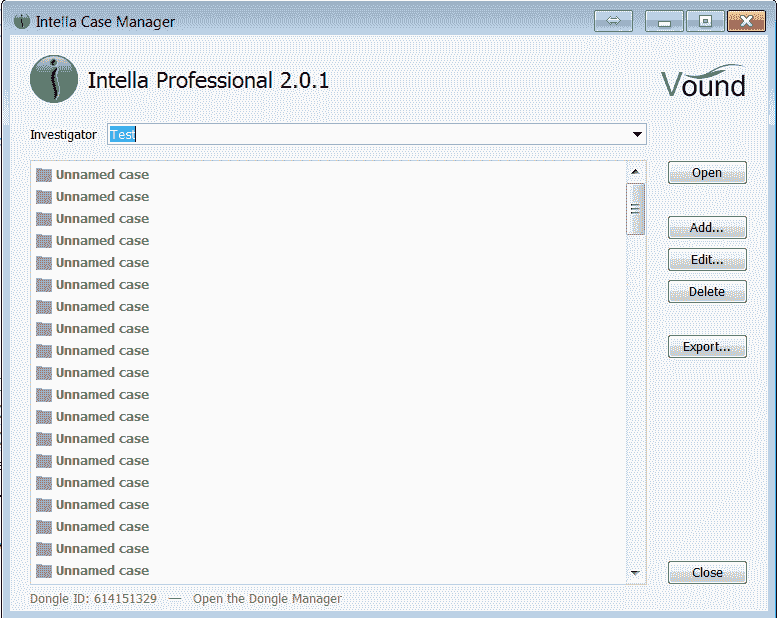

图 9.1. 添加新案件

1.  使用**添加案件**对话框，审查员可以创建新案件、打开共享案件、添加现有案件或导入案件。

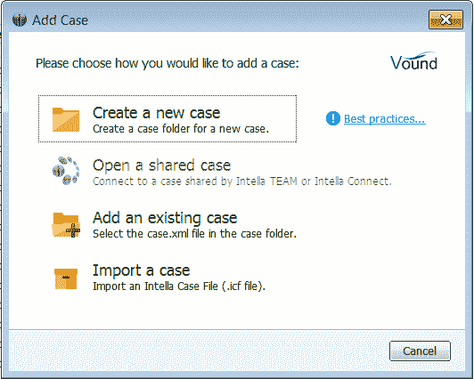

图 9.2. 添加案件对话框

1.  既然我们已经决定创建一个新案件，那么选择**创建新案件**。现在你可以看到一些需要填写的字段。你还可以选择一个文件夹来存储临时索引文件——这可以提高索引速度！

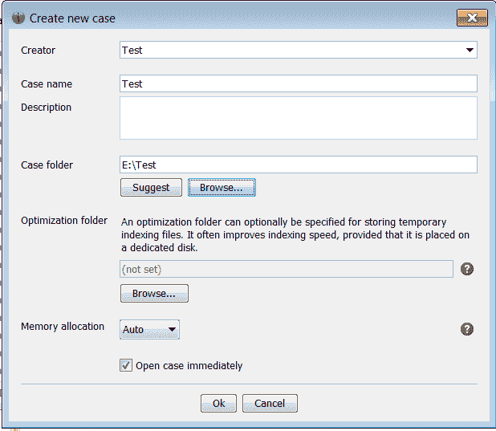

图 9.3. 创建新案件

1.  现在是选择我们的证据来源的时候了。正如我们已经提到的，我们将使用一个`OST`文件，所以选择“文件或文件夹”选项，如下图所示：

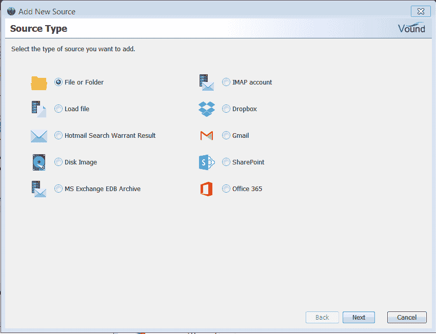

图 9.4. 添加新源

1.  在我们的案例中，文件名为`test.ost`，位于`E:\ drive`的根目录，如下图所示：

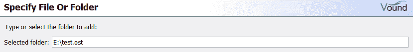

图 9.5\. 添加文件以供处理

1.  如果你不喜欢源文件的原始名称，可以将其更改为你喜欢的名称。另外，你应该选择正确的时区，或者如果不确定时区，可以选择 UTC。

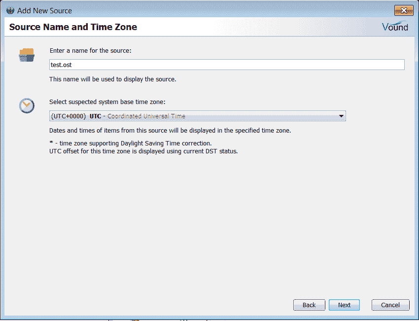

图 9.6\. 选择源名称和时区

1.  好的，现在让我们选择要处理的项目。在我们的案例中，它们如下：

    +   邮件归档：我们正在处理一个 Outlook 邮箱，因此这一点非常重要。

    +   归档：可以附加到电子邮件

    +   嵌入在电子邮件和文档中的图片

    +   删除的电子邮件

    +   不支持和无法识别文件类型中的文本片段

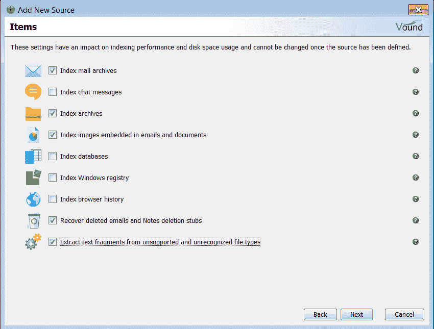

图 9.7\. 选择要处理的项目

1.  你可以跳过接下来的两个窗口，直接开始证据处理。一旦索引完成，你将看到概览，见下图：

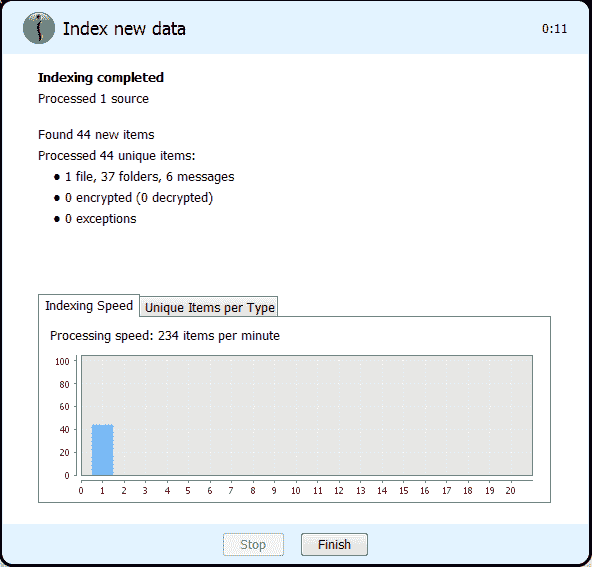

图 9.8\. 索引证据源

1.  点击**完成**，你将看到带有三个标签页的主窗口；请查看下图：

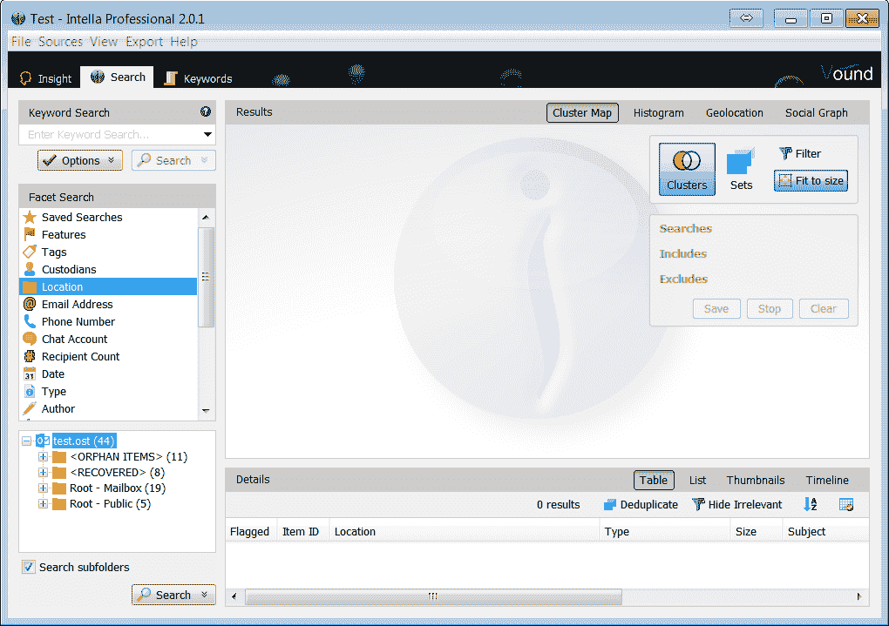

图 9.9\. Intella 搜索标签页

1.  如你所见，我们有 44 个项目，其中 19 个是已恢复的。现在我们可以使用不同的关键词和维度来搜索已索引的数据，如电子邮件地址、电话号码、作者、日期、类型等。此外，我们还可以使用此标签页来创建聚类图、直方图和社交图，这些都非常有用。

1.  好的，接下来让我们进入**Insight**标签页，如下图所示：

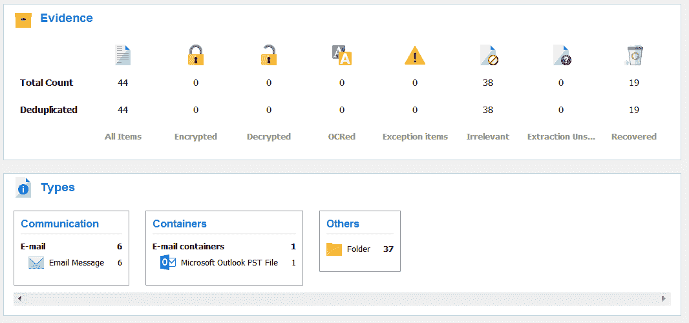

图 9.10\. Intella Insight 标签页

这里是证据概览。例如，Intella 显示我们正在处理 Microsoft Outlook，已恢复 19 个文件，其中有 6 封电子邮件，全部共有 44 个项目。

1.  让我们查看最后一个标签页——**关键词**。请看下图：

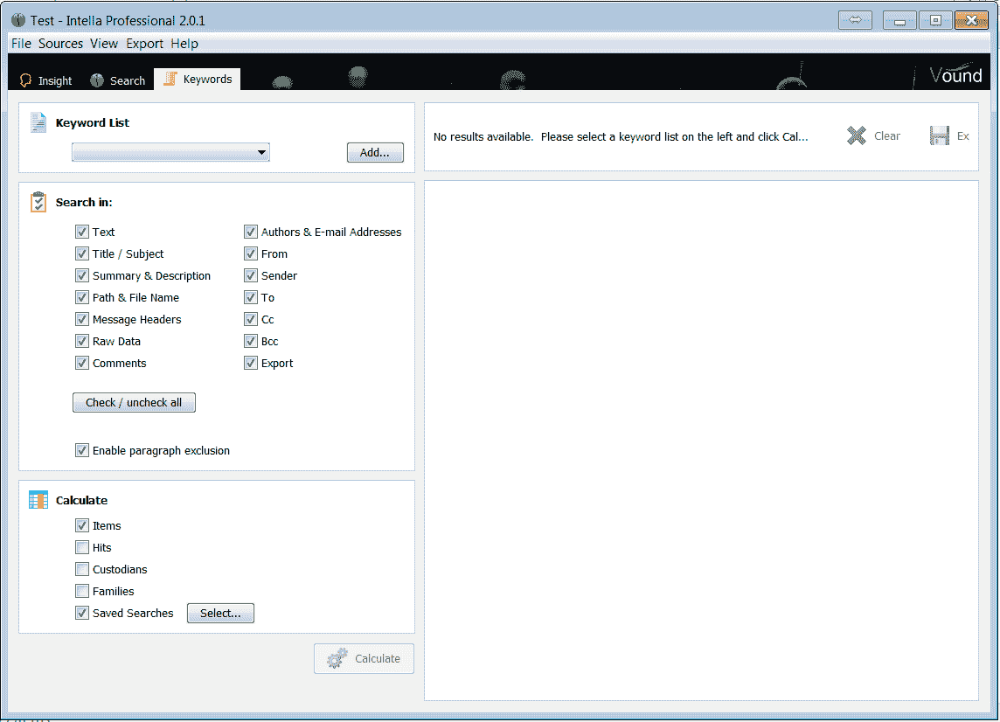

图 9.11\. Intella 关键词标签页

首先，你可以使用此标签页添加自定义关键词列表——这可以节省你的时间！此外，你可以选择搜索的范围。例如，如果你只想在电子邮件的主题中查找关键词，那么可以先取消勾选所有选项，只选择“标题/主题”。

# 工作原理...

Intella 会对选择的证据源进行索引，并允许计算机取证检查员搜索已索引的数据。它还可以用来创建聚类图、直方图、社交图等。

# 另见

Intella 概览：

[`www.vound-software.com/individual-solutions`](https://www.vound-software.com/individual-solutions)

Outlook 数据文件简介（`.pst` 和 `.ost`）：

[`support.office.com/en-us/article/Introduction-to-Outlook-Data-Files-pst-and-ost-6d4197ec-1304-4b81-a17d-66d4eef30b78`](https://support.office.com/en-us/article/Introduction-to-Outlook-Data-Files-pst-and-ost-6d4197ec-1304-4b81-a17d-66d4eef30b78)

# 使用 Autopsy 解析 Thunderbird 邮箱

Thunderbird 是 Mozilla（Firefox 浏览器的开发者）提供的一个免费开源邮件客户端。如果用户没有使用 Outlook，他们很可能会使用 Thunderbird。在本教程中，我们将展示如何使用免费的开源数字取证平台 **Autopsy** 提取 Thunderbird MBOX 文件中的数据。

# 准备工作

Thunderbird 将邮件数据存储在 MBOX 文件中。这些文件可以在以下位置找到：

`C:\Users\%USERNAME%\AppData\Roaming\Thunderbird\Profiles`

在这里，你会找到一个用户配置文件文件夹，可以使用一款取证软件导出并处理，在我们的案例中是 Autopsy。

当然，你也可以使用整个取证镜像进行处理，但如果只使用配置文件文件夹，将节省很多时间。

获取一个 Thunderbird 配置文件文件夹或取证镜像，并启动 Autopsy。如果你还没有安装它，可以使用“另见”部分中的下载链接。

# 如何操作…

我们可以通过以下步骤开始这个过程：

1.  首先创建一个新案件并填写案件详情。我们计划使用 Thunderbird 配置文件文件夹作为数据源，因此在 **选择数据源** 窗口中，我们选择 **逻辑文件**。

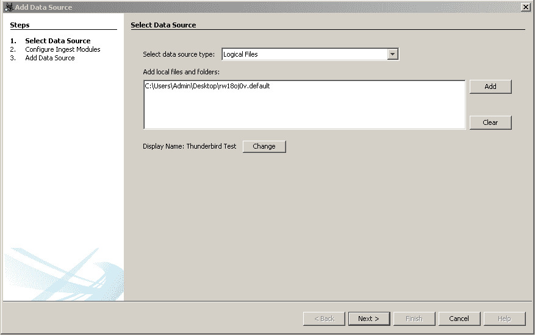

图 9.12\. 在 Autopsy 中选择数据源

你还可以为你的证据源选择显示名称。你会注意到我们将其命名为 **Thunderbird 测试**。

1.  现在是选择摄取模块的时间了。我们强烈推荐始终选择 **关键词搜索** 模块，因为它非常有帮助。当然，这次要确保选中 **电子邮件解析器**。

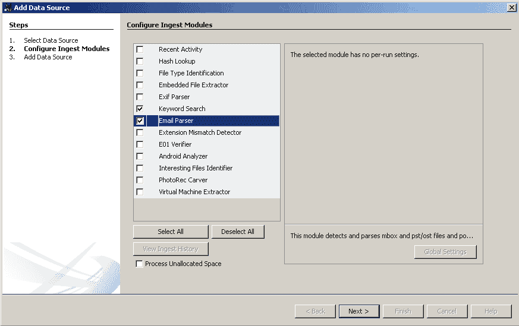

图 9.13\. 在 Autopsy 中配置摄取模块

1.  一旦数据源处理完毕，你可以分析结果。你可以在左侧的邮件消息部分找到这些结果，如下图所示：

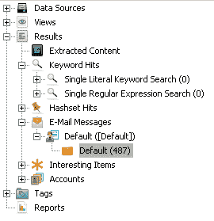

图 9.14\. 解析后的邮件消息

1.  如你所见，Autopsy 提取了 487 条邮件消息。在右侧，你可以找到所有分析所需的信息：发件人、收件人、邮件正文、时间戳等。

# 它是如何工作的…

Autopsy 根据计算机取证 examiner 指定的数据源进行处理，并从支持的容器中提取电子邮件数据，如 MBOX 和 PST。

# 另见

Autopsy 下载页面：

[`sleuthkit.org/autopsy/download.php`](http://sleuthkit.org/autopsy/download.php)

MBOX 邮件格式：

[`www.loc.gov/preservation/digital/formats/fdd/fdd000383.shtml`](https://www.loc.gov/preservation/digital/formats/fdd/fdd000383.shtml)

# 使用 Magnet AXIOM 进行 Webmail 分析

正如你所知道的，有些人（包括作者）只使用网页邮件，而不使用邮件客户端。那么，是否可以从驱动器镜像中恢复此类取证证据呢？答案是——可以！在这个操作步骤中，我们将向你展示如何使用 Oleg 喜爱的数字取证工具——Magnet AXIOM 恢复网页邮件活动。

# 准备工作

我们相信你已经在工作站上安装了 AXIOM。现在运行该工具并创建一个新案件。接下来，最有趣的部分是证据来源。如果你已经在第八章中学习过*提取 Web 浏览器数据的操作步骤*，*网页浏览器取证*，你可能猜到我们接下来要做什么。没错，网页邮件证据可以从`pagefile.sys`、`swapfile.sys`和`hiberfil.sys`中提取。因此，你可以使用这些文件中的一个作为数据来源，或者使用整个取证镜像——AXIOM 会自动从这些文件中寻找并解析数据。

# 如何操作...

我们可以按照以下步骤开始操作：

1.  使用 AXIOM Process 处理数据源；不要忘记包括 `pagefile.sys` 和 `hiberfil.sys`，并确保邮件证据被勾选。处理阶段完成后，进入 AXIOM Examine 并查看 EMAIL 部分。在这里，你将找到提取的电子邮件证据，包括网页邮件，我们的例子是 Gmail，如下图所示：

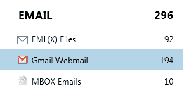

图 9.15\. 提取的网页邮件证据

1.  如你所见，已经提取了 194 条 Gmail 网页邮件证据。让我们检查这些证据的来源，特别是第一个证据。点击该证据并查看 EVIDENCE INFORMATION 部分。

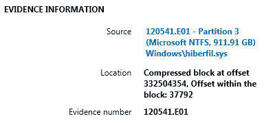

图 9.16\. 证据信息

查看前面的图，你会看到证据是从 hiberfil.sys 中提取的。你还可以看到地址信息，这对于文档记录非常重要。

# 工作原理...

Magnet AXIOM 会遍历 hiberfil.sys（或 pagefile.sys）文件，并提取可用的网页邮件证据，如 Google 的 Gmail、Microsoft 的 Hotmail/Outlook.com 和 Yahoo Mail。

# 另见

现代 Windows 休眠文件分析：

[`www.504ensics.com/uploads/publications/modern-windows-hibernation.pdf`](https://www.504ensics.com/uploads/publications/modern-windows-hibernation.pdf)

# 使用 Belkasoft Evidence Center 进行 Skype 取证

在现代 Windows 系统中，Skype 默认安装，因此对于取证检查员来说，从这个应用程序中提取用户数据非常重要。这些数据包括通话记录、消息、传输或接收的文件等等。在本操作步骤中，我们将向你展示如何使用 Belkasoft Evidence Center 解析这些宝贵的证据。

# 准备工作

首先，你需要获取一个 Skype 个人资料文件夹。同样，你可以使用取证镜像，但为了节省测试时间，我们建议使用个人资料文件夹作为数据源。你可以在以下路径找到 Skype 个人资料文件夹（是的，可能会有多个文件夹，因为在同一设备上可以使用多个帐户）：

`C:\Users\%USERNAME%\AppData\Roaming\Skype\`

获取工具后，确保你的工作站已安装 Belkasoft Evidence Center（有效许可证或试用版），然后我们就可以开始了。

# 如何操作...

我们可以通过以下步骤开始操作：

1.  创建一个新案例，并将之前导出的个人资料文件夹作为数据源添加。选择**选定的文件夹**，如下面的图示所示：

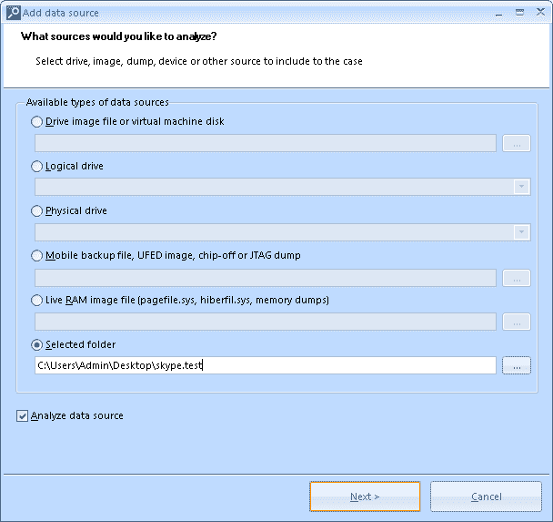

图 9.17：在 Belkasoft Evidence Center 中添加数据源

1.  选择正确的数据类型。我们有一个 Skype 个人资料文件夹，所以进入聊天记录，找到 Skype 并勾选它。点击完成后，稍等片刻，让数据解析完成，如下图所示：

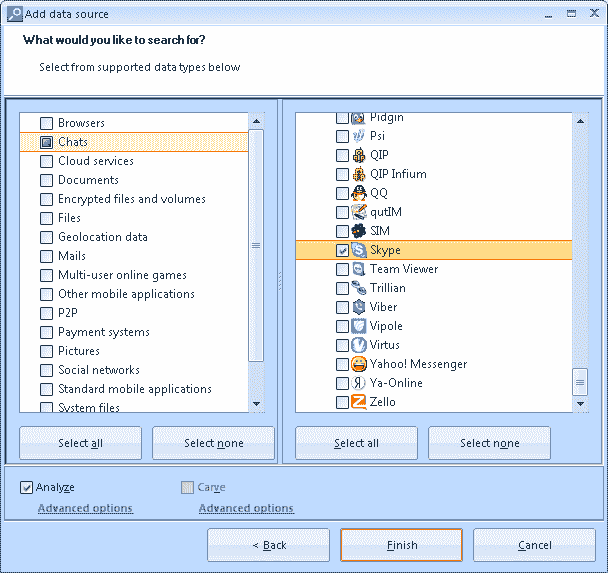

图 9.18：在 Belkasoft Evidence Center 中选择数据类型

1.  数据处理完成后，你可以使用概览或案例浏览器选项卡来分析提取的数据，包括通话记录、消息（包括语音）、图片等。需要注意的是，Belkasoft Evidence Center 还可以从 Skype 数据库（main.db）中提取已删除的消息，并分析`chatsync`文件，这些文件可能包含不在主数据库中的消息。

# 工作原理...

Belkasoft Evidence Center 处理计算机取证检查员指定的数据源，并从可用源中提取 Skype 证据，包括 SQLite 空闲列表、未分配空间、`chatsync`文件、`pagefile.sys`、`hiberfil.sys`等。

# 另见

Belkasoft Evidence Center 试用版：

[`belkasoft.com/trial`](https://belkasoft.com/trial)

恢复销毁的 SQLite 证据、iPhone/Android 消息、已清除的 Skype 日志：

[`belkasoft.com/recover-destroyed-sqlite-evidence-skype-and-iphone-logs`](https://belkasoft.com/recover-destroyed-sqlite-evidence-skype-and-iphone-logs)

# 使用 SkypeLogView 进行 Skype 取证

在工具箱中拥有一些免费的软件总是不错的。对于 Skype 取证，有一些免费且开源的工具，其中之一就是 NirSoft 的 SkypeLogView。你可能已经熟悉一些 NirSoft 的工具，在本教程中，我们将展示如何使用 SkypeLogView 进行 Skype 取证。

# 准备工作

从 NirSoft 的网站下载 SkypeLogView（请参阅*另见*部分中的下载链接）。在写本文时，工具的最新版本为 1.55。解压缩文件后，你就可以开始使用了。你也可以使用之前教程中导出的 Skype 个人资料文件夹。

# 如何操作...

我们可以通过以下步骤开始操作：

1.  启动工具后，你将看到一个数据源窗口，如下图所示：

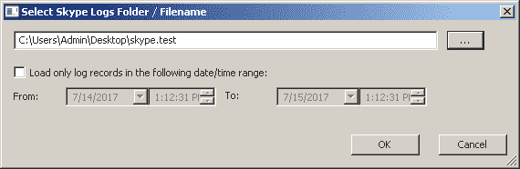

图 9.19. 在 SkypeLogView 中添加数据源

1.  现在你只需要点击“确定”，魔法就开始了，如下图所示：

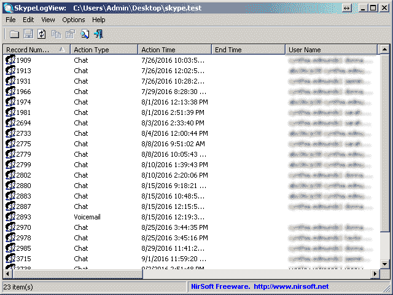

1.  当然，你可以通过不同的列来对提取的数据进行排序。如果你希望时间戳以 GMT 显示，请前往**选项 - 显示时间为 GMT**。

1.  最后，你可以创建一个 HTML 报告。为此，请前往**视图 - HTML 报告**。

# 它是如何工作的...

SkypeLogView 使用指定的文件夹并提取可用的 Skype 痕迹文件，例如聊天记录、语音邮件、通话记录等。此外，检查员还可以为所有痕迹或用户选择的痕迹创建 HTML 报告。

# 另见

SkypeLogView 下载页面：

[`www.nirsoft.net/utils/skype_log_view.html`](http://www.nirsoft.net/utils/skype_log_view.html)
