# 第十章：Windows 10 取证

在本章中，我们将涵盖以下内容：

+   解析 Windows 10 通知

+   Cortana 取证

+   OneDrive 取证

+   Dropbox 取证

+   Windows 10 邮件应用

+   Windows 10 Xbox 应用

# 介绍

Windows 10 的出现引发了用户和法医调查人员的争议。许多终端用户对隐私和安全性表示担忧，因为 Windows 10 上自动设置的隐私设置并不强大。还有人表达了对 Windows 机器现在强迫用户迁移到 Windows 10 的方式的担忧，即使他们对当前版本感到满意。

从法医角度来看，Windows 10 提出了许多新的独特挑战。大多数程序已经被修改，外观和感觉更像是智能手机或平板电脑上的应用程序，而且许多程序的行为与其前身大不相同。Cortana 的出现为法医调查人员提供了更多的数据，并且随着许多应用程序互联互通，数据量也有所增加。

在本章中，我们将查看 Windows 10 的一些常见功能，以及法医分析师如何与其合作。

# 解析 Windows 10 通知

Windows 10 具有名为 *Toast* 的通知，会在屏幕的右下角弹出。这些通知可以根据不同的需求进行设置，但默认情况下会显示与应用程序更新和安全性相关的新闻。

用户可以设置通知来提醒自己任务、事件和电子邮件提醒。在本章中，我们将探讨 Windows 10 通知在法医调查中的实用性，以及如何解析这些通知。

# 准备工作

通知的详细信息存储在以下位置：

`\Users\Username\AppData\Local\Microsoft\Windows\Notifications`

数据库的名称会根据安装在计算机上的 Windows 10 构建版本而有所不同。从周年更新版开始，它们存储在 `wpndatabase.db` 中；在此之前，可以在 `appdb.dat` 中找到它们。

# 如何操作……

解析 Windows 10 通知的步骤如下：

1.  如果你没有 SQLite 管理器，请下载一个。

1.  打开你的 SQLite 管理器并点击打开数据库。

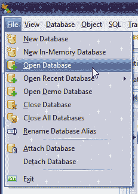

图 10.1\. 添加数据库

1.  浏览到 `C:\Users\Username\AppData\Local\Microsoft\Windows\Notifications` 并在文件夹中找到 `.db` 文件。打开它。

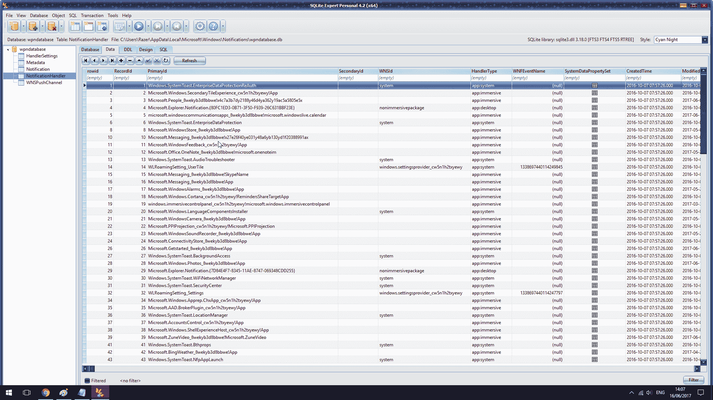

图 10.2\. 通知数据库文件

这将显示哪些通知已弹出，以及它们的 RecordID，可以用来识别这些程序的其他实例。

# 它是如何工作的……

一个 SQLite 查看器可以显示哪些程序定期弹出通知，哪些已被禁用。

+   在下面的示例中，用户查看了 20 个 Toast 通知——这些是出现在屏幕右下角的小矩形框。然而，只有五个标题通知。这指的是开始菜单上看到的应用程序图标。如果磁贴通知的数量非常低，可能意味着用户已将多个程序从开始菜单取消固定。

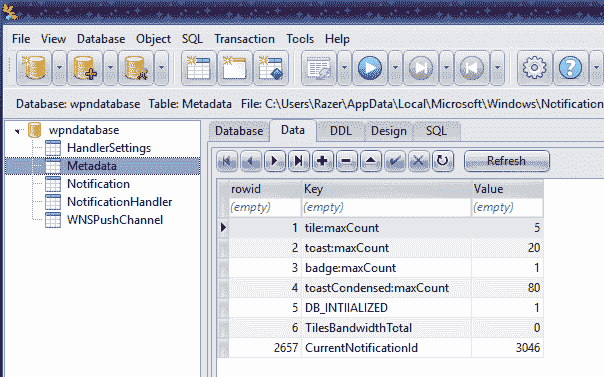

图 10.3\. 用户已查看的通知

+   上述图像显示，用户只查看了一个 *Badge* 通知。这些是弹出在任务栏上，显示在程序旁的小数字——有点像你在 Facebook 或 Twitter 上看到的通知图标旁边的小数字值。

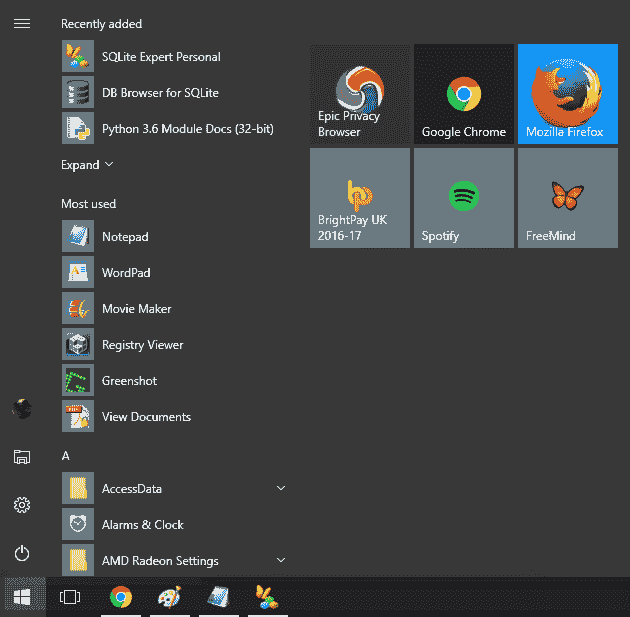

图 10.4\. 开始菜单上的磁贴

+   如果你已经关闭了任务栏上的图标，点击 Wi-Fi 和音量标志旁边的上箭头时，可能会看到这些通知。

# 另见

+   SQLite Expert 下载: [`www.sqliteexpert.com/download.html`](http://www.sqliteexpert.com/download.html)

+   DB Browser for SQLite: [`sqlitebrowser.org/`](http://sqlitebrowser.org/)

# Cortana 法医分析

Cortana 是微软的语音助手，但它做的远不止响应命令。Cortana 在不同的设备间链接，按需提醒，并且*了解*用户。它能够识别个人的声音和手写等多种内容。因此，许多 Windows 用户因隐私问题关闭了 Cortana 功能——特别是因为在某些设备上，Cortana 默认是开启的，即使设备处于休眠模式。

Cortana 还可以响应特定的事件——例如，用户可以指示 Cortana 在下次给某人打电话时提醒自己说些什么。这无疑是一个对许多人非常有用的工具，同时也是一座法医信息的宝库。

# 准备就绪

从法医角度来看，关于 Cortana 的最有趣的信息片段可以在以下位置找到：`C:\Users[User]\AppData\Local\Packages\Microsoft.Windows.Cortana_xxxx\LocalState\ESEDatabase_CortanaCoreInstance\CortanaCoreDb.dat`

在这里，你将能够发现诸如用户去过的地点、他们设置的提醒、这些提醒何时以及在哪里触发、以及提醒何时和在哪里被标记为完成等信息。

如果你的案件需要证明某人在某个特定时间出现在某个地方，这一点可能尤为重要。同样，一个未标记为完成的提醒可能表明用户的计划在最后一刻发生了变化。

# 如何操作...

你将需要一个 SQLite 浏览器来访问该数据库。

1.  一旦你启动 SQLite 浏览器并访问数据库，你将能够看到一个包含有用项的值表格，例如联系权限和位置。

1.  你可以直接在 SQLite 浏览器中处理这个数据库，或者将其导出为 CSV 文件，然后使用 Microsoft Excel、Google Sheets 或其他你选择的程序打开。

1.  值得注意的是，`CortanaCoreDb.dat` 文件中的一些数据可能被隐藏。根据你要寻找的内容，在打开文件确认其包含数据之后，你可能希望通过更先进的取证程序来揭示这些数据。

1.  `CortanaCoreDb.dat` 文件中的 `Reminders` 部分与日历提醒有关，这可以作为展示用户意图的一个有用方式。例如，用户可能设置了一个提醒，提示他们在某个特定时间前往某个地点，这可能将他们带到犯罪现场。如果与 `CortanaCoreDb.dat` 中 `LocationTriggers` 部分的实际位置数据相结合，这可能成为有罪或无罪的关键证据。

彻底检查上述路径中的 `Cortana` 文件夹内的所有项目是一个好主意。最相关的数据可能会在 `CortanaCoreDb.dat` 中找到，但某些项目——如地理位置搜索和一些语音记录——可能会出现在文件夹的其他部分。正如取证检查中常见的做法，值得在时间允许的情况下仔细查看所有证据。

# 它是如何工作的...

Cortana 的工作原理基本上是*监听*并且感知计算机周围发生的一切。即使计算机被锁定，它仍然保持这种状态，这一点在取证调查中尤为重要。通常情况下，尤其是笔记本电脑的用户，会将计算机保持开机状态，但屏幕进入睡眠模式，长时间忘记计算机仍然在开机。

尽管这在隐私倡导者和普通公众中引起了可以理解的忧虑，但它对调查目的极其有用。通过前述方法，可能揭示出对话片段、用户的位置信息、语音搜索、提醒和使用的设备等数据，这些都可以为个人的行为和动机提供无价的线索。

# 另见

Bhupendra Singh；*Windows 10 Cortana 搜索的取证分析*；*《计算机与安全》第 66 卷，2017 年 5 月*

Thomas Rose；*Windows 搜索功能、Cortana 和 Windows 8/8.1 以及 Windows 10 的通知中心的取证调查*；2016 年 BSc 论文

# OneDrive 取证

OneDrive 是微软的云服务，允许用户将数据保存在云端，并且只要登录微软账户，就能从任何设备访问这些数据。OneDrive 集成了 Word、Excel、PowerPoint、Outlook、日历、联系人等功能，是 Microsoft 产品用户确保永远不丢失文档的便捷方式。它也是取证调查中的重要数据来源。

OneDrive 对于法医调查员特别有用的一种情况是，当某个设备因某种原因无法访问时。例如，可能一部手机已经被扣押，但它被锁定并且无法恢复密码；或者可能一台电脑有一个密码，且破解起来极其困难。在这些情况下，如果调查员能够访问同一用户拥有的其他设备，他们通常可以在 OneDrive 备份文件中找到有用的信息。

在 Windows 10 操作系统中，OneDrive 是保存新文件的默认位置，而不是将其保存在本地计算机的“我的文档”中，这曾是默认设置。这意味着，除非用户手动更改了设置，否则应该可以通过 OneDrive 获取到大量法医信息。

# 准备工作

首先，重要的是要弄清楚如何访问你的 OneDrive 文件。你是否可以访问 Windows 10 机器本身，还是查看 Android 备份？

如果你使用 Android 手机访问 OneDrive，你可以在 `/mnt/sdcard/Android/data/` 下的 `com.microsoft.skydrive` 文件夹中找到需要的内容。OneDrive 的前身是 SkyDrive，因此得名。

如果你使用运行 Windows 10 的 PC 或笔记本电脑访问 OneDrive 数据，你可以在 `C:\Users\<USERNAME>\AppData\Local\Microsoft\OneDrive\logs` 中找到需要的内容。

# 如何操作……

执行 OneDrive 法医分析时，需要遵循以下步骤：

1.  打开你选择的法医软件，并导航到相关文件夹，具体取决于你是使用智能手机还是计算机进行法医分析（见前面的段落获取详细信息）。

1.  OneDrive 文件夹的后台实际上并不特别具有法医价值。在上述 `logs` 文件夹中，你会找到两个子文件夹：`Common` 和 `Personal`。`Common` 文件夹列出了操作系统自动运行的所有元素，即 `StandaloneUpdater` 和 `telemetryCache` 文件。这些文件涉及 OneDrive 的自动更新。

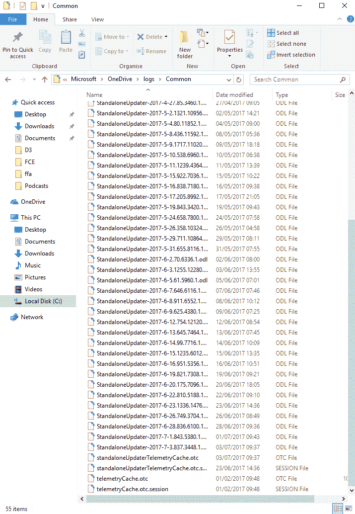

图 10.5 Common 文件夹中的 StandaloneUpdater 和 telemetryCache 文件

1.  `Personal` 文件夹包含 `SyncEngine`、`telemetryCache` 和 `TraceArchive` 文件。这些文件会每隔几天自动更新。通常，这些文件中找到的内容对法医调查并没有太大价值；它们只是用户计算机的自动备份，但文件本身并不包含任何信息。唯一可能的法医应用是用来证明没有使用：例如，一个经常使用计算机的用户如果消失并且没有打开任何 Windows 机器，就会在 OneDrive 日志文件中显示出异常的活动缺失。文件如下图所示：

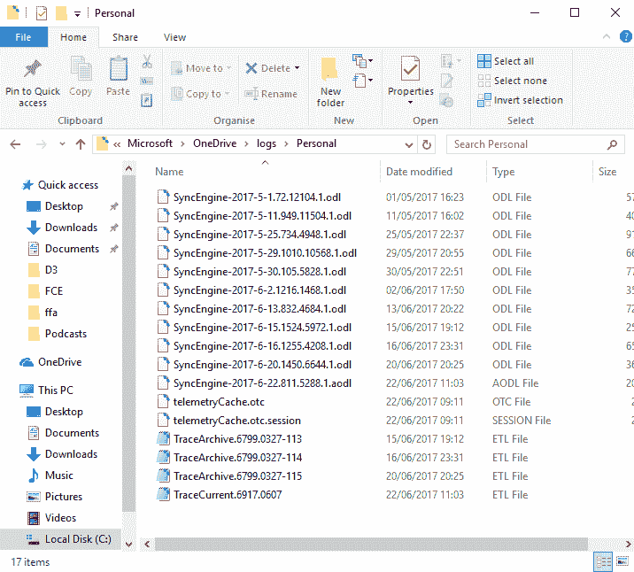

图 10.6. 在 Personal 文件夹中找到的文件

1.  当然，OneDrive 的前端是另一回事。如果取证人员能够访问，它提供了大量的信息。OneDrive 文件本身通常不受密码保护，所以您只需要设备的密码以继续进行取证。

1.  iTunes 应用商店上也有 Windows OneDrive 应用程序，所以如果您知道调查对象同时使用 Windows 和 Apple 设备，这也值得留意。

OneDrive 可以上传任何类型的文件，但最常见的是 Microsoft Office 套件中的文件：Word 文档、Excel 电子表格、PowerPoint 演示文稿等。OneDrive 文件不存储在本地计算机上，但可以通过 OneDrive 应用程序访问。只要计算机连接到互联网，也可以通过 Web 浏览器访问这些文件。除了计算机和智能手机，OneDrive 文件还可以从 Xbox 游戏机访问。

任何可以打开传统 Microsoft Office 文件的取证软件都能够提取 OneDrive 文件进行查看。一旦文件中的信息与最后访问的日期和时间等元数据进行比对，就可以构建出案件更为详尽的概要。

# 工作原理...

OneDrive 根据用户是个人账户还是商业账户有所不同，了解这些差异非常重要，因为它们可能对您的取证调查产生影响。

当 OneDrive 将计算机上的文件同步到云端时，在 OneDrive 商业版中会进行一些小的修改。这个版本的 OneDrive 在上传文件时会自动在文档开头添加几行代码。这对取证具有重要的影响，因为这意味着原始的 MD5 哈希值不匹配，并且可能导致文件本身略微增大。似乎只要打开这样的文件，即使没有进行任何修改，这个过程也会发生 - 这是自动同步过程的一部分。因此，如果您正在分析 OneDrive 商业版文件，请确保将此作为流程的一部分考虑进去，否则如果案件进入法院，您可能会遇到一些棘手的问题！

# 另见

Daryabar, Farid; Dehghantanha, Ali; Eterovic-Soric, Brett & Choo, Kim-Kwang Raymond; *OneDrive、Box、GoogleDrive 和 Dropbox 应用在 Android 和 iOS 设备上的取证调查*; *澳大利亚法医科学杂志*, 48:6, 615-642, DOI: 10.1080/00450618.2015.1110620

# Dropbox 取证

看起来，微软试图使用户在智能手机、平板电脑和个人电脑之间的过渡更加流畅，在 8 及以上版本中，微软将它们的程序重新命名为*应用程序*，并为桌面界面带来了更多智能手机的感觉。

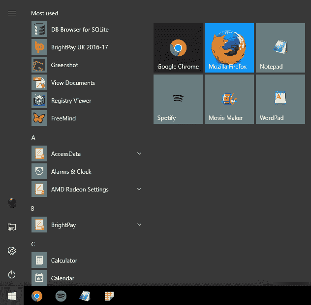

图 10.7\. 现在的开始菜单包括磁贴，使计算机更像智能手机。

现在，用户不再通过网页浏览器下载程序，而是可以购买应用程序——其中许多是免费的——这些应用程序能提供更顺畅的用户体验。

Dropbox 是一个文件共享应用程序，允许用户上传几乎任何类型的文件，并轻松与他人共享。所需的唯一条件是一个电子邮件地址来注册。到 2016 年，Dropbox 全球用户已达到 5 亿人次，而且这一数字还在持续增长。

从取证的角度来看，用户之间的文件共享可以提供大量有用的信息。让我们来看一下如何从 Dropbox 应用中获取数据。

# 准备工作

大多数你需要的 Dropbox 信息可以通过简单的 SQLite 浏览器查看，就像我们在上文关于 Cortana 取证的部分中所使用的那样。

然而，一些更有趣的信息可能被加密，为了访问这些信息，我们需要一个 Dropbox 解密器。Magnet Forensics 提供了一个免费的解密器，可以从他们的网站下载，链接位于本文末尾。

你将在 `C:\Users\<USERNAME>\AppData\Local\Microsoft\Dropbox` 找到所有与 Dropbox 相关的信息。

# 如何操作...

Dropbox 取证的步骤如下：

1.  打开你的 SQLite 浏览器，导航至：`C:\Users\<USERNAME>\AppData\Local\Microsoft\Dropbox`。你将在此文件夹内找到几个 `.db` 文件。

1.  文件夹中最有趣的文件是 `filecache.db`。它列出了 Dropbox 帐号中的所有文件和文件夹，只要它们没有被删除。你可以在同一文件夹中的 `sigstore.db` 中找到每个文件的大小详细信息。filecache 数据库默认是加密的，但它是可以通过 Magnet 的 Dropbox 解密器解密的，解密后你不仅可以看到文件名，还能查看任何相关的元数据。

1.  Dropbox 解密器还可以从 `config.db` 文件中提取信息，包括账户所有者注册时使用的电子邮件地址，以及最近被更改的文件列表。在一些调查中，这些信息尤其重要，因为可能有人试图掩盖自己的痕迹。在某些情况下，Dropbox 文件可能已经被删除。已删除的文件不会保存在本地计算机上，因此不能仅通过 Windows 10 的取证方法访问。然而，如果你知道账户的用户名和密码，Dropbox 的网页版会将这些文件保存在云端。文件保留的时间长短取决于账户类型：免费账户的已删除文件会保留 30 天；而付费账户的则会永久保留。

1.  在 Dropbox 上找到已删除的文件很容易。你只需要将鼠标悬停在页面右侧的“显示已删除文件”选项上。

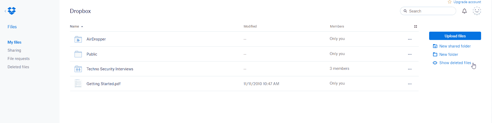

图 10.8. 一个选项允许用户查看已删除文件

一旦你看到被删除的文件，就可以点击“恢复”来查看该文件。这时会弹出一个小框，值得点击主文本下的“查看其他版本”链接，如以下截图所示：

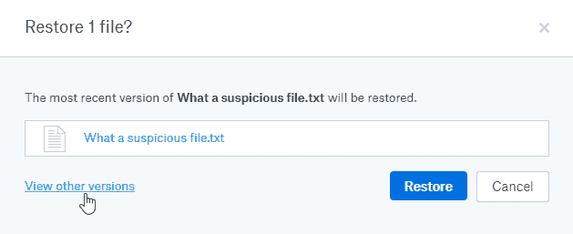

图 10.9：“查看其他版本”选项在取证过程中非常有帮助。

以下截图展示了一个文件有多少个版本，何时编辑以及何时删除：

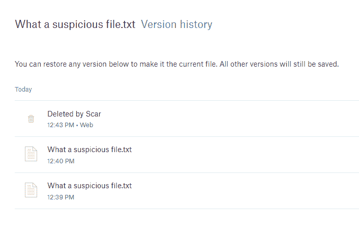

图 10.10：你将能够看到文件版本的名称和修改日期。

逐个点击这些文件，会显示文件本身的预览版本，之后可以与其他版本进行比较：

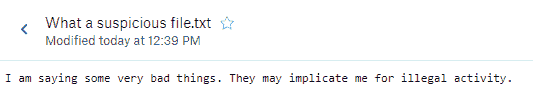

即使它们的文件名相同，两个版本之间也可能有很大的不同，正如通过比较以下图示可以看到的那样：

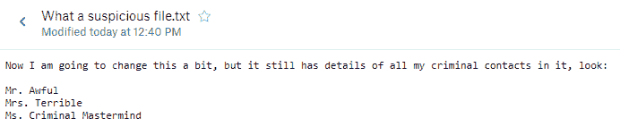

然后可以查看每个文件版本的内容。

# 如何操作...

Dropbox 本质上通过将文件备份到云端来工作，尽管与某些其他基于云的应用不同，它仅在用户手动添加文件时才进行备份，而不是自动更新计算机的内容。这对于展示意图非常有用。

Dropbox 的取证技术通过访问 Dropbox 应用在 Windows 计算机上留下的数据库，或者通过调查员访问在线 Dropbox 账户并筛选其中的文件来进行。

# 另见

Magnet Forensics Dropbox 解密工具：[`www.magnetforensics.com/free-tool-dropbox-decryptor/`](https://www.magnetforensics.com/free-tool-dropbox-decryptor/)（访问时间：05/07/17）

# Windows 10 邮件应用

Windows 10 邮件应用与之前的应用在用户体验方面相似，但有一些取证上的差异。主要的区别在于电子邮件存储的方式。它们不再以 `.eml` 文件格式保存；而是现在以 HTML 或 `.txt` 文件格式保存。

新版邮件应用的另一个有用功能是能够连接多个账户。就像 Gmail 一样，邮件现在也可以在不同账户之间切换——用户现在可以将其他电子邮件服务提供商（如 Gmail 和 Yahoo）添加到 Microsoft 邮件应用中。

# 准备工作

几种取证工具可以从邮件应用中提取数据。在本例中，我们将讨论 FTK Imager，但无论使用哪个工具，提取数据的过程，尤其是像文件路径和文件夹位置这样的元素，都是相同的。

首先，打开 FTK Imager 并添加一个新的证据项。你要查找的数据将位于 `\Users\Username\AppData\Local\Comms` 文件夹中。

打开此文件夹，你将看到五个子文件夹：`Temp`、`Unistore`、`UnistoreDB`、`UserDataTempFiles` 和 `Volatile`。这些是我们将在本章中查看的目录位置。

# 如何操作...

`data` 文件夹包含大量有用的信息，但这些信息被隐藏在子文件夹中：

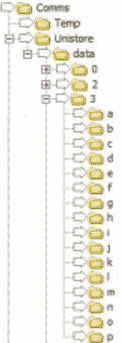

图 10.11 ‘data 文件夹中的一些子文件夹

1.  对于本章目的，我们特别关注的子文件夹是 3 和 7，分别与邮件和附件相关。在这些子文件夹中还有更多子文件夹，每个文件夹的名称对应一个字母。在这些文件夹中，我们需要的数据可以找到。

1.  由于电子邮件现在以 HTML 或纯文本格式存储，因此查看其内容变得容易。只需点击按字母顺序命名的子文件夹中的 `.dat` 文件，你就可以在 FTK 中看到消息的预览。要查看任何附件，请导航到文件夹 `7`，并进入其中的字母顺序子文件夹。然后，这些消息和附件可以导出到报告中供客户使用。

有些邮件未被发送，这些邮件的部分内容可能会出现在 `\Users\Username\AppData\Local\Comms` 中的 `UserDataTempFiles` 文件夹内。这些数据是易失性的，并且经常被覆盖，因此其中可能没有任何有用的信息。然而，有时你会发现一些信息碎片，从中可以提取某些有用的信息。

1.  邮件应用中还有一个值得注意的元素是 `People` 文件夹。这个文件夹包含了用户曾经发送邮件的所有联系人。你可以在 `\Users\Username\AppData\Local\Comms\UniStoreDB\store.vol\Contact` 中访问这些数据。

这里最有趣的三个元素是 `Contacts.txt` 和 `Pcontacts.txt` 文件，它们展示了用户联系人的姓名和电子邮件地址。如果联系人保存了额外的信息，如地址或电话号码，也会以纯文本的形式存储在这些文件中。

# 它是如何工作的…

邮件应用是本地安装在用户设备上的，尽管越来越多的人选择转向微软的基于云的服务，正如前一部分所讨论的那样，这也带来了某些取证挑战。

基本信息，例如用户经常联系的联系人，会存储在 `\Users\Username\AppData\Local\Comms` 文件夹中，以便用户在想发送新邮件时能够轻松调取。幸运的是，这也使得它可以用于取证调查！

# Windows 10 Xbox 应用

如名称所示，Windows 10 的 Xbox 应用允许用户在其 Windows 10 机器上玩 Xbox 游戏。乍一看，这似乎不是一个特别有取证价值的信息来源。然而，仔细查看后我们可以发现大量可以在调查中利用的数据。本节将带你了解如何实现这一点。

# 准备工作

我们需要查找的信息可以在以下位置的 `Packages` 目录中找到：

`\Users\Username\AppData\Local\LocalState\ModelManager`

您需要查找 `Xboxlivegamer.xml` 文件，该文件包含可能与您的案件相关的信息。此外，由于 Xbox 是一个游戏平台，许多人仅用于休闲目的，因此如果用户采取了反取证措施，这也是一个他们可能忽视的位置。

由于我们将要查看的大多数文件是 `.xml` 文件，因此您无需额外的取证软件即可访问数据。然而，大多数知名软件，如 FTK、EnCase 等，都可以检查这些文件及其元数据。

# 如何操作...

对于 Windows 10 Xbox 应用程序的取证，需遵循以下步骤：

1.  导航至上面列出的路径，并浏览文件列表。

1.  在 `Xboxlivegamer.xml` 中，您将找到用户的个人资料详情，包括他们的头像和电子邮件地址。

1.  向下进入一个子文件夹，进入 `\Users\Username\AppData\Local\LocalState\ModelManager\People`，将使您能够查看社交连接。

1.  要查找联系人详情，包括消息、关系和朋友信息，您需要查看以用户 Xbox ID 命名的 `.xml` 文件。您可以在 `Xboxlivegamer.xml` 文件中找到此 ID。

1.  除了所有常规的朋友数据外，您还应该能够看到朋友的列出位置，如果您正试图确定某人是否与特定地点有某种联系，这些信息可能特别有趣。

1.  一个非常有用的地方是 `Messaging` 子文件夹，其中包含所有已发送和接收消息的详细信息，包括时间戳、发送或接收消息的用户，以及消息本身的纯文本：

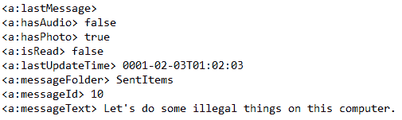

图：10.11. 来自 Xbox 应用的消息数据

1.  录制游戏是许多用户会做的事情，要么是为了之后在互联网上发布，要么是为了优化技术，或者只是与朋友分享。然而，有些人还使用 Xbox 应用程序的这个便捷内建功能，在运行其他应用程序时录制屏幕。您可以在 `\Users\Username\XboxApp\GameDVR\OnThisPC` 中找到录制的游戏数据。在该文件夹中，您应该能看到一个名为 `Videos` 的子文件夹，其中又包含一个名为 `Captures` 的文件夹。然后，您可以打开并播放这些视频。

# 它是如何工作的...

Xbox 应用程序本质上是将 Xbox 游戏平台的体验带到 Windows 10 PC 上。它以纯文本和原始视频文件的形式存储数据，因此在取证检查中，它是一个有用的信息库。
