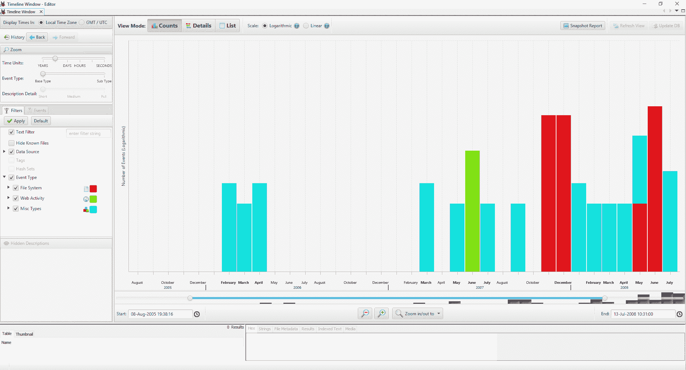
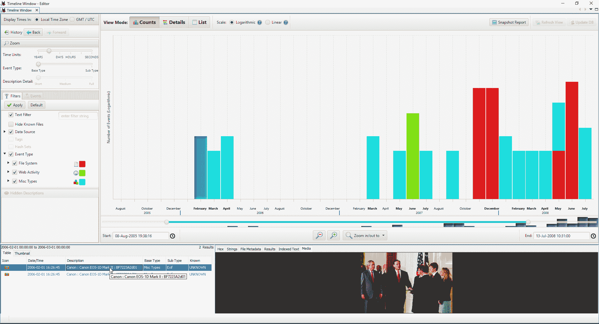
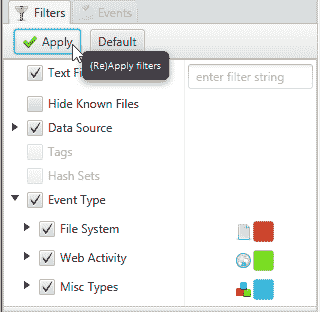
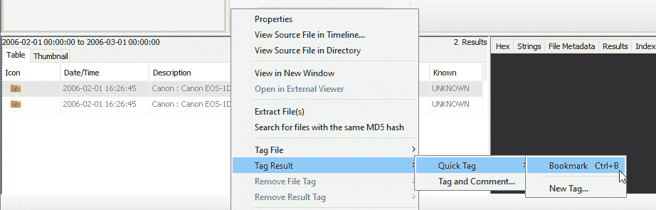
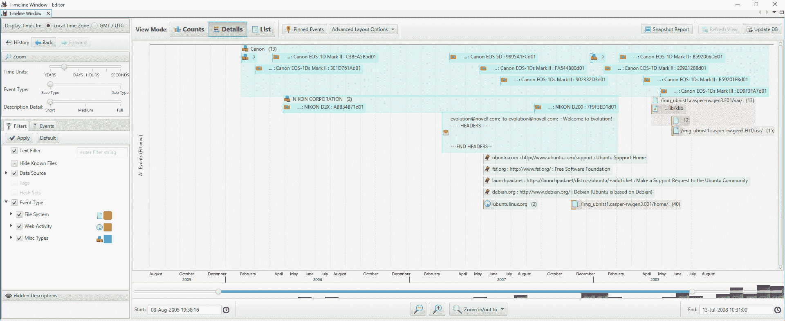
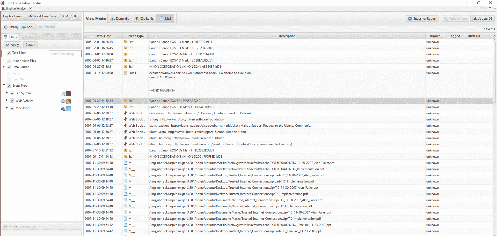
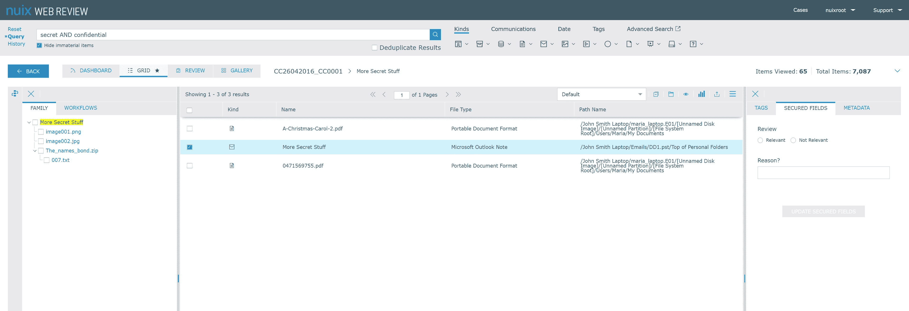
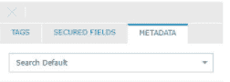
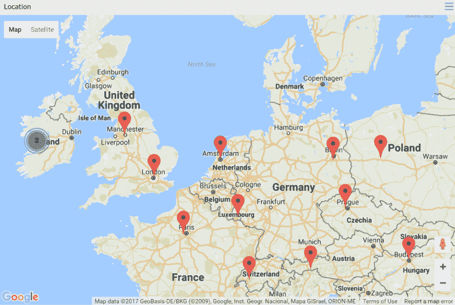
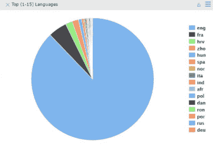

# 第十一章：数据可视化

在本章中，我们将介绍以下内容：

+   使用 FTK 进行数据可视化

+   在 Autopsy 中创建时间线

+   Nuix 的 Web Review & Analytics

# 介绍

准确查看和分析结果是任何调查的重要组成部分。然而，即使在最终结果阶段之前，查看和操作案例中的不同因素也可能很有用，以便确定可能需要进一步深入挖掘的地方，并发现可能被忽视的相关性。

尽管数字取证工具的主要目标不是外观美观，而是揭示、分析和报告数据，但可视化过程仍然是任何软件的重要组成部分。

一个精心设计的数据可视化工具可以展示联系人之间的联系，构建时间轴并识别沿着时间轴的潜在兴趣点，揭示可能与调查相关的地理区域，并提供可以帮助调查人员理解下一步应该采取哪些措施的基本统计输出，等等。

在本章中，我们将研究三个取证套件中的数据可视化技术和选项。首先，我们将看看**AccessData**的 FTK 如何在调查中对重要领域进行视觉报告。然后，我们将讨论开源免费软件 Autopsy 如何创建时间轴。最后，我们将看看 Nuix 的取证工具套件，包括他们新的 Web Review & Analytics 附加组件，该组件位于 Nuix Investigator Lab 之上。

# 使用 FTK 进行数据可视化

此工具允许您创建和过滤时间线，将数据分割为不同类别，查看电子邮件及相关元数据，分析流量和社交连接，并在用户友好的环境中观察地理位置数据。它还允许用户指定特定主题或颜色方案，使其具有可定制的感觉。

# 准备工作

打开 FTK 并加载一个案例（如果您不确定如何操作，请参阅第三章 *使用 FTK Imager 在 E01 格式中进行驱动获取*，*Windows 驱动获取*。）

在案例中选择一个数据集，然后点击屏幕右上角的可视化图标。这将启动可视化工具。

# 如何操作...

可视化工具有各种可能的用途，因此我们将逐一讨论它们：

1.  首先，如果您希望这样做，您可以更改 FTK 的主题。您可以通过转到 CaseManager|Tools|Preferences 在 FTK 中进行此操作，然后会打开一个列出几个选项的框。这些选项与旧版本 Windows 中曾提供的选项非常接近，因此对许多人来说应该是熟悉的。

1.  可视化工具集中最有用的项目之一是时间线功能，它允许用户查看设备上某一特定时间段内的操作。

    1.  首先，你必须告诉 FTK 你希望聚焦的日期。你可以通过在时间轴部分选择一个日期范围来做到这一点。

    1.  一旦你的日期范围加载到时间轴中，你将看到页面上有三个横向部分：

        +   第一部分是时间轴本身，显示了你指定日期范围内的不同兴趣项。

        +   中间部分是仪表盘，它提供了关于时间轴数据的更多细节。在这里，你可以看到按类别划分的数据——例如，电子邮件与图像、文件和其他兴趣项的比例。

        +   同样，底部部分是数据列表，它的结构与 FTK 的其他部分类似，因此应该容易导航。顾名思义，它提供了一个可以单独选择的项目列表，如果你希望进一步钻研某项内容，可以点击该项目。

1.  一旦你面前有了日期范围，就可以进一步聚焦于更具体的时间段。例如，如果你看到某个特定日期发生了很多活动，你可以使用滑块仅查看该日期的详细信息。同样地，你也可以关注特定的小时、分钟，甚至是秒。

1.  更详细地查看仪表盘部分，如果你在概览标签页上选择类别分布图，它会放大并显示按类别划分的数据。这些类别会根据你的案件有所不同，常见的选项包括文件夹、文档、电子邮件和图形。

1.  如果你点击任何特定类别，它将在屏幕底部的数据列表窗格中显示。这将允许你对特定类别的数据进行排序和分析。排序数据很简单：只需点击你感兴趣的标题并将其拖到上方的蓝色栏中。排序完成后，你可以扫描列表并标记出需要进一步探究的项目。标记项目的方法是，选择它并在屏幕右侧点击“标记所选项目”。这时会弹出一个框，提供多种选择，包括添加标签或创建书签。

以电子邮件为例——假设你找到了一个感兴趣的邮件，想要了解更多关于发件人及其动机的情况。最简单的方法是使用社交分析工具。要访问此工具，只需选择你想了解的电子邮件，然后点击列表上方的“社交分析器”。

1.  这个工具包含了丰富的信息，并且非常易于使用。首先，你会看到一个包含多个气泡的框，每个气泡内会有一个名字。这些是用户最常频繁沟通的域名。气泡越大，表示来自这些域名的电子邮件收发频率越高。这在知识产权欺诈案件或调查不满员工时尤为有用。点击任意一个气泡，会在它们之间显示出连接线。这些连接线展示了不同域名之间收发的邮件数量。线条的粗细表示域名之间的流量大小。

你可以展开域名，查看每个用户的列表。将鼠标悬停在某个特定用户上，会显示该用户的电子邮件地址。你还会看到更多的气泡出现在该用户周围——就像前面提到的域名一样，这些气泡展示了该用户曾发送邮件的其他人。再次强调，气泡的大小表示连接的程度。如果你想退出社交分析工具，并继续基于在那里找到的数据处理案件，你可以点击屏幕左侧的“提交结果”，然后在弹出的框中勾选“标记”。这将会为你查看的所有电子邮件添加标签，方便你在返回主案件视图时根据这些标签进行数据分类。

1.  互联网历史是另一种常用的取证信息来源，FTK 的可视化工具在这方面也提供了多个选项。它涵盖了所有最流行的浏览器，并且同样可以将这些数据放入时间轴中，然后深入挖掘具体的关注点。然而，你每次只能查看一个浏览器的数据。如果你已经加载了数据，进入“证据|附加分析|证据处理”并选择“处理互联网浏览器历史记录进行可视化”。这会弹出一个时间轴。一旦进入时间轴视图，你可以像查看邮件数据一样，点击具体的日期和项目，深入查看详情。同样，你可以通过从列表中选择项目并点击右侧屏幕上的“标记选定项目”来标记它们。这将允许你为这些项目添加标签，以便在主案件中查看时能够轻松访问。

1.  地理位置数据可以提供丰富的有用信息和进一步调查的机会，并且它的一个额外优势是，即使对于非技术客户也容易理解。在 FTK 案件中，地理位置功能默认启用，但你必须连接到互联网才能访问它。因此，可能值得关闭正在进行的实时案件，并打开一个副本，以防止数据的潜在污染。一旦选择了地理位置标签，你将能够看到数据在全球范围内的分布。你可以通过点击你想要检查的国家或地区上的气泡，进一步缩小范围。点击气泡后，地图会放大，并显示具体的兴趣点。你可以点击其中一个兴趣点，查看该位置发生的具体情况。选择了特定位置后，你可以右键单击该位置，会弹出多个选项。这些选项允许你更改图钉的颜色或将其更改为图标，查看该位置的经纬度，并通过标注或创建书签来标记该位置。再次提醒，任何添加的标签都可以在主案件中进行处理。

# 它是如何工作的...

可视化工具通过使用图形界面突出显示案件中的重要元素。它根据用户设置的偏好，按时间或位置进行结构化展示。

在可视化工具中深入分析数据集，还能让用户标记出特定的关注项，之后可以在主案件中进行复审。

# 在 Autopsy 中创建时间线

Autopsy 是一款广受欢迎的开源免费软件，在数字取证社区中有众多支持者。该工具执行所有调查工作所需的基本功能，同时也让技术用户通过创建兼容插件轻松扩展它。

时间线功能通常在已运行的案件中加载，理想情况下需要启用几个选项，以便高效使用，这些选项包括：

+   使用 NSRL 进行哈希查找

+   最近活动

+   EXIF 数据

# 准备工作

首先，在 Autopsy 中加载你的案件，然后点击页面顶部的时间线（Timeline）。此时会弹出一个新窗口，让你访问时间线功能。

尽管 Autopsy 的时间线功能没有 FTK 的可视化工具或 Nuix 的 Web Review & Analytics 插件那么多花哨的功能，但它仍然是深入分析数字取证数据的一个很好的起点。

# 如何操作...

初看时，你会看到一个条形图，显示每年发生的事件数量。点击某一年会将该时间段细分为月份；点击某个月份将把时间线细分为天；最后，点击某一天会显示逐小时的时间线视图。目前没有比这更精细的时间粒度。下图展示了按月细分的时间线：

图 11.1\. Autopsy 中的时间线视图。

准备时间线的过程：

1.  一旦选择了时间段，你将能够在屏幕的左下角查看任何相关数据。这里会显示一系列感兴趣的项目；具体显示什么内容将取决于你加载案件时选择的选项。点击任何一个列出的项目，将在屏幕右下角的面板中生成预览，如下图所示：

图 11.2\. 预览面板将显示在屏幕的右下角。

点击时间线视图上方的分隔线，可以调整预览窗口的大小。

1.  在屏幕左侧的主时间线视图中，你会看到几个选项。这些选项可以告诉 Autopsy 你特别感兴趣的案件信息。选择其中任何一个选项，Autopsy 将自动为其加上颜色编码，并将其添加到时间线视图中，如下图所示：

图 11.3\. 为时间线应用过滤器

1.  一旦找到感兴趣的项目，你可以在列表面板中右键点击它们，选择“标记结果”，然后为它们指定一个标签，如下图所示：

图 11.4\. 标记结果生成时间线

1.  查看屏幕顶部，你会看到三个选项，位于视图模式旁边：计数、详细信息和列表。点击“详细信息”会显示不同的时间线视图，横向条形图代替纵向条形图，并附加了每个项目的详细信息，如下图所示：

图 11.5\. 时间线中的详细视图

1.  同样，列表面板会以垂直列表的形式展示数据，而不包含任何图形界面。这在某些情况下很有用，因为它仍然按时间框架排列数据，但它更为详细，且排序起来更方便，如下图所示：

图 11.6\. 列表视图是最详细的

数据可以导出为 HTML 文件、Excel 文档或`TSK`文件。时间线本身不会自动出现在报告中，因此，如果你希望它被包括在内，你必须截图并手动添加。

# 它是如何工作的……

Autopsy 的时间轴功能本质上是商业法医套件中时间轴工具的简化版。它通过分析您输入的案件中的数据，并将这些数据按照给定的时间段进行排列。

由于 Autopsy 是一个开源工具，您可以创建自己的附加组件，这可能在定制调查场景中提供帮助。

# 另见

Autopsy 下载页面：[`sleuthkit.org/autopsy/download.php`](http://sleuthkit.org/autopsy/download.php)

Autopsy 用户指南：[`sleuthkit.org/autopsy/docs/user-docs/3.1/`](http://sleuthkit.org/autopsy/docs/user-docs/3.1/)

# Nuix Web Review & Analytics

有时一个案件比仅仅从单一来源中提取数据并进行报告要复杂得多。特别是在执法调查中，通常会有许多人参与同一个案件，其中一些人是非技术调查员，这使得多个人能够查看、筛选并报告数据变得至关重要，而不论他们的技术知识水平如何。

Nuix 解决此问题的方案是其 Web Review & Analytics 工具，它位于其电子发现和 Director 套件之上，允许多个用户协作。

# 准备中

假设您已经拥有 Nuix 许可证，您可以从 Nuix 网站上获取此附加组件，网址将在本章末尾提供。

首先，像往常一样在工作台中创建案件并打开您的证据项。获取所有需要的数据后，打开 Web Review & Analytics，导航到您的案件并打开它。

# 如何操作……

接下来您看到的内容取决于您的权限级别。所有用户默认会进入他们的仪表盘。对于管理员来说，这里将显示一份用户列表，并附带描述其权限的复选框，您可以在此视图中管理和更改这些权限。

对于非管理员用户，仪表盘将显示案件概览。点击其中一个以开始。

1.  一旦案件加载完成，您可以通过顶部的搜索栏搜索特定的关键词或感兴趣的术语。这将返回一份结果列表，您可以在中间窗格中查看，并根据需要进一步钻取，正如以下屏幕截图所示：

图 11.7\. Nuix 的 Web Review & Analytics 中加载的结果列表

点击搜索结果中的任何项目，您可以查看更详细的信息。该项目的预览将显示在屏幕中央，右侧会出现三个标签：TAGS（标签）、SECURED FIELDS（受保护字段）和 METADATA（元数据）。METADATA 允许您查看与特定项目相关的元数据，或者查看其他 Web Review & Analytics 用户关联的相关信息。

图 11.8\. Web Review & Analytics 中的查看选项

1.  点击屏幕顶部的“Kinds”将弹出一个选项列表，允许你根据文件类型或其相关元数据对数据进行排序。例如，查找图像时，将弹出一个画廊视图，类似于大多数取证软件中看到的界面，显示缩略图大小的图像预览，可以进一步选择、标记、评论或分析。

1.  选择地理定位将显示一个带有每个与案件相关位置的标记的地图。点击这些标记中的任何一个，将允许你放大并查看与该位置相关联的数据源。地理定位数据通过 Google Maps 显示，这对于大多数用户来说是一个熟悉的界面，如下图所示：

图 11.9. Nuix WR&A 中的 Google Maps 地理定位数据

1.  Nuix 的 Web Review & Analytics 工具的一个精妙功能是能够为每个用户创建单独的元数据档案。例如，如果你在一个团队中工作，一个人负责处理图像，另一个人负责分析来自特定移动设备的所有数据，你可以轻松地为这些用户创建元数据档案，从而减少数据交叉污染的问题，并有助于数据分类。要创建单独的元数据档案，只需点击屏幕顶部的“全局选项”，选择“创建元数据档案”，然后按照提示进行设置。

1.  Web Review & Analytics 中的报告部分特别有用，因为它不仅在深入细节时具有良好的可用性，而且对非技术用户也非常友好。图表和图形易于阅读，每个图表都可以点击以获取更多信息，点击后将带你回到网格视图，并允许你深入分析结果。在以下示例中，用户指示 Nuix Web Review & Analytics 显示语言列表，这是一个内置功能。该工具可以检测数据集中的语言使用情况，并将这些信息结构化为易于阅读的图表，例如以下图表。这使得用户能够将数据分解为单独的组件，从而可以进一步查看。

图 11.10. Web Review & Analytics 功能的互动图表

报告可以作为 PDF 或多种常见的文件格式下载。然而，在 Web Review & Analytics 中最受欢迎的报告方式之一是创建一个没有管理权限、仅能查看而不能操作案件中数据的新用户。这样，客户或客户代表可以登录 Web Review & Analytics，详细查看他们最感兴趣的特定项目。

# 工作原理...

Nuix 的 Web 审查与分析通过采用基于网络的界面概念，并将其应用于大规模数字取证调查。这使得处理大型案件变得更加容易，避免了数据的意外交叉污染，能够保持证据链，并跟踪谁在处理案件的哪一部分。

# 参见

Nuix 的 Web 审查与分析: [`www.nuix.com/products/nuix-web-review-analytics`](https://www.nuix.com/products/nuix-web-review-analytics)（访问日期：13/07/17）。
