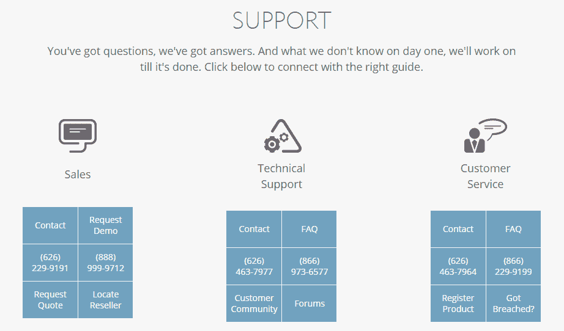
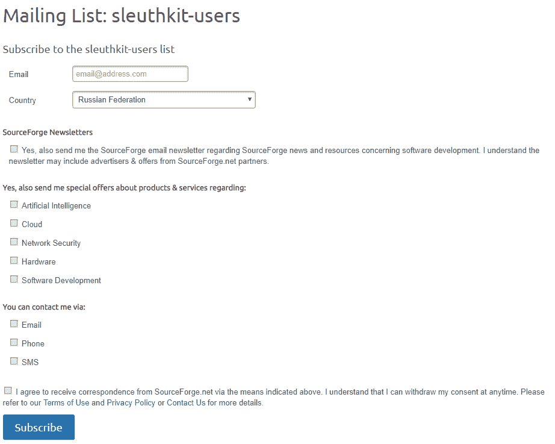
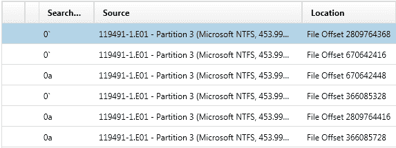

# 第十二章：Windows 取证分析中的故障排除

在本章中，我们将介绍以下几个内容：

+   商业工具中的故障排除

+   免费和开源工具中的故障排除

+   进程失败时的故障排除

+   使用数字取证软件处理数据时的假阳性问题

+   开始你的数字取证之路

+   进阶阅读材料

# 介绍

我们都希望我们的案件总是百分之百完美，但不幸的是，有时事情确实会出错。无论是因为你使用的产品出现技术故障，调查员犯了错误，最初的数据集本身有问题，还是案件进入法庭时遇到的某种立法问题，在调查过程中遇到障碍是非常常见的。

在本章中，我们将重点介绍流行取证套件中一些最常见的故障以及如何修复它们。然后，我们将探讨当进程失败时你可以采取的措施，以及在遇到立法或司法管辖区挑战时你可以做什么。

最后，我们将为你提供一份关于数字取证入门的简短指南，并推荐一些进阶阅读材料——如果你还没被吓到的话！

# 商业工具中的故障排除

数字取证是一个非常复杂的领域。这意味着你在处理案件时可能会遇到不同的问题。这些问题可能有不同的性质：你可能因为工作站没有安装额外的第三方软件（通常是开发者会包含在工具包里的）而无法安装某个工具；你可能因为数据源损坏或格式/文件系统不被支持而无法正确处理数据源；你可能因为某些取证数据格式已更改且你的软件尚不支持该格式而无法解析某些取证证据，等等。

多亏了商业取证软件的开发者，包括 EnCase、FTK、AXIOM、Evidence Center、Intella 等，你几乎可以在大多数情况下，通过他们的客户支持服务迅速且轻松地解决几乎任何问题（大多数时候）。这些服务通常已包含在你的许可中。你所需要做的就是给支持团队发送一封邮件，甚至打个电话给他们。

图 12.1\. Guidance Software EnCase Forensic 支持联系方式

# 免费和开源工具中的故障排除

当然，免费和开源工具没有客户支持服务，但它们有开发者。通常，你可以直接联系开发者并提问，或者甚至与他们分享（如果可能的话）你所遇到的数据源问题。这有助于开发者改进工具并帮助社区。

一些工具，比如 Sleuth Kit 和 Autopsy 等，拥有邮件列表：你可以提问，开发者或活跃用户会回答你，正如下面的截图所示：

图 12.2\. 订阅 sleuthkit-users 邮件列表

# 当过程失败时的故障排除

由于调查和司法过程是由人类制定的，因此它们有时会失败；有时甚至失败得相当惊人。在这一部分，我们将看看一些常见的例子，并讨论当类似情况发生时该怎么做。

# 证据的可靠性

数字取证调查员最常受到的批评之一是挑战他们所呈现证据的可靠性。这包括常见的*“不是我”*辩护，其中被告坚称他们不是在使用相关设备的人；也有可能是证据本身存在问题；比如病毒或恶意软件在设备分析之前已经感染了该设备，或者分析过程本身在某种程度上修改了数据。

解决这些问题有几种方法，我们逐一来看。

# 不是我

在数字取证调查中，最难应对的挑战之一就是辩护方提出的“其他人使用了设备”的说法，尤其是当犯罪或其他不法行为发生时。这是全球被告的常用辩护理由。

几乎总是无法确凿地证明在某个特定时间是某个特定个体在使用某个设备。然而，在大多数法院，尤其是在民事案件中，调查员只需要证明这一点超出合理怀疑的范围。确实，可能是其他人闯入了被告的家，猜出了他们的密码，并在被告去为年迈的母亲购物时将一些不雅的儿童图片下载到他们的机器上，但这种可能性相当低。这是一个极端的例子，但它确实说明了一个观点：大多数时候，实际上拥有设备的用户就是在使用它的人。

在某些情况下，证明这一点可能会更困难——例如，当证据来自一台多个住户共享的机器时——但有时通过其他方式也能超出合理怀疑地证明某个特定人在那时使用了该设备。

在这种情况下，有一些有用的问题可以考虑：

+   用户的行为是否模仿了在活动发生时家庭中某个特定人物的行为模式？例如，最近打开了哪些标签页？他们是在查看特定的电子邮件账户或社交资料吗？

+   如果是查看基于文本的文件，使用的语言是否与该个体的正常言语和写作模式相符？他们是否使用了在其他文档中常用的词汇？当你将该文档与你知道他们曾发送过的消息进行对比时，是否有一些相同的单词拼写错误？

+   其他设备上的数据是否能够帮助确认活动发生时其他家庭成员是否在场？

所以，例如，假设家中某个成员被指控从互联网下载非法文件。A 人物是最可能的嫌疑人，因为当下载发生时，是他们的账户被登录了。

然而，你可能并没有抓住这个人当场作案，所以你需要查找其他数据来源，以便毫无疑问地证明是他们。例如，假设涉及的台式电脑是家里几位成员共同使用的，每个人都有自己的账户。显示哪个账户登录将是证明谁下载了文件的第一步。

这时，被告可能会说，应该是其他人使用了他们的账户；或许他们不小心让账户保持登录状态，或许有人猜出了密码或知道密码。

猜测密码始终是一个可能性，但其他人的写作风格要伪造起来要困难得多，所以这时你可以引入之前列出的其他问题。首先，查看下载文件的人使用的语言。下载发生前他们是否进行了相关的搜索，如果有，这些搜索词是否包含任何可能有用的语言标记？

一般来说，到这时，你会毫无疑问地证明被告有罪。但为了讨论的方便，假设被告非常坚持他们没有使用那台电脑。无论你给他们呈现多少证据，他们都不承认你说的任何一句话，并且不断重复*不是我*。

现在你可能想查看家里其他成员收集到的证据，看看他们设备的数据是否能证明没有人下载这些文件。

幸运的是，蓬勃发展的物联网行业正在使这种数据的收集变得越来越容易。假设你已经设法获取了家里所有设备的数据，并且面前摆放着这些数据集。你通过我们在第十一章《数据可视化》中讨论过的时间线视图浏览它们，并将调查范围缩小到文件下载的时间段。

现在你可以发现每个家庭成员在特定时间的活动。例如，假设家中的 B 人物负责所有的烹饪工作，在消息发送时，**Amazon Echo**就在厨房的柜台上，一边通过食谱指导做牛肉布尔吉尼翁（beef bourguignon）。智能电视的数据表明，有人坐在沙发上看电影，而这一点也得到了 C 人物智能手机的数据支持，手机被闲置着用来谷歌搜索正在屏幕上出现的演员名字。

来自 D 人物 Fit Bit 的数据表明，他们在消息发送时正在洗澡，而 E 人物则被摄像头拍到在 YouTube 上直播化妆教程，向他们的粉丝展示。

这使得 A 人物成为最可能的嫌疑人。但当然，被告可能仍然坚持说不是他们。

# 它是病毒 / 我被黑了

有时候，被告会从一个辩护转向另一个辩护，形成一种绝望的连锁反应。我们继续沿用上面的例子。已经确认在文件下载时，计算机前的人必须是 A，但他们现在提出了一个新的辩护：虽然他们确实在使用这台设备，但并没有故意下载这些文件。所以，要么计算机感染了病毒，要么他们可能被黑了。

在今天的世界中，很难证明一个设备没有病毒。除了通常在证明一个否定命题时遇到的挑战外，调查人员还面临着越来越智能的恶意软件，这些软件能够掩盖自己的痕迹，覆盖日志，甚至几乎不留痕迹地从系统中删除自己。

然而，在大多数情况下，你可以使用一些方法来确定计算机上病毒存在的可能性。

首先，也是最重要的一点，进行扫描。除非你正在处理一个特别复杂的案件，否则大多数恶意软件会在初步扫描中被发现，一旦你知道它是什么，你就能搞清楚它能做什么，不能做什么。同时，检查计算机是否安装了防病毒软件，如果安装了，检查其是否是最新的。

其次，如果你的调查集中在特定的时间范围内，就像我们当前的例子那样，查看在那个时间点计算机上发生了什么。如果有人在一个标签页中发送信息，而在另一个标签页中下载了非法文件，那几乎不可能不知道这些事情。类似地，也不太可能病毒会访问一个网站，下载 P2P 软件，授权计算机安装该软件，点击所有选项，同意条款和条件，打开软件，然后用它下载图片。

# 你的过程存在问题

一种更严重的辩护是，当某人声称调查员的过程有问题时。他们可能会声称，例如，证据被污染；案件处理不公；他们的权利没有得到保障；或是关键数据被遗漏，等等。

防止此类问题发生的最有效方法是采取预防措施，确保你在一开始就不会遇到这些问题。可以说，最重要的预防措施是建立并保持正确的证据链。

保管链基本上是记录你所收集的证据的文书，显示证据曾经在哪里，停留了多长时间，谁负责管理。也就是说，如果你在一个调查小组中工作，你的保管链文档应该详细记录谁到过现场，谁查看过现场的设备并决定是否移除它们，移除时它们是如何被处理的（例如，它们是被关闭并拔掉电源，还是在发现时已经关闭），它们是如何被带到处理区的，在此期间谁负责它们，最终是谁负责分析数据。

需要注意的其他重要细节包括对设备采取的任何操作，例如：

+   你在什么时候对设备进行了取证影像采集？

+   你是否备份了原始设备？你在何时备份，备份存储在哪里？

+   设备运输是如何处理的？例如，它是否被放入了法拉第袋？

+   你使用了哪些工具来检查设备，如何确定它们正常工作？

如果你能回答上述所有问题，并且准确填写了保管链文档，那么你的被告将很难质疑你的过程是否存在问题。

# 法律和管辖权挑战

在调查中可能面临的最难挑战是法律和管辖权的限制。

也许你收集了证据，指向了一个特定的网站，而该网站的服务器位于与你所在国家没有互惠协议的国家。也许数据存储在云端，且其法律管辖区不明确。也许你已编制了针对某个嫌疑人的案件，但他们处于另一个管辖区，而你在那里没有权限。

最终，我们都必须在法律的框架内工作。尽管大众文化中常常描绘数字取证专家非法黑入嫌疑人电脑并违反各种规则以确保案件定罪，但在现实世界中，这是不可能的。

如果你确实遇到管辖权挑战，最好的办法是尽可能与相关当局合作。例如，在涉及严重犯罪的案件中，如儿童保护或毒品走私调查，通常会有办法与国际执法机构合作，确保案件能够解决。这可能需要时间，并且需要大量耐心，但最终结果通常是值得的。

面对法律挑战时需要牢记的最重要的一点是，尽管在知道某人正在犯罪时，切角可能很有诱惑力，但这只会损害你的调查。不仅你的个人声誉将受到威胁，而且你可能污染证据，导致案件被驳回，从而适得其反。

# 数据处理中的假阳性，使用数字取证软件

在使用不同工具进行计算机取证检查时，无论是商业软件还是免费的或开源工具，你都会遇到所谓的*假阳性*，尤其是如果你计划使用数据雕刻技术时。

那么，为什么我们都会遇到这些假阳性呢？不是因为你的取证软件有 bug。问题是，这些假阳性只是与你的软件在从硬盘的未分配空间或其取证镜像中雕刻数据时所使用的标准匹配而已。

在使用支持大量不同应用程序的工具时，例如 Magnet AXIOM，你很可能会遇到假阳性。但是你必须明白，出现一些假阳性比出现一个假阴性要好得多！

图 12.3。Magnet AXIOM 中的假阳性

如你在前面的图示中看到的，识别这些伪造痕迹并不难：它们看起来杂乱无章，毫无意义。

无论如何，作为计算机取证检查员，你必须彻底分析所有这些内容，因为即使是假阳性中也可能发现有价值的证据。

# 在数字取证中的第一步

如果你读到这里，并且你还不是一名数字取证从业者，但正在考虑它作为一个潜在的职业道路，那么恭喜你！你正在考虑进入一个不断发展的行业，拥有大量的机会和多个不同的领域可以追求。

你在数字取证中的下一步将取决于你目前所处的阶段，以及你最终希望进入哪个领域。

问问自己以下问题：

+   我喜欢解决实际问题吗，尤其是那些具有物理互动元素的问题，比如拆解机器部件找出故障所在？

+   我喜欢技术挑战吗，比如解谜、益智游戏、电子游戏和技术？

+   我更喜欢独立工作，还是作为团队的一部分工作？

+   对我来说，是赚很多钱更重要，还是在一个我觉得能够有所作为的领域工作更重要？

+   我宁愿参与实际调查，还是从事工具的研发？

+   哪些数字取证领域对我最有吸引力？

每个人对这些问题的回答都会不同。没有人能为你选择正确的道路，除了你自己；即便如此，我们都有时会做出错误的选择！然而，数字取证工作的一大优势是，许多技能是可以迁移的。一旦你具备了包括技术调查、研究活动以及在压力下保持冷静的能力等技能，你可以将这些技能应用到各种不同的职业中。

数字取证的三大主要领域涉及执法、企业工作和学术界。让我们简要地了解每个领域，看看哪个最适合你。

# 学术界

学术研究是一个要求极高的职业道路，通常比其他法医工作领域的薪酬要低，但它也可能非常有回报。在学术研究中工作通常会给你机会发现新技术，揭示该领域的新趋势。根据你的机构和资助机构的不同，你可能有机会使用一些最新的技术，例如研究最新一代的物联网设备，以及这些设备的法医数据如何在调查中使用。

进入学术研究领域至少需要本科学位。通常，人们在早期的学习过程中意识到自己适合这个领域，之后继续攻读研究生学位，并最终寻找研究团队和小组加入。

# 企业

企业法医学无疑是进入这一领域的薪资最高的路径，但竞争非常激烈。然而，数字法医学是一个增长中的行业，因此可用的职位数量一直在增加。求职者的兴趣也在增加，这意味着职位空缺相对较少。

许多数字法医学公司拥有多个不同的部门：一个负责处理从民事投诉到刑事诉讼案件的调查团队；一个负责研发的团队，提供软件解决方案以加速这些调查；一个负责销售和市场营销的团队，将这些解决方案推销给客户，等等。

如果你拥有计算机法医学或相关领域的学位，你已经在获得该职位的资格上走在了前面。然而，许多公司正在寻找那些在众人中脱颖而出的人。获得实习机会仍然是进入该领域并最终找到工作的最佳途径之一。值得了解一下培训选项——许多大型法医公司，如 Guidance Software、AccessData 和 Nuix，提供自己的培训课程，帮助学生掌握数字法医学技术。在简历中拥有这些证书可以帮助你脱颖而出，向雇主展示你对该领域的专注。

# 执法

人们选择进入数字法医学执法领域的主要原因之一是想要做出改变。作为一名警察或政府机构的成员，你将负责处理各种各样的任务，从毒品调查到儿童保护案件。如今，大多数执法机构都有专门的计算机法医学部门，而设备的普及意味着这一领域只会不断扩大。

从事执法工作并不适合每个人；通常工作时间较长，薪水也不如在大公司工作的收入。但是对许多人来说，知道自己直接帮助了他人，远比薪水更有价值。

# 我该如何开始？

如果你刚开始考虑从事这一领域的职业，第一步是做一些研究。这里有大量的信息可以帮助你入门，而且即使你还没有参加课程或开始正式学习，也有很多方法可以自己练习。

查看一些数字取证网站和论坛，那里有更多经验丰富的从业者分享他们的知识，并随时帮助你解答问题。你可以下载免费的工具，如 Autopsy 和 FTK Imager 进行练习，使用你自己的设备或在线找到的测试映像来创建并处理案例。这些将是你开始学习或进入该领域时非常宝贵的经验。

你也可以考虑参加附近的一些数字取证会议。许多会议为学生提供折扣，并且有一些会议会举行学生提交海报的竞赛，这些海报将在会议期间展示。像这样的活动是认识行业内其他人并开始建立你的人脉的好机会。

在下一节中，我们将推荐一些资源帮助你入门。

# 进阶阅读

以下书籍和网站对于任何对数字取证领域感兴趣的人都将非常有帮助。

# 书籍

对于一份深入且易于理解的进阶入门书籍，Eoghan Casey 的**《数字证据与计算机犯罪》**（*Digital Evidence and Computer Crime*）是必读书目。

其他一些关于该主题的优秀入门书籍包括：

+   **《计算机取证》**（*Forensic Computing*）由 Anthony Sammes 和 Brian Jenkinson 编写。

+   **《数字取证基础》**（*The Basics of Digital Forensics*）由 John Sammons 编写。

+   **《文件系统取证分析》**（*File System Forensic Analysis*）由 Brian Carrier 编写。

如果你想深入阅读特定主题，可以尝试以下几本书：

+   **《实用取证映像：使用 Linux 工具保障数字证据》**（*Practical Forensic Imaging: Securing Digital Evidence with Linux Tools*）由 Bruce Nikkel 编写，讨论了为什么正确的映像获取过程如此重要，并提供了一本包括许多免费和开源选项的操作指南。

+   **《实用移动取证》**（*Practical Mobile Forensics*）由 Heather Mahalik 和 Rohit Tamma 编写，介绍了移动设备的取证分析，并提供了一个实用的操作指南。

+   **《移动取证调查》**（*Mobile Forensic Investigations*）由 Lee Reiber 编写，为深入了解移动取证领域及如何进行分析提供了非常详细的内容。

+   **《iOS 取证学习》**（*Learning iOS Forensics*）由 Mattia Epifani 和 Pasquale Stirparo 编写，帮助调查 iPhone，并提供易于跟随的逐步说明。

+   **《Android 取证学习》**（*Learning Android Forensics*）由 Rohit Tamma 和 Donnie Tindall 编写，适合那些希望专注于 Android 设备的用户，或者只是想补充自己在这一领域的知识。

+   **《记忆取证艺术》**（*The Art of Memory Forensics*）由 Michael Hale Ligh 和 Andrew Case 编写，介绍了内存取证并讨论了他们的 Volatility 工具及其使用方法。

# 网站

+   **4n6ir** : [`blog.4n6ir.com/`](http://blog.4n6ir.com/) — 一个经常更新的关于事件响应和数字取证的信息库。

+   **Between Two DFIRs** : [`betweentwodfirns.blogspot.co.uk/`](https://betweentwodfirns.blogspot.co.uk/) — 该博客重点关注计算机取证中的信息安全方面（DFIR 代表数字取证与事件响应），Andrew Swartwood 的博客是任何想进入这个领域的人的宝贵资源。

+   **Binary Foray** : [`binaryforay.blogspot.co.uk/`](https://binaryforay.blogspot.co.uk/) — 适合高级从业者阅读的技术文章，Binary Foray 探讨了数字取证中的一些最新技术。

+   **BlackBag Tech** : [www.blackbagtech.com/index.php/blog](http://www.blackbagtech.com/index.php/blog) — BlackBag 的博客包含几个持续的系列文章，带领读者了解数字取证的一些基础知识。

+   **Blackmore Ops :** [www.blackmoreops.com](http://www.blackmoreops.com) — 对于 Linux 爱好者来说，这是一篇必读文章，内容涵盖如何使用 Kali 并介绍了一些其取证应用。

+   **Cyber Forensicator :** [www.cyberforensicator.com](http://www.cyberforensicator.com) — 一个每天更新的博客，涵盖数字取证新闻和研究。

+   **DFIR Training** : [www.dfir.training](http://www.dfir.training) — 一个极好的资源，列出了数百个培训机会和工具。

+   **Didier Stevens** : [`blog.didierstevens.com/`](https://blog.didierstevens.com/) — 包括数字取证、事件响应、电子发现、黑客攻击和计算机安全领域的资源和更新。

+   **Forensic Focus :** [www.forensicfocus.com](http://www.forensicfocus.com) — 数字取证社区最大的在线平台，包含文章、评论、访谈和一个活跃的社区论坛。

+   **Forensic Lunch** : [`www.youtube.com/user/LearnForensics`](https://www.youtube.com/user/LearnForensics) — David Cowen 的热门 YouTube 频道，讨论数字取证调查的各个方面。

+   **Forensics Wiki** : [www.forensicswiki.org](http://www.forensicswiki.org) — 为数字取证从业者提供丰富的信息，并有一个定期更新的资源部分。

+   **Hacking Exposed Computer Forensics Blog** : [www.hecfblog.com](http://www.hecfblog.com) — David Cowen 的博客更新不频繁，但每篇文章都值得等待：这些帖子详细解释了每个步骤的过程，内容既易于理解又有趣，适合新手和高级调查员。

+   **Mac4n6** : [www.mac4n6.com](http://www.mac4n6.com) — 一个专注于苹果产品的数字取证博客。

+   **Magnet Forensics** : [www.magnetforensics.com/blog/](http://www.magnetforensics.com/blog/) — 这家数字取证公司的博客经常发布有用的网络研讨会、指南和从业者资源，内容常涉及儿童保护调查的文章和研讨会。

+   **移动与技术探索**：[`trewmte.blogspot.co.uk`](http://trewmte.blogspot.co.uk) — Greg Smith 的博客涵盖多个数字取证主题，特别关注移动调查。

+   **专业数字取证**：[`prodigital4n6.blogspot.co.uk/`](http://prodigital4n6.blogspot.co.uk/) — 讨论数字取证和法律问题的博客，包含许多有用的案例研究来阐明观点。

+   **本周数字取证资讯**：[www.thisweekin4n6.com](http://www.thisweekin4n6.com) — 由 Phill Moore 主办的每周博客，汇总数字取证、电子发现和恶意软件分析领域的最新新闻。

+   **Windows 事件响应**：[`windowsir.blogspot.co.uk/`](http://windowsir.blogspot.co.uk/) — Harlan Carvey 的博客，包含技巧、操作指南和资源。

+   **Zena Forensics**：[`blog.digital-forensics.it/`](http://blog.digital-forensics.it/) — 由 RealityNet 团队合作开展的博客，虽然更新不频繁，但包含了一些有趣的研究，值得关注。

# Twitter 账号

+   `@aboutdfir` — [aboutdfir.com](http://aboutdfir.com)的创始人，推送行业新闻、调查和研究

+   `@binaryz0ne` — 数字取证、事件响应、恶意软件和流量分析研究员

+   `@christammiller` — 推送关于数字取证和事件响应的研究和观点

+   `@ForensicFocus` — 数字取证和电子发现专业人士的热门网站的 Twitter 账号

+   `@Fr333k` — 计算机安全、在线隐私和数字取证研究员，推送最新的行业新闻

+   `@grumpy4n6` — 推送关于 IT 安全、事件响应、数字取证和恶意软件的内容

+   `@hacks4pancakes` — 数字取证和开源情报专家，推送信息安全、计算机取证和相关主题的内容

+   `@HeatherMahalik` — 数字取证专家、SANS 讲师，定期推送行业新闻

+   `@icanhaspii` — 恶意软件、勒索软件和信息安全专家，推送数字取证、事件响应及相关内容

+   `@jayabaloo` — 网络安全架构和 VOIP 安全专家

+   `@jessicambair` — 推送关于网络安全、数字取证和事件响应的内容

+   `@jeviscachee` — 本书的其中一位作者，推送关于数字取证、隐私和计算机安全的内容

+   `@lept` — 都柏林大学学院 DigitalFIRE 团队成员，推送数字取证新闻和更新

+   `@mrkscn` — 富布赖特学者、都柏林大学学院数字取证与网络安全助理教授，推送该领域的最新研究和发展

+   `@NadiaShiyyab` — IT、SCADA 和数据网络安全研究员

+   `@OlgaAngel` — 数字取证和信息安全讲师及研究员

+   `@pstirparo` — 数字取证、威胁情报和移动安全专家，推送相关话题及更多内容

+   `@SuzanneWidup` — 一位作者和研究员，在推特上分享关于数字取证、数据泄露和*一般的极客内容*

+   `@TroelsOerting` — 巴克莱银行的集团首席安全官（CSO），他在推特上分享关于事件响应、计算机安全和数字取证的内容

+   `@udgover` — 在推特上分享关于计算机取证、编程、算法和开源项目的内容

+   `@zaanpenguin` — 一名事件响应者和数字取证调查员，在推特上分享行业新闻和有趣的研究
