# 第一章：开源情报

什么把**渗透测试**（**pen testing**）与非法黑客行为区分开？简单的回答是*许可*，但是如何定义许可呢？请求渗透测试并*不*意味着你可以肆意黑客。我知道至少有一个渗透测试机构因触碰了不应属于测试的服务器而陷入法律麻烦。这是渗透测试的*范围*，它在规划阶段就被定义了。它的重要性无法过分强调。然而，这是一本实践性强的技术书籍——我们在这里不会涵盖范围和合作信函的内容。

现在，你正在再次检查章节标题，确保你在正确的地方。你在想：*这不是关于开源情报的内容吗？* 其实是的，我提到“范围”是因为**开源情报**（**OSINT**）是一个你无需担心范围狭窄困扰的领域。*开源*意味着信息已经公开，准备好供你检索。你只需要掌握一些技巧，超越普通的`Google`用户。在这一章中，我们将更加精确地定义 OSINT——我们将学习如何利用 Google 的复杂功能深入挖掘，足以在你向客户的网络发送任何数据包之前，就令他们感到惊讶，我们还将介绍`Kali`如何作为你的 OSINT 助手。在接下来的章节中，我们将涵盖这些内容及更多：

+   明目张胆的隐藏 – OSINT 和被动侦察

+   `Shodan`的世界

+   Google 的黑暗面

+   使用 Kali 深入探索 OSINT

# 技术要求

你需要一台运行`Kali** **Linux`的**虚拟机**（**VM**）或独立的 PC。我们将在`Kali** **2021.1`上演示，但第一部分可以在任何连接互联网的计算机上完成。

# 明目张胆的隐藏 – OSINT 和被动侦察

在本书中，我们将大量使用 Kali Linux，但你为许多客户所做的一些最重要的工作，可以在任何设备上完成，无论是否拥有专用工具集。你可能正在星巴克排队，手里拿着个人智能手机，输入一些巧妙的 Google 查询，哇—你在到达办公室之前就有了惊人的领先优势。然后，你坐到 Kali 前，花半个小时深入挖掘更多信息，而你甚至还没有向目标发送一封数据包。不过，我能听到你在后面问：*你提到过“OSINT”和“被动侦察”——它们有区别吗？* 这是一个很好的问题，答案却有些烦人：*这取决于你问谁*。这些术语通常被交替使用，但重要的区别在于你发送数据包的地方：

+   在纯粹的**被动侦察**中，你的请求会发送到互联网上任何愿意提出请求的人的多种资源上。但它们并不会进入目标的网络。这也可能意味着你根本没有发送任何数据包——你仅仅是在监听，就像我们在**车载无线网络侦察**中做的那样。

+   OSINT 可以指这种完全被动的任务，其中不会与目标进行接触，而是使用目标明确为公众使用的资源。你的目标是否允许潜在客户创建一个免费账户？作为渗透测试员，创建一个账户就像潜在客户一样是有必要的，但这可能意味着你正在直接与目标的网络进行通信。正是“*为公众使用*”这一部分使其成为 OSINT。

听起来这是一个非常重要的区分，对吧？之所以它们常常被视为相同的事情，是因为它们都属于**黑箱**的范畴——我们对环境的经验就像普通的外部人员，而不是**白箱**，在白箱测试中，作为渗透测试员，我们完全理解环境的内部工作原理，并根据这些信息调整我们的工作（当然，我们也可以在对环境了解不完全的情况下进行测试，这将是黑箱和白箱的混合，或者是灰箱）。我们现在触及的是渗透测试的哲学——测试在多大程度上能够真实反映现实世界中的潜在攻击？对于我们这些对安全充满热情的人来说，我们坚守**香农的法则**。也就是说，*我们应该始终假设敌人对我们的系统工作原理拥有完全的了解*。现实世界中的敌人会在互联网上搜寻关于目标的任何信息。现实世界中的敌人会在目标的服务上创建账户，并花费大量时间获得与任何老手一样的熟悉程度。话虽如此，你的客户可能需要从不同的角度理解他们的环境，而你可能会被禁止使用从注册用户视角获得的信息。另一个考虑因素是时间——你将按照时间表进行操作，而你不希望把评估的其他阶段推得很紧迫。

## 直接走进去——目标打算展示给世界的内容

你的目标的性质会告诉你他们打算向世界展示多少内容。例如，如果你的目标是一家银行，那么他们会为现有客户提供全面的资源，同时努力吸引新账户持有者。即使是更私密的实体，在某些方面也需要展示自己（例如，需要远程访问的私有网络）。在计算机安全领域有句老话：“*最安全的计算机是封在混凝土盒子里并放置在海底的*”。如果没人能使用这台计算机，那似乎就浪费了混凝土，因此我们的客户无论如何都会托管服务和网站。

### 检查目标的网站

我在处理目标时，首先做的事情之一就是浏览他们的网站并选择**查看页面源代码**。这个截图展示了如何在`Microsoft** **Edge`中获取源代码，但在任何主流浏览器中，右键点击页面都会弹出相应的选项：

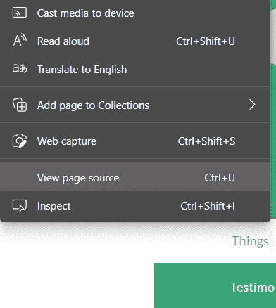

图 1.1 – 在 Microsoft Edge 中查看页面时的右键菜单

这个选项会打开一个新标签页并显示页面的`HTML`源代码。通常，这不会显示任何没有在页面上看到的内容（毕竟它是一种标记语言）。但是，源代码中可能会有一些注释和其他浏览器没有打算显示的内容，它们可以为我们提供有关目标的一些信息，这些信息将帮助我们进行攻击。

在这个客户端中，页面源代码显示了一个名为`assets`的文件夹：

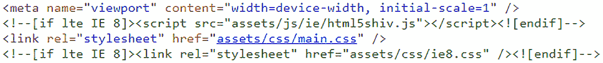

图 1.2 – 在 Microsoft Edge 中检查页面源代码

我们看到了指向可以在主机上的`assets`文件夹中找到的脚本的引用。所以，直接将这个网址输入到地址栏中看看会发生什么——[`www.your-client.com/assets`](http://www.your-client.com/assets)：

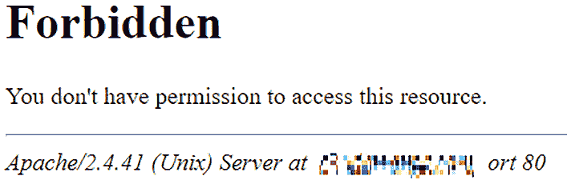

图 1.3 – 手动输入资源 URL 后的结果

我们甚至什么都没做——只是通过普通的浏览器打开了公共网站——但我们已经看出该主机告诉了我们一些信息：

+   它是`Apache`服务器，版本为 2.4.41，运行在`Unix`（或类 Unix 系统）上。

+   它的配置不是最安全的。

第二点是最重要的观察。像这样揭示服务器版本真的有那么重要吗？当然，它为我们的研究提供了前瞻性信息，但它并不是一个欢迎的信号。它告诉我们的是管理员对操作安全的总体态度。那种要么不了解，要么不在乎风险的服务器管理员，更可能是那种会在公共论坛上请求帮助的人，比如关于*公司新硬件*的问题，甚至提供你在评估过程中才会幸运获得的日志。

### 别那么反社会——检查目标在社交媒体上的存在

我们生活在一个有趣的时代，似乎每个人和他们的祖父母都愿意将所有个人信息分享给社交媒体公司。在我年轻的时候，你会听说那些酷孩子在父母家举办派对，你会想，*哇，星期五晚上就该去那里了*。今天，你的目标也听到的是关于社交媒体的同样话题——每个人都在`Facebook`、`Twitter`、`Instagram`和`TikTok`上，所以那就是你将遇到酷孩子（或者潜在客户）的地方。在这个截图中，我们看到我们的目标正在鼓励互动：


图 1.4 – 我们目标主页上的社交媒体链接

你不太可能从目标发布的社交媒体帖子中找到关于他们的有用信息。你更有可能从该社交媒体平台上的*其他*用户那里找到重要内容。例如，你点击了 Facebook 按钮，最终进入了目标设置的页面。你浏览评论：*Jane 是高地分支的总经理，她对我的需求回应非常及时*。或者也许是一张公司野餐的照片，得到了 14 个点赞，其中一个是 Jane 的，而且她喜欢在个人资料页面分享宠物、孩子、车、家以及她最喜欢的星巴克拿铁的照片。

我可能听起来像个狂 ranting 的疯子（其实我是，但现在这不重要），但重点是吸收所有这些信息并*做好笔记*。我们现在正处在书本的第一章，讨论的内容可能正是你与客户评估时的第一章。Jane 给她的狗取名叫 Mr. Scruffles，乍一看可能觉得毫无用处，直到第四天，当你被问到*宠物名字*的安全问题时。而且还要考虑到，Jane 的 IT 男孩 Dave 是一个流行的 Facebook 小组的成员，这个小组是 IT 管理员吐槽工作的地方；Dave 刚刚度过了一个与`Cisco`设备打交道的艰难一天，他已经准备好上传诊断文件。

小心行事！

我们正在寻找已经存在的信息。除非你正在进行社会工程评估，否则不要尝试与社交媒体搜索中找到的任何个人进行交流——这绝对*不是*被动的！

## 只是在浏览，谢谢——进入目标的环境

等一下。进入目标的环境？*现在我知道我走错章节了*，你可能会这么想。确实，这就是被动侦察开始与更广泛的 OSINT（开源情报）概念交织在一起的地方。到目前为止，关键词是*被动*——从旁观者的角度聆听或像开车经过时偷看窗户一样看一眼。现在，关键词变成了*开源*——我们正在查看那些本应公开的信息。我们将开始变得更勇敢一些。我们不再是象征性地开车经过，而是停下来走进商店四处看看。这是一个对公众开放的门，门前写着*开放*，所以我们并没有走出开源的范畴。然而，有时我们会从这些比喻性的商店柜台后面获得有趣的信息。

### 召唤恶魔——那个拼写错误的电子邮件地址

我们每个人都曾经在某个时刻拼错过别人的名字。也许你正在尝试给某个域名的管理员发邮件，结果糟糕的是，你拼错了**管理员**。哎呀，这双讨厌的手指。正如我的岳母常说的，*schlimazel*（一个不幸或笨拙的人）。让我们来看看我们发出的邮件：

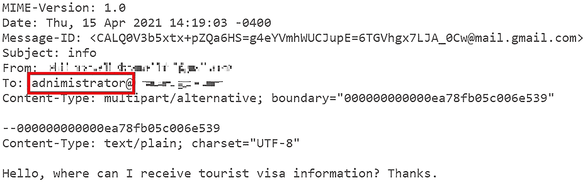

图 1.5 – 我们发送的探针邮件的头部

重点是向目标域发送一封邮件，但收件人是我们知道不存在的人。你完全可以让你的猫走过键盘，并使用那个作为收件人——结果将是一样的。然而，这里有一点社交工程的成分。以防有人在查看这些，我的信息更可能看起来像是与企业或政府机构进行合法沟通的尝试。一个被敲碎键盘的邮件地址和正文会看起来像是故意挑衅回应的尝试。如果你真的以客户的身份进行友好对话并与对方互动，但让你的某一封邮件有一个打错的收件人地址，那就更得分了。通过向一个不存在的邮箱地址发送邮件，我们会引发一个*弹回信息*。与发送邮件到一个不存在的域名不同，只有目标环境才能知道用户是否存在。弹回信息会来自目标环境，并且通常包含故障排除信息，其中包含一些对我们这些新手黑客来说非常有用的信息。让我们来看看来自我们客户端的未送达报告：

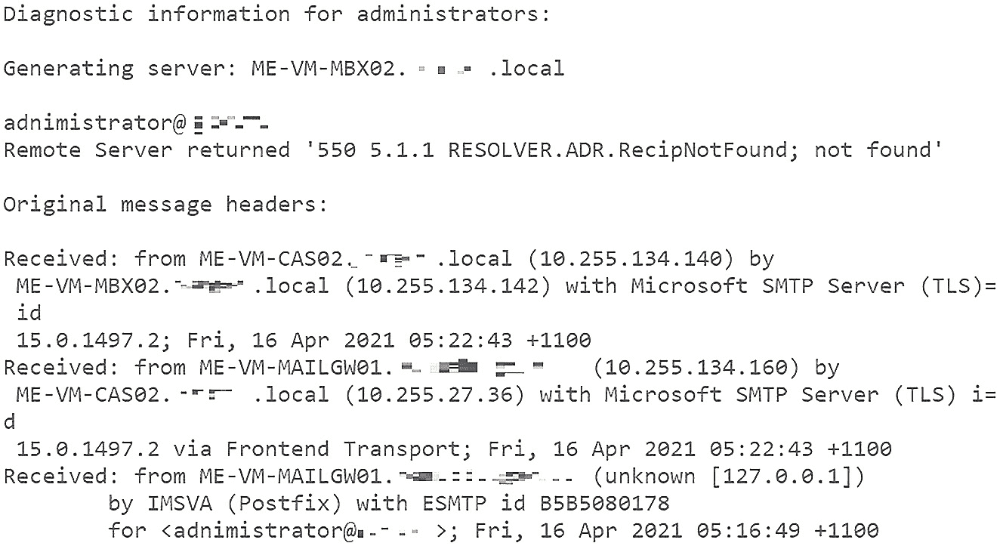

图 1.6 – 弹回信息的头部

我最喜欢的部分是这个弹回信息中的**管理员诊断信息**。哇哦，这真是太有帮助了，谢谢！

我之前提到过这一点，这应该是整个 OSINT 阶段的座右铭：*这不完全是一个欢迎垫*。这不是进入王国的钥匙，也不是一部电影——无论多么拼命的敲打键盘，都不会改变我们在评估中的位置。但让我们一步一步地看看我们学到了什么：

+   生成此报告的服务器是`ME-VM-MBX02`，其 IP 地址是`10.255.134.142`。合理的推测这是一个虚拟机，因为 IT 人员通常在内部命名约定中会加入 VM 缩写。这使得从外观上更容易判断可能需要进行什么样的故障排除。

+   向`ME-VM-MBX02`（我们的报告生成服务器）传递此信息的服务器是`ME-VM-CAS02`，其 IP 地址是`10.255.134.140` 和 `10.255.27.36`。

+   将此信息传递给`CAS02`主机的服务器是`ME-VM-MAILGW01`，其 IP 地址是`10.255.134.160`。*GW* 可能表示 *网关*。

希望你已经注意到重要的部分。没错，那些是*十点*地址。为了复习，`10.0.0.0/8`地址块被预留为私有地址空间，按照**互联网号码分配局**（**IANA**）的定义（如果你称它们为*十点*或者*十斜线八*，你会变得很酷）。`10.0.0.0/8`地址块不是公开可路由的，那么作为外部人员我们为什么要关心呢？显然，我们从外围获取信息。我们还注意到了什么？来看看这一行：

Microsoft SMTP Server (TLS) id 15.0.1497.2

让我们回到我们信赖的搜索引擎，搜索`Microsoft`和`15.0.1497.2`。结果排在前面的是？Exchange Server 的构建号和发布日期。在页面上搜索这个构建号，我们发现是 Exchange Server 2013 CU（累积更新）23，于 2019 年 6 月 18 日发布。好吧，我现在在 2021 年写这篇文章，几乎过去了两年，所以又得回到搜索引擎尝试这个：**漏洞**和`2013 CU23`。我们找到了`CVE-2021-28480`、`CVE-2021-28481`、`CVE-2021-28482`、`CVE-2021-28483`——*远程代码执行漏洞*。我们已经有一个内部子网可以调查：`10.255.0.0/16`。不得不承认，考虑到我们仅仅是发了一封邮件，这个结果还不错。因此，又一个提醒来了：*做好笔记*。记录下你做的每一件事。不要省略屏幕截图——有时我工作时会录制屏幕。

## 我认识一个人——为你做探测服务

在我年轻的时候，我们要走 15 英里雪地路才能到达渗透测试地点。那时候我们甚至没有电脑——我们用空豆罐子和一根线连接它们来发送和接收数据包。好了，我开玩笑的，但现在的年轻人确实和以前不一样。现在的世界有很多工作可以轻松完成，我喜欢把它叫做`EaaS`：**一切即服务**。对于渗透测试人员来说，这一点很重要，因为它让你能在有限的时间内做更多的事——你和客户的合作时间是有限的，时间永远不够用。在评估的各个阶段，你都会利用省时的措施（你好，脚本能力），但 OSINT 也不例外——即便我们还没坐下来使用 Kali。让我们来看看。

### 安全头扫描器

网上有几个这样的工具。尝试在搜索引擎中输入**安全头扫描器**。其中一个比较好的工具是[SecurityHeaderScanner.com](https://SecurityHeaderScanner.com)，这是我为这个客户端示例使用的服务：

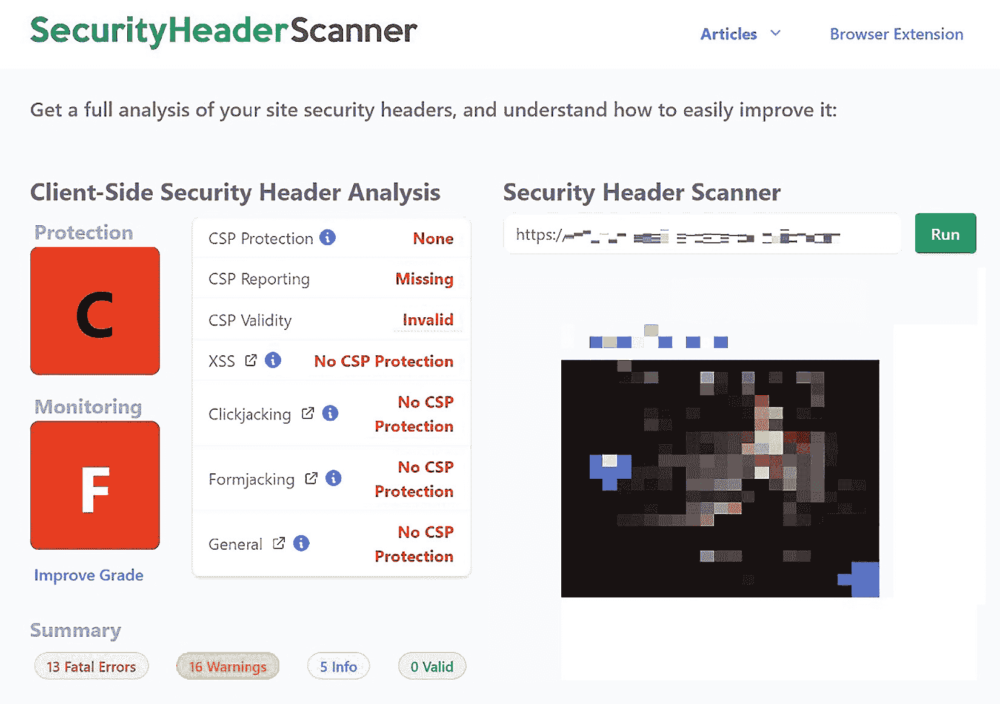

图 1.7 – 从 SecurityHeaderScanner.com 扫描我的客户端后的结果

哎呀。那看起来像是我高中二年级的成绩单（抱歉，爸妈）。在这个特别的评估中，我能够利用这些信息成功地实施**跨站脚本攻击**、**点击劫持**和**表单劫持**攻击。当然，我本可以手动搞定这一切，但*节省的时间*增加了你为客户提供的价值。

这是一个针对目标提供的公共资源进行实时测试的示例——我们请求这个特定的服务*现在*访问该网站并告诉我们它看到的内容。另一种看待这个操作系统情报（OSINT）前 Kali 阶段的方法是收集那些已经被所有爬虫在互联网上 24/7/365 地浏览的资源。我们需要意识到其中的差异，因为我们从这些资源中找到的信息并不是实时的，并且在你评估时可能并不准确。

### 开源无线分析与 WIGLE

如果我没有在使用那些已经为我们进行探测的站点进行开源挖掘时提到[wigle.net](https://wigle.net)，我永远都不会原谅自己。不过这个站点特别——它是一个真正的众包项目。像 Shodan 这样的资源是拥有自己探测和爬虫机器的组织。它们的目标是让你访问他们用自己硬件建立的数据库。而`WIGLE`则是世界各地志愿者 wardrivers 用他们自己的硬件和交通工具收集到的数据集合。

注意

如果这个术语不熟悉，*wardriving*是指带着一台设备在某个区域内移动，设备配置成能够检测并报告无线网络。这个名称暗示着开车，因为开车是覆盖大范围区域的好方法，但你也可以进行 warbiking（骑车）、warwalking（步行）甚至发射 wardrone（无人机）或 warkitteh（某人将 Wi-Fi 嗅探硬件装到他的户外猫的项圈上）。我现在还不确定 warscooting（滑板车）是否已经成为一种流行方式。

在撰写本文时，wigle.net 包含了关于 7.45 *亿*个网络的信息，这些信息来自 105 *亿* 次独立观察。观察的关键是设备侦察和`GPS`数据的结合，使你能够将观察结果定位到地图上。请记住，这些位置是观察发生的地点，而不是接入点的位置。当你放大地图时，这一点会变得更加清晰，如下图所示：

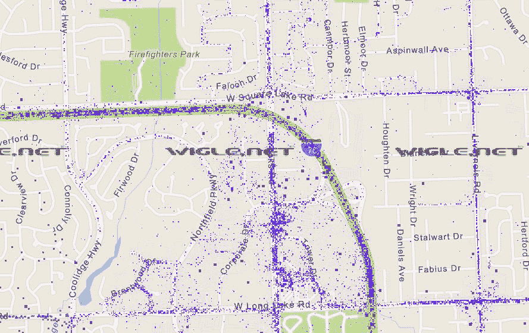

图 1.8 – 在 wigle.net 上放大一个社区

你可以看到观察点主要集中在道路上，这表明观察者是在用笔记本电脑或智能手机四处驾驶。但你也可以看到一些位于开阔地带的点，比如前面截图中的**消防员公园**，或者甚至在海洋的中央，如下图所示：

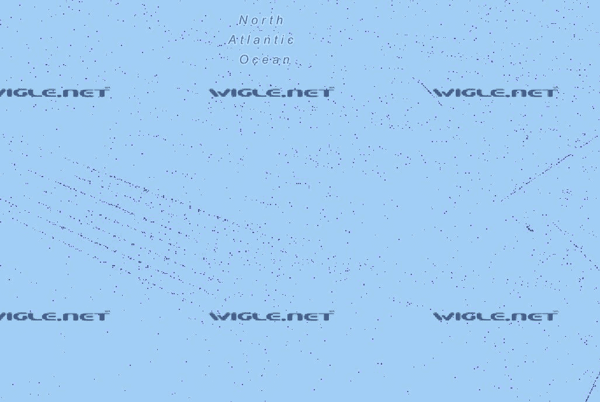

图 1.9 – 来自北大西洋的 Wardriving 观察数据

这些观察结果可能与航道甚至空中航线相关。这应该能让你对这个数据集的庞大规模有一个初步的了解。

作为一名勇敢的开源调查员，它对你有用的地方在于，可以在不亲自到现场的情况下收集有关无线网络的信息。对于一些客户来说，这可能并不重要。但对于那些可能物理分布较广的客户，比如大型数据中心或众多独立设施，某些网络位置的侦察可能会非常有用。同样，我们所说的*位置*指的是可以进行观察的区域。无线网络的功率较低，而且大多数 wardriver 在开车时并没有携带特别高增益的天线，所以你可以假设你会在几条街区内，甚至更近的地方。

# Shodan 的世界

有一个网站你可能已经知道，如果不知道，准备花几个小时来探索它的宝藏：[shodan.io](https://shodan.io)。在我那时，当你看到一个设备在网络上传输数据帧时，你就知道那是计算机。如今，各种各样的设备都有网络连接能力，你的冰箱也许正是这个我们称之为互联网的庞大树枝上的另一个新芽。这个快速增长的连接性以及它对我们日常生活的渗透，对于我们这些安全极客来说，确实令人担忧，但今天我们不打算进行哲学探讨。重点是，在这个过程中，一些聪明的人意识到，爬网查看哪些系统是开放的并准备好进行交流，将会是*非常*有趣的，尤其是当新的“树叶”开始冒出来时。于是，Shodan 应运而生。

这个名字最初来自于一款经典的 1990 年代视频游戏系列，*System Shock*。`SHODAN`代表`Sentient Hyper-Optimized Data Access Network`。在经典的科幻情节中，SHODAN 最初是人工智能，其目的是帮助人类……*但某些事情出错了*。你大概明白了。想想*终结者*系列中的*Skynet*，或*I, Robot*中的*V.I.K.I.*。人工智能变得不正常，决定将人类视为需要被消灭的有害虫子。共同点在于，人工智能被赋予了过多的权限来访问全球系统，以便完成它的任务。当 SHODAN 控制了众多分散的系统后，shodan.io 的创始人 John Matherly 认为这是一个合适的参考。

需要明确的是，Shodan 并不是一个旨在消灭全人类的网站（不过这会是一个很棒的电影）。这里提到的“*不同的系统*”部分就是那个令人毛骨悚然的地方，因为 Shodan 在互联网上爬行，只是在后巷里戳戳那些没有锁上的门。如果你想找到摄像头、缺少牛奶的冰箱，或者——更可怕的是——大型工厂内部的`SCADA`系统，那就来 Shodan 查查看吧。你作为黑客应该意识到的是类似这样的事情：*那如果有一个 SSH 服务器运行在意料之外的端口上，试图藏匿在明处呢？* 非常棒的思路。我们希望专注于那些已经被别人嗅探到的客户资源。假设你的客户真的在 `2222` 端口上运行 SSH（这出乎意料地常见，Shodan 会告诉你）。我们在评估的发现阶段已经领先一步，而且再次强调，我们并没有发送任何数据包。是 Shodan 的爬虫发送了数据包。

这里的一般原则是*横幅抓取*。横幅不过是一些基于文本的消息，用来欢迎连接到特定服务的客户端。它们对于这些服务器的合法管理员非常有用，帮助他们列出资产和排除故障。假设你有大量服务器，托管着某个特定的服务，并且你想验证每台主机上运行的版本。你可以编写一个小脚本，启动这些连接，在横幅中找到版本号，并将其整理成一个整洁的列表显示在屏幕上。它们对于在我们开发对目标的攻击时，极其有助于缩小关注点。稍后我们会在 Kali 上实践横幅抓取。与此同时，我们将利用已经有人查看过互联网服务层面信息的事实，我们的工作就是看看客户在对外展示什么。你会在评估过程中一次又一次地惊讶于客户对他们名字在外面浮动的信息知道得有多么少。

横幅抓取是渗透测试中值得关注的发现吗？

发现的内容会根据整体风险评级进行分级。在风险管理方面，企业考虑几个因素：漏洞被利用的可能性有多大，利用后会带来多大影响。一个漏洞是否非常不可能被利用，如果被利用，会不会威胁到整个组织？这将被视为更高风险。横幅抓取属于*非常可能*（由于其简单性）和*影响非常低*的类别。记住，你工作中的一个重要部分是教育客户这些技术是如何运作的。是的，这将是一个低风险的发现。但如果你的横幅抓取缩小了你的关注范围并节省了时间，从而在漏洞利用后留出更多时间进行更深入的渗透和窃取资源，它就应该出现在报告中。这是攻击的一部分！

## Shodan 搜索过滤器

你可以从简单的开始，比如输入一个 IP 地址或服务名称。例如，我们可以尝试 **远程桌面协议**（**RDP**）或 `Samba`。但是，为了将这个全球视角变成一个精密的显微镜，我们需要应用搜索过滤器。格式非常简单：你只需用冒号（**:**）将过滤器名称与查询分开。一个非常便捷的方式是通过在过滤器名称前加一个减号（**-**）来*否定*某个查询。让我们来看一下可用的过滤器，然后再看一些示例。

+   `asn`: 按自治系统编号（ASN）进行搜索。**自治系统**（**AS**）是由一个或多个实体运营的一组 IP 前缀，用于维护一个清晰的路由策略，允许这些实体与其他 ISP 交换路由。这个搜索在你寻找由一个或多个此类实体控制的主机时非常有用，这些实体通过它们分配的 ASN 来定义。

+   `city`: 按主机所在的城市进行搜索。

+   `country`: 按照 `ISO 3166` 标准，使用 `alpha-2` 代码按国家进行搜索。

+   `geo`: 允许你指定地理坐标。将特定主机与其地理坐标关联往往不太可靠，所以最好使用此过滤器设定一个*范围*。在你想要搜索的区域画一个框，并获取框左上角和右下角的纬度/经度对。例如，搜索 `geo:12.63,-70.10,12.38,-69.82` 会返回阿鲁巴岛上任何地方的结果。

+   `has_ipv6`: 搜索是否支持 IPv6；期望值为 `true`（或 **1**）或 `false`（或 **0**）。

+   `has_screenshot`: 返回包含截图的结果。这对于 `RDP` 和 `VNC` 等功能很有用。期望布尔值 `true**/**false`（`1**/`0**）。

+   `has_ssl`: 显示支持 SSL 的服务。期望值为 `true`（或 **1**）或 `false`（或 **0**）。

+   `hash`: 每个被 Shodan 抓取的页面都会被哈希处理。这个功能对于查找包含相同文本的页面很有用，但你可能会结合否定符号（**-**）和零来跳过那些横幅为空的结果，像这样：`-hash:0`。

+   `hostname`: 指定主机名或其一部分。

+   `ip`: 与 `net` 相同，这让你可以在 `CIDR` 格式中指定一个 IP 范围。

+   `isp`: 查看特定 ISP 的网络。

+   `net`: 与 `ip` 相同，这让你可以在 `CIDR` 格式中指定一个 IP 范围。

+   `org`: 这是指定组织名称的地方。

+   `os`: 非常实用——指定操作系统。

+   `port`: 检查特定端口。否定此过滤器对于查找运行在非标准端口上的服务尤其有用。例如，`ssh -port:22` 将查找所有不在标准 SSH 端口上的 SSH 实例。

+   `product`: 用于缩小正在运行的服务的特定产品范围的关键选项。例如，`product:Apache -port:80,443` 将查找任何运行在非标准端口上的 Apache 服务器。

+   `version`：用于针对特定产品版本号。

    注意

    我们现在讨论的是基本用户可以使用的过滤器。如果你的预算允许，小型企业和企业账户可以使用更复杂的过滤器。

让我们看看如何缩小结果范围，专注于我们需要的内容。首先，假设我们的目标在墨西哥城：

```
city:"Mexico City"
```

想了想，我想确保覆盖到包括墨西哥城在内的区域。所以，我会尝试这个：

```
geo:19.58,-99.37,19.21,-98.79
```

现在，我想查找任何非标准端口上的 SSH：

```
geo:19.58,-99.37,19.21,-98.79 ssh -port:22
```

而且我只想要 `Debian` 主机：

```
geo:19.58,-99.37,19.21,-98.79 ssh -port:22 os:Debian
```

最后，假设我知道目标的子网是 `187.248.0.0/17`：

```
geo:19.58,-99.37,19.21,-98.79 ssh -port:22 os:Debian net:187.248.0.0/17
```

这样，我按下 *Enter* 键，看看 Shodan 为我准备了什么：

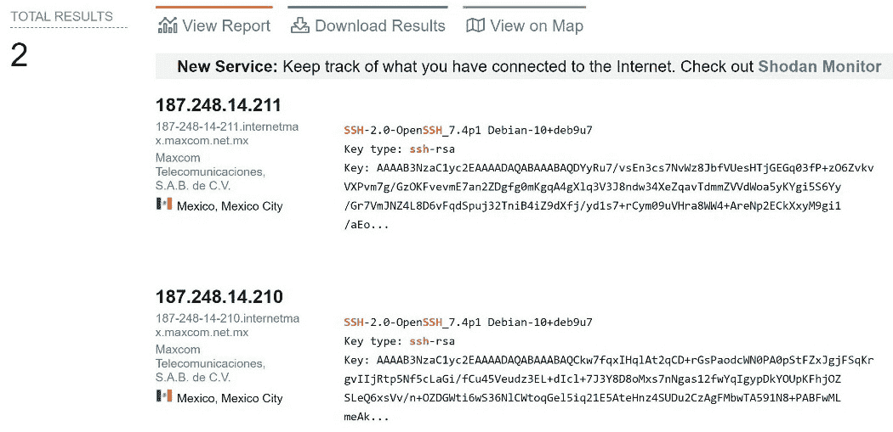

图 1.10 – 锁定我的目标

当我开始查看墨西哥城地区时，我有 150 万个结果需要筛选。通过精确调整，我将列表缩小到仅两个服务器。这是一个完全随机的示例，目的是为了演示——当你为特定客户进行研究时，你可能会尝试 `org` 过滤器，或许还有 `asn` 过滤器，以及你能用上的其他任何工具。

# Google 的黑暗面

在我们到达桌前，Kali 迫不及待地等待时，我们的最后一站是 Google。不，我们不是去查天气，或者找出为什么我们叫那些有刺的动物 *刺猬*（显然，它是拉丁语中的 *porcus*（猪）和 *spina*（刺，脊柱）——谁知道呢？）。我们将利用 Google 搜索的外科手术刀：*操作符*。保持和 Shodan 一样的精神——用冒号（**:**）将操作符和查询分开，中间不加空格。不过，Google 允许我们进行相当高级的操作。

哒哒

这里的概念同样适用于 `Bing` 搜索引擎（不过，你需要查看他们帮助页面上的操作符详情）。作为一个独立的搜索引擎，你可能会在 Bing 上找到 Google 没有的结果，反之亦然。值得检查所有选项！

## Google 的高级操作符

首先，让我们讨论一下普通网页的构成。当然，你需要输入网址到浏览器中，并与朋友分享。然后，你会有网页的标题，而这个区别是技术性的——它将会用 `<title>` 标签在 HTML 中明确地格式化。你还会有网页的文本，它基本上是网页上除了标题和网址之外的所有内容。我们这些渗透测试人员关注这一点有三个原因：

+   Google 可以找到管理员可能忽视了他们帖子公开性质的内容，包括谈论特定客户及其管理的产品。

+   Google 可以找到那些可能已经危害了你的客户、合作伙伴或员工的坏人留下的东西。

+   带有网页门户的服务会有可以区分它们的签名。例如，URL 中使用特定的词（如**admin**），或者页面文本中包含产品、版本或公司名称等等。

Google 旨在为普通用户设计，使用其精巧的算法找到你想要的东西，甚至是你没意识到你需要的东西。不过，它也为高级用户做好了准备。你只需要知道如何与它对话。有两种方法可以做到这一点：直接使用操作符，或通过**高级搜索**功能。让我们来看看可以直接使用的不同操作符：

+   `intitle`: 返回标题中包含你的查询内容的页面。

+   `inurl`: 返回 URL 中包含你查询内容的页面。

+   `allintitle**: **allin`查询是特殊的——它们只会返回包含你所有多个关键词的结果。例如，`allintitle:"Satoshi" "identity" "bitcoin" "conspiracy"`将返回包含这四个词的页面，但*不会*返回只包含三个词的页面。

+   `allinurl`: 这只会返回所有查询词都出现在 URL 中的页面。

+   `allintext`: 仅返回页面文本中包含所有查询词的页面。

+   `filetype`: 一个非常强大的选项，允许你指定文件类型。例如，`filetype:pdf`将返回符合你搜索条件的 PDF 文档。

+   `link`: 另一种特殊的微调选项，它会搜索包含指向你在此处指定的 URL 或域名的链接的页面。

就像在 Shodan 中一样，你可以用破折号（**-**）来否定一个选项。例如，我可以搜索`explorer`这个词并避免有关汽车的页面，通过**explorer –ford**。你还可以通过`OR`操作符查找可能包含一个或多个术语的页面（与`allin`选项不同）。例如，以下搜索只会返回包含*所有四个*词汇的页面：

```
allintext:"Satoshi" "identity" "bitcoin" "conspiracy"
```

然而，接下来的例子将返回提到*任何*一个术语的页面：

```
"Satoshi" OR "identity" OR "bitcoin" OR "conspiracy"
```

顺便说一下，`OR`的一个常用简写是管道符号（**|**）。所以，下面的搜索与之前的搜索是相同的：

```
"Satoshi" | "identity" | "bitcoin" | "conspiracy"
```

## 高级搜索页面

Google 使得用户体验更加友好——只需在[google.com](https://google.com)的 URL 后添加`advanced_search`，如下面的截图所示：

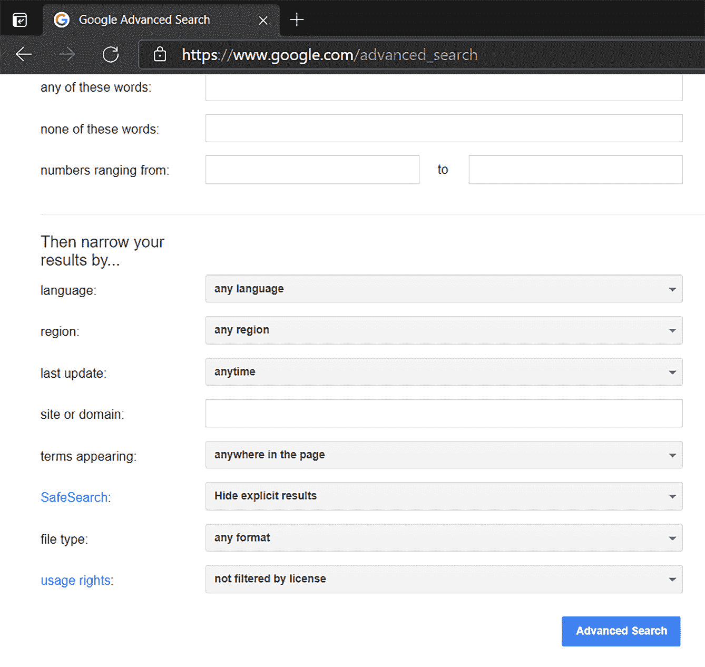

图 1.11 – Google 高级搜索窗口

对于某些高级搜索功能，这与直接将操作符放入搜索框中的效果相同。然而，缩小结果范围到特定的*日期范围*最好从结果页面进行。首先，输入你的搜索查询，然后点击**工具**，接着点击**任何时间**下拉菜单选择自定义范围，如下所示：

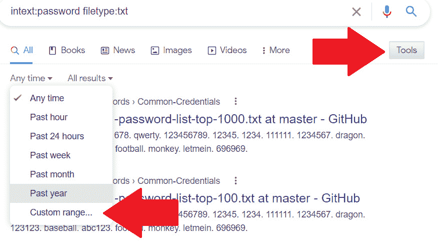

图 1.12 – 自定义我的结果日期范围

我记得当时需要使用`daterange:`操作符和朱利安日期。换句话说，2020 年圣诞节是朱利安日`2,459,209`。相信我，使用图形日历要省心得多。

## 像黑客一样思考

我曾有很多金融机构作为渗透测试客户。它们的业务性质涉及大量文书工作，因此保持一切井井有条尤其棘手。我们来看看一个可能的 Google 黑客任务，这次是挖掘金融信息。当然，为了满足你的需求，你会使用客户的名字或员工的名字来配合你精确调整的搜索词。

首先，我尝试以下方法：

```
intitle:"index of" "Parent Directory" ".pdf" "statement"
```

让我们拆解一下。通过搜索包含`Parent Directory`的`index of`页面，我将能找到通过`HTTP**/**S`托管的暴露文件目录。我还在寻找任何包含`.pdf`的文本，这样就能捕捉到托管`PDF`文件的目录。最后，我希望有人会在文件名中加入`statement`。如你所料，我们可能会抓到一些误报。但你也可能会发现像这样的东西，我相当确定这*并不是*打算公开在互联网上的：


图 1.13– 搜索公共目录的结果

看起来有人要去旅行了！这个文件名中没有`statement`，但旁边的文件有。当我在这些页面上点击**父目录**时，我会被带到该域名的主页或`404`页面，这强烈表明这些暴露的目录是意外泄露的。在你的工作中，没有什么比虚假的安全感更能帮你了。在你甚至还没有开始使用 Kali 工具包之前，找到一个员工的护照、税单之类的东西，对客户管理层来说是一个强有力的信息。

网上有很多资源可以帮助你进行巧妙的 Google 搜索。`Exploit Database`（[exploit-db.com](https://exploit-db.com)）上的`Google Hacking Database`是一个极好的查阅地方。我不会重复所有你可以尝试的不同搜索。这里的关键教训是，利用你掌握的任何客户信息，尽量思考这些资源是如何在互联网上展示自己的。例如，我曾有一个客户，我的初步研究表明他们有一个**远程桌面**门户。用这个搜索该客户的域名很有帮助：

```
inurl:RDWeb/Pages/en-US/login.aspx
```

我是怎么想到这个的呢？很简单：我研究了这些设备是如何工作的。找到一个，用浏览器与它交流，并使用客户的信息构建 Google 查询。你有没有考虑过客户的 IT 支持？我们偶尔都需要请求帮助。也许你客户的 IT 员工曾在线寻求过支持。*嗯，我不确定*，一位乐于助人的同伴回复道，*你能上传设备的包转储吗？* 接下来的事情你就知道了，客户内部的敏感信息已经被泄露到网上。我见过许多次这样的情况，甚至比我愿意承认的还多。只要寻找这些社区，尝试将 URL 的部分内容与 `inurl` 结合起来。举个例子，如果你看到客户的名字出现在以下内容中，那么你就能初步判断他们可能使用的安全软件：

```
inurl:"broadcom.com/enterprisesoftware/communities" 
```

对于像 OSINT 这样天生有成功与失败不确定性的技能，*跳出框框*的思维方式是非常重要的。假设你已经尝试了所有能想到的 Google 技巧，寻找不同的供应商和 URL 字符串，但依然没有找到结果。那么，你了解那里工作的人员吗？我曾经有一个客户，她的 IT 管理员在个人邮箱地址中有一个独特的名字。

不久后，我将此与她以前在 Yahoo! 上使用的另一个用户名关联了起来。我用这个用户名尝试了各种搜索组合，结果“砰”的一声——一个针对企业环境中高度特定操作系统的管理员论坛上，出现了一个用户名与她相同的帖子。她足够小心，没有提到她的雇主，这也是为什么之前的常规搜索没有找到我想要的信息。但我还是通过推理连接了线索，确定她确实是在讨论我客户网络中这些主机的配置，后来我甚至能通过这些公开帖子中的信息与独立的发现进行关联。让我找到这些信息的关键，就是她在匿名讨论 IT 工作时使用了一个旧的 `Yahoo!** **Messenger` 名称。毫无疑问，她对我找到这个感到有些吃惊。在另一次任务中，我从另一个角度开始了搜索——我已经进入了网络并且获得了域控制器的控制。我开始抓取密码哈希，这本身就是一个巨大的发现，对我的报告非常有价值。然而，我想知道如果我将这些哈希值输入 Google 会发生什么。果然，我发现了一个黑客分享战利品的网站，我的客户被攻破了。这是一个额外的信息，有助于增强报告，并帮助他们开始调查这种未经授权的访问是如何发生的。

这里有个想法！

想一想人们是如何创建密码的，生成一些与你猜测相对应的哈希值，然后在谷歌上搜索这些哈希值。通常（也希望如此），你不会找到什么结果。最常见的密码，如`12345`和`iloveyou`，已经在外面被曝光了，所以要像一个为你的客户工作并住在附近的人那样思考。例如，我在与俄亥俄州的公司合作时了解到的一件事是，俄亥俄州人*热爱*大学橄榄球。嘿，大多数中西部人都喜欢。我在生成基于`Buckeyes`这个词的哈希值时，竟然得到了一个令人不安的正面结果。

嘿，订单做好了。拿上你的咖啡和贝果，离开自取餐区，去办公室——我们通过谷歌和智能手机完成了相当多的侦察工作，但现在是时候坐下来，掌握 Kali 的控制权，看看`Offensive Security`团队是如何将它的工具集带入这个十年的。

# 深入了解 Kali 中的 OSINT

最后，我们终于来到桌前。Kali Linux 已经在我们玩搜索引擎时耐心等待，现在是时候开始认真工作了。在我们继续使用 Kali 进行 OSINT 之旅时，理解基础知识是很有帮助的。例如，你可能注意到，在玩 Shodan 时，发现有一个 API 可用。你可能还会想，*这很酷，但我们能不能自动化操作？* 或许，在你玩 Google 搜索时，曾被带有*suspicious traffic*警告的验证码阻止过。确实，Google 知道他们的搜索引擎可能会被用于不正当的目的，而一些旧版 Google 黑客教材中讨论的方法甚至现在已经不起作用（例如，在搜索`4,147,000,000,000,000`到`4,147,999,999,999,999`范围内的数字时，你会得不到任何结果，因为那可能会捕捉到`Visa`卡的泄露信息）。好吧，这是一本 Kali 书籍，而且你有一个完整的 OSINT 工具包。让我们开始工作，把这些开源工具提升到下一个层次。

## OSINT 分析工具文件夹

有一个简单的原因，为什么 Kali Linux 是首屈一指的渗透测试发行版：它让一切变得如此简单。所有内容都井然有序，只需右键点击桌面，即可按不同的评估阶段排列。这就像是从婴儿手中夺糖果一样简单。关于 Kali 2021.1 还要提到的一点是，它注重外观的时尚感。如果《黑客帝国》中的 Neo，穿着标志性的风衣和黑色眼镜，是一个操作系统，那么它可能就会有这些外观设置。它看起来很炫，但对于给你打印示例，亲爱的读者，它并没有做太多事情。更不用说，启用透明度的黑色背景上的深蓝色，让我们看到那张透过终端窗口的蓝黑色龙形壁纸了？你好，眼科医生。所以，我已经调整了我的设置，让它在本书中更易于观看。在终端中，我选择了黑底白字并设置为 0% 透明度。你不必更改你的设置——只需要知道它是 Kali 2021.1，并且它应该表现一样。

话不多说，让我们右键点击桌面，找到 **OSINT 分析**，它是 **01 – 信息收集** 下的一个文件夹，如下图所示：

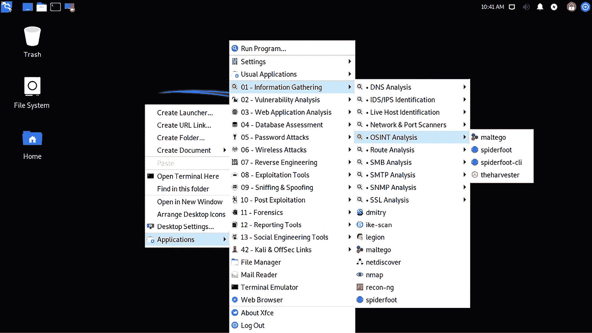

图 1.14 – 在 Kali 桌面上右键点击菜单

首先，让我们澄清一个区别，使得 **OSINT 分析** 成为 **信息收集** 的一个子文件夹。回到章节开头，我们讨论了被动与主动信息收集的区别。看看 **01 – 信息收集** 下的其他子文件夹：**实时主机识别**、**网络和端口扫描仪**、各种协议分析文件夹等等。向目标网络发送成千上万的 `SYN` 数据包，绝对不是一个安静的被动过程，更重要的是，这也不是开源分析，因为 *你* 正在实时进行分析——你并没有依赖开源数据源。从目标的角度来看，信息收集阶段就像是听到灌木丛中的沙沙声。**OSINT 分析** 工具集不会发出任何你的客户可以听到的噪音。

请记住，虽然 Kali 中的大多数工具不在 **01 – 信息收集** 下，但这并不意味着它们都是嘈杂的，只能在参与的主动阶段使用。一个值得注意的例子是无线分析：所有的 Wi-Fi 工具都包含在 **06 – 无线攻击** 下，实际上，这些工具可以用于主动攻击。然而，我们并不被限制只能用它们来进行攻击，我们完全可以仅仅监听我们周围的无线电信号（或者像老式的美国公民波段无线电用户说的那样，*把耳朵竖起来*），这就可以算作是被动侦察。但关于低层次网络信息收集的内容就讲到这里。让我们看看真正的 OSINT 魔术师吧。

## 转变你的视角 – Maltego

OSINT 不仅仅是为渗透测试人员准备的——它是许多项目的重要组成部分，范围包括市场调研、私人调查和刑事调查。因此，一些聪明的人意识到，提供一个自动化、直观且美观的界面来进行这一活动，是一个有需求的产品。于是，`Maltego`应运而生。

我记得 Maltego 曾经是一个比较低调的工具，但如今，它已经成为一款成熟的专业产品。的确，如果你有足够的资金，并且它是你工作的一部分，那么它是值得投资的。幸运的是，Maltego 为其忠实用户群体提供了社区版（`Maltego** `CE**）。Maltego CE 是完全免费的，但有一些功能限制，并且软件许可要求它不能用于商业目的。在本书中，我们将重点介绍免费的社区版，因为它对任何 Kali 用户都可以立即使用——但如果你是（或计划成为）一名具有商业需求的专业渗透测试人员，请确保你审阅并遵守任何软件许可协议。话虽如此，接下来我们将进入**01 – 信息收集** | **OSINT 分析**，并点击`maltego`。你应该会看到以下启动画面：

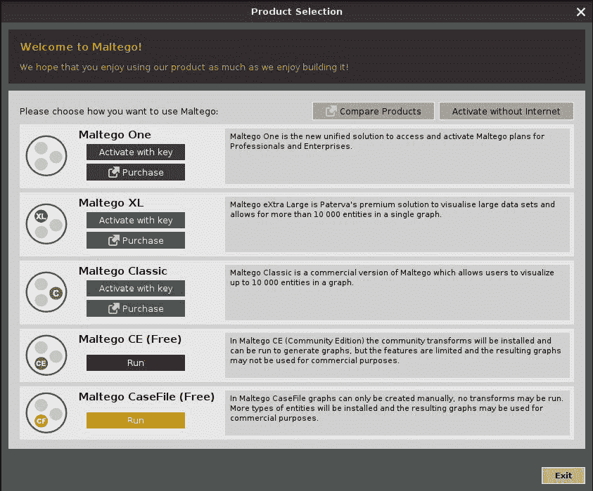

图 1.15 – Maltego 启动画面

当然，我们要点击**运行**按钮，在**Maltego CE（免费版）**下进行操作。然后，你将有机会阅读并同意许可协议，并注册你的社区账户。在此过程中，你会看到“**转换**”一词：产品正在下载和安装转换，最后你会进入转换中心。转换是 Maltego 的核心，所以让我们探索一下它们是什么以及如何利用它们。

## 实体、转换和图表，哇哦

简单来说，*转换*是一个小程序，它接收我们已经掌握的一些目标信息（例如，一个人的名字），并挖掘更多信息。每一条信息都是一个*实体*，当我们将实体信息提供给 Maltego 并且它输出更多的实体时，这个过程叫做*运行转换*。这个过程最终帮助我们可视化实体之间的关系。需要记住的是，这个转换程序实际上并不运行在你本地的机器上（因此需要注册账户）。它运行在 Maltego 的服务器上，服务器使用转换代码和你提供的实体数据对开放源数据进行处理。最后，你将在*图表*画布上绘制你的 OSINT 杰作，这是一个可以可视化实体之间关系的工作空间，你可以通过点击操作来运行额外的转换。让我们开始吧。

一旦你开始使用，你应该会看到一个带有**首页**选项卡、**开始页面**和**转换中心**按钮的界面，如下所示：

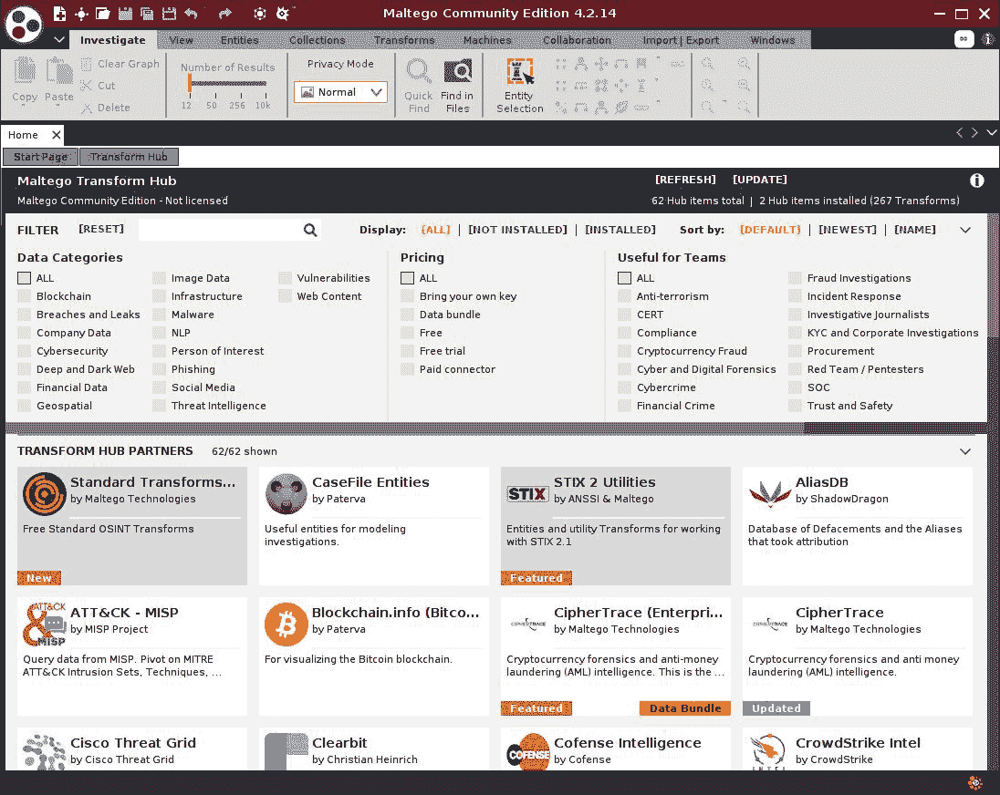

图 1.16 – 相当繁忙的主页标签

你的安装包已经包含了基础工具，但其他组织或个人通常也会开发自己的转换工具，并可能提供给你。值得检查一下你能获取哪些工具。使用顶部的`FILTER`框来选择所有**数据类别**，然后在**定价**下选择**免费**。最后，点击顶部的**[未安装]**。让我们看看有什么出现：

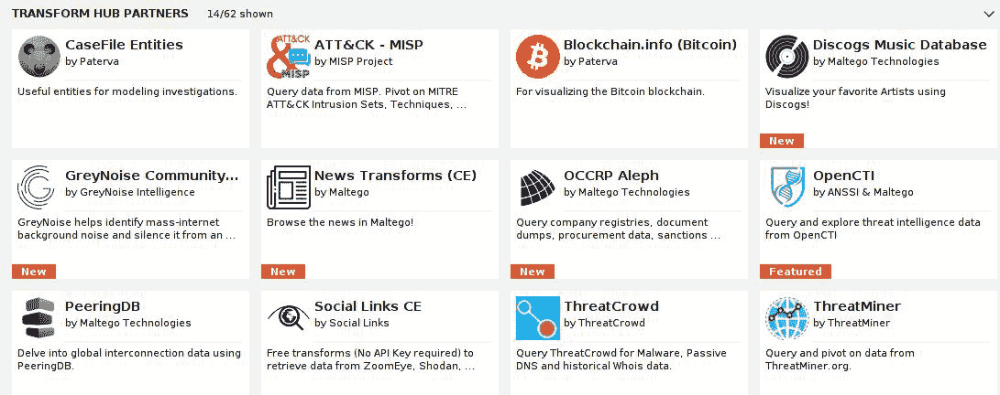

图 1.17 – Maltego 中的 Transform Hub 合作伙伴

你选择的内容将取决于你的需求。特别关注像`Social Links CE`这样的社交工程工具，`OCCRP Aleph`用于信息收集，以及**ATT&CK – MISP**用于分析目标的攻击面。目前，让我们通过一个实际客户演示基本操作。按*Ctrl* + *T*创建一个新图表。此时会出现一个空白工作区，你的图表将在其中构建。查看左侧的**实体调色板**，如下所示：

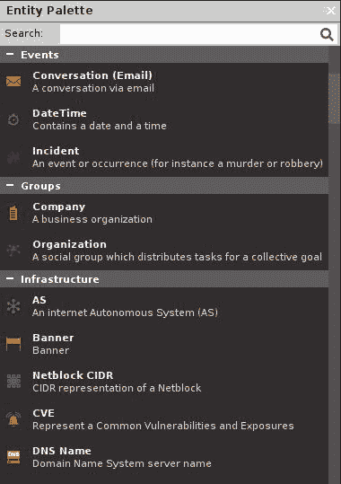

图 1.18 – Maltego 中的实体调色板

继续浏览不同的实体。我们可以看到 Maltego 是如何强大地支持不同类型的调查（有人想挖掘一起抢劫案的信息吗？），而其中一些你可能永远不会使用。对于渗透测试者来说，一个非常常见的实体类别是**基础设施**。作为我的示例，我将点击并拖动**域**到空白图表空间中。这将创建一个带有域名的实体图标。每当你在图表中创建实体时，它会自动生成一个默认条目（不会提示你）。所以，你可以双击默认文本并输入你正在研究的域名。现在，右击你的领域实体，查看可用的转换工具，如下所示：

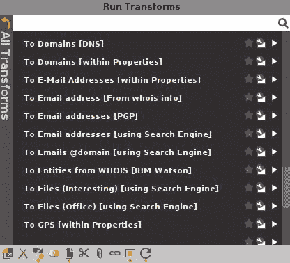

图 1.19 – 运行转换菜单

在列表的顶部，你会看到由 Maltego 的转换合作伙伴（其他组织）构建的转换工具。其中一些需要账户或 API 密钥才能运行，而有些是免费的。正如往常一样，你的需求决定了深度。

让我们从我的示例领域实体开始探索。我尝试了**To DNS Name – MX（邮件服务器）**。以下是我的结果：

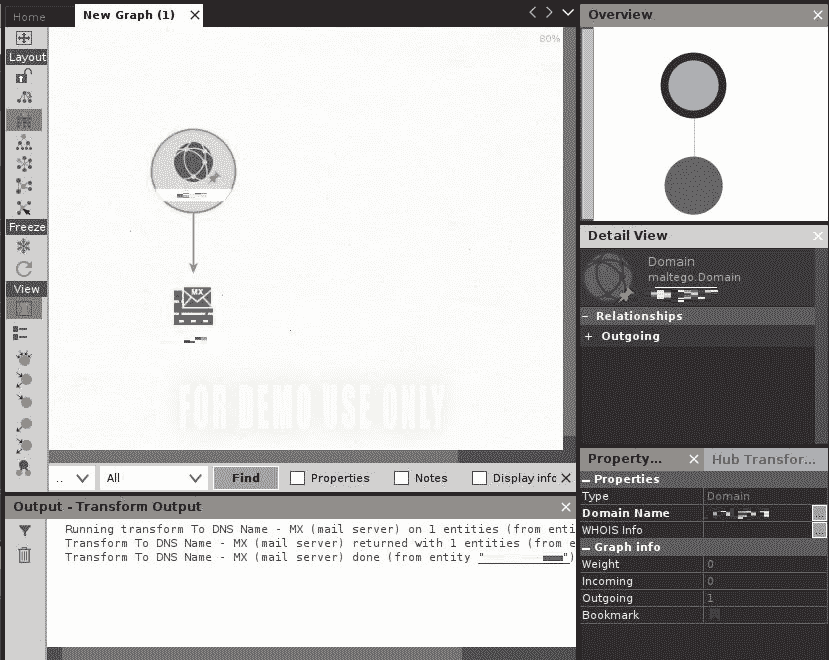

图 1.20 – 运行 MX 转换后的图表

现在，我们看到一个新的实体出现了——一个 MX 服务器。从我们原来的领域实体画出了一条箭头，表示两者之间的*关系*。我相信你已经有了下一步该做什么的想法：没错，再运行一些转换！点击你提供的领域实体。然后，在左下角查看**运行视图**菜单。试试运行一个**足迹**转换，如下所示：

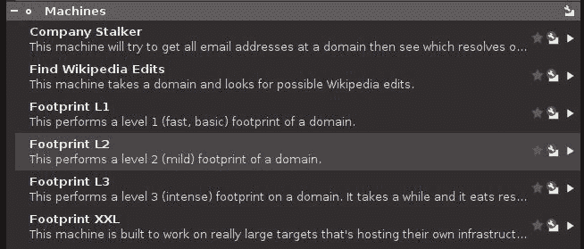

图 1.21 – 选择域名实体后找到 Footprint 转换

Maltego 会开始为你做一些基本的挖掘工作。Footprint 转换的一个优点是，在它运行时，你可以验证一些返回的数据，如下所示：

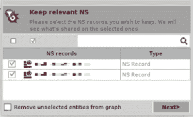

图 1.22 – 选择和挑选相关实体

现在，看看这些新的有趣实体是如何出现的。在我这里展示的测试中，我发现了电子邮件地址、IP 地址、网段和 ASN。我甚至找到了一个卫星天线的位置，它负责他们的一个远程位置——那个位置让我很惊讶。

在这一点上，我甚至不需要告诉你接下来该做什么——你刚刚发现了为你的客户开启了一条漫长且风景如画的探索之路。试着跳进那些其他的转换工具。这里的重要教训，年轻的黑客们，是发现关于目标的视角，这些视角将有助于其他工作的开展。让我们以**社会工程学**（**SE**）为例。在运行了几个转换工具并稍微调整了我的图表布局后，我发现这家公司的技术邮件地址与多个域名相关联，其中包括我当时刚刚了解到的一些域名：

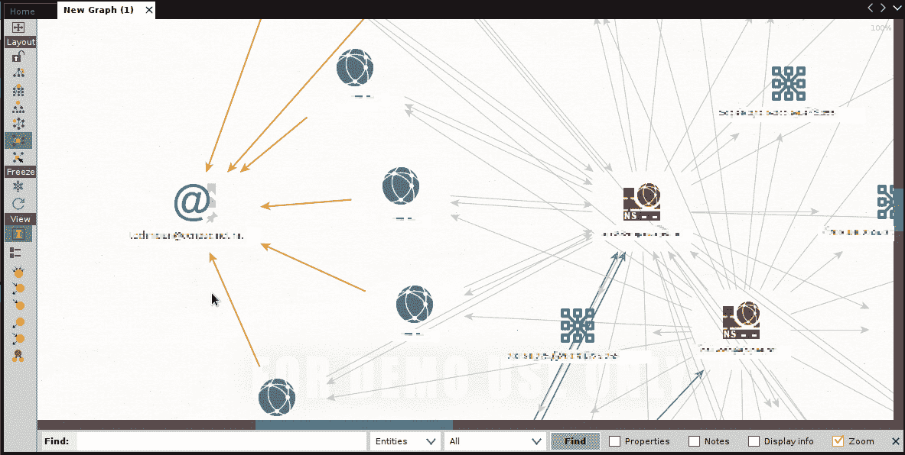

图 1.23 – 展示不同实体类型及其关系

想象一下，我可以利用这个地址进行哪些 SE 攻击，利用目标可能甚至未意识到与这些实体关联的知识，如 Maltego 所展示的那样。考虑一下我之前提到的那颗卫星天线——我甚至找到了一个与拥有该卫星天线的公司相关的**联邦通信委员会**（**FCC**）文件。FCC 文件是一个公共通知，因此可以在互联网上轻松找到——但它并不包含关于我的客户的任何信息！它是通过 Maltego 发现的一个 ASN 与我的客户*相关联*。我们为什么要关心这个？再次强调，社会工程学。一封格式完美的电子邮件或一次恰到好处的电话（顺便说一下，我通过 Maltego 找到了几十个电话号码），假装自己与提供卫星通信的公司有关系？说不定根本不会成功。无论如何——重要的是*头脑风暴*，而 Maltego 能够激发你的想象力。

## 使用 Spiderfoot 进行的 OSINT

*当然，总得有某种开源替代方案，不必手动在互联网上乱碰吧*，你会想。*Maltego 很酷，但对我的需求来说有点过于复杂*，你会感叹。别担心，因为我把最好的留到了最后：我个人的首选工具，`Spiderfoot`。你们中的一些人可能已经点击了它，毕竟它就在**OSINT 分析**菜单里。所做的只是执行`spiderfoot --help`，你可以在命令窗口中查看选项。我想这是 Kali 提醒我们 Spiderfoot 确实在那里的方式。从这里，你甚至可能执行了`spiderfoot --M`，这样你就能查看可用的模块，并开始构建第一个命令。我现在就要打住——这个工具的真正亮点是它的网页界面。只需运行这个命令：`spiderfoot --l 127.0.0.1:5009`。然后，拿出一个网页浏览器，访问`http://127.0.0.1:5009`。你也可以像我这样通过网络托管它：

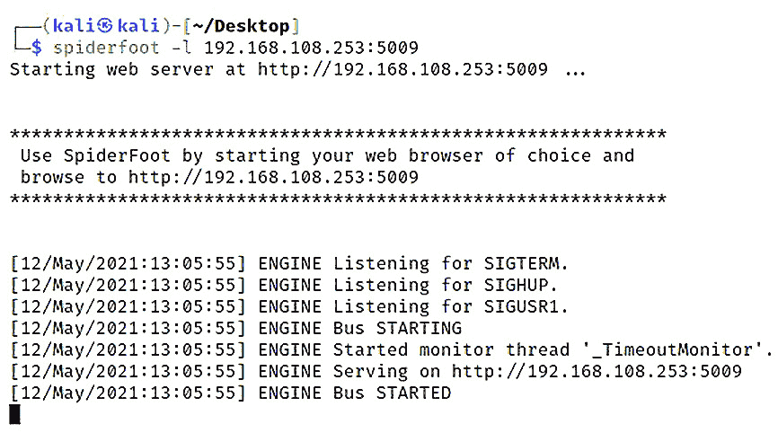

图 1.24 – 启动 Spiderfoot 监听器

注

请注意，访问没有经过认证——请自行承担在私人网络上运行的风险。

一旦进入网页界面，点击**新建扫描**。你将看到三个标签，允许你定义扫描的工作方式：**按使用案例**、**按所需数据**和**按模块**。**按模块**标签适用于你自定义的模块，或者当你需要微调 Spiderfoot 的行为时，而**按所需数据**基本上像是模块列表，只不过更加描述性。我的标准选择是其中一个*使用案例*。注意它如何区分**被动**选项——非常适合消除关于目标是否被接触的猜测。对于我的评估，我正在进行一个快速足迹扫描：

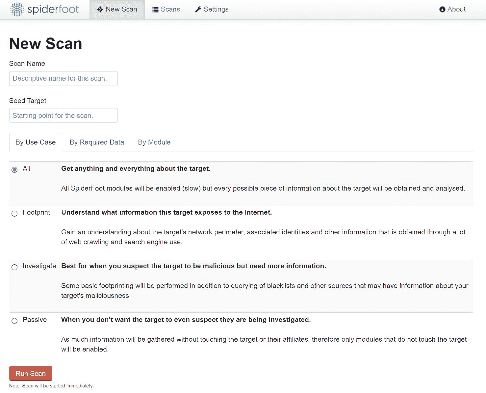

图 1.25 – Spiderfoot 使用案例

只需点击**运行扫描**，然后坐下来放松。这是喝咖啡的好时机。你还可以实时观看扫描的进度。单个数据点被称为*元素*，如果你愿意，可以在扫描过程中查看它们。我更喜欢让它完全运行，这样可以建立元素之间的任何关系。**状态**屏幕将根据发现它们的模块类型对元素进行分类，如下所示：

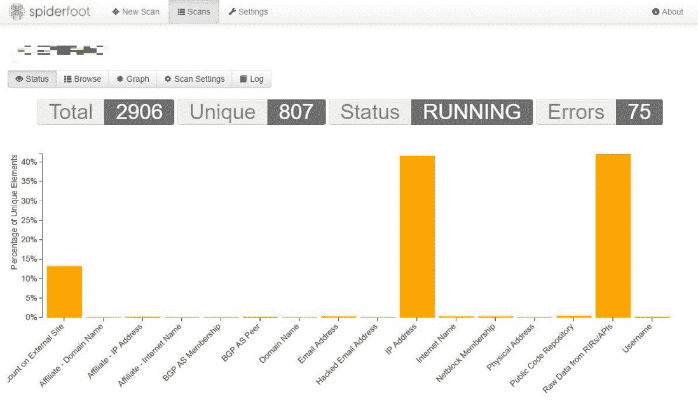

图 1.26 – Spiderfoot 扫描过程中的状态图

最后，对于我们所有人内心的视觉极客，那里还有一个图形布局。每个显示的元素都可以拖动，因此稍加工作，你就可以创建自己的布局，以突出元素之间的关系。然而，对于那些较大的客户，它看起来可能有点乱：

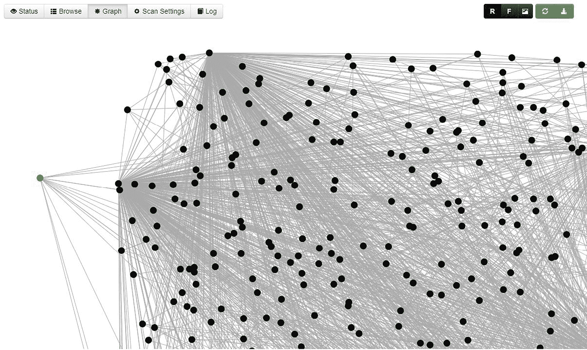

图 1.27 – Spiderfoot 的关系网络

OSINT 数据点及其关系的可视化表示绝对是 Maltego 擅长的方面。不过，Spiderfoot 快速且易于使用，因此它可能非常适合用来启动你的情报收集工作。

# 总结

在本章中，我们进入了一个既有趣又令人不安的**开放源信息**（OSINT）世界。我们从仅仅使用我们的网页浏览器开始了旅程：查看目标网站，发送奇怪的请求，看看是否能触发一些有趣的响应来揭示信息，并查看社交媒体和其他公开资源。我们回顾了一些在互联网上扫描并收集这些信息的服务，看看我们是否能在枚举阶段提前有所准备，寻找如不安全的`SSL**/**TLS`、开放端口，以及一般暴露在网络上的任何内容，这些内容通常需要花费一些时间和探索才能自行发现。我们还看看了如果我们愿意跳出框框，Google 能为我们找到什么，最后，我们打开了 Kali 的副本，看看我们可以使用哪些自动化工具来应用这些原则。当然，这只是任何评估阶段可能非常复杂且令人惊讶地有效的表面，但我们已经开始训练大脑，以一种不同的方式看待客户可能认为理所当然的事物。我们已经踏入了客户信息的水域——接下来，让我们更深入一点。在下一章中，我们将开始探测网络，并感受一下内部人员的视角。

# 问题

请回答以下问题，测试你对本章内容的理解：

1.  “被动侦察”和“OSINT”之间有什么区别（如果有的话）？

1.  评估漏洞风险时，两个主要的考虑因素是什么？

1.  在 Maltego 中，接受一个实体作为输入并输出更多相关实体的程序叫做 ______。

1.  这条格言表明我们应该始终假设敌人了解系统，这叫做 ______。

1.  横幅抓取从不被视为渗透测试报告中的发现。（对 | 错）
