# 第二章：绕过网络访问控制

网络是我们想象计算机被黑客攻击时首先考虑的部分。它是渗透测试人员的游乐场。它既是入侵计算机的第一步，也是最终的边界。它还使得单一计算机的妥协实际上成为整栋大楼内所有计算机的妥协。因此，我们继续我们的旅程，讨论如何妥协网络，并利用其自身的力量和弱点来指导渗透测试。

第一步是连接到网络，存在一些人类、架构和协议因素，使得攻击者在网络上的存在可能造成灾难性后果。因此，防御者通常会部署**网络访问控制**（**NAC**）系统。这些系统的目的是通过识别和认证网络上的设备来检测和/或防止网络入侵。在本章中，我们将回顾 NAC 系统采用的一些方法，并演示绕过这些控制的实用方法。

本章将涵盖以下主题：

+   通过物理访问绕过 NAC 并克隆授权设备

+   强制门户方法及其弱点

+   新设备的政策检查

+   伪装授权设备的堆栈

# 技术要求

在继续本章内容之前，以下是必备条件：

+   在笔记本电脑上安装 Kali Linux

+   支持 Kali 中混杂模式的 USB 无线网络接口卡——我推荐使用 Alfa 卡

# 绕过媒体访问控制过滤——物理评估者的考虑事项

攻击者需要了解远程攻击的方法：攻击 VPN、使用高增益天线从远距离进行无线渗透等。然而，渗透测试人员永远不能忘记大局。在这个领域中，很容易陷入极其具体的技术细节，忽视安全设计中的人为因素。

渗透测试人员喜欢称之为 *糖果棒模型* 的设计缺陷概念。这指的是一种网络，它的外部坚硬且具有防护性，但内部却软弱且易受攻击。换句话说，它是一种在设计安全架构时强调外部威胁的模型，同时假设公司设施内的人员已经经过验证，因此是值得信任的。这个思维方式可以追溯到许多年前；在互联网初期，网络的物理接入点位于高度安全的设施内部。通过网络传入的数据包通常被安全地假定来自一个安全的环境，并由授权个人发送。在今天的世界里，进入公司网络边界的数据包可能来自正在出差的授权人员，也可能来自地球另一端的聪明少年，迫不及待地想尝试一些新学到的技巧。

糖果棒模型将在后面的章节中讨论其他网络攻击时出现。一旦你破解了外壳，你经常会发现前进的道路似乎特别为你铺设 - 一个成功的妥协将告诉你的客户这种错误假设的毁灭性后果。在成功妥协后，随时可以奖励自己一个真正的糖果棒 - 你值得拥有。

如何社会工程你的目标是另一本书的主题，但在这次讨论中，让我们假设你有网络插座的物理访问权限。然而，并非所有的物理访问都是相同的；如果你说服你的目标雇佣你作为全职员工，那么你将拥有持续的物理访问权限。他们甚至会给你一台电脑。然而，更有可能的是你已经利用了他们物理安全立场的一个小漏洞，你的存在可能不会被察觉或者只能被容忍很短的时间。你通过吸引一名毫不知情的员工的谈话后从吸烟者门潜入，或者你已经得到了穿着看起来像承包商制服和夹板的许可，或者（我个人最喜欢的）通过带来一大箱甜甜圈赢得了信任和喜爱，这些人期待着根据一个精心策划的电话来访的审计员。 （我的客户，在测试后仍然震惊，会问甜甜圈是真的吗。）现在，我们将演示如何设置一个 Kali 盒子，将其设置为一个伪造的无线访问点，同时冒充一个**媒体访问控制**（**MAC**）地址的**互联网电话**（**VoIP**）电话。

## 配置 Kali 无线访问点以绕过 MAC 过滤

你找到了一个空置的小隔间，里面有一张空桌子和一个普通的 IP 电话。电话已经插上并且在工作，所以你知道网络插座是激活的。我们将把运行 Kali 的小型笔记本放在这里，然后从外部继续攻击。

首先，我们拔掉 IP 电话，这样我们的坏家伙就可以占用端口。然后我们将在我们的 Kali 盒子的以太网端口上克隆 IP 电话的 MAC 地址。从 NAC 的简单 MAC 地址白名单方法的角度来看，这将看起来像电话仅仅重新启动了。

我使用`ifconfig`来启动接口配置。在我的例子中，我的以太网端口接口被称为`eth0`，我的无线接口被称为`wlan0`。我会记下这一点，因为我需要配置系统在`wlan0`上运行一个带有**动态主机配置协议**（**DHCP**）和**域名系统**（**DNS**）的访问点，同时通过我的`eth0`接口运行**网络地址转换**（**NAT**）。我可以使用`ifconfig eth0 hw ether`来更改`eth0`接口的物理地址。我已经偷偷看了一眼 IP 电话背面的标签 - MAC 地址是`AC:A0:16:23:D8:1A`。

因此，我先将接口关闭进行更改，然后重新启动接口，最后再次运行 `ifconfig` 确认接口状态是否已更新为新的物理地址，如 *图 2.1* 所示：

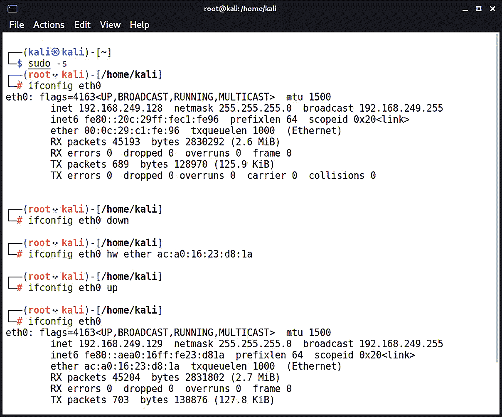

图 2.1 – 使用新的 MAC 地址启动接口

别忘了使用 Sudo！

在 Kali 中，作为 `root` 用户运行程序的话题一直存在争议。Linux 使用的基本规则之一是你不应该以 `root` 身份登录；如果需要 `root` 权限，请使用 `sudo` 命令。Kali Linux 以前有所不同，默认要求以 `root` 身份登录。Kali 设计的初衷是只用于渗透测试，而不是作为个人机器（当然也不是生产服务器）。因此，在本书的第一版中，我们从未使用过 `sudo`，因为我们始终是以 `root` 用户身份登录的。这一次，我将切换到一个 `root` 会话，使用 `sudo -s` 命令。Offensive Security 的团队保持了他们的幽默感，你会看到一个骷髅图标提醒你拥有超级权限。

Kali 仓库中有两个非常实用的工具：`dnsmasq` 和 `hostapd`：

+   `dnsmasq` 是一款轻量级的网络基础设施工具。它是完全免费的，并且用 C 语言编写，是一款便捷的工具，能够快速搭建临时网络，包括 DHCP 和 DNS 转发。在我们的示例中，我们将其用作无线客户端连接到接入点时的 DHCP 和 DNS 服务（当然，这里的无线客户端就是你和你的同事）。

+   `hostapd`（**host access point daemon**）顾名思义，是一款接入点软件，可以将普通的无线网络接口变成接入点，甚至可以作为认证服务器。你可以使用以下命令来确认你使用的无线网卡是否支持 AP 模式：

    `# iw list |grep "Supported interface modes" -A 8`

如果你在结果中看到 `AP`，那么就可以继续了。我们使用 `apt-get install hostapd dnsmasq` 来安装这些工具。

如果你遇到 `apt-get` 问题（例如 **找不到软件包**），请首先检查你的仓库 `sources.list` 文件。不要随意向 `sources.list` 文件添加源；这样做可能会破坏你的 Kali 安装。在我使用的 Kali 2021.1 中，我必须先运行 `apt-get update`。通常只需要执行一次此命令。

回到我们的 AP 冒险。首先，让我们配置 `dnsmasq`。使用 `nano` 命令打开 `/etc/dnsmasq.conf` 文件。然后，输入以下内容：

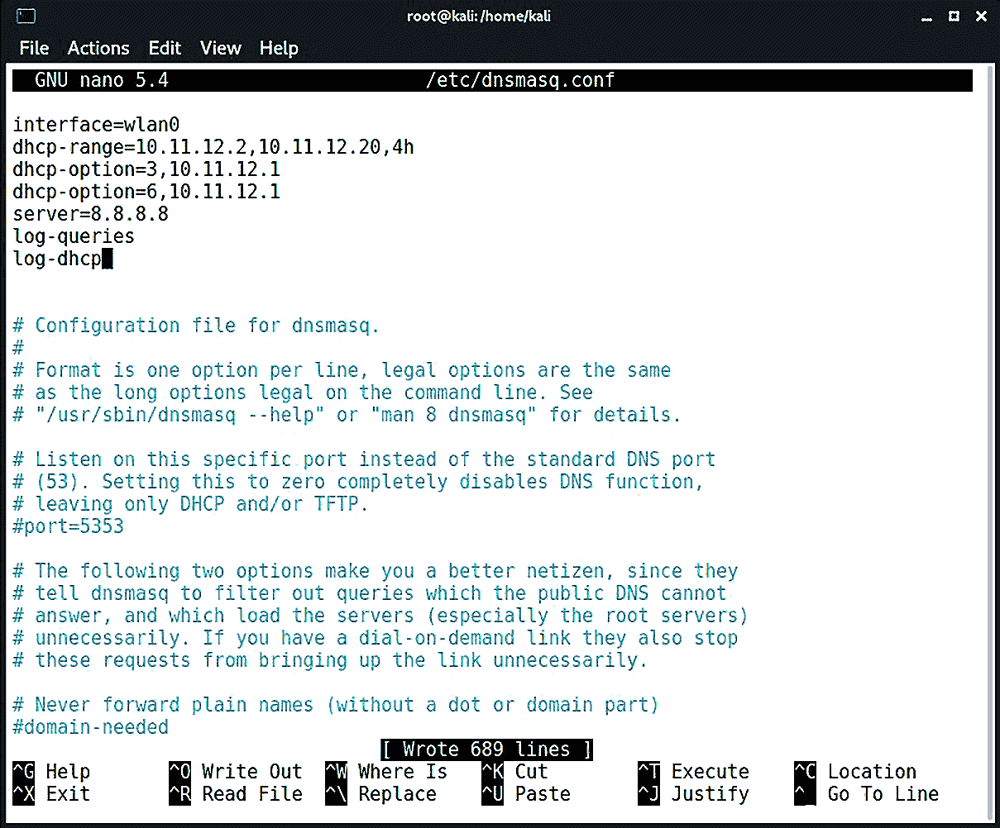

图 2.2 – dnsmasq 配置文件

你可以看到配置文件中的所有内容都已经注释了出来；我强烈建议你坐下来阅读`readme`文件，以理解该工具的全部功能，特别是为了让你根据实际需要进行精细调校。由于这是一个动手示范，我会保持简单：

+   `interface=wlan0`：我将接口设置为`wlan0`，这是 USB 无线网卡所在的位置，该网卡将作为接入点。

+   `dhcp-range=10.11.12.2,10.11.12.20,4h`：我设置了 DHCP 范围，在新客户端请求分配 IP 地址时，将从该范围分配地址。格式是**[底部地址]，[顶部地址]，[租用时间]**。这里的地址范围将分配给新客户端，因此请确保不要与网关地址重叠。你就是网关！

+   `dhcp-option=3,10.11.12.1` 和 `dhcp-option=6,10.11.12.1`：DHCP 选项的指定。这不是随意的——这些数字在 RFC 2132 和后续的 RFC 中有明确规定，因此它具有很大的功能。就我们的目的而言，我通过选项`3`设置网关，通过选项`6`设置 DNS。在这种情况下，它们是相同的地址，因为我们预计在这样的局域网中会是这样的。注意这个地址：`10.11.12.1`。这就是网关，按照定义，它将是你的`wlan0`接口。在启动接入点之前，你将定义这个地址，当你启动无线接口时。

+   `server=8.8.8.8`：我定义了上游 DNS 服务器；我将其设置为 Google 的 `8.8.8.8`，但你可以使用其他服务器。

+   `log-queries` 和 `log-dhcp`：我做了一些日志记录，以防我们需要它。

按下 *Ctrl* + *X* 并确认文件名以保存它。现在，我们将继续进行`hostapd`配置。使用`nano`命令打开 `/etc/hostapd/hostapd.conf` 文件。请记住，这个文件本来不存在，但`hostapd`会知道使用我们在这里创建的文件：

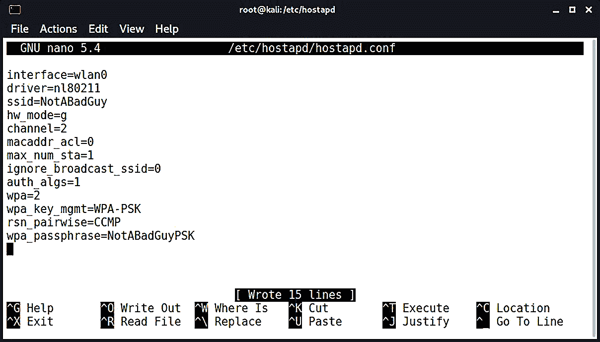

图 2.3 – 为 hostapd 配置接入点

再次提醒，这是一个功能强大的工具，因此请查看`readme`文件，以便你能充分理解它能做的一切。你可以使用这个软件创建一个相当复杂的接入点，但我们在这个示例中会保持简单：

+   `interface=wlan0`：我将接口设置为`wlan0`，当然。

+   `driver=nl80211`：我定义了无线驱动程序；这是`nl80211`，它是`cfg80211`和用户空间之间的接口，允许管理设备。

+   `ssid=NotABadGuy`：这是我们的服务集标识符——我们网络的名称。我使用`NotABadGuy`是因为我想向世界证明我真的是个好人，但当然，你可以根据自己的需要进行调整。在这里有一点社交工程潜力，可以减少那些随意扫描环境的人的怀疑。

+   `hw_mode=g`：这是 802.11 调制标准；`b`、`g` 和 `n` 是常见的标准。

+   `channel=2`：我在这里定义了频道，但你可以配置它根据调查自动选择频道。

+   `macaddr_acl=0`：这是一个布尔标志，告诉`hostapd`我们是否使用基于 MAC 的访问控制列表。你需要决定这是否是你所需的功能。在我的示例中，我已经配置了加密，而且我喜欢在我的设备上使用随机生成的 MAC 地址，所以我不想处理 MAC 地址的白名单问题。

+   `max_num_sta=1`：这是一种限制无线客户端数量的方法——这是允许加入的最大客户端数量。我在这里将其设置为`1`，因为我只期望我自己加入，但你可以省略这个选项。

+   `ignore_broadcast_ssid=0`：这个选项简单地让你隐藏网络。它的实际作用是让你的接入点忽略那些没有指定 SSID 的探测请求帧，因此它会将你的网络从主动扫描中隐藏，但你永远不应认为一个功能正常的接入点是完全隐藏的。我想在我的示例中看到它，所以我将其设置为`0`。

+   剩下的选项允许我配置 WPA2 加密。

信不信由你，这些就是我们快速搭建接入点以连接物理网络的基础。现在，我将启动`wlan0`接口，并指定我之前定义的网关地址。接着，我启动`dnsmasq`并告诉它使用我的配置文件。我们启用 IP 转发，告诉 Kali 作为路由器工作，并使用`sysctl`。我们通过`iptables`允许流量通过并启用 NAT 功能。最后，我们启动带有配置文件的`hostapd`。

我们将再次查看`iptables`，所以不用担心这里的细节。

当无线客户端连接到这个网络时，他们将通过`eth0`访问公司网络；对于 MAC 过滤器来说，来自该端口的流量看起来像是来自 Cisco IP 电话：

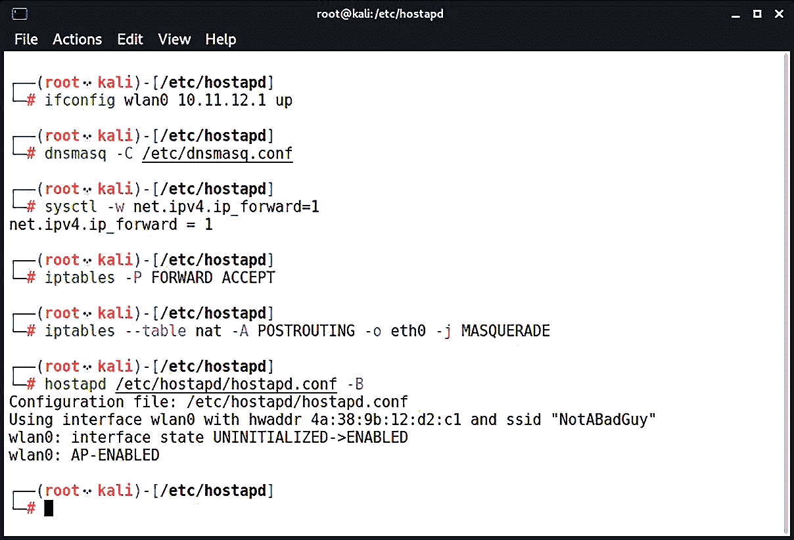

图 2.4 – 使用 iptables 配置路由以使我们的接入点工作

正如你无疑注意到的，这是一个非常有用的设置。让你的设备作为热点工作可以非常宝贵，而且由于 Kali 能够在如此广泛的硬件上运行，唯一的限制就是你的想象力。

# 设计缺陷 – 利用弱认证机制

在 NAC 中，认证是关键。在我们的第一个攻击场景中，我们看到网络通过 MAC 地址白名单验证设备是否被允许。原理很简单——当设备加入网络时，会检查允许设备的列表。许多人，甚至是行业外的人，都对 MAC 过滤有一定了解，这项技术常常在 SOHO 无线路由器中实施。然而，你可能会惊讶地发现，在高度安全的环境中，VoIP 电话伪装攻击是多么有效。

这是网络安全基础知识 – MAC 地址非常容易伪造，当你声称自己是某个特定的值时，网络会信任你。我曾经有客户详细描述他们先进的 NAC 的各种功能，然而当我向他们展示我通过伪装成会议室电话来访问他们的服务器环境时，他们都显得非常困惑。测试这种绕过方法非常重要；并不是所有客户都意识到这些简单的威胁。

现在我们将探讨一种能够在雷达下悄无声息地进行的攻击：利用初始受限网络中的认证通信。在本节中，我们将使用 Wireshark 进行快速且简便的数据包分析；关于 Wireshark 的更高级讨论将在*第三章*中进行，*嗅探与欺骗*。

## 捕获清晰的登录门户认证对话

说到即使是非安全领域的人也会有所了解的安全机制，*登录门户*（captive portals）是常见的网络访问控制（NAC）策略。当你在酒店或飞机上尝试连接网络时，你会遇到这种“墙”，无论你试图访问什么，都会被引导到一个专门配置的登录页面。你会从管理员那里获得凭据，或者提交支付–无论哪种方式，认证通过后，*登录门户*将通过某种方式授予访问权限（常见的一种方式是**简单网络管理协议**（**SNMP**）认证后管理）。

我知道你心中的黑客在说什么：*当未认证的客户端尝试发送 HTTP 请求时，它们会被 301 重定向到登录门户认证页面，所以这不过是一个本地托管的网页罢了。它可能会受到普通的网络攻击。* 干得好，我简直无法说得更好了。但别急着启动`sslstrip`；如果你知道未加密的认证其实相当普遍，你会感到惊讶吗？我们将来看一个例子：我家中为访客提供互联网访问的登录门户。这不是一种普通的家用路由器自带的登录门户功能；这是一台运行 pfSense 防火墙的专用服务器。

这在一些企业中得到了应用，所以相信我，作为渗透测试人员，你会在冒险过程中遇到类似的情况。我不认为你会在客户的登录门户中看到我的猫，但谁知道呢，还是不能太确定。

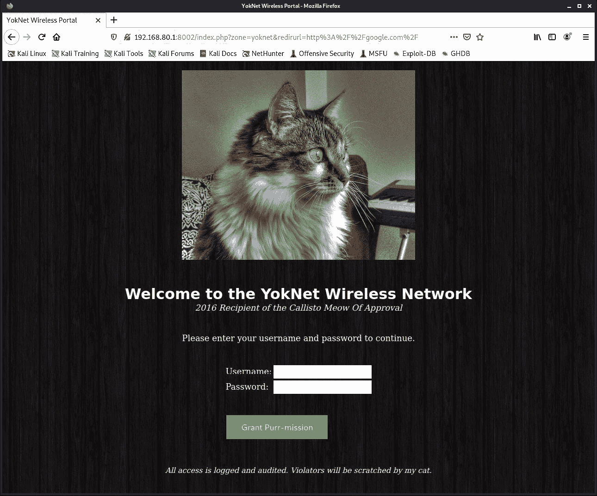

图 2.5 – 一台由 pfSense 驱动的登录门户，守卫着我的猫

这里我们看到的是用户加入网络后立即看到的登录门户。我想玩得开心一点，于是自己写了 HTML 代码（那个坏猫的双关语是我妻子的创意）。不过，它的功能和你在使用这种 NAC 方法的公司中看到的一模一样。

让我们坐进 Kali 的驾驶座。我们已经建立了与该网络的连接，并且立即被置于受限区。启动终端，并以超级用户身份启动 Wireshark：

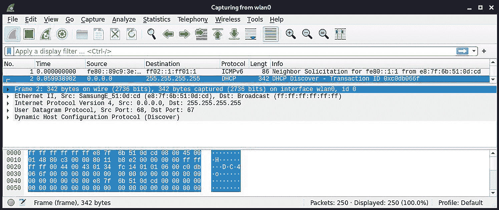

图 2.6 – 使用 Wireshark 捕获交换网络上的流量

即使我们的网卡处于混杂模式，这里也没有太多的活动。这看起来像是我们正在处理一个交换式网络，所以我们无法看到受害者与网关之间的广播流量。但仔细看看高亮的数据包：它正在广播到 `255.255.255.255` —— 零网络的广播地址（也就是我们所在的网络）。我们可以看到它是一个 DHCP 请求。因此，我们的受害者正在加入网络，IP 地址未知，稍后会认证到门户。虽然受害者并不是目标，但我们会在 DHCP Ack 数据包中找到 IP 地址分配：

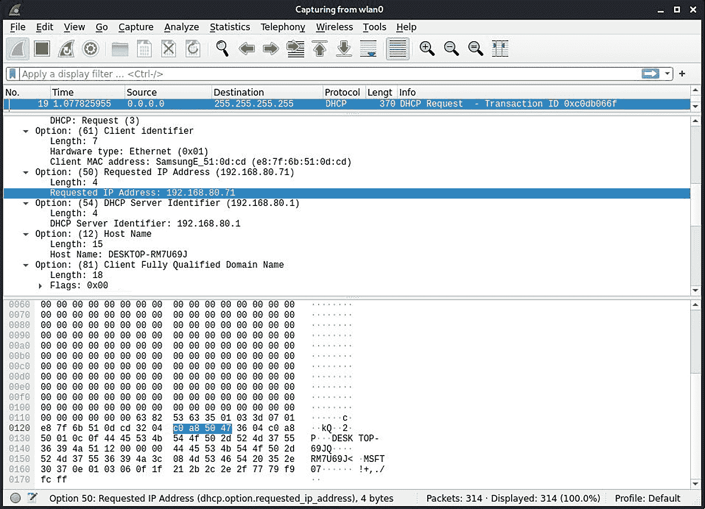

图 2.7 – 使用 Wireshark 检查 DHCP 数据包

Wireshark 很贴心地将十六进制转换为易于理解的 IP 地址：`192.168.80.71`。我们处在一个交换式局域网（LAN）中，所以受害者的 HTTP 认证直接发送到网关，对吧？是的，没错，但这里的关键词是 LAN。

## 针对网络的第二层攻击

网络协议栈的最低层是链路层，这是局域网段上相邻主机的领域。链路层通信协议不会通过路由器离开网络，因此在攻击 LAN 时，了解这些协议及其弱点非常重要。当你加入一个局域网，甚至是一个受限的局域网（不在受保护网络中），你与该段上任何其他设备共享这个空间：捕获门户主机本身、等待认证的其他客户端，甚至在某些情况下，与已认证的客户端共享。

`LAN` 这个未经限定的术语并不意味着 LAN 中的所有成员都处于同一个广播域，也叫做 **第二层段**。在这里，我们讨论的是共享相同链路层环境的主机，因为所描述的攻击在私有 VLAN 中不起作用。

当我们的受害者加入局域网时，DHCP 为其分配了一个 IP 地址。但是，任何发送到该 IP 地址的设备都必须知道与目标 IP 地址相关联的链路层硬件地址。这个链路层到网络层的映射是通过**地址解析协议**（**ARP**）完成的。ARP 消息告诉请求者某个 IP 地址被分配到*哪个*（即哪个链路层地址）设备上。网络中的客户端维护一个本地的 ARP 映射表。例如，在 Windows 上，你可以使用`arp -a`命令查看本地的 ARP 表。趣味开始于我们了解到，这些表是通过 ARP 消息更新的，而没有任何验证。如果你是 ARP 表，并且我告诉你网关的 IP 地址与`00:01:02:aa:ab:ac`的 MAC 地址映射，那么你会直接相信并做出更新。这为*中毒*ARP 表——向其中注入错误信息——提供了可能性。

我们要做的就是向网络注入错误的 ARP 信息，使得网关认为 Kali 攻击者的 MAC 地址被分配给了受害者的 IP 地址；同时，我们还告诉网络 Kali 攻击者的 MAC 地址被分配给了网关的 IP 地址。这样，受害者将把发送给网关的数据发送给我，网关则会把发送给受害者的数据发送给我。当然，这意味着从网关到受害者，或者从受害者到网关的通信都不会进行，因此我们需要启用数据包转发，以便 Kali 机器将数据转发到实际的目标。当数据包到达目标时，我们已经对其进行了处理和嗅探。

我们将在*第三章*，*嗅探与欺骗*中更详细地讲解欺骗技术。

首先，我们使用以下命令启用数据包转发：

# echo 1 > /proc/sys/net/ipv4/ip_forward

另一条命令如下：

# sysctl -w net.ipv4.ip_forward=1

`arpspoof`是一个非常快速且简单的 ARP 中毒攻击工具。总体来说，我更喜欢 Ettercap；不过，稍后我会讲解 Ettercap，了解一些快速且简单的方法在紧急情况下也是很有用的。Ettercap 更适合进行复杂的侦察和攻击，而使用`arpspoof`，你几乎可以在几秒钟内启动一个 ARP 中间人攻击。

早期版本的 Kali 已经准备好这个工具 – 在 Kali 2021.1 版本中，你需要首先运行`apt-get install dsniff`命令。几秒钟后，你就可以开始使用了。

我输入了**arpspoof –i wlan0 –t 192.168.80.1 -r 192.168.80.71**命令。`-i`标志是接口，`-t`标志是目标，`-r`标志告诉`arpspoof`进行双向中毒。（旧版本没有`-r`标志，因此我们必须设置两个单独的攻击。）请记住，目标可以是网关或受害者；由于我们正在创建一个双向攻击，所以无论是哪一方都不重要：

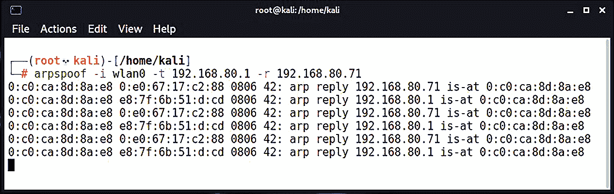

图 2.8 – 使用 arpspoof 进行 ARP 表中毒

在这里，我们可以看到`arpspoof`的实际操作，告诉网络网关和受害者实际上是我的 Kali 主机。同时，数据包将按原样转发到拦截的另一端。当它正常工作时（即你的机器没有产生瓶颈），除非他们在嗅探网络，否则双方不会察觉出差异。当我们使用 Wireshark 检查时，我们可以看到 ARP 欺骗攻击的表现。

我们可以看到受害者和网关之间的通信，现在只需要过滤出你需要的内容。在我们的示范中，我们正在寻找对一个 Web 门户的身份验证——很可能是一个`POST`消息。当我找到它时，我通过右键单击一个数据包并选择**跟踪**来在 Wireshark 中查看会话，受害者的凭证以明文显示：

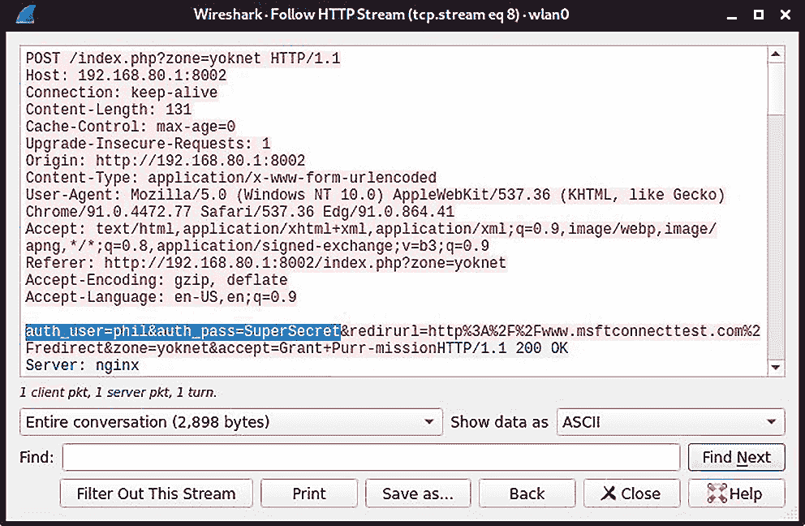

图 2.9 – 通过跟踪身份验证 HTTP 流来捕获凭证，使用 Wireshark

只接收数据包，留下一次重新 ARP

确保不要关闭运行`arpspoof`的终端窗口——使用*Ctrl* + *C*来发送终止信号。程序将识别该信号并尝试重新 ARP 你的网络。记住，你已经在其他主机上进行了 ARP 欺骗；这些数据会持续存在，直到新的 ARP 消息进行修正。优雅地关闭`arpspoof`将实现这一点。

# 绕过验证检查

我们已经看到 NAC 系统如何利用简单的 MAC 地址过滤和捕获门户身份验证来控制网络访问。现在，假设你刚刚从前面描述的 ARP 欺骗攻击中得手，兴奋地发现自己获得了一些合法的凭证。你尝试使用 Kali 主机登录，但却遇到了一个你未曾预见的验证检查。你拥有正确的用户名和密码——NAC 怎么知道这不是合法用户呢？

NAC 供应商迅速意识到，任何人都可以轻松地伪造 MAC 地址，因此一些系统执行额外的验证，将硬件地址与系统的其他特征进行匹配。想象一下，仅凭指纹进行身份验证和通过指纹、穿衣风格、声纹等多种方式进行身份验证之间的区别。后者能防止简单的伪造攻击。在这个背景下，NAC 正在检查 MAC 地址是否与其他特征匹配：制造商、操作系统和用户代理是常见的检查项目。结果证明，捕获门户识别出你刚刚伪造的`Phil`用户，并且它本来是期望一台 Apple iPad（在企业中作为*已批准设备*）。让我们详细回顾一下这三项检查。

## 确认组织唯一标识符

MAC 地址有两个主要部分：前三个字节是**组织唯一标识符**（**OUI**），后三个字节是**网络接口控制器特定的**（**NIC-specific**）。OUI 在这里很重要，因为它能唯一标识一个制造商。制造商会从 IEEE 注册管理机构购买一个 OUI，并将其在工厂中硬编码到他们的设备中。这不是一个秘密——它是公开的信息，已编码到该制造商生产的所有设备中。一个简单的 Google 搜索 `Apple OUI` 可以帮助我们缩小范围，当然你也可以直接访问 IEEE 注册管理机构网站。我们很快发现 `00:21:e9` 属于 Apple，所以我们可以尝试用这个来伪造一个随机的 NIC 地址（例如，**00:21:e9:d2:11:ac**）。

但再说一次，厂商们已经充分意识到 MAC 地址在过滤中的不可靠性，所以他们很可能会寻找更多的指示符。

## 被动操作系统指纹识别器

任何分析过网络数据包的人都应该熟悉操作系统指纹识别的概念。本质上，操作系统在构造通过网络发送的数据包时有一些小的细微差别。这些细微差别作为签名非常有用，可以帮助我们大致判断发送数据包的操作系统是什么。我们正在准备伪造一个选择的操作系统的堆栈，正如前面所解释的那样，所以让我们来了解一下 Kali 中一个在多种侦察场景下都会派上用场的工具——**被动操作系统指纹识别器**（**p0f**）。

它的强大之处在于其简洁性：它监听数据包，根据已知系统的签名数据库匹配签名并给出结果。当然，您的网络卡必须能够看到待分析的数据包。我们在示例中看到，由于网络被限制，我们无法以完全被动的方式看到其他流量；我们必须通过欺骗网络将流量路由到我们的 Kali 机器上。所以，我们将再次这样做，只不过这次是在更大的规模上，因为我们希望对网络中的一些客户端进行指纹识别。让我们使用 Ettercap 进行 ARP 欺骗，这个工具应该轻松地位列你最常用的前十名工具中。一旦 Ettercap 启动并开始工作，我们将启动 p0f 看看能找到什么。

我们将启动 Ettercap 图形界面，界面上有一个看起来非常吓人的网络嗅探蜘蛛：

`# ettercap -G`

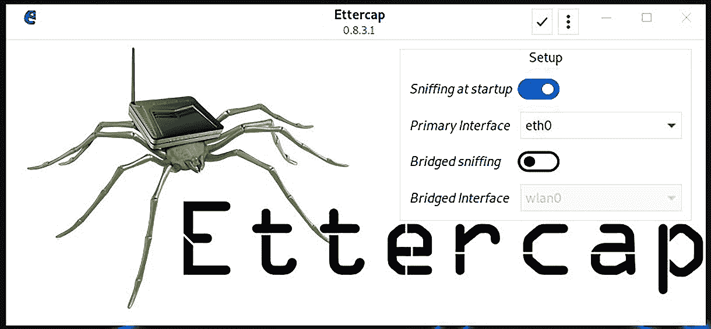

图 2.10 – Ettercap 启动屏幕

让我们开始嗅探，然后配置我们的中间人攻击。请注意，**桥接嗅探**目前未选中——这意味着我们正在使用统一嗅探模式。统一嗅探意味着我们仅从一个网络卡嗅探；我们现在并没有将任何东西转发到另一个接口。我们将在下一章讲解桥接嗅探的美妙之处。

现在，我们告诉 Ettercap 查找网络上的设备。点击顶部的勾选框确认初始设置（确保你的主要网络接口正确），然后点击三个点的按钮。在**主机**下，点击**扫描主机**。扫描完成后，你可以再次点击**主机**，查看主机列表。这会告诉我们 Ettercap 知道的网络上的设备信息。

现在，我们正在做一件相当不正经的事；我选择了网关作为**目标 1**（通过选择它然后点击**添加到目标 1**），并选择了一些客户端作为**目标 2**。这意味着 Ettercap 将使用 ARP 公告对这些主机进行欺骗，很快我们就会开始管理这些主机的流量。

始终负责地进行 ARP 欺骗

在与多个主机同时进行中间人攻击时要非常小心。你的机器很容易导致网络瓶颈。我也曾因为这样导致某个客户端的网络瘫痪。

选择`MITM`（顶部的小地球图标）| **ARP 欺骗**。我喜欢选择**嗅探远程连接**，不过这个场景下你不必这样做。

就是这样。点击**确定**，现在 Ettercap 就会施展它的魔法。点击**查看** | **连接**，可以看到 Ettercap 到目前为止所看到的所有连接详情。

对于熟悉 Ettercap 的用户，可能知道**查看**菜单中的**配置文件**选项可以让我们识别目标的操作系统，但为了展示简单快捷、直接有效的工具，我们还是使用 p0f。（你需要先在 Kali 2021.1 上通过`apt-get install p0f`安装 p0f。）`-o` 标志允许我们输出到一个文件——相信我，你会想这么做，尤其是在进行这种大规模欺骗攻击时：

# p0f -o poflog

p0f 喜欢在收集信息时给你展示一些实时数据。在这里，我们可以看到通过一个单独的 SYN 包，`192.168.108.199` 已经被识别为 Linux 主机：

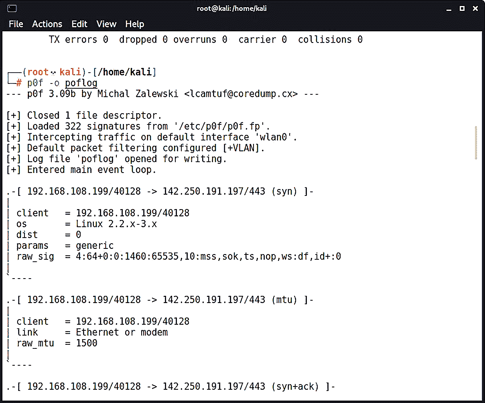

图 2.11 – p0f 捕获操作系统指纹

*Ctrl* + *C* 关闭 p0f。现在，让我们用 nano 打开我们的（可搜索的）日志文件：

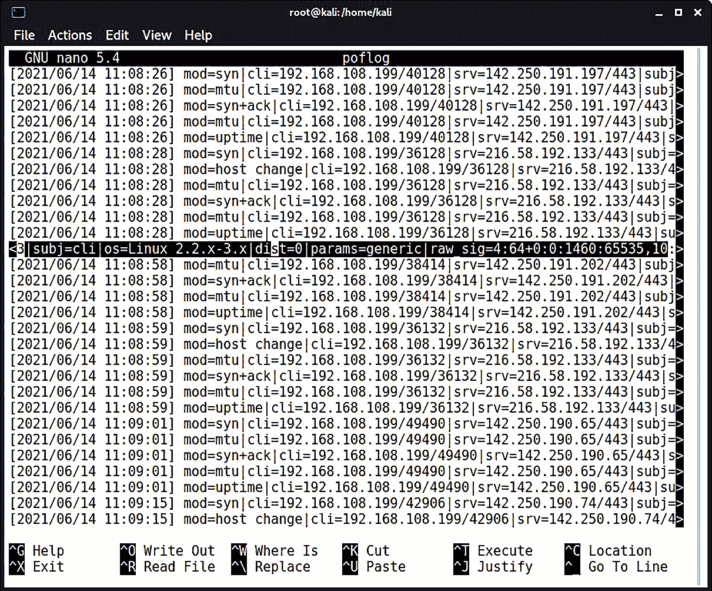

图 2.12 – 查看 p0f 日志文件中的原始签名

漂亮吧？有趣的部分是每个数据包详情行末尾的原始签名，它由以冒号分隔的字段组成，顺序如下：

1.  网络协议版本（例如，*4* 代表 *IPv4*）。

1.  初始**生存时间**（**TTL**）。如果你看到的不是*64*、*128* 或 *255*，那就有点奇怪了，但有些操作系统使用不同的值；例如，你可能会看到 AIX 主机使用 *60*，而旧版 Windows（‘95 和 ‘98）使用 *32*。

1.  *IPv4* 选项长度，通常为 *0*。

1.  **最大报文段大小**（**MSS**），不要与 MTU 混淆。它是设备可以处理的单个 TCP 段的最大字节大小。与 MTU 的不同之处在于，MSS 不包括 TCP 或 IP 头部。

1.  TCP 接收窗口大小，通常指定为 MTU 或 MSS 的倍数。

1.  如果指定了，窗口缩放因子。

1.  一个逗号分隔的 TCP 选项排序（如果有定义的话）。

1.  `readme`文件中称为*quirks*的字段——TCP 或 IP 头中的奇怪内容，能够帮助我们缩小创建它的协议栈范围。查看`readme`文件，看看这里显示了哪些选项；一个例子是`df`，表示**不分片**标志被设置。

为什么我们要关注这些选项呢？这不就是指纹库的作用吗？当然，但是这个工具的一个有趣之处在于你可以自定义自己的签名。你可能会看到一些奇怪的东西，可能由你在实验室里玩弄这些古怪的玩具时，帮助它们在实际环境中更容易被识别出来。然而，对于渗透测试人员来说，特别关注的是能够构造具有这些签名的报文，以欺骗这些 NAC 验证机制。我们将在下一节进行这些操作，但现在，你已经有了研究你想要伪造的协议栈所需的信息。

## 伪造 HTTP 用户代理

一些新手黑客可能会惊讶地发现浏览器用户代理数据在 NAC 系统中有一定的考虑，但它通常被作为客户端的额外验证。幸运的是，伪造**HTTP 用户代理**（**UA**）字段非常简单。回到我那时候，我们用自定义的 UA 字符串与 cURL 一起使用，但现在你有了高级浏览器，允许你覆盖默认设置。

让我们尝试模拟 iPad。你可以通过实际的 iPad 来捕获 UA 数据，但 UA 字符串有点像 MAC 地址，容易伪造，且详细信息在网上很容易找到。所以，我会在网上搜索 iPad 的 UA 数据，选择更常见的那几个。随着软件和硬件的变化，UA 字符串也可能会变化。如果你认为所有 iPad（或任何设备）都相同，那可要小心了。

在 Kali 中，我们打开 Mozilla Firefox 并在地址栏中导航到`about:config`。Firefox 会礼貌地提醒你，这个区域不适合新手；继续并接受这个警告。现在，搜索`useragent`，你会看到引用 UA 的配置选项：

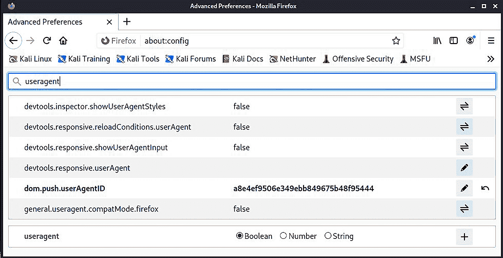

图 2.13 – 访问 Firefox 的高级配置

请注意，这里没有一个带有字符串数据类型的覆盖首选项名称（因此我们可以提供`useragent`字符串）。所以，我们需要创建它。回到搜索栏，输入`general.useragent.override`。这里唯一的结果是你可以创建它的选项；选择`String`数据类型，然后点击加号：

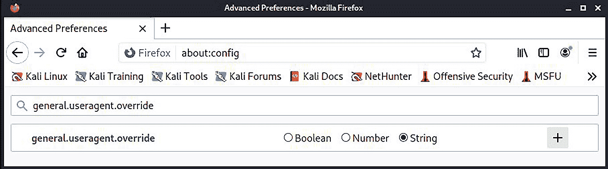

图 2.14 – 在 Firefox 高级设置中创建 UA 重写

会出现一个字段，在其中输入这个新偏好的值。请记住，没有一个方便的构建工具可以将特定值组合成格式良好的 UA 字符串；你必须逐个字符输入，因此请检查你输入的数据的准确性。如果你愿意，可以假装自己是冰箱，但我不确定这对我们有任何帮助：

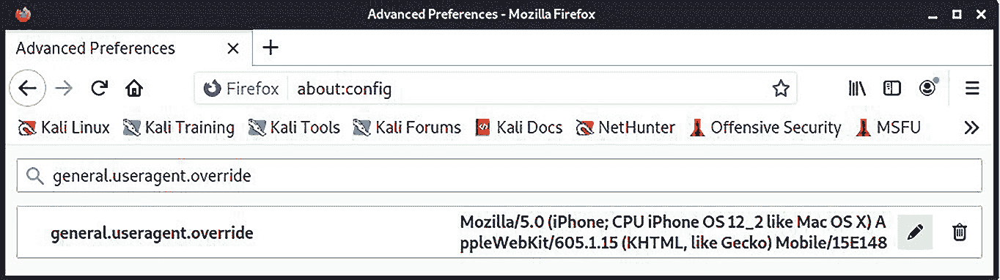

图 2.15 – Firefox 现在告诉世界它是一个 iPhone

我刚刚输入了一个运行 iOS 12.2 的 iPhone 的 UA 数据，打开了一个新标签页，并验证了网站认为我是什么：

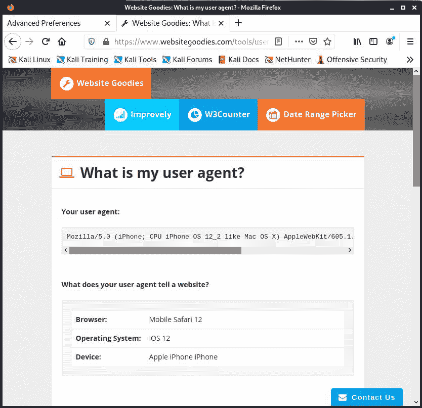

图 2.16 – 确认 UA 欺骗成功

`Website Goodies` 页面现在相信我的 Kali 主机实际上是一个友好的 iPhone。

在这里，我们还应该防范 JavaScript 验证技术。一些认证门户可能会注入一些 JavaScript 来通过检查浏览器中的 **文档对象模型**(**DOM**) 字段来验证操作系统。你可以像处理 UA 数据一样操控这些响应：

general.[DOM key].override

例如，`oscpu` 字段会显示主机上的 CPU 类型，因此我们可以用以下内容来重写响应：

general.oscpu.override

如前所述，数据类型是字符串。这看起来很简单，但请记住，只有具有特权的代码（例如，具有 `UniversalBrowserRead` 权限的代码）才能获取真实信息，而不是你在这里定义的重写偏好。如果注入可以运行特权代码的 JavaScript 足够容易，那么我们可能会面临一些安全问题。这是一个权衡的例子，它对我们有帮助。

# 打破牢笼 – 伪装堆栈

想象一下，你正试图通过一扇有守卫把守的门。你一打开门，守卫看到你，认定你没有授权，于是立即把你赶了出去。但假设一个授权人员打开了门并把它撑开，而守卫则每 10 分钟左右验证一次进入的人身份，而不是持续验证。他们假设在这 10 分钟的时间窗口内是一个授权人员正在使用这扇门，因为他们已经验证过了第一个打开门并撑开它的人。

当然，这在现实世界中不会发生（至少，我希望不会发生），但这一原理在复杂的工业标准 NAC 系统中常常能够看到。我们讨论的不是人，而是网络中的数据包。正如我们在指纹识别实验中所学到的，数据包的形成细节可以泄露特定源系统的信息。这些细节使它们成为源的有用指示器。它像鸭子叫，也像鸭子走路，所以它就是鸭子，而绝对不是穿着鸭子服装的人。

使用这种指纹识别技术的 NAC 将进行初步评估，然后假设随后的数据包与签名匹配，就像我们的守卫在第一次检查后认为门是由好人使用的一样。其原因很简单：性能。后续检查是否每隔几分钟进行一次或从不进行，取决于 NAC 及其配置。

我们将介绍一个工具叫做`Scapy`，用来演示这个特定的攻击。在本书的后续章节中，您将看到 Scapy 可以轻松替代渗透测试人员所习惯使用的大多数工具：端口扫描器、指纹识别工具、欺骗工具等等。我们将在这里快速演示 NAC 绕过，但在接下来的章节中，我们将利用 Scapy 的强大功能。

## 遵循规则会破坏乐趣 —— 抑制正常的 TCP 回应

TCP 握手的详细过程超出了本章的范围，但我们将讨论基本知识，以便理解我们需要做什么才能完成伪装。大多数人都熟悉 TCP 的三次握手：

1.  客户端发送`SYN`请求（**同步**）。

1.  接收方回复`SYN-ACK`确认（**同步-确认**）。

1.  客户端确认并发送`ACK`确认；通道已建立，通信可以开始。

这是一个非常简单的描述（我省略了序列号，稍后我们会讨论），当它按设计工作时，非常好。然而，那些有一定 Nmap 经验的人应该对服务在接收到异常顺序的数据时可能发生的奇怪情况有所了解。RFC 793 的*第 3.4 节*详细描述了这些有趣的情况，我鼓励大家阅读。基本上，TCP 的设计有机制，在出现问题时会中止——用 TCP 术语来说，我们通过`RST`控制包（**重置**）来中止。请确保（重置）和这个新补充部分之间有一个空格：（我们将在*第五章*，*评估网络安全性*中更详细地讨论 TCP 和 Nmap）。这对我们来说非常重要，因为我们即将建立一个伪造的 TCP 连接，旨在模仿 Safari 浏览器在 iPad 上创建的连接。当我们收到确认信息时，Kali 会非常困惑：

1.  Scapy 使用我们的网络接口来发送伪造的`SYN`数据包。

1.  捕获门户 Web 服务向我们的地址发送`SYN-ACK`确认。

1.  Kali Linux 系统本身并未发送任何 `SYN` 请求，因此将接收到一个未经请求的 `SYN-ACK` 确认包。

1.  根据 RFC 规范，Kali 判断出某些地方出错，并通过 `RST` 包中止，暴露了我们的操作系统身份。

好吧，这样不行。我们必须临时封住 Kali 主机的口，直到完成验证。这用 `iptables` 很容易做到。

`iptables` 是 Linux 防火墙。它通过策略链来处理数据包。规则是为数据包处理定义的。共有三种策略类别：*input*（输入）、*output*（输出）和 *forward*（转发）。Input 是指目标为你机器的数据，output 是指来源于你机器的数据，forward 是指并非真正面向你机器的数据，但会被转发到其目标。如果你没有进行某种路由或转发操作——就像在本章前面我们进行的中间人攻击——那么你就不会操作 forward 策略链。在我们这里的目的，只需要限制从我们机器发出的数据。

如果你已经意识到这一点，额外的奖励：如果我们不小心，可能会限制到 Scapy 包！那么，我们到底在限制什么呢？我们想要限制的是目标为网关 `80` 端口的 TCP `RST` 包，并且来自我们的 Kali 主机。为了演示，我们已经在 `192.168.108.239` 上设置了监听器，而我们的 Kali 攻击主机则位于 `192.168.108.253`。

# iptables -F && iptables -A OUTPUT -p tcp --destination-port 80 --tcp-flags RST RST -s 192.168.108.225 -d 192.168.108.215 -j DROP

让我们来拆解一下：

+   `-F` 告诉 `iptables` 清除当前配置的所有规则。我们正在调整用于 ARP 攻击的规则，因此这将重置一切。

+   `-A` 表示 *附加* 规则。请注意，我没有使用可能令人误解的词语 *add*。记住，防火墙规则必须按正确的顺序工作。我们在这里不需要担心这一点，因为我们没有其他规则，所以这属于另一个话题。

+   `OUTPUT` 标识我们即将附加规则的策略链。

+   `-p` 表示协议——在这个例子中是 TCP。

+   `--destination-port` 和 `--tcp-flags` 不言自明：我们瞄准的是任何目标为 HTTP 端口的 `RST` 控制包。

+   `-s` 是我们的源地址，`-d` 是目标地址。

+   `-j` 是 *跳转*，它指定规则的目标。它定义了实际执行的动作。如果省略这个选项，那么什么也不会发生，但规则包计数器会递增。

以下截图展示了前述命令的输出：

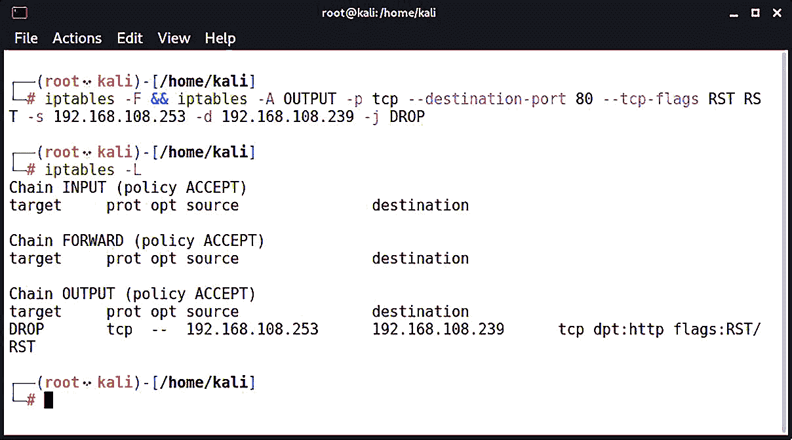

图 2.17 – 列出我们在 iptables 中的修改

我们已经准备好将伪造的包发送到强制门户认证页面。

## 使用 Scapy 和 Python 制造握手

你可以通过简单地输入 `scapy` 命令来启动 Scapy 解释器界面，但为了本讨论，我们将把它的功能导入到 Python 脚本中。

Scapy 是一款复杂的包操作和构建程序。它是一个 Python 程序，但 Python 在 Scapy 中扮演的角色更大，作为 Scapy 专用语言的语法和解释器。这对于渗透测试者来说意味着一个功能强大的包操控和伪造工具，它具有无与伦比的灵活性，因为它允许你在飞行过程中用很少的代码行编写自己的网络工具——并且解释权完全掌握在你手中，而不是局限于工具作者的设想。

我们在这里做的是 Python 和 Scapy 脚本编写的速成课程，所以不要害怕。稍后我们会更详细地讨论 Scapy 和 Python。我们将在这里的 NAC 绕过场景中逐步分析每个步骤，这样当我们以后使用 Scapy 时，就能迅速理解。如果你像我一样，在被推入泳池后学习更快的话，那就大大欢迎你阅读 Scapy 的文档和喝一杯热可可。Scapy 的文档非常棒。

正如你所知，我们已经在 `192.168.108.239` 设置了我们的捕获门户监听器和操作系统指纹识别器。让我们尝试在 Kali 中用未修改的 Firefox ESR 浏览这个地址，看看 p0f 能发现什么：

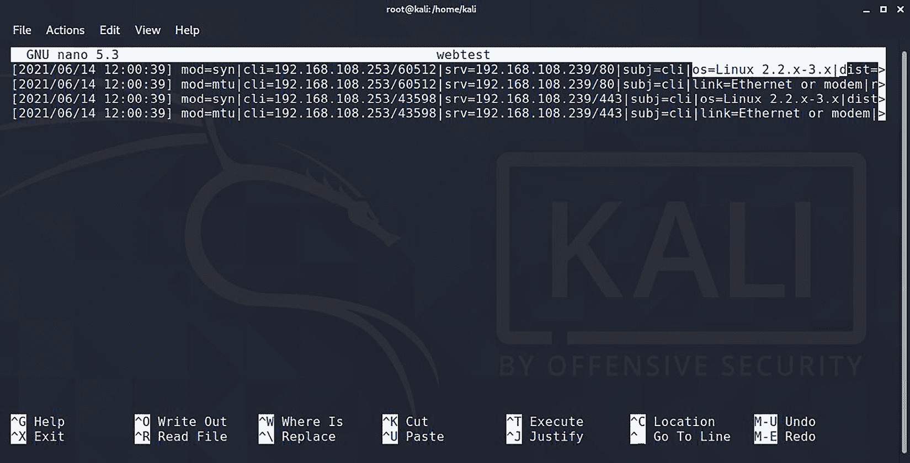

图 2.18 – 被识破：p0f 知道它是 Linux

我们可以在最上面一行看到，表示收到的第一个 `SYN` 包，p0f 已经识别出我们是 Linux 客户端。记住，p0f 是通过查看 TCP 包的构造来判断的，所以我们无需等待任何 HTTP 请求来泄露系统信息。在浏览器与网站建立连接之前，Linux 的指纹就已经出现在 TCP 三次握手中。

在我们的示例中，让我们模拟之前的老朋友 iPhone。戴上黑客帽子（请戴白色的），我们可以将两者结合起来：

+   p0f 有一个签名数据库（**p0f.fp**），它通过这个数据库来指纹识别源。

+   Scapy 让我们能够构建 TCP 包，并且通过简单的脚本，我们可以将多个 Scapy 命令组合成一个完整的 TCP 三次握手工具。

现在我们已经有了伪造攻击的配方。Scapy 让你在其解释器中构建通信，使用与 Python 相同的语法，但我们要做的是启动 nano，编写一个导入 Scapy 的 Python 脚本。我们将在确认攻击成功后讨论这里发生的事情：

```
#!/usr/bin/python3
```

```
from scapy.all import *
```

```
import random
```

```
CPIPADDRESS = "192.168.108.239"
```

```
SOURCEP = random.randint(1024,65535)
```

```
ip = IP(dst=CPIPADDRESS, flags="DF", ttl=64)
```

```
tcpopt = [("MSS",1460), ("NOP",None), ("WScale",2), ("NOP",None), ("NOP",None), ("Timestamp",(123,0)), ("SAckOK",""), ("EOL",None)]
```

```
SYN = TCP(sport=SOURCEP, dport=80, flags="S", seq=1000, window=0xffff, options=tcpopt)
```

```
SYNACK = sr1(ip/SYN)
```

```
ACK = TCP(sport=SOURCEP, dport=80, flags="A", seq=SYNACK.ack+1, ack=SYNACK.seq+1, window=0xffff)
```

```
send(ip/ACK)
```

```
request = "GET / HTTP/1.1\r\nHost: " + CPIPADDRESS + "\rMozilla/5.0 (iPhone; CPU iPhone OS 12_2 like Mac OS X) AppleWebKit/605.1.15 (KHTML, like Gecko) Mobile/15E148\r\n\r\n"
```

```
PUSH = TCP(sport=SOURCEP, dport=80, flags="PA", seq=1001, ack=0, window=0xffff)
```

```
send(ip/PUSH/request)
```

```
RST = TCP(sport=SOURCEP, dport=80, flags="R", seq=1001, ack=0, window=0xffff)
```

```
send(ip/RST)
```

一旦我在 nano 中完成输入，我将其保存为 `.py` 文件并使用 `chmod` 命令设置为可执行。就这样——攻击准备就绪：

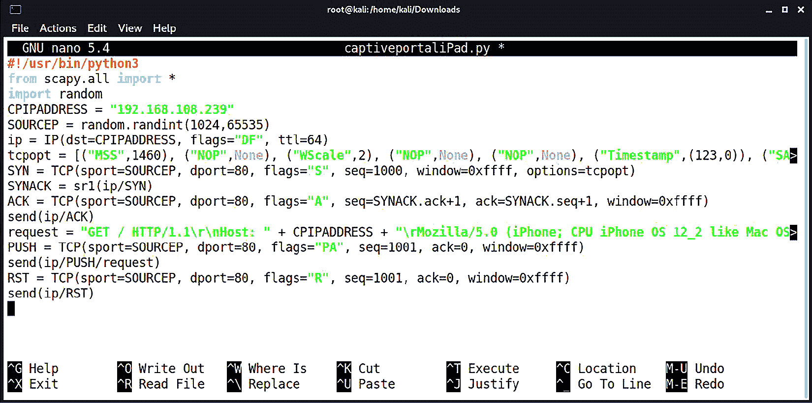

图 2.19 – 我们的 Scapy Python 脚本已准备好

`iptables` 出站规则已设置，脚本准备好执行。让我们开始吧：

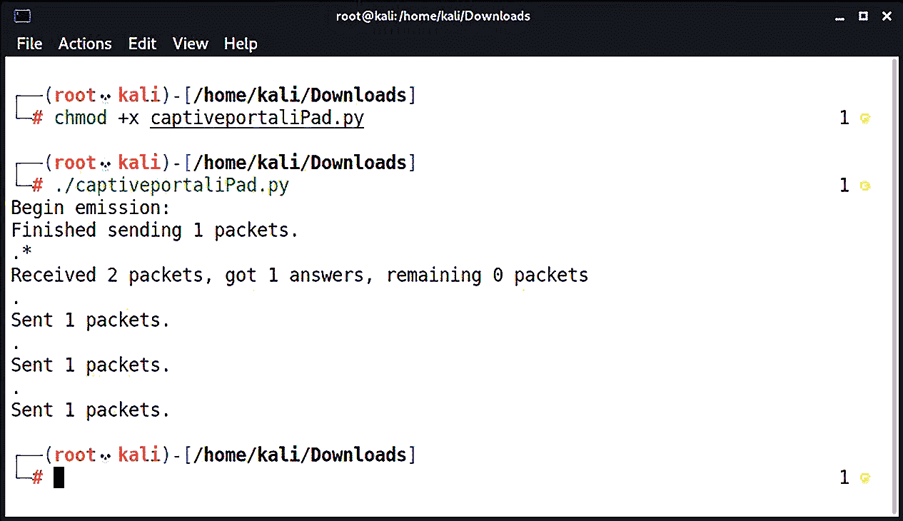

图 2.20 – Scapy 报告成功传输

就是这样——到这里并没有什么高潮。但让我们看看接收端：

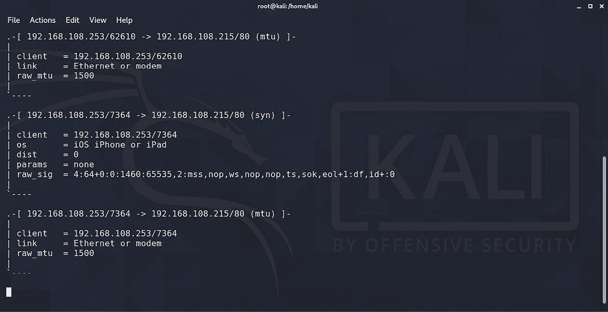

图 2.21 – p0f 认为我们是 iOS 设备

Voilà！操作系统指纹识别工具相信这些数据包是由 iOS 设备发送的。当我们向下滚动时，可以看到实际的 HTTP 请求及其 UA 数据。这时，NAC 允许访问，我们可以继续进行平常的工作。别忘了打开`iptables`：

# iptables -F

那么，这里到底发生了什么呢？让我们分解一下：

```
CPIPADDRESS = "192.168.108.215"
```

```
SOURCEP = random.randint(1024,65535)
```

我们声明了一个变量用于捕获门户的 IP 地址和源端口。源端口是`1024`到`65535`之间的随机整数，因此使用了一个临时端口：

```
ip = IP(dst=CPIPADDRESS, flags="DF", ttl=64)
```

```
tcpopt = [("MSS",1460), ("NOP",None), ("WScale",2), ("NOP",None), ("NOP",None), ("Timestamp",(123,0)), ("SAckOK",""), ("EOL",None)]
```

```
SYN = TCP(sport=SOURCEP, dport=80, flags="S", seq=1000, window=0xffff, options=tcpopt)
```

```
SYNACK = sr1(ip/SYN)
```

现在我们定义将要发送的数据包的各个层。`ip`是我们数据包的 IP 层，目标是我们的捕获门户，设置了不分片标志，并且 TTL 为`64`。当 Scapy 准备好发送这个特定的数据包时，我们只需引用`ip`。

我们用将要使用的 TCP 选项定义`tcpopt`。这是操作系统指纹的核心内容，因此它是基于我们的指纹研究。

接下来，我们声明`SYN`，这是我们数据包的 TCP 层，定义了我们随机选择的临时端口、目标端口`80`、设置的`SYN`标志、序列号和窗口大小（也是指纹的一部分）。我们用刚定义的`tcpopt`设置 TCP 选项。

然后，我们通过`sr1`发送`SYN`请求。然而，`sr1`表示*发送一个数据包，并记录 1 个回复*。回复被存储为`SYNACK`：

```
ACK = TCP(sport=SOURCEP, dport=80, flags="A", seq=SYNACK.ack+1, ack=SYNACK.seq+1, window=0xffff)
```

```
send(ip/ACK)
```

我们通过`sr1`发送了一个`SYN`包，它指示 Scapy 记录回复——换句话说，记录从服务器返回的`SYN-ACK`确认包。该数据包现在被存储为`SYNACK`。接下来，我们构造握手的第三部分，即我们的`ACK`。我们使用相同的端口信息并相应地切换标志，同时从`SYN-ACK`中获取序列号并将其加一。由于我们只是确认`SYN-ACK`并完成握手，因此我们只发送这个数据包而不需要回复，因此使用`send`命令而不是`sr1`：

```
request = "GET / HTTP/1.1\r\nHost: " + CPIPADDRESS + "\rMozilla/5.0 (iPhone; CPU iPhone OS 12_2 like Mac OS X) AppleWebKit/605.1.15 (KHTML, like Gecko) Mobile/15E148\r\n\r\n"
```

```
PUSH = TCP(sport=SOURCEP, dport=80, flags="PA", seq=1001, ack=0, window=0xffff)
```

```
send(ip/PUSH/request)
```

现在 TCP 会话已经建立，我们为 HTTP 服务器构造了`GET`请求。我们正在构建有效载荷并将其存储为`request`。请注意使用 Python 语法来连接目标 IP 地址并创建回车符和换行符。我们构造带有`PSH + ACK`标志的 TCP 层，并增加序列号。最后，我们使用另一个`send`命令发送数据包，使用相同的 IP 层、新定义的名为`PUSH`的 TCP 层和 HTTP 有效载荷作为`request`：

```
RST = TCP(sport=SOURCEP, dport=80, flags="R", seq=1001, ack=0, window=0xffff)
```

```
send(ip/RST)
```

最后，我们整理好一切，完成了我们的任务。我们构建了一个`RST`数据包，用于断开我们刚刚建立的 TCP 连接，并使用`send`命令发送它。

希望我已经激发了你对 Scapy 和 Python 的兴趣，因为我们将在本书后面将这两个强大的工具提升到一个新层次。

# 总结

本章中，我们回顾了 NAC 系统及其一些技术。我们学习了如何使用 Kali 构建一个无线接入点，通过伪装成授权的 IP 电话进行物理降级攻击。我们学习了如何通过二层中毒攻击交换网络，以便在被困于受限局域网时拦截授权用户的认证数据。还讨论了其他验证检查，并展示了绕过这些检查的方法。

我们了解了操作系统指纹识别的工作原理，并开发了研究签名进行侦察的方式，同时为目标系统构建欺骗攻击，示例使用了运行在 iPad 上的 iOS。我们回顾了一个更高级的操作系统指纹识别方法——指纹识别堆栈，并介绍了数据包操作工具 Scapy，通过编写 Python 脚本演示了堆栈伪装。

在下一章，我们将把嗅探和欺骗提升到新的水平，甚至将这两个概念结合起来，创建一个干净安静的中间人攻击。

# 问题

回答以下问题来测试你对本章的知识掌握情况：

1.  `hostapd`中的`apd`代表什么？

1.  如何快速判断你的无线网卡是否支持接入点模式？

1.  `hostapd`配置参数`ignore_broadcast_ssid`的作用是什么？

1.  `255.255.255.255`是 ___________ 的广播地址。

1.  你正在进行一个 ARP 欺骗攻击。你知道目标和网关的 IP 地址，所以你立即启动了`arpspoof`。突然，目标与网关之间的通信中断了。发生了什么事？

1.  MAC 地址的前三个八位字节和后三个八位字节分别代表什么？

1.  MSS 和 MTU 的大小是一样的吗？对还是错？

1.  `iptables`中的`-j`标志是做什么的？

1.  你已将一个特别构造的数据包的 IP 层和 TCP 层分别定义为`IP`和`TCP`。你希望 Scapy 发送这个数据包并将回复保存为`REPLY`。命令是什么？

# 进一步阅读

关于本章所涵盖的主题，查看更多信息，请查看以下资源：

+   Scapy 文档：[`scapy.readthedocs.io/en/latest/`](https://scapy.readthedocs.io/en/latest/)
