# 第三章：嗅探与欺骗

在 1970 年代，美国对苏联进行了一次大胆的**信号情报**（**SIGINT**）行动，代号“常春藤钟”行动，该行动发生在鄂霍次克海。虽然任何预期会被拦截的消息都会被加密，但一些关键通信却在鄂霍次克海下方以明文方式进行。通过使用一种能够通过电磁感应捕捉经过电缆的信号的设备，美国情报部门成功地从海底几百英尺的地方获取了敏感的军事通信。这是一次强有力的*嗅探*演示——能够捕捉并分析通过通信通道传输的数据。

几十年前，盟军准备在 1944 年的诺曼底战役中解放纳粹占领的西欧。成功的关键因素之一是让德军措手不及，但他们知道入侵即将来临；因此，进行了一个名为“坚韧行动”的大规模欺骗行动。这个欺骗行动的一部分是通过在“天际行动”中生成假电台流量，迷惑德军相信入侵将在挪威（坚韧行动北部）进行。生成的流量完美模拟了军队单位协调移动和攻击计划的电台信号。这一策略的部署，其巧妙的细节展现了*欺骗*——旨在误导接收方的虚假流量。

本章的讨论将以现代计算机网络为背景，并从作为渗透测试员的角度来考虑这些概念，但这些历史案例应该有助于阐明技术细节背后的理论。现在，让我们展示一些针对配备 Kali Linux 的渗透测试员的嗅探和欺骗的实际操作示例。

在本章中，我们将涵盖以下主题：

+   高级 Wireshark 统计分析和过滤技术，用于在网络中找到我们需要的特定数据位

+   使用 Aircrack-ng 套件攻击 WLAN

+   高级 Ettercap 用于构建一个隐秘的窃听接入点

+   使用 Ettercap 数据包过滤器来分析、丢弃并操控通过我们接入点传输的流量

+   更深入地掌握 BetterCAP 基础

# 技术要求

要开始，你需要具备以下条件：

+   一台运行 Kali Linux 的笔记本

+   一张可以作为接入点使用的无线网卡

+   基本的 Wireshark 知识

# 高级 Wireshark——超越简单的数据包捕获

我假设你现在已经有了一些使用 Wireshark（前身为 Ethereal）的经验。即使你是渗透测试的新手，也很难避免在实验室环境中接触到 Wireshark。如果你对这个出色的数据包分析工具不熟悉，那你一定对数据包分析器有所了解。嗅探器是任何学习编程的人面临的一大挑战。

所以，我不会讲解 Wireshark 的基础知识。我们都熟悉数据包分析器这个概念；我们知道 Wireshark 的颜色编码协议分析等等。我们将把 Wireshark 的应用推向理论之外和普通捕获之外，应用到一些实际的例子中。我们将查看 Wireshark 中的被动无线分析，并学习如何在使用攻击工具时将 Wireshark 作为我们的助手。

## 被动无线分析

到目前为止，我们一直在研究第二层及以上的内容。第一层——物理层——的神奇世界是另一本（非常厚的）书的内容，但在今天的世界里，我们无法谈论访问网络的物理方式而不涉及无线技术。

嗅探攻击有两种核心策略：*被动*和*主动*。被动嗅探攻击通常也被称为*隐蔽*攻击，因为它无法被目标检测到。我们将看看被动无线侦察——这只是一个 Fancy 的说法，意思是*监听广播*。当你在车上的 FM 收音机调到你最喜欢的电台时，电台并不知道你已经开始收听。被动无线侦察是相同的概念，只不过我们要录制这个广播节目，以便稍后详细分析。

要实现这一点，我们需要合适的硬件。无线网卡必须能够记录它能看到的一切，并将其传递给操作系统。这就是**监视模式**，但并非所有无线网卡都支持它。我选择的卡是 Alfa AWUS036NEH，但稍微在网上做些研究就能帮助你找到理想的设备。

我们将使用`iwconfig`来启用监视模式，并在启动设备后确认其状态：

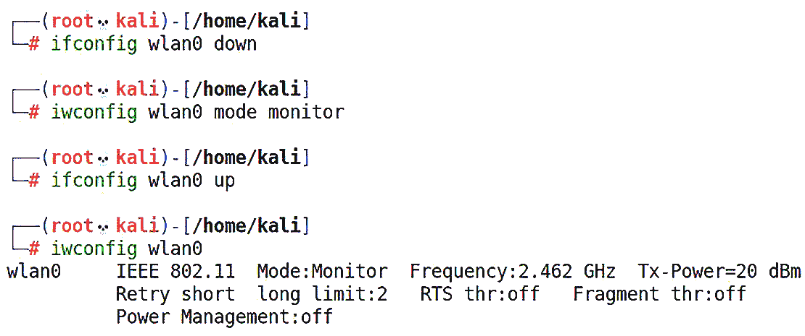

图 3.1 – 使用 iwconfig 启用监视模式

请注意两种配置工具的使用：`ifconfig`和`iwconfig`。不要混淆它们的名称！

当我们运行最后一个命令时，我们可以确认监视模式已启用。如果检查 RX 数据包计数，你会看到它已经在快速增长（具体取决于你的射频环境有多忙碌）——它正在接收数据包，即使你没有与接入点关联。这就是这种分析方法隐蔽的原因——仅仅在监听的设备是不会被检测到的。

需要注意的是，真正的隐蔽性要求你的设备*不*发送任何数据。有时候，我们仅仅是打算监听，所以假设我们在隐蔽地进行监听，但如果无线网卡以某种方式宣布它的存在，它就不再是被动的。当你擅长分析你的环境时，运用你的技巧来检查你的隐蔽性！

现在，我们将启动 Wireshark 并选择之前指定的接口——在这个例子中是`wlan0`：

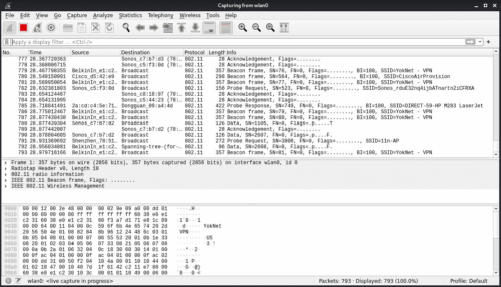

图 3.2 – 使用 Wireshark 进行原始无线捕获

哇，好吧——等一下。屏幕在每秒 27 个数据包的速度下亮了起来，而且这是一个相对安静的环境。（如果你在公寓楼里启动这个，玩得会更有意思。）别误会，我是一个数据狂人，这么多包让我兴奋——但我们需要搞清楚这个环境里发生了什么，以便筛选出有价值的内容。我们将在下一节中使用 Wireshark 回顾无线环境的高空视角。

## 使用 Aircrack-ng 套件定位 WLAN

任何关于无线攻击的讨论都离不开 Aircrack-ng 套件。虽然名字暗示它只是一个密码破解工具，但它是一个功能全面的无线攻击套件。在我们的例子中，我们将通过`airodump-ng wlan0` 命令查看无线嗅探器。以下是输出：

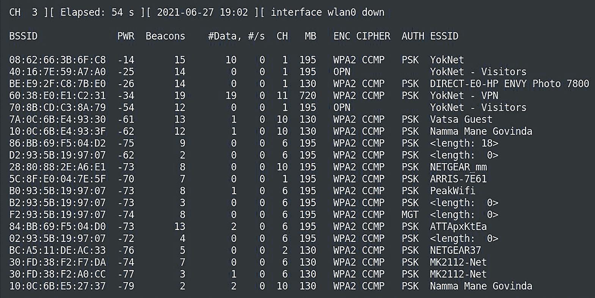

图 3.3 – airodump-ng 输出

这是相同的任务，但这个工具可以整理无线环境和所有参与设备的身份信息。一个特别有用的列是**#数据**，它告诉我们观察到的包中有多少包含网络数据。这很方便，因为正如我们在查看原始环境时看到的，很多包是用于无线管理的。虽然在 Wireshark 中对包进行排序很简单，但现在，我们得到了一个整洁的网络列表，包括客户端和接入点的 MAC 地址（BSSID），以及它们的繁忙程度。

`ENC` 列告诉我们所列网络使用的加密方法——如果有的话。`OPN` 表示没有加密。现在这种情况比较少见，但在这个例子中，开放网络是一个访客网络。它故意保持开放，以便轻松访问，但一旦连接成功，客户端将被引导进入一个受限的门户环境。你会记得在*第二章*，*绕过网络访问控制*中，我们通过攻击数据链路层来拦截到受限门户的认证请求。但在这种情况下，我们处于无线电范围内，并且包没有加密。我们应该能够通过监听来拦截任何没有采用隧道加密方法（例如，HTTPS）保护的内容——不需要注入，也没有可检测的痕迹。那么，我们如何利用这里的信息来筛选出在监控模式下捕获的杂乱数据呢？让我们通过过滤接入点的 MAC 地址（BSSID）：`40:16:7E:59:A7:A0` 来锁定访客网络。

正如你所知，802.11 通信的 2.4 GHz 波段被划分为多个频道。默认情况下，Airodump-ng 会在这些频道之间跳跃——快速从一个频道跳到下一个频道，监听当前频道的数据。正如你可以想象的那样，如果一个重要的数据包在频道 1 上传输，而 Airodump-ng 正在频道 4 上监听，你就会错过它。因此，当你知道目标时，你需要告诉 Airodump-ng 集中注意力。在我们的示例中，开放网络位于 **频道 1**。我们使用 `--channel` 来指定我们的监听频率，使用 `--bssid` 通过 MAC 地址来过滤目标接入点。我们将使用 `--output-format` 来指定 `.pcap` 文件（任何数据包分析器都可以处理这种输出格式）：

# airodump-ng -w test_capture --output-format pcap --bssid 40:16:7e:59:a7:a0 --channel 11 wlan0

当我们在屏幕上观察元数据时，我们的测试文件正在被写入。我们可以让它运行尽可能长的时间；然后，我们必须按 *Ctrl* + *C* 并将其导入到 Wireshark 中：

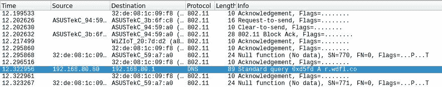

图 3.4 – 在 Wireshark 中打开我们的测试捕获文件

在没有发送任何数据的情况下，我们已经发现了一个合法的 IP 地址（**192.168.80.80**），并且可以看到这个主机发送的 DNS 查询。我们已经在这个特定网络的侦察阶段迈出了不错的一步，而我们甚至还没有发送任何数据包。

我们生活在一个 5 GHz 的世界里

虽然 2.4 GHz 仍然占主导地位，但越来越多的 5 GHz 设备出现在市场上，你可能需要嗅探这些设备。新的无线网卡应该支持它。当你使用 airodump-ng 时，使用 `band` 标志并设置为 `abg`，这将启用 5 GHz。

现在我们已经有了一些原始无线嗅探的经验，让我们来看看 Wireshark 内建的分析功能。

## 使用 Wireshark 进行 WLAN 分析

让我们通过 Wireshark 来解读无线环境。我们在上一节中禁用了频道跳跃，以便集中关注一个目标，但现在，让我们尽可能多地捕获数据，让 Wireshark 来解释。在打开无线捕获的情况下，点击 `Wireless** | **WLAN Traffic`。生成的窗口是 `Wireshark - Wireless LAN Statistics - test_wifi_capture-01`，并且具有可排序的列。我感兴趣的是找到最繁忙的网络，所以我按 `Percent Packets` 进行排序：

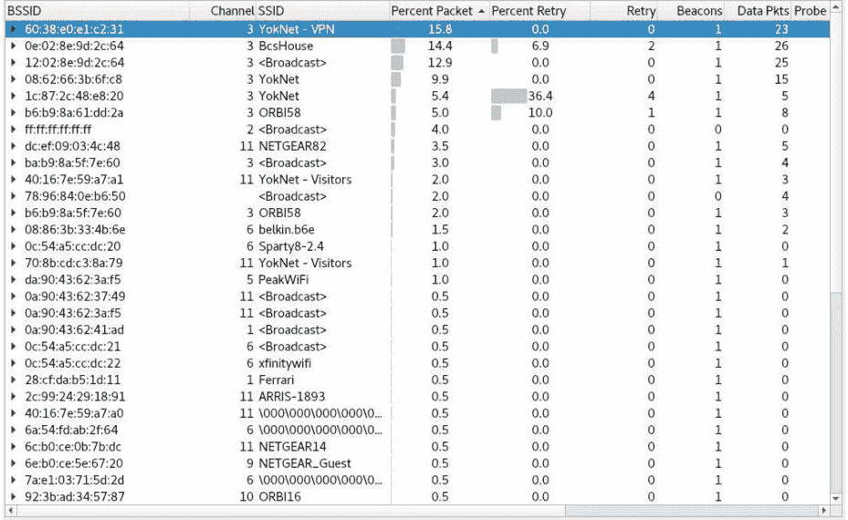

图 3.5 – Wireshark 中的无线局域网统计

通过展开左侧的 `BSSID`，我们可以看到嵌套的 BSSID：父节点是接入点，而嵌套的设备是关联的客户端。右键点击一个目标，然后点击 `Apply as Filter** | **Selected`。关闭统计框返回到 Wireshark 的主窗口。显示过滤器文本框将填充我们选择的过滤器。应用该过滤器，享受你节省下来的时间，避免在数据包中翻找：

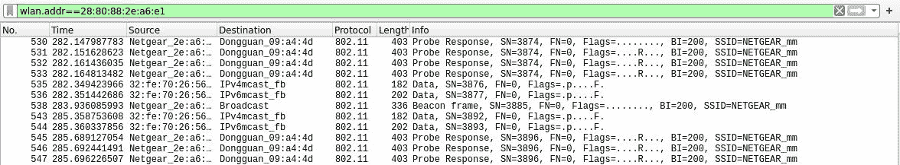

图 3.6 – 按 BSSID 过滤

让我们回到网络层，看看一旦我们在局域网中建立了连接，Wireshark 能为我们做些什么。我已经在一个有多个活跃浏览客户端的网络上嗅探了几分钟。短短的时间内，我就捕获到了大量有用的数据可以分析。

## 使用 Wireshark 进行的网络分析

正如我们在今天的日常网页浏览中可以预见的那样，几乎所有的流量都是通过 TLS 加密的。即便是查看新闻或搜索字典定义，也很难不经过一个隧道进行数据传输。嗅探（Sniffing）已经不像过去那样简单了，以前只需要在局域网中设置混杂模式（promiscuous mode），就能截获完整的 HTTP 会话。所以，我们的目标是应用一些统计分析和过滤技术，深入了解捕获的数据，并推断出数据之间的关系。

在上一节中，我们查看了 WLAN 的统计信息。现在我们已经接入网络，可以通过协议和服务级别的分析，更加细致地观察网络数据。

让我们了解一下网络中每个设备的通信情况。在 Wireshark 中，我们将每个设备称为端点（endpoint）。每个 IP 地址都被视为一个端点，端点之间会进行相互通信。让我们从 **统计** 菜单中选择 **端点**。

我对一个属于法国 `Orange` 网络的端点感兴趣。我可以右键点击该端点，基于这个特定端点应用过滤器：

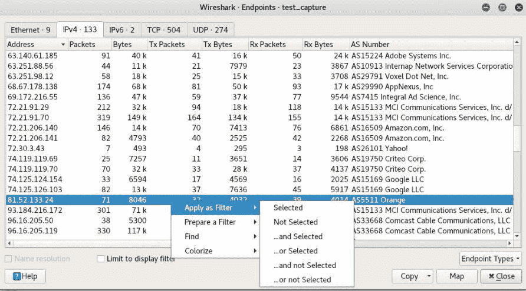

图 3.7 – 过滤端点

现在，我将只查看这个特定端点的 HTTP 200 响应。我将使用这个过滤器并应用它：

```
ip.addr==81.52.133.24 and http contains 200
```

我从捕获的 33,644 个数据包中筛选出了五个有用的数据包。此时，我可以右键点击任意一个数据包，创建一个过滤器来聚焦于这个特定的 TCP 会话，这样我就可以以一种易于阅读的格式跟踪 HTTP 会话：

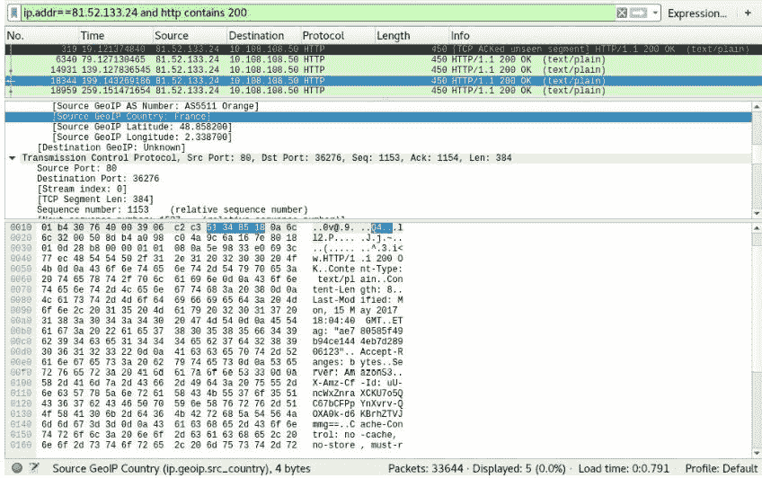

图 3.8 – 审查过滤后的数据包

那么，这个显示过滤器到底是怎么回事呢？它的语法应该对程序员来说并不陌生。你首先从一个层次开始，然后通过句点分隔指定子类别。在我们的示例中，我们从 `ip` 开始，然后用 `addr` 来指定 IP 地址。地址子类别也适用于其他层次；例如，`eth.addr` 用于指定 MAC 地址。Wireshark 的显示过滤器非常强大，我们没有足够的篇幅深入探讨，但你可以通过手动审查数据包，逐步构建你需要的过滤器。例如，我们刚才过滤出了来自法国 AS5511 网络的端点的数据包。我能过滤出来自法国的所有数据包吗？

```
ip.geoip.src_country==France
```

让我们将 GeoIP 进一步应用，查找所有发送到 `Mountain View`，加利福尼亚的 TCP ACK 数据包：

```
ip.geoip.dst_city=="Mountain View, CA" and tcp.flags.ack==1
```

让我们来看一下任何 TCP 窗口缩放因子设置为`128`的 SSL 加密警报：

```
ssl.alert_message and tcp.window_size_scalefactor==128
```

我知道你心中的黑客正在说：*我们可以构建 Wireshark 显示过滤器来指纹识别操作系统，就像 p0f 一样*。很好，我真为你感到骄傲！那我们来看看如何寻找那些不以 HTTPS 为目标的包，同时匹配 Linux 的 TCP 特征，并且目标二层是网关（换句话说，这些包正在离开网络，所以我们正在指纹识别本地主机）？

```
ip.ttl==64 and tcp.len==0 and tcp.window_size_scalefactor==128 and eth.dst==00:aa:2a:e8:33:7a and not tcp.dstport==443
```

我警告过你，这会变得有趣。

# 高级 Ettercap——中间人攻击的瑞士军刀

在上一章中，我们在 Ettercap 中玩弄了 ARP 欺骗。我和其他正常人一样：我喜欢一场好的 ARP 欺骗。然而，它臭名昭著地嘈杂。它就是在大喊：“嘿！我可是坏人，给我所有数据吧！”你在攻击过程中启动了 Wireshark 吗？即使是 Wireshark 也知道出了一点问题，并警告分析师：*检测到重复使用！* 当我们让网络将所有流量发送到单一接口时，这就是其固有的特性——这就是所谓的统一嗅探。

现在，我们将通过桥接嗅探将中间人攻击提升到一个新层次，这意味着将我们 Kali 主机上的两个接口桥接在一起，并在这两个接口之间进行操作。这些接口对我们来说是本地的，Ettercap 会自动将它们桥接在一起，也就是说，用户不会发现任何异常。我们并没有让网络做什么奇怪的事情。如果我们能够把自己置于两个端点之间的特权位置，并让流量通过我们主机的某个接口，网络看起来对端点是正常的。回到我的时代，我们必须手动设置桥接才能做到这一点，但现在，Ettercap 非常贴心地为我们处理了一切。

第一个（也是最明显）的问题是，我们如何将自己放置在这样的一个位置？有许多场景需要考虑，涵盖所有内容超出了本书的范围。为了我们的目的，我们将通过利用在*第二章*中学到的 Host AP Daemon 知识，来设置一个恶意接入点，*绕过网络访问控制*。

## 桥接嗅探与恶意接入点

在**第二章**中，我们构建了一个接入点作为网络的后门。这个接入点为我们提供了 DHCP、DNS 和 NAT，以便我们能够突破连接到内网的`eth0`接口。连接的客户端并不是受害者；它是建筑外部的攻击者。这一次，我们在创建一个接入点，但它是为了让我们的目标连接上它。接入点将授予他们某种想要的网络访问权限，目标网络将像处理正常连接一样处理他们——事实上，我们将让目标网络处理 DHCP 和 DNS，因此这次不必担心使用`dnsmasq`。我们的想法是我们本质上是隐形的：除了提供接入点外，我们不提供任何网络服务。我们要做的是嗅探所有通过我们桥接的流量。

这些原则可以应用于任何桥接嗅探场景，因此我鼓励你放开想象力，充分发挥黑客创意的潜力。在我们的演示中，我们将启动经典的*免费 Wi-Fi*攻击。这个想法很简单：提供免费的互联网，等着鱼儿上钩。这种攻击在合法的渗透测试中有潜力；在安全的网络中攻击你的客户用户可能很困难，而在企业环境中设置免费的 Wi-Fi 出奇有效。（你难道不想绕过公司网络过滤器吗？）另一种可能性是*恶意双胞胎*概念，即你伪装成一个合法的 ESSID，甚至是一个孤独无线设备探测到的 ESSID，寻找一个在陌生地方熟悉的面孔。（如果你想深入了解 Wi-Fi 中间人攻击，可以查看 Fluxion）。再次提醒，剩下的交给你的想象力。

别忘了打开你的 WLAN！

如果你正在跟随之前的`hostapd`示例，你的配置文件可能仍然指定了一个 WPA 保护的网络！确保你用 nano 打开它并删除有关 WPA 加密的行。别忘了将你的 SSID 改成像**免费 Wi-Fi**这样的名字。

首先，我必须设置我的接入点。如果你正在按照**第二章**中*绕过网络访问控制*的`hostapd`示例进行操作，请注意这里的不同——我不需要`dnsmasq`，也不需要`iptables`，所以我将使用`ifconfig`和`grep`快速确认我们的以太网接口现有连接的子网，设置转发，并准备无线接口用于主机：

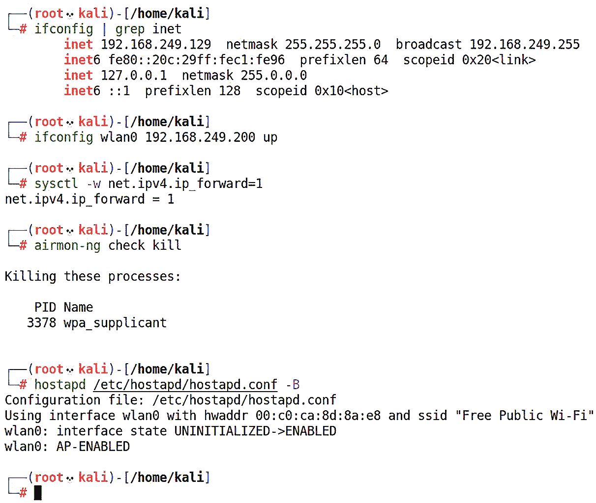

图 3.9 – 使用 hostapd 配置桥接嗅探

我给无线接口分配了一个在以太网接口网络中的 IP 地址。通过运行 `ifconfig` 并将输出通过 `grep` 管道传输，以便匹配 `inet`，我们可以确认分配的 IP 地址，所以我会选择同一子网中的另一个地址。我还运行了 `airmon-ng check kill` 来确保所有无线网络工具都被终止，因为它们会阻止 `hostapd` 正常工作。

我们上次使用了图形界面；这次我将保持简洁，只在一个新的终端窗口中运行这个命令：

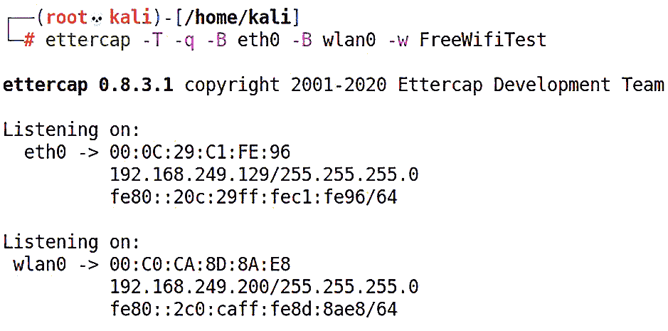

图 3.10 – 用 Ettercap 启动桥接

由于 Ettercap 在幕后强大的桥接和嗅探管理功能，这个命令非常简单：

+   `-T` 告诉 Ettercap 使用 *传统的* 纯文本界面。

+   `-q` 表示 *保持安静*。我们不希望 Ettercap 将每个数据包都报告到我们的接口；这正是我们捕获文件的用途。我们稍后会进行分析，而不是现在。让它静静地运行吧。

+   `-B` 启动 *桥接嗅探*。记住，我们需要两个接口（在我们的例子中是 `eth0` 和 **wlan0**），所以我会为每个接口运行这个标志两次。

+   `-w` 将把数据包写入 `.pcap` 文件，以便稍后在 Wireshark 中分析。

然后，我们必须进行普通的 Wireshark 分析。在这个特权位置下，我们可以继续进行更高级的攻击：

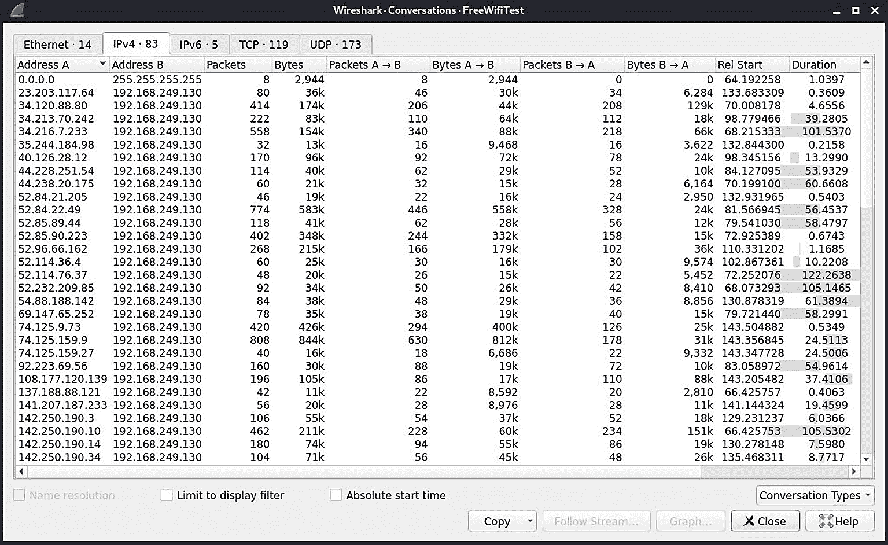

图 3.11 – 我们的桥接嗅探捕获文件的对话视图

现在，我们将拿出我们的外科手术刀，学习如何根据数据包的属性查找甚至操控数据包。

## Ettercap 过滤器 – 精细调整你的分析

我们已经看到 Ettercap 开箱即用的强大功能。Ettercap 之所以出色，是因为它的内容过滤引擎以及解释自定义脚本的能力。Ettercap 使得中间人攻击变得轻而易举；然而，通过使用过滤器，我们可以将运行 Ettercap 的 Kali 主机变成一个入侵检测系统（IDS）。想象一下，我们的桥接嗅探攻击和自定义过滤器的结合威力，这些过滤器已经设计好可以解释数据包并对其进行操作：丢弃它们，甚至在传输过程中修改它们。

让我们看看一个基础示例，激发一下我们的兴趣。你可能会立刻注意到类似 C 语言的语法和与 Wireshark 显示过滤器的相似性。这里有很多概念上的重叠；你会发现使用 Wireshark 分析模式可以生成一些强大的 Ettercap 过滤器：

```
if (ip.proto == TCP) {
```

```
  if (tcp.src == 80 || tcp.dst == 80) {
```

```
    msg("HTTP traffic detected.\n");
```

```
  }
```

```
}
```

简单来说，这表示 *测试 IP 协议是否为 TCP；如果是，再进行一次测试，看源端口是否为* `80` *，或者目标端口是否为* `80` *；如果其中一个为真，向用户显示一条消息，表示* **检测到 HTTP 流量**。这是一个嵌套 if 语句的例子，嵌入在图形括号中。

让我们来看看一个应该能引起你对 Scapy/Python 部分好奇心的功能：

```
if (ip.proto == TCP) {
```

```
  if (tcp.dst == 12345) {
```

```
    msg("Port 12345 pattern matched, executing script.\n");
```

```
    exec("./12345_exec");
```

```
  }
```

```
}
```

在这个示例中，我们正在测试任何目标端口为 `12345` 的 TCP 数据包。如果检测到该数据包，我们将提醒用户有可执行文件被触发。然后脚本会启动 `12345_exec`。我们也可以写一个 Python 脚本（是的，导入 Scapy 来构造数据包），在 Ettercap 中遇到某个条件时触发。

### 使用 Ettercap 过滤器终止连接

现在，让我们尝试构造一个过滤器，终止 SSH 和 SMTP 连接，同时允许其他所有流量。这将使我们在 Kali 机器上亲手设置基本的服务过滤机制。注意：我第一次尝试这个简短的过滤器时，它会包含一个有问题的函数。我们将回顾结果，看看能否修复这个问题。

首先，我将启动 nano 并创建一个包含这个过滤器的文件：

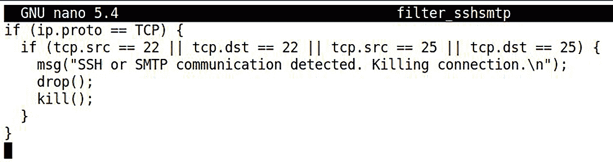

图 3.12 – 在 nano 中完成过滤器

让我们逐行回顾一下：

+   `if (ip.proto == TCP) {` 是我们的父级 `if` 语句，用来检查数据包是否为 TCP 数据包。如果是，脚本将继续执行。

+   `if (tcp.src == 22 || tcp.dst == 22 || tcp.src == 25 || tcp.dst == 25) {` 是嵌套的 if 语句，用来检查通过我们第一次检查的 TCP 数据包是否来自或目标是端口 `22` 或 `25`。双竖线表示 *或*，因此这四个检查中的任何一个都会通过 if 语句，使我们进入到以下函数：

    +   `msg()` 在我们的 Ettercap 窗口中显示一条信息。我建议始终使用这个函数，这样我们就能知道过滤器已被触发。

    +   `drop()` 只是丢弃数据包；由于我们处于数据包中间的位置，这意味着我们已接收到数据包，但不会将其转发给其他地方。发送方不会收到任何接收确认，而接收方也永远不会收到该数据包。

    +   `kill()` 变得更激进，向通信的两端发送一个 RST 数据包。

+   两个闭合的图形括号对应每个 `if` 语句。

我将使用 nano 保存这个文本文件，并准备编译它。

为什么我们要编译过滤器？因为解释代码的速度较慢，而我们处理的是数据包飞行中的分析和操作。编译器非常简单易用，并且已包含在内，因此我们可以直接执行命令，传入我们刚刚创建的文件名：

# etterfilter [过滤文本文件]

我们将看到编译器介绍自己，然后开始工作：

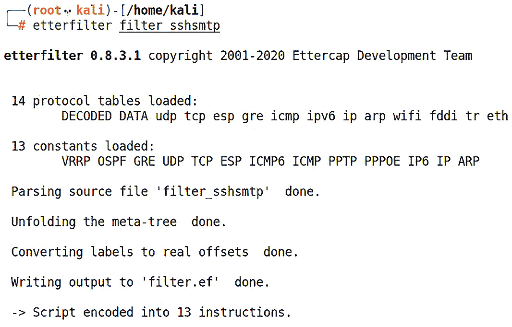

图 3.13 – 使用 etterfilter 编译我们的过滤器

默认输出为 `filter.ef`，但你可以将其命名为任何你想要的名字。

现在，我们可以像之前一样启动 Ettercap，但这次我们将使用 `-F` 加载过滤器。Ettercap 会自动完成其他所有工作：

# ettercap -T -q -F filter.ef -B eth0 -B wlan0 -w SSH_SMTP_Filter_Testcapture

我连接到我们那坏坏的网络，然后尝试连接到家里的 SSH 服务器。连接失败，就像我们计划的那样 —— 但控制台开始亮起我的过滤器信息。让我们在 Wireshark 中查看并通过端口 `22` 流量来过滤，看看发生了什么：

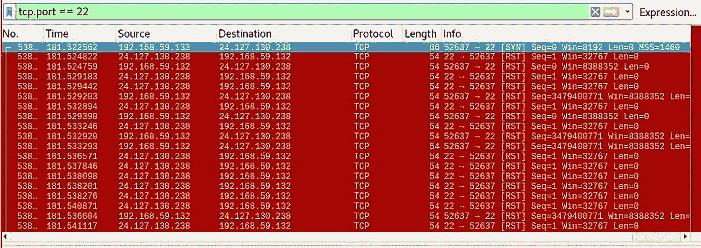

图 3.14 – 用 RST 数据包点亮局域网

什么鬼？短短几分钟内收到 26,792 个 RST 数据包！我们刚刚让自己被 RST 数据包淹没了。我们是怎么用这么一个小脚本做到这一点的？

我知道你心中的黑客正在想什么：*我们在桥接嗅探中加入了 kill 功能，所以过滤器正运行在两个接口上，并设计为匹配任何进出 SSH 的数据包，这也会包括我们的 RST 数据包*。做得好 —— 我印象深刻。我们重新编译一下脚本，去掉 `kill()`。

这样更好：

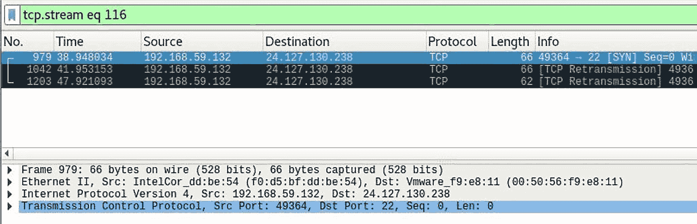

图 3.15 – 丢弃 kill 功能

网络恢复平静，我们的桥接器仅丢弃数据包，而不发送任何 RST 数据包。我们在受害者 Windows 机器上运行的 SSH 客户端永远也收不到它期待的 SYN-ACK：

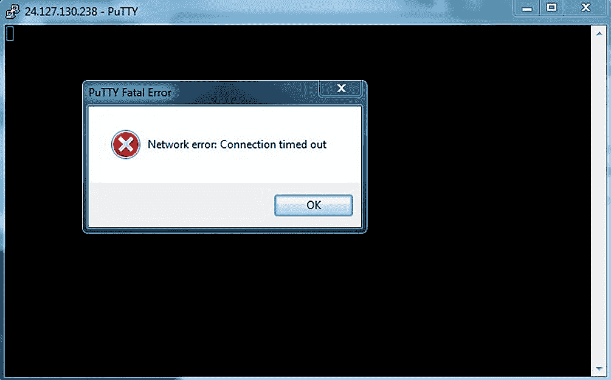

图 3.16 – 成功丢弃端口 22

每个优秀的渗透测试人员都会拥有多种工具。通常，这些工具的功能是相似的，但有的工具做得比其他工具更好，反之亦然。一个常见的痛点是，某些曾经强大的工具已经不再支持了，你只能使用那些十年前最后更新的工具。嘿，如果它没坏，别修理它 —— 有些攻击，例如 ARP 欺骗，核心技术多年未变。然而，曾经存在的漏洞会永远存在。Ettercap 已经证明了自己的实力，我们也见识了它的强大，但我将结束嗅探和欺骗的讨论，带来一个新面孔（相对而言）：BetterCAP。

# 变得更好 – 使用 BetterCAP 进行扫描、嗅探和欺骗

我们可以很容易地在 Kali 上启动并获取 BetterCAP，因为它已经包含在仓库中了：

# apt-get install bettercap

在我那时候，传统的 BetterCAP 使用的是命令行界面。现在，有了一个非常简洁的网页界面，把嗅探和欺骗带入了现代。像任何本地托管的网页界面一样，你需要注意登录时使用的凭证。拿起 nano 编辑器，配置 HTTP caplet 文件，路径为 `/usr/share/bettercap/caplets/http-ui.cap`：

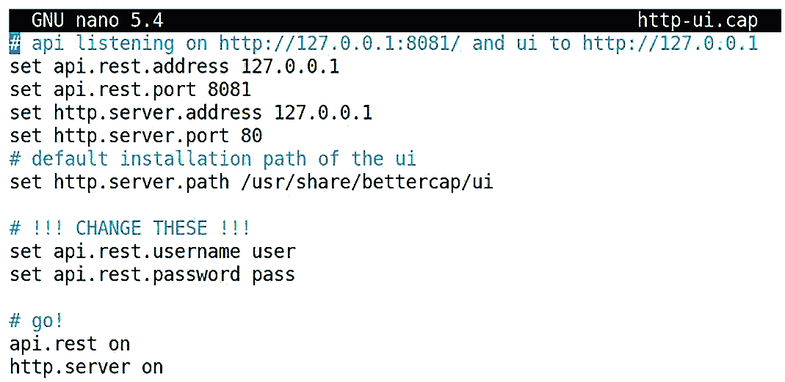

图 3.17 – 配置 HTTP UI

从命令行中休息一下

一旦通过 HTTP UI 登录后，你就可以在这里修改任何 caplet 参数，包括这里指定的用户名和密码。

现在，让我们通过运行 **bettercap –caplet http-ui** 命令来开始这个过程。然后，你可以打开浏览器并访问本地主机：

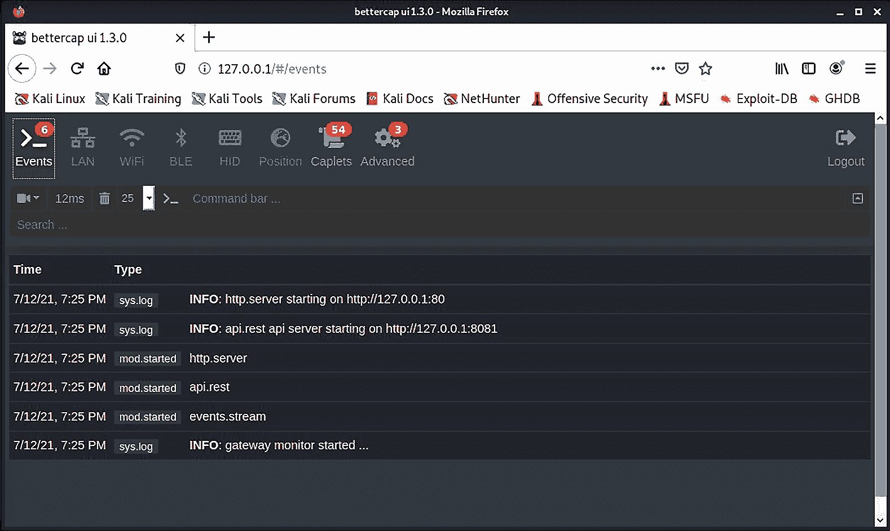

图 3.18 – BetterCAP 的事件窗口

我们的第一站是 **事件** 标签。你也可以留意终端窗口中的内容。由于我们还没有开始任何操作，这里没发生什么事情。让我们点击 `LAN` 标签，看看能否找到一些目标。点击 `net.probe` 的播放按钮，然后去喝杯咖啡，等待 BetterCAP 完成剩下的工作：


图 3.19 – 启动网络探测

立刻，我们开始对本地网络进行主机探测——哇哦，那些结果真是太快了！希望这让你感到担忧：不可能这么快而不产生大量噪音。那么，让我们在运行这个模块时查看一下 Wireshark：

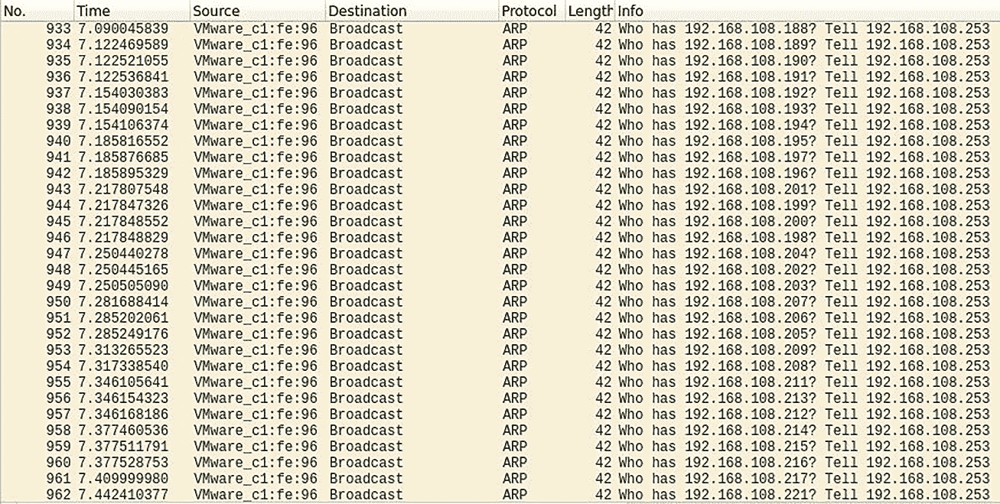

图 3.20 – net.probe 模块幕后

就是这样——它以每秒超过 80 次探测的速度对本地网络进行 ARP 扫描。在真实的渗透测试中，你可能希望将这个速度降低（除非你是在进行压力测试或向客户证明某些事情）。点击顶部的 **高级** 标签，在左侧的列表中找到 `net.probe` 模块，并根据需要调整 `net.probe.throttle` 的值：

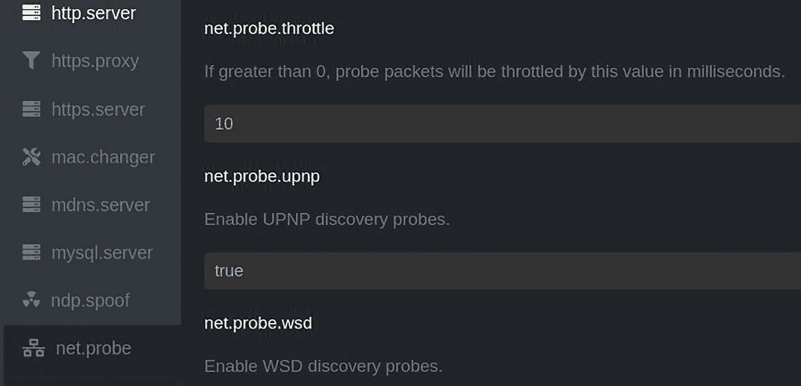

图 3.21 – 限制 LAN 探测速度

我知道你现在在想什么：*哇，这里有好多酷东西*。在这里，你可以感受一下安装的 caplets 及其工作原理。屏幕左侧列出了 BetterCAP 的功能。你会找到 `arp.spoof`，它可以通过一个漂亮的界面完成本章的工作（让开，Cain sniffers）。BetterCAP 提供的一些额外灵活性可以在 **参数** 下找到，包括以下内容：

+   `arp.spoof.fullduplex` 允许你仅对目标主机或对目标和网关的 ARP 表进行攻击。换句话说，你是只假装是目标主机，还是假装是目标主机和网关？由于目标主机打算与网关通信，将 `fullduplex` 设置为 `false` 意味着你只会看到目标主机的部分对话。这可能有助于保持低调。

+   `arp.spoof.internal` 仅攻击整个 LAN，允许你捕获主机之间的通信。这取决于你所处的具体环境。

+   `arp.spoof.skip_restore` 可以理解为您是否会粗鲁或礼貌地停止攻击。请记住，每台主机都独立维护 ARP 表；表只会在通过网络上的 ARP 数据包更新时才会更改。如果您运行攻击，获取所需的战利品，然后拔掉线逃跑，您会让网络寻找您的 MAC 地址。在这种情况下，恢复是我称之为重新 ARP 的操作。将 `skip_restore` 设置为 `true` 会更具破坏性。

+   `arp.spoof.targets` 允许您指定攻击目标。这个字段的好处是它也接受 Nmap 格式，因此更容易插入数据。

+   `arp.spoof.whitelist` 用于需要指定非目标的情况。

在 BetterCAP 中通常使用`set`命令的操作，在这里由 HTTP UI 处理。我最喜欢的是美学：它使客户的演示更加令人兴奋。

最后，点击 `Caplets` 选项卡，查看一下 BetterCAP 将您的接口置于所需的特权位置后可以执行的攻击。我喜欢将这些看作是使用 BetterCAP 的本机功能的 *配方*。例如，查看 `http-req-dump` 下的参数。您会看到它配置了 `net.probe`、`net.sniff`、`http.proxy`、`https.proxy` 和 `arp.spoof`。对于那些勇于尝试的人，您会发现对您需求的出色可配置性。

# 摘要

在本章中，我们学习 passvie 与 active 嗅探的区别。我们首先探讨了监视模式下的无线局域网，这使我们能够捕获数据而不暴露我们的存在。我们使用 Airodump-ng 来组织无线环境，并通过 Wireshark 进行更精确的嗅探。在使用 Wireshark 探索基础知识后，我们转向对 passvie 和 active 嗅探方法的高级统计分析。对于 active 嗅探阶段，我们连接到一个网络（从而暴露我们的存在），并捕获我们的卡可见的数据。我们应用高级显示过滤器来聚焦于即使在非常大的网络转储中也能找到有趣数据包。然后我们转向使用两个接口进行桥接嗅探的高级 Ettercap 嗅探技术。为了展示这种攻击的威力，我们配置了一个恶意访问点，并设置我们的 Kali 系统作为一个完整的流量拦截器和 IDS，包括使用 Ettercap 过滤器来捕获和丢弃网络中的特定数据。然后我们介绍了 BetterCAP，这是 Ettercap 的一个复杂的替代品。

在下一章中，我们将讨论 Windows 密码基础知识，并演示捕获 Windows 凭据的实际攻击方法，以及供给密码破解器使用的主机。然后我们将讨论密码破解方法。

# 问题

回答以下问题以测试你对本章的了解：

1.  你将你的无线网卡置于监视模式，并捕获未与 WLAN 关联的原始无线数据包。这是什么嗅探概念？

1.  接入点的 BSSID 与硬件的 _____________ 相同。

1.  在 Wireshark 中，参与会话的各个设备被称为 _____________。

1.  用于查找设置了 TCP ACK 标志的任何数据包的 Wireshark 显示过滤器叫什么？

1.  在编写 Ettercap 过滤器时，你可以在函数名称和开括号之间放置一个空格。（正确 | 错误）

1.  什么 Ettercap 过滤器函数会悄悄地阻止数据包传递到目的地？

1.  如何减少 Ettercap 命令行界面的详细程度？

1.  一个二进制 Ettercap 过滤器的文件扩展名是什么？

1.  ICMP 代表什么？

# 进一步阅读

有关本章涵盖的主题的更多信息，请查看以下资源：

+   Ettercap 主页：[`linux.die.net/man/8/ettercap`](https://linux.die.net/man/8/ettercap)

+   etterfilter 主页，包括有关脚本语法的详细信息：[`linux.die.net/man/8/etterfilter`](https://linux.die.net/man/8/etterfilter)

+   高级 Wireshark 使用指南：[`www.wireshark.org/docs/wsug_html_chunked/ChapterAdvanced.xhtml`](https://www.wireshark.org/docs/wsug_html_chunked/ChapterAdvanced.xhtml)

+   RFC 792：[`datatracker.ietf.org/doc/html/rfc792`](https://datatracker.ietf.org/doc/html/rfc792)

+   RFC 793：[`datatracker.ietf.org/doc/html/rfc793`](https://datatracker.ietf.org/doc/html/rfc793)
