# 第四章：网络上的 Windows 密码

很少有技术像`Windows** `密码**一样深刻地塑造了现代**信息安全**。`Windows`操作系统（**OS**）的极大普及使得其方法和安全性受到了严格审查。随着更多的目光聚焦于身份验证系统的安全性，便有更多的教训能够推动技术的成长和进步。另一方面，Windows 实现的一个主要目标是**向后兼容性**。这在实践中的含义是，即使有更安全的版本可用，甚至该更安全的版本已在同一环境中启用，老旧且脆弱的技术仍然出现在当今的 IT 环境中。本章将讨论一些超过二十年的技术，或许你会想，真的有必要继续关注这些内容吗？答案是，遗憾的是，必须的。你的客户可能会有自己的理由去配置系统以支持那些可以在几秒钟内破解的安全方法，但他们很可能并未真正意识到这些决策的影响。这就是你存在的意义，也是我在本书中加入这一章节的原因。

本章将涵盖以下内容：

+   Windows 密码哈希及设计缺陷的简要概述

+   使用认证捕获辅助模块介绍`Metasploit`

+   演示如何使用`Link-Local Multicast Name Resolution`（**LLMNR**）/`NetBIOS Name Service`（**NetBIOS NS**）欺骗技术来捕获 Windows 凭据

+   介绍两款流行的密码破解工具`John the Ripper`和`Hashcat`，以及修改参数的方法

# 技术要求

本章所需的技术要求如下：

+   一台运行`Kali** **Linux`的笔记本电脑

+   一台运行 Windows 的笔记本或台式电脑

# 理解 Windows 密码

想象一下你坐在 Windows 电脑前。你输入密码，电脑登录了。Windows 必须有某种方式来验证你的输入是否正确。通常我们会认为密码保存在电脑上，但有趣的是，密码并没有保存在电脑上。而是使用了密码的唯一表示形式，登录过程中你输入的内容与这种表示进行比较。如果它们匹配，Windows 就会认为你的输入与密码相同。这种表示 Windows 密码的方式被称为**哈希**。

## 哈希算法速成课程

哈希是一种单向函数；你无法通过哈希值反向推导出输入。哈希值是由算法定义的固定长度，而输入是可变长度的。你可以为一个字母或莎士比亚的全集创建`SHA-256`哈希值（256 位长）。

一些使用 SHA-256 的哈希示例包括以下内容：

+   `ASCII`字母*a*（小写）：

    ca978112ca1bbdcafac231b39a23dc4da786eff8147c4e72b9807

    785afee48bb

+   ASCII 字母 *A*（大写字母）：

    559aead08264d5795d3909718cdd05abd49572e84fe55590eef

    31a88a08fdffd

+   莎士比亚的 *《提图斯·安德罗尼克斯》*（完整剧本）：

    02b8d381c9e39d6189efbc9a42511bbcb2d423803bb86c28ae

    248e31918c3b9a

+   莎士比亚的 *《提图斯·安德罗尼克斯》*（但有一个单词拼写错误）：

    4487eba46b2327cfb59622a6b8984a74f1e1734285e4f8093fe

    242c885b4aadb

通过这些示例，你可以看到哈希算法的基本特性。输出是固定长度的。在这些示例中，输出是 64 个十六进制字符（一个十六进制字符长 4 位；256 除以 4 等于 64 个字符）。SHA-256 哈希总是 64 个字符，无论输入的长度是多少——即使长度为零！是的，甚至对于“什么也没有”的哈希值也是有的。即使对于像莎士比亚的 *《提图斯·安德罗尼克斯》* 这样的大量输入——共有 119 万个字符，哈希值仍然是 64 个字符。谈到哈希的安全应用，其中一个关键特性是：在莎士比亚的戏剧中，改变一个字符就能彻底改变哈希值。这是由于密码学中的一个原理，叫做 **雪崩效应**，它是安全算法的核心特性。

假设一个坏人捕获了代表我密码的哈希值。感谢雪崩效应，他仅凭哈希化他的猜测，是无法知道自己是否接近真实值的。他可能只错了一个字符，而哈希值就会完全不同。我知道你心中的黑客在想：“*从数学角度讲，只要固定长度的单向函数能够接受任意长度的输入，肯定总会有一对值会哈希成相同的输出。*”这是个非常聪明的观点，你说得对。这被称为 **碰撞**。任何安全哈希算法设计的主要目标都是减少碰撞的风险。从数学角度讲，你无法完全消除碰撞——你只能让它们极难找到，这样你不如直接去尝试找到目标输入。

现在，在讨论 Windows 安全时，最好不要深入探讨哈希的细节，因为，按照经典的 `Microsoft` 风格，他们总是要走自己的路。从操作系统历史上的任何一个时期来看，*Windows 哈希* 都不是普通的哈希。

## Windows 中的密码哈希方法

我们的旅程开始于遥远的过去。那是一个恐龙时代之后的时期，虽然距离恐龙时代并不远。我说的当然是 **LAN 管理器**（**LM**）哈希时代。

操作系统中有一个古老的概念叫做**网络操作系统**（**NOS**）。当你今天说到这些词时，你可能会被理解为指代网络设备（如路由器）上的操作系统（比如**思科` `IOS**）。但在过去，这是一种为网络任务（如客户端-服务器通信）优化的操作系统。这个概念诞生于个人计算从单一用户和计算机的孤立状态转变为多个用户共享网络上信息的时代。一个这样的 NOS 是微软的 LM。LM 曾经成功，但很快发现它存在严重的安全问题。于是微软将认证机制进行了增强，推出了一套新的协议称为`NT LAN Manager`（**NTLM**）。

在我们探索这些认证机制时，你需要知道有两种方式可以获得凭据 —— 通过网络，或者通过直接从**安全账户管理器**（**SAM**）中窃取哈希值。存储在 SAM 中的哈希只是密码的简单表示，而通过网络进行的认证则因为使用了**挑战-响应机制**变得更加复杂，接下来我们会讨论这个问题。

## 如果它以 1404EE 结尾，那么对我来说很容易 —— 理解 LM 哈希的缺陷

让我们来看一下几个密码的 LM 哈希，看看是否能发现一些明显的模式：

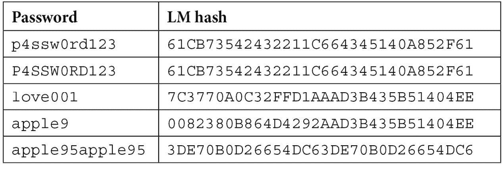

表格 4.1 – 不同输入的 LM 哈希表示

我们已经可以判断出，这并不是一个普通的哈希算法。

前两个密码具有相同的 LM 哈希。第三个和第四个密码的后半部分相同。最后，最后一个密码的前半部分重复了两次。通过这些信息，我们已经得出两个重要的结论：LM 密码不区分大小写，并且 LM 哈希是两个较小的哈希值连接在一起！一个用 LM 哈希保护的 Windows 密码实际上是两个七字符密码分别哈希后的结果。

那么，我们为什么要关心一个已经过时的算法呢？企业系统中常常需要向后兼容。即便是在使用更新且更强大的方法的系统中，LM 哈希也会默认存储，直到`Vista`发布。自 Vista 及以后版本开始，它可以被禁用。许多组织会启用 LM 哈希存储，以允许旧版应用程序正常运行。

为了数学地演示这个巨大问题，我们来计算一下只有字母和数字的 14 字符密码的总可能数量，并与七字符密码对的总数量进行比较：

+   14 字符密码的总可能数量：**36¹⁴ = 6.1409422 * 10²¹**（大约 6.1 戴克斯顿密码）

+   七字符对的总可能数量：**(36⁷) + (36⁷) = 156,728,328,192**（大约 156.7 亿个密码）

第二个数字只有第一个数字的 0.00000000255%大小。

随着`Windows NT`的出现，LM 哈希被 NT 哈希所取代。LM 哈希是基于`DES`的，只适用于非区分大小写、最多 14 个字符且被分成两部分的密码，而 NT 哈希是基于`MD4`的，计算密码的哈希值基于其 UTF-16 表示。无论哪种情况，结果都是 128 位长，并且都非常容易被攻击。

## 网络身份验证——完全是另一场游戏

到目前为止，我们已经讨论了将 Windows 哈希作为密码等价物，也讨论了我喜欢称之为*裸哈希*的内容。然而，这些哈希从未出现在网络中。哈希值成为加密挑战-响应机制中的共享密钥。在 NTLMv1 中，一旦客户端连接到服务器，一个随机的 8 字节数字会发送到客户端——这就是挑战。客户端拿到裸哈希后，在末尾添加一些填充，并将其分成三部分，然后分别与挑战一起使用 DES 加密——这就形成了一个 24 字节的响应。由于响应是通过挑战和共享密钥（哈希）生成的，服务器可以验证客户端。NTLMv2 在这一过程中加入了客户端挑战。密码破解者清楚这些协议的差异，因此你可以直接导入捕获的结果并开始破解。作为经验法则，更复杂的算法破解密码需要更多时间。

所以，你可以选择从 Windows 的 SAM 中窃取密码，或者监听加密的网络身份验证尝试。第一个选项能得到裸哈希，但它需要对目标进行攻破。我们将在本书后面讨论后期利用的内容，因此现在我们先看看攻击网络身份验证时会发生什么。

# 在网络上捕获 Windows 密码

在 Kali Linux 世界中，有不止一种方法可以设置**SMB 监听器**，但现在是时候介绍一个不需要介绍的框架：Metasploit。Metasploit 框架将在本书中覆盖的攻击中扮演重要角色，但在这里，我们仅简单设置一个快速且简单的方法，让网络上的任何 Windows 主机尝试文件共享连接。

我们使用以下命令启动 Metasploit 控制台：

# msfconsole

Metasploit 框架自带辅助模块——这些模块不是带有有效载荷的利用工具，不是用来获取 Shell 的，但它们在渗透测试中是非常有用的助手，因为它们可以执行像**模糊测试**或我们这次的**服务器身份验证捕获**这样的任务。你可以将这里的输出直接传递给密码破解工具或利用模块，继续推进你的攻击。为了了解可用的辅助模块，你可以在 MSF 提示符下输入以下命令：

显示辅助功能

我们将使用 SMB 捕获辅助模块。在配置监听器之前，让我们考虑一个实际的渗透测试场景，在这个场景中，这种攻击特别有用。

## 一个实际的渗透测试场景 – 喧闹的打印机

假设你通过穿着得体（西装、领带和假 ID）获得了一个设施的物理访问权限。走在办公室里，你注意到一台多功能打印机和扫描仪。一天中，你看到员工们手拿文件走到设备前，输入一些内容，扫描文件，然后回到自己的桌子。这里可能发生的情况是，扫描仪将图像保存到文件共享中，以便用户可以从计算机访问这些文件。为了实现这一点，打印机必须向文件共享进行身份验证。打印机通常会使用默认的管理员凭证，从而允许我们更改配置。使用的帐户通常是域管理员，或者至少具有访问高度敏感数据的权限。你如何修改打印机设置将取决于具体型号。在线搜索该型号的用户手册是显而易见的做法。

这个方法是暂时将目标共享更改为你 Kali 主机的 `UNC` 路径。当我这么做时，我密切关注屏幕；一旦捕获到身份验证尝试，我尽快恢复设置，以最小化任何怀疑。用户的文件不会被上传到文件共享；他们可能会认为这是暂时的故障，如果只发生一次，他们不会在意。但如果多个用户发现他们始终无法将文件上传到文件共享，IT 部门就会被通知。

## 配置我们的 SMB 监听器

我们已经启动并运行了 MSF 控制台，因此让我们设置 SMB 监听器。我们在 MSF 提示符下运行此命令：

使用 server/capture/smb

与任何 Metasploit 模块一样，我们可以使用以下命令查看此 SMB 捕获模块的可用选项：

显示选项

以下截图展示了前面命令的输出：

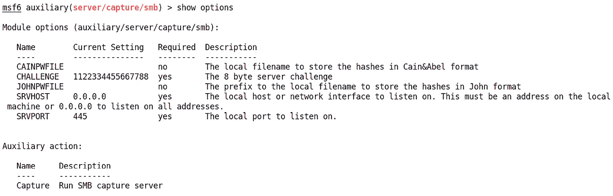

图 4.1 – SMB 捕获辅助模块的选项菜单

让我们更详细地看看这些设置：

+   `CAINPWFILE` 定义了捕获的哈希值将存储的位置，但采用 Cain 格式。`Cain`（为 Windows 编写的强大嗅探和破解套件）会在执行任务时捕获哈希值，然后你可以选择将数据保存以供后续使用。创建的文件将哈希值以 Cain 能识别的格式保存。你可以通过此标志将 Cain 指向此处创建的文件。我们不使用 Cain，因此将此项留空。

+   `CHALLENGE`定义了在身份验证过程开始时发送的服务器挑战。你会记得，通过网络捕获的哈希并不像你在 SAM 中看到的裸哈希那样直接，它们是密码的等效物。它们在挑战-响应机制中被加密。这对我们意味着，我们需要使用相同的*挑战*（即通常是随机生成的数字）来破解捕获的哈希——因此我们定义它，使其成为已知值。为什么是`1122334455667788`？这只是密码破解工具中常用的一个默认值。这里唯一的关键因素是我们可以预测这个挑战，因此，从理论上讲，你可以将这个数字设置为任何你想要的。我保留默认值，以便不必在稍后的破解配置中费心，但需要考虑的是，一个细心的管理员是否会注意到使用了可预测的挑战。看到 SMB 身份验证中的服务器挑战是`1122334455667788`，就可以明确知道你正在网络上进行恶作剧。

+   `JOHNPWFILE`与`CAINPWFILE`设置相同，但适用于 John the Ripper。我知道你这位 19 世纪的英国历史学家会说：“*他的名字是开膛手杰克*。”我指的是密码破解工具 John，通常简称为*John*。我们稍后会探讨 John，因为它可能是目前最流行的破解工具。现在，我在这里定义一个设置，因为 John 的格式相当通用，这会让我的破解工作更轻松。

+   `SRVHOST`定义了监听主机的 IP 地址。它必须指向你的攻击主机。`0.0.0.0`的默认值对于大多数情况应该是可以的，但当我们通过多个接口连接并具有不同的分配时，定义它会有所帮助。

+   `SRVPORT`定义了本地监听端口，正如你所想的那样，我们只会在特殊情况下更改它。通常它应该保持默认值`445`（SMB 通过 IP）。

这里描述的挑战/响应过程是 NTLMv1。NTLMv2 增加了客户端挑战的元素。破解者对此有所了解，我们的 SMB 捕获模块会在捕获身份验证尝试时显示客户端挑战。

让我们将`SRVHOST`定义为分配给我们接口的 IP 地址。首先，我将运行`ifconfig`并使用 grep 提取出`inet`，以查看我的 IP 地址，如下图所示：

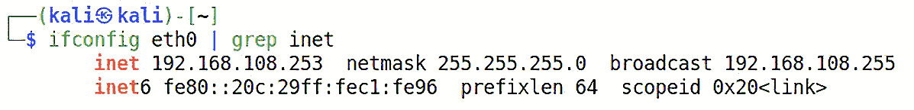

图 4.2 – 使用 grep 方便地显示 eth0 的 IP 地址分配

使用`set`命令，我们将`SRVHOST`定义为我们的 IP 地址——就这么简单。尽管这 technically 不是一个漏洞利用，我们仍然使用相同的命令来启动我们的模块，如下图所示：

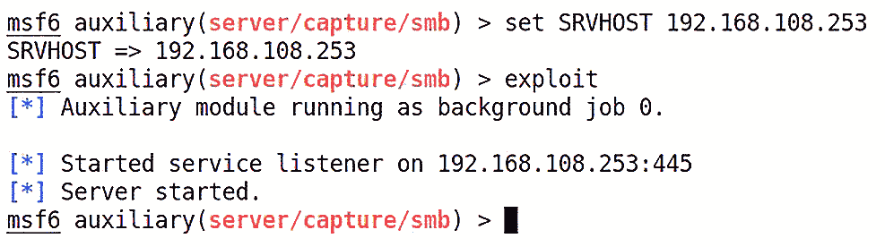

图 4.3 – 配置并启动 SMB 监听器

就是这样。SMB 监听器在后台运行，你可以继续工作。监听器正在运行，你只需要将目标指向你的 IP 地址。

查看用于捕获 NTLM 身份验证的 HTTP 方法。遵循相同的步骤，只需在 MSF 控制台提示符下输入以下命令：

```
use auxiliary/server/capture/http_ntlm
```

这将创建一个 HTTP 链接，用户将在浏览器中进行身份验证，这在某些社会工程学场景中可能会非常有用。你甚至可以对会话进行 SSL 加密。

## 身份验证捕获

天呐，成功了！屏幕上显示了捕获的身份验证尝试：

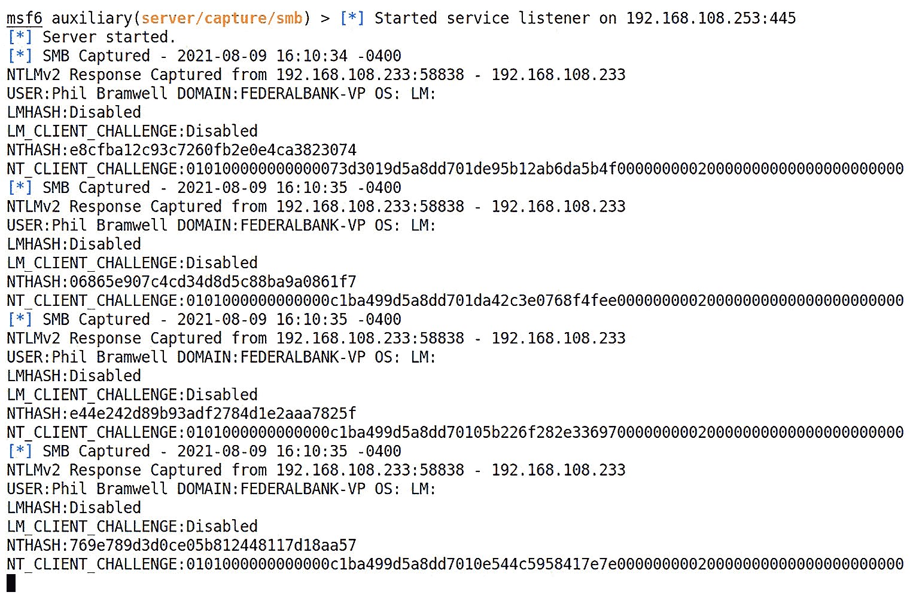

图 4.4 – 使用我们的监听器捕获网络凭证

我们可以在 nano 中打开我们的 John 捕获文件，查看格式化后的破解输出。请记住，该模块会将 John 文件命名为你指定的 `JOHNPWFILE`，并会附加检测到的哈希算法。这样做是为了让你可以独立攻击任何不同的捕获数据集，而无需先对其进行排序：

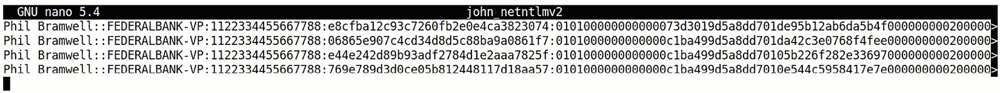

图 4.5 – John 格式化的凭证

在这个例子中，目标正在向我们发送 NTLMv2 凭证。稍后在本书中，我们将讨论在已攻陷主机的后期利用中如何降低安全性，以便捕获弱哈希。

这个攻击成功了，但有一个困扰我们的问题：我们必须欺骗设备让它尝试与我们的 Kali 机器进行身份验证。对于打印机，我们必须修改其配置，而成功的攻击意味着无辜用户的数据丢失，如果我们希望异常被忽视，我们的时机必须完美无缺。让我们研究另一种捕获 Windows 身份验证尝试的方法，这次我们将在系统查找本地共享时捕获凭证。

## 使用 LLMNR/NetBIOS NS 欺骗捕获哈希

Windows 计算机就像兄弟一样，总是愿意在另一个主机迷失和孤单时提供帮助。我们已经习惯依赖 DNS 进行名称解析。我们要查找一个名字，查询我们的 DNS 服务器，如果 DNS 服务器没有匹配的记录，它会将请求转发给下一个 DNS 服务器。它是一个层级结构，最远可以到达整个互联网的最高名称权限。另一方面，本地 Windows 网络是一个特别的俱乐部。当你和另一台 Windows 计算机共享同一本地链路时，你可以广播你的名称请求，其他 Windows 计算机会听到并返回名称（如果它们有的话）。这种协议的数据包甚至具有类似 DNS 的结构。主要的不同在于它不是层级的；它仅限于链路本地，并且无法穿越路由器（你能想象如果它能穿越路由器，会造成大规模的 **分布式拒绝服务攻击**(**DDoS**) 吗？）这种特殊的 Windows 功能叫做 `LLMNR`，它的前身是 `NetBIOS NS`。它不一定要*开启*，安全网络应该通过组策略禁用它，让 DNS 执行其工作。然而，它往往被忽视。

我知道你心里的黑客在说：“*既然 LLMNR 和 NetBIOS NS 是广播协议，并依赖于共享链路的机器的响应，我们应该能够伪造回复，将请求指向任意本地主机。*” 这是一个很好的观点！既然我们在讨论本地 Windows 资源，将对文件共享的请求重定向到我们的监听器将导致受害者进行身份验证，唯一不同的是这次我们等待目标发起通信——这里不需要社交工程技巧。

让我们直接开始吧。实现这一点有几种方法，包括使用 Metasploit。但我将展示在 Kali 中一种快速简便的方法：使用 `Responder`，一个简单的 `Python` 工具，它只会监听这些特殊格式的广播并返回伪造的答案。记住，我们是在监听广播——不进行任意嗅探、不做 ARP 欺骗、也不涉及中间人攻击。我们只是监听那些按设计实际上是发给子网内所有人的消息。

启动 Responder 的帮助页面，使用以下命令查看其功能：

# responder -h

设置你的接口，Responder 会做其余的。不过，看看 **–-lm** 选项。它允许我们执行以下操作：“*强制 Windows XP/2003 及更早版本使用 LM 哈希降级*。”你可能会想，“*我的目标运行的是 Windows 10 或 7——那应该不再有效了吧？*”我希望这是完全正确的，但这里有两个因素。首先，记住向后兼容性的需求仍然非常常见；其次，记住这个标志通常会迫使通信降级到某个方面。例如，在本书的第一版中，我们展示了如何使用此功能将通信降级到 NTLMv1。今天，在我们的实验室中使用 Windows 10，我们发现 Responder 成功地将 SMBv2 降级到了较旧且不那么安全的 SMBv1。一个最重要的黑客人生课程就是，我们的大多数成功，实际上只是许多小成功的积累。

考虑到这一点，我将使用以下命令设置我的监听器：

# responder –I eth0 --lm

首先，我们看到的是已启用和已禁用功能的概述。如果你喜欢这些功能中的某些，可以花时间玩一玩它们。例如，Responder 是一个很棒的快速简便的纯 HTTP 凭证收集工具。让我们看看开始捕获事件时的样子：

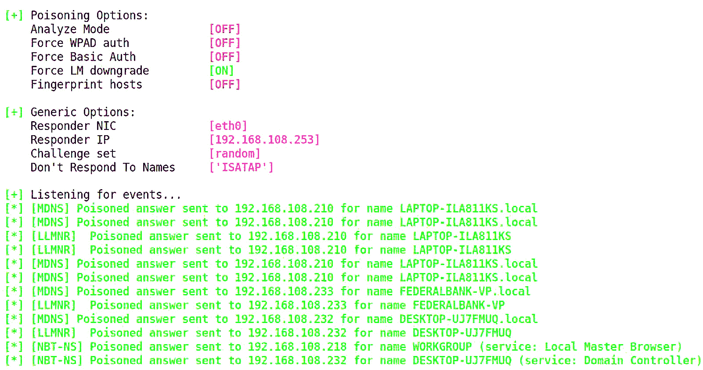

图 4.6 – Responder 捕获的中毒事件实时展示

与此同时，在我们的目标计算机上——哦，天哪！我打错了我需要访问的打印机共享文件的名称。唉，算了，我再试一次。

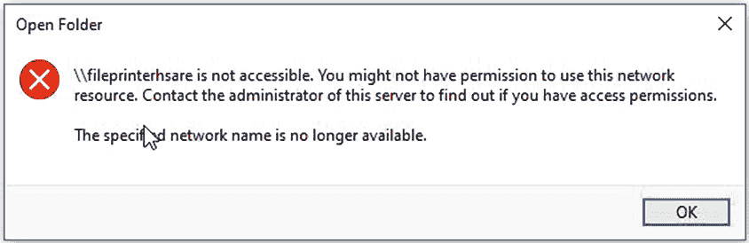

图 4.7 – 受害者看到的内容

与此同时，在我们的攻击 Kali 服务器上——太好了，我们得到了一个 NTLMv2 认证尝试。这个工具的唯一缺点是它没有花时间将好东西精心包装给我们的亲爱的朋友 John，所以请相应地准备输入给你的破解工具。以下是 Responder 给我们展示的内容。请注意，我们可以直接从这个窗口复制和粘贴：

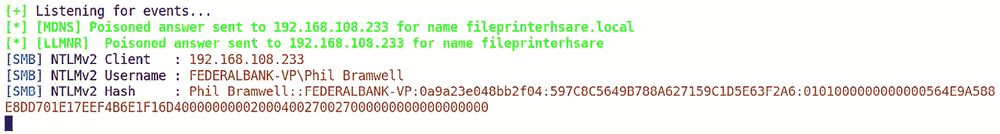

图 4.8 – LLMNR 中毒响应抓取凭证

你可能注意到我们没有定义服务器挑战！没错，我们没有。挑战是随机生成的，你需要确保你的破解工具使用正确的挑战值。

我们已经看过如何从网络中抓取 Windows 哈希。现在，我们有了一些看起来相当诱人的凭证，期待着破解它们，并希望能够用来登录各种服务，毕竟我们都知道密码重用有多么狡猾，不管你在渗透测试客户的培训多么好。接下来，让我们进入密码破解的艺术。

# 开始破解——破解 Windows 哈希

密码破解一直是我每次评估中最喜欢的部分之一。不仅仅是看着数以万计的账户屈服于即使是一台普通的个人电脑也具备的强大计算能力的刺激 – 对客户而言，这是你可以做的最有用的事情之一。当然，你可以进行渗透测试并交出一份外观漂亮的报告，但真正影响的是结果，它可能是区别于仅仅遵从最低合规标准和真正努力影响组织变革之间的差异。对一家银行的高管展示他们个人密码绝对是最能体现“影响力”的事情之一。

在我们看工具之前，有一些基础知识我们需要了解。我们需要了解哈希破解的实际工作是什么，并将一些人类心理学应用到我们的策略中。这是密码破解的另一个方面，使其如此有趣：科学和艺术如何理解人们的思维方式。

## 密码破解的两种哲学

你会看到两种主要的密码破解方法 – *字典* 和 *暴力破解*。这种区分有点名不副实；哈希函数是单向函数，所以我们实际上无法击败算法找到原始文本 – 我们只能找到碰撞（其中一个将是原始文本）。在这个大海捞针的工作中，没有捷径，因此，任何策略从技术上讲都是利用暴力计算速度。因此，在这种情况下：

+   **字典攻击**：这种攻击使用预定义的数值列表进行哈希。这个列表通常被称为**字典**或**字典文件**。可以按照定义使用字典，直到字典文件耗尽为止，或者可以使用规则对其进行修改，使攻击变成混合攻击。规则会对字典应用特定的修改，以搜索原始单词的变体。例如，想象一下，字典文件中的条目是`password`。一条规则可能会告诉破解者尝试将初始字母大写，然后在末尾添加一个数字，`0-9`。这将扩展实际搜索的字典文件，包括`password1`、`password2`等等。当我们考虑到密码创建习惯和人性化适应企业密码政策时，规则集往往是我们成功破解的黄金钥匙。对于单词*字典*要小心，因为这与你书架上的*英语词典*不同。例如，假设电视上的一部流行情景喜剧使用了一个虚构的词*shnerfles*作为笑话。人们观看节目，喜欢这个笑话，并开始在他们的密码中加入这个词以便记住密码。尽管*shnerfles*不会出现在英语词典中，但任何聪明的密码破解者早已将这个词包含在他们的字典文件中。

+   **暴力破解攻击**：这将组合出给定字符集的所有可能组合。按其本质，纯暴力破解攻击可能需要很长时间才能完成。而对于字典攻击，我们使用*规则集*来增强攻击，我们可以通过*掩码*修改暴力破解攻击的猜测。掩码允许我们为密码的某些位置定义不同的字符集，从而大大缩小搜索空间。例如，假设我们要查找任何字母组合，不仅仅是可能出现在字典列表中的单词，但我们假设用户将第一个字母大写，然后在末尾加了几个数字。在这个例子中，掩码会为第一个字符位置设置大写字母字符集，接下来的字母可以是大写或小写字母，最后两个字符位置只能是数字。为了更好地理解这能对搜索产生的影响，假设我们要查找一个 10 字符的密码，可用字符为`a**-**z`、`A**-**Z`、`0**-**9`，以及键盘上方的 13 个符号。那么，我们将应用一个掩码，只搜索以大写字母开头，并且最后两个字符只能是数字的密码。

    +   **没有掩码**：**((26 * 2) + 10 + 13) ^ 10 = 5.6313515 * 10¹⁸**（大约 5.63 quintillion 个密码）

    +   **有掩码**：**26 * (75⁷) * (10²) = 3.4705811 * 10¹⁶**（大约 34.7 quadrillion 个密码）

你可能会看着这个数字想，“*这两个数字都太大了*。”但通过一个非常简单的掩码——前面一个大写字母，后面两个数字——我们将搜索空间减少了超过 99.3%。如果我们拥有足够的计算能力，能够在四天内处理未加掩码的空间，使用这个掩码后，我们将把时间缩短到大约 36 分钟。如你所见，掩码对暴力破解的作用，就像规则集对字典攻击的作用一样：在你将哈希值从域控制器导出到客户网络时，它基本上是成功的金钥。

两种修改方法的关键点在于针对密码选择的*心理因素*。对于已知的词汇，很少有人会在不改变某个字符的情况下使用一个单词（实际上，许多公司密码政策根本不允许未修改的词典单词）。对于暴力破解攻击，极少有人会选择`kQM6R#ah*p`作为密码，但我们刚才描述的未加掩码的 10 字符搜索将检查它以及其他数万亿个不太可能的选择。

而规则*增加*了字典攻击的搜索空间，掩码的设计目的是*减少*暴力破解攻击的搜索空间。

## 使用字典列表进行 John the Ripper 破解

找到合适的词典并构建你自己的词典是一个大话题。幸运的是，Kali 内置了一些词典。对于我们的演示，我们将使用`rockyou`词典——它很流行，而且相当庞大。不过，我建议你始终将其视为通用词典。仅携带`rockyou`并期望自己能成为密码破解者，就像携带一把单一的螺丝刀并期待成为维修工人一样。当然，你会遇到偶尔适用的情况，但你会遇到不同大小的螺丝，你需要合适的工具来完成工作。当我为客户工作时，我有很多词典，而且我常常在路上建立新的词典。当我为俄亥俄州的公司工作时，我确保`buckeyes`出现在我的词典中。同样地，当我为密歇根州的公司工作时，我确保`spartans`出现在我的词典中。这些词是运动队的名字——中西部的美国人热爱他们的橄榄球，虽然政策不会让他们仅仅凭借这些词就能通过，但我通过破解这两个词并将攻击与规则集混合使用，获得了大量的密码。当然，`rockyou`和任何其他词典不过是一个被美化的文本文件。所以，每当想到时，尽管添加内容！

Kali 将词典保存在`/usr/share/wordlists`中，所以让我们去那里并解压`rockyou`：

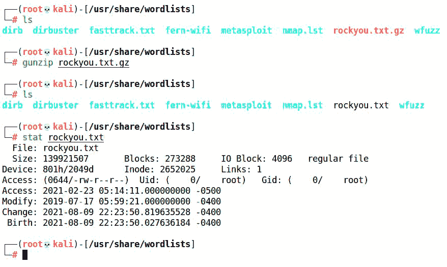

图 4.9 – 提取 rockyou 词典

现在我们有了一个词典，是时候查看 John 的配置文件，了解所有的“魔法”定义了什么。运行这个命令在 nano 中打开它，记住它是一个非常大的文件：

# nano /etc/john/john.conf

这里有很多内容，我鼓励你阅读详细手册——但最重要的部分在底部，那里定义了规则集。约定是：`[list.rules:NAME]`，其中`NAME`是你在命令行中定义的规则集名称。你甚至可以使用`.include`将规则集嵌套在其他规则集中。当你需要定义自定义规则但又需要包含基础规则时，这将节省你的时间：

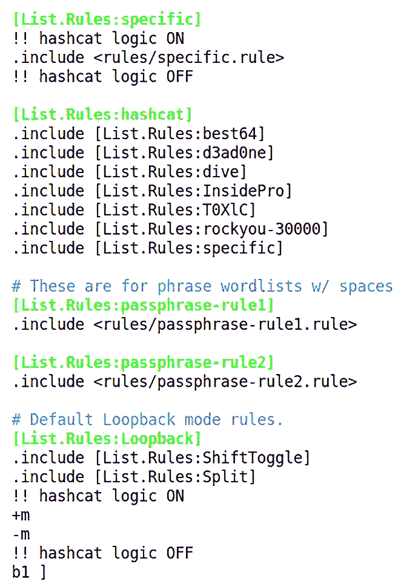

图 4.10 – 查看 John 配置文件

让我们坦诚一点，当你第一次遇到规则语法时，它看起来就像外星语言。掌握 John 规则语法超出了本讨论的范围，但我建议你查看配置文件中的注释，并尝试一些基础知识。`Single`规则集为我们做了一些有用的修改，并且在快速的 CPU 上运行并不需要太长时间，所以让我们尝试一下用从网络上获取的哈希值：

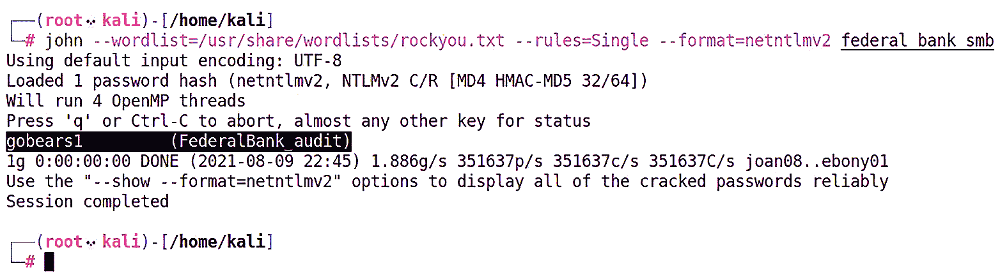

图 4.11 – 用 John 破解我们捕获的哈希

+   `--wordlist`定义了字典文件（也就是我们演示中的**rockyou**）。

+   `--rules` 定义了规则集，该规则集在 `john.conf` 中进行了定义。

+   `--format` 是导入的哈希类型（在我们的案例中是 **NetNTLMv2**）。

破解的密码显示在左侧，右侧是对应的用户名，括号中注明。你可以按任意键（除了 *q*，它会退出）查看破解状态，包括完成百分比和预计完成的本地时间。

## 使用 John the Ripper 破解与掩码

我们可以使用掩码来定位特定模式，而无需使用字典列表。掩码遵循简单的语法，每个字符模式类型都通过范围或带有问号的占位符来定义。例如，大写字母（ASCII）将用 `?u` 来定义，然后将其放置在所需的字符位置。

我们来看一些示例：

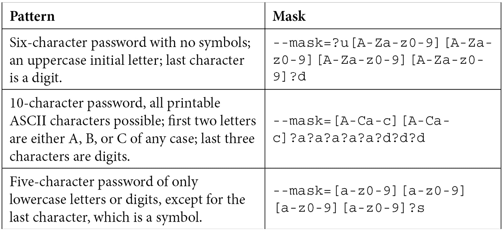

表格 4.2 – 掩码示例

一种特殊类型的掩码是 *堆叠*，它将字典破解与掩码结合起来。语法与普通掩码类似，只不过我们的 `?w` 占位符定义了列表中的单个单词。例如，使用 `--wordlist=` 定义一个单词列表，然后用 `?w?d?d?d?d` 定义一个掩码，这样就会从单词列表中取出一个单词，并查找该单词与四个数字组合的所有可能性。

## 使用展示标志回顾你的进展

尽管 John 在破解过程中会显示大量数据，但知道我们的结果会自动保存在某个地方，以便我们可以以干净的格式查看它们，还是很不错的。John 通过在我们重新启动 John 时将破解的哈希值存档，使得大规模输入文件的管理变得轻而易举。

例如，假设我们正在破解 25 个哈希值，而今天我们只有 5 个小时来破解它们，但明天我们可以继续工作几个小时。我们可以设置攻击，让 John 运行 5 小时，然后用 *q* 或 *Ctrl* + *C* 中止。假设在这段时间内我们恢复了 10 个密码。当我们明天重新启动 John 时，这 10 个密码已经被单独保存，John 将开始破解剩余的 15 个。

与其拥有一个我们单独查看的输出文件，John 被设计为让我们通过 `--show` 标志直接查看结果：

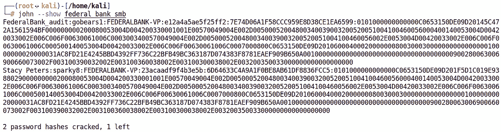

图 4.12 – John 展示标志

将这些数据导出为 `Excel` 电子表格，使用冒号分隔数据，这样你就能为管理即使是大规模的破解项目提供提前的支持。

## 喵喵喵 – 开始使用 Hashcat

尽管我们花了大量时间与 John 一起工作，但我必须坦诚—我现在甚至不再使用它了。迄今为止，最强大的通用密码破解工具是 `Hashcat`，它已包含在 Kali 中。你可能会想，既然 Hashcat 是最好的，为什么我不一开始就使用它呢？嗯，今天最好的工具站在昨天的冠军肩膀上，而 John 是理解破解工作原理的完美入门工具。等你准备好迎接下一个层次时，Hashcat 会为你提供支持。

Hashcat 有什么特别之处？主要优势就是其原始速度——Hashcat 因其硬件优化而更加快速。如果你有较慢的硬件，并且试图挤出每一秒的哈希值，Hashcat 非常适合你。另一方面，如果你有一台强大的 PC，Hashcat 利用 GPU 性能的能力将令你震撼。如果你在游戏笔记本上安装了 Kali，那就系好安全带吧。

首先，我们将启动帮助页面——这个破解工具非常强大：

```
# hashcat –-help
```

是的，这是一个信息墙。不要感到害怕——它非常合乎逻辑，一旦你习惯了，它的功能灵活性将让你惊讶。你需要了解的主要概念如下：

+   攻击模式

+   哈希模式

+   词表/字符集/规则

*哈希模式* 指的是你正在破解的哈希类型。Hashcat 支持的哈希类型种类繁多，所以确保查看帮助页面，了解完整的哈希类型范围。你会很快发现，它不仅仅是哈希——你甚至可以尝试破解被锁定的 `PDF` 或 `7-Zip` 文件。我们在前面的例子中已经研究了 Net-NTLMv2，所以今天我们将使用哈希模式 `5600`。

Hashcat 有两种字典攻击方式——*直攻*和*组合*。*组合攻击模式*允许你指定一个或两个词表，它会将每个词表中的单词组合在一起。例如，假设某人的密码包含 `hardlypickled`。你可能不会在词表中找到这个单词（现在我在书中写了它，可能在更新的词表中会出现，但我偏题了）。然而，你会在英文词表中找到 `hardly` 和 `pickled`，而组合攻击模式就是用来找到它们在密码中的组合的。

*暴力破解模式* 不言自明，但 Hashcat 在这方面表现得异常出色。你需要指定字符集，并使用问号占位符（像我们在 John 中使用的那样）来指定密码长度。占位符代码非常直观——`?l` 表示所有小写字母，`?u` 表示所有大写字母，`?d` 表示数字，`?s` 表示符号。`?a` 表示 *全部*，它是这四种字符集的组合。直攻和组合攻击都很棒，但这种精细调优的暴力破解攻击，加上强劲 GPU 的速度，就是我在职业生涯中破解大多数密码的方法。正如我们所讨论的，人在破解密码时的记忆起着主导作用。让我们来看个例子。

假设我们想要通过暴力破解攻击尽可能多地捕获 10 个字符的密码。我们知道密码策略要求至少包含一个符号、一个数字和一个大写字母。虽然很多人会将所需的符号放在任意位置，但*易记*的密码更可能将其放在单词后面或密码的最后。至于数字，可能会有任意数量的数字，但*易记*的密码通常会有两位或四位数字来表示一个有意义的年份。当然，大写字母很可能是密码的第一个字符。了解并假设这些情况后，让我们看看一些可能的命令：

+   **# hashcat -m 5600 –a 3 ntlm.txt ?u?a?a?a?a?s?d?d?d?d**

+   **# hashcat -m 5600 –a 3 ntlm.txt ?u?a?a?a?a?d?d?d?d?s**

+   **# hashcat –m 5600 –a 3 ntlm.txt ?u?a?a?a?a?a?a?d?d?s**

这三种情况的密码在开头都会有一个大写字母。第一个密码会在单词后面（单词可以由字母、数字或符号组成）加上一个符号，后面跟四个数字。第二个密码则将符号放在四个数字后面。最后一个密码使用两个数字。

当然，这些命令仅查找正好 10 个字符长的密码。设置 **–i** 标志后，您启用了*增量模式*，该模式将搜索所有最大长度以内的密码。如果使用此功能，请记住，**状态**窗口会显示当前长度的时间估算。

一旦开始攻击，按下 *s* 键以获取状态更新：

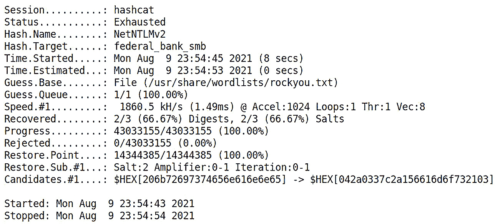

图 4.13 – Hashcat 完成其攻击

由于密码破解的正确处理方式本身可能是一整本书的内容，因此我们在这里并没有完成这个话题。我们将在*第十六章*《提升权限》中，探讨如何对被攻破的主机进行哈希值提取，因此我们会再次回顾如何在大规模数据输入下进行破解。

# 总结

在本章中，我们介绍了 Windows 密码及其哈希表示的基本理论。我们查看了 SAM 中存储的原始哈希以及加密的网络哈希。接着，我们回顾了使 Windows 哈希成为渗透测试人员极具吸引力目标的基本设计缺陷。首次介绍了 Metasploit 框架，演示了辅助模块。我们使用 SMB 监听模块来捕获来自网络中误导的 Windows 目标的认证尝试。然后，我们演示了一种可以欺骗目标通过我们的机器进行身份验证的本地链接名称服务欺骗技术。通过从我们的演示中捕获的凭证，我们继续使用 John the Ripper 和 Hashcat 进行实际的密码破解。我们介绍了 John 的两种主要密码破解方法，并演示了如何针对人的因素精细调整攻击。

在下一章中，我们将探讨更复杂的网络攻击。我们将深入了解 Nmap 在侦察和规避中的细节。我们将研究路由攻击和软件升级攻击，并且从渗透测试的角度讲解`IPv6`的相关内容。

# 问题

回答以下问题，以测试你对本章内容的掌握。

1.  向哈希函数输入空值会产生空输出。对还是错？

1.  ____ 效应指的是密码学特性，其中对输入值的微小变化会导致输出值发生剧烈变化。

1.  哪两种设计缺陷会导致存储为 LM 哈希的 14 字符密码变得更容易破解？

1.  为什么在捕获 Net-NTLMv1 时我们需要定义服务器挑战？

1.  LLMNR 的前身是什么？

1.  字典规则集减少了搜索空间，而掩码则增加了暴力破解的搜索空间。对还是错？

1.  要找到一个五个字符的密码，前两个字符是数字，接下来是一个符号，剩下的两个字符是字母（大写或小写），并且它们必须位于字母表中的`Q`（包含）之后，你会使用什么掩码？

1.  Jack the Ripper 是最流行的密码破解工具。对还是错？

# 进一步阅读

若要获取有关本章所涵盖主题的更多信息，请查看以下资源：

+   John the Ripper 的掩码语法：

[`github.com/magnumripper/JohnTheRipper/blob/bleeding-jumbo/doc/MASK`](https://github.com/magnumripper/JohnTheRipper/blob/bleeding-jumbo/doc/MASK)

+   John the Ripper 的规则语法：

[`www.openwall.com/john/doc/RULES.shtml`](http://www.openwall.com/john/doc/RULES.shtml)

+   Metasploit 中捕获辅助模块的概述：

[`www.offensive-security.com/metasploit-unleashed/server-capture-auxiliary-modules/`](https://www.offensive-security.com/metasploit-unleashed/server-capture-auxiliary-modules/)
