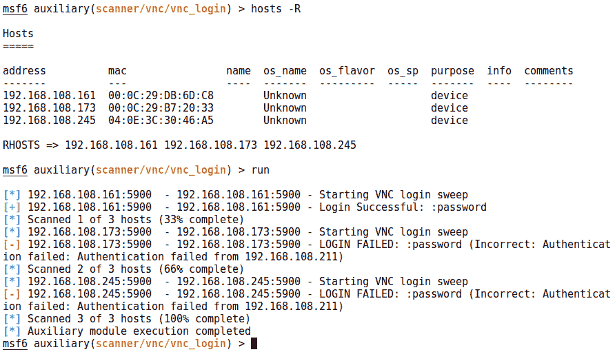
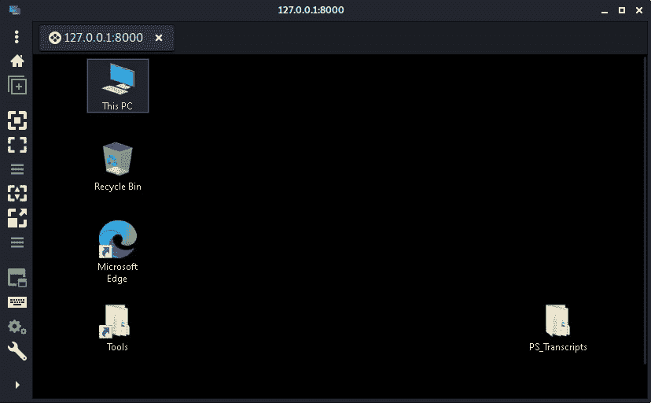

# 第五章：评估网络安全

在前几章中，我们在网络中探索了很多有趣的内容。重点是中间人攻击，原因显而易见 - 当正确执行时，它们特别具有破坏性。然而，当你教育客户时，你的重点应该是这些都是相当古老的攻击，然而它们仍然经常有效。

其中一个原因是我们在网络中仍然依赖非常老旧的技术，而中间人攻击通常利用协议层面的固有设计漏洞。考虑到互联网协议套件，构成了我们今天所知的互联网 - 最初导致 TCP/IP 的研究可以追溯到 1960 年代，官方的激活和采用在 1980 年代初开始获得关注。老旧并不一定意味着不安全，但问题在于这些协议设计时的背景 - 那时候并没有数以百万计的设备连接到网络，由从地下室的青少年到奶奶在家中操作，它们也没有被嵌入到从核电站的物理机制到郊区家庭冰箱的各种设备中的网络堆栈支持，发送数据包以提醒某人他们的牛奶即将用完。这种采纳和传播方式并未被考虑；事实上，对节点的物理访问是严格控制的。这种固有问题并未被忽视 - 下一代互联网协议 IPv6 在 1990 年代末正式定义（最近一篇 RFC 于 2017 年发布）。我们将在本章讨论 IPv6，但也会演示如何将 IPv4 与 IPv6 实际接口化。这突显了采用速度缓慢以及在使 IPv6 在 IPv4 环境中良好运行方面投入了大量精力，确保我们将继续使用 IPv4 的所有固有不安全功能。

作为一名工作中的渗透测试员，看到你的系统上弹出 shell 是令人兴奋的。但当游戏结束时，你将面对大量的发现，这些发现将在报告中向客户展示。记住，你的工作是帮助客户保护他们的企业，而不仅仅是软件漏洞。寻找机会来教育和提醒。

在本章中，我们将涵盖以下主题：

+   使用 Nmap 进行网络探测

+   使用 BetterCAP 探索二进制注入

+   数据走私 - 使用 HTTPTunnel 规避防火墙

+   IPv6 寻址、侦察、中间人攻击，以及从 IPv4 进行映射

# 技术要求

对于这一章，你将需要一台运行 Kali Linux 的笔记本电脑。

# 使用 Nmap 进行网络探测

让我们来玩一场 *Jeopardy*（危险边缘）。这是答案——“*这款网络映射工具首次发布于 24 年前，当它在好莱坞电影中的精准描绘引起轰动时，苏格兰场等组织提醒公众，它的使用可能是非法的*。”如果你回答“*这是什么 Nmap?*”作为问题，那么你就赢得了这个每日双倍奖。Nmap 是几乎所有从事网络计算机工作的人必备的工具。Nmap 意味着 **网络映射器**，它在安全领域之外的多种学科中都很有用：网络工程、系统管理等。Nmap 的创新之处在于，它允许你发送的探针高度自定义，可以产生独特的响应，揭示大量目标信息，甚至能找到穿越防火墙的捷径。

Nmap 是俚语“**瑞士军刀**”的化身，接下来我们来解析它的主要用途。

## 主机发现

Nmap 可以执行 ping 和端口扫描，但这不是普通的扫描器——它允许你发送多种探针来提高找到目标的机会。你可以简单地 ping 目标，也可以向某些端口发送特定的轻量级探针。整体思路是发送某些内容来激发目标的响应。这里的灵活性使得 Nmap 成为任何管理员以及渗透测试者的理想伙伴。

### 列表扫描（-sL）

这仅仅列出了扫描的主机，包括沿途的反向 DNS 查找。然而，不会向目标发送任何流量。这对于验证你正在使用的 IP 范围非常有用。

### Ping 扫描（-sn）

Ping 扫描允许你有效地对目标进行 *ping 扫描*——也就是说，不进行端口扫描，但与列表扫描不同，我们会向目标发送以 ping 形式的数据（具体来说，是 ICMP ECHO 请求）。在默认设置下，*会有一些*端口活动——Nmap 会向端口 `443` 发送 SYN 向端口 `80` 发送 ACK 并发送 ICMP 时间戳请求。这可以与下文讨论的发现探针结合使用，在这种情况下会跳过默认行为。

### 跳过主机发现（-Pn）

这是为那些明确知道自己需要什么的 Nmap 用户设置的：它不会去确定主机是否在线，因此它有效地将 *范围内的每个 IP 地址* 都视为在线。你可能会在某些情况下使用这个选项，比如当你不完全信任主机发现的结果时。防火墙可以被配置为让在线主机对流行的发现方法保持沉默。这个设置的好处是，你可以确保在端口扫描开始时没有主机会被忽略。缺点是扫描将需要更长时间，因为 Nmap 会等待响应并超时，针对每个指定的端口和每个指定的 IP 地址进行检查——这意味着它会对那些根本不存在的计算机进行大量探测。

### 专用发现探针（-PS，-PA，-PU，-PY，-PO）

在使用`ping`工具查找主机和运行端口扫描查找服务之间，Nmap 的主机发现选项占据了一个位置。例如，SYN Ping（**-PS**）会向默认的 80 端口或您指定的端口发送一个空的 SYN 数据包。如果主机响应，虽然没有建立连接，但它告诉 Nmap 主机是存在的。与此类似的发现选项是 ACK Ping（**-PA**），其作用相同——发送一个空数据包，但设置了`ACK`标志。这个选项有助于发现那些配置为丢弃 SYN 请求的防火墙后面的主机，但防火墙可能没有足够“智能”去丢弃未请求的 ACK 数据包。UDP Ping 类似，并允许您配置特定的端口，但它使用 UDP 而不是 TCP。由于 UDP 没有三次握手，Nmap 等待的是 ICMP **端口不可达**消息，这证明主机是存在的。端口号在这里并不那么重要；事实上，您可能希望避开常见的端口。默认端口是 `40125`——这肯定是一个不常用的服务托管端口。**流控制传输协议**（**SCTP**）也有一个发现选项和扫描选项：`-PY` 发送带有 INIT 数据块的 SCTP 消息，等待响应 ABORT 或 INIT-ACK。另一个精细调整的探测方式是 IP 协议 Ping（**-PO**），它发送带有特定协议的包头。例如，假设您想通过 IGMP 探测主机。您可能会收到一个 **不可达** 消息，或者甚至得到一个 IGMP 响应——无论哪种情况，主机都证明了其存在。

### 强化版 Ping（-PE, -PP, -PM）

您可能已经知道，通常情况下，主机不会响应基本的 ping 请求——管理员通常会配置主机和防火墙来丢弃这些普遍的 ECHO 请求，尤其是来自不受信任网络的请求。ICMP 中的*其他*消息类型往往被忽视。这就是不同 ping 选项发挥作用的地方。您可以使用 **–PE** 来执行经典的 ping 请求，但 **–PP** 和 **–PM** 分别允许您通过 ICMP 发送时间戳查询和地址掩码查询。

## 端口扫描 – 扫描类型

Nmap 从最初作为一个用户友好且快速的端口扫描器起步，已经走了很长一段路。它允许精细调节，以令人难以置信的可靠性深入了解目标的实际状态。然而，任何工具都可以快速组装并信任去尝试连接端口——而 Nmap 之所以脱颖而出，是因为它能够发送精心构造的意外消息并分析响应。让我们来看看不同的技术。

### TCP SYN 扫描（-sS）

这种扫描发送 TCP 三次握手的初始同步（SYN）请求，但并不打算完成该事务。这里的目的是监听服务是否准备好通信的 SYN-ACK 响应，如果收到，则标记端口为开放。这个技巧有时被称为 **隐身扫描**，但我认为它是一个误称——任何入侵检测系统都会知道端口扫描的存在。它之所以“隐身”，是因为事务从未完成，这意味着没有连接能够通过剩余的 OSI 层。因此，应用程序从未收到连接，也不会记录下来。不要因为这个就气馁——做一个网络上的烦人角色总比既是网络烦人角色又是应用日志烦人角色要好。而且它有潜力更快，因为我们不需要等待已建立的连接。

### TCP Connect() 扫描 (-sT)

如果你问某人 SYN 扫描和 Connect() 扫描的区别，常见的回答是 *可靠性*。SYN 扫描由于是半开连接，可能会给出意外的结果；但是，已完成的三次握手又如何呢？那是一个已开放的端口，准备好进行通信。实际上，SYN 扫描在任何合规的 TCP 协议栈上都是非常可靠的——当你从 SYN 收到 SYN-ACK 响应时，几乎不需要解释什么。两者之间的实际区别在于你的本地权限。这对所有的 Kali 黑客来说可能没有太大意义——你们已经是 root 用户了。但如果你只有较低的用户权限呢？那么花哨的 SYN 扫描就不是一个选项，因为它是一个自定义的数据包，因此需要原始套接字权限。Connect() 扫描利用了 `connect()` 系统调用，就像任何需要建立连接的普通程序一样。它很可靠，但速度较慢，目标应用程序会注意到它。

### UDP 扫描 (-sU)

我可以给你讲一个关于 UDP 的笑话，但你可能听不懂。懂了吗？那种经典的“发射后忘记”的 **用户数据报协议** (UDP) 常常被渗透测试员忽视，但其攻击向量的潜力与更显眼的 TCP 是一样的。关于 UDP 扫描，反直觉的是它的速度——尽管 UDP 与如今那些快速的流媒体服务相关联，但由于每个数据包不需要等待确认，打开的 UDP 端口甚至可能不会回应 Nmap 的探测。毕竟，不需要握手。知道丢失的数据报和已接收但没有回应的数据报之间的区别意味着 Nmap 需要重试并等待判断。这在一些常见协议（如 SNMP）中问题较小，因为 Nmap 知道该发送该协议特定的数据。

### SCTP INIT 和 COOKIE ECHO 扫描 (-sY / -sZ)

这些扫描利用了 SCTP，这是一种结合了 TCP 可靠性和 UDP 速度的协议。你可能不会遇到这种需求，但 Nmap 为此做了准备。INIT 是 SCTP 中与 SYN 请求等效的部分，而 INIT-ACK 是在端口打开时的预期响应。COOKIE ECHO 是一种特殊的响应；按照设计，远程系统在其 INIT-ACK 中发送一个`cookie`，发起方则响应 COOKIE ECHO。然而，未请求的 COOKIE ECHO 会被开放端口丢弃，从而使 Nmap 能够区分开放端口和关闭端口。就像接下来讨论的 TCP NULL/FIN/Xmas 扫描一样，这是 Nmap 在利用 RFC 技术细节方面的一个例子：事情*应该*按照某种方式进行，RFC 规范规定了当它们没有按照预期进行时该如何处理。Nmap 正是利用了这一点。

### TCP NULL/FIN/Xmas/Maimon 扫描（-sN / -sF / -sX / -sM）

为了理解这些扫描，我们先深入探讨一些理论。在**传输控制协议**（**TCP**）的 RFC 中，功能规范的*事件处理*部分列出了一些处理异常事件的关键规定。每个 TCP 段都有一个头部，其中包含关于该数据块在连接中所扮演角色的信息。这个头部的长度是固定的，包含了诸如源端口和目标端口等信息。还有一部分是**保留位**，用于设置**标志**。在这里，数据包被定义为，例如，SYN 请求。如果这些标志设置异常，设计规范就会规定如何处理这种情况。以下是 RFC 中关于关闭端口的一个示例——“*如果状态为 CLOSED，则丢弃所有传入段中的数据。包含 RST 的传入段将被丢弃。未包含 RST 的传入段将发送 RST 作为响应*。”另一个关键点出现在下一页，讨论了打开端口——“*传入的 RST 段可能无效，因为它不可能是对本连接实例发送的任何内容的响应。因此，你不太可能到达这里，但如果发生了，丢弃该段并返回*。”即使这个特定事件被指出是无效的，规范仍然描述了如何处理它。因此，Nmap 可以推断端口的状态。

NULL 扫描（**-sN**）不会设置任何标志；也就是说，保留位全部为零。FIN 扫描（**-sF**）只设置 FIN 位。Xmas 扫描（**-sX**）一次性设置 FIN（优雅地关闭连接）、PSH（立即将数据推送到应用程序）和 URG（某些或所有有效负载应优先处理）位——这种情况在合法上下文中是不可能发生的。这使得数据包像圣诞树一样*亮起*。Maimon 扫描（**-sM**）类似于 Xmas 扫描，只是它设置了 FIN/ACK。

现在，让我们从理论中跳出来，回到实际操作——这些扫描有用吗？为了回答这个问题，请记住这种技术的主要含义：它仅对那些严格执行 RFC 规范的 TCP 堆栈有意义。如果你的软件没有默默地丢弃这些奇怪的包，没人会作为 RFC 警察敲你家门。一个显著的例子是 Windows **操作系统**（**OS**），它会在收到这些无聊的包时，不管端口状态如何，发送一个 RST（强制断开连接）。一些基于 BSD 的系统在端口开放时，会丢弃 Maimon 包而不是 RST，这就造成了一个少见的场景，在这种场景下该扫描类型是有意义的。就我个人而言，我很少使用这些扫描。

### TCP ACK 扫描 (-sA)

类似地，ACK 扫描利用了堆栈如何应对异常的细微差别：只有 ACK 标志被设置。接收到此类包的端口将返回一个 RST，无论其状态如何——因此，这种方法不能用来判断端口状态。如果我们收到 RST，我们就知道消息已经到达目标。这样，它就成为一种相对隐蔽的方式来绘制防火墙的漏洞。

### 僵尸扫描 (-sI)

现在，我们要讨论我最喜欢的扫描类型：闲置僵尸扫描。它*实际上*是隐蔽的——你完全不需要向目标发送任何数据。唯一的限制类似于之前讨论的关于不同系统设计的问题——闲置僵尸扫描需要一个符合 IP 包递增规则的主机。让我们更深入地探讨一下这个理论。假设我向一个开放端口的主机发送一个 SYN 包。该主机会回复一个 SYN-ACK，并等待我们发送最终的 ACK。现在，假设我向该主机的一个关闭端口发送 SYN 包。它会愤怒地回送一个 RST，我就知道该端口无法进行连接。我们再回顾一遍，但这次，我将在 SYN 请求中*伪造*返回地址——即僵尸主机的地址。那个开放端口会回复 SYN-ACK 并将其发送到*伪造*的地址，而不是我的地址。我们也可以对关闭端口进行相同的操作：我们的目标会回送一个 RST，但同样，这个 RST 是发送到伪造的地址。我们永远也不会收到回复。

闲置僵尸扫描的妙处在于它同时利用了 TCP 如何根据 RFC 处理异常的特性（如前所述），以及网络上每个包都有一个碎片 ID 号这一事实。我们考虑以下几种情况：

+   僵尸主机运行的操作系统仅仅*递增*它发送的每个碎片 ID 号。

+   僵尸主机确实是*闲置*的。

+   当僵尸主机接收到未经请求的 SYN/ACK 时，它的 TCP 堆栈会按预期行为作出反应：发送一个 RST 响应，而未经请求的 RST 则被*忽略*。

僵尸扫描通过 ping 监控僵尸主机，并精确跟踪递增的情况，同时向目标发送精确时机的伪造 SYN 包。这个过程真是美不胜收。

说到这些，这种攻击有多实际呢？今天的挑战是找到真正空闲的僵尸。这样的分析需要对僵尸在扫描期间发送的任何数据包与我们的扫描相关有足够的信心——很难拥有这种信心。另一个问题是，僵尸栈对 RST 的响应有多忠实；如果它会对每个接收到的无请求消息发送 RST 返回到我们的目标，我们就无法推断出任何信息。

## 端口扫描 – 端口状态

在*第九章*《PowerShell 基础》中，我们将用 PowerShell 构建一个基本的端口扫描器。尽管它非常实用，但你会注意到它只能判断端口是开放还是关闭，而不能进一步区分结果。Nmap 会将端口状态报告为六种状态之一。前三种是大多数枚举操作中最常见的状态，而后面三种则是根据不同扫描技术的特殊响应：

+   **开放**：顾名思义，报告的端口正在积极接收连接请求；也就是说，目标上的某个服务正在运行并且可供客户端使用。

+   **关闭**：这是 Nmap 报告的粒度开始显现的地方。假设在一个目标上，某个端口没有被任何包过滤机制阻塞，但该端口上没有任何服务在运行。现在，假设在另一个目标上，我们无法判断是否有服务，因为有一个活跃的过滤机制在起作用。你常见的端口扫描无法区分这些情况——Nmap 可以。关闭就是前者的情况——端口是可访问的并且可以响应探针，但没有服务存在。下一个状态是过滤机制开始发挥作用的地方。

+   **已过滤**：现在，Nmap 已经确定有某种机制阻止了我们的探针到达此端口，无论是基于网络的防火墙、主机防火墙，还是某种路由规则。

+   **未过滤**：这是来自 ACK 扫描的一种特殊结果，表明端口是可访问的，但 Nmap 无法确定其状态。其他扫描类型可以解决这种模糊性。缩小可能需要 resort 到 SYN 扫描的端口，有助于提高隐蔽性。

+   **开放|过滤**：这应以简单明了的英文理解为“open or filtered”。这是某些扫描类型的特殊结果，表示 Nmap 无法确定端口是开放的还是被过滤的，尤其在执行预期没有响应的开放端口扫描时。例如，考虑我们之前讨论的 UDP 扫描。UDP 是无连接的，因此一个开放的 UDP 端口可能不会对我们的探测作出响应。另一个例子是 NULL 扫描或圣诞扫描，它们依赖于 RFC 规定的只丢弃接收到的异常数据包的行为——Nmap 预期这些开放端口不会有响应。自然而然地，这就让我们产生了疑问，"*我们怎么知道是不是有防火墙悄悄丢弃了我们的数据包，而且根本没有到达端口？*" 这就是 Nmap 告诉你“open or filtered”的原因。

+   **关闭|过滤**：就像之前的情况一样，不过是“*closed*”而不是“*open*”——Nmap 无法判断目标端口是否真正关闭，还是只是被过滤了。这里的特殊情况是空闲僵尸扫描。回想一下，如果我们的探测命中目标的开放端口，目标会回应 SYN/ACK 并将其发送到僵尸。僵尸并不期望从目标收到 SYN/ACK，因此会回应一个 RST 数据包——这样，这个数据包就会增加分段 ID 计数器，Nmap 就会认为端口是开放的。但如果我们的探测命中目标的关闭端口呢？那目标就会发送一个 RST 到僵尸——如果僵尸遵循功能规范，它会*忽略*目标的 RST 数据包。因此，没有响应，也没有分段 ID 增加。现在，假设由于防火墙的存在，端口无法到达——那么就没有任何数据包能够到达目标，这意味着目标没有理由向僵尸发送任何数据包，从而僵尸也不会发送任何数据包来增加分段 ID。从 Nmap 扫描器监视僵尸的角度来看，无法分辨端口是关闭的还是被过滤的。

现在我们已经为 Nmap 发现、探测以及这些探测的响应打下了坚实的基础，是时候深入探讨 Nmap 的规避检测能力了。

## 防火墙/IDS 规避、欺骗和性能

“哦，噪音！噪音！噪音！噪音！这是他最讨厌的事！”

–苏斯博士

我们已经涵盖了一些可以用于防火墙或入侵检测系统（IDS）规避的扫描技术：NULL、FIN、Xmas 和 Maimon 扫描。然而，请记住，这个工具相对较老，已经在积极开发多年。Nmap 能够使用的巧妙技巧早已为人所知，因此任何 IDS 都能察觉到有问题。不过，故事并未结束：技术的进步伴随着网络流量的增加。仅仅加载一个简单的网站所需的数据量比以前要大得多，而且有许多正当理由说明某个主机可能会以对黑客来说充满吸引力的方式查询其他主机。这一切最终加起来就是*噪音*。再加上商业因素：你的客户首先是企业。这也是你存在的全部原因，所以要尊重这一点！商业需求总是与安全需求发生冲突，理想的解决方案是这两者之间的微妙平衡。这对我们在进行 Nmap 分析时意味着什么呢——尝试研究每一项可能的可疑活动根本不可行。因此，防御通常会采用*阈值*的方法。这里有两个主要视角：你可以迷惑防御者，或者你可以保持低调。

首先，让我们来看看如何迷惑防御者。Nmap 允许你将数据包进行分片（**-f**），并且你可以精确地定义数据包分片的程度。这里的思路是，对于任何给定的任务，数据包数量如此之多，以至于使得防御者更难筛选它们。请记住，防火墙和主机可以选择将所有分片排队处理——然而，对于大型网络来说，这可能不太实际。我最喜欢制造混乱的方式之一是诱饵选项（**-D**），它会正常执行扫描活动，但同时生成带有伪造返回地址的数据包。与闲置僵尸扫描不同，我们在这里会收到回传探测数据；然而，防御者也会看到有任何数量的*其他*主机在扫描它们！为了使这种方法发挥作用，最好的方式是使用处于活动状态的主机，因此请使用你在主机发现阶段获得的 IP 地址。你也可以直接进行传统的源地址欺骗（**–S**），但正如你可能想象的那样，你是无法获得响应的。然而，这种源地址欺骗在某些情况下可能会有用。例如，假设你能够截获所有流量，这样你依然可以看到响应。另一种有用的源欺骗方法是伪造端口号（**-g**）。由于疏忽或其他原因，许多防火墙并未限制源端口。你在制造混乱时还可以采取的额外步骤是将自定义数据附加到数据包中（`--data` 用于十六进制数据，`--data-string` 用于字符串）。这非常依赖于具体情况，但你可以想象 Nmap 在探测过程中给你带来的强大控制力。

另一种方式是低调行事。任何入侵检测系统都有某种方式来记录触发规则的事件，令人惊讶的是，我们常常能仅凭慢速操作而不被注意到。虽然 Nmap 因其速度而闻名，但有时这恰恰不是你所需要的——不仅仅是为了躲避防御系统。你可能会因为速率限制或网络连接不好而被卡住。Nmap 提供了一些时间控制的选项，提供了定时模板（**-T**）和定义探测之间时间以及并行化的能力。让我们来看看这些模板，它们为探测之间的时间和并行化的工作方式提供了预定义的值。首先是 `paranoid`（**-T0**）。顾名思义，它非常慢——每次探测之间需要 5 分钟，并且没有并行化。下一个级别是 `sneaky`（**-T1**），它在保持隐蔽性的同时更加合理。探测之间的延迟达到 15 秒，但数据包仍然是一个一个地发送。接下来是 `polite`（**-T2**），它将探测之间的时间增加到 0.4 秒。听起来相当快，但仍然远低于 Nmap 的能力——它之所以叫做“*polite*”，是因为它不是为了规避检测；它只是对资源比较友好。Nmap 的默认设置叫做 `normal`（`-T3`，不过你可以省略这个标志来使用相同的设置），此时我们开始并行化探测。`aggressive`（**-T4**）和 `insane`（**-T5**）模式在速度至关重要并且你有非常快的网络时非常有用。`aggressive` 模式适用于评估拥有高速资源的大型组织，但 `insane` 模式可能更适合测试或演示目的，或者在非常快速的网络上使用。毕竟，工具的作者在称它为“insane”时*确实*提醒过我们。

## 服务和操作系统检测

有盲目敲门的做法，也有在门前阅读所有标识的做法。Nmap 不仅仅是确认服务是否存在，它会与服务进行良好的对话，并收集关于服务的信息。在运行过程中，Nmap 会引用一个数据库来解析信息并返回版本信息。你可以调整版本分析的*强度*（**--version-intensity**），其值范围在 0 到 9 之间。默认值是 7，除非你怀疑有一些晦涩的内容，否则你不需要使用 8 或 9。

类似于帮助 Nmap 解析与服务对话中的版本信息的数据库，Nmap 还拥有一个包含超过 2600 个操作系统*指纹*的数据库，允许它根据 TCP/IP 堆栈的行为来确定主机操作系统。我们在*第二章**，绕过网络访问控制*中探讨了这个概念，当时我们使用 `p0f` 来指纹识别操作系统。它考虑了诸如生存时间、最大报文段大小等因素，以猜测发送这些数据包的操作系统。请记住，这只是一个猜测，因此它的可靠性可能会有所不同。此外，记住，正如我们所学，你可以使用数据库来构建自定义数据包（例如使用 Scapy），Nmap 会说这些数据包来自任何你想要的操作系统。也许它是一个 Windows XP 机器，也许它是一个想要伪装成 XP 的 Linux 机器。

#### Nmap 脚本引擎（NSE）

如果我必须将 Nmap 简化为仅有的两个核心功能，我会称它为端口扫描器和网络脚本引擎。Nmap 就是在模糊简单的网络测试工具与漏洞扫描器以及渗透测试助手之间的界限。使用 Lua 编程语言，任何人都可以创建脚本，自动化 Nmap，不仅可以执行之前讨论的所有侦查任务，甚至还可以探测和（安全地）利用漏洞。在 Kali 中，前往 `/usr/share/nmap/scripts`，输入 `ls | grep "http"` 查看仅针对该协议的可用脚本。

以示例的方式，让我们使用 Nmap 查找不需要身份验证的 VNC 连接。我们将使用 **–-script <name>** 来调用相关脚本，脚本可以直接从 `scripts` 文件夹中复制（去掉 `.nse` 后缀）。然后，以 root 用户身份运行 **nmap -–script vnc-brute –p 5900 -–open 192.168.108.0/24** 并等待扫描完成：


图 5.1 – 启用 NSE 脚本运行 Nmap

如你所见，Nmap 正在完成它的工作——对于每个主机，脚本都会介入并执行它的工作。

## 使用 Nmap 动手实践

好的，这么多理论——现在，让我们坐下来使用 Nmap。我认为你第一步应该总是运行没有任何参数的 Nmap，这样就会出现帮助屏幕：


图 5.2 – 无参数运行 Nmap

我这样做是为了帮助我们逐步构建我们的命令。这个帮助屏幕非常棒，它允许我们使用命令行工具，同时提供点餐三道菜的体验。**主机发现**是蟹饼开胃菜，**扫描技术**是牛排，**服务检测**是土豆配菜（或者如果你在控制碳水化合物，可以选择蔬菜），依此类推。让我们先构建我们的场景。

假设我想简单地寻找端口 80 或 443 上的 Web 服务器。我不想先检测哪些服务器在线；我希望扫描整个范围的每个 IP，只是为了确保没有遗漏任何服务器。Web 服务器通常位于几个/24 子网的 10-20 部分；也就是说，在 256 个可能的 IP 地址（从 0 到 255）中，我们的目标 IP 会以 10 到 20 之间的数字结尾。范围从`10.10.105.0`开始，到`10.10.115.255`结束。我希望使用半开放扫描，以便应用程序不会记录连接。如果发现服务器，我希望获取版本信息。我希望扫描速度合理，但客户的网络管理员要求我在探测时要“友好”。最后，我希望结果只包括那些已确认开放或可能开放的端口的主机。好了，让我们看看菜单，将目标指定留到最后：


图 5.3 – 确定我们期望的主机发现选项

我不想确定主机是否在线——我只想进行端口扫描。因此，我的第一个参数是**–Pn**。现在，我们来看一下扫描技术：


图 5.4 – 确定我们期望的扫描技术

我想要一个半开放扫描，因此选择了**–sS**。现在，我们来看一下端口指定和服务探测设置：


图 5.5 – 确定我们期望的端口范围和服务探测设置

我知道我的端口是 80 和 443，并且只希望看到已确认开放的端口，因此接下来的命令是**–p 80,443 --open**。我希望从找到的服务器中获取版本信息，因此添加了**–sV**。

现在，在我们指定目标之前的最后一步是配置时间设置。网络管理员要求我们降低探测强度时，使用的关键词是“友好”，所以我们通过添加**–T2**来选择礼貌的模板：


图 5.6 – 确定我们期望的时间模板

现在，我们必须定义目标 IP 地址。幸运的是，Nmap 允许我们使用更为人性化的方式来定义范围；两个数字之间加一个短横线就能表示一个范围，甚至可以在八位字节内进行定义。所以，我们知道范围从`10.10.105.0`开始，到`10.10.115.255`结束。因此，定义为`10.10.105-115.255`。哦，等等——我们只需要 10 到 20 之间的 10 个地址。所以，定义为`10.10.105-115.10-20`。

将所有内容汇总，查看屏幕上的命令：


图 5.7 – 完整命令，准备执行

你将真正享受到 Nmap 强大功能的地方是在 Metasploit 控制台。我们来看看。

## 将 Nmap 与 Metasploit 控制台集成

假设你想在 Metasploit 中运行一些辅助模块，并且你想先进行一些主机发现。但这里有个问题 – 你希望符合你条件的已发现主机存在于 Metasploit 的 PostgreSQL 数据库中。别无他法，只需使用 `db_nmap`，这是与你的数据库直接工作的 Nmap 的具象化版本。

首先，我们需要确保数据库已启动和初始化。如果你还没有这样做，请运行 `msfdb init`：


图 5.8 – 首次配置 Metasploit 的数据库

现在我们已经启动，使用 `msfconsole` 命令加载 Metasploit。当 `msf6` 提示出现时，使用 `db_status` 检查数据库的状态。假设我们准备好了，我可以在 `msf6` 提示符下直接运行 `db_nmap`。我只希望 Nmap 输出端口确认打开的主机，因此在这里使用 **–-open** 标志：


图 5.9 – 在我们的 Metasploit 控制台会话中运行 db_nmap

一旦我们的扫描完成，一个简单的 `hosts` 命令将查询数据库中我们捕获的主机。正如你所看到的，有三台主机在端口 `5900` 上运行 VNC：


图 5.10 – 将 db_nmap 输出输入到数据库中

现在，我将使用 `use scanner/vnc/vnc_login` 命令切换到辅助扫描程序。我将再次运行 `hosts` 命令，但这次我会传递 **–R** 来自动填充模块的 `RHOSTS` 属性！

最后，我可以使用 `run` 或 `exploit` 运行这个模块：



图 5.11 – 使用数据库条目设置 RHOSTS 并运行模块

正如你所想象的那样，让 Nmap 直接与 Metasploit 的数据库配合工作能极大地简化我们的生活。

让我们暂时把注意力从 Nmap 和 Metasploit 转移到一些真正具有侵入性的事情上 – 拦截二进制文件并注入我们自己的内容。

# 使用 BetterCAP 探索二进制注入

在*第三章*，*嗅探和欺骗*，我们使用 Ettercap 探索定制过滤器，以即时操纵流量。当我们充当中间人时，可能性令人兴奋：我们可以操纵服务器和用户之间的消息，甚至可以交付伪装为其请求文件的可执行文件。BetterCAP 通过允许对此过程进行流畅自动化，使事情变得更好（和更容易）。在这个练习中，我们将为 Windows 目标准备一个恶意可执行文件并称之为`setup.exe`。然后，我们将设置一个中间人代理攻击，拦截一个安装程序的 HTTP 请求，并将下载的二进制文件无形地替换为我们自己的。稍后在本书中我们将更详细地涵盖这些概念和工具，因此请将其视为高级中间人攻击自定义模块强大功能的介绍。

## 下载劫持的魔力

现在，拿起一杯热可可，享受一下，而 Phil 爷爷在摇椅上摇摇晃晃，并讲述来自遥远过去（2018 年，第一版出版时）的故事。那时，BetterCAP 是一个 CLI 工具，我们可以在熟悉 Ruby 后调整其基础功能。如今，正如我们在*第三章* *嗅探和欺骗*中看到的那样，BetterCAP 是一个流畅而强大的点-and-click 环境，配备了 HTTP UI 甚至 API。（如果您是脚本编写者并且懂得如何使用 API，您将对 BetterCAP 提供的机会感到兴奋。）该环境允许您管理`caplets`，这是模块的新名称。在我们的二进制注入练习中，我们将使用`download-autopwn` caplet。其原理很简单 - 等待请求可执行文件，然后将我们的可执行文件放在其位置。该过程是无缝的 - 我们的载荷通过查询时相同的机制传送，因此我们无需伪装界面或消息。BetterCAP 甚至会帮助我们将可执行文件填充到文件大小以符合要求，特别是当我们的载荷是轻量级连接回归特洛伊木马时，这一点尤为有用。

准备您的环境

如果您不是从*第三章* *嗅探和欺骗*一起加入我们，您需要在 Kali 上安装和运行 BetterCAP。首先，运行`apt-get update && apt-get install bettercap`进行安装。然后，运行**bettercap –caplet http-ui**命令。不要忘记默认凭据是`user:pass`。为其他活动在 root 下打开一个新的 shell 窗口；BetterCAP 将在后台运行并等待您的 HTTP 会话。

### 使用 Metasploit 创建载荷和连接回来的监听器

当然，您可以用任何您想要的目标文件替换目标文件。对于我们的演示，我们将创建一个负载，旨在连接到我们的 Kali 盒子，那里已经准备好了一个监听器。设置它将使我们对强大的 Metasploit 有更多实际操作的经验。

让我们用 `msfvenom` 创建我们的负载，这是一个独立的负载生成器。稍后我们将在本书的后面更多地使用 `msfvenom`。我只会在我已经建立好了想要从目标接收回连的网络上运行命令，所以我将从 `ifconfig` 命令开始，用来提取需要编码到负载中的回连 IP 地址。在这种情况下，它是 `192.168.249.136`，所以我将运行以下命令：


图 5.12 – 使用 msfvenom 生成负载

选项很简单：`-p` 定义我们的负载，这种情况下是回连的 `meterpreter` 会话，`-f` 是文件类型，`lhost` 是目标将联系的 IP 地址（也就是我们），`lport` 是端口号（`1066` 是因为哈斯丁斯战役 – 只是一点小知识）。最后，`-o` 标志允许我们指定输出的位置。在我们的情况下，BetterCAP 将期望负载被称为 `payload.exe`，所以我在这里设置了以节省后续步骤。

在我们把不良程序发送到某处之前，我们需要一个等待的监听器。在这里，我们必须启动 msfconsole，输入 `use exploit/multi/handler`，并设置我们的选项：


图 5.13 – 配置我们的处理程序用于入站连接

`LHOST` 可以是分配给我们接口的 IP 地址或者零地址。确保 `LPORT` 与您在负载可执行文件中配置的一致。执行 `exploit` 并等待我们的 `meterpreter` 会话回家。现在，我们可以配置和启动 BetterCAP。与此同时，我们的目标 `192.168.249.139` 正在讨论一个名为 `PdaNet` 的工具。他计划下载安装程序 `PdaNetA5232b.exe`。我们的监听器已经准备就绪，所以现在我们可以跳回 BetterCAP 来配置 `download-autopwn` caplet 并更好地理解它将要做的事情。

### 和 caplets 亲密接触

一旦您登录到 BetterCAP 控制台，点击顶部的 `Caplets` 图标，并浏览左侧的列表。一眼看过去，您就会知道这个工具很有*趣味性*。暂时，点击 `download-autopwn`。在右侧，您将看到两个文件的内容：`download-autopwn.cap` 和 `download-autopwn.js`。您可以在 CAP 文件中编辑您攻击的参数；JavaScript 代码是操作的实际核心。在这种情况下，我觉得界面不够用户友好，所以我打算在另一个终端窗口用 nano 检查 CAP 文件：


图 5.14 – 审查一个 caplet

在我们进行任何更改之前，需要了解这个过程是如何工作的。一旦代理启动，底层机制将按以下阶段进行攻击：

1.  检查请求的路径以查找任何文件扩展名。

1.  如果请求的路径包含扩展名，请检查目标操作系统的用户代理数据。

1.  如果请求来自目标，请检查该系统的目标文件扩展名列表。

1.  如果我们已配置填充，BetterCAP 会检查我们的负载大小并添加所需的空字节以填满文件。

1.  现在，BetterCAP 分三步准备响应消息：

    1.  Content-Disposition 响应头被设置为**附件**。这确保了浏览器不会尝试显示响应页面，而是直接将下载推送到浏览器。

    1.  Content-Length 头被去除。

    1.  负载字节将成为响应消息的主体。

有趣吧？这比过去的 BetterCAP 下载拦截有了很大的提升。最大的变化是能够通过用户代理数据和正则匹配来定位目标机器。不过，暂时不必担心这些精细调整——默认情况下，它设计为拦截它能看到的所有内容。（注意，我们的 Windows 目标已经定义好了。）因此，调整我们的拦截器就像注释掉适当的行一样简单。我将注释掉除了 Windows 之外的所有内容：


图 5.15 – 在 download-autopwn caplet 中配置目标系统

现在，我们可以向下滚动到文件扩展名部分。这是一个宝藏，我鼓励你进行一些头脑风暴（比如为 Android 准备的恶意 APK？），但目前我们先注释掉不需要的行：


图 5.16 – 在 download-autopwn caplet 中设置目标文件扩展名

我在实验室环境中，所以现在不担心其他文件类型，但请注意，你需要根据实际情况移除（或添加）你需要的内容。最后的关键步骤是启用 ARP 欺骗；这个友好的 caplet 可以为我们处理这个。我们将使用网络探测的结果来配置我们的欺骗工具，因此我将注释掉这一行。

现在，一切准备就绪！让我们保存修改后的缓冲区，并快速查看 BetterCAP 的文件夹布局。BetterCAP 在攻击过程中不会提示你，而是默认你已经相应地准备好了负载——也就是说，你已经将其命名为`payload`并将其放置在适当的目标文件夹中。让我们运行`ls`命令查看`download-autopwn`文件夹：


图 5.17 – Windows 负载子文件夹中的文件列表

一切都开始有了进展，对吧？注意，通过查看文件大小，可以看出这些并不是真正的 payload。可以把它当作一个模板。所以，在这一点上，我们回到我们的主目录（或者你从`msfvenom`生成`payload.exe`的任何地方），并将其移回 Windows payloads 子文件夹：


图 5.18 – 文件列表，确认 payload.exe 的大小

再次检查文件大小，我们可以看到我们的 76K 文件已经成功传输了。我们准备开始了，而且正好赶上：`192.168.249.139`正在回到办公桌上，准备下载这个方便的工具。我们一直坐在工作站上，运行环境探测。找到目标的 IP 地址，点击下拉菜单，选择`Add to arp.spoof.targets`：


图 5.19 – 配置 ARP 欺骗

一旦添加目标，BetterCAP 会带你进入 arp.spoof 的配置界面并导入探测到的主机。在这里，你可以添加其他主机（比如网关！）并启用全双工欺骗等功能。我们希望拦截一条向互联网发出的请求，所以我们需要这些选项：


图 5.20 – 配置与网关的全双工 ARP 欺骗

现在，我们可以点击`Start arp.spoof`，让 BetterCAP 执行任务。你会看到浏览器中弹出漂亮的反馈窗口，同时你也可以在终端看到这些更新。

就这些——我们准备开始了。返回到`Caplets`标签页，选择`download-autopwn`，然后点击播放按钮：


图 5.21 – 启动 caplet

此时，我们需要在终端窗口中观察进度。日志告诉我们`download-autopwn`已经启用，并提醒我们当前的参数。如果我们在钓鱼线上有了反应，我们就能在这里看到。与此同时，我们的目标正在浏览下载的主页，并注意到了 Windows 客户端：


图 5.22 – 在受害者浏览器上浏览文件下载

与此同时，我们这边收到报告：目标扩展名已被识别，我们的 payload 的原始大小小于请求的文件，因此它被填充起来，伪造的响应已被提供：


图 5.23 – 诱饵和交换已经完成

终于，我们可以回到我们的 Metasploit 会话，等待（并希望）我们的 Meterpreter 会话开始：


图 5.24 – 来自目标的新 Meterpreter 会话

我知道你在想什么 – “*Phil，我刚刚在这个我设置的 Windows 10 虚拟机上做了所有这些步骤，结果 Defender 立刻删除了有效载荷。*” 说得对；为了演示，我们使用 msfvenom 输出了一个普通的 Meterpreter 有效载荷，这种输出肯定会被杀毒软件拦截。这就是**杀毒软件规避**技巧的作用，我们将在*第十二章*，*Shellcoding – 规避杀毒软件*中进行详细讨论。值得注意的是，还涉及到社会工程学的成分：受害者肯定会想，为什么在执行安装程序时，看似什么都没有发生。我们还将在*第七章*，*使用 Metasploit 进行高级利用*中探讨如何使用 Shellter 进行动态注入，并研究如何创建消息框有效载荷。想象一下，如果显示的是**检测到错误 – 请重新下载**。令人惊讶的是，这对很多人来说非常有效。

与此同时，我们将探讨一种规避技术，旨在绕过过滤的网络传输数据包。

# 数据走私 – 通过 HTTPTunnel 躲避防火墙

现在，拿起另一杯热可可，随着爷爷 Phil 给你讲一个 RDP 的童话故事。我们将构建一个假设场景，假设我们幸运地在一个位于防火墙后面的 Linux 服务器上拥有一个入口。该防火墙允许 HTTP 端口 `80`、`443` 和 `1433` 的访问。你通过其 Web 服务与服务器进行了通信，并发现它正在运行一个存在漏洞的 Apache 服务器。我们通过 PHP 有效载荷攻陷了该服务器，并通过防火墙获得了 Shell。以下是你的额外任务 – 查看下面的有效载荷传送截图，弄清楚漏洞的性质：


图 5.25 – 利用额外积分 – 我们是如何攻陷目标的

这是一个经典漏洞，尽管它已有些年头，但在大型组织的内部网络中仍然很常见。话题有点跑题了 – 让我们回到我们攻陷的 Linux 机器。

我们发现我们的 Linux 服务器能够看到一台我们希望通过远程桌面访问的 Windows 10 机器。我们还发现，端口 `1433` 并没有在 Linux 机器上提供服务 – 很可能是旧配置遗留下来的痕迹。这很有用，但我们也受到了深度包检查的限制 – 防火墙仅允许 HTTP 流量。看看以下的示意图。黑客该怎么办呢？


图 5.26 – 仅限 HTTP 的防火墙

我们已经在 Linux 服务器上获得了 root 权限，因此可以建立一个 HTTP 封装隧道，将我们的两台主机连接起来，然后使用 Linux 服务器联系 Windows 目标的 RDP 端口`3389`。幸运的是，有一个完美的工具来完成这项工作——HTTPTunnel。在我们的示例中，目标服务器运行的是 Ubuntu，并且 HTTPTunnel 恰好存在于仓库中，因此我们可以进入已攻陷的 Shell，并在*两端*（我们的 Kali 攻击主机和 Ubuntu 被攻陷的服务器）运行`apt-get install httptunnel`命令。这将安装两个组件：HTTPTunnel *客户端**（**htc**）和 HTTPTunnel *服务器**（**hts**）。两端通过端口转发工作——`htc`将打开一个监听端口并将接收到的数据传递给隧道另一端的`hts`；然后，`hts`会将数据转发到我们选择的端口。因此，我们需要在隧道的`hts`端有一个监听器来接收这些数据。在我们的示例中，我们将使用 SSH，因为它已经在 Ubuntu 服务器上运行。还困惑吗？让我们在继续之前更仔细地看看这个数据流：


图 5.27 – 简化的三点数据流动图

我们将把 RDP 数据通过本地端口`8000`交给 HTTPTunnel，传递给运行在远程端口`1433`的服务器；然后，这些数据会交给本地端口`3535`上的 SSH 监听器，再通过远程端口`3389`输出到 Windows 主机上。请注意，唯一的任意端口号是用于本地监听器的；`1433`是必要的，因为防火墙允许它，`3389`是远程桌面端口。

一旦我们安装了 HTTPTunnel，我们需要在被攻陷的 Ubuntu 服务器上设置监听器。首先，让我们设置 SSH：

```
ssh -L 0.0.0.0:3535:192.168.108.173:3389 <user>@127.0.0.1
```

按顺序，前面的命令在端口`3535`上设置一个监听器，该端口将被转发到主机`192.168.108.173`（我们的 Windows 10 目标）的端口`3389`，并且我们使用本地用户进行身份验证（这可能已经被攻陷，或者你在首次控制时创建了一个）。接下来，让我们看看我们 HTTP 隧道的服务器端：

```
hts –forward-port 127.0.0.1:3535 1433
```

按顺序，这个命令告诉`hts`将数据发送到隧道中出来的地方（本地端口`3535`，SSH 已准备好）以及打开哪个端口（**1433**）来接收来自`htc`的传入连接。

我们可以使用`netstat`或`ss`以及`grep`等工具检查监听器的状态：


图 5.28 – 在被攻陷的服务器上使用反向 Shell 会话配置和验证我们的隧道

到目前为止，一切顺利。将数据从我们 HTTP 隧道传递到目标的 RDP 端口的机制已经启动并运行。现在，我们需要启动客户端。回到我们的 Kali 主机，我们必须输入 **htc –-forward-port 8000 192.168.108.116:1433** 命令。按顺序，这条命令告诉 `htc` 打开本地端口 `8000` 并将其发送到 `192.168.108.116`（我们的被攻陷的 Ubuntu 服务器）上的 `1433` 端口的 `hts` 监听器。再次，我们必须验证该端口确实已启动并在监听：


图 5.29 – 在攻击 Kali 主机上配置并验证隧道的客户端

就这样。看起来可能有些不稳定，但现在我们只需将工具指向本地端口 `8000`，就能连接到 HTTP 仅限访问的防火墙后面的 RDP 服务器：



图 5.30 – 通过 HTTP 隧道进行的 RDP 会话

如果你在自己的实验室里尝试这个，我建议启动 Wireshark 来查看幕后操作。注意到普通的 TCP 标记；我们的 RDP 通道是经过 TLS 加密的，显示加密数据确实被封装在 HTTP 中。此外，注意网络上显示我们仅仅是在与 `192.168.108.116` 的 `1433` 端口进行友好对话，而实际上我们是在与 `192.168.108.173` 的 `3389` 端口进行桌面会话：


图 5.31 – 我们封装的 RDP 会话的网络视角

这种重定向方式提供了极大的机会。稍后在本章中，我们还会讨论将本地的 IPv4 流量发送到远程 IPv6 主机。但首先，让我们先了解基础知识。

# 黑客与 IPv6

我知道我经常在某些话题上这样说，但深入探讨 IPv6 的细节足以写一本书，所以我必须在这里挑选重点进行讨论。话虽如此，我会介绍一些对进一步研究有用的入门知识。像往常一样，我对 IPv6 的建议是阅读权威的 RFC 文档。RFC 2460 是新版本的最初详细定义和描述，但它多年来一直是一个 *草案标准*。标准的级别表示所定义技术的成熟度，*提议标准* 是最不成熟的，*互联网标准* 则是黄金标准。经过多年的发展，IPv6 已经成为了互联网标准，并且自 2017 年 7 月起通过 RFC 8200（STD 86）正式成为标准。尽管我确实鼓励阅读 RFC 2460，但它现在已经正式废弃。

IPv6 对渗透测试人员来说有两个重要原因 —— 一是（希望最明显的），它是互联网的最新版本，所以你将会看到更多它的应用；二是，像许多新兴的技术一样，IPv6 尚未完全取代其前身，在许多环境中并没有受到相同级别的安全审查。许多管理员甚至没有意识到它已经启用。你只需简单地进行一些探索，就可能获得一些有用的发现，而且不管怎样，你都会提高对这一新协议的认识。

## IPv6 地址基本知识

IPv4 和 IPv6 之间有很多差异；我建议通过研究 IPv6 数据包的结构来了解这些差异。最明显的差异可能就是地址。乍一看，IPv6 地址看起来令人困惑。除了比 IPv4 地址长之外，它们还以十六进制字符表示（文本形式），而不是十进制。这些看起来吓人的地址是对 IPv4 的一个改进 —— 地址空间。IPv4 地址由四组 8 位组成（一个八位字节），总共 32 位。

因此，IPv4 地址的总数是 *2*32 = *4.294967296* 十亿，准确地说。回到 1970 年代，这个听起来很大的数字当时似乎绰绰有余，但 IPv4 地址耗尽很快就成了一个现实威胁，并且在过去的十年里，成为了一个真正的挑战。另一方面，考虑 IPv6 地址：由八组每组四个十六进制字符组成（每个十六进制字符占用 4 位）；因此，八组每组 16 位（一个十六进制组）总共 128 位。因此，总的地址空间是 *2*128 = *340,282* 十六万亿个地址。足够让地球上的每一颗沙粒拥有 45,000 万万亿个 IP 地址。在非正式语言中，这简直是 *相当庞大*。在使用 IPv6 地址时，你可能会看到像 `2052:dfb8:85a3:7291:8c5e:0370:aa34:3920` 这样的长地址，也可能看到像 `2001:db8:85ad::2:3` 这样的简短地址，甚至是 IPv6 零地址（未指定地址），它就是两个冒号 —— `::`。所以，理解这些地址的最简单方法是从核心的、未经压缩的地址开始，然后查看 IETF 简化地址的规范。

正如我们刚刚了解到的，原始的 IPv6 地址是由八组四个（小写）十六进制字符组成，并且各组之间用冒号分隔。以下是一个例子：

```
2001:007f:28aa:0d3a:0000:0000:2e87:0bcb
```

有两个主要的压缩规则。第一个规则是省略十六进制组中的前导零（而不是整个零组；那个是接下来的规则）。`00aa` 变成 `aa`，`05f4` 变成 `5f4`，`000e` 变成 `e`。在我们的例子中，有三个组包含前导零，因此我们的地址变成了如下：

```
2001:7f:28aa:d3a:0000:0000:2e87:bcb
```

第二条规则涉及将所有零的组转换为双冒号（**::**）。此规则适用于相邻的全零组；如果有两个或更多相邻的全零组，它们将全部替换为一个双冒号。单个全零组不会被压缩，而是用一个`0`表示。如果有多个连续的零组，最左侧的零组将被压缩，其余的会变成单个零组。

通过仅压缩相邻的零组，并且每个地址只进行一次这种压缩，我们可以避免任何歧义。如果你想知道双冒号表示多少个未压缩的零组，只需记住完整的 IPv6 地址由八个组组成——所以你将根据需要将其转换成使其总共有八个组的形式。

在我们的示例中，存在一个连续的零组（两个组），因此这八个相邻的零被压缩成了双冒号：

```
2001:7f:28aa:d3a::2e87:bcb
```

这看起来比未压缩的地址更易于管理，对吧？通过遵循这些压缩规则，结果与第一个地址相同。

在继续之前，让我们再看几个例子：


好的，你已经掌握了 IPv6 地址压缩的基本知识。现在让我们来看一些适用于 IPv6 环境的实际发现工具。

## 看我叫，叫——本地 IPv6 侦查与邻居发现协议

所以，你现在在网络上，需要进行一些侦查，了解 IPv6 网络上有什么。此时我知道你内心的黑客在想什么——“*好吧，扫描 IPv4 地址空间的大面积范围是可行的，但 2128 地址空间呢？那充其量是浪费时间*。”你说得对！尝试将 Nmap 中的 `-6` 标志与一系列地址组合使用时会出错。所以，我们必须从不同的角度考虑主机发现。

在我们拿出攻击工具包之前，让我们先回归基础，使用`ping`。如果你查看`ping`的手册页面，你会发现支持 IPv6；但是，我们不能像过去那样进行大规模的 ping 扫描。没问题——我们可以 ping 本地链路组播地址。根据定义，这将促使我们的友好邻居做出响应，从而提供一些目标。目前，IPv6 定义了许多组播地址，用于不同的目的（例如，本地段上的所有路由器、RIP 路由器、EIGRP 路由器等），但现在要记住的是 `ff02::1`。我们将有效地模拟邻居发现协议的请求/广告过程。

我们将发送一个指向本地链路组播地址 `ff02::1` 的 IPv6 `ping` 命令，以触发来自我们段上主机的响应，从而填充邻居表；然后，我们将让 `ip` 命令显示这些发现的邻居：

```
ping –6 –I eth0 –c 10 ff02::1 > /dev/null
```

```
ip –6 neigh show
```

让我们看看它长什么样：


图 5.32 – IPv6 邻居

注意到响应中的模式了吗？所有地址都属于`fe80::/10`。主机们回应了一个链路本地地址，除了任何全球唯一地址之外，它还会有这个链路本地地址。毕竟，我们是通过对链路本地多播地址进行 ping 操作来收集这些信息的。ping 是一个主动任务；通过进行一些被动监听，我们可能会听到设备通过 ICMP6 邻居请求和**重复地址检测**（**DAD**）过程确认它们的分配地址是唯一的。现在，我们可以打开我们的攻击工具包了。

IPv6 探测和攻击的标准瑞士军刀是 THC-IPV6，它包含在 Kali Linux 中。我们指令`detect-new-ip6`工具监听我们的接口，监控任何 ICMP6 DAD 消息：

```
atk6-detect-new-ip6 eth0
```

你应该看到随着新地址的出现，数据被返回：


图 5.33 – 使用 DAD 检测新地址

这样，我们就收集了一些目标，可以开始使用 Nmap 的`-6`标志扫描服务了。谢谢你，DAD！

## IPv6 中间人攻击 – 攻击你的邻居

到目前为止，你可能已经被 ARP 弄得头疼了。别担心——IPv6 有一个不同的过程来将链路层地址解析为 IPv6 地址。不过，设计者似乎不想让我们感到无聊——我们仍然可以像在 IPv4 和 ARP 中那样伪造和操控这个过程，从而建立中间人攻击。让我们来看看**邻居发现协议**（**NDP**）在 IPv6 中的解析是如何工作的，然后我们将使用 THC-IPV6 的`parasite6`来攻击它。

你可能记得在嗅探 ARP 流量时，存在两个部分：

+   谁拥有**<IP 地址>**？告知**<主机>**。

+   **<IP 地址>** 位于 **<MAC 地址>**。

在 IPv6 中，这两个部分分别被称为**邻居请求**（**NS**）和**邻居响应**（**NA**）。首先，带有查询的节点向`ff02::1`多播地址发送 NS 消息。这些消息会被段上的所有节点接收，包括 NS 查询的目标节点。目标节点随后会以 NA 消息回复请求者。所有这些消息都是通过 ICMPv6 传输的。

就这么简单。不过，方法在处理回复时稍有不同。在 IPv4 ARP 中，将链路层地址映射到 IP 地址的回复可以在没有请求的情况下广播，网络段上的节点将相应地更新它们的表。换句话说，攻击者可以抢先发起任何解析请求，因此目标永远不会识别自己为正确的地址。在 IPv6 ND 中，目标系统将回应 NS 请求，并向请求者发送 NA；简而言之，请求者最终会收到两个 NA 消息用于相同的查询，但它们指向两个不同的链路层地址，其中一个是攻击者的地址。好玩吧？接下来你会笑出声：通过设置 ICMPv6 覆盖标志，我们告诉接收者——你猜对了——覆盖任何之前的消息。请求者将收到两个答案：“*嗨，我就是你要找的设备*，”紧接着是，“*别听那家伙的，那实际上是我*。”

我们方便的 NDP 伪造工具叫做`parasite6`。是的，我们需要设置数据包转发，以便在伪造开始后流量能够通过我们的接口，但还有另一个配置步骤：抑制 ICMPv6 重定向。在某些情况下，一个转发 IPv6 流量的设备（也就是你，攻击者）必须发送重定向回源，从而有效地告诉源设备将流量发送到其他地方。

某些条件会触发这个过程，包括通过接收流量的相同接口转发流量——哎呀。所以，我们还需要设置一个`ip6tables`规则。我们的朋友`parasite6`工具非常贴心，启动时会提醒我们，以防我们忘记。

在使用这些协议时，要特别留意那个烦人的数字`6`：`ping -6`，`nmap -6`，以及`ip6tables`而不是`iptables`，等等。它们在概念和功能上有很多重叠，所以要小心：

```
sysctl –w net.ipv6.conf.all.forwarding = 1
```

```
ip6tables –I OUTPUT –p icmpv6 –-icmpv6-type redirect –j DROP
```

```
atk6-parasite6 –l –R eth0
```

以下截图展示了前面命令的输出。


图 5.34——在启动 parasite6 攻击之前，使用 ip6tables 配置 IPv6 转发和过滤

现在，攻击已经激活，你可以进入拦截和操作的下一阶段。

## 生活在 IPv4 世界中——为你的工具创建本地的 4 到 6 代理

Kali 中有一个工具，可以被看作是增强版的`netcat`：`socat`。这个工具可以做很多事情，我们这里没有足够的空间详细介绍，但它在 IPv4 和 IPv6 环境之间进行转发的能力特别有用。我们已经看到了一些为 IPv6 设计的工具，但我们偶尔会遇到需要某个特定 IPv4 工具功能来与 IPv6 主机通信的情况。这时就可以使用`socat`代理。

概念和设置很简单——我们创建一个 IPv4 监听器，然后通过 IPv6 将数据包转发到我们可能有脆弱 web 服务器的主机上，接着我们用 Nikto 扫描它：

```
socat TCP-LISTEN:8080,reuseaddr,fork TCP6[<IPv6 address>]:80
```

目前所有操作都在后台进行，因此你在终端中不会看到任何输出。对于 `socat` 代理来说，没有消息就是好消息；如果出现问题，它会提醒你。我们来看看这些选项：

+   `TCP-LISTEN:8080` 告诉 `socat` 监听 TCP 连接并定义本地监听端口——在此例中，端口为 `8080`。

+   `reuseaddr` 在进行高强度测试时是必要的，它允许多个并发连接。

+   `fork` 是指每当有新连接通过管道时，都会分叉一个子进程，这与 `reuseaddr` 一起使用。

+   `TCP6` 紧跟在空格后面，告诉 `socat` 我们要如何处理在命令监听端接收到的流量；它表示将流量通过 IPv6 转发到 TCP 目标的端口 `80`。注意，由于冒号在命令语法和 IPv6 地址中都使用，因此这里需要使用括号，以避免混淆。

现在，我只需将我的工具集指向本地端口 `8080`，所有流量将通过 IPv6 在端口 `80` 被目标接收：


图 5.35 – 通过 socat 代理在 IPv6 地址上运行 Nikto 扫描 web 服务器

如你所见，必须为 `socat` 定义目标和端口。你知道什么会非常有用吗？一个 Python 脚本，它可以提示输入主机和端口号，并自动配置 `socat`。这是可以考虑的一个后续事项。

# 总结

在本章中，我们通过对客户网络的发现和漏洞分析展开了探索。我们探讨了 Nmap 在当今时代的强大功能，并展示了它仍然是网络映射的首选工具。我们研究了不同扫描类型的底层机制，并学会了如何让 Nmap 与 Metasploit 直接交互，以便更容易定位目标。接着，我们学习了如何通过替换下载内容为恶意二进制文件，利用 BetterCAP 实时破坏数据流，并熟悉了更新后的用户界面。在玩转 BetterCAP 后，我们学习了如何将任意协议封装在 HTTP 隧道中，以绕过过滤器。最后，我们通过回顾 IPv6 以及一些基础的 IPv6 工具，了解了如何在 IPv6 环境中使用 IPv4 工具。

在下一章，我们将进入一些密码学概念和一些较少为人知的攻击，这些攻击在许多环境中仍然常常被忽视。我们不仅会研究这些攻击，还将讨论使其发生的底层机制。

# 问题

回答以下问题，测试你对本章内容的掌握：

1.  `-T1` 确保 Nmap 执行最快的扫描。 (正确 | 错误)

1.  Maimon 扫描与 Xmas 扫描有何相似之处？

1.  BetterCAP 的 `download-autopwn` 可以将有效负载大小与请求文件的大小匹配。（对 | 错）

1.  构建两个主机之间的 HTTP 隧道需要哪些两个组件？

1.  IPv6 对应于 IPv4 的 ARP 称为 __________。

1.  提供链接本地组播地址 `ff02::1` 的未压缩表示。

# 进一步阅读

若要了解本章中涉及的主题，请参考以下资源：

+   RFC 8200 ([`tools.ietf.org/html/rfc8200`](https://tools.ietf.org/html/rfc8200))：IPv6 标准，2017 年当前版本

+   RFC 2460 ([`tools.ietf.org/html/rfc2460`](https://tools.ietf.org/html/rfc2460))：IPv6 标准，已过时

+   RFC 5952 ([`tools.ietf.org/html/rfc5952`](https://tools.ietf.org/html/rfc5952))：IPv6 地址表示规则
