# 第六章：加密学与渗透测试者

尤利乌斯·凯撒被认为使用了加密技术——这种方法今天被称为*凯撒密码*。你可能认为历史上最著名的军事将领之一使用的密码会是一个很好的安全示例，但这种方法——一种简单的字母表移位替换密码——可能是最容易破解的密码。人们说，在他那个时代，由于大多数可能会截获他信息的人都不会阅读，所以这种方法被认为是安全的。现在你知道了一些有趣的历史细节，也提醒我们加密学自那时以来已经取得了长足的进步，你的渗透测试客户不会再使用凯撒密码了。

加密学是渗透测试中的一个有趣话题：它是信息安全整个科学中一个如此基础的部分，但在安全测试中往往被忽视。我们已经探讨过通过找到欺骗应用程序发送明文数据的方式来避免攻击加密的任务，但这些攻击并不是加密算法的破坏。在本章中，我们将查看一些直接攻击加密实现的示例。我们将覆盖以下主题：

+   对密码块链接算法的比特翻转攻击

+   通过计算能够通过验证的哈希来偷偷提交恶意请求；我们将看到加密填充如何帮助我们

+   填充 Oracle 攻击；顾名思义，我们将继续探讨填充概念

+   如何安装强大的 Web 服务器堆栈

+   在家庭实验室中安装两个故意存在漏洞的 web 应用程序以进行测试

# 技术要求

本章所需的内容：

+   Kali Linux 运行在笔记本电脑上

+   XAMPP Web 服务器堆栈软件

+   Mutillidae II 漏洞 Web 应用程序

# 翻转比特——对 CBC 算法的完整性攻击

当我们考虑针对加密密码的攻击时，通常想到的是那些针对密码本身的攻击，这些攻击使我们能够破解密码并恢复明文。需要记住的是，即使密码没有被破解且完整信息未知，信息本身也可能受到攻击。我们来考虑一个简单的流密码的例子。我们将不使用异或位，而是使用十进制数字和模运算。

异或（XOR）是“异或”运算。它只是比较两个输入，如果它们不同，则返回 true。当然，在二进制中，输入要么为真（**1**），要么为假（**0**），所以如果两个输入都是`1`或都是`0`，结果将是`0`。

我们将使我们的消息为`MEET AT NOON`，使用`01`表示`A`，`02`表示`B`，依此类推。我们的密钥将是`48562879825463728830`：

```
  13050520012014151514
```

```
+ 48562879825463728830
```

```
  --------------------
```

```
  51512399837477879344
```

现在，假设我们无法破解算法，但我们可以在传输过程中拦截到加密的消息，并对一些数字进行修改。使用相同的密钥，随便加一些随机数字，解密后得到的就是一堆无意义的东西。但如果我们只改变一些最后的数字——现在，我们的密钥是`51512399837469870948`，突然间，明文变成了 `MEET AT FOUR`。我们没有攻击算法；我们攻击了**消息**，并且给某些人带来了麻烦。这只是一个粗略的例子，旨在说明攻击消息的概念。现在我们在模运算上玩得很开心，接下来让我们深入探讨更复杂的内容。

## 块密码和操作模式

在我们这个有趣的小例子中，我们使用的是流密码；数据是按位加密的，直到加密完成。这与块密码不同，块密码顾名思义，是以固定长度的块加密数据。从安全角度来看，这意味着单个数据块的安全加密可以很容易实现；你可以使用与块同样长的高熵密钥材料。但我们的明文数据从来不那么短；数据被拆分成多个块。我们如何不断加密一个又一个的块并将它们连接在一起，这就是所谓的**操作模式**。正如你所想的，块密码操作模式的设计就是安全性的所在，成功与失败的关键。

让我们来看一下可能是最简单的（我更喜欢用*中世纪*这个词）块密码操作模式，叫做**电子密码本**（**ECB**）模式，这个名字来源于二战时期的传统密码本 – 你加密和解密文本块时，并不会利用任何其他信息去影响其他块。如果你加密的是随机数据，这样的模式可能完全可行，但谁会加密随机数据呢？没人；人类编写的消息中总是有规律的。现在，我们将使用 `openssl` 和 `xxd` 在 Kali 上进行演示，这是一种很好的加密方法，并且可以查看实际结果。我打算告诉全世界我是一个精英黑客，并且我会反复重复这条信息——你知道的，就是为了强调。我将用 AES-128 加密，操作模式是 ECB，然后使用 `xxd` 转储结果：

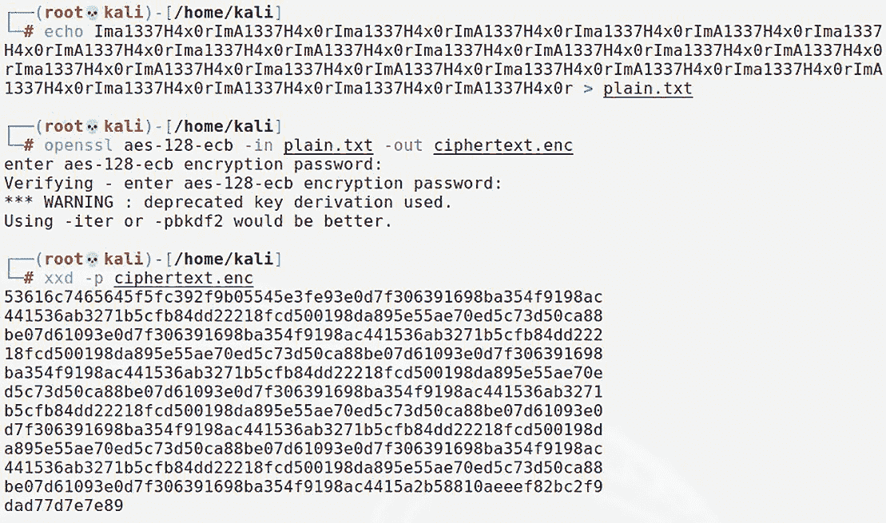

图 6.1 – ECB 模式下的 AES

哦，太好了。乍一看，我只看到一堆看起来随机的十六进制字符混杂在一起。一个可靠的加密信息应该无法与随机数据区分，因此我的工作完成了。但等等！仔细一看，确实有一长串字符在整个数据中重复出现：

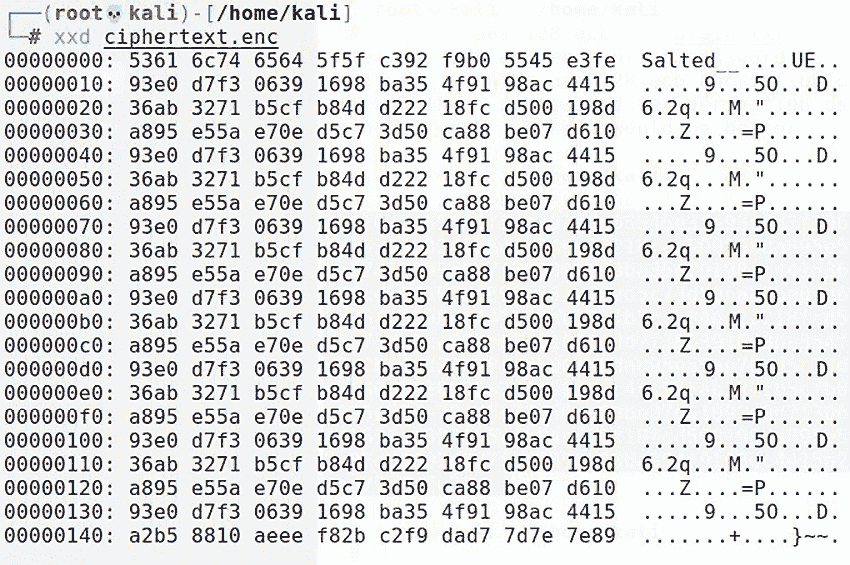

图 6.2 – 十六进制转储揭示了一个模式

你可能看着这个想——*那又怎样？你仍然不知道消息是什么。* 在密码分析领域，这是一个重大突破。关于良好加密的简单经验法则是：密文应该与明文完全没有关系。在这个例子中，我们已经知道有些东西在重复。攻击消息的努力已经开始。

## 介绍密码块链

在 ECB 模式下，我们的明文是任凭摆布的，因为每个块都有自己独立的内容。于是有了**密码块链**（**CBC**），我们像以前一样对一个块进行加密——只是，在加密下一个块之前，我们先将下一个块的明文与前一个块的加密输出进行异或操作，创建一个块链。我知道你们这些黑客现在在想什么：*如果我们将明文块与前一个块的加密输出进行异或，那么第一个块的异或输入是什么？* 你可真不放过任何细节。没错，我们需要一个初始值——恰如其分地被称为**初始化向量**（**IV**）：

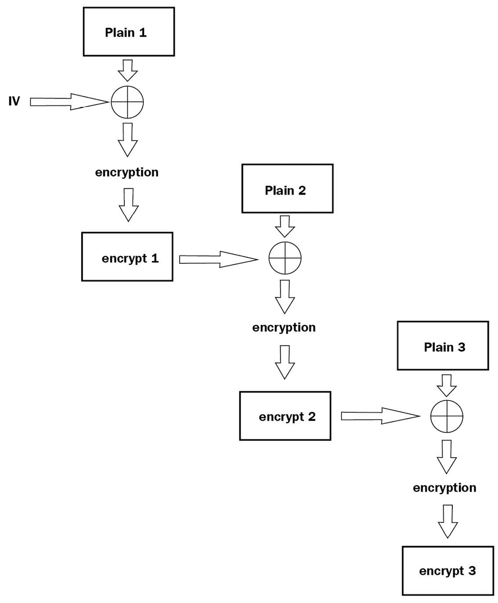

图 6.3 – 密码块链操作

IV（初始化向量）的概念让我想起了客户问我，*你怎么看那些密码保管箱应用？* 我告诉他们，如果你需要帮助记住密码，它们确实很好，肯定比为所有账户使用相同密码要好——但我总是无法摆脱那种感觉，觉得整个系统都依赖于那个**唯一**的初始密码。使用 CBC 时，安全性高度依赖于这个 IV。

## 设置你的比特翻转实验室

了解了一点背景知识后，我们开始吧。我们将对一个 Web 应用进行攻击，实施比特翻转攻击。这个实践演示的好处在于，你将拥有一个强大的 Web 应用黑客实验室，供你继续学习。我敢打赌，你们中的一些人可能之前接触过著名的`Damn Vulnerable Web App`（**DVWA**），但最近，我发现自己开始使用 OWASP 项目 Mutillidae II。我喜欢将 Mutillidae II 部署在 XAMPP 服务器堆栈上，因为其初始设置快速且简单，而且它是一个强大的组合；然而，如果你习惯使用你自己的 Web 服务器解决方案，也完全可以。

如果你正在跟着我的实验，那么首先下载 XAMPP 安装程序，`chmod` 使其具有执行权限，然后运行安装程序。你可以访问 [www.apachefriends.org/download.xhtml](https://www.apachefriends.org/download.xhtml) 来找到当前和早期版本：

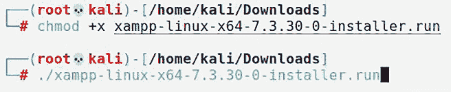

图 6.4 – 安装 XAMPP

安装完成后，你可以在系统上找到`/opt/lampp`。接下来，我们必须使用`git`从 GitHub 获取 Mutillidae II 项目。我们希望将所有内容放在`/opt/lampp/htdocs`，所以你可以在那里运行`git clone`命令，或者在获取所有文件后使用`mv`命令：

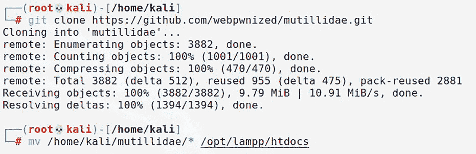

图 6.5 – 安装 Mutillidae II

我们差不多完成了，但在开始之前还有一个调整需要做。默认情况下，MySQL 的 root 用户没有设置密码，但 Mutillidae 的默认配置会尝试使用 `mutillidae` 作为密码。更直接的方法是让数据库配置匹配。找到数据库配置文件，并使用 `nano /opt/lampp/htdocs/includes/database-config.inc` 命令打开它（或使用你喜欢的编辑器），找到定义 `DB_PASSWORD` 的那一行，删除 `mutillidae`，使该值为空：

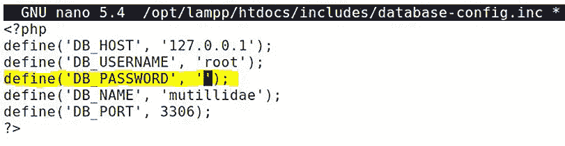

图 6.6 – 配置数据库

终于，我们可以启动 XAMPP 了。运行 `./lampp start`，拿起浏览器，前往 localhost：

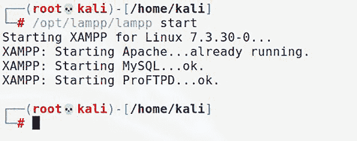

图 6.7 – 启动 XAMPP

当你第一次访问该页面时，可能会看到一个错误，提示你的数据库服务器离线。这个错误下方的第一个选项是一个链接，写着 *点击这里尝试设置数据库*。点击该链接，再点击 **确定**，Mutillidae 首页将加载。进入首页后，你需要进行一些最后的调整：点击 `Toggle Security` 以启用客户端安全性，点击 `Toggle Hints`（当该选项可见时）以禁用提示，然后点击 `Enforce TLS`，这样我们就可以在一个更真实的目标环境中进行工作。（记住，浏览器会警告你自签名证书的风险；接受风险并继续。）现在，深呼吸，喝口咖啡——我们可以开始玩我们的新玩具了。

## 操控 IV 以生成可预测的结果

在左侧导航至 OWASP 2017，然后选择 `Injection** | **Other`，再选择 `CBC Bit Flipping`。那么，我们来了解一下。此时，我们正在使用 **用户 ID` **174` 和 **组 ID` **235`。为了成为万能的 root 用户，我们需要将用户更改为 `000`，组更改为 `000`。该网站使用 SSL 保护，因此拦截传输中的流量会有点麻烦。你还注意到这个网站的其他情况吗？

那么 URL 呢？即，`https://127.0.0.1/index.php?page=view-user-privilege-level.php&iv=6bc24fc1ab650b25b4114e93a98f1eba`。

哇，原来是一个 IV 字段，就在那里等着我们。我们已经看到，IV 会与明文进行异或运算，在加密前创建加密块，因此操作 IV 必然会改变加密输出。首先，让我们来看一下这个 IV 本身：`6bc24fc1ab650b25b4114e93a98f1eba`。我们知道它是十六进制的，长度为 32 个字符；因此，长度为 128 位。

还记得我们用`openssl`实验 CBC 加密吗？我们使用了 AES，AES 的块大小始终是 128 位。考虑到我们的 IV 长度是 128 位，应用程序可能正在对单个数据块进行 AES 加密，这样它就是第一个（也是唯一的）数据块，因此 CBC 需要 IV。请记住，任何比算法块大小短的明文块都必须进行填充。注意当你尝试改变 IV 末尾字节时，用户数据会发生什么。

我们可以坐在这里分析一整天，但到现在你可能已经发现我喜欢破坏东西，所以我们来修改 URL 中的 IV，提交它，看看会发生什么。我将初始字符改为零，使 IV 变为`0bc24fc1ab650b25b4114e93a98f1eba`：

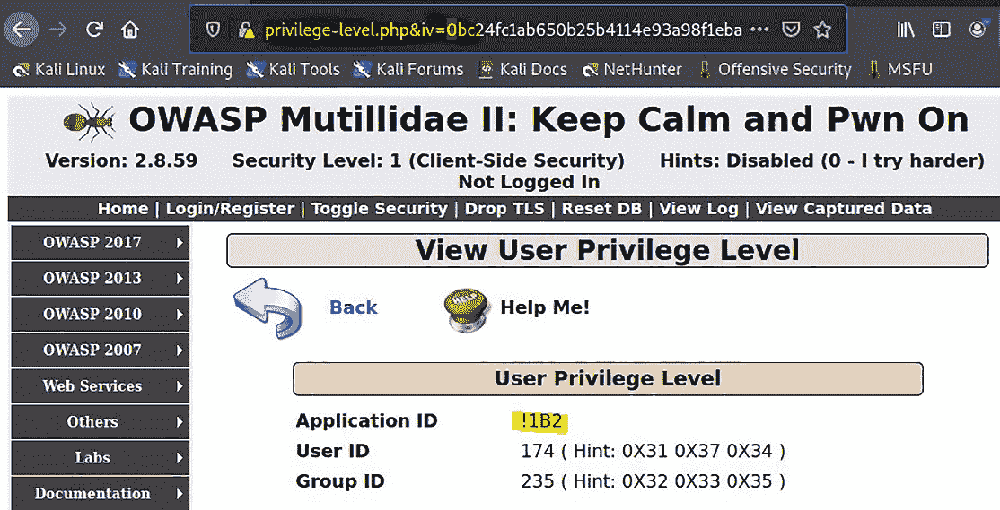

图 6.8 – 调整 IV

我们的 ID 没有变化，但看看**应用程序 ID**值发生了什么。现在，它是`!1B2`。之前是`A1B2`。如果我将前两个十六进制数字改为零，会发生什么？我们的**应用程序 ID**现在是`*1B2`。如果我改动前三个，那么**应用程序 ID**中的下一个字符就会崩溃，因为得到的二进制值没有 ASCII 表示。现在，我们知道 IV 中的前两个十六进制字符（8 位）修改了**应用程序 ID**值中的第一个 ASCII 字符（8 位）。这是一个突破，几乎意味着特权提升的最后一程，因为我们刚刚建立了明文和 IV 之间的直接关系，这意味着我们可以解密密文。而当我们知道三个值中的两个时，不管顺序如何，我们都可以通过简单的二进制 XOR 运算算出第三个值。现在，我们还没有找到可以操作**用户 ID**和**组 ID**值的十六进制数字，但我们先休息一下，看看是否能根据已有的信息找出这个关系。

我们看到**应用程序 ID**值从`A`变为`!`，然后变成了`*`。因此，ID 是用 ASCII 表示的，这是现代字符编码中最常见的标准。这里对我们重要的是，单个 ASCII 字符是 8 位（1 字节）长。另一方面，十六进制仅仅是一个基数 16 的数字系统。我们在计算机的“肮脏底层”到处都能看到十六进制，因为 16 是 2 的幂，这意味着从二进制（也就是基数 2）转换到十六进制非常容易。 （怎么说“派”很容易呢？算了，我跑题了。）2 的 4 次方等于 16，这意味着一个十六进制数字是 4 位长。现在，让我们回到实验室：

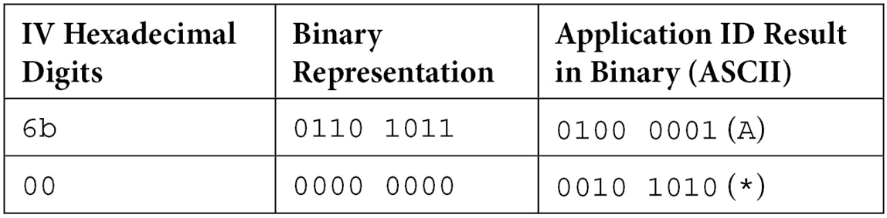

你看到了我们的金色票据了吗？好吧，让我们将二进制 IV 值与**应用程序 ID**值中的已知二进制 ASCII 结果进行 XOR 运算。如果它们匹配，那么我们得到了与 IV 值进行 XOR 运算生成**应用程序 ID**值的那个值。记住，如果我们知道三个中的两个，就可以知道第三个。

首先，让我们看看原始的 IV：

+   十六进制 `6b**: **0110 1011`

+   ASCII `A**: **0100 0001`

+   XOR 结果: `0010 1010`

现在，让我们看看我们测试过的 IV：

+   十六进制 `00**: **0000 0000`

+   ASCII `***: **0010 1010`

+   XOR 结果: `0010 1010`

这就是，朋友们，为什么他们叫它位翻转。我们发现应用程序正在将 IV 中的这一字节与`0010 1010`进行 XOR 运算，发生在解密过程中。让我们通过计算，如果我们将前两个十六进制数字替换为`45`，会得到什么，来验证我们的理论：

+   十六进制 `45**: **0100 0101`

+   密文 XOR: `0010 1010`

+   二进制结果: `0110 1111`

`01101111` 编码为 ASCII `o`（小写字母**O**）。所以让我们验证一下我们的理论，看看是否最终会得到一个 `Application ID` 为 `o1B2`：

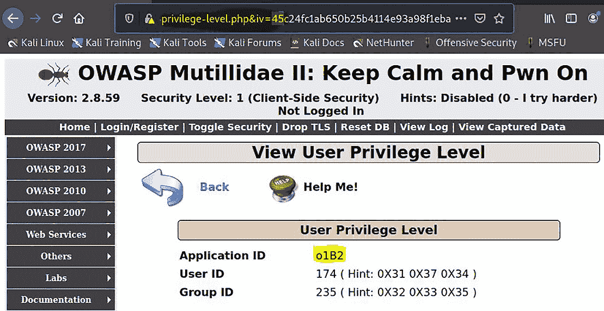

图 6.9 – 确认我们对应用程序 ID 属性的控制

难道这不会让你血脉喷张吗？这是一个令人兴奋的突破，但我们只是意识到了一些幕后机制；我们还不是 root。所以，接下来让我们开始寻找需要翻转的位。

## 翻转到根目录 – 通过 CBC 位翻转实现特权提升

你可能以为我们可以通过一个个十六进制对的方式逐步操作，直到找到正确的位置并翻转取得胜利。其实并不完全是这样。

**用户 ID**和**组 ID**的编码方式有些奇怪，并且在我们向下处理 IV 时，有不同的密文被用来进行 XOR 操作。所以，在这一点上，完全是依赖我们已经收集到的线索进行反复试验。当我解决这个问题时，我做了一些笔记：

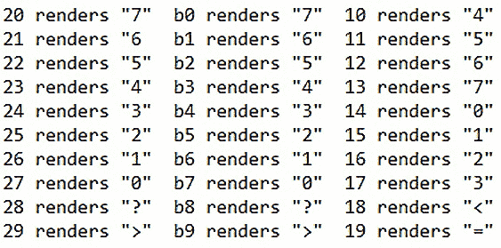

图 6.10 – 用图表将密文与 ID 输出联系起来

这有点繁琐，但我只需要玩弄几个字符就能理解这里发生了什么。我发现了两个主要点：

+   虽然每个位置都是 8 位，但只修改最后 4 位就会改变该位置的**用户 ID`/`组 ID**值。例如，我注意到当我将一个位置的两个十六进制字符替换为`00`时，结果会崩溃（即结果的二进制值不适合 ASCII 编码）。

+   我对每个字节的后 4 位进行 XOR 计算，以找到我需要的密钥，并发现该值在所有位置并不相同。

你是不是已经期待每个字符都有独特的 XOR 值了？与 IV 进行 XOR 运算的位流不会是一个字节长的重复模式。尽管如此，发现这些值的努力还是值得的，因为现在我们所需要做的就是计算每个位置的 XOR：如果我们将 IV 中的十六进制字符与该位置上**用户 ID`/`组 ID**值的十六进制进行 XOR 运算，结果将是该位置的加密位。由于我们在寻找所有零， 所以每个位置的结果就是我们需要放入 IV 中的十六进制字符，而不是原始字符。

让我们用 IV 中的一个例子来解释这个结论：位置`09`是`b4`，它对应于**组 ID**值中的中间数字`3`。十六进制`4`的二进制是`0100`，十六进制`3`的二进制是`0011`。`0100** XOR **0011`等于`0111`。`0111`是`7`的二进制等效值，这意味着我们将`b4`替换为`b7`，得到`0`。

现在，我必须对所有六个位置重复这个计算，并学到我需要的信息：字节长的 IV 位置`05`到`10`分别对应**用户 ID**和**组 ID**值，而每个位置的最后 4 位需要用（按顺序）`a2f774`的十六进制值替换以获得 root。原始 IV 中的位置`05`是`ab`，所以它变成了`aa`；位置`06`是`65`，所以它变成了`62`；依此类推。

因此，IV 从第 5 字节到第 10 字节的变化从`ab650b25b411`变为`aa620f27b714`：

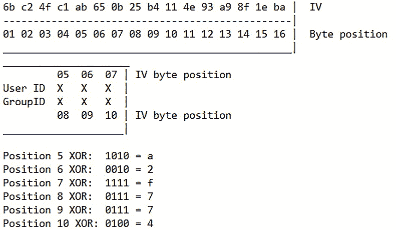

图 6.11 – 关联 IV 字节位置与 ID

真相时刻：我要将 IV 从`6bc24fc1ab650b25b4114e93a98f1eba`改为`6bc24fc1aa620f27b7144e93a98f1eba`：

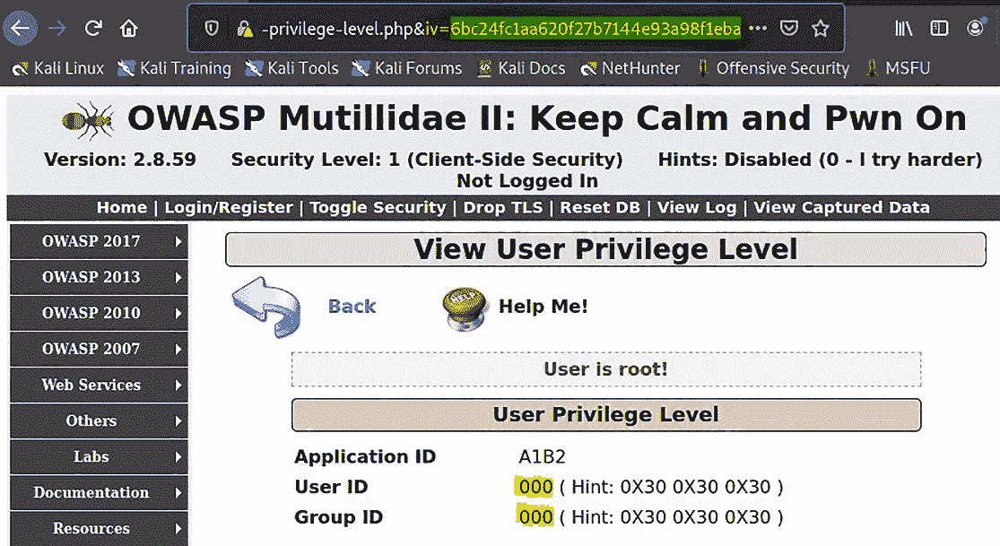

图 6.12 – 完全控制用户和组 ID 值

现在我们玩了加密，让我们看看加密哈希以及它们为我们黑客留下的线索。

# 数据潜入 – 哈希长度扩展攻击

正如你可能记得的，在我们简要介绍的 *第四章*，*网络上的 Windows 密码*，哈希并不是加密。加密消息可以被解密为可读的消息。而加密哈希，则没有明文表示；它无法被逆向。尽管如此，通过特定哈希算法处理的特定输入将始终产生相同的哈希输出（称为单向函数）。这使得哈希算法在完整性检查中非常有用，因为即使输入有微小变化，也会产生完全不同的哈希输出。然而，我们要考虑到哈希的输出是固定长度的，无论被哈希的消息多长；对于较长的消息，哈希函数是在消息数据的块上轮流进行的，一直到整个消息都被哈希完。

由于结果依赖于所有之前的输入，我们理论上可以向消息中添加数据块，并且用于下一轮的数据将与整个操作在最后一个数据块结束时的情况相同。我们将利用这一点来通过哈希长度扩展攻击攻击消息认证机制，长度扩展指的是我们将自己选择的数据添加到消息的末尾。

这比我们的位翻转冒险要复杂一些，所以我们将引入无与伦比的 Web 应用程序测试框架 Burp Suite，以便让我们俯瞰整个局面。Burp Suite 强大到足以被涵盖在好几个章节中，但在本次演示中，我们将它设置为本地代理，以便能够查看并轻松地操作正在传输的 HTTP 流量。

## 设置你的哈希攻击实验室

另一个很好的脆弱 Web 应用程序是 CryptOMG。如果你跟着我之前的做法，它的步骤是一样的——安装 XAMPP，下载并解压 CryptOMG ZIP 文件的内容到 `htdocs` 文件夹，然后运行 `./lampp start`。

旧版的开始

与 Mutillidae II 不同，CryptOMG 不再被积极支持，并且它依赖于较旧版本的 PHP。因此，你需要访问 Apache Friends 网站上的旧版本 XAMPP 安装程序。它是一个故意设计为脆弱的实验室，因此这不会影响底层漏洞的细节，这种漏洞在针对专用设备和自家开发的应用程序进行内部评估时依然出奇常见。

我们将在本次演示中使用的攻击工具，hash_extender，值得在你的 Kali 安装中保留以供将来使用。其他工具也可以用于该任务（特别是 HashPump），但我更喜欢 hash_extender 的易用性以及它与其他任务的集成。最简单的在 Kali 上运行它的方法是通过 `git` 安装。请注意，我们还需要确保 SSL 开发工具包已经安装：

# git clone https://github.com/iagox86/hash_extender

# apt-get update && apt-get install libssl-dev

# cd hash_extender && make

使用`./hash_extender`启动工具，无需任何参数，先熟悉一下。

## 理解 SHA-1 的运行状态和压缩函数

在我们的浏览器窗口中，选择**挑战 5**（获取`/etc/passwd`的访问权限），将算法改为 SHA-1，点击**保存**，然后点击`test`。

嗯，我在这里没看到什么变化。但那个 URL 看起来很有趣。查看一下我们能看到的（显然是我们控制的）参数：`http://127.0.0.1/ctf/challenge5/index.php?algo=sha1&file=test&hash=dd03bd22af3a4a0253a66621bcb80631556b100e`。

显然，`algo=sha1`定义了我们选择的算法。但是`file=test`和`hash`字段应该引起我们的注意，因为它们看起来像是用于授权访问名为`test`的文件的消息认证码机制。如果我现在修改哈希值，我将收到**文件未找到**的错误。在我们进行攻击之前，先快速回顾一下它是如何工作的。

在我们的示例中，访问`test`文件需要通过附加的哈希进行身份验证。你可能会想，*那有什么用呢？所有签名能告诉我的是文件的名字没有被修改*。好吧，除非我们在消息中附加了一个密钥，在这种情况下，我们要哈希的是**密钥 + 消息**。根据我们对哈希的理解，只有**密钥 + 消息**才能生成正确的哈希。哈希函数是单向函数，因此无法逆向求解密钥。我们想要注入我们的数据，因此必须执行目录遍历攻击来获取`/etc/passwd`；也就是说，请求一个文件并提供一个有效的哈希来验证请求。表面上看，这似乎是不可能的，但我们忽略了两个关键机制，它们内置在哈希算法中——填充和初始哈希值（也称为**寄存器**）。

SHA-1 是迭代的。它将消息拆分成 512 位的数据块，然后对每个数据块应用压缩函数。每轮压缩函数有两个输入：来自前一轮的 160 位哈希值，以及下一个 512 位的消息数据块。我能听到你在对着这本书喊，*那是不是意味着有初始化向量？* 是的，确实有。SHA 算法有一个有趣的特点，它们的初始哈希值（IV）是标准化且固定的。在 SHA-1 中，初始哈希值是`67452301efcdab8998badcfe10325476c3d2e1f0`。它有 3.97 位的熵，算是一个不错的随机数（但当然，由于它是标准化的，所以并不是随机的——全世界都知道它）。这个初始哈希值被拆分为五个 32 位的块。在哈希过程中，这五个块被存储在**寄存器**（H0 到 H4）中。这些值被称为**运行状态**。当整个消息处理完毕，最后一个数据块的压缩函数输出了最终的 160 位运行状态时，这个值就是整个消息的实际 SHA-1 哈希值。

简而言之，每当你看到一个 SHA-1 哈希值时，你看到的就是消息数据最终 512 位区块的最终运行状态。压缩函数将之前的运行状态作为输入之一，回到消息的起始部分和规范定义的初始哈希值。

那么，为什么我们要关注这些细节呢？长度扩展攻击之所以有效的关键在于，SHA-1 哈希不仅仅是整个操作的输出；它是哈希过程中的一个运行状态。假设哈希过程继续进行，处理下一个消息数据区块；倒数第二个区块的运行状态正是我们在这里看到的内容。这个运行状态来自于上一个压缩函数的输出，而这个压缩函数本身也会接收前一个运行状态作为输入，依此类推——直到我们回到初始哈希值作为 160 位输入，第一块消息数据作为 512 位输入，其中包含未知的秘密！首先，我们将创建一个新的消息，在末尾加入攻击者的数据，并加上填充以满足 512 位区块的要求。然后，我们将使用原始哈希作为压缩函数的运行状态输入，以处理最后一个区块，最终我们将得到一个新的哈希，它从第一个秘密区块中派生出来。我们永远不会知道秘密是什么，而且我们也不需要知道——它的“DNA”已经被嵌入到我们拥有的数字中。

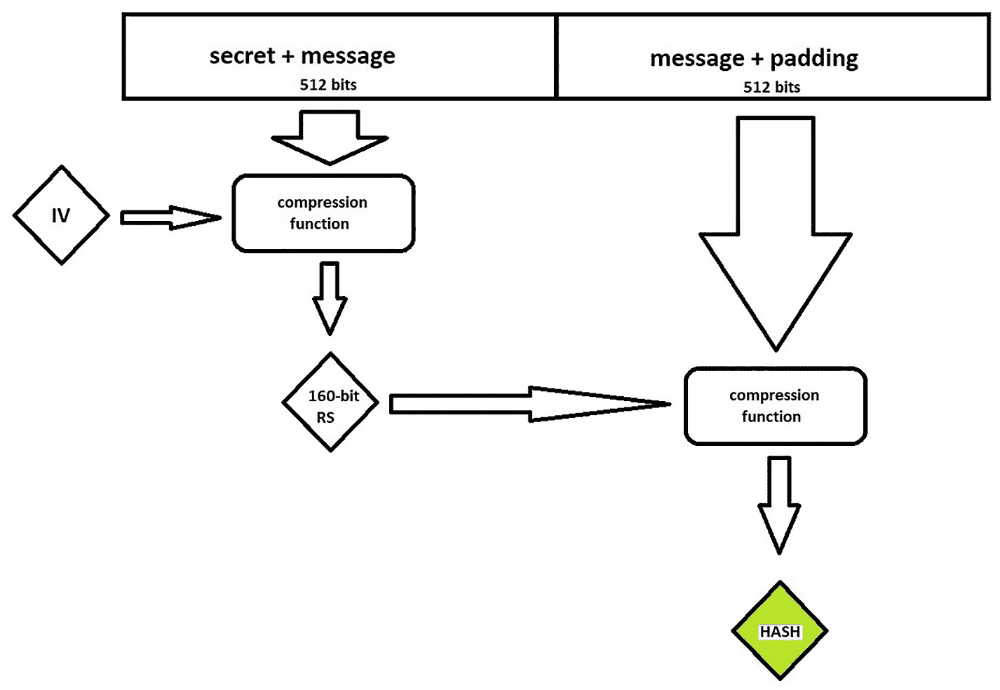

图 6.13 – SHA-1 算法的实际应用

我知道此时你心中的黑客在说：*由于最终区块会有填充，我们在不知道秘密长度的情况下无法得知填充长度；因此，我们无法在不了解秘密长度的情况下注入数据*。没错，但这太简单了，华生！我们将依赖于人类已知的最强大、最危险、最令人震惊的黑客技术之一——我们只需要猜测。秘密的长度不可能是任意的；它必须适应区块的大小。这限制了我们的猜测范围，使其变得可行。但为了让生活稍微轻松一点，我们可以使用 Burp Suite 来发送这些猜测。

## 使用哈希长度扩展攻击进行数据注入

回到我们的演示。你可能还记得文件的名称是`test`。这意味着`test`才是实际数据，因此，512 位的压缩函数输入由一个秘密、test 和填充组成。我们只需要告诉哈希扩展器当前的哈希值、原始数据、秘密长度猜测的字节范围，以及我们想要注入的数据——它会为每个猜测生成一个哈希值。然后，我们可以构建一个包含我们的攻击者数据作为文件名以及我们新的哈希的 URL——如果我们正确猜出了秘密的长度，那么我们的哈希将通过验证。让我们看一下命令：

# ./hash_extender --data=test --signature=dd03bd22af3a4a0253a66621bcb80631556b100e --append=../../../../../../../etc/passwd --format=sha1 --secret-min=8 --secret-max=50 --table --out-data-format=html > HashAttackLengthGuesses.txt

以下是前述命令中使用的术语：

+   `--data` 定义了正在验证的数据。在我们之前使用的术语中，这就是我们在提到`secret + message`时所指的消息。请记住，hash_extender 假设我们知道正在验证的数据（在这种情况下，是要访问的文件名）；按定义，我们对`secret`一无所知。我们唯一希望了解的是`secret`的长度，但这得通过反复试验来确定。

+   `--signature` 是已知参数的另一部分：我们知道能够正确验证未修改消息的哈希。记住，我们需要提供将作为下一轮压缩函数输入的运行状态。

+   `--append` 是我们悄悄塞进门下的数据。这是将被检索的数据，也是我们特别生成的攻击哈希正在验证的内容。在我们的攻击中，我们试图获取`etc`目录下的`passwd`文件。我们使用方便的`../../../`从当前文件系统路径返回到根目录`/`，然后跳转到`/etc/passwd`。请记住，通过父文件夹的跳转次数是未知的，因为它取决于这个 Web 应用程序的具体实现，因此我现在先猜测一下。如果需要修改，我之后会知道的。你不需要有效路径来找到新的哈希！

+   `--format` 是哈希算法。你可以通过哈希长度来确定这个算法，或者可能需要通过一些试验和错误来猜测。

+   `--secret-min` 和 `--secret-max` 指定了`secret`长度猜测的范围，以字节为单位。你的测试的具体情况可能要求你非常小心地使用这个范围——例如，我这里使用了一个相当宽的范围，因为我在实验室中，打算使用 Burp Suite 和 Intruder，并且我知道该 Web 应用程序无法防御快速的请求。一些系统可能会把你锁定！你可能需要手动输入 URL，就像过去那样。

+   `--table` 将通过将结果按表格格式组织起来，使我们的结果更加美观。

+   `--out-data-format` 在系统期望数据以例如十六进制格式呈现的情况下非常有用。在我们的案例中，我们希望以 HTML 格式输出，因为我们只是打算将这些信息输入到 Web 请求中。

+   最后，我让 Linux 将输出内容保存到一个文本文件中。

继续查看结果。你会看到它是一个哈希值列表，和我们希望注入的数据排成一行；每一行会有不同数量的填充字符，具体取决于猜测的`secret`长度。你为`secret-min`和`secret-max`定义的范围越大，这里就会有更多的行。

现在，我可以启动 Burp Suite，它默认在端口`8080`上创建一个本地 HTTP 代理。当我准备好让 Burp Suite 参与其中时，我必须配置浏览器的网络设置，将其连接到我的代理`127.0.0.1:8080`。然后，我必须再次点击 CryptOMG 页面上的`test`链接，创建一个新的`GET`请求，等待 Burp Suite 拦截。当我看到它时，我必须右键点击并将其发送到 Intruder。

Intruder 是一个激进的工具，用来发出带有自定义参数的请求，而这些自定义参数就是我们所定义的有效载荷。请注意，有效载荷是通过分隔符符号来定义的。只需高亮显示你希望替换为有效载荷的文本，然后点击右侧的**添加**按钮。我们已经知道我们的算法是 SHA-1，并且不会改变它，所以我只定义了`file=`和`hash=`作为有效载荷位置：

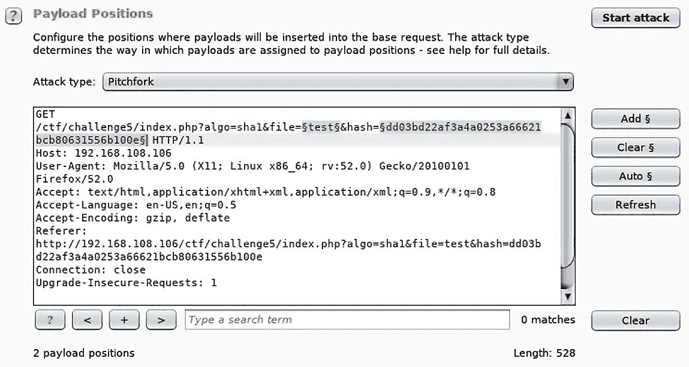

图 6.14 – 在 Burp Suite 中设置有效载荷位置

接下来，我们点击`Payloads`标签，这样我们就可以定义刚才定义的有效载荷位置中将放置的内容。对于这部分内容，你需要先做一些准备工作。你需要为每个有效载荷位置准备两个单独的列表。hash_extender 给了我们所需的一切，但它是一个以空格分隔的文本文件。如何分隔这些列由你决定（其中一种方法是使用电子表格软件）。

我按照位置顺序定义有效载荷集合；例如，由于`file=`参数是我从左到右读取时遇到的第一个位置，所以我必须将攻击者数据列表设为`Payload set 1`。然后，我的哈希列表放入`Payload set 2`。现在，乐趣可以开始了——武器解除！

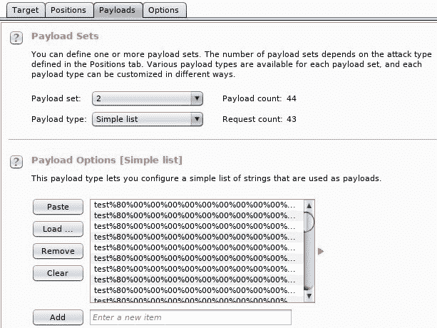

图 6.15 – 配置有效载荷集合

拿上一杯咖啡，放松一下，随着 Intruder 发出一个又一个`GET`请求，每个请求都根据我们的有效载荷定义包含了自定义参数。那么，如果某个特定的文件名和验证哈希组合是错误的，会发生什么呢？我们会收到**文件未找到**的错误——在 HTTP 状态码中，就是 404。总共发出了 27 个请求后，检查我们的**状态**列——我们收到了 HTTP 200 代码。 bingo——我们创建了一个恶意请求并验证了哈希。让我们点击`Response`标签，沉浸在我们发现的宝藏中。糟糕——*无法打开流：没有这样的文件或目录*？这怎么回事？

我们可以确定的一件事是**密钥的字节长度**。请注意，具有相同哈希值的猜测数量，但只有请求成功了。那是因为找到哈希值只是乐趣的一部分——我们需要的是密钥的确切长度。`Payload1` 列中的每一项都是我们的数据，具有不同的填充长度。由于我们已经定义了确切的范围，现在只是数一下成功所需的请求次数而已。我们已经是第 26 次请求，从 8 字节的密钥长度开始，所以密钥的长度是 34 字节：

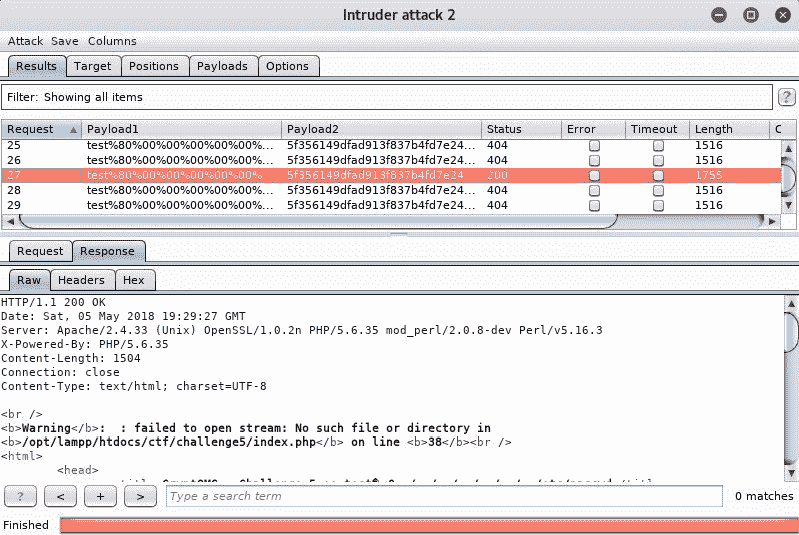

图 6.16 – 找到我们的黄金票

至于文件未找到的问题，我们只是没有爬到正确的父文件夹级别以访问`/etc/passwd`。尽管如此，我们提供了正确填充长度和有效哈希的数据，因此系统认为我们是被授权的；它只是告诉我们它找不到我们有权限窃取的内容。

现在我们知道了密钥的长度，我们可以回到手动请求。这一部分将需要传统的“试错法”。我将继续添加跳跃，直到成功。过不了多久，我就能说服主机吐出`passwd`文件：

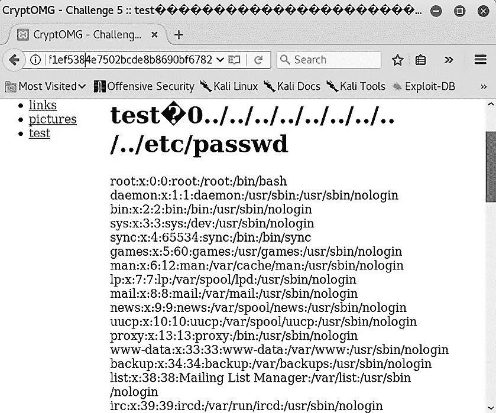

图 6.17 – 捕获标志

现在，我们将以不同的方式看待问题——这一次，我们将查看带有填充的密文，以及一个在填充破坏时会友好地告诉我们的权威。我们将发现，这对坏人来说信息有点太多了。

# 使用 PadBuster 破解填充 oracle

安全的加密系统不应该泄露任何与加密消息相关的明文信息。Oracle 攻击强有力地展示了即使是一些看似无意义的信息，也能使你获得完整的解密消息。我们的 CryptOMG 网络应用提供了一个可以通过利用填充 oracle 来解决的挑战：这是一个在解密过程中告诉我们填充有效性而不泄露密钥或消息的系统。让我们开始和我们的 oracle 进行一些对话，看看这些响应是什么样的。

## 询问填充 oracle

让我们加载 CryptOMG 主页面并选择第一个挑战（和上次一样，我们的目标是**/etc/passwd**）。在测试页面中，页面的实际内容没有任何有趣的地方，所以让我们检查一下 URL：`http://127.0.0.1/ctf/challenge1/index.php?cipher=3&encoding=2&c=81c14e504d73a84cc6279ab62d3259f6e2a2f52dbc5387d57911ee7565c5a829`。

看看`c=`字段。那是 64 个十六进制字符（256 位）。可以肯定地说，我们正在处理某种密文。再次提醒，以一种仅仅为了打破东西看看会发生什么的精神，让我们翻转一些位。

首先，让我们修改字符串开头的一些位，并重新提交请求：

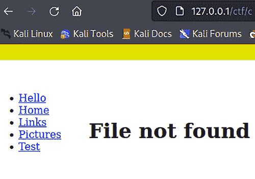

图 6.18 – 调整比特但无服务器错误

这很有趣，因为这个错误表明解密成功了。服务器告诉我们解密了一个文件请求；问题在于该文件不存在。服务器告诉我们这一点意味着它理解了我们的请求 - 尽管不知道加密消息的内容。

现在，让我们试着修改一些位于 256 位加密值尾部的位，并重新提交它：

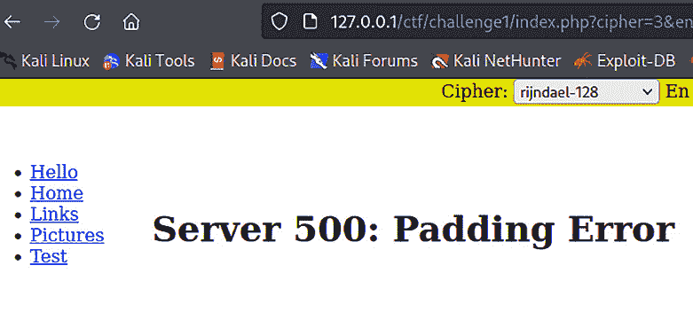

图 6.19 – 填充神谕告诉我们我们已经破解了填充

我们都有那种总是说太多话，最终泄露了太多信息的朋友。在这种情况下，我们的朋友是一个神谕 - 一个无意中透露有用攻击信息的系统，即使信息本身应该是无意义的。我们刚刚得知这条消息中有填充，使其成为块密码；让我们假设是 AES 的 CBC 模式。最重要的是，我们知道目标正在作为填充神谕运行，告诉我们加密消息中填充的有效性状态。

让我们用 PadBuster 攻击这个演示中的填充神谕。一旦我们获取了我们的 `passwd` 文件，我们就可以看看幕后发生了什么。

## 使用 PadBuster 解密 CBC 块

首先，我们需要安装 PadBuster：

# apt install padbuster

如果您不带任何参数运行 PadBuster，您将获得一个帮助屏幕，向您提供其简单的使用要求：您只需要 URL、加密数据块本身和块大小（以字节为单位）。由于我们假设是 AES，块大小将是 128 位（*128 / 8 = 16* 字节）：

# padbuster "http://127.0.0.1/ctf/challenge1/index.php?cipher=

3&encoding=2&c=81c14e504d73a84cc6279ab62d3259f6e2a2f52dbc5387d

57911ee7565c5a829" 81c14e504d73a84cc6279ab62d3259f6e2a2f52dbc

5387d57911ee7565c5a829 16 -noiv -encoding 1

不要担心这里的加密消息与您实验室中的不匹配；它每次会话都会更改。基本使用格式是 `padbuster "[url]" [message] [block size]`，但我们在结尾添加了两个选项：

+   `-noiv` 指定我们没有已知的初始向量；它不像在我们之前的演示中在 URL 中，所以我们在没有它的情况下粗略推测，因为它将从第一个 **[块大小]** 字节中派生。

+   `-encoding 1` 非常重要，因为我们告知 PadBuster 使用较低的十六进制（小写字母）编码。

当我们执行命令时，PadBuster 与神谕进行交流。我们看到了一个包含基于神谕答案的响应签名的表格。PadBuster 会为您推荐一个，但我们在篡改填充时已经看到了 500 状态代码，所以这是我们应该选择的：

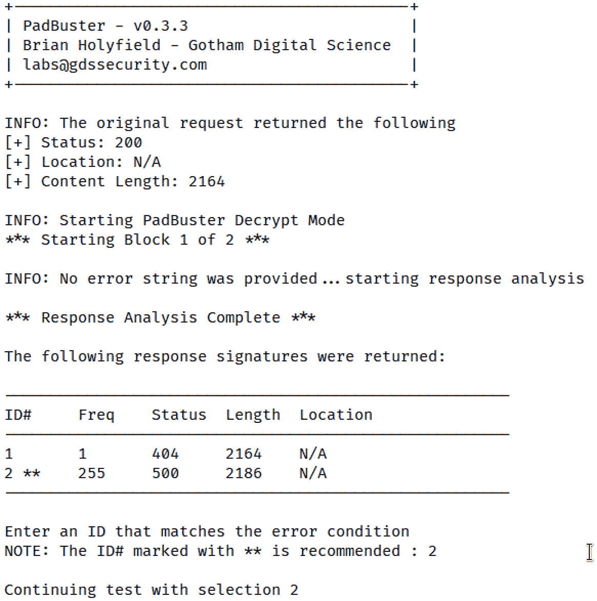

图 6.20 – PadBuster 中的响应分析

然后，PadBuster 开始基于它收集到的信息进行解密。大约 10 秒钟后，我们将得到解密结果：一些随机的 ASCII 字符，一个管道符号，和文件路径。现在我们知道了消息的格式，我们将逆向处理，生成一个包含请求的加密消息：

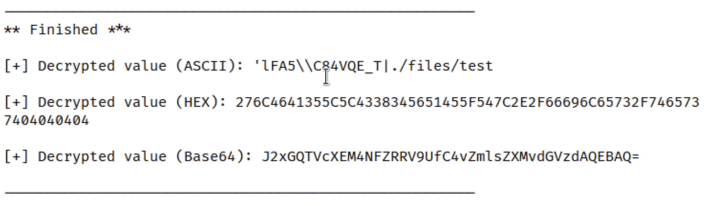

图 6.21 – 不同格式的解密数据

我们只是回过头来，使用相同的命令，但在最后加上`plaintext`标志。就这样。PadBuster 让这一切变得*太*简单了：

# padbuster "`http://127.0.0.1/ctf/challenge1/?&c=` 81c14e504d73a84cc6279ab62d3259f6e2a2f52dbc5387d57911ee7565c

5a829" 81c14e504d73a84cc6279ab62d3259f6e2a2f52dbc5387d

57911ee7565c5a829 16 -noiv -encoding 1 -plaintext "lFA5\\C84VQE_T|../../../../../../../../../etc/passwd"

这将输出一个加密值。现在，我们只需将 URL 中的`c=`值替换为以下字符串：

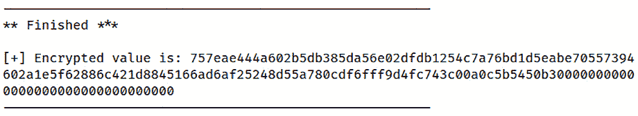

图 6.22 – 我们需要发送的加密值

现在，我们可以将其粘贴到 URL 中并按*Enter*，瞧！——服务器理解了我们的请求：

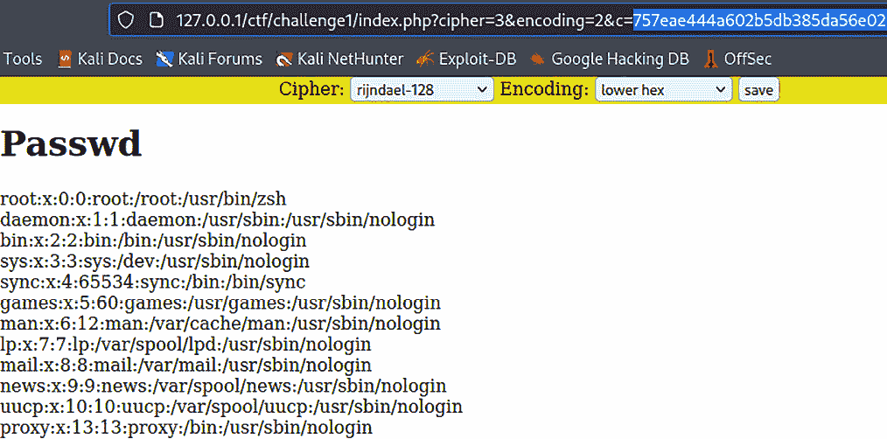

图 6.23 – 捕获的标志

那么，PadBuster 是如何完成这一神奇的壮举的呢？让我们来看看加密中填充的标准。

## Oracle 填充攻击的幕后

PadBuster 讲的是填充的“语言”。这只是一种诗意的说法，意思是填充并非随意的；它遵循一个标准，而 PadBuster 根据这个标准生成请求。在 CBC 模式加密算法的操作中，我们遇到的填充被称为`PKCS#5**/**PKCS#7`填充。

这个缩写并不像看起来那么可怕；它只是指**公钥密码学标准**，这是一个始于 1990 年代描述专有技术的标准系列。*#5*和*#7*分别指代这两个标准中的第五和第七个标准。它们描述的不仅仅是填充，但这里相关的填充方法就来源于这些标准。我们在这里交替使用这两者，因为*#5*和*#7*之间的唯一区别是，*#7*定义了 8 或 16 字节（64 位和 128 位）的块大小；而*#5*仅定义了 8 字节/64 位的块大小。

这个概念很简单。正如我们所知，块加密的核心是其固定长度的数据块。当然，需要加密的消息长度并不是固定的；它们可以像“Hello, World!”一样短，也可以像齐默曼电报那样长。此时填充就派上用场了。*PKCS#5*/*PKCS#7*使用填充字节，这些字节实际上只是十六进制数字。这个数字等于填充字节的数量。例如，如果有五个填充字节，它们都将是 0x05。如果消息恰好可以被块大小整除，那么就会附加一个额外的块，内容全部为填充字节（其值根据定义等于块大小的字节数）。这样做的目的是提供这种设计固有的错误检查机制。所以，如果我来解密一条消息，结果发现有五个填充字节，值为 0x07，那么你猜这个聪明的 oracle 告诉我什么预言？填充错误。

因此，当我们将加密数据传递给目标时，oracle 可以告诉我们三件事中的一件：

+   加密数据正确填充，并且解密后包含有效的服务器数据。这是完全正常的操作。服务器响应为 HTTP 200 OK。

+   加密数据正确填充，并且解密后包含无效的服务器数据。这就像没有加密地发送一些意外数据到服务器，例如请求一个不存在的文件。这在技术上是 HTTP 200，但通常会有一个自定义错误（例如，**文件未找到**）。

+   加密数据的填充不正确，这会破坏解密过程，因此没有任何数据传递到服务器。这会导致一个加密异常，响应为 HTTP 500 内部服务器错误。

这只是破解的一半。另一半是我们在本章开始时介绍的概念：当你知道三种二进制值中两个具有异或关系时，你可以轻松找出缺失的字段是什么。所以，我们必须调整加密的位并反复提交我们修改过的请求，和 oracle（预言机）进行状态反馈对话，直到我们不再破坏解密并且 oracle 告诉我们*填充看起来很好*。随着 oracle 确认正确的填充，这个攻击变成了一种已知明文的密码分析方法，使我们能够解密消息。

回想一下，块加密算法有一个 IV（初始化向量）作为最后一个块来启动块链过程；在这些攻击中，IV 并不总是已知的，实际上，在我们的实验中，没有为我们定义任何 IV。PadBuster 可以通过`-noiv`标志来实现这一点，并因此使用第一个字节作为 IV；用作 IV 的字节数在块大小参数中定义。我们还知道，CBC 模式加密会将中间位（即加密过程后的位）与前一个块的相应位进行异或（块链），因此一旦解密开始，PadBuster 就会向后工作。

# 总结

本章中，我们探讨了一些基本的密码学攻击。我们从密码块链接的比特翻转开始，学习了如何可预测地修改初始化向量。然后，我们利用这些信息突破了实验室服务器的防护。在这里，我们通过利用消息验证方法中的漏洞，探索了哈希长度扩展攻击。我们通过利用哈希算法的核心压缩功能，生成一个攻击哈希，使其能够通过验证。为了准备这个演示，我们在 Kali 上安装了一个强大的 Web 和数据库服务器堆栈，用于托管一个脆弱的 Web 应用，以便在我们家的实验室进行合法的学习和测试。在关于填充 oracle 攻击的最后部分中，我们利用了之前本书介绍的核心知识，继续突破实验室环境。

本章讲解了一些基本的密码学知识后，我们将再次进入 Metasploit 的控制台，深入了解更多高级策略。

# 问题

请回答以下问题，测试您对本章内容的理解：

1.  计算此异或`or`运算的结果：`001011100101010` ⊕ `1111000110100101`。

1.  3DES-128-ECB 中的 ECB 代表 __________。

1.  _______ 用于确保消息可以被算法的块长度整除。

1.  PadBuster 需要使用 _________ 标志来定义大写十六进制数。

1.  如果攻击数据包有四个有效负载位置，那么您需要在 Burp Suite 的 Intruder 中定义多少个有效负载集？

1.  SHA-1 压缩函数接受 _________ 位和 _________ 位的输入。

1.  填充 oracle 攻击得名于 1994 年 Oracle 7.2 中的漏洞。（正确 | 错误）
