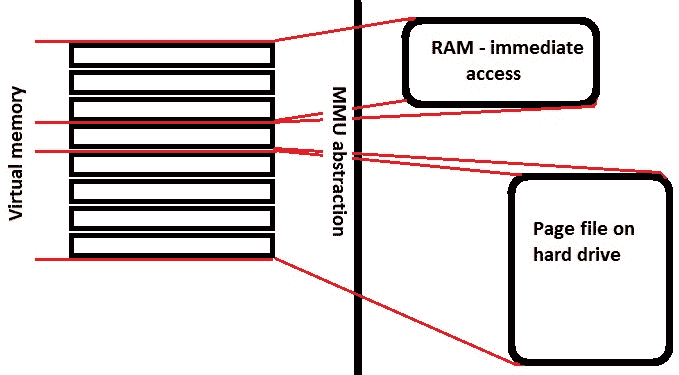
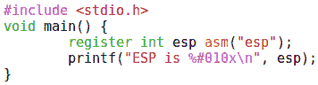
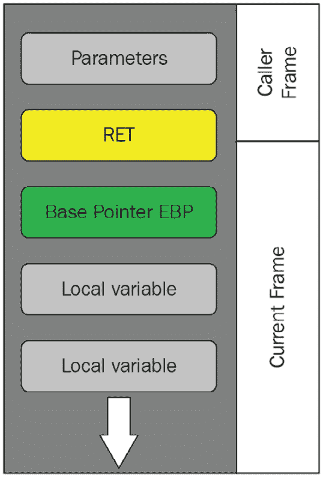

# 第十一章：Shellcoding – 绕过保护

当我和朋友或家人谈论机场安全时，我常常听到一句玩笑话：“也许我们应该直接禁止乘客登机”。虽然这显然是讽刺的，但让我们稍作思考——无论我们如何筛查每个登机的人，我们仍然必须让至少一些人通过，特别是飞行员。恶意的外部人员与信任的内部人员之间有明显的界限，后者因为他们的角色需要被赋予必要的访问权限以完成工作。我们可以将恶意的外部人员比作 shellcode，将负责操作的信任飞行员比作合法的本地二进制文件。在完美的安全筛查确保没有恶意人员能登机的情况下，你仍然必须相信飞行员没有受到外部影响的腐蚀；也就是说，他们的权力被用来执行恶意行为。

欢迎来到**返回导向编程**（**ROP**）的概念，在这个世界中，我们生活在一个没有办法注入和执行 shellcode 的“天堂”，但我们已经找到了如何利用已有代码来完成我们的“肮脏工作”。我们将学习如何将 x86 指令集的密度与传统的程序缓冲区漏洞结合，从而构造几乎任何任意功能。我们将暂时不再注入恶意代码，学习如何将“好代码”反过来用在自身。

在本章中，我们将涵盖以下主题：

+   理解核心防御概念，如**数据执行防护**（**DEP**）和**地址空间布局随机化**（**ASLR**）

+   学习如何检查机器码和内存，识别可以为我们所用的指令，这些指令被称为**小工具**（gadgets）

+   理解基于 ROP 的不同类型的攻击

+   探索黑客们用来实施 ROP 攻击的工具

+   编写并攻击一个易受攻击的 C 程序

# 技术要求

对于 ROP，你需要以下内容：

+   32 位 Kali Linux 2021.3

+   ROPgadget

# DEP 和 ASLR——有意为之与不可避免的情况

到目前为止，我们只是稍微提到了这些概念：DEP（也叫做 NX，禁止执行）和 ASLR。我恐怕我们不能永远避开它们。我听到后面有几个黑客在说，*好啊！当我们必须禁用基本保护才能让攻击生效时，演示的冲击力就消失了*。这说得也有道理。当我们在*第十章*中介绍基本的缓冲区溢出时，*Shellcoding – 栈*，我们显式地禁用了 ASLR。（公平来说，Windows 7 系统开箱即用就是这样。）不过，这一切都是经过设计的——我们首先要回过头来，才能理解核心概念。这些保护机制是*应对*我们已展示过的攻击。但看看我，又在跑题，没定义这些简单的概念。

## 理解 DEP

你还记得我们把 shellcode 放到哪里吗？答案是在栈或堆内存中，它是为执行线程预留的内存。当一个函数运行时，会为变量和其他完成任务所需的数据分配空间；换句话说，这些区域并不打算存放可执行代码。在内存中选择一个位置来存储一个数字，但后来被告知，*嘿，记得那个内存位置吗？让我们执行那里存放的内容*，应该是值得怀疑的。但不要忘了，处理器是非常强大、迅速且愚笨的。它们会按指令执行。这个简单的设计，即执行指令指针指向的位置的内容，就是 shellcoding 黑客所利用的。

进入 DEP。DEP 的基本原理是监控指令指针引用的内存位置是否被明确标记为可执行。如果没有标记，便会发生访问冲突。Windows 有两种 DEP——*软件强制*和*硬件强制*。以下截图展示了 Windows 界面上 DEP 设置的样子：

图 11.1 – Windows 中的 DEP 设置

软件强制 DEP 在操作系统的更高层运行，因此，任何能运行 Windows 的机器都可以使用，并且可以防止任何试图利用异常处理机制的攻击。硬件强制 DEP 则使用处理器的**执行禁用**（**XD**）位来标记内存位置为不可执行。我们来看一下软件强制和硬件强制的区别：

图 11.2 – 两种 DEP：软件和硬件

那么，这对我们这些狡猾的黑客有什么影响呢？整个技巧在于为我们的代码分配内存，而程序将其视为普通变量。同时，我们希望处理器能信任我们，认为执行流的跳转是指向指令指针地址的。首先，让我们来看一下内存位置的随机化。

## 理解 ASLR

回忆一下我们在处理栈溢出攻击时的经历。我们在代码中找到了易受攻击的`strcpy()`函数，往缓冲区填入无意义的字符，故意溢出它，然后查看调试器，发现 EIP 被我们无意义的数据覆盖。通过精心构造有效载荷，我们能够找到内存中需要放置 NOP sled 指针的准确位置，最终执行 shellcode。现在，回想一下我们使用 gdb 的 examine (**x**) 工具来确定 EIP 在内存中的确切位置。因此，我们能够绘制出栈的结构，并且每次运行进程时都能*可靠地*到达该指令指针的位置。

请注意，我强调了“可靠性”一词。现代操作系统，如 Windows，允许多个程序同时运行，并且它们都有大量可寻址的内存可用——而这里的“大量”是指超出了物理内存所能容纳的范围。操作系统的部分职责是找出那些不太重要的内存部分，以便将它们存储在硬盘上，并在需要时通过分页调入使用。因此，程序看到的是一个庞大的连续内存块，实际上是*虚拟*的，而内存管理单元则管理着那一层隐藏物理现实的抽象：

图 11.3 – 虚拟内存与其物理基础之间的抽象

引入 ASLR。这个名字很形象——程序在虚拟地址空间中的布局在每次运行时都会发生变化。这包括像库文件、栈和堆之类的内容。当然，要找到可以做我们“脏活”的内存位置，需要通过传统的试错方法（黑客的最大技巧），但一旦发现，它们就会保持一致。ASLR 打破了这一点，它通过将内存中的目标位置变成一个机会游戏，来消除我们的依赖。

我还没有讨论过库，这个话题值得一本巨大的书来讲解。虽然我们快速回顾一下吧。想象一下，名义上的“你所在的公共图书馆”。它是一个*共享资源*的地方——你可以去借一本书，利用其中的信息，然后再归还给其他人使用。库是程序可以重用的资源集合。例如，从文件中读取信息和将数据写回文件的任务，需要代码来告诉计算机如何执行，但这是许多不同程序都会需要做的事情。因此，不必为每个程序重新发明轮子，许多程序都可以使用包含这些功能的库。你可以在编译程序时将库与代码一起包含，这会使用更多内存，但可以更快速地运行。这些是静态库。更常见的方法是动态库，它们在你运行程序时被链接。

## 在 Kali Linux 上使用 C 演示 ASLR

我们可以在本地的 Kali Linux 上观察 ASLR 的工作情况，因为它默认启用。我们将编写一个简单的 C 程序，仅仅打印当前 ESP 指向的位置。

启动`vim stackpoint.c`来创建一个空文件，然后输入以下内容：

图 11.4 – 一个快速的 C 程序，打印 ESP 的位置

这并不难。现在使用`gcc -o stackpoint stackpoint.c`编译它，然后执行几次。你会看到每次运行程序时栈指针的位置都会发生变化：

图 11.5 – 我们的栈指针程序在启用随机化时的运行情况

这就是虚拟内存随机化的样子。看看禁用 ASLR 后运行相同程序时输出的鲜明对比：

图 11.6 – 我们的栈指针程序在禁用随机化后

通过这个演示，让我们介绍 ROP 的基本概念。

# 介绍 ROP

所以，现在我们看到两种不同的反制措施，它们相互配合，使坏人的生活变得更加困难。我们正在消除加载程序到内存时，找到脆弱点所需的可预测性，同时将执行允许的内存区域限制到最小。换句话说，DEP/NX 和 ASLR 将一个大而固定的靶子转变成一个小而移动的靶子。希望你作为黑客，已经在为这些保护机制的安全假设进行头脑风暴。可以这样理解——我们将内存的某些区域设置为不可执行。然而，这毕竟是一个程序，所以某些指令必须执行。我们正在随机化地址空间，使得很难预测在哪里找到某些结构，但执行流程依然存在。*必须*有一种方法可以找到完成任务所需的一切。ROP 就利用了这一现实。让我们来看看它是如何做到的。

## 借用代码块并返回到 libc —— 让代码反过来为自己服务

当我们介绍缓冲区溢出攻击时，我们利用了我们自制 C 程序中的漏洞——那就是臭名昭著的`strcpy()`函数。由于该函数会将任何大小的输入传入固定大小的缓冲区，我们知道，只要进行一些研究，找到合适的输入就能使指令指针溢出并填入任意值。我们能够控制程序执行流的去向，那么我们该把它发送到哪里呢？当然是发送到我们注入的 shellcode 啦，傻瓜。为了实现这一点，我们做了两个重要假设——我们可以将任意代码块注入内存，并且可以说服处理器执行这些指令。假设这两个条件不成立——我们是应该打包回家，任由这个美味的`strcpy()`函数继续存在吗？没有这两个假设，我们仍然可以覆盖返回地址。我们不能直接指向我们注入的 shellcode，但我们可以指向程序中已存在的其他指令。这就是这个概念的核心：从程序内部借用代码块并使用返回来实现这一点。在你深入低级汇编世界之前，你可能已经直觉到，设计用于加载网页的程序只包含加载网页的代码。作为尊敬的黑客，你明白所有复杂程度的程序在最低层次上都在做一些非常简单的事情。你的友好网页浏览器和我那危险的后门 shellcode 共享相同的语言和相同的低级操作，都是在临时存储区中搬运数据，并告诉处理器下一段工作的地址。

好吧，所以我们正在借用来自脆弱程序中的代码来为我们做一些事情。听起来那些几乎什么也不做的小程序似乎会有更少的代码可供我们利用。我能听到后排的程序员在对我喊：*别忘了库！* 记住，甚至是那些仅供本书示范的小程序，也需要复杂的代码来做我们视为理所当然的事情。例如，拿 `printf()` 来说。程序怎么知道如何在屏幕上打印信息？试试创建一个包含 `printf()` 函数的 C 程序，但**没有**在顶部加上 `<#include stdio.h>` 这一行。会发生什么？没错——它无法编译：

图 11.7 – 忘记了我们的输入/输出预处理指令

请记住，`include` 预处理指令字面上是将定义的代码块包含进来。即使是两三行代码，在编译后也会充满“好东西”。这些“好东西”不仅仅是一些美味的小点心——它们是 C 程序中共享的 DNA。你 C 代码顶部的头文件引用了 C 标准库（**libc**）。`libc` 标准库包含了类型定义和宏等内容，还包含了许多我们常常视为理所当然的任务的函数。这里需要注意的一点是，多个函数可能来自同一个库。将这些联系在一起，当攻击者覆盖返回地址时，一种可能性是指向某个函数，这个函数在内存中存在正是因为它的功能是通过 `include` 指令引入的。作为 C 语言的标准库，`libc` 是显而易见的攻击目标；几乎任何程序，甚至是最简单的程序，它都会被链接进去，并且包含了许多我们可以利用的强大功能。这些攻击被称为 `return-to-libc` 攻击。

return-to-libc 技术帮助我们绕过了那种讨厌的不可执行防御。我们刚刚丢入栈中的任意代码实际上位于不可执行的空间中；另一方面，`libc` 函数则位于内存中的其他地方。返回到这些函数能让攻击者访问强大的功能，而无需我们自己写 shellcode。但这种方法有一个问题：内存布局随机化或 ASLR。在 ASLR 出现之前，这些有用的 `libc` 函数的位置很容易确定。在本章中，实操实验将查看 `return-to-libc` 方法的一种变体。

仍然需要有效 – ASLR 和偏移量

请记住，尽管 ASLR 会随机化基础地址，但程序仍然需要正常工作——也就是说，它需要能够找到自己各个部分的位置。因此，ASLR 根本无法改变从一个地方到另一个地方的*距离*——即偏移量。有时，一种叫做*内存泄漏*的漏洞可以向攻击者泄露随机化后的内存布局，从而帮助攻击者通过添加偏移量来找到目标函数的正确内存位置——即使它已经被随机化了！

如你所见，ROP 是一种攻击方式，而且有不同的方法来实现这种技术。对于这种概念的各种变体的正确处理超出了本书的范围，所以我们将仅展示一个基本示范。

## ROP 的基本单元——gadget

我们正在使用的 x86 指令集有时被描述为*紧凑*的。一个*单一*字节的指令可能拥有强大的功能；例如，`lodsb`从内存中加载一个字节，并同时递增指针。那么，只有少量字节的程序呢？好吧，我们可用的选项就不会太多。但如果是任何一个链接到 C 标准库的程序呢？它的指令足够强大，足以让攻击者几乎做任何事情。我们可以利用代码的漏洞，将其反过来对付自己。

当一个函数被调用时，它的指令会被推送到栈上，位于返回地址之上，这样执行就可以从上次的过程调用处继续。在缓冲区溢出期间，我们会覆盖返回地址以控制执行流。现在，假设我们已经覆盖了返回地址，使其指向一些以返回结尾的指令。那些指令指向其他以返回结尾的指令，这些又指向其他以返回结尾的指令——你明白了。这些单独的代码片段被称为`gadget`（小工具）。通常，一个 gadget 比较短，但总是以将执行流转移到其他地方的指令结束。我们将这些 gadget 连接起来，创建任意功能——完全不需要注入。

希望你已经对我们所面临的情况有了基本的理解——现在我们需要检查这个任务的标准工具集。

## 熟悉我们的工具——MSFrop 和 ROPgadget

足够的讲解——让我们来看看你在开发 ROP 漏洞时最常用的两个工具。在将 Kali Linux 发挥到极限的精神下，我们将探索 MSFrop。这个工具非常适合在目标二进制文件中辅助研究 gadget。它会为你找到 gadget，并以友好的方式输出，供你回顾。然而，我们真正穿上实验服的工具是 ROPgadget。

### Metasploit Framework 的 ROP 工具——MSFrop

我们习惯使用`msfvenom`，它是独立的，但仍然是 Metasploit 的一部分。MSFrop 则不同——它需要从 MSF 控制台运行。让我们启动`msfconsole`，然后运行`msfrop`，开始熟悉这个巧妙的工具猎人：

# msfconsole

msf6 > msfrop

这只会显示一页帮助页面，列出所有选项。让我们逐步分析这些选项，了解 MSFrop 的强大功能：

+   `--depth`本质上是衡量你的 gadget 搜索深入代码的深度。由于 gadget 以返回指令结束，`depth`标志会从返回指令开始，向后搜索。深度是我们愿意从给定的返回位置向后搜索的字节数。

+   `--search`用于当我们要在 gadget 中寻找特定字节时。此标志接受一个正则表达式作为搜索查询；最常见的正则表达式之一是`\x`，表示十六进制数字。

+   `--nocolor`仅仅是为了美观；它去除了显示颜色，方便将输出结果传递给其他工具。

+   `--export`与`depth`一样，是 MSFrop 的一个标准参数，特别是在较深的查找时。这会将 gadget 导出到 CSV 文件中，方便你在终端窗口过时后进行查看。

现在让我们来看看 ROP 世界中的另一个重要工具：ROPgadget。

### 你的高级 ROP 实验室 – ROPgadget

我直说了——我认为 MSFrop 在我们比较 ROP 工具时更像是一个*荣誉提名*。Metasploit Framework 能够作为一个全面的黑客工具非常棒，能在 MSF 控制台内研究二进制中的 gadget 也很方便。但我最喜欢的专用工具是用 Python 编写的 ROPgadget。它在我们的 Kali 盒子中用`pip`安装起来非常简单。如果你还没有安装`pip`，可以通过`apt install python3-pip`来安装它。然后，ROPgadget 只需一步安装：

图 11.8 – 使用 pip 安装 ROPgadget

让我们看看可用的选项，暂时不考虑一些特定处理器的命令：

+   `--binary`指定我们的目标，可以是 ELF 格式、PE 格式、Mach 对象格式或原始格式。

+   `--opcode`在二进制的可执行段中搜索已定义的操作码，而`--string`则在二进制的可读段中搜索指定的字符串。`--string`的一种用途是查看特定函数，如`main()`。

+   `--memstr`是你借用目标二进制字符的生命线。假设你想将 ASCII 字符`sh`复制到缓冲区，而不进行注入。你可以传递`--memstr "sh"`参数，ROPgadget 将搜索内存中的`\x73`和`\x68`。

+   `--depth`在这里的含义与 MSFrop 中的相同。一旦找到`ret`，这个参数表示我们将搜索多少字节以找到 gadget。

+   `--only`和`--filter`是指令过滤器。`--only`会隐藏所有内容，除了指定的指令；`--filter`会显示所有内容，除了指定的指令。

+   `--range`指定一个内存地址范围，以限制我们的 gadget 搜索范围。如果不使用此选项，将会搜索整个二进制文件。

+   `--badbytes` 就是字面意思，我疲惫的 shellcoder。就在你以为通过借用代码就能逃避那些破坏我们 shellcode 和梦想的字节时，经验丰富的 ROP 工程师偶尔会遇到这个问题。无论字节来自哪里，问题都会在执行时发生。还有一个需要记住的因素——实际的利用代码本身。在本章中，我们将使用 Python 来生成有效载荷。我们将使用强大的 `struct` 模块将二进制数据打包成字符串，然后像普通的字符串变量一样由 Python 处理。当你坐在那里调试破损的脚本时，记住 `--badbytes`，它可能正是你在找的东西。

+   `--rawArch` 和 `--rawMode` 用于定义 32 位和 64 位架构及模式。

+   `--re` 接受一个正则表达式（例如，**\x35**）。

+   `--offset` 接受一个十六进制值，作为计算 gadget 地址的偏移量。

+   `--ropchain` 是一个绝妙的致命一击选项，可以为我们生成 Python 利用代码。它不像把它丢进一个 `.py` 文件然后执行那么简单；我们需要知道它是如何传递给易受攻击程序的。

+   `--console` 用于交互式 gadget 寻找。基本上，它会在 ROPgadget 中弹出一个终端窗口，以便进行特定的搜索。稍后我们会仔细看。

+   `--norop`、`--nojop` 和 `--nosys` 分别禁用特定 gadget 类型的搜索引擎——面向返回的、面向跳转的和系统调用指令的 gadgets。当你想了解你可以使用的所有 gadgets 时，通常不建议使用这些选项；它们仅用于精细化攻击。

+   默认情况下，会抑制重复的 gadgets；你可以使用 `--all` 来查看所有内容。这对于收集与二进制文件中的 gadgets 相关的所有内存地址非常有用。

+   `--dump` 本质上是一个 `objdump -x` 对象，显示你的 gadgets；它会展示反汇编后的 gadgets 及其原始字节。

还有一些其他很棒的 ROP 程序可用，但 ROPgadget 应该可以完成几乎所有你的项目。让我们准备好进行测试，准备好我们的易受攻击可执行文件。

## 在不禁用保护的情况下创建我们的易受攻击 C 程序

ROP 攻击的广泛内容值得更多空间，但在这里我们只能提供一个简单的小示范，针对的是 x86 Linux 目标环境。启动 `vim buff.c` 来准备一个新的 C 文件，在 Vim 编辑器中输入以下熟悉的代码：

图 11.9 – 经久不衰的易受攻击程序

现在我们可以编译我们的全新程序。但让我们尝试一些不同的做法。

## 没有 PIE 给你 —— 编译你的易受攻击可执行文件时不启用 ASLR 加固。

按下*Esc*，然后输入`:wq!`保存并退出 Vim；接着，编译你的可执行文件。这次，我们引入 Clang。GCC 和 Clang 的差异超出了本讨论的范围，类似于编辑器之争，你会在两者之间找到有力的论据。Clang 更加轻量，其编译的代码对我们实验的目的来说更加“干净”（它也可以在 Windows 上原生运行）。启动它并使用以下命令编译你的新 C 程序：

图 11.10 – 禁用 PIE 加固在编译时

回想一下，当我们最初创建一个*易受攻击的 C 程序*时，其漏洞主要存在于代码中（具体来说，通过使用臭名昭著的`strcpy()`函数）。这次，我们使用易受攻击的代码并在启用了易受攻击选项的情况下编译可执行文件：`-no-pie`。当**位置无关可执行文件**（**PIE**）在 ASLR 环境中加载时，内核加载所有代码并分配随机虚拟地址（当然，入口点除外）。通常，安全敏感的可执行文件是 PIE，但正如你所看到的，这并不一定是这样。在某些发行版中——特别是 Kali Linux——你需要显式地禁用 Clang 或 GCC 编译 PIE。

先走再跑 – 禁用 PIE

类似于我们在*第十章*中进行的堆栈保护演示，*Shellcoding – 堆栈*，本演示禁用了可能在安全环境中找到的一种包加固策略：PIE。然而，不同于缺少 DEP 和 ASLR，使用绝对地址的软件在一些企业环境中仍然很常见。

现在我们已经有了实验的可执行文件，接下来让我们理解我们将要破坏的低级机制。

## 生成 ROP 链

如果你记得我们之前写的简单易受攻击的 C 程序，这次你会注意到一些不同之处。我们已经熟悉了`strcpy()`函数，但在这个程序中，我们有了`system()`函数。作为 C 标准库的一部分，`system()`将把命令传递给主机执行。

我们可以从程序的代码中提取单独的字节，将它们通过返回地址链接起来，并传递我们想要的字节到`system()`函数。潜力是有的，但我们面临的问题是如何找出`system()`的位置。让我们将返回到 libc 的思想朝着另一个方向发展。

# 亲自动手进行返回到 PLT 攻击

我说过很多次，**过程链接表**（**PLT**）和**全局偏移表**（**GOT**）是值得专门写一本书的主题。然而，我们将尝试通过速成课程理解如何绕过内存空间随机化。由于我们的可执行文件不是位置无关可执行文件，这要归功于我们的`-no-pie`编译配置，所以全局结构在编译时的实际位置是未知的。GOT 实际上是可执行文件在运行时使用的地址表，用来将 PIE 地址转换为绝对地址。在运行时，我们的可执行文件需要共享库，这些库在引导过程中通过动态链接器加载和链接。这时，GOT 会被更新。

由于地址在运行时是动态链接的，编译器实际上并不知道我们非位置无关代码中的地址是否会从 GOT 中解析出来。所以，使用`-no-pie`指定后，编译器按常规生成调用指令；这被链接器解释用来确定绝对目标地址并更新 PLT。现在我知道你在想什么——PLT 和 GOT 听起来有点像。它们是相似的概念，GOT 帮助位置无关程序保持它们的独立性。但我们有一个动态链接的非位置无关可执行文件。这里有一个简单的区别——GOT 用于将*地址计算*转换为绝对目标地址，而 PLT 则用于将我们的*函数调用*转换为绝对目标地址。

现在，让我们考虑返回到 PLT 这个术语。我们通过设置 ROP 链，将返回指向特定位置来发送流程；在这个场景下，我们将流程引导到 PLT 函数调用，从而消除了在运行时需要知道地址的需求。我们的链接器无意中成了这场罪行的同谋。

## 提取构建有效负载所需的工具信息

现在，我们将逐步解析 ROP 链和漏洞利用生成。返回到 PLT 部分通过`gdb`很容易理解。使用 ROPgadget 查找我们将用来构建链的字节也很简单。但程序内存写入呢？首先，我们来搞清楚一切所在的位置。

### 查找.bss 地址

我们需要与程序的设计一起工作，以便将数据写入某个地方。我们可以使用可执行文件中的`.bss`段来完成这项任务，因为`.bss`是一个存放还没有值的变量的地方。它本质上是为这些变量预留的空间，因此不会占用目标文件中的空间。对于我们的目的来说，我们只需要知道它的位置。使用`gdb`中的`info file`命令来获取带有范围的段列表，并记录下`.bss`的初始地址：

# gdb buff

(gdb) info file

以下是这些命令生成的内存映射示例：

图 11.11 – gdb 中的文件信息

在我们的示例中，我们将为 `.bss` 写下 `0x0804c028`。现在，我们将寻找允许我们跳转程序代码的部件。

### 查找 pop pop ret 结构

`strcpy()` 函数弹出堆栈指针偏移量，用于源和目标参数，然后返回；因此，我们链条中的粘合剂是一个 `pop pop ret` 机器指令结构。幸运的是，这对于 ROPgadget 的 `search` 函数来说很容易。首先，进入交互式控制台模式，加载小工具，然后搜索相关结构。你会得到很多结果，但你要找的是一个 `pop pop ret` 结构，然后复制它的地址：

# ROPgadget --binary buff --depth 5 –console

(ROPgadget)> load

(ROPgadget)> search pop ; pop ; ret

上述命令应生成如下截图所示的结果：

图 11.12 – 在我们的程序中找到 pop pop ret 小工具

注意 5 字节的深度。记住，这意味着我们从给定的返回指令向后搜索 5 字节来查找小工具。但我们还没有完成 – 我们需要找到 `system` 和 `strcpy` 函数的位置。

### 查找 system@plt 和 strcpy@plt 函数的地址

我们的 `main()` 函数需要调用 `system()` 和 `strcpy()`。这是一个非 PIE 目标，所以我们要查找对应于 `<system@plt>` 和 `<strcpy @plt>` 的地址。使用 `gdb` 的 `disas` 命令来调查 `main()` 函数：

# gdb 缓冲区

(gdb) disas main

请记住，我们使用 `strcpy()` 将所选字节复制到内存中，使用 `system()` 执行实际的系统命令：

图 11.13 – 标识 system@plt 和 strcpy@plt 的位置

现在，我们的笔记中有四个地址。现在我们只需找到代表我们命令的字符。幸运的是，它们已经存在于程序中。

### 使用 ROPgadget 和 Python 在内存中查找目标字符

你将尝试传递什么具体命令给 `system()` 是由你决定的。在我们的实际演示中，我只是启动 `sh`。但是，这里存在远程攻击的潜力。以以下 `netcat` 命令为例：

`nc -e /bin/sh -lvnp 1066`

这将设置一个与 `sh` 的会话，并将其传递给本地监听器，监听端口 `1066`。我们只需要在易受攻击的程序中找到构造这一行所需的字符的精确位置。这听起来很艰巨，但 ROPgadget 会通过 `--memstr` 标志为我们节省很多时间。自然，我们每个字符只需要一个内存地址，因此最干净的方法是直接传递我们 `bash` 命令中的唯一字符字符串。使用 Python 来完成这项任务，看起来很酷，还能给朋友留下深刻印象。启动交互式解释器 `python3`，然后运行此命令：

''.join(set('nc -e /bin/sh -lvnp 1066'))

这应该会输出一个干净的每个唯一字符一个结果，你可以将其传递给 ROPgadget，正如下面的截图所示：

图 11.14 – 处理重复字符的干净方法

使用 `exit()` 关闭解释器，然后将该命令的结果作为参数传递给 `--memstr`：

图 11.15 – 每个字节的内存位置

对于我们的实验，我们保持简单——让我们只找到 `sh;` 的字符，看看我们是否能将其传递给 `system`。最后，让我们看看它是如何组合在一起的。

## 前进，前进，装备 ROP 链——将其组合起来以进行利用

我们已经很接近了，但还有一个最后的变量需要搞清楚——返回地址的偏移量。这更像是传统的溢出研究，用于注入 shellcode。所以，我们再次进入调试器。

### 使用 gdb 查找返回偏移量

我们的链条从 `strcpy()` 函数开始。我们之前已经覆盖了 EIP，这告诉处理器在哪里找到下一条指令（当然，是在一大堆 NOP 中）。在这种情况下，我们正在调整我们将要 *返回* 到的位置，实际上是在伪造调用帧。因此，我们需要进行足够深的溢出，以覆盖堆栈基指针 EBP。一旦找到这个合适的位置，我们就可以通过将其覆盖为我们的 `strcpy@plt` 地址，将流程传送到我们的第一个 `strcpy()` 函数：

图 11.16 – 调用帧和当前帧布局

到此为止，这应该只是你的复习内容。我们启动 `gdb` 并执行带有测试输入的 `run` 命令。最简单的方法是使用 Python 调用；例如，在 `gdb` 中，加载我们的目标可执行文件后：`run $(python -c 'print "z" * 1028 + "AAAA"')`。我们知道这将加载 1,028 个 z 字符——十六进制 `0x7a`——然后是 4 个 A 字符——十六进制 `0x41`。所以，当我们看到将 `0x41414141` 推送到 EBP 时，我们就知道自己已经找到了合适的地方：

图 11.17 – 预期的段错误后的内存检查

在这种情况下，让我们检查 EBP 的值。我们的偏移量是多少？一旦你搞清楚这一点，让我们看看如何通过 Python 来传递它。

### 编写 Python 漏洞利用

最后，我们将其整合在一起。同样，我们在这个漏洞利用中测试的是`sh;`。让我们逐步分析发生了什么：

图 11.18 – Python 中的利用

希望能清楚看到这一点是相当重复的——一旦你搞清楚了链条，构建更长的链条就相对简单了。请记住，由于 Python 3 处理类型的方式，我们在这个示例中使用的是 Python 2。你可以将其升级到 Python 3，只需先将字符串转换为字节即可。

请注意，我们已经从`struct`模块导入了`pack()`。这个函数使我们能够在 Python 中处理原始二进制数据，将其当作普通字符串处理。如果你特别喜欢自虐，也可以将打包字节的正则表示形式直接传递给程序作为参数。我有预感你会先尝试这种方法。有两个参数——字节顺序和类型，以及数据本身。`<`字符对于任何 Intel 漏洞利用来说都很重要——这是我们的小端字节顺序。

`strcpy()`函数的位置和我们的`pop pop ret`结构首先被声明，因为它们在每个链节中都会用到。之后，模式就相对简单了：

1.  足够的填充（1,028 字节的字符**z**）以达到返回。

1.  使用`strcpy()`的地址并返回到`pop pop ret`。请注意，`pop pop`结构对我们来说并不重要；字节已经被复制到内存中，我们正在触发返回。反复操作即可。

1.  捕获代表命令中字符的第一个字节，并使用`strcpy()`和`pop pop ret`逐字节地将其放入`.bss`中以保持链条继续。

1.  以一个垃圾终止符结尾，并调用`system()`，指向`.bss`的基地址。此时，从该基地址开始，`sh`应该已存在于内存中。如果一切顺利，`system()`将执行`sh`。

关键字是——*如果一切顺利的话*。一个真实的目标环境不会像你的实验室那样，存在很多因素可能导致这个攻击失败。它需要精细调试，但在一个大企业依然依赖遗留应用的世界里，我们今天仍然能看到这些攻击及其变种。希望这篇介绍能够帮助你深入研究 ROP 相关内容。

# 总结

近年来，一些安全专家一直在宣告 ROP 的终结。它被认为是陈旧且不可靠的，而新技术则承诺通过使用跟踪执行流中返回的影子寄存器来缓解即使是精心构建的漏洞。然而，Windows XP 已经死亡多年，但今天在大型生产环境中工作的人仍然会看到它顽强地生存着，运行着旧版应用程序。

今天，许多组织的主要工作并不是替换 XP，而是通过网络或第三方软件间接缓解，控制代码执行。ROP 目前仍然相关，即使它只是为了验证它在客户环境中无法正常工作。这种攻击的独特性使其尤其危险，尽管它目前已经显现出老化的迹象。

在本章中，我们回顾了 DEP 和 ASLR 作为理论概念，并在 Linux 上演示了这些技术的实际应用。我们介绍了 ROP 以及两种主要的工具：MSFrop 和 ROPgadget。我们编写了一个存在重大漏洞的 C 程序，并保持默认保护不变。章节的其余部分讲解了 ROP 的基础知识，包括返回到 PLT、返回到 libc、gadget 发现和复习。我们探索了如何将这些部分结合起来形成一个可行的漏洞利用。

在下一章中，我们将通过深入探讨防病毒逃避技术来结束我们的 shellcoding 回顾。我们将不再绕过堆栈保护机制，而是学习如何将我们的代码附加到注入的可执行文件中，并学习如何将我们的 shellcode 传递给脚本解释器。我们将亲自操作 PowerShell，学习如何利用 PowerShell 在 Windows 操作系统中的特权位置，并发挥它的优势。

# 问题

回答以下问题，以测试你对本章内容的掌握：

1.  列出 Windows 中两种类型的 DEP。

1.  定义`libc`。

1.  在返回之前，一个 gadget 的长度最多可以有多少字节？

1.  `gcc -no-pie`禁用 _______________ 硬化。

1.  PLT 和 GOT 之间有什么区别？

1.  用 gdb 快速找到`system@plt`的方法是什么？

1.  为什么`pack(">I", 0x0804a02c)`函数在 x86 处理器上的 ROP 上下文中不起作用？

# 进一步阅读

有关本章所涉及主题的更多信息，请查看以下资源：

+   关于 ROP 的 Black Hat 演讲：[`www.blackhat.com/presentations/bh-usa-08/Shacham/BH_US_08_Shacham_Return_Oriented_Programming.pdf`](https://www.blackhat.com/presentations/bh-usa-08/Shacham/BH_US_08_Shacham_Return_Oriented_Programming.pdf)

+   ROP 的创始人 Jonathan Salwan 关于 ROP 的演讲：[`shell-storm.org/talks/ROP_course_lecture_jonathan_salwan_2014.pdf`](http://shell-storm.org/talks/ROP_course_lecture_jonathan_salwan_2014.pdf)
