# 第十五章：超越立足点

在这颗我们称之为家的疯狂飞行的星球上，看到 Meterpreter 会话在发起漏洞利用后弹出，几乎没有什么比这更令人激动的了。有时，成功的入侵可能让你获得了域管理员权限，你几乎可以做任何事情；你可能直接登录到域内的其他系统，收集到被攻陷的计算机，并拿到上面的“战利品”。然而，更有可能的情况是，你只是成功地在由于防火墙和网络分割而只能在网络中看到的几台机器上执行了漏洞利用——你已经建立了一个立足点。*立足点*这个词借用了攀岩术语——它指的是你可以放置脚步的岩石表面位置，以确保你准备好进一步攀登。在渗透测试中，获得立足点意味着你找到了一个漏洞，可以用来推进自己，但攀登的挑战仍然在前方。

在这一章中，我们将做以下几件事：

+   回顾如何利用立足点位置的概念和方法

+   从我们的立足点位置开始进行枚举

+   讨论如何通过网络进行跳板

+   利用窃取的凭证进一步入侵目标网络中的系统

# 技术要求

本章的技术要求如下：

+   Kali Linux。

+   一个有多个主机在不同局域网中的 Windows 环境是理想的。

# 收集“战利品”——使用后收集模块进行枚举

旨在将立足点转化为完全入侵的大型 Metasploit 模块家族被称为**后模块**。后模块有几种类型，其中有两个主要的子类别——*收集*和*管理*。首先，让我们区分一下后管理模块和后收集模块：

+   后管理模块是我称之为入侵管理工具的东西。换句话说，它们让我们管理已完成的入侵，主要是通过修改主机的功能。

+   后收集模块顾名思义，就是帮助我们收集目标信息，为进一步入侵提供支持。突破初步的立足点将需要更多信息；对目标网络的完全渗透是一个迭代过程。不要指望在评估开始时只做一次侦察和足迹分析——在获得立足点后，你还会再次进行这些操作。

我们没有足够的篇幅深入探讨所有的后模块，但一旦突破了外壳，你总是需要进行一些枚举。你需要了解自己在网络中的位置以及所处的环境。因此，让我们通过使用收集模块来查看一些核心的枚举操作。

在我们的例子中，我们刚刚入侵了客户主办公网络中的一台 Windows 7 企业版机器，并且已经建立了 Meterpreter 会话。接下来，我们将发现这台机器有另一块网卡连接到了一个隐藏网络。稍后章节中，我们将查看这种情况并演示如何通过跳跃进入这个隐藏网络。现在，让我们来探索我们立足点 PC 的环境。

## 使用 Meterpreter 进行 ARP 枚举

一旦我们通过 Meterpreter 建立了连接，我们就控制了这台机器（至少是在有效载荷执行的用户上下文中，权限提升的部分稍后会讨论）。我们可以玩 Meterpreter 的一些有趣工具，或者干脆回归传统，使用命令行来玩。让我们启动 Windows 的 `ipconfig`。幸运的是，这个命令已经内置于 Meterpreter 中：

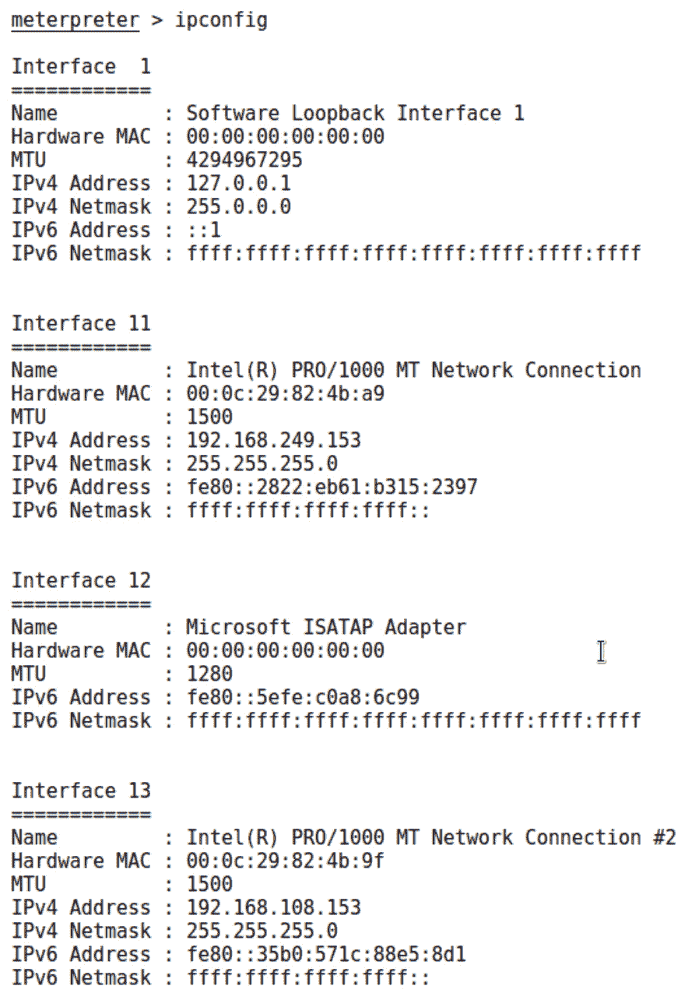

图 15.1 – Meterpreter 会话中的 ipconfig

看这个——一个`192.168.249.0/24`的网络，这个网络在我们的 Kali 机器上不可见。如果你阅读了本书的早期章节，你应该已经深深迷上了 ARP，所以让我们来了解一下这个网络。只需将 `arp` 命令传递给 Meterpreter：

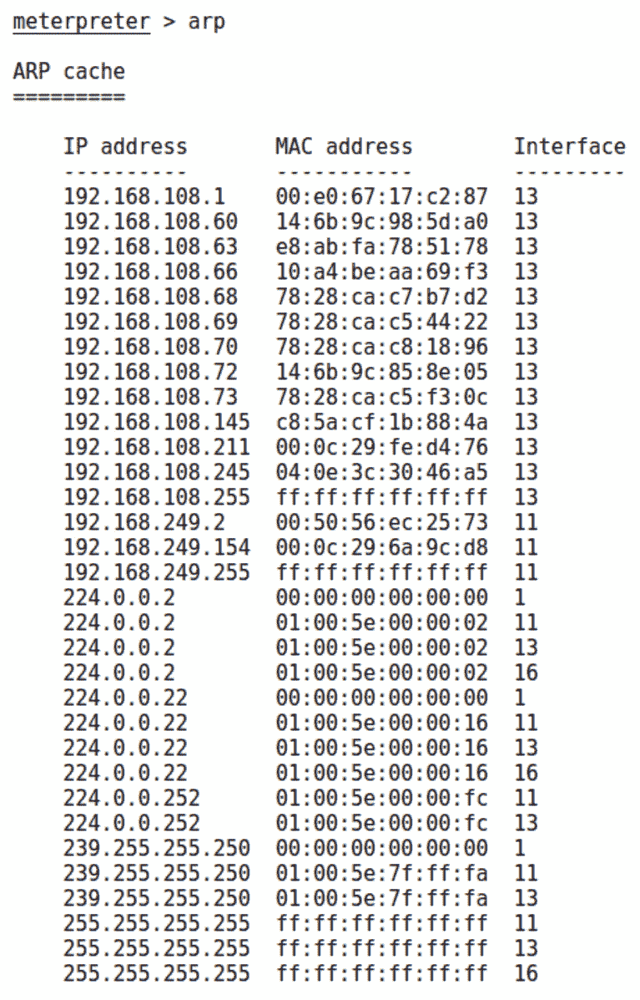

图 15.2 – Meterpreter 中的远程 ARP 表

从外围进行的主机枚举相当有效。这里发生的事情是，Meterpreter 直接提取了主机的 ARP 表，而不是将数据发送到网络中去寻找其他目标；我们使用我们的立足点作为二层间谍，将信息报告给我们。如果在我们立足点的广播域中有计算机并通过 ARP 回复宣布了自己的存在，我们就能在这里得到它的 IP 地址和 MAC 地址映射。

警惕 ARP 反间谍

请记住，这个结果是我们立足点*认为*正确的映射。如果存在 ARP 欺骗，您看到的就是被污染的表。

让我们在实验室中分析这个结果。由于这是一个 ARP 表，它将包括诸如多播和广播地址等内容——这些可以忽略。对我们来说有趣的是，隐藏网络中还有另一台主机——`192.168.249.154`。现在我们有了进一步渗透的线索。我们稍后再关注这个问题——首先，让我们从我们的立足点 PC 上获取一些战利品。在我们从主机跳跃到主机时，这些可能会派上用场。

## 使用 Meterpreter 进行取证分析 – 偷取已删除的文件

电子数据的等效方式就像是把整个文档扔进垃圾桶，而不是通过十字切割 shredder 处理：将文件从你的电脑中删除。大多数 IT 人员知道，当你在 Windows 中删除一个文件时，操作系统只是将那个空间标记为可用。这比实际删除所有内容要高效得多，但这也意味着旧数据可能非常顽固。有已知的技术可以恢复已删除的文件，还有很多免费的工具可以做到这一点。Metasploit 将这个功能转化为一个友好的掠夺模块。

当你在与 Meterpreter 会话交互时，如果想返回 Metasploit 控制台，可以使用`background`命令将会话置于后台。然后你可以使用`sessions`命令列出你的 Meterpreter 会话，并使用`-i`标志与其中一个会话交互。在我们的实验环境中，到目前为止我只有一个会话，但在实际操作中，你可能有多个会话。这些模块可以像普通的利用程序一样从控制台设置，或者可以从 Meterpreter 内通过`run`命令调用——这绝对是一个很棒的功能，特别适合那些你已经完全知道自己想做什么的时刻。不过，在实际操作中，我们常常需要回顾 Metasploit 为我们提供了哪些模块以及它们提供了哪些选项。那么，让我们将会话置于后台，并尝试搜索我们需要的内容：一些取证工作。输入`search type:post forensics`并按*Enter*：

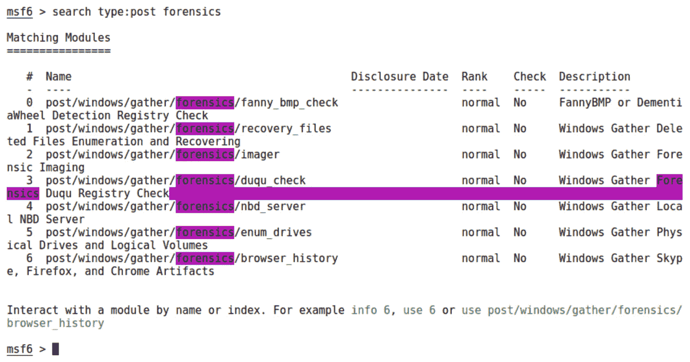

图 15.3 – 搜索取证模块

`search`命令可以帮助我们将搜索范围缩小到特定的模块类型，而取证模块属于 post 模块的一部分。在设置了`type`参数后，我们只需提供搜索词`forensics`。我们想尝试一些已删除文件的枚举和恢复，因此让我们使用`post/windows/gather/forensics/recovery_files`，它在索引位置 1，使用`use 1`：

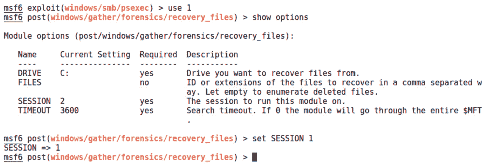

图 15.4 – 配置已删除文件恢复模块

你可以为`TIMEOUT`设置任何你喜欢的时间；默认是一个小时。如果你设置为`0`，那么它将一直运行，直到找到所有它能找到的内容。当然，这可能需要很长时间。输入`run`来开始：

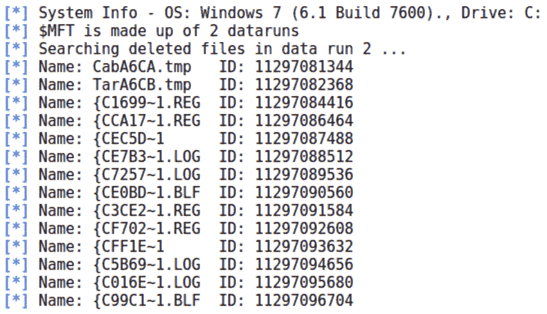

图 15.5 – 已删除文件及其唯一 ID

如果你没有指定文件扩展名，模块将只会查找所有已删除的文件。请注意，每个文件都会获得一个唯一的 ID。模块中的`FILES=`选项可以用来指定扩展名或通过 ID 选择单个文件。我已经找到了一个我想恢复的文件，所以我再次运行命令，并在`FILES`参数中输入文件 ID：

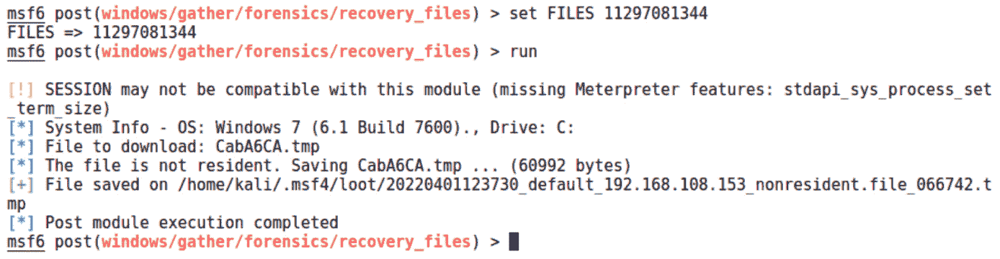

图 15.6 – 恢复已删除文件

扫描器再次运行该文件，匹配 ID，并将其丢进我的战利品袋里。在向高管展示一个包含机密数据的删除文档时，这将是你退出会议时的强有力声明。

## Internet Explorer 枚举 – 发现内部 web 资源

我知道，我知道 – Internet Explorer？真的？虽然如今 Chrome 和 Firefox 都很流行，但你会惊讶地发现，Internet Explorer 在企业中的作用仍然不可忽视。没错，我特意提到的是 Internet Explorer 而不是 Edge。

企业通常在服务器和设备上运行应用程序，这些应用程序的管理员控制台通常通过浏览器访问。为什么它们很少为新浏览器进行优化？我不能确定；这取决于供应商。但认识到 Internet Explorer 的作用是很重要的。获取 Internet Explorer 历史记录、Cookies 和存储的凭据将使你能够枚举重要的内部资源，并为未来对它们的攻击提供信息。如果你获取了一些凭据，甚至可能能够登录。当你进行这些操作时，确保利用你在立足点处或更远处的位置 —— 这样，应用程序将看到来自熟悉客户端的登录。

在这种情况下，枚举也非常简单，没什么选项需要担心。只需在 Meterpreter 会话中执行 `run post/windows/gather/enum_ie`：

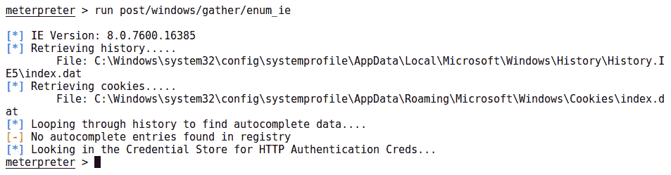

图 15.7 – 从 Internet Explorer 中抢夺资源

尽管 IE 死死地坚持着，但你仍然可以从目标中抢夺现代浏览器的资源 —— `post/windows/gather/forensics/browser_history` 模块会寻找 Skype、Firefox 和 Chrome 的痕迹。

现在我们已经翻遍了我们的立足点系统的口袋，接下来让我们开始看看如何迈出下一步。

# 使用 Metasploit 进行网络跳跃

让我们回到章节的开始，回顾我们找到的那台双网卡 Windows 7 机器，看看一个现实世界中的立足点和跳跃场景。我们有有效的凭据，尽管我们只是从另一台机器上提取了密码哈希值。我们将通过 `psexec` 漏洞将其传递给目标。别担心，我们稍后会详细讨论 `pass-the-hash`（**PtH**）攻击。目前，让我们先获取立足点：

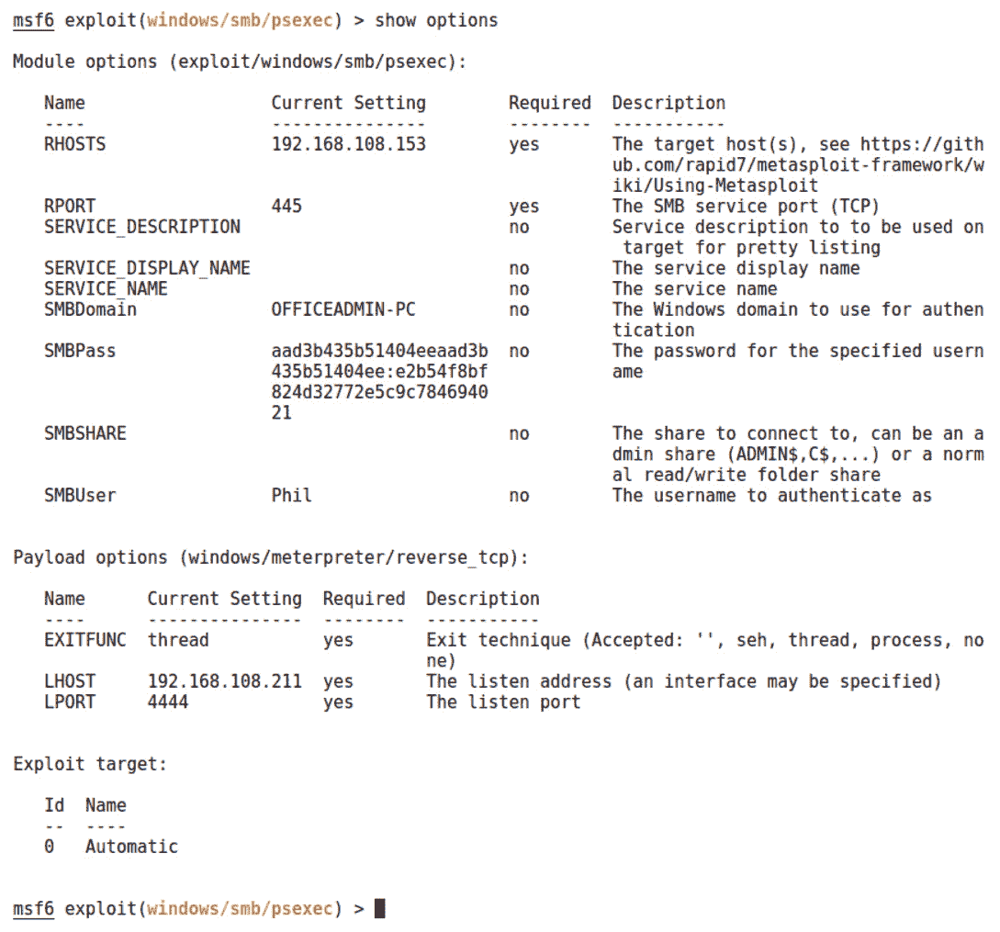

图 15.8 – 配置带有捕获哈希值的 psexec 模块

我们的目标是 `192.168.108.153`，所以我们使用 `set RHOSTS 192.168.108.153` 配置目标。我们使用 `set SMBPass` 配置捕获的凭据，同时配置 `set SMBUser`。然后，通过 `run` 发起攻击：

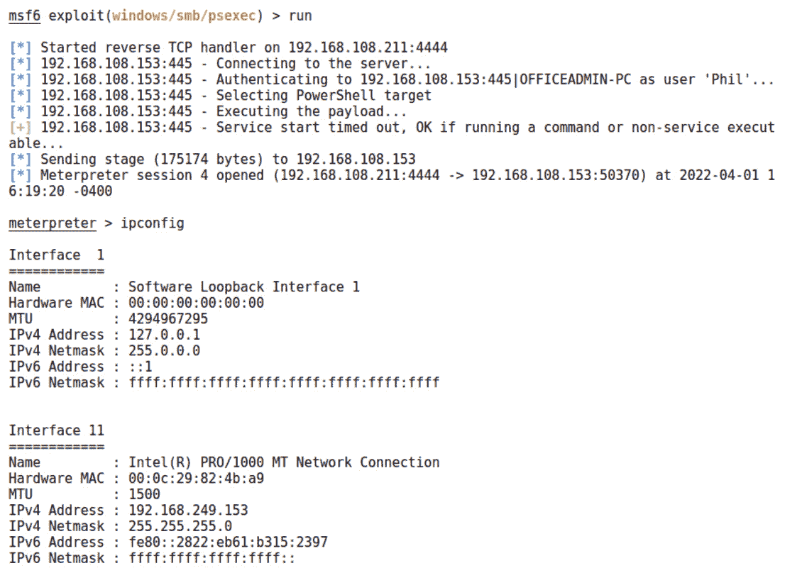

图 15.9 – 在目标上运行 ipconfig 以查找额外的网络

随着我们的 Meterpreter 会话建立，魔法般的火花飞舞在空中。我做的第一件事是执行`ipconfig`，查看在链路层上可以看到哪些其他主机。立刻，我们可以看到一个额外的接口被分配了 IP 地址`192.168.249.153`，子网掩码为`255.255.255.0`。 bingo！我们已经攻陷了一台双网卡主机。

## 简单回顾一下子网划分

记住，IPv4 地址是 32 位长，分成四组，每组 8 位。使用 CIDR 表示法时，IP 地址后面跟着一个斜杠和一个数字，表示用于表示网络部分的位数；剩余的位数则分配给主机。因此，你总是可以从 32 中减去 CIDR 表示法结尾的数字，得到主机分配所需的位数。让我们来看几个例子。

`192.168.105.0/24`表示前 24 位标识网络。为了理解这一点，我们来看一下`192.168.105.0`的二进制形式：

```
11000000.10101000.01101001.00000000
```

在分配这个子网中的地址时，我们只需改变最后 8 位，最高值`11111111`为该子网的广播地址：

```
11000000.10101000.01101001.00000000
```

```
          Network           Hosts
```

从 CIDR 表示法计算子网掩码及其反向转换非常简单——将网络部分的位设置为全 1，主机部分的位设置为全 0。然后，将该值转换为 IP 地址，这就是你的子网掩码：

```
11111111.11111111.11111111.00000000
```

```
   255     255      255       0
```

这里有一个例子，`10.14.140.0/19`：

```
11111111.11111111.11100000.00000000
```

```
   255     255      224       0
```

现在我们已经掌握了网络基础知识，接下来看看如何在我们发现的网络中构建路由，以便进行更深层次的枚举。

## 使用 autoroute 将 Metasploit 引入隐藏网络

在 Meterpreter 提示符下，输入`run post/multi/manage/autoroute`命令。你将看到主机的路由表被自动分析：

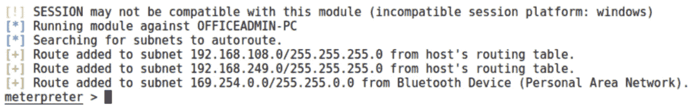

图 15.10 – 在 Meterpreter 会话中使用 autoroute

这为隐藏子网创建了一条路由，由我们控制的 Meterpreter 会话管理（我们称之为枢纽点）：

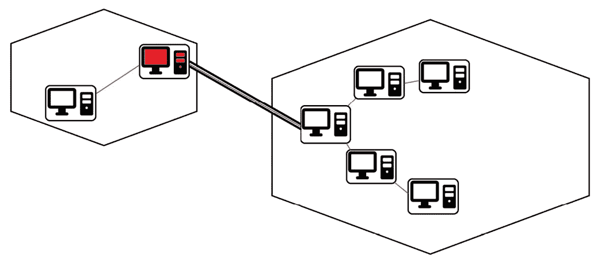

图 15.11 – 枢纽的可视化表示

输出结果有些平淡——但请记住，那个子网现在对于 Metasploit 来说就像你在局域网内一样。为了验证这个理论，我将尝试在隐藏网络中寻找 FTP 服务器。我使用`background`命令将 Meterpreter 会话放入后台，并跳转到辅助模块，使用`use auxiliary/scanner/portscan/tcp`来获取本地端口扫描器：

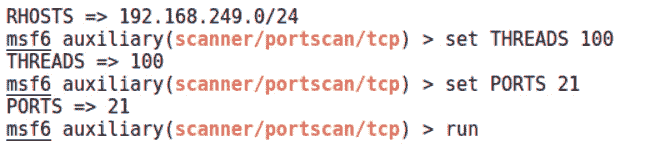

图 15.12 – 通过我们的路由进行端口扫描

请注意，`RHOSTS` 可以使用子网，因此我设置了隐藏网络为 `set RHOSTS 10.0.0.0/24`。多线程可以加速扫描，但也可能压垮网络和/或产生大量噪音，因此在配置 `set THREADS` 时要小心。（提示：我不会在生产网络上使用 `set THREADS 100`，尤其是在千兆网络中。）当然，我只是寻找 FTP 服务，所以我配置了 `set PORTS 21`，但你也可以通过逗号添加更多端口或提供端口范围。这是一个辅助模块，所以我们用 `run` 来启动它：

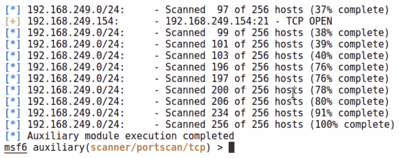

图 15.13 – 通过我们新配置的路由完成端口扫描

我们在 `192.168.249.154` 上发现了端口 `21` 开放。请记住，你无法从 Kali 机器上看到这个主机；这个响应来自于在我们的 Windows 7 架设的跳板点上运行的 Meterpreter，它将流量路由到目标网络。这很不错，但有一件事还缺少——就是能够在 Metasploit 框架之外使用我们最喜爱的 Kali 工具，包括我们辛辛苦苦编写的 Python 脚本。我们需要的是端口转发机制。别担心，Meterpreter 听到了你的呼声。

让我们回到已建立的会话，使用 `sessions -i 4`。`-i` 标志表示 *交互*，数字 `4` 指定了会话编号。当你深入某个网络时，可能会有一打 Meterpreter 会话在运行——这时，`sessions` 就是你的好帮手。不管怎样，让我们回到我们这唯一的会话，执行 `portfwd -h`：

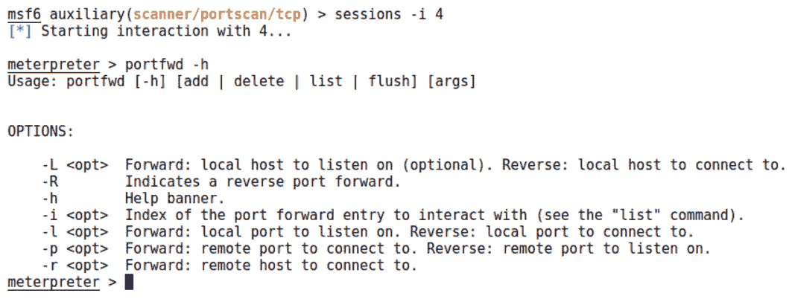

图 15.14 – 配置 portfwd

让我们按逻辑顺序仔细看一下这些选项，而不是按它们出现的顺序：

+   `-R` 是反向端口转发。我知道，我知道：*怎么会有反向还可以转发？* 这只是指定了建立路由时所采取的方向。为什么我们需要这个呢？在跳板场景中理解端口转发的简单方式是，你，作为攻击者，想要通过你的跳板点访问目标上的某个服务。然而，回想一下我们之前在自己的机器上托管有效载荷时的情况。我们可能希望将目标的请求通过跳板点转发给我们。这就是反向端口转发。

+   `-L` 指定了本地主机。除非在两种场景下，否则它是可选的——你在做反向端口转发，或者你的本地接口有多个地址且你需要流量通过特定的接口传递。请注意，如果你设置了这个选项，连接通过端口转发时必须使用此处指定的地址。

+   `-l` 指定了本地监听的端口。你将会把工具指向本地主机和此处指定的端口，以便通过目标端口访问目标。

+   `-i` 给你的端口转发路由分配一个*索引*。你难道认为我们一次只能有一个路由吗？我们可以对多个主机和端口进行多次端口转发。你会需要这些索引来跟上进度。

+   `-p` 是我们转发流量的远程端口。如果你正在利用反向端口转发，这里可能会有些混淆：该选项是要监听的远程端口。例如，一个有效负载可以配置为连接到端口`9000`的枢纽点。

+   `-r` 简单地是远程 IP 地址。

我使用`portfwd add -L 192.168.108.211 -l 1066 -p 21 -r 192.168.249.154`命令创建了中继。这告诉 Meterpreter 在端口`1066`上建立一个本地监听器，并将任何请求转发到端口`21`的目标上。简而言之，地址`192.168.108.211:1066`刚刚变成了`192.168.249.154:21`。Meterpreter 将确认设置：

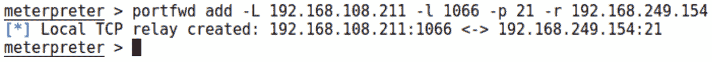

图 15.15 – 新的端口转发中继已经运行

继续指向这个代理的工具。为了确认访问权限，我尝试用 netcat 连接到本地监听器：

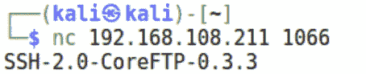

图 15.16 – 与枢纽点背后的服务交流

在这里，我们正在与我们的 Kali 框看不见的另一个子网上运行的服务进行交流。如果你刚刚完成了前一章节，那么你将会认出在这里运行的 FTP 服务是我们刚刚学会如何妥协的一个易受攻击的服务。通过你的立足点和建立的枢纽点，你现在已经有了一条通向目标网络中更深处的机器上交付 shellcode 的铺好的道路。

理解这个端口转发链末端的 FTP 服务器上的重要提示`portfwd`。查看我们运行 netstat 时 FTP 服务器上的情况：


图 15.17 – 在目标 FTP 服务器上运行 netstat

那是你 Kali 框的 IP 地址吗？当然不是 – 那是我们已经妥协的 Meterpreter 主机。因此，我们可以利用信任关系绕过防火墙使用这种方法。既然我们到了这里，现在是时候利用这些新通道来进行一些进一步的攻击了。

# 升级你的枢纽 – 将攻击传递下去

让我给你描述一个场景。你已经从限制网络内部建立了立足点，成功接入了一台面向内部`192.168.249.0/24`网络的 Windows 7 企业版机器。你无法从当前位置看到该网络，因此你使用 Meterpreter 会话，通过 Windows 7 的转发点建立了路由。经过进一步侦察，你确认`192.168.249.128`正在运行 FTP 服务。然而，你无法从转发点连接到它。观察局域网后，你发现`192.168.249.128`和`192.168.249.130`之间有流量传输，因此你怀疑这两台主机之间存在信任关系。你还经常看到 Windows 用户`Phil`，所以这可能是一个管理员账户，或者是用于设置这些主机的共享本地账户。

我已经尝试通过`192.168.249.128:21`使用`portfwd`进行转发，并尝试使用 Windows 7 的 FTP 客户端连接，但没有成功。有一个防火墙阻止了我们的流量。看起来从`192.168.249.130`进行尝试可能更有机会，但该主机位于隐藏网络中。这意味着我们需要利用我们的转发点来攻破我们当前立足点之外的主机。让我们来看看如何利用我们目前获取的信息进一步提升权限。

## 使用你捕获到的资源

在渗透测试中，你偶尔会做一些即兴的魔法。大多数时候，你会依赖简单且经过验证的方法，在企业中以小步伐向前推进。一个常见的技巧是重复使用你发现的凭证。我不在乎我是在某人键盘下找到密码（是的，有人还会这么做），还是在旁观某人登录银行出纳系统时看到密码——我总是知道这个密码会让我惊讶它能让我进入什么。让我给你讲几个实战故事来说明我的意思：

+   曾经我在一次金融机构的评估中成功获得了域管理员权限。我提取了域中的所有哈希值，准备离线破解。我恢复的其中一个明文密码是`BESAdmin`账户的密码，这个账户与 BlackBerry Enterprise 相关。几周后，我来到一个完全不同的客户那里，但在评估过程中我注意到，他们的 IT 服务承包商与前一个客户使用的公司是同一家。我也在那里找到了`BESAdmin`账户。当我来到第三个使用同一承包商的客户时，我又发现了另一个`BESAdmin`账户，我尝试用恢复的密码登录，结果——成功了。一个通用密码的便利性让我能够有效地攻破使用该承包商的数十家公司中的域管理员账户。

+   我曾在一家管理付费停车场结构的公司客户现场工作。在这些结构的入口处，有一台小型机器可以接受信用卡并打印票据和收据。所有这些 XP 嵌入式机器（总计约 100 台）每 5 分钟与一个 Microsoft SQL 数据库进行一次检查。你猜怎么着——它们使用具有特权的域账户进行身份验证。我能够降低身份验证等级，从而让破解工作仅用了 45 秒。这个密码不仅让我进入了数据库和所有的支付机器，还让我进入了域外的其他一些系统。

这两种情况都展示了一些不太安全的做法，但有趣的是，当我向 IT 人员展示我的发现时，大多数时候他们已经意识到这些做法的含义！他们觉得被过时的配置和顽固的管理困住了。我曾有 IT 管理员把我拉到一边，感谢我给了他们部署他们一直请求的防御层的弹药。我认为密码攻击非常重要，因为它们能为客户提供的整体价值非常大。

让我们回到我们的场景并描绘一个类似的攻击。我们将利用我们的支点凭证更深入地渗透到网络中。然而，这次我们没有时间破解密码。我们如何在不破解密码的情况下使用它？

## 别再拖延了，使用 Pass-the-Hash——利用 Windows 中的密码等价物

请记住，Windows 密码是特殊的（这次不是夸奖），因为它们没有加盐。如果我的密码是`Phil`，那么你找到的 NTLM 哈希值将始终是`2D281E7302DD11AA5E9B5D9CB1D6704A`。Windows 从不以任何可读的形式存储或传输密码；它只验证哈希值。这就有了一个明显的后果，它被`Pass-the-Hash`（**PtH**）攻击所利用。

为什么 Microsoft 决定不使用加盐？Microsoft 表示，由于其他安全措施的存在，加盐并不必要，但我想不出有哪个安全专家会同意这个说法。真正的原因可能与 Windows 设计中的那些反复出现的主题有关：向后兼容性和互操作性。盐值几乎就像是每个密码都有一个额外的密码，因此系统需要有安全交换这些数据的机制。这是一项艰巨的任务，但值得去做吗？加盐被认为是密码安全的最低防御层，而不是万灵药。

请查看以下账户名和 NTLM 哈希值。这些哈希值没有强大资源的话很难破解（祝你好运，读者！），所以知道实际密码并不是一个选项。我们可以从这些账户中知道什么？我们能推断出它们与其他账户的关系吗？

+   `Administrator**: **5723BB80AB0FB9E9A477C4C090C05983`

+   `user**: **3D477F4EAA3D384F823E036E0B236343`

+   `updater**: **C4C537BADA97B2D64F82DBDC68804561`

+   `Jim-Bob**: **5723BB80AB0FB9E9A477C4C090C05983`

+   `Guest`：`45D4E70573820A932CF1CAC1BE2866C2`

+   `Exchange`：`7194830BD866352FD9EB0633B781A810`

是的，鹰眼，`Administrator`密码与`Jim-Bob`密码完全相同。使用加盐哈希，我们无法仅凭一瞥就知道这个事实；但在 Windows 世界中，经过短短一刻的审查，我们知道`Jim-Bob`在他的个人账户和`Administrator`账户上使用相同的密码。因此，我们可以推断`Jim-Bob`是管理员。如果我们无法破解哈希值，这对我们有什么帮助呢？嗯，首先，现在我们知道，针对`Jim-Bob`进行其他密码攻击，如钓鱼或键盘记录，有很大机会获取至高无上的`Administrator`账户。让我们回到未加盐哈希的另一个后果：在 Windows 中，裸哈希是一个密码等效物，这意味着将哈希传递给认证机制与输入密码是完全相同的。

返回到您的 Meterpreter 会话，并确认您正在以`SYSTEM`身份运行；如果没有，请使用`getsystem`进行提权。接下来，我们将使用`hashdump`执行我们内置的哈希转储模块：

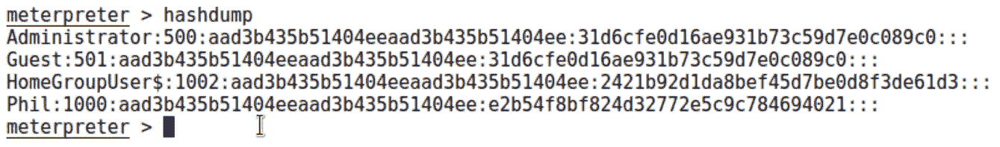

图 15.18 – 在 Meterpreter 会话中使用 hashdump

要获得对 Windows 的所有未经检查的访问权限，您需要以`SYSTEM`身份运行。`getsystem`是一个出色的提权模块，将尝试一些不同的经典技巧，如命名管道模拟和令牌克隆。我们将在*第十六章*中详细介绍这些内容，*提权*。

`hashdump`模块会完成大部分工作，并将找到的所有内容整理得井井有条。我们将继续使用`psexec`来传递哈希。使用`background`命令将 Meterpreter 会话后台化，以便我们可以配置`psexec`模块。发出`use exploit/windows/smb/psexec`命令以获取模块，然后运行`show options`。

现在，这里有两件事需要考虑：我们的`RHOST`和 Meterpreter 载荷类型。请记住，我们的目标`192.168.249.130`从我们的 Kali 系统中是不可见的，但我们已经通过`autoroute`模块建立了到目标子网的路由。Metasploit 将自动通过我们的枢纽点路由此攻击！也正因如此，我们将使用`bind_tcp`而不是连接回来，因为我们的 Kali 系统对目标不可见。

对于`set SMBPass`，请使用`hashdump`中的`LM:NTLM`格式。顺便说一句，您可以混合使用；例如，我们可以从前面示例中的`Jim-Bob`账户中获取哈希值，但将`SMBUser`设置为`Administrator`。这将简单地尝试将`Jim-Bob`的未知密码与`Administrator`账户匹配。在我们的情况下，我们正在尝试使用`Phil`账户。最后，使用`exploit`来执行：

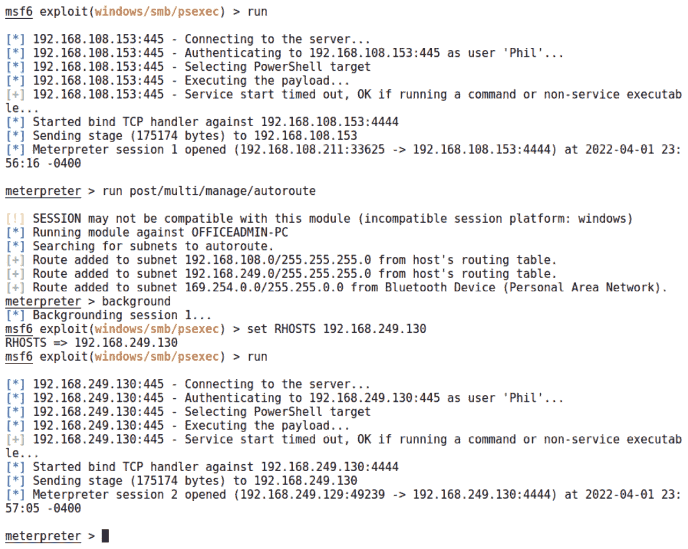

图 15.19 – 绕过足迹获取哈希值

现在我们有了两个精致的 Meterpreter 会话——会话 1 是通过我们的立足点进入隐藏网络，会话 2 是与我们怀疑与 FTP 服务器有信任关系的主机建立的。当您在实验室中进行测试时，可能习惯于只有一个 Meterpreter 会话；当您利用 Metasploit 的力量进行枢纽攻击时，请做好组织多个会话的准备。

让我们再次尝试老式的`portfwd`。通过在我们的*第二个* Meterpreter 会话中建立它，流量实际上将来自受信主机：

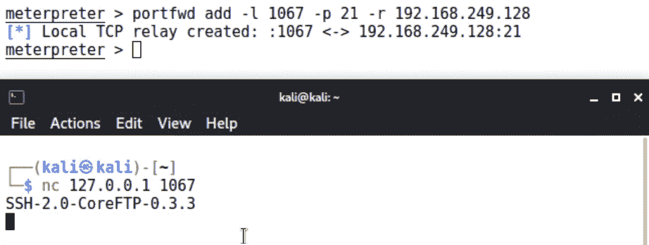

图 15.20 – 通过被攻陷的受信主机进行的 netcat 会话

就是这样——我们通过攻陷受信主机绕过了严格的防火墙。直接从我们的机器绕过控制并不难，只要留下一些证据指向会议室前门附近网络端口的 IP 地址即可。另一个完全不同的事情是，当源头是防火墙内的受信主机时，这意味着完全不同的潜力。想象一下，在我们逐步渗透时，如何将目标串联起来。

# 总结

本章介绍了在我们建立立足点后可以使用的一些选项。我们涵盖了初步的侦察和枚举，使我们能够从立足点跳转到网络的安全区域，包括在攻破双网卡主机后发现隐藏的网络，进行 ARP 扫描隐藏网络，以及收集敏感和已删除的数据。从那里，我们通过设置进入隐藏网络的路由并启用端口转发，使我们能够使用 Kali 工具与隐藏网络中的主机进行交互，进一步增强了对枢纽概念的理解。最后，我们通过利用枢纽主机上的凭证，攻破了防火墙内的计算机。

在下一章中，我们将探讨特权提升的强大功能：将我们微不足道的立足点转变为特权级的攻破，从而获得对关键资源的访问权限。结合本章的知识，您将为在目标环境中进行复杂的渗透做好准备。

# 问题

请回答以下问题，以检查您对本章内容的理解：

1.  我刚刚与一台双网卡主机建立了 Meterpreter 会话，因此我配置并执行了`portscan`模块来搜索另一网络中的主机。我对扫描的状态感到好奇，于是我在我的机器上打开了 Wireshark。但没有看到任何扫描流量。怎么回事？

1.  我刚刚在 Meterpreter 中发出了以下命令，但没有任何反应：`execute -f ipconfig`。为什么没有看到 `ipconfig` 的输出？

1.  在 Meterpreter 中运行模块时，我不需要指定 ________，因为该命令仅发送到该系统。

1.  对 Meterpreter ARP 扫描的深度数据包分析将揭示我们攻击的 Kali 主机的 IP 地址。（正确 | 错误）

1.  在进行 Meterpreter 端口扫描时，使用较少的线程可以减少我们的流量触发 IDS 的风险。（正确 | 错误）

1.  在配置 PtH 攻击时，必须指定盐值。（正确 | 错误）

1.  我的 PtH 攻击有效，因为我看到了一个新的 Meterpreter 会话；然而，大约 2 秒后它就死掉了。我能做些什么来保持会话存活？

# 进一步阅读

要了解本章中涉及的主题的更多信息，请查看以下资源：

+   关于 PtH 攻击的 Microsoft TechNet 演讲和讨论（[`technet.microsoft.com/en-us/dn785092.aspx`](https://technet.microsoft.com/en-us/dn785092.aspx))
