# 一、了解 Wireshark

自从 Gerald Combs 于 1997 年创建 Wireshark(最初称为 Ethereal)来解决一家小 ISP 的网络问题以来，它已经成为最流行的网络和应用协议包级分析工具之一。这主要是因为它是一个开源解决方案，使任何技术专业人员都可以免费使用它，以及它广泛的功能，覆盖 1000 多种协议，以及全球 800 多名开发人员的贡献所带来的持续支持和改进。

在深入了解更多细节和支持概念之前，本章介绍将 Wireshark 安装到您的系统上，并使用它做一些有趣和有用的事情，从而帮助您快速精通 Wireshark。

在本章中，我们将讨论以下主题:

*   安装 Wireshark
*   执行数据包捕获
*   Wireshark 用户界面基础
*   使用显示过滤器隔离感兴趣的流量
*   保存过滤后的数据包跟踪文件

接下来的章节将建立在这些基本功能的基础上，并为其提供支持概念，使您能够发展最适合您的技术角色和目标的 Wireshark 技能。

# 安装 Wireshark

wireshark 可以安装在运行 32 位和 64 位 Windows (XP、Win7、Win8.1 等)、Mac OS X (10.5 及更高版本)和大多数 Linux/Unix 版本的机器上。在 Windows 和 Mac 计算机上的安装既快速又简单，因为安装程序可从 Wireshark 网站下载页面获得。Wireshark 是许多 Linux 发行版上提供的标准软件包，Wireshark 下载页面上提供了一个第三方安装程序的链接列表，适用于各种流行的*nix 平台。或者，如果没有预编译的安装包，您可以下载源代码并为您的环境编译 Wireshark。

Wireshark 依靠 WinPcap (Windows)或 libpcap (Linux/Unix/Mac)库来提供数据包捕获和捕获过滤功能；在 Wireshark 安装过程中会安装适当的库。

### 注意

您可能需要管理员(Windows)或 root (Linux/Unix/Mac)权限才能在工作站上安装 Wireshark 和 WinPcap/libpcap 实用工具。

假设你正在 Windows 或 Mac 机器上安装 Wireshark，你需要进入 Wireshark 网站([https://www.wireshark.org/](https://www.wireshark.org/))并点击页面顶部的**下载**按钮。这会将您带到下载页面，同时尝试从浏览器信息中自动发现您的操作系统类型和版本。大多数情况下，适用于您机器的 Wireshark 安装包会突出显示，您只需单击突出显示的链接即可下载正确的安装程序。

### 注意

如果您已经安装了 Wireshark，当您启动 Wireshark 时，自动更新功能会通知您可用的版本更新。

## 在 Windows 上安装 Wireshark

在之后的截图中，Wireshark 下载页面已经确定 64 位 Windows installer 适用于该 Windows 工作站:

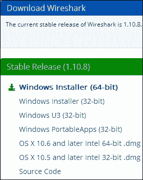

点击突出显示的链接下载一个`Wireshark-win64-1.10.8.exe`文件或类似的可执行文件，您可以将其保存在硬盘上。双击可执行文件上的开始安装过程。您需要遵循以下步骤:

1.  同意**许可协议**。
2.  对于每个提示，通过点击下一个的**来接受所有的默认设置，包括安装 WinPcap 的提示，这是一个从您工作站上的 **网络接口卡** ( **NIC** )捕获数据包所需的库。**
3.  在 Wireshark 安装的早期，该过程会暂停并提示您在单独的窗口中点击**安装**和几个**下一步**按钮来安装 WinPcap。
4.  WinPcap 安装完成后，点击剩余的**下一个**提示以完成 Wireshark 安装。【T2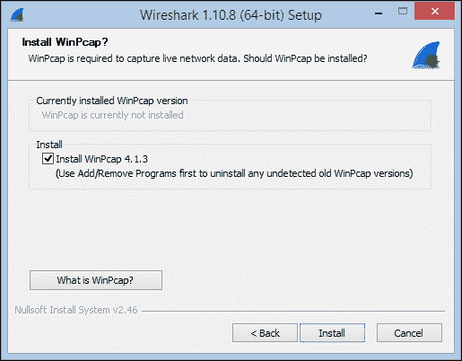

## 在 Mac OS X 上安装 Wireshark

在 Mac 上安装 Wireshark 的过程与在 Windows 上安装 Wireshark 的过程相同，除了不会提示安装 WinPcaplibpcap 是用于 Mac 和*nix 机器的数据包捕获库，它会被安装(没有提示)。

但是，在 Mac 安装中可能需要满足两个附加要求:

*   首先是安装 X11，一个窗口系统库。如果您的系统需要这样做，您会得到通知，并提供一个链接，最终将您带到 XQuartz 项目下载页面，这样您就可以安装这个包。
*   可能出现的第二个要求是，如果在启动 Wireshark 时，您被告知没有可以进行捕获的接口。这是一个关于 **Berkeley 包过滤** ( **BPF** )的权限问题，可以通过打开终端窗口并键入以下命令来解决:

    ```
    bash-3.2$ sudo chmod 644 /dev/bpf*

    ```

如果每次启动 Wireshark 时都需要重复这一过程，您可以执行 web 搜索，为您的环境寻找更永久的权限解决方案。

## 在 Linux/Unix 上安装 Wireshark

在 Linux 或 Unix 平台上安装 Wireshark 的要求和流程可能会因特定环境的不同而有很大差异。默认情况下，Wireshark 通常可以通过特定 Linux 发行版的软件包管理系统获得。在 Linux 上安装 Wireshark 的指南可以在[第 2 章](ch02.html "Chapter 2. Networking for Packet Analysts")、*数据包分析者网络*中找到，或者在位于[www . Wireshark . org/docs/wsug _ html _ chunked/chapterbuildinstall . html](http://www.wireshark.org/docs/wsug_html_chunked/ChapterBuildInstall.html)的 Wireshark 用户文档中找到。

# 执行您的第一次数据包捕获

当您第一次启动 Wireshark 时，您会看到一个初始的**起始页**，如下图所示:

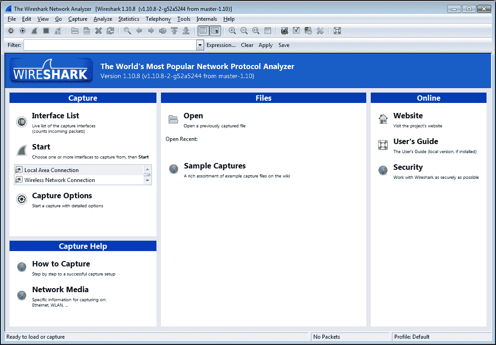

不要太喜欢这个屏幕。虽然您每次启动 Wireshark 时都会看到这种情况，但一旦您执行捕获、打开跟踪文件或在 Wireshark 中执行任何其他功能，此屏幕将会被标准的 Wireshark 用户界面所取代，您在下次启动 Wireshark 之前不会再看到它。所以，我们不会在这里花太多时间。

## 选择网络接口

如果您的机器上有个网络接口，您可能不确定选择哪个来捕获数据包，但是有一个相当简单的方法来解决这个问题。在 Wireshark 起始页上，点击**接口列表**(或者，从**捕获**菜单中点击**接口**，或者点击图标栏上的第一个图标)。

打开的**Wireshark Capture Interfaces**窗口提供了您机器上所有网络接口的列表和描述、分配给每个接口的 IP 地址(如果已经分配了地址)以及一些计数器，例如自该窗口打开以来接口上看到的数据包总数和每秒数据包数(packets/s)计数器。如果一个接口分配了 IPv6 地址(可能以`fe80::`开头，包含多个冒号),并且正在显示，您可以单击 IPv6 地址，它将切换显示 IPv4 地址。如下图所示:

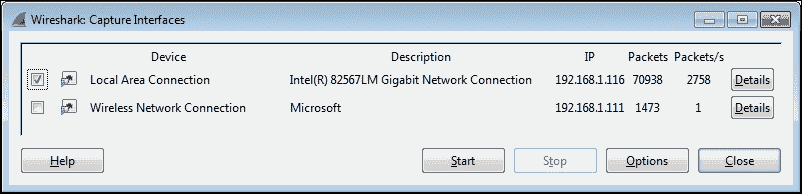

### 注意

在 Linux/Unix/Mac 平台上，您可能还会看到一个环回接口，可以选择它来捕获在同一台机器上的应用之间发送的数据包。然而，在大多数情况下，您只会对从网络接口捕获数据包感兴趣。

目标是在您打开浏览器并导航到网站时，识别将用于与互联网通信的活动界面。如果您有一个有线局域网连接，并且该接口已启用，则该接口可能是活动接口，但您也可能有一个已启用的无线接口，并且您可能是也可能不是主接口。活动网络接口的最可靠的指示符是它将具有更大数量的稳定增加的分组以及相应的活动分组数量(这将随时间变化)。另一个可能的指标是某个接口是否分配了 IP 地址，而其他接口则没有。如果您仍然不确定，请打开浏览器窗口，导航到您最喜欢的网站之一，观察数据包和数据包/秒计数器，找出显示活动增加最多的接口。

## 执行数据包捕获

一旦确定了正确的接口，选择该接口左侧的复选框并点击**捕获接口**窗口底部的**开始**按钮。Wireshark 将开始捕获可以从该接口看到的所有数据包，包括发送到您的工作站和从您的工作站接收的数据包。你会在屏幕的顶部(称为**数据包列表**窗格)看到令人眼花缭乱的各种数据包；这很正常。如果您没有看到这一点，请尝试不同的界面。

在一个典型的网络中有如此多的背景流量，这有点令人惊讶，例如来自设备的广播包向其他设备通告它们的名称、地址和服务，并从其他设备请求它们想要与之通信的站的地址。此外，在后台运行的应用和服务会从您自己的工作站产生大量流量，而您并不知道它们会产生这么多噪音。Wireshark 的**数据包列表**窗格可能类似于下面的屏幕截图；然而，我们现在可以忽略这一切:

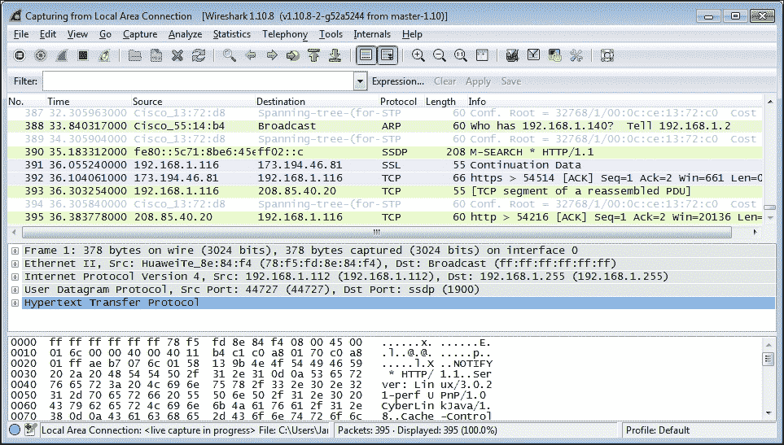

我们已经准备好产生一些我们有兴趣分析的流量。打开一个新的互联网浏览器窗口，在地址栏输入`www.wireshark.org`，按*进入*。

当[https://www.wireshark.org/](https://www.wireshark.org/)主页完成加载时，通过从**捕获**菜单中选择**停止**或点击**视图**和**转到**菜单标题之间的红色方形停止图标来停止 Wireshark 捕获。

## Wireshark 用户界面要点

一旦您完成了第一次捕获，您将看到正常的 Wireshark 用户界面主屏幕。因此，在我们进一步深入之前，快速介绍一下该用户界面的主要部分将会很有帮助，这样您就知道在我们继续分析过程时会提到什么。

默认 Wireshark 用户界面有八个重要部分或元素，如以下屏幕截图所示:

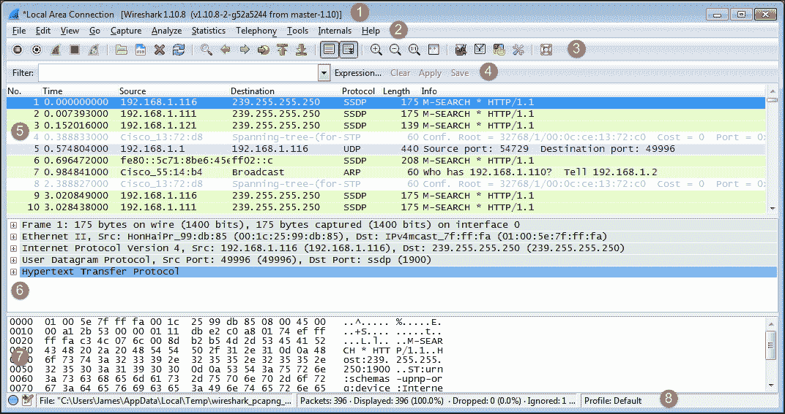

让我们详细看看八个重要部分:

*   **标题**:这个区域反映了正在捕获的接口或打开的数据包跟踪文件的文件名
*   **菜单**:此是 Wireshark 中主要功能和子功能的标准行
*   **主工具栏(图标)**:这些提供了一种快速访问最有用的 Wireshark 功能的方法，非常值得熟悉和使用
*   **显示过滤器工具栏**:此允许您快速创建、编辑、清除、应用和保存过滤器，以隔离感兴趣的数据包进行分析
*   **数据包列表窗格**:这个部分包含每个捕获数据包的摘要信息行，以及数据包编号和相对时间戳
*   **数据包详细信息窗格**:该部分提供了关于在数据包列表窗格中选择的单个数据包的信息的分层显示，该窗格被分为数据包中包含的各种协议的部分
*   **数据包字节窗格**:该部分以十六进制字节或位的形式显示所选数据包的内容，以及有用数据的 ASCII 显示
*   **状态栏**:此部分提供专家信息指示器、编辑捕获注释图标、跟踪文件路径名和大小信息、捕获和显示的数据包数量数据和其他信息，以及配置文件显示和选择部分

## 过滤掉噪音

在您的数据包捕获中的某个地方，加载 Wireshark 主页时会涉及到数据包——但是您如何在所有的背景噪音中找到并查看这些数据包呢？

最简单、最可靠的方法是确定 Wireshark 网站的 IP 地址，并使用显示过滤器过滤掉除该 IP 地址和您工作站的 IP 地址之间的数据包之外的所有数据包。最好的方法——也是您将来大多数捕获后分析工作的第一步可能使用的方法——是按 IP 地址和/或主机名调查所有会话的列表，按最活跃的节点排序，并从该列表中识别您的目标主机名、网站名称或 IP 地址。

在 Wireshark 菜单中，从**统计**菜单中选择**对话**，在打开的**对话**窗口中，选择顶部的 **IPv4** 选项卡。您将看到一个由**地址 A** 和**地址 B** 标识的网络对话列表，其中包含总共**个数据包**、**个字节**、**个数据包 A→B** 、**个字节 A→B** 、**个数据包 A←B** 和**个字节 A←B** 。

滚动到该窗口的右侧，有**相对开始**值。这些是在捕获中首次观察到每个特定对话的时间，相对于捕获开始的时间(秒)。下一列是**持续时间**，这是该对话在捕获中持续的时间(看到的第一个到最后一个数据包)。

最后，对于每个会话，在每个方向上都有以每秒**比特** ( **bps** ) 为单位的平均数据速率，这是该会话的网络影响。这些都显示在下面的截图中:

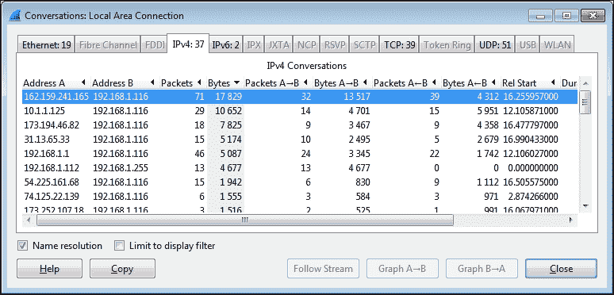

我们希望对列表中的对话进行排序，将最繁忙的对话——用网络行话来说，称为最会说话的人——排在列表的最前面。点击**字节**列标题，然后再次点击。您的列表应该类似于前面的截图，如果您没有收到大量其他后台流量流入/流出您的工作站，来自[https://www.wireshark.org/](https://www.wireshark.org/)的流量应该最大，因此位于列表的顶部。

在本例中，IP 地址**162.159.241.165**和 **192.168.1.116** 之间的会话具有最大的总流量，查看**字节 A- > B** 列，很明显大部分流量是从**162.159.241.165**地址到 **192.168.1.116** 地址。然而，在这一点上，我们如何知道这是否真的是我们想要的对话呢？

我们需要将列表中的 IP 地址解析为主机名或网站地址，这可以在 Wireshark 中完成，方法是打开**网络名称解析**，并尝试使用反向 DNS 查询(使用所谓的指针(PTR) DNS 记录类型)为这些 IP 地址解析主机名和/或网站地址。如果您刚刚安装或启动 Wireshark，默认情况下可能不会打开**名称解析**选项。

这通常是一件好事，因为 Wireshark 可以通过传输 DNS 查询来创建自己的流量，尝试解析它在捕获期间遇到的所有 IP 地址，并且您不希望在捕获期间发生这种情况。然而，**名称解析**选项对于在捕获完成后将 IP 地址解析为正确的主机名非常有帮助。

要启用**名称解析**，请导航至**视图** | **名称解析** | **启用网络层**(单击以打开复选标记)，并确保**使用外部网络名称解析器**也已启用。Wireshark 将尝试将捕获中的所有 IP 地址解析为其主机名或网站地址，解析后的名称将出现在数据包列表和**对话**窗口中(替换之前的 IP 地址)。

请注意，**对话**窗口底部的**名称解析**选项必须作为井启用(通常是默认的)，该设置影响解析的名称或 IP 地址是否出现在**对话**窗口中(如果在 Wireshark 主屏幕中启用了**名称解析**)，如下图所示:

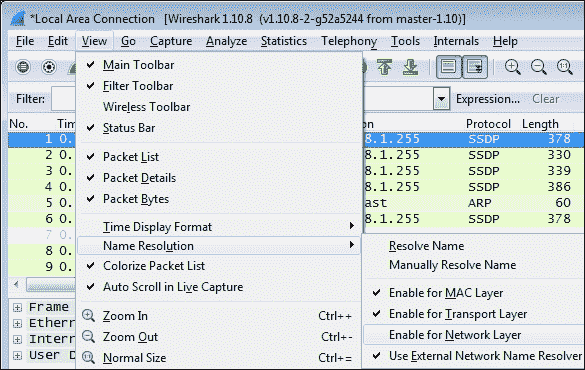

在这一点上，你应该在列表的顶部或顶部附近看到**wireshark.org**和你的工作站之间的对话对，如下面的截图所示。当然，你的工作站会有一个不同的名字或者可能只作为一个 IP 地址出现，但是识别到 wireshark.org**的对话已经实现了。**

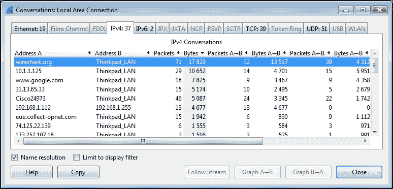

### 应用显示过滤器

你现在只想看到你的工作站和**wireshark.org**之间的对话，去掉所有无关的对话，这样你就可以专注于感兴趣的流量。这是通过创建只显示所需流量的过滤器来实现的。

右键单击包含**wireshark.org**条目的行，导航到**应用为过滤器** | **选定的** | **A < - > B** ，如以下截图所示:

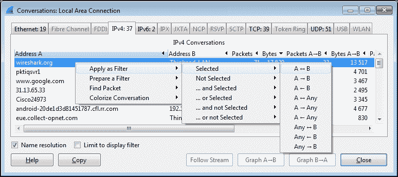

Wireshark 将创建并应用一个显示过滤字符串，将显示的流量仅隔离到**wireshark.org**的 IP 地址与您的工作站之间的对话，如下面的屏幕截图所示。请注意，如果您手动创建或编辑显示过滤器条目，您需要点击**应用**将过滤器应用到跟踪文件(或**清除**将其清除)。


这种特殊的显示过滤器语法适用于 IP 地址，而不适用于主机名，并且对每个节点使用一个`ip.addr==` (IP 地址等于)语法和`&&` (and)逻辑运算符来构建一个表示`display any packet that contains this IP address *and* that IP address`的字符串。这是您将在数据包分析中大量使用的显示过滤器类型。

当你在**数据包列表**窗格中上下滚动时，你会注意到除了你的工作站和 wireshark.org**之间的数据包之外，所有其他数据包都不见了。从严格意义上来说，它们并没有消失，它们只是被隐藏起来了——正如你可以通过检查**包号**栏所观察到的，在编号顺序上有缺口；那些是隐藏的包裹。**

## 保存数据包跟踪

现在您已经使用显示过滤器隔离了感兴趣的流量，您可以保存一个新的数据包跟踪文件，其中只包含过滤的数据包。

这有两个目的。首先，您可以关闭 Wireshark，稍后再回到它，打开过滤后的跟踪文件，从您的分析中停止的地方开始，并有一个捕获记录，以备您稍后需要引用它，例如在故障排除场景中。

其次，在 Wireshark 的各种屏幕和功能中，使用一个更小、更集中的跟踪文件(只包含您想要分析的数据包)会更容易、更快捷。

要创建仅包含过滤/显示数据包的新数据包跟踪文件，请从 Wireshark **文件**菜单中选择**导出指定数据包**。

您可以导航到和/或创建一个文件夹来保存 Wireshark 跟踪文件，然后输入要保存的跟踪文件的文件名。在本例中，文件名为`wireshark_website.pcapng`。默认情况下，Wireshark 将以`pcapng`格式保存跟踪文件(这是首选格式)。如果您没有用文件名指定文件扩展名，Wireshark 将根据选择的**另存为类型**提供适当的扩展名，如以下截图所示:

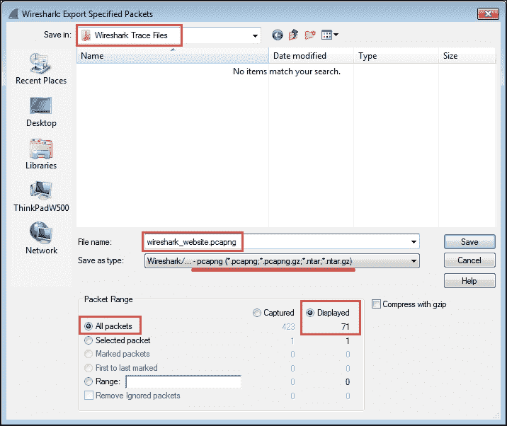

此外，默认情况下，Wireshark 会选择**所有数据包**选项，如果应用了显示过滤器(如本场景所示)，则会选择**显示的**选项，而不是**捕获的**选项，后者会保存所有数据包，而不管是否应用了过滤器。输入文件名并确认所有保存选择正确后，您可以点击 **Save** 保存新的数据包跟踪文件。

请注意，当您完成此跟踪文件保存活动时，Wireshark 仍然将捕获的所有原始数据包保存在内存中，并且仍然可以通过点击**显示过滤器工具栏**菜单中的**清除**来查看它们。如果您想进一步使用刚刚保存的新跟踪文件，您需要通过点击**文件**菜单中的**打开**来打开它(或**文件**菜单中的**打开最近的**)。

# 总结

恭喜你！如果您完成了本章中介绍的所有活动，那么您已经成功安装了 Wireshark，执行了数据包捕获，创建了一个过滤器来从所有外来干扰中隔离并显示您感兴趣的数据包，并创建了一个仅包含这些数据包的新数据包跟踪文件，以便您可以在以后对其进行分析。此外，在这个过程中，您初步熟悉了 Wireshark 用户界面，并学会了如何使用它的一些最有用和最强大的功能。对于第一章来说还不错。

在下一章中，我们将回顾一些必要的网络概念，为执行包级分析提供坚实的基础。下一章的主要目标是帮助你开发一个网络的心智模型，它很好地适用于包级分析，而不会在不必要的细节上纠缠不清。